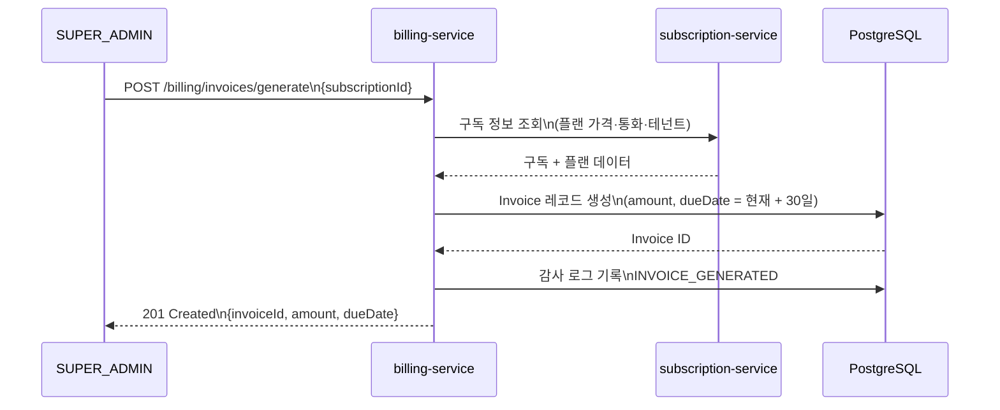
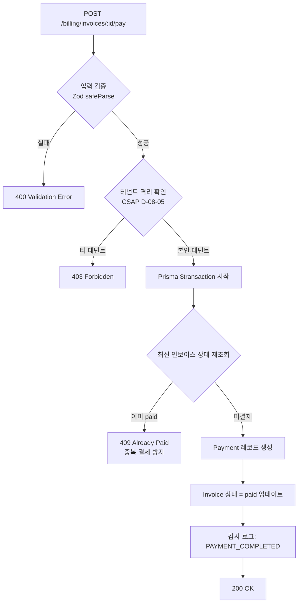
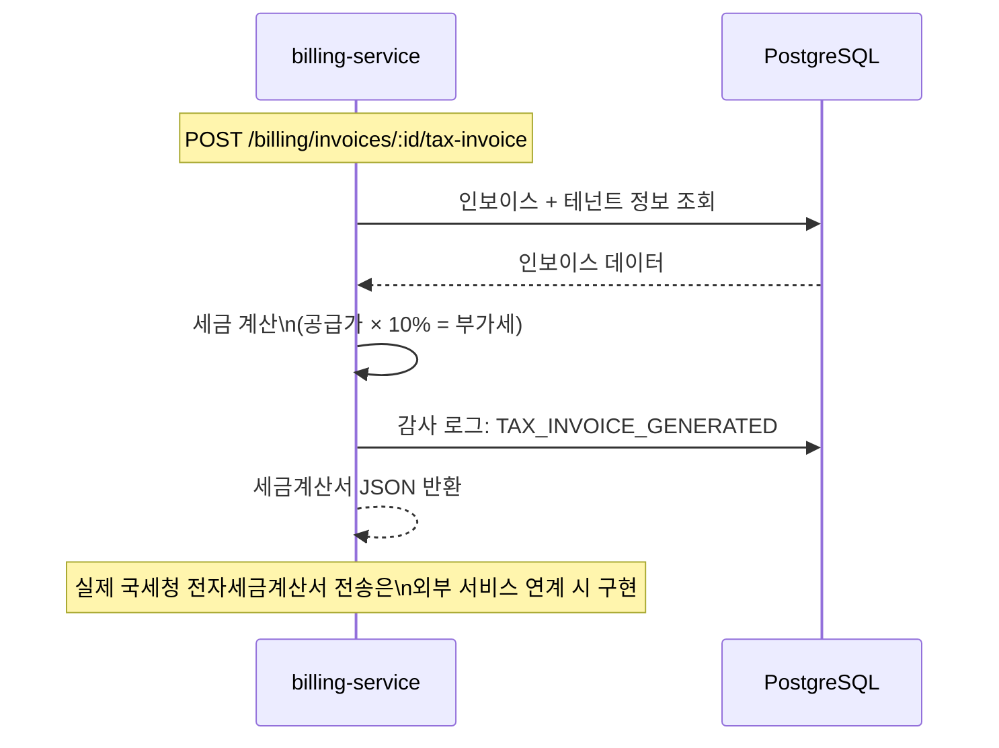
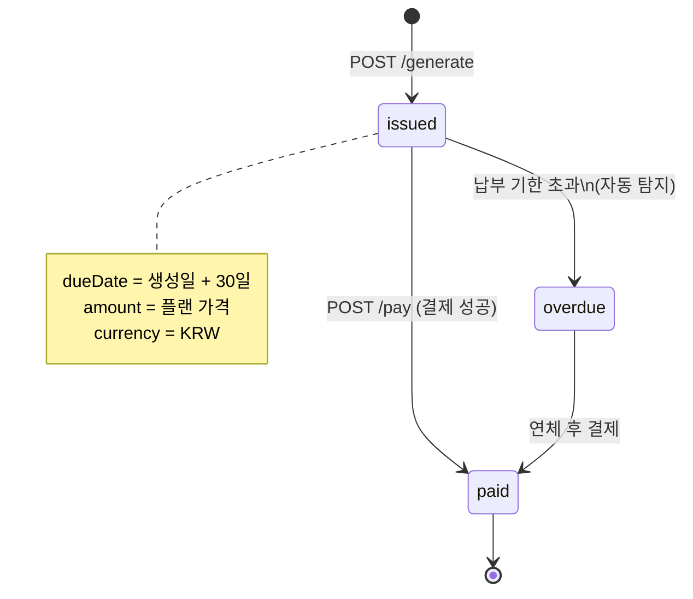

# 09. Billing Service — 과금·청구 관리 서비스

> 대상 독자: 개발팀 신규 합류자, 재무·회계 담당 운영자
> 관련 Plan: FR-P08.1~FR-P08.5, FR-BILL.1~FR-BILL.5
> CSAP 항목: D-06 감사 로그, D-08 접근 통제, D-12 입력 검증

---

## 서비스 개요 카드

| 항목 | 값 |
|------|-----|
| 서비스명 | billing-service |
| 역할 | 인보이스 생성, 결제 처리, 세금계산서 발행, 수익 대시보드 |
| 기본 포트 | 3005 |
| 프레임워크 | Fastify + TypeScript |
| DB | PostgreSQL (Prisma ORM) |
| 의존 서비스 | subscription-service (구독 정보), auth-service (JWT 검증) |
| CSAP 적용 | D-06(감사 로그), D-08(테넌트 격리), D-12(입력 검증), TOCTOU 방어 |
| Rate Limit | 읽기 100 req/min, 쓰기 20 req/min |

---

## 공공기관 청구의 특수성

공공기관에 SaaS를 제공할 때 청구는 일반 민간 기업과 다른 점이 많습니다.

**세금계산서 의무 발행**
공공기관은 부가세법에 따라 전자세금계산서를 수취해야 합니다. 이 서비스는 세금계산서 데이터를 생성하는 기능을 제공합니다. 실제 국세청 전자세금계산서 연동은 외부 서비스와 별도 구성합니다.

**가상계좌·계좌이체 선호**
신용카드보다 가상계좌(virtual_account) 또는 계좌이체(bank_transfer) 방식을 선호합니다. 결제 방법 필드에 세 가지 옵션이 지원됩니다.

**TOCTOU 방어 (이중 결제 방지)**
결제 요청이 짧은 시간 안에 중복으로 들어올 경우, 두 번 결제되는 TOCTOU(Time-Of-Check-Time-Of-Use) 경쟁 조건이 발생할 수 있습니다. 이 서비스는 Prisma 트랜잭션으로 원자적 처리를 보장합니다.

**연체 인보이스 관리**
납부 기한을 넘긴 인보이스를 자동으로 탐지하고, 담당자에게 알림을 보내거나 SLO 에스컬레이션에 연계할 수 있습니다.

---

## 청구서 생성 흐름



---

## 결제 처리 흐름 (TOCTOU 방어)



---

## 세금계산서 처리 흐름



---

## 주요 API 엔드포인트

| 메서드 | 경로 | 설명 | 권한 | Rate Limit |
|--------|------|------|------|-----------|
| GET | `/billing/invoices` | 인보이스 목록 | 테넌트 격리 | 100/min |
| GET | `/billing/invoices/:id` | 인보이스 상세 | 테넌트 격리 | 100/min |
| POST | `/billing/invoices/generate` | 인보이스 생성 | SUPER_ADMIN | 20/min |
| POST | `/billing/invoices/:id/pay` | 결제 처리 | 본인 테넌트 | 20/min |
| POST | `/billing/invoices/:id/tax-invoice` | 세금계산서 발행 | TENANT_ADMIN+ | 20/min |
| GET | `/billing/payments` | 결제 이력 | 테넌트 격리 | 100/min |
| GET | `/billing/dashboard` | 수익 대시보드 | 테넌트 격리 | 100/min |
| GET | `/billing/overdue` | 연체 인보이스 | SUPER_ADMIN | 100/min |
| GET | `/billing/revenue-trend` | 수익 추이 | SUPER_ADMIN | 100/min |

---

## 인보이스 상태 전환



---

## CSAP 데이터 처리 주의사항

청구 데이터는 금융 정보를 포함하므로 N2SF 데이터 등급 기준에서 `S(민감)` 등급에 해당할 수 있습니다.

| 데이터 | 등급 | 처리 규칙 |
|--------|------|---------|
| 결제 금액, 결제 방법 | S | AI API 전송 절대 금지 |
| 인보이스 번호 | O | 마스킹 후 AI 분석 가능 |
| 수익 집계 통계 | O | 테넌트 식별 정보 제거 후 가능 |
| 세금계산서 원본 | S | 외부 전송 금지, 내부 DB만 저장 |

---

## 실습 curl 예시

### 1. 수익 대시보드 확인

```bash
curl -s \
  -H "x-internal-service-key: ${INTERNAL_SERVICE_KEY}" \
  -H "x-user-role: SUPER_ADMIN" \
  http://localhost:3005/billing/dashboard | jq '.data'
```

예시 응답:
```json
{
  "totalRevenue": "15000000",
  "invoiceCount": 42,
  "paidCount": 38,
  "pendingCount": 4
}
```

### 2. 인보이스 생성

```bash
curl -s -X POST \
  -H "Content-Type: application/json" \
  -H "x-internal-service-key: ${INTERNAL_SERVICE_KEY}" \
  -H "x-user-id: admin-001" \
  -H "x-user-role: SUPER_ADMIN" \
  -d '{"subscriptionId": "'"${SUBSCRIPTION_ID}"'"}' \
  http://localhost:3005/billing/invoices/generate | jq
```

### 3. 결제 처리 (가상계좌)

```bash
curl -s -X POST \
  -H "Content-Type: application/json" \
  -H "x-internal-service-key: ${INTERNAL_SERVICE_KEY}" \
  -H "x-user-id: tenant-user-001" \
  -H "x-user-role: TENANT_ADMIN" \
  -H "x-user-tenant-id: ${TENANT_ID}" \
  -d '{"amount": 500000, "method": "virtual_account"}' \
  http://localhost:3005/billing/invoices/${INVOICE_ID}/pay | jq
```

### 4. 세금계산서 발행

```bash
curl -s -X POST \
  -H "Content-Type: application/json" \
  -H "x-internal-service-key: ${INTERNAL_SERVICE_KEY}" \
  -H "x-user-id: tenant-user-001" \
  -H "x-user-role: TENANT_ADMIN" \
  -H "x-user-tenant-id: ${TENANT_ID}" \
  http://localhost:3005/billing/invoices/${INVOICE_ID}/tax-invoice | jq '.data'
```

예시 응답:
```json
{
  "invoiceId": "inv-uuid",
  "tenantName": "행정안전부",
  "amount": "500000",
  "tax": "50000.00",
  "total": "550000.00",
  "issuedAt": "2026-04-11T09:00:00.000Z"
}
```

### 5. 연체 인보이스 목록

```bash
curl -s \
  -H "x-internal-service-key: ${INTERNAL_SERVICE_KEY}" \
  -H "x-user-role: SUPER_ADMIN" \
  "http://localhost:3005/billing/overdue?page=1&limit=20" | jq '.data | length'
```

### 6. 수익 추이 (최근 6개월)

```bash
curl -s \
  -H "x-internal-service-key: ${INTERNAL_SERVICE_KEY}" \
  -H "x-user-role: SUPER_ADMIN" \
  "http://localhost:3005/billing/revenue-trend?months=6" | jq
```

---

## 감사 로그 이벤트 목록

| 이벤트 코드 | 발생 시점 | CSAP 근거 |
|------------|---------|---------|
| `INVOICE_GENERATED` | 인보이스 생성 | D-06 |
| `PAYMENT_COMPLETED` | 결제 완료 | D-06 |
| `TAX_INVOICE_GENERATED` | 세금계산서 발행 | D-06 |

모든 이벤트에는 actor(행위자), tenantId, IP, User-Agent가 함께 기록됩니다.

---

## 페이지네이션 동작

인보이스 및 결제 이력은 기본 페이지 크기 20, 최대 100을 지원합니다.

```
GET /billing/invoices?page=2&pageSize=50
```

응답에는 `pagination` 객체가 포함됩니다:
```json
{
  "pagination": {
    "page": 2,
    "pageSize": 50,
    "total": 137,
    "totalPages": 3
  }
}
```

---

## 초보자 FAQ

**Q. 이미 결제한 인보이스를 다시 결제하면 어떻게 되나요?**
A. Prisma 트랜잭션 안에서 인보이스 상태를 재확인합니다. 이미 `paid` 상태이면 409 Conflict (`ALREADY_PAID`)를 반환합니다. 이중 결제를 방지합니다.

**Q. 결제 금액이 인보이스 금액과 다르게 요청되면 어떻게 되나요?**
A. 현재 구현에서는 전달된 `amount` 값으로 Payment 레코드가 생성됩니다. 일부 납부 또는 분할 납부 시나리오를 지원하기 위한 설계입니다. 정확한 금액 일치 검증이 필요하면 추가 비즈니스 로직을 삽입하세요.

**Q. 수익 대시보드 데이터는 실시간인가요?**
A. 네, DB를 직접 집계합니다. 대용량 트랜잭션이 쌓이면 성능이 저하될 수 있으므로, 운영 규모가 커지면 별도 집계 테이블 또는 캐싱을 고려하세요.

**Q. 세금계산서를 실제로 국세청에 전송할 수 있나요?**
A. 이 서비스는 세금계산서 데이터를 JSON으로 생성하는 역할만 합니다. 실제 국세청 e세로 API 연동은 별도 어댑터 서비스로 분리하여 구현해야 합니다.

**Q. SUPER_ADMIN이 아닌 TENANT_ADMIN도 인보이스를 생성할 수 있나요?**
A. 인보이스 생성(POST /generate)은 SUPER_ADMIN 전용입니다. TENANT_ADMIN은 본인 테넌트의 인보이스 조회와 결제만 가능합니다.
