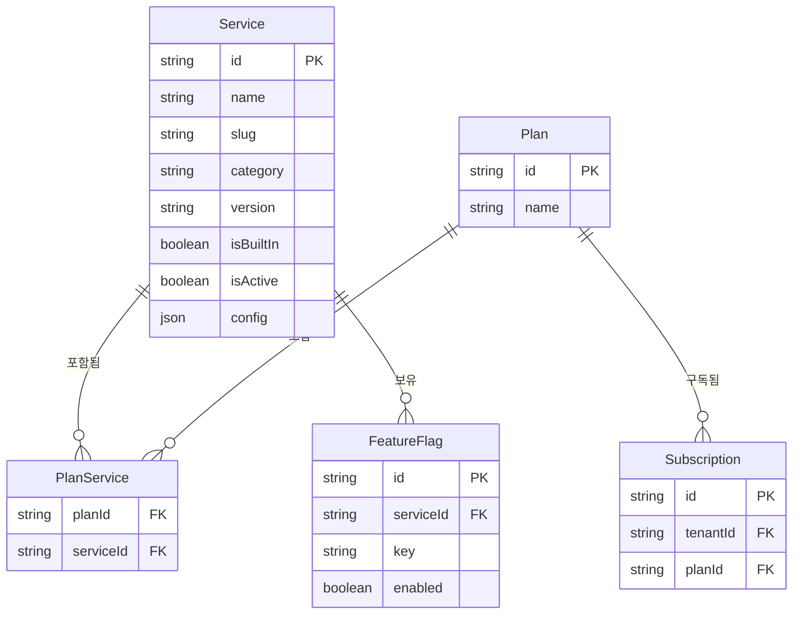
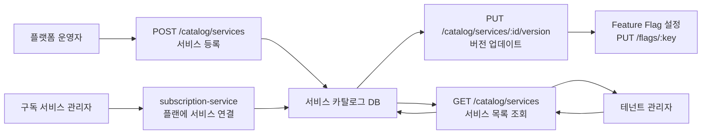
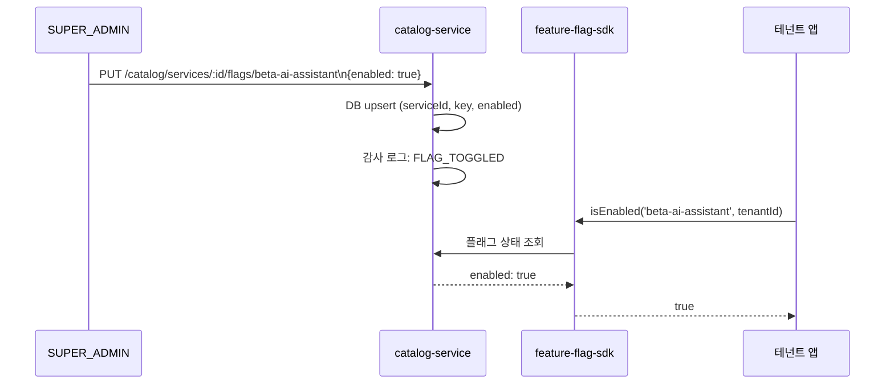

# 10. Catalog Service — SaaS 서비스 카탈로그 관리

> 대상 독자: 개발팀 신규 합류자, 플랫폼 운영 담당자
> 관련 Plan: FR-P06.1~FR-P06.5, FR-CAT.1~FR-CAT.5
> CSAP 항목: D-06 감사 로그, D-08 접근 통제, D-12 입력 검증

---

## 서비스 개요 카드

| 항목 | 값 |
|------|-----|
| 서비스명 | catalog-service |
| 역할 | SaaS 서비스 등록·관리, Feature Flag 제어, 테넌트 구독 가능 서비스 목록 제공 |
| 기본 포트 | 3003 |
| 프레임워크 | Fastify + TypeScript |
| DB | PostgreSQL (Prisma ORM) |
| 의존 서비스 | auth-service (JWT 검증), subscription-service (플랜-서비스 연결) |
| CSAP 적용 | D-06(감사 로그), D-08(접근 통제), D-12(입력 검증) |
| Rate Limit | 읽기 100/min, 쓰기 20/min, 삭제 5/5min |

---

## 카탈로그의 역할

이 서비스는 공공기관 SaaS 플랫폼에서 "어떤 서비스를 테넌트에게 제공하느냐"를 정의하는 중심 레지스트리입니다.

**플랫폼 운영자 관점**
- 새로운 SaaS 모듈을 등록하고 카테고리를 지정합니다.
- 특정 기능의 활성화/비활성화를 Feature Flag로 제어합니다.
- 버전을 관리하여 테넌트에게 배포 상태를 알립니다.

**테넌트(기관) 관점**
- 구독 가능한 서비스 목록을 카탈로그에서 탐색합니다.
- 서비스의 카테고리, 버전, Feature Flag 상태를 확인합니다.
- 구독 플랜에 포함된 서비스가 무엇인지 파악합니다.

---

## 서비스-플랜-테넌트 관계



---

## 서비스 등록~구독 가능 흐름



---

## 주요 API 엔드포인트

| 메서드 | 경로 | 설명 | 권한 | Rate Limit |
|--------|------|------|------|-----------|
| GET | `/catalog/services` | 서비스 목록 (검색/필터) | 인증 필요 | 100/min |
| GET | `/catalog/services/:id` | 서비스 상세 | 인증 필요 | 100/min |
| POST | `/catalog/services` | 서비스 등록 | SUPER_ADMIN | 20/min |
| PUT | `/catalog/services/:id` | 서비스 수정 | SUPER_ADMIN | 20/min |
| DELETE | `/catalog/services/:id` | 서비스 삭제 | SUPER_ADMIN | 5/5min |
| PUT | `/catalog/services/:id/version` | 버전 업데이트 | SUPER_ADMIN | 20/min |
| GET | `/catalog/services/:id/flags` | Feature Flag 목록 | 인증 필요 | 100/min |
| PUT | `/catalog/services/:id/flags/:key` | Feature Flag 토글 | SUPER_ADMIN | 20/min |
| GET | `/catalog/categories` | 카테고리 목록 | 인증 필요 | 100/min |
| GET | `/catalog/stats` | 카탈로그 통계 | SUPER_ADMIN | 100/min |

---

## 서비스 등록 요청 구조

```json
{
  "name": "공문서 관리 시스템",
  "slug": "document-management",
  "description": "기관 내 공문서 생성·결재·보관 통합 관리",
  "category": "administration",
  "version": "2.1.0",
  "isBuiltIn": false,
  "config": {
    "maxDocumentsPerTenant": 100000,
    "retentionYears": 10
  }
}
```

**필드 제약**
- `slug`: 소문자·숫자·하이픈만 허용 (`/^[a-z0-9-]+$/`)
- `slug`는 전체 플랫폼에서 고유 (중복 시 409 Conflict)
- `config`: 자유 형식 JSON (서비스별 설정 저장)

---

## 검색 및 필터 기능 (FR-CAT.2)

서비스 목록 API는 다양한 필터를 지원합니다.

```
GET /catalog/services?category=administration&isActive=true&search=공문서&page=1&pageSize=10
```

| 쿼리 파라미터 | 설명 | 예시 |
|-------------|------|------|
| `category` | 카테고리 필터 | `administration`, `finance` |
| `isActive` | 활성 여부 필터 | `true` / `false` |
| `search` | 이름·slug·설명 부분 검색 | `공문서` |
| `page` | 페이지 번호 (기본 1) | `2` |
| `pageSize` | 페이지 크기 (최대 100) | `20` |

검색은 name, slug, description 필드에 대해 대소문자 무시(insensitive) OR 조건으로 동작합니다.

---

## Feature Flag 동작 원리

Feature Flag는 서비스의 특정 기능을 코드 배포 없이 실시간으로 켜고 끄는 메커니즘입니다.



Feature Flag 항목은 서비스 ID와 키(key)의 복합 유니크 제약이 적용됩니다. 같은 서비스에 같은 키로 다시 PUT하면 기존 값을 업데이트(upsert)합니다.

---

## 버전 관리 흐름

```mermaid
flowchart TD
    A[새 버전 배포 준비] --> B[PUT /catalog/services/:id/version\nbody: {version: '2.2.0'}]
    B --> C[DB Service.version 업데이트]
    C --> D[감사 로그: SERVICE_VERSION_UPDATED]
    D --> E[테넌트 포털에 새 버전 표시]
    E --> F{업그레이드 필요 여부}
    F -- 필요 --> G[notification-service 알림 발송]
    F -- 불필요 --> H[현재 버전 유지]
```

---

## 실습 curl 예시

### 1. 서비스 목록 조회 (행정 카테고리, 활성 서비스)

```bash
curl -s \
  -H "x-internal-service-key: ${INTERNAL_SERVICE_KEY}" \
  -H "x-user-role: TENANT_ADMIN" \
  "http://localhost:3003/catalog/services?category=administration&isActive=true" \
  | jq '.data[] | {id, name, version}'
```

### 2. 새 서비스 등록

```bash
curl -s -X POST \
  -H "Content-Type: application/json" \
  -H "x-internal-service-key: ${INTERNAL_SERVICE_KEY}" \
  -H "x-user-id: platform-admin" \
  -H "x-user-role: SUPER_ADMIN" \
  -d '{
    "name": "전자결재 시스템",
    "slug": "e-approval",
    "description": "기관 내부 전자결재 워크플로우",
    "category": "administration",
    "version": "1.0.0"
  }' \
  http://localhost:3003/catalog/services | jq '.data.id'
```

### 3. Feature Flag 활성화

```bash
curl -s -X PUT \
  -H "Content-Type: application/json" \
  -H "x-internal-service-key: ${INTERNAL_SERVICE_KEY}" \
  -H "x-user-id: platform-admin" \
  -H "x-user-role: SUPER_ADMIN" \
  -d '{"enabled": true}' \
  http://localhost:3003/catalog/services/${SERVICE_ID}/flags/ai-summary | jq
```

### 4. 서비스 버전 업데이트

```bash
curl -s -X PUT \
  -H "Content-Type: application/json" \
  -H "x-internal-service-key: ${INTERNAL_SERVICE_KEY}" \
  -H "x-user-id: platform-admin" \
  -H "x-user-role: SUPER_ADMIN" \
  -d '{"version": "1.1.0"}' \
  http://localhost:3003/catalog/services/${SERVICE_ID}/version | jq '.data.version'
```

### 5. 카탈로그 통계 확인

```bash
curl -s \
  -H "x-internal-service-key: ${INTERNAL_SERVICE_KEY}" \
  -H "x-user-role: SUPER_ADMIN" \
  http://localhost:3003/catalog/stats | jq
```

### 6. 서비스 비활성화 (삭제 대신 권장)

```bash
curl -s -X PUT \
  -H "Content-Type: application/json" \
  -H "x-internal-service-key: ${INTERNAL_SERVICE_KEY}" \
  -H "x-user-id: platform-admin" \
  -H "x-user-role: SUPER_ADMIN" \
  -d '{"isActive": false}' \
  http://localhost:3003/catalog/services/${SERVICE_ID} | jq '.data.isActive'
```

---

## 감사 로그 이벤트

| 이벤트 코드 | 발생 시점 | CSAP 근거 |
|------------|---------|---------|
| `SERVICE_CREATED` | 서비스 등록 | D-06 |
| `SERVICE_UPDATED` | 서비스 수정 | D-06 |
| `SERVICE_DELETED` | 서비스 삭제 | D-06 |
| `SERVICE_VERSION_UPDATED` | 버전 업데이트 | D-06 |
| `FLAG_TOGGLED` | Feature Flag 변경 | D-06 |

---

## 입력 검증 규칙 (CSAP D-12)

| 필드 | 검증 규칙 |
|------|---------|
| `name` | 1~200자 |
| `slug` | 2~50자, 소문자·숫자·하이픈 (`/^[a-z0-9-]+$/`), 고유 |
| `category` | 1자 이상 필수 |
| `version` | 기본값 `1.0.0` |
| `config` | 자유 JSON 객체 |

---

## 초보자 FAQ

**Q. 서비스를 삭제하면 복구할 수 없나요?**
A. 맞습니다. 삭제는 DB에서 영구적으로 제거됩니다. 대신 `isActive: false`로 비활성화하는 방법을 권장합니다. 감사 추적을 위해 삭제 전 감사 로그가 먼저 기록됩니다.

**Q. Feature Flag는 테넌트별로 다르게 설정할 수 있나요?**
A. 현재 구현은 서비스 단위 전역 Flag입니다. 테넌트별 Flag가 필요하면 feature-flag-sdk 패키지의 테넌트 오버라이드 기능을 활용하세요.

**Q. slug를 나중에 변경할 수 있나요?**
A. 현재 수정 API(`PUT /catalog/services/:id`)에서 slug 변경은 지원하지 않습니다. slug는 서비스 URL, Feature Flag 등 여러 곳에서 참조되므로 변경이 영향을 미칩니다.

**Q. 카테고리는 어디에서 관리하나요?**
A. 별도 카테고리 테이블이 없고, 서비스의 `category` 필드에서 동적으로 집계됩니다. `GET /catalog/categories`는 현재 등록된 서비스들에서 고유 카테고리를 추출하여 반환합니다.

**Q. 내장(built-in) 서비스와 외부 서비스의 차이는 무엇인가요?**
A. `isBuiltIn: true`는 플랫폼에 기본 포함된 서비스를 의미합니다. 현재는 UI 표시 구분 용도이며, 향후 삭제 방지 로직에 활용될 예정입니다.
