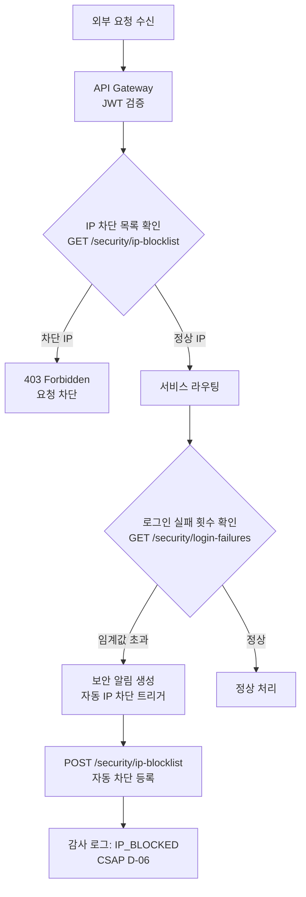
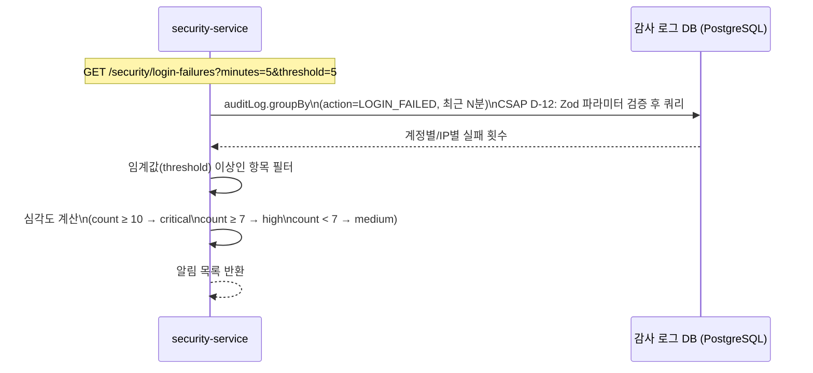
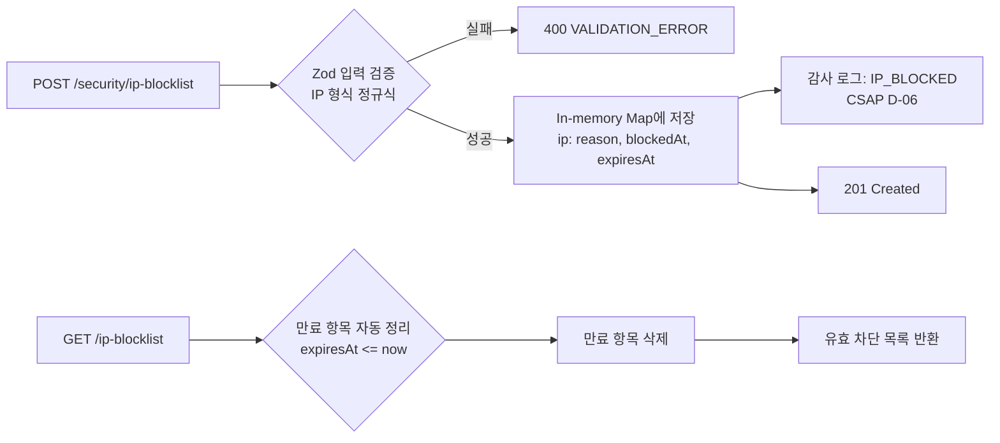

# 11. Security Service — 보안 정책 관리 서비스

> 대상 독자: 개발팀 신규 합류자, 보안 담당자, CSAP 감리 대응 담당
> 관련 Plan: FR-P15.1~FR-P15.4, FR-SEC.1~FR-SEC.4
> CSAP 항목: D-06 감사 로그, D-08 접근 통제, D-10 네트워크 보안, D-12 입력 검증

---

## 서비스 개요 카드

| 항목 | 값 |
|------|-----|
| 서비스명 | security-service |
| 역할 | 보안 정책 집행, IP 차단 목록 관리, 로그인 실패 탐지, 이상 접근 탐지, 보안 이벤트 알림 |
| 기본 포트 | 3007 |
| 프레임워크 | Fastify + TypeScript |
| DB | PostgreSQL (Prisma ORM — 감사 로그 참조) |
| IP 차단 저장소 | In-memory Map (재시작 시 초기화, 영속 저장은 향후 Redis 전환 예정) |
| 의존 서비스 | auth-service (JWT 검증), compliance-service (감사 로그) |
| CSAP 적용 | D-06(감사 로그), D-08(접근 통제), D-10(네트워크 보안), D-12(입력 검증) |
| Rate Limit | 읽기 60/min (보안 API 특성상 엄격), 쓰기 20/min |

---

## 보안 정책 관리의 위치

이 서비스는 플랫폼의 "보안 규칙 엔진" 역할을 합니다. 보안 모니터 서비스(`security-monitor-service`)가 이상을 탐지하면, 이 서비스가 대응 정책(IP 차단 등)을 집행합니다.

```
[auth-service] --- 로그인 실패 이벤트 ---> [감사 로그]
[감사 로그] <--- 쿼리 --- [security-service]
                              |
                              v
                     로그인 실패 패턴 분석
                     이상 접근 탐지
                              |
                         IP 차단 결정
                              |
                    [In-memory IP 차단 목록]
                              |
                    [API Gateway] --- 차단 목록 조회 ---> 요청 차단
```

---

## CSAP D-08 보안 정책 적용 흐름



---

## 로그인 실패 탐지 메커니즘



**심각도 기준**

| 실패 횟수 | 심각도 | 권고 조치 |
|---------|--------|---------|
| 5~6회 | medium | 모니터링 강화 |
| 7~9회 | high | 담당자 알림 발송 |
| 10회 이상 | critical | 즉시 IP 차단 검토 |

---

## 이상 접근 탐지 유형

`GET /security/anomalies` 엔드포인트는 두 가지 유형의 이상을 탐지합니다.

**MULTI_IP_LOGIN (세션 탈취 의심)**
동일 사용자(actorId)가 특정 시간 내에 3개 이상의 서로 다른 IP에서 로그인 시도하는 경우입니다. 계정 공유 또는 세션 탈취를 의심할 수 있습니다.

**HIGH_VOLUME_REQUEST (DDoS/크롤러 의심)**
특정 IP가 단시간(기본 1시간)에 100건 이상의 요청을 보내는 경우입니다. DDoS 공격이나 무차별 대입(brute force)을 의심할 수 있습니다.

```
요청 기간: hours 파라미터로 지정 (기본 1, 최대 168시간)
탐지 기준: 3개 이상 IP 로그인 시도 / 100건 이상 API 요청
심각도: count ≥ 5 또는 count ≥ 500 → critical
```

---

## IP 차단 목록 관리

### IP 차단 등록 구조

```
POST /security/ip-blocklist

{
  "ip": "203.0.113.42",          // IPv4, IPv6, CIDR 지원
  "reason": "brute force 탐지",
  "durationMinutes": 1440        // 생략 시 영구 차단
}
```

**지원 IP 형식**
- IPv4: `203.0.113.42`
- IPv4 CIDR: `203.0.113.0/24`
- IPv6: `2001:db8::1`
- IPv6 CIDR: `2001:db8::/32`

### IP 차단 흐름



### 차단 해제

```
DELETE /security/ip-blocklist/203.0.113.42
```

해제 즉시 감사 로그(`IP_UNBLOCKED`)가 기록됩니다.

---

## 보안 이벤트 알림 유형

`GET /security/alerts` 엔드포인트는 다음 보안 이벤트를 반환합니다.

| 이벤트 코드 | 심각도 | 설명 |
|------------|--------|------|
| `AI_GRADE_VIOLATION` | critical | N2SF 데이터 등급 위반 (C/S 데이터 AI 전송 시도) |
| `SESSION_HIJACK_ATTEMPT` | critical | 세션 탈취 의심 접근 |
| `IP_BLOCKED` | high | IP 차단 등록 |
| `LOGIN_FAILED` | medium | 로그인 실패 누적 |
| `UNAUTHORIZED_ACCESS` | medium | 인가되지 않은 리소스 접근 |

---

## 주요 API 엔드포인트

| 메서드 | 경로 | 설명 | 권한 | Rate Limit |
|--------|------|------|------|-----------|
| GET | `/security/dashboard` | 보안 대시보드 통계 | SUPER_ADMIN | 60/min |
| GET | `/security/login-failures` | 로그인 실패 패턴 탐지 | SUPER_ADMIN | 60/min |
| GET | `/security/anomalies` | 이상 접근 패턴 탐지 | SUPER_ADMIN | 60/min |
| GET | `/security/ip-blocklist` | IP 차단 목록 조회 | SUPER_ADMIN | 60/min |
| POST | `/security/ip-blocklist` | IP 차단 등록 | SUPER_ADMIN | 20/min |
| DELETE | `/security/ip-blocklist/:ip` | IP 차단 해제 | SUPER_ADMIN | 20/min |
| GET | `/security/alerts` | 보안 이벤트 알림 목록 | SUPER_ADMIN | 60/min |
| GET | `/security/threat-trend` | 위협 추이 조회 | SUPER_ADMIN | 60/min |

---

## 실습 curl 예시

### 1. 보안 대시보드 확인

```bash
curl -s \
  -H "x-internal-service-key: ${INTERNAL_SERVICE_KEY}" \
  -H "x-user-role: SUPER_ADMIN" \
  http://localhost:3007/security/dashboard | jq
```

### 2. 최근 5분 로그인 실패 탐지 (임계값 5회)

```bash
curl -s \
  -H "x-internal-service-key: ${INTERNAL_SERVICE_KEY}" \
  -H "x-user-role: SUPER_ADMIN" \
  "http://localhost:3007/security/login-failures?minutes=5&threshold=5" \
  | jq '.alerts[] | {actorId, ip, failureCount, severity}'
```

### 3. 이상 접근 탐지 (최근 1시간)

```bash
curl -s \
  -H "x-internal-service-key: ${INTERNAL_SERVICE_KEY}" \
  -H "x-user-role: SUPER_ADMIN" \
  "http://localhost:3007/security/anomalies?hours=1" \
  | jq '.anomalies'
```

### 4. IP 차단 등록 (24시간)

```bash
curl -s -X POST \
  -H "Content-Type: application/json" \
  -H "x-internal-service-key: ${INTERNAL_SERVICE_KEY}" \
  -H "x-user-role: SUPER_ADMIN" \
  -d '{
    "ip": "203.0.113.42",
    "reason": "brute force 로그인 시도 10회 탐지",
    "durationMinutes": 1440
  }' \
  http://localhost:3007/security/ip-blocklist | jq
```

### 5. IP 차단 해제

```bash
curl -s -X DELETE \
  -H "x-internal-service-key: ${INTERNAL_SERVICE_KEY}" \
  -H "x-user-role: SUPER_ADMIN" \
  http://localhost:3007/security/ip-blocklist/203.0.113.42 | jq
```

### 6. critical 심각도 보안 이벤트만 조회

```bash
curl -s \
  -H "x-internal-service-key: ${INTERNAL_SERVICE_KEY}" \
  -H "x-user-role: SUPER_ADMIN" \
  "http://localhost:3007/security/alerts?severity=critical&limit=10" \
  | jq '.alerts[] | {id, action, ip, createdAt}'
```

### 7. 위협 추이 (최근 7일)

```bash
curl -s \
  -H "x-internal-service-key: ${INTERNAL_SERVICE_KEY}" \
  -H "x-user-role: SUPER_ADMIN" \
  "http://localhost:3007/security/threat-trend?days=7" | jq
```

---

## 감사 로그 이벤트 목록

| 이벤트 코드 | 발생 시점 | CSAP 근거 |
|------------|---------|---------|
| `IP_BLOCKED` | IP 차단 등록 | D-06, D-10 |
| `IP_UNBLOCKED` | IP 차단 해제 | D-06, D-10 |

---

## 입력 검증 규칙 (CSAP D-12)

| 파라미터 | 검증 규칙 |
|---------|---------|
| `minutes` (login-failures) | coerce int, 1~1440 (최대 24시간) |
| `threshold` (login-failures) | coerce int, 1~100 |
| `hours` (anomalies) | coerce int, 1~168 (최대 7일) |
| `severity` (alerts) | enum `['critical','high','medium','low']` |
| `limit` (alerts) | coerce int, 1~100 |
| `ip` (blocklist) | IPv4/IPv6/CIDR 정규식 검증 |
| `durationMinutes` | int, positive (선택 필드) |

---

## 초보자 FAQ

**Q. IP 차단 목록이 서비스 재시작 시 초기화되면 실제 운영에 문제가 없나요?**
A. 현재는 In-memory 저장 방식입니다. 프로덕션 운영에서는 Redis 또는 DB 영속 저장으로 전환이 필요합니다. 이 점을 인지하고 운영 중에는 정기적인 백업 또는 Redis 전환을 계획하세요.

**Q. 차단 기간이 만료된 IP는 언제 자동으로 해제되나요?**
A. `GET /security/ip-blocklist` 호출 시 만료된 항목을 일괄 정리합니다. 별도 스케줄러가 실행되는 구조가 아니므로, 조회를 통해 정리를 트리거해야 합니다.

**Q. 로그인 실패 탐지는 어떤 데이터를 기반으로 하나요?**
A. auth-service에서 로그인 실패 시 기록하는 `LOGIN_FAILED` 감사 로그를 직접 PostgreSQL에서 groupBy로 집계합니다. 실시간 스트리밍이 아닌 쿼리 기반 탐지입니다.

**Q. IP 차단을 자동화할 수 있나요?**
A. 현재는 관리자가 수동으로 `POST /security/ip-blocklist`를 호출해야 합니다. security-monitor-service가 임계값 초과를 감지하면 이 API를 자동 호출하는 연동을 구성할 수 있습니다.

**Q. 이 서비스와 security-monitor-service의 차이는 무엇인가요?**
A. security-service는 보안 정책을 집행(IP 차단 등록/해제, 이벤트 알림 관리)하는 역할을 합니다. security-monitor-service는 실시간 모니터링과 알림 생성에 특화되어 있습니다. 두 서비스는 역할이 겹치는 부분이 있으며, 점진적으로 역할 분리가 진행 중입니다.
