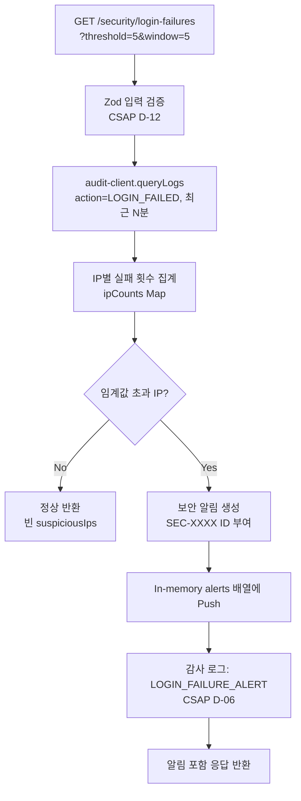
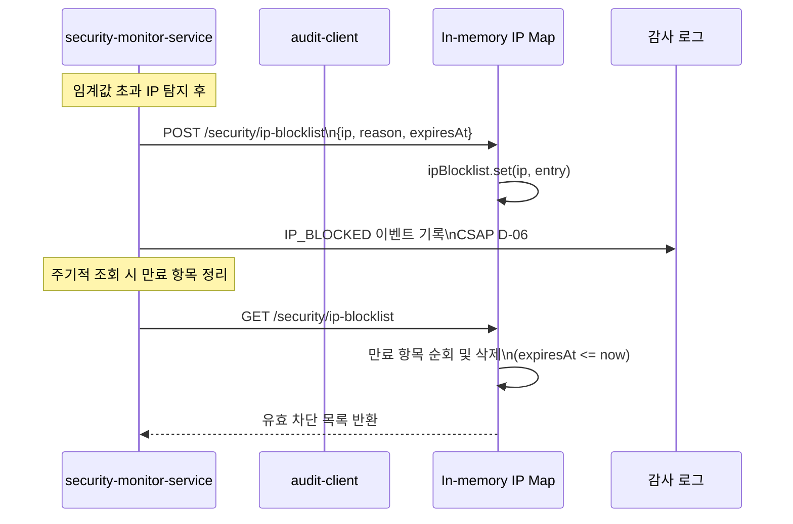
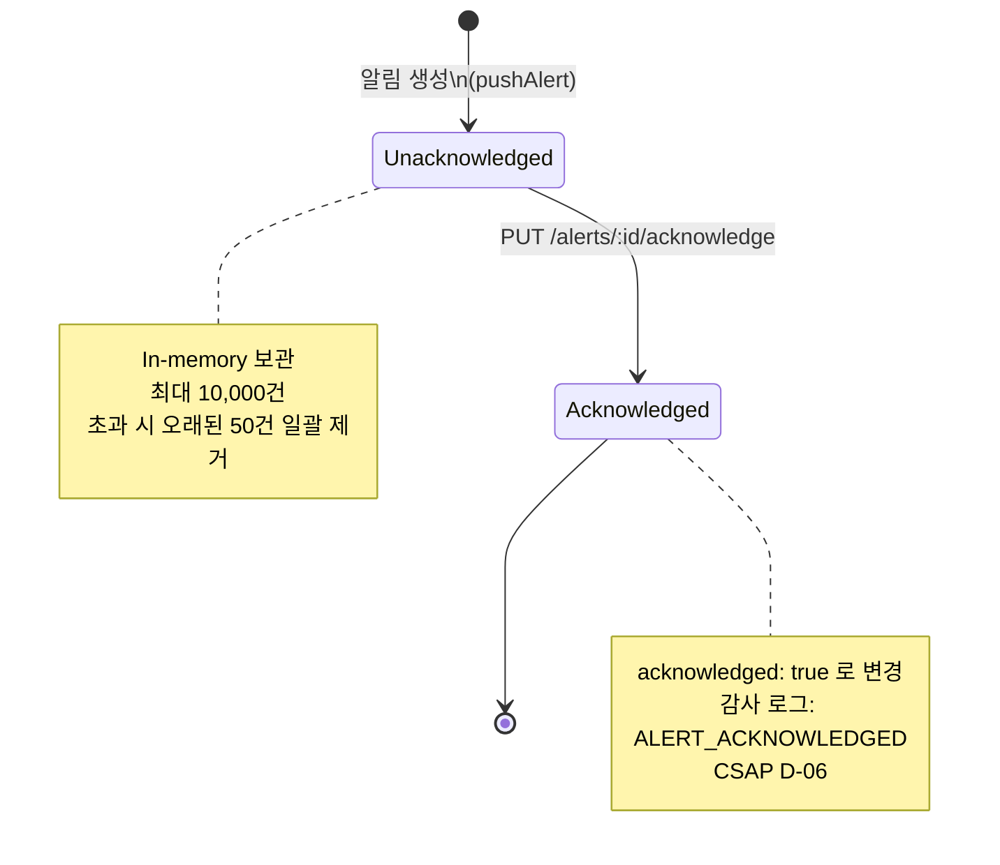

# 12. Security Monitor Service — 실시간 보안 이상 탐지 서비스

> 대상 독자: 개발팀 신규 합류자, 보안 운영자, CSAP 감리 대응 담당
> 관련 Plan: FR-P15.1~FR-P15.4, FR-SECMON.1~FR-SECMON.7
> CSAP 항목: D-06 감사 로그, D-08 접근 통제, D-10 네트워크 보안, D-12 입력 검증

---

## 서비스 개요 카드

| 항목 | 값 |
|------|-----|
| 서비스명 | security-monitor-service |
| 역할 | 실시간 보안 이상 탐지, 알림 생성·확인, IP 차단 자동화, 보안 이벤트 통계 |
| 기본 포트 | 3008 |
| 프레임워크 | Fastify + TypeScript |
| 알림 저장소 | In-memory 배열 (최대 10,000건, 초과 시 오래된 항목 자동 제거) |
| IP 차단 저장소 | In-memory Map (만료 자동 정리) |
| 의존 서비스 | audit-client (감사 로그 조회), compliance-service (로그 기록) |
| CSAP 적용 | D-06(감사 로그), D-10(네트워크 보안), D-12(입력 검증) |
| Rate Limit | 읽기 100/min, 쓰기 20/min |

---

## security-service와의 역할 비교

| 항목 | security-service | security-monitor-service |
|------|-----------------|------------------------|
| 주요 역할 | 보안 정책 집행 | 실시간 모니터링·알림 |
| 로그인 실패 탐지 | DB 직접 쿼리 집계 | audit-client 추상화 레이어 사용 |
| IP 차단 | 영구/임시 차단 | 임시 차단 + 자동 만료 |
| 알림 시스템 | DB auditLog 조회 | In-memory 알림 저장소 + 확인(Ack) 처리 |
| 이상 규칙 | 동적 탐지 | 규칙 기반 정적 정의 |
| 추이 분석 | 위협 추이 | 로그인 실패 추이, 이벤트 통계 |

---

## 실시간 보안 이상 탐지 흐름



---

## IP 차단 자동화 흐름



---

## 보안 알림 생명주기



---

## 이상 탐지 규칙 목록

`GET /security/anomalies` 엔드포인트는 다음 4가지 규칙을 반환합니다.

| 규칙 ID | 이름 | 설명 | 상태 |
|---------|------|------|------|
| `MULTI_IP_LOGIN` | 동시 다중 IP 로그인 | 5분 내 3개 이상 IP에서 동일 계정 로그인 시도 | monitoring |
| `OFF_HOURS_ACCESS` | 비정상 시간대 접근 | 22:00~06:00 사이 관리자 접근 | monitoring |
| `BULK_REQUEST` | 단시간 대량 요청 | 1분 내 100회 이상 API 요청 | monitoring |
| `PRIVILEGE_ESCALATION` | 권한 상승 시도 | 비인가 역할 접근 시도 | monitoring |

현재는 규칙 정의를 반환하며, 각 규칙의 실시간 탐지 연동은 audit-client 고도화와 함께 확장됩니다.

---

## Falco 이벤트 연동

Falco는 k3s 클러스터에서 런타임 이상(컨테이너 escape, 비인가 파일 접근 등)을 탐지하는 CNCF 프로젝트입니다.

```mermaid
flowchart LR
    F[Falco\nk3s 런타임] --> W[Falco Webhook]
    W --> M[security-monitor-service\n향후 /security/falco-events 엔드포인트]
    M --> A[In-memory 알림 생성]
    A --> P[보안 팀 알림\n(notification-service 연계)]
```

현재 구현에서는 Falco 웹훅 수신 엔드포인트가 준비 단계입니다. 운영 환경에서 Falco를 구성하려면 아래를 참고하세요.

```yaml
# falco 웹훅 설정 예시 (falco.yaml)
http_output:
  enabled: true
  url: "http://security-monitor-service:3008/security/falco-events"
  user_agent: "falcosecurity/falco"
```

---

## 로그인 실패 추이 분석

`GET /security/login-failures/trend?days=7` 는 일별 로그인 실패 횟수 추이를 반환합니다.

```json
{
  "trend": [
    {"date": "2026-04-05", "failureCount": 12},
    {"date": "2026-04-06", "failureCount": 8},
    {"date": "2026-04-07", "failureCount": 45},
    {"date": "2026-04-08", "failureCount": 5}
  ],
  "period": {"days": 7},
  "generatedAt": "2026-04-11T09:00:00.000Z"
}
```

급격한 증가가 보이는 날짜를 중심으로 해당 IP나 계정을 추적하세요.

---

## 알림 심각도 대시보드

```
GET /security/alerts/summary

{
  "total": 142,
  "unacknowledged": 8,
  "bySeverity": {
    "critical": 2,
    "high": 6,
    "medium": 30,
    "low": 104
  },
  "latestAlert": { ... }
}
```

미확인(unacknowledged) 알림 수가 핵심 지표입니다. CSAP 감리 시 미대응 보안 알림은 결함으로 지적될 수 있습니다.

---

## 주요 API 엔드포인트

| 메서드 | 경로 | 설명 | 권한 | Rate Limit |
|--------|------|------|------|-----------|
| GET | `/security/login-failures` | 로그인 실패 패턴 탐지 | SUPER_ADMIN | 100/min |
| GET | `/security/anomalies` | 이상 접근 패턴 탐지 | SUPER_ADMIN | 100/min |
| GET | `/security/ip-blocklist` | IP 차단 목록 조회 | SUPER_ADMIN | 100/min |
| POST | `/security/ip-blocklist` | IP 차단 등록 | SUPER_ADMIN | 20/min |
| DELETE | `/security/ip-blocklist/:ip` | IP 차단 해제 | SUPER_ADMIN | 20/min |
| GET | `/security/alerts` | 보안 알림 목록 | SUPER_ADMIN | 100/min |
| PUT | `/security/alerts/:id/acknowledge` | 알림 확인 처리 | SUPER_ADMIN | 20/min |
| GET | `/security/alerts/summary` | 알림 심각도 대시보드 | SUPER_ADMIN | 100/min |
| GET | `/security/login-failures/trend` | 로그인 실패 추이 | SUPER_ADMIN | 100/min |
| GET | `/security/events/stats` | 보안 이벤트 통계 | SUPER_ADMIN | 100/min |

---

## 실습 curl 예시

### 1. 로그인 실패 탐지 (최근 10분, 임계값 3회)

```bash
curl -s \
  -H "x-internal-service-key: ${INTERNAL_SERVICE_KEY}" \
  -H "x-user-role: SUPER_ADMIN" \
  "http://localhost:3008/security/login-failures?threshold=3&window=10" \
  | jq '{threshold, windowMinutes, suspiciousIps}'
```

### 2. 이상 접근 규칙 목록 확인

```bash
curl -s \
  -H "x-internal-service-key: ${INTERNAL_SERVICE_KEY}" \
  -H "x-user-role: SUPER_ADMIN" \
  http://localhost:3008/security/anomalies | jq '.rules[] | {id, name, status}'
```

### 3. IP 차단 등록 (만료 시간 포함)

```bash
# 48시간 후 자동 만료
EXPIRES=$(date -u -d "+48 hours" +"%Y-%m-%dT%H:%M:%SZ" 2>/dev/null \
  || date -u -v+48H +"%Y-%m-%dT%H:%M:%SZ")

curl -s -X POST \
  -H "Content-Type: application/json" \
  -H "x-internal-service-key: ${INTERNAL_SERVICE_KEY}" \
  -H "x-user-role: SUPER_ADMIN" \
  -d "{
    \"ip\": \"198.51.100.0/24\",
    \"reason\": \"대량 스캐닝 탐지\",
    \"expiresAt\": \"${EXPIRES}\"
  }" \
  http://localhost:3008/security/ip-blocklist | jq
```

### 4. 미확인 알림 목록 조회 (critical만)

```bash
curl -s \
  -H "x-internal-service-key: ${INTERNAL_SERVICE_KEY}" \
  -H "x-user-role: SUPER_ADMIN" \
  "http://localhost:3008/security/alerts?severity=critical&acknowledged=false" \
  | jq '.items[] | {id, type, message, createdAt}'
```

### 5. 알림 확인 처리

```bash
curl -s -X PUT \
  -H "Content-Type: application/json" \
  -H "x-internal-service-key: ${INTERNAL_SERVICE_KEY}" \
  -H "x-user-id: security-admin" \
  -H "x-user-role: SUPER_ADMIN" \
  http://localhost:3008/security/alerts/SEC-0001/acknowledge | jq '.data.acknowledged'
```

### 6. 알림 심각도 요약 대시보드

```bash
curl -s \
  -H "x-internal-service-key: ${INTERNAL_SERVICE_KEY}" \
  -H "x-user-role: SUPER_ADMIN" \
  http://localhost:3008/security/alerts/summary \
  | jq '.data | {total, unacknowledged, bySeverity}'
```

### 7. 로그인 실패 추이 (최근 14일)

```bash
curl -s \
  -H "x-internal-service-key: ${INTERNAL_SERVICE_KEY}" \
  -H "x-user-role: SUPER_ADMIN" \
  "http://localhost:3008/security/login-failures/trend?days=14" | jq '.trend'
```

### 8. 보안 이벤트 통계

```bash
curl -s \
  -H "x-internal-service-key: ${INTERNAL_SERVICE_KEY}" \
  -H "x-user-role: SUPER_ADMIN" \
  http://localhost:3008/security/events/stats | jq
```

---

## 메모리 관리 (In-memory 저장소 한계)

이 서비스는 In-memory 저장소를 사용하므로 아래 제약을 인지해야 합니다.

| 저장소 | 최대 용량 | 초과 처리 |
|--------|---------|---------|
| 보안 알림(alerts) | 10,000건 | 오래된 50건 일괄 제거(batch eviction) |
| IP 차단 목록(ipBlocklist) | 제한 없음 | 만료 시 자동 정리 |

프로덕션 환경에서는 Redis 또는 PostgreSQL 영속 저장으로 전환을 권장합니다.

---

## 감사 로그 이벤트 목록

| 이벤트 코드 | 발생 시점 | CSAP 근거 |
|------------|---------|---------|
| `IP_BLOCKED` | IP 차단 등록 | D-06, D-10 |
| `IP_UNBLOCKED` | IP 차단 해제 | D-06, D-10 |
| `LOGIN_FAILURE_ALERT` | 로그인 실패 임계값 초과 | D-06 |
| `ALERT_ACKNOWLEDGED` | 보안 알림 확인 처리 | D-06 |

---

## 초보자 FAQ

**Q. 이 서비스가 실시간으로 탐지한다는 의미는 무엇인가요?**
A. 폴링(polling) 방식입니다. `GET /security/login-failures`를 호출할 때마다 그 시점의 감사 로그를 조회하여 탐지합니다. 진정한 실시간 스트리밍(WebSocket 등)은 향후 계획입니다.

**Q. 알림 ID(SEC-XXXX)는 어떻게 부여되나요?**
A. 서비스 시작 시 카운터가 1에서 시작하고, 알림 생성 시마다 1씩 증가합니다. 재시작하면 초기화됩니다. 영구적인 알림 ID가 필요하면 UUID로 전환을 고려하세요.

**Q. 알림을 확인(Acknowledge) 처리하면 삭제되나요?**
A. 아닙니다. `acknowledged: true`로 상태만 변경됩니다. 알림 이력은 In-memory에 유지되며, 10,000건 초과 시 오래된 항목부터 제거됩니다.

**Q. audit-client가 연결 실패하면 어떻게 되나요?**
A. 로그인 실패 탐지 API에서 try/catch로 오류를 처리합니다. 연결 실패 시 `suspiciousIps: []`와 `error: '감사 로그 서비스 연결 실패'` 메시지를 반환합니다. 서비스 전체가 중단되지는 않습니다.

**Q. CSAP 감리에서 이 서비스 관련 증거를 요청하면 무엇을 제출하나요?**
A. `GET /security/alerts/summary` 응답으로 미확인 알림 0건을 보여주고, 감사 로그에서 `ALERT_ACKNOWLEDGED` 이벤트를 제출하여 모든 보안 이벤트가 적시에 처리되었음을 입증합니다.
