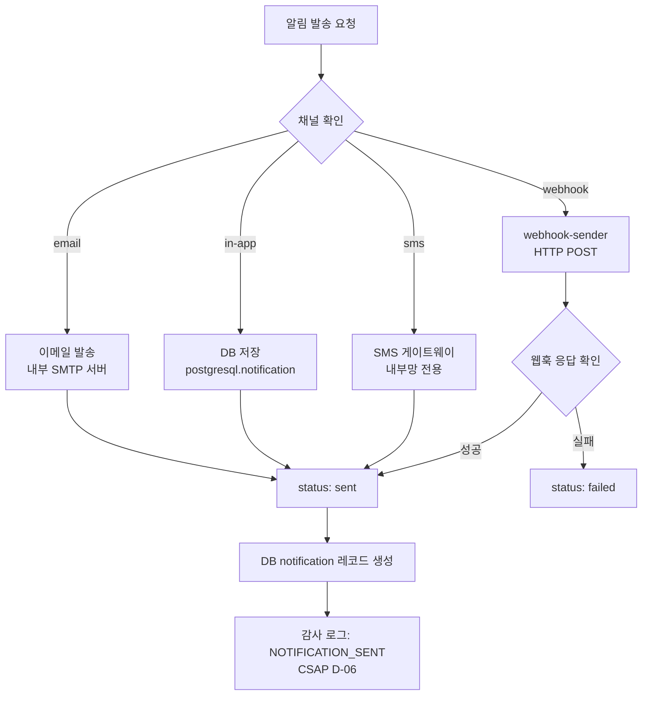
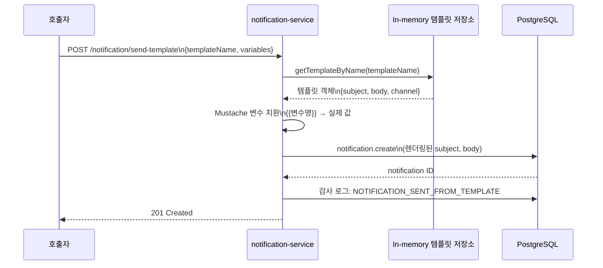
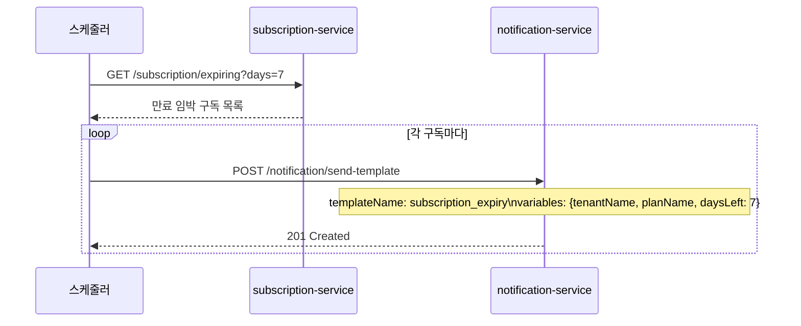
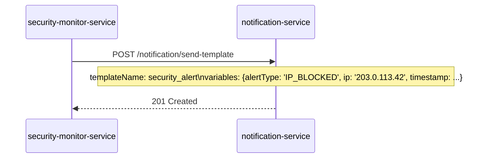

# 13. Notification Service — 알림 발송 관리 서비스

> 대상 독자: 개발팀 신규 합류자, 운영 담당자
> 관련 Plan: FR-P11.1~FR-P11.5, FR-NOTIF.1~FR-NOTIF.7
> CSAP 항목: D-06 감사 로그, D-08 접근 통제(테넌트 격리), D-12 입력 검증

---

## 서비스 개요 카드

| 항목 | 값 |
|------|-----|
| 서비스명 | notification-service |
| 역할 | 알림 발송(이메일·인앱·SMS·웹훅), 템플릿 관리, 발송 이력 조회, 채널 분석 |
| 기본 포트 | 3006 |
| 프레임워크 | Fastify + TypeScript |
| DB | PostgreSQL (Prisma ORM) |
| 템플릿 저장소 | In-memory Map (기본 4개 템플릿 내장, 재시작 시 초기화) |
| 의존 서비스 | auth-service (JWT 검증), compliance-service (감사 로그), webhook-sender (웹훅 전송) |
| CSAP 적용 | D-06(감사 로그), D-08(접근 통제·테넌트 격리), D-12(입력 검증) |
| Rate Limit | 발송 20/min, 읽기 100/min, 템플릿 30/min |

---

## 공공기관 알림 요건

공공기관 SaaS에서는 일반 상업 서비스보다 엄격한 알림 요건이 적용됩니다.

**보안 알림 (Security Alert)**
보안 이벤트(IP 차단, 로그인 실패, CSAP 위반 등) 발생 시 담당자에게 즉시 알려야 합니다. security-monitor-service가 임계값을 초과 탐지하면 notification-service를 통해 `security_alert` 템플릿으로 인앱 알림을 발송합니다.

**구독 만료 안내**
회계연도 결산을 앞두고 구독 만료를 미리 안내해야 합니다. `subscription_expiry` 템플릿으로 N일 전 이메일을 자동 발송합니다.

**감사 알림**
CSAP 감리 준비 기간에 관련 담당자에게 준비 상태를 알리는 알림을 발송할 수 있습니다.

**알림 채널 제약**
공공망 환경에서는 외부 SMS 수신이 제한될 수 있습니다. 주요 채널은 이메일과 인앱(in-app)을 사용하고, SMS는 내부망에서만 사용 가능한지 사전 확인이 필요합니다.

---

## 알림 발송 흐름



---

## 템플릿 기반 발송 흐름



---

## 기본 내장 템플릿 목록

서비스 시작 시 다음 4개 템플릿이 자동으로 등록됩니다.

| 이름 | 채널 | 용도 | 변수 |
|------|------|------|------|
| `user_welcome` | email | 신규 사용자 환영 | `userName`, `tenantName`, `role`, `portalUrl` |
| `subscription_expiry` | email | 구독 만료 안내 | `tenantName`, `planName`, `daysLeft` |
| `security_alert` | in-app | 보안 이벤트 알림 | `alertType`, `description`, `timestamp`, `ip` |
| `webhook_default` | webhook | 일반 웹훅 알림 | `eventType`, `tenantId`, `timestamp`, `data` |

Mustache 패턴(`{{변수명}}`)으로 동적 값을 치환합니다.

---

## 공공기관 알림 시나리오

### 시나리오 1: 구독 만료 7일 전 자동 알림



### 시나리오 2: IP 차단 시 보안 담당자 알림



---

## 주요 API 엔드포인트

| 메서드 | 경로 | 설명 | 권한 | Rate Limit |
|--------|------|------|------|-----------|
| POST | `/notification/send` | 알림 직접 발송 | 인증 필요 | 20/min |
| POST | `/notification/send-template` | 템플릿 기반 발송 | 인증 필요 | 20/min |
| GET | `/notification/user/:userId` | 사용자 알림 목록 | 본인 또는 관리자 | 100/min |
| GET | `/notification/user/:userId/unread-count` | 읽지 않은 알림 수 | 본인 또는 관리자 | 100/min |
| PUT | `/notification/user/:userId/read-all` | 일괄 읽음 처리 | 본인 또는 관리자 | 100/min |
| PUT | `/notification/:id/read` | 단건 읽음 처리 | 본인 또는 관리자 | 100/min |
| GET | `/notification/history` | 발송 이력 (테넌트 격리) | 테넌트 격리 | 100/min |
| GET | `/notification/stats` | 알림 통계 | SUPER_ADMIN | 100/min |
| GET | `/notification/analytics/delivery` | 전달률 추이 | SUPER_ADMIN | 100/min |
| GET | `/notification/analytics/channels` | 채널별 분석 | SUPER_ADMIN | 100/min |
| POST | `/notification/templates` | 템플릿 생성 | SUPER_ADMIN | 30/min |
| GET | `/notification/templates` | 템플릿 목록 | 인증 필요 | 100/min |
| GET | `/notification/templates/:id` | 템플릿 상세 | 인증 필요 | 100/min |
| PUT | `/notification/templates/:id` | 템플릿 수정 | SUPER_ADMIN | 30/min |
| DELETE | `/notification/templates/:id` | 템플릿 삭제 | SUPER_ADMIN | 30/min |

---

## 접근 통제 (CSAP D-08)

| 엔드포인트 | 접근 제어 규칙 |
|------------|-------------|
| `GET /user/:userId` | 본인 userId와 일치하거나 TENANT_ADMIN/SUPER_ADMIN |
| `PUT /:id/read` | 알림 소유 userId와 일치하거나 관리자 |
| `GET /history` | SUPER_ADMIN은 전체 조회, 그 외는 본인 테넌트만 |
| 템플릿 변경 | SUPER_ADMIN 전용 |

---

## 웹훅 발송 방식

웹훅 채널은 외부 시스템에 이벤트를 실시간으로 알릴 때 사용합니다.

```json
POST /notification/send
{
  "channel": "webhook",
  "subject": "구독 만료 알림",
  "body": "행정안전부 테넌트의 구독이 7일 후 만료됩니다.",
  "webhookUrl": "https://intranet.agency.go.kr/webhook/saas-events",
  "tenantId": "tenant-uuid"
}
```

webhook-sender 모듈이 HTTP POST로 대상 URL에 JSON 페이로드를 전송합니다. 발송 성공/실패 여부가 `notification.status`에 기록됩니다.

---

## 실습 curl 예시

### 1. 인앱 알림 직접 발송

```bash
curl -s -X POST \
  -H "Content-Type: application/json" \
  -H "x-internal-service-key: ${INTERNAL_SERVICE_KEY}" \
  -H "x-user-id: system" \
  -H "x-user-role: SUPER_ADMIN" \
  -d '{
    "userId": "user-uuid-001",
    "channel": "in-app",
    "subject": "시스템 점검 안내",
    "body": "2026-04-12 02:00~04:00 시스템 점검이 예정되어 있습니다."
  }' \
  http://localhost:3006/notification/send | jq '.data.id'
```

### 2. 템플릿 기반 구독 만료 알림 발송

```bash
curl -s -X POST \
  -H "Content-Type: application/json" \
  -H "x-internal-service-key: ${INTERNAL_SERVICE_KEY}" \
  -H "x-user-id: system" \
  -H "x-user-role: SUPER_ADMIN" \
  -d '{
    "templateName": "subscription_expiry",
    "tenantId": "'"${TENANT_ID}"'",
    "variables": {
      "tenantName": "행정안전부",
      "planName": "공공기관 표준 플랜",
      "daysLeft": "7"
    }
  }' \
  http://localhost:3006/notification/send-template | jq
```

### 3. 사용자 미확인 알림 조회

```bash
curl -s \
  -H "x-internal-service-key: ${INTERNAL_SERVICE_KEY}" \
  -H "x-user-id: user-uuid-001" \
  -H "x-user-role: USER" \
  http://localhost:3006/notification/user/user-uuid-001/unread-count | jq '.data.unreadCount'
```

### 4. 특정 알림 읽음 처리

```bash
curl -s -X PUT \
  -H "x-internal-service-key: ${INTERNAL_SERVICE_KEY}" \
  -H "x-user-id: user-uuid-001" \
  -H "x-user-role: USER" \
  http://localhost:3006/notification/${NOTIFICATION_ID}/read | jq '.data.status'
```

### 5. 일괄 읽음 처리

```bash
curl -s -X PUT \
  -H "x-internal-service-key: ${INTERNAL_SERVICE_KEY}" \
  -H "x-user-id: user-uuid-001" \
  -H "x-user-role: USER" \
  http://localhost:3006/notification/user/user-uuid-001/read-all | jq '.data.markedAsRead'
```

### 6. 새 보안 알림 템플릿 생성

```bash
curl -s -X POST \
  -H "Content-Type: application/json" \
  -H "x-internal-service-key: ${INTERNAL_SERVICE_KEY}" \
  -H "x-user-id: admin" \
  -H "x-user-role: SUPER_ADMIN" \
  -d '{
    "name": "csap_audit_reminder",
    "channel": "email",
    "subject": "[CSAP 감리] {{daysLeft}}일 전 준비 체크리스트",
    "body": "CSAP 감리가 {{daysLeft}}일 후 예정되어 있습니다.\n담당자: {{contactName}}\n체크리스트: {{checklistUrl}}"
  }' \
  http://localhost:3006/notification/templates | jq '.data.id'
```

### 7. 발송 이력 조회 (이메일 채널만)

```bash
curl -s \
  -H "x-internal-service-key: ${INTERNAL_SERVICE_KEY}" \
  -H "x-user-role: SUPER_ADMIN" \
  "http://localhost:3006/notification/history?channel=email&page=1&pageSize=20" \
  | jq '.data[] | {id, subject, status, createdAt}'
```

### 8. 채널별 전달 분석

```bash
curl -s \
  -H "x-internal-service-key: ${INTERNAL_SERVICE_KEY}" \
  -H "x-user-role: SUPER_ADMIN" \
  http://localhost:3006/notification/analytics/channels | jq
```

---

## 감사 로그 이벤트 목록

| 이벤트 코드 | 발생 시점 | CSAP 근거 |
|------------|---------|---------|
| `NOTIFICATION_SENT` | 알림 직접 발송 | D-06 |
| `NOTIFICATION_SENT_FROM_TEMPLATE` | 템플릿 기반 발송 | D-06 |
| `NOTIFICATIONS_BULK_READ` | 일괄 읽음 처리 | D-06 |
| `TEMPLATE_CREATED` | 템플릿 생성 | D-06 |
| `TEMPLATE_UPDATED` | 템플릿 수정 | D-06 |
| `TEMPLATE_DELETED` | 템플릿 삭제 | D-06 |

---

## 입력 검증 규칙 (CSAP D-12)

| 필드 | 검증 규칙 |
|------|---------|
| `channel` | enum `['email', 'in-app', 'sms', 'webhook']` |
| `subject` | 1~200자 필수 |
| `body` | 1자 이상 필수 |
| `webhookUrl` | URL 형식 (`z.string().url()`) |
| `templateName` | 1자 이상 필수 |
| `variables` | `Record<string, string>` (기본값 `{}`) |
| `channel` (history 쿼리) | enum 검증, 위반 시 400 |
| `status` (history 쿼리) | enum `['sent','failed','read','pending']` |

---

## 초보자 FAQ

**Q. 이메일을 실제로 발송하려면 무엇이 필요한가요?**
A. 현재 구현은 DB에 알림 레코드를 저장하는 형태입니다. 실제 이메일 발송을 위해서는 내부 SMTP 서버 연동이 필요합니다. 환경 변수(`SMTP_HOST`, `SMTP_PORT`, `SMTP_USER`, `SMTP_PASS`)를 설정하고 nodemailer 등의 라이브러리를 통합하세요.

**Q. 템플릿 변수 치환이 실패하면 어떻게 되나요?**
A. 치환 실패 시 `{{변수명}}` 그대로 남습니다. 예를 들어 `daysLeft` 변수를 전달하지 않으면 메시지에 `{{daysLeft}}`가 그대로 노출됩니다. 필수 변수는 호출 시 반드시 포함하세요.

**Q. 알림 발송 실패 시 재시도 로직이 있나요?**
A. 웹훅 채널의 경우 webhook-sender 모듈이 발송 시도를 1회 수행하고 결과를 `status: failed`로 기록합니다. 자동 재시도 로직은 현재 미구현 상태입니다. 실패 알림을 주기적으로 조회하여 수동 재시도를 구현할 수 있습니다.

**Q. SUPER_ADMIN이 다른 테넌트 사용자의 알림을 조회할 수 있나요?**
A. 네. SUPER_ADMIN은 `GET /notification/history` 에서 모든 테넌트의 발송 이력을 조회할 수 있습니다. 개별 사용자 알림(`/user/:userId`)은 역할에 관계없이 `x-user-id`와 `userId` 일치 여부를 확인합니다.

**Q. 기본 템플릿이 서비스 재시작 시 초기화되면 추가한 템플릿은 어떻게 되나요?**
A. In-memory 템플릿 저장소이므로 서비스 재시작 시 기본 4개 템플릿만 복원됩니다. 추가로 생성한 템플릿은 사라집니다. 프로덕션에서는 DB 기반 영속 저장으로 전환이 필요합니다.
