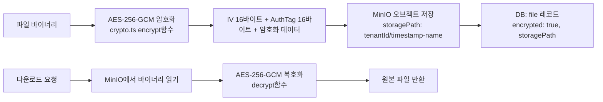
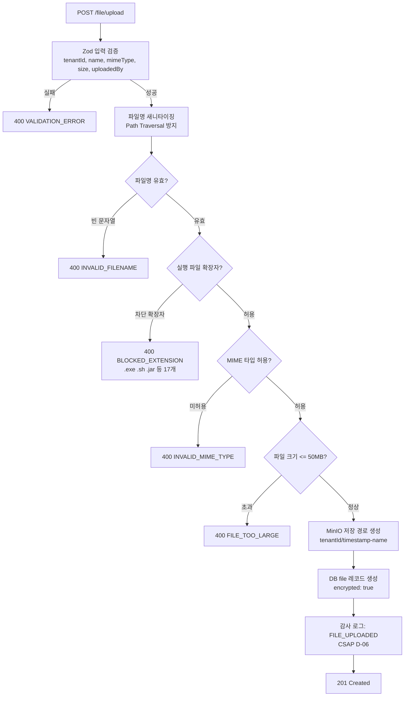
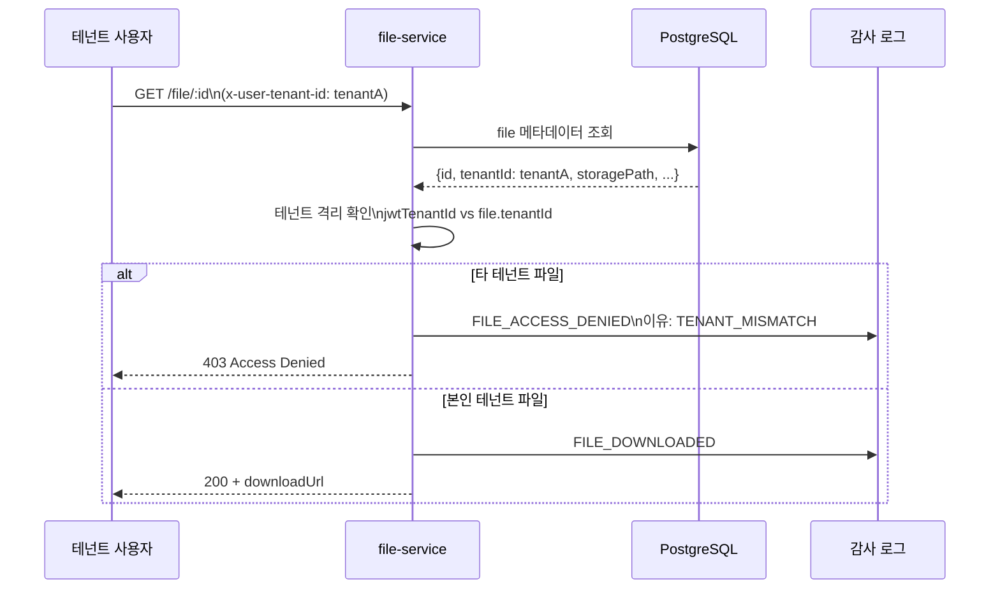
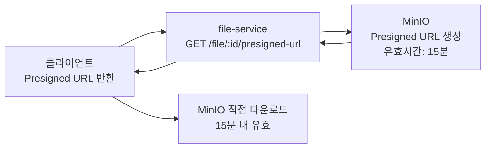

# 14. File Service — 파일 업로드·다운로드 관리 서비스

> 대상 독자: 개발팀 신규 합류자, 보안 담당자, 운영 담당자
> 관련 Plan: FR-P12.1~FR-P12.5, FR-FILE.1~FR-FILE.5
> CSAP 항목: D-06 감사 로그, D-08 접근 통제, D-09 암호화, D-12 입력 검증(MIME·경로)

---

## 서비스 개요 카드

| 항목 | 값 |
|------|-----|
| 서비스명 | file-service |
| 역할 | 파일 업로드·다운로드, 메타데이터 관리, AES-256 암호화, N2SF 등급별 저장 정책 |
| 기본 포트 | 3009 |
| 프레임워크 | Fastify + TypeScript |
| DB | PostgreSQL (Prisma ORM — 메타데이터) |
| 파일 저장소 | MinIO (오브젝트 스토리지, 실제 파일 바이너리) |
| 암호화 | AES-256-GCM (CSAP D-09) |
| 의존 서비스 | auth-service (JWT 검증), compliance-service (감사 로그) |
| CSAP 적용 | D-06(감사 로그), D-08(테넌트 격리), D-09(AES-256 암호화), D-12(MIME·파일명 검증) |
| Rate Limit | 읽기 100/min, 업로드 10/min, 삭제 5/5min |

---

## N2SF 등급별 파일 저장 정책

파일 데이터는 N2SF 데이터 등급에 따라 저장 방식이 달라집니다.

| 등급 | 분류 | 저장 정책 | AI 분석 |
|------|------|---------|---------|
| C (기밀) | 개인정보, 기관 기밀 문서 | 별도 암호화 버킷, 접근 로그 전수 기록 | 절대 금지 |
| S (민감) | 내부 업무 문서, 계약서 | AES-256-GCM 암호화 저장, 테넌트 격리 | 금지 |
| O (공개) | 공지사항, 서식 양식 | 표준 암호화 저장 | PII 마스킹 후 가능 |

현재 구현에서는 모든 파일이 `encrypted: true`로 저장됩니다. 등급별 추가 정책(별도 버킷, 접근 로그 강화)은 MinIO 버킷 정책과 연동하여 설정합니다.

---

## AES-256-GCM 암호화 구조



**환경 변수 요구사항 (CSAP D-09)**
```
FILE_ENCRYPTION_KEY=<64자리 hex 문자열, 32바이트 AES-256 키>
```

키 생성 방법:
```bash
node -e "console.log(require('crypto').randomBytes(32).toString('hex'))"
```

---

## 파일 업로드 보안 검증 흐름



---

## 허용 파일 형식

| MIME 타입 | 설명 |
|---------|------|
| `application/pdf` | PDF 문서 |
| `application/msword` | Word 문서 (.doc) |
| `application/vnd.openxmlformats-officedocument.wordprocessingml.document` | Word (.docx) |
| `application/vnd.ms-excel` | Excel (.xls) |
| `application/vnd.openxmlformats-officedocument.spreadsheetml.sheet` | Excel (.xlsx) |
| `image/png` | PNG 이미지 |
| `image/jpeg` | JPEG 이미지 |
| `text/plain` | 텍스트 파일 |
| `text/csv` | CSV 파일 |

**차단 확장자 (17개)**
`.exe`, `.bat`, `.cmd`, `.sh`, `.ps1`, `.vbs`, `.js`, `.msi`, `.com`, `.scr`, `.pif`, `.hta`, `.cpl`, `.msp`, `.jar`, `.wsf`, `.reg`

---

## 파일명 새니타이징 (Path Traversal 방지)

```
원본 파일명: "../../../etc/passwd"
새니타이징 결과: "____etc_passwd"
  - / → _  (경로 구분자 제거)
  - \ → _  (백슬래시 제거)
  - .. → _ (상위 디렉토리 탐색 제거)
  - 선행/후행 공백·점 제거
  - 최대 255자 제한
```

빈 문자열이 되면 `INVALID_FILENAME` 오류를 반환합니다.

---

## 파일 다운로드 및 접근 제어



다운로드 성공과 실패 모두 감사 로그로 기록됩니다. 타 테넌트 파일 접근 시도는 `FILE_ACCESS_DENIED` 이벤트로 기록되어 보안 모니터링에 활용됩니다.

---

## 파일 목록 검색 및 필터 (FR-FILE.2)

`GET /file/list` 는 다양한 필터를 지원합니다.

| 쿼리 파라미터 | 설명 |
|-------------|------|
| `search` | 파일명 부분 검색 (대소문자 무시) |
| `mimeType` | MIME 타입 필터 |
| `minSize` / `maxSize` | 파일 크기 범위 (바이트) |
| `startDate` / `endDate` | 업로드 날짜 범위 |
| `sortBy` | 정렬 기준 (`name`, `size`, `createdAt`, `mimeType`) |
| `sortOrder` | `asc` / `desc` (기본 `desc`) |
| `page` / `pageSize` | 페이지네이션 (최대 100) |

---

## Presigned URL 방식 (향후 계획)

현재 구현은 서비스가 MinIO에서 파일을 읽어 클라이언트에 전달하는 프록시 방식입니다. 대용량 파일 처리를 위해 MinIO Presigned URL 방식이 계획되어 있습니다.



Presigned URL의 유효시간(15분)은 JWT 접근 토큰 유효시간과 동일하게 설정하여 일관된 보안 정책을 유지합니다.

---

## 주요 API 엔드포인트

| 메서드 | 경로 | 설명 | 권한 | Rate Limit |
|--------|------|------|------|-----------|
| POST | `/file/upload` | 파일 업로드 | 테넌트 사용자 | 10/min |
| GET | `/file/list` | 파일 목록 (검색/필터) | 본인 테넌트 | 100/min |
| GET | `/file/:id` | 파일 다운로드 | 본인 테넌트 | 100/min |
| GET | `/file/:id/meta` | 파일 메타데이터 조회 | 본인 테넌트 | 100/min |
| DELETE | `/file/:id` | 파일 삭제 | 본인 테넌트 | 5/5min |
| GET | `/file/storage-usage` | 저장 용량 조회 | 테넌트 격리 | 100/min |
| GET | `/file/stats` | 파일 통계 | SUPER_ADMIN | 100/min |

---

## 실습 curl 예시

### 1. 파일 업로드 (메타데이터 방식)

```bash
curl -s -X POST \
  -H "Content-Type: application/json" \
  -H "x-internal-service-key: ${INTERNAL_SERVICE_KEY}" \
  -H "x-user-id: user-001" \
  -H "x-user-role: TENANT_ADMIN" \
  -H "x-user-tenant-id: ${TENANT_ID}" \
  -d '{
    "tenantId": "'"${TENANT_ID}"'",
    "name": "2026년_사업계획서.pdf",
    "mimeType": "application/pdf",
    "size": 2097152,
    "uploadedBy": "user-001"
  }' \
  http://localhost:3009/file/upload | jq '.data | {id, name, storagePath, encrypted}'
```

### 2. 파일 목록 조회 (PDF만)

```bash
curl -s \
  -H "x-internal-service-key: ${INTERNAL_SERVICE_KEY}" \
  -H "x-user-role: TENANT_ADMIN" \
  -H "x-user-tenant-id: ${TENANT_ID}" \
  "http://localhost:3009/file/list?mimeType=application%2Fpdf&sortBy=createdAt&sortOrder=desc" \
  | jq '.data[] | {id, name, size}'
```

### 3. 파일 다운로드

```bash
curl -s \
  -H "x-internal-service-key: ${INTERNAL_SERVICE_KEY}" \
  -H "x-user-id: user-001" \
  -H "x-user-role: TENANT_ADMIN" \
  -H "x-user-tenant-id: ${TENANT_ID}" \
  http://localhost:3009/file/${FILE_ID} | jq '.data.downloadUrl'
```

### 4. 파일 메타데이터 조회

```bash
curl -s \
  -H "x-internal-service-key: ${INTERNAL_SERVICE_KEY}" \
  -H "x-user-role: TENANT_ADMIN" \
  -H "x-user-tenant-id: ${TENANT_ID}" \
  http://localhost:3009/file/${FILE_ID}/meta \
  | jq '.data | {id, name, mimeType, size, encrypted, createdAt}'
```

### 5. 파일 검색 (이름 검색)

```bash
curl -s \
  -H "x-internal-service-key: ${INTERNAL_SERVICE_KEY}" \
  -H "x-user-role: TENANT_ADMIN" \
  -H "x-user-tenant-id: ${TENANT_ID}" \
  "http://localhost:3009/file/list?search=사업계획서" \
  | jq '.data[] | {id, name, createdAt}'
```

### 6. 파일 삭제

```bash
curl -s -X DELETE \
  -H "x-internal-service-key: ${INTERNAL_SERVICE_KEY}" \
  -H "x-user-id: user-001" \
  -H "x-user-role: TENANT_ADMIN" \
  -H "x-user-tenant-id: ${TENANT_ID}" \
  http://localhost:3009/file/${FILE_ID} | jq '.message'
```

### 7. 저장 용량 확인

```bash
curl -s \
  -H "x-internal-service-key: ${INTERNAL_SERVICE_KEY}" \
  -H "x-user-role: TENANT_ADMIN" \
  -H "x-user-tenant-id: ${TENANT_ID}" \
  http://localhost:3009/file/storage-usage | jq
```

---

## 감사 로그 이벤트 목록

| 이벤트 코드 | 발생 시점 | CSAP 근거 |
|------------|---------|---------|
| `FILE_UPLOADED` | 파일 업로드 완료 | D-06 |
| `FILE_DOWNLOADED` | 파일 다운로드 | D-06 |
| `FILE_ACCESS_DENIED` | 타 테넌트 파일 접근 시도 | D-06, D-08 |
| `FILE_DELETED` | 파일 삭제 | D-06 |

파일 접근 거부 이벤트는 security-monitor-service에서 이상 접근 탐지에 활용됩니다.

---

## 입력 검증 규칙 (CSAP D-12)

| 필드 | 검증 규칙 |
|------|---------|
| `tenantId` | 1자 이상 필수 |
| `name` | 1~255자, 새니타이징 후 검증 |
| `mimeType` | 허용 목록(9종) 확인 |
| `size` | 정수, 1 이상, 최대 50MB (52,428,800 바이트) |
| 파일 확장자 | 차단 목록(17종) 확인 |

---

## 초보자 FAQ

**Q. 실제 파일 바이너리는 어디에 저장되나요?**
A. MinIO 오브젝트 스토리지에 저장됩니다. DB(PostgreSQL)에는 파일 메타데이터(`name`, `mimeType`, `size`, `storagePath`, `encrypted`)만 저장됩니다. 현재 구현에서 MinIO 클라이언트 연동은 인프라 구성 시 완성됩니다.

**Q. 파일 암호화는 자동으로 되나요?**
A. 네. `encrypted: true`로 DB에 기록됩니다. 실제 암호화는 `FILE_ENCRYPTION_KEY` 환경 변수 기반 AES-256-GCM으로 처리됩니다. 이 환경 변수가 없으면 서비스가 시작되지 않습니다.

**Q. 50MB를 초과하는 파일을 업로드해야 한다면?**
A. 현재 최대 50MB 제한이 적용됩니다. 대용량 파일이 필요하면 Multipart Upload 방식(MinIO 청크 업로드)을 도입해야 합니다.

**Q. 파일을 삭제하면 MinIO에서도 삭제되나요?**
A. 현재 구현에서는 DB 레코드만 삭제합니다. MinIO 실제 오브젝트 삭제는 MinIO 클라이언트 연동이 완성된 후 구현될 예정입니다.

**Q. SUPER_ADMIN도 다른 테넌트의 파일을 볼 수 없나요?**
A. SUPER_ADMIN은 `x-user-tenant-id` 검증에서 제외됩니다. 즉, SUPER_ADMIN은 모든 테넌트의 파일에 접근할 수 있으며, 이 접근도 감사 로그로 기록됩니다.

**Q. 파일명에 한글을 사용해도 되나요?**
A. 네. 새니타이징은 경로 구분자와 특수 패턴만 제거합니다. 한글 파일명은 그대로 허용됩니다. 단, 저장 경로(`storagePath`)에는 `tenantId/timestamp-name` 형식으로 저장되어 충돌을 방지합니다.
