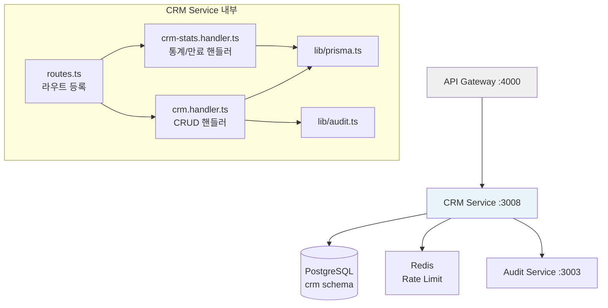
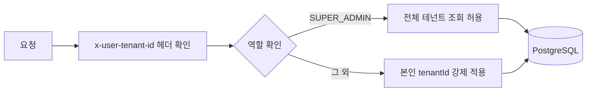

# 15. CRM 서비스 (crm-service)

> **Design Ref**: DESIGN-MTU-P09, SVC-CRM-R1 DESIGN
> **Plan SC**: FR-P09.1 ~ FR-P09.5, FR-CRM.1 ~ FR-CRM.5
> **CSAP**: D-06 감사 로그, D-08 접근 통제, D-09 암호화, D-10 네트워크 보안
> **포트**: 3008

---

## 1. 역할 및 개요

CRM 서비스는 공공기관 SaaS 플랫폼의 고객 관계 관리(Customer Relationship Management) 기능을 담당합니다. 일반 영리 기업의 CRM과 달리 공공기관 특화 요소가 적용됩니다.

**공공기관 특화 요소:**
- 기관(고객사)별 완전한 테넌트 격리 — CSAP D-08-05
- 계약 만료 알림 (국가 계약법상 재계약 사전 통보 의무 대응)
- 모든 계약 변경 작업의 감사 로그 전수 기록 — CSAP D-06
- 담당자 이메일 형식 검증 (공공기관 도메인 정책 대응)

**핵심 비즈니스 도메인:**
- 고객사(Customer): 기관 정보 관리
- 담당자(Contact): 기관 내 담당 공무원 정보
- 계약(Contract): 서비스 도입 계약 및 갱신 이력
- 영업 파이프라인(Pipeline): 영업 단계별 진행 현황

---

## 2. 아키텍처 위치



---

## 3. 데이터 모델

### 3.1 고객사 (Customer)

| 필드 | 타입 | 설명 |
|------|------|------|
| id | String (CUID) | 고유 식별자 |
| name | String | 기관명 (필수, 최대 200자) |
| industry | String? | 업종/분야 (예: 중앙행정기관, 지자체) |
| size | String? | 기관 규모 |
| status | String | 영업 단계: prospect/qualified/proposal/negotiation/closed_won/closed_lost |
| tenantId | String? | 테넌트 격리 키 (CSAP D-08-05) |
| createdAt | DateTime | 생성 일시 |
| updatedAt | DateTime | 수정 일시 |

### 3.2 담당자 (Contact)

| 필드 | 타입 | 설명 |
|------|------|------|
| id | String (CUID) | 고유 식별자 |
| customerId | String | 소속 고객사 ID (FK) |
| name | String | 성명 (최대 100자) |
| email | String | 업무 이메일 (형식 검증 필수) |
| phone | String? | 연락처 |
| role | String? | 직책 |
| isPrimary | Boolean | 주담당자 여부 (기본: false) |

### 3.3 계약 (Contract)

| 필드 | 타입 | 설명 |
|------|------|------|
| id | String (CUID) | 고유 식별자 |
| customerId | String | 고객사 ID (FK) |
| title | String | 계약명 (최대 200자) |
| value | Float | 계약 금액 (원) |
| startDate | DateTime | 계약 시작일 |
| endDate | DateTime | 계약 종료일 (만료 알림 기준) |
| status | String | 계약 상태: active/expired/cancelled |

---

## 4. API 엔드포인트

### 4.1 고객사 관리 (FR-P09.1)

| 메서드 | 경로 | 설명 | Rate Limit |
|--------|------|------|------------|
| GET | /crm/customers | 고객사 목록 조회 (페이지네이션, 검색, 필터) | 100/60s |
| GET | /crm/customers/:id | 고객사 상세 조회 | 100/60s |
| POST | /crm/customers | 고객사 등록 | 30/60s |
| PUT | /crm/customers/:id | 고객사 수정 | 30/60s |

**목록 조회 쿼리 파라미터:**
- `page`: 페이지 번호 (기본: 1)
- `pageSize`: 페이지 크기 (최대: 100, 기본: 20)
- `search`: 기관명 부분 일치 검색
- `status`: 영업 단계 필터
- `industry`: 업종 필터

### 4.2 담당자 관리 (FR-P09.2)

| 메서드 | 경로 | 설명 | Rate Limit |
|--------|------|------|------------|
| GET | /crm/customers/:id/contacts | 고객사 담당자 목록 (최대 200건) | 100/60s |
| POST | /crm/customers/:id/contacts | 담당자 등록 | 30/60s |

### 4.3 계약 관리 (FR-P09.3, FR-CRM.4)

| 메서드 | 경로 | 설명 | Rate Limit |
|--------|------|------|------------|
| GET | /crm/contracts | 계약 목록 (테넌트 격리) | 100/60s |
| POST | /crm/contracts | 계약 등록 | 30/60s |
| PUT | /crm/contracts/:id | 계약 수정 | 30/60s |
| GET | /crm/contracts/expiring | 만료 임박 계약 목록 | 100/60s |

**만료 임박 계약 쿼리 파라미터:**
- `days`: 만료 임박 기준 일수 (1~365, 기본: 30)

### 4.4 파이프라인 및 통계 (FR-P09.4, FR-CRM.2~5)

| 메서드 | 경로 | 설명 | Rate Limit |
|--------|------|------|------------|
| GET | /crm/pipeline | 영업 파이프라인 단계별 집계 | 100/60s |
| GET | /crm/stats | CRM 통계 대시보드 | 100/60s |

---

## 5. 테넌트 격리 구현 (CSAP D-08-05)

CRM 서비스의 모든 데이터 조회는 JWT 클레임 기반 테넌트 격리를 적용합니다.



**격리 규칙:**
- `SUPER_ADMIN`: `?tenantId` 쿼리 파라미터로 특정 테넌트 선택 가능, 미지정 시 전체 조회
- `그 외 모든 역할`: JWT의 `x-user-tenant-id` 헤더값으로 조회 범위 강제 제한
- 타 테넌트 리소스 접근 시도: 403 Forbidden 반환

---

## 6. 감사 로그 이벤트 코드 (CSAP D-06)

모든 데이터 변경 작업은 `lib/audit.ts`의 `logCrmEvent()`를 통해 기록됩니다.

| 이벤트 코드 | 트리거 조건 | 기록 필드 |
|------------|------------|----------|
| CUSTOMER_CREATED | 고객사 등록 | name, tenantId |
| CUSTOMER_UPDATED | 고객사 수정 | 변경된 필드 목록 |
| CONTACT_CREATED | 담당자 등록 | customerId, name |
| CONTRACT_CREATED | 계약 등록 | title, customerId |
| CONTRACT_UPDATED | 계약 수정 | 변경된 필드 목록 |

---

## 7. 서버 구성

**진입점** (`src/index.ts`):

| 플러그인 | 역할 |
|---------|------|
| `initTelemetry` | OpenTelemetry 분산 추적 초기화 (FR-OTEL.3) |
| `configPlugin` | 환경 설정 통합 관리 (FR-R18.3) |
| `meshReadyPlugin` | SIGTERM 그레이스풀 셧다운 (FR-R18.1) |
| `healthPlugin` | DB 헬스체크 엔드포인트 |
| `rbacPlugin` | 역할 기반 접근 통제 |
| `tenantIsolationPlugin` | 멀티테넌트 데이터 격리 (FR-R18.2) |

---

## 8. 입력 검증 스키마 (CSAP D-12)

모든 쓰기 요청은 Zod 스키마로 검증합니다.

**고객사 생성:**
```
name: 최소 1자, 최대 200자 (필수)
industry: 문자열 (선택)
size: 문자열 (선택)
tenantId: 문자열 (선택, null 허용)
```

**담당자 생성:**
```
name: 최소 1자, 최대 100자 (필수)
email: 이메일 형식 검증 (필수)
phone: 문자열 (선택)
role: 문자열 (선택)
isPrimary: boolean (기본: false)
```

**계약 생성:**
```
customerId: 최소 1자 (필수)
title: 최소 1자, 최대 200자 (필수)
value: 0 이상 숫자 (필수)
startDate: ISO 8601 datetime (필수)
endDate: ISO 8601 datetime (필수)
```

---

## 9. 보안 설정

**내부 서비스 인증 (CSAP D-08):**
- 프로덕션 환경에서 `INTERNAL_SERVICE_KEY` 환경변수 미설정 시 서비스 기동 불가
- 모든 요청에서 `x-internal-service-key` 헤더 검증 (헬스체크 경로 제외)

**Rate Limiting:**
- 읽기 작업: IP당 분당 100회
- 쓰기 작업: IP당 분당 30회
- Redis 미연결 시 가용성 우선 (Rate Limit 비활성화)

---

## 10. 환경 변수

| 변수명 | 필수 | 설명 |
|--------|------|------|
| `DATABASE_URL` | 필수 | PostgreSQL 연결 URL |
| `INTERNAL_SERVICE_KEY` | 프로덕션 필수 | 서비스 간 내부 인증 키 |
| `TENANT_MASTER_KEY` | 권장 | 테넌트별 암호화 마스터 키 (hex 64자) |
| `REDIS_URL` | 권장 | Redis 연결 URL (Rate Limit용) |
| `AUDIT_SERVICE_URL` | 권장 | 감사 서비스 URL |
| `LOG_LEVEL` | 선택 | 로그 레벨 (기본: info) |

---

## 11. 실습: 계약 만료 임박 알림 워크플로우

**시나리오**: 30일 내 만료 계약을 조회하여 담당자에게 알림을 발송하는 배치 작업 구현

**1단계: 만료 임박 계약 조회**
```
GET /crm/contracts/expiring?days=30
Headers:
  x-internal-service-key: {서비스 키}
  x-user-tenant-id: {테넌트 ID}
  x-user-role: ADMIN
```

**예상 응답:**
```json
{
  "success": true,
  "data": {
    "contracts": [
      {
        "id": "contract-001",
        "title": "행정안전부 SaaS 서비스 도입 계약",
        "endDate": "2026-05-01T00:00:00.000Z",
        "customer": { "name": "행정안전부", "tenantId": "mois-001" }
      }
    ],
    "total": 1,
    "thresholdDays": 30,
    "generatedAt": "2026-04-11T09:00:00.000Z"
  }
}
```

**2단계: 담당자 조회 및 알림 발송**
```
GET /crm/customers/{customerId}/contacts
→ 주담당자(isPrimary: true) 이메일 추출
→ notification-service에 알림 발송 요청
```

**3단계: CRM 통계 확인**
```
GET /crm/stats
```
`customersByStatus` 배열에서 각 단계별 기관 수를 확인하여 영업 현황을 파악합니다.

---

## 12. 자주 묻는 질문

**Q: 고객사 삭제는 지원하지 않나요?**
A: 계약 이력 보존 의무(CSAP D-06)로 인해 하드 삭제는 지원하지 않습니다. 상태를 `closed_lost`로 변경하여 논리 삭제합니다.

**Q: 타 테넌트의 계약을 조회할 수 있나요?**
A: `SUPER_ADMIN` 역할만 가능합니다. 일반 ADMIN/USER는 본인 테넌트 데이터만 접근할 수 있습니다 (CSAP D-08-05).

**Q: 계약 금액은 암호화되나요?**
A: `TENANT_MASTER_KEY` 설정 시 `tenantIsolationPlugin`이 AES-256-GCM으로 테넌트별 암호화를 적용합니다.
