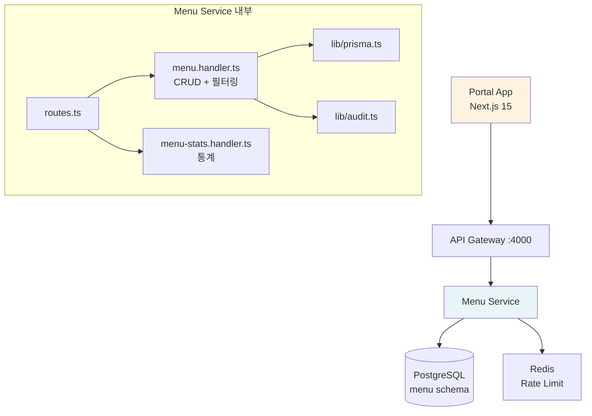
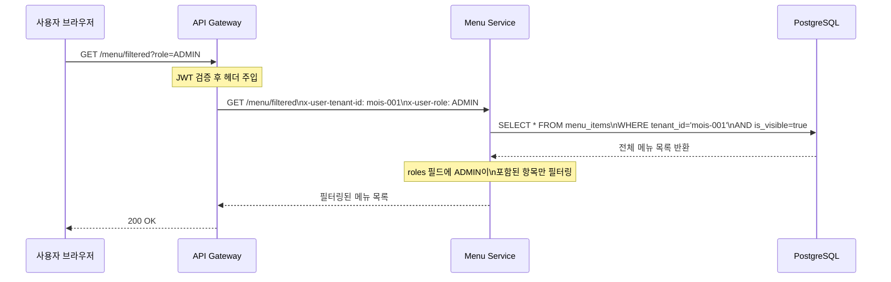
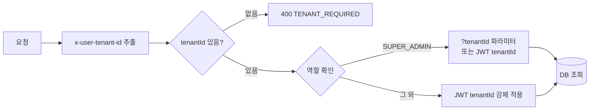

# 16. 메뉴 서비스 (menu-service)

> **Design Ref**: DESIGN-MTU-P05, SVC-MENU-R1 DESIGN
> **Plan SC**: FR-P05.1 ~ FR-P05.5, FR-MENU.1 ~ FR-MENU.5
> **CSAP**: D-06 감사 로그, D-08 접근 통제, D-10 네트워크 보안
> **포트**: 3005 (추정, 실제 환경변수로 결정)

---

## 1. 역할 및 개요

메뉴 서비스는 공공기관 SaaS 포털의 동적 메뉴 구성과 역할 기반 접근 통제를 담당합니다. 포털에 접속하는 사용자의 역할에 따라 서로 다른 메뉴 트리를 제공하여 불필요한 기능 노출을 방지합니다.

**핵심 기능:**
- 테넌트별 메뉴 트리 관리 (기관마다 다른 메뉴 구성)
- RBAC 기반 메뉴 필터링 (역할에 없는 메뉴는 응답에서 제외)
- 드래그앤드롭 순서 변경 지원 (FR-P05.3)
- 메뉴 삭제 및 순서 변경에 대한 감사 로그 전수 기록

**공공기관 특화 요소:**
- 테넌트 격리 — 기관별로 완전히 분리된 메뉴 체계
- 역할별 메뉴 필터링 — 최소 권한 원칙(Least Privilege) 준수
- 모든 메뉴 변경에 대한 불변 감사 로그 (CSAP D-06)

---

## 2. 아키텍처 위치



---

## 3. 데이터 모델: 메뉴 항목 (MenuItem)

| 필드 | 타입 | 설명 |
|------|------|------|
| id | String (CUID) | 고유 식별자 |
| tenantId | String | 소속 테넌트 ID (격리 키) |
| parentId | String? | 부모 메뉴 ID (계층 구조) |
| label | String | 메뉴 표시 이름 (최대 100자) |
| path | String | 라우팅 경로 (예: /admin/users) |
| icon | String? | 아이콘 식별자 |
| order | Int | 정렬 순서 (낮을수록 상위) |
| isVisible | Boolean | 표시 여부 (기본: true) |
| roles | Json? | 접근 허용 역할 목록 (예: ["ADMIN", "USER"]) |

**계층 구조 예시:**
```
대시보드 (order: 0)
사용자 관리 (order: 1)
  └─ 사용자 목록 (order: 0, parentId: 사용자관리ID)
  └─ 역할 관리 (order: 1, parentId: 사용자관리ID)
테넌트 관리 (order: 2, roles: ["SUPER_ADMIN"])
감사 로그 (order: 3, roles: ["SUPER_ADMIN", "ADMIN"])
```

---

## 4. API 엔드포인트

| 메서드 | 경로 | 설명 | Rate Limit |
|--------|------|------|------------|
| GET | /menu/tree | 메뉴 전체 트리 조회 (테넌트 격리) | 100/60s |
| GET | /menu/filtered | 역할별 필터링된 메뉴 조회 | 100/60s |
| GET | /menu/search?q= | 메뉴 키워드 검색 | 100/60s |
| GET | /menu/stats | 메뉴 통계 조회 | 100/60s |
| POST | /menu | 메뉴 항목 생성 | 30/60s |
| PUT | /menu/:id | 메뉴 항목 수정 | 30/60s |
| PUT | /menu/:id/order | 메뉴 순서 변경 (드래그앤드롭) | 30/60s |
| DELETE | /menu/:id | 메뉴 항목 삭제 | 10/300s |

---

## 5. RBAC 기반 메뉴 필터링 흐름 (FR-P05.2)

포털 앱은 사용자 로그인 후 역할 정보를 포함하여 `/menu/filtered` 를 호출합니다.



**필터링 로직:**
- `roles` 필드가 `null`인 메뉴: 모든 역할에게 표시
- `roles` 필드가 설정된 메뉴: 사용자 역할이 배열에 포함된 경우만 표시
- `isVisible: false`인 메뉴: 항상 제외

---

## 6. 역할별 메뉴 구조

공공기관 SaaS 플랫폼의 표준 메뉴 구성표입니다.

| 메뉴 | SUPER_ADMIN | ADMIN | USER | VIEWER |
|------|:-----------:|:-----:|:----:|:------:|
| 플랫폼 대시보드 | O | O | O | O |
| 테넌트 관리 | O | - | - | - |
| 사용자 관리 | O | O | - | O(읽기) |
| 구독 관리 | O | O | O(읽기) | O(읽기) |
| 청구/결제 | O | O | - | - |
| 서비스 카탈로그 | O | O | O | O |
| CRM | O | O | O(읽기) | O(읽기) |
| 감사 로그 | O | O(읽기) | - | O(읽기) |
| 보안 모니터링 | O | O(읽기) | - | - |
| 규정 준수 | O | O(읽기) | - | O(읽기) |
| AI 어시스턴트 | O | O | O | - |
| 파일 관리 | O | O | O | O(읽기) |
| 알림 설정 | O | O | O(읽기) | O(읽기) |

---

## 7. 테넌트 격리 (CSAP D-08-05)

메뉴 서비스의 모든 데이터 접근은 테넌트 격리를 강제합니다.



**주의**: 메뉴 트리 조회(`/menu/tree`)와 필터링 조회(`/menu/filtered`) 모두 `tenantId`가 없으면 400을 반환합니다. API 게이트웨이를 통하지 않은 직접 접근 시 이 오류가 발생합니다.

---

## 8. 순서 변경 (드래그앤드롭) 구현 패턴

관리자 포털에서 메뉴를 드래그앤드롭으로 재배치할 때 사용하는 패턴입니다.

```
1. 사용자가 "사용자 관리" 메뉴를 드래그하여 "테넌트 관리" 위로 이동
2. 포털 앱: PUT /menu/{사용자관리ID}/order
   Body: { "order": 0, "parentId": null }
3. Menu Service: 해당 메뉴 order 필드 업데이트
4. 감사 로그: MENU_REORDERED (oldOrder: 1, newOrder: 0)
5. 포털 앱: 메뉴 트리 재조회 후 리렌더링
```

---

## 9. 감사 로그 이벤트 코드 (CSAP D-06)

| 이벤트 코드 | 트리거 조건 | 기록 필드 |
|------------|------------|----------|
| MENU_CREATED | 메뉴 항목 생성 | label, path |
| MENU_UPDATED | 메뉴 항목 수정 | 변경된 필드 목록 |
| MENU_DELETED | 메뉴 항목 삭제 | tenantId |
| MENU_REORDERED | 순서 변경 | oldOrder, newOrder |

---

## 10. Rate Limiting 설정

메뉴 삭제는 실수로 인한 대규모 변경을 방지하기 위해 가장 엄격한 제한을 적용합니다.

| 작업 유형 | 한도 | 윈도우 | Redis 키 |
|----------|------|--------|---------|
| 읽기 (tree, filtered, search, stats) | 100회 | 60초 | rl:menu:read |
| 쓰기 (create, update, reorder) | 30회 | 60초 | rl:menu:write |
| 삭제 (delete) | 10회 | 300초 (5분) | rl:menu:delete |

---

## 11. 환경 변수

| 변수명 | 필수 | 설명 |
|--------|------|------|
| `DATABASE_URL` | 필수 | PostgreSQL 연결 URL |
| `INTERNAL_SERVICE_KEY` | 프로덕션 필수 | 서비스 간 내부 인증 키 |
| `REDIS_URL` | 권장 | Redis 연결 URL |
| `AUDIT_SERVICE_URL` | 권장 | 감사 서비스 URL |

---

## 12. 실습: 역할별 메뉴 구성하기

**시나리오**: 새 테넌트에 기본 메뉴 구조를 생성하고, VIEWER 역할에는 보이지 않는 관리자 메뉴를 추가합니다.

**1단계: 최상위 메뉴 생성**
```
POST /menu
Headers:
  x-internal-service-key: {서비스 키}
Body:
{
  "tenantId": "new-tenant-001",
  "label": "대시보드",
  "path": "/dashboard",
  "icon": "dashboard",
  "order": 0,
  "isVisible": true
}
```

**2단계: ADMIN 전용 메뉴 생성 (VIEWER 제외)**
```
POST /menu
Body:
{
  "tenantId": "new-tenant-001",
  "label": "사용자 관리",
  "path": "/admin/users",
  "icon": "users",
  "order": 1,
  "isVisible": true,
  "roles": ["SUPER_ADMIN", "ADMIN"]
}
```

**3단계: VIEWER 사용자로 필터링 조회 (사용자 관리 메뉴 숨겨짐)**
```
GET /menu/filtered?role=VIEWER
Headers:
  x-user-tenant-id: new-tenant-001
  x-user-role: VIEWER
```

응답에서 `roles: ["SUPER_ADMIN", "ADMIN"]`인 "사용자 관리" 메뉴는 제외되고 "대시보드"만 반환됩니다.

**4단계: 메뉴 순서 변경**
```
PUT /menu/{대시보드ID}/order
Body: { "order": 1 }

PUT /menu/{사용자관리ID}/order
Body: { "order": 0 }
```

---

## 13. 자주 묻는 질문

**Q: 메뉴 캐싱은 어떻게 하나요?**
A: 메뉴 데이터는 변경 빈도가 낮으므로 포털 앱(`platform/apps/portal`)에서 Next.js `revalidate` 옵션을 사용하여 서버 사이드 캐싱을 적용합니다. 메뉴 변경 시 Cache-Control 헤더를 통해 캐시를 무효화합니다.

**Q: 메뉴 최대 깊이가 있나요?**
A: 데이터 모델 상 제한은 없지만, 포털 UI의 3단계 이하를 권장합니다. 깊은 계층은 사용성을 저하시킵니다.

**Q: roles를 null로 설정하면 모든 사람이 볼 수 있나요?**
A: 네, `roles` 필드가 null이면 `getFilteredMenuHandler`에서 역할 제한 없이 모든 사용자에게 반환합니다. 단, `isVisible: false`인 경우 필터링에서는 제외됩니다.
