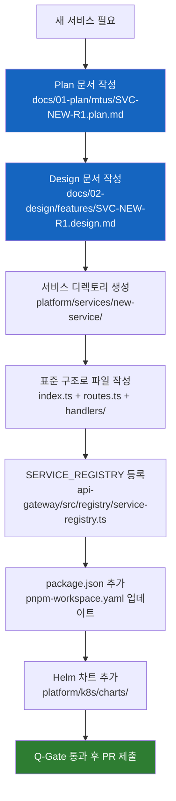

# 17개 서비스 전체 목록

> **문서 ID**: ONBOARD-02-SVC-README
> **버전**: 1.0.0 | **작성일**: 2026-04-11 | **작성자**: Implementer (Sonnet)
> **참조**: `platform/services/` 디렉토리, API Gateway 서비스 레지스트리

---

## 목차

1. [서비스 전체 목록 표](#1-서비스-전체-목록-표)
2. [서비스 그룹별 역할 설명](#2-서비스-그룹별-역할-설명)
3. [서비스 추가 절차](#3-서비스-추가-절차)

---

## 1. 서비스 전체 목록 표

아래 표는 `platform/services/api-gateway/src/registry/service-registry.ts` 에 등록된 실제 서비스 목록을 기반으로 합니다.

| 서비스 디렉토리 | 패키지명 | 포트 | 역할 | 그룹 | CSAP 매핑 | N2SF |
|--------------|--------|------|------|------|---------|------|
| `api-gateway` | `@public-saas/api-gateway` | 3000 | 단일 진입점, 라우팅, Rate Limit, Circuit Breaker | 진입점 | D-08, D-10 | - |
| `auth-service` | `@public-saas/auth-service` | 3001 | JWT 발급·검증, MFA(TOTP), 세션 관리 | 인증·보안 | D-08 | C/S/O |
| `user-service` | `@public-saas/user-service` | 3002 | 사용자 CRUD, 프로필, RBAC 권한 | 핵심 비즈니스 | D-08 | S |
| `tenant-service` | `@public-saas/tenant-service` | 3003 | 테넌트 온보딩, C/S/O 격리 정책 | 핵심 비즈니스 | D-08, D-10 | C/S/O |
| `menu-service` | `@public-saas/menu-service` | 3004 | 메뉴 구조, 역할별 메뉴 권한 | 핵심 비즈니스 | D-08 | O |
| `catalog-service` | `@public-saas/catalog-service` | 3005 | SaaS 서비스 카탈로그 | 부가 서비스 | - | O |
| `subscription-service` | `@public-saas/subscription-service` | 3006 | 구독 플랜 관리, 계약 | 핵심 비즈니스 | - | O |
| `billing-service` | `@public-saas/billing-service` | 3007 | 과금, 청구서 생성·관리 | 핵심 비즈니스 | D-09 | S |
| `crm-service` | `@public-saas/crm-service` | 3008 | 고객 관계 관리, 계약 이력 | 핵심 비즈니스 | D-08 | S |
| `ai-service` | `@public-saas/ai-service` | 3009 | RAG 엔진, AI 게이트웨이, 벡터 검색 | AI | N2SF AI규칙 | O (PII 마스킹) |
| `notification-service` | `@public-saas/notification-service` | 3010 | 이메일·SMS·푸시 알림 | 부가 서비스 | - | O |
| `audit-service` | `@public-saas/audit-service` | 3010 | 감사 로그 수집·저장·검색 | 인증·보안 | D-06 | C/S |
| `compliance-service` | `@public-saas/compliance-service` | 3011 | CSAP·N2SF 준수 현황 | 인증·보안 | D-06, D-08 | S |
| `security-service` | `@public-saas/security-service` | 3012 | 보안 이벤트 탐지·대응 | 인증·보안 | D-06 | C/S |
| `security-monitor-service` | `@public-saas/security-monitor-service` | 3013 | 실시간 위협 모니터링 | 인증·보안 | D-06 | S |
| `file-service` | `@public-saas/file-service` | 3015 | 파일 업로드·다운로드, 바이러스 스캔 | 부가 서비스 | D-09 | C/S/O |
| `saas-catalog-service` | `@public-saas/saas-catalog-service` | 3007 | 확장 SaaS 카탈로그 | 부가 서비스 | - | O |

> **포트 참조**: `platform/services/api-gateway/src/registry/service-registry.ts` 의 `SERVICE_REGISTRY` 객체 확인

---

## 2. 서비스 그룹별 역할 설명

### 그룹 1: 진입점 (Entry Point)

**api-gateway** — 모든 외부 요청의 단일 진입점입니다.

이 서비스를 거치지 않는 외부 요청은 없습니다. k3s 네트워크 정책으로 다른 서비스에 직접 접근하는 것이 차단됩니다. 개발 중 서비스를 직접 호출하려면 포트 포워딩을 사용합니다.

```bash
# 개발 중 auth-service 직접 테스트 (kubectl port-forward)
kubectl port-forward svc/auth-service 3001:3001 -n saas-core

# 또는 로컬에서 직접 실행
pnpm --filter @public-saas/auth-service dev
```

### 그룹 2: 인증·보안 서비스

이 그룹은 플랫폼의 보안을 담당합니다. 모든 서비스는 이 그룹의 서비스를 직접 구현하지 않고 `@public-saas/auth-sdk`, `@public-saas/audit-sdk` 패키지를 통해 재사용합니다.

- **auth-service**: JWT 생명주기의 완전한 관리자. 발급, 갱신, 검증, 무효화를 모두 담당.
- **audit-service**: CSAP D-06 요건에 따라 모든 민감 작업 로그를 1년 이상 보존.
- **compliance-service**: CSAP 79개 항목과 N2SF 6개 영역의 현재 준수 상태를 실시간으로 추적.
- **security-service**: 이상 로그인 패턴, 비정상 API 호출 등 보안 이벤트를 탐지.
- **security-monitor-service**: security-service의 이벤트를 실시간 대시보드로 시각화.

### 그룹 3: 핵심 비즈니스 서비스

SaaS 플랫폼의 핵심 도메인 서비스들입니다.

- **user-service**: 사용자 계정 생성·수정·삭제. 역할(RBAC) 할당.
- **tenant-service**: 기관(테넌트) 등록, C/S/O 격리 수준 설정, 테넌트별 설정 관리.
- **subscription-service**: 어떤 SaaS 서비스를 어떤 플랜으로 구독하는지 관리.
- **billing-service**: 구독에 따른 과금 계산, 청구서 생성. 금액 데이터는 AES-256 암호화.
- **crm-service**: 기관과의 계약 이력, 지원 티켓, 관계 관리.
- **menu-service**: 역할(RBAC)에 따라 표시되는 메뉴 구조 관리.

### 그룹 4: 부가 서비스

핵심 서비스를 지원하는 보조 서비스들입니다.

- **catalog-service / saas-catalog-service**: 제공 가능한 SaaS 서비스 목록과 스펙을 관리.
- **notification-service**: 이메일, SMS, 푸시 알림 발송. `event-bus`를 통해 비동기로 동작.
- **file-service**: 첨부파일 업로드·다운로드. 바이러스 스캔 + AES-256 암호화.

### 그룹 5: AI 서비스

- **ai-service**: RAG(Retrieval-Augmented Generation) 엔진과 AI 게이트웨이를 제공합니다. 내부적으로 N2SF 데이터 등급 검사를 수행하며, O등급 데이터에서 PII를 마스킹한 후에만 외부 AI API로 전송합니다.

```
ai-service 데이터 흐름:
요청 데이터 → N2SF 등급 확인 → C/S이면 오류 반환
                              → O이면 PII 마스킹 → AI Gateway → 외부 AI API
```

---

## 3. 서비스 추가 절차

새로운 서비스를 추가할 때는 반드시 다음 절차를 따릅니다.



### 서비스 추가 시 필수 체크리스트

```
[ ] Plan 문서 (docs/01-plan/mtus/SVC-{이름}-R1.plan.md) 작성 완료
[ ] Design 문서 (docs/02-design/features/SVC-{이름}-R1.design.md) 작성 완료
[ ] src/index.ts: initTelemetry() 호출 (OpenTelemetry 계측)
[ ] src/index.ts: meshReadyPlugin 등록 (Graceful Shutdown)
[ ] src/index.ts: healthPlugin 등록 (/health 엔드포인트 필수)
[ ] 모든 핸들러: Zod 입력 검증 (CSAP D-12)
[ ] 모든 핸들러: 감사 로그 (CSAP D-06)
[ ] SERVICE_REGISTRY에 등록 (api-gateway)
[ ] 포트 번호 할당 (기존 포트와 중복 금지)
[ ] Helm 차트 추가
[ ] 테스트 커버리지 80% 이상
```

---

## 다음 단계

**[다음: 01-api-gateway.md — API Gateway 심화 학습]**

---

## 변경 이력

| 버전 | 일자 | 내용 | 작성자 |
|------|------|------|------|
| 1.0.0 | 2026-04-11 | 최초 작성 | Implementer (Sonnet) |
