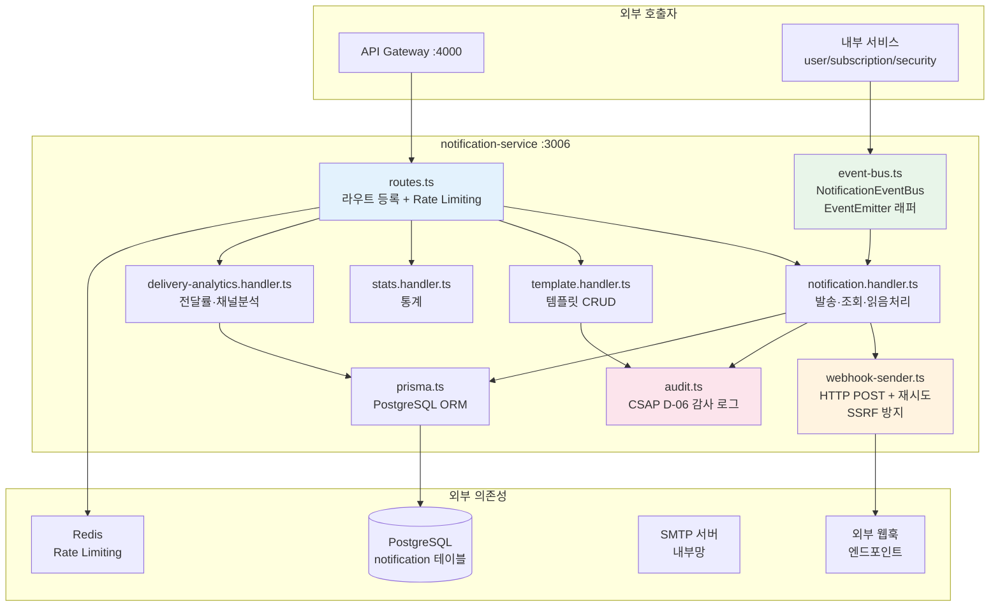
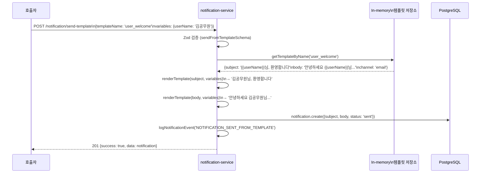

# 알림 서비스 심층 가이드 (Notification Service Deep Dive)

> **문서 ID**: ONBOARD-02-SVC-NOTIF-DEEP
> **버전**: 1.0.0 | **작성일**: 2026-04-12 | **작성자**: Implementer (Sonnet)
> **학습 대상**: `13-notification-service.md`를 읽은 후 코드 레벨 이해가 필요한 개발자
> **예상 소요 시간**: 약 3시간
> **선행 문서**:
>   - `13-notification-service.md` (서비스 개요)
>   - `17-async-patterns.md` (비동기 처리 기초)
>   - `05-event-driven-architecture.md` (이벤트 버스)
> **코드 참조**:
>   - `platform/services/notification-service/src/`
> **관련 Plan**: FR-P11.1~FR-P11.5, FR-NOTIF.1~FR-NOTIF.7
> **CSAP**: D-06 감사 로그, D-08 접근 통제, D-12 입력 검증

---

## 목차

1. [알림 서비스 전체 아키텍처](#1-알림-서비스-전체-아키텍처)
2. [채널별 상세 구현](#2-채널별-상세-구현)
3. [템플릿 시스템](#3-템플릿-시스템)
4. [알림 이력 및 조회](#4-알림-이력-및-조회)
5. [알림 설정 관리](#5-알림-설정-관리)
6. [알림 감사 로그 (CSAP D-06)](#6-알림-감사-로그-csap-d-06)
7. [전달률 분석 및 채널 통계](#7-전달률-분석-및-채널-통계)
8. [모니터링 및 PromQL](#8-모니터링-및-promql)
9. [운영 가이드](#9-운영-가이드)
10. [학습 체크리스트](#학습-체크리스트)
11. [다음 단계](#다음-단계)

---

## 1. 알림 서비스 전체 아키텍처

### 1.1 서비스 내부 구조



### 1.2 알림 유형별 트리거 시점

| 이벤트 | 트리거 서비스 | 채널 | 템플릿 |
|--------|------------|------|--------|
| 사용자 신규 가입 | user-service | email | `user_welcome` |
| 구독 만료 30일 전 | subscription-service | email | `subscription_expiry` |
| 로그인 5회 실패 | security-service | in-app | `security_alert` |
| 계정 잠금 | security-service | in-app | `security_alert` |
| CSAP 점검 완료 | compliance-service | in-app | `security_alert` |
| 웹훅 이벤트 | 모든 서비스 | webhook | `webhook_default` |

### 1.3 Rate Limiting 설정

```typescript
// routes.ts — Rate Limiter 설정 (FR-NOTIF.1)
const sendLimiter = createRateLimiter(20, 60, 'rl:notif:send');      // 발송: 분당 20회
const readLimiter = createRateLimiter(100, 60, 'rl:notif:read');     // 읽기: 분당 100회
const templateLimiter = createRateLimiter(30, 60, 'rl:notif:template'); // 템플릿: 분당 30회
```

발송 Rate Limit이 읽기보다 엄격한 이유: 알림 발송은 외부 시스템(SMTP, 웹훅)과 연동되어 비용과 부하가 발생하기 때문입니다.

---

## 2. 채널별 상세 구현

### 2.1 지원 채널 목록

```typescript
// notification.handler.ts — 채널 enum
channel: z.enum(['email', 'in-app', 'sms', 'webhook'])
```

| 채널 | 구현 방식 | 동기/비동기 | 재시도 |
|------|---------|-----------|------|
| `in-app` | PostgreSQL DB 저장 | 동기 | 없음 (DB 트랜잭션) |
| `webhook` | HTTP POST (`webhook-sender.ts`) | 동기 (재시도 포함) | 3회, 지수 백오프 |
| `email` | SMTP (현재 로그만, 추후 연동) | 동기 | 없음 (향후 BullMQ) |
| `sms` | SMS 게이트웨이 (내부망 전용) | 동기 | 없음 |

### 2.2 인앱(in-app) 알림 구현

인앱 알림은 가장 단순한 채널입니다. PostgreSQL에 레코드를 생성하고, 클라이언트가 폴링 또는 SSE로 조회합니다.

```typescript
// 인앱 알림 발송 흐름
// 1. POST /notification/send {channel: 'in-app', userId, subject, body}
// 2. Zod 검증
// 3. prisma.notification.create({...}) → DB 저장
// 4. 감사 로그 기록
// 5. 201 응답

// 클라이언트 조회: GET /notification/user/:userId
// 읽음 처리: PUT /notification/:id/read
// 전체 읽음: PUT /notification/user/:userId/read-all
// 미읽음 수: GET /notification/user/:userId/unread-count
```

**CSAP D-08-05 접근 통제**: 본인의 알림만 조회/읽음 처리 가능합니다. `SUPER_ADMIN`과 `TENANT_ADMIN`은 예외적으로 관리할 수 있습니다.

```typescript
// notification.handler.ts — 접근 통제 패턴
const callerId = request.headers['x-user-id'] as string | undefined;
const callerRole = request.headers['x-user-role'] as string | undefined;
const isAdmin = callerRole === 'SUPER_ADMIN' || callerRole === 'TENANT_ADMIN';

// 관리자가 아닌 경우 본인 알림만 조회 허용
if (!isAdmin && callerId !== request.params.userId) {
  await reply.status(403).send({
    success: false,
    error: { code: 'FORBIDDEN', message: '본인의 알림만 조회할 수 있습니다' },
  });
  return;
}
```

### 2.3 웹훅(webhook) 채널 구현

웹훅은 외부 시스템에 HTTP POST로 이벤트를 전달합니다. 보안과 신뢰성을 위한 여러 장치가 적용됩니다.

**SSRF 방지 (CSAP D-12-04)**:

```typescript
// webhook-sender.ts — 내부 IP 차단
function isInternalUrl(urlString: string): boolean {
  const url = new URL(urlString);
  const hostname = url.hostname.toLowerCase();

  // 차단 목록
  const blockedPatterns = ['localhost', '127.0.0.1', '0.0.0.0', '::1'];
  if (blockedPatterns.includes(hostname)) return true;

  // 사설 IP 대역 차단
  const parts = hostname.split('.');
  if (parts.length === 4) {
    const first = parseInt(parts[0], 10);
    const second = parseInt(parts[1], 10);
    if (first === 10) return true;                              // 10.x.x.x
    if (first === 172 && second >= 16 && second <= 31) return true;  // 172.16~31.x.x
    if (first === 192 && second === 168) return true;           // 192.168.x.x
    if (first === 169 && second === 254) return true;           // 클라우드 메타데이터
  }
  return false;
}
```

**재시도 정책**:
- 최대 3회 시도
- 지수 백오프: 1초 → 2초 → 4초
- 5초 타임아웃 (AbortController)
- 리다이렉트 추적 차단 (`redirect: 'manual'`)

**웹훅 서명 검증 (권장 구현)**:

현재 구현에는 서명이 없습니다. 외부 시스템과 신뢰 관계를 맺으려면 `X-Signature` 헤더를 추가해야 합니다.

```typescript
// 권장 구현: HMAC-SHA256 서명 추가
import { createHmac } from 'node:crypto';

function createWebhookSignature(payload: string, secret: string): string {
  return createHmac('sha256', secret)
    .update(payload)
    .digest('hex');
}

// 발송 시 서명 헤더 추가
const signature = createWebhookSignature(body, process.env['WEBHOOK_SECRET']!);
headers['X-Signature-256'] = `sha256=${signature}`;

// 수신측 검증
function verifySignature(payload: string, signature: string, secret: string): boolean {
  const expected = createHmac('sha256', secret).update(payload).digest('hex');
  // timing-safe 비교 (타이밍 공격 방지)
  return timingSafeEqual(Buffer.from(`sha256=${expected}`), Buffer.from(signature));
}
```

### 2.4 이메일(email) 채널

현재 구현에서 이메일 채널은 DB에 레코드만 저장합니다. 실제 SMTP 발송 로직은 추후 `BullMQ + nodemailer` 또는 `AWS SES`로 구현 예정입니다.

```typescript
// 이메일 발송 예시 (nodemailer 사용)
import nodemailer from 'nodemailer';

const transporter = nodemailer.createTransport({
  host: process.env['SMTP_HOST'],
  port: parseInt(process.env['SMTP_PORT'] ?? '587'),
  secure: false,
  auth: {
    user: process.env['SMTP_USER'],
    pass: process.env['SMTP_PASS'],  // ✅ 환경 변수 사용
  },
});

await transporter.sendMail({
  from: `"공공기관 SaaS" <noreply@gov-saas.kr>`,
  to: recipientEmail,
  subject: renderedSubject,
  html: renderedBody,
});
```

### 2.5 인앱 알림의 실시간 전달 (SSE 패턴)

현재 구현은 DB 폴링 방식입니다. 실시간 인앱 알림을 위한 SSE 확장 방법:

```typescript
// 권장 구현: SSE 기반 실시간 인앱 알림
// GET /notification/user/:userId/stream

export async function notificationStreamHandler(
  request: FastifyRequest<{ Params: { userId: string } }>,
  reply: FastifyReply,
): Promise<void> {
  // 접근 통제 (CSAP D-08)
  const callerId = request.headers['x-user-id'] as string;
  if (callerId !== request.params.userId) {
    await reply.status(403).send({ error: 'FORBIDDEN' });
    return;
  }

  // SSE 헤더
  reply.raw.writeHead(200, {
    'Content-Type': 'text/event-stream',
    'Cache-Control': 'no-cache',
    'Connection': 'keep-alive',
  });

  // Redis Pub/Sub으로 실시간 알림 수신
  const subscriber = redisClient.duplicate();
  await subscriber.subscribe(`user:${request.params.userId}:notifications`);

  subscriber.on('message', (_channel, message) => {
    reply.raw.write(`event: notification\ndata: ${message}\n\n`);
  });

  // 클라이언트 연결 종료 시 정리
  request.raw.on('close', async () => {
    await subscriber.unsubscribe();
    await subscriber.quit();
  });

  // 하트비트 (30초마다) — 연결 유지
  const heartbeat = setInterval(() => {
    reply.raw.write(': heartbeat\n\n');
  }, 30000);

  request.raw.on('close', () => clearInterval(heartbeat));
}

// 알림 발송 시 Redis Pub/Sub으로 실시간 전달
await redisPublisher.publish(
  `user:${userId}:notifications`,
  JSON.stringify({ id: notification.id, subject, body, channel })
);
```

---

## 3. 템플릿 시스템

### 3.1 Mustache 기반 템플릿

현재 `template.handler.ts`는 간단한 Mustache 패턴(`{{변수명}}`)을 사용합니다.

```typescript
// template.handler.ts — Mustache 치환
export function renderTemplate(template: string, variables: Record<string, string>): string {
  return template.replace(/\{\{(\w+)\}\}/g, (_match, key: string) => {
    return variables[key] ?? `{{${key}}}`;  // 변수 없으면 원본 유지
  });
}
```

### 3.2 기본 제공 템플릿 4개

서비스 시작 시 메모리에 자동 로드됩니다.

| 템플릿명 | 채널 | 사용 시점 | 주요 변수 |
|---------|------|---------|---------|
| `user_welcome` | email | 신규 사용자 등록 | `userName`, `tenantName`, `role`, `portalUrl` |
| `subscription_expiry` | email | 구독 만료 임박 | `tenantName`, `planName`, `daysLeft` |
| `security_alert` | in-app | 보안 이벤트 감지 | `alertType`, `description`, `timestamp`, `ip` |
| `webhook_default` | webhook | 외부 시스템 연동 | `eventType`, `tenantId`, `timestamp`, `data` |

### 3.3 템플릿 기반 발송 흐름



### 3.4 템플릿 CRUD API

```bash
# 템플릿 생성
curl -X POST http://localhost:3006/notification/templates \
  -H "Content-Type: application/json" \
  -H "x-internal-service-key: ${INTERNAL_KEY}" \
  -d '{
    "name": "contract_expiry_warning",
    "channel": "email",
    "subject": "[{{tenantName}}] 계약 만료 {{daysLeft}}일 전 안내",
    "body": "{{contractTitle}} 계약이 {{daysLeft}}일 후 만료됩니다.",
    "isActive": true
  }'

# 템플릿 목록 조회
curl "http://localhost:3006/notification/templates?channel=email&active=true" \
  -H "x-internal-service-key: ${INTERNAL_KEY}"

# 템플릿 기반 발송
curl -X POST http://localhost:3006/notification/send-template \
  -H "Content-Type: application/json" \
  -H "x-internal-service-key: ${INTERNAL_KEY}" \
  -d '{
    "templateName": "contract_expiry_warning",
    "tenantId": "t-mois",
    "userId": "u-001",
    "variables": {
      "tenantName": "행정안전부",
      "contractTitle": "클라우드 SaaS 도입 계약",
      "daysLeft": "30"
    }
  }'
```

### 3.5 템플릿 저장소 주의사항

현재 템플릿은 **인메모리 Map**에 저장됩니다.

```typescript
// template.handler.ts
const templateStore: Map<string, NotificationTemplate> = new Map();
// NOTE: 프로덕션에서는 DB 저장으로 전환 예정
```

⚠️ **주의**: 서비스가 재시작되면 API로 추가한 템플릿은 사라집니다. 기본 4개 템플릿만 남습니다. 프로덕션에서는 PostgreSQL 기반 영속 저장소로 전환이 필요합니다.

---

## 4. 알림 이력 및 조회

### 4.1 이력 조회 API

```bash
# 이력 조회 (테넌트 격리 적용)
GET /notification/history?channel=email&status=sent&page=1&pageSize=20
```

**테넌트 격리 (CSAP D-08-05)**:
- `SUPER_ADMIN`: 전체 이력 조회 가능, `tenantId` 필터 적용 가능
- 그 외: JWT의 `x-user-tenant-id`로 자동 필터링

```typescript
// 테넌트 격리 핵심 로직
const jwtTenantId = request.headers['x-user-tenant-id'] as string | undefined;
const jwtRole = request.headers['x-user-role'] as string | undefined;

if (jwtRole === 'SUPER_ADMIN') {
  // SUPER_ADMIN은 tenantId 필터 선택 적용
  if (queryResult.data.tenantId) where['tenantId'] = queryResult.data.tenantId;
} else if (jwtTenantId) {
  // 일반 사용자는 본인 테넌트 강제
  where['tenantId'] = jwtTenantId;
}
```

### 4.2 알림 상태 흐름

```
[발송 즉시] → status: 'sent'
[클라이언트 읽음] → status: 'read'
[웹훅 발송 실패] → status: 'failed'
[미래 구현] → status: 'delivered' (이메일 수신 확인)
[미래 구현] → status: 'pending'  (큐 대기 중)
```

---

## 5. 알림 설정 관리

### 5.1 현재 구현 상태

현재 버전에서 사용자별 알림 설정(채널 활성화/비활성화, 빈도 제한)은 DB 스키마에 미구현 상태입니다. 다음은 향후 구현을 위한 설계 패턴입니다.

### 5.2 알림 설정 스키마 (권장 설계)

```typescript
// 향후 구현: NotificationPreference 모델
interface NotificationPreference {
  id: string;
  userId: string;
  tenantId: string;

  // 채널별 활성화 여부
  emailEnabled: boolean;
  inAppEnabled: boolean;
  smsEnabled: boolean;
  webhookEnabled: boolean;

  // 빈도 제한
  dailyEmailLimit: number;    // 기본: 10
  dailySmsLimit: number;      // 기본: 3

  // 방해금지 시간 (KST)
  dndStartHour: number | null;  // 예: 22 (오후 10시)
  dndEndHour: number | null;    // 예: 8 (오전 8시)

  // 중요도 오버라이드
  criticalBypassDnd: boolean;   // Critical 알림은 DND 무시
}
```

### 5.3 알림 빈도 제한 구현 패턴

```typescript
// 하루 최대 이메일 수 제한
const REDIS_KEY = `notif:daily:email:${userId}:${today}`;

const currentCount = await redis.incr(REDIS_KEY);
if (currentCount === 1) {
  // 첫 번째 알림인 경우 TTL 설정 (자정까지)
  const secondsUntilMidnight = calculateSecondsUntilMidnight();
  await redis.expire(REDIS_KEY, secondsUntilMidnight);
}

const preference = await getUserPreference(userId);
if (currentCount > preference.dailyEmailLimit) {
  // 한도 초과 → 발송 건너뜀 (감사 로그 기록)
  await logNotificationEvent('EMAIL_SKIPPED_DAILY_LIMIT', userId, ...);
  return { skipped: true, reason: 'DAILY_LIMIT_EXCEEDED' };
}
```

### 5.4 중요도별 오버라이드

```typescript
// Critical 알림은 방해금지 시간 무시
const isCritical = notification.priority === 'critical';
const isDndActive = isInDndPeriod(preference.dndStartHour, preference.dndEndHour);

if (isDndActive && !isCritical) {
  // 방해금지 종료 시각까지 발송 지연
  const dndEndTime = calculateDndEndTime(preference.dndEndHour);
  await emailQueue.add('send-email', data, {
    delay: dndEndTime.getTime() - Date.now(),
    priority: 8,  // DND 해제 후 낮은 우선순위로 처리
  });
  return;
}

// Critical이면 DND 무시하고 즉시 발송
await emailQueue.add('send-email', data, { priority: 1 });
```

---

## 6. 알림 감사 로그 (CSAP D-06)

### 6.1 감사 로그 구조

```typescript
// audit.ts — audit-sdk 표준 팩토리 사용
import { createAuditLogger, createStandardTransport } from '@public-saas/audit-sdk';

const auditLogger = createAuditLogger({
  serviceName: 'notification-service',
  transport: createStandardTransport('notification-service'),
});

export async function logNotificationEvent(
  action: string,     // 'NOTIFICATION_SENT', 'TEMPLATE_CREATED', 등
  actor: string,      // 행위자 userId 또는 'system'
  target: string,     // notification ID
  tenantId: string,   // 테넌트 격리 추적 (CSAP D-08-05)
  ip: string,
  userAgent: string,
  metadata?: Record<string, unknown>,
): Promise<void> {
  await auditLogger.log({ actor, action, target, targetType: 'notification', tenantId, ip, userAgent, metadata });
}
```

### 6.2 기록되는 감사 이벤트 목록

| 이벤트 | 트리거 조건 | 기록 필드 |
|--------|-----------|---------|
| `NOTIFICATION_SENT` | 알림 직접 발송 | channel, userId, webhookResult |
| `NOTIFICATION_SENT_FROM_TEMPLATE` | 템플릿 기반 발송 | templateName, channel, userId |
| `NOTIFICATIONS_BULK_READ` | 일괄 읽음 처리 | markedCount |
| `TEMPLATE_CREATED` | 템플릿 생성 | name, channel |
| `TEMPLATE_UPDATED` | 템플릿 수정 | fields (변경된 필드명) |
| `TEMPLATE_DELETED` | 템플릿 삭제 | (없음) |

### 6.3 감사 로그 조회 (운영팀)

```bash
# 특정 테넌트의 알림 발송 이력 조회
kubectl exec -n saas-platform \
  $(kubectl get pod -l app=audit-service -o name | head -1) -- \
  cat /var/log/audit/notification-service.jsonl | \
  jq 'select(.tenantId == "t-mois" and .action == "NOTIFICATION_SENT")'

# 오늘 발생한 알림 이벤트 통계
cat /var/log/audit/notification-service.jsonl | \
  jq -r '.action' | sort | uniq -c | sort -rn
```

### 6.4 알림 내용 암호화 (개인정보 포함 시)

현재 구현에서는 알림 내용이 평문으로 저장됩니다. 개인정보(이름, 이메일, 연락처)가 포함된 알림 본문은 암호화가 필요합니다(CSAP D-09).

```typescript
// 권장 구현: 민감한 알림 본문 암호화
import { encrypt, decrypt } from '@public-saas/crypto';

// 발송 시 암호화
const encryptedBody = await encrypt(
  notification.body,
  process.env['NOTIFICATION_ENCRYPTION_KEY']!  // AES-256
);

await prisma.notification.create({
  data: {
    ...notification,
    body: encryptedBody,       // 암호화된 본문 저장
    isEncrypted: true,         // 암호화 여부 플래그
  },
});

// 조회 시 복호화
if (notification.isEncrypted) {
  notification.body = await decrypt(
    notification.body,
    process.env['NOTIFICATION_ENCRYPTION_KEY']!
  );
}
```

---

## 7. 전달률 분석 및 채널 통계

### 7.1 전달률 추이 API

```bash
# 최근 7일 전달률 추이
GET /notification/analytics/delivery?days=7

# 응답
{
  "success": true,
  "data": {
    "trend": [
      { "date": "2026-04-06", "sent": 120, "delivered": 115, "failed": 5, "deliveryRate": 95.8 },
      { "date": "2026-04-07", "sent": 98,  "delivered": 96,  "failed": 2, "deliveryRate": 98.0 },
      ...
    ],
    "summary": {
      "totalSent": 840,
      "totalDelivered": 812,
      "totalFailed": 28,
      "overallDeliveryRate": 96.7
    },
    "days": 7,
    "generatedAt": "2026-04-12T09:00:00.000Z"
  }
}
```

### 7.2 채널별 분석

```bash
GET /notification/analytics/channels

# 응답
{
  "data": {
    "channels": [
      { "channel": "in-app",  "total": 450, "delivered": 450, "failed": 0,  "deliveryRate": 100.0, "sharePercent": 53.6 },
      { "channel": "email",   "total": 280, "delivered": 265, "failed": 15, "deliveryRate": 94.6,  "sharePercent": 33.3 },
      { "channel": "webhook", "total": 110, "delivered": 97,  "failed": 13, "deliveryRate": 88.2,  "sharePercent": 13.1 }
    ],
    "totalNotifications": 840
  }
}
```

### 7.3 전달률 계산 로직

`deliveryRateHandler`는 날짜별로 루프를 돌며 DB에서 집계합니다. N일 조회 시 N번의 DB 쿼리가 발생합니다(각 날짜당 3회: sent, delivered, failed).

```typescript
// delivery-analytics.handler.ts 핵심 로직
for (let i = days - 1; i >= 0; i--) {
  const start = new Date();
  start.setDate(start.getDate() - i);
  start.setHours(0, 0, 0, 0);

  const end = new Date(start);
  end.setDate(end.getDate() + 1);

  // Promise.all로 3개 쿼리 병렬 실행
  const [sent, delivered, failed] = await Promise.all([
    prisma.notification.count({ where: { ...baseWhere, createdAt: { gte: start, lt: end } } }),
    prisma.notification.count({ where: { ...baseWhere, createdAt: { gte: start, lt: end }, status: 'delivered' } }),
    prisma.notification.count({ where: { ...baseWhere, createdAt: { gte: start, lt: end }, status: 'failed' } }),
  ]);

  deliveryRate = sent > 0 ? (delivered / sent) * 100 : 0;
}
```

⚠️ 90일 조회 시 270회 DB 쿼리가 발생합니다. 운영 환경에서는 집계 테이블 또는 캐싱을 고려하세요.

---

## 8. 모니터링 및 PromQL

### 8.1 핵심 메트릭

알림 서비스를 모니터링하기 위한 Prometheus 쿼리입니다.

```promql
# 채널별 발송 성공률 (5분 평균)
rate(notification_sent_total{status="sent"}[5m])
/ rate(notification_sent_total[5m]) * 100

# 웹훅 발송 실패율
rate(notification_sent_total{channel="webhook", status="failed"}[5m])
/ rate(notification_sent_total{channel="webhook"}[5m]) * 100

# 평균 발송 레이턴시
histogram_quantile(0.95,
  rate(notification_handler_duration_seconds_bucket{handler="sendNotificationHandler"}[5m])
)

# Rate Limit 히트율 (급증 시 알림)
rate(rate_limit_exceeded_total{key=~"rl:notif:.*"}[5m])
```

### 8.2 Grafana 대시보드 패널 설계

```
[알림 서비스 대시보드]

패널 1: 발송 성공률 (%)
  - 전체, 채널별 분리
  - 경보: 95% 미만 시 Slack 알림

패널 2: 초당 발송 건수 (RPS)
  - in-app / email / webhook 스택 차트

패널 3: 웹훅 재시도 횟수
  - 1회 성공 / 2회 성공 / 3회 성공 / 실패 분포

패널 4: Rate Limit 히트 횟수
  - 비정상적 급증 시 경보

패널 5: DLQ 대기 건수
  - 0 초과 시 즉시 경보

패널 6: 처리 레이턴시 p50/p95/p99
```

### 8.3 알림 서비스 SLO

| 지표 | SLO | 측정 방법 |
|------|-----|---------|
| 발송 가용성 | 99.5% | `notification_sent_total{status!="error"}` |
| 인앱 알림 레이턴시 | p95 < 200ms | `histogram_quantile(0.95, ...)` |
| 웹훅 최종 전달률 | 95% | 재시도 포함 |
| 이메일 최종 전달률 | 98% | SMTP 서버 기준 |

---

## 9. 운영 가이드

### 9.1 배포 시 확인 사항

```bash
# 1. 환경 변수 확인
kubectl get secret notification-service-secrets -o yaml | \
  grep -E 'INTERNAL_SERVICE_KEY|DATABASE_URL|REDIS_HOST'

# 2. DB 연결 확인
curl http://localhost:3006/ready

# 3. Rate Limit Redis 연결 확인
redis-cli -h $REDIS_HOST ping

# 4. 알림 발송 테스트
curl -X POST http://localhost:3006/notification/send \
  -H "x-internal-service-key: ${INTERNAL_SERVICE_KEY}" \
  -H "x-user-id: system" \
  -H "x-user-tenant-id: t-test" \
  -d '{"channel":"in-app","subject":"배포 확인","body":"notification-service 배포 완료"}'
```

### 9.2 장애 대응

| 증상 | 원인 | 조치 |
|------|------|------|
| 웹훅 전달 실패 증가 | 외부 시스템 응답 없음 | 웹훅 URL 확인, 외부 방화벽 확인 |
| 발송 레이턴시 급증 | DB 연결 풀 고갈 | Prisma 연결 풀 크기 증가 |
| Rate Limit 오류 급증 | 단기간 대량 발송 | Rate Limit 임계값 조정 또는 배치로 전환 |
| 템플릿 찾을 수 없음 | 서비스 재시작 | 기본 템플릿은 자동 로드됨, 커스텀은 재등록 필요 |
| INTERNAL_SERVICE_KEY 오류 | 헤더 누락 | 호출 서비스의 헤더 설정 확인 |

### 9.3 로컬 개발 환경

```bash
# 1. notification-service 실행
cd platform/services/notification-service
cp .env.example .env
# .env: DATABASE_URL, REDIS_HOST, INTERNAL_SERVICE_KEY 설정

pnpm dev

# 2. API 문서 확인 (Swagger UI)
open http://localhost:3006/docs

# 3. 발송 이력 확인
curl http://localhost:3006/notification/history \
  -H "x-internal-service-key: dev-key"
```

---

## 학습 체크리스트

### 아키텍처 이해

- [ ] notification-service의 파일 구조(routes.ts, handler, lib)를 설명할 수 있다
- [ ] 인앱 알림과 웹훅 알림의 처리 방식 차이를 설명할 수 있다
- [ ] Rate Limiting이 채널별로 다른 이유를 설명할 수 있다

### CSAP 보안

- [ ] SSRF 방지 로직이 차단하는 IP 대역 4가지를 말할 수 있다
- [ ] CSAP D-08-05 테넌트 격리가 알림 조회에 어떻게 적용되는지 설명할 수 있다
- [ ] 감사 로그가 기록되는 6개 이벤트를 나열할 수 있다

### 템플릿 시스템

- [ ] Mustache `{{변수명}}` 패턴으로 직접 템플릿을 생성해봤다
- [ ] 템플릿이 인메모리 저장이라 재시작 시 초기화되는 제약을 이해했다
- [ ] `send-template` vs `send` API의 차이를 설명할 수 있다

### 모니터링

- [ ] 채널별 전달률 API를 호출해 응답을 확인했다
- [ ] 전달률 조회 시 N일 × 3회 DB 쿼리가 발생하는 성능 특성을 안다

---

## 다음 단계

| 다음 문서 | 이유 |
|---------|------|
| `17-async-patterns.md` | BullMQ로 이메일 비동기 발송 구현 |
| `06-audit-service.md` | 감사 로그 심층 이해 |
| `additional-02-crm-deep-dive.md` | CRM과 알림 서비스 연동 패턴 |
| `11-test-strategy.md` | 알림 발송 모킹 테스트 전략 |
