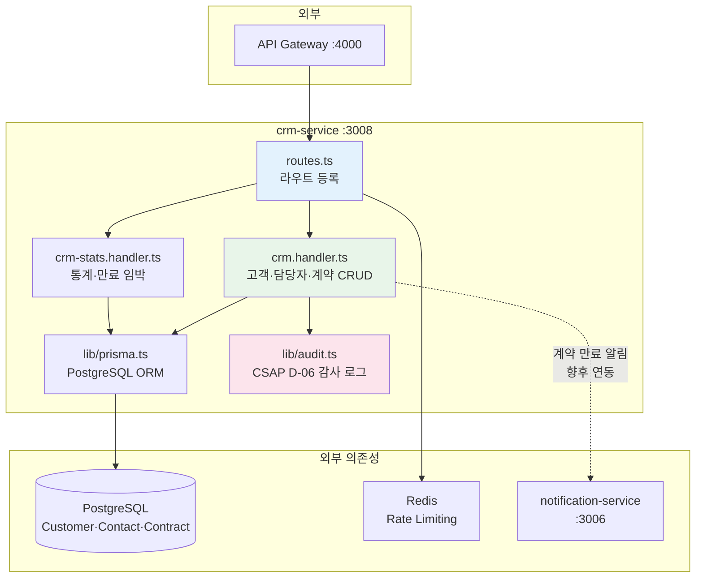
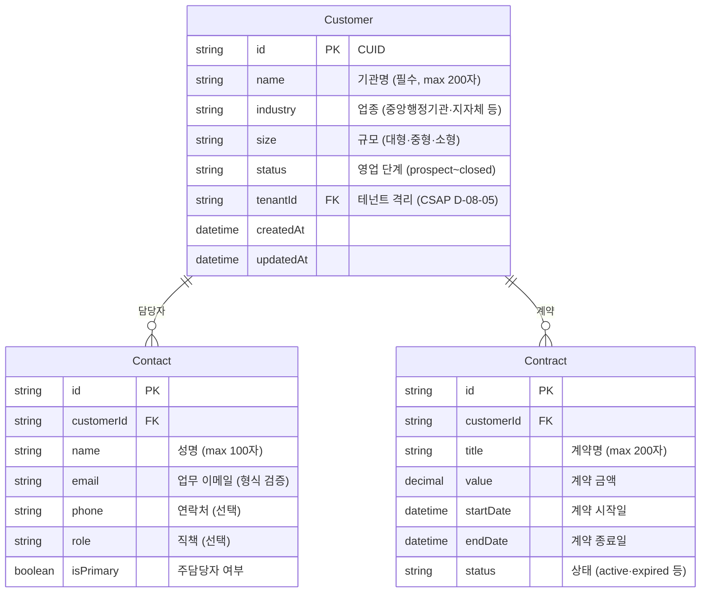
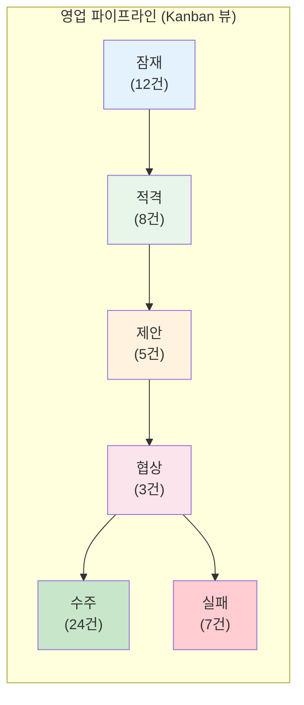

# CRM 서비스 심층 가이드 (CRM Service Deep Dive)

> **문서 ID**: ONBOARD-02-SVC-CRM-DEEP
> **버전**: 1.0.0 | **작성일**: 2026-04-12 | **작성자**: Implementer (Sonnet)
> **학습 대상**: `15-crm-service.md`를 읽은 후 코드 레벨 이해가 필요한 개발자
> **예상 소요 시간**: 약 3시간
> **선행 문서**:
>   - `15-crm-service.md` (서비스 개요)
>   - `13-notification-service.md` (알림 연동)
>   - `additional-01-notification-deep-dive.md` (알림 심층)
> **코드 참조**:
>   - `platform/services/crm-service/src/`
> **관련 Plan**: FR-P09.1~FR-P09.5, FR-CRM.1~FR-CRM.5
> **CSAP**: D-06 감사 로그, D-08 접근 통제, D-09 암호화, D-10 네트워크 보안

---

## 목차

1. [공공기관 SaaS의 CRM 특수성](#1-공공기관-saas의-crm-특수성)
2. [CRM 서비스 아키텍처](#2-crm-서비스-아키텍처)
3. [핵심 도메인 — 고객·담당자·계약](#3-핵심-도메인--고객담당자계약)
4. [영업 파이프라인](#4-영업-파이프라인)
5. [SaaS 구독과 CRM 연동](#5-saas-구독과-crm-연동)
6. [통계 및 계약 만료 관리](#6-통계-및-계약-만료-관리)
7. [데이터 개인정보 처리 (CSAP)](#7-데이터-개인정보-처리-csap)
8. [실습: CRM 연락처 검색 API 구현](#8-실습-crm-연락처-검색-api-구현)
9. [운영 가이드](#9-운영-가이드)
10. [학습 체크리스트](#학습-체크리스트)
11. [다음 단계](#다음-단계)

---

## 1. 공공기관 SaaS의 CRM 특수성

### 1.1 일반 CRM과의 차이

일반 영리기업 CRM(Salesforce, HubSpot)은 매출 극대화와 리드 전환에 초점을 맞춥니다. 공공기관 SaaS의 CRM은 전혀 다른 맥락에서 동작합니다.

| 구분 | 일반 CRM (Salesforce 등) | 공공기관 SaaS CRM |
|------|------------------------|----------------|
| 고객 유형 | 개인·기업 (다양) | 공공기관 (기관 코드 기반) |
| 계약 방식 | 자유 계약 | 국가 계약법 적용, 재계약 사전 통보 의무 |
| 담당자 | 구매 결정권자 | 공무원 (직책, 기관 이메일 필수) |
| 데이터 보안 | 일반 수준 | CSAP 요건 — 완전 테넌트 격리 |
| 감사 요건 | 선택 | 모든 변경 이력 전수 기록 필수 |
| 가격 협상 | 자유 | 조달청 단가계약, 시장가격 공시 |

### 1.2 공공기관 고객 특성

```
[고객 유형 계층]

발주처 (중앙행정기관, 지자체, 공공기관)
├── 주 담당자 (정보화 담당 공무원) ← isPrimary: true
├── 예산 담당자
└── 보안 담당자

수행사 (SI 기업, ISV)
└── 프로젝트 매니저

협력사 (하드웨어, 유지보수)
└── 기술 담당자
```

이 구조를 CRM 데이터 모델에 반영합니다:
- `Customer.industry`: 중앙행정기관, 지자체, 공공기관, 수행사, 협력사
- `Customer.size`: 대형(1000명+), 중형(100~999명), 소형(~99명)
- `Contact.isPrimary`: 주 담당자 여부
- `Contact.role`: 직책 (정보화담당관, 예산담당, PM 등)

### 1.3 국가 계약법 대응

계약 만료 전 법적 사전 통보 의무가 있습니다. CRM은 이를 자동화합니다.

```
[자동화 흐름]
매일 오전 9시 Cron
    → 만료 30일 이내 계약 조회 (expiringContractsHandler)
    → 담당 영업팀에 Task 자동 생성
    → 발주처 담당자에게 이메일 알림 (notification-service 연동)
```

---

## 2. CRM 서비스 아키텍처

### 2.1 내부 구조



### 2.2 Rate Limiting 설정

```typescript
// routes.ts
const readLimiter = createRateLimiter(100, 60, 'rl:crm:read');   // 읽기: 분당 100회
const writeLimiter = createRateLimiter(30, 60, 'rl:crm:write');  // 쓰기: 분당 30회
```

쓰기 작업에 엄격한 Rate Limit을 적용하는 이유: 고객·계약 데이터는 변경 빈도가 낮고, 빠른 쓰기 요청은 자동화된 공격 신호일 수 있습니다.

### 2.3 서비스 간 인증 (CSAP D-08)

```typescript
// routes.ts — 내부 서비스 인증
const internalKey = process.env['INTERNAL_SERVICE_KEY'];
if (!internalKey && process.env['NODE_ENV'] === 'production') {
  throw new Error('[SECURITY] INTERNAL_SERVICE_KEY 환경변수가 설정되지 않았습니다.');
}

app.addHook('onRequest', async (request, reply) => {
  if (request.url === '/health' || request.url === '/ready') return;
  const provided = request.headers['x-internal-service-key'];
  if (provided !== internalKey) {
    await reply.status(401).send({ error: '내부 서비스 인증 실패' });
  }
});
```

CRM 서비스는 API 게이트웨이를 거쳐서만 접근 가능합니다. 직접 호출 시 `INTERNAL_SERVICE_KEY` 헤더가 없으면 401을 반환합니다.

---

## 3. 핵심 도메인 — 고객·담당자·계약

### 3.1 도메인 관계도



### 3.2 고객사(Customer) CRUD

**고객사 등록**:

```typescript
// crm.handler.ts — createCustomerHandler
const createCustomerSchema = z.object({
  name: z.string().min(1, '고객사명은 필수입니다').max(200),
  industry: z.string().optional(),
  size: z.string().optional(),
  tenantId: z.string().nullable().optional(),
});

export async function createCustomerHandler(request, reply) {
  const parseResult = createCustomerSchema.safeParse(request.body);
  // ... Zod 검증 (CSAP D-12)

  const customer = await prisma.customer.create({ data: parseResult.data });

  // CSAP D-06: 모든 생성 이벤트 감사 기록
  await logCrmEvent(
    'CUSTOMER_CREATED',
    request.headers['x-user-id'] || 'system',
    customer.id,
    request.headers['x-user-tenant-id'] || 'platform',
    request.ip,
    request.headers['user-agent'],
    { name: customer.name },
  );

  await reply.status(201).send({ success: true, data: customer });
}
```

**고객사 목록 조회 (테넌트 격리 + 검색)**:

```typescript
// listCustomersHandler — 핵심 로직
// CSAP D-08-05: JWT 클레임 기반 테넌트 격리
const jwtTenantId = request.headers['x-user-tenant-id'];
const jwtRole = request.headers['x-user-role'];

// SUPER_ADMIN은 전체 조회 가능, 그 외는 본인 테넌트만
const effectiveTenantId =
  jwtRole === 'SUPER_ADMIN'
    ? (request.query.tenantId ?? jwtTenantId)
    : jwtTenantId;

const where = {};
if (effectiveTenantId) where['tenantId'] = effectiveTenantId;
if (request.query.status) where['status'] = request.query.status;
if (request.query.industry) where['industry'] = request.query.industry;

// FR-CRM.1: 이름 부분 검색 (대소문자 무시)
if (request.query.search) {
  where['name'] = { contains: request.query.search, mode: 'insensitive' };
}

// 카운트와 데이터 병렬 조회
const [customers, total] = await Promise.all([
  prisma.customer.findMany({
    where,
    include: { _count: { select: { contacts: true, contracts: true } } },
    skip: (page - 1) * pageSize,
    take: pageSize,
    orderBy: { createdAt: 'desc' },
  }),
  prisma.customer.count({ where }),
]);
```

### 3.3 담당자(Contact) 관리

```bash
# 담당자 등록
curl -X POST http://localhost:3008/crm/customers/{customerId}/contacts \
  -H "Content-Type: application/json" \
  -H "x-internal-service-key: ${INTERNAL_KEY}" \
  -H "x-user-id: admin-001" \
  -H "x-user-tenant-id: t-mois" \
  -d '{
    "name": "김정보화",
    "email": "kim@mois.go.kr",
    "phone": "02-2100-1234",
    "role": "정보화담당관",
    "isPrimary": true
  }'
```

담당자 조회는 최대 200건으로 제한됩니다 (CSAP D-10 방어 코딩):

```typescript
const contacts = await prisma.contact.findMany({
  where: { customerId: request.params.id },
  orderBy: { isPrimary: 'desc' },  // 주담당자 먼저
  take: 200,  // 방어 코딩: 최대 200건 (CSAP D-10)
});
```

### 3.4 계약(Contract) 관리

계약은 CRM에서 가장 중요한 엔티티입니다. 모든 변경 이력은 감사 로그에 전수 기록됩니다.

```typescript
// createContractSchema
const createContractSchema = z.object({
  customerId: z.string().min(1),
  title: z.string().min(1).max(200),
  value: z.number().min(0),              // 음수 금액 차단
  startDate: z.string().datetime(),      // ISO 8601 형식 검증
  endDate: z.string().datetime(),
});
```

**계약 수정 시 테넌트 격리**:

```typescript
// updateContractHandler
// SUPER_ADMIN이 아닌 경우 타 테넌트 계약 수정 차단
const jwtTenantId = request.headers['x-user-tenant-id'];
const jwtRole = request.headers['x-user-role'];

const existing = await prisma.customer.findUnique({
  where: { id: request.params.id },
  select: { tenantId: true },
});

if (
  jwtRole !== 'SUPER_ADMIN' &&
  jwtTenantId &&
  existing.tenantId &&
  existing.tenantId !== jwtTenantId
) {
  await reply.status(403).send({
    error: { code: 'FORBIDDEN', message: '접근 권한이 없습니다' },
  });
  return;
}
```

---

## 4. 영업 파이프라인

### 4.1 파이프라인 단계

```
prospect → qualified → proposal → negotiation → closed_won / closed_lost
  (잠재)    (적격)      (제안)      (협상)          (수주)         (실패)
```

공공기관 맥락에서의 의미:

| 단계 | 공공기관 맥락 | 일반적 기간 |
|------|------------|---------|
| `prospect` | RFP 전 초기 접촉, 정보 요청 | 수개월 |
| `qualified` | 예산 확보 확인, 조달 계획 수립 | 1~3개월 |
| `proposal` | 제안서 제출, 기술 PT | 1~2개월 |
| `negotiation` | 계약 조건 협의, 법무 검토 | 2~4주 |
| `closed_won` | 계약 체결 완료 | — |
| `closed_lost` | 타사 선정, 사업 취소 | — |

### 4.2 파이프라인 조회 API

```bash
# 파이프라인 현황 (테넌트 격리 적용)
GET /crm/pipeline

# 응답
{
  "success": true,
  "data": [
    { "stage": "prospect",    "count": 12 },
    { "stage": "qualified",   "count": 8  },
    { "stage": "proposal",    "count": 5  },
    { "stage": "negotiation", "count": 3  },
    { "stage": "closed_won",  "count": 24 },
    { "stage": "closed_lost", "count": 7  }
  ]
}
```

### 4.3 파이프라인 구현

```typescript
// crm.handler.ts — pipelineHandler
const stages = ['prospect', 'qualified', 'proposal', 'negotiation', 'closed_won', 'closed_lost'];

// 모든 단계를 병렬로 집계
const pipeline = await Promise.all(
  stages.map(async (status) => {
    const where = { status };
    if (jwtRole !== 'SUPER_ADMIN' && jwtTenantId) {
      where['tenantId'] = jwtTenantId;
    }
    const count = await prisma.customer.count({ where });
    return { stage: status, count };
  }),
);
```

### 4.4 파이프라인 시각화 (프론트엔드)



---

## 5. SaaS 구독과 CRM 연동

### 5.1 신규 고객 CRM 자동 생성

테넌트가 SaaS를 구독하면 CRM에 고객사가 자동 생성됩니다.

```typescript
// subscription-service에서 구독 완료 시 CRM 연동
async function onSubscriptionCreated(event: SubscriptionCreatedEvent) {
  // CRM 서비스에 고객사 자동 생성
  const response = await fetch('http://crm-service:3008/crm/customers', {
    method: 'POST',
    headers: {
      'Content-Type': 'application/json',
      'x-internal-service-key': process.env['INTERNAL_SERVICE_KEY']!,
      'x-user-id': 'system',
      'x-user-tenant-id': event.tenantId,
    },
    body: JSON.stringify({
      name: event.organizationName,
      industry: event.industry,
      size: event.organizationSize,
      tenantId: event.tenantId,
      // status 기본값: 'prospect' → 'closed_won'으로 업데이트
    }),
  });

  const customer = await response.json();

  // 상태를 '수주'로 즉시 업데이트
  await fetch(`http://crm-service:3008/crm/customers/${customer.data.id}`, {
    method: 'PUT',
    headers: { /* ... */ },
    body: JSON.stringify({ status: 'closed_won' }),
  });
}
```

### 5.2 구독 갱신 알림 → 영업팀 자동 Task

```typescript
// 계약 만료 임박 시 영업팀 Task 생성 패턴
async function createRenewalTask(contract: Contract, customer: Customer) {
  const daysLeft = Math.ceil(
    (contract.endDate.getTime() - Date.now()) / (24 * 60 * 60 * 1000)
  );

  // 1. 영업팀에 Task 알림 (in-app)
  await fetch('http://notification-service:3006/notification/send-template', {
    method: 'POST',
    headers: {
      'x-internal-service-key': process.env['INTERNAL_SERVICE_KEY']!,
      'x-user-id': 'system',
      'x-user-tenant-id': customer.tenantId,
    },
    body: JSON.stringify({
      templateName: 'subscription_expiry',
      tenantId: customer.tenantId,
      userId: contract.salesRepUserId,  // 담당 영업사원
      variables: {
        tenantName: customer.name,
        planName: contract.title,
        daysLeft: String(daysLeft),
      },
    }),
  });

  // 2. CRM 계약 상태 업데이트
  await prisma.contract.update({
    where: { id: contract.id },
    data: { status: 'renewal_pending' },
  });
}
```

### 5.3 이탈 위험 고객 감지

로그인 없음 30일+ = 이탈 위험 신호입니다.

```typescript
// 이탈 위험 고객 감지 배치 (매주 월요일 오전 10시)
export const churnRiskBatch = new CronJob('0 10 * * 1', async () => {
  // user-service에서 30일 이상 미접속 테넌트 조회
  const inactiveTenantsResponse = await fetch(
    'http://user-service:3001/internal/inactive-tenants?days=30',
    { headers: { 'x-internal-service-key': process.env['INTERNAL_SERVICE_KEY']! } }
  );
  const inactiveTenants = await inactiveTenantsResponse.json();

  for (const tenant of inactiveTenants.data) {
    // CRM에서 해당 테넌트 고객사 조회
    const customerResponse = await fetch(
      `http://crm-service:3008/crm/customers?tenantId=${tenant.id}`,
      { headers: { 'x-internal-service-key': process.env['INTERNAL_SERVICE_KEY']! } }
    );
    const customers = await customerResponse.json();

    for (const customer of customers.data) {
      if (customer.status === 'closed_won') {
        // 상태를 '이탈 위험'으로 업데이트
        await fetch(`http://crm-service:3008/crm/customers/${customer.id}`, {
          method: 'PUT',
          headers: { /* ... */ },
          body: JSON.stringify({ status: 'churn_risk' }),
        });

        // 담당 영업사원에게 알림
        await notifyChurnRisk(customer, tenant.lastLoginAt);
      }
    }
  }
});
```

---

## 6. 통계 및 계약 만료 관리

### 6.1 CRM 통계 API

```bash
GET /crm/stats

# 응답
{
  "data": {
    "totalCustomers": 47,
    "totalContracts": 62,
    "totalContacts": 134,
    "totalContractValue": "2850000000",    // 28억 5천만원
    "avgContractValue": "45967741.93",
    "customersByStatus": [
      { "status": "closed_won",  "count": 24 },
      { "status": "prospect",    "count": 12 },
      { "status": "negotiation", "count": 3  },
      { "status": "proposal",    "count": 5  },
      { "status": "qualified",   "count": 3  }
    ],
    "generatedAt": "2026-04-12T09:00:00.000Z"
  }
}
```

### 6.2 통계 쿼리 최적화

`crmStatsHandler`는 5개 쿼리를 `Promise.all`로 병렬 실행합니다.

```typescript
const [totalCustomers, customersByStatus, totalContracts, contractValue, totalContacts] =
  await Promise.all([
    prisma.customer.count({ where: customerWhere }),
    prisma.customer.groupBy({
      by: ['status'],
      _count: { id: true },
      where: customerWhere,
    }),
    prisma.contract.count({ where: contractWhere }),
    prisma.contract.aggregate({
      _sum: { value: true },
      _avg: { value: true },
      where: contractWhere,
    }),
    prisma.contact.count({ where: contactWhere }),
  ]);
```

순차 실행 대비 약 5배 빠릅니다.

### 6.3 계약 만료 임박 조회

```bash
# 30일 이내 만료 계약 조회
GET /crm/contracts/expiring?days=30

# 응답
{
  "data": {
    "contracts": [
      {
        "id": "clr...",
        "title": "클라우드 SaaS 도입 계약",
        "endDate": "2026-04-25T00:00:00.000Z",
        "value": 150000000,
        "customer": { "name": "행정안전부", "tenantId": "t-mois" }
      }
    ],
    "total": 3,
    "thresholdDays": 30
  }
}
```

`expiringContractsHandler`는 최대 500건으로 결과를 제한합니다(CSAP D-10 방어 코딩).

---

## 7. 데이터 개인정보 처리 (CSAP)

### 7.1 연락처 정보 암호화 (D-09)

현재 구현에서 담당자 이메일·전화번호는 평문으로 저장됩니다. 공공기관 환경에서 개인정보보호법과 CSAP D-09를 준수하려면 암호화가 필요합니다.

```typescript
// 권장 구현: 담당자 민감 정보 암호화
import { encrypt, decrypt } from '@public-saas/crypto';

async function createContactWithEncryption(data: ContactData) {
  const encryptionKey = process.env['CONTACT_ENCRYPTION_KEY'];
  if (!encryptionKey) throw new Error('CONTACT_ENCRYPTION_KEY 환경변수 누락');

  // 민감 필드만 선택적 암호화
  const encryptedData = {
    ...data,
    email: await encrypt(data.email, encryptionKey),    // AES-256
    phone: data.phone ? await encrypt(data.phone, encryptionKey) : null,
  };

  const contact = await prisma.contact.create({ data: encryptedData });

  // 응답 시 복호화
  return {
    ...contact,
    email: await decrypt(contact.email, encryptionKey),
    phone: contact.phone ? await decrypt(contact.phone, encryptionKey) : null,
  };
}
```

### 7.2 검색 시 암호화 처리

암호화된 이메일은 `LIKE` 검색이 불가능합니다. 검색용 해시를 별도로 저장합니다.

```typescript
// 이메일 검색을 위한 해시 저장
import { createHash } from 'node:crypto';

function hashForSearch(value: string): string {
  // SHA-256으로 검색용 해시 생성 (단방향)
  return createHash('sha256').update(value.toLowerCase()).digest('hex');
}

// 저장 시
await prisma.contact.create({
  data: {
    email: encryptedEmail,         // 암호화된 원본 (복호화용)
    emailHash: hashForSearch(data.email),  // 검색용 해시
  },
});

// 검색 시
const emailHash = hashForSearch(searchEmail);
const contacts = await prisma.contact.findMany({
  where: { emailHash },  // 해시로 검색
});
```

### 7.3 개인정보 열람·수정·삭제 이력

개인정보보호법 제35~37조에 따라 열람, 수정, 삭제 요청 이력을 기록해야 합니다.

```typescript
// 담당자 삭제 (개인정보 삭제 요청 처리)
export async function deleteContactHandler(request, reply) {
  const contact = await prisma.contact.findUnique({
    where: { id: request.params.contactId },
  });

  if (!contact) {
    await reply.status(404).send({ error: 'CONTACT_NOT_FOUND' });
    return;
  }

  // CSAP D-06: 삭제 전 감사 로그 (삭제 후 기록 불가)
  await logCrmEvent(
    'CONTACT_DELETED',
    request.headers['x-user-id'] || 'system',
    contact.id,
    request.headers['x-user-tenant-id'],
    request.ip,
    request.headers['user-agent'],
    {
      reason: request.body.reason,  // 삭제 사유 기록
      requestedBy: request.body.requestedBy,
    },
  );

  // 실제 삭제 (또는 익명화)
  await prisma.contact.delete({ where: { id: contact.id } });

  await reply.send({ success: true, message: '담당자 정보가 삭제되었습니다' });
}
```

### 7.4 CSAP D-06 감사 이벤트 목록

```typescript
// crm/lib/audit.ts — createServiceAuditLogger 팩토리 사용
export const logCrmEvent = createServiceAuditLogger('crm-service', 'crm');
```

| 이벤트 | 트리거 | 기록 메타데이터 |
|--------|--------|-------------|
| `CUSTOMER_CREATED` | 고객사 등록 | name |
| `CUSTOMER_UPDATED` | 고객사 수정 | fields (변경된 필드 목록) |
| `CONTACT_CREATED` | 담당자 등록 | customerId, name |
| `CONTRACT_CREATED` | 계약 등록 | title, customerId |
| `CONTRACT_UPDATED` | 계약 수정 | fields |

---

## 8. 실습: CRM 연락처 검색 API 구현

이번 실습에서는 기존 `listContactsHandler`를 확장해 텍스트 검색과 페이지네이션이 가능한 연락처 검색 API를 구현합니다.

### 8.1 목표

```
GET /crm/contacts/search?name=김&role=정보화담당관&page=1&pageSize=10

응답:
{
  "success": true,
  "data": [
    {
      "id": "clr...",
      "name": "김정보화",
      "email": "kim@mois.go.kr",
      "role": "정보화담당관",
      "isPrimary": true,
      "customer": { "id": "...", "name": "행정안전부" }
    }
  ],
  "pagination": { "page": 1, "pageSize": 10, "total": 3, "totalPages": 1 }
}
```

### 8.2 핸들러 구현

```typescript
// platform/services/crm-service/src/handlers/contact-search.handler.ts
// Design Ref: SVC-CRM-R1 DESIGN §2
// Plan SC: FR-P09.2
// CSAP: D-08-05 테넌트 격리, D-12 입력 검증

import type { FastifyRequest, FastifyReply } from 'fastify';
import { z } from 'zod';
import { prisma } from '../lib/prisma.js';

// ✅ 입력 검증 스키마 (CSAP D-12)
const contactSearchSchema = z.object({
  name: z.string().min(1).max(100).optional(),
  email: z.string().email().optional(),
  role: z.string().max(50).optional(),
  isPrimary: z.enum(['true', 'false']).optional(),
  customerId: z.string().optional(),
  page: z.coerce.number().int().min(1).default(1),
  pageSize: z.coerce.number().int().min(1).max(100).default(20),
});

export async function contactSearchHandler(
  request: FastifyRequest<{ Querystring: Record<string, string> }>,
  reply: FastifyReply,
): Promise<void> {
  // ✅ 입력 검증 (CSAP D-12)
  const parseResult = contactSearchSchema.safeParse(request.query);
  if (!parseResult.success) {
    await reply.status(400).send({
      success: false,
      error: {
        code: 'VALIDATION_ERROR',
        message: parseResult.error.issues.map(i => i.message).join(', '),
      },
    });
    return;
  }

  const { name, email, role, isPrimary, customerId, page, pageSize } = parseResult.data;

  // ✅ 테넌트 격리 (CSAP D-08-05)
  const jwtTenantId = request.headers['x-user-tenant-id'] as string | undefined;
  const jwtRole = request.headers['x-user-role'] as string | undefined;

  // 담당자는 소속 고객사의 tenantId로 격리
  const customerWhere: Record<string, unknown> = {};
  if (jwtRole !== 'SUPER_ADMIN' && jwtTenantId) {
    customerWhere['tenantId'] = jwtTenantId;
  }
  if (customerId) customerWhere['id'] = customerId;

  // 담당자 검색 조건
  const contactWhere: Record<string, unknown> = {
    customer: { is: customerWhere },
  };

  // ✅ 이름 부분 검색 (대소문자 무시)
  if (name) {
    contactWhere['name'] = { contains: name, mode: 'insensitive' };
  }

  // ✅ 이메일 정확히 검색
  if (email) {
    contactWhere['email'] = { equals: email, mode: 'insensitive' };
  }

  // ✅ 직책 부분 검색
  if (role) {
    contactWhere['role'] = { contains: role, mode: 'insensitive' };
  }

  // ✅ 주담당자 필터
  if (isPrimary !== undefined) {
    contactWhere['isPrimary'] = isPrimary === 'true';
  }

  // ✅ 데이터와 카운트 병렬 조회
  const [contacts, total] = await Promise.all([
    prisma.contact.findMany({
      where: contactWhere,
      include: {
        customer: {
          select: { id: true, name: true, tenantId: true },
        },
      },
      skip: (page - 1) * pageSize,
      take: pageSize,
      orderBy: [
        { isPrimary: 'desc' },  // 주담당자 먼저
        { name: 'asc' },
      ],
    }),
    prisma.contact.count({ where: contactWhere }),
  ]);

  await reply.send({
    success: true,
    data: contacts,
    pagination: {
      page,
      pageSize,
      total,
      totalPages: Math.ceil(total / pageSize),
    },
  });
}
```

### 8.3 라우트 등록

```typescript
// routes.ts에 추가
import { contactSearchHandler } from './handlers/contact-search.handler.js';

// FR-P09.2: 연락처 검색
app.get('/crm/contacts/search', {
  schema: {
    description: '담당자 검색 (이름·이메일·직책·주담당자 필터)',
    tags: ['crm'],
    querystring: {
      type: 'object',
      properties: {
        name:      { type: 'string', minLength: 1, maxLength: 100 },
        email:     { type: 'string', format: 'email' },
        role:      { type: 'string', maxLength: 50 },
        isPrimary: { type: 'string', enum: ['true', 'false'] },
        customerId: { type: 'string' },
        page:      { type: 'integer', minimum: 1, default: 1 },
        pageSize:  { type: 'integer', minimum: 1, maximum: 100, default: 20 },
      },
    },
    response: { 200: successResponse, 400: errorResponse, 401: errorResponse },
    security: [{ bearerAuth: [] }],
  },
  preHandler: readLimiter,
}, contactSearchHandler as never);
```

### 8.4 테스트

```bash
# 이름으로 검색
curl "http://localhost:3008/crm/contacts/search?name=김" \
  -H "x-internal-service-key: ${INTERNAL_KEY}" \
  -H "x-user-tenant-id: t-mois" \
  -H "x-user-role: TENANT_ADMIN"

# 주담당자만 조회
curl "http://localhost:3008/crm/contacts/search?isPrimary=true&pageSize=50" \
  -H "x-internal-service-key: ${INTERNAL_KEY}" \
  -H "x-user-tenant-id: t-mois"

# 특정 고객사의 정보화담당관 검색
curl "http://localhost:3008/crm/contacts/search?role=정보화담당관&customerId=clr-001" \
  -H "x-internal-service-key: ${INTERNAL_KEY}" \
  -H "x-user-tenant-id: t-mois"
```

### 8.5 단위 테스트 작성

```typescript
// __tests__/contact-search.handler.test.ts
import { describe, it, expect, beforeEach, vi } from 'vitest';

// Prisma 모킹
vi.mock('../lib/prisma.js', () => ({
  prisma: {
    contact: {
      findMany: vi.fn(),
      count: vi.fn(),
    },
  },
}));

import { prisma } from '../lib/prisma.js';
import { contactSearchHandler } from '../handlers/contact-search.handler.js';

describe('contactSearchHandler', () => {
  beforeEach(() => {
    vi.clearAllMocks();
  });

  it('이름으로 담당자를 검색한다', async () => {
    const mockContacts = [
      { id: 'c-001', name: '김정보화', email: 'kim@mois.go.kr', role: '정보화담당관', isPrimary: true },
    ];

    vi.mocked(prisma.contact.findMany).mockResolvedValue(mockContacts as any);
    vi.mocked(prisma.contact.count).mockResolvedValue(1);

    const request = {
      query: { name: '김', page: '1', pageSize: '20' },
      headers: { 'x-user-tenant-id': 't-mois', 'x-user-role': 'TENANT_ADMIN' },
    } as any;

    const reply = {
      status: vi.fn().mockReturnThis(),
      send: vi.fn(),
    } as any;

    await contactSearchHandler(request, reply);

    expect(reply.send).toHaveBeenCalledWith(
      expect.objectContaining({
        success: true,
        data: mockContacts,
        pagination: expect.objectContaining({ total: 1 }),
      })
    );
  });

  it('SUPER_ADMIN이 아닌 경우 테넌트 격리가 적용된다', async () => {
    vi.mocked(prisma.contact.findMany).mockResolvedValue([]);
    vi.mocked(prisma.contact.count).mockResolvedValue(0);

    const request = {
      query: { page: '1', pageSize: '20' },
      headers: { 'x-user-tenant-id': 't-mois', 'x-user-role': 'TENANT_ADMIN' },
    } as any;

    const reply = { send: vi.fn() } as any;
    await contactSearchHandler(request, reply);

    // findMany 호출 시 테넌트 격리 조건 확인
    expect(prisma.contact.findMany).toHaveBeenCalledWith(
      expect.objectContaining({
        where: expect.objectContaining({
          customer: expect.objectContaining({
            is: expect.objectContaining({ tenantId: 't-mois' }),
          }),
        }),
      })
    );
  });
});
```

---

## 9. 운영 가이드

### 9.1 배포 체크리스트

```bash
# 1. DB 마이그레이션 확인
cd platform/services/crm-service
pnpm prisma migrate status

# 2. 환경 변수 확인
kubectl get secret crm-service-secrets -o yaml | \
  grep -E 'DATABASE_URL|INTERNAL_SERVICE_KEY|REDIS_HOST'

# 3. 헬스체크
curl http://crm-service:3008/health
curl http://crm-service:3008/ready

# 4. 기본 API 동작 확인
curl "http://crm-service:3008/crm/stats" \
  -H "x-internal-service-key: ${INTERNAL_SERVICE_KEY}" \
  -H "x-user-role: SUPER_ADMIN"
```

### 9.2 성능 주의사항

| 작업 | 쿼리 수 | 주의사항 |
|------|--------|---------|
| 고객사 목록 조회 | 2 (findMany + count) | 인덱스: tenantId, status |
| CRM 통계 | 5 (병렬) | 대용량 시 집계 테이블 고려 |
| 계약 만료 조회 | 1 (최대 500건) | endDate 인덱스 필수 |
| 파이프라인 조회 | 6 (단계 수) | Redis 캐싱 권장 (1분 TTL) |

### 9.3 장애 대응

| 증상 | 원인 | 조치 |
|------|------|------|
| 403 Forbidden | 테넌트 격리 차단 | x-user-tenant-id 헤더 확인 |
| 계약 생성 실패 | startDate/endDate ISO 형식 오류 | datetime 형식 확인 |
| 통계 응답 느림 | DB 풀 고갈 | Prisma 연결 풀 크기 증가 |
| 담당자 조회 200건 초과 | take: 200 제한 | 페이지네이션 적용 |

---

## 학습 체크리스트

### 도메인 이해

- [ ] 공공기관 CRM에서 Customer, Contact, Contract의 관계를 ER 다이어그램으로 그릴 수 있다
- [ ] 영업 파이프라인 6단계의 공공기관 맥락에서의 의미를 설명할 수 있다
- [ ] 이탈 위험 고객 감지 로직의 트리거 조건을 설명할 수 있다

### 코드 이해

- [ ] `listCustomersHandler`에서 SUPER_ADMIN과 일반 사용자의 테넌트 격리 차이를 설명할 수 있다
- [ ] `pipelineHandler`가 6개 쿼리를 `Promise.all`로 병렬 실행하는 이유를 안다
- [ ] `expiringContractsHandler`가 최대 500건으로 제한하는 이유(CSAP D-10)를 안다

### CSAP 준수

- [ ] CRM에서 기록되는 5가지 감사 이벤트를 나열할 수 있다
- [ ] 담당자 이메일을 암호화해야 하는 법적 근거(개인정보보호법, CSAP D-09)를 안다
- [ ] 개인정보 삭제 시 삭제 전에 감사 로그를 기록해야 하는 이유를 설명할 수 있다

### 실습

- [ ] 연락처 검색 API를 직접 구현하고 curl로 동작을 확인했다
- [ ] 테넌트 격리가 올바르게 적용되는지 단위 테스트로 검증했다
- [ ] 잘못된 이메일 형식으로 담당자 등록 시 400 응답이 오는지 확인했다

---

## 다음 단계

| 다음 문서 | 이유 |
|---------|------|
| `additional-01-notification-deep-dive.md` | CRM과 알림 서비스 연동 이해 |
| `08-subscription-service.md` | 구독과 CRM 연동 전체 흐름 |
| `06-audit-service.md` | 감사 로그 심층 이해 |
| `14-database-design.md` | CRM 데이터 모델 성능 최적화 |
