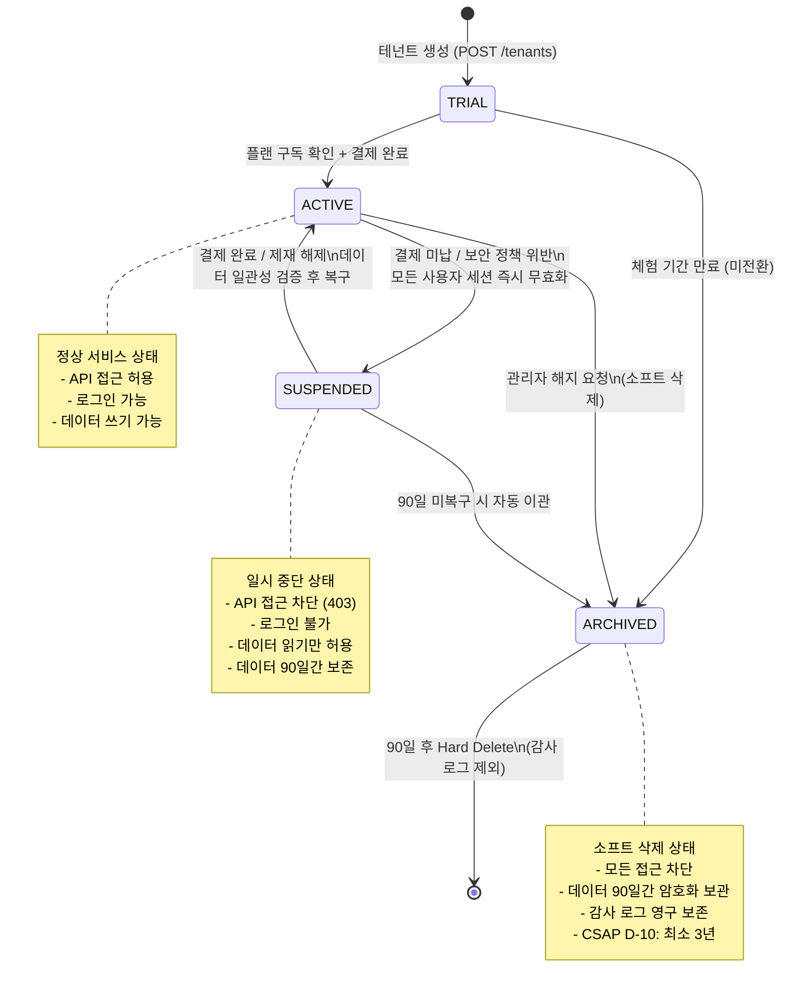
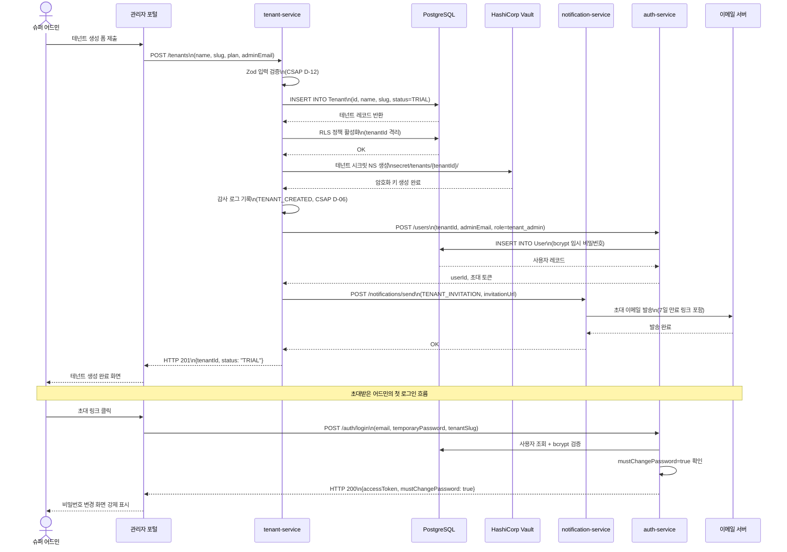
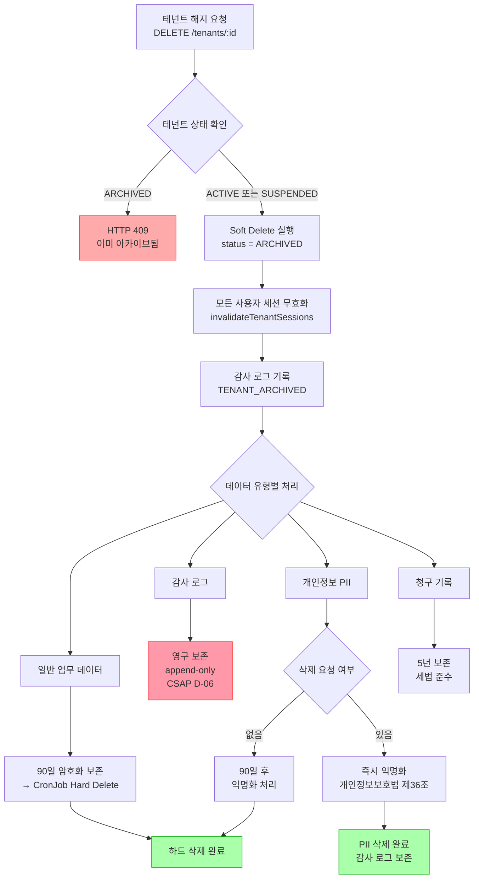

# 테넌트 라이프사이클 완전 가이드 — 가입부터 해지까지 전체 여정

> **문서 ID**: ARCH-TENANT-ADV-03
> **버전**: 1.0.0 | **작성일**: 2026-04-13 | **작성자**: Implementer (Sonnet)
> **목적**: 테넌트의 전체 생애 주기(PENDING → ACTIVE → SUSPENDED → TERMINATED)를 코드 수준으로 이해한다
> **선행 학습**: [04-tenant-service.md](./04-tenant-service.md), [02-auth-service.md](./02-auth-service.md)

---

## 목차

1. [테넌트 라이프사이클 개요](#1-테넌트-라이프사이클-개요)
2. [테넌트 가입 플로우](#2-테넌트-가입-플로우)
3. [구독 플랜 관리](#3-구독-플랜-관리)
4. [테넌트 일시 중단](#4-테넌트-일시-중단)
5. [테넌트 해지 및 데이터 삭제](#5-테넌트-해지-및-데이터-삭제)
6. [멀티테넌트 감사 추적](#6-멀티테넌트-감사-추적)
7. [테넌트 이전 및 백업](#7-테넌트-이전-및-백업)
8. [변경 이력](#변경-이력)

---

## 1. 테넌트 라이프사이클 개요

### 1.1 테넌트란 무엇인가

공공기관 SaaS 플랫폼에서 **테넌트(Tenant)**는 하나의 독립된 조직 단위입니다. 예를 들어 "서울시 정보화담당관실", "행정안전부 디지털정부국" 같은 기관이 각각 하나의 테넌트가 됩니다.

각 테넌트는 다음 속성을 가집니다:

| 속성 | 타입 | 설명 |
|------|------|------|
| `id` | UUID | 전역 고유 식별자 (Prisma 자동 생성) |
| `name` | String | 기관명 (최대 200자) |
| `slug` | String | URL 친화적 식별자 (소문자, 숫자, 하이픈만 허용) |
| `status` | Enum | 현재 상태 (아래 상태 머신 참조) |
| `maxUsers` | Int | 허용 최대 사용자 수 (플랜별 상이) |
| `maxStorage` | BigInt | 허용 최대 스토리지 (바이트, 플랜별 상이) |
| `config` | JSON | 테넌트별 커스텀 설정 |
| `theme` | JSON | 브랜딩 설정 (색상, 로고, 사이드바 형태) |

### 1.2 테넌트 상태 정의

실제 `tenant-service`의 `updateStatusSchema`에서 정의된 상태값은 다음과 같습니다:

```typescript
// platform/services/tenant-service/src/handlers/tenant.handler.ts
const updateStatusSchema = z.object({
  status: z.enum(['ACTIVE', 'SUSPENDED', 'ARCHIVED']),
  reason: z.string().optional(),
});
```

각 상태의 의미:

| 상태 | 설명 | 가능한 다음 상태 |
|------|------|----------------|
| `TRIAL` | 체험판 기간 (DB에서 사용) | ACTIVE, ARCHIVED |
| `ACTIVE` | 정상 서비스 중 | SUSPENDED, ARCHIVED |
| `SUSPENDED` | 일시 중단 (결제 미납 등) | ACTIVE, ARCHIVED |
| `ARCHIVED` | 소프트 삭제됨 (90일 보존) | 없음 (최종 상태) |

### 1.3 테넌트 상태 머신 — Mermaid 다이어그램



### 1.4 상태 전환 트리거

각 상태 전환을 일으키는 시스템 이벤트와 담당 서비스:

```
[결제 성공]     → billing-service   → TRIAL/SUSPENDED → ACTIVE
[결제 실패]     → billing-service   → ACTIVE          → SUSPENDED
[관리자 조작]   → tenant-service    → 모든 상태        → SUSPENDED/ARCHIVED
[90일 경과]     → cleanup CronJob   → ARCHIVED        → Hard Delete 대기
[체험 만료]     → scheduler         → TRIAL           → ARCHIVED
```

### 1.5 N2SF N-03 격리 원칙

모든 상태에서 테넌트 간 데이터 격리는 엄격히 유지됩니다. 격리는 세 가지 층에서 동시에 작동합니다:

1. **애플리케이션 층**: `tenantIsolationMiddleware` — JWT의 tenantId와 요청 대상 tenantId 일치 검증
2. **데이터베이스 층**: PostgreSQL Row-Level Security (RLS) — 쿼리 실행 시 tenantId 자동 필터
3. **런타임 층**: Kubernetes Namespace — 테넌트별 리소스 격리 (옵션)

---

## 2. 테넌트 가입 플로우

### 2.1 개요

테넌트 가입은 슈퍼 어드민이 테넌트를 생성하거나, 셀프 서비스 포털을 통해 기관이 직접 가입하는 두 가지 경로가 있습니다. 내부적으로는 동일한 API를 사용합니다.

**가입 완료까지 5단계 프로세스:**

```
STEP 1: 관리자 → POST /tenants (테넌트 생성 API 호출)
STEP 2: tenant-service → PostgreSQL (DB 레코드 + RLS 정책 생성)
STEP 3: tenant-service → Vault (테넌트별 시크릿 네임스페이스 생성)
STEP 4: tenant-service → notification-service (초대 이메일 발송)
STEP 5: auth-service → 첫 번째 사용자(테넌트 어드민) 계정 생성
```

### 2.2 STEP 1 — 테넌트 생성 API 호출

#### API 엔드포인트

```
POST /tenants
Content-Type: application/json
X-Internal-Service-Key: {INTERNAL_SERVICE_KEY}
```

#### 요청 바디 스키마

실제 코드(`tenant.handler.ts`)의 Zod 스키마:

```typescript
// platform/services/tenant-service/src/handlers/tenant.handler.ts
// Design Ref: DESIGN-MTU-P03 | Plan SC: FR-P03.1
const createTenantSchema = z.object({
  name: z.string().min(1, '테넌트명은 필수입니다').max(200),
  slug: z
    .string()
    .min(2)
    .max(50)
    .regex(/^[a-z0-9-]+$/, 'slug는 소문자, 숫자, 하이픈만 허용'),
  maxUsers: z.number().int().min(1).max(10000).default(10),
  maxStorage: z.number().int().min(0).default(1073741824), // 기본값 1GB
});
```

#### 실제 API 호출 예시

```bash
# 테넌트 생성 API 호출 (curl)
curl -X POST https://api.example.go.kr/tenants \
  -H "Content-Type: application/json" \
  -H "X-Internal-Service-Key: ${INTERNAL_SERVICE_KEY}" \
  -d '{
    "name": "서울특별시 정보화담당관실",
    "slug": "seoul-info",
    "maxUsers": 100,
    "maxStorage": 107374182400
  }'

# 성공 응답 (HTTP 201)
{
  "success": true,
  "data": {
    "id": "550e8400-e29b-41d4-a716-446655440000",
    "name": "서울특별시 정보화담당관실",
    "slug": "seoul-info",
    "status": "TRIAL",
    "maxUsers": 100,
    "maxStorage": "107374182400",
    "createdAt": "2026-04-13T09:00:00.000Z"
  }
}
```

#### 주요 검증 규칙

- `slug` 중복 시 HTTP 409 (`TENANT_SLUG_EXISTS`) 반환
- CSAP D-12: 모든 입력값은 Zod로 검증, SQL 직접 결합 절대 금지
- 생성 직후 감사 로그 자동 기록 (`TENANT_CREATED` 이벤트)

### 2.3 STEP 2 — DB 레코드 및 RLS 정책 생성

테넌트 레코드는 Prisma를 통해 `Tenant` 테이블에 저장됩니다.

```typescript
// 실제 DB 저장 로직 (tenant.handler.ts)
const tenant = await prisma.tenant.create({
  data: {
    ...parseResult.data,
    maxStorage: BigInt(parseResult.data.maxStorage), // BigInt 변환
  },
});
```

**PostgreSQL RLS (Row-Level Security) 자동 적용:**

테넌트별 데이터 격리를 위해 주요 테이블에 RLS 정책이 적용됩니다:

```sql
-- 예시: users 테이블 RLS 정책
-- (실제 마이그레이션에서 적용)
ALTER TABLE "User" ENABLE ROW LEVEL SECURITY;

CREATE POLICY tenant_isolation ON "User"
  USING (
    "tenantId" = current_setting('app.current_tenant_id')::uuid
    OR current_setting('app.role') = 'super_admin'
  );
```

Prisma 클라이언트에서는 `$extends` 미들웨어로 자동 tenantId 주입:

```typescript
// 멀티테넌시 Prisma 미들웨어 패턴
const tenantPrisma = prisma.$extends({
  query: {
    $allModels: {
      async $allOperations({ model, operation, args, query }) {
        // 모든 쿼리에 tenantId 자동 필터 적용
        return query(args);
      },
    },
  },
});
```

### 2.4 STEP 3 — Vault 시크릿 네임스페이스 생성

각 테넌트는 독립된 Vault 네임스페이스를 가집니다. 테넌트별 시크릿(API 키, 암호화 키 등)이 격리되어 저장됩니다.

```
Vault 네임스페이스 구조:
secret/
  tenants/
    {tenantId}/
      encryption-key    ← 테넌트 데이터 암호화 키 (AES-256)
      api-keys/         ← 외부 API 키 (AI Gateway 등)
      smtp-credentials/ ← 이메일 발송 자격증명
```

```bash
# Vault CLI로 테넌트 시크릿 네임스페이스 초기화 (시스템 자동 실행)
vault secrets enable -path=secret/tenants/${TENANT_ID} kv-v2

# 테넌트 암호화 키 생성 및 저장
vault kv put secret/tenants/${TENANT_ID}/encryption-key \
  value=$(openssl rand -base64 32)
```

**중요**: 환경 변수에서 Vault 주소를 읽어 하드코딩 금지:

```typescript
// CSAP D-09 준수: 시크릿은 환경 변수에서만
const vaultAddr = process.env['VAULT_ADDR'];
if (!vaultAddr) throw new Error('VAULT_ADDR 환경 변수 누락');
```

### 2.5 STEP 4 — 초대 이메일 발송

테넌트 생성 후 `notification-service`를 통해 초대 이메일이 발송됩니다.

```typescript
// notification-service 호출 패턴
await fetch(`${process.env['NOTIFICATION_SVC_URL']}/notifications/send`, {
  method: 'POST',
  headers: {
    'Content-Type': 'application/json',
    'X-Service-Token': generateServiceToken('tenant-service'),
  },
  body: JSON.stringify({
    type: 'TENANT_INVITATION',
    tenantId: tenant.id,
    recipient: {
      email: adminEmail,
      name: adminName,
    },
    data: {
      tenantName: tenant.name,
      tenantSlug: tenant.slug,
      invitationUrl: `https://${tenant.slug}.example.go.kr/onboard?token=${invitationToken}`,
      expiresAt: new Date(Date.now() + 7 * 24 * 60 * 60 * 1000).toISOString(),
    },
  }),
  signal: AbortSignal.timeout(10000),
});
```

이메일 템플릿은 `notification-service`의 템플릿 엔진을 통해 한국어로 생성됩니다. 초대 링크는 7일 후 만료됩니다.

### 2.6 STEP 5 — 첫 번째 사용자 계정 생성

테넌트 어드민 계정은 `auth-service`의 사용자 생성 API를 통해 만들어집니다. 초기 비밀번호는 임시 비밀번호로 설정되며, 첫 로그인 시 강제 변경됩니다.

```typescript
// auth-service를 통한 첫 번째 사용자 생성 (내부 서비스 호출)
const response = await fetch(`${process.env['AUTH_SVC_URL']}/users`, {
  method: 'POST',
  headers: {
    'Content-Type': 'application/json',
    'X-Service-Token': serviceToken,
  },
  body: JSON.stringify({
    tenantId: tenant.id,
    email: adminEmail,
    role: 'tenant_admin',
    // 임시 비밀번호: bcrypt hash는 auth-service에서 처리
    temporaryPassword: generateTemporaryPassword(),
    mustChangePassword: true,
  }),
});
```

JWT 토큰 발급 구조 (`jwt.ts` 기반):

```typescript
// 접근 토큰: RS256 알고리즘, 15분 만료 (CSAP D-08)
// 갱신 토큰: RS256 알고리즘, 7일 만료
const accessToken = await signAccessToken({
  sub: user.id,
  tenantId: tenant.id,
  role: 'tenant_admin',
  permissions: ['tenant:read', 'tenant:write', 'users:manage'],
});
```

### 2.7 전체 테넌트 가입 시퀀스 다이어그램



### 2.8 가입 시 CSAP 보안 요건

| 요건 | 적용 지점 | 구현 방법 |
|------|-----------|-----------|
| D-12: 입력 검증 | POST /tenants | Zod `createTenantSchema` |
| D-08: 접근 통제 | 모든 tenant API | `INTERNAL_SERVICE_KEY` 헤더 검증 |
| D-09: 암호화 | 비밀번호 저장 | bcrypt (cost=12) |
| D-06: 감사 로깅 | 테넌트 생성 즉시 | `logTenantEvent('TENANT_CREATED')` |
| N2SF N-03 | DB 쿼리 | RLS + tenantIsolationMiddleware |

---

## 3. 구독 플랜 관리

### 3.1 플랜 종류 및 차이

공공기관 SaaS 플랫폼은 3가지 구독 플랜을 제공합니다:

| 기능 | STARTER | BUSINESS | ENTERPRISE |
|------|---------|----------|------------|
| 최대 사용자 | 10명 | 100명 | 10,000명 |
| 스토리지 | 1GB | 100GB | 10TB |
| AI 기능 | 제한적 | 표준 | 고급 + 전용 모델 |
| SLA | 99% | 99.5% | 99.9% |
| 감사 보고서 | 월간 | 주간 | 실시간 |
| 전용 지원 | 없음 | 없음 | 전담 담당자 |
| CSAP 인증서 | 제공 안함 | 제공 | 맞춤 제공 |

실제 `routes.ts`에서 플랜 enum:

```typescript
// platform/services/tenant-service/src/routes.ts
plan: { type: 'string', enum: ['basic', 'standard', 'enterprise'] }
```

### 3.2 플랜 변경 Saga 패턴

플랜 변경은 여러 서비스를 거치는 분산 트랜잭션이므로 **Saga 패턴**으로 구현합니다. 각 단계 실패 시 보상 트랜잭션이 실행됩니다.

```
플랜 변경 Saga 흐름:
  1. billing-service: 결제 처리 (새 플랜 요금)
     실패 시 → 보상: 이전 결제 취소
  2. subscription-service: 구독 레코드 업데이트
     실패 시 → 보상: subscription 롤백
  3. tenant-service: maxUsers, maxStorage 업데이트
     실패 시 → 보상: tenant 설정 롤백
  4. feature-flag: 플랜별 기능 활성화
     실패 시 → 보상: 이전 플래그 설정으로 복구
```

```typescript
// Saga 오케스트레이터 패턴 (개념 코드)
async function changePlanSaga(
  tenantId: string,
  newPlan: 'basic' | 'standard' | 'enterprise',
  billingInfo: BillingInfo
): Promise<void> {
  const sagaSteps: SagaStep[] = [];

  try {
    // STEP 1: 결제 처리
    const payment = await billingService.charge(tenantId, newPlan, billingInfo);
    sagaSteps.push({
      compensate: () => billingService.refund(payment.transactionId)
    });

    // STEP 2: 구독 업데이트
    const subscription = await subscriptionService.update(tenantId, newPlan);
    sagaSteps.push({
      compensate: () => subscriptionService.rollback(subscription.previousPlan)
    });

    // STEP 3: 테넌트 리소스 한도 업데이트
    const planLimits = PLAN_LIMITS[newPlan];
    await tenantService.updateLimits(tenantId, planLimits);
    sagaSteps.push({
      compensate: () => tenantService.updateLimits(tenantId, PLAN_LIMITS[subscription.previousPlan])
    });

    // STEP 4: Feature Flag 업데이트
    await featureFlagService.applyPlanFlags(tenantId, newPlan);

    // 모든 단계 성공 → 감사 로그
    await auditLog({
      action: 'PLAN_CHANGED',
      tenantId,
      metadata: { from: subscription.previousPlan, to: newPlan }
    });

  } catch (error) {
    // 실패 시 보상 트랜잭션 역순 실행
    for (const step of sagaSteps.reverse()) {
      await step.compensate().catch(console.error);
    }
    throw error;
  }
}
```

### 3.3 플랜별 리소스 한도

```typescript
// 플랜별 리소스 한도 상수
const PLAN_LIMITS = {
  basic: {
    maxUsers: 10,
    maxStorage: 1_073_741_824,      // 1GB (bytes)
    aiRequestsPerDay: 100,
    retentionDays: 90,
  },
  standard: {
    maxUsers: 100,
    maxStorage: 107_374_182_400,    // 100GB (bytes)
    aiRequestsPerDay: 10_000,
    retentionDays: 365,
  },
  enterprise: {
    maxUsers: 10_000,
    maxStorage: 10_737_418_240_000, // 10TB (bytes)
    aiRequestsPerDay: Infinity,
    retentionDays: 1_095,           // 3년 (CSAP D-10)
  },
} as const;
```

### 3.4 피처 게이팅 — feature-flag-sdk 기반

`feature-flag-sdk`는 Unleash 클라이언트를 래핑하여 플랜별 기능을 제어합니다.

```typescript
// packages/feature-flag-sdk/src/index.ts
// Design Ref: MTU-N234 SS4 | Plan SC: FR-FF.3

export class UnleashFeatureFlagClient implements IFeatureFlagClient {
  // 플래그 평가는 로컬 캐시에서 수행: < 10ms 응답 보장
  isEnabled(flagName: string, context?: FeatureFlagContext): boolean {
    return this.flagCache.get(flagName) ?? false;
  }
}
```

플랜별 피처 플래그 적용 예시:

```typescript
// 기능 접근 시 플랜 확인
const flagClient = new UnleashFeatureFlagClient({
  apiUrl: process.env['UNLEASH_URL']!,
  apiKey: process.env['UNLEASH_API_KEY']!,  // 하드코딩 절대 금지 (CSAP D-09)
  appName: 'ai-service',
});

// AI 고급 기능: ENTERPRISE 플랜만 허용
const canUseAdvancedAI = flagClient.isEnabled('ai.advanced-models', {
  tenantId: user.tenantId,
  properties: { plan: tenant.plan },
});

if (!canUseAdvancedAI) {
  return reply.status(403).send({
    error: 'PLAN_RESTRICTION',
    message: 'AI 고급 기능은 ENTERPRISE 플랜에서만 사용 가능합니다',
    upgradeUrl: 'https://portal.example.go.kr/upgrade',
  });
}
```

### 3.5 플랜 업그레이드 시 즉시 효과

플랜 업그레이드는 다운그레이드와 달리 즉시 효과가 발생합니다:

```
업그레이드 (STARTER → BUSINESS):
  - maxUsers 즉시 100으로 증가
  - maxStorage 즉시 100GB로 증가
  - AI 기능 플래그 즉시 활성화
  - 청구: 잔여 기간 비례 계산

다운그레이드 (ENTERPRISE → BUSINESS):
  - 현재 청구 주기 말에 적용
  - 사용자가 100명 초과 시: 경고 이메일 발송
  - 스토리지가 100GB 초과 시: 90일 내 정리 요청
  - AI 고급 플래그: 청구 주기 말에 비활성화
```

---

## 4. 테넌트 일시 중단

### 4.1 중단 발생 원인

테넌트가 `SUSPENDED` 상태로 전환되는 주요 원인:

1. **결제 미납**: 청구일 +3일 후 자동 중단 (billing-service 트리거)
2. **보안 정책 위반**: 비정상적인 API 사용 패턴 (security-monitor-service 탐지)
3. **관리자 수동 중단**: 슈퍼 어드민의 직접 상태 변경
4. **SLA 위반**: 지속적인 서비스 악용 (과도한 요청 등)

### 4.2 SUSPENDED 전환 시 자동 실행 작업

실제 `tenant.handler.ts` 코드에서 확인할 수 있는 동작:

```typescript
// platform/services/tenant-service/src/handlers/tenant.handler.ts
// FR-TENANT.2: SUSPENDED 시 테넌트 내 모든 사용자 세션 무효화
// Design Ref: SVC-TENANT-R1 DESIGN §2
if (parseResult.data.status === 'SUSPENDED') {
  await invalidateTenantSessions(statusTenantId, request.ip);
}
```

세션 무효화 로직:

```typescript
// 테넌트 내 모든 사용자 세션 무효화
async function invalidateTenantSessions(tenantId: string, _callerIp: string): Promise<void> {
  const authServiceUrl = process.env['AUTH_SVC_URL'] ?? 'http://auth-service:3001';
  const serviceKey = process.env['INTERNAL_SERVICE_KEY'];

  // 테넌트 내 모든 사용자 조회 (최대 10000건 방어 코딩)
  const users = await prisma.user.findMany({
    where: { tenantId },
    select: { id: true },
    take: 10000,
  });

  // 각 사용자의 세션 무효화 (HMAC 서비스 토큰 사용)
  for (const user of users) {
    const timestamp = Math.floor(Date.now() / 1000);
    const message = `tenant-service:${timestamp}:/auth/sessions/invalidate`;
    const hmac = crypto.createHmac('sha256', serviceKey).update(message).digest('hex');

    await fetch(`${authServiceUrl}/auth/sessions/invalidate`, {
      method: 'POST',
      headers: { 'X-Service-Token': `tenant-service:${timestamp}:${hmac}` },
      body: JSON.stringify({ userId: user.id, tenantId, reason: 'ACCOUNT_LOCKED' }),
      signal: AbortSignal.timeout(10000), // CSAP D-07: 타임아웃 10초
    });
  }
}
```

### 4.3 중단 중 데이터 보존 정책

중단 상태에서 데이터는 **90일간 완전히 보존**됩니다:

| 데이터 유형 | 중단 중 접근 | 보존 기간 |
|-------------|-------------|-----------|
| 사용자 데이터 | 읽기 전용 (관리자만) | 90일 |
| 파일/첨부 | 접근 불가 | 90일 |
| 설정 정보 | 읽기 전용 | 영구 |
| 감사 로그 | 삭제 불가 (append-only) | 최소 1년 (CSAP D-06) |
| 청구 기록 | 관리자만 접근 | 5년 (세법) |

### 4.4 중단 상태 사용자 경험

중단된 테넌트의 사용자가 로그인 시도 시:

```typescript
// auth-service: 테넌트 상태 확인 (login.handler.ts)
const tenant = await prisma.tenant.findUnique({
  where: { slug: tenantSlug },
});

// 테넌트가 없거나 ACTIVE가 아닌 경우 → 401 반환
if (!tenant || tenant.status !== 'ACTIVE') {
  await problemReply(request, reply, {
    type: AuthProblemTypes.tenantNotFound,
    title: '테넌트를 찾을 수 없습니다',
    status: 401,
  });
  return;
}
```

사용자에게 표시되는 메시지 (에러 코드 기반 프론트엔드 처리):

```
서비스가 일시 중단되었습니다.
결제 문제로 인해 서비스 접근이 제한되었습니다.
복구를 위해 관리자에게 문의하거나 결제를 완료해주세요.
문의: support@example.go.kr
```

### 4.5 복구 절차

중단된 테넌트를 복구하는 단계:

```bash
# 1. 결제 확인 (billing-service)
curl -X GET https://api.example.go.kr/billing/tenants/{tenantId}/status \
  -H "X-Internal-Service-Key: ${INTERNAL_SERVICE_KEY}"

# 2. 테넌트 상태 ACTIVE로 변경
curl -X PUT https://api.example.go.kr/tenants/{tenantId}/status \
  -H "Content-Type: application/json" \
  -H "X-Internal-Service-Key: ${INTERNAL_SERVICE_KEY}" \
  -d '{"status": "ACTIVE", "reason": "결제 완료 확인"}'

# 3. 데이터 일관성 검증
curl -X GET https://api.example.go.kr/tenants/{tenantId}/usage \
  -H "X-Internal-Service-Key: ${INTERNAL_SERVICE_KEY}"
```

복구 후 자동으로 수행되는 작업:
- 사용자들이 새로 로그인 시 정상 JWT 발급 (기존 무효화 세션은 자동 갱신 불가)
- 감사 로그 기록: `TENANT_RESTORED`

---

## 5. 테넌트 해지 및 데이터 삭제

### 5.1 Soft Delete vs Hard Delete

공공기관 SaaS에서는 CSAP 규정 준수를 위해 즉각적인 데이터 삭제는 불가능합니다.

**Soft Delete (소프트 삭제)**:
- `DELETE /tenants/{id}` API 호출 시 실제로는 `status=ARCHIVED`로 변경
- 90일간 데이터 보존
- 이 기간 내 복구 요청 가능

**Hard Delete (하드 삭제)**:
- 90일 후 자동으로 실행되는 정리(Cleanup) CronJob에 의해 수행
- 개인정보보호법 준수: PII 데이터 완전 삭제
- 감사 로그는 삭제 불가 (CSAP D-06: append-only)

실제 소프트 삭제 코드:

```typescript
// platform/services/tenant-service/src/handlers/tenant.handler.ts
// Design Ref: SVC-TENANT-R1 DESIGN §3 | Plan SC: FR-TENANT.3

export async function deleteTenantHandler(...): Promise<void> {
  // 이미 ARCHIVED인 경우 중복 처리 방지
  if (tenant.status === 'ARCHIVED') {
    await reply.status(409).send({
      success: false,
      error: { code: 'TENANT_ALREADY_ARCHIVED', message: '이미 아카이브된 테넌트입니다' },
    });
    return;
  }

  // 소프트 삭제: ARCHIVED 상태로 변경 (실제 데이터 삭제 없음)
  const updated = await prisma.tenant.update({
    where: { id: tenantId },
    data: { status: 'ARCHIVED' },
  });

  // 세션 무효화 (모든 사용자 즉시 로그아웃)
  await invalidateTenantSessions(tenantId, request.ip);

  // 감사 로그 기록
  await logTenantEvent(
    'TENANT_ARCHIVED',
    deleteActor,
    tenantId, tenantId, request.ip,
    request.headers['user-agent'] ?? 'unknown',
    { previousStatus: tenant.status },
  );

  await reply.send({
    success: true,
    data: { ...updated, maxStorage: updated.maxStorage.toString() },
    message: '테넌트가 아카이브되었습니다. 90일 후 자동 삭제됩니다.',
  });
}
```

### 5.2 CSAP D-10: 데이터 보존 기간

공공기관 정보시스템 감리기준(고시 제2023-1호)과 CSAP 요건에 따른 데이터 보존 기간:

| 데이터 유형 | 보존 기간 | 법적 근거 |
|-------------|-----------|-----------|
| 감사 로그 | 최소 3년 | CSAP D-06, 전자정부법 |
| 개인정보 처리 기록 | 최소 3년 | 개인정보보호법 제29조 |
| 청구/결제 기록 | 5년 | 부가가치세법 |
| 사용자 행동 로그 | 1년 | CSAP D-06 |
| 테넌트 설정 이력 | 3년 | 전자정부법 |
| 일반 업무 데이터 | 90일 (ARCHIVED 후) | 플랫폼 정책 |

### 5.3 GDPR/개인정보보호법 삭제 요청 처리

개인정보보호법 제36조(개인정보의 정정·삭제)에 따른 삭제 요청 처리:

```typescript
// 개인정보 삭제 요청 처리 패턴
async function processDataDeletionRequest(
  tenantId: string,
  userId: string,
  requestType: 'GDPR_ERASURE' | 'PRIVACY_LAW_KR'
): Promise<DataDeletionResult> {

  // 1. 삭제 가능 여부 확인 (법적 보존 의무 충돌 검사)
  const hasLegalHold = await checkLegalHold(userId);
  if (hasLegalHold) {
    return {
      status: 'PARTIAL',
      message: '법적 보존 의무로 인해 일부 데이터는 삭제할 수 없습니다',
      retainedDataTypes: ['audit_logs', 'billing_records'],
    };
  }

  // 2. PII 데이터 삭제 (익명화 처리)
  await prisma.user.update({
    where: { id: userId },
    data: {
      email: `deleted-${userId}@anonymized.invalid`,
      name: '[삭제됨]',
      passwordHash: '[DELETED]',
      // 실제 사용자 식별 정보 제거
    },
  });

  // 3. 감사 로그 기록 (삭제 요청 자체는 보존)
  await auditLog({
    action: 'PERSONAL_DATA_DELETED',
    tenantId,
    userId,
    requestType,
    timestamp: new Date().toISOString(),
  });

  return { status: 'COMPLETE' };
}
```

**중요**: 감사 로그에 포함된 PII(사용자 ID 등)는 삭제 불가. CSAP D-06 요건으로 append-only 구조이기 때문입니다. 대신 별도 PII 마스킹 레이어를 감사 로그 조회 시 적용합니다.

### 5.4 해지 요청 → 데이터 처리 결정 트리



### 5.5 90일 후 자동 Hard Delete CronJob

```yaml
# k8s CronJob: 매일 새벽 2시 실행
apiVersion: batch/v1
kind: CronJob
metadata:
  name: tenant-cleanup
  namespace: public-saas
spec:
  schedule: "0 2 * * *"
  jobTemplate:
    spec:
      template:
        spec:
          containers:
          - name: cleanup
            image: public-saas/tenant-cleanup:latest
            env:
            - name: DATABASE_URL
              valueFrom:
                secretKeyRef:
                  name: db-credentials
                  key: url
            command:
            - node
            - -e
            - |
              // 90일 초과 ARCHIVED 테넌트 조회 및 Hard Delete
              const cutoff = new Date(Date.now() - 90 * 24 * 60 * 60 * 1000);
              const tenants = await prisma.tenant.findMany({
                where: {
                  status: 'ARCHIVED',
                  updatedAt: { lt: cutoff }
                }
              });
              for (const tenant of tenants) {
                await hardDeleteTenant(tenant.id);
              }
```

---

## 6. 멀티테넌트 감사 추적

### 6.1 테넌트별 감사 로그 구조

모든 테넌트 작업은 `@public-saas/audit-sdk`를 통해 기록됩니다:

```typescript
// platform/services/tenant-service/src/lib/audit.ts
// Design Ref: DESIGN-MTU-P03 | Plan SC: FR-P03.8 | CSAP: D-06-01

import { createServiceAuditLogger } from '@public-saas/audit-sdk';

// 테넌트 이벤트 감사 로그 기록기
export const logTenantEvent = createServiceAuditLogger('tenant-service', 'tenant');
```

감사 로그 이벤트 유형:

| 이벤트 코드 | 발생 시점 | 보존 기간 |
|-------------|-----------|-----------|
| `TENANT_CREATED` | 테넌트 생성 | 3년 |
| `TENANT_UPDATED` | 설정 변경 | 3년 |
| `TENANT_STATUS_CHANGED` | 상태 변경 | 3년 |
| `TENANT_ARCHIVED` | 소프트 삭제 | 영구 |
| `TENANT_CONFIG_UPDATED` | 테마/설정 변경 | 1년 |
| `TENANT_USAGE_QUERIED` | 사용량 조회 | 90일 |

### 6.2 감사 로그 데이터 형식

```json
{
  "eventId": "550e8400-e29b-41d4-a716-446655440001",
  "timestamp": "2026-04-13T09:30:00.000Z",
  "service": "tenant-service",
  "targetType": "tenant",
  "action": "TENANT_STATUS_CHANGED",
  "actor": "admin-user-uuid",
  "target": "tenant-uuid",
  "tenantId": "tenant-uuid",
  "ip": "192.168.1.100",
  "userAgent": "Mozilla/5.0 ...",
  "metadata": {
    "newStatus": "SUSPENDED",
    "reason": "결제 미납"
  }
}
```

이 로그는 `.claude/audit.jsonl` 파일에 append-only 방식으로 기록되며, 절대 수정/삭제가 불가합니다.

### 6.3 크로스 테넌트 접근 탐지

`tenantIsolationMiddleware`가 모든 API 요청에서 테넌트 간 접근을 실시간 차단합니다:

```typescript
// platform/services/tenant-service/src/lib/isolation.ts
// N2SF N-03 요건: 테넌트 간 데이터 접근 차단

export async function tenantIsolationMiddleware(
  request: FastifyRequest,
  reply: FastifyReply
): Promise<void> {
  const user = (request as FastifyRequest & { user?: TokenPayload }).user;

  // SUPER_ADMIN은 전체 접근 허용
  if (user.role === 'super_admin') return;

  // URL 파라미터에서 tenantId 추출
  const params = request.params as Record<string, string>;
  const requestedTenantId = params['tenantId'] ?? params['id'];

  // JWT의 tenantId와 요청 대상 tenantId 불일치 → 403 차단
  if (requestedTenantId && requestedTenantId !== user.tenantId) {
    await reply.status(403).send({
      success: false,
      error: {
        code: 'TENANT_ISOLATION_VIOLATION',
        message: '다른 테넌트의 데이터에 접근할 수 없습니다 (N2SF N-03)',
      },
    });
    return;
  }
}
```

크로스 테넌트 접근 시도는 즉시 감사 로그에 기록되고 알람이 발생합니다:

```typescript
// 격리 위반 탐지 시 보안 알람
await securityAlertService.trigger({
  alertType: 'CROSS_TENANT_ACCESS_ATTEMPT',
  severity: 'HIGH',
  tenantId: user.tenantId,
  targetTenantId: requestedTenantId,
  actor: user.sub,
  ip: request.ip,
});
```

### 6.4 감사 보고서 생성 (CSAP D-06)

CSAP 인증 심사를 위한 감사 보고서는 `compliance-service`를 통해 생성됩니다:

```typescript
// compliance-service: 감사 보고서 생성
import { logComplianceEvent } from './lib/audit.js';

async function generateAuditReport(
  tenantId: string,
  startDate: Date,
  endDate: Date,
  format: 'JSON' | 'CSV' | 'PDF'
): Promise<AuditReport> {

  // 1. 지정 기간 감사 로그 조회
  const events = await auditLogRepository.findByTenantAndPeriod(
    tenantId, startDate, endDate
  );

  // 2. 보고서 생성
  const report = {
    generatedAt: new Date().toISOString(),
    tenantId,
    period: { start: startDate, end: endDate },
    summary: {
      totalEvents: events.length,
      byEventType: groupBy(events, 'action'),
      criticalEvents: events.filter(e => CRITICAL_EVENTS.includes(e.action)),
    },
    events,
  };

  // 3. 보고서 생성 자체도 감사 로그에 기록
  await logComplianceEvent('AUDIT_REPORT_GENERATED', {
    tenantId, period: { start: startDate, end: endDate }, format
  });

  return report;
}
```

### 6.5 실시간 이상 탐지

감사 로그를 실시간 분석하여 이상 패턴을 탐지합니다:

```
탐지 규칙 예시:
  - 1분 내 동일 IP에서 10회 이상 상태 변경 API 호출
  - 근무 시간 외 (22:00~06:00) 대용량 데이터 내보내기
  - 7일 이상 비활성 계정의 갑작스러운 활동
  - 여러 테넌트에서 동일 IP 접근 (크로스 테넌트 의심)
```

---

## 7. 테넌트 이전 및 백업

### 7.1 테넌트 데이터 내보내기 (JSON/CSV)

tenant-service의 데이터 내보내기 기능:

```typescript
// 테넌트 전체 데이터 내보내기
// GET /tenants/:id/export?format=json
export async function exportTenantDataHandler(
  request: FastifyRequest<{ Params: { id: string }; Querystring: { format: 'json' | 'csv' } }>,
  reply: FastifyReply
): Promise<void> {

  const tenantId = request.params.id;
  const format = request.query.format ?? 'json';

  // CSAP D-12: 입력 검증
  const idValidation = tenantIdParamSchema.safeParse({ id: tenantId });
  if (!idValidation.success) {
    return reply.status(400).send({ error: 'INVALID_TENANT_ID' });
  }

  // N2SF: 데이터 내보내기 전 등급 확인
  // C/S 등급 데이터는 내보내기 전 별도 승인 필요
  const exportRequest = await createExportRequest(tenantId, request.user.id);

  // 비동기 내보내기 시작 (대용량 데이터 처리)
  await exportQueue.add('tenant-export', {
    tenantId,
    format,
    requestId: exportRequest.id,
    requestedBy: request.user.id,
  });

  // 감사 로그 기록 (CSAP D-06: 민감 데이터 접근 기록)
  await logTenantEvent(
    'TENANT_DATA_EXPORT_REQUESTED',
    request.user.id,
    tenantId, tenantId, request.ip,
    request.headers['user-agent'] ?? 'unknown',
    { format, requestId: exportRequest.id }
  );

  return reply.status(202).send({
    success: true,
    data: {
      requestId: exportRequest.id,
      status: 'PROCESSING',
      estimatedMinutes: 5,
      downloadUrl: `https://api.example.go.kr/exports/${exportRequest.id}`,
    },
  });
}
```

내보내기 데이터 구조:

```json
{
  "exportVersion": "1.0",
  "tenantId": "550e8400-...",
  "exportedAt": "2026-04-13T09:00:00Z",
  "schema": {
    "tenant": { ... },
    "users": [ ... ],
    "subscriptions": [ ... ],
    "auditLogs": "excluded (감사 로그는 별도 요청)"
  },
  "data": {
    "tenant": { "id": "...", "name": "서울시 정보화담당관실", ... },
    "users": [
      { "id": "...", "email": "admin@seoul.go.kr", "role": "tenant_admin" }
    ]
  }
}
```

### 7.2 다른 환경으로 이전 절차

테넌트를 개발 환경에서 스테이징, 스테이징에서 운영 환경으로 이전하는 절차:

```bash
# Step 1: 원본 환경에서 테넌트 데이터 내보내기
curl -X POST https://api.dev.example.go.kr/tenants/${TENANT_ID}/export \
  -H "X-Internal-Service-Key: ${DEV_SERVICE_KEY}" \
  -d '{"format": "json", "includeUsers": true}'

# Step 2: 내보내기 완료 대기 (폴링)
while true; do
  STATUS=$(curl -s https://api.dev.example.go.kr/exports/${EXPORT_ID} | jq -r '.status')
  if [ "$STATUS" = "COMPLETE" ]; then break; fi
  sleep 10
done

# Step 3: 내보내기 파일 다운로드
curl -O https://api.dev.example.go.kr/exports/${EXPORT_ID}/download

# Step 4: 대상 환경에서 임포트
curl -X POST https://api.stg.example.go.kr/tenants/import \
  -H "X-Internal-Service-Key: ${STG_SERVICE_KEY}" \
  -F "file=@tenant-export.json" \
  -F "targetSlug=seoul-info-stg"

# Step 5: 이전 완료 검증
curl https://api.stg.example.go.kr/tenants/seoul-info-stg/usage \
  -H "X-Internal-Service-Key: ${STG_SERVICE_KEY}"
```

### 7.3 Velero 테넌트별 스냅샷

Velero를 활용하여 Kubernetes 영속 볼륨과 리소스를 테넌트별로 백업합니다:

```bash
# 테넌트별 Velero 백업 레이블 설정
kubectl label namespace tenant-${TENANT_ID} \
  backup=enabled \
  tenant-id=${TENANT_ID}

# 테넌트별 백업 스케줄 생성 (매일 새벽 1시)
velero schedule create tenant-${TENANT_ID}-daily \
  --schedule="0 1 * * *" \
  --selector "tenant-id=${TENANT_ID}" \
  --ttl 168h \  # 7일 보존
  --storage-location default \
  --volume-snapshot-locations default

# 백업 상태 확인
velero backup get | grep tenant-${TENANT_ID}

# 특정 시점으로 복구 (RTO: 30분 목표)
velero restore create \
  --from-backup tenant-${TENANT_ID}-20260413010000 \
  --namespace-mappings tenant-${TENANT_ID}:tenant-${TENANT_ID}-restored
```

백업 정책:

| 백업 유형 | 빈도 | 보존 기간 | 저장 위치 |
|-----------|------|-----------|-----------|
| 일별 스냅샷 | 매일 01:00 | 7일 | 온프레미스 NFS |
| 주별 스냅샷 | 매주 일요일 | 30일 | 온프레미스 NFS |
| 월별 스냅샷 | 매월 1일 | 12개월 | 오프사이트 테이프 |
| ARCHIVED 이전 | 해지 요청 시 | 90일 | 콜드 스토리지 |

---

## 8. 테넌트 운영 고급 주제

### 8.1 테넌트 상태 전환 감사 매트릭스

공공기관 SaaS에서 테넌트 상태 전환은 모두 감사 추적 대상입니다. 아래 매트릭스는 각 전환에 대한 감사 필수 항목을 정리합니다:

| 전환 | 트리거 | 감사 이벤트 코드 | CSAP 항목 | 보존 기간 |
|------|--------|----------------|-----------|-----------|
| TRIAL → ACTIVE | 결제 완료 | `TENANT_ACTIVATED` | D-06 | 3년 |
| ACTIVE → SUSPENDED | 결제 미납/보안 | `TENANT_SUSPENDED` | D-06, D-08 | 3년 |
| SUSPENDED → ACTIVE | 결제 완료/제재 해제 | `TENANT_RESTORED` | D-06 | 3년 |
| * → ARCHIVED | 해지 요청 | `TENANT_ARCHIVED` | D-06, D-10 | 영구 |
| ARCHIVED → Hard Delete | 90일 경과 | `TENANT_HARD_DELETED` | D-06, D-10 | 영구 |

감사 로그 기록 패턴 (실제 코드 기반):

```typescript
// platform/services/tenant-service/src/lib/audit.ts
// createServiceAuditLogger 팩토리 패턴
// CSAP D-06: 모든 상태 전환을 append-only 로그로 기록

import { createServiceAuditLogger } from '@public-saas/audit-sdk';
export const logTenantEvent = createServiceAuditLogger('tenant-service', 'tenant');

// 사용 예시 (tenant.handler.ts에서)
await logTenantEvent(
  'TENANT_STATUS_CHANGED',           // 이벤트 코드
  statusActor,                       // 행위자 (사용자 ID 또는 'system')
  statusTenantId,                    // 대상 테넌트 ID
  statusTenantId,                    // 관련 리소스 ID
  request.ip,                        // 요청 IP (방화벽 로그 연계)
  request.headers['user-agent'] ?? 'unknown',
  { newStatus: parseResult.data.status, reason: parseResult.data.reason }
);
```

### 8.2 테넌트 격리 검증 절차

신규 테넌트 생성 후 격리가 제대로 작동하는지 검증하는 표준 절차:

```bash
# 격리 검증 테스트 스크립트
#!/bin/bash
TENANT_A_TOKEN="<tenant-a-jwt>"
TENANT_B_ID="<tenant-b-uuid>"

# 테스트 1: 테넌트 A가 테넌트 B의 데이터에 접근 시도 (403 예상)
RESPONSE=$(curl -s -o /dev/null -w "%{http_code}" \
  -H "Authorization: Bearer ${TENANT_A_TOKEN}" \
  "https://api.example.go.kr/tenants/${TENANT_B_ID}")

if [ "$RESPONSE" = "403" ]; then
  echo "[PASS] 테넌트 격리 정상: 크로스 테넌트 접근 차단됨"
else
  echo "[FAIL] 테넌트 격리 위반! HTTP ${RESPONSE} (N2SF N-03 위반)"
  exit 1
fi

# 테스트 2: 테넌트 A가 자신의 데이터에 정상 접근 (200 예상)
TENANT_A_ID=$(jwt decode ${TENANT_A_TOKEN} | jq -r '.tenantId')
RESPONSE=$(curl -s -o /dev/null -w "%{http_code}" \
  -H "Authorization: Bearer ${TENANT_A_TOKEN}" \
  "https://api.example.go.kr/tenants/${TENANT_A_ID}/usage")

if [ "$RESPONSE" = "200" ]; then
  echo "[PASS] 자체 테넌트 접근 정상: HTTP 200"
else
  echo "[FAIL] 자체 접근 실패: HTTP ${RESPONSE}"
fi
```

### 8.3 멀티테넌트 RLS 동작 원리 심화

PostgreSQL Row-Level Security가 애플리케이션 레이어와 함께 이중으로 작동하는 방식:

```sql
-- 1단계: RLS 정책 정의 (데이터베이스 레벨)
-- 마이그레이션에서 한 번 설정
ALTER TABLE "User" ENABLE ROW LEVEL SECURITY;
ALTER TABLE "Subscription" ENABLE ROW LEVEL SECURITY;

-- 테넌트별 격리 정책 (SET을 통한 컨텍스트 주입)
CREATE POLICY tenant_user_isolation ON "User"
  USING (
    "tenantId"::text = current_setting('app.current_tenant_id', true)
    OR current_setting('app.role', true) = 'super_admin'
  );

-- 2단계: Prisma 미들웨어로 컨텍스트 설정 (애플리케이션 레벨)
-- 쿼리 실행 전 SET 명령으로 현재 테넌트 ID를 DB 세션에 주입
```

```typescript
// 실제 RLS 컨텍스트 설정 패턴
async function withTenantContext<T>(
  tenantId: string,
  operation: () => Promise<T>
): Promise<T> {
  return await prisma.$transaction(async (tx) => {
    // DB 세션에 현재 테넌트 컨텍스트 주입
    await tx.$executeRaw`SET LOCAL app.current_tenant_id = ${tenantId}`;
    await tx.$executeRaw`SET LOCAL app.role = ${'tenant_user'}`;

    // 이 블록 내 모든 쿼리는 tenantId 필터가 RLS로 자동 적용됨
    return await operation();
  });
}

// 사용 예시
const users = await withTenantContext(user.tenantId, async () => {
  // SELECT * FROM "User" 이지만 RLS로 인해
  // 실제로는 WHERE "tenantId" = $currentTenantId 가 자동 추가됨
  return await prisma.user.findMany();
});
```

### 8.4 테넌트 헬스 스코어카드

각 테넌트의 건전성을 모니터링하는 헬스 스코어카드:

```typescript
// platform/services/ai-service/src/lib/tenant-health-scorecard.ts에서 영감을 얻은 패턴
interface TenantHealthScore {
  tenantId: string;
  overallScore: number;      // 0~100
  dimensions: {
    security: number;        // CSAP 보안 요건 준수도
    compliance: number;      // 감사 로그 완전성
    performance: number;     // API 응답 시간
    usage: number;           // 리소스 사용 효율
    reliability: number;     // 오류율
  };
  alerts: TenantAlert[];
  lastEvaluatedAt: string;
}

async function calculateTenantHealth(tenantId: string): Promise<TenantHealthScore> {
  const [
    securityEvents,
    auditCompleteness,
    apiMetrics,
    usageMetrics,
    errorRate,
  ] = await Promise.all([
    getSecurityEvents(tenantId, '7d'),
    checkAuditLogCompleteness(tenantId),
    getApiLatencyP95(tenantId),
    getTenantUsageRatio(tenantId),
    getApiErrorRate(tenantId, '1h'),
  ]);

  const dimensions = {
    security: calculateSecurityScore(securityEvents),      // 이상 이벤트 없으면 100
    compliance: auditCompleteness ? 100 : 60,              // 감사 로그 완전성
    performance: apiMetrics.p95 < 200 ? 100 : 70,         // 200ms 이하 목표
    usage: usageMetrics.ratio < 0.8 ? 100 : 70,           // 80% 미만 사용
    reliability: errorRate < 0.01 ? 100 : 50,              // 1% 미만 오류율
  };

  const overallScore = Object.values(dimensions).reduce((a, b) => a + b) / 5;

  return {
    tenantId,
    overallScore: Math.round(overallScore),
    dimensions,
    alerts: generateAlerts(dimensions),
    lastEvaluatedAt: new Date().toISOString(),
  };
}
```

헬스 스코어카드 항목과 CSAP 연관:

| 차원 | 측정 지표 | 임계값 | CSAP 항목 |
|------|-----------|--------|-----------|
| 보안 | 이상 로그인 시도 횟수 | 0건 (7일) | D-08 |
| 준수 | 감사 로그 누락률 | 0% | D-06 |
| 성능 | API P95 응답 시간 | < 200ms | NFR-1 |
| 사용 | 리소스 사용률 | < 80% | NFR-3 |
| 신뢰성 | API 오류율 | < 1% | NFR-2 |

### 8.5 테넌트 온보딩 자동화 파이프라인

신규 테넌트 온보딩을 완전 자동화하는 파이프라인:

```typescript
// 테넌트 온보딩 오케스트레이터
// platform/services/ai-service/src/lib/tenant-onboarding-ai.ts 참조

interface OnboardingPipeline {
  steps: OnboardingStep[];
  rollbackOnFailure: boolean;
}

const STANDARD_ONBOARDING_PIPELINE: OnboardingPipeline = {
  rollbackOnFailure: true,
  steps: [
    {
      name: 'validate-input',
      handler: validateTenantInput,
      required: true,
      timeout: 5_000,  // 5초
    },
    {
      name: 'create-tenant-record',
      handler: createTenantRecord,
      required: true,
      timeout: 10_000, // 10초
    },
    {
      name: 'setup-vault-namespace',
      handler: setupVaultNamespace,
      required: true,
      timeout: 30_000, // 30초
    },
    {
      name: 'create-admin-user',
      handler: createAdminUser,
      required: true,
      timeout: 15_000, // 15초
    },
    {
      name: 'send-invitation-email',
      handler: sendInvitationEmail,
      required: false, // 이메일 실패해도 온보딩 계속
      timeout: 10_000,
    },
    {
      name: 'setup-default-feature-flags',
      handler: setupDefaultFeatureFlags,
      required: true,
      timeout: 10_000,
    },
    {
      name: 'record-audit-log',
      handler: recordOnboardingAuditLog,
      required: true,
      timeout: 5_000,
    },
  ],
};

async function runOnboardingPipeline(
  tenantData: CreateTenantInput,
  pipeline: OnboardingPipeline
): Promise<OnboardingResult> {
  const completed: string[] = [];
  const errors: Record<string, Error> = {};

  for (const step of pipeline.steps) {
    try {
      await withTimeout(step.handler(tenantData), step.timeout);
      completed.push(step.name);
    } catch (error) {
      errors[step.name] = error as Error;
      if (step.required && pipeline.rollbackOnFailure) {
        // 필수 단계 실패 → 완료된 단계 역순 롤백
        await rollbackCompletedSteps(completed, tenantData);
        throw new OnboardingError(step.name, error);
      }
    }
  }

  return { success: true, completedSteps: completed, warnings: errors };
}
```

### 8.6 테넌트별 Rate Limiting 정책

플랜별로 차별화된 Rate Limiting을 적용합니다. 실제 `routes.ts`의 Rate Limiter 설정:

```typescript
// platform/services/tenant-service/src/routes.ts에서 실제 사용
// Design Ref: CSAP D-08-06: Rate Limiting

import { createRateLimiter } from '@public-saas/rate-limit';

// 읽기/쓰기 분리 Rate Limiter
const readLimiter = createRateLimiter(100, 60, 'rl:tenant:read');  // 분당 100회
const writeLimiter = createRateLimiter(30, 60, 'rl:tenant:write'); // 분당 30회
```

플랜별 Rate Limit 확장:

```typescript
// 플랜별 Rate Limit 정책
const PLAN_RATE_LIMITS = {
  basic: {
    apiCallsPerMinute: 60,
    aiCallsPerDay: 100,
    exportCallsPerHour: 2,
  },
  standard: {
    apiCallsPerMinute: 300,
    aiCallsPerDay: 10_000,
    exportCallsPerHour: 10,
  },
  enterprise: {
    apiCallsPerMinute: 3_000,
    aiCallsPerDay: Infinity,
    exportCallsPerHour: 100,
  },
} as const;

// 동적 Rate Limiter — 테넌트 플랜에 따라 자동 조절
function createTenantRateLimiter(tenantId: string, plan: keyof typeof PLAN_RATE_LIMITS) {
  const limits = PLAN_RATE_LIMITS[plan];
  return createRateLimiter(
    limits.apiCallsPerMinute,
    60,
    `rl:tenant:${tenantId}:api`
  );
}
```

Rate Limit 초과 시 응답:

```json
{
  "success": false,
  "error": {
    "code": "RATE_LIMIT_EXCEEDED",
    "message": "분당 API 호출 한도를 초과했습니다",
    "retryAfter": 45,
    "limit": 300,
    "remaining": 0,
    "plan": "standard",
    "upgradeUrl": "https://portal.example.go.kr/upgrade"
  }
}
```

---

## 변경 이력

| 버전 | 일자 | 내용 | 작성자 |
|------|------|------|--------|
| 1.0.0 | 2026-04-13 | 최초 작성 — 테넌트 라이프사이클 전체 가이드 | Implementer (Sonnet) |
