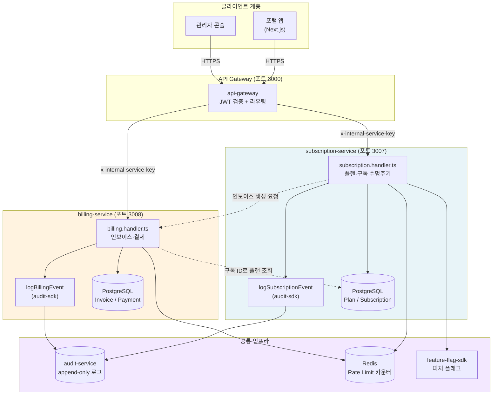
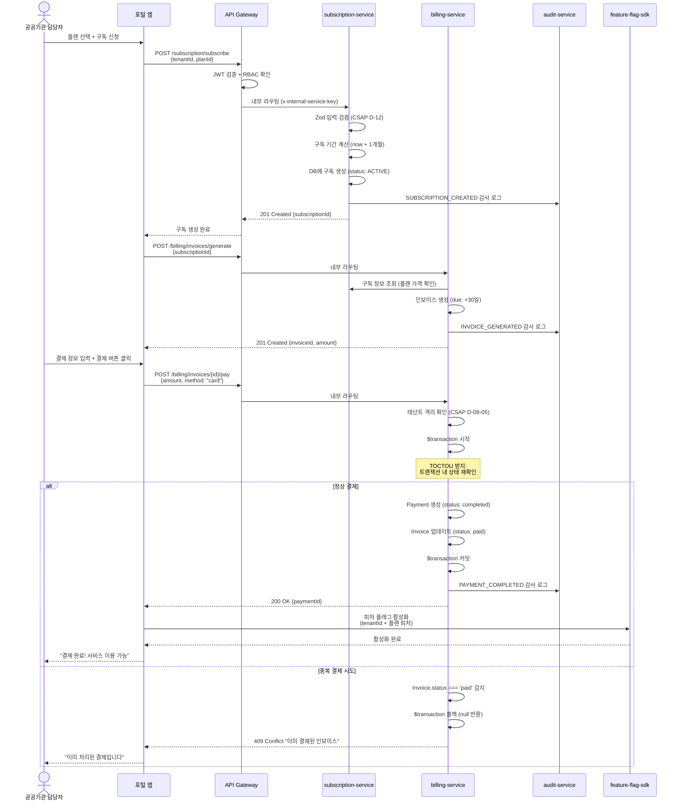
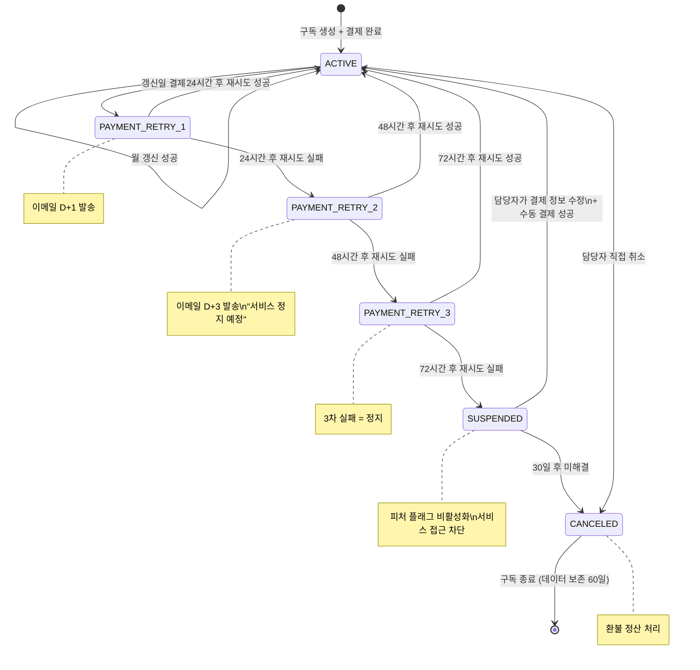
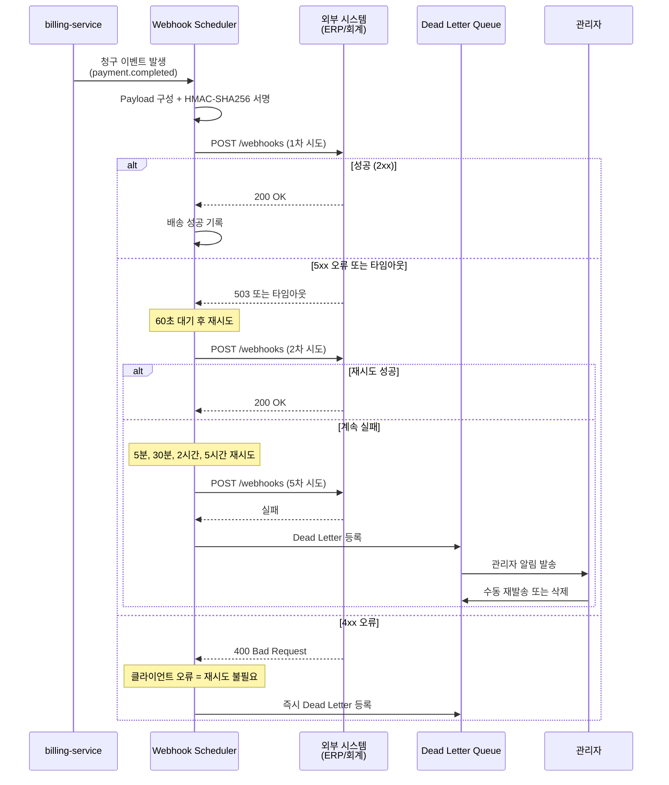

# 청구·구독 이벤트 심화 — 결제 실패, 환불, 멱등성 완전 가이드

**문서 ID**: ONBOARD-ARCH-SVC-04
**버전**: 1.0.0
**작성일**: 2026-04-13
**목적**: billing-service와 subscription-service의 내부 동작 원리와 이벤트 흐름을 초급 개발자 수준에서 완전히 이해한다.
**선행 학습**: `08-subscription-service.md`, `09-billing-service.md`, `06-audit-service.md`

---

## 목차

1. [청구·구독 이벤트 개요](#1-청구구독-이벤트-개요)
2. [구독 구매 완전 플로우](#2-구독-구매-완전-플로우)
3. [결제 실패 처리](#3-결제-실패-처리)
4. [환불 처리](#4-환불-처리)
5. [Webhook 이벤트 설계](#5-webhook-이벤트-설계)
6. [멀티통화 + 세금 처리](#6-멀티통화--세금-처리)
7. [청구 감사 추적](#7-청구-감사-추적)
8. [변경 이력](#변경-이력)

---

## 1. 청구·구독 이벤트 개요

### 1.1 두 서비스의 역할 분리

공공기관 SaaS 플랫폼에서 "요금을 내고 서비스를 쓴다"는 단순한 행위는 내부적으로 두 개의 독립 서비스가 협력하여 처리합니다. 왜 하나의 서비스로 합치지 않았는지부터 이해해야 합니다.

**subscription-service (구독 서비스)**

구독 서비스의 책임은 "어떤 테넌트가 어떤 플랜을 사용 중인가"를 관리하는 것입니다. 이 서비스는 다음을 담당합니다.

- 플랜(Plan) 정의 및 관리: 기본형, 표준형, 전문형 등 구독 상품의 스펙을 정의합니다.
- 구독(Subscription) 수명 주기: ACTIVE, SUSPENDED, CANCELED 등 구독 상태를 추적합니다.
- 플랜 업그레이드/다운그레이드: 테넌트가 플랜을 변경할 때 이력을 기록합니다.
- 만료 임박 알림 기준 제공: 구독이 언제 끝나는지 추적합니다.

**billing-service (청구 서비스)**

청구 서비스의 책임은 "돈을 어떻게 받을 것인가"를 관리하는 것입니다.

- 인보이스(Invoice) 생성: 구독 기간에 대한 청구서를 발행합니다.
- 결제(Payment) 처리: 카드, 계좌이체, 가상계좌 등 결제 수단을 처리합니다.
- 세금계산서 발행: 공공기관 특성상 전자세금계산서 발행이 필요합니다.
- 수익 대시보드: 전체 매출 현황을 집계합니다.

이 두 서비스를 분리한 이유는 단일 책임 원칙(Single Responsibility Principle)과 장애 격리(Fault Isolation) 때문입니다. 청구 시스템에 문제가 생겨도 구독 상태 조회는 계속 작동해야 하고, 구독 서비스가 재시작 중이어도 이미 발행된 인보이스에 대한 결제는 처리되어야 합니다.

### 1.2 서비스 아키텍처 관계도

아래 다이어그램은 두 서비스와 주변 시스템의 관계를 보여줍니다. 실제 코드에서 두 서비스 모두 `@public-saas/audit-sdk`를 통해 감사 로그를 기록하고, `@public-saas/rate-limit`으로 API 남용을 방지합니다.



**핵심 포인트**: 두 서비스는 직접 메서드를 호출하지 않습니다. 서비스 간 통신은 HTTP API로만 이루어지며, 항상 `x-internal-service-key` 헤더를 통해 인증합니다. 이 키가 없으면 요청이 거부됩니다.

```typescript
// billing-service/src/routes.ts — 서비스 간 내부 인증
// Design Ref: DESIGN-MTU-P08 §2, CSAP D-08
const internalKey = process.env['INTERNAL_SERVICE_KEY'];
if (!internalKey && process.env['NODE_ENV'] === 'production') {
  throw new Error('[SECURITY] INTERNAL_SERVICE_KEY 환경변수가 설정되지 않았습니다.');
}
app.addHook('onRequest', async (request, reply) => {
  if (request.url === '/health' || request.url === '/ready') return;
  const provided = request.headers['x-internal-service-key'];
  if (provided !== internalKey) {
    await reply.status(401).send({
      success: false,
      error: { code: 'UNAUTHORIZED', message: '내부 서비스 인증 실패' },
    });
  }
});
```

### 1.3 이벤트 타입 목록

두 서비스에서 발생하는 모든 감사 이벤트 타입입니다. 이 이벤트들은 CSAP D-06 요건에 따라 전수 기록됩니다.

**subscription-service 이벤트**

| 이벤트 타입 | 발생 시점 | FR ID |
|---|---|---|
| PLAN_CREATED | 새 플랜 생성 | FR-P07.1 |
| PLAN_UPDATED | 플랜 정보 수정 | FR-P07.1 |
| SUBSCRIPTION_CREATED | 구독 신규 생성 | FR-P07.2 |
| SUBSCRIPTION_UPGRADED | 플랜 업그레이드 | FR-P07.4 |
| SUBSCRIPTION_DOWNGRADED | 플랜 다운그레이드 | FR-P07.4 |
| SUBSCRIPTION_CANCELED | 구독 취소 | FR-P07.2 |

**billing-service 이벤트**

| 이벤트 타입 | 발생 시점 | FR ID |
|---|---|---|
| INVOICE_GENERATED | 인보이스 생성 | FR-P08.1 |
| PAYMENT_COMPLETED | 결제 완료 | FR-P08.2 |
| TAX_INVOICE_GENERATED | 세금계산서 발행 | FR-P08.3 |

---

## 2. 구독 구매 완전 플로우

### 2.1 플로우 개요

공공기관 담당자가 SaaS 서비스를 구독하는 과정은 다음 단계를 거칩니다. 각 단계에서 무슨 일이 일어나는지 코드 수준에서 설명합니다.

**단계 1: 플랜 목록 조회**

담당자는 먼저 사용 가능한 플랜을 조회합니다.

```bash
# GET /subscription/plans
# Rate Limit: 분당 100회 (readLimiter)
curl -H "Authorization: Bearer {JWT}" \
     -H "x-internal-service-key: {SERVICE_KEY}" \
     https://api.public-saas.kr/subscription/plans
```

응답 예시:
```json
{
  "success": true,
  "data": [
    {
      "id": "plan-basic-01",
      "name": "기본형",
      "slug": "basic",
      "price": "99000",
      "currency": "KRW",
      "interval": "monthly",
      "maxUsers": 10,
      "maxStorage": "10737418240",
      "isActive": true
    },
    {
      "id": "plan-standard-01",
      "name": "표준형",
      "slug": "standard",
      "price": "299000",
      "currency": "KRW",
      "interval": "monthly",
      "maxUsers": 50,
      "maxStorage": "107374182400",
      "isActive": true
    }
  ]
}
```

내부적으로 `listPlansHandler`는 Prisma를 통해 `isActive: true`인 플랜만 조회하며 `take: 100`으로 DoS(서비스 거부 공격)를 방어합니다.

**단계 2: 구독 생성**

담당자가 원하는 플랜을 선택하면 구독 생성 요청이 들어옵니다.

```bash
# POST /subscription/subscribe
# Rate Limit: 분당 20회 (writeLimiter — 쓰기 작업은 더 엄격)
curl -X POST \
     -H "Authorization: Bearer {JWT}" \
     -H "x-internal-service-key: {SERVICE_KEY}" \
     -H "Content-Type: application/json" \
     -d '{"tenantId": "tenant-a1b2c3", "planId": "plan-standard-01"}' \
     https://api.public-saas.kr/subscription/subscribe
```

`subscribeHandler` 내부 동작:

```typescript
// subscription-service/src/handlers/subscription.handler.ts — subscribeHandler
// Plan SC: FR-P07.2

// 1단계: Zod 입력 검증 (CSAP D-12)
const subscribeSchema = z.object({
  tenantId: z.string().min(1),
  planId: z.string().min(1),
});
const parseResult = subscribeSchema.safeParse(request.body);

// 2단계: 구독 기간 계산
const now = new Date();
const periodEnd = new Date(now);
periodEnd.setMonth(periodEnd.getMonth() + 1); // 월 구독: 30일 후 만료

// 3단계: DB에 구독 생성
const subscription = await prisma.subscription.create({
  data: {
    tenantId,
    planId,
    status: 'ACTIVE',           // 초기 상태: 활성
    currentPeriodStart: now,
    currentPeriodEnd: periodEnd,
  },
});

// 4단계: CSAP D-06 감사 로그 기록
await logSubscriptionEvent(
  'SUBSCRIPTION_CREATED',
  actorId,
  subscription.id,
  tenantId,
  request.ip,
  request.headers['user-agent'] ?? 'unknown',
  { planId },
);
```

**단계 3: 인보이스 자동 생성**

구독이 생성되면 billing-service에 인보이스 생성을 요청합니다.

```bash
# POST /billing/invoices/generate
curl -X POST \
     -H "x-internal-service-key: {SERVICE_KEY}" \
     -H "Content-Type: application/json" \
     -d '{"subscriptionId": "sub-xyz789"}' \
     https://api.public-saas.kr/billing/invoices/generate
```

인보이스 생성 코드:

```typescript
// billing-service/src/handlers/billing.handler.ts — generateInvoiceHandler
// Plan SC: FR-P08.1

// 구독 정보에서 플랜 가격을 가져와 인보이스 금액 설정
const subscription = await prisma.subscription.findUnique({
  where: { id: parseResult.data.subscriptionId },
  include: { plan: true },  // 플랜 가격 정보 포함 조회
});

const dueDate = new Date();
dueDate.setDate(dueDate.getDate() + 30); // 납부 기한: 30일

const invoice = await prisma.invoice.create({
  data: {
    subscriptionId: subscription.id,
    amount: subscription.plan.price,     // 플랜 가격 그대로 사용
    currency: subscription.plan.currency, // KRW
    status: 'issued',                    // 발행됨 (미납)
    issuedAt: new Date(),
    dueDate,
  },
});
```

**단계 4: 결제 처리**

담당자가 결제 버튼을 클릭하면 다음이 실행됩니다.

```bash
# POST /billing/invoices/{id}/pay
curl -X POST \
     -H "Authorization: Bearer {JWT}" \
     -H "x-internal-service-key: {SERVICE_KEY}" \
     -H "Content-Type: application/json" \
     -d '{"amount": 299000, "method": "card"}' \
     https://api.public-saas.kr/billing/invoices/inv-abc123/pay
```

**단계 5: 피처 플래그 활성화**

결제가 완료되면 해당 테넌트의 피처 플래그를 활성화하여 실제 서비스 기능을 사용할 수 있게 합니다. 이 과정은 `feature-flag-sdk`를 통해 이루어집니다.

```typescript
// 결제 완료 후 피처 플래그 활성화 (개념 코드)
import { FeatureFlagClient } from '@public-saas/feature-flag-sdk';

const flagClient = new FeatureFlagClient({ endpoint: process.env.FEATURE_FLAG_ENDPOINT });

// 플랜에 따라 피처 활성화
await flagClient.setTenantFlag(tenantId, 'advanced-analytics', true);
await flagClient.setTenantFlag(tenantId, 'api-access', true);
```

### 2.2 멱등성 키 (Idempotency-Key)

네트워크 장애나 타임아웃 시 클라이언트가 같은 요청을 여러 번 보낼 수 있습니다. 이때 중복 결제가 발생하면 심각한 문제가 됩니다. 이를 방지하는 것이 **멱등성(Idempotency)**입니다.

멱등성의 의미: 같은 요청을 여러 번 보내도 결과가 한 번과 동일해야 한다.

실제 코드에서는 `prisma.$transaction`과 TOCTOU(Time-of-Check-Time-of-Use) 경쟁 조건 방지로 멱등성을 구현합니다.

```typescript
// billing-service/src/handlers/billing.handler.ts
// H-02 수정 (TOCTOU 경쟁조건): 트랜잭션으로 원자적 처리
// 두 개의 동시 결제 요청이 들어올 때 한 번만 처리되도록 보장

const payment = await prisma.$transaction(async (tx) => {
  // 트랜잭션 내에서 최신 상태 재확인
  const latestInvoice = await tx.invoice.findUnique({
    where: { id: request.params.id },
    select: { status: true },
  });

  // 이미 결제된 인보이스라면 null 반환 (중복 결제 차단)
  if (!latestInvoice || latestInvoice.status === 'paid') {
    return null;  // 이 경우 409 Conflict 반환
  }

  // 결제 생성 + 인보이스 상태 업데이트 — 원자적으로 처리
  const created = await tx.payment.create({ ... });
  await tx.invoice.update({
    where: { id: request.params.id },
    data: { status: 'paid', paidAt },
  });

  return created;
});

if (!payment) {
  // 409 Conflict: 이미 결제된 인보이스
  await problemReply(request, reply, {
    type: BillingProblemTypes.alreadyPaid,
    title: 'Already Paid',
    status: 409,
    detail: '이미 결제된 인보이스입니다',
  });
  return;
}
```

클라이언트 측 멱등성 헤더 사용 예시:

```bash
# 고유한 UUID를 Idempotency-Key로 전송
# 같은 키로 재시도해도 서버에서 한 번만 처리
curl -X POST \
     -H "Idempotency-Key: 550e8400-e29b-41d4-a716-446655440000" \
     -H "Content-Type: application/json" \
     -d '{"amount": 299000, "method": "card"}' \
     https://api.public-saas.kr/billing/invoices/inv-abc123/pay
```

### 2.3 네트워크 타임아웃 시 재시도 안전성

네트워크 타임아웃이 발생하면 클라이언트는 요청이 성공했는지 실패했는지 알 수 없습니다. 안전한 재시도를 위한 가이드라인입니다.

**안전한 재시도 순서**:

1. 클라이언트가 결제 요청 → 타임아웃 발생
2. 클라이언트가 인보이스 상태 조회: `GET /billing/invoices/{id}`
3. 상태가 `paid`이면 → 이미 성공, 재시도 불필요
4. 상태가 `issued`이면 → 실패 확인, 동일 `Idempotency-Key`로 재시도
5. 서버는 `$transaction` 덕분에 중복 결제 자동 차단

### 2.4 구독 구매 전체 시퀀스 다이어그램



---

## 3. 결제 실패 처리

### 3.1 결제 실패의 두 가지 유형

결제 실패는 크게 두 종류로 나뉩니다. 처리 방식이 완전히 다르므로 구분해서 이해해야 합니다.

**즉시 실패 (Hard Failure)**

재시도해도 동일하게 실패하는 유형입니다. 즉시 오류를 반환하고 재시도하지 않습니다.

- 잘못된 카드 번호 (카드 자체가 존재하지 않음)
- 분실/도난 신고된 카드
- 한도 초과 (즉시 알림, 재시도 무의미)
- 지원하지 않는 결제 수단

**소프트 실패 (Soft Failure)**

일시적인 오류로 재시도 시 성공 가능성이 있는 유형입니다.

- 네트워크 타임아웃
- 카드사 서버 일시 장애
- 카드 만료 (갱신 카드 정보 업데이트 후 재시도 가능)
- 잔액 부족 (입금 후 재시도 가능)

### 3.2 자동 갱신 실패 처리 정책

월 구독료 자동 갱신 시 결제가 실패하면 다음 정책이 적용됩니다. 이는 실제 `subscription-service`의 SUSPENDED 상태 전환과 연동됩니다.

```
카드 만료/잔액 부족 감지
        ↓
[D-day] 1차 시도 → 실패
        ↓ (24시간 후)
[D+1]  2차 시도 → 실패
        ↓ (48시간 후)
[D+3]  3차 시도 → 실패
        ↓
구독 상태: ACTIVE → SUSPENDED
```

구독 상태 전환 코드:

```typescript
// 자동 갱신 실패 처리 — 구독 일시정지
// Plan SC: FR-P07.3 (갱신 실패 처리)

async function suspendSubscriptionOnPaymentFailure(
  subscriptionId: string,
  reason: string,
): Promise<void> {
  const subscription = await prisma.subscription.update({
    where: { id: subscriptionId },
    data: {
      status: 'SUSPENDED',  // ACTIVE → SUSPENDED
      suspendedAt: new Date(),
      suspendReason: reason,
    },
  });

  // 감사 로그 필수 (CSAP D-06)
  await logSubscriptionEvent(
    'SUBSCRIPTION_SUSPENDED',
    'system:billing-scheduler',
    subscription.id,
    subscription.tenantId,
    process.env.SERVICE_IP ?? '127.0.0.1',
    'billing-scheduler/1.0',
    { reason, retryCount: 3 },
  );

  // 피처 플래그 비활성화 (서비스 접근 차단)
  await flagClient.setTenantFlag(subscription.tenantId, 'service-access', false);
}
```

### 3.3 이메일 알림 타이밍

결제 실패 시 담당자에게 이메일이 발송되는 시점입니다.

| 시점 | 메시지 | 목적 |
|---|---|---|
| D-3 (만료 3일 전) | "카드 만료 예정 안내" | 사전 갱신 유도 |
| D-1 (만료 1일 전) | "내일 자동 갱신 예정" | 최종 확인 유도 |
| D+1 (1차 실패) | "결제 실패 — 카드 정보 확인 요청" | 즉시 대응 요청 |
| D+3 (2차 실패) | "서비스 일시정지 예정 안내" | 긴급 대응 요청 |
| D+5 (3차 실패, 정지) | "서비스 일시정지 완료" | 상태 통보 |

알림 발송은 `notification-service`와 연동하여 처리됩니다.

```typescript
// notification-service 연동 예시 (개념 코드)
await notificationClient.send({
  type: 'PAYMENT_FAILED',
  tenantId: subscription.tenantId,
  template: 'payment-retry-warning',
  variables: {
    planName: subscription.plan.name,
    amount: invoice.amount.toString(),
    nextRetryDate: nextRetry.toISOString(),
    updateCardUrl: `https://portal.public-saas.kr/billing/cards`,
  },
  channels: ['email', 'in-app'],
});
```

### 3.4 결제 실패 상태 머신



### 3.5 결제 실패 응답 처리

실제 API에서 결제 실패는 RFC 7807 Problem Details 형식으로 반환됩니다.

```typescript
// billing-service/src/lib/problem-reply.ts
// Plan SC: FR-BILLR2.1

export const BillingProblemTypes = {
  validation: 'https://problems.public-saas.kr/errors/billing/validation',
  invoiceNotFound: 'https://problems.public-saas.kr/errors/billing/invoice-not-found',
  subscriptionNotFound: 'https://problems.public-saas.kr/errors/billing/subscription-not-found',
  forbidden: 'https://problems.public-saas.kr/errors/billing/forbidden',
  alreadyPaid: 'https://problems.public-saas.kr/errors/billing/already-paid',
} as const;
```

결제 실패 응답 예시 (RFC 7807):
```json
{
  "type": "https://problems.public-saas.kr/errors/billing/already-paid",
  "title": "Already Paid",
  "status": 409,
  "detail": "이미 결제된 인보이스입니다",
  "instance": "/billing/invoices/inv-abc123/pay",
  "traceId": "4bf92f3577b34da6a3ce929d0e0e4736"
}
```

`traceId`는 `x-request-id` 헤더 또는 W3C `traceparent` 헤더에서 추출됩니다. 이를 통해 로그에서 전체 요청 경로를 추적할 수 있습니다.

---

## 4. 환불 처리

### 4.1 환불 유형

공공기관 SaaS에서 환불은 크게 두 가지 시나리오로 발생합니다.

**전액 환불**: 서비스 이용 전 취소, 플랫폼 결함으로 인한 취소
**부분 환불 (Pro-rata)**: 구독 기간 중간에 취소할 때 미사용 기간에 대한 환불

### 4.2 Pro-rata 환불 계산 공식

Pro-rata는 "비례 배분"이라는 의미입니다. 월 구독료를 이미 사용한 일수만큼만 청구하고 나머지를 환불하는 방식입니다.

계산 공식:

```
환불 금액 = 월 구독료 × (잔여 일수 / 전체 구독 일수)
```

구체적인 예시:

```
플랜: 표준형 (299,000원/월)
구독 시작: 2026-04-01
취소 시점: 2026-04-11 (10일 사용)
구독 기간: 30일 (2026-04-01 ~ 2026-04-30)
사용 일수: 10일
잔여 일수: 20일

환불 금액 = 299,000 × (20 / 30)
          = 299,000 × 0.6667
          = 199,333원 (원 미만 절사)
```

코드 구현:

```typescript
// 환불 금액 계산 유틸리티 (개념 코드)
// Plan SC: FR-P08.2 (환불 처리)

interface RefundCalculation {
  originalAmount: number;   // 원래 결제 금액 (KRW)
  usedDays: number;         // 사용 일수
  totalDays: number;        // 전체 구독 일수
  refundAmount: number;     // 환불 금액 (KRW)
  usedAmount: number;       // 사용 금액 (KRW)
}

function calculateProRataRefund(
  originalAmount: number,
  subscriptionStart: Date,
  cancelDate: Date,
  subscriptionEnd: Date,
): RefundCalculation {
  const msPerDay = 1000 * 60 * 60 * 24;

  const totalDays = Math.round(
    (subscriptionEnd.getTime() - subscriptionStart.getTime()) / msPerDay
  );
  const usedDays = Math.round(
    (cancelDate.getTime() - subscriptionStart.getTime()) / msPerDay
  );
  const remainingDays = totalDays - usedDays;

  // 정수 나눗셈으로 원 미만 절사 (KRW는 소수점 없음)
  const dailyRate = Math.floor(originalAmount / totalDays);
  const usedAmount = dailyRate * usedDays;
  const refundAmount = originalAmount - usedAmount;

  return {
    originalAmount,
    usedDays,
    totalDays,
    refundAmount,
    usedAmount,
  };
}

// 사용 예시
const refund = calculateProRataRefund(
  299000,
  new Date('2026-04-01'),
  new Date('2026-04-11'),
  new Date('2026-04-30'),
);
// { originalAmount: 299000, usedDays: 10, totalDays: 29,
//   refundAmount: 196896, usedAmount: 102104 }
```

### 4.3 환불 처리 플로우

```typescript
// 환불 처리 전체 플로우 (개념 코드)
// CSAP D-06: 환불 감사 로그 필수

async function processRefund(
  subscriptionId: string,
  invoiceId: string,
  refundReason: string,
  requestorId: string,
  requestorIp: string,
): Promise<void> {
  // 1단계: 환불 전 감사 로그 (사전 기록)
  await logBillingEvent(
    'REFUND_INITIATED',
    requestorId,
    invoiceId,
    subscription.tenantId,
    requestorIp,
    'billing-service/1.0',
    { refundReason, subscriptionId },
  );

  // 2단계: 환불 금액 계산
  const subscription = await prisma.subscription.findUnique({
    where: { id: subscriptionId },
    include: { plan: true },
  });
  const invoice = await prisma.invoice.findUnique({
    where: { id: invoiceId },
  });

  const refundCalc = calculateProRataRefund(
    Number(invoice.amount),
    subscription.currentPeriodStart,
    new Date(),             // 취소 시점 = 오늘
    subscription.currentPeriodEnd,
  );

  // 3단계: 환불 레코드 생성 (트랜잭션)
  await prisma.$transaction(async (tx) => {
    // 환불 기록
    await tx.refund.create({
      data: {
        invoiceId,
        amount: refundCalc.refundAmount,
        currency: 'KRW',
        reason: refundReason,
        status: 'completed',
        refundedAt: new Date(),
      },
    });

    // 인보이스 상태 업데이트
    await tx.invoice.update({
      where: { id: invoiceId },
      data: { status: 'refunded' },
    });

    // 구독 취소
    await tx.subscription.update({
      where: { id: subscriptionId },
      data: { status: 'CANCELED', canceledAt: new Date() },
    });
  });

  // 4단계: 환불 완료 감사 로그 (사후 기록)
  await logBillingEvent(
    'REFUND_COMPLETED',
    requestorId,
    invoiceId,
    subscription.tenantId,
    requestorIp,
    'billing-service/1.0',
    {
      refundAmount: refundCalc.refundAmount,
      usedDays: refundCalc.usedDays,
      totalDays: refundCalc.totalDays,
    },
  );

  // 5단계: 피처 플래그 비활성화 (서비스 접근 종료)
  await flagClient.setTenantFlag(subscription.tenantId, 'service-access', false);

  // 6단계: 환불 완료 이메일 발송
  await notificationClient.send({
    type: 'REFUND_COMPLETED',
    tenantId: subscription.tenantId,
    template: 'refund-confirmation',
    variables: {
      refundAmount: refundCalc.refundAmount.toLocaleString('ko-KR'),
      processDate: new Date().toLocaleDateString('ko-KR'),
      expectedDate: addBusinessDays(new Date(), 3).toLocaleDateString('ko-KR'),
    },
  });
}
```

### 4.4 CSAP D-06 환불 감사 로그 필수 항목

환불은 금전이 오가는 민감한 작업이므로 CSAP D-06에 따라 다음 정보를 반드시 기록해야 합니다.

| 필드 | 설명 | 예시 |
|---|---|---|
| actor | 환불을 요청한 주체 | user-admin-001 |
| action | 이벤트 유형 | REFUND_COMPLETED |
| target | 대상 인보이스 ID | inv-abc123 |
| tenantId | 소속 기관 | tenant-a1b2c3 |
| ip | 요청 IP | 192.168.1.100 |
| metadata.refundAmount | 환불 금액 | 196896 |
| metadata.usedDays | 실제 사용 일수 | 10 |
| metadata.totalDays | 전체 구독 일수 | 29 |
| metadata.refundReason | 환불 사유 | "서비스 불만족" |

---

## 5. Webhook 이벤트 설계

### 5.1 Webhook의 목적

외부 시스템(예: 기관 내 ERP, 회계 시스템)이 청구 이벤트를 실시간으로 받아 처리해야 할 경우 Webhook을 사용합니다. 폴링(주기적 조회) 방식보다 효율적이며 이벤트 발생 즉시 알림을 받을 수 있습니다.

### 5.2 Webhook Payload 구조

모든 Webhook payload는 다음 구조를 따릅니다. HMAC-SHA256 서명을 통해 위변조를 방지합니다.

```typescript
// Webhook payload 타입 정의
interface WebhookPayload {
  // 이벤트 메타데이터
  id: string;           // 이벤트 고유 ID (UUID v4)
  type: string;         // 이벤트 타입 (아래 목록 참조)
  apiVersion: string;   // "2026-04-01"
  createdAt: string;    // ISO 8601 형식

  // 이벤트 데이터
  data: {
    object: Record<string, unknown>; // 이벤트 대상 객체
  };

  // 검증용
  liveMode: boolean;    // false = 테스트 모드
  signature: string;    // HMAC-SHA256 서명
}

// 이벤트 타입 목록
type WebhookEventType =
  | 'invoice.created'
  | 'invoice.paid'
  | 'invoice.overdue'
  | 'payment.completed'
  | 'payment.failed'
  | 'subscription.created'
  | 'subscription.upgraded'
  | 'subscription.canceled'
  | 'subscription.suspended'
  | 'refund.completed';
```

실제 Webhook payload 예시:

```json
{
  "id": "evt_1234567890abcdef",
  "type": "payment.completed",
  "apiVersion": "2026-04-01",
  "createdAt": "2026-04-13T09:30:00.000Z",
  "data": {
    "object": {
      "id": "pay-xyz789",
      "invoiceId": "inv-abc123",
      "amount": 299000,
      "currency": "KRW",
      "method": "card",
      "status": "completed",
      "paidAt": "2026-04-13T09:29:58.123Z",
      "tenantId": "tenant-a1b2c3"
    }
  },
  "liveMode": true,
  "signature": "sha256=a3f2b1c4d5e6..."
}
```

### 5.3 HMAC-SHA256 서명 생성 및 검증

서명은 수신 측이 payload가 조작되지 않았음을 확인하는 수단입니다.

```typescript
// Webhook 서명 생성 (발송 측)
import { createHmac } from 'node:crypto';

function signWebhookPayload(
  payload: string,
  secret: string,
): string {
  // 환경 변수에서 비밀 키 로드 (하드코딩 절대 금지 — CSAP D-09)
  const hmac = createHmac('sha256', secret);
  hmac.update(payload, 'utf8');
  return `sha256=${hmac.digest('hex')}`;
}

// 사용 예시
const payloadString = JSON.stringify(webhookPayload);
const secret = process.env.WEBHOOK_SECRET;
if (!secret) throw new Error('WEBHOOK_SECRET 환경변수 누락');

const signature = signWebhookPayload(payloadString, secret);
// 서명을 X-Signature-256 헤더에 담아 전송
```

```typescript
// Webhook 서명 검증 (수신 측)
import { createHmac, timingSafeEqual } from 'node:crypto';

function verifyWebhookSignature(
  payload: string,
  receivedSignature: string,
  secret: string,
): boolean {
  const expectedSignature = signWebhookPayload(payload, secret);

  // timingSafeEqual: 타이밍 공격 방지 (단순 문자열 비교 금지)
  const expected = Buffer.from(expectedSignature, 'utf8');
  const received = Buffer.from(receivedSignature, 'utf8');

  if (expected.length !== received.length) return false;
  return timingSafeEqual(expected, received);
}

// Express/Fastify 수신 엔드포인트 예시
app.post('/webhooks/billing', async (req, reply) => {
  const signature = req.headers['x-signature-256'] as string;
  const rawBody = JSON.stringify(req.body);

  if (!verifyWebhookSignature(rawBody, signature, process.env.WEBHOOK_SECRET)) {
    // 서명 불일치: 위변조 가능성
    await reply.status(401).send({ error: 'Invalid signature' });
    return;
  }

  // 서명 검증 통과 후 처리
  const event = req.body as WebhookPayload;
  await processWebhookEvent(event);
  await reply.status(200).send({ received: true });
});
```

### 5.4 재시도 정책 + 데드 레터 처리

외부 시스템이 일시 장애로 Webhook을 받지 못할 수 있습니다. 이때 자동 재시도 정책이 필요합니다.

```typescript
// Webhook 발송 재시도 로직 (개념 코드)
interface WebhookDeliveryAttempt {
  attemptNumber: number;
  deliveredAt: string;
  responseStatus: number;
  responseBody: string;
  success: boolean;
}

async function deliverWebhook(
  endpoint: string,
  payload: WebhookPayload,
  maxRetries = 5,
): Promise<void> {
  // 재시도 간격: 지수 백오프 (1분, 5분, 30분, 2시간, 5시간)
  const retryDelays = [60, 300, 1800, 7200, 18000]; // 초 단위

  for (let attempt = 0; attempt <= maxRetries; attempt++) {
    try {
      const response = await fetch(endpoint, {
        method: 'POST',
        headers: {
          'Content-Type': 'application/json',
          'X-Signature-256': signWebhookPayload(
            JSON.stringify(payload),
            process.env.WEBHOOK_SECRET,
          ),
          'User-Agent': 'PublicSaaS-Webhooks/1.0',
        },
        body: JSON.stringify(payload),
        signal: AbortSignal.timeout(10000), // 10초 타임아웃
      });

      if (response.ok) {
        // 성공: 재시도 중단
        await recordDeliveryAttempt(payload.id, attempt + 1, response.status, true);
        return;
      }

      // 4xx 오류는 재시도 불필요 (클라이언트 측 문제)
      if (response.status >= 400 && response.status < 500) {
        await moveToDeadLetter(payload, `HTTP ${response.status}: 클라이언트 오류`);
        return;
      }

    } catch (error) {
      // 네트워크 오류 또는 타임아웃
      await recordDeliveryAttempt(payload.id, attempt + 1, 0, false);
    }

    if (attempt < maxRetries) {
      // 다음 재시도 전 대기
      await new Promise(resolve => setTimeout(resolve, retryDelays[attempt] * 1000));
    }
  }

  // 최대 재시도 초과 → 데드 레터 큐로 이동
  await moveToDeadLetter(payload, '최대 재시도 횟수 초과');
}

// 데드 레터 처리: 관리자 알림 + 수동 처리 큐 등록
async function moveToDeadLetter(
  payload: WebhookPayload,
  reason: string,
): Promise<void> {
  await prisma.webhookDeadLetter.create({
    data: {
      eventId: payload.id,
      eventType: payload.type,
      payload: JSON.stringify(payload),
      failureReason: reason,
      createdAt: new Date(),
    },
  });

  // CSAP D-06: 데드 레터 발생 감사 로그
  await logBillingEvent(
    'WEBHOOK_DEAD_LETTER',
    'system:webhook-scheduler',
    payload.id,
    'system',
    process.env.SERVICE_IP ?? '127.0.0.1',
    'webhook-scheduler/1.0',
    { eventType: payload.type, reason },
  );
}
```

### 5.5 Webhook 발송 흐름 다이어그램



---

## 6. 멀티통화 + 세금 처리

### 6.1 KRW 기본 + 환율 적용 로직

이 플랫폼의 기본 통화는 KRW(한국 원화)입니다. 공공기관은 대부분 KRW로 계약하지만, 일부 국제 SaaS 연동 시 외화가 필요할 수 있습니다.

```typescript
// 통화 설정 (subscription-service/src/handlers/subscription.handler.ts)
const createPlanSchema = z.object({
  name: z.string().min(1, '플랜명은 필수입니다').max(100),
  slug: z.string().min(2).max(50).regex(/^[a-z0-9-]+$/),
  price: z.number().min(0),
  currency: z.string().default('KRW'),  // 기본값: 한국 원화
  interval: z.enum(['monthly', 'yearly']).default('monthly'),
  maxUsers: z.number().int().min(1),
  maxStorage: z.number().int().min(0),
});
```

환율 적용이 필요한 경우 처리 방법:

```typescript
// 환율 변환 유틸리티 (개념 코드)
interface ExchangeRate {
  fromCurrency: string;
  toCurrency: string;
  rate: number;
  validUntil: Date;     // 환율 유효 기간 (보통 1일)
  source: string;       // "한국은행 고시환율"
}

async function convertCurrency(
  amount: number,
  fromCurrency: string,
  toCurrency: string,
): Promise<number> {
  if (fromCurrency === toCurrency) return amount;

  // 환경 변수에서 환율 API 엔드포인트 로드
  const exchangeApiUrl = process.env.EXCHANGE_RATE_API_URL;
  if (!exchangeApiUrl) throw new Error('EXCHANGE_RATE_API_URL 환경변수 누락');

  // 당일 한국은행 고시환율 조회 (캐싱 필수 — Redis)
  const rate = await getCachedExchangeRate(fromCurrency, toCurrency);

  // KRW는 소수점 없음 (원화 특성)
  if (toCurrency === 'KRW') {
    return Math.round(amount * rate);
  }

  return Math.floor(amount * rate * 100) / 100;
}
```

### 6.2 부가세(VAT) 10% 자동 계산

대한민국 부가가치세(VAT)는 10%입니다. 세금계산서 발행 시 자동으로 계산됩니다.

```typescript
// billing-service/src/handlers/billing.handler.ts
// generateTaxInvoiceHandler 내부 세금 계산 로직

const taxInvoice = {
  invoiceId: invoice.id,
  tenantName: invoice.subscription.tenant.name,
  amount: invoice.amount.toString(),           // 공급가액 (세전)
  tax: (Number(invoice.amount) * 0.1).toFixed(2),   // 부가세 10%
  total: (Number(invoice.amount) * 1.1).toFixed(2), // 합계 (세후)
  issuedAt: new Date().toISOString(),
};

// 예시: 299,000원 플랜의 세금계산서
// amount (공급가액): 271,818원
// tax (부가세 10%): 27,182원
// total (합계): 299,000원
//
// 주의: 공공기관 계약은 부가세 포함 금액으로 계약하는 경우가 많으므로
// 세금계산서 역산 방식을 사용합니다.
// 공급가액 = 합계 ÷ 1.1
// 부가세   = 합계 - 공급가액
```

실제 계산 예시:

```typescript
// 역산 방식 (부가세 포함 금액에서 세금 분리)
function calculateVatFromIncluded(totalAmount: number): {
  supplyAmount: number;  // 공급가액
  vat: number;           // 부가세
  total: number;         // 합계
} {
  const supplyAmount = Math.floor(totalAmount / 1.1);
  const vat = totalAmount - supplyAmount;
  return { supplyAmount, vat, total: totalAmount };
}

// 사용 예시
const result = calculateVatFromIncluded(299000);
// { supplyAmount: 271818, vat: 27182, total: 299000 }
```

### 6.3 공공기관 특수 처리: 계약서 기반 청구

공공기관의 경우 일반 SaaS와 달리 구독 방식이 아닌 "사업 계약" 기반으로 서비스를 구매하는 경우가 많습니다. 이를 위한 특수 처리 사항입니다.

**공공기관 청구 특징**:

1. **선납 방식**: 연 계약 후 연초에 전액 납부 (자동 갱신 없음)
2. **세금계산서 필수**: 모든 거래에 전자세금계산서 발행 필수
3. **계약 번호 연동**: 조달청 계약 번호를 인보이스에 반드시 기재
4. **협상된 할인가**: 플랜 표시가 아닌 계약 단가 적용

```typescript
// 공공기관 계약 기반 인보이스 생성 (개념 코드)
interface PublicSectorContract {
  contractNumber: string;   // 조달청 계약 번호
  agencyCode: string;       // 기관 코드 (행안부 기관 코드)
  negotiatedPrice: number;  // 협상 단가 (플랜 표시가와 다를 수 있음)
  contractStart: Date;
  contractEnd: Date;
  paymentType: 'annual_prepaid' | 'quarterly';
}

async function generatePublicSectorInvoice(
  subscription: Subscription,
  contract: PublicSectorContract,
): Promise<Invoice> {
  return prisma.invoice.create({
    data: {
      subscriptionId: subscription.id,
      amount: contract.negotiatedPrice,    // 협상 단가 적용
      currency: 'KRW',
      status: 'issued',
      issuedAt: new Date(),
      dueDate: new Date(contract.contractStart), // 계약 시작일 = 납부 기한
      metadata: {
        contractNumber: contract.contractNumber,
        agencyCode: contract.agencyCode,
        paymentType: contract.paymentType,
        contractPeriod: {
          start: contract.contractStart.toISOString(),
          end: contract.contractEnd.toISOString(),
        },
      },
    },
  });
}
```

---

## 7. 청구 감사 추적

### 7.1 감사 로그 아키텍처

모든 청구 이벤트는 CSAP D-06 요건에 따라 append-only 방식으로 기록됩니다. `billing-service`의 `logBillingEvent` 함수는 `@public-saas/audit-sdk`의 `createServiceAuditLogger`를 사용합니다.

```typescript
// billing-service/src/lib/audit.ts
// Design Ref: DESIGN-MTU-P08, SVC-BILLR2-R55.design.md §5
// CSAP: D-06-01, D-12 (입력 검증)

import { createServiceAuditLogger } from '@public-saas/audit-sdk';

// User-Agent 제어문자 제거 + 500자 절단 (입력 검증)
export function sanitizeUserAgent(ua: string | undefined | null): string {
  if (!ua || typeof ua !== 'string') return 'unknown';
  const stripped = ua.replace(/[\u0000-\u001f\u007f]/g, '');
  if (stripped.length === 0) return 'unknown';
  return stripped.length > 500 ? stripped.slice(0, 500) : stripped;
}

// IP 주소 형식 검증 (IPv4/IPv6)
export function sanitizeIp(ip: string | undefined | null): string {
  if (!ip || typeof ip !== 'string') return 'unknown';
  if (/^[0-9a-fA-F:.]{3,45}$/.test(ip)) return ip;
  return 'invalid';
}

const rawLogger = createServiceAuditLogger('billing-service', 'billing');

export async function logBillingEvent(
  action: string,
  actor: string,
  target: string,
  tenantId: string,
  ip: string | undefined | null,
  userAgent: string | undefined | null,
  metadata?: Record<string, unknown>,
): Promise<void> {
  // 입력값 sanitize 후 SDK에 전달
  await rawLogger(action, actor, target, tenantId, sanitizeIp(ip), sanitizeUserAgent(userAgent), metadata);
}
```

`audit-service`의 append-only 구조는 SHA-256 해시 체인으로 무결성을 보장합니다.

```typescript
// audit-service/src/lib/append-only.ts
// CSAP D-06: 기록된 로그는 수정/삭제 불가, SHA-256 체인으로 무결성 보장

export async function appendAuditLog(entry: { ... }): Promise<void> {
  // 이전 로그의 해시 조회 (블록체인과 유사한 체인 구조)
  const lastLog = await prisma.auditLog.findFirst({
    orderBy: { createdAt: 'desc' },
    select: { hash: true },
  });
  const previousHash = lastLog?.hash ?? '0'.repeat(64);

  // 현재 로그의 SHA-256 해시 계산
  const hashData = [
    entry.actorId ?? 'system',
    entry.action,
    entry.target ?? '',
    entry.targetType ?? '',
    entry.tenantId ?? 'system',
    new Date().toISOString(),
    previousHash,            // 이전 해시 포함 → 체인 연결
  ].join('|');

  const hash = createHash('sha256').update(hashData).digest('hex');

  // INSERT만 허용 (UPDATE/DELETE 트리거 없음)
  await prisma.auditLog.create({ data: { ...entry, hash, previousHash } });
}
```

### 7.2 감사 로그 쿼리 예제

**Loki LogQL을 사용한 청구 감사 로그 조회**:

```logql
# 특정 테넌트의 모든 청구 이벤트 (최근 7일)
{service="billing-service"} |= "PAYMENT_COMPLETED" | json | tenantId="tenant-a1b2c3"

# 결제 실패 이벤트만 조회
{service="billing-service"} |= "PAYMENT_FAILED"
  | json
  | line_format "{{.timestamp}} [{{.actor}}] {{.action}} target={{.target}} amount={{.metadata.amount}}"

# 특정 인보이스 ID의 전체 이력
{service="billing-service"}
  | json
  | target="inv-abc123"
  | line_format "{{.timestamp}} {{.action}} by {{.actor}}"
```

**PostgreSQL을 통한 직접 쿼리** (감사 서비스 API):

```bash
# GET /audit/logs — 특정 기간 청구 이벤트 조회
curl -H "x-internal-service-key: {SERVICE_KEY}" \
  "https://api.public-saas.kr/audit/logs?action=PAYMENT_COMPLETED&fromDate=2026-04-01T00:00:00Z&toDate=2026-04-30T23:59:59Z&tenantId=tenant-a1b2c3&limit=100"

# POST /audit/verify — SHA-256 체인 무결성 검증
curl -X POST \
  -H "x-internal-service-key: {SERVICE_KEY}" \
  -H "Content-Type: application/json" \
  -d '{"tenantId": "tenant-a1b2c3", "fromDate": "2026-04-01T00:00:00Z"}' \
  https://api.public-saas.kr/audit/verify
```

무결성 검증 응답:
```json
{
  "valid": true,
  "totalEntries": 1547,
  "checkedEntries": 1547
}
```

### 7.3 감사 로그 내보내기 (감리 대응)

CSAP 감리 시 감사 로그를 CSV 또는 JSONL 형식으로 내보낼 수 있습니다.

```bash
# CSV 형식으로 내보내기 (감사관에게 제출)
curl -H "x-internal-service-key: {SERVICE_KEY}" \
  "https://api.public-saas.kr/audit/export?action=PAYMENT_COMPLETED&format=csv&fromDate=2026-01-01T00:00:00Z" \
  --output payment-audit-2026Q1.csv

# JSONL 형식으로 내보내기 (시스템 분석용)
curl -H "x-internal-service-key: {SERVICE_KEY}" \
  "https://api.public-saas.kr/audit/export?format=json" \
  --output audit-logs.jsonl
```

CSV 헤더 구조:
```
id,tenantId,actorId,action,target,targetType,ip,userAgent,hash,createdAt
```

CSAP D-06 보존 요건: 최소 1년 보존 (코드에서 `retentionDays = 365`로 설정)

### 7.4 감사 로그 통계 조회

월간 감리 보고서 작성 시 감사 통계 API를 활용합니다.

```bash
# 전체 감사 로그 통계
curl -H "x-internal-service-key: {SERVICE_KEY}" \
  "https://api.public-saas.kr/audit/stats?tenantId=tenant-a1b2c3"
```

응답 예시:
```json
{
  "totalCount": 15847,
  "retentionDays": 365,
  "retentionCutoff": "2025-04-13T00:00:00.000Z",
  "oldestLog": "2025-04-13T08:00:00.000Z",
  "newestLog": "2026-04-13T09:29:58.000Z",
  "expiredCount": 0,
  "activeCount": 15847
}
```

---

## 변경 이력

| 버전 | 일자 | 내용 | 작성자 |
|---|---|---|---|
| 1.0.0 | 2026-04-13 | 최초 작성 — billing/subscription 이벤트 심화 가이드 | Implementer Agent |
