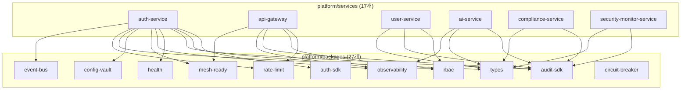
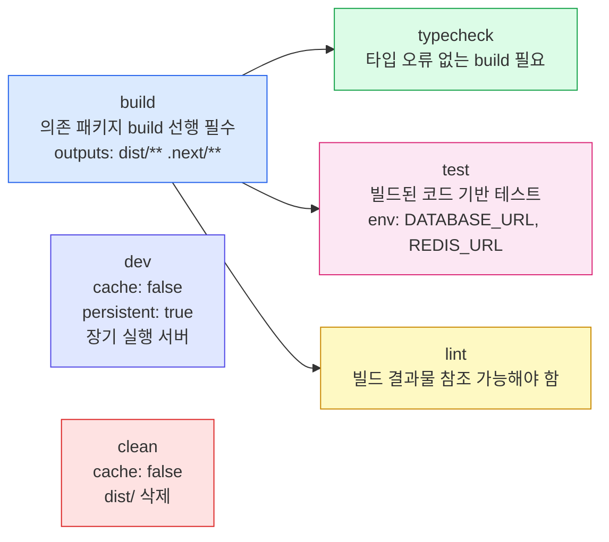
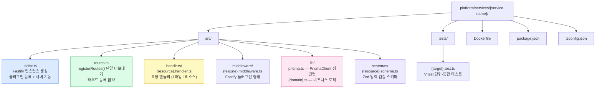
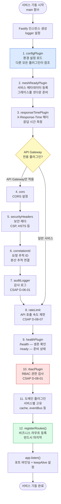
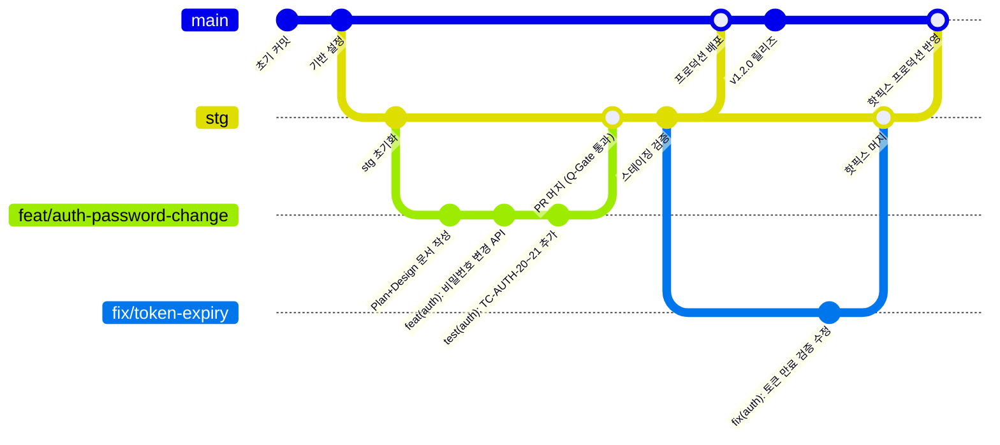
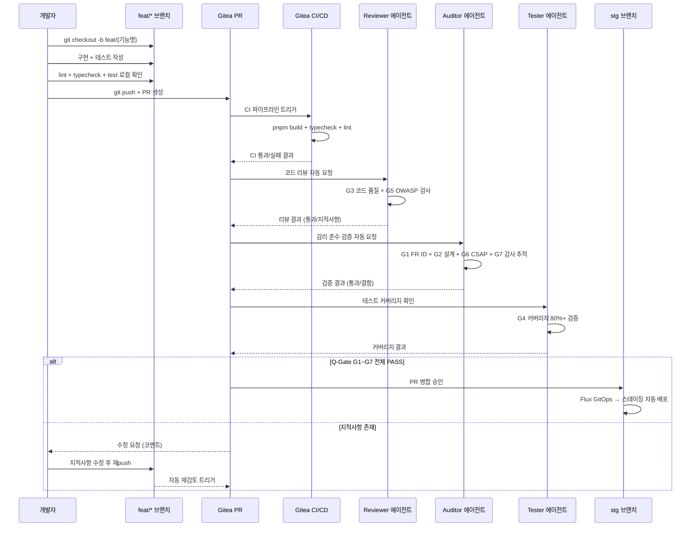

# 2장 — 코드 관리 및 모노레포

> **문서 ID**: ONBOARD-02
> **버전**: 1.0.0 | **작성일**: 2026-04-11 | **작성자**: Implementer (Sonnet)
> **선행 학습**: `00-overview.md` (0장), `01-document-management.md` (1장)
> **참고 문서**:
>   - `/data/ai-saas/docs/guidelines/coding-standards.md`
>   - `/data/ai-saas/CLAUDE.md`
>   - `/data/ai-saas/.claude/rules/deadcode-policy.md`
>   - `/data/ai-saas/.claude/rules/harness-constraints.md`

---

## 목차

1. [pnpm workspace 모노레포 구조](#1-pnpm-workspace-모노레포-구조)
2. [Turbo 빌드 시스템](#2-turbo-빌드-시스템)
3. [서비스 구조 상세](#3-서비스-구조-상세)
4. [패키지 개발 패턴](#4-패키지-개발-패턴)
5. [TypeScript 코딩 표준](#5-typescript-코딩-표준)
6. [보안 코딩 패턴 (CSAP/N2SF)](#6-보안-코딩-패턴-csapn2sf)
7. [Git 워크플로우](#7-git-워크플로우)
8. [Dead Code 정책](#8-dead-code-정책)
9. [테스트 패턴](#9-테스트-패턴)
10. [실습: 새 기능 추가 예시](#10-실습-새-기능-추가-예시)
11. [변경 이력](#11-변경-이력)

---

## 1. pnpm workspace 모노레포 구조

### 1.1 전체 레이아웃

```
/data/ai-saas/                        # 모노레포 루트
├── platform/                          # 플랫폼 핵심 (서비스·패키지·앱)
│   ├── apps/                          # 프론트엔드 앱
│   │   └── portal/                    # Next.js 15 관리 포털
│   ├── services/                      # Fastify 마이크로서비스 (17개)
│   │   ├── api-gateway/
│   │   ├── auth-service/
│   │   └── ... (총 17개)
│   ├── packages/                      # 공유 라이브러리 (27개)
│   │   ├── auth-sdk/
│   │   ├── audit-sdk/
│   │   ├── rbac/
│   │   └── ... (총 27개)
│   ├── plugins/                       # 비즈니스 플러그인
│   └── tests/
│       └── e2e/                       # E2E 테스트 (Playwright)
│
├── packages/                          # 운영 도구 패키지 (6개)
│   ├── dora-exporter/                 # DORA 메트릭
│   ├── ml-pipeline/                   # ML CI/CD
│   ├── slo-escalation/                # SLO 에스컬레이션
│   ├── feature-flag-sdk/              # 기능 플래그
│   ├── audit-collector/               # 감사 로그 수집기
│   └── tech-debt-scanner/             # 기술 부채 스캐너
│
├── business-template/                 # 비즈니스 플러그인 템플릿
├── prisma/                            # Prisma 스키마 및 마이그레이션
│   ├── schema.prisma
│   └── seed/
│
├── package.json                       # 루트 (워크스페이스 단위 스크립트)
├── pnpm-workspace.yaml                # 워크스페이스 정의
├── turbo.json                         # Turbo 빌드 태스크 정의
├── tsconfig.base.json                 # 공통 TypeScript 설정
└── eslint.config.mjs                  # 공통 ESLint 설정
```

### 1.2 pnpm-workspace.yaml

```yaml
# 공공기관 SaaS 플랫폼 — pnpm 워크스페이스 정의
# Design Ref: D-P00.1 모노레포 구조
packages:
  - "platform/apps/*"
  - "platform/services/*"
  - "platform/packages/*"
  - "platform/plugins/*"
  - "platform/tests/e2e"
  - "business-template/*"
```

루트의 `packages/` (운영 도구)는 별도 워크스페이스로 관리됩니다.
`platform/` 하위 패키지만 상호 `workspace:*` 의존성을 사용합니다.

### 1.3 루트 package.json 스크립트

루트 `package.json`은 워크스페이스 전체에 대한 명령만 정의합니다.

| 명령 | 실제 동작 | 설명 |
|------|---------|------|
| `pnpm test` | `pnpm -r run test` | 전체 워크스페이스 테스트 (Turbo 병렬) |
| `pnpm typecheck` | `pnpm -r run typecheck` | 전체 TypeScript 타입 검사 |
| `pnpm build` | `pnpm -r run build` | 전체 빌드 (Turbo 의존성 순서 준수) |
| `pnpm run audit:security` | `bash scripts/security-audit.sh` | 보안 감사 |
| `pnpm run audit:dead-code` | `node scripts/audit-dead-code.mjs` | Dead code 탐지 |

### 1.4 패키지 간 의존성 선언

같은 워크스페이스 내 패키지를 참조할 때는 `workspace:*` 프로토콜을 사용합니다.

```json
// platform/services/auth-service/package.json
{
  "dependencies": {
    "@public-saas/types": "workspace:*",
    "@public-saas/auth-sdk": "workspace:*",
    "@public-saas/audit-sdk": "workspace:*",
    "@public-saas/observability": "workspace:*",
    "@public-saas/rate-limit": "workspace:*",
    "@public-saas/health": "workspace:*",
    "@public-saas/rbac": "workspace:*",
    "@public-saas/mesh-ready": "workspace:*",
    "@public-saas/config-vault": "workspace:*",
    "@public-saas/event-bus": "workspace:*"
  }
}
```

`workspace:*`는 빌드 시 실제 버전으로 교체됩니다 (pnpm이 자동 처리).

### 1.4.1 모노레포 패키지 의존성 그래프

아래 그래프는 주요 서비스와 공유 패키지 사이의 `workspace:*` 의존 관계를 도식화합니다.



**패키지 의존성 설명**

| 공유 패키지 | 역할 | 주요 사용 서비스 |
|-----------|------|--------------|
| `auth-sdk` | JWT 토큰 발급·검증·블랙리스트 | auth-service |
| `rbac` | 역할 기반 접근 통제 (CSAP D-08) | 모든 서비스 |
| `audit-sdk` | 감사 로그 기록 (CSAP D-06) | 모든 서비스 |
| `rate-limit` | API 호출 속도 제한 (CSAP D-08-07) | api-gateway, auth-service |
| `health` | `/health`, `/ready` 헬스 체크 엔드포인트 | 모든 서비스 |
| `observability` | OpenTelemetry 추적·메트릭 (OTEL) | 모든 서비스 |
| `mesh-ready` | 그레이스풀 셧다운 + 서비스 메타데이터 | 모든 서비스 |
| `config-vault` | 환경 설정 중앙 관리 | 모든 서비스 |
| `types` | 공통 TypeScript 타입 정의 | 모든 서비스·패키지 |
| `event-bus` | 비동기 이벤트 발행·구독 | auth-service, 일부 서비스 |
| `circuit-breaker` | 외부 서비스 장애 격리 | api-gateway, ai-service |

**규칙**: `platform/services/` 서비스는 `platform/packages/` 패키지만 참조할 수 있습니다. 서비스 간 직접 import는 금지이며, 반드시 HTTP API 또는 `event-bus`를 통해 통신합니다.

### 1.5 특정 패키지만 명령 실행

```bash
# 특정 서비스만 개발 서버 시작
pnpm --filter @public-saas/auth-service dev

# 특정 서비스만 테스트
pnpm --filter @public-saas/auth-service test

# 특정 서비스와 의존 패키지 모두 빌드
pnpm --filter @public-saas/auth-service... build

# 패키지 이름 glob 패턴 사용
pnpm --filter "@public-saas/auth-*" typecheck
```

---

## 2. Turbo 빌드 시스템

### 2.1 turbo.json 설명

```json
{
  "$schema": "https://turborepo.dev/schema.json",
  "tasks": {
    "build": {
      "dependsOn": ["^build"],
      "outputs": ["dist/**", ".next/**"],
      "env": ["NODE_ENV"]
    },
    "dev": {
      "cache": false,
      "persistent": true
    },
    "lint": {
      "dependsOn": ["^build"]
    },
    "test": {
      "dependsOn": ["^build"],
      "env": ["DATABASE_URL", "REDIS_URL", "NODE_ENV"]
    },
    "typecheck": {
      "dependsOn": ["^build"]
    },
    "clean": {
      "cache": false
    }
  }
}
```

### 2.2 Turbo 핵심 개념

**`dependsOn: ["^build"]`**
`^` 접두사는 "의존 패키지의 해당 태스크 먼저 실행"을 의미합니다.
`auth-service`가 `@public-saas/auth-sdk`에 의존하면, `auth-sdk build`가 먼저 완료된 후 `auth-service build`가 실행됩니다.

**캐시 (`outputs`)**
`dist/**`와 `.next/**`는 Turbo 캐시 대상입니다.
소스가 변경되지 않으면 재빌드 없이 캐시를 사용합니다.

**환경 변수 (`env`)**
환경 변수 값이 바뀌면 해당 패키지의 캐시가 무효화됩니다.
`test` 태스크에 `DATABASE_URL`, `REDIS_URL`이 포함된 이유입니다.

**`persistent: true` (dev)**
개발 서버처럼 종료되지 않는 장기 실행 태스크에 사용합니다.

### 2.2.1 Turbo 빌드 태스크 의존성 DAG

아래 DAG(유향 비순환 그래프)는 Turbo 태스크 간 실행 순서를 표현합니다. 화살표 방향이 "먼저 완료되어야 하는 태스크"를 가리킵니다.



**Turbo 태스크 의존성 상세 설명**

| 태스크 | 선행 필수 | 캐시 사용 | 설명 |
|--------|---------|---------|------|
| `build` | 의존 패키지의 `build` 완료 (`^build`) | `dist/**`, `.next/**` | 소스 변경 없으면 캐시 재사용 |
| `typecheck` | 의존 패키지의 `build` 완료 | 있음 | `.d.ts` 파일 참조 필요 |
| `test` | 의존 패키지의 `build` 완료 | `DATABASE_URL`, `REDIS_URL` 변경 시 무효화 | 환경 변수 변경 시 자동 재실행 |
| `lint` | 의존 패키지의 `build` 완료 | 있음 | 빌드 산출물의 타입 정보 활용 |
| `dev` | 없음 | 없음 (`cache: false`) | 장기 실행, 캐시 불필요 |
| `clean` | 없음 | 없음 (`cache: false`) | `dist/` 디렉토리 삭제 |

**`^build` 패턴의 의미**: `auth-service`가 `auth-sdk`에 의존한다면, `pnpm build`를 실행할 때 Turbo가 자동으로 `auth-sdk build` → `auth-service build` 순서를 결정합니다. 개발자가 직접 순서를 관리할 필요가 없습니다.

### 2.3 빌드 실행 예시

```bash
# 전체 빌드 (의존성 순서 자동 처리)
pnpm build

# 변경 사항만 재빌드 (캐시 활용)
pnpm build  # 두 번째 실행은 캐시에서 즉시 완료

# 캐시 무시하고 전체 재빌드
pnpm build --force

# 개발 서버 전체 시작 (병렬)
pnpm dev
```

---

## 3. 서비스 구조 상세

### 3.1 서비스 표준 디렉토리 구조

모든 Fastify 서비스는 다음 구조를 따릅니다.

```
platform/services/{service-name}/
├── src/
│   ├── index.ts           # 진입점: Fastify 인스턴스 생성, 플러그인 등록, 서버 기동
│   ├── routes.ts          # 라우트 등록: registerRoutes() 함수 단일 내보내기
│   ├── handlers/          # 요청 핸들러 (1파일 1리소스)
│   │   └── {resource}.handler.ts
│   ├── middleware/        # Fastify 플러그인 형태의 미들웨어
│   │   └── {feature}.middleware.ts
│   ├── lib/               # 순수 비즈니스 로직 함수
│   │   ├── prisma.ts      # PrismaClient 싱글턴 (모든 서비스 동일 패턴)
│   │   └── {domain}.ts
│   └── schemas/           # Zod 입력 검증 스키마
│       └── {resource}.schema.ts
├── tests/
│   └── {target}.test.ts   # Vitest 테스트
├── Dockerfile
├── package.json
└── tsconfig.json
```

### 3.1.1 서비스 표준 디렉토리 구조 도식

아래 다이어그램은 모든 Fastify 서비스가 따르는 표준 디렉토리 구조를 그래프로 표현합니다.



**서비스 디렉토리 구성요소 설명**

| 파일/디렉토리 | 역할 | 핵심 규칙 |
|------------|------|---------|
| `src/index.ts` | 서비스 진입점 — Fastify 인스턴스 생성 및 플러그인 등록 | 플러그인 등록 순서 12단계 준수 |
| `src/routes.ts` | 모든 라우트를 `registerRoutes()` 함수 하나로 등록 | 마지막 단계에서 호출 |
| `src/handlers/` | HTTP 요청을 받아 3단계 패턴(검증→비즈니스→응답)으로 처리 | 1파일 1리소스 원칙 |
| `src/middleware/` | Fastify 플러그인 형태의 미들웨어 (인증·로깅 등) | `fp()`로 래핑 필수 |
| `src/lib/` | 순수 비즈니스 로직 함수 — 테스트 용이성을 위해 handler와 분리 | Side effect 최소화 |
| `src/schemas/` | Zod 스키마 정의 — API 입력 검증 (CSAP D-12-01) | 모든 API 입력에 적용 필수 |
| `tests/` | Vitest 기반 단위·통합 테스트 — Q-Gate G4 커버리지 80%+ | 핸들러와 lib 별도 테스트 |

### 3.2 서비스 진입점 표준 패턴

```typescript
// src/index.ts — 모든 서비스가 따르는 표준 패턴
// Design Ref: {MTU-ID} DESIGN §2.1
// Plan SC: {FR-ID 목록}
// CSAP: {관련 항목}

// 반드시 가장 먼저: OpenTelemetry 초기화
import { initTelemetry, shutdownTelemetry } from '@public-saas/observability';
initTelemetry({ serviceName: '{서비스명}', serviceVersion: '{버전}' });

import Fastify from 'fastify';
import { responseTimePlugin } from '@public-saas/observability';
import { healthPlugin, CommonCheckers } from '@public-saas/health';
import { rbacPlugin } from '@public-saas/rbac';
import { meshReadyPlugin } from '@public-saas/mesh-ready';
import { configPlugin } from '@public-saas/config-vault';
import { registerRoutes } from './routes.js';

async function main(): Promise<void> {
  const app = Fastify({
    logger: {
      level: process.env['LOG_LEVEL'] ?? 'info',
      transport: process.env['NODE_ENV'] === 'development'
        ? { target: 'pino-pretty' }
        : undefined,
    },
  });

  // 플러그인 등록 순서 (순서 중요 — 의존성 있음)
  await app.register(configPlugin, { /* 설정 */ });     // 1. 설정 (최우선)
  await app.register(meshReadyPlugin, { /* 설정 */ });  // 2. 서비스 메타데이터
  await app.register(responseTimePlugin);                // 3. 응답 시간 헤더
  await app.register(healthPlugin, { /* 설정 */ });     // 4. /health, /ready
  await app.register(rbacPlugin, {});                   // 5. RBAC 권한 검사
  await registerRoutes(app);                             // 6. 비즈니스 라우트 (마지막)

  const PORT = app.config.get<number>('port', 3001);
  const HOST = app.config.get<string>('host', '0.0.0.0');
  await app.listen({ port: PORT, host: HOST });

  // k8s ALB 호환: keep-alive 타임아웃
  app.server.keepAliveTimeout = 65000;
  app.server.headersTimeout = 66000;

  process.on('uncaughtException', (err) => {
    app.log.fatal({ err }, '치명적 예외 발생 — 서비스 종료');
    void app.mesh.shutdown.shutdown(app).then(() => process.exit(1));
  });
}

main().catch((err) => {
  process.stderr.write(`서비스 기동 실패: ${String(err)}\n`);
  process.exit(1);
});
```

### 3.3 플러그인 등록 순서 규칙

```
1. configPlugin         — 환경 설정 로드 (다른 플러그인이 참조)
2. meshReadyPlugin      — 서비스 메타데이터 + 그레이스풀 셧다운
3. responseTimePlugin   — X-Response-Time 헤더
4. cors                 — CORS 설정 (API Gateway에서만)
5. securityHeaders      — 보안 헤더 (API Gateway에서만)
6. correlationId        — 요청 추적 ID (API Gateway에서만)
7. auditLogger          — 감사 로그 (API Gateway에서만)
8. rateLimit            — Rate Limiting
9. healthPlugin         — /health, /ready 엔드포인트
10. rbacPlugin          — RBAC 권한 검사
11. 도메인 플러그인     — 서비스별 고유 (cache, eventBus 등)
12. 비즈니스 라우트     — registerRoutes() (반드시 마지막)
```

### 3.3.1 Fastify 플러그인 등록 순서 플로우차트

아래 플로우차트는 12단계 플러그인 등록 순서를 시각화합니다. 순서를 어기면 참조 오류 또는 보안 우회 취약점이 발생합니다.



**플러그인 등록 순서 규칙 설명**

| 순서 | 플러그인 | 필수 이유 |
|------|---------|---------|
| 1번 최우선 | `configPlugin` | 환경 변수를 로드해야 이후 플러그인이 설정값에 접근 가능 |
| 2번 | `meshReadyPlugin` | 서비스 식별 정보를 조기 등록해야 그레이스풀 셧다운이 정상 작동 |
| 8번 | `rateLimit` | RBAC 검사 전에 과도한 요청을 차단해야 RBAC 로직 과부하 방지 |
| 10번 | `rbacPlugin` | 모든 보안 인프라 플러그인이 준비된 후에 권한 검사 활성화 |
| 12번 마지막 | `registerRoutes()` | 모든 미들웨어가 준비된 상태에서만 비즈니스 라우트 노출 |

**API Gateway 전용 플러그인 (4~7번)**: `cors`, `securityHeaders`, `correlationId`, `auditLogger`는 외부 트래픽이 진입하는 API Gateway에서만 등록합니다. 내부 마이크로서비스에 중복 적용하면 성능 저하가 발생합니다.

### 3.4 라우트 등록 패턴

```typescript
// src/routes.ts
import type { FastifyInstance } from 'fastify';
import { loginHandler } from './handlers/login.handler.js';
import { requirePermission } from '@public-saas/rbac';

// JSON Schema로 입출력 정의 (Fastify 내장 검증 + OpenAPI 자동 생성)
const loginSchemaOpts = {
  schema: {
    description: '사용자 로그인 (CSAP D-08-01)',
    tags: ['auth'],
    body: {
      type: 'object' as const,
      required: ['email', 'password', 'tenantSlug'],
      properties: {
        email: { type: 'string' as const, format: 'email' },
        password: { type: 'string' as const, minLength: 8 },
        tenantSlug: { type: 'string' as const },
      },
    },
  },
};

export async function registerRoutes(app: FastifyInstance): Promise<void> {
  // 공개 엔드포인트 (인증 불필요)
  // Plan SC: FR-AUTH.1
  app.post('/auth/login', loginSchemaOpts, loginHandler);

  // 인증 필요 엔드포인트
  // Plan SC: FR-P02.1
  app.get('/users', {
    preHandler: requirePermission('user:read'),
  }, userListHandler);
}
```

### 3.5 핸들러 3단계 패턴

모든 핸들러는 "검증 → 비즈니스 로직 → 응답"의 3단계 구조를 따릅니다.

```typescript
// src/handlers/login.handler.ts
import type { FastifyRequest, FastifyReply } from 'fastify';
import { loginSchema } from '../schemas/login.schema.js';
import { findUserByEmail } from '../lib/user.js';
import { signAccessToken } from '../lib/token.js';
import { logAuthEvent } from '../lib/audit.js';

export async function loginHandler(
  request: FastifyRequest,
  reply: FastifyReply,
): Promise<void> {
  // 1단계: Zod 입력 검증 (CSAP D-12-01)
  const parseResult = loginSchema.safeParse(request.body);
  if (!parseResult.success) {
    await reply.status(400).send({
      success: false,
      error: {
        code: 'VALIDATION_ERROR',
        message: parseResult.error.issues[0]?.message ?? '입력 오류',
      },
    });
    return;
  }

  // 2단계: 비즈니스 로직 (lib/ 함수 호출)
  const { email, password, tenantSlug } = parseResult.data;
  const user = await findUserByEmail(email, tenantSlug);
  if (!user || !(await verifyPassword(password, user.passwordHash))) {
    await reply.status(401).send({
      success: false,
      error: { code: 'AUTH_FAILED', message: '이메일 또는 비밀번호가 올바르지 않습니다' },
    });
    return;
  }
  const token = await signAccessToken(user);

  // 3단계: 감사 로그 + 응답 (CSAP D-06-01)
  await logAuthEvent('LOGIN_SUCCESS', user.id, user.tenantId, request.ip, request.headers['user-agent'] ?? '');
  await reply.status(200).send({ success: true, data: { accessToken: token } });
}
```

### 3.6 PrismaClient 싱글턴 패턴

모든 서비스는 동일한 패턴으로 PrismaClient를 생성합니다.

```typescript
// src/lib/prisma.ts — 모든 서비스에서 동일 파일 구조
import { PrismaClient } from '@prisma/client';

const globalForPrisma = globalThis as unknown as { prisma: PrismaClient };

export const prisma =
  globalForPrisma.prisma ??
  new PrismaClient({
    log: process.env['NODE_ENV'] === 'development' ? ['error', 'warn'] : ['error'],
  });

if (process.env['NODE_ENV'] !== 'production') {
  globalForPrisma.prisma = prisma;
}
```

---

## 4. 패키지 개발 패턴

### 4.1 새 패키지 추가 방법

새 공유 패키지를 추가할 때의 표준 절차입니다.

```bash
# 1. 디렉토리 생성
mkdir -p platform/packages/my-new-package/src

# 2. package.json 작성 (다음 표준 참조)
# 3. tsconfig.json 작성 (tsconfig.base.json 상속)
# 4. src/index.ts 작성
# 5. pnpm install (워크스페이스 심링크 자동 생성)
```

**표준 package.json:**

```json
{
  "name": "@public-saas/my-new-package",
  "version": "0.1.0",
  "private": true,
  "type": "module",
  "main": "./dist/index.js",
  "types": "./dist/index.d.ts",
  "exports": {
    ".": {
      "types": "./dist/index.d.ts",
      "import": "./dist/index.js"
    }
  },
  "scripts": {
    "build": "tsc",
    "typecheck": "tsc --noEmit",
    "lint": "eslint src/ --max-warnings 0",
    "test": "vitest run",
    "clean": "rm -rf dist"
  },
  "devDependencies": {
    "@types/node": "^22.0.0",
    "typescript": "^5.7.0",
    "vitest": "^2.1.0"
  }
}
```

**표준 tsconfig.json:**

```json
{
  "extends": "../../../tsconfig.base.json",
  "compilerOptions": {
    "outDir": "./dist",
    "rootDir": "./src",
    "declaration": true,
    "declarationMap": true,
    "sourceMap": true
  },
  "include": ["src/**/*"],
  "exclude": ["dist", "node_modules"]
}
```

### 4.2 Fastify 플러그인 패키지 패턴

`fastify-plugin` (`fp`)으로 래핑하는 패턴이 필수입니다.

```typescript
// src/my-feature-plugin.ts
import fp from 'fastify-plugin';
import type { FastifyPluginCallback } from 'fastify';

export interface MyFeaturePluginOptions {
  timeout?: number;
}

// Fastify 인스턴스 타입 확장 (decorator 타입 선언)
declare module 'fastify' {
  interface FastifyInstance {
    myFeature: {
      doSomething: () => Promise<void>;
    };
  }
}

const plugin: FastifyPluginCallback<MyFeaturePluginOptions> = (app, opts, done) => {
  const instance = {
    doSomething: async () => { /* 구현 */ },
  };

  app.decorate('myFeature', instance);
  done();
};

// fp()로 래핑: encapsulation 제거 → 전역 접근 가능
export const myFeaturePlugin = fp(plugin, {
  name: 'my-feature-plugin',
  fastify: '5.x',
});
```

**`fp()` 필수 이유**: Fastify의 플러그인 캡슐화 모델에서 `fp()`를 사용하지 않으면
`app.decorate()`로 추가한 속성이 상위 스코프에서 접근 불가합니다.

### 4.3 패키지 엔트리포인트 규칙

```typescript
// src/index.ts — re-export만 수행 (비즈니스 로직 금지)
export { MyFeature, type MyFeatureOptions } from './my-feature.js';
export { myFeaturePlugin, type MyFeaturePluginOptions } from './my-feature-plugin.js';
```

`index.ts`는 내보내기 집약 파일로만 사용합니다. 직접 구현 코드 작성 금지.

---

## 5. TypeScript 코딩 표준

### 5.1 strict 모드 (모든 패키지 필수)

`tsconfig.base.json`에서 다음 옵션이 활성화됩니다.

```jsonc
{
  "compilerOptions": {
    "strict": true,                      // 모든 strict 계열 활성화
    "noUnusedLocals": true,              // 미사용 지역 변수 → 오류
    "noUnusedParameters": true,          // 미사용 매개변수 → 오류
    "noUncheckedIndexedAccess": true,    // 인덱스 접근 시 T | undefined 강제
    "verbatimModuleSyntax": true,        // import type 명시 강제
    "noFallthroughCasesInSwitch": true   // switch 폴스루 방지
  }
}
```

### 5.2 any 사용 금지

```typescript
// [금지] any
function processData(data: any): any { /* ... */ }

// [필수] unknown + 타입 가드
function processData(data: unknown): ProcessResult {
  if (!isValidInput(data)) {
    throw new ValidationError('유효하지 않은 입력');
  }
  return transformData(data);
}

// [허용] 동적 키-값 구조에 한해 Record<string, unknown>
function logMetadata(metadata: Record<string, unknown>): void { /* ... */ }
```

### 5.3 네이밍 규칙 표

| 대상 | 형식 | 예시 |
|------|------|------|
| 변수 | camelCase | `accessToken`, `tenantId` |
| 함수 | camelCase (동사 시작) | `createSession`, `verifyToken` |
| 클래스 | PascalCase | `EventBus`, `TenantContext` |
| 타입/인터페이스 | PascalCase | `TokenPayload`, `ApiResponse` |
| 상수 | UPPER_SNAKE_CASE | `MAX_LOGIN_ATTEMPTS` |
| 파일명 | kebab-case | `login.handler.ts`, `auth-sdk.ts` |

**금지 패턴**:
- `I` 접두사 인터페이스: `IUser` (금지) → `User` (사용)
- 약어: `usr`, `cfg`, `req` (금지) → `user`, `config`, `request` (사용)

### 5.4 파일 및 함수 크기 제한

| 규칙 | 기준 | 초과 시 처리 |
|------|------|-----------|
| 함수 최대 줄 수 | 80줄 이하 | 책임 분리 (단일 책임 원칙) |
| 파일 최대 줄 수 | 800줄 이하 | 모듈 분리 |
| 줄 길이 | 120자 이하 | ESLint 자동 경고 |
| 중첩 깊이 | 4단계 이하 | 가드 절(early return) 활용 |

### 5.5 import 순서 규칙

```typescript
// 1. Node.js 내장 모듈 (node: 접두사)
import { randomUUID } from 'node:crypto';
import type { IncomingMessage } from 'node:http';

// 2. 외부 npm 패키지
import Fastify from 'fastify';
import { z } from 'zod';

// 3. 내부 공유 패키지 (@public-saas/*)
import { rbacPlugin } from '@public-saas/rbac';
import type { TokenPayload } from '@public-saas/types';

// 4. 로컬 모듈 (상대 경로, .js 확장자 필수)
import { loginHandler } from './handlers/login.handler.js';
import type { LoginRequest } from './schemas/login.schema.js';
```

**`.js` 확장자 필수**: ESM 모듈 시스템 호환. TypeScript 소스에서도 `.js`를 씁니다.

### 5.6 환경 변수 접근 규칙

```typescript
// [금지] process.env.VAR 직접 접근 (undefined 반환 가능)
const port = process.env.PORT;  // 타입: string | undefined

// [필수] 브래킷 표기법 + 기본값 (noUncheckedIndexedAccess 호환)
const port = process.env['PORT'] ?? '3000';

// [권장] configPlugin 사용 (서비스 레벨에서 중앙 관리)
const PORT = app.config.get<number>('port', 3001);
```

### 5.7 에러 처리 패턴

```typescript
// [금지] 스택 트레이스, DB 정보를 에러 응답에 노출 (CSAP D-12)
catch (err) {
  return { error: (err as Error).message, stack: (err as Error).stack };
}

// [필수] 안전한 에러 응답 + 내부 로깅
catch (err) {
  const errorId = randomUUID();
  app.log.error({ err, errorId }, '내부 오류 발생');
  await reply.status(500).send({
    success: false,
    error: {
      code: 'INTERNAL_ERROR',
      message: '내부 오류가 발생했습니다',
      errorId,  // 감사 로그 연결용 UUID
    },
  });
}
```

### 5.8 비동기 처리 규칙

```typescript
// [필수] async/await 사용 (Promise chain 금지)
async function createTenant(data: CreateTenantInput): Promise<Tenant> {
  const tenant = await prisma.tenant.create({ data });
  await auditLogger.log({ action: 'TENANT_CREATE', target: tenant.id });
  return tenant;
}

// 독립적인 작업은 Promise.all로 병렬화 (성능)
const [tenant, permissions] = await Promise.all([
  prisma.tenant.findUnique({ where: { id: tenantId } }),
  getUserPermissions(userId),
]);
```

---

## 6. 보안 코딩 패턴 (CSAP/N2SF)

### 6.1 RBAC 적용 (CSAP D-08)

모든 API 엔드포인트는 RBAC 검사를 받아야 합니다.

```typescript
// 서비스 레벨: rbacPlugin 등록
await app.register(rbacPlugin, {
  auditLogger: (event) => {
    app.log.info({ rbacEvent: event }, 'RBAC 감사 로그');
  },
});

// 라우트 레벨: requirePermission 미들웨어 사용
import { requirePermission } from '@public-saas/rbac';

app.get('/tenants', {
  preHandler: requirePermission('tenant:read'),
}, tenantListHandler);

app.delete('/tenants/:id', {
  preHandler: requirePermission('tenant:delete'),
}, tenantDeleteHandler);
```

### 6.2 감사 로그 (CSAP D-06)

민감 작업(생성·수정·삭제·로그인·권한 변경 등)에는 반드시 감사 로그를 기록합니다.

```typescript
import { createAuditLogger, createStandardTransport } from '@public-saas/audit-sdk';

const auditLogger = createAuditLogger({
  serviceName: 'auth-service',
  transport: createStandardTransport('auth-service'),
});

// 로그인 성공 시 기록
await auditLogger.log({
  actor: user.id,
  action: 'LOGIN_SUCCESS',
  target: user.id,
  targetType: 'user',
  tenantId: user.tenantId,
  ip: request.ip,
  userAgent: request.headers['user-agent'] ?? 'unknown',
});
```

### 6.3 입력 검증 (CSAP D-12)

```typescript
// 모든 API 입력은 Zod 스키마로 검증 필수
import { z } from 'zod';

export const createTenantSchema = z.object({
  name: z.string().min(1, '테넌트명을 입력하세요').max(100),
  slug: z.string()
    .min(1).max(50)
    .regex(/^[a-z0-9-]+$/, '소문자, 숫자, 하이픈만 허용'),
  maxUsers: z.number().int().min(1).max(10000),
  dataGrade: z.enum(['C', 'S', 'O']),
});

// safeParse 사용 (예외 발생 없이 결과 확인)
const result = createTenantSchema.safeParse(request.body);
if (!result.success) {
  await reply.status(400).send({
    success: false,
    error: {
      code: 'VALIDATION_ERROR',
      message: result.error.issues[0]?.message ?? '입력 오류',
    },
  });
  return;
}
```

### 6.4 N2SF 데이터 등급 검증

AI API 호출 전 반드시 데이터 등급을 확인합니다.

```typescript
// AI API 호출 전 등급 검증 필수 (N2SF N-05)
import type { DataGrade } from '@public-saas/types';

export function validateDataGrade(grade: DataGrade): void {
  if (grade === 'C' || grade === 'S') {
    throw new DataGradeViolationError(
      `BLOCKED: ${grade}등급 데이터는 AI API 전송이 금지됩니다 (N2SF N-05)`,
      grade,
    );
  }
}

// O등급 데이터도 PII 마스킹 후 전송
const safeText = maskPII(userInput);
const response = await aiGateway.send(safeText);  // 내부 AI Gateway 경유 필수
```

### 6.5 시크릿 관리 규칙

```typescript
// [절대 금지] 하드코딩된 시크릿 (AgentShield가 자동 차단)
const API_KEY = 'sk-1234567890';  // BLOCKED

// [필수] 환경 변수 + 존재 확인
const API_KEY = process.env['API_KEY'];
if (!API_KEY) {
  throw new Error('API_KEY 환경 변수가 설정되지 않았습니다');
}

// [권장] configPlugin으로 중앙 관리
await app.register(configPlugin, {
  envMapping: { API_KEY: 'apiKey' },
});
const apiKey = app.config.get<string>('apiKey');
```

---

## 7. Git 워크플로우

### 7.1 브랜치 전략

| 접두사 | 용도 | 예시 |
|--------|------|------|
| `feat/` | 새 기능 구현 | `feat/auth-password-change` |
| `fix/` | 버그 수정 | `fix/token-expiry-validation` |
| `docs/` | 문서 추가·수정 | `docs/onboarding-guide` |
| `refactor/` | 리팩토링 (기능 변경 없음) | `refactor/audit-logger-cleanup` |
| `test/` | 테스트 추가·수정 | `test/auth-service-coverage` |
| `chore/` | 빌드·설정 변경 | `chore/update-dependencies` |

**규칙**: 기능 브랜치는 `stg` 또는 `main` 브랜치에서 분기합니다.

### 7.1.1 Git 브랜치 전략 다이어그램

아래 다이어그램은 `main` → `stg` → `feat/` 브랜치 전략과 배포 흐름을 보여줍니다.



**브랜치 전략 규칙 설명**

| 브랜치 | 보호 수준 | 배포 환경 | PR 병합 조건 |
|--------|---------|---------|------------|
| `main` | 최고 보호 | 프로덕션 (`prod`) | `stg` 검증 완료 + 팀 리뷰 |
| `stg` | 보호됨 | 스테이징 (`stg`) | Q-Gate G1~G7 전체 PASS |
| `feat/*`, `fix/*` 등 | 없음 | 없음 (로컬만) | 작업 완료 후 stg로 PR |

**절대 금지**: `main`과 `stg`에 직접 push 금지. 반드시 PR을 통해 병합합니다.

### 7.1.2 PR 프로세스 시퀀스 다이어그램

아래는 기능 브랜치에서 PR 생성 후 최종 병합까지의 전체 흐름을 보여줍니다.



**PR 프로세스 핵심 규칙**

- CI 실패 시 병합 불가: 린트 오류·타입 오류·빌드 실패가 하나라도 있으면 PR 차단
- Q-Gate 부분 통과 불인정: G1~G7 중 하나라도 미통과 시 병합 불가
- `--no-verify` 사용 금지: 로컬 git 훅 우회는 ECC `block-no-verify`가 자동 차단
- Flux GitOps: `stg` 브랜치에 병합되면 Flux가 자동으로 스테이징 환경에 배포

### 7.2 Conventional Commits 형식

모든 커밋 메시지는 Conventional Commits 형식을 따릅니다.

```
{type}({scope}): {description}

[optional body]

[optional footer]
```

**실제 예시**:

```
feat(auth): FR-P01.20 비밀번호 변경 API 구현

- PATCH /auth/password 엔드포인트 추가
- 이전 비밀번호 5개 이력 관리
- CSAP D-08-05 비밀번호 정책 적용

Plan SC: FR-P01.20, FR-P01.21
CSAP: D-08-05
```

```
fix(rbac): FR-P04.3 권한 검사 우회 취약점 수정

공개 경로 정확 매칭 방식으로 변경.
기존 startsWith 방식은 /auth/login2 경로도 공개로 처리하는 버그 존재.

CSAP: D-08-01
```

**type 종류**:

| type | 사용 상황 |
|------|---------|
| `feat` | 새 기능 추가 |
| `fix` | 버그 수정 |
| `docs` | 문서만 변경 |
| `refactor` | 기능 변경 없는 코드 구조 개선 |
| `test` | 테스트 추가·수정 |
| `chore` | 빌드·설정·의존성 변경 |
| `perf` | 성능 개선 |
| `security` | 보안 취약점 수정 |

### 7.3 커밋 전 필수 확인

```bash
# 1. 린트 통과 확인 (--max-warnings 0: 경고도 오류로 처리)
pnpm --filter {패키지명} lint

# 2. 타입 검사 통과 확인
pnpm --filter {패키지명} typecheck

# 3. 테스트 통과 확인
pnpm --filter {패키지명} test

# 4. 빌드 성공 확인
pnpm --filter {패키지명} build
```

### 7.4 절대 금지 git 명령

| 명령 | 금지 이유 |
|------|---------|
| `git commit --no-verify` | 보안 훅 우회 (ECC block-no-verify 차단) |
| `git push --force` | 감사 추적 파괴 (이력 덮어쓰기) |
| `git push --force-with-lease` | main/stg 브랜치에서 금지 |
| `git reset --hard` | 작업 내용 파괴 위험 |

### 7.5 PR 프로세스

1. 기능 브랜치에서 작업 완료 후 PR 생성
2. Reviewer 에이전트 자동 실행 (코드 품질·보안 검사)
3. Auditor 에이전트 자동 실행 (CSAP·감리 준수 검증)
4. Q-Gate G1~G7 모두 PASS 후 병합 가능
5. stg 브랜치 병합 → 스테이징 환경 자동 배포 (Flux GitOps)
6. stg 검증 후 main 브랜치 PR → 프로덕션 배포

---

## 8. Dead Code 정책

### 8.1 원칙

Dead code(미사용 코드)는 발견 즉시 제거합니다.
이유: 감리 시 "왜 이 코드가 있는가?"를 설명할 수 없는 코드는 결함입니다.

### 8.2 처리 기준 표

| 코드 유형 | 처리 방법 | 기한 |
|---------|---------|------|
| 미사용 함수 | 즉시 제거 | 발견 즉시 |
| 미사용 변수 | 즉시 제거 | 발견 즉시 |
| 미사용 import | 즉시 제거 | 발견 즉시 |
| 주석 처리된 코드 | 제거 (git 이력 보존) | 발견 즉시 |
| 오래된 TODO (3개월+) | GitHub 이슈 전환 후 제거 | 1주일 이내 |
| 미사용 npm 패키지 | package.json에서 제거 | 발견 즉시 |

### 8.3 예외 목록 (제거 금지)

```typescript
// 예외 1: Deprecation 정책 적용 중인 공개 API
/**
 * @deprecated v2.0에서 제거 예정. v1.x 호환성 유지.
 * @see newFunction
 */
export function oldPublicApi() { /* ... */ }

// 예외 2: 미래 Phase 사용 예정 (명시적 주석 + 재검토일 필수)
// NOTE: 미사용. Phase 2 FR-2.3 구현 시 사용 예정. 재검토일: 2026-07-01
function csapStandardGradeValidator() { /* ... */ }

// 예외 3: 테스트 fixture (tests/fixtures/ 위치)
export const mockCsapChecklist = { /* ... */ };

// 예외 4: 마이그레이션 스크립트 (migrations/ 위치)
export async function migrateToV2() { /* ... */ }
```

### 8.4 탐지 도구

```bash
# TypeScript 미사용 export 탐지
npx ts-prune --error

# 미사용 npm 패키지 탐지
npx depcheck

# 워크스페이스 전체 dead code 감사
pnpm run audit:dead-code
```

**Q-Gate G3**에서 Reviewer 에이전트가 dead code를 발견하면 HIGH 심각도로 플래그하고 병합을 차단합니다.

---

## 9. 테스트 패턴

### 9.1 테스트 프레임워크

모든 서비스와 패키지는 **Vitest**를 사용합니다.

```typescript
// tests/login.handler.test.ts
import { describe, it, expect, beforeEach, vi } from 'vitest';
import { loginHandler } from '../src/handlers/login.handler.js';

describe('loginHandler', () => {
  it('유효한 자격증명으로 로그인 성공', async () => {
    const mockRequest = {
      body: {
        email: 'admin@example.com',
        password: 'SecurePass123!',
        tenantSlug: 'test-tenant',
      },
    };
    const mockReply = { status: vi.fn().mockReturnThis(), send: vi.fn() };

    await loginHandler(mockRequest as any, mockReply as any);

    expect(mockReply.status).toHaveBeenCalledWith(200);
    expect(mockReply.send).toHaveBeenCalledWith(
      expect.objectContaining({ success: true }),
    );
  });

  it('잘못된 이메일 형식으로 400 반환', async () => {
    const mockRequest = {
      body: { email: 'invalid-email', password: 'pass', tenantSlug: 'test' },
    };
    const mockReply = { status: vi.fn().mockReturnThis(), send: vi.fn() };

    await loginHandler(mockRequest as any, mockReply as any);

    expect(mockReply.status).toHaveBeenCalledWith(400);
  });
});
```

### 9.2 커버리지 목표

Q-Gate G4 기준: **80% 이상**.

```bash
# 커버리지 측정
pnpm --filter {패키지명} test --coverage

# 커버리지 리포트 확인
open coverage/index.html
```

### 9.3 E2E 테스트 (Playwright)

`platform/tests/e2e/`에 Playwright 기반 E2E 테스트가 있습니다.

```bash
# E2E 테스트 실행 (서비스 기동 후)
pnpm --filter e2e test

# 특정 테스트만 실행
pnpm --filter e2e test --grep "로그인"
```

---

## 10. 실습: 새 기능 추가 예시

### 10.1 시나리오

`auth-service`에 사용자 로그아웃 API (`POST /auth/logout`)를 추가합니다.

### 10.2 단계 1: 브랜치 생성

```bash
git checkout stg
git pull
git checkout -b feat/auth-logout
```

### 10.3 단계 2: Plan + Design 문서 확인

이미 `SVC-AUTH-R1.plan.md`에 로그아웃 요구사항(`FR-AUTH.2`)이 있는지 확인합니다.
없으면 Plan 문서를 먼저 작성합니다 (1장 참고).

### 10.4 단계 3: 스키마 작성

```typescript
// src/schemas/logout.schema.ts
// Design Ref: SVC-AUTH-R1 DESIGN §2.3
// Plan SC: FR-AUTH.2
// CSAP: D-08-01

import { z } from 'zod';

export const logoutSchema = z.object({
  refreshToken: z.string().min(1, '갱신 토큰이 필요합니다'),
});

export type LogoutRequest = z.infer<typeof logoutSchema>;
```

### 10.5 단계 4: 핸들러 작성

```typescript
// src/handlers/logout.handler.ts
// Design Ref: SVC-AUTH-R1 DESIGN §2.3
// Plan SC: FR-AUTH.2
// CSAP: D-08-01 접근 통제, D-06-01 감사 로그

import type { FastifyRequest, FastifyReply } from 'fastify';
import { logoutSchema } from '../schemas/logout.schema.js';
import { blacklistToken } from '../lib/token.js';
import { logAuthEvent } from '../lib/audit.js';

export async function logoutHandler(
  request: FastifyRequest,
  reply: FastifyReply,
): Promise<void> {
  // 1단계: 입력 검증
  const parseResult = logoutSchema.safeParse(request.body);
  if (!parseResult.success) {
    await reply.status(400).send({
      success: false,
      error: { code: 'VALIDATION_ERROR', message: parseResult.error.issues[0]?.message ?? '입력 오류' },
    });
    return;
  }

  // 2단계: 비즈니스 로직
  const user = request.user;  // auth 미들웨어에서 주입
  if (!user) {
    await reply.status(401).send({
      success: false,
      error: { code: 'AUTH_REQUIRED', message: '인증이 필요합니다' },
    });
    return;
  }

  // CSAP D-08-01: 로그아웃 시 토큰 블랙리스트 등록
  await blacklistToken(parseResult.data.refreshToken);

  // 3단계: 감사 로그 + 응답
  await logAuthEvent('LOGOUT', user.id, user.tenantId, request.ip, request.headers['user-agent'] ?? '');
  await reply.status(200).send({ success: true, data: { message: '로그아웃되었습니다' } });
}
```

### 10.6 단계 5: 라우트 등록

```typescript
// src/routes.ts에 추가
import { logoutHandler } from './handlers/logout.handler.js';

// 기존 라우트 이하에 추가
// Plan SC: FR-AUTH.2
app.post('/auth/logout', { preHandler: [authMiddleware] }, logoutHandler);
```

### 10.7 단계 6: 테스트 작성

```typescript
// tests/logout.handler.test.ts
import { describe, it, expect, vi } from 'vitest';

describe('logoutHandler', () => {
  it('유효한 갱신 토큰으로 로그아웃 성공', async () => {
    // ... 구현
  });

  it('갱신 토큰 없이 요청 시 400 반환', async () => {
    // ... 구현
  });
});
```

### 10.8 단계 7: 확인 및 커밋

```bash
# 린트 + 타입 + 테스트 통과 확인
pnpm --filter @public-saas/auth-service lint
pnpm --filter @public-saas/auth-service typecheck
pnpm --filter @public-saas/auth-service test

# 커밋
git add platform/services/auth-service/src/handlers/logout.handler.ts
git add platform/services/auth-service/src/schemas/logout.schema.ts
git add platform/services/auth-service/tests/logout.handler.test.ts
git add platform/services/auth-service/src/routes.ts

git commit -m "feat(auth): FR-AUTH.2 로그아웃 API 구현 — 토큰 블랙리스트 등록

Plan SC: FR-AUTH.2
CSAP: D-08-01"
```

### 10.9 단계 8: PR 생성

```bash
git push -u origin feat/auth-logout
# Gitea에서 PR 생성 → Reviewer·Auditor 에이전트 자동 실행
```

---

## 11. 변경 이력

| 버전 | 일자 | 내용 | 작성자 |
|------|------|------|-------|
| 1.0.0 | 2026-04-11 | 초기 작성 — coding-standards.md, CLAUDE.md, deadcode-policy.md 기반 | Implementer (Sonnet) |
