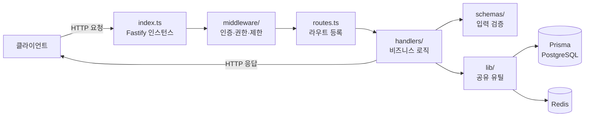
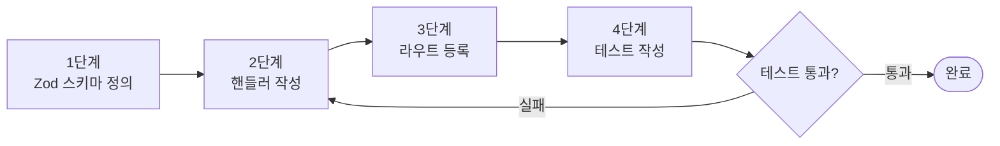
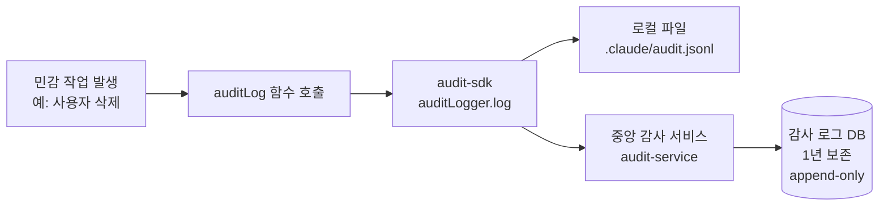
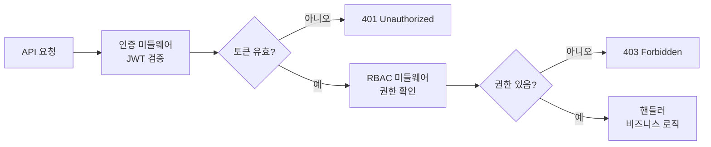

# Fastify 서비스 개발 패턴

> **문서 ID**: ONBOARD-03-02
> **버전**: 1.0.0 | **작성일**: 2026-04-11 | **작성자**: Implementer (Sonnet)
> **선행 학습**: `03-development/01-local-setup.md`
> **소요 시간**: 약 4~6시간 (실습 포함)

---

## 목차

1. [서비스 표준 구조](#1-서비스-표준-구조)
2. [새 엔드포인트 추가하는 4단계 패턴](#2-새-엔드포인트-추가하는-4단계-패턴)
3. [Prisma ORM 사용법](#3-prisma-orm-사용법)
4. [Redis 캐시 패턴](#4-redis-캐시-패턴)
5. [감사 로그 추가하는 방법](#5-감사-로그-추가하는-방법)
6. [RBAC 권한 검사 추가](#6-rbac-권한-검사-추가)
7. [에러 처리 패턴](#7-에러-처리-패턴)
8. [실습: POST /users/profile 엔드포인트 추가하기](#8-실습-post-usersprofile-엔드포인트-추가하기)
9. [변경 이력](#9-변경-이력)

---

## 1. 서비스 표준 구조

### 1.1 디렉토리 레이아웃

모든 Fastify 서비스는 동일한 디렉토리 구조를 따릅니다. `auth-service`를 예로 살펴봅니다.

```
platform/services/auth-service/
├── src/
│   ├── index.ts            ← 서비스 진입점 (Fastify 인스턴스 생성 및 기동)
│   ├── routes.ts           ← 라우트 등록 (URL과 핸들러 연결)
│   ├── handlers/           ← 비즈니스 로직 (각 엔드포인트별 파일)
│   │   ├── login.handler.ts
│   │   ├── logout.handler.ts
│   │   └── ...
│   ├── lib/                ← 공유 유틸리티 (서비스 내부)
│   │   ├── audit.ts        ← 감사 로그 함수
│   │   ├── jwt.ts          ← JWT 서명/검증
│   │   ├── prisma.ts       ← Prisma 클라이언트 싱글톤
│   │   └── ...
│   ├── middleware/         ← Fastify 미들웨어
│   │   ├── auth.middleware.ts       ← JWT 인증
│   │   ├── rbac.middleware.ts       ← RBAC 권한 검사
│   │   └── rate-limit.middleware.ts ← 요청 제한
│   └── schemas/            ← Zod 입력 검증 스키마
│       ├── login.schema.ts
│       └── ...
├── tests/                  ← 단위/통합 테스트
│   ├── login.test.ts
│   └── ...
├── package.json
└── tsconfig.json
```

### 1.2 각 파일의 역할



**각 레이어 책임**:

| 레이어 | 책임 | 하면 안 되는 것 |
|--------|------|--------------|
| `index.ts` | Fastify 인스턴스 생성, 플러그인 등록, 서버 기동 | 비즈니스 로직 포함 금지 |
| `routes.ts` | URL 패턴과 핸들러 함수 연결, OpenAPI 스키마 정의 | 비즈니스 로직 포함 금지 |
| `handlers/` | 요청 처리, 응답 생성, 비즈니스 규칙 | 직접 DB 쿼리 (lib/ 경유 권장) |
| `schemas/` | Zod를 사용한 입력 데이터 검증 | 비즈니스 로직 포함 금지 |
| `lib/` | 재사용 가능한 유틸리티 (DB, 캐시, 암호화 등) | HTTP 관련 코드 포함 금지 |
| `middleware/` | 횡단 관심사 (인증, 권한, 제한 등) | 비즈니스 로직 포함 금지 |

### 1.3 index.ts 구조 이해

```typescript
// platform/services/auth-service/src/index.ts
// Design Ref: SVC-AUTH-R1 DESIGN §전체
// CSAP: D-07 가용성, D-08 접근 통제

import { initTelemetry } from '@public-saas/observability';
// 중요: OpenTelemetry는 반드시 다른 import보다 먼저 초기화해야 합니다.
initTelemetry({ serviceName: 'auth-service', serviceVersion: '0.3.0' });

import Fastify from 'fastify';
import { meshReadyPlugin } from '@public-saas/mesh-ready';
import { configPlugin } from '@public-saas/config-vault';
import { registerAuthRoutes } from './routes.js';

async function main(): Promise<void> {
  const app = Fastify({ logger: { level: 'info' } });

  // 1. 설정 플러그인 (환경 변수 → config)
  await app.register(configPlugin, { /* ... */ });

  // 2. 메시 레디 플러그인 (그레이스풀 셧다운 + 분산 추적)
  await app.register(meshReadyPlugin, { /* ... */ });

  // 3. CORS, 인증 미들웨어 등록
  await app.register(cors, { /* ... */ });
  app.addHook('preHandler', authMiddleware);

  // 4. 라우트 등록
  await registerAuthRoutes(app);

  // 5. 서버 시작
  await app.listen({ port: 3001, host: '0.0.0.0' });
}

main();
```

---

## 2. 새 엔드포인트 추가하는 4단계 패턴

새 API 엔드포인트를 추가하는 표준 절차입니다. 반드시 이 순서를 따르세요.



### 2.1 1단계: Zod 스키마 정의

스키마는 입력 데이터의 형태와 검증 규칙을 정의합니다. 모든 입력은 반드시 Zod로 검증해야 합니다(CSAP D-12).

```typescript
// src/schemas/user-profile.schema.ts
// Design Ref: §사용자 프로필 관리
// CSAP: D-12 시스템 개발 보안 — 입력 검증 필수

import { z } from 'zod';

/**
 * 프로필 업데이트 요청 스키마
 *
 * 모든 필드는 선택적이지만 하나 이상은 제공해야 합니다.
 * 빈 문자열은 허용하지 않습니다.
 */
export const updateProfileSchema = z.object({
  displayName: z
    .string()
    .min(1, '표시 이름은 최소 1자 이상이어야 합니다')
    .max(100, '표시 이름은 100자 이하여야 합니다')
    .optional(),
  phoneNumber: z
    .string()
    .regex(/^010-\d{4}-\d{4}$/, '전화번호는 010-XXXX-XXXX 형식이어야 합니다')
    .optional(),
  department: z
    .string()
    .min(1)
    .max(100)
    .optional(),
}).refine(
  // 최소 하나의 필드는 제공해야 합니다
  (data) => Object.keys(data).length > 0,
  { message: '업데이트할 항목을 최소 하나 이상 제공하세요' }
);

export type UpdateProfileRequest = z.infer<typeof updateProfileSchema>;
```

**Zod 주요 검증 메서드**:

| 메서드 | 설명 | 예시 |
|--------|------|------|
| `z.string()` | 문자열 타입 | `z.string()` |
| `.email()` | 이메일 형식 | `z.string().email()` |
| `.min(n)` | 최소 길이/값 | `z.string().min(1)` |
| `.max(n)` | 최대 길이/값 | `z.string().max(255)` |
| `.regex(pattern)` | 정규식 검증 | `z.string().regex(/^\d+$/)` |
| `z.number().int()` | 정수 타입 | `z.number().int().positive()` |
| `z.enum([...])` | 열거형 | `z.enum(['A', 'B', 'C'])` |
| `.optional()` | 선택적 필드 | `z.string().optional()` |
| `.nullable()` | null 허용 | `z.string().nullable()` |
| `.refine(fn)` | 커스텀 검증 | 위 예시 참조 |

### 2.2 2단계: 핸들러 작성

핸들러는 실제 비즈니스 로직을 담당합니다.

```typescript
// src/handlers/update-profile.handler.ts
// Design Ref: §사용자 프로필 관리
// Plan SC: FR-X.Y 프로필 업데이트
// CSAP: D-08 접근 통제, D-06 감사 로그, D-12 입력 검증

import type { FastifyRequest, FastifyReply } from 'fastify';
import { updateProfileSchema } from '../schemas/user-profile.schema.js';
import { prisma } from '../lib/prisma.js';
import { logUserEvent } from '../lib/audit.js';

/**
 * 사용자 프로필 업데이트 핸들러
 *
 * 흐름:
 * 1. 입력 검증 (Zod)
 * 2. 권한 확인 (자신의 프로필만 수정 가능)
 * 3. 데이터 업데이트 (Prisma)
 * 4. 감사 로그 기록 (CSAP D-06)
 * 5. 응답 반환
 */
export async function updateProfileHandler(
  request: FastifyRequest,
  reply: FastifyReply,
): Promise<void> {
  // 1. 입력 검증
  const parseResult = updateProfileSchema.safeParse(request.body);
  if (!parseResult.success) {
    // 에러 메시지에 민감 정보를 포함하지 않습니다 (CSAP D-12)
    await reply.status(400).send({
      success: false,
      error: {
        code: 'VALIDATION_ERROR',
        message: parseResult.error.issues.map((i) => i.message).join(', '),
      },
    });
    return;
  }

  // 2. 인증된 사용자 ID 추출 (미들웨어에서 주입됨)
  // authMiddleware가 request.user를 설정합니다
  const currentUserId = (request as any).user?.sub;
  if (!currentUserId) {
    await reply.status(401).send({
      success: false,
      error: { code: 'UNAUTHORIZED', message: '인증이 필요합니다' },
    });
    return;
  }

  // 3. 데이터 업데이트 (매개변수화 쿼리 — SQL 주입 방지)
  const { displayName, phoneNumber, department } = parseResult.data;

  const updatedUser = await prisma.userProfile.upsert({
    where: { userId: currentUserId },
    update: {
      ...(displayName !== undefined && { displayName }),
      ...(phoneNumber !== undefined && { phoneNumber }),
      ...(department !== undefined && { department }),
      updatedAt: new Date(),
    },
    create: {
      userId: currentUserId,
      displayName: displayName ?? '',
      phoneNumber,
      department,
    },
    select: {
      userId: true,
      displayName: true,
      phoneNumber: true,
      department: true,
      updatedAt: true,
    },
  });

  // 4. 감사 로그 기록 (CSAP D-06: 모든 민감 작업 기록)
  await logUserEvent('USER_PROFILE_UPDATE', currentUserId, {
    updatedFields: Object.keys(parseResult.data),
  });

  // 5. 응답 반환 (민감 정보 제외)
  await reply.status(200).send({
    success: true,
    data: updatedUser,
  });
}
```

**핸들러 작성 체크리스트**:
- Zod `safeParse()`로 입력 검증 (예외 대신 결과 반환 방식 사용)
- 인증된 사용자 정보는 `request.user`에서 추출
- Prisma 쿼리는 항상 `select`로 반환 필드 명시 (불필요한 데이터 노출 방지)
- 감사 로그는 비즈니스 로직 완료 후 기록
- 에러 응답에 스택 트레이스나 DB 오류 메시지 포함 금지

### 2.3 3단계: 라우트 등록

`routes.ts`에 새 핸들러를 연결합니다.

```typescript
// src/routes.ts 에 추가
import { updateProfileHandler } from './handlers/update-profile.handler.js';
import { requirePermission } from './middleware/rbac.middleware.js';

export async function registerUserRoutes(app: FastifyInstance): Promise<void> {
  // 기존 라우트들...

  // 프로필 업데이트 라우트 추가
  // Design Ref: §사용자 프로필 관리
  // CSAP: D-08 접근 통제 — users:profile:write 권한 필요
  app.post(
    '/users/profile',
    {
      preHandler: [requirePermission('users:profile:write')],
      schema: {
        description: '사용자 프로필 업데이트 (CSAP D-08)',
        tags: ['users'],
        security: [{ bearerAuth: [] }],
        body: {
          type: 'object',
          properties: {
            displayName: { type: 'string', maxLength: 100 },
            phoneNumber: { type: 'string', pattern: '^010-\\d{4}-\\d{4}$' },
            department: { type: 'string', maxLength: 100 },
          },
        },
        response: {
          200: {
            type: 'object',
            properties: {
              success: { type: 'boolean' },
              data: {
                type: 'object',
                properties: {
                  userId: { type: 'string' },
                  displayName: { type: 'string' },
                  phoneNumber: { type: 'string' },
                  department: { type: 'string' },
                  updatedAt: { type: 'string', format: 'date-time' },
                },
              },
            },
          },
          400: {
            type: 'object',
            properties: {
              success: { type: 'boolean' },
              error: {
                type: 'object',
                properties: {
                  code: { type: 'string' },
                  message: { type: 'string' },
                },
              },
            },
          },
        },
      },
    },
    updateProfileHandler,
  );
}
```

**라우트 등록 시 주의사항**:
- `preHandler` 배열로 인증/권한 미들웨어 적용
- `schema` 객체로 OpenAPI 문서 자동 생성 (CSAP D-12 API 문서화)
- `response` 스키마를 정의하면 응답 자동 직렬화 및 민감 필드 자동 제거

### 2.4 4단계: 테스트 작성

```typescript
// tests/update-profile.test.ts
import { describe, it, expect, beforeAll, afterAll } from 'vitest';
import { buildApp } from './helpers/app-builder.js';
import { createTestUser, getTestToken } from './helpers/auth-helper.js';

describe('POST /users/profile', () => {
  let app: any;
  let accessToken: string;
  let testUserId: string;

  beforeAll(async () => {
    app = await buildApp();
    const { user, token } = await createTestUser(app, {
      email: 'test@dev.example.com',
      role: 'USER',
    });
    testUserId = user.id;
    accessToken = token;
  });

  afterAll(async () => {
    await app.close();
  });

  it('유효한 요청으로 프로필을 업데이트해야 합니다', async () => {
    const response = await app.inject({
      method: 'POST',
      url: '/users/profile',
      headers: { Authorization: `Bearer ${accessToken}` },
      payload: {
        displayName: '홍길동',
        department: '개발팀',
      },
    });

    expect(response.statusCode).toBe(200);
    const body = response.json();
    expect(body.success).toBe(true);
    expect(body.data.displayName).toBe('홍길동');
    expect(body.data.department).toBe('개발팀');
  });

  it('인증 토큰 없이 요청하면 401을 반환해야 합니다', async () => {
    const response = await app.inject({
      method: 'POST',
      url: '/users/profile',
      payload: { displayName: '홍길동' },
    });

    expect(response.statusCode).toBe(401);
  });

  it('잘못된 전화번호 형식으로 요청하면 400을 반환해야 합니다', async () => {
    const response = await app.inject({
      method: 'POST',
      url: '/users/profile',
      headers: { Authorization: `Bearer ${accessToken}` },
      payload: {
        phoneNumber: '01012345678',  // 잘못된 형식 (010-XXXX-XXXX 필요)
      },
    });

    expect(response.statusCode).toBe(400);
    const body = response.json();
    expect(body.error.code).toBe('VALIDATION_ERROR');
  });

  it('빈 객체를 전송하면 400을 반환해야 합니다', async () => {
    const response = await app.inject({
      method: 'POST',
      url: '/users/profile',
      headers: { Authorization: `Bearer ${accessToken}` },
      payload: {},
    });

    expect(response.statusCode).toBe(400);
  });
});
```

---

## 3. Prisma ORM 사용법

### 3.1 Prisma 클라이언트 싱글톤

```typescript
// src/lib/prisma.ts
import { PrismaClient } from '@prisma/client';

// 싱글톤 패턴으로 연결 재사용 (연결 풀 낭비 방지)
const globalForPrisma = globalThis as unknown as { prisma: PrismaClient };

export const prisma =
  globalForPrisma.prisma ??
  new PrismaClient({
    log: process.env['NODE_ENV'] === 'development'
      ? ['query', 'error', 'warn']
      : ['error'],
  });

if (process.env['NODE_ENV'] !== 'production') {
  globalForPrisma.prisma = prisma;
}
```

### 3.2 기본 쿼리 패턴

```typescript
// ✅ 단일 레코드 조회
const user = await prisma.user.findUnique({
  where: { id: userId },
  select: {
    id: true,
    email: true,
    role: true,
    // passwordHash: false  ← 생략하면 자동으로 제외됨 (select 사용 시)
  },
});

// ✅ 조건 검색 (다중 레코드)
const users = await prisma.user.findMany({
  where: {
    tenantId: tenantId,
    status: 'ACTIVE',
    createdAt: {
      gte: new Date('2026-01-01'),
    },
  },
  orderBy: { createdAt: 'desc' },
  take: 20,   // 페이지 크기
  skip: 0,    // 오프셋
  select: {
    id: true,
    email: true,
    role: true,
  },
});

// ✅ 생성
const newUser = await prisma.user.create({
  data: {
    email: 'new@example.com',
    passwordHash: hashedPassword,
    tenantId: tenantId,
    role: 'USER',
  },
  select: { id: true, email: true, role: true },
});

// ✅ 업데이트
const updatedUser = await prisma.user.update({
  where: { id: userId },
  data: { lastLoginAt: new Date() },
  select: { id: true, lastLoginAt: true },
});

// ✅ upsert (없으면 생성, 있으면 업데이트)
const profile = await prisma.userProfile.upsert({
  where: { userId: userId },
  create: { userId, displayName: '신규 사용자' },
  update: { displayName: '업데이트된 이름' },
});

// ✅ 카운트
const activeUserCount = await prisma.user.count({
  where: { tenantId, status: 'ACTIVE' },
});
```

### 3.3 관계 데이터 조회 (include vs select)

```typescript
// include: 관계 데이터를 모두 포함
const userWithTenant = await prisma.user.findUnique({
  where: { id: userId },
  include: {
    tenant: true,           // Tenant 전체 포함
    profile: true,          // UserProfile 전체 포함
  },
});

// select: 필요한 필드만 명시적으로 선택 (권장 — 민감 데이터 노출 방지)
const userWithTenant = await prisma.user.findUnique({
  where: { id: userId },
  select: {
    id: true,
    email: true,
    role: true,
    tenant: {
      select: { name: true, slug: true },
    },
    profile: {
      select: { displayName: true, department: true },
    },
  },
});
```

> 보안 규칙: `select`를 사용하지 않으면 `passwordHash`, `mfaSecret` 같은 민감 필드가 자동으로 반환됩니다.
> 반드시 `select`로 반환 필드를 명시하세요.

### 3.4 트랜잭션

```typescript
// 트랜잭션: 여러 쿼리를 원자적으로 실행 (모두 성공하거나 모두 롤백)
const result = await prisma.$transaction(async (tx) => {
  // 사용자 생성
  const user = await tx.user.create({
    data: {
      email: 'new@example.com',
      passwordHash: hashedPassword,
      tenantId: tenantId,
      role: 'USER',
    },
  });

  // 기본 프로필 생성
  const profile = await tx.userProfile.create({
    data: {
      userId: user.id,
      displayName: '신규 사용자',
    },
  });

  // 이벤트 로그 기록
  await tx.auditLog.create({
    data: {
      actor: 'SYSTEM',
      action: 'USER_CREATED',
      targetId: user.id,
    },
  });

  return { user, profile };
});

// 대화형 트랜잭션 (여러 트랜잭션 간 공유 상태가 필요한 경우)
await prisma.$transaction([
  prisma.user.update({ where: { id: userId }, data: { status: 'INACTIVE' } }),
  prisma.session.deleteMany({ where: { userId } }),
]);
```

### 3.5 마이그레이션 추가

스키마 변경 시 마이그레이션 파일을 생성해야 합니다.

```bash
# 1. prisma/schema.prisma 수정
# 예: UserProfile 모델에 phoneNumber 필드 추가

# 2. 마이그레이션 생성
npx prisma migrate dev --name add_phone_number_to_user_profile

# 3. 생성된 SQL 확인
cat prisma/migrations/20260411000001_add_phone_number_to_user_profile/migration.sql
# 예상 출력:
# ALTER TABLE "UserProfile" ADD COLUMN "phoneNumber" TEXT;

# 4. Prisma 클라이언트 타입 자동 업데이트됨
# 이제 prisma.userProfile.create({ data: { phoneNumber: '...' } }) 사용 가능
```

---

## 4. Redis 캐시 패턴

### 4.1 Redis 클라이언트 접근

```typescript
// index.ts에서 플러그인으로 등록된 Redis에 접근
import type { FastifyInstance } from 'fastify';

// 핸들러 내부에서 app.redis로 접근
export async function getUserFromCache(
  app: FastifyInstance,
  userId: string,
): Promise<CachedUser | null> {
  const cacheKey = `user:${userId}`;
  const cached = await app.redis.get(cacheKey);

  if (cached) {
    return JSON.parse(cached) as CachedUser;
  }

  return null;
}
```

### 4.2 캐시 읽기/쓰기/삭제 패턴

```typescript
// ✅ 캐시 읽기 → 없으면 DB 조회 → 캐시 저장 (Cache-Aside 패턴)
async function getCachedUser(userId: string): Promise<User | null> {
  const cacheKey = `user:${userId}`;
  const TTL_SECONDS = 300; // 5분

  // 캐시 확인
  const cached = await redis.get(cacheKey);
  if (cached) {
    return JSON.parse(cached) as User;
  }

  // DB 조회
  const user = await prisma.user.findUnique({
    where: { id: userId },
    select: { id: true, email: true, role: true },
  });

  if (user) {
    // 캐시 저장 (TTL 설정 — 만료 필수)
    await redis.setex(cacheKey, TTL_SECONDS, JSON.stringify(user));
  }

  return user;
}

// ✅ 캐시 무효화 (데이터 변경 시)
async function invalidateUserCache(userId: string): Promise<void> {
  const cacheKey = `user:${userId}`;
  await redis.del(cacheKey);
}

// ✅ 패턴 기반 대량 삭제 (특정 사용자의 모든 캐시)
async function invalidateAllUserCaches(userId: string): Promise<void> {
  const pattern = `user:${userId}:*`;
  const keys = await redis.keys(pattern);
  if (keys.length > 0) {
    await redis.del(...keys);
  }
}
```

### 4.3 세션 캐시 (CSAP D-08)

```typescript
// 세션 저장 (최대 동시 세션 3개 — CSAP D-08)
async function createSession(
  userId: string,
  sessionId: string,
  refreshToken: string,
  ttlSeconds: number,
): Promise<void> {
  const sessionKey = `session:${userId}:${sessionId}`;

  // 세션 데이터 저장
  await redis.setex(
    sessionKey,
    ttlSeconds,
    JSON.stringify({ sessionId, refreshToken, createdAt: new Date().toISOString() }),
  );

  // 사용자의 세션 목록 관리
  const sessionListKey = `sessions:${userId}`;
  await redis.sadd(sessionListKey, sessionId);
  await redis.expire(sessionListKey, ttlSeconds);

  // 최대 세션 수 초과 시 가장 오래된 세션 삭제
  const sessionIds = await redis.smembers(sessionListKey);
  if (sessionIds.length > 3) {
    // 가장 오래된 세션 제거
    const oldestSessionId = sessionIds[0];
    await redis.del(`session:${userId}:${oldestSessionId}`);
    await redis.srem(sessionListKey, oldestSessionId);
  }
}
```

---

## 5. 감사 로그 추가하는 방법

### 5.1 감사 로그란

감사 로그(Audit Log)는 "누가(Who)", "언제(When)", "무엇을(What)", "어떻게(How)" 했는지를 변경 불가능하게 기록하는 보안 메커니즘입니다. CSAP D-06 요건으로 모든 민감 작업에 필수입니다.



### 5.2 감사 로그 기록 함수

```typescript
// src/lib/audit.ts
import { createAuditLogger, createStandardTransport } from '@public-saas/audit-sdk';

const auditLogger = createAuditLogger({
  serviceName: 'user-service',
  transport: createStandardTransport('user-service'),
});

/**
 * 사용자 관련 이벤트 감사 로그 기록
 *
 * @param action - 행위 (USER_CREATED, USER_UPDATED, USER_DELETED 등)
 * @param actorId - 행위자 사용자 ID
 * @param metadata - 추가 컨텍스트 정보
 */
export async function logUserEvent(
  action: string,
  actorId: string,
  metadata?: Record<string, unknown>,
): Promise<void> {
  await auditLogger.log({
    actor: actorId,
    action,
    target: actorId,
    targetType: 'user',
    metadata,
  });
}
```

### 5.3 핸들러에서 감사 로그 사용하기

```typescript
// 핸들러에서 사용 예시
import { logUserEvent } from '../lib/audit.js';

export async function deleteUserHandler(
  request: FastifyRequest,
  reply: FastifyReply,
): Promise<void> {
  const { userId: targetUserId } = request.params as { userId: string };
  const actorId = (request as any).user?.sub;

  // 삭제 작업 수행
  await prisma.user.update({
    where: { id: targetUserId },
    data: { status: 'DELETED', deletedAt: new Date() },
  });

  // 감사 로그 기록 (CSAP D-06: 사용자 삭제는 반드시 기록)
  await logUserEvent('USER_DELETED', actorId, {
    targetUserId,
    ip: request.ip,
    userAgent: request.headers['user-agent'],
  });

  await reply.status(200).send({ success: true });
}
```

### 5.4 감사 로그 표준 action 이름

| 카테고리 | action 이름 | 설명 |
|---------|------------|------|
| 인증 | `LOGIN_SUCCESS` | 로그인 성공 |
| 인증 | `LOGIN_FAIL` | 로그인 실패 |
| 인증 | `LOGOUT` | 로그아웃 |
| 사용자 | `USER_CREATED` | 사용자 생성 |
| 사용자 | `USER_UPDATED` | 사용자 정보 수정 |
| 사용자 | `USER_DELETED` | 사용자 삭제 |
| 사용자 | `USER_PROFILE_UPDATE` | 프로필 수정 |
| 권한 | `ROLE_ASSIGNED` | 역할 부여 |
| 권한 | `PERMISSION_GRANTED` | 권한 부여 |
| 데이터 | `DATA_EXPORT` | 데이터 내보내기 |
| 설정 | `CONFIG_CHANGED` | 설정 변경 |

---

## 6. RBAC 권한 검사 추가

### 6.1 RBAC란

RBAC(Role-Based Access Control)는 사용자의 역할(Role)에 따라 리소스에 대한 접근을 제어하는 방식입니다. CSAP D-08-05 요건으로 모든 API에 필수입니다.



### 6.2 역할 체계

| 역할 | 설명 | 주요 권한 |
|------|------|----------|
| `SUPER_ADMIN` | 플랫폼 최고 관리자 | 전체 접근 |
| `TENANT_ADMIN` | 테넌트 관리자 | 테넌트 내 전체 관리 |
| `USER` | 일반 사용자 | 자신의 데이터 읽기/수정 |
| `VIEWER` | 뷰어 | 읽기 전용 |
| `AUDITOR` | 감사자 | 감사 로그 읽기 |

### 6.3 라우트에 권한 검사 추가

```typescript
// routes.ts에서 requirePermission 미들웨어 사용

// ✅ 방법 1: preHandler로 특정 권한 요구
app.get(
  '/admin/users',
  {
    preHandler: [requirePermission('users:list:all')],
    // ...
  },
  listAllUsersHandler,
);

// ✅ 방법 2: 여러 권한 중 하나라도 있으면 허용
app.delete(
  '/users/:userId',
  {
    preHandler: [requireAnyPermission(['users:delete', 'admin:all'])],
    // ...
  },
  deleteUserHandler,
);
```

### 6.4 핸들러 내부에서 동적 권한 검사

라우트 레벨 검사 외에 비즈니스 규칙에 따른 추가 검사가 필요한 경우:

```typescript
export async function getOrderHandler(
  request: FastifyRequest,
  reply: FastifyReply,
): Promise<void> {
  const { orderId } = request.params as { orderId: string };
  const currentUser = (request as any).user;

  const order = await prisma.order.findUnique({
    where: { id: orderId },
    select: { id: true, userId: true, tenantId: true, items: true },
  });

  if (!order) {
    await reply.status(404).send({ success: false, error: { code: 'NOT_FOUND' } });
    return;
  }

  // 동적 권한 검사: 자신의 주문이거나 관리자만 접근 가능
  const canAccess =
    order.userId === currentUser.sub ||
    currentUser.permissions.includes('orders:read:all');

  if (!canAccess) {
    await reply.status(403).send({
      success: false,
      error: { code: 'FORBIDDEN', message: '접근 권한이 없습니다' },
    });
    return;
  }

  await reply.status(200).send({ success: true, data: order });
}
```

---

## 7. 에러 처리 패턴

### 7.1 표준 에러 응답 형식

```typescript
// 모든 에러 응답은 이 형식을 따릅니다
interface ErrorResponse {
  success: false;
  error: {
    code: string;       // 머신 읽기 가능한 에러 코드
    message: string;    // 사람이 읽을 수 있는 메시지 (한국어)
    errorId?: string;   // 내부 추적용 ID (선택적)
  };
}
```

### 7.2 안전한 에러 처리

```typescript
import { randomUUID } from 'crypto';
import { logger } from './logger.js';

export async function someHandler(
  request: FastifyRequest,
  reply: FastifyReply,
): Promise<void> {
  try {
    // 비즈니스 로직
    const result = await riskyOperation();
    await reply.status(200).send({ success: true, data: result });
  } catch (error) {
    // ✅ 내부 오류는 로그에만 기록, 클라이언트에는 노출하지 않음 (CSAP D-12)
    const errorId = randomUUID();
    logger.error('Unexpected error in someHandler', {
      errorId,
      error: error instanceof Error ? error.message : String(error),
      stack: error instanceof Error ? error.stack : undefined,
      requestId: request.id,
    });

    // ❌ 절대 금지: 스택 트레이스나 DB 오류를 클라이언트에 노출
    // await reply.send({ error: error.message, stack: error.stack })

    // ✅ 클라이언트에는 errorId만 전달 (추적에 사용 가능)
    await reply.status(500).send({
      success: false,
      error: {
        code: 'INTERNAL_ERROR',
        message: '서버 내부 오류가 발생했습니다. 지속되면 관리자에게 문의하세요.',
        errorId,
      },
    });
  }
}
```

### 7.3 Fastify 전역 에러 핸들러

```typescript
// index.ts에 전역 에러 핸들러 등록
app.setErrorHandler((error, request, reply) => {
  const errorId = randomUUID();
  app.log.error({ errorId, error }, 'Unhandled error');

  // Fastify 검증 에러 (JSON Schema)
  if (error.validation) {
    return reply.status(400).send({
      success: false,
      error: {
        code: 'VALIDATION_ERROR',
        message: '입력 데이터가 올바르지 않습니다',
      },
    });
  }

  return reply.status(error.statusCode ?? 500).send({
    success: false,
    error: {
      code: 'INTERNAL_ERROR',
      message: '서버 내부 오류가 발생했습니다',
      errorId,
    },
  });
});
```

---

## 8. 실습: POST /users/profile 엔드포인트 추가하기

앞에서 배운 4단계 패턴을 실제로 적용하여 `user-service`에 프로필 업데이트 엔드포인트를 추가합니다.

### 8.1 실습 목표

```
POST /users/profile
Content-Type: application/json
Authorization: Bearer <access_token>

Request Body:
{
  "displayName": "홍길동",
  "phoneNumber": "010-1234-5678",
  "department": "개발팀"
}

Response (200):
{
  "success": true,
  "data": {
    "userId": "uuid",
    "displayName": "홍길동",
    "phoneNumber": "010-1234-5678",
    "department": "개발팀",
    "updatedAt": "2026-04-11T00:00:00.000Z"
  }
}
```

### 8.2 단계별 구현

**Step 1: Prisma 스키마에 UserProfile 모델 추가**

`prisma/schema.prisma`에 다음을 추가합니다.

```prisma
model UserProfile {
  id          String   @id @default(cuid())
  userId      String   @unique
  displayName String   @default("")
  phoneNumber String?
  department  String?
  createdAt   DateTime @default(now())
  updatedAt   DateTime @updatedAt

  user User @relation(fields: [userId], references: [id], onDelete: Cascade)

  @@index([userId])
}
```

```bash
# 마이그레이션 생성
npx prisma migrate dev --name add_user_profile
```

**Step 2: 스키마 파일 생성**

```bash
# platform/services/user-service/src/schemas/ 디렉토리에 생성
touch platform/services/user-service/src/schemas/user-profile.schema.ts
```

§2.1의 코드를 그대로 작성합니다.

**Step 3: 핸들러 파일 생성**

```bash
# platform/services/user-service/src/handlers/ 디렉토리에 생성
touch platform/services/user-service/src/handlers/update-profile.handler.ts
```

§2.2의 코드를 그대로 작성합니다.

**Step 4: 라우트 등록**

`platform/services/user-service/src/routes.ts`에 §2.3의 라우트를 추가합니다.

**Step 5: 테스트 작성 및 실행**

```bash
# 테스트 파일 생성
touch platform/services/user-service/tests/update-profile.test.ts
```

§2.4의 테스트 코드를 작성합니다.

```bash
# 테스트 실행
pnpm --filter @public-saas/user-service test

# 커버리지 확인
pnpm --filter @public-saas/user-service test:coverage
```

### 8.3 실습 완료 확인

```bash
# 1. 서비스 실행
pnpm --filter @public-saas/user-service dev

# 2. 로그인으로 토큰 획득
ACCESS_TOKEN=$(curl -s -X POST http://localhost:3001/auth/login \
  -H "Content-Type: application/json" \
  -d '{"email":"admin@dev.example.com","password":"Admin1234!@#$","tenantSlug":"dev"}' \
  | jq -r '.data.accessToken')

# 3. 프로필 업데이트 테스트
curl -X POST http://localhost:3003/users/profile \
  -H "Content-Type: application/json" \
  -H "Authorization: Bearer $ACCESS_TOKEN" \
  -d '{"displayName":"홍길동","department":"개발팀"}' \
  | jq .

# 기대 결과:
# {
#   "success": true,
#   "data": {
#     "userId": "...",
#     "displayName": "홍길동",
#     "department": "개발팀",
#     "updatedAt": "..."
#   }
# }
```

### 8.4 실습 체크리스트

구현 완료 후 다음 항목을 모두 확인하세요.

- Zod 스키마로 모든 입력을 검증하고 있다
- 인증 토큰 없이 요청하면 401을 반환한다
- 잘못된 데이터 형식으로 요청하면 400을 반환한다
- 정상 업데이트 시 200과 업데이트된 데이터를 반환한다
- 응답에 `passwordHash` 같은 민감 필드가 포함되지 않는다
- 감사 로그가 `.claude/audit.jsonl`에 기록된다
- 테스트 커버리지가 80% 이상이다
- `pnpm run lint`에서 오류가 없다

---

## 9. 변경 이력

| 버전 | 일자 | 내용 | 작성자 |
|------|------|------|--------|
| 1.0.0 | 2026-04-11 | 최초 작성 | Implementer (Sonnet) |
