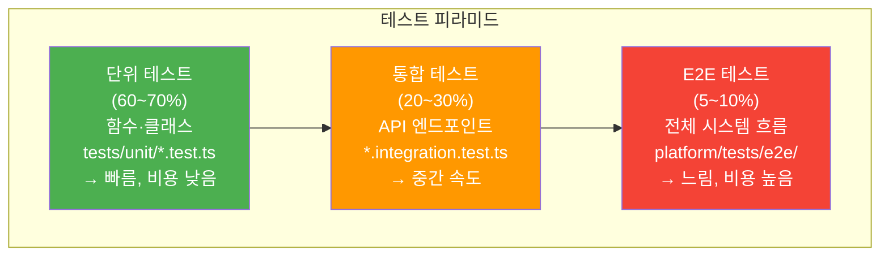
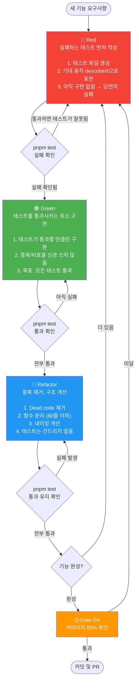

# 테스트 가이드 — Q-Gate G4 테스트 커버리지 80% 달성

> **문서 ID**: ONBOARD-03-TEST-01
> **버전**: 1.0.0 | **작성일**: 2026-04-12 | **작성자**: Implementer (Sonnet)
> **선행 학습**: `02-service-development.md`
> **소요 시간**: 3~4시간
> **CSAP**: D-12 (시스템 개발 보안 — 테스트 검증)

---

## 목차

1. [이 프로젝트의 테스트 전략](#1-이-프로젝트의-테스트-전략)
2. [테스트 도구와 파일 구조](#2-테스트-도구와-파일-구조)
3. [단위 테스트 작성법](#3-단위-테스트-작성법)
4. [외부 의존성 모킹](#4-외부-의존성-모킹)
5. [API 통합 테스트](#5-api-통합-테스트)
6. [테스트 커버리지 80% 달성 전략](#6-테스트-커버리지-80-달성-전략)
7. [테스트 명령어 참조](#7-테스트-명령어-참조)
8. [Q-Gate G4 실패 시 대처 방법](#8-q-gate-g4-실패-시-대처-방법)
9. [Claude Code로 테스트 생성 요청하기](#9-claude-code로-테스트-생성-요청하기)
10. [TDD 사이클 적용법](#10-tdd-사이클-적용법)
11. [변경 이력](#11-변경-이력)

---

## 1. 이 프로젝트의 테스트 전략

### 1.1 테스트 피라미드



### 1.2 각 테스트 계층 설명

| 계층 | 무엇을 테스트 | 위치 | 실행 시간 | Q-Gate 비중 |
|------|------------|------|---------|-----------|
| **단위 테스트** | 개별 함수, 클래스, 스키마 검증 | `tests/unit/*.test.ts` | ms 단위 | 60~70% |
| **통합 테스트** | API 라우트, DB 연동, Redis 연동 | `tests/integration/*.test.ts` | 초 단위 | 20~30% |
| **E2E 테스트** | 사용자 흐름 전체 (로그인 → 데이터 조회) | `platform/tests/e2e/` | 분 단위 | 5~10% |

### 1.3 Q-Gate G4 요건

```
Q-Gate G4: 테스트 커버리지 80% 이상 (필수)

측정 기준:
  - 라인 커버리지(line coverage): 80% 이상
  - 브랜치 커버리지(branch coverage): 80% 이상 (권장)

측정 도구: Vitest built-in coverage (v8 provider)
측정 범위: src/ 디렉토리 전체 (dist/, node_modules/ 제외)

실패 시: Tester 에이전트가 누락 케이스 보완 → Q-Gate 재검증
```

---

## 2. 테스트 도구와 파일 구조

### 2.1 Vitest — 이 프로젝트의 테스트 프레임워크

```typescript
// Vitest는 Vite 기반 TypeScript 네이티브 테스트 프레임워크입니다.
// Jest와 API가 거의 동일하지만 ESM을 기본 지원합니다.

import { describe, it, expect, vi, beforeEach, afterEach } from 'vitest';

// 주요 API:
// describe()   → 테스트 그룹 (논리적 묶음)
// it() / test() → 개별 테스트 케이스
// expect()     → 단언(assertion)
// vi.fn()      → 목(mock) 함수 생성
// vi.mock()    → 모듈 전체 모킹
// beforeEach() → 각 테스트 전 실행 (상태 초기화)
// afterEach()  → 각 테스트 후 실행 (정리)
```

### 2.2 표준 파일 구조

```
platform/services/auth-service/
├── src/
│   ├── handlers/
│   │   ├── login.handler.ts
│   │   └── session-invalidate.handler.ts
│   ├── lib/
│   │   ├── session.ts              ← 비즈니스 로직
│   │   └── totp.ts
│   ├── middleware/
│   │   └── rate-limit.middleware.ts
│   └── schemas/
│       └── login.schema.ts
│
└── tests/                          ← 테스트 디렉토리 (src와 분리)
    ├── unit/                       ← 단위 테스트
    │   ├── session.test.ts         ← session.ts 테스트
    │   ├── auth-csap.test.ts       ← CSAP 보안 요건 검증
    │   ├── mfa.test.ts
    │   ├── permissions.test.ts
    │   ├── schemas.test.ts         ← Zod 스키마 테스트
    │   └── totp.test.ts
    └── integration/                ← 통합 테스트
        ├── auth-flow.test.ts       ← API 흐름 통합 테스트
        └── auth-e2e-r4.test.ts
```

**규칙**:
- 파일명: `{대상파일명}.test.ts` (예: `session.ts` → `session.test.ts`)
- 위치: `tests/unit/` 또는 `tests/integration/` (src/ 내부에 섞지 않음)
- E2E: `platform/tests/e2e/scenarios/` (서비스 경계를 넘는 시나리오)

### 2.3 패키지별 테스트 구조

```
platform/packages/health/
└── tests/
    ├── health-checker.test.ts   ← HealthChecker 클래스 단위 테스트
    └── health-plugin.test.ts    ← Fastify 플러그인 통합 테스트

platform/packages/cache/
└── tests/ (없으면 작성 필요 — G4 실패!)

platform/packages/rate-limit/
└── tests/
    └── rate-limit.test.ts
```

---

## 3. 단위 테스트 작성법

### 3.1 기본 구조와 명명 규칙

```typescript
// tests/unit/session.test.ts
// Design Ref: DESIGN-MTU-P01 Section 4
// Plan SC: FR-P01.4, FR-P01.7
// CSAP: D-08-02 세션 관리, D-08-03 로그아웃, D-08-04 동시 접속 제한

import { describe, it, expect, vi, beforeEach } from 'vitest';

// 테스트 명명 패턴:
// describe(): "대상 함수/클래스 (CSAP 항목)"
// it(): "상황 설명: 기대 동작"

describe('세션 관리 (CSAP D-08-02, D-08-04)', () => {
  beforeEach(() => {
    vi.clearAllMocks();  // 각 테스트 전 mock 상태 초기화
  });

  it('createSession: 새 세션을 Redis 리스트에 추가한다', async () => {
    // Given (준비)
    // When (실행)
    // Then (검증)  ← AAA 패턴
  });
});
```

### 3.2 Zod 스키마 테스트 — 가장 간단한 단위 테스트

입력 검증은 CSAP D-12 요건입니다. Zod 스키마 테스트는 외부 의존성이 없어 작성이 쉽습니다.

```typescript
// tests/unit/schemas.test.ts
// Design Ref: SVC-AUTH-R1 DESIGN §2
// Plan SC: FR-AUTH.1
// CSAP: D-12 입력 검증

import { describe, it, expect } from 'vitest';
import { z } from 'zod';

// 실제 스키마를 직접 import하거나 테스트 파일 내에 재현
const loginSchema = z.object({
  email: z.string().email().max(255),
  password: z.string().min(1).max(128),
  tenantSlug: z.string().min(1).max(100),
  mfaCode: z.string().length(6).regex(/^\d+$/).optional(),
});

describe('CSAP D-12: 로그인 입력 검증', () => {
  it('유효한 로그인 요청을 허용한다', () => {
    const result = loginSchema.safeParse({
      email: 'admin@gov.kr',
      password: 'MyP@ssw0rd!',
      tenantSlug: 'gov-agency',
    });
    expect(result.success).toBe(true);
  });

  it('이메일 형식이 아닌 입력을 거부한다', () => {
    const result = loginSchema.safeParse({
      email: 'not-an-email',
      password: 'test',
      tenantSlug: 'test',
    });
    expect(result.success).toBe(false);
  });

  it('255자 초과 이메일을 거부한다 (자원 고갈 방지)', () => {
    expect(
      loginSchema.safeParse({
        email: 'a'.repeat(250) + '@g.kr',  // 256자
        password: 'test',
        tenantSlug: 'test',
      }).success
    ).toBe(false);
  });

  it('MFA 코드는 정확히 6자리 숫자여야 한다', () => {
    // 5자리 거부
    expect(
      loginSchema.safeParse({
        email: 'admin@gov.kr',
        password: 'pass',
        tenantSlug: 'gov',
        mfaCode: '12345',  // 5자리
      }).success
    ).toBe(false);

    // 6자리 허용
    expect(
      loginSchema.safeParse({
        email: 'admin@gov.kr',
        password: 'pass',
        tenantSlug: 'gov',
        mfaCode: '123456',  // 6자리
      }).success
    ).toBe(true);
  });
});
```

### 3.3 순수 함수 테스트

외부 의존성이 없는 순수 함수는 가장 테스트하기 쉽습니다.

```typescript
// tests/unit/totp.test.ts
// Design Ref: DESIGN-MTU-P01 Section 7 MFA
// Plan SC: FR-P01.8

import { describe, it, expect } from 'vitest';

describe('TOTP 유틸리티 테스트', () => {
  it('base32Encode/Decode 왕복 검증', async () => {
    const { base32Encode, base32Decode } = await import('../../src/lib/totp.js');

    const original = Buffer.from('Hello, World!');
    const encoded = base32Encode(original);
    const decoded = base32Decode(encoded);

    expect(decoded.toString()).toBe('Hello, World!');
  });

  it('generateTotp은 6자리 숫자를 생성한다', async () => {
    const { generateTotp, base32Decode } = await import('../../src/lib/totp.js');

    const secret = base32Decode('JBSWY3DPEHPK3PXP');
    const counter = Math.floor(Date.now() / 1000 / 30);
    const code = generateTotp(secret, counter);

    expect(code).toMatch(/^\d{6}$/);  // 정확히 6자리 숫자
  });
});
```

### 3.4 비밀번호 정책 검증 테스트 (CSAP D-08-07)

```typescript
// tests/unit/password-policy.test.ts
// CSAP: D-08-07 비밀번호 정책

import { describe, it, expect } from 'vitest';

// 비밀번호 정책 (src/lib/password.ts에서 가져오거나 재현)
const PASSWORD_MIN_LENGTH = 8;
const PASSWORD_REGEX =
  /^(?=.*[a-z])(?=.*[A-Z])(?=.*\d)(?=.*[!@#$%^&*()_+\-=[\]{};':"\\|,.<>/?]).+$/;

function validatePasswordPolicy(password: string): string | null {
  if (password.length < PASSWORD_MIN_LENGTH) {
    return `비밀번호는 최소 ${PASSWORD_MIN_LENGTH}자 이상이어야 합니다`;
  }
  if (!PASSWORD_REGEX.test(password)) {
    return '대문자, 소문자, 숫자, 특수문자를 각각 1개 이상 포함해야 합니다';
  }
  return null;
}

describe('CSAP D-08-07: 비밀번호 정책', () => {
  it('강력한 비밀번호는 허용된다', () => {
    expect(validatePasswordPolicy('MyP@ssw0rd!')).toBeNull();
    expect(validatePasswordPolicy('Abcdef1!')).toBeNull();
  });

  it('8자 미만 비밀번호를 거부한다', () => {
    expect(validatePasswordPolicy('Ab1!')).not.toBeNull();
  });

  it('숫자 없는 비밀번호를 거부한다', () => {
    expect(validatePasswordPolicy('MyPassword!')).not.toBeNull();
  });

  it('특수문자 없는 비밀번호를 거부한다', () => {
    expect(validatePasswordPolicy('MyPassword1')).not.toBeNull();
  });

  it('대문자 없는 비밀번호를 거부한다', () => {
    expect(validatePasswordPolicy('mypassword1!')).not.toBeNull();
  });
});
```

---

## 4. 외부 의존성 모킹

### 4.1 Redis(ioredis) 모킹

Redis는 실제 연결 없이 모킹하여 단위 테스트 속도를 높입니다.

```typescript
// tests/unit/session.test.ts (실제 코드)
import { describe, it, expect, vi, beforeEach } from 'vitest';

// Redis 모킹: vi.mock()을 파일 최상단에 선언
const mockRedis = {
  lrange: vi.fn().mockResolvedValue([]),
  lpop: vi.fn().mockResolvedValue(null),
  rpush: vi.fn().mockResolvedValue(1),
  expire: vi.fn().mockResolvedValue(1),
  set: vi.fn().mockResolvedValue('OK'),
  get: vi.fn().mockResolvedValue(null),
  lrem: vi.fn().mockResolvedValue(1),
  del: vi.fn().mockResolvedValue(1),
  ping: vi.fn().mockResolvedValue('PONG'),
};

vi.mock('ioredis', () => ({
  default: vi.fn(() => mockRedis),  // new Redis() → mockRedis 반환
}));

describe('세션 관리 (CSAP D-08-02, D-08-04)', () => {
  beforeEach(() => {
    vi.clearAllMocks();  // 테스트 간 mock 호출 기록 초기화
  });

  it('createSession: 새 세션을 Redis 리스트에 추가한다', async () => {
    const { createSession } = await import('../../src/lib/session.js');

    await createSession('user-1', {
      token: 'access-token-1',
      refreshToken: 'refresh-token-1',
      ip: '127.0.0.1',
      userAgent: 'test',
      createdAt: '2026-04-12T00:00:00.000Z',
    });

    // Redis RPUSH가 올바른 인수로 호출되었는지 검증
    expect(mockRedis.rpush).toHaveBeenCalledWith(
      'sessions:user-1',
      expect.stringContaining('access-token-1')
    );
  });

  it('동시 세션 3개 초과 시 가장 오래된 세션을 강제 만료한다', async () => {
    // Given: 이미 3개의 세션이 존재
    mockRedis.lrange.mockResolvedValueOnce([
      JSON.stringify({ token: 't1', refreshToken: 'r1', ip: '1.1.1.1', userAgent: 'a', createdAt: '' }),
      JSON.stringify({ token: 't2', refreshToken: 'r2', ip: '2.2.2.2', userAgent: 'b', createdAt: '' }),
      JSON.stringify({ token: 't3', refreshToken: 'r3', ip: '3.3.3.3', userAgent: 'c', createdAt: '' }),
    ]);
    mockRedis.lpop.mockResolvedValueOnce(
      JSON.stringify({ token: 't1', refreshToken: 'r1', ip: '1.1.1.1', userAgent: 'a', createdAt: '' })
    );

    const { createSession } = await import('../../src/lib/session.js');

    // When: 4번째 세션 생성 시도
    await createSession('user-1', {
      token: 'access-token-4',
      refreshToken: 'refresh-token-4',
      ip: '4.4.4.4',
      userAgent: 'test',
      createdAt: '2026-04-12T00:00:00.000Z',
    });

    // Then: 가장 오래된 세션 제거 + 블랙리스트 등록
    expect(mockRedis.lpop).toHaveBeenCalled();
    expect(mockRedis.set).toHaveBeenCalledWith(
      'blacklist:t1', '1', 'EX', expect.any(Number)
    );
  });

  it('blacklistToken: 토큰을 블랙리스트에 TTL과 함께 등록한다', async () => {
    const { blacklistToken } = await import('../../src/lib/session.js');

    await blacklistToken('some-access-token');

    expect(mockRedis.set).toHaveBeenCalledWith(
      'blacklist:some-access-token',
      '1',
      'EX',
      expect.any(Number)  // TTL 값 (7일 = 604800초)
    );
  });

  it('isTokenBlacklisted: 블랙리스트에 있으면 true를 반환한다', async () => {
    mockRedis.get.mockResolvedValueOnce('1');  // 블랙리스트에 존재
    const { isTokenBlacklisted } = await import('../../src/lib/session.js');

    const result = await isTokenBlacklisted('blocked-token');
    expect(result).toBe(true);
  });

  it('isTokenBlacklisted: 블랙리스트에 없으면 false를 반환한다', async () => {
    mockRedis.get.mockResolvedValueOnce(null);  // 블랙리스트에 없음
    const { isTokenBlacklisted } = await import('../../src/lib/session.js');

    const result = await isTokenBlacklisted('valid-token');
    expect(result).toBe(false);
  });
});
```

### 4.2 Prisma 모킹

```typescript
// tests/unit/permissions.test.ts
import { describe, it, expect, vi, beforeEach } from 'vitest';

// Prisma 모킹: lib/prisma.ts의 prisma 인스턴스를 교체
const mockPrisma = {
  rolePermission: {
    findMany: vi.fn(),
  },
  user: {
    findUnique: vi.fn(),
    create: vi.fn(),
    update: vi.fn(),
  },
};

vi.mock('../../src/lib/prisma.js', () => ({
  prisma: mockPrisma,
}));

describe('getUserPermissions (CSAP D-08-05)', () => {
  beforeEach(() => {
    vi.clearAllMocks();
  });

  it('역할에 매핑된 권한 목록을 반환한다', async () => {
    mockPrisma.rolePermission.findMany.mockResolvedValueOnce([
      { role: 'SUPER_ADMIN', permission: { name: 'admin:all' } },
      { role: 'SUPER_ADMIN', permission: { name: 'audit:read' } },
    ]);

    const { getUserPermissions } = await import('../../src/lib/permissions.js');
    const permissions = await getUserPermissions('SUPER_ADMIN');

    expect(permissions).toEqual(['admin:all', 'audit:read']);
    expect(mockPrisma.rolePermission.findMany).toHaveBeenCalledWith({
      where: { role: 'SUPER_ADMIN' },
      include: { permission: true },
      take: 200,  // CSAP D-10: 방어 코딩 — 최대 200개 제한
    });
  });

  it('권한이 없는 역할은 빈 배열을 반환한다', async () => {
    mockPrisma.rolePermission.findMany.mockResolvedValueOnce([]);

    const { getUserPermissions } = await import('../../src/lib/permissions.js');
    const permissions = await getUserPermissions('VIEWER');

    expect(permissions).toEqual([]);
  });
});
```

### 4.3 환경 변수 모킹

```typescript
// 테스트 내에서 환경 변수를 임시 설정
describe('환경 변수 의존 코드', () => {
  it('JWT_SECRET 없을 때 오류를 던진다', () => {
    const original = process.env['JWT_SECRET'];
    delete process.env['JWT_SECRET'];

    expect(() => {
      // JWT_SECRET을 사용하는 함수 호출
    }).toThrow('JWT_SECRET 환경 변수 누락');

    // 복원
    if (original) process.env['JWT_SECRET'] = original;
  });
});
```

---

## 5. API 통합 테스트

### 5.1 Fastify inject 방식

통합 테스트는 실제 HTTP 요청 없이 Fastify의 `inject()` 메서드로 처리합니다. 실제 서버를 시작하지 않아 포트 충돌이 없습니다.

```typescript
// tests/integration/auth-flow.test.ts (참고용 패턴)
// Plan SC: FR-AUTH.7
// CSAP: D-12 시스템 개발 보안 — 통합 테스트

import { describe, it, expect, vi } from 'vitest';

// 실제 Fastify 앱 import 대신 스키마 로직 재현
// (ESM 모듈 경계로 인해 직접 inject보다 로직 검증이 실용적)

describe('FR-AUTH.3: Rate Limiting 로직 검증', () => {
  it('Rate Limit 설정 값이 올바르다', () => {
    const loginConfig = { max: 10, windowSeconds: 60 };
    const passwordConfig = { max: 5, windowSeconds: 300 };

    expect(loginConfig.max).toBe(10);
    expect(passwordConfig.max).toBe(5);
    expect(passwordConfig.windowSeconds).toBe(300);
  });

  it('Rate Limit 초과 시 429 응답 형식이 올바르다', () => {
    const response = {
      success: false,
      error: {
        code: 'RATE_LIMIT_EXCEEDED',
        message: '요청 한도를 초과했습니다. 잠시 후 다시 시도하세요.',
        retryAfter: 45,
      },
    };

    expect(response.success).toBe(false);
    expect(response.error.code).toBe('RATE_LIMIT_EXCEEDED');
    expect(response.error.retryAfter).toBeGreaterThan(0);
  });

  it('X-RateLimit 헤더가 올바르게 구성된다', () => {
    const headers = {
      'X-RateLimit-Limit': '10',
      'X-RateLimit-Remaining': '7',
      'X-RateLimit-Reset': String(Math.floor(Date.now() / 1000) + 45),
    };

    expect(parseInt(headers['X-RateLimit-Limit'])).toBe(10);
    expect(parseInt(headers['X-RateLimit-Remaining'])).toBeLessThanOrEqual(10);
    expect(parseInt(headers['X-RateLimit-Reset'])).toBeGreaterThan(
      Math.floor(Date.now() / 1000)
    );
  });
});
```

### 5.2 서비스 간 HMAC 토큰 검증 테스트

```typescript
// tests/integration/auth-flow.test.ts
// Design Ref: SVC-AUTH-R1 DESIGN §6
// Plan SC: FR-AUTH.4 서비스 간 인증

import { describe, it, expect } from 'vitest';
import crypto from 'node:crypto';

describe('FR-AUTH.4: 서비스 간 HMAC 인증', () => {
  const SERVICE_KEY = 'test-internal-service-key';

  function generateServiceToken(serviceName: string, path: string): string {
    const timestamp = Math.floor(Date.now() / 1000);
    const message = `${serviceName}:${timestamp}:${path}`;
    const hmac = crypto
      .createHmac('sha256', SERVICE_KEY)
      .update(message)
      .digest('hex');
    return `${serviceName}:${timestamp}:${hmac}`;
  }

  it('유효한 서비스 토큰은 3개 파트로 구성된다', () => {
    const token = generateServiceToken('user-service', '/auth/sessions/invalidate');
    const parts = token.split(':');

    expect(parts).toHaveLength(3);
    expect(parts[0]).toBe('user-service');
    expect(Number(parts[1])).toBeGreaterThan(0);  // 유효한 타임스탬프
    expect(parts[2]).toHaveLength(64);  // SHA-256 hex = 64자
  });

  it('만료된 타임스탬프(5분 초과)는 거부된다', () => {
    const expiredTimestamp = Math.floor(Date.now() / 1000) - 301;  // 5분 1초 전
    const now = Math.floor(Date.now() / 1000);
    const age = Math.abs(now - expiredTimestamp);

    expect(age).toBeGreaterThan(300);  // 만료됨
  });

  it('잘못된 형식의 토큰은 파싱할 수 없다', () => {
    const invalidToken = 'invalid-format';
    expect(invalidToken.split(':').length).not.toBe(3);
  });
});
```

### 5.3 Fastify inject을 사용한 진짜 통합 테스트 패턴

실제 Fastify 앱 인스턴스를 테스트하는 방법입니다.

```typescript
// tests/integration/health.test.ts
import { describe, it, expect, beforeAll, afterAll } from 'vitest';
import Fastify from 'fastify';

// 테스트용 앱 팩토리 (전체 의존성 없이 필요한 플러그인만)
async function buildTestApp() {
  const app = Fastify({ logger: false });

  // 헬스체크 라우트만 등록
  app.get('/health', async () => ({ status: 'ok' }));

  await app.ready();
  return app;
}

describe('헬스체크 API', () => {
  let app: ReturnType<typeof Fastify>;

  beforeAll(async () => {
    app = await buildTestApp();
  });

  afterAll(async () => {
    await app.close();  // 연결 정리
  });

  it('GET /health → 200 OK', async () => {
    const response = await app.inject({
      method: 'GET',
      url: '/health',
    });

    expect(response.statusCode).toBe(200);
    const body = JSON.parse(response.body);
    expect(body.status).toBe('ok');
  });

  it('존재하지 않는 라우트 → 404', async () => {
    const response = await app.inject({
      method: 'GET',
      url: '/not-found',
    });

    expect(response.statusCode).toBe(404);
  });
});
```

---

## 6. 테스트 커버리지 80% 달성 전략

### 6.1 커버리지 측정 방법

```bash
# 커버리지 포함 테스트 실행
cd platform/services/auth-service
pnpm test:coverage

# 출력 예시:
# ✓ tests/unit/session.test.ts (6)
# ✓ tests/unit/auth-csap.test.ts (15)
# ✓ tests/unit/schemas.test.ts (8)
# ✓ tests/integration/auth-flow.test.ts (12)
#
# Coverage report:
#  File                   | % Stmts | % Branch | % Funcs | % Lines
#  src/lib/session.ts     |   95.2  |   88.9   |  100.0  |   95.2
#  src/lib/permissions.ts |   82.1  |   75.0   |   90.0  |   82.1
#  src/handlers/login.ts  |   78.5  |   70.0   |   85.7  |   78.5
#  All files              |   85.1  |   78.2   |   91.7  |   85.1
#                                     ↑ G4 통과!
```

### 6.2 커버리지 설정 (vitest.config.ts 추가)

```typescript
// vitest.config.ts (서비스별 추가)
import { defineConfig } from 'vitest/config';

export default defineConfig({
  test: {
    include: ['tests/**/*.test.ts'],
    coverage: {
      provider: 'v8',
      reporter: ['text', 'json', 'html'],
      include: ['src/**/*.ts'],
      exclude: [
        'src/index.ts',      // 진입점 (테스트 불필요)
        'src/**/*.d.ts',     // 타입 정의 파일
        'src/**/types.ts',   // 타입만 있는 파일
      ],
      thresholds: {
        lines: 80,           // G4 요건: 80% 이상
        branches: 80,
        functions: 80,
        statements: 80,
      },
    },
  },
});
```

### 6.3 커버리지 80% 달성 체계적 접근법

```
낮은 커버리지 파일 발견 시 우선순위:

1. 비즈니스 로직 핵심 파일 (session.ts, auth.ts 등)
   → 단위 테스트로 모든 분기 커버

2. Zod 스키마 파일 (*.schema.ts)
   → 유효/무효 입력 각각 테스트 → 빠른 커버리지 향상

3. 유틸리티 함수 (crypto, format 등)
   → 정상 케이스 + 엣지 케이스 테스트

4. 에러 핸들링 분기
   → throw 구문, catch 블록 테스트 → 브랜치 커버리지 향상

우선 제외:
  - index.ts (서버 시작 코드)
  - 타입 정의 파일 (*.d.ts, types.ts)
  - 설정 파일 (config.ts)
```

### 6.4 커버리지 향상 예시 — 분기 커버리지

```typescript
// src/lib/session.ts 내 분기 (branch):
async function createSession(userId: string, data: SessionData) {
  const sessions = await redis.lrange(key, 0, -1);

  if (sessions.length >= MAX_CONCURRENT_SESSIONS) {  // ← 분기 1
    const oldest = await redis.lpop(key);
    if (oldest) {  // ← 분기 2: oldest가 null일 수 있음
      // ...
    }
  }
  // ...
}

// 분기 커버리지를 위해 두 경로 모두 테스트:
it('세션 수가 한도 미만일 때 기존 세션을 유지한다', ...);    // 분기 1 false
it('세션 수가 한도 도달 시 가장 오래된 세션을 제거한다', ...); // 분기 1 true, 분기 2 true
it('세션 수 도달 시 lpop이 null 반환해도 오류가 없다', ...);  // 분기 1 true, 분기 2 false
```

---

## 7. 테스트 명령어 참조

### 7.1 개별 서비스 테스트

```bash
# 서비스 디렉토리로 이동
cd platform/services/auth-service

# 전체 테스트 실행 (CI/CD 동일 방식)
pnpm test

# 감시 모드 (파일 변경 시 자동 재실행 — 개발 중 권장)
pnpm test:watch

# 커버리지 포함 실행
pnpm test:coverage

# 특정 파일만 실행
pnpm test tests/unit/session.test.ts

# 특정 테스트 이름 패턴으로 필터링
pnpm test --reporter verbose -t "블랙리스트"

# 실패한 테스트만 재실행
pnpm test --reporter verbose --bail
```

### 7.2 루트에서 전체 테스트

```bash
# 모노레포 루트에서 모든 서비스 테스트 실행
pnpm -r test

# 특정 패키지만
pnpm --filter @public-saas/auth-service test

# 병렬 실행 (CI 환경)
pnpm -r --parallel test
```

### 7.3 E2E 테스트 실행

```bash
cd platform/tests/e2e

# E2E 테스트 실행 (실제 서비스가 실행 중이어야 함)
pnpm test

# 특정 시나리오만
pnpm test scenarios/auth-flow.e2e.test.ts
```

### 7.4 테스트 결과 해석

```bash
# 정상 출력 예시
✓ tests/unit/session.test.ts (6 tests) 45ms
✓ tests/unit/auth-csap.test.ts (15 tests) 12ms
✓ tests/unit/schemas.test.ts (8 tests) 8ms
✓ tests/integration/auth-flow.test.ts (12 tests) 23ms

Test Files  4 passed (4)
Tests       41 passed (41)
Duration    88ms

# 실패 출력 예시
✗ tests/unit/session.test.ts (1 failed)
  ✗ isTokenBlacklisted: 블랙리스트에 있으면 true를 반환한다
    AssertionError: expected false to be true
    → Redis mock이 'null'을 반환하도록 설정됨
    → mockRedis.get.mockResolvedValueOnce('1') 추가 필요
```

---

## 8. Q-Gate G4 실패 시 대처 방법

### 8.1 G4 실패 체크리스트

```
Q-Gate G4 실패 → 아래 순서로 진단:

□ 1. 어떤 파일의 커버리지가 80% 미만인가?
     pnpm test:coverage 후 Coverage Report 확인

□ 2. 미커버 라인/분기 식별
     coverage/index.html 열어서 빨간색 라인 확인
     (pnpm test:coverage 후 coverage/lcov-report/index.html)

□ 3. 누락된 테스트 케이스 식별
     빨간색 라인이 어떤 실행 경로인지 파악

□ 4. 테스트 추가 후 재실행
     pnpm test:coverage

□ 5. 80% 달성 확인 후 G4 재검증
```

### 8.2 흔한 실패 원인과 해결

```typescript
// 실패 원인 1: 에러 처리 분기 미커버
async function updateUser(id: string, data: unknown) {
  try {
    return await prisma.user.update({ where: { id }, data });
  } catch (error) {           // ← 이 분기가 테스트되지 않음
    logger.error('업데이트 실패', error);
    throw error;
  }
}

// 해결: 에러 케이스 테스트 추가
it('DB 오류 시 에러를 던진다', async () => {
  mockPrisma.user.update.mockRejectedValueOnce(new Error('DB 연결 실패'));

  await expect(updateUser('user-1', {})).rejects.toThrow('DB 연결 실패');
});
```

```typescript
// 실패 원인 2: 조건 분기 한쪽만 테스트
function isAdmin(role: string): boolean {
  if (role === 'SUPER_ADMIN' || role === 'ADMIN') {  // ← 두 조건 모두 테스트해야 함
    return true;
  }
  return false;
}

// 해결: 모든 경우 테스트
it('SUPER_ADMIN은 관리자이다', () => expect(isAdmin('SUPER_ADMIN')).toBe(true));
it('ADMIN은 관리자이다', () => expect(isAdmin('ADMIN')).toBe(true));
it('USER는 관리자가 아니다', () => expect(isAdmin('USER')).toBe(false));
```

### 8.3 커버리지 제외 처리 (정당한 경우)

```typescript
// 완전히 테스트 불가능한 코드 (예: 프로세스 시그널 핸들러)
// 제외 주석 추가 — 남용 금지!
/* istanbul ignore next */
process.on('SIGTERM', () => {
  server.close();
  process.exit(0);
});
```

---

## 9. Claude Code로 테스트 생성 요청하기

### 9.1 효과적인 프롬프트 패턴

Claude Code에 테스트 작성을 요청할 때 구체적인 컨텍스트를 제공하면 품질 높은 테스트를 받을 수 있습니다.

```
[프롬프트 예시 1 — 단위 테스트]

platform/services/auth-service/src/lib/session.ts의 단위 테스트를 작성해주세요.

테스트 조건:
- 파일 위치: tests/unit/session.test.ts
- 프레임워크: Vitest
- Redis는 vi.mock('ioredis')로 모킹
- 커버할 함수: createSession, removeSession, blacklistToken, isTokenBlacklisted
- CSAP D-08-02, D-08-03, D-08-04 요건 주석 포함
- AAA 패턴 (Given/When/Then) 사용
- 동시 세션 제한(3개) 경계 케이스 포함
```

```
[프롬프트 예시 2 — 스키마 테스트]

platform/services/auth-service/src/schemas/login.schema.ts의 Zod 스키마
테스트를 tests/unit/schemas.test.ts에 작성해주세요.

요구사항:
- 유효한 입력 (이메일, 비밀번호, tenantSlug, MFA 코드 선택)
- 각 필드별 무효 케이스 (형식 오류, 길이 초과, 빈 값)
- CSAP D-12 입력 검증 주석
- 경계값 테스트 (최대 길이 등)
```

```
[프롬프트 예시 3 — 커버리지 향상]

다음 파일의 테스트 커버리지가 65%입니다. 80%로 올리고 싶습니다:
platform/services/billing-service/src/lib/invoice.ts

현재 커버되지 않은 라인:
- 45-52: 할인 계산 로직 (조건 4가지)
- 78-85: 세금 계산 예외 처리
- 103: 최대 금액 초과 검증

해당 케이스들을 커버하는 테스트를 추가해주세요.
```

### 9.2 테스트 리뷰 요청

```
[Reviewer 에이전트 호출 예시]

tests/unit/session.test.ts 파일을 리뷰해주세요:
1. 모든 분기가 커버되는가?
2. CSAP D-08 요건이 검증되는가?
3. mock이 올바르게 설정되었는가?
4. 테스트 명명이 명확한가?
```

### 9.3 잘못된 프롬프트 vs 올바른 프롬프트

```
[좋지 않은 프롬프트]
"session.ts 테스트 써줘"
→ 컨텍스트 부족, 품질 낮은 테스트 생성

[좋은 프롬프트]
"platform/services/auth-service/src/lib/session.ts의 단위 테스트를
 tests/unit/session.test.ts에 Vitest로 작성해주세요.
 Redis는 vi.mock('ioredis')로 모킹하고,
 createSession의 동시 세션 3개 초과 케이스를 반드시 포함하며,
 CSAP D-08-04 요건 주석을 달아주세요."
→ 명확한 위치, 도구, 요건 → 정확한 테스트 생성
```

---

## 10. TDD 사이클 적용법

### 10.1 TDD 사이클 다이어그램



### 10.2 TDD 실습 예제 — blacklistToken 구현

```typescript
// ── Step 1: Red — 실패하는 테스트 먼저 작성 ──

// tests/unit/session.test.ts
it('blacklistToken: 토큰을 블랙리스트에 TTL과 함께 등록한다', async () => {
  const { blacklistToken } = await import('../../src/lib/session.js');

  await blacklistToken('test-token-123');

  expect(mockRedis.set).toHaveBeenCalledWith(
    'blacklist:test-token-123',
    '1',
    'EX',
    604800  // 7일
  );
});

// 실행: pnpm test → 실패 (session.ts에 blacklistToken 없음)
```

```typescript
// ── Step 2: Green — 최소 구현 ──

// src/lib/session.ts
export async function blacklistToken(token: string): Promise<void> {
  await redis.set(`blacklist:${token}`, '1', 'EX', 604800);
}

// 실행: pnpm test → 통과
```

```typescript
// ── Step 3: Refactor — 상수 추출, 구조 개선 ──

// 하드코딩된 604800을 상수로 추출
const BLACKLIST_TTL = AUTH_CONSTANTS.REFRESH_TOKEN_EXPIRES_SECONDS;

export async function blacklistToken(token: string): Promise<void> {
  await redis.set(BLACKLIST_KEY(token), '1', 'EX', BLACKLIST_TTL);
}

// 실행: pnpm test → 여전히 통과 (리팩토링이 동작을 바꾸지 않음)
```

### 10.3 새 기능 개발 시 TDD 적용 요령

```
신규 서비스 기능 추가 순서:

1. Plan 문서에서 FR ID 확인
   예: FR-U10.2 사용자 프로필 수정

2. 테스트 파일 먼저 생성
   tests/unit/profile.test.ts

3. describe/it 구조 작성 (아직 비어있는 상태)
   describe('updateProfile (FR-U10.2)', () => {
     it('유효한 프로필 수정 요청을 처리한다', async () => {});
     it('존재하지 않는 사용자 ID면 오류를 반환한다', async () => {});
     it('이름이 빈 문자열이면 입력 검증 실패한다', async () => {});
   })

4. 테스트 구현 (Red)
5. 소스 구현 (Green)
6. 리팩토링 (Refactor)
7. pnpm test:coverage → 80% 확인
```

---

## 11. 변경 이력

| 버전 | 일자 | 내용 | 작성자 |
|------|------|------|--------|
| 1.0.0 | 2026-04-12 | 최초 작성 | Implementer (Sonnet) |
