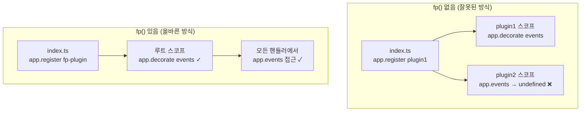
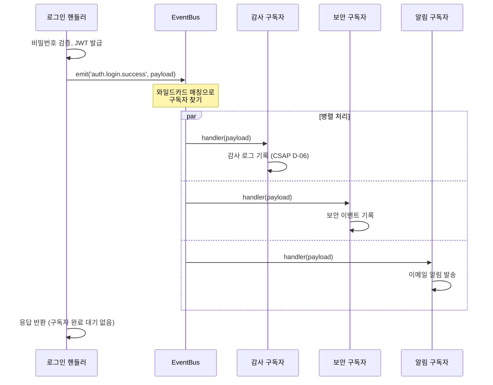
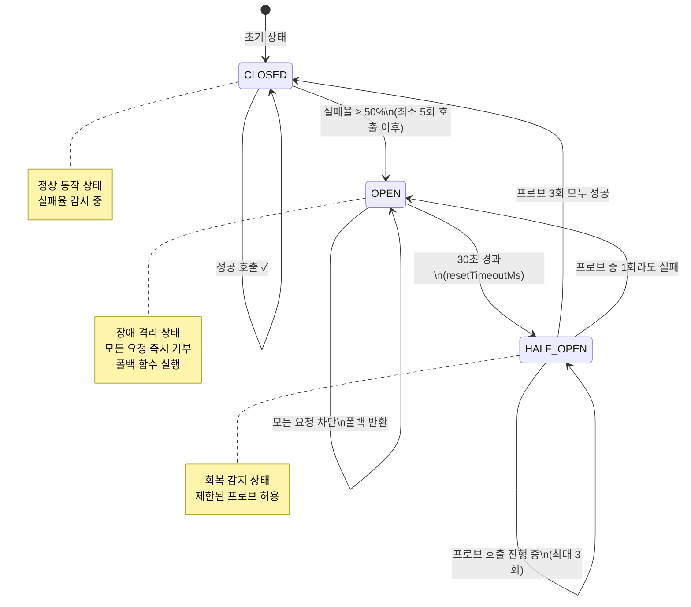
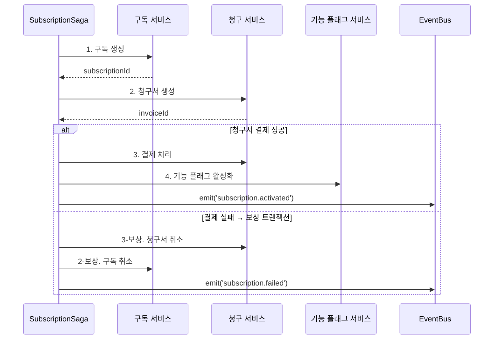

# 고급 TypeScript 패턴

> **문서 ID**: ONBOARD-03-04
> **버전**: 1.0.0 | **작성일**: 2026-04-12 | **작성자**: Implementer (Sonnet)
> **선행 학습**: `03-development/02-service-development.md`
> **소요 시간**: 약 5~7시간 (실습 포함)

---

## 목차

1. [Fastify 플러그인 패턴 (의존성 주입 대체)](#1-fastify-플러그인-패턴)
2. [Repository 패턴 (Prisma 추상화)](#2-repository-패턴)
3. [Event-Driven 패턴 (event-bus 사용)](#3-event-driven-패턴)
4. [Circuit Breaker 패턴 (외부 서비스 장애 격리)](#4-circuit-breaker-패턴)
5. [Saga 패턴 (분산 트랜잭션)](#5-saga-패턴)
6. [CQRS 가벼운 적용 (읽기/쓰기 분리)](#6-cqrs-가벼운-적용)
7. [변경 이력](#7-변경-이력)

---

## 1. Fastify 플러그인 패턴

### 1.1 언제 사용하는가

Java Spring의 `@Autowired`, NestJS의 DI 컨테이너처럼 **의존성을 외부에서 주입**하고 싶을 때 사용합니다. 이 프로젝트는 NestJS를 사용하지 않으므로, Fastify의 플러그인 시스템이 그 역할을 대신합니다.

**사용 시점**:
- 여러 라우트 핸들러에서 공유해야 하는 인스턴스 (DB 클라이언트, 이벤트 버스 등)
- 서비스 초기화 로직을 `index.ts`에서 분리하고 싶을 때
- 플러그인 간 의존 관계가 명확할 때 (`fastify-plugin`의 `dependencies` 옵션 사용)

**사용하지 않는 경우**:
- 핸들러 내부에서만 사용하는 일회성 인스턴스
- 단순한 유틸리티 함수 (순수 함수는 그냥 `import`면 충분)

### 1.2 실제 코드 예시 — event-bus 플러그인

`platform/packages/event-bus/src/event-bus-plugin.ts`에서 가져온 패턴입니다.

```typescript
// platform/packages/event-bus/src/event-bus-plugin.ts
// Design Ref: SVC-EVENT-R17 Plan
// CSAP: D-06 침해사고 관리

import type { FastifyInstance, FastifyPluginOptions } from 'fastify';
import fp from 'fastify-plugin';
import { EventBus, type EventBusOptions } from './event-bus.js';

// ① Fastify 타입 확장: app.events 로 접근 가능하게 만들기
declare module 'fastify' {
  interface FastifyInstance {
    events: EventBus;
  }
}

// ② 플러그인 구현부
async function eventBusPluginImpl(
  app: FastifyInstance,
  opts: EventBusOptions,
): Promise<void> {
  const bus = new EventBus({
    maxRetries: opts.maxRetries,
    retryBaseDelay: opts.retryBaseDelay,
  });

  // ③ Fastify 인스턴스에 'events' 이름으로 버스 등록
  app.decorate('events', bus);

  // ④ 서버 종료 시 리스너 정리 (메모리 누수 방지)
  app.addHook('onClose', async () => {
    bus.removeAllListeners();
  });
}

// ⑤ fp()로 감싸야 부모 스코프까지 데코레이터가 전파됨
export const eventBusPlugin = fp(eventBusPluginImpl, {
  name: '@public-saas/event-bus',
  fastify: '5.x',
});
```

**`fp()` 없이 등록하면 왜 안 되는가?**

Fastify는 플러그인을 캡슐화합니다. `fp()` 없이 등록하면 `app.decorate('events', bus)`로 추가한 `events`가 해당 플러그인 스코프에만 존재합니다. 다른 플러그인에서 `app.events`에 접근하면 `undefined`가 됩니다. `fp()`는 이 캡슐화를 해제하여 부모 스코프까지 데코레이터가 올라가게 합니다.



### 1.3 서비스에서 플러그인 사용하기

```typescript
// platform/services/auth-service/src/index.ts
import { eventBusPlugin } from '@public-saas/event-bus';

async function main(): Promise<void> {
  const app = Fastify({ logger: true });

  // 플러그인 등록 (순서 중요: 의존성이 있는 플러그인 먼저)
  await app.register(eventBusPlugin, {
    maxRetries: 3,
    retryBaseDelay: 100,
  });

  // 이제 모든 핸들러에서 app.events 사용 가능
  await registerAuthRoutes(app);
  await app.listen({ port: 3001, host: '0.0.0.0' });
}
```

```typescript
// 핸들러에서 이벤트 버스 사용
export async function loginHandler(
  request: FastifyRequest,
  reply: FastifyReply,
): Promise<void> {
  // ... 로그인 처리 ...

  // Fastify 인스턴스를 통해 event bus 접근
  await request.server.events.emit('auth.login.success', {
    userId: user.id,
    tenantId: tenant.id,
    ip: request.ip,
  });
}
```

### 1.4 안티패턴 — 하지 말아야 할 것

```typescript
// ❌ 안티패턴 1: 모듈 수준 싱글톤 (테스트 격리 불가)
// 이렇게 하면 테스트 실행 시 상태가 공유되어 테스트 간 간섭 발생
export const globalEventBus = new EventBus(); // 절대 금지

// ❌ 안티패턴 2: fp() 없이 decorate
async function badPlugin(app: FastifyInstance): Promise<void> {
  app.decorate('myService', new MyService()); // 다른 플러그인에서 접근 불가
}
app.register(badPlugin); // fp() 없이 등록

// ❌ 안티패턴 3: 플러그인 등록 순서 무시
await app.register(authRoutes);      // authRoutes가 eventBusPlugin 필요
await app.register(eventBusPlugin);  // 너무 늦게 등록 → 런타임 에러

// ✅ 올바른 방식: 의존성 선언
export const authRoutesPlugin = fp(authRoutesImpl, {
  name: 'auth-routes',
  dependencies: ['@public-saas/event-bus'], // 명시적 의존성 선언
});
```

---

## 2. Repository 패턴

### 2.1 언제 사용하는가

**Repository 패턴**은 데이터 접근 로직을 비즈니스 로직에서 분리합니다. 핸들러가 Prisma를 직접 호출하지 않고, Repository라는 중간 계층을 통해 데이터에 접근합니다.

**사용 시점**:
- 동일한 쿼리 로직이 여러 핸들러에서 반복될 때
- 비즈니스 로직 단위 테스트 시 DB를 Mock으로 대체하고 싶을 때
- 쿼리 복잡도가 높아 핸들러가 비대해질 때

**사용하지 않는 경우**:
- 간단한 단일 쿼리 (직접 `prisma.xxx.findUnique()` 호출이 더 명확)
- 프로토타이핑 단계 (오버엔지니어링)

### 2.2 실제 코드 예시 — UserRepository

```typescript
// platform/services/auth-service/src/repositories/user.repository.ts
// CSAP: D-08 접근 통제, D-12 입력 검증

import { type PrismaClient, type User, type UserRole } from '@prisma/client';

/**
 * 사용자 생성 시 필요한 데이터
 */
export interface CreateUserData {
  tenantId: string;
  email: string;
  name: string;
  passwordHash: string;
  role: UserRole;
}

/**
 * 사용자 Repository
 *
 * 모든 사용자 관련 DB 쿼리는 이 클래스를 통해 실행합니다.
 * 핸들러가 Prisma를 직접 참조하지 않도록 추상화합니다.
 */
export class UserRepository {
  constructor(private readonly prisma: PrismaClient) {}

  /**
   * 이메일 + 테넌트 ID로 사용자 조회
   */
  async findByEmailAndTenant(
    email: string,
    tenantId: string,
  ): Promise<User | null> {
    return this.prisma.user.findUnique({
      where: { tenantId_email: { tenantId, email } },
    });
  }

  /**
   * 사용자 ID로 조회
   */
  async findById(id: string): Promise<User | null> {
    return this.prisma.user.findUnique({
      where: { id },
    });
  }

  /**
   * 테넌트 내 전체 사용자 목록 (페이지네이션)
   */
  async findAllByTenant(
    tenantId: string,
    page: number,
    pageSize: number,
  ): Promise<{ users: User[]; total: number }> {
    const [users, total] = await this.prisma.$transaction([
      this.prisma.user.findMany({
        where: { tenantId },
        skip: (page - 1) * pageSize,
        take: pageSize,
        orderBy: { createdAt: 'desc' },
      }),
      this.prisma.user.count({ where: { tenantId } }),
    ]);

    return { users, total };
  }

  /**
   * 사용자 생성
   */
  async create(data: CreateUserData): Promise<User> {
    return this.prisma.user.create({ data });
  }

  /**
   * 로그인 실패 횟수 증가
   *
   * 5회 초과 시 30분 잠금 (CSAP D-08-06)
   */
  async incrementFailedLogins(userId: string): Promise<void> {
    const user = await this.prisma.user.findUnique({
      where: { id: userId },
      select: { failedLogins: true },
    });

    const newCount = (user?.failedLogins ?? 0) + 1;
    const lockedUntil = newCount >= 5
      ? new Date(Date.now() + 30 * 60 * 1000) // 30분 잠금
      : null;

    await this.prisma.user.update({
      where: { id: userId },
      data: { failedLogins: newCount, lockedUntil },
    });
  }

  /**
   * 로그인 성공 시 실패 횟수 초기화
   */
  async resetFailedLogins(userId: string): Promise<void> {
    await this.prisma.user.update({
      where: { id: userId },
      data: {
        failedLogins: 0,
        lockedUntil: null,
        lastLoginAt: new Date(),
      },
    });
  }
}
```

### 2.3 핸들러에서 Repository 사용

```typescript
// platform/services/auth-service/src/handlers/login.handler.ts
import { UserRepository } from '../repositories/user.repository.js';
import { prisma } from '../lib/prisma.js';

// Repository 인스턴스 생성 (Fastify 플러그인으로 주입하는 방식도 가능)
const userRepository = new UserRepository(prisma);

export async function loginHandler(
  request: FastifyRequest,
  reply: FastifyReply,
): Promise<void> {
  const { email, tenantSlug } = parseResult.data;

  // ✅ Repository를 통해 DB 접근 (Prisma 직접 호출 아님)
  const user = await userRepository.findByEmailAndTenant(email, tenant.id);

  if (!user) {
    await reply.status(401).send({ error: '인증 실패' });
    return;
  }

  // ... 비밀번호 검증, JWT 발급 ...
  await userRepository.resetFailedLogins(user.id);
}
```

### 2.4 안티패턴 — 하지 말아야 할 것

```typescript
// ❌ 안티패턴 1: 핸들러에서 복잡한 쿼리 직접 작성
export async function getUserStatsHandler(request, reply) {
  // 이 쿼리가 다른 핸들러에서도 필요해지면 중복이 발생
  const stats = await prisma.user.groupBy({
    by: ['role'],
    where: { tenantId: request.user.tenantId },
    _count: { id: true },
  });
  // ...
}

// ❌ 안티패턴 2: Repository에 HTTP 관련 코드 포함
export class BadUserRepository {
  async findUser(request: FastifyRequest) { // HTTP 레이어 의존 금지
    const tenantId = request.headers['x-tenant-id'];
    return this.prisma.user.findFirst({ where: { tenantId } });
  }
}

// ✅ Repository는 순수 데이터 접근 로직만 포함
export class GoodUserRepository {
  async findUser(tenantId: string, email: string) {
    return this.prisma.user.findUnique({
      where: { tenantId_email: { tenantId, email } },
    });
  }
}
```

---

## 3. Event-Driven 패턴

### 3.1 언제 사용하는가

**Event-Driven 패턴**은 서비스 내 컴포넌트들을 느슨하게 결합(loose coupling)하는 방법입니다. A 작업이 완료된 후 B 작업을 직접 호출하지 않고, 이벤트를 발행하여 관심 있는 구독자들이 반응하게 합니다.

**사용 시점**:
- 메인 작업 완료 후 부수 효과(사이드 이펙트)를 처리해야 할 때
  - 예: 로그인 성공 → 감사 로그 기록 + 알림 발송 + 보안 모니터링 갱신
- 처리 실패가 메인 응답에 영향을 주면 안 될 때
- 여러 컴포넌트가 동일 이벤트에 반응해야 할 때

**사용하지 않는 경우**:
- 응답 전 반드시 완료되어야 하는 작업 (직접 호출 또는 `$transaction`)
- 단순한 함수 호출로 충분한 경우

### 3.2 이벤트 흐름 다이어그램



### 3.3 실제 코드 예시 — event-bus 사용

```typescript
// platform/packages/event-bus/src/event-bus.ts 기반

// ① 이벤트 타입 정의 (타입 안전성 확보)
export interface AuthLoginSuccessEvent {
  userId: string;
  tenantId: string;
  ip: string;
  userAgent: string;
  timestamp: string;
}

export interface AuthLoginFailEvent {
  email: string;
  tenantId: string;
  ip: string;
  reason: string;
  timestamp: string;
}

// ② 이벤트 구독 설정 (서비스 초기화 시)
// platform/services/auth-service/src/index.ts

async function setupEventSubscribers(app: FastifyInstance): Promise<void> {
  const bus = app.events;

  // 로그인 성공 이벤트 구독
  bus.on<AuthLoginSuccessEvent>('auth.login.success', async (payload) => {
    // 감사 로그 기록 (CSAP D-06)
    await logAuthEvent(
      'LOGIN_SUCCESS',
      payload.userId,
      payload.tenantId,
      payload.ip,
      payload.userAgent,
    );
  });

  // 와일드카드: auth 관련 모든 이벤트를 보안 모니터링
  bus.on('auth.*', async (payload) => {
    await securityMonitor.record(payload);
  });

  // 로그인 실패 이벤트 구독 (5회 실패 시 관리자 알림)
  bus.on<AuthLoginFailEvent>('auth.login.fail', async (payload) => {
    if (payload.reason === 'ACCOUNT_LOCKED') {
      await notificationService.sendAdminAlert({
        subject: `계정 잠금: ${payload.email}`,
        body: `IP ${payload.ip}에서 반복 로그인 실패로 계정이 잠겼습니다.`,
      });
    }
  });
}
```

```typescript
// ③ 이벤트 발행 (핸들러에서)
// platform/services/auth-service/src/handlers/login.handler.ts

export async function loginHandler(
  request: FastifyRequest,
  reply: FastifyReply,
): Promise<void> {
  // ... 로그인 처리 로직 ...

  // 성공 시 이벤트 발행 (fire-and-forget: 응답을 블로킹하지 않음)
  request.server.events.emitSync('auth.login.success', {
    userId: user.id,
    tenantId: tenant.id,
    ip: request.ip,
    userAgent: request.headers['user-agent'] ?? 'unknown',
    timestamp: new Date().toISOString(),
  });

  // 즉시 응답 반환 (구독자 처리 완료 대기 안 함)
  await reply.status(200).send({
    success: true,
    data: { accessToken, refreshToken },
  });
}
```

### 3.4 데드레터 큐 처리

이벤트 핸들러가 반복 실패하면 **데드레터 큐(DLQ)**에 적재됩니다. 운영 중 DLQ를 주기적으로 확인해야 합니다.

```typescript
// 데드레터 확인 API (event-bus-plugin.ts에서 자동 등록)
// GET /events/dead-letters
// DELETE /events/dead-letters (비우기)

// 운영 스크립트: DLQ 재처리
async function reprocessDeadLetters(app: FastifyInstance): Promise<void> {
  const deadLetters = app.events.getDeadLetters();

  for (const item of deadLetters) {
    try {
      await app.events.emit(item.event, item.payload);
      console.log(`재처리 성공: ${item.event}`);
    } catch (err) {
      console.error(`재처리 실패: ${item.event}`, err);
    }
  }

  app.events.clearDeadLetters();
}
```

### 3.5 안티패턴 — 하지 말아야 할 것

```typescript
// ❌ 안티패턴 1: 응답 전 완료 필요한 작업에 fire-and-forget 사용
export async function deleteUserHandler(request, reply) {
  // 사용자 삭제는 감사 로그가 반드시 먼저 기록되어야 함
  // fire-and-forget은 로그 기록 실패 시 감지 불가 → CSAP D-06 위반
  request.server.events.emitSync('user.deleted', { userId });  // 위험!
  await prisma.user.delete({ where: { id: userId } });
  await reply.send({ success: true });
}

// ✅ 올바른 방식: 감사 로그는 직접 호출 (await)
export async function deleteUserHandler(request, reply) {
  await auditLog({ action: 'USER_DELETE', target: userId }); // 반드시 완료
  await prisma.user.delete({ where: { id: userId } });
  // 선택적 알림은 이벤트로 처리
  request.server.events.emitSync('user.deleted', { userId });
  await reply.send({ success: true });
}

// ❌ 안티패턴 2: 이벤트 이름에 동사 대신 명사 사용
bus.emit('loginSuccessful', payload); // 모호함

// ✅ 올바른 방식: 도메인.객체.상태 형식
bus.emit('auth.login.success', payload);
bus.emit('user.profile.updated', payload);
bus.emit('billing.invoice.paid', payload);

// ❌ 안티패턴 3: 이벤트 핸들러에서 HTTP 호출 (중간 서비스 의존)
bus.on('user.deleted', async (payload) => {
  // 이벤트 핸들러에서 다른 서비스 HTTP 호출 → 네트워크 장애 시 DLQ 폭증
  await fetch(`http://notification-service/send`, { ... });
});

// ✅ 올바른 방식: 같은 프로세스 내 직접 호출
bus.on('user.deleted', async (payload) => {
  await notificationLib.send({ userId: payload.userId, ... });
});
```

---

## 4. Circuit Breaker 패턴

### 4.1 언제 사용하는가

**Circuit Breaker(서킷 브레이커)**는 외부 서비스 장애가 자신의 서비스 전체로 전파(캐스케이딩 실패)되는 것을 막습니다. 전기 회로 차단기처럼, 문제가 생기면 연결을 끊어 장애를 격리합니다.

**사용 시점**:
- 외부 HTTP API 호출 (AI API, SMS 게이트웨이 등)
- 다른 마이크로서비스 호출
- 응답 지연이 클라이언트 타임아웃에 영향을 줄 수 있는 모든 외부 의존성

**사용하지 않는 경우**:
- 내부 메모리 연산 (실패율 개념이 없음)
- 동기 함수 (에러가 즉시 전파되어 격리 필요 없음)

### 4.2 Circuit Breaker 상태 전환 다이어그램



### 4.3 실제 코드 예시

```typescript
// platform/packages/circuit-breaker/src/circuit-breaker.ts 기반

import { CircuitBreaker, CircuitOpenError } from '@public-saas/circuit-breaker';

// ① AI API 호출을 위한 서킷 브레이커 설정
const aiCircuit = new CircuitBreaker({
  name: 'ai-api',                  // 모니터링에서 식별용
  failureThreshold: 0.5,           // 50% 실패율에서 OPEN
  minimumCalls: 5,                 // 최소 5회 호출 후 실패율 계산
  resetTimeoutMs: 30_000,          // 30초 후 HALF_OPEN 시도
  halfOpenMaxCalls: 3,             // HALF_OPEN 상태에서 최대 3회 프로브
  windowSizeMs: 60_000,            // 60초 슬라이딩 윈도우
  // 폴백: AI 사용 불가 시 캐시된 응답 반환
  fallback: (error: Error) => ({
    answer: '현재 AI 서비스를 일시적으로 사용할 수 없습니다. 잠시 후 다시 시도해주세요.',
    cached: true,
    error: error.message,
  }),
});

// ② 서킷 브레이커를 통한 AI API 호출
export async function callAiApi(prompt: string): Promise<AiResponse> {
  return aiCircuit.execute(async () => {
    const response = await fetch('https://api.anthropic.com/v1/messages', {
      method: 'POST',
      headers: {
        'anthropic-version': '2023-06-01',
        'x-api-key': process.env['ANTHROPIC_API_KEY']!,
        'content-type': 'application/json',
      },
      body: JSON.stringify({ model: 'claude-haiku-4-5', max_tokens: 1024, messages: [{ role: 'user', content: prompt }] }),
      signal: AbortSignal.timeout(10_000), // 10초 타임아웃
    });

    if (!response.ok) {
      throw new Error(`AI API 오류: ${response.status}`);
    }

    return response.json();
  });
}
```

```typescript
// ③ 핸들러에서 서킷 브레이커 사용
export async function aiQueryHandler(
  request: FastifyRequest,
  reply: FastifyReply,
): Promise<void> {
  const { prompt } = request.body as { prompt: string };

  try {
    const result = await callAiApi(prompt);
    await reply.send({ success: true, data: result });
  } catch (err) {
    if (err instanceof CircuitOpenError) {
      // 서킷이 OPEN 상태: 폴백이 없을 경우 503 반환
      await reply.status(503).send({
        success: false,
        error: {
          code: 'SERVICE_UNAVAILABLE',
          message: 'AI 서비스가 일시적으로 중단되었습니다',
        },
      });
      return;
    }
    throw err; // 다른 에러는 상위로 전파
  }
}
```

```typescript
// ④ 서킷 브레이커 메트릭 모니터링 엔드포인트
export async function circuitMetricsHandler(
  request: FastifyRequest,
  reply: FastifyReply,
): Promise<void> {
  const metrics = aiCircuit.getMetrics();
  // {
  //   name: 'ai-api',
  //   state: 'CLOSED',       ← 현재 상태
  //   totalCalls: 150,
  //   failureCalls: 12,
  //   failureRate: 0.08,     ← 8% 실패율
  //   stateTransitions: 2,   ← 상태 전환 횟수
  //   windowCalls: 45,       ← 슬라이딩 윈도우 내 호출 수
  // }
  await reply.send({ success: true, data: metrics });
}
```

### 4.4 지수 백오프 재시도와 함께 사용

Circuit Breaker와 재시도(Retry)는 함께 사용하면 효과적입니다.

```typescript
// platform/packages/circuit-breaker/src/retry.ts 기반
import { retryWithBackoff } from '@public-saas/circuit-breaker';

// 재시도 + 서킷 브레이커 조합
export async function callExternalServiceWithResilience(
  payload: unknown,
): Promise<ExternalResponse> {
  const { result } = await retryWithBackoff(
    () => externalCircuit.execute(() => httpClient.post('/api/data', payload)),
    {
      maxRetries: 3,
      baseDelayMs: 1000,
      maxDelayMs: 10_000,
      jitterEnabled: true,        // thundering herd 방지
      retryableErrors: (err) => {
        // 서킷이 OPEN이면 재시도 불필요 (바로 폴백)
        if (err instanceof CircuitOpenError) return false;
        // 4xx는 재시도 불필요 (입력 오류)
        if (err.message.includes('4')) return false;
        // 5xx, 네트워크 오류는 재시도
        return true;
      },
      onRetry: (attempt, err, delayMs) => {
        logger.warn(`재시도 ${attempt}회: ${err.message}, ${delayMs}ms 대기`);
      },
    },
  );

  return result;
}
```

### 4.5 안티패턴 — 하지 말아야 할 것

```typescript
// ❌ 안티패턴 1: 서킷 브레이커 없이 외부 API 직접 호출
export async function callAi(prompt: string) {
  // AI API가 느려지면 이 핸들러가 블로킹 → 요청 큐 폭증 → 전체 서버 다운
  const response = await fetch('https://api.anthropic.com/...', { body: prompt });
  return response.json();
}

// ❌ 안티패턴 2: 타임아웃 없는 서킷 브레이커
const badCircuit = new CircuitBreaker({
  name: 'ai-api',
  // AbortSignal.timeout() 없이 호출하면 무한 대기 가능
});

// ❌ 안티패턴 3: minimumCalls 너무 낮게 설정
const sensitiveCircuit = new CircuitBreaker({
  name: 'test-circuit',
  minimumCalls: 1,           // 1번만 실패해도 OPEN → 불안정
  failureThreshold: 0.01,    // 1% 실패율 → 너무 민감
});

// ✅ 올바른 설정: 충분한 샘플 수 확보 후 판단
const stableCircuit = new CircuitBreaker({
  name: 'external-api',
  minimumCalls: 10,          // 10번 이후 판단
  failureThreshold: 0.5,     // 50% 실패율
  resetTimeoutMs: 30_000,    // 30초 대기
});
```

---

## 5. Saga 패턴

### 5.1 언제 사용하는가

**Saga 패턴**은 여러 서비스에 걸친 분산 트랜잭션을 관리합니다. 데이터베이스 `$transaction`은 같은 DB 내에서만 원자성을 보장합니다. 서로 다른 서비스(또는 DB)의 작업이 함께 성공하거나 함께 실패해야 할 때 Saga를 사용합니다.

**사용 시점**:
- 구독 플랜 변경: 구독 DB 업데이트 + 청구 생성 + 기능 플래그 활성화가 모두 성공해야 할 때
- 사용자 온보딩: 사용자 생성 + 초기 설정 + 환영 이메일이 함께 처리되어야 할 때
- 결제 처리: 결제 승인 + 구독 활성화 + 영수증 발송

**Saga의 핵심**: 각 단계가 실패하면 **보상 트랜잭션(compensating transaction)**을 실행하여 이전 단계를 되돌립니다.

### 5.2 빌링 Saga 예시



### 5.3 실제 코드 예시

```typescript
// platform/services/billing-service/src/sagas/subscription-activation.saga.ts
// Design Ref: SVC-BILLING-SAGA
// CSAP: D-06 감사 로그 (모든 단계 기록)

import { prisma } from '../lib/prisma.js';
import { auditLog } from '../lib/audit.js';

/**
 * 구독 활성화 Saga 결과
 */
export interface SubscriptionActivationResult {
  success: boolean;
  subscriptionId?: string;
  invoiceId?: string;
  error?: string;
}

/**
 * 구독 활성화 Saga
 *
 * 단계:
 * 1. 구독 생성 (subscription-service DB)
 * 2. 청구서 생성 (billing-service DB)
 * 3. 결제 처리 (외부 PG)
 * 4. 기능 플래그 활성화
 *
 * 보상 트랜잭션 (역순):
 * 4-보상. 기능 플래그 비활성화
 * 3-보상. 결제 취소
 * 2-보상. 청구서 취소
 * 1-보상. 구독 취소
 */
export async function runSubscriptionActivationSaga(
  tenantId: string,
  planId: string,
  paymentMethod: string,
): Promise<SubscriptionActivationResult> {
  // 완료된 단계 추적 (보상 트랜잭션 실행용)
  const completedSteps: string[] = [];
  let subscriptionId: string | undefined;
  let invoiceId: string | undefined;

  try {
    // === 단계 1: 구독 생성 ===
    const subscription = await prisma.subscription.create({
      data: {
        tenantId,
        planId,
        status: 'TRIALING',
        currentPeriodStart: new Date(),
        currentPeriodEnd: new Date(Date.now() + 30 * 24 * 60 * 60 * 1000),
      },
    });
    subscriptionId = subscription.id;
    completedSteps.push('subscription_created');

    await auditLog({
      tenantId,
      action: 'SUBSCRIPTION_CREATE',
      target: subscriptionId,
      metadata: { planId },
    });

    // === 단계 2: 청구서 생성 ===
    const plan = await prisma.plan.findUnique({ where: { id: planId } });
    const invoice = await prisma.invoice.create({
      data: {
        subscriptionId,
        amount: plan!.price,
        currency: 'KRW',
        status: 'draft',
        dueDate: new Date(Date.now() + 7 * 24 * 60 * 60 * 1000),
      },
    });
    invoiceId = invoice.id;
    completedSteps.push('invoice_created');

    // === 단계 3: 결제 처리 (외부 PG 연동, 서킷 브레이커 사용) ===
    await pgCircuit.execute(async () => {
      await externalPaymentGateway.charge({
        invoiceId,
        amount: plan!.price,
        method: paymentMethod,
      });
    });
    completedSteps.push('payment_processed');

    // === 단계 4: 구독 활성화 ===
    await prisma.subscription.update({
      where: { id: subscriptionId },
      data: { status: 'ACTIVE' },
    });

    await auditLog({
      tenantId,
      action: 'SUBSCRIPTION_ACTIVATE',
      target: subscriptionId,
    });

    return { success: true, subscriptionId, invoiceId };

  } catch (error) {
    const errMsg = error instanceof Error ? error.message : String(error);

    // === 보상 트랜잭션 (역순 실행) ===
    await runCompensatingTransactions(
      completedSteps,
      { subscriptionId, invoiceId, tenantId },
    );

    return { success: false, error: errMsg };
  }
}

/**
 * 보상 트랜잭션 실행 (실패한 단계의 역순)
 */
async function runCompensatingTransactions(
  completedSteps: string[],
  context: { subscriptionId?: string; invoiceId?: string; tenantId: string },
): Promise<void> {
  const { subscriptionId, invoiceId, tenantId } = context;

  // 역순으로 보상
  for (const step of [...completedSteps].reverse()) {
    try {
      switch (step) {
        case 'payment_processed':
          // 결제 취소 (환불)
          if (invoiceId) {
            await externalPaymentGateway.refund({ invoiceId });
          }
          break;

        case 'invoice_created':
          // 청구서 취소
          if (invoiceId) {
            await prisma.invoice.update({
              where: { id: invoiceId },
              data: { status: 'canceled' },
            });
          }
          break;

        case 'subscription_created':
          // 구독 취소
          if (subscriptionId) {
            await prisma.subscription.update({
              where: { id: subscriptionId },
              data: { status: 'CANCELED', canceledAt: new Date() },
            });
          }
          break;
      }

      await auditLog({
        tenantId,
        action: `SAGA_COMPENSATE_${step.toUpperCase()}`,
        target: subscriptionId,
      });

    } catch (compensationError) {
      // 보상 트랜잭션 실패는 수동 처리가 필요함
      // 알림 + DLQ 기록
      logger.error('보상 트랜잭션 실패 — 수동 조치 필요', {
        step,
        error: compensationError,
        subscriptionId,
      });
    }
  }
}
```

### 5.4 안티패턴 — 하지 말아야 할 것

```typescript
// ❌ 안티패턴 1: 분산 트랜잭션에 DB $transaction 사용
// $transaction은 같은 DB 연결 내에서만 원자성 보장
// 외부 API(결제 PG) 호출은 $transaction 밖에서 일어남
await prisma.$transaction([
  prisma.subscription.create({ data: subscriptionData }),
  prisma.invoice.create({ data: invoiceData }),
  // 이 블록 안에서 externalPaymentGateway.charge() 호출 → 의미 없음
]);

// ❌ 안티패턴 2: 보상 트랜잭션 없이 단계별 에러 무시
async function activateWithoutSaga() {
  await createSubscription();
  try {
    await createInvoice();
    await processPayment(); // 실패해도 구독은 이미 생성됨 → 데이터 불일치
  } catch {
    // 아무것도 안 함 → 고아 구독 발생
  }
}

// ✅ Saga는 항상 보상 트랜잭션과 함께 설계
```

---

## 6. CQRS 가벼운 적용

### 6.1 언제 사용하는가

**CQRS(Command Query Responsibility Segregation)**는 읽기(Query)와 쓰기(Command)를 분리하는 패턴입니다. 이 프로젝트는 전체 CQRS 아키텍처가 아닌 **읽기 전용 쿼리 최적화**에 집중하는 가벼운 방식을 사용합니다.

**사용 시점**:
- 목록 조회와 상세 조회에서 서로 다른 필드가 필요할 때
- 읽기 성능 최적화가 필요할 때 (인덱스 힌트, 특정 필드만 선택)
- 어드민 대시보드 집계 쿼리가 일반 사용자 CRUD와 분리되어야 할 때

**사용하지 않는 경우**:
- 간단한 CRUD (추상화 오버엔지니어링)
- 읽기/쓰기 모델이 동일한 경우

### 6.2 실제 코드 예시 — 읽기/쓰기 분리

```typescript
// platform/services/user-service/src/lib/user-queries.ts
// 읽기 전용 쿼리 (Query 역할)
// Prisma select로 필요한 필드만 가져옴 → 성능 최적화

import { prisma } from './prisma.js';

/**
 * 사용자 목록 조회용 뷰 (목록에서는 민감 정보 제외)
 */
export interface UserListItem {
  id: string;
  name: string;
  email: string;
  role: string;
  createdAt: Date;
}

/**
 * 사용자 상세 조회용 뷰
 */
export interface UserDetail {
  id: string;
  name: string;
  email: string;
  role: string;
  mfaEnabled: boolean;
  lastLoginAt: Date | null;
  createdAt: Date;
  sessions: Array<{ id: string; ip: string; createdAt: Date }>;
}

/**
 * 목록 조회 쿼리 (필요 필드만 select)
 */
export async function queryUserList(
  tenantId: string,
  page: number,
  pageSize: number,
): Promise<{ items: UserListItem[]; total: number }> {
  const [items, total] = await prisma.$transaction([
    prisma.user.findMany({
      where: { tenantId },
      // ✅ 목록에서는 passwordHash, mfaSecret 제외
      select: {
        id: true,
        name: true,
        email: true,
        role: true,
        createdAt: true,
      },
      skip: (page - 1) * pageSize,
      take: pageSize,
      orderBy: { createdAt: 'desc' },
    }),
    prisma.user.count({ where: { tenantId } }),
  ]);

  return { items, total };
}

/**
 * 상세 조회 쿼리 (세션 정보 포함)
 */
export async function queryUserDetail(
  userId: string,
  tenantId: string,
): Promise<UserDetail | null> {
  return prisma.user.findUnique({
    where: { id: userId },
    select: {
      id: true,
      name: true,
      email: true,
      role: true,
      mfaEnabled: true,
      lastLoginAt: true,
      createdAt: true,
      // N+1 방지: include 대신 select로 필요 필드만
      sessions: {
        select: { id: true, ip: true, createdAt: true },
        where: { expiresAt: { gt: new Date() } }, // 유효한 세션만
        orderBy: { createdAt: 'desc' },
        take: 10,
      },
    },
  }) as Promise<UserDetail | null>;
}

/**
 * 어드민 집계 쿼리 (대시보드용)
 */
export async function queryUserStats(tenantId: string): Promise<{
  total: number;
  byRole: Record<string, number>;
  activeToday: number;
}> {
  const [total, byRole, activeToday] = await prisma.$transaction([
    prisma.user.count({ where: { tenantId } }),
    prisma.user.groupBy({
      by: ['role'],
      where: { tenantId },
      _count: { id: true },
    }),
    prisma.user.count({
      where: {
        tenantId,
        lastLoginAt: { gte: new Date(Date.now() - 24 * 60 * 60 * 1000) },
      },
    }),
  ]);

  return {
    total,
    byRole: Object.fromEntries(byRole.map((r) => [r.role, r._count.id])),
    activeToday,
  };
}
```

```typescript
// platform/services/user-service/src/lib/user-commands.ts
// 쓰기 전용 커맨드 (Command 역할)

import { prisma } from './prisma.js';
import { auditLog } from './audit.js';

/**
 * 사용자 프로필 업데이트 커맨드
 */
export async function commandUpdateUserProfile(
  userId: string,
  tenantId: string,
  actorId: string,
  data: { name?: string; department?: string },
): Promise<void> {
  await prisma.user.update({
    where: { id: userId },
    data: { ...data, updatedAt: new Date() },
  });

  // 쓰기 작업은 반드시 감사 로그 (CSAP D-06)
  await auditLog({
    tenantId,
    actorId,
    action: 'USER_PROFILE_UPDATE',
    target: userId,
    metadata: { updatedFields: Object.keys(data) },
  });
}

/**
 * 사용자 비활성화 커맨드
 */
export async function commandDeactivateUser(
  userId: string,
  tenantId: string,
  actorId: string,
  reason: string,
): Promise<void> {
  await auditLog({
    tenantId,
    actorId,
    action: 'USER_DEACTIVATE',
    target: userId,
    metadata: { reason },
  });

  await prisma.user.update({
    where: { id: userId },
    data: { lockedUntil: new Date('2099-12-31') },
  });
}
```

```typescript
// 핸들러에서 Query와 Command 분리 사용
import { queryUserList, queryUserDetail } from '../lib/user-queries.js';
import { commandUpdateUserProfile } from '../lib/user-commands.js';

// GET /users → Query
export async function listUsersHandler(request, reply) {
  const { page = 1, pageSize = 20 } = request.query as Record<string, number>;
  const result = await queryUserList(request.user.tenantId, page, pageSize);
  await reply.send({ success: true, data: result });
}

// PUT /users/:id → Command
export async function updateUserHandler(request, reply) {
  const { id } = request.params as { id: string };
  await commandUpdateUserProfile(id, request.user.tenantId, request.user.id, request.body as object);
  await reply.send({ success: true });
}
```

### 6.3 안티패턴 — 하지 말아야 할 것

```typescript
// ❌ 안티패턴 1: 읽기 함수에서 쓰기 작업 수행
export async function queryUserWithAudit(userId: string) {
  const user = await prisma.user.findUnique({ where: { id: userId } });
  // 조회 함수에서 감사 로그 쓰기 → Query와 Command 혼합
  await prisma.auditLog.create({ data: { action: 'USER_READ', target: userId } });
  return user;
}

// ❌ 안티패턴 2: 불필요한 전체 필드 조회
export async function queryUserForList(tenantId: string) {
  return prisma.user.findMany({
    where: { tenantId },
    // select 없음 → passwordHash, mfaSecret 등 민감 정보까지 로드
  });
}

// ✅ 목적에 맞는 select로 필요한 필드만 조회
export async function queryUserForList(tenantId: string) {
  return prisma.user.findMany({
    where: { tenantId },
    select: { id: true, name: true, email: true, role: true },
  });
}
```

---

## 패턴 선택 가이드

어떤 패턴을 언제 사용해야 할지 빠르게 판단하는 기준입니다.

| 상황 | 권장 패턴 |
|------|---------|
| 여러 핸들러가 공유하는 인스턴스가 필요 | Fastify 플러그인 패턴 |
| 동일 쿼리가 반복 사용됨 | Repository 패턴 |
| 메인 작업 후 부수 효과 처리 | Event-Driven 패턴 |
| 외부 서비스 API 호출 | Circuit Breaker 패턴 |
| 여러 서비스에 걸친 원자적 작업 | Saga 패턴 |
| 읽기/쓰기 성능 최적화 필요 | CQRS (가벼운 적용) |

---

## 7. 변경 이력

| 버전 | 일자 | 내용 | 작성자 |
|------|------|------|--------|
| 1.0.0 | 2026-04-12 | 최초 작성 (6개 고급 패턴, Mermaid 다이어그램 포함) | Implementer (Sonnet) |
