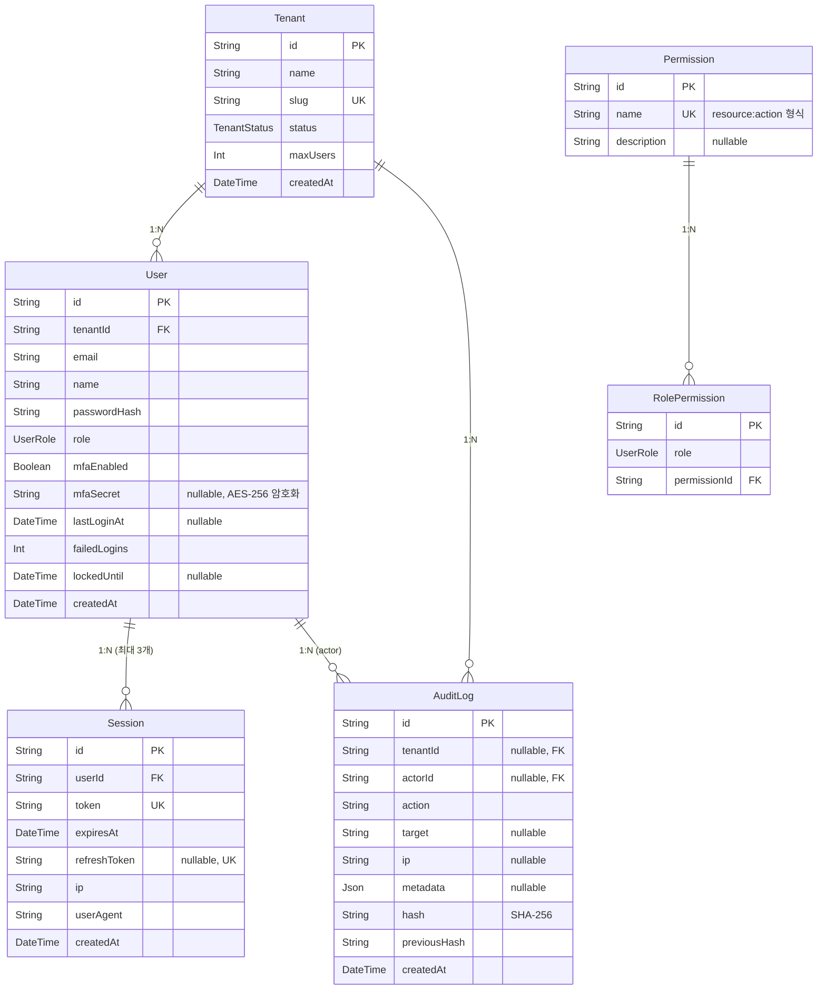
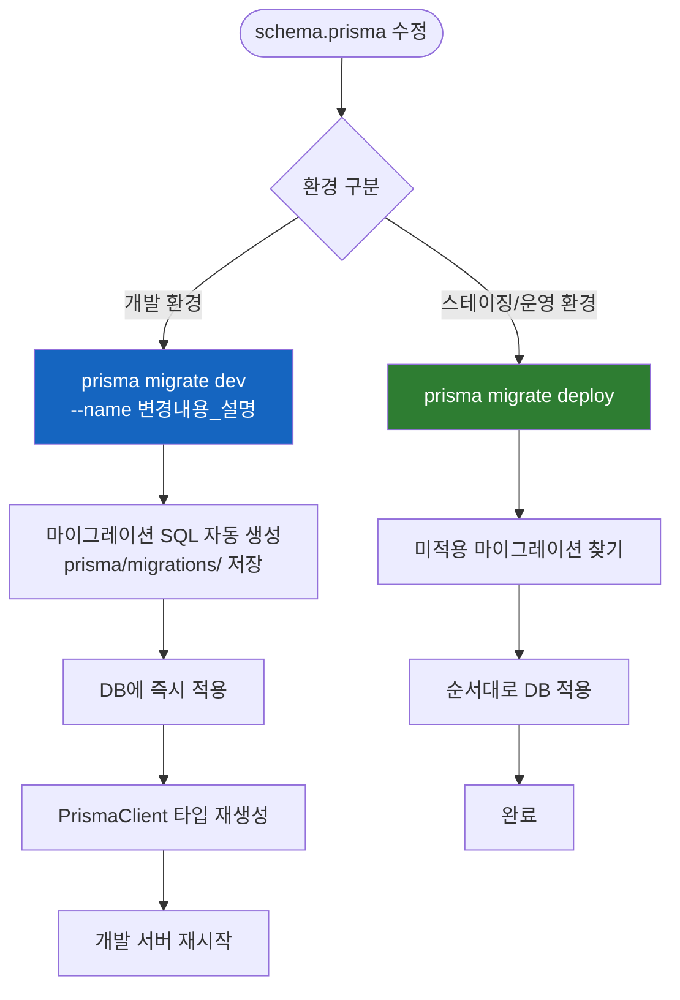

# Prisma ORM 완전 가이드

> **문서 ID**: ONBOARD-03-05
> **버전**: 1.0.0 | **작성일**: 2026-04-12 | **작성자**: Implementer (Sonnet)
> **선행 학습**: `03-development/02-service-development.md`
> **소요 시간**: 약 4~5시간 (실습 포함)

---

## 목차

1. [Prisma ORM 개요 — SQL 대신 왜 ORM인가](#1-prisma-orm-개요)
2. [schema.prisma 파일 구조 읽는 법](#2-schemaprisma-파일-구조)
3. [기본 CRUD 작업](#3-기본-crud-작업)
4. [관계 정의 및 쿼리 (1:1, 1:N, N:M)](#4-관계-정의-및-쿼리)
5. [마이그레이션](#5-마이그레이션)
6. [트랜잭션 올바른 사용법](#6-트랜잭션)
7. [성능 최적화](#7-성능-최적화)
8. [CSAP D-12: 보안 — Prisma가 SQL 주입을 막는 방법](#8-csap-d-12-보안)
9. [변경 이력](#9-변경-이력)

---

## 1. Prisma ORM 개요

### 1.1 SQL 대신 왜 ORM을 쓰는가

다음 두 코드를 비교해봅니다. 두 코드 모두 동일한 작업(이메일로 사용자 조회)을 합니다.

**방법 A — Raw SQL (기존 방식)**:

```typescript
// ❌ 직접 SQL 사용 시 문제점
const email = request.body.email;

// 1. SQL 주입 취약점 (입력값을 직접 문자열에 결합)
const result = await db.query(
  `SELECT * FROM users WHERE email = '${email}'`  // CSAP D-12 위반!
);

// 2. 결과가 any 타입 → 런타임 에러 위험
const user = result.rows[0]; // user.name? user.emailAddress? 모름

// 3. DB 컬럼명 오타를 컴파일 타임에 잡을 수 없음
const name = user.naem; // 오타인데 컴파일 에러 없음
```

**방법 B — Prisma ORM (이 프로젝트 방식)**:

```typescript
// ✅ Prisma 사용 시 장점
const user = await prisma.user.findUnique({
  where: { email: email },  // 매개변수화 자동 처리 → SQL 주입 불가
});

// 1. 타입 안전: user는 User 타입 (자동 추론)
console.log(user?.name);        // IDE 자동완성 지원
console.log(user?.naem);        // 컴파일 에러 → 오타 즉시 발견

// 2. 관계 탐색도 타입 안전
const userWithSessions = await prisma.user.findUnique({
  where: { id: userId },
  include: { sessions: true },
});
userWithSessions?.sessions[0].expiresAt; // Session 타입 보장
```

**핵심 차이 요약**:

| 항목 | Raw SQL | Prisma ORM |
|------|---------|-----------|
| SQL 주입 방지 | 수동으로 매개변수화해야 함 | 자동 매개변수화 (기본) |
| 타입 안전성 | `any` 타입 | 스키마에서 자동 생성된 타입 |
| IDE 자동완성 | 없음 | 완전 지원 |
| 컬럼명 오타 감지 | 런타임 에러 | 컴파일 에러 |
| 마이그레이션 | SQL 파일 수동 관리 | `prisma migrate` 자동 생성 |
| 관계 쿼리 | JOIN 작성 | `include`/`select` 로 선언적 |

### 1.2 이 프로젝트에서의 Prisma 위치

```
/data/ai-saas/
├── prisma/
│   └── schema.prisma          ← 전체 DB 스키마 정의 (단일 파일)
├── platform/services/
│   └── auth-service/src/lib/
│       └── prisma.ts          ← PrismaClient 싱글톤 (각 서비스에 동일)
```

**중요**: 이 프로젝트는 모든 서비스가 **하나의 PostgreSQL DB**를 공유합니다. 스키마는 루트의 `prisma/schema.prisma` 파일 하나로 관리합니다.

---

## 2. schema.prisma 파일 구조

### 2.1 전체 구조

`/data/ai-saas/prisma/schema.prisma` 파일은 세 부분으로 구성됩니다.

```prisma
// ① Generator: PrismaClient 생성 설정
generator client {
  provider = "prisma-client-js"
}

// ② Datasource: DB 연결 설정
datasource db {
  provider = "postgresql"
  url      = env("DATABASE_URL")  // 환경변수에서 URL 읽기
}

// ③ Model: 테이블 정의
model User {
  id           String    @id @default(cuid())
  tenantId     String
  email        String
  name         String
  passwordHash String
  role         UserRole  @default(USER)
  // ...
}
```

### 2.2 auth-service 관련 ERD

이 프로젝트에서 인증/사용자 관련 모델 간 관계를 시각화합니다.



### 2.3 모델 필드 어노테이션 읽는 법

```prisma
model User {
  id           String    @id @default(cuid())
  //                     ^^^  ^^^^^^^^^^^^^
  //                     기본키  CUID 자동 생성

  tenantId     String
  email        String
  // @@unique([tenantId, email]) → 복합 유니크: 같은 테넌트 내 이메일 중복 불가

  role         UserRole  @default(USER)
  //                     ^^^^^^^^^^^^^ enum 기본값

  mfaSecret    String?
  //                  ^ ? → 옵셔널 (nullable)

  createdAt    DateTime  @default(now())
  //                     ^^^^^^^^^^^^^ 생성 시각 자동 기록

  updatedAt    DateTime  @updatedAt
  //                     ^^^^^^^^^^ 업데이트 시 자동 갱신

  tenant    Tenant     @relation(fields: [tenantId], references: [id])
  //                   ^^^^^^^^^^^^^^^^^^^^^^^^^^^^^^^^^^^^^^^^^^^^^^^
  //        관계 정의: tenantId FK → Tenant.id PK

  @@unique([tenantId, email])    // 복합 유니크 제약
  @@index([tenantId])            // 인덱스 (성능 최적화)
  @@index([email])               // 인덱스
}

enum UserRole {
  SUPER_ADMIN
  TENANT_ADMIN
  USER
  VIEWER
  AUDITOR
}
```

**주요 어노테이션 정리**:

| 어노테이션 | 의미 | 예시 |
|----------|------|------|
| `@id` | 기본 키 | `@id @default(cuid())` |
| `@default(...)` | 기본값 설정 | `@default(now())`, `@default(false)` |
| `@unique` | 유니크 제약 | `@unique` |
| `@updatedAt` | 업데이트 시 자동 갱신 | `updatedAt DateTime @updatedAt` |
| `?` (타입 뒤) | 옵셔널(nullable) | `String?` |
| `@relation` | 관계 정의 | `@relation(fields: [...], references: [...])` |
| `@@unique([...])` | 복합 유니크 | `@@unique([tenantId, email])` |
| `@@index([...])` | 복합 인덱스 | `@@index([tenantId, createdAt])` |

---

## 3. 기본 CRUD 작업

### 3.1 PrismaClient 싱글톤 패턴

`platform/services/auth-service/src/lib/prisma.ts`의 싱글톤 패턴입니다. 모든 서비스에서 동일하게 사용합니다.

```typescript
// platform/services/auth-service/src/lib/prisma.ts
import { PrismaClient } from '@prisma/client';

// globalThis를 사용한 이유:
// Node.js에서 핫 리로드(ts-node --watch) 시 모듈이 재로드되어
// 매번 새 PrismaClient가 생성되면 DB 연결 풀이 고갈됨
// → globalThis에 저장하면 이미 생성된 인스턴스를 재사용
const globalForPrisma = globalThis as unknown as { prisma: PrismaClient };

export const prisma =
  globalForPrisma.prisma ??
  new PrismaClient({
    log: process.env['NODE_ENV'] === 'development' ? ['error', 'warn'] : ['error'],
  });

if (process.env['NODE_ENV'] !== 'production') {
  globalForPrisma.prisma = prisma;
}
```

### 3.2 Create (생성)

```typescript
import { prisma } from '../lib/prisma.js';

// 단일 레코드 생성
const user = await prisma.user.create({
  data: {
    tenantId: 'tenant-001',
    email: 'user@example.com',
    name: '홍길동',
    passwordHash: '$2b$12$...', // bcrypt 해시
    role: 'USER',
  },
});
// 반환: User 타입 (id, createdAt 등 자동 생성 필드 포함)

// 생성 후 특정 필드만 반환
const userSummary = await prisma.user.create({
  data: {
    tenantId: 'tenant-001',
    email: 'user2@example.com',
    name: '김철수',
    passwordHash: '$2b$12$...',
    role: 'USER',
  },
  select: {
    id: true,
    email: true,
    name: true,
    // passwordHash: false (선택 안 하면 포함 안 됨)
  },
});
// 반환: { id: string, email: string, name: string }

// 여러 레코드 한 번에 생성
await prisma.permission.createMany({
  data: [
    { name: 'user:read', description: '사용자 조회' },
    { name: 'user:write', description: '사용자 수정' },
    { name: 'audit:read', description: '감사 로그 조회' },
  ],
  skipDuplicates: true, // 이미 존재하면 건너뜀 (에러 발생 안 함)
});
```

### 3.3 Read (조회)

```typescript
// 단일 조회 — 기본키 또는 @unique 필드
const userById = await prisma.user.findUnique({
  where: { id: 'user-123' },
});
// 반환: User | null (없으면 null)

// 복합 유니크 키 조회
const userByEmail = await prisma.user.findUnique({
  where: { tenantId_email: { tenantId: 'tenant-001', email: 'user@example.com' } },
  // ^^^^^^^^^^^^^ schema에서 @@unique([tenantId, email]) 정의 시 자동 생성됨
});

// 조건부 조회 (없으면 에러)
const userOrThrow = await prisma.user.findUniqueOrThrow({
  where: { id: 'user-123' },
  // 찾지 못하면 NotFoundError throw → try/catch 필요
});

// 여러 레코드 조회 (조건 + 정렬 + 페이지네이션)
const users = await prisma.user.findMany({
  where: {
    tenantId: 'tenant-001',
    role: { in: ['USER', 'VIEWER'] },  // in 연산자
    createdAt: {
      gte: new Date('2026-01-01'),     // 날짜 범위 조건
    },
    name: { contains: '홍', mode: 'insensitive' }, // LIKE '%홍%' (대소문자 무시)
  },
  orderBy: [
    { role: 'asc' },
    { createdAt: 'desc' },  // 복수 정렬
  ],
  skip: 0,     // 오프셋 (0-based)
  take: 20,    // 한 페이지 크기
});

// 카운트
const total = await prisma.user.count({
  where: { tenantId: 'tenant-001' },
});

// 첫 번째 레코드
const firstUser = await prisma.user.findFirst({
  where: { tenantId: 'tenant-001', role: 'SUPER_ADMIN' },
  orderBy: { createdAt: 'asc' },
});
```

### 3.4 Update (수정)

```typescript
// 단일 업데이트 (기본키로)
const updated = await prisma.user.update({
  where: { id: 'user-123' },
  data: {
    name: '홍길동 (변경됨)',
    updatedAt: new Date(), // @updatedAt 이 있으면 자동이지만 명시도 가능
  },
});

// 원자적 숫자 증가 (읽기-수정-쓰기 경쟁조건 없음)
await prisma.user.update({
  where: { id: 'user-123' },
  data: {
    failedLogins: { increment: 1 }, // UPDATE SET failedLogins = failedLogins + 1
  },
});

// 여러 레코드 한 번에 업데이트
const result = await prisma.user.updateMany({
  where: { tenantId: 'tenant-001', role: 'VIEWER' },
  data: { role: 'USER' },
});
// result.count: 업데이트된 레코드 수

// Upsert (있으면 업데이트, 없으면 생성)
const featureFlag = await prisma.featureFlag.upsert({
  where: { serviceId_key: { serviceId: 'svc-001', key: 'ai-enabled' } },
  update: { enabled: true },
  create: {
    serviceId: 'svc-001',
    key: 'ai-enabled',
    enabled: true,
  },
});
```

### 3.5 Delete (삭제)

```typescript
// 단일 삭제
await prisma.session.delete({
  where: { id: 'session-123' },
});

// 여러 레코드 삭제 (WHERE 절 필수 — CSAP 규정)
const deletedSessions = await prisma.session.deleteMany({
  where: {
    userId: 'user-123',
    expiresAt: { lt: new Date() }, // 만료된 세션만 삭제
  },
});
// deletedSessions.count: 삭제된 수

// ❌ 절대 금지: WHERE 없는 전체 삭제
// await prisma.session.deleteMany();  // 전체 삭제 → CSAP 위반
```

---

## 4. 관계 정의 및 쿼리

### 4.1 1:N 관계 (Tenant → Users)

**스키마 정의**:

```prisma
model Tenant {
  id    String @id @default(cuid())
  name  String
  users User[]  // ← 1:N 관계 (Tenant가 "1")
}

model User {
  id       String @id @default(cuid())
  tenantId String
  // ↑ FK 컬럼

  tenant Tenant @relation(fields: [tenantId], references: [id])
  // ↑ 관계 정의: tenantId FK → Tenant.id PK
}
```

**쿼리**:

```typescript
// 테넌트와 함께 사용자 조회 (User → Tenant)
const user = await prisma.user.findUnique({
  where: { id: 'user-123' },
  include: { tenant: true },  // JOIN 실행
});
// user.tenant.name 접근 가능

// 사용자 목록과 함께 테넌트 조회 (Tenant → Users)
const tenant = await prisma.tenant.findUnique({
  where: { slug: 'my-org' },
  include: {
    users: {
      where: { role: { not: 'SUPER_ADMIN' } },
      orderBy: { createdAt: 'desc' },
      take: 50,
    },
  },
});
// tenant.users 배열 접근 가능

// 관계를 통한 생성 (User 생성 시 Tenant 연결)
const newUser = await prisma.user.create({
  data: {
    email: 'new@example.com',
    name: '신규사용자',
    passwordHash: '...',
    role: 'USER',
    tenant: {
      connect: { id: 'tenant-001' }, // 기존 테넌트에 연결
    },
  },
});
```

### 4.2 1:1 관계 (User → Session은 N개지만 MFA는 1:1 예시)

이 프로젝트에서 1:1 관계 예시는 `User.mfaSecret` 필드이지만, 별도 테이블로 분리한다면:

```prisma
// 가상의 1:1 관계 예시 (실제 스키마는 아님)
model User {
  id      String   @id @default(cuid())
  profile UserProfile?  // 1:1 (User에는 profile이 0개 또는 1개)
}

model UserProfile {
  id          String  @id @default(cuid())
  userId      String  @unique  // @unique → 1:1 보장
  displayName String
  avatarUrl   String?

  user User @relation(fields: [userId], references: [id])
}
```

```typescript
// 1:1 관계 조회
const user = await prisma.user.findUnique({
  where: { id: 'user-123' },
  include: { profile: true },
});
// user.profile이 null이거나 UserProfile 타입
```

### 4.3 N:M 관계 (Role ↔ Permission)

실제 스키마의 `RolePermission`은 명시적 조인 테이블 방식입니다.

```prisma
model Permission {
  id    String           @id @default(cuid())
  name  String           @unique
  roles RolePermission[]
}

model RolePermission {
  id           String     @id @default(cuid())
  role         UserRole
  permissionId String

  permission Permission @relation(fields: [permissionId], references: [id], onDelete: Cascade)

  @@unique([role, permissionId])  // 같은 역할에 같은 권한 중복 방지
}
```

```typescript
// 역할에 해당하는 권한 목록 조회
const permissions = await prisma.rolePermission.findMany({
  where: { role: 'TENANT_ADMIN' },
  include: { permission: true },
});
const permissionNames = permissions.map((rp) => rp.permission.name);
// ['user:read', 'user:write', 'audit:read', ...]

// 권한을 가진 역할 목록
const rolesWithPermission = await prisma.rolePermission.findMany({
  where: { permission: { name: 'audit:read' } },
  select: { role: true },
});
```

### 4.4 관계 필터링

```typescript
// 활성 세션이 있는 사용자만 조회
const activeUsers = await prisma.user.findMany({
  where: {
    tenantId: 'tenant-001',
    sessions: {
      some: {                      // 세션 중 하나라도 만족하면
        expiresAt: { gt: new Date() },
      },
    },
  },
});

// 세션이 없는 사용자 조회
const inactiveUsers = await prisma.user.findMany({
  where: {
    sessions: { none: {} },        // 세션이 하나도 없는 사용자
  },
});

// 모든 세션이 만료된 사용자
const expiredUsers = await prisma.user.findMany({
  where: {
    sessions: {
      every: {
        expiresAt: { lt: new Date() },
      },
    },
  },
});
```

---

## 5. 마이그레이션

### 5.1 마이그레이션 워크플로우



### 5.2 개발 환경: `prisma migrate dev`

```bash
# schema.prisma에 새 필드를 추가한 후
# prisma/migrations/ 폴더에 SQL 파일 자동 생성 + DB 적용
pnpm prisma migrate dev --name add_user_department

# 생성된 파일:
# prisma/migrations/20260412000000_add_user_department/migration.sql
# → ALTER TABLE "User" ADD COLUMN "department" TEXT;
```

**`migrate dev`가 하는 일**:
1. 현재 `schema.prisma`와 DB 스키마 차이 계산
2. SQL 마이그레이션 파일 자동 생성 (`prisma/migrations/`)
3. DB에 마이그레이션 즉시 적용
4. `@prisma/client` 타입 재생성 (`prisma generate`)

### 5.3 운영/스테이징 환경: `prisma migrate deploy`

```bash
# CI/CD 파이프라인에서 실행 (서버 시작 직전)
pnpm prisma migrate deploy

# 이미 적용된 마이그레이션은 건너뜀 (idempotent)
# 미적용 마이그레이션만 순서대로 실행
```

**`migrate deploy`와 `migrate dev` 차이**:

| 항목 | `migrate dev` | `migrate deploy` |
|------|-------------|-----------------|
| 목적 | 개발 환경 스키마 변경 | 운영/스테이징 배포 |
| 새 마이그레이션 생성 | 예 (자동 생성) | 아니오 (기존 파일만 적용) |
| 데이터 손실 경고 | 예 (인터랙티브) | 아니오 (자동 실행) |
| 사용 환경 | 로컬, 개발 서버 | CI/CD, 운영 배포 |

### 5.4 마이그레이션 롤백 방법

**Prisma는 자동 롤백을 지원하지 않습니다.** 운영 환경 롤백은 다음 중 하나로 처리합니다.

**방법 1: 새 마이그레이션으로 되돌리기 (권장)**

```bash
# 잘못 적용된 마이그레이션을 되돌리는 새 마이그레이션 작성
# 1. schema.prisma를 이전 상태로 수동 되돌리기
# 2. 새 마이그레이션 생성
pnpm prisma migrate dev --name revert_add_user_department

# 생성된 마이그레이션:
# ALTER TABLE "User" DROP COLUMN "department";
```

**방법 2: `migrate resolve`로 마이그레이션 기록 표시 (비상 시)**

```bash
# 마이그레이션이 실패했을 때 수동으로 DB를 복구한 후
# Prisma에게 "이 마이그레이션은 완료됨"을 알리기
pnpm prisma migrate resolve --applied "20260412000000_bad_migration"

# 또는 "이 마이그레이션은 롤백됨"을 알리기
pnpm prisma migrate resolve --rolled-back "20260412000000_bad_migration"
```

**방법 3: DB 스냅샷 복구**

운영 환경에서는 마이그레이션 전 DB 스냅샷(백업)을 반드시 생성합니다. 심각한 문제 시 스냅샷으로 복구합니다.

### 5.5 실제 마이그레이션 작업 순서

```bash
# 1. schema.prisma 수정 (새 필드 추가 예시)
# model User에 department 필드 추가

# 2. 마이그레이션 생성 및 적용 (개발)
pnpm prisma migrate dev --name add_user_department

# 3. 타입 확인 (자동으로 업데이트됨)
pnpm tsc --noEmit

# 4. 테스트 실행
pnpm test

# 5. 커밋 (마이그레이션 파일 포함)
git add prisma/migrations/
git add prisma/schema.prisma
git commit -m "feat(db): 사용자 부서 필드 추가 (FR-USER.3)"
```

---

## 6. 트랜잭션

### 6.1 `$transaction` 올바른 사용법

**트랜잭션을 사용해야 하는 경우**: 여러 DB 작업이 **모두 성공하거나 모두 실패**해야 할 때.

```typescript
// ✅ 올바른 사용 1: 배열 방식 (짧고 단순한 경우)
// 여러 쿼리를 배열로 전달 → Prisma가 트랜잭션으로 실행
const [subscription, invoice] = await prisma.$transaction([
  prisma.subscription.create({
    data: {
      tenantId,
      planId,
      status: 'TRIALING',
      currentPeriodStart: new Date(),
      currentPeriodEnd: new Date(Date.now() + 30 * 24 * 60 * 60 * 1000),
    },
  }),
  prisma.invoice.create({
    data: {
      subscriptionId: 'temp', // ❌ 이 방식은 subscriptionId를 미리 알 수 없음
      amount: plan.price,
      status: 'draft',
      dueDate: new Date(),
    },
  }),
]);
```

```typescript
// ✅ 올바른 사용 2: 인터랙티브 트랜잭션 (이전 쿼리 결과를 다음에 사용해야 할 때)
// 콜백 방식 → tx 파라미터를 통해 트랜잭션 컨텍스트 전파
const result = await prisma.$transaction(async (tx) => {
  // 단계 1: 구독 생성
  const subscription = await tx.subscription.create({
    data: {
      tenantId,
      planId,
      status: 'TRIALING',
      currentPeriodStart: new Date(),
      currentPeriodEnd: new Date(Date.now() + 30 * 24 * 60 * 60 * 1000),
    },
  });

  // 단계 2: 생성된 subscriptionId로 청구서 생성
  const invoice = await tx.invoice.create({
    data: {
      subscriptionId: subscription.id, // ✅ 이전 단계 결과 사용 가능
      amount: plan.price,
      currency: 'KRW',
      status: 'draft',
      dueDate: new Date(Date.now() + 7 * 24 * 60 * 60 * 1000),
    },
  });

  // 단계 3: 구독 업데이트 (invoiceId 연결)
  await tx.subscription.update({
    where: { id: subscription.id },
    data: { status: 'ACTIVE' },
  });

  return { subscription, invoice };
  // ↑ 콜백이 반환되면 자동 COMMIT
  // 에러 발생 시 자동 ROLLBACK
});
```

### 6.2 트랜잭션 격리 수준 설정

```typescript
// 기본 격리 수준보다 강화가 필요할 때
const result = await prisma.$transaction(
  async (tx) => {
    // 잔액 조회 후 차감 (팬텀 읽기 방지 필요)
    const account = await tx.billing_account.findUnique({
      where: { id: accountId },
    });

    if (account!.balance < amount) {
      throw new Error('잔액 부족');
    }

    await tx.billing_account.update({
      where: { id: accountId },
      data: { balance: { decrement: amount } },
    });
  },
  {
    isolationLevel: 'Serializable', // 가장 강한 격리 (팬텀 읽기 방지)
    // 옵션: 'ReadUncommitted' | 'ReadCommitted' | 'RepeatableRead' | 'Serializable'
    timeout: 5000, // 5초 타임아웃
  },
);
```

### 6.3 안티패턴 — 트랜잭션 잘못 사용하기

```typescript
// ❌ 안티패턴 1: 트랜잭션 내부에서 외부 API 호출
await prisma.$transaction(async (tx) => {
  await tx.subscription.create({ data: subscriptionData });

  // 외부 결제 API 호출 → DB 트랜잭션과 무관 (원자성 보장 안 됨)
  // 결제 성공 후 tx.subscription.update()가 실패해도 환불 안 됨
  await externalPaymentGateway.charge(invoiceData);  // 금지!

  await tx.invoice.update({ where: { id: invoiceId }, data: { status: 'paid' } });
});
// → 외부 API 포함 시 Saga 패턴 사용 (5장 참조)

// ❌ 안티패턴 2: 트랜잭션 밖에서 prisma 사용
await prisma.$transaction(async (tx) => {
  const user = await tx.user.findUnique({ where: { id: userId } });
  // 트랜잭션 컨텍스트(tx) 아닌 prisma 직접 사용 → 같은 트랜잭션 아님
  await prisma.auditLog.create({ data: { ... } });  // 잘못됨!
  // ↑ tx.auditLog.create 로 수정해야 함
});

// ❌ 안티패턴 3: 불필요한 트랜잭션 (단일 쿼리)
// 단일 쿼리는 이미 원자적 → 트랜잭션 불필요
await prisma.$transaction([
  prisma.user.update({ where: { id }, data: { name } }),
]);
// 그냥 prisma.user.update(...) 로 충분
```

---

## 7. 성능 최적화

### 7.1 select 필드 제한

```typescript
// ❌ 느린 방식: 모든 필드 로드 (민감 정보 포함)
const user = await prisma.user.findUnique({
  where: { id: userId },
  // select 없음 → passwordHash, mfaSecret, 모든 컬럼 로드
});

// ✅ 빠른 방식: 필요한 필드만 select
const userForResponse = await prisma.user.findUnique({
  where: { id: userId },
  select: {
    id: true,
    name: true,
    email: true,
    role: true,
    lastLoginAt: true,
    // passwordHash: 절대 포함하지 않음 (보안 + 성능)
  },
});
```

### 7.2 include vs select — 언제 무엇을 쓰는가

```typescript
// include: 관계를 모두 로드 (상위 모델 전체 필드 + 관계)
const userWithAllData = await prisma.user.findUnique({
  where: { id: userId },
  include: {
    sessions: true,  // Session의 모든 필드
    tenant: true,    // Tenant의 모든 필드
    auditLogs: true, // AuditLog의 모든 필드 → 많을 수 있음!
  },
});

// select: 정밀하게 필요한 것만 (중첩 select 가능)
const userForDashboard = await prisma.user.findUnique({
  where: { id: userId },
  select: {
    id: true,
    name: true,
    email: true,
    // 관계도 select로 필요한 필드만
    sessions: {
      select: {
        id: true,
        ip: true,
        createdAt: true,
        // token: 제외 (보안)
      },
      where: { expiresAt: { gt: new Date() } },
      take: 5,
    },
    tenant: {
      select: { name: true, slug: true },
    },
  },
});
```

**판단 기준**:
- 관계 데이터가 필요하고 모든 필드가 필요하다 → `include`
- 특정 필드만 필요하다 → `select` (항상 더 빠름)
- 보안상 민감한 필드를 제외해야 한다 → 반드시 `select`

### 7.3 N+1 문제 방지

```typescript
// ❌ N+1 문제: 사용자 목록을 가져온 후 각 사용자의 테넌트를 개별 조회
const users = await prisma.user.findMany({ where: { role: 'USER' } });
for (const user of users) {
  // 사용자 수만큼 DB 쿼리 추가 발생! (100명 → 101번 쿼리)
  const tenant = await prisma.tenant.findUnique({ where: { id: user.tenantId } });
  console.log(`${user.name} — ${tenant?.name}`);
}

// ✅ N+1 해결: include로 한 번에 JOIN 로드
const users = await prisma.user.findMany({
  where: { role: 'USER' },
  include: { tenant: true },  // 1번 쿼리로 테넌트까지 로드
});
for (const user of users) {
  console.log(`${user.name} — ${user.tenant.name}`); // 추가 쿼리 없음
}

// ✅ 대량 데이터: select로 더 최적화
const users = await prisma.user.findMany({
  where: { role: 'USER' },
  select: {
    name: true,
    tenant: { select: { name: true } },  // 테넌트 이름만 로드
  },
});
```

### 7.4 Raw 쿼리는 언제 사용하는가

Prisma가 지원하지 않는 복잡한 집계나 DB 특화 기능이 필요할 때만 Raw 쿼리를 사용합니다.

```typescript
// Raw 쿼리를 사용해도 되는 경우 예시:
// 1. 복잡한 윈도우 함수 (Prisma ORM으로 표현 어려움)
// 2. DB 특화 함수 (PostgreSQL의 jsonb_agg, unnest 등)
// 3. 성능 최적화가 필수인 집계 쿼리

// ✅ Raw 쿼리 사용 시 반드시 매개변수화 (CSAP D-12)
const tenantId = request.user.tenantId;

// $queryRaw: 결과를 타입으로 반환
const stats = await prisma.$queryRaw<Array<{ role: string; count: bigint }>>`
  SELECT role, COUNT(*) as count
  FROM "User"
  WHERE "tenantId" = ${tenantId}
  GROUP BY role
  ORDER BY count DESC
`;
// ${tenantId} → 자동으로 매개변수화 처리 (SQL 주입 불가)

// $executeRaw: INSERT/UPDATE/DELETE (반환 없음)
await prisma.$executeRaw`
  UPDATE "AuditLog"
  SET hash = ${newHash}
  WHERE id = ${logId}
    AND "tenantId" = ${tenantId}
`;

// ❌ 절대 금지: 문자열 결합 (SQL 주입 취약점)
const badQuery = `SELECT * FROM "User" WHERE "tenantId" = '${tenantId}'`; // BLOCKED
await prisma.$queryRawUnsafe(badQuery);  // 사용 금지
```

---

## 8. CSAP D-12: 보안

### 8.1 Prisma가 SQL 주입을 막는 방법

CSAP D-12는 "모든 입력에 대해 매개변수화 쿼리를 사용해야 한다"고 요구합니다. Prisma는 이를 기본 동작으로 보장합니다.

```typescript
// Prisma가 내부적으로 생성하는 SQL (확인용)
const email = "admin@example.com' OR '1'='1";  // SQL 주입 시도

// Prisma ORM 사용 시
const user = await prisma.user.findUnique({
  where: { email },
});
// 내부적으로 생성되는 SQL:
// SELECT * FROM "User" WHERE email = $1
// 파라미터: ["admin@example.com' OR '1'='1"]
// → 전체 문자열이 값으로 처리 → SQL 주입 불가

// Raw SQL 사용 시 (Tagged Template Literal)
const user2 = await prisma.$queryRaw`
  SELECT id, name FROM "User" WHERE email = ${email}
`;
// → 동일하게 매개변수화 처리
```

### 8.2 민감 정보 노출 방지

```typescript
// ❌ 안티패턴: 민감 필드 포함 전체 반환
export async function getUserHandler(request, reply) {
  const user = await prisma.user.findUnique({ where: { id: request.params.id } });
  // user.passwordHash, user.mfaSecret까지 포함 → 응답에 노출 위험
  await reply.send({ success: true, data: user });
}

// ✅ 올바른 방식: select로 민감 필드 제외
export async function getUserHandler(request, reply) {
  const user = await prisma.user.findUnique({
    where: { id: request.params.id },
    select: {
      id: true,
      name: true,
      email: true,
      role: true,
      mfaEnabled: true,
      lastLoginAt: true,
      createdAt: true,
      // passwordHash: 절대 포함 안 함
      // mfaSecret: 절대 포함 안 함
    },
  });
  await reply.send({ success: true, data: user });
}
```

---

## Prisma 빠른 참조 카드

자주 쓰는 패턴을 빠르게 찾을 수 있도록 정리합니다.

```typescript
// ===== 조회 =====
prisma.model.findUnique({ where: { id } })          // 단일, null 가능
prisma.model.findUniqueOrThrow({ where: { id } })   // 단일, 없으면 에러
prisma.model.findFirst({ where, orderBy })           // 첫 번째
prisma.model.findMany({ where, skip, take, orderBy }) // 목록
prisma.model.count({ where })                        // 카운트

// ===== 생성 =====
prisma.model.create({ data })                        // 단일 생성
prisma.model.createMany({ data: [], skipDuplicates }) // 다수 생성
prisma.model.upsert({ where, update, create })       // 있으면 수정, 없으면 생성

// ===== 수정 =====
prisma.model.update({ where, data })                 // 단일 수정 (없으면 에러)
prisma.model.updateMany({ where, data })             // 다수 수정

// ===== 삭제 =====
prisma.model.delete({ where })                       // 단일 삭제
prisma.model.deleteMany({ where })                   // 다수 삭제 (WHERE 필수!)

// ===== 집계 =====
prisma.model.aggregate({ _sum: {}, _count: {}, _avg: {} })
prisma.model.groupBy({ by: ['field'], _count: { id: true } })

// ===== 트랜잭션 =====
prisma.$transaction([query1, query2])               // 배열 방식
prisma.$transaction(async (tx) => { ... })          // 인터랙티브 방식

// ===== 원자적 수치 연산 =====
prisma.model.update({ data: { count: { increment: 1 } } })
prisma.model.update({ data: { count: { decrement: 1 } } })
prisma.model.update({ data: { balance: { multiply: 1.1 } } })
```

---

## 9. 변경 이력

| 버전 | 일자 | 내용 | 작성자 |
|------|------|------|--------|
| 1.0.0 | 2026-04-12 | 최초 작성 (CRUD, 관계, 마이그레이션, 트랜잭션, 성능 최적화, CSAP D-12) | Implementer (Sonnet) |
