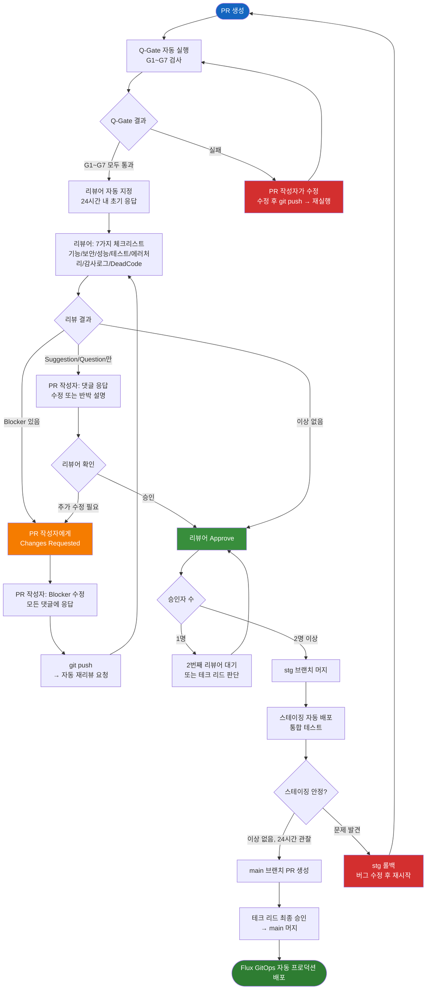

# 코드 리뷰 가이드 — 품질과 보안을 지키는 팀의 관문

> **문서 ID**: ONBOARD-03-06
> **버전**: 1.0.0 | **작성일**: 2026-04-12 | **작성자**: Implementer (Sonnet)
> **선행 학습**: `02-service-development.md`, `07-security-compliance.md`
> **소요 시간**: 약 2시간 (숙지 + 실습)
> **CSAP**: D-12 (시스템 개발 보안), D-06 (침해사고 관리 — 감사 추적)

---

## 목차

1. [코드 리뷰의 목적 — 버그만 찾는 게 아니다](#1-코드-리뷰의-목적--버그만-찾는-게-아니다)
2. [이 프로젝트의 리뷰 SLA](#2-이-프로젝트의-리뷰-sla)
3. [리뷰어 체크리스트 7가지](#3-리뷰어-체크리스트-7가지)
4. [좋은 리뷰 댓글 vs 나쁜 리뷰 댓글](#4-좋은-리뷰-댓글-vs-나쁜-리뷰-댓글)
5. [댓글 분류 — Blocker / Suggestion / Question / Nitpick](#5-댓글-분류--blocker--suggestion--question--nitpick)
6. [리뷰이(PR 작성자)로서 해야 할 것](#6-리뷰이pr-작성자로서-해야-할-것)
7. [Claude Code로 셀프 리뷰하는 방법](#7-claude-code로-셀프-리뷰하는-방법)
8. [Q-Gate G3 — AgentShield 102 규칙 이해하기](#8-q-gate-g3--agentshield-102-규칙-이해하기)
9. [자주 발견되는 CSAP 위반 패턴 TOP 5](#9-자주-발견되는-csap-위반-패턴-top-5)
10. [PR 리뷰 프로세스 플로우차트](#10-pr-리뷰-프로세스-플로우차트)

---

## 1. 코드 리뷰의 목적 — 버그만 찾는 게 아니다

코드 리뷰는 단순히 "이 코드에 버그가 있는가"를 검사하는 작업이 아닙니다. 이 프로젝트에서 코드 리뷰는 세 가지 목적을 동시에 달성합니다.

### 1.1 버그와 보안 취약점 조기 발견

프로덕션 배포 후 버그를 수정하는 비용은 리뷰 단계에서 발견하는 비용의 수십 배입니다. 특히 공공기관 SaaS에서 보안 취약점이 프로덕션에 노출되면 CSAP 인증 취소, 감리 결함, 언론 보도로 이어질 수 있습니다.

```
버그 발견 비용 비교 (대략적 기준):
  코드 작성 중 발견:   1배 (내가 즉시 수정)
  코드 리뷰 중 발견:   5배 (리뷰어 시간 포함)
  스테이징 테스트:    15배 (QA 사이클 포함)
  프로덕션 배포 후:  100배 (롤백, 사용자 영향, 감리 대응)
```

### 1.2 지식 공유 — 팀 전체가 코드를 이해한다

리뷰어는 PR을 보면서 "이 서비스가 이렇게 동작하는구나"를 배웁니다. PR 작성자는 리뷰 댓글을 통해 더 나은 패턴을 습득합니다. 코드 리뷰는 팀의 공유 지식 베이스를 키우는 핵심 메커니즘입니다.

```
지식 공유 효과:
  - "내가 담당한 서비스"가 아닌 "우리 팀의 서비스" 개념 형성
  - 특정 개발자에 대한 버스 팩터(Bus Factor) 감소
  - 신규 팀원이 PR 히스토리를 읽으며 맥락 파악 가능
```

### 1.3 팀 표준 유지 — CLAUDE.md 규칙이 살아있게 한다

`CLAUDE.md`에 정의된 규칙들(코딩 스타일, CSAP 준수, Dead Code 정책)은 자동 도구만으로 완전히 검사할 수 없습니다. 코드 리뷰는 팀이 합의한 표준이 코드베이스에 일관되게 적용되고 있는지 확인하는 마지막 인간 검사입니다.

---

## 2. 이 프로젝트의 리뷰 SLA

SLA(Service Level Agreement)는 서비스 간 약속이지만, 팀 내에서도 리뷰 응답 시간을 약속합니다.

### 2.1 리뷰 응답 SLA

| 단계 | 시간 제한 | 설명 |
|------|---------|------|
| **초기 응답** | PR 수신 후 **24시간 이내** | 바쁘더라도 "언제까지 리뷰하겠다" 댓글 필수 |
| **리뷰 완료** | PR 수신 후 **72시간 이내** | 승인 또는 수정 요청 |
| **수정 재리뷰** | 수정 푸시 후 **24시간 이내** | 이전 댓글 재확인 |
| **Blocker 응답** (리뷰이) | 댓글 수신 후 **48시간 이내** | 수정 또는 반박 댓글 |

### 2.2 리뷰 SLA 예외 상황

```
SLA를 초과할 수 있는 예외:
  - 공휴일, 연차 (사전 팀 공지 필수)
  - 긴급 장애 대응 중 (장애 해소 후 24시간 이내 시작)
  - PR이 너무 클 때 (500줄 이상): 부분 리뷰 후 댓글로 알림

SLA 위반 대응:
  1. 리뷰어에게 직접 Slack 메시지
  2. 팀 리드에게 에스컬레이션
  3. 다른 팀원을 리뷰어로 추가
```

### 2.3 PR 크기 기준

큰 PR은 리뷰 품질을 낮춥니다. 다음 기준을 권장합니다.

| PR 크기 | 변경 줄 수 | 평가 |
|---------|---------|------|
| Ideal | 200줄 이하 | 리뷰하기 가장 좋음 |
| Acceptable | 200~400줄 | 허용 범위 |
| Large | 400~600줄 | 분할 검토 |
| Too Large | 600줄 이상 | 반드시 분할 요청 |

---

## 3. 리뷰어 체크리스트 7가지

PR을 받았을 때 다음 7가지를 순서대로 확인합니다. 순서가 중요합니다. 기능이 틀렸다면 보안이나 성능은 의미 없습니다.

### 체크리스트 1 — 기능 정확성

요구사항 ID(FR-X.X)에 명시된 기능이 실제로 구현되었는가?

```
확인 방법:
  1. PR 설명에서 관련 FR ID 확인
  2. docs/01-plan/mtus/ 에서 해당 MTU 문서 열기
  3. FR 요건과 실제 구현 비교

확인 항목:
  □ PR 설명의 FR ID가 실제 Plan 문서에 존재하는가?
  □ 각 FR ID의 요건이 코드에 구현되었는가?
  □ 엣지 케이스가 처리되었는가? (빈 입력, 경계값, 잘못된 형식)
  □ 비즈니스 로직이 요구사항과 일치하는가?

예시 — 좋은 확인:
  PR: "FR-BILL.2 — 인보이스 금액이 구독 플랜 가격을 초과할 수 없음"
  코드:
    if (amount > plan.price) {
      throw new ValidationError('FR-BILL.2: 인보이스 금액 초과')
    }
  → FR 요건이 코드에 명확히 반영됨 (통과)
```

### 체크리스트 2 — 보안 (CSAP D-08/D-09/D-12)

보안 요건은 기능보다 더 중요합니다. 보안 취약점이 있으면 Blocker입니다.

```
확인 항목:
  □ 모든 API 엔드포인트에 RBAC 권한 검사가 있는가? (D-08)
  □ 하드코딩된 시크릿(API 키, 비밀번호, 토큰)이 없는가? (D-09)
  □ 민감 데이터가 암호화되어 저장되는가? (D-09)
  □ 모든 사용자 입력에 Zod 스키마 검증이 있는가? (D-12)
  □ SQL 쿼리에 매개변수화가 적용되었는가? (D-12)
  □ HTML 출력에 새니타이제이션이 적용되었는가? (XSS 방지)
  □ 에러 메시지에 내부 정보(스택 트레이스, DB 정보)가 노출되지 않는가?
```

**실제 확인 패턴**:

```typescript
// ✅ 올바른 패턴 (통과)
export async function DELETE(req: Request, { params }) {
  const user = await verifyToken(req.headers.authorization)
  if (!hasPermission(user, 'user:delete')) {
    return Response.json({ error: 'Forbidden' }, { status: 403 })
  }
  const { id } = deleteUserSchema.parse(params)  // Zod 검증
  await auditLog({ actor: user.id, action: 'USER_DELETE', target: id })
  await userRepository.delete(id)
}

// ❌ 패턴 1: RBAC 없음 → Blocker
export async function DELETE(req: Request, { params }) {
  // 권한 검사 없이 바로 삭제!
  await userRepository.delete(params.id)
}

// ❌ 패턴 2: 입력 검증 없음 → Blocker
export async function GET(req: Request, { params }) {
  const user = await db.query(
    `SELECT * FROM users WHERE id = '${params.id}'`  // SQL 주입 가능!
  )
}

// ❌ 패턴 3: 하드코딩 시크릿 → Blocker (즉시 교체 + 시크릿 로테이션)
const apiKey = 'sk-anthropic-1234567890abcdef'
```

### 체크리스트 3 — 성능 (N+1, 불필요한 DB 쿼리)

```
확인 항목:
  □ N+1 쿼리 문제가 없는가? (루프 안에서 DB 쿼리 금지)
  □ 불필요한 전체 데이터 로드가 없는가? (필요한 필드만 select)
  □ 반복 조회되는 데이터에 캐시가 적용되었는가?
  □ 대량 데이터 처리에 페이지네이션이 있는가?
  □ 인덱스가 없는 컬럼으로 조회하고 있지는 않는가?
```

**N+1 패턴 예시**:

```typescript
// ❌ N+1 문제 (Blocker)
const tenants = await db.tenant.findMany()           // 1번 쿼리
for (const tenant of tenants) {
  const subscription = await db.subscription.findFirst({  // N번 쿼리!
    where: { tenantId: tenant.id }
  })
  // tenants 100개면 총 101번 쿼리 실행
}

// ✅ 올바른 패턴 (Eager Loading)
const tenants = await db.tenant.findMany({
  include: {
    subscriptions: {                              // 1번 쿼리로 해결
      where: { status: 'ACTIVE' },
      take: 1,
    }
  }
})

// ❌ 과도한 데이터 로드 (Suggestion)
const users = await db.user.findMany()            // 전체 컬럼 로드
return users.map(u => ({ id: u.id, name: u.name }))  // 2개만 사용

// ✅ 필요한 필드만
const users = await db.user.findMany({
  select: { id: true, name: true }                // 필요한 것만
})
```

### 체크리스트 4 — 테스트 커버리지 80%+

```
확인 항목:
  □ 새로 추가된 함수/핸들러에 단위 테스트가 있는가?
  □ 중요 분기(성공/실패, 권한 있음/없음)가 모두 테스트되었는가?
  □ 테스트 커버리지가 80% 이상인가? (Q-Gate G4)
  □ 테스트가 구현에 종속되지 않고 동작을 테스트하는가?
  □ 모킹이 과도하게 사용되어 실제 동작을 가리고 있지 않는가?
```

**테스트 품질 확인**:

```typescript
// ✅ 좋은 테스트: 동작을 테스트
describe('POST /billing/invoices/generate', () => {
  it('활성 구독에 대한 인보이스를 생성한다', async () => {
    const response = await app.inject({
      method: 'POST',
      url: '/billing/invoices/generate',
      headers: { authorization: 'Bearer admin-token' },
      body: { subscriptionId: 'active-subscription-id' },
    })
    expect(response.statusCode).toBe(201)
    expect(response.json()).toMatchObject({
      invoiceId: expect.any(String),
      amount: expect.any(Number),
      status: 'PENDING',
    })
  })

  it('취소된 구독에 대해 400을 반환한다', async () => {
    // 실패 케이스도 반드시 테스트
    const response = await app.inject({
      method: 'POST',
      url: '/billing/invoices/generate',
      headers: { authorization: 'Bearer admin-token' },
      body: { subscriptionId: 'canceled-subscription-id' },
    })
    expect(response.statusCode).toBe(400)
  })

  it('권한 없는 사용자에게 403을 반환한다', async () => {
    // RBAC 테스트 필수
    const response = await app.inject({
      method: 'POST',
      url: '/billing/invoices/generate',
      headers: { authorization: 'Bearer user-token' },  // ADMIN이 아님
      body: { subscriptionId: 'any-subscription-id' },
    })
    expect(response.statusCode).toBe(403)
  })
})

// ❌ 나쁜 테스트: 구현 세부사항 테스트 (리팩토링에 취약)
it('prisma.invoice.create가 호출된다', async () => {
  const spy = jest.spyOn(prisma.invoice, 'create')
  await generateInvoice('subscription-id')
  expect(spy).toHaveBeenCalled()  // 내부 구현에 종속됨
})
```

### 체크리스트 5 — 에러 처리

```
확인 항목:
  □ 예상 가능한 에러가 catch로 처리되었는가?
  □ 에러 메시지가 사용자에게 친화적이고 안전한가? (내부 정보 미노출)
  □ 에러 로깅이 적절한 레벨로 기록되는가? (error/warn/info)
  □ 외부 서비스 호출 실패 시 폴백 또는 재시도 로직이 있는가?
  □ Promise rejection이 처리되지 않은 채로 있지 않는가?
```

**에러 처리 패턴**:

```typescript
// ✅ 올바른 에러 처리
async function createTenant(body: CreateTenantDto): Promise<Tenant> {
  try {
    const existing = await db.tenant.findUnique({ where: { slug: body.slug } })
    if (existing) {
      // 예상 가능한 에러: 명확한 비즈니스 에러 메시지
      throw new ConflictError(`슬러그 '${body.slug}'는 이미 사용 중입니다`)
    }
    return await db.tenant.create({ data: body })
  } catch (error) {
    if (error instanceof ConflictError) {
      throw error  // 비즈니스 에러는 그대로 전파
    }
    // 예상치 못한 에러: 내부 정보 숨기고 로깅
    logger.error('테넌트 생성 실패', { errorId: uuid(), error })
    throw new InternalServerError('테넌트 생성 중 오류가 발생했습니다')
  }
}

// ❌ 잘못된 에러 처리 (Blocker)
async function createTenant(body: any) {
  return await db.tenant.create({ data: body })
  // try-catch 없음: DB 에러가 그대로 클라이언트에 노출됨
}

// ❌ 내부 정보 노출 (Blocker)
catch (error) {
  return res.status(500).json({
    error: error.message,       // DB 에러 메시지 그대로 노출
    stack: error.stack,         // 스택 트레이스 노출
    query: error.meta?.query,   // Prisma 쿼리 노출
  })
}
```

### 체크리스트 6 — 감사 로그 포함 여부 (CSAP D-06)

감사 로그는 CSAP D-06 요건입니다. 민감 작업에 `auditLog()` 호출이 없으면 Q-Gate G7이 실패합니다.

```
감사 로그가 필수인 작업 목록:
  □ 사용자 생성/수정/삭제
  □ 테넌트 생성/수정/비활성화
  □ 권한(Role) 변경
  □ 로그인 성공/실패
  □ 인보이스 생성/결제/취소
  □ 구독 생성/변경/해지
  □ AI API 호출 (N2SF N-05)
  □ 보안 이벤트 (세션 차단, 계정 잠금)
  □ 시스템 설정 변경
  □ 데이터 내보내기/다운로드
```

**감사 로그 패턴 확인**:

```typescript
// ✅ 필수: 민감 작업에 auditLog 포함
async function deleteUser(adminUser: AuthenticatedUser, targetUserId: string) {
  await auditLog({
    actor: adminUser.id,            // 누가
    action: 'USER_DELETE',          // 무엇을
    target: targetUserId,           // 어떤 대상에
    metadata: { tenantId: adminUser.tenantId },
    timestamp: new Date().toISOString(),
    ip: getClientIP(),              // 어디서
  })
  await userRepository.delete(targetUserId)
}

// ❌ 누락 (Q-Gate G7 실패 → Blocker)
async function deleteUser(adminUser: AuthenticatedUser, targetUserId: string) {
  // auditLog 호출 없음!
  await userRepository.delete(targetUserId)
}

// ❌ 불완전한 감사 로그 (Suggestion)
await auditLog({
  action: 'USER_DELETE',           // actor, target 누락
})
```

### 체크리스트 7 — Dead Code 없음

`deadcode-policy.md`에 따라 미사용 코드는 발견 즉시 제거합니다.

```
확인 항목:
  □ 사용되지 않는 import가 없는가?
  □ 사용되지 않는 함수/변수가 없는가?
  □ 주석 처리된 코드 블록이 없는가? (git 히스토리로 복구 가능)
  □ 미사용 CSS 클래스가 없는가?
  □ TODO 주석이 3개월 이상 된 것이 없는가?
  □ 미사용 npm 패키지가 package.json에 추가되지 않았는가?
```

**Dead Code 확인 패턴**:

```typescript
// ❌ 미사용 import (Nitpick → Blocker if intentional)
import { something } from './unused-module'  // 어디서도 사용 안 됨

// ❌ 주석 처리된 코드 (Suggestion)
// async function oldImplementation() {
//   const data = await fetchData()
//   return transform(data)
// }

// ❌ 미사용 변수 (Nitpick)
async function processPayment(invoice: Invoice) {
  const startTime = Date.now()  // 사용되지 않음
  await billingService.charge(invoice)
}

// ✅ 예외: Phase 2에서 사용 예정임을 명시한 경우
// NOTE: 미사용. Phase 2 FR-2.3 구현 시 사용 예정. 2026-07-01 이후 재검토.
function csapStandardGradeValidator() { ... }
```

---

## 4. 좋은 리뷰 댓글 vs 나쁜 리뷰 댓글

코드 리뷰는 코드에 대한 피드백이지 사람에 대한 평가가 아닙니다.

### 4.1 좋은 댓글의 특징

```
✅ 구체적: 무엇이 문제이고 왜 문제인지 설명
✅ 건설적: 문제 지적 + 개선 방법 제시
✅ 중립적: "나쁜 코드" 대신 "이 패턴은 N+1을 유발합니다"
✅ 코드 예시 포함: 어떻게 고쳐야 하는지 보여줌
✅ 분류 명확: [Blocker], [Suggestion], [Question], [Nitpick]
```

### 4.2 실제 코드 컨텍스트를 사용한 예시 비교

**시나리오**: 리뷰어가 billing-service 코드를 검토 중, RBAC 누락 발견

```typescript
// PR에 올라온 코드 (billing-service/src/handlers/invoice.handler.ts)
export async function generateInvoice(
  request: FastifyRequest,
  reply: FastifyReply
) {
  const { subscriptionId } = generateInvoiceSchema.parse(request.body)
  const invoice = await billingRepository.createInvoice(subscriptionId)
  return reply.code(201).send(invoice)
}
```

---

**나쁜 댓글 예시** (피해야 할 것):

```
❌ "권한 체크 안 했음"
   → 무엇을 어떻게 고쳐야 할지 모름

❌ "이런 코드를 어떻게 짰어요? CSAP도 모르세요?"
   → 사람을 공격하는 표현, 팀 분위기 파괴

❌ "이거 틀렸음"
   → 근거 없음, 도움이 안 됨

❌ "전에도 말했잖아요..."
   → 비판적, 방어적 반응 유발
```

---

**좋은 댓글 예시** (이렇게 작성):

```
✅ 예시 1 — Blocker with 코드 예시:

[Blocker] RBAC 권한 검사 누락 (CSAP D-08)

인보이스 생성 API에 권한 검사가 없어 모든 인증된 사용자가
청구서를 임의로 생성할 수 있는 상태입니다.
SUPER_ADMIN 또는 BILLING_ADMIN 역할만 허용해야 합니다.

수정 예시:
  export async function generateInvoice(request, reply) {
    const user = request.user  // 미들웨어가 주입
    if (!hasPermission(user, 'invoice:create')) {
      return reply.code(403).send({ error: 'Forbidden' })
    }
    // 이후 기존 코드...
  }

관련 CSAP: D-08-01 (접근 통제 요건)
관련 규칙: .claude/rules/csap-compliance.md#d-08-접근-통제
```

```
✅ 예시 2 — Suggestion with 이유 설명:

[Suggestion] auditLog 추가 권장 (CSAP D-06)

인보이스 생성은 재무적으로 중요한 작업으로 감사 추적이
필요합니다. 현재 구현에서는 auditLog 호출이 없어
Q-Gate G7을 통과하지 못할 수 있습니다.

권장 위치: billingRepository.createInvoice() 호출 이후

  await auditLog({
    actor: request.user.id,
    action: 'INVOICE_GENERATED',
    target: subscriptionId,
    metadata: { invoiceId: invoice.id, amount: invoice.amount },
    timestamp: new Date().toISOString(),
  })
```

```
✅ 예시 3 — Question:

[Question] 이 로직의 의도가 궁금합니다.

  if (invoice.amount > subscription.plan.price * 1.1) {

1.1 (10%)은 어떤 비즈니스 룰에서 나온 숫자인가요?
Plan 문서나 요구사항 ID를 알 수 있을까요?
상수로 분리하고 주석을 달면 의도가 더 명확해질 것 같습니다:

  const MAX_INVOICE_OVERAGE_RATE = 1.1  // FR-BILL.3: 10% 초과분 허용
  if (invoice.amount > subscription.plan.price * MAX_INVOICE_OVERAGE_RATE) {
```

```
✅ 예시 4 — Nitpick:

[Nitpick] 변수명 개선 제안

  const d = new Date()

'harness-constraints.md 1절'에 따르면 약어보다 명확한 이름을
권장합니다.

  const invoiceCreatedAt = new Date()

수정 여부는 작성자 판단에 맡깁니다.
```

---

## 5. 댓글 분류 — Blocker / Suggestion / Question / Nitpick

모든 리뷰 댓글은 반드시 분류를 표시합니다. 분류 없이는 리뷰이가 무엇을 필수로 수정해야 하는지 알 수 없습니다.

### 5.1 Blocker

**정의**: 머지 전 반드시 수정해야 합니다. 리뷰이가 반드시 해결(fix 또는 반박)해야 합니다.

```
Blocker에 해당하는 것:
  - 보안 취약점 (하드코딩 시크릿, SQL 주입, RBAC 누락)
  - 기능 오동작 (요구사항을 충족하지 못하는 구현)
  - 테스트 없음 (커버리지 80% 미달)
  - CSAP 필수 요건 위반 (감사 로그 누락, 암호화 미적용)
  - 빌드 실패 또는 린트 에러
  - N+1 쿼리 (대규모 데이터 처리 시 심각한 성능 영향)

예시:
  [Blocker] 하드코딩된 API 키 발견
  [Blocker] 이 API에 RBAC 검사가 없습니다 (CSAP D-08)
  [Blocker] 테스트가 없습니다. 이 핸들러에 최소 3개 케이스가 필요합니다
```

### 5.2 Suggestion

**정의**: 수정을 권장하지만 강제하지 않습니다. 리뷰이가 동의하면 수정, 동의하지 않으면 이유를 댓글로 설명합니다.

```
Suggestion에 해당하는 것:
  - 더 효율적인 구현 방법 (캐시 추가, 쿼리 최적화)
  - 가독성 개선 (함수 분리, 변수명 개선)
  - 에러 처리 강화 (재시도, 폴백 추가)
  - 코드 재사용 (이미 있는 유틸 함수 활용)

예시:
  [Suggestion] Redis 캐시를 추가하면 DB 부하를 줄일 수 있습니다
  [Suggestion] 이 로직을 별도 함수로 분리하면 테스트하기 쉬워집니다
```

### 5.3 Question

**정의**: 코드 이해를 위한 질문입니다. 반드시 답변이 필요합니다. 답변 후 Blocker나 Suggestion으로 재분류될 수 있습니다.

```
Question에 해당하는 것:
  - 의도가 명확하지 않은 코드
  - 숫자 상수의 의미 (왜 30분? 왜 10%?)
  - 특정 라이브러리/패턴 선택 이유

예시:
  [Question] 30분 타임아웃 값은 어떤 요구사항에서 나왔나요?
  [Question] 이 두 조건 중 어느 것이 먼저 체크되어야 하나요?
```

### 5.4 Nitpick

**정의**: 매우 사소한 스타일/형식 의견입니다. 수정 여부는 완전히 리뷰이의 판단입니다.

```
Nitpick에 해당하는 것:
  - 변수명 미세 조정
  - 공백, 빈 줄 위치
  - 주석 표현 개선

규칙: 너무 많은 Nitpick은 피합니다.
     리뷰 댓글이 20개가 넘으면 Nitpick 5개는 과도합니다.
     자동 포매터(prettier, eslint)가 처리할 수 있는 것은 Nitpick 금지.

예시:
  [Nitpick] 함수명을 더 명확하게 하면 어떨까요?
```

---

## 6. 리뷰이(PR 작성자)로서 해야 할 것

코드 리뷰는 리뷰어만의 작업이 아닙니다. 리뷰이도 적극적으로 참여해야 합니다.

### 6.1 댓글 해결

```
모든 댓글에 반드시 응답합니다:

Blocker 수정 시:
  댓글에 "수정했습니다. 커밋 [hash] 참조" 답글
  → 리뷰어가 쉽게 재검토 가능

Suggestion 동의 시:
  "좋은 의견 감사합니다. 수정했습니다." + 수정 커밋

Suggestion 비동의 시:
  이유를 구체적으로 설명합니다:
  "이 경우에는 캐시가 오히려 데이터 일관성 문제를 유발할 수 있어서
   현재 패턴을 유지합니다. 이유: [설명]"

Question 답변:
  질문의 맥락 + 근거 + 관련 FR ID 또는 문서 링크
```

### 6.2 반박하는 법

리뷰어의 의견이 항상 옳지는 않습니다. 건설적으로 반박합니다.

```
나쁜 반박:
  "이 방법이 더 좋아요" (근거 없음)
  "그냥 이게 맞아요" (설명 없음)
  "리뷰어가 틀렸음" (공격적)

좋은 반박:
  "[Blocker] 댓글에 대한 반박입니다.
   제안하신 방법(캐시 추가)은 이 케이스에서 문제가 있습니다.
   billing-service의 인보이스 상태는 결제 처리 중에 실시간으로
   변하기 때문에, 캐시가 최신 상태를 반영하지 못할 수 있습니다.
   대신 Redis pub/sub으로 캐시 무효화를 구현하는 방향을 검토했지만,
   현재 FR 요건에 없어 Over-Engineering이 될 수 있어 보류합니다.
   이 판단에 동의하시면 현재 코드를 유지하겠습니다."
```

### 6.3 리뷰이의 자기 검토 체크리스트

PR을 올리기 전에 스스로 체크합니다.

```
PR 제출 전 자가 점검:
  □ pnpm test:coverage 통과 (커버리지 80%+)
  □ pnpm typecheck 통과 (TypeScript 에러 없음)
  □ pnpm lint 통과 (ESLint 에러 없음)
  □ 모든 API에 RBAC 검사 있음
  □ 민감 작업에 auditLog() 있음
  □ 하드코딩된 시크릿 없음
  □ N+1 쿼리 없음
  □ 미사용 import 없음
  □ PR 설명 템플릿 작성 완료 (FR ID, CSAP 영향도, 테스트 계획)
```

---

## 7. Claude Code로 셀프 리뷰하는 방법

PR을 올리기 전에 Claude Code를 활용하여 스스로 리뷰할 수 있습니다.

### 7.1 셀프 리뷰 프롬프트 예시

```bash
# Claude Code 실행 후 다음 프롬프트 사용:

# 1. 보안 검토
"방금 수정한 platform/services/billing-service/src/handlers/invoice.handler.ts 파일을
.claude/rules/csap-compliance.md 기준으로 보안 검토해줘.
특히 D-08 RBAC, D-06 감사 로그, D-12 입력 검증 위반 여부를 확인해줘."

# 2. 전체 변경 파일 검토
"git diff HEAD~1 결과를 바탕으로, 변경된 파일들에서:
1. CSAP 위반 패턴
2. N+1 쿼리 가능성
3. 미사용 import
4. 감사 로그 누락
을 찾아줘."

# 3. 테스트 커버리지 갭 분석
"platform/services/billing-service/src/handlers/invoice.handler.ts의
테스트가 platform/services/billing-service/tests/에 있어.
어떤 케이스가 테스트되지 않았는지 분석해줘.
특히 에러 케이스, 경계값, 권한 검사 케이스 위주로."

# 4. Dead Code 탐지
"platform/services/billing-service/src/ 폴더에서
사용되지 않는 함수, 변수, import를 찾아줘.
deadcode-policy.md 기준으로 처리 방법도 알려줘."
```

### 7.2 셀프 리뷰 결과 활용

```bash
# Claude Code가 발견한 문제를 수정한 후
# 다시 검토를 요청합니다

"앞서 지적한 3가지 문제를 수정했어.
다시 한번 확인해줘:
1. invoice.handler.ts에 RBAC 추가
2. auditLog 추가
3. 미사용 import 제거"

# Claude Code Reviewer 에이전트 호출 (CLAUDE.md 워크플로우)
# Cascade 메서드: Implementer 완료 → Reviewer 자동 호출
```

### 7.3 Reviewer 에이전트 실행

```bash
# 구현 완료 후 Reviewer 에이전트에게 리뷰 요청
# (CLAUDE.md 에이전트 분업 원칙)

# Reviewer는 코드 수정 권한 없음 (읽기 전용)
# 수정이 필요하면 리포트로 Implementer에게 전달

claude # 실행 후 아래 프롬프트

"Reviewer 에이전트로서 다음 파일들을 리뷰해줘:
- platform/services/billing-service/src/handlers/invoice.handler.ts
- platform/services/billing-service/tests/invoice.handler.test.ts

.claude/agents/reviewer.md 가이드라인을 따라서
Q-Gate G3, G5(OWASP Top10) 기준으로 검토하고
[Blocker]/[Suggestion]/[Question]/[Nitpick] 분류로 리포트해줘."
```

---

## 8. Q-Gate G3 — AgentShield 102 규칙 이해하기

### 8.1 Q-Gate G3란?

Q-Gate G3는 코드 품질 자동 검사 단계입니다. PR이 생성되면 Gitea Actions가 자동으로 실행합니다.

```
G3 검사 구성:
  1. ESLint — JavaScript/TypeScript 코딩 규칙 (약 30가지)
  2. TypeScript 컴파일러 — 타입 안전성 검사
  3. AgentShield — 102개 정적분석 규칙 (보안 특화)
```

### 8.2 AgentShield 102 규칙 주요 카테고리

```
카테고리 1: 시크릿 탐지 (15개 규칙)
  AS-SEC-001: API 키 패턴 감지 (sk-, pk-, token=, apikey= 등)
  AS-SEC-002: 비밀번호 하드코딩 감지
  AS-SEC-003: 개인 키/인증서 감지
  → 하나라도 탐지되면 즉시 빌드 실패

카테고리 2: OWASP Top10 (25개 규칙)
  AS-OWASP-001: SQL 인젝션 패턴 (문자열 concat + query)
  AS-OWASP-002: XSS 패턴 (innerHTML, dangerouslySetInnerHTML)
  AS-OWASP-005: 깨진 접근 제어 (인증 없는 HTTP 엔드포인트)
  AS-OWASP-010: 서버사이드 요청 위조 (SSRF)

카테고리 3: 공공기관 특화 규칙 (20개 규칙)
  AS-CSAP-001: 감사 로그 누락 감지 (특정 함수명 패턴 + auditLog 없음)
  AS-CSAP-002: 평문 비밀번호 저장 패턴
  AS-CSAP-003: N2SF 등급 미확인 AI API 호출

카테고리 4: 코드 품질 (42개 규칙)
  AS-QUAL-001: 함수 80줄 초과
  AS-QUAL-002: 중첩 깊이 4단계 초과
  AS-QUAL-003: any 타입 사용 (TypeScript)
  AS-QUAL-010: console.log 프로덕션 코드 사용 (logger 사용 필요)
```

### 8.3 G3 실패 시 대응

```bash
# G3 실패 시 CI/CD 로그에서 확인
# Gitea → PR → Actions → Q-Gate → G3 단계 로그

# 로컬에서 먼저 실행하는 방법:
pnpm lint                   # ESLint 검사
pnpm typecheck              # TypeScript 검사

# AgentShield는 Gitea Actions에서만 실행 (로컬 실행 불가)
# 대신 Claude Code의 셀프 리뷰로 주요 패턴 미리 확인

# G3 실패 예시 로그:
# [AgentShield] AS-SEC-001: 시크릿 패턴 감지
#   파일: src/lib/ai-client.ts:23
#   코드: const API_KEY = 'sk-anthropic-...'
#   → 즉시 환경 변수로 교체 필요
#
# [AgentShield] AS-CSAP-001: 감사 로그 누락 의심
#   파일: src/handlers/user.handler.ts:45 (deleteUser 함수)
#   → auditLog() 호출 추가 필요
```

---

## 9. 자주 발견되는 CSAP 위반 패턴 TOP 5

실제 코드 리뷰에서 반복적으로 발견되는 패턴입니다. 작성 중에 미리 확인합니다.

### 위반 패턴 1 — RBAC 없는 관리자 API (D-08)

```typescript
// ❌ 자주 발생하는 패턴: 관리자 API인데 권한 검사 없음
app.post('/admin/tenants/:id/deactivate', async (request, reply) => {
  // 어떤 사용자든 테넌트를 비활성화할 수 있음!
  await tenantService.deactivate(request.params.id)
  return reply.send({ success: true })
})

// ✅ 수정 후
app.post('/admin/tenants/:id/deactivate', {
  preHandler: [authenticate, requireRole(['SUPER_ADMIN'])],  // RBAC
}, async (request, reply) => {
  await auditLog({ ... })  // 감사 로그
  await tenantService.deactivate(request.params.id)
  return reply.send({ success: true })
})
```

### 위반 패턴 2 — 감사 로그 누락 (D-06)

```typescript
// ❌ 자주 발생하는 패턴: 삭제 작업에 감사 로그 없음
async function removeUserFromTenant(userId: string, tenantId: string) {
  await db.user.update({
    where: { id: userId },
    data: { tenantId: null },
  })
}

// ✅ 수정 후
async function removeUserFromTenant(
  adminUser: AuthenticatedUser,
  userId: string,
  tenantId: string
) {
  await auditLog({
    actor: adminUser.id,
    action: 'USER_REMOVED_FROM_TENANT',
    target: userId,
    metadata: { tenantId },
    timestamp: new Date().toISOString(),
  })
  await db.user.update({
    where: { id: userId },
    data: { tenantId: null },
  })
}
```

### 위반 패턴 3 — 에러 메시지 내부 정보 노출 (D-12)

```typescript
// ❌ 자주 발생하는 패턴: DB 에러 그대로 반환
app.setErrorHandler((error, request, reply) => {
  reply.status(500).send({
    error: error.message,   // "PrismaClientKnownRequestError: ..."
    stack: error.stack,     // 전체 스택 트레이스
    code: error.code,       // "P2002" (Prisma 에러 코드)
  })
})

// ✅ 수정 후
app.setErrorHandler((error, request, reply) => {
  const errorId = uuid()
  logger.error('처리되지 않은 에러', { errorId, error })

  if (error instanceof BusinessError) {
    // 비즈니스 에러는 안전하게 반환
    reply.status(error.statusCode).send({ error: error.message, code: error.code })
  } else {
    // 시스템 에러는 최소 정보만 반환
    reply.status(500).send({
      error: '내부 서버 오류가 발생했습니다',
      errorId,  // 로그 추적용 ID만 포함
    })
  }
})
```

### 위반 패턴 4 — N2SF 등급 체크 없는 AI 호출 (N2SF N-05)

```typescript
// ❌ 자주 발생하는 패턴: 등급 체크 없이 AI API 직접 호출
async function generateReport(content: string) {
  const response = await anthropic.messages.create({
    model: 'claude-3-5-sonnet-20241022',
    messages: [{ role: 'user', content }],  // content에 C/S등급 포함 가능!
  })
  return response.content
}

// ✅ 수정 후
async function generateReport(content: string, dataGrade: DataGrade) {
  if (dataGrade === DataGrade.C || dataGrade === DataGrade.S) {
    throw new ForbiddenError('N2SF N-05: C/S등급 데이터는 AI API 전송 불가')
  }
  const maskedContent = await maskPII(content)  // PII 마스킹 필수
  const response = await anthropic.messages.create({
    model: process.env.AI_MODEL,
    messages: [{ role: 'user', content: maskedContent }],
  })
  return response.content
}
```

### 위반 패턴 5 — 평문 비밀번호 저장 (D-09)

```typescript
// ❌ 자주 발생하는 패턴: bcrypt 없이 그대로 저장
async function createUser(email: string, password: string) {
  return db.user.create({
    data: { email, password },  // 평문 저장 — CSAP D-09 위반
  })
}

// ✅ 수정 후
async function createUser(email: string, password: string) {
  const passwordHash = await bcrypt.hash(password, 12)  // bcrypt cost=12
  return db.user.create({
    data: { email, passwordHash },  // 해시만 저장
    // password 필드 자체가 DB 스키마에 없어야 함
  })
}
```

---

## 10. PR 리뷰 프로세스 플로우차트



---

## 요약 — 리뷰 핵심 원칙

```
리뷰어로서:
  1. 24시간 내 초기 응답 (SLA 준수)
  2. 7가지 체크리스트 순서대로 확인 (기능 → 보안 → 성능 → ...)
  3. 모든 댓글에 분류 표시 [Blocker/Suggestion/Question/Nitpick]
  4. 코드에 대한 피드백 (사람에 대한 평가 금지)
  5. 문제 지적 + 해결 방법 제시

리뷰이로서:
  1. PR 올리기 전 셀프 리뷰 (Claude Code 활용)
  2. Q-Gate G1~G7 모두 로컬에서 먼저 확인
  3. 모든 댓글에 48시간 내 응답
  4. Blocker는 반드시 해결 (fix 또는 근거 있는 반박)
  5. 감사의 댓글: 좋은 리뷰는 고마움을 표현

팀으로서:
  리뷰는 서로를 더 나은 개발자로 만드는 협업 과정입니다.
  비판이 아닌 성장을 목표로 합니다.
```

---

> **참조**: `.claude/rules/csap-compliance.md` — CSAP 보안 요건 상세
> **참조**: `.claude/rules/deadcode-policy.md` — Dead Code 정책
> **참조**: `CLAUDE.md` 4절 — Dead Code 정책 요약
> **참조**: `CLAUDE.md` 6절 — Q-Gate G1~G7 상세
> **참조**: `13-contributing.md` 4절 — 코드 리뷰 에티켓
> **CSAP 연관**: D-12 (시스템 개발 보안), D-06 (감사 추적)

---

## 변경 이력

| 버전 | 일자 | 내용 | 작성자 |
|------|------|------|--------|
| 1.0.0 | 2026-04-12 | 최초 작성 | Implementer (Sonnet) |
