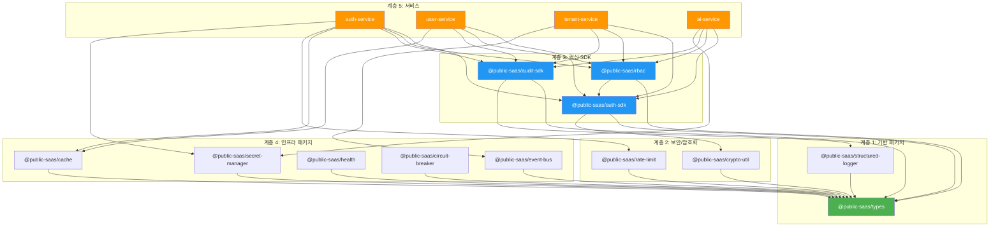
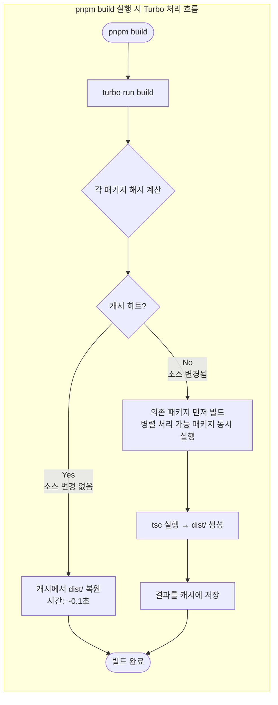

# 모노레포 탐색 가이드 — pnpm Workspace + Turbo

> **문서 ID**: ONBOARD-03-07
> **버전**: 1.0.0 | **작성일**: 2026-04-12 | **작성자**: Implementer (Sonnet)
> **학습 대상**: 모노레포가 처음인 신규 백엔드·풀스택 개발자
> **선행 문서**: `02-service-development.md`
> **예상 소요 시간**: 2~3시간 (읽기 + 실습)

---

## 목차

1. [모노레포란 무엇인가?](#1-모노레포란-무엇인가)
2. [이 프로젝트의 모노레포 전체 구조](#2-이-프로젝트의-모노레포-전체-구조)
3. [pnpm Workspace 동작 원리](#3-pnpm-workspace-동작-원리)
4. [Turbo 캐싱 — 왜 두 번째 빌드가 빠른가](#4-turbo-캐싱--왜-두-번째-빌드가-빠른가)
5. [서비스 간 로컬 패키지 의존성 설정법](#5-서비스-간-로컬-패키지-의존성-설정법)
6. [새 패키지에서 기존 패키지 import 방법](#6-새-패키지에서-기존-패키지-import-방법)
7. [`workspace:*` 버전 표기 의미](#7-workspace-버전-표기-의미)
8. [특정 패키지만 빌드하는 방법 (`--filter`)](#8-특정-패키지만-빌드하는-방법---filter)
9. [패키지 간 순환 의존성 방지 규칙](#9-패키지-간-순환-의존성-방지-규칙)
10. [공통 설정 파일 위치](#10-공통-설정-파일-위치)
11. [Turbo DAG 시각화](#11-turbo-dag-시각화)
12. [패키지 의존성 그래프 (Mermaid)](#12-패키지-의존성-그래프-mermaid)
13. [pnpm Workspace 동작 원리 플로우차트 (Mermaid)](#13-pnpm-workspace-동작-원리-플로우차트-mermaid)
14. [자주 묻는 질문](#14-자주-묻는-질문)
15. [변경 이력](#15-변경-이력)

---

## 1. 모노레포란 무엇인가?

### 1.1 비유로 이해하기

**하나의 도서관에 여러 책이 있다**고 상상해 보십시오.

- **폴리레포(poly-repo)**: 각 책이 별도 건물에 있습니다. 책 A의 내용이 바뀌면 책 B가 있는 건물에도 따로 가서 업데이트해야 합니다. 두 건물 사이를 오가는 시간이 낭비됩니다.
- **모노레포(mono-repo)**: 모든 책이 하나의 도서관에 있습니다. 책 A가 바뀌면 같은 건물 안에서 책 B도 즉시 확인하고 업데이트할 수 있습니다. 같은 도서관 규칙(코딩 스타일, 린트, 테스트 전략)을 공유합니다.

**코드로 옮기면**:
- `auth-service` (책 A)가 `auth-sdk` (책 B)를 사용합니다.
- `auth-sdk`에 JWT 검증 로직을 추가하면, `auth-service`에서 **즉시** 그 변경을 반영하여 테스트할 수 있습니다.
- npm 패키지로 배포하고 버전 태그를 붙이고 다시 설치하는 과정이 **없습니다**.

### 1.2 모노레포의 핵심 장점 (이 프로젝트 관점)

| 장점 | 설명 | 이 프로젝트에서의 예시 |
|------|------|---------------------|
| **원자적 변경** | 여러 패키지를 하나의 커밋으로 변경 가능 | `auth-sdk` 보안 버그 수정과 `auth-service` 테스트를 하나의 PR로 제출 |
| **코드 공유** | 공통 로직을 패키지로 추출하여 재사용 | `audit-sdk`의 `auditLog()` 함수를 17개 서비스가 공유 |
| **통합 린트/테스트** | 전체 코드베이스에 동일한 규칙 적용 | `pnpm lint`, `pnpm test`로 전체 품질 한 번에 검사 |
| **의존성 일관성** | 같은 버전의 외부 라이브러리 사용 | `zod`, `fastify` 버전이 모든 서비스에서 동일 |
| **CSAP 준수 용이** | 보안 정책을 공통 패키지로 강제 | `crypto-util`, `rbac` 패키지를 통해 모든 서비스가 동일한 암호화·권한 로직 사용 |

### 1.3 이 프로젝트에서 모노레포를 선택한 이유

CSAP 중/상 등급 인증을 위해서는 **보안 통제의 일관성**이 필수입니다. 폴리레포에서는 각 서비스가 자체적으로 인증·암호화·감사 로그를 구현하게 되어, 서비스마다 구현 수준이 달라질 위험이 있습니다. 모노레포는 공통 패키지로 이 문제를 해결합니다.

```
// 17개 서비스 모두 동일한 패턴 사용 (공통 패키지 덕분)
import { verifyToken } from '@public-saas/auth-sdk'
import { hasPermission } from '@public-saas/rbac'
import { auditLog } from '@public-saas/audit-sdk'
import { encrypt } from '@public-saas/crypto-util'
```

---

## 2. 이 프로젝트의 모노레포 전체 구조

### 2.1 워크스페이스 정의

`/data/ai-saas/pnpm-workspace.yaml`이 워크스페이스를 정의합니다:

```yaml
# 공공기관 SaaS 플랫폼 — pnpm 워크스페이스 정의
packages:
  - "platform/apps/*"       # Next.js 포털 앱
  - "platform/services/*"   # 마이크로서비스 17개
  - "platform/packages/*"   # 공유 패키지 40+개
  - "platform/plugins/*"    # Fastify 플러그인
  - "platform/tests/e2e"    # E2E 테스트
  - "business-template/*"   # 비즈니스 템플릿
```

### 2.2 전체 디렉토리 트리

```
/data/ai-saas/                          (루트 워크스페이스)
│
├── pnpm-workspace.yaml                 ← 워크스페이스 패키지 경로 정의
├── turbo.json                          ← Turbo 태스크 DAG 정의
├── tsconfig.base.json                  ← 모든 패키지가 상속하는 TS 설정
├── eslint.config.mjs                   ← 전체 린트 규칙
├── package.json                        ← 루트 (스크립트 진입점)
│
├── platform/
│   ├── apps/
│   │   └── portal/                     (패키지: @public-saas/portal)
│   │       ├── src/app/                ← Next.js App Router 페이지
│   │       ├── src/components/         ← UI 컴포넌트
│   │       └── package.json
│   │
│   ├── services/                       (17개 마이크로서비스)
│   │   ├── api-gateway/                (패키지: @public-saas/api-gateway)
│   │   ├── auth-service/               (패키지: @public-saas/auth-service)
│   │   │   ├── src/
│   │   │   │   ├── handlers/
│   │   │   │   ├── lib/
│   │   │   │   └── routes.ts
│   │   │   ├── tests/
│   │   │   ├── prisma/
│   │   │   ├── tsconfig.json           ← tsconfig.base.json 상속
│   │   │   └── package.json
│   │   ├── user-service/
│   │   ├── tenant-service/
│   │   ├── ai-service/
│   │   ├── audit-service/
│   │   ├── compliance-service/
│   │   ├── security-service/
│   │   ├── security-monitor-service/
│   │   ├── notification-service/
│   │   ├── file-service/
│   │   ├── billing-service/
│   │   ├── subscription-service/
│   │   ├── catalog-service/
│   │   ├── crm-service/
│   │   ├── menu-service/
│   │   └── saas-catalog-service/
│   │
│   └── packages/                       (40+개 공유 패키지)
│       ├── auth-sdk/                   (패키지: @public-saas/auth-sdk)
│       │   ├── src/index.ts            ← verifyToken(), generateToken()
│       │   └── package.json
│       ├── rbac/                       (패키지: @public-saas/rbac)
│       ├── audit-sdk/                  (패키지: @public-saas/audit-sdk)
│       ├── crypto-util/                (패키지: @public-saas/crypto-util)
│       ├── rate-limit/                 (패키지: @public-saas/rate-limit)
│       ├── secret-manager/             (패키지: @public-saas/secret-manager)
│       ├── structured-logger/          (패키지: @public-saas/structured-logger)
│       ├── event-bus/                  (패키지: @public-saas/event-bus)
│       ├── circuit-breaker/            (패키지: @public-saas/circuit-breaker)
│       ├── health/                     (패키지: @public-saas/health)
│       ├── mesh-ready/                 (패키지: @public-saas/mesh-ready)
│       ├── cache/                      (패키지: @public-saas/cache)
│       ├── pagination/                 (패키지: @public-saas/pagination)
│       ├── saga/                       (패키지: @public-saas/saga)
│       ├── types/                      (패키지: @public-saas/types)
│       └── ...                         (그 외 20+개)
│
├── packages/                           (루트 레벨 전문 패키지)
│   ├── feature-flag-sdk/               (패키지: @public-saas/feature-flag-sdk)
│   ├── slo-escalation/                 (패키지: @public-saas/slo-escalation)
│   ├── dora-exporter/                  (패키지: @public-saas/dora-exporter)
│   ├── ml-pipeline/                    (패키지: @public-saas/ml-pipeline)
│   ├── audit-collector/
│   └── tech-debt-scanner/
│
├── business-template/                  (비즈니스 템플릿)
├── docs/                               (문서)
├── infra/                              (인프라 설정)
└── .gitea/workflows/                   (CI/CD 파이프라인)
```

---

## 3. pnpm Workspace 동작 원리

### 3.1 심볼릭 링크로 연결되는 구조

pnpm workspace의 핵심은 **심볼릭 링크(symbolic link)**입니다. `pnpm install`을 실행하면, pnpm은 각 패키지의 로컬 의존성을 npm 레지스트리에서 다운로드하는 대신, 프로젝트 내부 경로를 가리키는 심볼릭 링크를 만듭니다.

```
# auth-service가 auth-sdk를 import할 때 실제 경로:
platform/services/auth-service/
  node_modules/
    @public-saas/
      auth-sdk -> ../../../../packages/auth-sdk  (심볼릭 링크)
```

이 덕분에 `auth-sdk` 소스를 수정하면 `auth-service`가 **즉시** 변경된 코드를 사용합니다. (단, TypeScript 소스는 빌드가 필요합니다 — 섹션 4 참조)

### 3.2 `pnpm install` 한 번으로 전체 설치

```bash
# 루트에서 한 번만 실행하면 모든 워크스페이스 패키지의 의존성 설치
cd /data/ai-saas
pnpm install

# 결과: 각 패키지의 node_modules에 심볼릭 링크 생성
# 루트 node_modules에는 공통 의존성이 호이스팅됨
```

### 3.3 의존성 호이스팅 (Hoisting)

여러 패키지가 같은 외부 라이브러리(예: `zod`)를 사용하면, pnpm은 루트 `node_modules`에 한 번만 설치하고 각 패키지가 이를 공유합니다.

```
/data/ai-saas/
  node_modules/
    zod/            ← 루트에 한 번만 설치 (버전 공유)
    fastify/        ← 루트에 한 번만 설치
  platform/
    services/
      auth-service/
        node_modules/
          zod -> ../../../node_modules/zod  (심볼릭 링크)
```

**주의**: `pnpm-workspace.yaml`에 명시된 패키지만 워크스페이스로 인식됩니다. 새 서비스를 추가할 때 경로가 글로브 패턴과 맞지 않으면 독립 패키지로 취급됩니다.

---

## 4. Turbo 캐싱 — 왜 두 번째 빌드가 빠른가

### 4.1 Turbo가 없을 때의 문제

`auth-sdk`가 17개 서비스에서 사용된다고 가정합니다. `auth-sdk`를 변경하지 않았는데도 `pnpm -r run build`를 실행하면 `auth-sdk`가 17번 다시 빌드됩니다. 낭비입니다.

### 4.2 Turbo 캐싱 원리

Turbo는 각 태스크의 **입력(소스 파일 + 의존성)의 해시값**을 계산합니다. 이전 실행 결과의 해시와 현재 해시가 같으면, 캐시에서 결과를 복원합니다.

```
첫 번째 빌드:
  auth-sdk 소스 → 해시 계산 → 빌드 실행 → dist/ 저장 + 해시 캐시 저장
  시간: 8초

두 번째 빌드 (auth-sdk 변경 없음):
  auth-sdk 소스 → 해시 계산 → 이전 해시와 동일 → 캐시에서 dist/ 복원
  시간: 0.1초 (cache hit)

auth-sdk 수정 후 빌드:
  auth-sdk 소스 → 해시 계산 → 이전 해시와 다름 → 재빌드
  의존하는 서비스들도 자동으로 재빌드 대상에 포함
```

### 4.3 `turbo.json` 설정 해석

```json
{
  "$schema": "https://turborepo.dev/schema.json",
  "tasks": {
    "build": {
      "dependsOn": ["^build"],   // ^ = 내가 의존하는 패키지의 build가 먼저 완료되어야 함
      "outputs": ["dist/**", ".next/**"],  // 캐시에 저장할 결과물
      "env": ["NODE_ENV"]        // 이 환경 변수가 바뀌면 캐시 무효화
    },
    "test": {
      "dependsOn": ["^build"],   // 테스트 전에 의존 패키지 빌드 필요
      "env": ["DATABASE_URL", "REDIS_URL", "NODE_ENV"]
    },
    "dev": {
      "cache": false,            // 개발 서버는 캐시 안 함 (항상 실행)
      "persistent": true         // 프로세스가 지속 실행됨 (Ctrl+C까지)
    }
  }
}
```

**`dependsOn: ["^build"]`의 의미**: `auth-service`가 `auth-sdk`에 의존하면, `auth-service build`를 실행하기 전에 Turbo가 자동으로 `auth-sdk build`를 먼저 실행합니다. 순서를 수동으로 관리할 필요가 없습니다.

### 4.4 캐시 위치

```bash
# 로컬 캐시 위치
.turbo/cache/

# 캐시 강제 초기화 (문제 발생 시)
pnpm clean && turbo run build --force

# 특정 태스크만 캐시 무시
turbo run build --force --filter=@public-saas/auth-service
```

---

## 5. 서비스 간 로컬 패키지 의존성 설정법

### 5.1 기존 서비스에 공유 패키지 추가

```bash
# auth-service에 pagination 패키지 추가
cd /data/ai-saas
pnpm --filter @public-saas/auth-service add @public-saas/pagination
```

실행 후 `platform/services/auth-service/package.json`에 추가됩니다:

```json
{
  "dependencies": {
    "@public-saas/pagination": "workspace:*"
  }
}
```

### 5.2 새 서비스 생성 시 공유 패키지 연결

새 서비스 `reporting-service`를 만든다면:

```bash
# 1. 서비스 디렉토리 생성
mkdir -p /data/ai-saas/platform/services/reporting-service/src

# 2. package.json 작성 (workspace:* 사용)
cat > /data/ai-saas/platform/services/reporting-service/package.json << 'EOF'
{
  "name": "@public-saas/reporting-service",
  "version": "0.1.0",
  "private": true,
  "type": "module",
  "scripts": {
    "build": "tsc",
    "dev": "tsx watch src/index.ts",
    "test": "vitest run",
    "typecheck": "tsc --noEmit"
  },
  "dependencies": {
    "@public-saas/types": "workspace:*",
    "@public-saas/auth-sdk": "workspace:*",
    "@public-saas/rbac": "workspace:*",
    "@public-saas/audit-sdk": "workspace:*",
    "@public-saas/structured-logger": "workspace:*",
    "fastify": "^5.0.0"
  }
}
EOF

# 3. 루트에서 install 재실행 — 심볼릭 링크 생성
cd /data/ai-saas
pnpm install
```

---

## 6. 새 패키지에서 기존 패키지 import 방법

### 6.1 기본 import 패턴

`package.json`에 의존성을 추가한 후, TypeScript 소스에서 일반 npm 패키지처럼 import합니다:

```typescript
// platform/services/auth-service/src/handlers/login.handler.ts

// 공유 패키지 import — 경로가 아닌 패키지 이름 사용
import { verifyToken, generateToken } from '@public-saas/auth-sdk'
import { hasPermission } from '@public-saas/rbac'
import { auditLog } from '@public-saas/audit-sdk'
import { encrypt } from '@public-saas/crypto-util'
import type { User, TenantId } from '@public-saas/types'
```

### 6.2 빌드 순서 문제 해결

공유 패키지는 TypeScript 소스입니다. 서비스에서 import하려면 **패키지가 먼저 빌드되어 있어야** 합니다.

```bash
# 잘못된 방법: auth-sdk가 빌드 안 된 상태에서 auth-service 실행
cd platform/services/auth-service
pnpm dev  # 오류: Cannot find module '@public-saas/auth-sdk/dist/...'

# 올바른 방법 1: 의존성 포함 빌드
pnpm --filter ...@public-saas/auth-service build  # auth-sdk 먼저 빌드 후 auth-service 빌드

# 올바른 방법 2: 전체 빌드 후 개발 서버
cd /data/ai-saas
pnpm build  # 전체 빌드 (Turbo가 순서 자동 결정)
pnpm --filter @public-saas/auth-service dev  # 이미 빌드된 상태에서 개발 서버 기동
```

### 6.3 `tsconfig.json`에서 경로 별칭 불필요

pnpm workspace가 심볼릭 링크를 만들기 때문에, `tsconfig.json`의 `paths`에 별칭을 추가할 필요가 없습니다. Node.js가 `node_modules/@public-saas/auth-sdk`를 찾아서 심볼릭 링크를 따라갑니다.

```json
// tsconfig.json에 이런 설정이 필요 없음 (자동으로 해결됨)
// "paths": {
//   "@public-saas/auth-sdk": ["../../packages/auth-sdk/src"]
// }
```

---

## 7. `workspace:*` 버전 표기 의미

### 7.1 `workspace:*`란?

```json
{
  "dependencies": {
    "@public-saas/auth-sdk": "workspace:*"
  }
}
```

`workspace:*`는 **"pnpm 워크스페이스 안에 있는 가장 최신 버전"**을 의미합니다.

- `*`는 버전 제약 없음 — 항상 로컬 최신 코드 사용
- npm 레지스트리를 조회하지 않음 — 오프라인에서도 동작
- 빌드 시 항상 현재 소스 코드 반영

### 7.2 `workspace:^` vs `workspace:~` vs `workspace:*`

| 표기 | 의미 | 이 프로젝트 사용 여부 |
|------|------|-------------------|
| `workspace:*` | 항상 최신 로컬 버전 | **사용** (표준) |
| `workspace:^1.0.0` | 호환 버전 범위 (semver) | 외부 배포 시 사용 |
| `workspace:~1.0.0` | 패치 버전 범위 (semver) | 외부 배포 시 사용 |

### 7.3 배포 시 버전 변환

CI/CD 파이프라인에서 `pnpm publish`를 실행할 때, pnpm은 `workspace:*`를 실제 버전 번호로 자동 변환합니다:

```
빌드 전 package.json:
  "@public-saas/auth-sdk": "workspace:*"

배포 후 배포된 package.json:
  "@public-saas/auth-sdk": "0.1.0"  (실제 버전으로 대체)
```

이 프로젝트는 내부 k3s 클러스터에 배포하므로 외부 배포는 없지만, 원리를 이해해 두면 도움이 됩니다.

---

## 8. 특정 패키지만 빌드하는 방법 (`--filter`)

### 8.1 기본 `--filter` 사용법

```bash
# 특정 패키지만 빌드
pnpm --filter @public-saas/auth-service build

# 특정 패키지만 테스트
pnpm --filter @public-saas/auth-service test

# 여러 패키지 동시 실행
pnpm --filter @public-saas/auth-service --filter @public-saas/user-service build
```

### 8.2 의존성 포함 필터

```bash
# 패키지와 그 패키지가 의존하는 모든 패키지 빌드 (업스트림)
# "..." 접두사 = 의존성(upstream) 포함
pnpm --filter ...@public-saas/auth-service build

# 예: auth-service가 auth-sdk, types에 의존하면
# auth-sdk → types → auth-service 순서로 빌드

# 패키지와 그 패키지에 의존하는 모든 패키지 빌드 (다운스트림)
# "..." 접미사 = 의존하는 패키지(downstream) 포함
pnpm --filter @public-saas/auth-sdk... build

# 예: auth-sdk가 바뀌면 auth-sdk를 사용하는 모든 서비스 재빌드
```

### 8.3 glob 패턴 필터

```bash
# 이름에 "service"가 포함된 모든 패키지 빌드
pnpm --filter "*service*" build

# platform/services/ 하위 모든 패키지 테스트
pnpm --filter "./platform/services/**" test

# 변경된 파일이 있는 패키지만 (git diff 기반)
pnpm --filter "[HEAD~1]" build      # 마지막 커밋 이후 변경된 패키지
pnpm --filter "[origin/main...]" build  # main 브랜치 대비 변경된 패키지
```

### 8.4 실무 팁 — 개발 중 자주 쓰는 패턴

```bash
# 내가 작업 중인 서비스만 빠르게 테스트
pnpm --filter @public-saas/auth-service test:coverage

# 의존하는 패키지가 바뀐 경우 관련 서비스 전부 테스트
pnpm --filter ...@public-saas/auth-service test

# 특정 서비스의 개발 서버를 띄우기 전 빌드
pnpm --filter ...@public-saas/auth-service build && \
pnpm --filter @public-saas/auth-service dev
```

---

## 9. 패키지 간 순환 의존성 방지 규칙

### 9.1 순환 의존성이 왜 문제인가?

```
# 순환 의존성 예시 (절대 금지)
auth-sdk → rbac → auth-sdk (순환!)

# Turbo 빌드 시: auth-sdk를 빌드하려면 rbac가 필요,
# rbac를 빌드하려면 auth-sdk가 필요 → 무한 루프 → 빌드 실패
```

### 9.2 이 프로젝트의 의존성 계층 규칙

아래 계층 구조를 **위에서 아래 방향으로만** 의존해야 합니다. 역방향 또는 같은 계층 간 의존은 금지입니다.

```
계층 1 (기반) — 다른 패키지에 의존하지 않음
  @public-saas/types          ← 공통 타입 정의만
  @public-saas/structured-logger

계층 2 (보안/암호화) — 계층 1에만 의존 가능
  @public-saas/crypto-util    ← types만 의존
  @public-saas/rate-limit     ← types만 의존

계층 3 (핵심 SDK) — 계층 1~2에만 의존 가능
  @public-saas/auth-sdk       ← types, crypto-util 의존
  @public-saas/rbac           ← types, auth-sdk 의존
  @public-saas/audit-sdk      ← types만 의존

계층 4 (인프라 패키지) — 계층 1~3에만 의존 가능
  @public-saas/cache          ← types 의존
  @public-saas/event-bus      ← types 의존
  @public-saas/health         ← types 의존
  @public-saas/circuit-breaker← types 의존
  @public-saas/secret-manager ← types 의존

계층 5 (서비스) — 위 모든 계층에 의존 가능
  @public-saas/auth-service   ← auth-sdk, rbac, audit-sdk, cache 등 의존
  @public-saas/user-service   ← auth-sdk, rbac, audit-sdk 등 의존
  ...
```

### 9.3 순환 의존성 탐지

```bash
# Turbo 빌드 실패 시 순환 의존성 확인
turbo run build --graph | grep -i "cycle"

# 또는 Turbo 그래프 생성 후 확인
turbo run build --graph=graph.dot
# Graphviz로 시각화: dot -Tsvg graph.dot -o graph.svg
```

---

## 10. 공통 설정 파일 위치

### 10.1 TypeScript 설정

```
/data/ai-saas/
├── tsconfig.base.json                  ← 모든 패키지가 상속하는 기본 설정
│                                         (ES2022, strict: true, noUnusedLocals: true 등)
│
└── platform/
    └── services/
        └── auth-service/
            └── tsconfig.json           ← 서비스별 tsconfig (base 상속)
```

**`tsconfig.base.json` 핵심 설정**:

```json
{
  "compilerOptions": {
    "target": "ES2022",
    "module": "ESNext",
    "moduleResolution": "bundler",
    "strict": true,
    "noUnusedLocals": true,       // 미사용 변수 → 컴파일 에러 (dead code 방지)
    "noUnusedParameters": true,   // 미사용 매개변수 → 컴파일 에러
    "noUncheckedIndexedAccess": true,  // 배열 접근 시 undefined 가능성 체크
    "verbatimModuleSyntax": true  // import type과 import를 구분
  }
}
```

**각 패키지의 `tsconfig.json`** (서비스 예시):

```json
{
  "extends": "../../tsconfig.base.json",  // 루트 base 상속
  "compilerOptions": {
    "outDir": "dist",
    "rootDir": "src"
  },
  "include": ["src/**/*"],
  "exclude": ["node_modules", "dist", "tests"]
}
```

### 10.2 ESLint 설정

```
/data/ai-saas/eslint.config.mjs         ← 전체 워크스페이스 공통 규칙
```

각 서비스는 별도 ESLint 설정 없이 루트 설정을 자동으로 사용합니다.

### 10.3 Prettier 설정

이 프로젝트는 ESLint의 스타일 규칙을 사용합니다. 별도 `.prettierrc` 파일보다는 `eslint.config.mjs`에 포맷팅 규칙이 포함됩니다.

**VSCode 설정 권장사항** (`.vscode/settings.json`):

```json
{
  "editor.formatOnSave": true,
  "editor.defaultFormatter": "dbaeumer.vscode-eslint",
  "eslint.validate": ["typescript", "typescriptreact"],
  "typescript.tsdk": "node_modules/typescript/lib"
}
```

---

## 11. Turbo DAG 시각화

Turbo는 패키지 의존성을 DAG(Directed Acyclic Graph, 방향 비순환 그래프)로 관리합니다. 이 그래프를 시각화하면 빌드 순서와 병렬화 구조를 한눈에 볼 수 있습니다.

```bash
# 빌드 그래프 생성 (터미널 출력)
turbo run build --graph

# 그래프를 파일로 저장 (Graphviz DOT 형식)
turbo run build --graph=build-graph.dot

# SVG로 변환 (Graphviz 설치 필요)
dot -Tsvg build-graph.dot -o build-graph.svg

# 특정 패키지의 의존 그래프만
turbo run build --filter=@public-saas/auth-service --graph

# 드라이런 — 실제 빌드 없이 실행 계획만 출력
turbo run build --dry-run=json | jq '.tasks[].taskId'
```

**그래프 해석 방법**:
- 화살표 방향: 의존 방향 (A → B는 "A가 B에 의존")
- 노드 색상: Turbo 기본값으로는 모두 동일
- 병렬 실행 가능한 노드: 같은 "레벨"에 있는 노드들 (의존 관계 없음)

---

## 12. 패키지 의존성 그래프 (Mermaid)

이 그래프는 핵심 패키지와 서비스 간의 실제 의존 관계를 보여줍니다.



**그래프 읽는 법**: 화살표 방향이 의존 방향입니다. `auth-service → auth-sdk`는 auth-service가 auth-sdk를 사용한다는 뜻입니다. 계층을 거슬러 올라가는 화살표(예: `types → auth-service`)가 없으므로 순환 의존성이 없습니다.

---

## 13. pnpm Workspace 동작 원리 플로우차트 (Mermaid)

```mermaid
flowchart TD
  A([개발자: pnpm install 실행]) --> B{pnpm-workspace.yaml\n확인}

  B --> C[워크스페이스 패키지 목록 수집\nplatform/services/*, platform/packages/*\nplatform/apps/*]

  C --> D[각 package.json 파싱\n의존성 목록 수집]

  D --> E{의존성 유형 분류}

  E -->|외부 패키지\n예: fastify, zod| F[npm 레지스트리에서 다운로드\n루트 node_modules에 저장]
  E -->|내부 워크스페이스 패키지\nworkspace:*| G[로컬 경로 해석\n해당 패키지 디렉토리 찾기]

  F --> H[루트 node_modules에 호이스팅\n중복 방지]
  G --> I[심볼릭 링크 생성\n각 패키지의 node_modules 아래]

  H --> J[의존성 설치 완료]
  I --> J

  J --> K([개발자: import 사용])

  K --> L{"import '@public-saas/auth-sdk'"}
  L --> M[Node.js: node_modules 탐색]
  M --> N[@public-saas/auth-sdk 폴더 발견\n심볼릭 링크]
  N --> O[실제 경로: platform/packages/auth-sdk/dist/\n링크를 따라감]
  O --> P[모듈 로드 성공]

  style A fill:#4CAF50,color:#fff
  style P fill:#2196F3,color:#fff
  style G fill:#FF9800,color:#fff
  style I fill:#FF9800,color:#fff
```



---

## 14. 자주 묻는 질문

**Q. 새 패키지를 만들었는데 import가 안 됩니다.**

A. 두 가지를 확인하십시오. 첫째, `pnpm-workspace.yaml`의 glob 패턴이 새 패키지 경로를 포함하는지 확인합니다. 둘째, `pnpm install`을 루트에서 다시 실행하여 심볼릭 링크를 생성합니다. 셋째, 새 패키지를 먼저 빌드합니다 (`pnpm --filter @public-saas/new-package build`).

**Q. `workspace:*` 버전이 계속 old 버전을 가리키는 것 같습니다.**

A. TypeScript 소스를 수정했다면 `dist/`가 오래된 상태일 수 있습니다. `pnpm --filter @public-saas/패키지명 build`로 재빌드하십시오. 또는 `pnpm build`로 전체 재빌드합니다.

**Q. Turbo 캐시가 의심됩니다. 캐시를 완전히 무시하고 싶습니다.**

A. `turbo run build --force`를 사용하면 캐시를 무시하고 전체 재빌드합니다. 또는 `.turbo/` 디렉토리를 삭제하십시오.

**Q. 특정 서비스 개발 중에 공유 패키지를 동시에 수정하고 싶습니다.**

A. 공유 패키지는 `dev` 모드로 watch 빌드를 지원하지 않습니다 (TypeScript 소스이므로). 공유 패키지를 수정할 때마다 `pnpm --filter @public-saas/패키지명 build`를 실행하십시오. 또는 Turbo의 `watch` 모드를 활용합니다: `turbo watch build --filter=...@public-saas/서비스명`.

**Q. 순환 의존성 오류가 발생했습니다.**

A. `turbo run build --graph`로 의존 그래프를 확인하고, 계층 규칙(섹션 9.2)을 위반하는 의존성을 찾아 제거하십시오. 두 패키지가 서로 필요한 기능이 있다면, 공통 기능을 더 낮은 계층의 새 패키지로 추출하십시오.

**Q. `pnpm --filter` 패턴이 아무 패키지도 매칭하지 않습니다.**

A. `pnpm ls -r --json`으로 전체 패키지 목록과 정확한 이름을 확인하십시오. `@public-saas/auth-service`와 같이 패키지명 앞에 스코프(`@public-saas/`)가 포함되어야 합니다.

---

## 15. 변경 이력

| 버전 | 일자 | 내용 | 작성자 |
|------|------|------|--------|
| 1.0.0 | 2026-04-12 | 초안 작성 — 모노레포 개념, 전체 구조, pnpm workspace, Turbo, 패키지 설정, import 방법, 순환 의존성 규칙, 공통 설정, Mermaid 다이어그램 | Implementer (Sonnet) |
