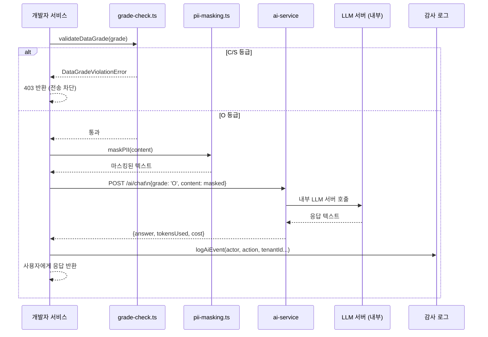
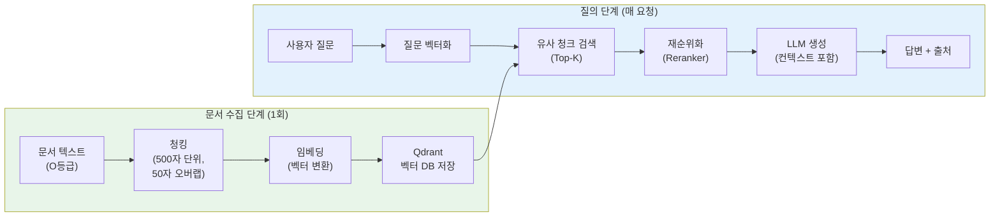

# AI 기능 개발 가이드

> **버전**: 1.0.0 | **작성일**: 2026-04-12
> **대상**: AI 기능을 처음 개발하는 신규 개발자
> **CSAP**: N2SF N-05 (데이터 등급 필터링), D-08-06 (Rate Limiting), D-06 (감사 로그)
> **관련 문서**: `02-architecture/services/05-ai-service.md`, `platform/services/ai-service/src/`

---

## 목차

1. [AI 기능 개발의 특수성](#1-ai-기능-개발의-특수성)
2. [N2SF 데이터 등급 체크가 왜 첫 번째 단계인가](#2-n2sf-데이터-등급-체크가-왜-첫-번째-단계인가)
3. [ai-service를 통해 LLM을 호출하는 방법](#3-ai-service를-통해-llm을-호출하는-방법)
4. [직접 Anthropic API 호출이 금지된 이유](#4-직접-anthropic-api-호출이-금지된-이유)
5. [AI 응답 처리 패턴 — 스트리밍 vs 일반](#5-ai-응답-처리-패턴--스트리밍-vs-일반)
6. [RAG 구현 방법](#6-rag-구현-방법)
7. [AI 기능 테스트 방법](#7-ai-기능-테스트-방법)
8. [프롬프트 엔지니어링 팁](#8-프롬프트-엔지니어링-팁)
9. [AI 요청 비용 모니터링](#9-ai-요청-비용-모니터링)

---

## 1. AI 기능 개발의 특수성

### 1.1 일반 API 개발과의 차이점

이 프레임워크에서 AI 기능을 개발하는 것은 일반 REST API를 개발하는 것과 몇 가지 중요한 차이가 있습니다.

```
일반 API 개발:
  1. Zod 스키마 정의
  2. 핸들러 작성 (DB 조회 → 비즈니스 로직 → 응답)
  3. 라우트 등록
  4. 테스트 작성
  → 입력·출력이 결정론적(항상 같은 값)

AI 기능 개발:
  1. N2SF 데이터 등급 확인 (⭐ AI에만 있는 추가 단계)
  2. PII 마스킹 적용 (⭐ AI에만 있는 추가 단계)
  3. ai-service 내부 API 호출 (외부 API 직접 호출 금지)
  4. 비결정론적 응답 처리 (같은 입력 → 다른 출력 가능)
  5. 비용 추적 (⭐ AI에만 있는 추가 단계)
  6. 테스트 시 모킹 전략 (실제 LLM 호출 vs 모킹)
```

### 1.2 AI 기능의 핵심 원칙

```
원칙 1: 데이터 등급 우선 (N2SF N-05)
  → C/S 등급 데이터는 어떤 상황에서도 LLM에 전달 불가
  → 등급 체크를 잊으면 감사 위반 + 보안 사고

원칙 2: PII 마스킹 (N2SF N-05)
  → O등급도 이메일, 전화번호, 주민번호 등 PII는 마스킹
  → maskPII() 함수가 자동 처리하지만, 커스텀 PII는 직접 마스킹

원칙 3: 내부 Gateway 경유 (CSAP D-12)
  → ai-service가 제공하는 내부 API만 사용
  → 직접 anthropic SDK, openai SDK import 금지

원칙 4: 비용 인식 (운영 효율)
  → AI 요청은 일반 DB 쿼리보다 100배 이상 비용이 높다
  → 불필요한 반복 호출, 캐시 미사용은 예산 낭비

원칙 5: 감사 로그 (CSAP D-06)
  → 모든 AI 호출은 logAiEvent()로 기록 필수
  → 누가, 언제, 어떤 등급 데이터로, 어떤 AI를 호출했는지
```

### 1.3 AI 기능 개발 전체 흐름



---

## 2. N2SF 데이터 등급 체크가 왜 첫 번째 단계인가

### 2.1 N2SF 데이터 등급이란

N2SF(National Network Security Framework, 국가 네트워크 보안 프레임워크)는 공공기관 데이터를 3등급으로 분류합니다.

| 등급 | 명칭 | 예시 | AI 전송 |
|------|------|------|--------|
| C | 기밀 (Confidential) | 개인정보(주민번호, 의료기록), 비밀 문서 | 절대 금지 |
| S | 민감 (Sensitive) | 내부 업무 문서, 미공개 정책 | 절대 금지 |
| O | 공개 (Open) | 공개 법령, 비식별 통계, 공공 데이터 | PII 마스킹 후 가능 |

### 2.2 왜 가장 먼저 확인해야 하는가

```
생각해 보기:
  "로직 먼저 완성하고 나중에 등급 체크 추가하면 안 될까요?"

  → 절대 안 됩니다.

이유 1: 코드 경로 오염
  등급 체크가 중간에 있으면, 그 전 단계에서 이미 데이터가
  처리(로깅, 캐싱, 직렬화)될 수 있습니다.
  첫 번째 단계여야 오염이 없습니다.

이유 2: CSAP 감리 요건
  행안부 정보시스템 감리에서 "보안 검사가 로직보다 먼저 실행됨"을
  코드 수준에서 확인합니다.

이유 3: 사고 예방
  실제 ai-service 코드를 보면 모든 핸들러의 첫 번째 블록이
  항상 validateDataGrade()입니다.
```

### 2.3 실제 코드에서 확인

`platform/services/ai-service/src/handlers/ai-agent.handler.ts` 참조:

```typescript
// ✅ 올바른 패턴: 모든 로직보다 등급 체크 먼저
export async function agentHandler(
  request: FastifyRequest<{ Body: AgentBody }>,
  reply: FastifyReply,
): Promise<void> {
  const body = agentSchema.parse(request.body);  // 1. 입력 검증
  const actor = request.headers['x-user-id'] as string;

  // 2. N2SF 등급 체크 — 어떤 로직보다 먼저!
  try {
    validateDataGrade(body.grade as DataGrade);
  } catch (error) {
    if (error instanceof DataGradeViolationError) {
      await logAiEvent('AI_GRADE_VIOLATION', actor, 'agent', body.tenantId,
        request.ip, request.headers['user-agent'] ?? 'unknown',
        { grade: body.grade, blocked: true });
      await reply.status(403).send({
        success: false,
        error: { code: error.code, message: error.message }
      });
      return;  // 즉시 종료
    }
    throw error;
  }

  // 3. 이후 비즈니스 로직 (등급 통과 후에만 실행)
  // ...
}

// ❌ 잘못된 패턴: 등급 체크가 나중에 있음
export async function badHandler(request, reply) {
  const body = request.body;
  const result = await expensiveProcessing(body);  // 먼저 처리됨!
  validateDataGrade(body.grade);  // 너무 늦음 — CSAP 위반
  return reply.send(result);
}
```

### 2.4 내 서비스에서 직접 구현할 때

다른 서비스(예: `report-service`)에서 AI 기능을 만들 때:

```typescript
// platform/services/report-service/src/handlers/ai-summary.handler.ts

import { validateDataGrade, DataGradeViolationError } from '../lib/grade-check.js';
import { maskPII } from '../lib/pii-masking.js';
import { auditLog } from '../lib/audit.js';
import type { DataGrade } from '@public-saas/types';

const summarySchema = z.object({
  tenantId: z.string().uuid(),
  grade: z.enum(['O']),          // API 스키마에서 C/S를 애초에 막음
  reportContent: z.string().min(1).max(10000),
});

export async function aiSummaryHandler(request, reply) {
  const body = summarySchema.parse(request.body);
  const actor = request.headers['x-user-id'] as string;

  // Step 1: N2SF 등급 체크 (필수, 최우선)
  try {
    validateDataGrade(body.grade as DataGrade);
  } catch (error) {
    if (error instanceof DataGradeViolationError) {
      await auditLog({
        actor,
        action: 'AI_BLOCKED_GRADE_VIOLATION',
        target: body.tenantId,
        metadata: { grade: body.grade },
      });
      return reply.status(403).send({ error: error.message });
    }
    throw error;
  }

  // Step 2: PII 마스킹
  const maskedContent = maskPII(body.reportContent);

  // Step 3: ai-service 내부 호출
  const response = await fetch('http://ai-service.saas-platform.svc.cluster.local:3009/ai/chat', {
    method: 'POST',
    headers: {
      'Content-Type': 'application/json',
      'x-internal-service-key': process.env['INTERNAL_SERVICE_KEY']!,
      'x-user-id': actor,
    },
    body: JSON.stringify({
      tenantId: body.tenantId,
      grade: 'O',
      messages: [
        {
          role: 'system',
          content: '공공기관 보고서를 3문장으로 요약하십시오.',
        },
        {
          role: 'user',
          content: maskedContent,
        },
      ],
    }),
  });

  if (!response.ok) {
    throw new Error(`ai-service 호출 실패: ${response.status}`);
  }

  const aiResult = await response.json();

  // Step 4: 감사 로그
  await auditLog({
    actor,
    action: 'AI_SUMMARY_GENERATED',
    target: body.tenantId,
    metadata: { tokensUsed: aiResult.data?.tokensUsed },
  });

  return reply.send({ success: true, data: { summary: aiResult.data?.message } });
}
```

---

## 3. ai-service를 통해 LLM을 호출하는 방법

### 3.1 ai-service 내부 엔드포인트 구조

ai-service는 클러스터 내부 서비스로만 접근 가능합니다. 외부에서는 API Gateway를 통해서만 접근됩니다.

```
내부 주소: http://ai-service.saas-platform.svc.cluster.local:3009
인증: x-internal-service-key 헤더 (INTERNAL_SERVICE_KEY 환경 변수)
```

### 3.2 주요 엔드포인트 요약

| 용도 | 메서드 | 경로 | 비고 |
|------|--------|------|------|
| 일반 채팅 | POST | /ai/chat | 동기 응답 |
| 스트리밍 채팅 | POST | /ai/chat/stream | SSE 응답 |
| 텍스트 임베딩 | POST | /ai/embed | 벡터 생성 |
| 문서 수집(RAG) | POST | /ai/rag/ingest | 문서 → 벡터 DB |
| RAG 질의 | POST | /ai/rag/query | 문서 기반 답변 |
| 에이전트 실행 | POST | /ai/agent | ReAct 패턴 |
| 구조화 출력 | POST | /ai/structured | JSON 스키마 강제 |
| 문서 분석 | POST | /ai/document/analyze | 공문서 분석 |

### 3.3 일반 채팅 호출 예시

```typescript
// 다른 서비스에서 ai-service를 호출하는 표준 패턴

interface AIChatRequest {
  tenantId: string;
  grade: 'O';                    // 항상 O (C/S는 절대 불가)
  messages: Array<{
    role: 'system' | 'user' | 'assistant';
    content: string;
  }>;
  modelId?: string;              // 특정 모델 지정 (미지정 시 기본값)
  temperature?: number;          // 0.0~2.0 (기본 0.7)
  maxTokens?: number;            // 최대 토큰 수 (기본 2048)
}

interface AIChatResponse {
  success: boolean;
  data?: {
    message: string;
    model: string;
    tokensUsed: { input: number; output: number; total: number };
    cost: number;               // USD 단위
    latencyMs: number;
  };
  error?: { code: string; message: string };
}

async function callAIChat(
  tenantId: string,
  systemPrompt: string,
  userMessage: string,
  actor: string,
): Promise<string> {
  const AI_SERVICE_URL = process.env['AI_SERVICE_URL']
    ?? 'http://ai-service.saas-platform.svc.cluster.local:3009';
  const INTERNAL_KEY = process.env['INTERNAL_SERVICE_KEY']!;

  // PII 마스킹 (O등급이어도 필수)
  const maskedMessage = maskPII(userMessage);

  const response = await fetch(`${AI_SERVICE_URL}/ai/chat`, {
    method: 'POST',
    headers: {
      'Content-Type': 'application/json',
      'x-internal-service-key': INTERNAL_KEY,
      'x-user-id': actor,
    },
    body: JSON.stringify({
      tenantId,
      grade: 'O',
      messages: [
        { role: 'system', content: systemPrompt },
        { role: 'user', content: maskedMessage },
      ],
      temperature: 0.3,          // 공공문서는 낮은 temperature 권장
      maxTokens: 1024,
    } satisfies AIChatRequest),
    signal: AbortSignal.timeout(30_000),  // 30초 타임아웃
  });

  if (!response.ok) {
    const error = await response.json().catch(() => ({ error: { message: 'Unknown error' } }));
    throw new Error(`AI 호출 실패 (${response.status}): ${error.error?.message}`);
  }

  const result: AIChatResponse = await response.json();
  if (!result.success || !result.data) {
    throw new Error('AI 응답 형식 오류');
  }

  return result.data.message;
}
```

### 3.4 구조화 출력 (JSON 강제)

AI가 특정 JSON 구조로 답변하도록 강제합니다.

```typescript
// 예: 공문서에서 정보 추출
interface ExtractedInfo {
  title: string;
  date: string;
  department: string;
  summary: string;
  actionItems: string[];
}

async function extractDocumentInfo(
  tenantId: string,
  documentText: string,
  actor: string,
): Promise<ExtractedInfo> {
  const AI_SERVICE_URL = process.env['AI_SERVICE_URL']!;

  const response = await fetch(`${AI_SERVICE_URL}/ai/structured`, {
    method: 'POST',
    headers: {
      'Content-Type': 'application/json',
      'x-internal-service-key': process.env['INTERNAL_SERVICE_KEY']!,
      'x-user-id': actor,
    },
    body: JSON.stringify({
      tenantId,
      grade: 'O',
      prompt: `다음 공문서에서 정보를 추출하십시오:\n\n${maskPII(documentText)}`,
      schema: {
        type: 'object',
        properties: {
          title: { type: 'string', description: '문서 제목' },
          date: { type: 'string', description: '문서 날짜 (YYYY-MM-DD)' },
          department: { type: 'string', description: '발신 부서명' },
          summary: { type: 'string', description: '핵심 내용 3문장 요약' },
          actionItems: {
            type: 'array',
            items: { type: 'string' },
            description: '조치 사항 목록',
          },
        },
        required: ['title', 'date', 'department', 'summary', 'actionItems'],
      },
    }),
    signal: AbortSignal.timeout(60_000),
  });

  const result = await response.json();
  return result.data as ExtractedInfo;
}
```

---

## 4. 직접 Anthropic API 호출이 금지된 이유

### 4.1 규제 이유 (N2SF N-05)

```
외부 클라우드 API = 데이터가 외부 서버로 전송

공공기관 데이터 규정:
  - CLAUDE.md: "외부 클라우드 서비스 사용 금지. AI/LLM API만 예외 (N2SF O등급 + 마스킹 후)"
  - Anthropic API 호출 시: 데이터가 미국 서버로 전송됨
  - C/S 등급 데이터가 실수로 포함되면: 국가 보안 위반
  - AI/LLM API는 예외이지만, 반드시 내부 Gateway를 통해 통제되어야 함

내부 Gateway(ai-service)가 보장하는 것:
  ① 등급 체크: C/S 등급 자동 차단
  ② PII 마스킹: 모든 PII 자동 제거
  ③ 감사 로그: 모든 AI 호출 기록
  ④ Rate Limiting: 비용 제어
  ⑤ 비용 추적: 테넌트별 비용 집계
  ⑥ 모델 전환: 공급자 변경 시 코드 수정 불필요
```

### 4.2 아키텍처 이유

```typescript
// ❌ 절대 금지: 서비스에서 직접 Anthropic SDK 사용
import Anthropic from '@anthropic-ai/sdk';  // BLOCKED — AgentShield가 탐지

const client = new Anthropic({ apiKey: process.env.ANTHROPIC_API_KEY });
const response = await client.messages.create({
  model: 'claude-opus-4-6',
  messages: [{ role: 'user', content: userMessage }],  // PII 마스킹 없음!
});

// ❌ 이 코드가 문제인 이유:
// 1. PII 마스킹 없음 → 개인정보 외부 전송 가능
// 2. 등급 체크 없음 → C/S 등급 데이터 전송 가능
// 3. 감사 로그 없음 → CSAP D-06 위반
// 4. 비용 추적 없음 → 테넌트별 비용 집계 불가
// 5. API 키 하드코딩 위험 → CSAP 위반

// ✅ 올바른 방법: ai-service 내부 API 호출
const response = await fetch(`${AI_SERVICE_URL}/ai/chat`, {
  method: 'POST',
  headers: {
    'x-internal-service-key': process.env['INTERNAL_SERVICE_KEY']!,
  },
  body: JSON.stringify({
    tenantId,
    grade: 'O',     // 등급 체크 강제
    messages: [...], // ai-service가 PII 마스킹 + 감사 + 비용 추적 처리
  }),
});
```

### 4.3 AgentShield가 직접 AI SDK 사용을 탐지함

이 프레임워크의 AgentShield(코드 정적 분석 도구)는 다음 패턴을 자동으로 탐지합니다.

```
탐지 규칙 (AgentShield 102 규칙 중):
  - import Anthropic from '@anthropic-ai/sdk'    → HIGH 위반
  - import OpenAI from 'openai'                  → HIGH 위반
  - new Anthropic()                              → HIGH 위반
  - client.messages.create()                     → HIGH 위반
  - ANTHROPIC_API_KEY 하드코딩                   → CRITICAL 위반

Q-Gate G3 불통과 → PR 병합 불가
```

---

## 5. AI 응답 처리 패턴 — 스트리밍 vs 일반

### 5.1 일반 응답 vs 스트리밍 응답 선택 기준

```
일반 응답 (POST /ai/chat):
  - 응답 전체를 생성한 후 한 번에 반환
  - 사용자는 응답 완료까지 기다림
  - 적합한 경우: 백그라운드 처리, 짧은 응답 (<500자), API-to-API 호출
  - 최대 응답 시간: 60초 (타임아웃 설정 필요)

스트리밍 응답 (POST /ai/chat/stream):
  - 토큰이 생성될 때마다 SSE(Server-Sent Events)로 전송
  - 사용자가 첫 글자부터 즉시 볼 수 있음
  - 적합한 경우: UI에 실시간 타이핑 효과, 긴 응답, 대화형 인터페이스
  - TTFT(Time To First Token): 목표 < 1초
```

### 5.2 스트리밍 응답 처리 — 프론트엔드 패턴

```typescript
// 프론트엔드 React 컴포넌트에서 스트리밍 처리
import { useState, useCallback } from 'react';

function AIChat() {
  const [response, setResponse] = useState('');
  const [isLoading, setIsLoading] = useState(false);

  const sendMessage = useCallback(async (message: string) => {
    setIsLoading(true);
    setResponse('');

    try {
      const eventSource = new EventSource(
        `/api/ai/chat/stream?message=${encodeURIComponent(message)}&grade=O`
      );

      eventSource.addEventListener('token', (event) => {
        const data = JSON.parse(event.data);
        setResponse(prev => prev + data.delta);  // 토큰을 누적
      });

      eventSource.addEventListener('done', (event) => {
        const data = JSON.parse(event.data);
        console.log(`완료: ${data.totalTokens} 토큰 사용`);
        eventSource.close();
        setIsLoading(false);
      });

      eventSource.addEventListener('error', (event) => {
        const data = JSON.parse(event.data);
        console.error('AI 오류:', data.message);
        eventSource.close();
        setIsLoading(false);
      });

    } catch (error) {
      setIsLoading(false);
      console.error('스트리밍 오류:', error);
    }
  }, []);

  return (
    <div>
      <div className="response">{response}{isLoading && <span className="cursor">|</span>}</div>
      <button onClick={() => sendMessage('안녕하세요')} disabled={isLoading}>
        전송
      </button>
    </div>
  );
}
```

### 5.3 스트리밍 응답 처리 — 백엔드 프록시 패턴

다른 서비스에서 ai-service의 스트리밍을 받아 클라이언트에 재전송하는 패턴입니다.

```typescript
// api-gateway 또는 bff-service에서 스트리밍 프록시
import type { FastifyRequest, FastifyReply } from 'fastify';

export async function streamChatHandler(
  request: FastifyRequest,
  reply: FastifyReply,
): Promise<void> {
  const { message, tenantId } = request.query as { message: string; tenantId: string };
  const actor = request.headers['x-user-id'] as string;

  // SSE 헤더 설정
  reply.raw.writeHead(200, {
    'Content-Type': 'text/event-stream',
    'Cache-Control': 'no-cache',
    'Connection': 'keep-alive',
    'X-Accel-Buffering': 'no',  // Nginx 버퍼링 비활성화
  });

  // ai-service에 스트리밍 요청
  const aiResponse = await fetch(`${AI_SERVICE_URL}/ai/chat/stream`, {
    method: 'POST',
    headers: {
      'Content-Type': 'application/json',
      'x-internal-service-key': process.env['INTERNAL_SERVICE_KEY']!,
      'x-user-id': actor,
    },
    body: JSON.stringify({
      tenantId,
      grade: 'O',
      messages: [{ role: 'user', content: maskPII(message) }],
      stream: true,
    }),
  });

  if (!aiResponse.ok || !aiResponse.body) {
    reply.raw.write(`event: error\ndata: {"code":"AI_ERROR","message":"AI 서비스 오류"}\n\n`);
    reply.raw.end();
    return;
  }

  // 스트림 그대로 전달 (파이프)
  const reader = aiResponse.body.getReader();
  const decoder = new TextDecoder();

  try {
    while (true) {
      const { done, value } = await reader.read();
      if (done) break;

      const chunk = decoder.decode(value, { stream: true });
      reply.raw.write(chunk);  // SSE 이벤트를 그대로 클라이언트에 전달
    }
  } finally {
    reply.raw.end();
  }
}
```

### 5.4 SSE 이벤트 유형

ai-service 스트리밍이 발생시키는 이벤트 유형입니다.

```
이벤트 타입:
  token  : 생성된 텍스트 조각 (delta: string, index: number)
  usage  : 토큰 사용량 (promptTokens, completionTokens, totalTokens)
  done   : 스트림 완료 (finishReason: 'stop'|'length'|'cancelled')
  error  : 오류 발생 (code: string, message: string)
  ping   : 연결 유지 신호 (30초마다)

예시 SSE 응답:
  event: token
  data: {"delta":"안녕","index":0}

  event: token
  data: {"delta":"하세요","index":1}

  event: usage
  data: {"promptTokens":15,"completionTokens":3,"totalTokens":18}

  event: done
  data: {"finishReason":"stop","totalTokens":18}
```

---

## 6. RAG 구현 방법

### 6.1 RAG란

RAG(Retrieval-Augmented Generation)는 LLM이 답변을 생성할 때 외부 지식 문서를 검색하여 근거로 활용하는 기법입니다.

```
RAG 없는 AI:
  질문: "2026년 정보화사업 조달 지침은?"
  AI: "제 학습 데이터(2024년 이전)에는 해당 정보가 없습니다."

RAG 있는 AI:
  1. 질문을 벡터로 변환
  2. 내부 지식 DB(Qdrant)에서 유사 문서 검색
  3. 검색된 문서를 컨텍스트로 사용
  4. AI: "2026년 지침 §3.2에 따르면, 5억 원 이상 사업은 [출처: 2026년조달지침.pdf]..."
```

### 6.2 RAG 파이프라인 개요



### 6.3 문서 수집 (Ingest) API 사용

```typescript
// 공공기관 내부 문서를 RAG 지식 베이스에 추가하는 예시

async function ingestDocument(
  tenantId: string,
  documentTitle: string,
  documentContent: string,
  actor: string,
): Promise<void> {
  const AI_SERVICE_URL = process.env['AI_SERVICE_URL']!;

  // O등급 데이터만 수집 가능
  // C/S 등급 문서는 절대 수집 금지
  const maskedContent = maskPII(documentContent);

  const response = await fetch(`${AI_SERVICE_URL}/ai/rag/ingest`, {
    method: 'POST',
    headers: {
      'Content-Type': 'application/json',
      'x-internal-service-key': process.env['INTERNAL_SERVICE_KEY']!,
      'x-user-id': actor,
    },
    body: JSON.stringify({
      tenantId,
      grade: 'O',
      title: maskPII(documentTitle),  // 제목도 마스킹
      content: maskedContent,
      sourceUrl: 'https://internal.agency.go.kr/docs/2026-guidelines',
      metadata: {
        category: 'procurement-guidelines',
        year: 2026,
        department: '정보화기획팀',
      },
    }),
    signal: AbortSignal.timeout(120_000),  // 대용량 문서는 2분 타임아웃
  });

  if (!response.ok) {
    throw new Error(`문서 수집 실패: ${response.status}`);
  }

  const result = await response.json();
  console.log(`수집 완료: ${result.data?.chunksCreated}개 청크 생성`);
}

// 사용 예시
await ingestDocument(
  'tenant-uuid-1234',
  '2026년 공공기관 정보화사업 조달 지침',
  `제1조 (목적) 이 지침은 공공기관의 정보화사업 조달 절차를 규정함을 목적으로 한다.
   제2조 (적용 범위) 5억 원 이상의 정보화사업에 적용한다...`,
  'admin-user-id',
);
```

### 6.4 RAG 질의 API 사용

```typescript
// 수집된 문서를 기반으로 AI 답변 생성

interface RAGQueryResult {
  answer: string;
  sources: Array<{
    documentTitle: string;
    chunkIndex: number;
    score: number;
    excerpt: string;
  }>;
  tokensUsed: number;
}

async function queryWithRAG(
  tenantId: string,
  question: string,
  actor: string,
): Promise<RAGQueryResult> {
  const AI_SERVICE_URL = process.env['AI_SERVICE_URL']!;

  const response = await fetch(`${AI_SERVICE_URL}/ai/rag/query`, {
    method: 'POST',
    headers: {
      'Content-Type': 'application/json',
      'x-internal-service-key': process.env['INTERNAL_SERVICE_KEY']!,
      'x-user-id': actor,
    },
    body: JSON.stringify({
      tenantId,
      grade: 'O',
      query: maskPII(question),
      topK: 5,              // 상위 5개 청크 검색
      minScore: 0.25,       // 최소 유사도 점수
    }),
    signal: AbortSignal.timeout(60_000),
  });

  const result = await response.json();
  return result.data as RAGQueryResult;
}

// 사용 예시
const result = await queryWithRAG(
  'tenant-uuid-1234',
  '5억 원 미만 정보화사업의 조달 절차는 어떻게 되나요?',
  'user-id-5678',
);

console.log('답변:', result.answer);
// "5억 원 미만의 정보화사업은 제5조에 따라..."

console.log('출처:', result.sources.map(s => s.documentTitle));
// ["2026년 공공기관 정보화사업 조달 지침"]
```

### 6.5 고급 RAG (하이브리드 검색 + 재순위화)

더 정확한 검색이 필요한 경우 Advanced RAG를 사용합니다.

```typescript
// 고급 RAG: BM25 키워드 검색 + 시맨틱 검색 결합 + Reranker

const response = await fetch(`${AI_SERVICE_URL}/ai/rag/query/advanced`, {
  method: 'POST',
  headers: { /* 동일 */ },
  body: JSON.stringify({
    tenantId,
    grade: 'O',
    query: maskPII(question),
    searchMode: 'hybrid',        // 'semantic' | 'keyword' | 'hybrid'
    enableReranking: true,       // CrossEncoder Reranker 적용
    enableQueryExpansion: false, // 쿼리 확장 (느리지만 정확도 높음)
    topK: 10,
    minScore: 0.20,
    bm25Weight: 0.4,             // BM25와 시맨틱 검색 가중치 비율
  }),
});

// 하이브리드 검색이 좋은 경우:
// - 특정 법령 조항 번호로 검색 (키워드 검색 강점)
// - 의미적으로 유사한 내용 검색 (시맨틱 검색 강점)
// - 두 경우 모두 중요한 검색 (하이브리드)
```

---

## 7. AI 기능 테스트 방법

### 7.1 테스트 전략

AI 기능은 비결정론적이므로 일반 함수와 다른 테스트 전략이 필요합니다.

```
테스트 유형 선택 기준:

단위 테스트: 항상 모킹 (실제 LLM 호출 금지)
  → 빠른 실행 (< 100ms)
  → CI/CD 파이프라인에서 매번 실행
  → 커버리지: 비즈니스 로직, 등급 체크, PII 마스킹

통합 테스트: 선택적 모킹
  → ai-service 자체 테스트는 실제 LLM 또는 LM Studio 사용 가능
  → 다른 서비스의 AI 호출 테스트는 ai-service 모킹

E2E 테스트: 실제 호출 (로컬 LM Studio 필요)
  → 전체 흐름 검증 (등급 체크 → PII → AI → 감사 로그)
  → 실행 빈도: 주 1회 또는 PR 병합 전
```

### 7.2 단위 테스트 — ai-service 호출 모킹

```typescript
// platform/services/report-service/src/__tests__/ai-summary.handler.test.ts

import { describe, it, expect, vi, beforeEach } from 'vitest';
import { build } from '../app.js';

describe('AI 요약 핸들러', () => {
  let app: ReturnType<typeof build>;

  beforeEach(async () => {
    app = await build({ logger: false });
    await app.ready();
  });

  // 테스트 1: O등급 데이터 → 성공
  it('O등급 데이터로 AI 요약 성공', async () => {
    // ai-service fetch 모킹
    vi.stubGlobal('fetch', vi.fn().mockResolvedValueOnce({
      ok: true,
      json: async () => ({
        success: true,
        data: {
          message: '이 보고서는 2026년 정보화사업 현황을 요약합니다.',
          model: 'local-llm',
          tokensUsed: { input: 150, output: 30, total: 180 },
          cost: 0.0001,
          latencyMs: 850,
        },
      }),
    }));

    const response = await app.inject({
      method: 'POST',
      url: '/reports/ai-summary',
      headers: { 'x-user-id': 'test-user' },
      payload: {
        tenantId: '550e8400-e29b-41d4-a716-446655440000',
        grade: 'O',
        reportContent: '2026년 1분기 정보화사업 진행 현황 보고서입니다.',
      },
    });

    expect(response.statusCode).toBe(200);
    const body = JSON.parse(response.body);
    expect(body.success).toBe(true);
    expect(body.data.summary).toContain('2026년');

    // fetch가 ai-service를 호출했는지 확인
    expect(fetch).toHaveBeenCalledWith(
      expect.stringContaining('/ai/chat'),
      expect.objectContaining({
        method: 'POST',
        headers: expect.objectContaining({
          'x-internal-service-key': expect.any(String),
        }),
      }),
    );
  });

  // 테스트 2: C등급 데이터 → 403 차단
  it('C등급 데이터는 403으로 차단된다', async () => {
    const response = await app.inject({
      method: 'POST',
      url: '/reports/ai-summary',
      headers: { 'x-user-id': 'test-user' },
      payload: {
        tenantId: '550e8400-e29b-41d4-a716-446655440000',
        grade: 'C',  // C등급 — 차단되어야 함
        reportContent: '기밀 문서 내용',
      },
    });

    expect(response.statusCode).toBe(400);  // Zod 스키마에서 'C' 거부
    // 또는 grade를 any로 받는 경우:
    // expect(response.statusCode).toBe(403);
    // expect(JSON.parse(response.body).error.code).toBe('N2SF_DATA_GRADE_VIOLATION');

    // fetch(ai-service 호출)가 실행되지 않았는지 확인
    expect(fetch).not.toHaveBeenCalled();
  });

  // 테스트 3: PII 마스킹 확인
  it('요청에서 PII가 마스킹되어 AI에 전달된다', async () => {
    const mockFetch = vi.fn().mockResolvedValueOnce({
      ok: true,
      json: async () => ({
        success: true,
        data: { message: '요약 결과', tokensUsed: { total: 50 }, cost: 0 },
      }),
    });
    vi.stubGlobal('fetch', mockFetch);

    await app.inject({
      method: 'POST',
      url: '/reports/ai-summary',
      headers: { 'x-user-id': 'test-user' },
      payload: {
        tenantId: '550e8400-e29b-41d4-a716-446655440000',
        grade: 'O',
        reportContent: '담당자 홍길동(010-1234-5678)이 제출한 보고서.',
      },
    });

    // ai-service로 전달된 본문 확인
    const callBody = JSON.parse(mockFetch.mock.calls[0][1].body);
    const userContent = callBody.messages.find((m: { role: string }) => m.role === 'user')?.content;

    expect(userContent).not.toContain('010-1234-5678');  // 전화번호 마스킹됨
    expect(userContent).toContain('[PHONE_MASKED]');       // 마스킹 토큰 포함
  });

  // 테스트 4: ai-service 장애 시 적절한 오류 반환
  it('ai-service 장애 시 500 오류를 반환한다', async () => {
    vi.stubGlobal('fetch', vi.fn().mockResolvedValueOnce({
      ok: false,
      status: 503,
      json: async () => ({ error: { message: 'Service unavailable' } }),
    }));

    const response = await app.inject({
      method: 'POST',
      url: '/reports/ai-summary',
      headers: { 'x-user-id': 'test-user' },
      payload: {
        tenantId: '550e8400-e29b-41d4-a716-446655440000',
        grade: 'O',
        reportContent: '정상 보고서 내용',
      },
    });

    expect(response.statusCode).toBe(500);
    const body = JSON.parse(response.body);
    expect(body.error).toBeDefined();
    expect(body.error).not.toContain('Service unavailable');  // 내부 오류 미노출
  });
});
```

### 7.3 PII 마스킹 단위 테스트

```typescript
// platform/services/ai-service/src/__tests__/pii-masking.test.ts

import { describe, it, expect } from 'vitest';
import { maskPII, containsPII } from '../lib/pii-masking.js';

describe('PII 마스킹', () => {
  it('이메일을 마스킹한다', () => {
    const input = '담당자 hong@agency.go.kr에게 문의';
    expect(maskPII(input)).toBe('담당자 [EMAIL_MASKED]에게 문의');
  });

  it('전화번호를 마스킹한다', () => {
    expect(maskPII('연락처: 010-1234-5678')).toBe('연락처: [PHONE_MASKED]');
    expect(maskPII('사무실: 02-123-4567')).toBe('사무실: [PHONE_MASKED]');
  });

  it('주민등록번호를 마스킹한다', () => {
    expect(maskPII('주민번호: 900101-1234567')).toContain('[RRN_MASKED]');
  });

  it('PII 없는 텍스트는 변경되지 않는다', () => {
    const text = '2026년 정보화사업 조달 지침 제3조';
    expect(maskPII(text)).toBe(text);
  });

  it('containsPII는 PII 포함 여부를 반환한다', () => {
    expect(containsPII('담당자: hong@agency.go.kr')).toBe(true);
    expect(containsPII('공개 문서 내용')).toBe(false);
  });
});
```

---

## 8. 프롬프트 엔지니어링 팁

### 8.1 공공기관 SaaS에 맞는 프롬프트 원칙

```
공공기관 LLM 사용의 특성:
  1. 공식 문서 스타일 필요 (경어, 공문서체)
  2. 정확한 법령 출처 인용 필요 (할루시네이션 위험)
  3. 보수적인 답변 선호 (불확실하면 "확인 필요"라고 답변)
  4. 한국어 우선 (영문 응답 최소화)
  5. 짧고 명확한 문장 선호
```

### 8.2 시스템 프롬프트 표준 템플릿

```typescript
// 공공기관 SaaS 표준 시스템 프롬프트

const STANDARD_SYSTEM_PROMPT = `당신은 공공기관 업무를 지원하는 AI 어시스턴트입니다.

## 절대 규칙
1. 모든 답변은 한국어로 작성합니다.
2. 제공된 문서 컨텍스트에 근거하여 답변합니다.
3. 문서에 없는 내용은 "제공된 자료에서 확인되지 않습니다"라고 명시합니다.
4. 각 주장에는 [출처: 문서명 §조항] 형식으로 근거를 표시합니다.
5. 불확실한 내용은 "~로 해석됩니다만, 담당 부서 확인을 권장합니다"라고 답변합니다.

## 금지 사항
- 법적 효력이 있는 최종 판단 제공 금지
- 개인정보(이름, 연락처 등) 생성 또는 추측 금지
- 검증되지 않은 수치나 날짜 제공 금지`;

// 요약 특화 프롬프트
const SUMMARY_SYSTEM_PROMPT = `당신은 공공기관 문서 요약 전문 AI입니다.
요약 규칙:
  1. 핵심 내용을 3~5개 항목으로 요약합니다.
  2. 각 항목은 1~2문장으로 제한합니다.
  3. 원문의 공문서 스타일을 유지합니다.
  4. 날짜, 금액, 기관명 등 사실 정보는 원문 그대로 인용합니다.`;
```

### 8.3 Few-shot 프롬프팅 (예시 제공)

```typescript
// 분류 작업에 효과적인 Few-shot 프롬프팅

async function classifyDocument(
  tenantId: string,
  documentText: string,
  actor: string,
) {
  const response = await fetch(`${AI_SERVICE_URL}/ai/chat`, {
    method: 'POST',
    headers: { /* ... */ },
    body: JSON.stringify({
      tenantId,
      grade: 'O',
      messages: [
        {
          role: 'system',
          content: `공공기관 문서를 다음 유형 중 하나로 분류하십시오:
            1. 조달·구매
            2. 인사·복무
            3. 예산·결산
            4. 정책·기획
            5. 민원·서비스

            반드시 유형 번호와 이름만 답변하십시오. 예: "1. 조달·구매"`,
        },
        // Few-shot 예시: AI가 참고할 예시 제공
        {
          role: 'user',
          content: '소프트웨어 라이선스 갱신 계약서',
        },
        {
          role: 'assistant',
          content: '1. 조달·구매',
        },
        {
          role: 'user',
          content: '2026년 하반기 전보 발령 명단',
        },
        {
          role: 'assistant',
          content: '2. 인사·복무',
        },
        // 실제 분류할 문서
        {
          role: 'user',
          content: maskPII(documentText.substring(0, 500)),  // 앞 500자만 사용
        },
      ],
      temperature: 0.1,  // 분류는 낮은 temperature (일관된 출력)
      maxTokens: 20,     // 짧은 응답만 필요
    }),
  });

  return response.json();
}
```

### 8.4 프롬프트 최적화 체크리스트

```
✅ 좋은 프롬프트:
  - 역할 명확히 정의: "당신은 ... 전문가입니다"
  - 형식 명시: "JSON으로 답변", "3개 항목으로 요약"
  - 금지 사항 명시: "추측하지 마십시오"
  - 예시 제공: Few-shot으로 원하는 형식 보여주기
  - 짧고 명확한 지시

❌ 피해야 할 패턴:
  - 너무 긴 시스템 프롬프트 (컨텍스트 낭비)
  - 모호한 지시: "잘 요약해줘" (구체적이지 않음)
  - 불가능한 요구: "항상 정확한 법령을 인용해줘" (할루시네이션 유발)
  - PII 포함: 예시에 실제 이름/연락처 포함 금지
```

---

## 9. AI 요청 비용 모니터링

### 9.1 비용 구조 이해

```
LLM 비용 계산:
  비용 = (입력 토큰 수 × 입력 단가) + (출력 토큰 수 × 출력 단가)

로컬 LLM(LM Studio/vLLM):
  → 내부 서버 실행이므로 API 비용 없음
  → GPU/CPU 서버 전기료 + 서버 유지비

외부 API (허용된 경우):
  → 모델마다 단가 다름
  → ai-service가 테넌트별 비용 자동 추적

실제 비용 예시 (외부 API 기준):
  채팅 1회 (500 입력 + 200 출력 토큰) ≈ $0.001
  RAG 질의 (1000 입력 + 300 출력 토큰) ≈ $0.002
  에이전트 (10회 반복 × 500 토큰) ≈ $0.01
  → 하루 10,000명 사용 시 ≈ $100/일 = 3백만원/월
```

### 9.2 Grafana 비용 모니터링

```bash
# 테넌트별 AI 비용 조회 (Grafana)
# 데이터소스: Prometheus
# 쿼리:
sum by (tenantId) (
  increase(ai_request_cost_usd_total[1d])
)

# 모델별 토큰 사용량
sum by (model) (
  rate(ai_tokens_total[5m])
) * 60
```

### 9.3 API로 비용 조회

```typescript
// ai-service 비용 조회 API
const response = await fetch(`${AI_SERVICE_URL}/ai/cost?tenantId=${tenantId}`, {
  headers: {
    'x-internal-service-key': process.env['INTERNAL_SERVICE_KEY']!,
    'x-user-id': actor,
  },
});

const cost = await response.json();
// {
//   tenantId: "...",
//   period: "2026-04",
//   totalCost: 125.30,   // USD
//   requestCount: 45230,
//   providerBreakdown: {
//     "lm-studio": { tokens: 2345678, cost: 0, requests: 42000 },
//     "anthropic": { tokens: 123456, cost: 125.30, requests: 3230 }
//   }
// }
```

### 9.4 비용 제어 전략

```typescript
// 전략 1: 캐시 활용 (동일 질문은 AI 재호출 안 함)
import { Redis } from 'ioredis';

async function getCachedOrAI(
  redis: Redis,
  question: string,
  tenantId: string,
  actor: string,
): Promise<string> {
  const cacheKey = `ai:cache:${tenantId}:${Buffer.from(question).toString('base64').slice(0, 50)}`;

  // 캐시 조회
  const cached = await redis.get(cacheKey);
  if (cached) {
    console.log('캐시 히트 — AI 호출 절약');
    return cached;
  }

  // AI 호출 (캐시 미스)
  const answer = await callAIChat(tenantId, STANDARD_SYSTEM_PROMPT, question, actor);

  // 결과 캐시 (15분)
  await redis.setex(cacheKey, 900, answer);
  return answer;
}

// 전략 2: 짧은 maxTokens 설정 (불필요한 장문 답변 방지)
// 요약: maxTokens: 200
// 분류: maxTokens: 20
// 전문 분석: maxTokens: 2048

// 전략 3: Rate Limiting (테넌트별 일일 한도)
// ai-service가 자동으로 처리하지만 추가 제한 가능
```

### 9.5 비용 알림 설정

```yaml
# infra/monitoring/alerts/ai-cost-alerts.yaml
groups:
  - name: ai.cost
    rules:
      # 일일 AI 비용이 임계값 초과 시
      - alert: AICostThresholdExceeded
        expr: |
          sum(increase(ai_request_cost_usd_total[24h])) > 50
        for: 0m
        labels:
          severity: warning
          team: platform
        annotations:
          summary: "AI 일일 비용 임계값 초과"
          description: |
            AI 요청 비용이 24시간 내 ${{ $value | humanize }}USD를 초과했습니다.
            Grafana: http://grafana.monitoring.svc/d/ai-cost

      # 특정 테넌트의 비용이 비정상적으로 높을 때
      - alert: TenantAICostAnomaly
        expr: |
          sum by (tenantId) (
            rate(ai_request_cost_usd_total[1h])
          ) > 5
        for: 10m
        labels:
          severity: critical
        annotations:
          summary: "테넌트 {{ $labels.tenantId }} AI 비용 이상"
```

---

## AI 기능 개발 체크리스트

PR 제출 전 다음 항목을 모두 확인하십시오.

| 항목 | 확인 방법 |
|------|---------|
| 모든 AI 핸들러에서 validateDataGrade() 최우선 호출 | 코드 리뷰 |
| API 스키마에서 grade: z.enum(['O']) 강제 | Zod 스키마 확인 |
| maskPII() 호출 후 AI에 전달 | 테스트에서 PII 포함 여부 확인 |
| fetch에 30~60초 타임아웃 설정 | AbortSignal.timeout() 확인 |
| ai-service 장애 시 적절한 에러 처리 | 단위 테스트 (503 응답 모킹) |
| logAiEvent() 감사 로그 기록 | audit.jsonl에서 확인 |
| 테스트에서 fetch를 모킹 (실제 LLM 호출 금지) | vi.stubGlobal('fetch') 확인 |
| 프롬프트에 PII 예시 없음 | 코드 리뷰 |

---

## 변경 이력

| 버전 | 일자 | 내용 | 작성자 |
|------|------|------|--------|
| 1.0.0 | 2026-04-12 | 최초 작성 — AI 기능 개발 완전 가이드 | Implementer (Sonnet) |
