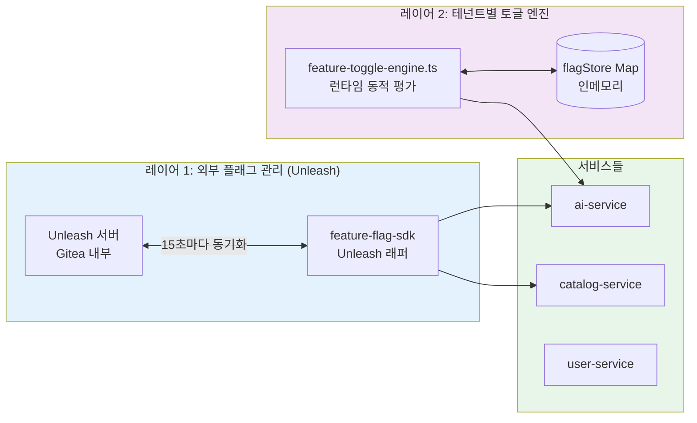
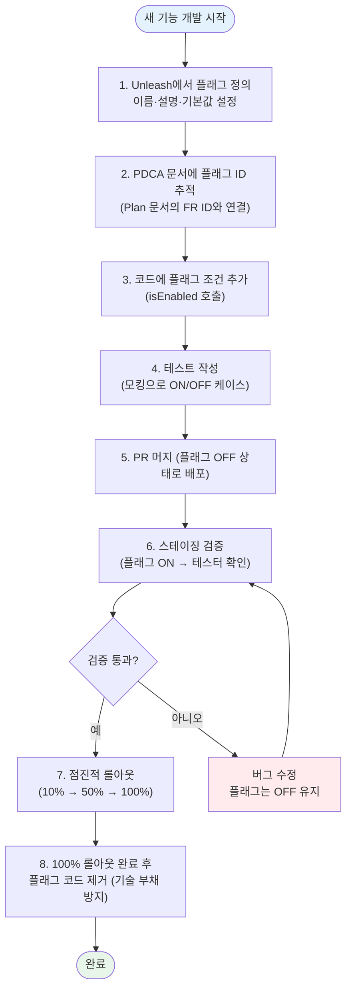

# 9장: 피처 플래그 (Feature Flags)

> **버전**: 1.0.0 | **작성일**: 2026-04-12
> **대상**: 개발자, 프로덕트 매니저, QA 엔지니어
> **CSAP**: D-08 (접근 통제), D-06 (침해사고 관리)
> **선행 문서**: `03-development/02-service-development.md`, `03-development/03-testing-guide.md`
> **관련 코드**: `packages/feature-flag-sdk/src/index.ts`, `platform/services/ai-service/src/lib/feature-toggle-engine.ts`

---

## 목차

1. [피처 플래그란?](#1-피처-플래그란)
2. [이 프로젝트의 Feature Flag SDK](#2-이-프로젝트의-feature-flag-sdk)
3. [피처 플래그 추가하기](#3-피처-플래그-추가하기)
4. [실제 코드 적용 예시](#4-실제-코드-적용-예시)
5. [카나리 배포와 피처 플래그 결합](#5-카나리-배포와-피처-플래그-결합)
6. [피처 플래그 정리 정책](#6-피처-플래그-정리-정책)
7. [테스트에서 피처 플래그 모킹](#7-테스트에서-피처-플래그-모킹)
8. [PDCA 문서에서 피처 플래그 추적](#8-pdca-문서에서-피처-플래그-추적)
9. [학습 체크리스트](#9-학습-체크리스트)
10. [다음 단계](#10-다음-단계)

---

## 1. 피처 플래그란?

### 1.1 기본 개념

피처 플래그(Feature Flag, 또는 Feature Toggle)는 코드를 재배포하지 않고 특정 기능을 켜거나 끄는 메커니즘입니다.

```
피처 플래그 없이:
  새 기능 개발 → PR 병합 → 배포 → 전체 사용자에게 동시 노출
                                     ↑ 문제 발생 시 즉시 롤백 필요 (위험)

피처 플래그 있을 때:
  새 기능 개발 → PR 병합 → 배포 (플래그 OFF로) → 테스터만 확인
                                                   → 문제 없으면 점진적 ON
                                                   → 문제 있으면 플래그 OFF (재배포 없음!)
```

### 1.2 피처 토글 4가지 유형

피처 플래그는 목적에 따라 4가지 유형으로 분류됩니다. 각 유형은 생명주기(얼마나 오래 유지할지)가 다릅니다.

#### 유형 1: Release Toggle (릴리스 토글)

```
목적: 완료되지 않은 기능을 메인 브랜치에 안전하게 머지
생명주기: 짧음 (기능 완성 후 바로 제거, 1~4주)
예시: 새 청구 화면이 개발 중일 때 프로덕션에 숨기기

코드 예:
  if (featureFlags.isEnabled('new-billing-ui')) {
    return <NewBillingPage />;
  }
  return <LegacyBillingPage />;
```

#### 유형 2: Experiment Toggle (실험 토글, A/B 테스트)

```
목적: 두 가지 구현 중 어느 것이 더 나은지 측정
생명주기: 중간 (실험 결과 나올 때까지, 2~6주)
예시: 버튼 색상 A/B 테스트, 알림 문구 비교

코드 예:
  const variant = featureFlags.getVariant('button-color-test', { userId });
  const buttonColor = variant === 'blue' ? '#0074D9' : '#2ECC40';
```

#### 유형 3: Ops Toggle (운영 토글)

```
목적: 시스템 운영 중 특정 기능을 비상 스위치처럼 끄기
생명주기: 길 수 있음 (영구적 스위치로 유지하는 경우도 있음)
예시: AI 기능 비활성화 (AI 서버 과부하 시), 특정 API 차단

코드 예:
  if (!featureFlags.isEnabled('ai-chat-feature')) {
    return { error: '현재 AI 서비스를 일시 중지했습니다' };
  }
```

#### 유형 4: Permission Toggle (권한 토글)

```
목적: 특정 테넌트 또는 사용자 그룹에만 기능 노출
생명주기: 길거나 영구적 (계약 조건에 따라)
예시: 프리미엄 기능을 구독한 테넌트에만 활성화

코드 예:
  const hasPremium = featureFlags.isEnabled('premium-analytics', { tenantId });
  if (!hasPremium) {
    return reply.status(403).send({ error: '프리미엄 플랜이 필요합니다' });
  }
```

### 1.3 피처 플래그를 언제 사용하나?

✅ **사용해야 하는 상황:**
- 개발 기간이 2주 이상인 기능 (Trunk-Based Development 필수)
- 특정 테넌트에게만 시범 운영할 기능
- 카나리 배포와 결합하여 점진적 롤아웃
- 비상 스위치가 필요한 고위험 기능 (외부 API 연동 등)
- A/B 테스트가 필요한 UI/UX 변경

❌ **사용하지 않아도 되는 상황:**
- 단순 버그 수정 (즉시 배포가 더 빠름)
- 인프라 설정 변경 (ConfigMap, Helm values로 관리)
- 보안 패치 (플래그 없이 즉시 배포 필수)

---

## 2. 이 프로젝트의 Feature Flag SDK

### 2.1 SDK 구조

이 프로젝트는 두 가지 레이어로 피처 플래그를 구현합니다.



- **레이어 1 (Unleash SDK)**: 서비스 수준의 피처 플래그. Unleash 서버에서 관리하며 서비스 전체에 영향.
- **레이어 2 (Toggle Engine)**: 테넌트 수준의 피처 토글. 런타임에 특정 테넌트별로 동적 평가.

### 2.2 SDK API 레퍼런스

`packages/feature-flag-sdk/src/index.ts` 기준으로 제공되는 API입니다.

#### `isEnabled(flagName, context?)` — boolean 평가

```typescript
// 가장 기본적인 사용법
const isEnabled = featureFlags.isEnabled('new-billing-flow');
// → true 또는 false 반환

// 컨텍스트와 함께 사용 (테넌트별, 사용자별 타겟팅)
const isEnabled = featureFlags.isEnabled('premium-analytics', {
  tenantId: 'tenant-uuid-here',
  userId: 'user-uuid-here',
  environment: 'production',
  properties: {
    plan: 'enterprise',   // 커스텀 속성으로 추가 타겟팅
    region: 'seoul',
  }
});
```

#### `getVariant(flagName, context?)` — A/B 테스트 변형 조회

```typescript
// A/B 테스트 변형 조회
const variant = featureFlags.getVariant('dashboard-layout', { userId });
// → 'control', 'variant-a', 'variant-b' 중 하나 반환

switch (variant) {
  case 'variant-a':
    return renderCompactDashboard();
  case 'variant-b':
    return renderExpandedDashboard();
  default:
    return renderDefaultDashboard();  // 'control' 또는 undefined
}
```

#### `getActiveFlags()` — 활성 플래그 목록

```typescript
// 현재 활성화된 모든 플래그 이름 목록
const activeFlags = featureFlags.getActiveFlags();
// → ['new-billing-flow', 'premium-analytics', 'ai-chat-v2']
```

#### SDK 초기화

```typescript
import { createFeatureFlagClient } from '@public-saas/feature-flag-sdk';

// 환경 변수에서 자동으로 설정 로드
// 필수 환경 변수: UNLEASH_API_URL, UNLEASH_API_KEY, APP_NAME
const featureFlags = createFeatureFlagClient();
await featureFlags.initialize();

// 서비스 종료 시 graceful shutdown
process.on('SIGTERM', () => {
  featureFlags.destroy();
});
```

### 2.3 환경별 설정

```bash
# .env.development
UNLEASH_API_URL=http://unleash-edge:3063/api
UNLEASH_API_KEY=dev-client-key-xxxxx
APP_NAME=saas-platform-dev

# .env.staging
UNLEASH_API_URL=http://unleash-edge.saas-stg:3063/api
UNLEASH_API_KEY=stg-client-key-xxxxx
APP_NAME=saas-platform-stg

# .env.production
UNLEASH_API_URL=http://unleash-edge.saas-prod:3063/api
UNLEASH_API_KEY=prod-client-key-xxxxx
APP_NAME=saas-platform-prod
```

> ⚠️ **보안**: API 키는 절대 코드에 하드코딩하지 마세요. SDK 내부에서 `sk-`로 시작하는 키 등 명백한 하드코딩을 탐지하여 초기화를 거부합니다(CSAP D-09).

### 2.4 테넌트별 피처 토글 엔진

더 세밀한 제어가 필요한 경우(특정 테넌트에만, 특정 조건에만) `feature-toggle-engine.ts`를 사용합니다.

```typescript
import { FeatureToggleEngineService } from '../lib/feature-toggle-engine.js';

// 테넌트별 엔진 인스턴스 생성
const engine = new FeatureToggleEngineService(tenantId);

// 플래그 생성
const newDashboardFlag = engine.createFlag(
  'new-dashboard',      // 플래그 이름
  false,                // 기본값: 비활성화
  [
    {
      ruleId: 'beta-users',
      attribute: 'userRole',
      operator: 'in',
      value: 'admin,beta-tester',  // admin 또는 beta-tester에게만 활성화
    }
  ]
);

// 플래그 평가
const evaluation = engine.evaluate(newDashboardFlag, {
  userId: request.user.id,
  userRole: request.user.role,
  tenantId: tenantId,
});

if (evaluation.enabled) {
  // 새 대시보드 표시
}
```

---

## 3. 피처 플래그 추가하기

### 3.1 전체 절차 흐름



### 3.2 Step 1: Unleash에서 플래그 정의

```
Unleash 콘솔 접속: http://unleash.saas-platform.local

1. "New Feature Toggle" 클릭
2. 설정:
   - Name: new-billing-flow          ← kebab-case 사용
   - Type: Release (또는 적절한 유형)
   - Project: saas-platform
   - Description: 새 청구 흐름 - MTU-N301 FR-BIL.1
   - Tags: billing, mtu-n301         ← 추적을 위한 태그

3. 환경별 설정:
   - Development: ON (개발 시 즉시 테스트)
   - Staging: OFF (명시적으로 켜야 함)
   - Production: OFF (점진적 롤아웃 준비 후 켜기)
```

### 3.3 Step 2: 코드에 플래그 적용

```typescript
// 새 파일: platform/services/billing-service/src/handlers/billing.handler.ts
import { createFeatureFlagClient } from '@public-saas/feature-flag-sdk';

const featureFlags = createFeatureFlagClient();

export async function createInvoiceHandler(
  request: FastifyRequest<{ Body: CreateInvoiceRequest }>,
  reply: FastifyReply,
): Promise<void> {
  const { tenantId } = request.body;

  // Plan SC: FR-BIL.1 — 새 청구 흐름 피처 플래그
  const isNewBillingFlow = featureFlags.isEnabled('new-billing-flow', {
    tenantId,
    environment: process.env.NODE_ENV,
  });

  if (isNewBillingFlow) {
    // 새 청구 로직 (신규 구현)
    const invoice = await newBillingService.createInvoice(request.body);
    return reply.status(201).send({ success: true, data: invoice });
  }

  // 기존 청구 로직 (레거시, 플래그 ON 후 제거 예정)
  const invoice = await legacyBillingService.createInvoice(request.body);
  return reply.status(201).send({ success: true, data: invoice });
}
```

### 3.4 플래그 이름 명명 규칙

```
형식: {도메인}-{기능}-{버전(선택)}
예시:
  - new-billing-flow         ← Release: 새 기능
  - ai-chat-v2               ← Release: 버전 업그레이드
  - dashboard-ab-test        ← Experiment: A/B 테스트
  - ai-rate-limit-kill       ← Ops: 비상 스위치
  - premium-analytics        ← Permission: 권한 기반

금지:
  - feature1                 ← 의미 없는 이름
  - test                     ← 너무 일반적
  - BILLING_FLAG             ← snake_case나 UPPER_CASE 금지 (kebab-case 사용)
```

---

## 4. 실제 코드 적용 예시

### 4.1 기본 ON/OFF 예시

```typescript
// 가장 단순한 형태: 기능 활성화 여부만 확인
const isNewBilling = await featureFlags.isEnabled('new-billing-flow', { tenantId });
if (isNewBilling) {
  // 새 청구 로직
  return processWithNewBilling(data);
} else {
  // 기존 청구 로직
  return processWithLegacyBilling(data);
}
```

### 4.2 테넌트별 단계적 롤아웃 예시

```typescript
// 특정 테넌트에게만 AI 분석 기능 활성화 (Permission Toggle)
export async function getDocumentAnalysisHandler(
  request: FastifyRequest,
  reply: FastifyReply,
): Promise<void> {
  const tenantId = request.headers['x-tenant-id'] as string;

  // Plan SC: FR-AI.7 — AI 문서 분석 기능 (프리미엄 테넌트 전용)
  const hasAiAnalysis = featureFlags.isEnabled('ai-document-analysis', {
    tenantId,
    properties: {
      plan: request.tenant.subscriptionPlan,  // 구독 플랜 정보
    }
  });

  if (!hasAiAnalysis) {
    // 403이 아닌 402를 반환 (기능은 존재하지만 업그레이드 필요)
    return reply.status(402).send({
      success: false,
      error: {
        code: 'FEATURE_REQUIRES_UPGRADE',
        message: 'AI 문서 분석은 프리미엄 플랜에서 사용 가능합니다',
        upgradeUrl: '/upgrade',
      }
    });
  }

  // AI 분석 실행
  const analysis = await aiService.analyzeDocument(request.body);
  return reply.send({ success: true, data: analysis });
}
```

### 4.3 A/B 테스트 예시

```typescript
// 두 가지 AI 응답 형식 A/B 테스트
export async function getChatResponseHandler(
  request: FastifyRequest<{ Body: ChatRequest }>,
  reply: FastifyReply,
): Promise<void> {
  const { userId, tenantId, message } = request.body;

  // Experiment Toggle: 응답 형식 A/B 테스트
  const responseFormat = featureFlags.getVariant('chat-response-format', {
    userId,
    tenantId,
  });

  const rawResponse = await aiService.chat({ message });

  let formattedResponse;
  if (responseFormat === 'structured') {
    // 구조화된 응답 (실험군 A)
    formattedResponse = formatStructuredResponse(rawResponse);
  } else {
    // 일반 텍스트 응답 (대조군)
    formattedResponse = rawResponse.text;
  }

  // 실험 측정 이벤트 전송 (분석용)
  await analyticsService.track('chat_response_shown', {
    userId,
    variant: responseFormat ?? 'control',
    messageLength: message.length,
  });

  return reply.send({ success: true, data: { response: formattedResponse } });
}
```

### 4.4 Ops Toggle (비상 스위치) 예시

```typescript
// AI 기능 비상 정지 스위치 (AI 서버 장애 또는 과부하 시)
// Ops Toggle은 코드 변경 없이 Unleash 콘솔에서 즉시 끌 수 있어야 함
export async function aiChatHandler(
  request: FastifyRequest,
  reply: FastifyReply,
): Promise<void> {
  // Ops Toggle: AI 서비스 비상 정지
  const isAiAvailable = featureFlags.isEnabled('ai-service-enabled');

  if (!isAiAvailable) {
    // AI 비활성화 시 명확한 메시지 반환
    return reply.status(503).send({
      success: false,
      error: {
        code: 'AI_SERVICE_UNAVAILABLE',
        message: 'AI 서비스가 현재 점검 중입니다. 잠시 후 다시 시도해 주세요.',
        retryAfter: 3600,  // 1시간 후 재시도 권장
      }
    });
  }

  // 정상 AI 처리
  return processAiChat(request, reply);
}
```

### 4.5 FeatureToggleEngine을 사용한 테넌트별 동적 규칙

```typescript
import { FeatureToggleEngineService } from '../lib/feature-toggle-engine.js';

// 관리자가 런타임에 테넌트별 플래그를 설정하는 API 예시
export async function setTenantFeatureFlagHandler(
  request: FastifyRequest<{
    Body: {
      tenantId: string;
      flagName: string;
      enabled: boolean;
      rules?: Array<{ attribute: string; operator: string; value: string }>;
    }
  }>,
  reply: FastifyReply,
): Promise<void> {
  const { tenantId, flagName, enabled, rules } = request.body;

  const engine = new FeatureToggleEngineService(tenantId);

  const flag = engine.createFlag(
    flagName,
    enabled,
    rules?.map((r, idx) => ({
      ruleId: `rule-${idx}`,
      attribute: r.attribute,
      operator: r.operator as 'eq' | 'neq' | 'in' | 'gt' | 'lt',
      value: r.value,
    }))
  );

  // 감사 로그 (CSAP D-06)
  await auditLog({
    actor: request.user.id,
    action: 'FEATURE_FLAG_SET',
    target: `${tenantId}/${flagName}`,
    details: { enabled, rulesCount: rules?.length ?? 0 },
  });

  return reply.send({ success: true, data: flag });
}
```

---

## 5. 카나리 배포와 피처 플래그 결합

### 5.1 두 가지 접근법의 차이

| 항목 | 카나리 배포 (Flagger) | 피처 플래그 |
|------|---------------------|------------|
| 무엇을 분리? | 트래픽 (신규 Pod vs 기존 Pod) | 코드 경로 (if/else 분기) |
| 롤백 방법 | Pod 재배포 (수 분) | 플래그 OFF (수 초) |
| 적합한 경우 | 인프라 변경, 성능 개선 | 비즈니스 로직 변경 |
| 복잡도 | 인프라 설정 필요 | 코드만 변경 |

### 5.2 결합 전략: 안전한 대규모 기능 출시

두 가지를 결합하면 가장 안전한 배포가 가능합니다.

```mermaid
graph LR
  subgraph PHASE1["Phase 1: 코드 배포 (플래그 OFF)"]
    D1[신규 Pod 10%\n플래그 OFF]
    D2[기존 Pod 90%]
  end

  subgraph PHASE2["Phase 2: 내부 테스트 (플래그 ON, 선별 사용자)"]
    D3[신규 Pod 10%\n플래그 ON\n(베타 테스터만)]
    D4[기존 Pod 90%]
  end

  subgraph PHASE3["Phase 3: 점진적 확장"]
    D5[신규 Pod 50%\n플래그 ON\n(50% 사용자)]
    D6[기존 Pod 50%]
  end

  subgraph PHASE4["Phase 4: 완전 배포"]
    D7[신규 Pod 100%\n플래그 ON\n(전체 사용자)]
  end

  PHASE1 -->|"메트릭 정상"| PHASE2
  PHASE2 -->|"2일 검증 통과"| PHASE3
  PHASE3 -->|"1주 검증 통과"| PHASE4

  style PHASE1 fill:#E3F2FD
  style PHASE2 fill:#E8F5E9
  style PHASE3 fill:#FFF3E0
  style PHASE4 fill:#F3E5F5
```

### 5.3 Flagger와 피처 플래그 결합 설정 예시

```yaml
# Flagger Canary 설정 (카나리 배포)
# k8s/apps/billing-service/canary.yaml
apiVersion: flagger.app/v1beta1
kind: Canary
metadata:
  name: billing-service
  namespace: saas-platform
spec:
  targetRef:
    apiVersion: apps/v1
    kind: Deployment
    name: billing-service
  progressDeadlineSeconds: 600
  service:
    port: 3005
  analysis:
    interval: 2m
    threshold: 5        # 5번 연속 실패 시 자동 롤백
    maxWeight: 50       # 최대 50%까지 카나리에 전송
    stepWeight: 10      # 10%씩 증가
    metrics:
      - name: request-success-rate
        thresholdRange:
          min: 99       # 성공률 99% 미만이면 롤백
        interval: 1m
      - name: request-duration
        thresholdRange:
          max: 500      # P99 레이턴시 500ms 초과 시 롤백
        interval: 1m
```

```typescript
// billing-service에서 카나리 + 피처 플래그 결합
// 카나리 Pod로 라우팅된 트래픽 + 플래그 ON인 사용자에게만 신규 기능 노출
export async function createInvoiceHandler(request, reply) {
  const isPodCanary = process.env.CANARY_DEPLOYMENT === 'true';  // 카나리 Pod 여부
  const isFlagEnabled = featureFlags.isEnabled('new-billing-flow', {
    tenantId: request.body.tenantId,
  });

  // 카나리 Pod이고 플래그도 ON인 경우에만 새 기능 실행
  if (isPodCanary && isFlagEnabled) {
    return newBillingService.createInvoice(request.body);
  }

  return legacyBillingService.createInvoice(request.body);
}
```

---

## 6. 피처 플래그 정리 정책

### 6.1 기술 부채 방지가 중요한 이유

피처 플래그를 사용하면서 정리하지 않으면 코드가 점점 복잡해집니다.

```typescript
// 나쁜 예: 오래된 플래그들이 쌓인 코드 (가독성 파괴)
if (featureFlags.isEnabled('new-ui-2024')) {
  if (featureFlags.isEnabled('new-billing-2024-q2')) {
    if (featureFlags.isEnabled('premium-analytics-v2')) {
      // ... 3단계 중첩된 신규 로직
    }
  }
}
// 이 코드를 6개월 후에 누가 이해할 수 있을까요?
```

### 6.2 플래그 생명주기 정책

| 유형 | 제거 시점 | 담당 |
|------|----------|------|
| Release Toggle | 전체 롤아웃 완료 후 1스프린트 이내 | 기능 개발자 |
| Experiment Toggle | 실험 결과 확정 후 1스프린트 이내 | 피처 PM |
| Ops Toggle | 대응 완료 후 즉시 | DevOps |
| Permission Toggle | 비즈니스 조건 만료 시 | 서비스 오너 |

### 6.3 플래그 제거 절차

```typescript
// Step 1: 플래그가 항상 ON으로 결정된 경우 — 코드 정리
// Before (플래그 사용 중):
if (featureFlags.isEnabled('new-billing-flow')) {
  return newBillingService.createInvoice(data);
}
return legacyBillingService.createInvoice(data);

// After (플래그 제거 후, 새 로직만 남김):
return newBillingService.createInvoice(data);
// 구 billingService 코드도 함께 삭제

// Step 2: Unleash 콘솔에서 플래그 삭제
// Step 3: 관련 PDCA 문서 업데이트 (플래그 제거 이력 기록)
// Step 4: Dead code 검사
//   npx ts-prune --error | grep billing
```

### 6.4 오래된 플래그 자동 탐지

```bash
# 플래그 이름이 코드에 남아있는지 확인
grep -r "featureFlags.isEnabled" platform/services/ | \
  awk -F"'" '{print $2}' | sort | uniq > /tmp/code-flags.txt

# 코드에 있는 플래그를 Unleash에서 확인
# (Unleash API로 비교 — 코드에 있지만 Unleash에 없는 플래그 = 정리 필요)
curl -H "Authorization: ${UNLEASH_API_KEY}" \
  http://unleash-edge:3063/api/client/features | \
  jq '[.features[].name]' > /tmp/unleash-flags.txt

echo "코드에 있지만 Unleash에 없는 플래그 (제거 필요):"
comm -23 <(sort /tmp/code-flags.txt) <(sort /tmp/unleash-flags.txt)
```

---

## 7. 테스트에서 피처 플래그 모킹

### 7.1 왜 테스트에서 모킹이 필요한가?

실제 Unleash 서버에 연결하면 테스트가 외부 의존성을 가집니다. 테스트는 플래그가 ON일 때와 OFF일 때 모두 검증해야 합니다.

### 7.2 Jest/Vitest 모킹 예시

```typescript
// tests/unit/billing.handler.test.ts
import { describe, it, expect, vi, beforeEach } from 'vitest';
import { createInvoiceHandler } from '../../src/handlers/billing.handler.js';

// Feature Flag SDK 모킹
vi.mock('@public-saas/feature-flag-sdk', () => ({
  createFeatureFlagClient: () => ({
    initialize: vi.fn().mockResolvedValue(undefined),
    isEnabled: vi.fn(),       // ← 각 테스트에서 반환값 제어
    getVariant: vi.fn(),
    getActiveFlags: vi.fn().mockReturnValue([]),
    destroy: vi.fn(),
  }),
}));

import { createFeatureFlagClient } from '@public-saas/feature-flag-sdk';

describe('createInvoiceHandler', () => {
  const mockFeatureFlags = createFeatureFlagClient();

  beforeEach(() => {
    vi.clearAllMocks();
  });

  it('새 청구 흐름이 활성화된 경우 newBillingService를 사용한다', async () => {
    // 피처 플래그 ON으로 설정
    vi.mocked(mockFeatureFlags.isEnabled).mockReturnValue(true);

    const request = mockRequest({ body: { tenantId: 'tenant-001', amount: 10000 } });
    const reply = mockReply();

    await createInvoiceHandler(request, reply);

    // newBillingService가 호출되었는지 확인
    expect(newBillingService.createInvoice).toHaveBeenCalledWith({
      tenantId: 'tenant-001',
      amount: 10000,
    });
  });

  it('새 청구 흐름이 비활성화된 경우 legacyBillingService를 사용한다', async () => {
    // 피처 플래그 OFF로 설정
    vi.mocked(mockFeatureFlags.isEnabled).mockReturnValue(false);

    const request = mockRequest({ body: { tenantId: 'tenant-001', amount: 10000 } });
    const reply = mockReply();

    await createInvoiceHandler(request, reply);

    // legacyBillingService가 호출되었는지 확인
    expect(legacyBillingService.createInvoice).toHaveBeenCalled();
    expect(newBillingService.createInvoice).not.toHaveBeenCalled();
  });
});
```

### 7.3 통합 테스트에서 플래그 제어

```typescript
// tests/integration/billing.integration.test.ts
import { UnleashFeatureFlagClient } from '@public-saas/feature-flag-sdk';

// 통합 테스트용 In-Memory 플래그 클라이언트
class TestFeatureFlagClient extends UnleashFeatureFlagClient {
  private overrides: Map<string, boolean> = new Map();

  setFlag(flagName: string, value: boolean): void {
    this.overrides.set(flagName, value);
  }

  isEnabled(flagName: string, _context?: unknown): boolean {
    const override = this.overrides.get(flagName);
    if (override !== undefined) return override;
    return false;  // 기본값: 모든 플래그 OFF
  }
}

describe('Billing Integration Tests', () => {
  let testFlags: TestFeatureFlagClient;

  beforeAll(async () => {
    testFlags = new TestFeatureFlagClient({
      apiUrl: 'http://unused',
      apiKey: 'test-key-for-integration',
      appName: 'test',
    });
    await testFlags.initialize();

    // 앱에 테스트 클라이언트 주입
    app.decorate('featureFlags', testFlags);
  });

  it('새 청구 기능 활성화 시 E2E 플로우 검증', async () => {
    // 특정 테스트에서만 플래그 ON
    testFlags.setFlag('new-billing-flow', true);

    const response = await app.inject({
      method: 'POST',
      url: '/billing/invoices',
      payload: { tenantId: 'test-tenant', amount: 50000 },
    });

    expect(response.statusCode).toBe(201);
    expect(response.json().data).toMatchObject({
      invoiceFormat: 'v2',  // 새 청구 형식 확인
    });
  });
});
```

### 7.4 플래그 관련 테스트 원칙

```
✅ 좋은 테스트:
  - 플래그 ON 케이스와 OFF 케이스를 모두 테스트
  - 플래그 평가 실패(네트워크 오류) 시 안전한 기본값(false) 반환 확인
  - 컨텍스트(tenantId, userId)에 따른 타겟팅 규칙 테스트

❌ 피해야 할 패턴:
  - 실제 Unleash 서버에 연결하는 단위 테스트
  - 플래그 상태를 전제로 한 테스트 (모킹 없이 특정 플래그 값 가정)
  - 플래그 ON 케이스만 테스트 (OFF 케이스 누락)
```

---

## 8. PDCA 문서에서 피처 플래그 추적

### 8.1 Plan 문서에서 피처 플래그 정의

```markdown
# MTU-N301: 새 청구 흐름 구현 — Plan 문서

## 5. 기능 요구사항

| FR ID | 요구사항 | 피처 플래그 ID | 기본값 |
|-------|----------|--------------|--------|
| FR-BIL.1 | 새 청구 화면 구현 | new-billing-flow | OFF |
| FR-BIL.2 | 실시간 청구 계산 | new-billing-realtime | OFF |
| FR-BIL.3 | 청구 내역 내보내기 (PDF) | billing-pdf-export | OFF |

## 6. 배포 전략

피처 플래그 기반 점진적 롤아웃:
1. **개발 완료**: 플래그 OFF로 프로덕션 배포
2. **내부 검증 (1주)**: 관리자 그룹에 플래그 ON
3. **베타 테스트 (2주)**: 10% 테넌트에 플래그 ON
4. **전체 롤아웃**: 100% 테넌트에 플래그 ON
5. **플래그 제거 (1스프린트)**: 코드에서 플래그 조건 삭제
```

### 8.2 Design 문서에서 플래그 동작 명세

```markdown
# MTU-N301: 새 청구 흐름 구현 — Design 문서

## 3.2 피처 플래그 설계

### 플래그: new-billing-flow

| 속성 | 값 |
|------|-----|
| 플래그 ID | new-billing-flow |
| 유형 | Release Toggle |
| 기본값 | false (OFF) |
| 평가 우선순위 | 테넌트 ID → 구독 플랜 → 환경 |

타겟팅 규칙:
1. 환경이 development이면 → 항상 ON
2. 테넌트가 베타 목록에 있으면 → ON
3. 그 외: → OFF (기본값)

### 플래그 제거 조건
다음 조건 모두 충족 시 플래그 코드 제거:
- 전체 테넌트 100%에 적용
- 2주 이상 오류 없이 운영
- 레거시 legacyBillingService 코드 미사용 확인
```

### 8.3 플래그 상태를 CHANGELOG에 기록

```markdown
# CHANGELOG.md

## [Unreleased]

### Added
- (FR-BIL.1) 새 청구 흐름 구현 — 피처 플래그 `new-billing-flow` (기본 OFF)

## [1.5.0] - 2026-04-12

### Changed
- (FR-BIL.1) 새 청구 흐름 — 피처 플래그 `new-billing-flow` 전체 롤아웃 완료

### Removed (Dead Code)
- `legacyBillingService` 제거 — 피처 플래그 `new-billing-flow` 100% 롤아웃 후 정리
- `new-billing-flow` 피처 플래그 코드 조건 제거 (플래그 자체는 Unleash에서도 삭제)
```

---

## 9. 학습 체크리스트

이 문서를 읽고 다음 항목을 스스로 확인해 보세요.

### 개념 이해

- [ ] 피처 플래그의 4가지 유형(Release, Experiment, Ops, Permission)을 각각 예를 들어 설명할 수 있다
- [ ] 피처 플래그와 카나리 배포의 차이를 설명할 수 있다
- [ ] 피처 플래그를 정리하지 않으면 어떤 문제가 생기는지 안다
- [ ] SDK의 `isEnabled()`와 `getVariant()`의 차이를 안다

### 실습 능력

- [ ] `createFeatureFlagClient()`로 SDK를 초기화하는 코드를 작성할 수 있다
- [ ] `isEnabled(flagName, { tenantId })`를 서비스 핸들러에 올바르게 적용할 수 있다
- [ ] 테스트에서 피처 플래그를 모킹하여 ON/OFF 케이스를 모두 테스트할 수 있다
- [ ] PDCA 문서(Plan, Design)에 피처 플래그 정보를 기록하는 방법을 안다

### 운영 능력

- [ ] Unleash 콘솔에서 새 피처 플래그를 정의할 수 있다
- [ ] 플래그 제거가 필요한 시점을 판단하고 코드를 정리할 수 있다
- [ ] 오래된 플래그를 탐지하는 스크립트를 이해하고 활용할 수 있다

---

## 10. 다음 단계

이 문서를 마쳤다면 다음 문서로 이동하세요.

- **심화 디버깅**: `03-development/10-debugging-advanced.md` — 분산 시스템 디버깅 심화
- **테스트 연계**: `03-development/03-testing-guide.md` — 테스트 전략 전체 가이드
- **카나리 배포**: `06-cicd/deployment/01-gitops-deploy.md` — Flagger 카나리 배포 설정
- **모니터링 연계**: `05-monitoring/metrics/01-prometheus-basics.md` — 플래그 전환 시 메트릭 변화 확인

> 💡 **팁**: 새 기능을 개발할 때 항상 피처 플래그를 먼저 Unleash에 등록하고 시작하는 습관을 들이세요. 나중에 추가하면 코드 수정이 더 복잡해집니다.
