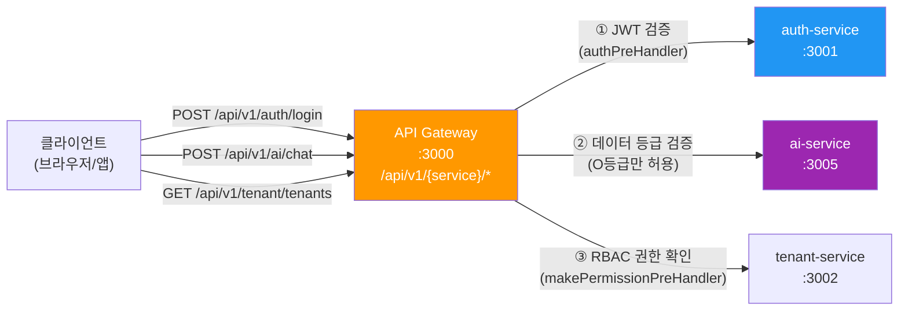
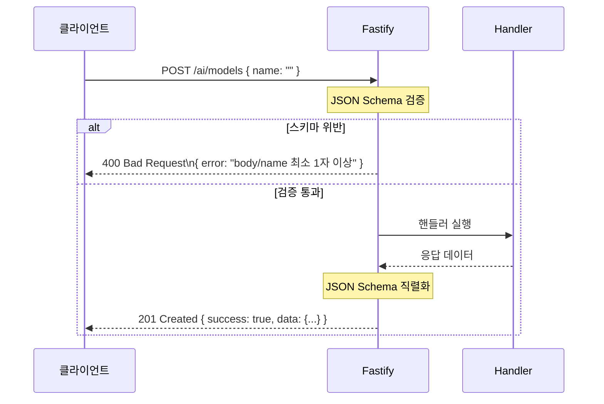
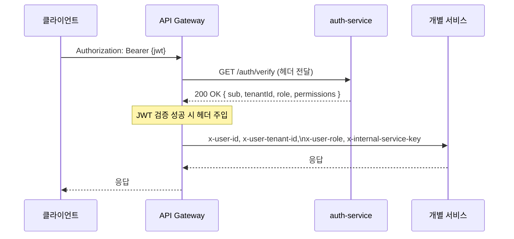
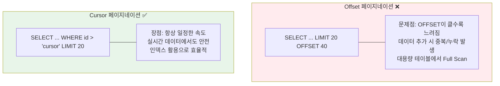
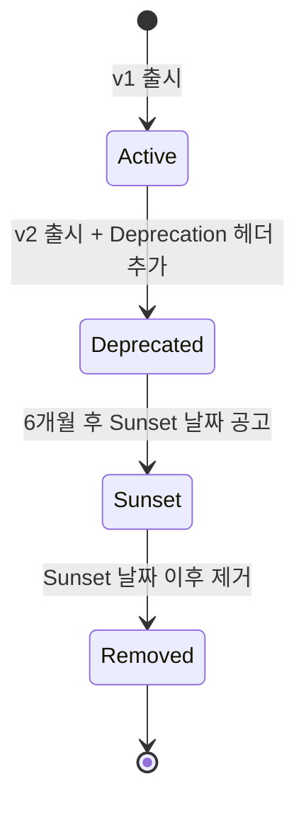

# API 설계 가이드

> **문서 ID**: ONBOARD-03-12
> **버전**: 1.0.0 | **작성일**: 2026-04-12 | **작성자**: Implementer (Sonnet)
> **선행 학습**: `03-development/02-service-development.md`, `03-development/05-prisma-guide.md`
> **소요 시간**: 약 5~6시간 (실습 포함)
> **Design Ref**: DESIGN-MTU-P04 라우팅 설계, SVC-AUTH-R1 DESIGN

---

## 목차

1. [이 프로젝트의 API 설계 원칙](#1-이-프로젝트의-api-설계-원칙)
2. [Fastify 스키마 기반 API 구현](#2-fastify-스키마-기반-api-구현)
3. [인증/인가 패턴 통일](#3-인증인가-패턴-통일)
4. [페이지네이션, 필터링, 정렬](#4-페이지네이션-필터링-정렬)
5. [API 버전 관리](#5-api-버전-관리)
6. [API 문서화](#6-api-문서화)
7. [실습: usage-stats API 설계부터 구현까지](#7-실습-usage-stats-api)
8. [학습 체크리스트](#8-학습-체크리스트)
9. [다음 단계](#9-다음-단계)
10. [변경 이력](#10-변경-이력)

---

## 1. 이 프로젝트의 API 설계 원칙

### 1.1 전체 API 흐름

이 프로젝트의 모든 HTTP 요청은 하나의 진입점(API Gateway)을 통과합니다. 클라이언트가 직접 개별 마이크로서비스를 호출하지 않습니다.



**핵심 규칙**: 외부에서 보이는 URL은 항상 `/api/v1/{serviceId}/*` 패턴입니다.
실제 서비스 내부 URL은 게이트웨이가 자동으로 변환합니다.

`platform/services/api-gateway/src/routes/proxy.ts` 의 실제 코드:

```typescript
// Design Ref: DESIGN-MTU-P04 §라우팅 설계
await app.register(httpProxy, {
  upstream: entry.url,                              // 예: http://ai-service:3005
  prefix: `/api/v1/${serviceId}`,                  // 외부: /api/v1/ai
  rewritePrefix: `/${serviceId === 'auth' ? 'auth' : serviceId}`, // 내부: /ai
  http2: false,
  preHandler: compositePreHandler,                  // 인증 + 권한 검사
});
```

### 1.2 RESTful 원칙 + Fastify 스키마 기반 설계

이 프로젝트는 순수 REST를 따르되, **Fastify의 JSON Schema 선언**을 필수로 사용합니다.
스키마가 없으면 Swagger 자동 문서화도 안 되고, 입력 검증도 안 됩니다.

**URL 네이밍 규칙**:

| 목적 | HTTP 메서드 | URL 패턴 | 예시 |
|------|-----------|---------|------|
| 목록 조회 | GET | `/api/v1/{service}/{resources}` | `GET /api/v1/tenant/tenants` |
| 단건 조회 | GET | `/api/v1/{service}/{resources}/:id` | `GET /api/v1/tenant/tenants/abc123` |
| 생성 | POST | `/api/v1/{service}/{resources}` | `POST /api/v1/tenant/tenants` |
| 전체 수정 | PUT | `/api/v1/{service}/{resources}/:id` | `PUT /api/v1/tenant/tenants/abc123` |
| 부분 수정 | PATCH | `/api/v1/{service}/{resources}/:id` | `PATCH /api/v1/tenant/tenants/abc123` |
| 삭제 | DELETE | `/api/v1/{service}/{resources}/:id` | `DELETE /api/v1/tenant/tenants/abc123` |
| 하위 리소스 | GET/POST | `/api/v1/{service}/{resources}/:id/{sub}` | `GET /api/v1/ai/agents/abc123/audit-trail` |

**절대 하면 안 되는 URL 패턴**:

```
❌ GET  /api/v1/ai/getModels          -- 동사 사용 금지
❌ POST /api/v1/ai/deleteModel        -- DELETE 메서드 사용
❌ GET  /api/v1/aimodels              -- 단어 구분 없음
❌ GET  /api/v1/AI/Models             -- 대문자 사용 금지
✅ GET  /api/v1/ai/models             -- 소문자, 복수, 명사
```

### 1.3 응답 형식 통일: `{ data, error, meta }` 구조

모든 API 응답은 다음 세 가지 구조 중 하나를 따릅니다.

**성공 응답 — 단건**:

```json
{
  "success": true,
  "data": {
    "id": "clx1234...",
    "name": "테스트 테넌트",
    "status": "ACTIVE"
  }
}
```

**성공 응답 — 목록 (페이지네이션 포함)**:

```json
{
  "success": true,
  "data": [
    { "id": "clx1...", "name": "테넌트 A" },
    { "id": "clx2...", "name": "테넌트 B" }
  ],
  "meta": {
    "total": 42,
    "cursor": "clx2...",
    "hasMore": true
  }
}
```

**오류 응답**:

```json
{
  "success": false,
  "error": {
    "code": "TENANT_NOT_FOUND",
    "message": "테넌트를 찾을 수 없습니다",
    "errorId": "err_a1b2c3d4"
  }
}
```

💡 **주의**: 오류 메시지에 스택 트레이스, DB 오류 메시지, 환경 변수값을 절대 포함하지 마세요 (CSAP D-12).

### 1.4 HTTP 상태 코드 표준

| 상황 | 상태 코드 | 코드 예시 |
|------|----------|---------|
| 조회 성공 | 200 OK | `GET /tenants` |
| 생성 성공 | 201 Created | `POST /tenants` |
| 삭제 성공 (응답 없음) | 204 No Content | `DELETE /tenants/:id` |
| 잘못된 입력 | 400 Bad Request | Zod 검증 실패 |
| 인증 없음 | 401 Unauthorized | JWT 없음/만료 |
| 권한 없음 | 403 Forbidden | RBAC 실패 |
| 리소스 없음 | 404 Not Found | ID 없음 |
| Rate Limit 초과 | 429 Too Many Requests | Rate Limiter |
| 서버 오류 | 500 Internal Server Error | 예외 처리 누락 |
| 외부 서비스 오류 | 502 Bad Gateway | AI 모델 서버 오류 |
| 서비스 점검 | 503 Service Unavailable | Circuit Breaker OPEN |

---

## 2. Fastify 스키마 기반 API 구현

### 2.1 왜 스키마가 필수인가

Fastify는 JSON Schema를 사용한 두 가지 핵심 기능을 제공합니다.

1. **자동 입력 검증**: 스키마에 맞지 않는 요청을 자동으로 400으로 거부
2. **자동 직렬화 가속**: 응답을 JSON으로 변환할 때 스키마 기반 최적화 (일반 `JSON.stringify`보다 약 2~3배 빠름)



### 2.2 스키마 선언 기본 패턴

실제 `ai-service/src/routes.ts`에서 발췌한 패턴입니다.

```typescript
// Design Ref: DESIGN-MTU-P04 §스키마 설계
// Plan SC: FR-AI26.1

app.post(
  '/ai/rag/ingest',
  {
    schema: {
      // ① 이 엔드포인트 설명 (Swagger에 표시됨)
      description: 'RAG 지식베이스 문서 수집 (청킹 + 임베딩 + 벡터 저장)',
      tags: ['ai', 'rag'],        // Swagger 그룹핑

      // ② 요청 body 스키마
      body: {
        type: 'object' as const,
        required: ['tenantId', 'grade', 'title', 'content'] as const,
        properties: {
          tenantId:  { type: 'string' as const, format: 'uuid' },     // UUID 형식 강제
          grade:     { type: 'string' as const, enum: ['O'] },          // O등급만 허용
          title:     { type: 'string' as const, maxLength: 200 },       // 최대 길이 제한
          content:   { type: 'string' as const, maxLength: 500000 },    // 500KB 제한
          sourceUrl: { type: 'string' as const, format: 'uri' },        // URI 형식 강제
          embedModelId: { type: 'string' as const },                    // 선택 필드
        },
      },

      // ③ 응답 스키마 (상태 코드별)
      response: {
        200: modelResponse,     // { success: boolean, data: object }
        403: errorResponse,     // { success: boolean, error: object }
        500: errorResponse,
      },
    },

    // ④ Rate Limiter (사전 훅)
    preHandler: ragLimiter,
  },
  ragIngestHandler as never,  // 핸들러 함수
);
```

### 2.3 공통 스키마 객체 재사용

매번 스키마를 반복 작성하지 말고 공통 객체를 만들어 재사용합니다.
실제 `ai-service/src/routes.ts`에서 사용하는 패턴:

```typescript
// routes.ts 상단에 공통 스키마 정의
const modelResponse = {
  type: 'object' as const,
  properties: {
    success: { type: 'boolean' as const },
    data: { type: 'object' as const },
  },
};

const listResponse = {
  type: 'object' as const,
  properties: {
    success: { type: 'boolean' as const },
    data: { type: 'array' as const, items: { type: 'object' as const } },
  },
};

const errorResponse = {
  type: 'object' as const,
  properties: {
    success: { type: 'boolean' as const },
    error: { type: 'object' as const },
  },
};

const idParam = {
  type: 'object' as const,
  properties: { id: { type: 'string' as const, format: 'uuid' } },
};
```

### 2.4 요청 검증 타입별 스키마 작성법

**Path 파라미터** (`/tenants/:id`):

```typescript
schema: {
  params: {
    type: 'object' as const,
    properties: {
      id: { type: 'string' as const, format: 'uuid' },
    },
  },
}
```

**Query String** (`?page=1&limit=20`):

```typescript
schema: {
  querystring: {
    type: 'object' as const,
    properties: {
      cursor: { type: 'string' as const },
      limit:  { type: 'integer' as const, minimum: 1, maximum: 100, default: 20 },
      sort:   { type: 'string' as const, enum: ['createdAt', 'name'] },
      order:  { type: 'string' as const, enum: ['asc', 'desc'], default: 'desc' },
    },
  },
}
```

**Headers** (인증 헤더 스키마 문서화):

```typescript
// auth-service/src/routes.ts의 실제 패턴
schema: {
  headers: {
    type: 'object' as const,
    properties: {
      authorization: { type: 'string' as const },
    },
  },
}
```

### 2.5 핸들러 함수 구현 패턴

핸들러는 라우트 정의와 분리합니다. 실제 `auth-service`의 패턴을 따릅니다.

```typescript
// handlers/tenant-usage.handler.ts
import type { FastifyRequest, FastifyReply } from 'fastify';
import { prisma } from '../lib/prisma.js';
import { auditLog } from '../lib/audit.js';
import { logger } from '../lib/logger.js';

interface TenantUsageParams {
  id: string;
}

interface TenantUsageQuery {
  period?: 'day' | 'week' | 'month';
}

// Design Ref: §7 실습 API 핸들러
// Plan SC: FR-USAGE.1
export async function tenantUsageStatsHandler(
  request: FastifyRequest<{
    Params: TenantUsageParams;
    Querystring: TenantUsageQuery;
  }>,
  reply: FastifyReply,
): Promise<void> {
  const { id } = request.params;
  const { period = 'month' } = request.query;

  // CSAP D-08: 리소스 소유자 검증 (내 테넌트 데이터만 접근 가능)
  const user = (request as any).user;
  if (user.role !== 'SUPER_ADMIN' && user.tenantId !== id) {
    await reply.status(403).send({
      success: false,
      error: {
        code: 'FORBIDDEN',
        message: '다른 테넌트의 데이터에 접근할 수 없습니다',
      },
    });
    return;
  }

  try {
    const tenant = await prisma.tenant.findUnique({
      where: { id },
      select: { id: true, name: true, maxUsers: true, maxStorage: true },
    });

    if (!tenant) {
      await reply.status(404).send({
        success: false,
        error: { code: 'TENANT_NOT_FOUND', message: '테넌트를 찾을 수 없습니다' },
      });
      return;
    }

    // 사용자 수 집계
    const userCount = await prisma.user.count({ where: { tenantId: id } });

    await reply.status(200).send({
      success: true,
      data: {
        tenantId: id,
        tenantName: tenant.name,
        period,
        usage: {
          users: { current: userCount, max: tenant.maxUsers },
          storageBytes: { current: 0, max: Number(tenant.maxStorage) },
        },
      },
    });
  } catch (error) {
    // CSAP D-12: 에러 메시지에 민감 정보 노출 금지
    logger.error({ err: error, tenantId: id }, '사용량 통계 조회 실패');
    await reply.status(500).send({
      success: false,
      error: { code: 'INTERNAL_ERROR', message: '서버 오류가 발생했습니다' },
    });
  }
}
```

### 2.6 오류 응답 표준화

Fastify의 글로벌 오류 핸들러를 등록하여 예상치 못한 오류도 통일된 형식으로 반환합니다.

```typescript
// src/index.ts 또는 app.ts
import { randomUUID } from 'crypto';

app.setErrorHandler(async (error, request, reply) => {
  const errorId = randomUUID();

  // Fastify 스키마 검증 오류 (400)
  if (error.validation) {
    await reply.status(400).send({
      success: false,
      error: {
        code: 'VALIDATION_ERROR',
        message: '요청 형식이 올바르지 않습니다',
        details: error.validation,
        errorId,
      },
    });
    return;
  }

  // 기타 서버 오류 (500) — 스택 트레이스 절대 미노출
  app.log.error({ err: error, errorId, url: request.url }, '처리되지 않은 오류');
  await reply.status(500).send({
    success: false,
    error: {
      code: 'INTERNAL_ERROR',
      message: '서버 오류가 발생했습니다',
      errorId,  // 운영팀이 로그에서 추적할 수 있도록
    },
  });
});
```

---

## 3. 인증/인가 패턴 통일

### 3.1 API Gateway에서의 중앙 인증

API Gateway(`platform/services/api-gateway/src/routes/proxy.ts`)가 모든 인증을 담당합니다.
개별 마이크로서비스는 직접 JWT를 검증하지 않고, 게이트웨이가 주입한 헤더를 신뢰합니다.



**실제 게이트웨이 코드** (`proxy.ts` 발췌):

```typescript
// CSAP D-08-01: 중앙 인증 게이트웨이
// 인증 성공 시 x-user-id, x-user-tenant-id, x-user-role 헤더 주입
const mutableHeaders = request.headers as Record<string, string | undefined>;
mutableHeaders['x-user-id'] = data.sub ?? 'anonymous';
mutableHeaders['x-user-tenant-id'] = data.tenantId ?? '';
mutableHeaders['x-user-role'] = data.role ?? '';
// INTERNAL_SERVICE_KEY: 미설정 시 헤더 미주입 (보안)
const internalKey = process.env['INTERNAL_SERVICE_KEY'];
if (internalKey) {
  mutableHeaders['x-internal-service-key'] = internalKey;
}
```

### 3.2 개별 서비스에서의 RBAC 검사

개별 서비스는 게이트웨이가 주입한 헤더에서 사용자 정보를 읽어 RBAC를 적용합니다.

```typescript
// 개별 서비스의 preHandler 패턴 (CSAP D-08-05)
interface RequestUser {
  sub: string;
  tenantId: string;
  role: string;
  permissions: string[];
}

// preHandler로 RBAC 검사
async function requireAdminRole(
  request: FastifyRequest,
  reply: FastifyReply,
): Promise<void> {
  const role = request.headers['x-user-role'] as string;

  if (!['SUPER_ADMIN', 'TENANT_ADMIN'].includes(role)) {
    await reply.status(403).send({
      success: false,
      error: { code: 'FORBIDDEN', message: '관리자 권한이 필요합니다' },
    });
  }
}

// 라우트에 적용
app.delete(
  '/tenants/:id',
  { preHandler: [requireAdminRole] },
  deleteTenantHandler,
);
```

### 3.3 역할별 기본 권한 매핑

게이트웨이의 실제 역할-권한 매핑 (`proxy.ts` 발췌):

```typescript
// CSAP D-08-05: 역할별 기본 권한 매핑
const ROLE_PERMISSIONS: Record<string, string[]> = {
  SUPER_ADMIN:  ['audit:read', 'security:read', 'admin:all'],
  TENANT_ADMIN: ['audit:read'],
  AUDITOR:      ['audit:read', 'security:read'],
  USER:         [],
  VIEWER:       [],
};
```

**권한 이름 규칙**: `{리소스}:{동작}` 형식 사용.

| 권한 | 의미 | 대상 역할 |
|------|------|---------|
| `audit:read` | 감사 로그 조회 | TENANT_ADMIN, AUDITOR, SUPER_ADMIN |
| `security:read` | 보안 이벤트 조회 | AUDITOR, SUPER_ADMIN |
| `admin:all` | 모든 권한 | SUPER_ADMIN |

### 3.4 테넌트 격리 검증

N2SF N-03 요건: 테넌트는 자신의 데이터만 접근 가능해야 합니다.

```typescript
// 테넌트 격리 검사 패턴 (모든 테넌트별 API에 적용)
async function verifyTenantAccess(
  request: FastifyRequest<{ Params: { tenantId: string } }>,
  reply: FastifyReply,
): Promise<void> {
  const requestingTenantId = request.headers['x-user-tenant-id'] as string;
  const targetTenantId = request.params.tenantId;
  const role = request.headers['x-user-role'] as string;

  // SUPER_ADMIN은 모든 테넌트 접근 가능
  if (role === 'SUPER_ADMIN') return;

  // 일반 사용자는 자신의 테넌트만 접근
  if (requestingTenantId !== targetTenantId) {
    await reply.status(403).send({
      success: false,
      error: {
        code: 'TENANT_ACCESS_DENIED',
        message: '다른 테넌트의 데이터에 접근할 수 없습니다',
      },
    });
  }
}
```

### 3.5 내부 서비스 인증 (서비스 간 직접 호출)

마이크로서비스 간 직접 호출(게이트웨이 우회)은 `INTERNAL_SERVICE_KEY`로 인증합니다.
실제 `ai-service/src/routes.ts` 발췌:

```typescript
// CSAP D-08: 서비스 간 내부 인증 — API 게이트웨이 우회 차단
const internalKey = process.env['INTERNAL_SERVICE_KEY'];
if (!internalKey && process.env['NODE_ENV'] === 'production') {
  throw new Error('[SECURITY] INTERNAL_SERVICE_KEY 환경변수가 설정되지 않았습니다.');
}

if (internalKey) {
  app.addHook('onRequest', async (request, reply) => {
    if (request.url === '/health' || request.url === '/ready') return;
    const provided = request.headers['x-internal-service-key'];
    if (provided !== internalKey) {
      await reply.status(401).send({
        success: false,
        error: { code: 'UNAUTHORIZED', message: '내부 서비스 인증 실패' },
      });
    }
  });
}
```

### 3.6 Rate Limiting

모든 API에는 Rate Limiter를 적용해야 합니다. `ai-service/src/routes.ts`의 실제 설정:

```typescript
// CSAP D-08-06: Rate Limiting
const readLimiter  = createRateLimiter(100, 60, 'rl:ai:read');    // 분당 100회
const writeLimiter = createRateLimiter(20,  60, 'rl:ai:write');   // 분당 20회
const chatLimiter  = createRateLimiter(10,  60, 'rl:ai:chat');    // 분당 10회
const agentLimiter = createRateLimiter(5,   60, 'rl:ai:agent');   // 분당 5회 (비용 높음)

// 라우트에 적용
app.post('/ai/agent', { preHandler: agentLimiter }, agentHandler);
app.get('/ai/models', { preHandler: readLimiter }, listModelsHandler);
```

**Rate Limit 기준 선택**:
- 읽기 전용: 분당 100회
- 일반 쓰기: 분당 20회
- AI 채팅 (비용 발생): 분당 10회
- AI 에이전트 (최고 비용): 분당 5회

---

## 4. 페이지네이션, 필터링, 정렬

### 4.1 Cursor-based vs Offset 페이지네이션 비교



**이 프로젝트 표준**: Cursor-based 페이지네이션 사용.

**예외**: 관리자 전용 화면처럼 전체 페이지 수가 필요한 경우에만 Offset 허용.

### 4.2 이 프로젝트 표준: `?cursor=&limit=20`

**요청**:

```http
GET /api/v1/tenant/tenants?cursor=clx1234abc&limit=20&sort=createdAt&order=desc
```

**응답**:

```json
{
  "success": true,
  "data": [
    { "id": "clx5678def", "name": "테넌트 B", ... },
    { "id": "clx9012ghi", "name": "테넌트 C", ... }
  ],
  "meta": {
    "limit": 20,
    "cursor": "clx9012ghi",
    "hasMore": true
  }
}
```

### 4.3 Prisma로 Cursor 페이지네이션 구현

```typescript
// handlers/tenant-list.handler.ts
// Design Ref: §4.2 Cursor 페이지네이션
interface TenantListQuery {
  cursor?: string;
  limit?: number;
  sort?: 'createdAt' | 'name';
  order?: 'asc' | 'desc';
  status?: 'ACTIVE' | 'SUSPENDED' | 'TRIAL';
}

export async function listTenantsHandler(
  request: FastifyRequest<{ Querystring: TenantListQuery }>,
  reply: FastifyReply,
): Promise<void> {
  const {
    cursor,
    limit = 20,
    sort = 'createdAt',
    order = 'desc',
    status,
  } = request.query;

  // Prisma cursor 페이지네이션 쿼리
  const tenants = await prisma.tenant.findMany({
    take: limit + 1,      // limit + 1개를 가져와서 hasMore 판단
    ...(cursor && {
      skip: 1,            // cursor 자체는 건너뜀
      cursor: { id: cursor },
    }),
    where: {
      ...(status && { status }),
    },
    orderBy: { [sort]: order },
    select: {             // 필요한 필드만 선택 (성능 최적화)
      id: true,
      name: true,
      slug: true,
      status: true,
      createdAt: true,
      _count: { select: { users: true } },  // 사용자 수 집계
    },
  });

  // hasMore 판단: limit + 1개 조회 후 실제 limit개만 반환
  const hasMore = tenants.length > limit;
  const items = hasMore ? tenants.slice(0, limit) : tenants;
  const nextCursor = hasMore ? items[items.length - 1]?.id : undefined;

  await reply.status(200).send({
    success: true,
    data: items,
    meta: {
      limit,
      cursor: nextCursor,
      hasMore,
    },
  });
}
```

### 4.4 필터링 패턴

```typescript
// 복합 필터 조건 구성 (Prisma where 빌더)
function buildTenantWhere(query: TenantListQuery) {
  const where: Record<string, unknown> = {};

  if (query.status) where['status'] = query.status;
  if (query.search) {
    where['OR'] = [
      { name:  { contains: query.search, mode: 'insensitive' } },
      { slug:  { contains: query.search, mode: 'insensitive' } },
    ];
  }

  return where;
}

// 사용
const tenants = await prisma.tenant.findMany({
  where: buildTenantWhere(request.query),
  // ...
});
```

### 4.5 스키마에 쿼리스트링 파라미터 선언

```typescript
schema: {
  querystring: {
    type: 'object' as const,
    properties: {
      cursor: { type: 'string' as const, description: '이전 응답의 meta.cursor 값' },
      limit: {
        type: 'integer' as const,
        minimum: 1,
        maximum: 100,
        default: 20,
        description: '한 번에 가져올 항목 수',
      },
      sort: {
        type: 'string' as const,
        enum: ['createdAt', 'name'],
        default: 'createdAt',
      },
      order: {
        type: 'string' as const,
        enum: ['asc', 'desc'],
        default: 'desc',
      },
      status: {
        type: 'string' as const,
        enum: ['ACTIVE', 'SUSPENDED', 'TRIAL', 'ARCHIVED'],
      },
      search: {
        type: 'string' as const,
        maxLength: 100,
        description: '이름 또는 슬러그 검색 (대소문자 무시)',
      },
    },
  },
}
```

---

## 5. API 버전 관리

### 5.1 현재 버전 전략

이 프로젝트는 URL 기반 버전 관리를 사용합니다.

```
/api/v1/{service}/{resource}   ← 현재 안정 버전
/api/v2/{service}/{resource}   ← 미래 버전 (필요 시)
```

API Gateway의 prefix 설정이 버전을 포함합니다.

```typescript
// proxy.ts
await app.register(httpProxy, {
  prefix: `/api/v1/${serviceId}`,  // v1 버전 고정
  // ...
});
```

### 5.2 v1 → v2 마이그레이션 전략

⚠️ **Breaking Change 없이 진화하는 원칙**:

1. **필드 추가**: 응답에 새 필드 추가는 Breaking Change가 아닙니다. 항상 허용.
2. **필드 제거/이름 변경**: Breaking Change. v2로 새 엔드포인트를 만들고 v1 유지.
3. **동작 변경**: 이전 동작이 깨지면 Breaking Change.

**Deprecation 단계별 절차**:



### 5.3 Deprecation 헤더 사용

```typescript
// v1 엔드포인트에 Deprecation 헤더 추가
app.get('/tenants/:id/usage', async (request, reply) => {
  // Deprecation 헤더 (RFC 8594)
  reply.header('Deprecation', 'true');
  reply.header('Sunset', 'Sat, 31 Dec 2026 23:59:59 GMT');
  reply.header('Link', '</api/v2/tenants/:id/usage-stats>; rel="successor-version"');

  // 기존 로직 유지...
});
```

**클라이언트가 확인해야 할 헤더**:

| 헤더 | 의미 |
|------|------|
| `Deprecation: true` | 이 API는 더 이상 권장되지 않음 |
| `Sunset: {날짜}` | 이 날짜 이후 API 제거 |
| `Link: {url}; rel="successor-version"` | 새 버전 URL |

### 5.4 버전별 핸들러 공유 전략

v1과 v2가 동일한 로직을 쓰되 인터페이스만 다른 경우:

```typescript
// lib/tenant-usage.service.ts — 공통 비즈니스 로직
export async function getTenantUsage(tenantId: string, period: string) {
  // 공통 DB 쿼리
}

// handlers/v1/tenant-usage.handler.ts — v1 응답 형식
export async function tenantUsageV1Handler(request, reply) {
  const data = await getTenantUsage(request.params.id, request.query.period);
  // v1 형식으로 변환
  reply.send({ usage: data.users, storage: data.storage });
}

// handlers/v2/tenant-usage.handler.ts — v2 응답 형식
export async function tenantUsageV2Handler(request, reply) {
  const data = await getTenantUsage(request.params.id, request.query.period);
  // v2 형식 (더 상세한 구조)
  reply.send({ success: true, data });
}
```

---

## 6. API 문서화

### 6.1 Fastify Swagger 플러그인 자동 문서화

Fastify는 스키마 선언을 기반으로 Swagger(OpenAPI 3.0) 문서를 자동 생성합니다.
스키마를 잘 작성하면 별도 문서를 쓸 필요가 없습니다.

```typescript
// src/index.ts — Swagger 플러그인 등록
import swagger from '@fastify/swagger';
import swaggerUi from '@fastify/swagger-ui';

await app.register(swagger, {
  openapi: {
    info: {
      title: '공공기관 SaaS API',
      description: 'CSAP 중/상 등급 인증 공공기관 SaaS 플랫폼 API',
      version: '1.0.0',
    },
    tags: [
      { name: 'auth', description: '인증/인가 (CSAP D-08)' },
      { name: 'ai', description: 'AI 모델 관리 및 추론 (N2SF O등급)' },
      { name: 'rag', description: 'RAG 지식베이스' },
    ],
    components: {
      securitySchemes: {
        bearerAuth: {
          type: 'http',
          scheme: 'bearer',
          bearerFormat: 'JWT',
        },
      },
    },
    security: [{ bearerAuth: [] }],
  },
});

await app.register(swaggerUi, {
  routePrefix: '/docs',        // http://localhost:3000/docs 에서 확인
  uiConfig: {
    docExpansion: 'tag',
    deepLinking: false,
  },
});
```

### 6.2 스키마에 문서 정보 추가하는 법

```typescript
app.get(
  '/ai/models',
  {
    schema: {
      description: 'AI 모델 목록 조회. 활성화된 모든 LLM 모델과 설정을 반환합니다.',
      tags: ['ai'],
      summary: 'AI 모델 목록',           // Swagger UI에서 요약 표시
      security: [{ bearerAuth: [] }],    // 인증 필요 표시
      querystring: {
        type: 'object' as const,
        properties: {
          provider: {
            type: 'string' as const,
            enum: ['lmstudio', 'openai', 'ollama', 'vllm'],
            description: '필터링할 AI 제공자',  // 필드 설명
          },
        },
      },
      response: {
        200: {
          description: '모델 목록 조회 성공',  // 상태 코드별 설명
          type: 'object' as const,
          properties: {
            success: { type: 'boolean' as const },
            data: {
              type: 'array' as const,
              items: {
                type: 'object' as const,
                properties: {
                  id:       { type: 'string' as const, description: '모델 UUID' },
                  name:     { type: 'string' as const, description: '모델 표시 이름' },
                  provider: { type: 'string' as const, description: 'LLM 제공자' },
                  isActive: { type: 'boolean' as const, description: '활성화 여부' },
                },
              },
            },
          },
        },
        401: { description: '인증 토큰 없음 또는 만료' },
        403: { description: '권한 없음' },
      },
    },
    preHandler: readLimiter,
  },
  listModelsHandler,
);
```

### 6.3 PDCA Design 문서에 API 명세 작성 방법

설계 단계에서 API 명세는 Design 문서에 먼저 작성합니다.

```markdown
## 5. API 명세

### POST /api/v1/tenant/tenants/:id/usage-stats

**목적**: 테넌트별 리소스 사용량 통계 조회

**Plan SC**: FR-USAGE.1

**Request**:
- Method: GET
- Path Params: `id` (UUID, 필수) — 조회할 테넌트 ID
- Query Params:
  - `period`: `day` | `week` | `month` (선택, 기본: `month`)

**Response 200**:
```json
{
  "success": true,
  "data": {
    "tenantId": "string (UUID)",
    "tenantName": "string",
    "period": "month",
    "usage": {
      "users": { "current": 5, "max": 10 },
      "storageBytes": { "current": 1073741824, "max": 5368709120 }
    }
  }
}
```

**CSAP**: D-08 (리소스 소유자 검증), D-06 (감사 로그)

**Rate Limit**: 분당 100회
```

---

## 7. 실습: usage-stats API

### 7.1 목표

신규 API `GET /api/v1/tenant/tenants/:id/usage-stats`를 설계부터 구현까지 완성합니다.

### 7.2 설계 결정 체크리스트

구현 전 아래 질문에 답합니다.

```
[  ] FR ID는 무엇인가? (예: FR-USAGE.1)
[  ] 어느 서비스에 구현하는가? (tenant-service)
[  ] 인증이 필요한가? (YES - JWT)
[  ] 어떤 역할이 접근 가능한가? (SUPER_ADMIN, TENANT_ADMIN)
[  ] 테넌트 격리가 필요한가? (YES - 자신의 테넌트만)
[  ] Rate Limit은? (읽기: 분당 100회)
[  ] 감사 로그가 필요한가? (NO - 읽기 전용)
[  ] 페이지네이션이 필요한가? (NO - 단건 통계)
```

### 7.3 단계별 구현

**Step 1: 핸들러 파일 생성**

```typescript
// platform/services/tenant-service/src/handlers/tenant-usage-stats.handler.ts
// Design Ref: §7 실습 API
// Plan SC: FR-USAGE.1
// CSAP: D-08 (리소스 소유자 검증)

import type { FastifyRequest, FastifyReply } from 'fastify';
import { prisma } from '../lib/prisma.js';

interface Params { id: string }
interface Query  { period?: 'day' | 'week' | 'month' }

export async function tenantUsageStatsHandler(
  request: FastifyRequest<{ Params: Params; Querystring: Query }>,
  reply: FastifyReply,
): Promise<void> {
  const { id } = request.params;
  const { period = 'month' } = request.query;

  // CSAP D-08: 리소스 소유자 검증
  const role = request.headers['x-user-role'] as string;
  const userTenantId = request.headers['x-user-tenant-id'] as string;

  if (role !== 'SUPER_ADMIN' && userTenantId !== id) {
    await reply.status(403).send({
      success: false,
      error: { code: 'FORBIDDEN', message: '접근 권한이 없습니다' },
    });
    return;
  }

  const tenant = await prisma.tenant.findUnique({
    where: { id },
    select: {
      id: true,
      name: true,
      maxUsers: true,
      maxStorage: true,
      _count: { select: { users: true } },
    },
  });

  if (!tenant) {
    await reply.status(404).send({
      success: false,
      error: { code: 'TENANT_NOT_FOUND', message: '테넌트를 찾을 수 없습니다' },
    });
    return;
  }

  await reply.status(200).send({
    success: true,
    data: {
      tenantId: id,
      tenantName: tenant.name,
      period,
      usage: {
        users: {
          current: tenant._count.users,
          max: tenant.maxUsers,
          utilizationPct: Math.round((tenant._count.users / tenant.maxUsers) * 100),
        },
        storageBytes: {
          current: 0,  // 실제 구현 시 파일 저장소 API 연동 필요
          max: Number(tenant.maxStorage),
        },
      },
    },
  });
}
```

**Step 2: 라우트 등록**

```typescript
// platform/services/tenant-service/src/routes.ts 에 추가
import { tenantUsageStatsHandler } from './handlers/tenant-usage-stats.handler.js';

// GET /tenant/tenants/:id/usage-stats — 테넌트 사용량 통계
// Plan SC: FR-USAGE.1
app.get(
  '/tenant/tenants/:id/usage-stats',
  {
    schema: {
      description: '테넌트 리소스 사용량 통계 조회',
      tags: ['tenant'],
      params: {
        type: 'object' as const,
        properties: {
          id: { type: 'string' as const, format: 'uuid', description: '테넌트 ID' },
        },
      },
      querystring: {
        type: 'object' as const,
        properties: {
          period: {
            type: 'string' as const,
            enum: ['day', 'week', 'month'],
            default: 'month',
            description: '통계 기간',
          },
        },
      },
      response: {
        200: {
          type: 'object' as const,
          properties: {
            success: { type: 'boolean' as const },
            data: {
              type: 'object' as const,
              properties: {
                tenantId:   { type: 'string' as const },
                tenantName: { type: 'string' as const },
                period:     { type: 'string' as const },
                usage: {
                  type: 'object' as const,
                  properties: {
                    users: {
                      type: 'object' as const,
                      properties: {
                        current:       { type: 'integer' as const },
                        max:           { type: 'integer' as const },
                        utilizationPct: { type: 'integer' as const },
                      },
                    },
                    storageBytes: {
                      type: 'object' as const,
                      properties: {
                        current: { type: 'integer' as const },
                        max:     { type: 'integer' as const },
                      },
                    },
                  },
                },
              },
            },
          },
        },
        403: errorResponse,
        404: errorResponse,
      },
    },
    preHandler: readLimiter,  // 분당 100회
  },
  tenantUsageStatsHandler,
);
```

**Step 3: 수동 테스트**

```bash
# 1. 로그인하여 토큰 발급
TOKEN=$(curl -s -X POST http://localhost:3000/api/v1/auth/login \
  -H "Content-Type: application/json" \
  -d '{"email":"admin@tenant-a.com","password":"Password1!","tenantSlug":"tenant-a"}' \
  | jq -r '.data.accessToken')

# 2. 사용량 통계 조회
curl -s http://localhost:3000/api/v1/tenant/tenants/{TENANT_ID}/usage-stats \
  -H "Authorization: Bearer $TOKEN" \
  | jq .

# 기대 응답:
# {
#   "success": true,
#   "data": {
#     "tenantId": "...",
#     "tenantName": "테스트 테넌트",
#     "period": "month",
#     "usage": { "users": { "current": 3, "max": 10, "utilizationPct": 30 }, ... }
#   }
# }

# 3. Swagger 문서 확인
open http://localhost:3000/docs
```

### 7.4 흔한 실수와 해결법

| 실수 | 증상 | 해결 |
|------|------|------|
| 스키마에 `as const` 누락 | TypeScript 타입 오류 | `type: 'object' as const` 형식 사용 |
| `preHandler` 없이 배포 | Rate Limit 없는 엔드포인트 | 모든 라우트에 limiter 추가 |
| 에러 메시지에 DB 오류 노출 | CSAP 위반 | `catch` 블록에서 일반 메시지만 반환 |
| 테넌트 격리 검증 누락 | 타 테넌트 데이터 접근 가능 | `x-user-tenant-id` 헤더 검증 필수 |
| `required` 필드 선언 누락 | 필드 없이 요청이 통과 | `required: ['field1', 'field2']` 선언 |

---

## 8. 학습 체크리스트

이 문서를 학습한 후 다음 항목을 직접 확인하십시오.

### 기본 개념

- [ ] API Gateway가 `/api/v1/{service}/*` 패턴으로 프록시하는 구조를 설명할 수 있다
- [ ] 응답 형식 `{ success, data, error, meta }` 구조를 외우고 있다
- [ ] HTTP 상태 코드 200/201/400/401/403/404/429/500을 상황에 맞게 선택할 수 있다

### Fastify 스키마

- [ ] `body`, `params`, `querystring`, `headers`, `response` 스키마를 각각 작성할 수 있다
- [ ] `type: 'object' as const` 를 왜 써야 하는지 설명할 수 있다
- [ ] 공통 스키마 객체(`modelResponse`, `errorResponse` 등)를 재사용하는 방법을 안다

### 인증/인가

- [ ] API Gateway가 JWT를 검증하고 헤더를 주입하는 흐름을 설명할 수 있다
- [ ] `x-user-tenant-id` 헤더로 테넌트 격리를 검증하는 코드를 작성할 수 있다
- [ ] `preHandler`로 RBAC를 적용하는 패턴을 알고 있다

### 페이지네이션

- [ ] Cursor 페이지네이션이 Offset보다 왜 나은지 설명할 수 있다
- [ ] `take: limit + 1` 후 `hasMore` 를 판단하는 로직을 구현할 수 있다

### 실습

- [ ] `usage-stats` API를 직접 구현하고 `curl`로 테스트했다
- [ ] Swagger UI(`/docs`)에서 내가 만든 API를 확인했다

---

## 9. 다음 단계

- `13-prisma-advanced.md` — 고급 Prisma 쿼리, 트랜잭션, 멀티테넌시 패턴
- `03-testing-guide.md` — API 단위 테스트, 통합 테스트 작성법
- `07-security-compliance.md` — CSAP D-08 접근 통제 전체 항목 점검

---

## 10. 변경 이력

| 버전 | 일자 | 내용 | 작성자 |
|------|------|------|--------|
| 1.0.0 | 2026-04-12 | 최초 작성 — 실제 ai-service, auth-service, api-gateway 코드 기반 | Implementer (Sonnet) |
