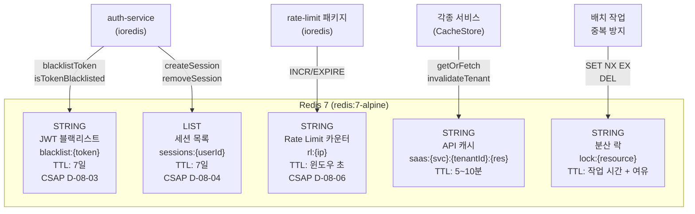
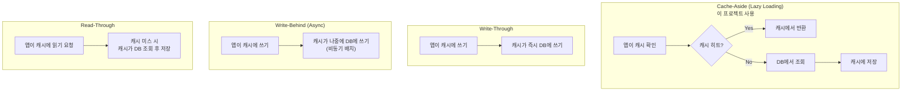
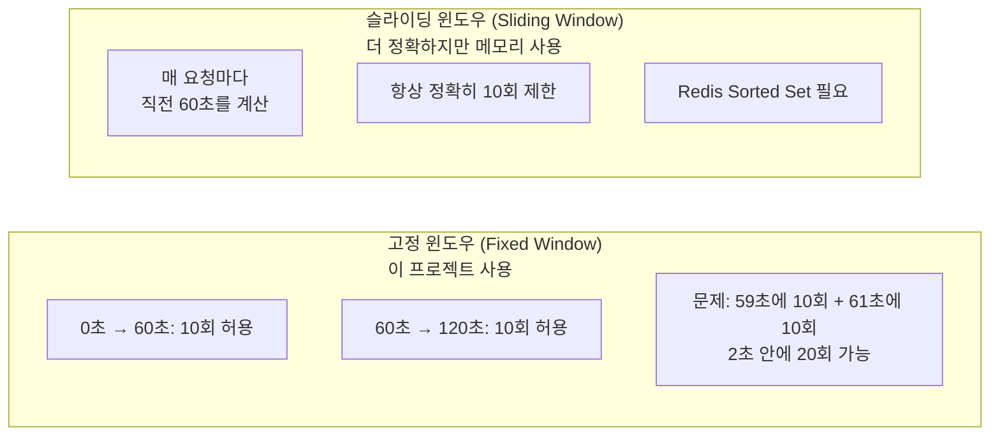
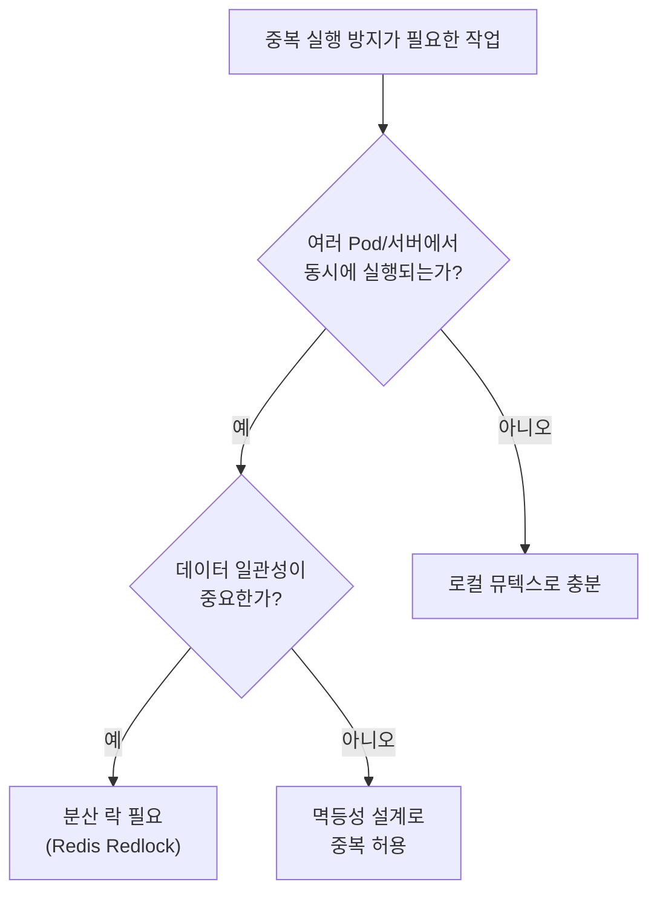
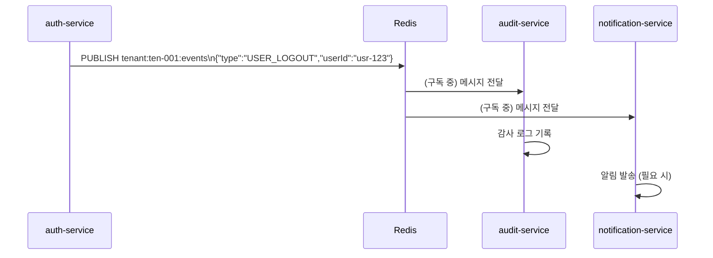
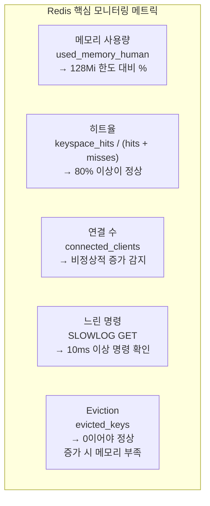

# Redis 고급 패턴 가이드

> **문서 ID**: ONBOARD-03-15
> **버전**: 1.0.0 | **작성일**: 2026-04-12 | **작성자**: Implementer (Sonnet)
> **선행 학습**: `04-infrastructure/components/05-redis.md` (Redis 기본 설정)
> **소요 시간**: 약 4~5시간 (실습 포함)
> **CSAP**: D-08-02 (세션 관리), D-08-03 (토큰 무효화), D-08-04 (동시 접속 제한), D-08-06 (무차별 대입 방어)

---

## 목차

1. [이 프로젝트에서 Redis를 사용하는 5가지 용도](#1-이-프로젝트에서-redis를-사용하는-5가지-용도)
2. [캐싱 전략 패턴](#2-캐싱-전략-패턴)
3. [Rate Limiting 구현](#3-rate-limiting-구현)
4. [분산 락 (Redlock)](#4-분산-락-redlock)
5. [Redis Pub/Sub 이벤트 버스](#5-redis-pubsub-이벤트-버스)
6. [Redis 모니터링](#6-redis-모니터링)
7. [실습: 구독 플랜 정보 캐싱 구현](#7-실습-구독-플랜-정보-캐싱-구현)
8. [변경 이력](#8-변경-이력)

---

## 1. 이 프로젝트에서 Redis를 사용하는 5가지 용도

### 1.1 전체 사용 패턴 개요



### 1.2 용도 1: JWT 블랙리스트

JWT는 stateless 토큰입니다. 한 번 발급하면 만료 전까지 유효합니다. 로그아웃 시 이 문제를 해결하기 위해 Redis 블랙리스트를 사용합니다.

**실제 구현 (`platform/services/auth-service/src/lib/session.ts`)**:

```typescript
import Redis from 'ioredis'

const redis = new Redis(process.env['REDIS_URL'] ?? 'redis://localhost:6379')

// CSAP D-08-03: 로그아웃 시 토큰 무효화
const BLACKLIST_KEY = (token: string): string => `blacklist:${token}`
const REFRESH_TOKEN_TTL_SECONDS = 604800  // 7일

/**
 * 토큰을 블랙리스트에 등록 (로그아웃, 강제 무효화 시 호출)
 * TTL은 갱신 토큰 만료 시간(7일)으로 설정
 * 7일이 지나면 어차피 토큰이 만료되므로 자동 삭제됨
 */
export async function blacklistToken(token: string): Promise<void> {
  await redis.set(
    BLACKLIST_KEY(token),           // "blacklist:eyJhbGciOiJSUzI1NiJ9..."
    '1',                            // 값: 존재 여부만 확인 (1바이트로 절약)
    'EX',
    REFRESH_TOKEN_TTL_SECONDS
  )
}

/**
 * API 요청마다 호출 — 토큰이 블랙리스트에 있으면 401 반환
 */
export async function isTokenBlacklisted(token: string): Promise<boolean> {
  const result = await redis.get(BLACKLIST_KEY(token))
  return result !== null  // null → 유효한 토큰, '1' → 블랙리스트된 토큰
}
```

**Redis에 저장되는 데이터**:
```
blacklist:eyJhbGciOiJSUzI1NiJ9.eyJzdWIiOiJ1c2VyLTEifQ → "1" (TTL: 604800초)
```

### 1.3 용도 2: 세션 캐시 (동시 접속 제한)

CSAP D-08-04는 동시 세션을 최대 3개로 제한합니다. Redis List를 사용하여 FIFO(먼저 들어온 것이 먼저 나가는) 방식으로 관리합니다.

```typescript
// CSAP D-08-04: 동시 세션 최대 3개
const SESSION_KEY = (userId: string): string => `sessions:${userId}`
const MAX_CONCURRENT_SESSIONS = 3

interface SessionData {
  token: string
  refreshToken: string
  ip: string
  userAgent: string
  createdAt: string
}

export async function createSession(
  userId: string,
  sessionData: SessionData
): Promise<void> {
  const key = SESSION_KEY(userId)

  // 현재 세션 목록 조회 (Redis List)
  const sessions = await redis.lrange(key, 0, -1)

  // 세션 3개 초과 시: 가장 오래된 세션 강제 만료 (FIFO)
  if (sessions.length >= MAX_CONCURRENT_SESSIONS) {
    const oldestRaw = await redis.lpop(key)  // 리스트 맨 앞(가장 오래된 것) 제거
    if (oldestRaw) {
      const oldest = JSON.parse(oldestRaw) as SessionData
      await blacklistToken(oldest.token)        // 오래된 액세스 토큰 무효화
      await blacklistToken(oldest.refreshToken) // 오래된 갱신 토큰 무효화
    }
  }

  // 새 세션 리스트 끝에 추가
  await redis.rpush(key, JSON.stringify(sessionData))
  await redis.expire(key, REFRESH_TOKEN_TTL_SECONDS)  // 7일 TTL
}
```

**Redis에 저장되는 데이터 (List 자료구조)**:
```
sessions:user-abc123 → [
  '{"token":"eyJ...1","ip":"1.1.1.1","userAgent":"Chrome","createdAt":"2026-04-12T08:00:00Z"}',
  '{"token":"eyJ...2","ip":"2.2.2.2","userAgent":"Firefox","createdAt":"2026-04-12T09:00:00Z"}',
  '{"token":"eyJ...3","ip":"3.3.3.3","userAgent":"Mobile","createdAt":"2026-04-12T10:00:00Z"}'
]
TTL: 604800초 (7일)
```

### 1.4 용도 3: Rate Limiting

```typescript
// platform/packages/rate-limit/src/index.ts — 실제 구현
// CSAP D-08-06: 무차별 대입 공격 방어

export function createRateLimiter(
  maxRequests: number,
  windowSeconds: number,
  keyPrefix: string = 'rl'
) {
  return async function rateLimitMiddleware(
    request: FastifyRequest,
    reply: FastifyReply
  ): Promise<void> {
    const redis = await getRedis()
    if (!redis) return  // Redis 미연결 시 통과 (가용성 우선)

    const key = `${keyPrefix}:${request.ip}`
    const current = await redis.incr(key)  // 원자적 증가

    if (current === 1) {
      await redis.expire(key, windowSeconds)  // 첫 요청 시 TTL 설정
    }

    const ttl = await redis.ttl(key)
    const remaining = Math.max(0, maxRequests - current)

    // 응답 헤더로 클라이언트에 정보 제공
    void reply.header('X-RateLimit-Limit', String(maxRequests))
    void reply.header('X-RateLimit-Remaining', String(remaining))
    void reply.header('X-RateLimit-Reset', String(ttl))

    if (current > maxRequests) {
      await reply.status(429).send({
        error: {
          code: 'RATE_LIMIT_EXCEEDED',
          message: '요청 한도를 초과했습니다.',
          retryAfter: ttl,
        },
      })
    }
  }
}
```

### 1.5 용도 4: Pub/Sub 이벤트 버스

```typescript
// 이벤트 발행자 (Publisher)
const publisher = new Redis(process.env['REDIS_URL'])

async function publishTenantEvent(tenantId: string, event: TenantEvent): Promise<void> {
  const channel = `tenant:${tenantId}:events`
  await publisher.publish(channel, JSON.stringify(event))
}

// 이벤트 구독자 (Subscriber) — 별도 Redis 연결 필요
const subscriber = new Redis(process.env['REDIS_URL'])

subscriber.subscribe('tenant:ten-001:events', (err, count) => {
  if (err) console.error('구독 실패:', err)
  console.log(`${count}개 채널 구독 중`)
})

subscriber.on('message', (channel, message) => {
  const event = JSON.parse(message) as TenantEvent
  // 이벤트 처리 로직
  handleTenantEvent(event)
})
```

⚠️ **Pub/Sub 주의사항**: Pub/Sub는 fire-and-forget 방식입니다. 구독자가 오프라인이면 메시지를 놓칩니다. 메시지 보장이 필요하면 Redis Streams를 사용하십시오.

### 1.6 용도 5: 분산 락

배치 작업이나 중복 처리를 방지해야 할 때 분산 락을 사용합니다. (자세한 내용은 [4장](#4-분산-락-redlock) 참조)

---

## 2. 캐싱 전략 패턴

### 2.1 4가지 캐싱 전략 비교



### 2.2 Cache-Aside (Lazy Loading) — 이 프로젝트 사용

```typescript
// platform/packages/cache/src/cache-store.ts — 실제 구현
// Design Ref: §2 — Cache-Aside 패턴

export class CacheStore {
  private store = new Map<string, CacheEntry>()

  /**
   * 캐시 키 생성 — 반드시 tenantId 포함 (CSAP D-08-05 테넌트 격리)
   * 패턴: saas:{service}:{tenantId}:{resource}:{identifier}
   *
   * 예시:
   * - saas:tenant:ten-001:config
   * - saas:subscription:ten-001:plan:plan-basic
   * - saas:user:ten-001:profile:usr-abc123
   */
  buildKey(
    service: string,
    tenantId: string,
    resource: string,
    identifier?: string
  ): string {
    const parts = ['saas', service, tenantId, resource]
    if (identifier) parts.push(identifier)
    return parts.join(':')
  }

  /**
   * Cache-Aside 패턴 구현
   * 1. 캐시 확인 → 있으면 즉시 반환 (DB 조회 없음)
   * 2. 없으면 fetcher 실행 → 결과를 캐시에 저장 → 반환
   */
  async getOrFetch<T>(
    key: string,
    tenantId: string,
    fetcher: () => Promise<T>,
    ttlSeconds: number = 300  // 기본값: 5분
  ): Promise<T> {
    const cached = this.get<T>(key)
    if (cached !== undefined) {
      // 캐시 히트: DB 조회 없이 즉시 반환
      return cached
    }

    // 캐시 미스: DB에서 조회
    const value = await fetcher()

    // 결과를 캐시에 저장 (tenantId 포함하여 격리 보장)
    this.set(key, value, tenantId, ttlSeconds)

    return value
  }

  /**
   * 테넌트의 모든 캐시 무효화
   * 테넌트 정지/설정 변경 시 호출
   */
  invalidateTenant(tenantId: string): number {
    let deleted = 0
    for (const [key, entry] of this.store.entries()) {
      if (entry.tenantId === tenantId) {
        this.store.delete(key)
        deleted++
      }
    }
    return deleted
  }
}
```

**실제 사용 예시**:

```typescript
const cacheStore = new CacheStore({ defaultTtlSeconds: 300, maxEntries: 10000 })

// 구독 플랜 정보 캐싱 (자주 변경되지 않음 → 10분 캐시)
async function getSubscriptionPlan(tenantId: string, planId: string) {
  const key = cacheStore.buildKey('subscription', tenantId, 'plan', planId)
  // key = "saas:subscription:ten-001:plan:plan-basic"

  return cacheStore.getOrFetch(
    key,
    tenantId,
    () => prisma.plan.findUnique({ where: { id: planId } }),
    600  // 10분 캐시
  )
}

// 테넌트 설정 변경 시 캐시 무효화
async function updateTenantConfig(tenantId: string, config: TenantConfig) {
  await prisma.tenant.update({ where: { id: tenantId }, data: { config } })

  // 이 테넌트의 모든 캐시 무효화
  const deleted = cacheStore.invalidateTenant(tenantId)
  console.log(`${deleted}개 캐시 항목 무효화`)
}
```

### 2.3 캐시 스탬피드 방지 (Thundering Herd)

💡 **문제**: 인기 있는 캐시가 만료되는 순간, 수백 개의 요청이 동시에 DB를 조회하면 DB가 과부하됩니다.

```typescript
// ✅ 해결책 1: Probabilistic Early Expiration
// 만료 시간이 가까워지면 일부 요청이 미리 갱신
function shouldRefreshEarly(ttlSeconds: number, expiresAt: Date): boolean {
  const remaining = (expiresAt.getTime() - Date.now()) / 1000
  // TTL의 10% 미만 남았을 때 10% 확률로 미리 갱신
  if (remaining < ttlSeconds * 0.1) {
    return Math.random() < 0.1
  }
  return false
}

// ✅ 해결책 2: 분산 락으로 단일 갱신 보장
async function getWithLock<T>(
  redis: Redis,
  cacheKey: string,
  lockKey: string,
  fetcher: () => Promise<T>,
  ttlSeconds: number
): Promise<T> {
  // 1. 캐시 확인
  const cached = await redis.get(cacheKey)
  if (cached) return JSON.parse(cached) as T

  // 2. 락 획득 시도 (SET NX EX: 동시에 하나만 성공)
  const lockAcquired = await redis.set(lockKey, '1', 'EX', 30, 'NX')

  if (lockAcquired) {
    try {
      // 락 획득 성공: DB 조회 후 캐시 저장
      const value = await fetcher()
      await redis.setex(cacheKey, ttlSeconds, JSON.stringify(value))
      return value
    } finally {
      await redis.del(lockKey)  // 락 해제
    }
  } else {
    // 락 획득 실패: 다른 프로세스가 갱신 중 → 잠시 후 재시도
    await new Promise((resolve) => setTimeout(resolve, 100))
    const retryCache = await redis.get(cacheKey)
    if (retryCache) return JSON.parse(retryCache) as T
    return fetcher()  // 최후 수단: 직접 DB 조회
  }
}
```

### 2.4 이벤트 기반 캐시 무효화

```typescript
// 데이터 변경 시 캐시 자동 무효화
// 이벤트: 테넌트 설정 변경 → 관련 캐시 모두 삭제

interface CacheInvalidationEvent {
  type: 'TENANT_CONFIG_UPDATED' | 'PLAN_CHANGED' | 'USER_ROLE_CHANGED'
  tenantId: string
  resourceId?: string
}

class CacheInvalidationService {
  private readonly patterns: Record<string, string[]> = {
    TENANT_CONFIG_UPDATED: [
      'saas:tenant:{tenantId}:config',
      'saas:subscription:{tenantId}:*',
    ],
    PLAN_CHANGED: [
      'saas:subscription:{tenantId}:plan:*',
    ],
    USER_ROLE_CHANGED: [
      'saas:user:{tenantId}:profile:{resourceId}',
      'saas:user:{tenantId}:permissions:{resourceId}',
    ],
  }

  async invalidate(event: CacheInvalidationEvent): Promise<void> {
    const patterns = this.patterns[event.type] ?? []

    for (const pattern of patterns) {
      const resolvedPattern = pattern
        .replace('{tenantId}', event.tenantId)
        .replace('{resourceId}', event.resourceId ?? '*')

      // Redis SCAN으로 패턴에 맞는 키 찾아서 삭제
      // (KEYS 명령은 운영 환경에서 사용 금지 — 블로킹 명령)
      await this.scanAndDelete(resolvedPattern)
    }
  }

  private async scanAndDelete(pattern: string): Promise<void> {
    let cursor = '0'
    do {
      const [nextCursor, keys] = await redis.scan(
        cursor,
        'MATCH',
        pattern,
        'COUNT',
        100
      )
      cursor = nextCursor

      if (keys.length > 0) {
        await redis.del(...keys)
      }
    } while (cursor !== '0')
  }
}
```

---

## 3. Rate Limiting 구현

### 3.1 고정 윈도우 vs 슬라이딩 윈도우



**이 프로젝트의 선택**: 고정 윈도우 (INCR + EXPIRE)
- 구현이 단순하고 O(1) 성능
- 공공기관 SaaS에서 충분한 수준의 보호

**슬라이딩 윈도우 구현 (더 정확한 제어가 필요할 때)**:

```typescript
// 슬라이딩 윈도우 Rate Limiting — Sorted Set 사용
async function slidingWindowRateLimit(
  redis: Redis,
  key: string,
  maxRequests: number,
  windowSeconds: number
): Promise<{ allowed: boolean; remaining: number; resetAt: number }> {
  const now = Date.now()
  const windowStart = now - windowSeconds * 1000

  // 트랜잭션으로 원자적 처리
  const [, , requestCount] = await redis.multi()
    .zremrangebyscore(key, '-inf', windowStart)  // 윈도우 밖 항목 제거
    .zadd(key, now, `${now}-${Math.random()}`)  // 현재 요청 추가
    .zcard(key)                                   // 현재 요청 수 확인
    .expire(key, windowSeconds)                   // TTL 설정
    .exec() as [null, null, number, null]

  const allowed = requestCount <= maxRequests
  const remaining = Math.max(0, maxRequests - requestCount)
  const resetAt = now + windowSeconds * 1000

  return { allowed, remaining, resetAt }
}
```

### 3.2 Lua 스크립트로 원자적 연산

⚠️ **문제**: INCR와 EXPIRE를 별도 명령으로 실행하면 중간에 다른 요청이 끼어들 수 있습니다.

```typescript
// ✅ Lua 스크립트: INCR + EXPIRE를 원자적으로 실행
const rateLimitScript = `
  local key = KEYS[1]
  local max = tonumber(ARGV[1])
  local window = tonumber(ARGV[2])

  -- 현재 카운터 증가
  local current = redis.call('INCR', key)

  -- 첫 번째 요청이면 TTL 설정
  if current == 1 then
    redis.call('EXPIRE', key, window)
  end

  -- TTL 조회
  local ttl = redis.call('TTL', key)

  -- 결과 반환: [현재 카운트, 남은 TTL, 허용 여부(1/0)]
  if current > max then
    return {current, ttl, 0}
  else
    return {current, ttl, 1}
  end
`

async function atomicRateLimit(
  redis: Redis,
  key: string,
  maxRequests: number,
  windowSeconds: number
): Promise<{ current: number; ttl: number; allowed: boolean }> {
  const result = await redis.eval(
    rateLimitScript,
    1,           // KEYS 수
    key,         // KEYS[1]
    maxRequests, // ARGV[1]
    windowSeconds // ARGV[2]
  ) as [number, number, number]

  return {
    current: result[0],
    ttl: result[1],
    allowed: result[2] === 1,
  }
}
```

### 3.3 테넌트별 Rate Limit 설정

공공기관 SaaS에서는 기관(테넌트)마다 다른 Rate Limit이 필요합니다.

```typescript
// 테넌트별 플랜에 따른 Rate Limit 설정
interface TenantRateLimitConfig {
  apiCallsPerMinute: number
  aiCallsPerHour: number
  fileUploadPerDay: number
}

const PLAN_RATE_LIMITS: Record<string, TenantRateLimitConfig> = {
  'trial': {
    apiCallsPerMinute: 60,
    aiCallsPerHour: 10,
    fileUploadPerDay: 5,
  },
  'basic': {
    apiCallsPerMinute: 300,
    aiCallsPerHour: 100,
    fileUploadPerDay: 50,
  },
  'premium': {
    apiCallsPerMinute: 1000,
    aiCallsPerHour: 500,
    fileUploadPerDay: 500,
  },
}

// 테넌트별 Rate Limit 미들웨어
async function tenantRateLimitMiddleware(
  request: FastifyRequest,
  reply: FastifyReply
): Promise<void> {
  const tenantId = request.headers['x-tenant-id'] as string
  const plan = await getTenantPlan(tenantId)  // 캐시에서 플랜 정보 조회
  const config = PLAN_RATE_LIMITS[plan.slug] ?? PLAN_RATE_LIMITS['trial']

  // 테넌트 + IP 복합 키
  const key = `rl:tenant:${tenantId}:api`

  const { allowed, remaining } = await atomicRateLimit(
    redis,
    key,
    config.apiCallsPerMinute,
    60  // 1분 윈도우
  )

  if (!allowed) {
    await reply.status(429).send({
      error: {
        code: 'TENANT_RATE_LIMIT_EXCEEDED',
        message: `플랜(${plan.slug}) API 호출 한도를 초과했습니다.`,
        plan: plan.slug,
        limit: config.apiCallsPerMinute,
        remaining: 0,
      }
    })
  }
}
```

---

## 4. 분산 락 (Redlock)

### 4.1 언제 분산 락이 필요한가



**분산 락이 필요한 시나리오**:
1. 월간 청구서 생성 배치 (한 번만 실행해야 함)
2. 구독 갱신 처리 (중복 결제 방지)
3. 감사 로그 해시 체인 갱신 (순서 보장)
4. 외부 API 동기화 (중복 호출 방지)

### 4.2 SET NX EX 패턴 구현

```typescript
// 분산 락 구현 — Redis SET NX (Not eXist) + EX (Expiry)
class DistributedLock {
  constructor(
    private readonly redis: Redis,
    private readonly defaultTtlSeconds: number = 30
  ) {}

  /**
   * 락 획득 시도
   * @returns lockToken: 성공 시 고유 토큰 (해제 시 필요), null: 이미 락 존재
   */
  async acquire(
    resource: string,
    ttlSeconds: number = this.defaultTtlSeconds
  ): Promise<string | null> {
    const lockKey = `lock:${resource}`
    const lockToken = `${Date.now()}-${Math.random()}`  // 고유 식별자

    // SET NX: 키가 없을 때만 설정 (원자적)
    const result = await this.redis.set(
      lockKey,
      lockToken,
      'EX', ttlSeconds,
      'NX'  // Not eXist — 이미 있으면 null 반환
    )

    return result === 'OK' ? lockToken : null
  }

  /**
   * 락 해제 — 반드시 내가 획득한 락만 해제 (Lua 스크립트로 원자적)
   * 내 토큰이 아닌 락을 해제하면 다른 프로세스의 작업이 중단됨
   */
  async release(resource: string, lockToken: string): Promise<boolean> {
    const lockKey = `lock:${resource}`

    // Lua 스크립트: 토큰 확인 후 삭제 (원자적)
    const releaseScript = `
      if redis.call("get", KEYS[1]) == ARGV[1] then
        return redis.call("del", KEYS[1])
      else
        return 0
      end
    `

    const result = await this.redis.eval(releaseScript, 1, lockKey, lockToken)
    return result === 1
  }

  /**
   * 락 보유 상태에서 작업 실행 (자동 해제 보장)
   */
  async withLock<T>(
    resource: string,
    task: () => Promise<T>,
    options: { ttlSeconds?: number; retries?: number; retryDelayMs?: number } = {}
  ): Promise<T> {
    const { ttlSeconds = 30, retries = 3, retryDelayMs = 200 } = options
    let lockToken: string | null = null

    for (let attempt = 0; attempt < retries; attempt++) {
      lockToken = await this.acquire(resource, ttlSeconds)
      if (lockToken) break

      if (attempt < retries - 1) {
        await new Promise((resolve) => setTimeout(resolve, retryDelayMs))
      }
    }

    if (!lockToken) {
      throw new Error(`분산 락 획득 실패: ${resource} (${retries}회 시도)`)
    }

    try {
      return await task()
    } finally {
      await this.release(resource, lockToken)
    }
  }
}
```

**실제 사용 예시 — 월간 청구서 생성**:

```typescript
const lock = new DistributedLock(redis)

async function generateMonthlyInvoices(month: string): Promise<void> {
  const resource = `billing:monthly-invoice:${month}`

  await lock.withLock(
    resource,
    async () => {
      // 이 블록은 전체 클러스터에서 하나의 프로세스만 실행
      const tenants = await prisma.tenant.findMany({
        where: { status: 'ACTIVE' }
      })

      for (const tenant of tenants) {
        await generateInvoiceForTenant(tenant.id, month)
      }
    },
    { ttlSeconds: 300, retries: 1 }  // 5분 제한, 재시도 없음
  )
}
```

### 4.3 락 만료 연장 (Watchdog)

작업이 락 TTL보다 오래 걸릴 수 있을 때, 주기적으로 TTL을 연장합니다.

```typescript
// Watchdog: 작업이 끝날 때까지 락 TTL 자동 연장
async function withWatchdog<T>(
  redis: Redis,
  lockKey: string,
  lockToken: string,
  task: () => Promise<T>,
  ttlSeconds: number = 30
): Promise<T> {
  let running = true

  // Watchdog: 락 TTL을 주기적으로 연장
  const watchdog = setInterval(async () => {
    if (!running) return

    // 토큰 확인 후 TTL 연장 (Lua 스크립트)
    const extendScript = `
      if redis.call("get", KEYS[1]) == ARGV[1] then
        return redis.call("expire", KEYS[1], ARGV[2])
      else
        return 0
      end
    `

    const extended = await redis.eval(extendScript, 1, lockKey, lockToken, ttlSeconds)
    if (!extended) {
      console.warn(`Watchdog: 락 연장 실패 (락이 다른 프로세스에 의해 해제됨)`)
    }
  }, (ttlSeconds * 1000) / 3)  // TTL의 1/3마다 연장

  try {
    return await task()
  } finally {
    running = false
    clearInterval(watchdog)
  }
}
```

---

## 5. Redis Pub/Sub 이벤트 버스

### 5.1 Pub/Sub 아키텍처



### 5.2 이벤트 타입 정의

```typescript
// 이벤트 타입 정의 — 타입 안전한 이벤트 버스
type TenantEventType =
  | 'USER_CREATED'
  | 'USER_DELETED'
  | 'USER_ROLE_CHANGED'
  | 'USER_LOGIN'
  | 'USER_LOGOUT'
  | 'SUBSCRIPTION_CHANGED'
  | 'TENANT_CONFIG_UPDATED'

interface TenantEvent {
  type: TenantEventType
  tenantId: string
  actorId?: string
  payload: Record<string, unknown>
  timestamp: string
}

class RedisEventBus {
  private readonly publisher: Redis
  private readonly subscribers = new Map<string, Redis>()

  constructor(redisUrl: string) {
    // Pub/Sub는 별도 연결 필요 (구독 중인 연결은 다른 명령 불가)
    this.publisher = new Redis(redisUrl)
  }

  async publish(tenantId: string, event: TenantEvent): Promise<void> {
    const channel = `tenant:${tenantId}:events`
    await this.publisher.publish(channel, JSON.stringify(event))
  }

  subscribe(
    tenantId: string,
    handler: (event: TenantEvent) => Promise<void>
  ): void {
    const channel = `tenant:${tenantId}:events`
    const subscriber = new Redis(process.env['REDIS_URL']!)

    subscriber.subscribe(channel)
    subscriber.on('message', async (ch, message) => {
      if (ch !== channel) return
      const event = JSON.parse(message) as TenantEvent
      await handler(event)
    })

    this.subscribers.set(tenantId, subscriber)
  }

  async close(): Promise<void> {
    for (const subscriber of this.subscribers.values()) {
      subscriber.disconnect()
    }
    this.publisher.disconnect()
  }
}
```

---

## 6. Redis 모니터링

### 6.1 핵심 메트릭



### 6.2 redis-cli 모니터링 명령

```bash
# Redis Pod 접속
kubectl exec -it -n saas-platform \
  $(kubectl get pods -n saas-platform -l app.kubernetes.io/name=redis -o jsonpath='{.items[0].metadata.name}') \
  -- redis-cli

# 1. 메모리 사용량 확인
INFO memory
# used_memory_human: 15.50M
# maxmemory_human: 128.00M
# mem_fragmentation_ratio: 1.2  (1.5 이상이면 메모리 단편화 문제)

# 2. 히트율 확인
INFO stats
# keyspace_hits: 15234
# keyspace_misses: 1523
# 히트율 = 15234 / (15234 + 1523) = 90.9% → 정상

# 3. 느린 명령 확인 (10ms 이상)
SLOWLOG GET 10
# 1) 1) (integer) 14           ← 로그 ID
#    2) (integer) 1712848800   ← Unix 타임스탬프
#    3) (integer) 12523        ← 실행 시간 (마이크로초) = 12.5ms
#    4) 1) "KEYS"              ← 명령 (KEYS는 블로킹 — 즉시 SCAN으로 교체)
#       2) "*"

# 4. 실시간 명령 모니터링 (운영 환경에서는 주의 — 성능 영향)
MONITOR
# OK
# 1712848800.123456 [0 10.42.1.5:52048] "GET" "blacklist:eyJ..."
# 1712848800.234567 [0 10.42.1.6:52049] "INCR" "ratelimit:10.42.1.1"

# 5. Eviction 확인
INFO stats | grep evicted
# evicted_keys: 0  → 정상 (0이 아니면 메모리 부족)

# 6. Keyspace 통계
INFO keyspace
# db0:keys=1523,expires=1200,avg_ttl=145323
```

### 6.3 PromQL 메트릭 (Redis Exporter)

```yaml
# Redis Exporter가 수집하는 Prometheus 메트릭
# Design Ref: §6 — Redis 모니터링

# 메모리 사용률 (%)
(redis_memory_used_bytes / redis_memory_max_bytes) * 100

# 캐시 히트율 (%)
rate(redis_keyspace_hits_total[5m]) /
  (rate(redis_keyspace_hits_total[5m]) + rate(redis_keyspace_misses_total[5m]))
* 100

# 초당 명령 처리량
rate(redis_commands_processed_total[1m])

# 연결된 클라이언트 수
redis_connected_clients

# Eviction 발생 여부
increase(redis_evicted_keys_total[5m])
```

**Grafana 알람 기준**:

| 메트릭 | 경고 | 위급 | 조치 |
|--------|------|------|------|
| 메모리 사용률 | 70% 이상 | 90% 이상 | maxmemory 증가 또는 TTL 단축 |
| 히트율 | 80% 미만 | 60% 미만 | TTL 연장 또는 워밍업 구현 |
| Eviction 발생 | 분당 10개 이상 | 분당 100개 이상 | 즉시 메모리 확장 |
| 연결 수 | 100개 이상 | 200개 이상 | 연결 풀 설정 확인 |

### 6.4 maxmemory-policy 설정

```bash
# 현재 정책 확인
redis-cli CONFIG GET maxmemory-policy
# 1) "maxmemory-policy"
# 2) "noeviction"

# 이 프로젝트 권장: volatile-lru
# TTL 있는 키(캐시) 우선 제거, TTL 없는 키(블랙리스트) 보호
redis-cli CONFIG SET maxmemory-policy volatile-lru
```

| 정책 | 제거 대상 | 권장 상황 |
|------|---------|---------|
| `noeviction` | 제거 안 함, 오류 반환 | 중요 데이터 (기본값) |
| `allkeys-lru` | 모든 키 중 오래된 것 | 순수 캐시 |
| `volatile-lru` | TTL 있는 키 중 오래된 것 | 세션/캐시 혼용 ← **권장** |
| `volatile-ttl` | TTL 짧은 것 우선 | TTL 기반 우선순위 |

---

## 7. 실습: 구독 플랜 정보 캐싱 구현

### 7.1 구현 목표

구독 플랜 정보는 자주 조회되지만 거의 변경되지 않습니다. Redis에 캐싱하여 DB 부하를 줄이겠습니다.

**요구사항**:
- 플랜 정보 10분 캐시
- 플랜 변경 시 즉시 캐시 무효화
- 멀티테넌시: 테넌트별 캐시 격리

### 7.2 구현

```typescript
// platform/services/subscription-service/src/lib/plan-cache.ts
// Design Ref: §7 — 구독 플랜 캐싱

import Redis from 'ioredis'
import { prisma } from './prisma'

const redis = new Redis(process.env['REDIS_URL'] ?? 'redis://localhost:6379')

const PLAN_CACHE_TTL = 600  // 10분 (플랜 정보는 자주 바뀌지 않음)

// 캐시 키 패턴
const planKey = (planId: string) => `saas:plan:global:info:${planId}`
const tenantPlanKey = (tenantId: string) => `saas:subscription:${tenantId}:current-plan`

interface CachedPlan {
  id: string
  name: string
  slug: string
  maxUsers: number
  maxStorage: string
  features: string[]
  cachedAt: string
}

/**
 * 플랜 정보 조회 (캐시 우선, DB 폴백)
 */
export async function getPlan(planId: string): Promise<CachedPlan | null> {
  const key = planKey(planId)

  // 1. 캐시 확인
  const cached = await redis.get(key)
  if (cached) {
    return JSON.parse(cached) as CachedPlan
  }

  // 2. DB에서 조회
  const plan = await prisma.plan.findUnique({
    where: { id: planId },
    include: {
      services: { include: { service: true } }
    }
  })

  if (!plan) return null

  // 3. 캐시 형태로 변환
  const cached_plan: CachedPlan = {
    id: plan.id,
    name: plan.name,
    slug: plan.slug,
    maxUsers: plan.maxUsers,
    maxStorage: plan.maxStorage.toString(),
    features: plan.services.map((ps) => ps.service.name),
    cachedAt: new Date().toISOString(),
  }

  // 4. Redis에 저장
  await redis.setex(key, PLAN_CACHE_TTL, JSON.stringify(cached_plan))

  return cached_plan
}

/**
 * 테넌트의 현재 구독 플랜 조회
 */
export async function getTenantCurrentPlan(tenantId: string): Promise<CachedPlan | null> {
  const key = tenantPlanKey(tenantId)

  // 캐시 확인
  const cachedPlanId = await redis.get(key)
  if (cachedPlanId) {
    return getPlan(cachedPlanId)
  }

  // DB에서 활성 구독 조회
  const subscription = await prisma.subscription.findFirst({
    where: {
      tenantId,
      status: 'ACTIVE',
    },
    orderBy: { currentPeriodEnd: 'desc' },
  })

  if (!subscription) return null

  // 테넌트→플랜ID 매핑 캐시 저장
  await redis.setex(key, PLAN_CACHE_TTL, subscription.planId)

  return getPlan(subscription.planId)
}

/**
 * 플랜 변경 시 캐시 무효화
 * 플랜 업데이트 후 반드시 호출
 */
export async function invalidatePlanCache(planId: string): Promise<void> {
  // 플랜 자체 캐시 삭제
  await redis.del(planKey(planId))

  // 이 플랜을 사용하는 테넌트 캐시 삭제
  const subscriptions = await prisma.subscription.findMany({
    where: { planId, status: 'ACTIVE' },
    select: { tenantId: true }
  })

  if (subscriptions.length > 0) {
    const tenantKeys = subscriptions.map((s) => tenantPlanKey(s.tenantId))
    await redis.del(...tenantKeys)
  }

  console.log(`플랜 캐시 무효화 완료: planId=${planId}, 테넌트 ${subscriptions.length}개`)
}
```

### 7.3 테스트

```typescript
// 플랜 캐시 테스트
describe('Plan Cache', () => {
  beforeEach(async () => {
    // 테스트 전 Redis 초기화
    await redis.flushdb()
  })

  it('첫 조회는 DB에서, 두 번째 조회는 캐시에서', async () => {
    const prismaFindSpy = jest.spyOn(prisma.plan, 'findUnique')

    // 첫 조회: DB 히트
    await getPlan('plan-basic')
    expect(prismaFindSpy).toHaveBeenCalledTimes(1)

    // 두 번째 조회: 캐시 히트
    await getPlan('plan-basic')
    expect(prismaFindSpy).toHaveBeenCalledTimes(1)  // 추가 DB 호출 없음
  })

  it('캐시 무효화 후 다음 조회는 DB에서', async () => {
    await getPlan('plan-basic')

    await invalidatePlanCache('plan-basic')

    const prismaFindSpy = jest.spyOn(prisma.plan, 'findUnique')
    await getPlan('plan-basic')
    expect(prismaFindSpy).toHaveBeenCalledTimes(1)  // 캐시 없으므로 DB 조회
  })

  it('캐시 키에 tenantId가 포함되어 테넌트 격리됨', async () => {
    const key1 = tenantPlanKey('ten-001')
    const key2 = tenantPlanKey('ten-002')

    expect(key1).toBe('saas:subscription:ten-001:current-plan')
    expect(key2).toBe('saas:subscription:ten-002:current-plan')
    expect(key1).not.toBe(key2)  // 테넌트별 격리 확인
  })
})
```

### 7.4 Redis에서 결과 확인

```bash
# 플랜 캐시 조회
kubectl exec -it -n saas-platform <redis-pod> -- redis-cli

# 플랜 캐시 확인
127.0.0.1:6379> GET saas:plan:global:info:plan-basic
"{\"id\":\"plan-basic\",\"name\":\"기본 플랜\",\"slug\":\"basic\",\"maxUsers\":50,...}"

# TTL 확인 (600초 = 10분)
127.0.0.1:6379> TTL saas:plan:global:info:plan-basic
(integer) 587

# 테넌트 구독 캐시
127.0.0.1:6379> GET saas:subscription:ten-001:current-plan
"plan-basic"

# 전체 캐시 키 목록 (SCAN 사용 — KEYS * 대신)
127.0.0.1:6379> SCAN 0 MATCH "saas:*" COUNT 100
1) "0"
2) 1) "saas:plan:global:info:plan-basic"
   2) "saas:plan:global:info:plan-premium"
   3) "saas:subscription:ten-001:current-plan"
```

---

## 8. 변경 이력

| 버전 | 일자 | 내용 | 작성자 |
|------|------|------|--------|
| 1.0.0 | 2026-04-12 | 최초 작성 — Redis 고급 패턴 가이드 | Implementer (Sonnet) |

---

## 학습 체크리스트

**기본 용도 이해**
- [ ] Redis의 5가지 용도를 설명하고 각각의 Redis 키 패턴을 말할 수 있다
- [ ] JWT 블랙리스트가 왜 필요한지 설명할 수 있다
- [ ] 동시 세션 제한이 Redis List로 어떻게 구현되는지 설명할 수 있다

**캐싱 패턴**
- [ ] Cache-Aside 패턴의 3단계를 순서대로 설명할 수 있다
- [ ] 캐시 스탬피드 문제와 해결 방법을 설명할 수 있다
- [ ] 테넌트 격리를 위해 캐시 키에 tenantId를 포함해야 하는 이유를 설명할 수 있다
- [ ] 이벤트 기반 캐시 무효화를 구현할 수 있다

**Rate Limiting**
- [ ] 고정 윈도우의 취약점(경계 문제)을 설명할 수 있다
- [ ] Lua 스크립트가 왜 필요한지 원자성 측면에서 설명할 수 있다
- [ ] 테넌트별 Rate Limit를 플랜에 따라 다르게 설정할 수 있다

**분산 락**
- [ ] `SET NX EX` 명령이 왜 원자적인지 설명할 수 있다
- [ ] 내가 획득한 락만 해제해야 하는 이유를 설명할 수 있다 (Lua 스크립트)
- [ ] Watchdog 패턴이 필요한 상황을 예시로 들 수 있다

**모니터링**
- [ ] redis-cli `INFO memory`에서 메모리 사용률을 계산할 수 있다
- [ ] 캐시 히트율 계산 공식을 설명할 수 있다
- [ ] `volatile-lru` 정책이 이 프로젝트에 적합한 이유를 설명할 수 있다

**실습**
- [ ] 구독 플랜 캐싱을 직접 구현하고 redis-cli로 결과를 확인했다
- [ ] 캐시 무효화 후 키가 사라졌음을 redis-cli로 확인했다

---

## 다음 단계

- `04-infrastructure/components/05-redis.md` — Redis 기본 설치 및 운영
- `03-development/14-database-design.md` — PostgreSQL 설계 원칙
- `04-infrastructure/components/06-linkerd.md` — 서비스 메시 (mTLS 통신 암호화)
