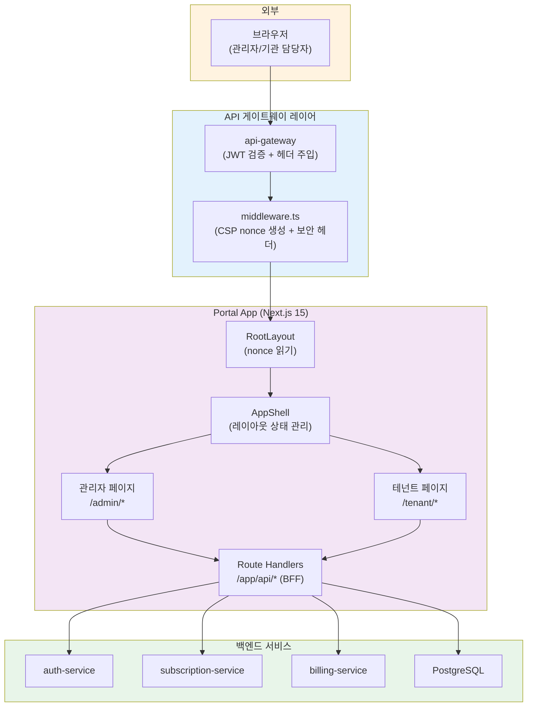
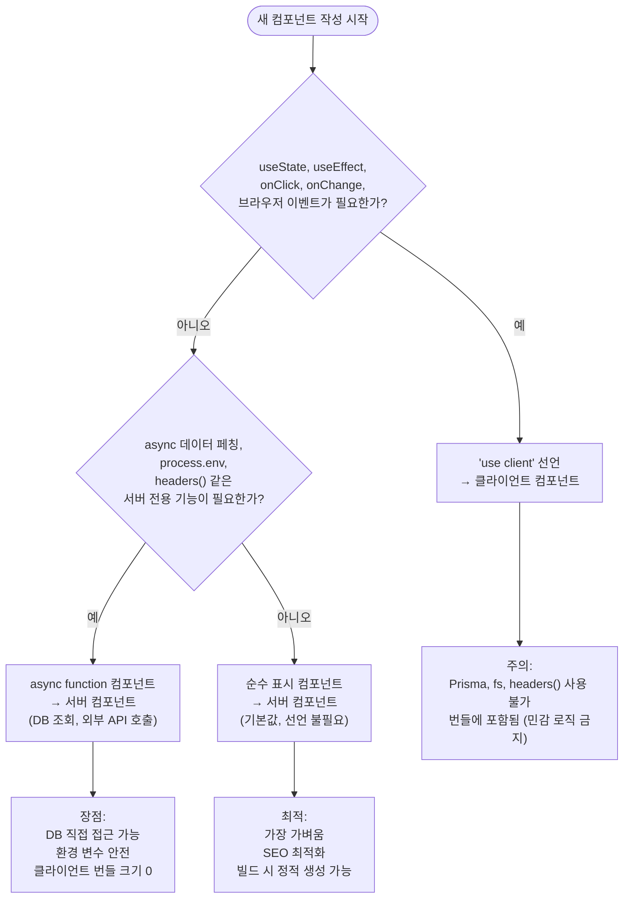
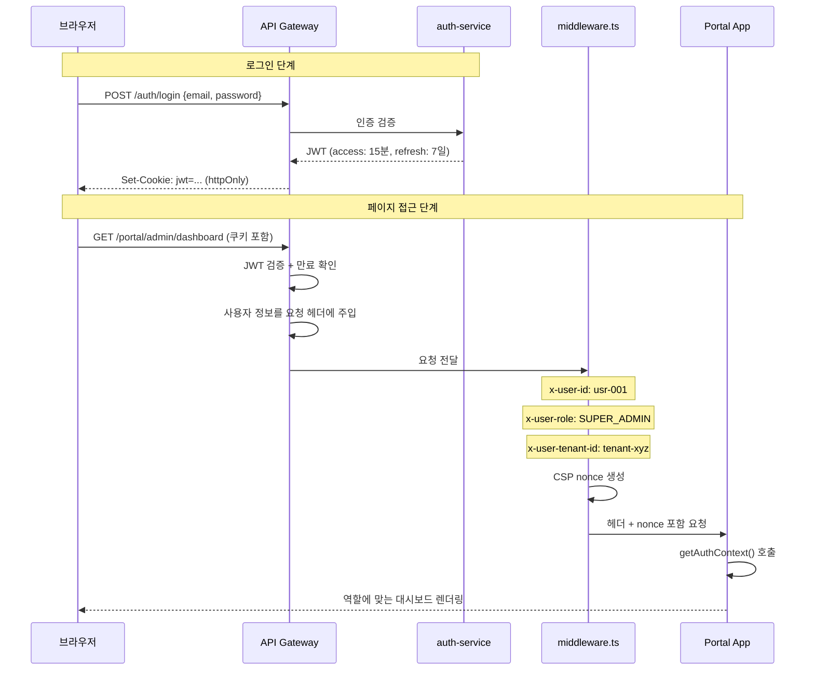
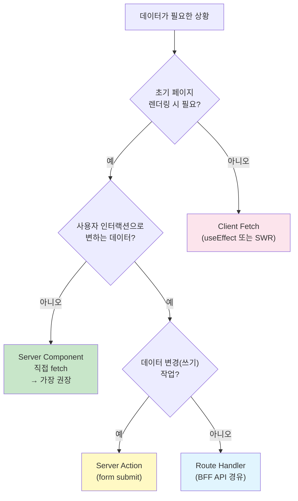
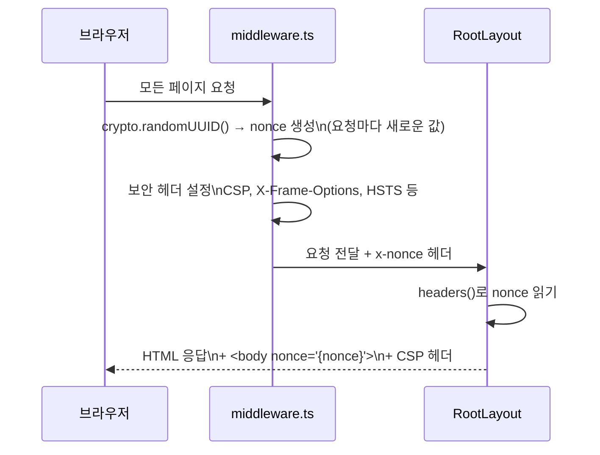

# Next.js Portal 개발 가이드

> **문서 ID**: ONBOARD-03-DEV-16
> **버전**: 1.0.0 | **작성일**: 2026-04-12 | **작성자**: Implementer (Sonnet)
> **대상 독자**: Next.js 기초 지식이 있는 신규 개발자
> **선행 학습**: `02-service-development.md`, `02-architecture/services/17-portal-app.md`
> **예상 학습 시간**: 3시간
> **실제 코드 위치**: `/data/ai-saas/platform/apps/portal/`
> **CSAP 매핑**: D-08 (접근 통제), D-12 (시스템 개발 보안 — XSS/CSP)
> **Design Ref**: DESIGN-MTU-U1-P, DESIGN-MTU-P16a, DESIGN-MTU-P17, L-04-CSP-NONCE.design.md
> **Plan SC**: FR-UP.1 ~ FR-UP.27, FR-L04.1 ~ FR-L04.4

---

## 목차

1. [이 가이드를 읽기 전에](#1-이-가이드를-읽기-전에)
2. [Portal 앱 전체 구조 한눈에 보기](#2-portal-앱-전체-구조-한눈에-보기)
3. [Next.js 15 App Router 폴더 구조](#3-nextjs-15-app-router-폴더-구조)
4. [Server Component vs Client Component](#4-server-component-vs-client-component)
5. [인증 통합 — JWT와 미들웨어](#5-인증-통합--jwt와-미들웨어)
6. [멀티테넌시 UI — 테넌트별 브랜딩과 RBAC](#6-멀티테넌시-ui--테넌트별-브랜딩과-rbac)
7. [API 호출 패턴](#7-api-호출-패턴)
8. [에러 처리와 로딩 상태](#8-에러-처리와-로딩-상태)
9. [CSAP 관련 UI 보안 요건](#9-csap-관련-ui-보안-요건)
10. [성능 최적화](#10-성능-최적화)
11. [실습: 테넌트 대시보드 페이지 추가하기](#11-실습-테넌트-대시보드-페이지-추가하기)
12. [학습 체크리스트](#12-학습-체크리스트)
13. [다음 단계](#13-다음-단계)

---

## 1. 이 가이드를 읽기 전에

### 이 가이드가 다루는 것

이 가이드는 공공기관 SaaS 플랫폼의 포털(Portal) 앱을 개발하거나 수정하는 방법을 다룹니다. 포털은 플랫폼 관리자와 기관 담당자가 실제로 사용하는 웹 UI입니다.

### 전제 지식

- React와 TypeScript 기초 (state, props, hooks)
- HTTP 요청/응답 개념 (REST API)
- Next.js 기초 (pages와 라우팅 개념)

### 이 프로젝트의 Portal이 특별한 이유

일반 Next.js 프로젝트와 달리 이 포털은:

- **공공기관 보안 요건(CSAP D-12)**: Content Security Policy(CSP) 헤더를 미들웨어에서 강제 적용
- **JWT 없이 직접 접속 불가**: 모든 페이지는 API 게이트웨이의 JWT 검증을 거쳐야 함
- **테넌트 격리 UI**: 같은 포털이지만 기관마다 보이는 데이터가 완전히 분리됨
- **역할 기반 메뉴**: SUPER_ADMIN, ADMIN, TENANT_ADMIN, USER, VIEWER 별로 다른 UI

---

## 2. Portal 앱 전체 구조 한눈에 보기



포털은 단순한 프론트엔드가 아닙니다. Next.js의 **Route Handler**를 통해 BFF(Backend For Frontend) 역할도 합니다. 클라이언트가 직접 백엔드 서비스를 호출하는 대신, 포털의 `/app/api/` 경로를 경유합니다.

---

## 3. Next.js 15 App Router 폴더 구조

### 3.1 실제 디렉터리 구조

```
platform/apps/portal/src/
├── app/                                # App Router 루트
│   ├── layout.tsx                      # 루트 레이아웃 (CSP nonce 주입)
│   ├── page.tsx                        # 홈 (관리자 대시보드 진입)
│   ├── admin/                          # 관리자 포털 (SUPER_ADMIN, ADMIN 전용)
│   │   ├── dashboard/page.tsx          # 플랫폼 통합 대시보드
│   │   ├── users/page.tsx              # 전체 사용자 관리
│   │   ├── tenants/page.tsx            # 테넌트(기관) 관리
│   │   ├── billing/                    # 청구·결제 관리
│   │   ├── catalog/page.tsx            # 서비스 카탈로그
│   │   ├── compliance/page.tsx         # CSAP 79항목 준수 현황
│   │   ├── security/page.tsx           # 보안 모니터링
│   │   ├── audit/page.tsx              # 감사 로그 조회
│   │   ├── crm/page.tsx                # CRM 관리
│   │   ├── notifications/page.tsx      # 알림 관리
│   │   ├── files/page.tsx              # 파일 관리
│   │   └── ai/page.tsx                 # AI 관리
│   ├── tenant/                         # 테넌트 포털 (TENANT_ADMIN, USER, VIEWER)
│   │   ├── dashboard/page.tsx          # 기관 대시보드 (구독 서비스 현황)
│   │   ├── services/page.tsx           # 구독 서비스 목록
│   │   ├── marketplace/page.tsx        # 서비스 마켓플레이스
│   │   └── settings/page.tsx          # 기관 설정
│   └── api/                           # Route Handlers (BFF 레이어)
│       ├── dashboard/stats/route.ts    # 플랫폼 통계 API
│       ├── compliance/csap/route.ts    # CSAP 준수 현황 API
│       ├── health/route.ts             # 헬스체크
│       ├── tenants/route.ts            # 테넌트 CRUD API
│       ├── users/route.ts              # 사용자 API
│       ├── subscriptions/route.ts      # 구독 API
│       └── audit-logs/route.ts         # 감사 로그 API
│
├── components/                        # 컴포넌트
│   ├── layout/                        # 레이아웃 컴포넌트 (모두 Client Component)
│   │   ├── AppShell.tsx               # 전체 레이아웃 뼈대 — 상태 관리 허브
│   │   ├── AppNavbar.tsx              # 상단 네비게이션 바
│   │   ├── ServiceRail.tsx            # 좌측 서비스 레일 (13개 서비스)
│   │   ├── FloatingSidebar.tsx        # 플로팅 사이드바 (서비스 선택 시)
│   │   └── RecentTabsBar.tsx          # 최근 방문 탭 히스토리
│   ├── admin/                         # 관리자 전용
│   │   ├── AdminPageTemplate.tsx      # 관리자 페이지 표준 레이아웃
│   │   ├── DashboardContent.tsx       # 대시보드 콘텐츠 (Server Component)
│   │   ├── ServiceCatalogGrid.tsx     # 서비스 카탈로그 목록
│   │   └── TenantDataGrid.tsx         # 테넌트 데이터 테이블
│   ├── tenant/                        # 테넌트 전용
│   │   ├── TenantPageTemplate.tsx     # 테넌트 페이지 표준 레이아웃
│   │   └── ServiceMarketplace.tsx     # 서비스 마켓플레이스
│   ├── common/                        # 공통 재사용 컴포넌트
│   │   ├── DataGrid.tsx               # 범용 데이터 테이블
│   │   └── ComplianceMatrix.tsx       # CSAP 준수 현황 매트릭스
│   ├── ai/                            # AI 관련
│   │   ├── AiSidePanel.tsx            # AI 어시스턴트 사이드 패널
│   │   ├── AIChatWidget.tsx           # AI 채팅 위젯
│   │   ├── DORADashboard.tsx          # DORA 메트릭 대시보드
│   │   └── SLOGauge.tsx               # SLO 게이지
│   └── mobile/                        # 모바일 전용
│       ├── BottomTabBar.tsx           # 하단 탭 바
│       └── SidebarBottomSheet.tsx     # 바텀 시트
│
├── lib/
│   ├── auth-guard.ts                  # 인증 가드 (CSAP D-08)
│   └── prisma.ts                      # Prisma 클라이언트
├── middleware.ts                       # CSP nonce 미들웨어 (CSAP D-12)
└── styles/
    └── globals.css                     # CSS 변수 기반 디자인 시스템
```

### 3.2 특수 파일 역할

Next.js App Router에는 예약된 파일명이 있습니다. 각각의 역할을 이해해야 합니다.

| 파일명 | 역할 | 이 프로젝트에서의 사용 |
|--------|------|----------------------|
| `layout.tsx` | 하위 페이지를 감싸는 레이아웃 | RootLayout: CSP nonce 주입, `<html lang="ko">` 설정 |
| `page.tsx` | 해당 경로의 실제 페이지 | 각 `/admin/*`, `/tenant/*` 경로의 실제 콘텐츠 |
| `loading.tsx` | Suspense 폴백 (로딩 중 표시) | 아직 미작성. Skeleton UI 추가 시 여기에 |
| `error.tsx` | 에러 바운더리 폴백 | 아직 미작성. Error UI 추가 시 여기에 |
| `not-found.tsx` | 404 페이지 | 아직 미작성 |
| `route.ts` | API Route Handler | `/app/api/**` 경로에서 사용 |

#### 실제 루트 레이아웃 코드

```typescript
// platform/apps/portal/src/app/layout.tsx
// Design Ref: DESIGN-MTU-U1-P §A — 루트 레이아웃
// Plan SC: FR-UP.1, FR-UP.10, FR-UP.27
// L-04: CSP nonce 지원

import type { Metadata } from 'next';
import { headers } from 'next/headers';
import '@/styles/globals.css';

export const metadata: Metadata = {
  title: '공공 SaaS 포털',
  description: '공공기관 SaaS 플랫폼 관리 포털',
};

export default async function RootLayout({ children }: { children: React.ReactNode }) {
  // FR-L04.4: middleware.ts에서 주입한 nonce 읽기
  // headers()는 서버 컴포넌트에서만 사용 가능
  const headerStore = await headers();
  const nonce = headerStore.get('x-nonce') ?? '';

  return (
    <html lang="ko">
      <body nonce={nonce}>{children}</body>
    </html>
  );
}
```

💡 `headers()` 함수는 서버 컴포넌트에서만 사용할 수 있습니다. `'use client'` 파일에서 호출하면 오류가 발생합니다.

---

## 4. Server Component vs Client Component

### 4.1 결정 기준

Next.js 15에서 가장 중요한 판단은 "이 컴포넌트를 서버에서 렌더링할까, 브라우저에서 렌더링할까?"입니다.



### 4.2 이 프로젝트의 실제 분류

| 컴포넌트 | 유형 | 이유 |
|---------|------|------|
| `app/layout.tsx` | Server | `headers()` 호출 (CSP nonce 읽기) |
| `app/admin/dashboard/page.tsx` | Server | 인증 검사 후 콘텐츠 조건부 렌더링 |
| `components/admin/DashboardContent.tsx` | Server | async 데이터 페칭, Suspense 사용 |
| `components/layout/AppShell.tsx` | **Client** | `useState` 4개 (rail, sidebar, AI 패널) |
| `components/layout/AppNavbar.tsx` | **Client** | `onClick` (AI 토글 버튼) |
| `components/layout/ServiceRail.tsx` | **Client** | `onClick`, `useState` |
| `components/layout/FloatingSidebar.tsx` | **Client** | 인터랙션, 상태 |
| `components/layout/RecentTabsBar.tsx` | **Client** | 탭 히스토리 상태 |
| `components/common/DataGrid.tsx` | **Client** | 정렬/필터/페이지네이션 상태 |
| `components/ai/AiSidePanel.tsx` | **Client** | 채팅 UI 상태 |
| `components/mobile/BottomTabBar.tsx` | **Client** | 탭 선택 상태 |
| `components/admin/AdminPageTemplate.tsx` | **Client** | Client 선언됨 |
| `components/tenant/TenantPageTemplate.tsx` | **Client** | Client 선언됨 |

### 4.3 Client 안에 Server 컴포넌트 넣기

💡 중요한 패턴: Client Component의 `children` prop으로 Server Component를 전달할 수 있습니다.

```typescript
// app/admin/dashboard/page.tsx (Server Component)
import { AppShell } from '@/components/layout/AppShell';       // Client Component
import { DashboardContent } from '@/components/admin/DashboardContent'; // Server Component

export default function AdminDashboardPage() {
  return (
    <AppShell>          {/* Client Component가 레이아웃 상태 관리 */}
      <DashboardContent />  {/* Server Component가 children으로 전달됨 */}
    </AppShell>
  );
}
```

`AppShell`은 `useState`가 있는 Client Component이지만, `children`으로 전달된 `DashboardContent`는 여전히 서버에서 렌더링됩니다. 이것이 Next.js 15의 핵심 패턴입니다.

### 4.4 AppShell 실제 구조

```typescript
// platform/apps/portal/src/components/layout/AppShell.tsx
'use client';

export function AppShell({ children }: { children: ReactNode }) {
  // 레이아웃 관련 상태만 관리 — 비즈니스 데이터 없음
  const [railExpanded, setRailExpanded] = useState(false);    // FR-UP.22
  const [activeService, setActiveService] = useState<string | null>(null); // FR-UP.3
  const [sidebarPinned, setSidebarPinned] = useState(false);  // FR-UP.23
  const [aiPanelOpen, setAiPanelOpen] = useState(false);      // FR-UP.24

  return (
    <div className="app-shell">
      <AppNavbar onAiToggle={() => setAiPanelOpen(v => !v)} aiPanelOpen={aiPanelOpen} />
      <div className="app-body">
        <ServiceRail
          expanded={railExpanded}
          onToggleExpand={() => setRailExpanded(v => !v)}
          activeService={activeService}
          onServiceSelect={(id) => setActiveService(prev => prev === id ? null : id)}
        />
        {activeService && (
          <FloatingSidebar
            serviceId={activeService}
            pinned={sidebarPinned}
            onTogglePin={() => setSidebarPinned(v => !v)}
            onClose={() => setActiveService(null)}
          />
        )}
        <div className="main-area">
          <RecentTabsBar />
          <div className="main-content">{children}</div>
        </div>
        {aiPanelOpen && <AiSidePanel onClose={() => setAiPanelOpen(false)} />}
      </div>
      <BottomTabBar />
    </div>
  );
}
```

---

## 5. 인증 통합 — JWT와 미들웨어

### 5.1 전체 인증 흐름



### 5.2 getAuthContext() 함수

포털의 모든 보호된 페이지는 `getAuthContext()`를 호출하여 인증 컨텍스트를 얻습니다.

```typescript
// platform/apps/portal/src/lib/auth-guard.ts
// Design Ref: CSAP D-08-01, D-08-05

import { headers } from 'next/headers';

export interface AuthContext {
  userId: string;
  role: string;
  tenantId: string | null;
}

export async function getAuthContext(): Promise<AuthContext | null> {
  const headerStore = await headers();

  const userId = headerStore.get('x-user-id');
  if (!userId) return null; // 인증 헤더 없음 → 미인증

  const role = headerStore.get('x-user-role') ?? 'VIEWER';
  const tenantId = headerStore.get('x-user-tenant-id') ?? null;

  // CSAP D-08-05: SUPER_ADMIN 제외 tenantId 필수
  // tenantId 없는 일반 사용자는 인증 실패 처리 → 테넌트 격리 우회 방지
  if (role !== 'SUPER_ADMIN' && !tenantId) {
    return null;
  }

  return { userId, role, tenantId };
}
```

### 5.3 보호된 페이지 패턴

모든 관리자/테넌트 페이지는 동일한 패턴으로 접근 제어를 구현합니다.

```typescript
// app/admin/compliance/page.tsx 스타일 패턴
import { getAuthContext } from '@/lib/auth-guard';
import { redirect } from 'next/navigation';
import { AppShell } from '@/components/layout/AppShell';
import { AdminPageTemplate } from '@/components/admin/AdminPageTemplate';

export default async function ProtectedPage() {
  // 1. 인증 컨텍스트 확인 (CSAP D-08-01)
  const auth = await getAuthContext();
  if (!auth) {
    redirect('/');  // 미인증 → 홈으로 리다이렉트
  }

  // 2. 역할 기반 접근 제어 (CSAP D-08-05)
  if (auth.role !== 'SUPER_ADMIN' && auth.role !== 'ADMIN') {
    redirect('/');  // 권한 없음 → 홈으로 리다이렉트
  }

  // 3. 데이터 페칭 (서버 컴포넌트의 장점)
  const data = await fetchSomeData(auth.tenantId);

  return (
    <AppShell>
      <AdminPageTemplate title="보호된 페이지">
        {/* 콘텐츠 */}
      </AdminPageTemplate>
    </AppShell>
  );
}
```

### 5.4 역할별 접근 규칙 요약

| 역할 | 관리자 포털(/admin) | 테넌트 포털(/tenant) |
|------|-------------------|-------------------|
| SUPER_ADMIN | 전체 접근 | 전체 테넌트 접근 |
| ADMIN | 제한적 접근 | 전체 테넌트 접근 |
| TENANT_ADMIN | 접근 불가 | 본인 기관만 |
| USER | 접근 불가 | 본인 기관 (읽기) |
| VIEWER | 접근 불가 | 본인 기관 (조회만) |

### 5.5 개발 환경에서 테스트하기

💡 개발 환경에서는 API 게이트웨이 없이 직접 테스트해야 합니다. 요청 헤더를 직접 설정합니다.

```bash
# 개발 서버 실행
cd /data/ai-saas/platform/apps/portal
pnpm dev
# → http://localhost:3000

# SUPER_ADMIN으로 테스트 (curl 사용)
curl -H "x-user-id: test-admin" \
     -H "x-user-role: SUPER_ADMIN" \
     http://localhost:3000/api/dashboard/stats

# TENANT_ADMIN으로 테스트
curl -H "x-user-id: test-tenant-user" \
     -H "x-user-role: TENANT_ADMIN" \
     -H "x-user-tenant-id: my-tenant-id" \
     http://localhost:3000/api/subscriptions
```

---

## 6. 멀티테넌시 UI — 테넌트별 브랜딩과 RBAC

### 6.1 테넌트별 CSS 변수 브랜딩

포털은 CSS 변수를 활용하여 테넌트마다 다른 브랜딩(색상, 폰트)을 적용합니다.

```css
/* platform/apps/portal/src/styles/globals.css */
/* 기본 테마 — 플랫폼 기본값 */
:root {
  --color-primary: #1976d2;      /* 주요 색상 */
  --color-bg: #ffffff;           /* 배경 */
  --color-text: #212121;         /* 텍스트 */
  --color-text-muted: #757575;   /* 보조 텍스트 */
  --color-border: #e0e0e0;       /* 테두리 */
  --color-success: #388e3c;      /* 성공 */
  --color-warning: #f57c00;      /* 경고 */
  --color-error: #d32f2f;        /* 오류 */

  /* 레이아웃 치수 */
  --navbar-h: 52px;
  --rail-w: 52px;
  --rail-expanded-w: 200px;
}
```

테넌트별 커스텀 브랜딩 적용 예시:

```typescript
// 테넌트 설정에서 색상을 받아 CSS 변수 오버라이드
// TenantBrandingProvider.tsx (구현 예시)
'use client';

import { useEffect } from 'react';

interface TenantBranding {
  primaryColor: string;
  logoUrl: string;
}

export function TenantBrandingProvider({
  branding,
  children,
}: {
  branding: TenantBranding;
  children: React.ReactNode;
}) {
  useEffect(() => {
    // CSS 변수를 동적으로 설정 → 전체 UI 색상이 변경됨
    document.documentElement.style.setProperty('--color-primary', branding.primaryColor);
  }, [branding.primaryColor]);

  return <>{children}</>;
}
```

실제 컴포넌트에서는 하드코딩된 색상 대신 CSS 변수를 사용합니다:

```typescript
// ✅ 올바른 방법: CSS 변수 사용 (테넌트 브랜딩 적용됨)
<p style={{ color: 'var(--color-primary)' }}>활성 서비스</p>

// ❌ 잘못된 방법: 하드코딩 (테넌트 브랜딩 무시됨)
<p style={{ color: '#1976d2' }}>활성 서비스</p>
```

### 6.2 테넌트 대시보드 실제 코드

```typescript
// platform/apps/portal/src/app/tenant/dashboard/page.tsx
// Design Ref: DESIGN-MTU-P17 — 테넌트 대시보드

import { AppShell } from '@/components/layout/AppShell';
import { TenantPageTemplate } from '@/components/tenant/TenantPageTemplate';

export default function TenantDashboardPage() {
  return (
    <AppShell>
      <TenantPageTemplate title="대시보드" description="구독 서비스 현황을 확인하세요.">
        <div className="grid grid-cols-1 sm:grid-cols-2 lg:grid-cols-3 gap-4">
          {/* CSS 변수로 테넌트 색상 적용 */}
          <div className="border rounded-lg p-4" style={{ borderColor: 'var(--color-border)' }}>
            <p className="text-sm" style={{ color: 'var(--color-text-muted)' }}>
              활성 서비스
            </p>
            <p className="text-2xl font-bold mt-1" style={{ color: 'var(--color-primary)' }}>
              3
            </p>
          </div>
          <div className="border rounded-lg p-4" style={{ borderColor: 'var(--color-border)' }}>
            <p className="text-sm" style={{ color: 'var(--color-text-muted)' }}>사용자 수</p>
            <p className="text-2xl font-bold mt-1" style={{ color: 'var(--color-success)' }}>42</p>
          </div>
          <div className="border rounded-lg p-4" style={{ borderColor: 'var(--color-border)' }}>
            <p className="text-sm" style={{ color: 'var(--color-text-muted)' }}>AI 사용량</p>
            <p className="text-2xl font-bold mt-1" style={{ color: 'var(--color-warning)' }}>1,234건</p>
          </div>
        </div>
      </TenantPageTemplate>
    </AppShell>
  );
}
```

### 6.3 RBAC 기반 메뉴 표시/숨김

역할에 따라 UI 요소를 조건부로 표시하는 패턴입니다.

```typescript
// 서버 컴포넌트에서 역할 기반 UI 분기
export default async function AdminPage() {
  const auth = await getAuthContext();
  if (!auth) redirect('/');

  return (
    <AppShell>
      <AdminPageTemplate title="플랫폼 관리">
        {/* SUPER_ADMIN에게만 테넌트 삭제 버튼 표시 */}
        {auth.role === 'SUPER_ADMIN' && (
          <button className="btn-danger">테넌트 삭제</button>
        )}

        {/* ADMIN 이상에게 사용자 추가 버튼 표시 */}
        {(auth.role === 'SUPER_ADMIN' || auth.role === 'ADMIN') && (
          <button className="btn-primary">사용자 추가</button>
        )}

        {/* 모든 역할이 볼 수 있는 데이터 */}
        <DataGrid data={tenants} columns={columns} />
      </AdminPageTemplate>
    </AppShell>
  );
}
```

### 6.4 TenantPageTemplate와 AdminPageTemplate

두 컴포넌트는 각 포털의 표준 페이지 레이아웃을 제공합니다.

```typescript
// platform/apps/portal/src/components/admin/AdminPageTemplate.tsx
// Design Ref: DESIGN-MTU-U1-P §F
// Plan SC: FR-UP.15
'use client';

export function AdminPageTemplate({ title, description, actions, children }: AdminPageTemplateProps) {
  return (
    <div className="space-y-6">
      {/* 헤더: 제목 + 액션 버튼 영역 */}
      <div className="flex items-start justify-between">
        <div>
          <h1 className="text-2xl font-bold" style={{ color: 'var(--color-text)' }}>
            {title}
          </h1>
          {description && (
            <p className="text-sm mt-1" style={{ color: 'var(--color-text-muted)' }}>
              {description}
            </p>
          )}
        </div>
        {actions && <div className="flex gap-2">{actions}</div>}
      </div>
      {/* 콘텐츠 영역 */}
      <div>{children}</div>
    </div>
  );
}
```

사용 예시:

```typescript
<AdminPageTemplate
  title="사용자 관리"
  description="전체 플랫폼 사용자를 관리합니다."
  actions={
    <button onClick={handleCreateUser}>
      사용자 추가
    </button>
  }
>
  <DataGrid columns={userColumns} data={users} />
</AdminPageTemplate>
```

---

## 7. API 호출 패턴

### 7.1 세 가지 API 호출 방식 비교



### 7.2 Server Component 직접 fetch (가장 권장)

서버 컴포넌트에서 직접 백엔드를 호출합니다. 클라이언트 번들에 포함되지 않아 보안상 안전합니다.

```typescript
// components/admin/DashboardContent.tsx (Server Component)
// Design Ref: DESIGN-MTU-P16a §3

import { Suspense } from 'react';

// 환경 변수는 서버에서만 접근 — 클라이언트에 노출 안 됨
const API_BASE = process.env.NEXT_PUBLIC_API_GATEWAY_URL ?? 'http://localhost:4000';

async function fetchDashboardStats() {
  try {
    const response = await fetch(`${API_BASE}/api/dashboard/stats`, {
      next: { revalidate: 30 }, // 30초 캐시 (ISR)
    });
    if (!response.ok) return null;
    return response.json();
  } catch {
    return null; // 에러 시 null 반환 — 에러 상세 클라이언트에 미노출 (CSAP D-12)
  }
}

// Suspense를 활용한 스트리밍 렌더링
export function DashboardContent() {
  return (
    <div className="space-y-6">
      <Suspense fallback={<StatsSkeleton />}>
        <StatsSection />
      </Suspense>
      <Suspense fallback={<TableSkeleton />}>
        <RecentTenantsSection />
      </Suspense>
    </div>
  );
}

async function StatsSection() {
  const stats = await fetchDashboardStats();
  if (!stats) return <p>통계를 불러올 수 없습니다.</p>;

  return (
    <div className="grid grid-cols-4 gap-4">
      {/* 통계 카드들 */}
    </div>
  );
}
```

### 7.3 Route Handler (BFF 패턴)

포털의 `/app/api/` 경로는 Next.js Route Handler로 구현된 BFF 레이어입니다. 클라이언트가 직접 백엔드 서비스를 호출하지 않고 이 레이어를 경유합니다.

```typescript
// platform/apps/portal/src/app/api/tenants/route.ts
import { NextResponse } from 'next/server';
import { getAuthContext } from '@/lib/auth-guard';
import { prisma } from '@/lib/prisma';

// 항상 동적 렌더링 — 사용자마다 다른 데이터
export const dynamic = 'force-dynamic';

export async function GET(): Promise<NextResponse> {
  // 1. 인증 검사 (CSAP D-08-01)
  const auth = await getAuthContext();
  if (!auth) {
    return NextResponse.json({ error: '인증이 필요합니다' }, { status: 401 });
  }

  // 2. 역할 기반 접근 제어 (CSAP D-08-05)
  const where = auth.role === 'SUPER_ADMIN'
    ? { slug: { not: 'platform-internal' } }
    : { id: auth.tenantId! }; // 일반 사용자는 본인 테넌트만

  // 3. DB 조회 (매개변수화 쿼리 — Prisma ORM 사용으로 SQL 주입 방지)
  const tenants = await prisma.tenant.findMany({ where });

  // 4. 에러 없이 정상 응답 반환
  return NextResponse.json({ success: true, data: tenants });
}

export async function POST(req: Request): Promise<NextResponse> {
  const auth = await getAuthContext();
  if (!auth) return NextResponse.json({ error: '인증 필요' }, { status: 401 });

  // CSAP D-08-05: 테넌트 생성은 SUPER_ADMIN만 가능
  if (auth.role !== 'SUPER_ADMIN') {
    return NextResponse.json({ error: '권한 없음' }, { status: 403 });
  }

  // CSAP D-12: 입력 검증 (Zod 사용)
  const body = await req.json();
  // ... Zod 검증 후 처리
}
```

### 7.4 클라이언트 fetch (Client Component)

사용자 인터랙션에 반응하여 데이터를 가져올 때 사용합니다.

```typescript
// Client Component에서 데이터 갱신 패턴
'use client';

import { useState, useEffect } from 'react';

export function RefreshableDataTable() {
  const [data, setData] = useState([]);
  const [loading, setLoading] = useState(true);
  const [error, setError] = useState<string | null>(null);

  const fetchData = async () => {
    setLoading(true);
    setError(null);
    try {
      const res = await fetch('/api/tenants'); // 포털 내부 Route Handler 경유
      if (!res.ok) throw new Error(`HTTP ${res.status}`);
      const json = await res.json();
      setData(json.data);
    } catch (err) {
      // CSAP D-12: 에러 메시지에 내부 정보 미노출
      setError('데이터를 불러오지 못했습니다. 잠시 후 다시 시도해주세요.');
      console.error('Fetch error:', err); // 상세 정보는 서버 로그에만
    } finally {
      setLoading(false);
    }
  };

  useEffect(() => { fetchData(); }, []);

  if (loading) return <TableSkeleton />;
  if (error) return <ErrorMessage message={error} onRetry={fetchData} />;
  return <DataGrid data={data} />;
}
```

### 7.5 캐시 전략

| 데이터 종류 | revalidate 설정 | 이유 |
|------------|----------------|------|
| 대시보드 통계 | `{ revalidate: 30 }` | 빠른 변경, 30초 허용 |
| CSAP 준수 현황 | `{ revalidate: 300 }` | 느린 변경, 5분 허용 |
| 서비스 카탈로그 | `{ revalidate: 600 }` | 거의 변하지 않음 |
| 감사 로그 | `{ cache: 'no-store' }` | 항상 최신 데이터 필요 |
| 테넌트 데이터 | `export const dynamic = 'force-dynamic'` | 역할별 다른 결과 |

---

## 8. 에러 처리와 로딩 상태

### 8.1 Suspense와 로딩 Skeleton

서버 컴포넌트의 비동기 데이터 페칭에는 `Suspense`를 사용합니다.

```typescript
// ✅ 권장 패턴: Suspense + Skeleton
import { Suspense } from 'react';

export function DashboardContent() {
  return (
    <div>
      {/* 통계 카드: 로딩 중 Skeleton 표시 */}
      <Suspense fallback={<StatsSkeleton />}>
        <StatsCards />
      </Suspense>

      {/* 테넌트 목록: 통계와 독립적으로 로딩 */}
      <Suspense fallback={<TableSkeleton rows={5} />}>
        <TenantTable />
      </Suspense>
    </div>
  );
}

// Skeleton 컴포넌트 예시
function StatsSkeleton() {
  return (
    <div className="grid grid-cols-4 gap-4">
      {[1, 2, 3, 4].map(i => (
        <div
          key={i}
          className="border rounded-lg p-4 animate-pulse"
          style={{ backgroundColor: 'var(--color-border)' }}
        >
          <div className="h-4 w-24 rounded mb-2" style={{ backgroundColor: 'var(--color-text-muted)' }} />
          <div className="h-8 w-16 rounded" style={{ backgroundColor: 'var(--color-text-muted)' }} />
        </div>
      ))}
    </div>
  );
}
```

### 8.2 에러 처리 원칙

```typescript
// ✅ 올바른 에러 처리 (CSAP D-12: 민감 정보 미노출)
try {
  const data = await fetchSensitiveData();
  return NextResponse.json({ success: true, data });
} catch (error) {
  // 서버 로그: 상세 정보 기록
  console.error('[API Error] fetchSensitiveData failed:', error);

  // 클라이언트 응답: 일반적인 메시지만
  return NextResponse.json(
    { error: 'Internal server error', errorId: crypto.randomUUID() },
    { status: 500 }
  );
}

// ❌ 잘못된 에러 처리 (내부 정보 노출 — CSAP D-12 위반)
catch (error) {
  return NextResponse.json({
    error: error.message,      // DB 오류 메시지 노출 위험
    stack: error.stack,         // 스택 트레이스 노출 — 보안 위험
    dbPassword: process.env.DB_PASS  // 절대 금지
  });
}
```

---

## 9. CSAP 관련 UI 보안 요건

### 9.1 CSP 보안 헤더 (CSAP D-12, L-04)

미들웨어가 모든 요청에 보안 헤더를 자동 적용합니다.



실제 적용되는 보안 헤더:

| 헤더 | 값 | 목적 |
|------|---|------|
| `Content-Security-Policy` | nonce 기반, strict-dynamic | XSS 스크립트 주입 방지 |
| `X-Frame-Options` | `DENY` | 클릭재킹 방지 |
| `X-Content-Type-Options` | `nosniff` | MIME 스니핑 방지 |
| `Referrer-Policy` | `strict-origin-when-cross-origin` | 정보 유출 방지 |
| `X-XSS-Protection` | `0` | 구형 브라우저 XSS 오탐 방지 |
| `Permissions-Policy` | camera, microphone 비활성화 | 권한 최소화 |
| `Strict-Transport-Security` | `max-age=63072000` (프로덕션) | HTTPS 강제 (2년) |

CSP nonce 적용 확인:

```bash
# 보안 헤더 직접 확인
curl -I http://localhost:3000/

# 기대 출력 예시:
# content-security-policy: default-src 'self'; script-src 'self' 'nonce-abc123xyz' 'strict-dynamic'; ...
# x-frame-options: DENY
# x-content-type-options: nosniff

# nonce가 요청마다 다른지 확인 (같으면 보안 취약점)
curl -sI http://localhost:3000/ | grep nonce
curl -sI http://localhost:3000/ | grep nonce
```

### 9.2 세션 만료 자동 로그아웃 (15분 비활성 — CSAP D-08)

JWT 접근 토큰은 15분 만료로 설정됩니다. UI에서 비활성 시간을 추적하여 자동 로그아웃합니다.

```typescript
// SessionTimeoutManager.tsx (구현 예시)
// Design Ref: CSAP D-08 — 세션 관리
'use client';

import { useEffect, useCallback } from 'react';
import { useRouter } from 'next/navigation';

const INACTIVITY_TIMEOUT_MS = 15 * 60 * 1000; // 15분

export function SessionTimeoutManager() {
  const router = useRouter();

  const logout = useCallback(async () => {
    await fetch('/api/auth/logout', { method: 'POST' });
    router.push('/?reason=session_expired');
  }, [router]);

  useEffect(() => {
    let timer = setTimeout(logout, INACTIVITY_TIMEOUT_MS);

    // 사용자 활동 감지 → 타이머 리셋
    const resetTimer = () => {
      clearTimeout(timer);
      timer = setTimeout(logout, INACTIVITY_TIMEOUT_MS);
    };

    // 마우스, 키보드, 터치 이벤트 감지
    const events = ['mousedown', 'keydown', 'touchstart', 'scroll'];
    events.forEach(event => window.addEventListener(event, resetTimer));

    return () => {
      clearTimeout(timer);
      events.forEach(event => window.removeEventListener(event, resetTimer));
    };
  }, [logout]);

  return null; // UI 없음, 사이드 이펙트만
}
```

### 9.3 감사 로그가 필요한 UI 액션

중요한 사용자 액션은 버튼 클릭 시 감사 로그를 서버에 기록합니다.

```typescript
// 감사 로그가 필요한 버튼의 패턴
'use client';

async function handleDeleteTenant(tenantId: string) {
  // 1. 사용자에게 확인 요청
  const confirmed = confirm(`테넌트 ${tenantId}를 정말 삭제하시겠습니까?`);
  if (!confirmed) return;

  // 2. 서버에서 실제 삭제 + 감사 로그 기록
  const response = await fetch(`/api/tenants/${tenantId}`, {
    method: 'DELETE',
    // 서버의 Route Handler에서 감사 로그를 기록함 (CSAP D-06)
  });

  if (!response.ok) {
    alert('삭제에 실패했습니다. 다시 시도해주세요.');
    return;
  }

  // 3. 성공 후 목록 갱신
  router.refresh();
}
```

감사 로그 기록은 서버(Route Handler 또는 백엔드 서비스)에서 처리합니다. 클라이언트에서 직접 감사 로그를 기록하면 조작이 가능하므로 절대 하지 않습니다.

---

## 10. 성능 최적화

### 10.1 이미지 최적화 (next/image)

```typescript
import Image from 'next/image';

// ✅ next/image 사용 — 자동 최적화 (WebP 변환, 레이지 로딩, 크기 최적화)
export function TenantLogo({ logoUrl, tenantName }: { logoUrl: string; tenantName: string }) {
  return (
    <Image
      src={logoUrl}
      alt={`${tenantName} 로고`}
      width={120}
      height={40}
      priority={false} // 히어로 이미지가 아니면 false (레이지 로딩)
      style={{ objectFit: 'contain' }}
    />
  );
}

// ❌ img 태그 직접 사용 — 최적화 없음, 레이아웃 시프트 발생 위험

```

### 10.2 코드 스플리팅 — 동적 import

번들 크기를 줄이기 위해 무거운 컴포넌트는 동적으로 import합니다.

```typescript
import dynamic from 'next/dynamic';

// 무거운 AI 대시보드는 클라이언트에서만, 필요할 때 로드
const DORADashboard = dynamic(
  () => import('@/components/ai/DORADashboard').then(m => m.DORADashboard),
  {
    loading: () => <div className="animate-pulse h-64 rounded-lg" />,
    ssr: false, // 서버에서는 렌더링 안 함 (브라우저 전용 라이브러리)
  }
);

// ComplianceMatrix는 초기 페이지 로드에는 불필요
const ComplianceMatrix = dynamic(
  () => import('@/components/common/ComplianceMatrix').then(m => m.ComplianceMatrix),
  { loading: () => <MatrixSkeleton /> }
);
```

### 10.3 번들 분석

번들이 너무 커졌다면 분석 도구를 사용합니다.

```bash
# 번들 분석기 설치 및 실행
cd /data/ai-saas/platform/apps/portal

# 패키지 의존성 확인 (미사용 패키지 탐지)
pnpm dlx depcheck

# 빌드 후 번들 사이즈 확인
pnpm build 2>&1 | grep -E "Page|Size|First Load"

# 상세 번들 분석 (next-bundle-analyzer 설치 필요)
ANALYZE=true pnpm build
```

### 10.4 Edge Runtime 활용 가능한 부분

Next.js 미들웨어는 Edge Runtime에서 실행됩니다. 가능한 한 가볍게 유지합니다.

```typescript
// middleware.ts — 이미 Edge Runtime에서 실행됨
// ✅ Edge Runtime에서 할 수 있는 것: 헤더 읽기/쓰기, 리다이렉트, 응답 생성
// ❌ Edge Runtime에서 할 수 없는 것: Prisma, fs, Node.js 전용 API

export const config = {
  // 미들웨어 적용 경로 (정적 파일 제외)
  matcher: ['/((?!_next/static|_next/image|favicon.ico).*)'],
};

// 헬스체크 API는 Edge Runtime으로 선언하면 더 빠름
export const runtime = 'edge'; // app/api/health/route.ts에서 사용
```

---

## 11. 실습: 테넌트 대시보드 페이지 추가하기

이 실습에서는 테넌트 사용자를 위한 **청구 내역 페이지**를 새로 추가합니다.

### 시나리오

- 경로: `/tenant/billing`
- 대상: TENANT_ADMIN 역할
- 기능: 본인 기관의 최근 인보이스 목록 표시

### 1단계: 페이지 파일 생성

```bash
mkdir -p /data/ai-saas/platform/apps/portal/src/app/tenant/billing
```

```typescript
// platform/apps/portal/src/app/tenant/billing/page.tsx
// Design Ref: DESIGN-MTU-P17 — 테넌트 청구 페이지 (신규)
// Plan SC: FR-UP.16 (테넌트 페이지 템플릿)
// CSAP D-08-05: 테넌트 격리 — 본인 기관 청구 내역만 조회

import { AppShell } from '@/components/layout/AppShell';
import { TenantPageTemplate } from '@/components/tenant/TenantPageTemplate';
import { getAuthContext } from '@/lib/auth-guard';
import { redirect } from 'next/navigation';
import { Suspense } from 'react';

// 청구 내역 데이터 페칭 (서버 컴포넌트)
async function fetchTenantInvoices(tenantId: string) {
  const apiBase = process.env.NEXT_PUBLIC_API_GATEWAY_URL ?? 'http://localhost:4000';

  try {
    // billing-service에서 본인 테넌트 인보이스만 조회
    // (billing-service가 x-user-tenant-id 헤더로 테넌트 격리 적용)
    const res = await fetch(`${apiBase}/billing/invoices?page=1&pageSize=10`, {
      cache: 'no-store', // 청구 내역은 항상 최신 데이터
      headers: {
        'x-user-tenant-id': tenantId,
        'x-user-role': 'TENANT_ADMIN',
      },
    });
    if (!res.ok) return [];
    const json = await res.json();
    return json.data ?? [];
  } catch {
    return [];
  }
}

// 인보이스 목록 컴포넌트 (서버 컴포넌트)
async function InvoiceList({ tenantId }: { tenantId: string }) {
  const invoices = await fetchTenantInvoices(tenantId);

  if (invoices.length === 0) {
    return (
      <div className="text-center py-8" style={{ color: 'var(--color-text-muted)' }}>
        청구 내역이 없습니다.
      </div>
    );
  }

  return (
    <div className="space-y-2">
      {invoices.map((invoice: {
        id: string;
        status: string;
        amount: string;
        currency: string;
        issuedAt: string;
      }) => (
        <div
          key={invoice.id}
          className="border rounded-lg p-4 flex items-center justify-between"
          style={{ borderColor: 'var(--color-border)' }}
        >
          <div>
            <p className="font-medium" style={{ color: 'var(--color-text)' }}>
              인보이스 #{invoice.id.slice(-8).toUpperCase()}
            </p>
            <p className="text-sm" style={{ color: 'var(--color-text-muted)' }}>
              발행일: {new Date(invoice.issuedAt).toLocaleDateString('ko-KR')}
            </p>
          </div>
          <div className="text-right">
            <p className="font-bold" style={{ color: 'var(--color-primary)' }}>
              {Number(invoice.amount).toLocaleString('ko-KR')} {invoice.currency}
            </p>
            <span
              className="text-xs px-2 py-0.5 rounded"
              style={{
                backgroundColor: invoice.status === 'paid'
                  ? 'var(--color-success)'
                  : 'var(--color-warning)',
                color: '#fff',
              }}
            >
              {invoice.status === 'paid' ? '납부 완료' : '납부 대기'}
            </span>
          </div>
        </div>
      ))}
    </div>
  );
}

// 페이지 컴포넌트 (서버 컴포넌트)
export default async function TenantBillingPage() {
  // 1. 인증 확인 (CSAP D-08-01)
  const auth = await getAuthContext();
  if (!auth) redirect('/');

  // 2. TENANT_ADMIN 이상만 접근 가능 (CSAP D-08-05)
  const allowedRoles = ['TENANT_ADMIN', 'SUPER_ADMIN', 'ADMIN'];
  if (!allowedRoles.includes(auth.role)) {
    redirect('/tenant/dashboard');
  }

  // TENANT_ADMIN은 tenantId 필수
  if (!auth.tenantId) redirect('/');

  return (
    <AppShell>
      <TenantPageTemplate
        title="청구 내역"
        description="기관의 인보이스 및 결제 내역을 확인합니다."
      >
        <Suspense fallback={
          <div className="space-y-2">
            {[1, 2, 3].map(i => (
              <div
                key={i}
                className="border rounded-lg p-4 animate-pulse h-16"
                style={{ backgroundColor: 'var(--color-border)' }}
              />
            ))}
          </div>
        }>
          <InvoiceList tenantId={auth.tenantId} />
        </Suspense>
      </TenantPageTemplate>
    </AppShell>
  );
}
```

### 2단계: ServiceRail에 메뉴 항목 추가

`ServiceRail.tsx`의 서비스 목록에 청구 내역 링크를 추가합니다.

```typescript
// platform/apps/portal/src/components/layout/ServiceRail.tsx 수정
// PLATFORM_SERVICES 배열에 추가:
{
  id: 'tenant-billing',
  name: '청구 내역',
  icon: '💳',
  href: '/tenant/billing',
  category: '테넌트',
  roles: ['TENANT_ADMIN', 'SUPER_ADMIN', 'ADMIN'],
},
```

### 3단계: 동작 검증

```bash
# 개발 서버 실행
cd /data/ai-saas/platform/apps/portal
pnpm dev

# TENANT_ADMIN으로 접근 테스트
curl -H "x-user-id: test-user" \
     -H "x-user-role: TENANT_ADMIN" \
     -H "x-user-tenant-id: test-tenant-001" \
     http://localhost:3000/tenant/billing

# USER 역할로 접근 시 리다이렉트 확인 (403이 아닌 리다이렉트)
curl -H "x-user-id: test-user" \
     -H "x-user-role: USER" \
     -H "x-user-tenant-id: test-tenant-001" \
     -L http://localhost:3000/tenant/billing
# → /tenant/dashboard로 리다이렉트되어야 함
```

### 4단계: 린트와 타입 검사

```bash
cd /data/ai-saas/platform/apps/portal
pnpm lint        # ESLint 검사
pnpm tsc --noEmit  # TypeScript 타입 검사
```

### 실습 완료 체크

- [ ] `platform/apps/portal/src/app/tenant/billing/page.tsx` 파일 생성
- [ ] `getAuthContext()` 호출로 인증 확인 구현
- [ ] `TENANT_ADMIN` 역할 검사 후 리다이렉트 구현
- [ ] 서버 컴포넌트에서 데이터 페칭 구현
- [ ] `Suspense` + Skeleton으로 로딩 상태 구현
- [ ] CSS 변수 (`var(--color-*)`) 사용으로 테넌트 브랜딩 지원
- [ ] `VIEWER` 역할로 접근 시 리다이렉트 확인
- [ ] ESLint, TypeScript 오류 없음 확인

---

## 12. 학습 체크리스트

이 가이드를 완료한 후 다음 항목을 확인하세요.

### Portal 구조 이해

- [ ] Next.js 15 App Router 폴더 구조를 설명할 수 있다
- [ ] `layout.tsx`, `page.tsx`, `route.ts`의 역할 차이를 안다
- [ ] AppShell의 4가지 상태 (`railExpanded`, `activeService`, `sidebarPinned`, `aiPanelOpen`)가 무엇을 제어하는지 안다
- [ ] 관리자 포털(`/admin`)과 테넌트 포털(`/tenant`)의 접근 권한 차이를 설명할 수 있다

### Server vs Client Component

- [ ] 새 컴포넌트를 만들 때 서버/클라이언트 컴포넌트를 올바르게 선택할 수 있다
- [ ] Client Component 안에 Server Component를 `children`으로 전달하는 방식을 이해했다
- [ ] `'use client'` 선언이 있는 파일에서 `headers()`, `prisma`를 직접 쓰면 안 되는 이유를 안다

### 인증과 접근 제어

- [ ] `getAuthContext()`가 어떤 헤더를 읽어서 무엇을 반환하는지 안다
- [ ] API 게이트웨이가 JWT 검증 후 어떤 헤더를 주입하는지 설명할 수 있다
- [ ] 새 페이지에 역할 기반 접근 제어를 직접 구현할 수 있다

### CSAP 보안 요건

- [ ] CSP nonce가 XSS를 어떻게 막는지 설명할 수 있다
- [ ] `curl -I` 로 보안 헤더를 직접 확인해봤다
- [ ] 에러 메시지에 내부 정보를 노출하면 안 되는 이유를 안다
- [ ] 감사 로그를 서버에서만 기록해야 하는 이유를 안다

### API 호출 패턴

- [ ] Server Component fetch, Route Handler, Client fetch 세 가지 방식의 차이를 설명할 수 있다
- [ ] `export const dynamic = 'force-dynamic'`이 언제 필요한지 안다
- [ ] Suspense와 fallback Skeleton을 활용하여 로딩 UI를 구현할 수 있다

---

## 13. 다음 단계

Portal 앱 개발을 이해했다면, 다음 주제로 학습을 이어가세요.

- **공유 패키지**: `packages/` 디렉터리의 auth-sdk, rbac, audit-sdk 패키지 이해
  - `docs/guides/onboarding/02-architecture/packages/01-core-packages.md`
- **AI 통합**: AI 사이드 패널과 RAG 엔진 연동 방법
  - `docs/guides/onboarding/03-development/08-ai-development-guide.md`
- **CSAP 준수**: CSAP 79항목과 코드 구현의 매핑 이해
  - `docs/guides/onboarding/11-faq/03-csap-faq.md`
- **성능 모니터링**: SLO와 대시보드 연결
  - `docs/guides/onboarding/05-monitoring/` 디렉터리

---

## 변경 이력

| 버전 | 일자 | 내용 | 작성자 |
|------|------|------|--------|
| 1.0.0 | 2026-04-12 | 최초 작성 — 실제 코드 기반 심화 개발 가이드 | Implementer (Sonnet) |
