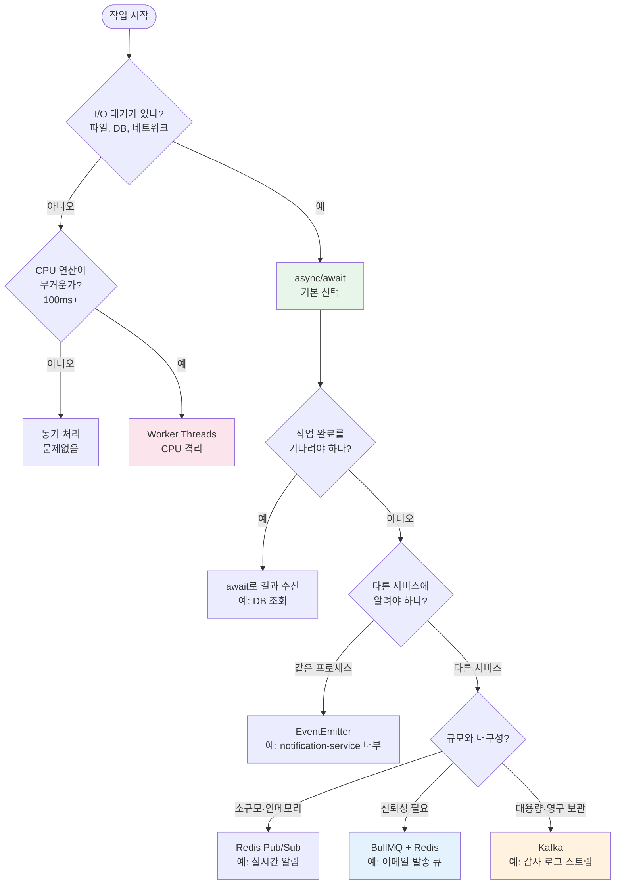
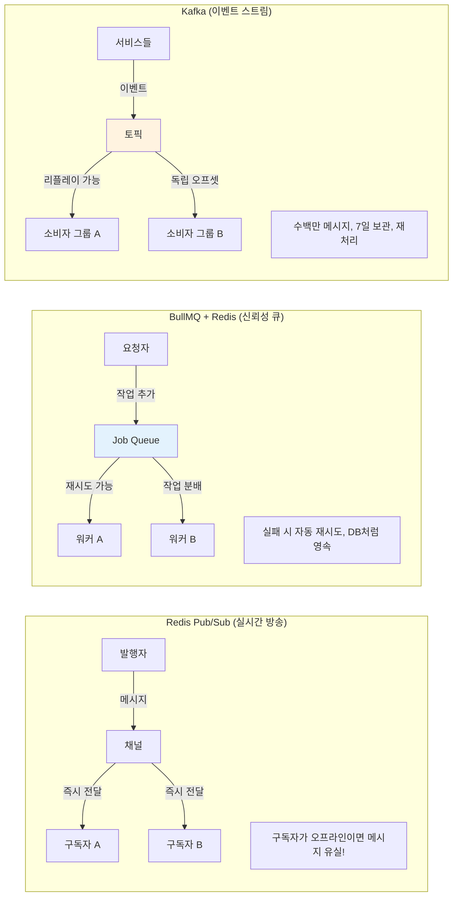
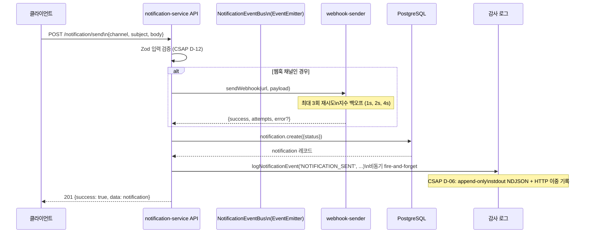
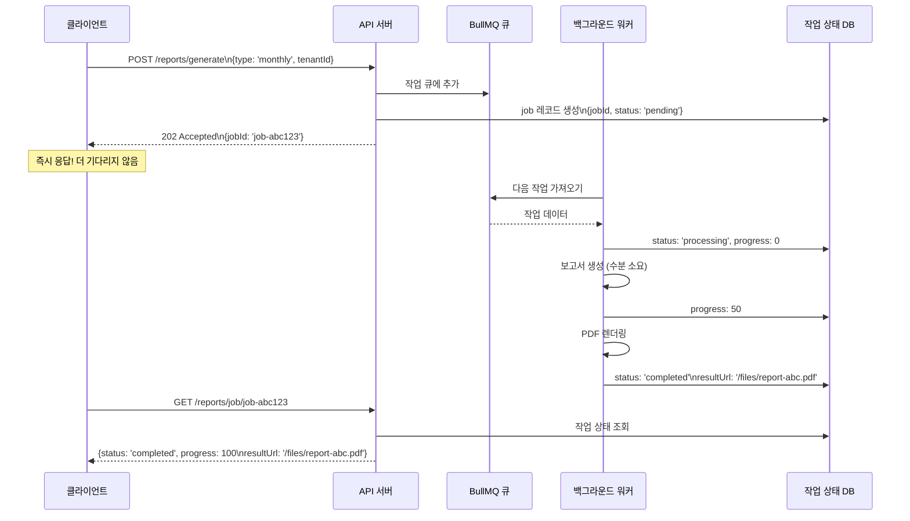
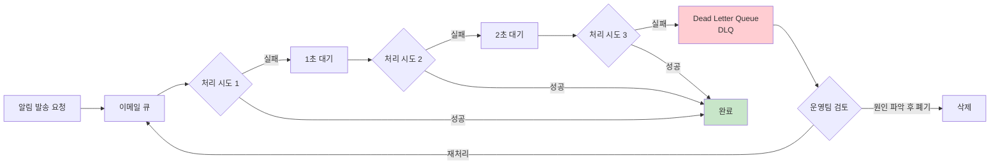

# 17. 비동기 처리 패턴 완벽 가이드

> **문서 ID**: ONBOARD-03-17
> **버전**: 1.0.0 | **작성일**: 2026-04-12 | **작성자**: Implementer (Sonnet)
> **학습 대상**: JavaScript/TypeScript 기초는 알지만 비동기 패턴이 낯선 개발자
> **예상 소요 시간**: 약 4시간
> **선행 문서**:
>   - `05-event-driven-architecture.md` (이벤트 버스 개념)
>   - `15-redis-patterns.md` (Redis 기본 개념)
> **코드 참조**:
>   - `platform/services/notification-service/src/lib/event-bus.ts`
>   - `platform/services/notification-service/src/lib/webhook-sender.ts`
> **CSAP**: D-06 (감사 추적), D-12 (입력 검증)

---

## 목차

1. [비동기 처리 패턴 전체 지도](#1-비동기-처리-패턴-전체-지도)
2. [Promise vs async/await — 기본기 재점검](#2-promise-vs-asyncawait--기본기-재점검)
3. [EventEmitter — 인프로세스 이벤트](#3-eventemitter--인프로세스-이벤트)
4. [Worker Threads — CPU 집약 작업 격리](#4-worker-threads--cpu-집약-작업-격리)
5. [큐(Queue) 기반 비동기 처리](#5-큐queue-기반-비동기-처리)
6. [알림 서비스 비동기 구조 심층 분석](#6-알림-서비스-비동기-구조-심층-분석)
7. [Long-running Task 처리](#7-long-running-task-처리)
8. [배치 처리 (Batch Processing)](#8-배치-처리-batch-processing)
9. [재시도 정책 — 지수 백오프](#9-재시도-정책--지수-백오프)
10. [Dead Letter Queue — 최후 방어선](#10-dead-letter-queue--최후-방어선)
11. [실습: 이메일 알림 비동기 발송 구현](#11-실습-이메일-알림-비동기-발송-구현)
12. [학습 체크리스트](#학습-체크리스트)
13. [다음 단계](#다음-단계)

---

## 1. 비동기 처리 패턴 전체 지도

### 1.1 왜 비동기가 필요한가?

Node.js는 **단일 스레드** 런타임입니다. 만약 이메일 발송이나 보고서 생성 같은 느린 작업을 동기적으로 처리하면, 그 사이에 다른 사용자의 HTTP 요청은 모두 대기해야 합니다.

```
[동기 처리 문제]
요청 A → 이메일 발송(3초) → 응답 A
                              ↑ 이 3초 동안 요청 B, C, D는 모두 대기!

[비동기 처리 해결]
요청 A → 큐에 넣음(0.01초) → 즉시 응답 A
           ↓
         백그라운드 워커가 이메일 발송(3초)
         이 동안 요청 B, C, D 정상 처리!
```

### 1.2 패턴 선택 의사결정 트리



### 1.3 이 프로젝트에서의 선택 기준

| 상황 | 선택 | 이유 |
|------|------|------|
| DB 쿼리, HTTP 호출 | `async/await` | I/O 대기, Node.js 기본 |
| 알림 서비스 내부 이벤트 | `EventEmitter` | 같은 프로세스, 경량 |
| 이메일/웹훅 비동기 발송 | `BullMQ + Redis` | 재시도, 우선순위, 모니터링 필요 |
| 보고서 생성(CPU 집약) | `Worker Threads` | 메인 스레드 블로킹 방지 |
| 대규모 이벤트 스트림 | `Kafka` | 영속성, 리플레이, 소비자 그룹 |

---

## 2. Promise vs async/await — 기본기 재점검

### 2.1 Promise 체이닝 vs async/await

두 코드는 동일한 동작을 합니다. 이 프로젝트는 **async/await를 표준**으로 사용합니다.

```typescript
// Promise 체이닝 (읽기 어려움)
function getUserNotifications_promise(userId: string) {
  return prisma.notification.findMany({ where: { userId } })
    .then(notifications => {
      return prisma.notification.count({ where: { userId } })
        .then(total => ({ notifications, total }));
    })
    .catch(error => {
      logger.error('조회 실패', { error });
      throw error;
    });
}

// async/await (이 프로젝트 표준)
async function getUserNotifications(userId: string) {
  try {
    const [notifications, total] = await Promise.all([
      prisma.notification.findMany({ where: { userId } }),
      prisma.notification.count({ where: { userId } }),
    ]);
    return { notifications, total };
  } catch (error) {
    logger.error('조회 실패', { error });
    throw error;
  }
}
```

### 2.2 Promise.all vs Promise.allSettled

```typescript
// Promise.all: 하나라도 실패하면 전체 실패
// 사용: 모든 결과가 필요할 때
const [customers, total] = await Promise.all([
  prisma.customer.findMany({ where }),
  prisma.customer.count({ where }),
]);

// Promise.allSettled: 개별 성공/실패 확인
// 사용: 부분 실패를 허용할 때 (예: 이벤트 핸들러 병렬 실행)
const results = await Promise.allSettled([
  sendEmail(user.email),
  sendSlack(user.slackId),
  sendSms(user.phone),
]);

results.forEach((result, index) => {
  if (result.status === 'rejected') {
    logger.warn(`채널 ${index} 발송 실패`, { reason: result.reason });
  }
});
```

실제 `event-bus.ts`에서 `Promise.allSettled`를 사용하는 이유가 바로 이 때문입니다. 이벤트 핸들러 하나가 실패해도 다른 핸들러는 계속 실행되어야 합니다.

```typescript
// platform/services/notification-service/src/lib/event-bus.ts
async emit<T extends EventType>(event: T, payload: NotificationEventMap[T]): Promise<void> {
  const listeners = this.emitter.listeners(event);
  const results = listeners.map(async (listener) => {
    try {
      await (listener as Function)(payload);
    } catch (error) {
      process.stderr.write(`[event-bus] 이벤트 핸들러 오류 (${event}): ${String(error)}\n`);
    }
  });

  // 핸들러 하나 실패해도 다른 핸들러 계속 실행
  await Promise.allSettled(results);
}
```

### 2.3 async/await 실수 패턴 TOP 3

```typescript
// ❌ 실수 1: for 루프에서 순차 실행 (느림)
for (const userId of userIds) {
  await sendNotification(userId);  // 100명이면 100번 순차 실행!
}

// ✅ 올바른 방법: 병렬 실행
await Promise.all(userIds.map(userId => sendNotification(userId)));

// ❌ 실수 2: 불필요한 await
const result = await Promise.resolve(42);  // Promise가 아닌데 await

// ✅ 올바른 방법
const result = 42;

// ❌ 실수 3: catch 없이 floating promise (에러 묻힘)
sendEmailInBackground(user.email);  // await 없고 catch도 없음!

// ✅ 올바른 방법: 명시적으로 처리
sendEmailInBackground(user.email).catch(error => {
  logger.error('백그라운드 이메일 실패', { error });
});
```

---

## 3. EventEmitter — 인프로세스 이벤트

### 3.1 Node.js EventEmitter 기본

EventEmitter는 같은 프로세스 내에서 컴포넌트 간 느슨한 결합을 제공합니다. 재시작하면 이벤트는 사라집니다(비영속적).

```typescript
import { EventEmitter } from 'node:events';

const emitter = new EventEmitter();

// 구독 등록
emitter.on('user.created', async (payload) => {
  console.log('새 사용자:', payload.userId);
  await sendWelcomeEmail(payload.email);
});

// 이벤트 발행
emitter.emit('user.created', { userId: 'u-001', email: 'kim@gov.kr' });
```

### 3.2 이 프로젝트의 타입 안전 EventBus

`notification-service`의 `NotificationEventBus`는 TypeScript 제네릭으로 타입 안전성을 보장합니다.

```typescript
// platform/services/notification-service/src/lib/event-bus.ts
export interface NotificationEventMap {
  'user.created': { userId: string; email: string; tenantId: string; name: string };
  'user.deactivated': { userId: string; tenantId: string };
  'subscription.created': { tenantId: string; planName: string };
  'subscription.expiry_warning': { tenantId: string; daysLeft: number };
  'security.login_failure': { userId: string; ip: string; attempts: number };
  'security.account_locked': { userId: string; ip: string; tenantId: string };
  'compliance.check_completed': { tenantId: string; score: number };
}
```

사용 방법:

```typescript
import { notificationEventBus } from '../lib/event-bus.js';

// 이벤트 구독 (타입 자동 추론)
notificationEventBus.on('user.created', async (payload) => {
  // payload: { userId: string; email: string; tenantId: string; name: string }
  // 타입 오류 즉시 감지!
  await sendWelcomeEmail(payload.email, payload.name);
});

// 이벤트 발행
await notificationEventBus.emit('user.created', {
  userId: 'u-001',
  email: 'kim@gov.kr',
  tenantId: 't-mois',
  name: '김공무원',
});
```

### 3.3 EventEmitter 주의사항

```typescript
// ⚠️ 메모리 누수 주의: 리스너를 제거하지 않으면 누적됨
const handler = async (payload) => { /* ... */ };
notificationEventBus.on('user.created', handler);

// 서비스 종료 시 반드시 제거
notificationEventBus.off('user.created', handler);

// ⚠️ 최대 리스너 수 설정 (기본 10개, 초과 시 경고)
// event-bus.ts에서 50으로 설정됨
this.emitter.setMaxListeners(50);
```

---

## 4. Worker Threads — CPU 집약 작업 격리

### 4.1 언제 Worker Threads를 쓰는가?

CPU 집약적 작업(암호화, 이미지 처리, PDF 생성, 대량 데이터 가공)은 메인 스레드를 블로킹합니다. Worker Threads로 별도 스레드에서 실행합니다.

```
[메인 스레드 블로킹 문제]
HTTP 요청 → PDF 생성(5초) ← 이 5초 동안 모든 요청 멈춤!

[Worker Threads 해결]
HTTP 요청 → Worker에게 PDF 생성 위임 → 즉시 job_id 응답
              ↓ (별도 스레드)
            Worker가 PDF 생성(5초) → 완료 후 콜백
```

### 4.2 Worker Threads 구현 패턴

```typescript
// workers/report-generator.worker.ts
import { parentPort, workerData } from 'node:worker_threads';

// 워커 입력 수신
const { reportType, tenantId, dateRange } = workerData;

async function generateReport() {
  // CPU 집약적 작업
  const data = await fetchLargeDataset(tenantId, dateRange);
  const pdf = await createPdfFromData(data);
  
  // 결과를 메인 스레드로 전송
  parentPort?.postMessage({ success: true, filePath: pdf.path });
}

generateReport().catch(error => {
  parentPort?.postMessage({ success: false, error: error.message });
});
```

```typescript
// handlers/report.handler.ts
import { Worker } from 'node:worker_threads';
import path from 'node:path';

export async function generateReportHandler(request, reply) {
  const jobId = crypto.randomUUID();
  
  // 즉시 job_id 응답
  await reply.status(202).send({ success: true, data: { jobId } });
  
  // Worker 스레드에서 비동기 처리
  const worker = new Worker(
    path.resolve('./workers/report-generator.worker.js'),
    { workerData: { reportType: 'monthly', tenantId: request.headers['x-user-tenant-id'], jobId } }
  );
  
  worker.on('message', async (result) => {
    if (result.success) {
      await updateJobStatus(jobId, 'completed', result.filePath);
    } else {
      await updateJobStatus(jobId, 'failed', null, result.error);
    }
  });
  
  worker.on('error', async (error) => {
    await updateJobStatus(jobId, 'failed', null, error.message);
  });
}
```

---

## 5. 큐(Queue) 기반 비동기 처리

### 5.1 Redis Pub/Sub vs BullMQ vs Kafka



| 기준 | Redis Pub/Sub | BullMQ | Kafka |
|------|--------------|--------|-------|
| 메시지 보장 | 없음 (fire-and-forget) | at-least-once | at-least-once |
| 영속성 | 없음 | Redis 유지 | 디스크 저장 |
| 처리량 | 높음 | 중간 | 매우 높음 |
| 재시도 | 없음 | 자동 | 오프셋 커밋 |
| 모니터링 | 최소 | Bull Dashboard | Kafka UI |
| 이 프로젝트 활용 | 실시간 SSE 트리거 | 이메일/웹훅 발송 | 감사 로그 스트림 |

### 5.2 BullMQ 큐 설정

```typescript
// lib/notification-queue.ts
import { Queue, Worker, QueueEvents } from 'bullmq';
import { Redis } from 'ioredis';

const connection = new Redis({
  host: process.env['REDIS_HOST'] ?? 'localhost',
  port: parseInt(process.env['REDIS_PORT'] ?? '6379'),
  // ⚠️ maxRetriesPerRequest: null 필수 (BullMQ 요구사항)
  maxRetriesPerRequest: null,
});

// 큐 생성
export const emailQueue = new Queue('email-notifications', {
  connection,
  defaultJobOptions: {
    // 재시도 정책
    attempts: 3,
    backoff: {
      type: 'exponential',
      delay: 1000,  // 1초, 2초, 4초
    },
    // 30분 후 미처리 작업 제거
    removeOnComplete: { age: 1800 },
    removeOnFail: { age: 86400 },  // 실패 작업 24시간 보관
  },
});

// 작업 추가
export async function enqueueEmail(data: {
  to: string;
  subject: string;
  body: string;
  priority?: number;
}) {
  const job = await emailQueue.add('send-email', data, {
    priority: data.priority ?? 5,  // 1(높음) ~ 10(낮음)
  });
  return job.id;
}
```

### 5.3 작업 우선순위 설정

```typescript
// 우선순위 체계 (낮은 숫자 = 높은 우선순위)
const PRIORITY = {
  CRITICAL: 1,   // 보안 알림, 계정 잠금
  HIGH: 3,       // 구독 만료 임박
  NORMAL: 5,     // 일반 알림
  LOW: 8,        // 마케팅, 뉴스레터
  BATCH: 10,     // 배치 처리
} as const;

// 보안 알림은 즉시 높은 우선순위로 큐에 추가
await emailQueue.add('send-email', securityAlertData, {
  priority: PRIORITY.CRITICAL,
});

// 월말 청구서는 낮은 우선순위로 배치 처리
await emailQueue.add('send-email', invoiceData, {
  priority: PRIORITY.BATCH,
  delay: calculateDelayUntilNighttime(),  // 야간 배치 처리
});
```

### 5.4 BullMQ 워커 구현

```typescript
// workers/email.worker.ts
import { Worker } from 'bullmq';

const emailWorker = new Worker('email-notifications', async (job) => {
  const { to, subject, body } = job.data;
  
  // 진행률 업데이트 (0~100)
  await job.updateProgress(10);
  
  const emailContent = await renderEmailTemplate(body);
  await job.updateProgress(50);
  
  await smtpClient.sendMail({
    from: process.env['SMTP_FROM'],
    to,
    subject,
    html: emailContent,
  });
  
  await job.updateProgress(100);
  
  return { sentAt: new Date().toISOString() };
}, {
  connection,
  // 동시 처리 수
  concurrency: 5,
});

emailWorker.on('completed', (job) => {
  console.log(`이메일 발송 완료: ${job.id}`);
});

emailWorker.on('failed', (job, error) => {
  console.error(`이메일 발송 실패: ${job?.id}`, error);
});
```

---

## 6. 알림 서비스 비동기 구조 심층 분석

### 6.1 알림 서비스의 비동기 흐름

실제 `notification-service` 코드를 기반으로 비동기 처리 흐름을 분석합니다.



### 6.2 웹훅 발송의 지수 백오프 구현

`webhook-sender.ts`의 실제 재시도 로직입니다.

```typescript
// platform/services/notification-service/src/lib/webhook-sender.ts
const WEBHOOK_TIMEOUT_MS = 5000;  // 5초 타임아웃
const MAX_RETRIES = 3;

export async function sendWebhook(webhookUrl: string, payload: WebhookPayload): Promise<WebhookResult> {
  // SSRF 방지: 내부 IP 차단 (CSAP D-12-04)
  if (isInternalUrl(webhookUrl)) {
    return { success: false, attempts: 0, error: 'SSRF_BLOCKED' };
  }

  let lastError = '';

  for (let attempt = 1; attempt <= MAX_RETRIES; attempt++) {
    try {
      const controller = new AbortController();
      const timeoutId = setTimeout(() => controller.abort(), WEBHOOK_TIMEOUT_MS);

      const response = await fetch(webhookUrl, {
        method: 'POST',
        headers: { 'Content-Type': 'application/json' },
        body: JSON.stringify(payload),
        signal: controller.signal,
        redirect: 'manual',  // SSRF 방지: 리다이렉트 차단
      });

      clearTimeout(timeoutId);

      if (response.ok) {
        return { success: true, statusCode: response.status, attempts: attempt };
      }
      lastError = `HTTP ${response.status}`;
    } catch (error) {
      const err = error as Error;
      lastError = err.name === 'AbortError' ? 'timeout' : err.message;
    }

    // 지수 백오프: 1초 → 2초 → 4초 (최대 4초)
    if (attempt < MAX_RETRIES) {
      const delayMs = Math.min(1000 * Math.pow(2, attempt - 1), 4000);
      await new Promise(resolve => setTimeout(resolve, delayMs));
    }
  }

  return { success: false, attempts: MAX_RETRIES, error: `최대 재시도 초과: ${lastError}` };
}
```

### 6.3 이벤트 버스를 통한 비동기 알림 트리거

다른 서비스에서 알림 서비스의 EventBus를 통해 알림을 트리거하는 패턴:

```typescript
// user-service에서 사용자 생성 후 알림 트리거
import { notificationEventBus } from '../notification/event-bus.js';

export async function createUserHandler(request, reply) {
  // 사용자 생성 (동기)
  const user = await prisma.user.create({ data: parseResult.data });

  // 알림 트리거 (비동기, fire-and-forget)
  notificationEventBus.emit('user.created', {
    userId: user.id,
    email: user.email,
    tenantId: user.tenantId,
    name: user.name,
  }).catch(error => {
    // 알림 실패가 사용자 생성을 실패시키지 않음
    logger.error('알림 이벤트 발행 실패', { error, userId: user.id });
  });

  // 즉시 응답
  await reply.status(201).send({ success: true, data: user });
}
```

---

## 7. Long-running Task 처리

### 7.1 긴 작업의 문제점과 해결책

HTTP 요청 타임아웃은 보통 30초~2분입니다. CSAP 증거 보고서 생성, 대량 데이터 내보내기, 청구서 일괄 생성 등은 수분이 걸릴 수 있습니다.

**해결책: 즉시 job_id 응답 후 백그라운드 처리**



### 7.2 작업 상태 추적 구현

```typescript
// lib/job-tracker.ts
import { prisma } from './prisma.js';

export type JobStatus = 'pending' | 'processing' | 'completed' | 'failed';

export interface Job {
  id: string;
  type: string;
  tenantId: string;
  status: JobStatus;
  progress: number;      // 0 ~ 100
  resultUrl?: string;
  errorMessage?: string;
  createdAt: Date;
  updatedAt: Date;
}

export async function createJob(type: string, tenantId: string): Promise<string> {
  const jobId = crypto.randomUUID();
  await prisma.backgroundJob.create({
    data: { id: jobId, type, tenantId, status: 'pending', progress: 0 },
  });
  return jobId;
}

export async function updateJobProgress(jobId: string, progress: number): Promise<void> {
  await prisma.backgroundJob.update({
    where: { id: jobId },
    data: { status: 'processing', progress, updatedAt: new Date() },
  });
}

export async function completeJob(jobId: string, resultUrl: string): Promise<void> {
  await prisma.backgroundJob.update({
    where: { id: jobId },
    data: { status: 'completed', progress: 100, resultUrl, updatedAt: new Date() },
  });
}

export async function failJob(jobId: string, errorMessage: string): Promise<void> {
  await prisma.backgroundJob.update({
    where: { id: jobId },
    data: { status: 'failed', errorMessage, updatedAt: new Date() },
  });
}
```

### 7.3 Server-Sent Events (SSE) 진행률 스트리밍

클라이언트가 폴링 없이 실시간 진행률을 받는 방법:

```typescript
// handlers/job-progress.handler.ts
import type { FastifyRequest, FastifyReply } from 'fastify';

export async function jobProgressSseHandler(
  request: FastifyRequest<{ Params: { jobId: string } }>,
  reply: FastifyReply,
): Promise<void> {
  // SSE 헤더 설정
  reply.raw.writeHead(200, {
    'Content-Type': 'text/event-stream',
    'Cache-Control': 'no-cache',
    'Connection': 'keep-alive',
    'X-Accel-Buffering': 'no',  // Nginx 버퍼링 비활성화
  });

  const { jobId } = request.params;
  let lastProgress = -1;

  // 1초마다 DB에서 진행률 확인 후 SSE 전송
  const interval = setInterval(async () => {
    const job = await prisma.backgroundJob.findUnique({ where: { id: jobId } });

    if (!job) {
      reply.raw.write(`event: error\ndata: {"message": "작업을 찾을 수 없습니다"}\n\n`);
      clearInterval(interval);
      reply.raw.end();
      return;
    }

    // 진행률이 변경된 경우만 전송 (불필요한 이벤트 최소화)
    if (job.progress !== lastProgress) {
      lastProgress = job.progress;
      reply.raw.write(`event: progress\ndata: ${JSON.stringify({
        jobId,
        status: job.status,
        progress: job.progress,
      })}\n\n`);
    }

    // 완료 또는 실패 시 종료
    if (job.status === 'completed' || job.status === 'failed') {
      reply.raw.write(`event: done\ndata: ${JSON.stringify({
        status: job.status,
        resultUrl: job.resultUrl,
        error: job.errorMessage,
      })}\n\n`);
      clearInterval(interval);
      reply.raw.end();
    }
  }, 1000);

  // 클라이언트 연결 종료 시 인터벌 정리
  request.raw.on('close', () => {
    clearInterval(interval);
  });
}
```

클라이언트 사용법:

```javascript
// 프론트엔드 (TypeScript)
const eventSource = new EventSource(`/api/jobs/${jobId}/progress`);

eventSource.addEventListener('progress', (event) => {
  const { status, progress } = JSON.parse(event.data);
  updateProgressBar(progress);
  updateStatusText(status);
});

eventSource.addEventListener('done', (event) => {
  const { status, resultUrl } = JSON.parse(event.data);
  eventSource.close();
  if (status === 'completed') {
    window.location.href = resultUrl;
  }
});
```

---

## 8. 배치 처리 (Batch Processing)

### 8.1 배치 처리 패턴

공공기관 SaaS에서 배치 처리가 필요한 주요 시나리오:

| 시나리오 | 주기 | 처리 방식 |
|---------|------|---------|
| 월말 청구서 일괄 생성 | 매월 말일 | Cron + BullMQ |
| 구독 만료 임박 알림 | 매일 오전 9시 | Cron + 배치 이메일 |
| CSAP 증거 일괄 수집 | 분기별 | 수동 트리거 + Worker |
| 감사 로그 아카이브 | 매주 | Cron + S3 업로드 |

### 8.2 Cron 기반 배치 스케줄러

```typescript
// lib/batch-scheduler.ts
import { CronJob } from 'cron';
import { emailQueue } from './notification-queue.js';
import { prisma } from './prisma.js';

/**
 * 구독 만료 임박 알림 배치
 * 매일 오전 9시 실행
 */
export const subscriptionExpiryBatch = new CronJob(
  '0 9 * * *',  // 크론 표현식: 매일 9:00
  async () => {
    console.log('[배치] 구독 만료 임박 알림 시작');

    // 30일 이내 만료 계약 조회
    const expiringContracts = await prisma.contract.findMany({
      where: {
        endDate: {
          gte: new Date(),
          lte: new Date(Date.now() + 30 * 24 * 60 * 60 * 1000),
        },
        status: { not: 'closed_lost' },
      },
      include: { customer: true },
      take: 1000,  // 최대 1000건 (방어 코딩)
    });

    console.log(`[배치] 대상 계약 ${expiringContracts.length}건`);

    // 청크 단위로 처리 (DB 부하 분산)
    const CHUNK_SIZE = 50;
    for (let i = 0; i < expiringContracts.length; i += CHUNK_SIZE) {
      const chunk = expiringContracts.slice(i, i + CHUNK_SIZE);

      await Promise.all(
        chunk.map(contract =>
          emailQueue.add('send-email', {
            to: contract.customer.email,
            subject: `[구독 만료 임박] ${contract.title} — ${getDaysLeft(contract.endDate)}일 후 만료`,
            body: renderExpiryTemplate(contract),
            priority: 3,  // HIGH 우선순위
          })
        )
      );

      // 청크 간 50ms 대기 (DB 부하 조절)
      await new Promise(resolve => setTimeout(resolve, 50));
    }

    console.log('[배치] 구독 만료 임박 알림 완료');
  },
  null,
  true,
  'Asia/Seoul',  // 한국 시간대 필수
);

function getDaysLeft(endDate: Date): number {
  return Math.ceil((endDate.getTime() - Date.now()) / (24 * 60 * 60 * 1000));
}
```

### 8.3 배치 실패 시 부분 재처리

```typescript
// lib/batch-runner.ts
export interface BatchResult {
  total: number;
  succeeded: number;
  failed: number;
  failedIds: string[];
  errors: Array<{ id: string; error: string }>;
}

export async function runBatchWithPartialRetry<T>(
  items: T[],
  processor: (item: T, index: number) => Promise<void>,
  options: {
    chunkSize?: number;
    onProgress?: (processed: number, total: number) => void;
  } = {}
): Promise<BatchResult> {
  const { chunkSize = 50, onProgress } = options;
  const result: BatchResult = {
    total: items.length,
    succeeded: 0,
    failed: 0,
    failedIds: [],
    errors: [],
  };

  for (let i = 0; i < items.length; i += chunkSize) {
    const chunk = items.slice(i, i + chunkSize);

    // 청크 내 병렬 처리
    const chunkResults = await Promise.allSettled(
      chunk.map((item, idx) => processor(item, i + idx))
    );

    chunkResults.forEach((chunkResult, idx) => {
      if (chunkResult.status === 'fulfilled') {
        result.succeeded++;
      } else {
        result.failed++;
        const item = chunk[idx] as any;
        const itemId = item?.id ?? String(i + idx);
        result.failedIds.push(itemId);
        result.errors.push({
          id: itemId,
          error: chunkResult.reason?.message ?? '알 수 없는 오류',
        });
      }
    });

    onProgress?.(Math.min(i + chunkSize, items.length), items.length);

    // 청크 간 대기
    if (i + chunkSize < items.length) {
      await new Promise(resolve => setTimeout(resolve, 100));
    }
  }

  // 실패 항목 로깅
  if (result.failed > 0) {
    console.error(`[배치] ${result.failed}건 실패:`, result.errors);
  }

  return result;
}
```

사용 예시:

```typescript
// CSAP 증거 일괄 수집
const csapItems = await fetchCsapChecklistItems(tenantId);

const batchResult = await runBatchWithPartialRetry(
  csapItems,
  async (item) => {
    const evidence = await collectEvidence(item.checkId);
    await saveEvidence(item.checkId, evidence);
  },
  {
    chunkSize: 20,
    onProgress: (processed, total) => {
      updateJobProgress(jobId, Math.floor((processed / total) * 100));
    },
  }
);

console.log(`완료: ${batchResult.succeeded}건 성공, ${batchResult.failed}건 실패`);

// 실패 항목 재처리 (수동 또는 자동)
if (batchResult.failedIds.length > 0) {
  await retryQueue.addBulk(
    batchResult.failedIds.map(id => ({
      name: 'retry-csap-evidence',
      data: { checkId: id, tenantId },
    }))
  );
}
```

---

## 9. 재시도 정책 — 지수 백오프

### 9.1 지수 백오프란?

재시도 간격을 지수적으로 늘려 서버 과부하를 방지하는 패턴입니다.

```
1회 실패 → 1초 대기 → 재시도
2회 실패 → 2초 대기 → 재시도
3회 실패 → 4초 대기 → 재시도
(webhook-sender.ts의 실제 구현)
```

### 9.2 Jitter 추가 (Thundering Herd 방지)

여러 클라이언트가 동시에 재시도하면 서버에 피크 부하가 발생합니다. 랜덤 지터로 분산합니다.

```typescript
// lib/retry.ts
export interface RetryOptions {
  maxAttempts: number;
  baseDelayMs: number;
  maxDelayMs: number;
  jitter?: boolean;
}

export async function withRetry<T>(
  fn: () => Promise<T>,
  options: RetryOptions,
): Promise<T> {
  const { maxAttempts, baseDelayMs, maxDelayMs, jitter = true } = options;

  for (let attempt = 1; attempt <= maxAttempts; attempt++) {
    try {
      return await fn();
    } catch (error) {
      if (attempt === maxAttempts) {
        throw error;  // 마지막 시도 실패 시 에러 전파
      }

      let delayMs = Math.min(baseDelayMs * Math.pow(2, attempt - 1), maxDelayMs);

      // Jitter: 계산된 지연 시간의 0~50% 랜덤 추가
      if (jitter) {
        delayMs += Math.random() * delayMs * 0.5;
      }

      console.warn(`[retry] 시도 ${attempt}/${maxAttempts} 실패, ${Math.round(delayMs)}ms 후 재시도`);
      await new Promise(resolve => setTimeout(resolve, delayMs));
    }
  }

  throw new Error('unreachable');
}

// 사용
const result = await withRetry(
  () => callExternalApi(payload),
  { maxAttempts: 3, baseDelayMs: 1000, maxDelayMs: 10000 }
);
```

---

## 10. Dead Letter Queue — 최후 방어선

### 10.1 Dead Letter Queue(DLQ)란?

최대 재시도 횟수를 초과한 작업을 별도 큐에 보관합니다. 즉시 폐기하지 않고 나중에 수동 검토 및 재처리할 수 있습니다.



### 10.2 BullMQ DLQ 설정

```typescript
// lib/dlq.ts
import { Queue, Worker } from 'bullmq';

// Dead Letter Queue
export const emailDlq = new Queue('email-dlq', {
  connection,
  defaultJobOptions: {
    removeOnComplete: false,  // DLQ는 자동 삭제 안 함
    removeOnFail: false,
  },
});

// 메인 워커에서 실패 시 DLQ로 이동
emailWorker.on('failed', async (job, error) => {
  if (job && job.attemptsMade >= job.opts.attempts!) {
    // 최대 재시도 초과 → DLQ로 이동
    await emailDlq.add('failed-email', {
      originalJob: job.data,
      failedAt: new Date().toISOString(),
      error: error.message,
      attemptsMade: job.attemptsMade,
    });

    // CSAP D-06: 실패 감사 로그
    await auditLog({
      action: 'EMAIL_DLQ',
      target: job.data.to,
      metadata: { jobId: job.id, error: error.message },
    });
  }
});

// DLQ 모니터링 API
export async function getDlqStats() {
  const waiting = await emailDlq.getWaiting();
  return {
    count: waiting.length,
    oldest: waiting[0]?.timestamp,
    items: waiting.slice(0, 10),  // 최근 10건 미리보기
  };
}

// DLQ 재처리 (운영팀용)
export async function retryDlqJob(dlqJobId: string) {
  const dlqJob = await emailDlq.getJob(dlqJobId);
  if (!dlqJob) throw new Error('DLQ 작업을 찾을 수 없습니다');

  await emailQueue.add('send-email', dlqJob.data.originalJob, {
    priority: 1,  // 재처리는 최우선
  });

  await dlqJob.remove();
}
```

---

## 11. 실습: 이메일 알림 비동기 발송 구현

이번 실습에서는 BullMQ를 활용한 이메일 비동기 발송을 단계별로 구현합니다.

### 11.1 환경 준비

```bash
# Redis 실행 (개발 환경)
docker run -d --name redis-dev -p 6379:6379 redis:7-alpine

# BullMQ 설치
cd platform/services/notification-service
pnpm add bullmq ioredis
```

### 11.2 이메일 큐 서비스 구현

```typescript
// platform/services/notification-service/src/lib/email-queue.ts
// Design Ref: DESIGN-MTU-Q2 §1
// Plan SC: FR-P11.2
// CSAP: D-06 감사 로그, D-12 입력 검증

import { Queue, Worker } from 'bullmq';
import { Redis } from 'ioredis';
import { z } from 'zod';

// ✅ 환경 변수 사용 (CSAP: 하드코딩 금지)
const connection = new Redis({
  host: process.env['REDIS_HOST'] ?? 'localhost',
  port: parseInt(process.env['REDIS_PORT'] ?? '6379'),
  maxRetriesPerRequest: null,  // BullMQ 필수
});

// 입력 검증 스키마 (CSAP D-12)
const emailJobSchema = z.object({
  to: z.string().email(),
  subject: z.string().min(1).max(200),
  body: z.string().min(1),
  tenantId: z.string(),
  userId: z.string().optional(),
  priority: z.number().int().min(1).max(10).default(5),
});

export type EmailJob = z.infer<typeof emailJobSchema>;

export const emailQueue = new Queue<EmailJob>('email-notifications', {
  connection,
  defaultJobOptions: {
    attempts: 3,
    backoff: { type: 'exponential', delay: 1000 },
    removeOnComplete: { age: 3600 },   // 1시간 후 성공 작업 삭제
    removeOnFail: { age: 86400 * 7 },  // 7일 후 실패 작업 삭제
  },
});

/**
 * 이메일 발송 큐에 추가
 * Plan SC: FR-P11.2
 */
export async function enqueueEmail(rawData: unknown): Promise<string> {
  // ✅ 입력 검증 (CSAP D-12)
  const data = emailJobSchema.parse(rawData);

  const job = await emailQueue.add('send-email', data, {
    priority: data.priority,
  });

  if (!job.id) throw new Error('큐 작업 생성 실패');
  return job.id;
}
```

### 11.3 이메일 워커 구현

```typescript
// platform/services/notification-service/src/workers/email.worker.ts
// Design Ref: DESIGN-MTU-Q2 §1
// Plan SC: FR-P11.2
// CSAP: D-06 감사 로그

import { Worker } from 'bullmq';
import { Redis } from 'ioredis';
import { logNotificationEvent } from '../lib/audit.js';
import type { EmailJob } from '../lib/email-queue.js';

const connection = new Redis({
  host: process.env['REDIS_HOST'] ?? 'localhost',
  port: parseInt(process.env['REDIS_PORT'] ?? '6379'),
  maxRetriesPerRequest: null,
});

async function sendEmail(to: string, subject: string, body: string): Promise<void> {
  // 실제 구현에서는 SMTP 클라이언트 사용
  // 예: nodemailer, AWS SES SDK
  const smtpHost = process.env['SMTP_HOST'];
  if (!smtpHost) {
    throw new Error('SMTP_HOST 환경변수 누락');
  }
  // ... SMTP 발송 로직
  console.log(`[email-worker] 발송: ${to} — ${subject}`);
}

export const emailWorker = new Worker<EmailJob>(
  'email-notifications',
  async (job) => {
    const { to, subject, body, tenantId, userId } = job.data;

    // 진행률 업데이트
    await job.updateProgress(10);

    await sendEmail(to, subject, body);

    await job.updateProgress(100);

    // ✅ CSAP D-06: 감사 로그 기록
    await logNotificationEvent(
      'EMAIL_SENT_ASYNC',
      userId ?? 'system',
      job.id ?? 'unknown',
      tenantId,
      'worker',
      'email-worker/1.0',
      { to, subject, attempt: job.attemptsMade + 1 },
    );

    return { sentAt: new Date().toISOString() };
  },
  {
    connection,
    concurrency: 5,  // 동시 5개 처리
  },
);

emailWorker.on('completed', (job) => {
  console.log(`[email-worker] 완료: job ${job.id}`);
});

emailWorker.on('failed', (job, error) => {
  console.error(`[email-worker] 실패: job ${job?.id}`, error.message);
});
```

### 11.4 HTTP 핸들러에서 큐 사용

```typescript
// handlers/async-notification.handler.ts
import type { FastifyRequest, FastifyReply } from 'fastify';
import { z } from 'zod';
import { enqueueEmail } from '../lib/email-queue.js';

const asyncEmailSchema = z.object({
  userId: z.string(),
  to: z.string().email(),
  subject: z.string().min(1),
  body: z.string().min(1),
  priority: z.number().int().min(1).max(10).optional(),
});

export async function sendAsyncEmailHandler(
  request: FastifyRequest,
  reply: FastifyReply,
): Promise<void> {
  const parseResult = asyncEmailSchema.safeParse(request.body);
  if (!parseResult.success) {
    await reply.status(400).send({
      success: false,
      error: { code: 'VALIDATION_ERROR', message: parseResult.error.issues.map(i => i.message).join(', ') },
    });
    return;
  }

  const tenantId = request.headers['x-user-tenant-id'] as string ?? 'platform';

  // ✅ 큐에 추가 후 즉시 응답 (비동기)
  const jobId = await enqueueEmail({
    ...parseResult.data,
    tenantId,
    priority: parseResult.data.priority ?? 5,
  });

  // ✅ 202 Accepted: "요청 수락, 처리 중"
  await reply.status(202).send({
    success: true,
    data: { jobId, message: '이메일 발송이 큐에 추가되었습니다' },
  });
}
```

### 11.5 동작 확인

```bash
# 1. 워커 실행
cd platform/services/notification-service
pnpm exec ts-node src/workers/email.worker.ts

# 2. 이메일 발송 요청
curl -X POST http://localhost:3006/notification/send-async-email \
  -H "Content-Type: application/json" \
  -H "x-internal-service-key: dev-internal-key" \
  -H "x-user-tenant-id: t-mois" \
  -d '{
    "userId": "u-001",
    "to": "kim@gov.kr",
    "subject": "구독 갱신 안내",
    "body": "구독이 곧 만료됩니다.",
    "priority": 3
  }'

# 응답: {"success": true, "data": {"jobId": "1", "message": "이메일 발송이 큐에 추가되었습니다"}}

# 3. Bull Dashboard로 큐 상태 확인 (개발 환경)
# http://localhost:3006/admin/queues
```

---

## 학습 체크리스트

비동기 패턴의 핵심 개념을 이해했는지 확인하세요.

### 기본 개념

- [ ] `Promise.all`과 `Promise.allSettled`의 차이를 설명할 수 있다
- [ ] `async/await`에서 `for` 루프 대신 `Promise.all`을 써야 하는 이유를 안다
- [ ] EventEmitter가 재시작 시 이벤트를 잃는 이유를 설명할 수 있다
- [ ] Worker Threads를 써야 하는 작업 유형을 3가지 이상 말할 수 있다

### 큐 기반 처리

- [ ] BullMQ의 재시도 정책(attempts, backoff)을 직접 설정해봤다
- [ ] 작업 우선순위(priority)가 처리 순서에 미치는 영향을 안다
- [ ] DLQ에 들어간 작업을 재처리하는 방법을 안다
- [ ] `removeOnComplete`와 `removeOnFail` 설정의 차이를 안다

### Long-running Tasks

- [ ] HTTP 202 Accepted 응답과 200 OK의 차이를 안다
- [ ] job_id를 사용한 작업 상태 추적 흐름을 설명할 수 있다
- [ ] SSE(Server-Sent Events)를 사용해 진행률을 실시간으로 전달할 수 있다

### 재시도 및 안전성

- [ ] 지수 백오프 공식(`delay = base * 2^(attempt-1)`)을 안다
- [ ] Jitter가 Thundering Herd를 방지하는 원리를 설명할 수 있다
- [ ] `webhook-sender.ts`의 SSRF 방지 로직을 이해했다

### CSAP 준수

- [ ] 비동기 처리에서도 감사 로그(CSAP D-06)가 기록되는 위치를 확인했다
- [ ] 환경 변수 없이 Redis 연결 정보를 하드코딩하면 안 되는 이유를 안다

---

## 다음 단계

비동기 패턴을 이해했다면 다음 주제로 진행하세요.

| 다음 문서 | 이유 |
|---------|------|
| `services/additional-01-notification-deep-dive.md` | 알림 서비스 심층 이해 |
| `15-redis-patterns.md` | Redis 큐 기반 캐싱 패턴 |
| `05-event-driven-architecture.md` | 이벤트 버스 전체 아키텍처 |
| `11-test-strategy.md` | 비동기 코드 테스트 방법 |
