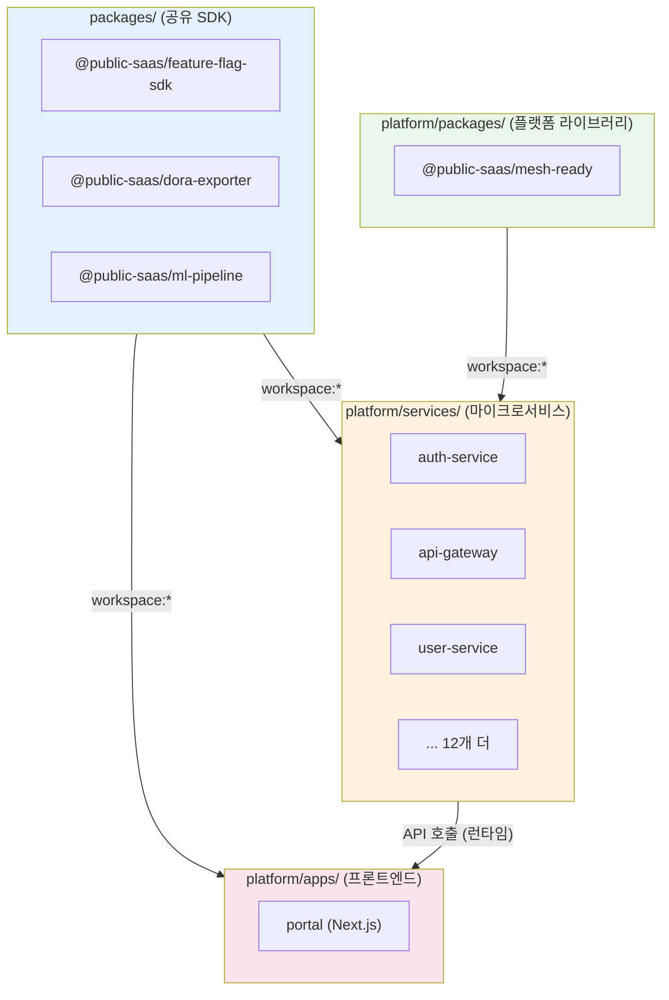
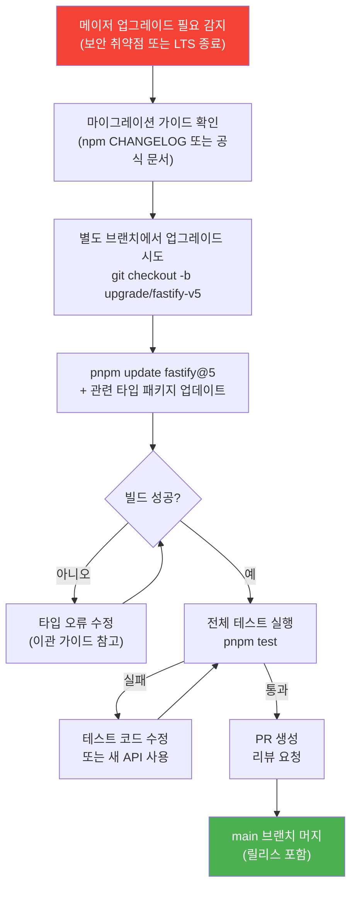
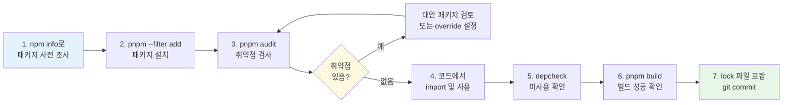

# 의존성 관리 완전 가이드 — pnpm + Turbo 모노레포

> **문서 ID**: ONBOARD-03-19
> **버전**: 1.0.0 | **작성일**: 2026-04-12 | **작성자**: Implementer (Sonnet)
> **학습 대상**: 프로젝트에 합류한 개발자 (모노레포 경험 없어도 됩니다)
> **예상 소요 시간**: 2~3시간
> **선행 문서**: `01-getting-started/02-environment-setup.md` (pnpm 설치 완료 가정)
> **CSAP 연관**: D-05 공급망 보안, D-12 시스템 개발 보안

---

## 목차

1. [pnpm workspace 완전 이해](#1-pnpm-workspace-완전-이해)
2. [Turbo 빌드 시스템 심화](#2-turbo-빌드-시스템-심화)
3. [의존성 보안 관리](#3-의존성-보안-관리)
4. [버전 정책](#4-버전-정책)
5. [의존성 정리](#5-의존성-정리)
6. [실습: 새 외부 패키지 추가 및 감사 로그 확인](#6-실습-새-외부-패키지-추가-및-감사-로그-확인)
7. [학습 체크리스트](#7-학습-체크리스트)
8. [다음 단계](#다음-단계)

---

## 1. pnpm workspace 완전 이해

### 1.1 이 프로젝트의 모노레포 구조

이 프로젝트는 하나의 git 저장소 안에 여러 패키지(서비스, 라이브러리, 앱)가 함께 존재하는 **모노레포** 구조입니다.

```
/data/ai-saas/                      ← 저장소 루트
├── pnpm-workspace.yaml             ← pnpm 워크스페이스 정의
├── turbo.json                      ← Turbo 빌드 파이프라인 설정
├── package.json                    ← 루트 package.json (워크스페이스 전체 스크립트)
├── .npmrc                          ← pnpm 동작 설정
│
├── platform/
│   ├── apps/
│   │   └── portal/                 ← Next.js 포털 앱
│   ├── services/
│   │   ├── auth-service/           ← 인증 서비스
│   │   ├── api-gateway/            ← API Gateway
│   │   └── ... (15개 서비스)
│   └── packages/
│       └── mesh-ready/             ← 공유 인프라 라이브러리
│
├── packages/
│   ├── feature-flag-sdk/           ← Feature Flag 라이브러리
│   ├── dora-exporter/              ← DORA 지표 수집 라이브러리
│   └── ... (16개 공유 패키지)
│
└── business-template/
    └── ...                         ← 비즈니스 템플릿
```

### 1.2 `pnpm-workspace.yaml` 구조 해설

```yaml
# /data/ai-saas/pnpm-workspace.yaml
# Design Ref: D-P00.1 모노레포 구조

packages:
  - "platform/apps/*"         # Next.js 포털 앱
  - "platform/services/*"     # 백엔드 마이크로서비스 (15개)
  - "platform/packages/*"     # 플랫폼 공유 라이브러리
  - "platform/plugins/*"      # 플러그인 (공공데이터 연동 등)
  - "platform/tests/e2e"      # E2E 테스트 패키지
  - "business-template/*"     # 비즈니스 템플릿
  - "packages/*"              # 독립 공유 패키지 (SDK 등)
```

이 파일의 각 항목이 의미하는 바는 다음과 같습니다.

- `"platform/services/*"`: `platform/services/` 아래 있는 **모든 폴더**가 독립적인 패키지로 인식됩니다. `package.json`이 있어야 합니다.
- 글로브(`*`) 패턴: 한 단계 하위 디렉토리만 매치합니다. `platform/services/auth-service`는 포함되지만 `platform/services/auth-service/sub/`는 포함되지 않습니다.

### 1.3 `workspace:*` 프로토콜 동작 원리

모노레포 내부 패키지끼리 의존할 때 `workspace:*` 프로토콜을 사용합니다.

```json
// platform/services/auth-service/package.json
{
  "name": "@public-saas/auth-service",
  "dependencies": {
    "@public-saas/mesh-ready": "workspace:*"
  }
}
```

`workspace:*`의 의미:
- **설치 시**: pnpm이 npm 레지스트리 대신 로컬 `platform/packages/mesh-ready` 폴더를 연결합니다.
- **버전**: `*`는 항상 현재 워크스페이스의 최신 버전을 사용합니다. 버전을 맞출 필요가 없습니다.
- **심볼릭 링크**: `node_modules/@public-saas/mesh-ready`는 실제 파일 복사가 아니라 원본 폴더에 대한 심볼릭 링크입니다. 따라서 `mesh-ready` 코드를 수정하면 `auth-service`에 즉시 반영됩니다.

```bash
# workspace:* 링크 확인 방법
ls -la /data/ai-saas/platform/services/auth-service/node_modules/@public-saas/mesh-ready
# lrwxrwxrwx ... -> ../../../../packages/mesh-ready
#                             ↑ 원본 폴더를 가리키는 심볼릭 링크
```

### 1.4 모노레포에서 패키지 의존성 추가 방법

**특정 서비스에 외부 패키지 추가**

```bash
# auth-service에만 bcryptjs 추가
pnpm --filter @public-saas/auth-service add bcryptjs
pnpm --filter @public-saas/auth-service add -D @types/bcryptjs

# 또는 패키지 폴더로 이동 후 실행
cd /data/ai-saas/platform/services/auth-service
pnpm add bcryptjs
```

**루트에 개발 도구 추가 (모든 패키지에서 공유)**

```bash
# 루트 package.json에 개발 도구 추가 (-w 플래그: workspace root)
pnpm add -D -w eslint prettier
```

**내부 패키지 의존성 추가 (workspace:*)**

```bash
# auth-service가 feature-flag-sdk에 의존하게 만들기
pnpm --filter @public-saas/auth-service add @public-saas/feature-flag-sdk@workspace:*
```

**의존성 추가 후 확인**

```bash
# 워크스페이스 전체 의존성 설치 (lock 파일 업데이트)
cd /data/ai-saas
pnpm install

# 특정 서비스의 의존성 트리 확인
pnpm --filter @public-saas/auth-service list --depth 2
```

---

## 2. Turbo 빌드 시스템 심화

### 2.1 Turbo가 필요한 이유

모노레포에는 15개 이상의 서비스가 있습니다. 이를 순서 없이 빌드하면 의존성 오류가 발생합니다. Turbo는 패키지 간 의존성을 분석하여 올바른 순서로, 가능한 경우 병렬로 빌드합니다.

```
[Turbo 없이 빌드할 때의 문제]
  1. auth-service 빌드 시작
  2. @public-saas/mesh-ready import
  3. 오류: @public-saas/mesh-ready가 빌드되지 않음!

[Turbo가 있을 때]
  1. 의존성 그래프 분석
  2. mesh-ready 먼저 빌드
  3. auth-service 빌드 (이제 mesh-ready 사용 가능)
```

### 2.2 `turbo.json` 파이프라인 설정 해설

```json
// /data/ai-saas/turbo.json

{
  "$schema": "https://turborepo.dev/schema.json",
  "tasks": {
    "build": {
      "dependsOn": ["^build"],       // 내 의존성들의 build가 먼저 완료되어야 함
      "outputs": ["dist/**", ".next/**"],  // 캐시할 출력 파일 패턴
      "env": ["NODE_ENV"]            // 캐시 키에 포함할 환경 변수
    },
    "dev": {
      "cache": false,                // dev는 캐시 사용 안 함 (항상 실행)
      "persistent": true             // 종료되지 않는 장시간 실행 프로세스
    },
    "lint": {
      "dependsOn": ["^build"]        // 린트 전에 의존성들이 빌드되어야 함
    },
    "test": {
      "dependsOn": ["^build"],       // 테스트 전에 의존성들이 빌드되어야 함
      "env": ["DATABASE_URL", "REDIS_URL", "NODE_ENV"]  // 테스트 캐시 키
    },
    "typecheck": {
      "dependsOn": ["^build"]        // 타입 체크 전에 의존성 빌드 필요
    },
    "clean": {
      "cache": false                 // clean은 캐시 사용 안 함
    }
  }
}
```

**`dependsOn` 표기법 이해**:
- `"^build"`: 캐럿(`^`)은 "내가 의존하는 패키지들의 `build` 태스크"를 의미합니다.
- `"build"`: 캐럿 없이 쓰면 같은 패키지 내의 다른 태스크를 의미합니다.

### 2.3 의존성 순서 (packages → services → apps)



**빌드 순서 (Turbo가 자동 결정)**:

```
1단계 (병렬): 외부 의존성 없는 공유 패키지
  - @public-saas/feature-flag-sdk 빌드
  - @public-saas/dora-exporter 빌드
  - @public-saas/mesh-ready 빌드

2단계 (병렬): 공유 패키지를 사용하는 서비스
  - auth-service 빌드
  - user-service 빌드
  - api-gateway 빌드
  - ... (모든 서비스 병렬)

3단계: 앱 (서비스 API에 의존)
  - portal 빌드
```

### 2.4 Turbo 캐시 작동 방법

Turbo는 빌드 결과를 캐시에 저장합니다. 입력이 변경되지 않으면 빌드를 다시 실행하지 않고 캐시에서 결과를 가져옵니다.

**캐시 키를 구성하는 요소**:

```
캐시 키 = hash(
  소스 파일 내용 (src/**/*.ts 등),
  package.json 내용,
  turbo.json의 env 변수 값,
  의존성 패키지의 캐시 키 (재귀적으로)
)
```

**캐시 히트 예시**:

```bash
pnpm build

# 첫 번째 실행 (캐시 없음)
# auth-service:build: 완료 (15.2s)
# api-gateway:build: 완료 (12.8s)
# Tasks: 16 successful

# 소스 변경 없이 두 번째 실행
# auth-service:build: cache hit, replaying logs (0.1s)
# api-gateway:build: cache hit, replaying logs (0.1s)
# Tasks: 16 successful
```

**캐시 저장 위치**:

```bash
# 로컬 캐시 위치
ls ~/.turbo/
# cache/ 폴더에 해시별로 저장됨

# 캐시 크기 확인
du -sh ~/.turbo/cache
```

### 2.5 캐시 무효화 조건

다음 중 하나라도 변경되면 해당 패키지의 캐시가 무효화됩니다.

| 변경 내용 | 캐시 무효화 범위 |
|---------|--------------|
| `src/**/*.ts` 소스 파일 변경 | 해당 패키지 + 해당 패키지를 사용하는 패키지들 |
| `package.json` 변경 | 해당 패키지 + 상위 패키지들 |
| `turbo.json`의 `env`에 등록된 환경 변수 변경 | 해당 태스크 전체 |
| `pnpm-lock.yaml` 변경 | 전체 워크스페이스 |

```bash
# 캐시를 완전히 비우고 전체 재빌드
pnpm --filter @public-saas/auth-service clean
pnpm build

# 또는 Turbo 캐시만 삭제
rm -rf ~/.turbo/cache
pnpm build
```

---

## 3. 의존성 보안 관리

### 3.1 `pnpm audit` 결과 해석

`pnpm audit`는 설치된 패키지에 알려진 보안 취약점이 있는지 검사합니다.

```bash
# 취약점 검사 실행
cd /data/ai-saas
pnpm audit

# 출력 예시:
# ┌─────────────────────────────────────────────────────────────────┐
# │                          npm audit                              │
# │                   === npm audit security report ===             │
# ├──────────┬──────────────────────────────────────────────────────┤
# │ moderate │ Prototype Pollution in lodash                        │
# ├──────────┼──────────────────────────────────────────────────────┤
# │ Package  │ lodash                                               │
# │ Patched  │ >=4.17.21                                            │
# │ Path     │ api-gateway > lodash                                 │
# │ More info│ https://npmjs.com/advisories/1523                    │
# └──────────┴──────────────────────────────────────────────────────┘
# found 1 moderate severity vulnerability

# 심각도별 필터링
pnpm audit --audit-level high    # HIGH 이상만 표시
pnpm audit --audit-level critical # CRITICAL만 표시

# JSON 형식 출력 (CI에서 파싱용)
pnpm audit --json > audit-report.json
```

**심각도 등급 이해**:

| 심각도 | 의미 | 대응 기준 |
|-------|------|---------|
| `critical` | 즉각 악용 가능 RCE, 데이터 탈취 등 | **24시간 내 수정 필수** (CSAP D-05) |
| `high` | 서비스 중단, 권한 상승 가능 | **1주일 내 수정** |
| `moderate` | 조건부 악용 가능 | 다음 릴리스 전 수정 |
| `low` | 악용 가능성 낮음 | 분기 내 수정 |

### 3.2 취약점 수정 방법

**방법 1: 버전 업그레이드 (가장 권장)**

```bash
# 취약한 패키지의 패치 버전이 있는 경우
pnpm --filter @public-saas/api-gateway update lodash

# 마이너/메이저 업그레이드 (하위 호환성 확인 필수)
pnpm --filter @public-saas/api-gateway update lodash@^4.17.21
```

**방법 2: `pnpm.overrides`로 강제 버전 지정**

간접 의존성이 취약한 버전을 사용하는 경우, 루트 `package.json`의 `pnpm.overrides`로 강제로 버전을 올릴 수 있습니다.

```json
// /data/ai-saas/package.json
{
  "pnpm": {
    "overrides": {
      "lodash": ">=4.17.21",
      "minimist": ">=1.2.6"
    }
  }
}
```

```bash
# override 적용 후 재설치
pnpm install
pnpm audit  # 취약점이 해결되었는지 확인
```

**방법 3: `pnpm patch`로 패치 적용**

업그레이드가 불가능하고 즉각적인 수정이 필요한 경우, 패키지를 직접 패치할 수 있습니다.

```bash
# 패치 생성
pnpm patch lodash@4.17.20

# 열린 편집기에서 취약한 코드 수정 후
pnpm patch-commit /path/to/lodash-patch

# 생성된 patches/lodash@4.17.20.patch 파일이 package.json에 등록됨
```

### 3.3 `.npmrc`의 보안 설정

```ini
# /data/ai-saas/.npmrc

# 피어 의존성 자동 설치 (호환성 보장)
auto-install-peers=true

# 빌드 스크립트 실행 허용 목록 (허용된 패키지만 postinstall 실행)
# 이렇게 하면 악의적인 postinstall 스크립트 실행을 방지합니다
[build-scripts]
@prisma/client=true
@prisma/engines=true
bcrypt=true
esbuild=true
prisma=true
sharp=true
```

💡 `.npmrc`의 `[build-scripts]` 설정은 보안 강화를 위한 것입니다. 새 패키지를 추가할 때 빌드 스크립트가 필요하면 이 목록에 추가해야 합니다.

---

## 4. 버전 정책

### 4.1 내부 패키지: `workspace:*` (항상 최신)

모노레포 내부 패키지끼리 의존할 때는 항상 `workspace:*`를 사용합니다.

```json
// 올바른 방법 (workspace:* 사용)
{
  "dependencies": {
    "@public-saas/mesh-ready": "workspace:*",
    "@public-saas/feature-flag-sdk": "workspace:*"
  }
}

// 잘못된 방법 (버전 번호 직접 지정)
{
  "dependencies": {
    "@public-saas/mesh-ready": "^1.0.0"  // 버전 불일치 발생 가능
  }
}
```

`workspace:*`를 사용하면 내부 패키지의 버전 번호를 신경 쓸 필요가 없습니다. 항상 현재 워크스페이스의 코드를 사용합니다.

### 4.2 외부 패키지: 고정 버전 vs 범위 버전

이 프로젝트의 외부 패키지 버전 정책:

| 패키지 유형 | 권장 형식 | 이유 |
|-----------|---------|------|
| **프레임워크** (`fastify`, `next`) | `"fastify": "5.3.2"` (고정) | 버전 차이로 인한 예상치 못한 동작 방지 |
| **핵심 라이브러리** (`zod`, `prisma`) | `"zod": "^3.23.8"` (캐럿) | 패치 업데이트는 자동 허용 |
| **개발 도구** (`typescript`, `eslint`) | `"typescript": "~5.7.3"` (틸드) | 마이너 업데이트까지 허용 |
| **보안 관련** (`bcrypt`, `jsonwebtoken`) | `"bcryptjs": "2.4.3"` (고정) | 보안 패키지는 검증 후 업데이트 |

```json
// 버전 표기법 의미
{
  "dependencies": {
    "fastify": "5.3.2",       // 고정: 정확히 5.3.2만 사용
    "zod": "^3.23.8",         // 캐럿: 3.x.x 최신 (메이저 고정)
    "typescript": "~5.7.3",   // 틸드: 5.7.x 최신 (메이저+마이너 고정)
    "lodash": ">=4.17.21"     // 이상: 4.17.21 이상 최신
  }
}
```

### 4.3 메이저 업그레이드 프로세스

메이저 버전 업그레이드는 하위 호환성 변경이 포함될 수 있으므로 신중하게 진행합니다.



메이저 업그레이드 시 반드시 확인할 사항:

```bash
# 1. 변경 사항 영향 범위 확인
pnpm --filter @public-saas/auth-service list fastify

# 2. 업그레이드 후 빌드
pnpm build

# 3. 타입 체크
pnpm typecheck

# 4. 전체 테스트
pnpm test

# 5. 감사 로그 확인 (CSAP D-05)
pnpm audit --audit-level high
```

---

## 5. 의존성 정리

### 5.1 `depcheck`로 미사용 패키지 탐지

미사용 패키지는 빌드 크기를 늘리고 보안 취약점 노출 면적을 키웁니다. 주기적으로 탐지하고 제거합니다.

```bash
# depcheck 전역 설치
pnpm add -g depcheck

# 특정 서비스의 미사용 패키지 탐지
cd /data/ai-saas/platform/services/auth-service
depcheck

# 출력 예시:
# Unused dependencies
# * lodash                ← import는 했지만 실제로 쓰지 않음
# * moment                ← 더 이상 사용 안 함
# Missing dependencies
# * zod                   ← import하지만 package.json에 없음

# 미사용 패키지 제거
pnpm --filter @public-saas/auth-service remove lodash moment

# 워크스페이스 전체 탐지
cd /data/ai-saas
node scripts/audit-dead-code.mjs
```

### 5.2 패키지 중복 방지 (`pnpm dedupe`)

같은 패키지의 다른 버전이 여러 패키지에 설치되면 중복이 발생합니다. pnpm의 dedupe 명령으로 정리합니다.

```bash
# 중복 패키지 탐지 및 정리
pnpm dedupe

# 출력 예시:
# Deduplicated 3 packages:
# - typescript: ^5.3.0 -> 5.7.3 (공통 버전으로 통일)
# - zod: ^3.22.0, ^3.23.0 -> 3.23.8 (최신 호환 버전으로 통일)

# dry-run으로 변경 사항 미리 보기
pnpm dedupe --check
```

### 5.3 `peerDependencies` 관리

`peerDependencies`는 "이 패키지를 사용하려면 호스트 프로젝트에 특정 패키지가 있어야 한다"는 요구사항입니다.

```json
// 공유 패키지의 package.json 예시
// packages/feature-flag-sdk/package.json
{
  "name": "@public-saas/feature-flag-sdk",
  "peerDependencies": {
    "fastify": ">=4.0.0"
  },
  "peerDependenciesMeta": {
    "fastify": {
      "optional": true      // 선택적 피어 의존성 (없어도 동작)
    }
  }
}
```

`.npmrc`의 `auto-install-peers=true` 설정 덕분에 pnpm이 피어 의존성을 자동으로 설치합니다. 하지만 버전 충돌이 발생할 경우:

```bash
# 피어 의존성 충돌 확인
pnpm install 2>&1 | grep -i "peer"

# 충돌 해결: package.json의 pnpm.overrides로 버전 통일
# 또는 호환 버전으로 패키지 업그레이드
```

### 5.4 pnpm store 관리

pnpm은 모든 패키지를 중앙 store(`~/.pnpm-store`)에 저장하고 프로젝트에서는 하드링크로 참조합니다.

```bash
# store 크기 확인
pnpm store status

# 오래된 패키지 정리 (사용 안 하는 버전 삭제)
pnpm store prune

# store 경로 확인
pnpm store path
# /home/user/.local/share/pnpm/store/v3
```

---

## 6. 실습: 새 외부 패키지 추가 및 감사 로그 확인

이 실습에서는 `notification-service`에 이메일 발송 라이브러리인 `nodemailer`를 추가하는 과정을 따라합니다.

### Step 1: 패키지 추가 전 보안 확인

새 패키지를 추가하기 전에 보안 상태를 확인합니다.

```bash
# 패키지 정보 사전 확인
npm info nodemailer

# 출력에서 확인할 항목:
# - latest 버전 번호
# - 마지막 업데이트 날짜 (오래된 패키지는 주의)
# - 주간 다운로드 수 (인기도)
# - 의존성 수 (적을수록 좋음)

# snyk 또는 Scorecard로 보안 점수 확인 (선택)
# https://snyk.io/advisor/npm-package/nodemailer
```

### Step 2: 패키지 설치

```bash
# notification-service에만 nodemailer 설치
pnpm --filter @public-saas/notification-service add nodemailer
pnpm --filter @public-saas/notification-service add -D @types/nodemailer

# 설치 후 package.json 확인
cat /data/ai-saas/platform/services/notification-service/package.json | grep nodemailer
# "nodemailer": "^6.9.14"
# "@types/nodemailer": "^6.4.17"  (devDependencies)
```

### Step 3: 취약점 검사

```bash
# 새 패키지 추가 후 취약점 재검사 (CSAP D-05 준수)
cd /data/ai-saas
pnpm audit

# HIGH 이상 취약점이 없어야 합니다
# 취약점 발견 시 → 다른 대안 패키지 검토 또는 override로 수정
```

### Step 4: 사용 코드 작성 및 `depcheck` 확인

```typescript
// platform/services/notification-service/src/lib/email.ts

import nodemailer from 'nodemailer'
import { config } from '../config'

// Design Ref: §notification — 이메일 발송 서비스
// CSAP: D-09 — TLS 전송 암호화 필수

export async function sendEmail(to: string, subject: string, html: string) {
  const transporter = nodemailer.createTransport({
    host: config.SMTP_HOST,
    port: config.SMTP_PORT,
    secure: true,      // TLS 필수 (CSAP D-09)
    auth: {
      user: config.SMTP_USER,
      pass: config.SMTP_PASSWORD,  // 환경 변수에서만 읽기
    },
  })

  await transporter.sendMail({
    from: `"SaaS 플랫폼" <${config.SMTP_USER}>`,
    to,
    subject,
    html,
  })
}
```

```bash
# depcheck로 미사용 패키지 없는지 확인
cd /data/ai-saas/platform/services/notification-service
depcheck

# 출력: No unused dependencies found.
# (nodemailer가 실제로 import되어 사용 중이므로 미사용 아님)
```

### Step 5: 빌드 및 타입 체크

```bash
# 타입 체크
pnpm --filter @public-saas/notification-service typecheck

# 빌드 (Turbo 캐시 활용)
pnpm --filter @public-saas/notification-service build

# 새 패키지가 포함된 빌드 성공 확인
ls /data/ai-saas/platform/services/notification-service/dist/
```

### Step 6: lock 파일 확인 및 커밋

```bash
# pnpm-lock.yaml이 변경되었는지 확인
git diff pnpm-lock.yaml | head -30

# lock 파일은 반드시 커밋에 포함 (재현 가능한 빌드 보장)
git add platform/services/notification-service/package.json
git add pnpm-lock.yaml
git commit -m "feat(notification): nodemailer 패키지 추가 — 이메일 발송 기능"
```

### 전체 프로세스 요약



---

## 7. 학습 체크리스트

```
pnpm workspace 이해
  [ ] workspace:* 프로토콜이 심볼릭 링크를 만든다는 것을 이해했다
  [ ] pnpm-workspace.yaml에서 패키지 경로 구조를 설명할 수 있다
  [ ] 특정 서비스에만 패키지를 추가하는 명령어를 안다
  [ ] 내부 패키지 의존성을 workspace:*로 추가해봤다

Turbo 빌드 시스템
  [ ] turbo.json의 dependsOn: ["^build"] 의미를 설명할 수 있다
  [ ] 캐시 키가 어떤 요소로 구성되는지 설명할 수 있다
  [ ] 캐시 히트/미스를 로그에서 구분할 수 있다
  [ ] pnpm build를 두 번 실행하여 캐시 히트를 확인했다

보안 관리
  [ ] pnpm audit를 실행하고 결과를 해석할 수 있다
  [ ] critical/high 취약점을 발견했을 때 대응 방법을 안다
  [ ] pnpm.overrides로 간접 의존성 버전을 강제 지정할 수 있다
  [ ] .npmrc의 build-scripts 목록 역할을 이해했다

버전 정책
  [ ] 고정 버전, 캐럿(^), 틸드(~) 차이를 설명할 수 있다
  [ ] 어떤 패키지 유형에 어떤 버전 형식을 써야 하는지 안다
  [ ] 메이저 업그레이드 시 별도 브랜치를 만드는 이유를 안다

의존성 정리
  [ ] depcheck로 미사용 패키지를 탐지해봤다
  [ ] pnpm dedupe를 실행해봤다
  [ ] pnpm store prune 명령어의 역할을 안다

실습
  [ ] 새 패키지를 추가하고 pnpm audit를 통과했다
  [ ] lock 파일을 커밋에 포함했다
  [ ] depcheck로 실제 사용 여부를 확인했다
```

---

## 다음 단계

의존성 관리를 이해했다면 다음 주제로 이동하십시오.

- **[18-environment-management.md]** — 환경 변수 및 Vault 연동
- **[07-monorepo-navigation.md]** — 모노레포 탐색 및 패키지 관계 이해
- **[03-testing-guide.md]** — 의존성을 활용한 테스트 전략

---

## 변경 이력

| 버전 | 일자 | 내용 | 작성자 |
|------|------|------|------|
| 1.0.0 | 2026-04-12 | 최초 작성 — pnpm-workspace.yaml, turbo.json, .npmrc 기반 실제 코드 반영 | Implementer (Sonnet) |
