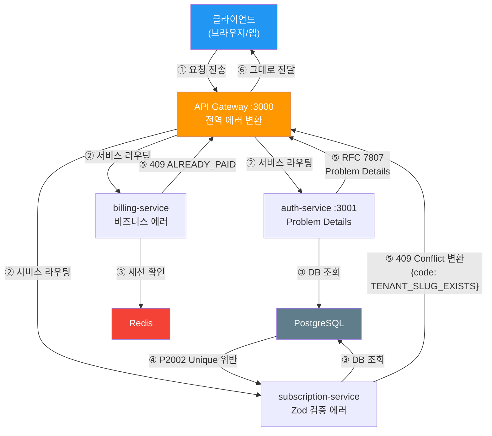
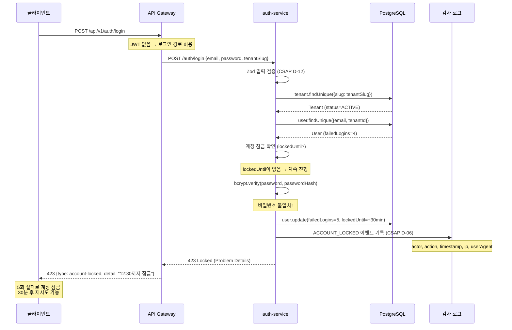

# 중앙화된 에러 핸들링 — 실제 코드 기반

> **문서 ID**: ONBOARD-03-20
> **버전**: 1.0.0 | **작성일**: 2026-04-12 | **대상**: 백엔드 개발자, 신규 합류 팀원
> **선행 학습**: `03-development/12-api-design-guide.md`, `03-development/02-service-development.md`
> **예상 학습 시간**: 2~3시간 (실습 포함)
> **실제 코드 위치**:
> - API Gateway: `platform/services/api-gateway/src/lib/`
> - 인증 서비스: `platform/services/auth-service/src/lib/problem-reply.ts`
> - 인증 핸들러: `platform/services/auth-service/src/handlers/login.handler.ts`
> **CSAP 매핑**: D-06 (감사 로그), D-12 (개발 보안 — 에러 정보 노출 방지), D-08 (접근 통제)

---

## 목차

1. [에러 핸들링 아키텍처 개요](#1-에러-핸들링-아키텍처-개요)
2. [에러 코드 체계](#2-에러-코드-체계)
3. [실제 에러 클래스 구현 — RFC 7807 Problem Details](#3-실제-에러-클래스-구현--rfc-7807-problem-details)
4. [공공기관 기준 사용자 대향 에러 메시지](#4-공공기관-기준-사용자-대향-에러-메시지)
5. [CSAP 준수 에러 핸들링](#5-csap-준수-에러-핸들링)
6. [실전 에러 핸들링 패턴](#6-실전-에러-핸들링-패턴)
7. [에러 모니터링 연동](#7-에러-모니터링-연동)
8. [변경 이력](#8-변경-이력)

---

## 1. 에러 핸들링 아키텍처 개요

### 1.1 중앙화 vs 분산 에러 핸들링

**분산 에러 핸들링 (이렇게 하지 마십시오)**:

```typescript
// ❌ 분산 에러 핸들링 — 서비스마다 다른 에러 형식
// auth-service에서:
catch (e) {
  return { error: e.message }  // 에러 형식 제각각
}

// subscription-service에서:
catch (e) {
  return { msg: '실패' }  // 또 다른 형식
}

// billing-service에서:
catch (e) {
  return { status: 'error', detail: e.stack }  // 스택 트레이스 노출! (CSAP D-12 위반)
}
```

**중앙화 에러 핸들링 (이 프로젝트의 방식)**:

```typescript
// ✅ 중앙화: 모든 서비스가 동일한 에러 형식 사용
// RFC 7807 Problem Details 표준 준수

// auth-service에서:
await problemReply(request, reply, {
  type: AuthProblemTypes.invalidCredentials,
  title: '이메일 또는 비밀번호가 올바르지 않습니다',
  status: 401,
})

// subscription-service에서:
return reply.status(400).send({
  success: false,
  error: { code: 'VALIDATION_ERROR', message: '입력 값이 유효하지 않습니다' },
})
```

### 1.2 Fastify 전역 에러 핸들러 구조

Fastify에서 에러 핸들링은 3계층으로 이루어집니다:

```
요청 → [1] 라우트별 try/catch → [2] Fastify 에러 훅 → [3] 전역 에러 핸들러
```

```typescript
// Fastify 전역 에러 핸들러 등록 패턴
// platform/services/*/src/index.ts 에서 공통 적용

const app = Fastify({ logger: true })

// 전역 에러 핸들러
app.setErrorHandler(async (error, request, reply) => {
  // 1. Zod 검증 에러 → 400 변환
  if (error instanceof ZodError) {
    return reply.status(400).send({
      success: false,
      error: {
        code: 'VALIDATION_ERROR',
        message: error.issues.map(i => i.message).join(', '),
      },
    })
  }

  // 2. Prisma 에러 → 비즈니스 에러 변환
  if (error.code === 'P2002') {
    return reply.status(409).send({
      success: false,
      error: { code: 'DUPLICATE_ENTRY', message: '이미 존재하는 데이터입니다' },
    })
  }

  // 3. 그 외 — 내부 서버 에러 (CSAP D-12: 민감 정보 노출 방지)
  request.log.error({ errorId: error.correlationId, message: error.message })
  return reply.status(500).send({
    success: false,
    error: {
      code: 'INTERNAL_SERVER_ERROR',
      message: '서버 오류가 발생했습니다. 관리자에게 문의하십시오.',
      // 스택 트레이스, DB 정보, 환경 변수 절대 노출 금지 (CSAP D-12)
    },
  })
})
```

### 1.3 에러 전파 흐름도



---

## 2. 에러 코드 체계

### 2.1 HTTP 상태 코드 사용 기준

이 프로젝트에서 HTTP 상태 코드 사용 원칙:

| 상태 코드 | 의미 | 사용 기준 | 예시 |
|---------|------|---------|------|
| 200 OK | 성공 | 조회·수정 성공 | 구독 조회 성공 |
| 201 Created | 생성 성공 | 새 리소스 생성 | 테넌트 생성, 구독 생성 |
| 400 Bad Request | 잘못된 요청 | 입력 검증 실패 (Zod) | UUID 형식 오류, 필수 필드 누락 |
| 401 Unauthorized | 미인증 | JWT 없음/만료/무효 | 로그인 실패, 토큰 만료 |
| 403 Forbidden | 권한 없음 | 인증은 됐으나 권한 부족 | 타 테넌트 구독 접근 시도 |
| 404 Not Found | 없음 | 리소스 존재하지 않음 | 구독 ID 없음, 테넌트 없음 |
| 409 Conflict | 충돌 | 중복 생성, 상태 충돌 | slug 중복, 이미 결제된 인보이스 |
| 423 Locked | 잠금 | 리소스 잠금 상태 | 계정 잠금 (5회 실패) |
| 429 Too Many | 요청 과다 | Rate Limit 초과 | API 호출 한도 초과 |
| 500 Internal | 서버 에러 | 예상치 못한 서버 오류 | DB 연결 실패 |
| 502 Bad Gateway | 게이트웨이 에러 | 업스트림 서비스 오류 | auth-service 응답 없음 |
| 503 Unavailable | 서비스 불가 | Circuit Breaker OPEN | 서비스 일시 중단 |

**4xx vs 5xx 구분 원칙**:
- **4xx**: 클라이언트가 수정할 수 있는 문제 → 재시도 전에 요청을 수정해야 함
- **5xx**: 서버 측 문제 → 클라이언트는 잠시 후 재시도 가능

### 2.2 내부 에러 코드 네이밍 규칙

형식: `{카테고리}_{동작/상태}_{세부사항}`

```
AUTH_001  → 인증 실패 (일반)
AUTH_002  → 계정 잠금
AUTH_003  → MFA 필요
AUTH_004  → 토큰 만료
AUTH_005  → 토큰 무효

TENANT_001 → 테넌트 없음
TENANT_002 → slug 중복
TENANT_003 → 정지된 테넌트
TENANT_004 → 권한 없음

SUB_001   → 구독 없음
SUB_002   → 유효하지 않은 플랜
SUB_003   → 취소된 구독 접근
SUB_004   → 업그레이드 불가 상태

BILL_001  → 인보이스 없음
BILL_002  → 이미 결제됨
BILL_003  → 결제 금액 불일치

CSAP_403  → N2SF 데이터 등급 위반
CSAP_429  → Rate Limit (CSAP D-10)

VALIDATION_001 → 필수 필드 누락
VALIDATION_002 → 형식 오류
VALIDATION_003 → 범위 초과
```

### 2.3 에러 코드 전체 목록 (카테고리별)

**인증 에러 (AUTH)**

| 코드 | HTTP | 설명 | CSAP |
|------|------|------|------|
| `AUTH_REQUIRED` | 401 | JWT 토큰 없음 | D-08-01 |
| `INVALID_CREDENTIALS` | 401 | 이메일 또는 비밀번호 오류 | D-08-01 |
| `ACCOUNT_LOCKED` | 423 | 계정 잠금 (5회 실패 후 30분) | D-08-06 |
| `MFA_REQUIRED` | 403 | MFA 코드 필요 | D-08-08 |
| `MFA_INVALID` | 401 | MFA 코드 오류 | D-08-08 |
| `TOKEN_EXPIRED` | 401 | JWT 만료 | D-08-02 |
| `TOKEN_REVOKED` | 401 | 로그아웃된 토큰 | D-08-03 |
| `TOKEN_INVALID` | 401 | 변조된 JWT | D-08-01 |

**테넌트 에러 (TENANT)**

| 코드 | HTTP | 설명 | CSAP |
|------|------|------|------|
| `TENANT_NOT_FOUND` | 404 | 테넌트 없음 | — |
| `TENANT_SLUG_EXISTS` | 409 | slug 중복 | D-12 |
| `TENANT_SUSPENDED` | 403 | 정지된 테넌트 로그인 시도 | D-08-05 |
| `TENANT_ARCHIVED` | 403 | 아카이브된 테넌트 | D-08-05 |
| `TENANT_ALREADY_ARCHIVED` | 409 | 이미 아카이브됨 | — |

**구독 에러 (SUBSCRIPTION)**

| 코드 | HTTP | 설명 | CSAP |
|------|------|------|------|
| `SUBSCRIPTION_NOT_FOUND` | 404 | 구독 없음 | — |
| `PLAN_NOT_FOUND` | 404 | 플랜 없음 | — |
| `FORBIDDEN` | 403 | 타 테넌트 구독 접근 | D-08-05 |
| `VALIDATION_ERROR` | 400 | Zod 검증 실패 | D-12 |

**청구 에러 (BILLING)**

| 코드 | HTTP | 설명 | CSAP |
|------|------|------|------|
| `INVOICE_NOT_FOUND` | 404 | 인보이스 없음 | — |
| `ALREADY_PAID` | 409 | 이미 결제된 인보이스 | — |
| `FORBIDDEN` | 403 | 타 테넌트 인보이스 접근 | D-08-05 |

**보안/시스템 에러**

| 코드 | HTTP | 설명 | CSAP |
|------|------|------|------|
| `DATA_GRADE_VIOLATION` | 403 | C/S 등급 데이터 AI 전송 시도 | N2SF N-05 |
| `RATE_LIMIT_EXCEEDED` | 429 | API 호출 한도 초과 | D-10 |
| `CIRCUIT_OPEN` | 503 | Circuit Breaker OPEN | D-07 |
| `INTERNAL_SERVICE_KEY_MISSING` | 401 | 내부 서비스 인증 실패 | D-08 |
| `INTERNAL_SERVER_ERROR` | 500 | 예상치 못한 서버 오류 | — |

---

## 3. 실제 에러 클래스 구현 — RFC 7807 Problem Details

### 3.1 RFC 7807이란?

RFC 7807은 HTTP API의 에러 응답 표준입니다. 이 프로젝트의 `auth-service`에서 완전히 구현합니다.

**표준 에러 응답 형식**:

```json
{
  "type": "https://problems.public-saas.kr/errors/auth/account-locked",
  "title": "계정이 잠겨 있습니다",
  "status": 423,
  "detail": "2026-04-12T12:30:00Z 이후 다시 시도하세요",
  "instance": "/auth/login",
  "traceId": "abc123def456",
  "extensions": {
    "lockedUntil": "2026-04-12T12:30:00Z"
  }
}
```

| 필드 | 의미 | 필수 |
|------|------|------|
| `type` | 에러 유형 URI (문서화 URL) | 권장 |
| `title` | 에러 제목 (사람이 읽을 수 있는) | 필수 |
| `status` | HTTP 상태 코드 | 필수 |
| `detail` | 구체적 설명 (이 요청에 특화) | 선택 |
| `instance` | 에러가 발생한 URL | 선택 |
| `traceId` | 분산 추적 ID (CSAP D-06 연계) | 확장 |

### 3.2 auth-service의 Problem Details 구현

```typescript
// platform/services/auth-service/src/lib/problem-reply.ts
// Design Ref: SVC-AUTHR2-R50.design.md §2.1
// CSAP: D-12-03 표준 에러 응답, D-06-02 traceId 상관관계

import type { FastifyReply, FastifyRequest } from 'fastify'
import {
  problem,
  withTraceId,
  type ProblemDetails,
  type ProblemOptions,
} from '@public-saas/problem-details'

// 에러 타입 URI 기반 URL — 에러 문서화 URL 역할도 함
export const AUTH_ERROR_BASE = 'https://problems.public-saas.kr/errors/auth'

// 모든 auth-service 에러 타입을 상수로 관리
export const AuthProblemTypes = {
  validation:          `${AUTH_ERROR_BASE}/validation`,
  invalidCredentials:  `${AUTH_ERROR_BASE}/invalid-credentials`,
  tenantNotFound:      `${AUTH_ERROR_BASE}/tenant-not-found`,
  userNotFound:        `${AUTH_ERROR_BASE}/user-not-found`,
  accountLocked:       `${AUTH_ERROR_BASE}/account-locked`,
  mfaRequired:         `${AUTH_ERROR_BASE}/mfa-required`,
  mfaInvalid:          `${AUTH_ERROR_BASE}/mfa-invalid`,
  tokenRevoked:        `${AUTH_ERROR_BASE}/token-revoked`,
  tokenExpired:        `${AUTH_ERROR_BASE}/token-expired`,
  tokenInvalid:        `${AUTH_ERROR_BASE}/token-invalid`,
  noToken:             `${AUTH_ERROR_BASE}/no-token`,
} as const

// traceId 추출 (W3C traceparent 또는 x-request-id)
export function extractTraceId(request: FastifyRequest): string | undefined {
  const requestId = request.headers['x-request-id']
  if (typeof requestId === 'string' && requestId.length > 0) {
    return requestId
  }

  const traceparent = request.headers['traceparent']
  if (typeof traceparent === 'string') {
    // W3C 형식: 00-{traceId32}-{spanId16}-{flags2}
    const parts = traceparent.split('-')
    if (parts.length === 4 && parts[1]?.length === 32) {
      return parts[1]
    }
  }
  return undefined
}

// Problem Details 응답 전송 헬퍼
export async function problemReply(
  request: FastifyRequest,
  reply: FastifyReply,
  opts: { type: string; title: string; status: number; detail?: string; extensions?: Record<string, unknown>; instance?: string },
): Promise<void> {
  const instance = opts.instance ?? request.url

  let pd: ProblemDetails = problem({ ...opts, instance })

  // CSAP D-06-02: traceId 추가 (Loki 로그와 상관관계 추적)
  const traceId = extractTraceId(request)
  if (traceId) {
    pd = withTraceId(pd, traceId)
  }

  void reply
    .status(opts.status)
    .header('Content-Type', 'application/problem+json; charset=utf-8')
  await reply.send(pd)
}
```

### 3.3 에러 계층 구조 설계 패턴

이 프로젝트에서 에러는 4가지 계층으로 분류됩니다:

```typescript
// 에러 계층 구조 (개념 설계 — 서비스에서 실제 적용)

// 1계층: 도메인 에러 (비즈니스 규칙 위반)
// 예: "취소된 구독은 업그레이드 불가", "이미 결제된 인보이스"
class DomainError extends Error {
  constructor(
    public readonly code: string,      // 비즈니스 에러 코드
    public readonly message: string,   // 한국어 메시지 (사용자 노출 가능)
    public readonly statusCode: number = 400,
  ) { super(message) }
}

// 2계층: 검증 에러 (입력값 형식/범위 위반)
// Zod가 이 역할을 담당 — safeParse().error 로 처리
class ValidationError extends DomainError {
  constructor(issues: string[]) {
    super('VALIDATION_ERROR', issues.join(', '), 400)
  }
}

// 3계층: 인증/인가 에러 (CSAP D-08)
// auth-service의 Problem Details로 처리
class AuthError extends DomainError {
  constructor(code: string, message: string, statusCode: 401 | 403 | 423) {
    super(code, message, statusCode)
  }
}

// 4계층: 인프라 에러 (DB, Redis, 외부 서비스)
// 전역 에러 핸들러에서 500으로 변환, 민감 정보 숨김
class InfraError extends Error {
  constructor(
    public readonly originalError: unknown,
    public readonly context: string,
  ) {
    super(`Infrastructure error in ${context}`)
    // 원본 에러는 로그에만, 응답에는 절대 노출 금지 (CSAP D-12)
  }
}
```

### 3.4 TypeScript 제네릭 에러 응답 타입

```typescript
// 표준 API 응답 타입 (모든 서비스 공통)
interface ApiResponse<T> {
  success: true
  data: T
}

interface ApiErrorResponse {
  success: false
  error: {
    code: string
    message: string
    details?: string[]  // 검증 에러 상세 목록
  }
}

type ApiResult<T> = ApiResponse<T> | ApiErrorResponse

// 페이지네이션 포함 응답
interface PaginatedResponse<T> extends ApiResponse<T[]> {
  pagination: {
    page: number
    pageSize: number
    total: number
    totalPages: number
  }
}

// 실제 사용 예
async function listPlansHandler(request, reply): Promise<void> {
  const plans = await prisma.plan.findMany({ where: { isActive: true }, take: 100 })
  const response: ApiResponse<typeof plans> = { success: true, data: plans }
  await reply.send(response)
}
```

---

## 4. 공공기관 기준 사용자 대향 에러 메시지

### 4.1 한국어 에러 메시지 가이드

공공기관 사용자는 개발자 용어에 익숙하지 않습니다. 에러 메시지는 다음 기준을 따릅니다:

**원칙 1 — 행동 지침 제공**

```
❌ "401 Unauthorized"
✅ "이메일 또는 비밀번호가 올바르지 않습니다. 다시 확인해주십시오."

❌ "Token expired"
✅ "로그인 세션이 만료되었습니다. 다시 로그인해주십시오."

❌ "P2002 Unique constraint failed"
✅ "이미 사용 중인 기관 식별자(slug)입니다. 다른 값을 입력해주십시오."
```

**원칙 2 — 공공기관 표준 어체**

```
❌ "에러가 났어요!" (구어체)
✅ "오류가 발생하였습니다. 관리자에게 문의하십시오." (공문서체)

❌ "계정이 잠겼습니다"
✅ "보안 정책에 따라 계정이 일시 잠금 처리되었습니다."
```

**원칙 3 — 적절한 수준의 정보 제공**

```
❌ "사용자 user@agency.go.kr 의 비밀번호가 틀렸습니다" (개인정보 노출)
✅ "이메일 또는 비밀번호가 올바르지 않습니다" (일반적 메시지)

❌ "내부 오류: Cannot read property 'id' of undefined at line 42" (구현 노출)
✅ "일시적인 오류가 발생하였습니다. 잠시 후 다시 시도해주십시오."
```

### 4.2 서비스별 표준 한국어 메시지 목록

```typescript
// auth-service 표준 에러 메시지
const AUTH_MESSAGES = {
  invalidCredentials: '이메일 또는 비밀번호가 올바르지 않습니다.',
  tenantNotFound:     '기관 정보를 찾을 수 없습니다.',
  accountLocked:      '보안 정책에 따라 계정이 일시 잠금 처리되었습니다.',
  mfaRequired:        '추가 인증(OTP) 코드를 입력해주십시오.',
  mfaInvalid:         '인증 코드가 올바르지 않습니다.',
  tokenExpired:       '로그인 세션이 만료되었습니다. 다시 로그인해주십시오.',
  tokenRevoked:       '인증 정보가 무효화되었습니다. 다시 로그인해주십시오.',
}

// tenant-service 표준 에러 메시지
const TENANT_MESSAGES = {
  tenantNotFound:   '기관 정보를 찾을 수 없습니다.',
  slugExists:       '이미 사용 중인 기관 식별자입니다.',
  tenantSuspended:  '해당 기관 계정은 현재 이용이 제한되어 있습니다.',
  forbidden:        '접근 권한이 없습니다.',
}

// subscription-service 표준 에러 메시지
const SUBSCRIPTION_MESSAGES = {
  notFound:         '구독 정보를 찾을 수 없습니다.',
  forbidden:        '접근 권한이 없습니다.',
  validationError:  '입력한 정보를 다시 확인해주십시오.',
  planNotFound:     '해당 서비스 플랜을 찾을 수 없습니다.',
}
```

### 4.3 PII 노출 방지 (CSAP D-12)

에러 메시지에 개인정보 또는 민감 정보를 절대 포함하지 않습니다.

```typescript
// ❌ PII 노출 예시 — 절대 금지
async function loginHandler(request, reply) {
  const user = await prisma.user.findUnique({ where: { email } })
  if (!user) {
    return reply.status(401).send({
      error: `${email} 이메일로 등록된 계정이 없습니다.`,  // ❌ 이메일 노출
    })
  }
}

// ✅ 올바른 PII 보호
async function loginHandler(request, reply) {
  const user = await prisma.user.findUnique({ where: { email } })
  if (!user) {
    // 로그에는 감사 정보 기록 (내부용)
    await logAuthEvent('LOGIN_FAIL_USER_NOT_FOUND', email, tenant.id, ip, userAgent)
    // 응답에는 일반적 메시지 (이메일 존재 여부도 노출 금지)
    return problemReply(request, reply, {
      type: AuthProblemTypes.invalidCredentials,
      title: '이메일 또는 비밀번호가 올바르지 않습니다',  // 어느 쪽이 틀렸는지 미공개
      status: 401,
    })
  }
}
```

**내부 로그 vs 외부 응답 분리 원칙**:

```typescript
// 내부 로그: 디버깅에 필요한 모든 정보 (운영자만 접근)
request.log.error({
  errorId: crypto.randomUUID(),
  userId: user.id,           // ID는 로그에 OK
  tenantId: tenant.id,
  action: 'LOGIN_ATTEMPT',
  failedAttempts: user.failedLogins + 1,
  lockedUntil: newLockDate,
  ip: sanitizeIp(request.ip),
  userAgent: sanitizeUserAgent(request.headers['user-agent']),
})

// 외부 응답: 최소한의 정보 (사용자에게 전달)
return problemReply(request, reply, {
  type: AuthProblemTypes.invalidCredentials,
  title: '이메일 또는 비밀번호가 올바르지 않습니다',
  status: 401,
  // detail 생략: 어느 쪽이 틀렸는지 알려주지 않음 (보안)
  // extensions 생략: 내부 상태 미공개
})
```

---

## 5. CSAP 준수 에러 핸들링

### 5.1 보안 관련 에러의 감사 로그 의무 (CSAP D-06)

CSAP D-06은 모든 보안 관련 에러를 감사 로그에 기록할 것을 요구합니다.

**의무 기록 대상**:

| 에러 상황 | 로그 이벤트명 | CSAP 항목 |
|---------|------------|---------|
| 로그인 실패 | `LOGIN_FAIL_WRONG_PASSWORD` | D-06, D-08-06 |
| 계정 잠금 | `LOGIN_FAIL_ACCOUNT_LOCKED` | D-06, D-08-06 |
| 타 테넌트 접근 시도 | `FORBIDDEN_TENANT_ACCESS` | D-06, D-08-05 |
| N2SF 데이터 등급 위반 | `DATA_GRADE_VIOLATION` | D-06, N2SF N-05 |
| JWT 위변조 시도 | `TOKEN_TAMPERED` | D-06, D-08-01 |
| 내부 서비스 인증 실패 | `SERVICE_AUTH_FAILED` | D-06, D-08 |

```typescript
// auth-service 로그인 실패 감사 로그 구현
// platform/services/auth-service/src/handlers/login.handler.ts

// 비밀번호 틀림 → 감사 로그 기록 (CSAP D-06)
await logAuthEvent('LOGIN_FAIL_WRONG_PASSWORD', user.id, tenant.id, ip, userAgent, {
  failedAttempts: newFailedCount,
  // 비밀번호 자체는 절대 로그에 기록하지 않음 (CSAP D-12)
})

// 계정 잠금 → 감사 로그 기록
if (newFailedCount >= AUTH_CONSTANTS.MAX_LOGIN_ATTEMPTS) {
  await logAuthEvent('ACCOUNT_LOCKED', user.id, tenant.id, ip, userAgent, {
    lockedUntil: newLockDate.toISOString(),
  })
}
```

### 5.2 에러 메시지에 시크릿 노출 금지 패턴 (CSAP D-12)

```typescript
// ❌ 시크릿 노출 — 절대 금지
catch (error) {
  return reply.status(500).send({
    error: error.message,           // DB 연결 문자열 노출 가능
    stack: error.stack,             // 파일 경로, 코드 구조 노출
    config: process.env,            // ❌ 환경 변수 전체 노출 (CSAP D-12 심각 위반)
    dbUrl: process.env.DATABASE_URL, // ❌ DB URL 노출
  })
}

// ✅ 안전한 에러 응답 (CSAP D-12 준수)
catch (error) {
  // 1. 내부 로그: 운영자를 위해 상세 기록
  const errorId = crypto.randomUUID()
  request.log.error({
    errorId,
    message: error.message,  // 로그에는 상세 내용 OK
    stack: error.stack,
    // 단, DB URL, API 키 등은 로그에도 기록 금지
  })

  // 2. 외부 응답: 최소한의 정보만
  return reply.status(500).send({
    success: false,
    error: {
      code: 'INTERNAL_SERVER_ERROR',
      message: '일시적인 오류가 발생하였습니다.',
      errorId,  // 운영자가 로그 검색에 사용할 수 있는 ID만 제공
    },
  })
}
```

### 5.3 인증 에러 처리 시퀀스 다이어그램 (CSAP D-06, D-08)



### 5.4 N2SF 데이터 등급 위반 에러 처리

```typescript
// platform/services/api-gateway/src/middleware/data-grade.middleware.ts
// CSAP: N2SF N-05

export function dataGradeMiddleware(allowedGrades: DataGrade[] = ['O']) {
  return async (request: FastifyRequest, reply: FastifyReply): Promise<void> => {
    const dataGrade = request.headers['x-data-grade'] as DataGrade | undefined

    if (!dataGrade) return  // 미지정 시 O(공개) 기본값

    if (!allowedGrades.includes(dataGrade)) {
      // 감사 로그 기록 (CSAP D-06 — 보안 위반 시도)
      request.log.warn({
        event: 'DATA_GRADE_VIOLATION',
        dataGrade,
        allowedGrades,
        url: request.url,
        ip: request.ip,
      })

      return reply.status(403).send({
        success: false,
        error: {
          code: 'DATA_GRADE_VIOLATION',
          message: `${dataGrade} 등급 데이터는 이 서비스로 전송할 수 없습니다 (N2SF N-05). 허용 등급: ${allowedGrades.join(', ')}`,
        },
      })
    }
  }
}
```

---

## 6. 실전 에러 핸들링 패턴

### 6.1 Result 패턴 vs try/catch

이 프로젝트는 Zod의 `safeParse()`를 Result 패턴처럼 사용합니다.

```typescript
// Result 패턴 (Zod safeParse)
const parseResult = createPlanSchema.safeParse(request.body)
if (!parseResult.success) {
  // 에러 경로 — 즉시 반환
  return reply.status(400).send({
    success: false,
    error: {
      code: 'VALIDATION_ERROR',
      message: parseResult.error.issues.map(i => i.message).join(', '),
    },
  })
}
// 이후부터 parseResult.data는 타입 안전 — TypeScript가 보장
const { name, price, interval } = parseResult.data
```

```typescript
// try/catch — 인프라 에러 처리
try {
  const tenant = await prisma.tenant.create({
    data: { ...parseResult.data, maxStorage: BigInt(parseResult.data.maxStorage) },
  })
  return reply.status(201).send({ success: true, data: serializeTenant(tenant) })
} catch (error: unknown) {
  // Prisma 에러를 도메인 에러로 변환
  const prismaError = error as { code?: string }
  if (prismaError.code === 'P2002') {
    // 유니크 제약 위반 → 비즈니스 에러
    return reply.status(409).send({
      success: false,
      error: { code: 'TENANT_SLUG_EXISTS', message: '이미 사용 중인 slug입니다' },
    })
  }
  throw error  // 알 수 없는 에러는 전역 핸들러로
}
```

**언제 무엇을 사용하는가**:

| 상황 | 권장 패턴 |
|------|---------|
| 입력 검증 | Zod `safeParse()` (Result 패턴) |
| DB 작업 | try/catch + Prisma 에러 코드 변환 |
| 외부 API 호출 | try/catch + Circuit Breaker |
| 비즈니스 규칙 | 조건문 + 즉시 반환 (early return) |

### 6.2 Circuit Breaker와 에러 연동

```typescript
// platform/services/api-gateway/src/lib/circuit-breaker.ts
// Design Ref: DESIGN-MTU-P04

// Circuit Breaker OPEN 시 503 반환
export class CircuitOpenError extends Error {
  public readonly serviceId: string
  public readonly retryAfterMs: number

  constructor(serviceId: string, retryAfterMs: number) {
    super(
      `Circuit breaker OPEN: 서비스 '${serviceId}'가 일시적으로 차단되었습니다. ${Math.ceil(retryAfterMs / 1000)}초 후 재시도하세요.`,
    )
    this.name = 'CircuitOpenError'
    this.serviceId = serviceId
    this.retryAfterMs = retryAfterMs
  }
}

// 전역 에러 핸들러에서 CircuitOpenError 처리
app.setErrorHandler(async (error, request, reply) => {
  if (error instanceof CircuitOpenError) {
    return reply.status(503).send({
      success: false,
      error: {
        code: 'CIRCUIT_OPEN',
        message: `서비스가 일시적으로 이용 불가합니다. ${Math.ceil(error.retryAfterMs / 1000)}초 후 다시 시도해주십시오.`,
        retryAfter: Math.ceil(error.retryAfterMs / 1000),
      },
    })
  }
  // 기타 에러 처리...
})
```

```typescript
// Circuit Breaker 사용 예
try {
  const result = await circuitBreaker.execute('auth-service', () =>
    fetch(`${authServiceUrl}/auth/verify`, { method: 'POST' })
  )
} catch (error) {
  if (error instanceof CircuitOpenError) {
    // 503 응답 (전역 핸들러가 처리)
    throw error
  }
  // 기타 연결 오류
  throw new InfraError(error, 'auth-service-verify')
}
```

### 6.3 재시도 전략 (지수 백오프)

외부 서비스 호출 시 일시적 오류에 대한 재시도:

```typescript
// 지수 백오프 재시도 유틸리티
async function withRetry<T>(
  fn: () => Promise<T>,
  options: {
    maxAttempts: number    // 최대 시도 횟수
    initialDelay: number   // 초기 대기 시간 (ms)
    maxDelay: number       // 최대 대기 시간 (ms)
    retryOn: (error: unknown) => boolean  // 재시도 조건
  }
): Promise<T> {
  let attempt = 0
  let delay = options.initialDelay

  while (attempt < options.maxAttempts) {
    try {
      return await fn()
    } catch (error) {
      attempt++
      if (attempt >= options.maxAttempts || !options.retryOn(error)) {
        throw error  // 최대 시도 초과 또는 재시도 불필요한 에러
      }

      // 지수 백오프: 2^attempt * initialDelay (최대 maxDelay)
      await new Promise(resolve => setTimeout(resolve, Math.min(delay, options.maxDelay)))
      delay *= 2
    }
  }
  throw new Error('재시도 초과')
}

// 사용 예: 알림 발송 재시도
await withRetry(
  () => notificationService.send(notification),
  {
    maxAttempts: 3,
    initialDelay: 1000,   // 1초
    maxDelay: 10000,      // 최대 10초
    retryOn: (error) => {
      // 5xx 에러만 재시도, 4xx는 재시도 불필요
      const statusCode = (error as any).statusCode
      return statusCode >= 500 && statusCode < 600
    },
  }
)
```

### 6.4 Fastify + Prisma 에러 변환 실례

실제 프로젝트에서 자주 발생하는 Prisma 에러와 변환 방법:

```typescript
// Prisma 에러 코드 → HTTP 에러 변환 패턴
function handlePrismaError(error: unknown, reply: FastifyReply): boolean {
  const prismaError = error as { code?: string; meta?: Record<string, unknown> }

  switch (prismaError.code) {
    case 'P2002':
      // Unique constraint violation
      const field = (prismaError.meta?.target as string[])?.join(', ') ?? 'field'
      reply.status(409).send({
        success: false,
        error: { code: 'DUPLICATE_ENTRY', message: `${field} 값이 이미 존재합니다.` },
      })
      return true

    case 'P2025':
      // Record not found
      reply.status(404).send({
        success: false,
        error: { code: 'NOT_FOUND', message: '요청한 데이터를 찾을 수 없습니다.' },
      })
      return true

    case 'P2003':
      // Foreign key constraint violation
      reply.status(400).send({
        success: false,
        error: { code: 'REFERENCE_ERROR', message: '참조하는 데이터가 존재하지 않습니다.' },
      })
      return true

    case 'P2034':
      // Transaction conflict (retry possible)
      reply.status(409).send({
        success: false,
        error: { code: 'TRANSACTION_CONFLICT', message: '동시 요청 충돌. 잠시 후 다시 시도해주십시오.' },
      })
      return true

    default:
      return false  // 알 수 없는 Prisma 에러 → 전역 핸들러로
  }
}

// 실제 핸들러에서 사용
export async function createTenantHandler(request, reply) {
  const parseResult = createTenantSchema.safeParse(request.body)
  if (!parseResult.success) {
    return reply.status(400).send({
      success: false,
      error: { code: 'VALIDATION_ERROR', message: parseResult.error.issues.map(i => i.message).join(', ') },
    })
  }

  try {
    const tenant = await prisma.tenant.create({ data: { ...parseResult.data } })
    return reply.status(201).send({ success: true, data: tenant })
  } catch (error) {
    if (handlePrismaError(error, reply)) return  // Prisma 에러 처리됨
    throw error  // 그 외 → 전역 핸들러
  }
}
```

---

## 7. 에러 모니터링 연동

### 7.1 Loki 로그 → 에러 패턴 탐지

Loki에서 에러 로그를 쿼리하는 방법:

```logql
# 최근 1시간 내 500 에러 로그 (전체 서비스)
{namespace="saas-prod"} |= "level=error" | json | __error__ = ""

# auth-service 로그인 실패 패턴
{service="auth-service"} |= "LOGIN_FAIL" | json
  | line_format "{{.ts}} | {{.action}} | actor={{.actor}} | ip={{.ip}}"

# 특정 에러 코드 집계
{namespace="saas-prod"} |= "VALIDATION_ERROR"
  | json
  | count_over_time([5m])

# N2SF 데이터 등급 위반 탐지
{namespace="saas-prod"} |= "DATA_GRADE_VIOLATION" | json
  | line_format "{{.ts}} | grade={{.dataGrade}} | url={{.url}} | ip={{.ip}}"
```

### 7.2 Grafana 알림 연동

에러율 기반 알림 규칙 예시:

```yaml
# Grafana Alerting Rule (개념)
groups:
  - name: error-rate
    rules:
      # 1분간 에러율 5% 초과 시 경보
      - alert: HighErrorRate
        expr: |
          rate(http_requests_total{status=~"5.."}[1m])
          /
          rate(http_requests_total[1m]) > 0.05
        for: 2m
        labels:
          severity: critical
        annotations:
          summary: "에러율 초과 — {{ $labels.service }}"
          description: "서비스 {{ $labels.service }}의 에러율이 5%를 초과했습니다."

      # 계정 잠금 급증 (보안 이상 탐지)
      - alert: AccountLockSurge
        expr: |
          increase(auth_account_lock_total[5m]) > 10
        for: 1m
        labels:
          severity: high
          csap: "D-08-06"
        annotations:
          summary: "계정 잠금 급증 — 무차별 대입 공격 의심"
```

### 7.3 실전 PromQL 에러율 쿼리

```promql
# HTTP 상태 코드별 에러율 (5분 이동 평균)
sum(rate(http_request_duration_seconds_count{status_code=~"4..|5.."}[5m]))
by (service, status_code)

# P99 레이턴시 (서비스별)
histogram_quantile(0.99,
  sum(rate(http_request_duration_seconds_bucket[5m]))
  by (service, le)
)

# 인증 에러율 (auth-service 전용)
sum(rate(http_requests_total{service="auth-service", status=~"4.."}[5m]))
/
sum(rate(http_requests_total{service="auth-service"}[5m]))

# Circuit Breaker 상태 (OPEN 횟수)
increase(circuit_breaker_state_total{state="open"}[10m])

# Subscription 서비스 403 에러 (테넌트 격리 위반 시도)
rate(http_requests_total{service="subscription-service", status="403"}[5m])
```

### 7.4 에러 대응 런북 (Runbook)

```
에러율 5% 초과 알림 수신 시:

Step 1 — 즉시 확인 (5분 이내)
  kubectl get pods -n saas-prod | grep -v Running
  kubectl top pods -n saas-prod
  Grafana: 에러율 대시보드 확인

Step 2 — 에러 원인 분류 (10분 이내)
  [ ] 4xx 에러 증가? → 클라이언트 입력 오류 또는 배포 후 API 변경
  [ ] 5xx 에러 증가? → 서버 오류 (DB/Redis/외부 서비스 확인)
  [ ] 503 Circuit Open? → 의존 서비스 장애

Step 3 — Loki에서 상세 로그 확인
  {namespace="saas-prod"} |= "level=error" | json | last 100

Step 4 — 필요 시 롤백
  kubectl rollout undo deployment/{service} -n saas-prod
```

---

## 8. 변경 이력

| 버전 | 일자 | 내용 | 작성자 |
|------|------|------|--------|
| 1.0.0 | 2026-04-12 | 최초 작성 — 에러 핸들링 아키텍처, RFC 7807, CSAP D-06/D-12 실제 코드 기반 | Implementer (Sonnet) |

---

*다음 학습 문서: `03-development/17-async-patterns.md` (비동기 패턴 및 이벤트 처리)*
