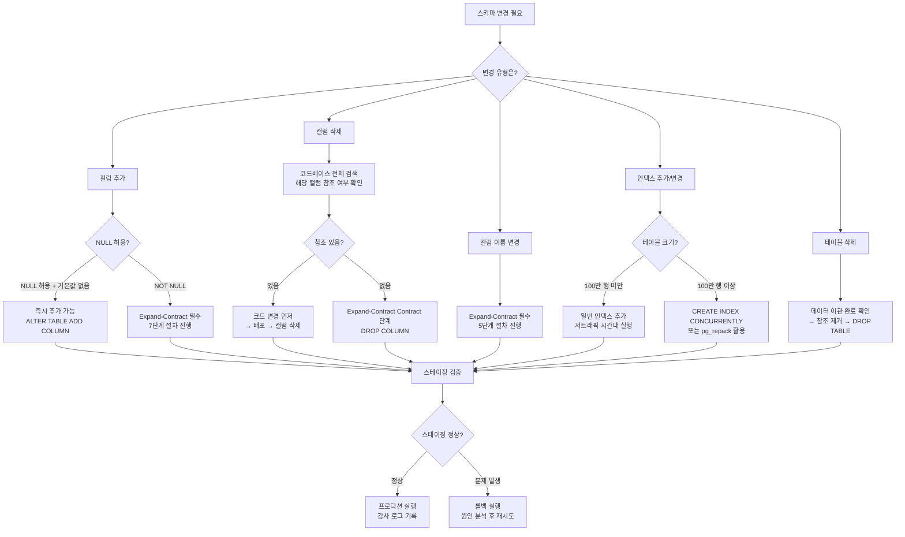
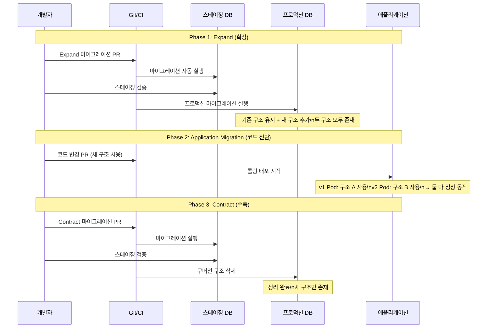
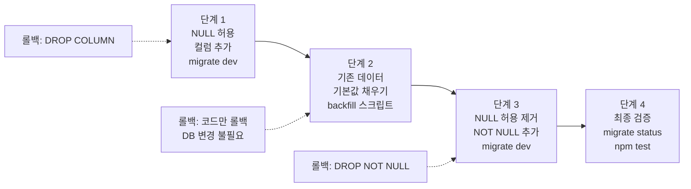

# Prisma 마이그레이션 전략 — 프로덕션 안전 마이그레이션

> **문서 ID**: ONBOARD-03-21
> **버전**: 1.0.0 | **작성일**: 2026-04-12 | **대상**: 백엔드 개발자, DevOps 엔지니어
> **선행 학습**: `03-development/05-prisma-guide.md`, `03-development/13-prisma-advanced.md`, `03-development/14-database-design.md`
> **소요 시간**: 약 5~6시간 (실습 포함)
> **CSAP**: D-10 (데이터 보존 및 복구), D-06 (감사 로그), D-12 (시스템 개발 보안)

---

## 목차

1. [마이그레이션의 위험성](#1-마이그레이션의-위험성)
2. [Expand-Contract 패턴 심화](#2-expand-contract-패턴-심화)
3. [멀티테넌시 환경의 마이그레이션](#3-멀티테넌시-환경의-마이그레이션)
4. [Prisma 마이그레이션 실전 명령어](#4-prisma-마이그레이션-실전-명령어)
5. [대용량 테이블 마이그레이션](#5-대용량-테이블-마이그레이션)
6. [마이그레이션 테스트](#6-마이그레이션-테스트)
7. [실습: NOT NULL 컬럼 안전하게 추가하기](#7-실습-not-null-컬럼-안전하게-추가하기)
8. [변경 이력](#8-변경-이력)

---

## 1. 마이그레이션의 위험성

### 1.1 프로덕션 DB 마이그레이션이 위험한 이유

데이터베이스 마이그레이션은 개발 과정에서 가장 위험한 작업 중 하나입니다. 코드 배포는 롤백이 쉽지만, 잘못된 DB 마이그레이션은 **돌이킬 수 없는 데이터 손실**로 이어질 수 있습니다.

왜 위험한지 구체적으로 살펴봅니다.

**이유 1 — 잠금(Lock) 문제**:

PostgreSQL은 DDL(스키마 변경) 명령을 실행할 때 테이블 전체에 잠금을 겁니다. 예를 들어 `ALTER TABLE users ADD COLUMN phone VARCHAR(20)` 명령은 `AccessExclusiveLock`을 획득합니다. 이 잠금은 다른 모든 쿼리(SELECT, INSERT, UPDATE, DELETE)를 차단합니다.

```
상황:
  1. 프로덕션에서 100만 행짜리 users 테이블에 컬럼을 추가하려 합니다.
  2. ALTER TABLE 명령이 실행됩니다.
  3. 이미 실행 중이던 긴 트랜잭션(예: 보고서 쿼리, 5분 소요)이 잠금을 먼저 잡고 있습니다.
  4. ALTER TABLE은 그 트랜잭션이 끝날 때까지 대기합니다.
  5. 대기 중에 새로운 모든 쿼리도 ALTER TABLE 뒤에서 차단됩니다.
  6. 5분 동안 서비스 완전 중단 (Downtime).
```

**이유 2 — 데이터 손실**:

```sql
-- 이 마이그레이션을 실행하면 어떻게 될까요?
ALTER TABLE users DROP COLUMN email;

-- email 컬럼의 모든 데이터가 즉시 삭제됩니다.
-- 롤백 트랜잭션을 열지 않았다면 복구 불가능합니다.
```

**이유 3 — 배포 순서 문제**:

```
잘못된 배포 순서 (위험):
  1. DB 마이그레이션 실행 (새 컬럼 추가 + 이전 컬럼 제거)
  2. 애플리케이션 배포 시작 (롤링 업데이트 — 일부 Pod는 구버전)
  3. 구버전 코드가 이미 삭제된 컬럼을 참조 → 에러!
  4. 서비스 부분 장애

올바른 배포 순서 (Expand-Contract):
  1. 마이그레이션 1: 새 컬럼 추가 (이전 컬럼 유지)
  2. 애플리케이션 배포: 두 컬럼 모두 지원하는 코드
  3. 데이터 마이그레이션: 이전 컬럼 → 새 컬럼 복사
  4. 애플리케이션 배포: 새 컬럼만 사용하는 코드
  5. 마이그레이션 2: 이전 컬럼 삭제
```

### 1.2 과거 실제 사고 사례

다음은 업계에서 실제로 발생한 마이그레이션 관련 사고 패턴입니다. 이 프로젝트에서 실제로 발생한 사례는 아니지만, 동일한 패턴이 언제든 발생할 수 있으므로 숙지합니다.

**사례 A — 컬럼 삭제로 인한 서비스 장애**:

```
상황: 리팩토링 중 사용하지 않는다고 판단한 legacy_phone 컬럼을 삭제했습니다.
결과: 해당 컬럼을 참조하던 레포트 서비스가 즉시 장애를 일으켰습니다.
      레포트 서비스 코드는 6개월 전에 작성되어 팀원들이 참조 사실을 잊고 있었습니다.
교훈: 컬럼 삭제 전에 반드시 코드베이스 전체에서 해당 컬럼 참조 여부를 검색합니다.
```

**사례 B — NOT NULL 제약으로 인한 마이그레이션 실패**:

```
상황: 새 필수 컬럼을 NOT NULL로 추가하는 마이그레이션을 작성했습니다.
     마이그레이션 스크립트:
       ALTER TABLE subscriptions ADD COLUMN tier VARCHAR(20) NOT NULL;
결과: 기존 10만 행에 기본값이 없어 마이그레이션이 즉시 실패했습니다.
     에러: null value in column "tier" of relation "subscriptions" violates not-null constraint
교훈: NOT NULL 컬럼은 먼저 NULL 허용으로 추가 → 기본값 채우기 → NOT NULL 제약 추가 순서를 따릅니다.
```

**사례 C — 대용량 인덱스 생성으로 인한 잠금**:

```
상황: 프로덕션 시간대에 5억 건 테이블에 인덱스를 추가했습니다.
     마이그레이션: CREATE INDEX ON audit_logs(tenant_id, created_at);
결과: 30분간 audit_logs 테이블이 완전히 잠겨 서비스 장애가 발생했습니다.
교훈: 인덱스는 CREATE INDEX CONCURRENTLY를 사용합니다.
     Prisma에서는 @@index가 기본적으로 CONCURRENTLY를 사용하지 않으므로,
     대용량 인덱스는 수동 마이그레이션 파일에서 직접 처리합니다.
```

### 1.3 우리 프로젝트의 마이그레이션 정책 (CSAP D-10)

CSAP D-10 항목은 데이터 보존 및 시스템 복구 요건을 규정합니다. 이 요건을 충족하기 위한 마이그레이션 정책은 다음과 같습니다.

| 정책 항목 | 내용 | 근거 |
|---------|------|------|
| 프로덕션 마이그레이션 전 백업 필수 | 마이그레이션 실행 전 DB 스냅샷 생성 | CSAP D-10 복구 요건 |
| 스테이징 검증 필수 | 동일 데이터 규모의 스테이징에서 먼저 실행 | D-12 개발 보안 |
| 롤백 계획 문서화 | 모든 마이그레이션에 롤백 절차 작성 | D-10 복구 목표 |
| 마이그레이션 로그 보존 | 누가 언제 어떤 마이그레이션을 실행했는지 감사 로그 | D-06 감사 요건 |
| Zero-downtime 원칙 | Expand-Contract 패턴으로 서비스 중단 없이 스키마 변경 | SLA 요건 |
| 데이터 손실 금지 | DROP 명령 전 데이터 이관 완료 확인 | D-10 데이터 보존 |

**마이그레이션 승인 프로세스**:

```
개발자        → 마이그레이션 파일 작성 + 롤백 계획 문서화
                ↓
팀 리드       → PR 리뷰: 롤백 계획 포함 여부, Expand-Contract 준수 여부 확인
                ↓
스테이징 실행 → CI/CD 파이프라인이 자동으로 스테이징에 마이그레이션 실행
                ↓
검증          → 스테이징에서 서비스 정상 동작 확인 (최소 1시간)
                ↓
프로덕션 실행 → DevOps 엔지니어가 유지보수 시간대에 실행
                ↓
감사 로그     → .claude/audit.jsonl에 마이그레이션 이벤트 기록
```

### 1.4 안전한 마이그레이션 의사결정 흐름도



---

## 2. Expand-Contract 패턴 심화

### 2.1 왜 Expand-Contract인가

전통적인 마이그레이션 방식은 배포와 마이그레이션을 동시에 진행합니다. 이 방식의 문제는 배포 중 구버전 코드와 신버전 DB 스키마, 또는 신버전 코드와 구버전 DB 스키마가 동시에 존재하는 순간이 생긴다는 것입니다.

Expand-Contract 패턴은 이 문제를 해결합니다. 핵심 원리는 **양방향 호환성 유지**입니다.

```
전통적 방식:
  배포 전: 코드 v1 + 스키마 v1 (정상)
  배포 중: 코드 v1/v2 혼재 + 스키마 v2 → 코드 v1이 스키마 v2와 호환 안 됨 → 장애!

Expand-Contract 방식:
  Phase 1 (Expand):  코드 v1 + 스키마 v1→v2 (v2는 v1의 확장, 하위 호환)
  Phase 2 (Migrate): 코드 v1→v2 (두 스키마 모두 지원)
  Phase 3 (Contract):코드 v2 + 스키마 v2→v3 (v1 구조 제거)
```

**Kubernetes 롤링 업데이트 맥락에서의 중요성**:

이 프로젝트는 k3s에 배포됩니다. 롤링 업데이트 중에는 구버전 Pod와 신버전 Pod가 **동시에** 실행됩니다. 이 순간 DB는 단 하나뿐입니다. 따라서 마이그레이션은 구버전 코드와 신버전 코드 모두와 호환되어야 합니다.

```
롤링 업데이트 중 DB 상태:

  [Pod 1: v1 코드] ─┐
  [Pod 2: v1 코드] ─┤─→ [PostgreSQL DB]
  [Pod 3: v2 코드] ─┘

  이 순간 DB 스키마는 v1과 v2 코드를 동시에 지원해야 합니다.
  Expand 단계의 마이그레이션이 이 요건을 충족합니다.
```

### 2.2 3단계: Expand → Migrate → Contract



### 2.3 실제 예시: NOT NULL 컬럼 추가 (7단계 절차)

다음 시나리오를 단계별로 진행합니다.

**목표**: `subscriptions` 테이블에 `tier VARCHAR(20) NOT NULL DEFAULT 'standard'` 컬럼을 추가합니다.

**기존 스키마**:
```prisma
model Subscription {
  id        String   @id @default(cuid())
  tenantId  String
  planId    String
  status    String
  createdAt DateTime @default(now())
  updatedAt DateTime @updatedAt
}
```

**목표 스키마**:
```prisma
model Subscription {
  id        String   @id @default(cuid())
  tenantId  String
  planId    String
  status    String
  tier      String   @default("standard")  // 새로 추가
  createdAt DateTime @default(now())
  updatedAt DateTime @updatedAt
}
```

**단계 1: NULL 허용으로 컬럼 추가 (Expand 마이그레이션)**

```prisma
// schema.prisma 수정
model Subscription {
  // ...기존 필드...
  tier      String?  // nullable로 먼저 추가 (NOT NULL 아님!)
  // ...
}
```

```bash
# 마이그레이션 파일 생성
npx prisma migrate dev --name add_subscription_tier_nullable
```

생성된 마이그레이션 파일 (`prisma/migrations/20260412000001_add_subscription_tier_nullable/migration.sql`):
```sql
-- AlterTable
ALTER TABLE "subscriptions" ADD COLUMN "tier" TEXT;
```

이 시점에서 구버전 코드는 `tier` 컬럼을 모르고 무시하며, 신버전 코드는 `tier` 컬럼을 읽을 수 있습니다.

**단계 2: 프로덕션에 Expand 마이그레이션 배포**

```bash
# 프로덕션에서
npx prisma migrate deploy
```

**단계 3: 기본값으로 기존 데이터 채우기**

이 단계는 마이그레이션 파일이 아니라 별도의 데이터 마이그레이션 스크립트로 실행합니다. 대용량이면 배치로 처리합니다 (섹션 5 참고).

```typescript
// scripts/backfill-subscription-tier.ts
// Plan SC: FR-SUB.15 — tier 기본값 채우기

import { prisma } from '../src/lib/prisma.js';

async function backfillSubscriptionTier(): Promise<void> {
  console.log('tier 기본값 채우기 시작...');

  const batchSize = 1000;
  let offset = 0;
  let totalUpdated = 0;

  while (true) {
    // NULL인 레코드를 배치로 조회
    const subscriptions = await prisma.subscription.findMany({
      where: { tier: null },
      select: { id: true },
      take: batchSize,
      skip: offset,
    });

    if (subscriptions.length === 0) break;

    // 배치 업데이트
    const ids = subscriptions.map((s) => s.id);
    const result = await prisma.subscription.updateMany({
      where: { id: { in: ids } },
      data: { tier: 'standard' },
    });

    totalUpdated += result.count;
    console.log(`업데이트: ${totalUpdated}건 완료`);

    // 마지막 배치이면 종료
    if (subscriptions.length < batchSize) break;
    offset += batchSize;
  }

  console.log(`백필 완료: 총 ${totalUpdated}건`);
}

backfillSubscriptionTier()
  .catch(console.error)
  .finally(() => prisma.$disconnect());
```

```bash
# 스크립트 실행
npx tsx scripts/backfill-subscription-tier.ts
```

**단계 4: 코드 변경 — tier 필드 활용**

```typescript
// 애플리케이션 코드에서 tier 필드를 읽고 쓰도록 변경
const subscription = await prisma.subscription.create({
  data: {
    tenantId,
    planId,
    status: 'active',
    tier: 'premium',  // 이제 명시적으로 설정
  },
});
```

**단계 5: 코드 배포 (롤링 업데이트)**

이 시점에서:
- 구버전 Pod: `tier` 컬럼을 무시 (nullable이므로 문제없음)
- 신버전 Pod: `tier` 컬럼을 사용

롤링 업데이트가 완료될 때까지 대기합니다.

**단계 6: NOT NULL 제약 추가 (Contract 마이그레이션)**

모든 데이터가 채워졌고 모든 Pod가 신버전으로 교체된 것을 확인한 후:

```prisma
// schema.prisma 수정 — nullable 제거
model Subscription {
  // ...
  tier String @default("standard")  // NOT NULL + DEFAULT
  // ...
}
```

```bash
npx prisma migrate dev --name add_subscription_tier_not_null
```

생성된 마이그레이션:
```sql
-- AlterTable
ALTER TABLE "subscriptions" ALTER COLUMN "tier" SET NOT NULL,
                             ALTER COLUMN "tier" SET DEFAULT 'standard';
```

**단계 7: 프로덕션에 Contract 마이그레이션 배포**

```bash
npx prisma migrate deploy
```

**각 단계에서의 롤백 방법**:

| 단계 | 롤백 방법 |
|------|---------|
| 단계 1 이후 | `DROP COLUMN tier` — 데이터 손실 없음 |
| 단계 2~4 | 코드만 구버전으로 롤백 — DB는 그대로 |
| 단계 5 이후 | 코드 롤백 → `ALTER COLUMN tier DROP NOT NULL` |
| 단계 6 이후 | `ALTER COLUMN tier DROP NOT NULL` |

### 2.4 실제 예시: 컬럼 이름 변경 (5단계 절차)

**목표**: `users` 테이블의 `phone` 컬럼을 `phoneNumber`로 이름을 변경합니다.

> 주의: Prisma의 `migrate dev`는 컬럼 이름 변경을 자동으로 감지하지 못하고 DROP + ADD로 처리할 수 있습니다. 이 경우 반드시 수동으로 마이그레이션 SQL을 작성합니다.

**단계 1: 새 컬럼 추가 (Expand)**

```sql
-- prisma/migrations/20260412000002_expand_phone_number/migration.sql
-- 수동 작성: 새 컬럼 추가 (기존 컬럼 유지)
ALTER TABLE "users" ADD COLUMN "phoneNumber" TEXT;

-- 기존 데이터를 새 컬럼으로 복사
UPDATE "users" SET "phoneNumber" = "phone" WHERE "phoneNumber" IS NULL;
```

스키마에도 두 컬럼 모두 추가:
```prisma
model User {
  // ...
  phone       String?   // 기존 (유지)
  phoneNumber String?   // 신규 추가
}
```

**단계 2: Prisma 마이그레이션을 직접 표시**

```bash
# 직접 작성한 SQL 파일을 적용했음을 Prisma에 알림
npx prisma migrate resolve --applied 20260412000002_expand_phone_number
```

**단계 3: 코드 변경**

```typescript
// 구버전 코드와 호환되도록 두 필드 모두 지원
const user = await prisma.user.findUnique({ where: { id } });
const phone = user.phoneNumber ?? user.phone; // 신버전 우선, 없으면 구버전

// 쓰기는 새 컬럼만 사용
await prisma.user.update({
  where: { id },
  data: { phoneNumber: newPhone },
});
```

**단계 4: 코드 배포 및 검증**

모든 Pod가 신버전으로 교체되었는지 확인합니다.

**단계 5: 구버전 컬럼 삭제 (Contract)**

```sql
-- prisma/migrations/20260412000003_contract_phone/migration.sql
-- 구버전 컬럼 삭제
ALTER TABLE "users" DROP COLUMN "phone";
```

스키마에서도 제거:
```prisma
model User {
  // ...
  phoneNumber String?  // 신규만 남김
}
```

---

## 3. 멀티테넌시 환경의 마이그레이션

### 3.1 이 프로젝트의 멀티테넌시 마이그레이션 구조

이 프로젝트는 ADR-010에 따라 **행 수준 격리(Row-level Isolation)** 방식을 채택했습니다. 모든 데이터 행에 `tenantId` 컬럼이 있고, 테넌트별로 별도의 DB 스키마를 사용하지 않습니다.

이 방식은 마이그레이션이 단순합니다. 스키마 변경은 모든 테넌트에 동시에 적용됩니다.

```
단일 DB 스키마 방식 (이 프로젝트):
  마이그레이션 1회 실행 → 전체 테넌트에 적용
  간단하지만 테넌트 간 완전 격리는 논리적으로만 가능

DB 스키마 분리 방식 (이 프로젝트에서 채택하지 않음):
  테넌트별 별도 스키마 존재 (tenant_001, tenant_002, ...)
  마이그레이션을 각 스키마에 개별 실행 필요
  완전 격리되지만 관리 복잡성이 높음
```

### 3.2 행 수준 격리에서의 마이그레이션 고려사항

마이그레이션 자체는 단순하지만, **데이터 마이그레이션(백필)** 시 테넌트 데이터를 올바르게 처리해야 합니다.

```typescript
// 테넌트별 데이터 백필 예시
// 각 테넌트의 데이터를 독립적으로 처리합니다

async function backfillTenantData(): Promise<void> {
  // 모든 활성 테넌트 조회
  const tenants = await prisma.tenant.findMany({
    where: { status: 'ACTIVE' },
    select: { id: true, name: true },
  });

  console.log(`총 ${tenants.length}개 테넌트 처리 시작`);

  for (const tenant of tenants) {
    console.log(`테넌트 ${tenant.name}(${tenant.id}) 처리 중...`);

    // 각 테넌트의 데이터를 배치 처리
    // tenantId 필터를 반드시 포함합니다
    await prisma.subscription.updateMany({
      where: {
        tenantId: tenant.id,
        tier: null,
      },
      data: {
        tier: 'standard',
      },
    });
  }

  console.log('전체 테넌트 백필 완료');
}
```

### 3.3 테넌트 데이터 마이그레이션 중 실패 처리

대규모 멀티테넌트 환경에서 백필 중 일부 테넌트가 실패할 수 있습니다. 부분 실패를 안전하게 처리하는 방법입니다.

```typescript
// scripts/resilient-tenant-backfill.ts
// CSAP D-10: 부분 실패 시 재시작 가능한 백필

interface BackfillState {
  processedTenantIds: string[];
  failedTenantIds: string[];
  totalProcessed: number;
}

async function resilientBackfill(): Promise<void> {
  const stateFile = '/tmp/backfill-state.json';
  let state: BackfillState = {
    processedTenantIds: [],
    failedTenantIds: [],
    totalProcessed: 0,
  };

  // 이전 실행 상태 복원 (재시작 지원)
  try {
    const saved = await import('fs/promises').then((fs) =>
      fs.readFile(stateFile, 'utf-8'),
    );
    state = JSON.parse(saved) as BackfillState;
    console.log(`이전 상태 복원: ${state.processedTenantIds.length}개 테넌트 처리 완료`);
  } catch {
    console.log('새로운 백필 시작');
  }

  const tenants = await prisma.tenant.findMany({
    where: {
      status: 'ACTIVE',
      // 이미 처리된 테넌트 제외
      id: { notIn: state.processedTenantIds },
    },
    select: { id: true },
  });

  for (const tenant of tenants) {
    try {
      await prisma.subscription.updateMany({
        where: { tenantId: tenant.id, tier: null },
        data: { tier: 'standard' },
      });

      state.processedTenantIds.push(tenant.id);
      state.totalProcessed++;

      // 상태 저장 (100개마다)
      if (state.totalProcessed % 100 === 0) {
        const fs = await import('fs/promises');
        await fs.writeFile(stateFile, JSON.stringify(state));
        console.log(`진행 상태 저장: ${state.totalProcessed}개 완료`);
      }
    } catch (error) {
      console.error(`테넌트 ${tenant.id} 처리 실패:`, error);
      state.failedTenantIds.push(tenant.id);
    }
  }

  // 최종 상태 저장
  const fs = await import('fs/promises');
  await fs.writeFile(stateFile, JSON.stringify(state));

  if (state.failedTenantIds.length > 0) {
    console.error('실패한 테넌트 목록:', state.failedTenantIds);
    process.exit(1);
  }

  console.log(`백필 완료: 총 ${state.totalProcessed}건`);
}
```

### 3.4 부분 롤백 방법

행 수준 격리에서 마이그레이션은 전체에 적용되므로, 특정 테넌트만 롤백하는 것은 불가능합니다. 대신 다음 접근법을 사용합니다.

**접근법 1 — 피처 플래그로 새 스키마 격리**:

```typescript
// 특정 테넌트에만 새 기능 활성화
const isNewTierEnabled = await featureFlags.isEnabled(
  'NEW_TIER_SYSTEM',
  tenantId,
);

if (isNewTierEnabled) {
  return subscription.tier;
} else {
  return 'standard'; // 구버전 동작
}
```

**접근법 2 — 애플리케이션 레벨 롤백**:

마이그레이션을 롤백하기 어려운 경우, 코드를 구버전으로 배포하면 DB 스키마 변경(추가된 컬럼)은 무시됩니다. 데이터 손실 없이 애플리케이션 동작을 이전 상태로 되돌릴 수 있습니다.

---

## 4. Prisma 마이그레이션 실전 명령어

### 4.1 `prisma migrate dev` vs `prisma migrate deploy`

이 두 명령어의 차이를 이해하는 것이 매우 중요합니다.

| 항목 | `migrate dev` | `migrate deploy` |
|------|-------------|----------------|
| 용도 | 로컬 개발 환경 | 스테이징/프로덕션 |
| 동작 | 스키마 diff → SQL 생성 → 실행 | 미실행 마이그레이션 파일만 실행 |
| DB 초기화 | 필요 시 DB 재생성 가능 | 절대 DB를 초기화하지 않음 |
| 데이터 손실 | 가능 (개발 DB이므로 허용) | 불가 (보호 장치 있음) |
| 시드 데이터 | `prisma db seed` 자동 실행 | 시드 실행 안 함 |
| 실행 환경 | `NODE_ENV=development`일 때만 | 모든 환경 |

```bash
# 로컬 개발: 스키마 변경 후 마이그레이션 생성 및 적용
npx prisma migrate dev --name descriptive_name_here

# 스테이징/프로덕션: 마이그레이션 파일 실행
npx prisma migrate deploy

# 마이그레이션 상태 확인
npx prisma migrate status
```

**절대 프로덕션에서 `migrate dev`를 실행하지 마십시오.**

### 4.2 환경별 마이그레이션 전략

```
로컬 환경:
  - migrate dev 사용
  - 스키마 변경 → 즉시 적용 → 개발 계속
  - DB 초기화도 자유롭게 가능

스테이징 환경:
  - CI/CD 파이프라인이 자동으로 migrate deploy 실행
  - 프로덕션과 동일한 데이터 볼륨으로 검증
  - 마이그레이션 시간 측정 (프로덕션 추정에 활용)

프로덕션 환경:
  - DevOps 엔지니어가 배포 전 수동 또는 CI/CD로 migrate deploy 실행
  - 항상 DB 백업 후 실행
  - 유지보수 시간대(새벽 2~4시) 우선 선택
  - 실행 전 스테이징 검증 결과 확인 필수
```

**CI/CD 파이프라인 연동 예시** (`.gitea/workflows` 참고):

```yaml
# .gitea/workflows/staging-deploy.yml 발췌
- name: Run database migrations
  run: |
    echo "마이그레이션 실행 시작: $(date)"
    npx prisma migrate deploy
    echo "마이그레이션 완료: $(date)"
  env:
    DATABASE_URL: ${{ secrets.STAGING_DATABASE_URL }}
```

### 4.3 수동 SQL과 Prisma 마이그레이션 혼용

때로는 Prisma가 자동 생성하는 SQL이 아닌, 직접 작성한 SQL이 필요합니다. 예를 들어 `CREATE INDEX CONCURRENTLY`처럼 Prisma가 지원하지 않는 구문이 필요할 때입니다.

**방법 1: Prisma 마이그레이션 파일에 직접 SQL 추가**

```bash
# 빈 마이그레이션 파일 생성
npx prisma migrate dev --name create_concurrent_index --create-only
```

생성된 파일에 직접 SQL을 작성합니다:

```sql
-- prisma/migrations/20260412000010_create_concurrent_index/migration.sql
-- NOTE: CREATE INDEX CONCURRENTLY는 트랜잭션 밖에서 실행해야 합니다.
-- Prisma migrate는 기본적으로 트랜잭션을 사용하므로, 
-- 이 파일은 직접 psql로 실행합니다.

-- 먼저 일반 방법으로 시도:
CREATE INDEX CONCURRENTLY IF NOT EXISTS
  idx_audit_logs_tenant_created
  ON "AuditLog" ("tenantId", "createdAt");
```

> 주의: `CREATE INDEX CONCURRENTLY`는 트랜잭션 안에서 실행할 수 없습니다. Prisma migrate가 트랜잭션을 사용하는 경우 에러가 발생합니다. 이 경우 아래 방법을 사용합니다.

**방법 2: 트랜잭션 밖에서 실행 (수동)**

```sql
-- psql에서 직접 실행
\c your_database_name

-- 트랜잭션 없이 실행
CREATE INDEX CONCURRENTLY IF NOT EXISTS
  idx_audit_logs_tenant_created
  ON "AuditLog" ("tenantId", "createdAt");

-- Prisma 마이그레이션 이력에 수동으로 기록
INSERT INTO "_prisma_migrations" (
  id, checksum, finished_at, migration_name, logs, rolled_back_at, started_at, applied_steps_count
) VALUES (
  gen_random_uuid(),
  'manual',
  NOW(),
  '20260412000010_create_concurrent_index',
  'Applied manually via psql',
  NULL,
  NOW(),
  1
);
```

그 다음 Prisma에 이미 적용되었음을 알립니다:

```bash
npx prisma migrate resolve --applied 20260412000010_create_concurrent_index
```

### 4.4 마이그레이션 상태 확인 및 수정

```bash
# 마이그레이션 상태 확인
npx prisma migrate status

# 출력 예시:
# 3 migrations found in prisma/migrations
#
# Database schema migrations:
# 20260401000001_initial_schema ... Applied
# 20260410000001_add_tier_nullable ... Applied
# 20260412000001_add_tier_not_null ... Pending ← 아직 실행 안 됨
```

**상태가 "drift"인 경우** (DB가 마이그레이션 파일과 다를 때):

```bash
# 현재 DB 스키마와 마이그레이션 파일 차이 확인
npx prisma migrate diff \
  --from-migrations prisma/migrations \
  --to-schema-datamodel prisma/schema.prisma \
  --script

# 베이스라인 설정 (기존 DB를 그대로 사용하고 싶을 때)
npx prisma migrate resolve --applied "마이그레이션이름"
```

**마이그레이션 실패 후 수정**:

```bash
# 실패한 마이그레이션을 롤백으로 표시
npx prisma migrate resolve --rolled-back "실패한_마이그레이션명"

# 문제 수정 후 재실행
npx prisma migrate deploy
```

---

## 5. 대용량 테이블 마이그레이션

### 5.1 온라인 DDL vs 오프라인 DDL

공공기관 SaaS에서는 서비스 중단이 허용되지 않습니다. 대용량 테이블 마이그레이션은 반드시 **온라인 DDL** 방식을 사용합니다.

| 방식 | 설명 | 서비스 영향 | 적합한 케이스 |
|------|------|-----------|------------|
| 오프라인 DDL | 서비스 중지 후 마이그레이션 | 완전 중단 | 허용되지 않음 |
| 표준 DDL | `ALTER TABLE` 직접 실행 | Lock 가능성 높음 | 100만 행 미만 |
| 온라인 DDL | `CONCURRENTLY`, pg_repack | 거의 없음 | 100만 행 이상 |

**100만 행 기준의 의미**:

실제로는 테이블 크기, 쿼리 부하, Lock 대기 시간 등을 종합적으로 고려해야 합니다. 100만 행은 보수적 기준점입니다. 스테이징에서 마이그레이션 시간을 측정한 후 프로덕션 영향을 추정합니다.

### 5.2 PostgreSQL 인덱스 온라인 생성

```sql
-- 표준 방식 (테이블 잠금 발생)
CREATE INDEX idx_users_email ON users(email);

-- 온라인 방식 (잠금 없음)
CREATE INDEX CONCURRENTLY idx_users_email ON users(email);
```

Prisma 마이그레이션에서 CONCURRENTLY를 사용하려면:

```sql
-- prisma/migrations/20260412000020_add_user_email_index/migration.sql

-- Prisma는 기본적으로 트랜잭션을 사용하므로,
-- CONCURRENTLY는 트랜잭션 없이 실행해야 합니다.
-- 이 마이그레이션은 psql에서 직접 실행하거나,
-- Prisma migration의 트랜잭션을 비활성화해야 합니다.

-- Prisma가 트랜잭션을 사용하지 않도록 지시
-- (파일 맨 첫 줄에 추가)
-- prisma-disable-transaction

CREATE INDEX CONCURRENTLY IF NOT EXISTS
  idx_users_email ON "User"(email);
```

### 5.3 대용량 UPDATE 배치 처리

프로덕션에서 수백만 행을 한 번에 UPDATE하면 Lock이 오래 걸리고 트랜잭션 로그가 폭증합니다. 배치 처리를 사용합니다.

```typescript
// scripts/batch-update-example.ts
// CSAP D-10: 대용량 데이터 변경 시 배치 처리 필수

async function batchUpdateWithRateLimit(): Promise<void> {
  const BATCH_SIZE = 500;
  const SLEEP_MS = 100; // 배치 간 대기 시간 (DB 부하 조절)
  let totalUpdated = 0;
  let cursor: string | undefined;

  console.log('배치 업데이트 시작...');

  while (true) {
    // 커서 기반 페이지네이션 (offset 방식보다 성능 우수)
    const rows = await prisma.subscription.findMany({
      where: {
        tier: null,
        ...(cursor ? { id: { gt: cursor } } : {}),
      },
      select: { id: true },
      take: BATCH_SIZE,
      orderBy: { id: 'asc' },
    });

    if (rows.length === 0) break;

    const ids = rows.map((r) => r.id);

    await prisma.subscription.updateMany({
      where: { id: { in: ids } },
      data: { tier: 'standard' },
    });

    totalUpdated += rows.length;
    cursor = rows[rows.length - 1]?.id;

    console.log(`배치 완료: ${totalUpdated}건`);

    // 마지막 배치이면 종료
    if (rows.length < BATCH_SIZE) break;

    // DB 부하 조절을 위한 대기
    await new Promise((resolve) => setTimeout(resolve, SLEEP_MS));
  }

  console.log(`전체 업데이트 완료: ${totalUpdated}건`);
}
```

### 5.4 CSAP 데이터 보존 요건과 마이그레이션

CSAP D-06은 감사 로그를 **최소 5년** 보존하도록 규정합니다. 이 요건은 마이그레이션 계획에 직접 영향을 미칩니다.

```
감사 로그 테이블 마이그레이션 시 주의사항:

1. 절대 감사 로그 데이터를 DELETE하지 않습니다.
   (Soft delete도 불가 — 원본 보존 필수)

2. 컬럼 이름 변경 시 5년치 데이터 호환성 확인이 필요합니다.
   (오래된 레코드에 새 컬럼이 없을 수 있음)

3. 파티션 테이블로 전환 시 기존 데이터를 모두 이관합니다.
   (연도별 파티션 구성 권장)

4. 감사 로그 테이블 마이그레이션 전 별도 승인 필요:
   - 팀 리드 + 보안 담당자 승인
   - 프로덕션 마이그레이션 전 스테이징에서 2주 이상 검증
```

---

## 6. 마이그레이션 테스트

### 6.1 스테이징 검증 체크리스트

프로덕션 마이그레이션 실행 전 스테이징에서 다음 항목을 모두 확인합니다.

```markdown
## 마이그레이션 스테이징 검증 체크리스트

### 실행 전
- [ ] 스테이징 DB 백업 완료
- [ ] 마이그레이션 파일 코드 리뷰 완료 (팀 리드 승인)
- [ ] 롤백 계획 문서 작성 완료
- [ ] 마이그레이션 예상 소요 시간 추정 완료 (스테이징 기준)
- [ ] 관련 서비스 팀에 마이그레이션 일정 공유

### 실행 중
- [ ] `prisma migrate status` 결과 캡처
- [ ] 마이그레이션 시작 시각 기록
- [ ] 마이그레이션 완료 시각 기록 (소요 시간 계산)
- [ ] 에러 없이 완료 확인

### 실행 후 검증
- [ ] 마이그레이션 후 스키마 확인: `prisma migrate status`
- [ ] 애플리케이션 헬스체크 통과: `/health`
- [ ] 핵심 API 엔드포인트 수동 테스트
- [ ] 자동화 테스트 실행: `npm test`
- [ ] 변경된 테이블의 행 수 확인 (예상과 일치하는지)
- [ ] DB 성능 모니터링 (Prometheus 대시보드)
- [ ] 1시간 후 에러율 재확인
```

### 6.2 롤백 계획 작성 방법

모든 마이그레이션 PR에는 롤백 계획이 포함되어야 합니다. 다음 템플릿을 사용합니다.

```markdown
## 마이그레이션 롤백 계획

**마이그레이션 이름**: 20260412000001_add_subscription_tier
**작성자**: 홍길동
**작성일**: 2026-04-12

### 롤백 트리거 조건
- 마이그레이션 실행 후 에러율 1% 이상 증가
- API 응답 시간 2배 이상 증가
- 데이터 불일치 감지

### 롤백 절차

#### 단계 1: 코드 롤백 (즉시 가능)
이전 버전으로 롤링 업데이트:
  kubectl rollout undo deployment/subscription-service -n production

확인:
  kubectl rollout status deployment/subscription-service -n production

#### 단계 2: DB 롤백 (필요 시)
새로 추가된 컬럼 제거:
  ALTER TABLE "subscriptions" DROP COLUMN IF EXISTS "tier";

Prisma 마이그레이션 이력에서 롤백으로 표시:
  npx prisma migrate resolve --rolled-back 20260412000001_add_subscription_tier

#### 예상 롤백 시간
- 코드 롤백: 약 3분
- DB 롤백: 약 2분 (컬럼 삭제는 빠름)
- 전체 복구: 약 10분

### 담당자
- 마이그레이션 실행: 홍길동
- DB 롤백 권한: 이순신 (DevOps)
- 의사결정 최종 승인: 김철수 (팀 리드)
```

### 6.3 마이그레이션 시간 추정 방법

프로덕션 마이그레이션 소요 시간을 미리 추정하면 유지보수 시간대 계획에 도움이 됩니다.

```bash
# 스테이징에서 마이그레이션 시간 측정
time npx prisma migrate deploy

# 테이블 크기 확인
psql $DATABASE_URL -c "
SELECT
  schemaname,
  tablename,
  pg_size_pretty(pg_total_relation_size(schemaname || '.' || tablename)) as total_size,
  n_live_tup as row_count
FROM pg_stat_user_tables
ORDER BY pg_total_relation_size(schemaname || '.' || tablename) DESC
LIMIT 10;
"

# 인덱스 생성 시간 추정 (행 수 기반)
# 경험칙: PostgreSQL 인덱스 생성 속도 ≈ 초당 약 50만~100만 행
# 5억 행 테이블: 약 8~16분 예상
```

**추정 공식**:
```
예상 시간 (분) = 테이블 행 수 / 50,000,000 * 1분 (보수적 추정)
안전 마진: 추정 시간의 3배를 유지보수 윈도우로 설정
```

---

## 7. 실습: NOT NULL 컬럼 안전하게 추가하기

이 실습은 `subscriptions` 테이블에 `notificationEmail`이라는 NOT NULL 컬럼을 안전하게 추가하는 전체 과정을 처음부터 끝까지 실행합니다.

### 7.1 실습 환경 준비

```bash
# 현재 마이그레이션 상태 확인
cd /data/ai-saas/platform/services/subscription-service
npx prisma migrate status

# 현재 스키마 백업 (로컬 개발 환경)
cp prisma/schema.prisma prisma/schema.prisma.bak
```

### 7.2 단계 1: 스키마 변경 — nullable로 추가

현재 subscription 서비스 스키마를 확인합니다 (`prisma/schema.prisma`).

```prisma
// prisma/schema.prisma 수정
// notificationEmail 필드를 nullable로 추가합니다.

model Subscription {
  id                String   @id @default(cuid())
  tenantId          String
  planId            String
  status            String
  notificationEmail String?  // ← 이 줄을 추가 (? = nullable)
  createdAt         DateTime @default(now())
  updatedAt         DateTime @updatedAt

  tenant Tenant @relation(fields: [tenantId], references: [id])
  plan   Plan   @relation(fields: [planId], references: [id])

  @@index([tenantId])
}
```

```bash
# 마이그레이션 생성 및 로컬 적용
npx prisma migrate dev --name add_notification_email_nullable

# 생성된 마이그레이션 파일 확인
cat prisma/migrations/*/migration.sql
# 출력:
# -- AlterTable
# ALTER TABLE "subscriptions" ADD COLUMN "notificationEmail" TEXT;
```

**이 시점에서 롤백 방법**:
```sql
-- psql에서 실행
ALTER TABLE "subscriptions" DROP COLUMN "notificationEmail";
```

### 7.3 단계 2: 기존 데이터에 기본값 채우기

```typescript
// scripts/backfill-notification-email.ts
import { prisma } from '../src/lib/prisma.js';

async function backfillNotificationEmail(): Promise<void> {
  const BATCH_SIZE = 1000;
  let totalUpdated = 0;
  let cursor: string | undefined;

  while (true) {
    const rows = await prisma.subscription.findMany({
      where: {
        notificationEmail: null,
        ...(cursor ? { id: { gt: cursor } } : {}),
      },
      include: {
        tenant: { select: { adminEmail: true } },
      },
      take: BATCH_SIZE,
      orderBy: { id: 'asc' },
    });

    if (rows.length === 0) break;

    for (const row of rows) {
      await prisma.subscription.update({
        where: { id: row.id },
        data: {
          // 테넌트 관리자 이메일을 기본값으로 사용
          notificationEmail: row.tenant.adminEmail,
        },
      });
    }

    totalUpdated += rows.length;
    cursor = rows[rows.length - 1]?.id;
    console.log(`완료: ${totalUpdated}건`);

    if (rows.length < BATCH_SIZE) break;
  }

  // NULL이 남아있는지 확인
  const remaining = await prisma.subscription.count({
    where: { notificationEmail: null },
  });

  if (remaining > 0) {
    throw new Error(`아직 ${remaining}건의 NULL이 남아 있습니다. 백필을 다시 실행하십시오.`);
  }

  console.log(`백필 완료 및 검증 통과: 총 ${totalUpdated}건`);
}

backfillNotificationEmail()
  .catch(console.error)
  .finally(() => prisma.$disconnect());
```

```bash
# 백필 실행
npx tsx scripts/backfill-notification-email.ts

# NULL 여부 직접 확인
npx prisma studio
# 또는 SQL로 확인:
# SELECT COUNT(*) FROM "subscriptions" WHERE "notificationEmail" IS NULL;
```

### 7.4 단계 3: NOT NULL 제약 추가

모든 데이터가 채워진 것을 확인한 후:

```prisma
// prisma/schema.prisma 수정 — nullable 제거
model Subscription {
  // ...
  notificationEmail String  // ? 제거 (NOT NULL)
  // ...
}
```

```bash
npx prisma migrate dev --name add_notification_email_not_null

# 생성된 마이그레이션 확인
# 출력:
# -- AlterTable
# ALTER TABLE "subscriptions" ALTER COLUMN "notificationEmail" SET NOT NULL;
```

**이 시점에서 롤백 방법**:
```sql
ALTER TABLE "subscriptions" ALTER COLUMN "notificationEmail" DROP NOT NULL;
```

### 7.5 단계 4: 최종 검증

```bash
# 마이그레이션 상태 확인
npx prisma migrate status
# 모든 마이그레이션이 Applied 상태여야 합니다.

# 타입 생성 확인 (TypeScript 타입이 업데이트됨)
npx prisma generate

# 테스트 실행
npm test

# 스키마 유효성 검증
npx prisma validate
```

```typescript
// 변경 후 코드 사용 예시
const subscription = await prisma.subscription.create({
  data: {
    tenantId: 'tenant-id',
    planId: 'plan-id',
    status: 'active',
    notificationEmail: 'admin@tenant.example.com', // 이제 필수
  },
});

// TypeScript가 컴파일 타임에 누락을 검사합니다:
const sub2 = await prisma.subscription.create({
  data: {
    tenantId: 'tenant-id',
    planId: 'plan-id',
    status: 'active',
    // notificationEmail 없으면 컴파일 에러!
    // Argument of type '...' is not assignable to parameter of type '...'
    // Property 'notificationEmail' is missing
  },
});
```

### 7.6 각 단계 요약



---

## 8. 변경 이력

| 버전 | 일자 | 내용 | 작성자 |
|------|------|------|--------|
| 1.0.0 | 2026-04-12 | 초안 작성 — Expand-Contract 패턴, 멀티테넌시 마이그레이션, 실습 포함 | Implementer (Sonnet) |
