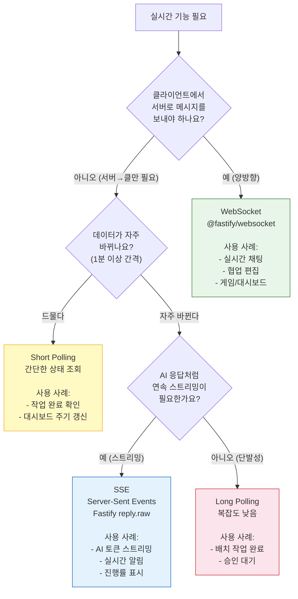
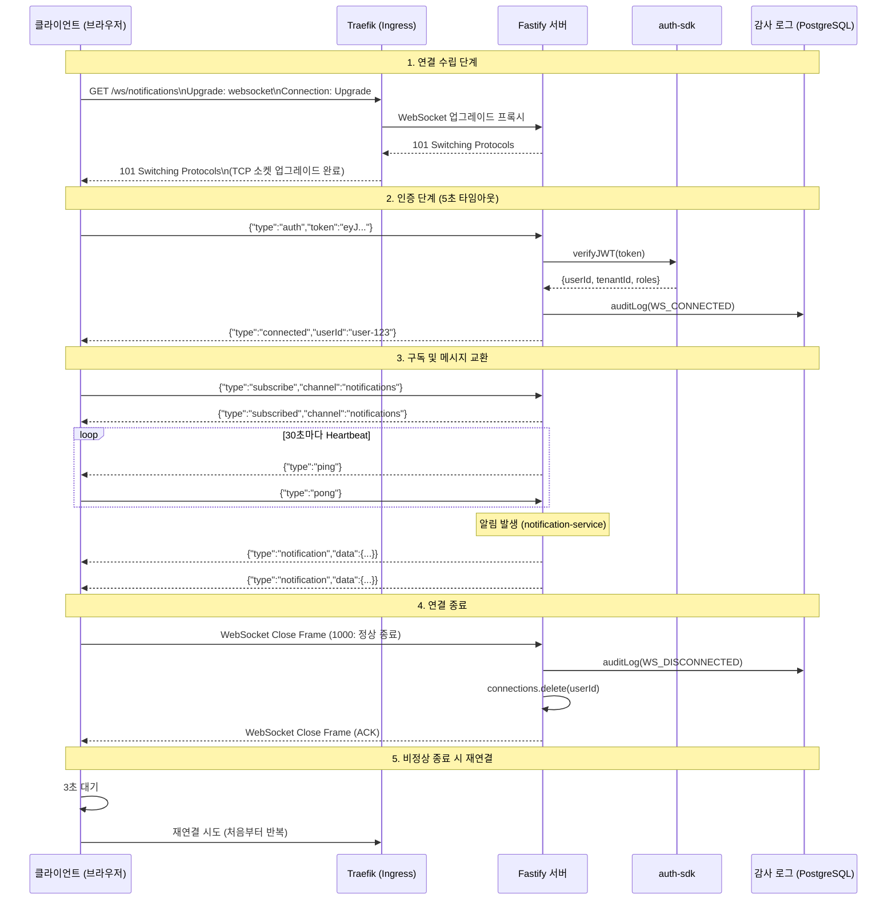

# WebSocket 및 실시간 기능 개발 가이드

> **문서 ID**: ONBOARD-03-23
> **버전**: 1.0.0 | **작성일**: 2026-04-12 | **대상**: 백엔드/프런트엔드 개발자
> **선행 학습**: `17-async-patterns.md` (비동기 기초), `15-redis-patterns.md` (Redis 기초), `02-service-development.md`
> **실제 코드 위치**: `platform/services/ai-service/src/handlers/ai-stream.handler.ts`, `platform/services/ai-service/src/lib/ai-streaming.ts`, `platform/services/ai-service/src/lib/streaming-handler.ts`
> **CSAP 매핑**: D-06 (감사 로그), D-08 (접근 통제), D-12 (시스템 개발 보안)

---

## 목차

1. [실시간 통신 방법 비교](#1-실시간-통신-방법-비교)
2. [SSE 구현 — Fastify 기반](#2-sse-구현--fastify-기반)
3. [WebSocket 구현 — Fastify 기반](#3-websocket-구현--fastify-기반)
4. [WebSocket 연결 생명주기](#4-websocket-연결-생명주기)
5. [실시간 기능 보안](#5-실시간-기능-보안)
6. [프런트엔드 연동 — Next.js](#6-프런트엔드-연동--nextjs)
7. [트러블슈팅](#7-트러블슈팅)

---

## 1. 실시간 통신 방법 비교

### 1.1 네 가지 방법의 특성

실시간 데이터 전달에는 여러 방법이 있습니다. 각 방법은 서버-클라이언트 통신 방향과 연결 유지 여부에서 차이가 있습니다.

| 방법 | 방향 | 연결 | 프로토콜 | 브라우저 지원 |
|------|------|------|---------|------------|
| **Short Polling** | 클↔서 | 반복 HTTP | HTTP/1.1 | 모든 브라우저 |
| **Long Polling** | 클↔서 | 장시간 HTTP | HTTP/1.1 | 모든 브라우저 |
| **SSE** | 서→클 (단방향) | 지속 HTTP | HTTP/1.1, HTTP/2 | 모든 현대 브라우저 |
| **WebSocket** | 클↔서 (양방향) | 전이중 TCP | WS/WSS | 모든 현대 브라우저 |

**Short Polling**: 클라이언트가 일정 간격으로 서버에 요청을 보냅니다. 구현이 단순하지만 불필요한 요청이 많습니다.

```
클라이언트: "새 알림 있어요?" (1초마다)
서버: "없어요." / "없어요." / "이번엔 있어요!" (응답)
```

**Long Polling**: 서버가 데이터가 생길 때까지 응답을 보류합니다. 데이터 발생 즉시 응답하고, 클라이언트가 다시 요청합니다.

```
클라이언트: "새 알림 있으면 알려줘요." (연결 유지)
서버: (30초 대기 후) "이번엔 있어요!" (응답)
클라이언트: 즉시 다시 연결
```

**SSE**: 서버가 클라이언트에게 일방향으로 데이터를 밀어넣습니다. HTTP 연결 하나에서 여러 이벤트를 순차 전송합니다.

```
클라이언트: "연결할게요. 이벤트 스트림 열어주세요."
서버: "token:안" → "token:녕" → "token:하세요" → "done"
```

**WebSocket**: 양방향 전이중 통신입니다. HTTP 핸드셰이크 후 TCP 소켓으로 업그레이드됩니다.

```
클라이언트: "채팅 채널 구독할게요." (연결 후 유지)
서버: "A님이 메시지를 보냈습니다."
클라이언트: "B님에게 응답 보낼게요."
서버: "B님이 메시지를 받았습니다."
```

### 1.2 우리 프로젝트에서의 선택 기준



**우리 프로젝트 결정**:
- **AI 토큰 스트리밍** → SSE (`ai-stream.handler.ts`에서 구현)
- **실시간 알림** → SSE 또는 Polling (notification-service)
- **채팅/협업** → WebSocket (향후 확장)

### 1.3 보안 고려사항

| 방법 | 주요 보안 위협 | 대응 방법 |
|------|------------|---------|
| SSE | 인증 토큰 탈취, 정보 누출 | Authorization 헤더 또는 쿼리 파라미터 JWT 검증 |
| WebSocket | CSRF, 메시지 인젝션 | Origin 검증, JWT 핸드셰이크, 메시지 Zod 검증 |
| Long Polling | DDoS (연결 점유) | Rate Limiting, 연결 타임아웃 강제 |

---

## 2. SSE 구현 — Fastify 기반

### 2.1 SSE 프로토콜 기초

SSE는 `text/event-stream` Content-Type을 사용하는 HTTP 응답입니다. 형식은 다음과 같습니다.

```
event: token
data: {"delta":"안","index":0}

event: token
data: {"delta":"녕","index":1}

event: done
data: {"finishReason":"stop","totalTokens":412}

```

각 이벤트는 `\n\n`(빈 줄 2개)으로 구분됩니다. `event:` 필드로 이벤트 유형을 지정하고, `data:` 필드에 JSON 데이터를 담습니다.

### 2.2 실제 ai-service SSE 구현 분석

`platform/services/ai-service/src/handlers/ai-stream.handler.ts`의 실제 구현입니다.

```typescript
// ai-stream.handler.ts — POST /ai/chat/stream
// Design Ref: SVC-AI-R3 DESIGN §1 FR-AI-R3.1
// CSAP: N2SF N-05 (C/S등급 차단), D-06 (감사 로그), D-08 (인증), D-12 (입력 검증)

import type { FastifyRequest, FastifyReply } from 'fastify';
import { z } from 'zod';

// 1. 입력 스키마 검증 (CSAP D-12)
const chatStreamSchema = z.object({
  modelId: z.string().min(1),
  tenantId: z.string().min(1),
  message: z.string().min(1).max(8192),
  grade: z.enum(['O', 'S', 'C']),       // N2SF 데이터 등급
  systemPrompt: z.string().max(2048).optional(),
});

export async function chatStreamHandler(
  request: FastifyRequest,
  reply: FastifyReply
): Promise<void> {
  const parseResult = chatStreamSchema.safeParse(request.body);
  if (!parseResult.success) {
    await reply.status(400).send({ success: false, error: { code: 'VALIDATION_ERROR' } });
    return;
  }

  const { grade } = parseResult.data;

  // 2. N2SF N-05: C/S 등급 차단
  if (grade === 'C' || grade === 'S') {
    await logAiEvent('AI_GRADE_VIOLATION', ...);
    await reply.status(403).send({
      error: { code: 'GRADE_VIOLATION', message: `${grade}등급 데이터는 AI API 전송 불가` }
    });
    return;
  }

  // 3. SSE 헤더 설정 (핵심)
  reply.raw.setHeader('Content-Type', 'text/event-stream; charset=utf-8');
  reply.raw.setHeader('Cache-Control', 'no-cache, no-transform');
  reply.raw.setHeader('Connection', 'keep-alive');
  reply.raw.setHeader('X-Accel-Buffering', 'no'); // Nginx 프록시 버퍼링 비활성화
  reply.raw.flushHeaders();                        // 헤더 즉시 전송

  // 4. 스트리밍 루프
  for await (const chunk of provider.chatStream(messages)) {
    if (chunk.done) break;

    // PII 마스킹 후 전송 (N2SF N-05)
    const safeText = maskPII(chunk.text);
    reply.raw.write(`data: ${JSON.stringify({ text: safeText })}\n\n`);
  }

  // 5. 완료 이벤트
  reply.raw.write(`data: ${JSON.stringify({ done: true, tokens: totalTokens })}\n\n`);
  reply.raw.write('data: [DONE]\n\n');
  reply.raw.end();
}
```

**핵심 이해 포인트**:
- `reply.raw`를 사용해 Fastify의 JSON 직렬화를 우회합니다.
- `flushHeaders()`는 헤더를 즉시 전송합니다. 이것이 없으면 첫 토큰이 늦게 도착합니다.
- `X-Accel-Buffering: no`는 Nginx가 SSE 응답을 버퍼링하지 않도록 지시합니다.

### 2.3 고급 SSE — ai-streaming.ts 코어 분석

`platform/services/ai-service/src/lib/ai-streaming.ts`는 ReadableStream 기반의 더 정교한 SSE 구현입니다.

```typescript
// SSE 이벤트 타입 시스템 (실제 코드)
export type SSEEvent =
  | { type: 'token'; data: SSETokenEvent }    // 각 토큰 전달
  | { type: 'usage'; data: SSEUsageEvent }    // 완료 시 사용량 요약
  | { type: 'done'; data: SSEDoneEvent }      // 정상 종료
  | { type: 'error'; data: SSEErrorEvent }    // 오류 발생
  | { type: 'ping'; data: Record<string, never> }; // 연결 유지 heartbeat

// SSE 이벤트 직렬화 형식
// "event: token\ndata: {"delta":"안","index":0}\n\n"
export function encodeSSEEvent(event: SSEEvent): Uint8Array {
  const line = `event: ${event.type}\ndata: ${JSON.stringify(event.data)}\n\n`;
  return new TextEncoder().encode(line);
}

// 스트리밍 설정 기본값
const DEFAULT_CONFIG = {
  heartbeatIntervalMs: 30_000,   // 30초마다 ping (연결 유지)
  maxStreamTimeoutMs: 300_000,   // 5분 최대 스트림 시간
  maxBufferBytes: 2 * 1024 * 1024, // 2MB 버퍼 한도
  tokenLimit: 0,                 // 0 = 무제한
  enablePIIMasking: true,        // PII 마스킹 기본 활성화
};
```

### 2.4 인증이 있는 SSE 설정

`platform/services/ai-service/src/lib/streaming-handler.ts`에서 JWT 인증 패턴을 확인할 수 있습니다.

```typescript
// streaming-handler.ts — JWT 검증 포함 SSE 핸들러
// Design Ref: SVC-AI-ADV-R6 DESIGN §7
// CSAP: D-08 접근 통제

import { createStreamingHandler } from './streaming-handler.js';

// 핸들러 팩토리 사용
const handler = createStreamingHandler({
  // JWT 검증 함수 (실제 구현은 auth-sdk 사용)
  verifyToken: async (authHeader: string | null) => {
    if (!authHeader?.startsWith('Bearer ')) return null;
    const token = authHeader.slice(7);

    try {
      const payload = await verifyJWT(token, process.env['JWT_PUBLIC_KEY']!);
      return {
        userId: payload.sub,
        tenantId: payload.tenantId,
        roles: payload.roles,
      };
    } catch {
      return null; // 검증 실패 → null 반환 → 401 응답
    }
  },

  // 권한 검사 함수
  checkPermission: (user, permission) => {
    // 'ai:stream' 권한이 있는 ROLE_AI_USER 이상만 허용
    return user.roles.includes('ROLE_AI_USER') || user.roles.includes('ROLE_ADMIN');
  },
});

// 처리 흐름:
// 1. JWT 인증 검증 (D-08) → 401
// 2. 'ai:stream' 권한 확인 (D-08) → 403
// 3. Zod 입력 검증 (D-12) → 400
// 4. 사용량 한도 확인 → 429
// 5. PII 마스킹 (N2SF N-05)
// 6. SSE 스트림 생성 및 응답
// 7. 감사 로그 기록 (D-06)
```

### 2.5 SSE 재연결 처리

SSE는 연결이 끊어지면 브라우저가 자동으로 재연결을 시도합니다. 서버에서 `id:` 필드를 제공하면 클라이언트가 마지막으로 받은 이벤트 ID를 `Last-Event-ID` 헤더로 전송합니다.

```typescript
// 서버: 이벤트 ID 포함 SSE
let eventId = 0;

function writeSSEEvent(
  reply: FastifyReply,
  type: string,
  data: unknown,
): void {
  reply.raw.write(`id: ${++eventId}\n`);
  reply.raw.write(`event: ${type}\n`);
  reply.raw.write(`data: ${JSON.stringify(data)}\n\n`);
}

// 재연결 간격 설정 (밀리초)
function writeRetryHeader(reply: FastifyReply, retryMs: number): void {
  reply.raw.write(`retry: ${retryMs}\n\n`);
}

// 라우트에서 Last-Event-ID 처리
app.get('/events', async (request, reply) => {
  const lastEventId = request.headers['last-event-id'];
  if (lastEventId) {
    // 마지막 이벤트 이후의 데이터부터 재전송
    const missedEvents = await getMissedEvents(parseInt(lastEventId));
    for (const event of missedEvents) {
      writeSSEEvent(reply, event.type, event.data);
    }
  }

  // 재연결 간격: 3초
  writeRetryHeader(reply, 3000);

  // ... 이후 스트리밍 계속
});
```

### 2.6 N2SF: SSE 스트림에서 C/S 등급 데이터 제외

```typescript
// SSE 응답에서 데이터 등급 검증 패턴
// N2SF N-05 준수

async function* filterStreamByGrade(
  sourceStream: AsyncIterable<{ text: string; metadata?: Record<string, unknown> }>,
  grade: 'O' | 'S' | 'C',
): AsyncGenerator<string> {
  if (grade === 'C' || grade === 'S') {
    // C/S 등급 스트림 자체를 시작하지 않음
    throw new Error(`BLOCKED: ${grade}등급 데이터 스트리밍 불가 (N2SF N-05)`);
  }

  for await (const chunk of sourceStream) {
    // O 등급도 PII가 포함될 수 있으므로 마스킹 필수
    const maskedText = maskPII(chunk.text);
    yield maskedText;
  }
}

// SSE 핸들러에서 적용
for await (const text of filterStreamByGrade(llmStream, grade)) {
  reply.raw.write(`data: ${JSON.stringify({ delta: text })}\n\n`);
}
```

---

## 3. WebSocket 구현 — Fastify 기반

### 3.1 @fastify/websocket 플러그인 설정

```typescript
// platform/services/notification-service/src/index.ts (WebSocket 확장 예시)
// @fastify/websocket 플러그인으로 WebSocket 지원 추가

import Fastify from 'fastify';
import websocketPlugin from '@fastify/websocket';

const app = Fastify({ logger: true });

// WebSocket 플러그인 등록
await app.register(websocketPlugin, {
  options: {
    maxPayload: 64 * 1024,    // 최대 메시지 크기 64KB (DoS 방지)
    clientTracking: false,    // 직접 클라이언트 추적 (Map 사용)
  },
});

// WebSocket 라우트 등록 (기본 패턴)
app.get('/ws/notifications', { websocket: true }, (socket, request) => {
  // socket: WebSocket 인스턴스
  // request: FastifyRequest (JWT 등 헤더 접근 가능)

  socket.on('message', (data) => {
    const message = data.toString();
    console.log('수신:', message);
    socket.send(JSON.stringify({ echo: message }));
  });

  socket.on('close', () => {
    console.log('연결 종료');
  });

  socket.on('error', (err) => {
    console.error('WebSocket 오류:', err.message);
  });
});
```

### 3.2 인증된 WebSocket 연결 — JWT 핸드셰이크

WebSocket은 일반 HTTP 헤더를 지원하지만, 브라우저의 `WebSocket` API는 `Authorization` 헤더를 직접 설정할 수 없습니다. 대신 다음 두 가지 방법을 사용합니다.

**방법 A**: 첫 연결 시 쿼리 파라미터로 토큰 전달 (간단하지만 로그에 노출 위험)

```typescript
// 서버
app.get('/ws/chat', { websocket: true }, async (socket, request) => {
  // 쿼리 파라미터에서 토큰 추출
  const token = (request.query as { token?: string }).token;
  if (!token) {
    socket.close(1008, '인증 필요'); // 1008: Policy Violation
    return;
  }

  const user = await verifyJWT(token);
  if (!user) {
    socket.close(1008, '유효하지 않은 토큰');
    return;
  }

  // 인증 완료 후 연결 유지
  socket.send(JSON.stringify({ type: 'connected', userId: user.id }));
});
```

**방법 B**: 연결 직후 첫 메시지로 토큰 전달 (권장 — 토큰이 URL에 노출되지 않음)

```typescript
// 서버 — 권장 패턴
app.get('/ws/notifications', { websocket: true }, async (socket, request) => {
  let authenticatedUser: AuthUser | null = null;
  let authTimeout: NodeJS.Timeout;

  // 연결 후 5초 이내에 인증 메시지가 없으면 종료
  authTimeout = setTimeout(() => {
    if (!authenticatedUser) {
      socket.close(1008, '인증 타임아웃');
    }
  }, 5000);

  socket.on('message', async (data) => {
    const message = JSON.parse(data.toString());

    // 첫 메시지는 반드시 auth 타입이어야 함
    if (!authenticatedUser) {
      if (message.type !== 'auth') {
        socket.close(1008, '첫 메시지는 auth 타입이어야 합니다');
        return;
      }

      const user = await verifyJWT(message.token);
      if (!user) {
        socket.close(1008, '유효하지 않은 토큰');
        return;
      }

      clearTimeout(authTimeout);
      authenticatedUser = user;
      socket.send(JSON.stringify({ type: 'auth_success', userId: user.id }));
      return;
    }

    // 인증 이후의 메시지 처리
    await handleAuthenticatedMessage(socket, authenticatedUser, message);
  });
});
```

### 3.3 멀티테넌시 WebSocket 격리

공공기관 SaaS에서는 테넌트 간 메시지 격리가 필수입니다. Map 기반 연결 관리로 테넌트별 클라이언트를 격리합니다.

```typescript
// WebSocket 연결 관리자 — 테넌트 격리
// CSAP: D-08 (접근 통제), 멀티테넌시 격리

interface AuthenticatedSocket {
  socket: WebSocket;
  userId: string;
  tenantId: string;
  connectedAt: Date;
}

// 테넌트별 WebSocket 연결 맵
// Map<tenantId, Map<userId, AuthenticatedSocket>>
const tenantConnections = new Map<string, Map<string, AuthenticatedSocket>>();

function registerConnection(conn: AuthenticatedSocket): void {
  const { tenantId, userId } = conn;

  if (!tenantConnections.has(tenantId)) {
    tenantConnections.set(tenantId, new Map());
  }

  tenantConnections.get(tenantId)!.set(userId, conn);
}

function removeConnection(tenantId: string, userId: string): void {
  tenantConnections.get(tenantId)?.delete(userId);
  if (tenantConnections.get(tenantId)?.size === 0) {
    tenantConnections.delete(tenantId);
  }
}

// 테넌트 내 특정 사용자에게 메시지 전송 (타 테넌트 접근 불가)
function sendToUser(tenantId: string, userId: string, message: unknown): boolean {
  const conn = tenantConnections.get(tenantId)?.get(userId);
  if (!conn || conn.socket.readyState !== WebSocket.OPEN) return false;

  conn.socket.send(JSON.stringify(message));
  return true;
}

// 테넌트 전체 브로드캐스트
function broadcastToTenant(tenantId: string, message: unknown): number {
  const connections = tenantConnections.get(tenantId);
  if (!connections) return 0;

  let sent = 0;
  for (const conn of connections.values()) {
    if (conn.socket.readyState === WebSocket.OPEN) {
      conn.socket.send(JSON.stringify(message));
      sent++;
    }
  }
  return sent;
}
```

### 3.4 메시지 타입 시스템 — Zod 검증

모든 WebSocket 메시지는 Zod로 검증합니다.

```typescript
// WebSocket 메시지 타입 시스템 (CSAP D-12 — 입력 검증)
import { z } from 'zod';

// 클라이언트 → 서버 메시지 스키마
const ClientMessageSchema = z.discriminatedUnion('type', [
  z.object({
    type: z.literal('auth'),
    token: z.string().min(1),
  }),
  z.object({
    type: z.literal('subscribe'),
    channel: z.enum(['notifications', 'system', 'ai-status']),
  }),
  z.object({
    type: z.literal('unsubscribe'),
    channel: z.enum(['notifications', 'system', 'ai-status']),
  }),
  z.object({
    type: z.literal('ping'),
  }),
]);

type ClientMessage = z.infer<typeof ClientMessageSchema>;

// 서버 → 클라이언트 메시지 타입
interface ServerMessage {
  type: 'notification' | 'system' | 'ai-status' | 'pong' | 'error';
  data: unknown;
  timestamp: string;
}

// 메시지 처리
socket.on('message', async (rawData) => {
  let message: ClientMessage;

  try {
    const parsed = JSON.parse(rawData.toString());
    message = ClientMessageSchema.parse(parsed); // 검증 실패 시 ZodError
  } catch (err) {
    socket.send(JSON.stringify({
      type: 'error',
      data: { code: 'INVALID_MESSAGE', message: '메시지 형식이 올바르지 않습니다' },
      timestamp: new Date().toISOString(),
    }));
    return;
  }

  // 타입별 처리
  switch (message.type) {
    case 'subscribe':
      await handleSubscribe(socket, user, message.channel);
      break;
    case 'ping':
      socket.send(JSON.stringify({ type: 'pong', data: {}, timestamp: new Date().toISOString() }));
      break;
  }
});
```

### 3.5 완전한 알림 WebSocket 구현 예시

```typescript
// src/handlers/websocket-notification.handler.ts
// 실시간 알림 WebSocket 서버 — 멀티테넌시 격리 + JWT 인증
// CSAP: D-06, D-08, D-12

import type { FastifyInstance } from 'fastify';
import type { WebSocket } from '@fastify/websocket';
import { z } from 'zod';
import { auditLog } from '@public-saas/audit-sdk';
import { hasPermission } from '@public-saas/rbac';

export async function registerWebSocketRoutes(app: FastifyInstance): Promise<void> {
  // 연결 관리 Map
  const connections = new Map<string, Map<string, WebSocket>>();

  app.get('/ws/notifications', { websocket: true }, async (socket, request) => {
    let userId: string | null = null;
    let tenantId: string | null = null;

    // 인증 타임아웃 (5초)
    const authTimeout = setTimeout(() => {
      socket.close(1008, '인증 타임아웃');
    }, 5000);

    socket.on('message', async (rawData) => {
      try {
        const data = JSON.parse(rawData.toString());

        // 미인증 상태: auth 메시지만 허용
        if (!userId) {
          if (data.type !== 'auth') {
            socket.close(1008, 'auth 메시지 필요');
            return;
          }

          const user = await verifyJWT(data.token);
          if (!user) {
            socket.close(1008, '유효하지 않은 토큰');
            return;
          }

          if (!hasPermission(user, 'notification:read')) {
            socket.close(1008, '권한 없음');
            return;
          }

          clearTimeout(authTimeout);
          userId = user.id;
          tenantId = user.tenantId;

          // 연결 등록
          if (!connections.has(tenantId)) connections.set(tenantId, new Map());
          connections.get(tenantId)!.set(userId, socket);

          // 감사 로그 (CSAP D-06)
          await auditLog({
            actor: userId,
            action: 'WS_CONNECTED',
            target: 'notification-channel',
            timestamp: new Date().toISOString(),
            ip: request.ip,
          });

          socket.send(JSON.stringify({ type: 'connected', userId }));
          return;
        }

        // 인증 후: ping/pong만 허용 (서버 푸시 전용 채널)
        if (data.type === 'ping') {
          socket.send(JSON.stringify({ type: 'pong' }));
        }

      } catch {
        socket.send(JSON.stringify({ type: 'error', code: 'INVALID_MESSAGE' }));
      }
    });

    socket.on('close', async () => {
      if (userId && tenantId) {
        connections.get(tenantId)?.delete(userId);
        await auditLog({
          actor: userId,
          action: 'WS_DISCONNECTED',
          target: 'notification-channel',
          timestamp: new Date().toISOString(),
          ip: request.ip,
        });
      }
    });
  });

  // 알림 발행 API (내부 서비스에서 호출)
  app.post('/internal/ws/push', async (request, reply) => {
    const { tenantId, userId, message } = request.body as {
      tenantId: string;
      userId?: string;
      message: { type: string; data: unknown };
    };

    const payload = JSON.stringify({ ...message, timestamp: new Date().toISOString() });

    if (userId) {
      // 특정 사용자에게 전송
      connections.get(tenantId)?.get(userId)?.send(payload);
    } else {
      // 테넌트 전체 브로드캐스트
      for (const socket of connections.get(tenantId)?.values() ?? []) {
        if (socket.readyState === socket.OPEN) {
          socket.send(payload);
        }
      }
    }

    await reply.status(200).send({ success: true });
  });
}
```

---

## 4. WebSocket 연결 생명주기



---

## 5. 실시간 기능 보안

### 5.1 WebSocket DoS 방지 (Rate Limiting)

```typescript
// WebSocket 연결 및 메시지 Rate Limiting
// CSAP: D-08 (접근 통제), D-12 (시스템 개발 보안)

import { createRateLimiter } from '@public-saas/rate-limit';

// IP별 WebSocket 연결 수 제한
const wsConnectionLimiter = createRateLimiter(10, 60, 'rl:ws:connect'); // 분당 10회

// 메시지별 Rate Limiting (메시지 폭발 방지)
const MESSAGE_RATE_LIMIT = {
  maxMessages: 100,   // 분당 100개
  windowMs: 60_000,
};

const messageCounters = new Map<string, { count: number; resetAt: number }>();

function checkMessageRateLimit(userId: string): boolean {
  const now = Date.now();
  const counter = messageCounters.get(userId);

  if (!counter || now > counter.resetAt) {
    messageCounters.set(userId, {
      count: 1,
      resetAt: now + MESSAGE_RATE_LIMIT.windowMs,
    });
    return true;
  }

  if (counter.count >= MESSAGE_RATE_LIMIT.maxMessages) {
    return false; // 한도 초과
  }

  counter.count++;
  return true;
}

// WebSocket 핸들러에서 적용
socket.on('message', async (data) => {
  if (!checkMessageRateLimit(userId)) {
    socket.send(JSON.stringify({
      type: 'error',
      code: 'RATE_LIMITED',
      message: '메시지 한도를 초과했습니다. 잠시 후 다시 시도하십시오.',
    }));
    return;
  }
  // ... 메시지 처리
});
```

### 5.2 메시지 크기 제한

```typescript
// @fastify/websocket 플러그인 설정에서 최대 메시지 크기 제한
await app.register(websocketPlugin, {
  options: {
    maxPayload: 64 * 1024,    // 64KB — 초과 시 연결 강제 종료
  },
});

// 핸들러에서 추가 검증
socket.on('message', (data) => {
  // Buffer 크기 재확인 (방어적 프로그래밍)
  if (data.length > 64 * 1024) {
    socket.close(1009, '메시지 크기 초과'); // 1009: Message Too Big
    return;
  }
});
```

### 5.3 감사 로그 — 실시간 이벤트 (CSAP D-06)

```typescript
// 실시간 이벤트의 감사 로그 기록
// CSAP D-06: 모든 민감 작업 전수 기록
// append-only 구조 (수정/삭제 불가)

import { auditLog } from '@public-saas/audit-sdk';

// WebSocket 이벤트 감사 항목
const WS_AUDIT_ACTIONS = {
  CONNECTED: 'WS_CONNECTED',
  DISCONNECTED: 'WS_DISCONNECTED',
  AUTH_FAILED: 'WS_AUTH_FAILED',
  MESSAGE_RECEIVED: 'WS_MESSAGE_RECEIVED',
  RATE_LIMITED: 'WS_RATE_LIMITED',
  BROADCAST_SENT: 'WS_BROADCAST_SENT',
} as const;

// 모든 연결/해제/오류에 감사 로그 필수
socket.on('close', async (code, reason) => {
  await auditLog({
    actor: userId ?? 'anonymous',
    action: WS_AUDIT_ACTIONS.DISCONNECTED,
    target: 'ws:notifications',
    timestamp: new Date().toISOString(),
    ip: request.ip,
    metadata: {
      code,
      reason: reason.toString(),
      sessionDurationMs: Date.now() - connectedAt,
    },
  });
});

// SSE 이벤트도 감사 로그 필수 (ai-streaming.ts의 실제 구현)
// onComplete 콜백에서 감사 로그 기록
const streamOptions = {
  onComplete: (usage: SSEUsageEvent, finishReason: string) => {
    logAiEvent(
      'AI_STREAM_COMPLETE',
      user.userId,
      requestId,
      user.tenantId,
      'streaming-handler',
      'unknown',
      { finishReason, totalTokens: usage.totalTokens },
    );
  },
  onError: (error: SSEErrorEvent) => {
    logAiEvent('AI_STREAM_ERROR', user.userId, requestId, user.tenantId, ...);
  },
};
```

### 5.4 Linkerd mTLS와 WebSocket

우리 프로젝트는 서비스 메시(Linkerd)를 사용합니다. WebSocket도 Linkerd mTLS로 자동 암호화됩니다.

```yaml
# k8s/notification-service/deployment.yaml
apiVersion: apps/v1
kind: Deployment
metadata:
  name: notification-service
  annotations:
    # Linkerd 자동 mTLS 활성화 — WebSocket 포함
    linkerd.io/inject: enabled
spec:
  template:
    metadata:
      annotations:
        linkerd.io/inject: enabled
        # WebSocket 업그레이드 지원
        config.linkerd.io/skip-outbound-ports: ""
```

```yaml
# k8s/traefik/ingressroute.yaml — WebSocket 업스트림 설정
apiVersion: traefik.io/v1alpha1
kind: IngressRoute
metadata:
  name: notification-ws
spec:
  entryPoints:
    - websecure
  routes:
    - match: PathPrefix(`/ws/`)
      kind: Rule
      services:
        - name: notification-service
          port: 3000
          # Traefik은 WebSocket을 자동 감지하여 프록시함
          # sticky: session (WebSocket은 항상 같은 파드로 라우팅)
```

---

## 6. 프런트엔드 연동 — Next.js

### 6.1 React에서 SSE 수신 — AI 스트리밍 예시

```typescript
// platform/apps/portal/src/components/ai/AIChatStream.tsx
'use client'; // Client Component 필수 (브라우저 API 사용)

import { useState, useEffect, useCallback, useRef } from 'react';

interface AIChatStreamProps {
  modelId: string;
  tenantId: string;
}

export function AIChatStream({ modelId, tenantId }: AIChatStreamProps) {
  const [message, setMessage] = useState('');
  const [streamedText, setStreamedText] = useState('');
  const [isStreaming, setIsStreaming] = useState(false);
  const [error, setError] = useState<string | null>(null);
  const abortControllerRef = useRef<AbortController | null>(null);

  const startStream = useCallback(async () => {
    if (!message.trim()) return;

    setIsStreaming(true);
    setStreamedText('');
    setError(null);

    // 이전 스트림 취소
    abortControllerRef.current?.abort();
    abortControllerRef.current = new AbortController();

    try {
      const response = await fetch('/api/ai/chat/stream', {
        method: 'POST',
        headers: {
          'Content-Type': 'application/json',
          'Authorization': `Bearer ${getAuthToken()}`,
        },
        body: JSON.stringify({
          modelId,
          tenantId,
          message,
          grade: 'O', // N2SF: O등급만 허용
        }),
        signal: abortControllerRef.current.signal,
      });

      if (!response.ok) {
        throw new Error(`오류: ${response.status}`);
      }

      // ReadableStream으로 SSE 수신
      const reader = response.body?.getReader();
      const decoder = new TextDecoder();

      while (reader) {
        const { done, value } = await reader.read();
        if (done) break;

        const text = decoder.decode(value, { stream: true });
        const lines = text.split('\n');

        for (const line of lines) {
          if (!line.startsWith('data: ')) continue;

          const data = line.slice(6).trim();
          if (data === '[DONE]') {
            setIsStreaming(false);
            break;
          }

          try {
            const parsed = JSON.parse(data);
            if (parsed.text) {
              setStreamedText(prev => prev + parsed.text);
            }
            if (parsed.done) {
              setIsStreaming(false);
            }
            if (parsed.error) {
              setError(parsed.error);
              setIsStreaming(false);
            }
          } catch {
            // JSON 파싱 실패 무시
          }
        }
      }
    } catch (err) {
      if (err instanceof Error && err.name === 'AbortError') {
        // 사용자가 취소한 경우
        setStreamedText(prev => prev + ' [취소됨]');
      } else {
        setError(err instanceof Error ? err.message : '알 수 없는 오류');
      }
      setIsStreaming(false);
    }
  }, [message, modelId, tenantId]);

  // 컴포넌트 언마운트 시 스트림 취소
  useEffect(() => {
    return () => {
      abortControllerRef.current?.abort();
    };
  }, []);

  return (
    <div className="flex flex-col gap-4">
      <textarea
        value={message}
        onChange={e => setMessage(e.target.value)}
        placeholder="질문을 입력하세요 (O등급 데이터만)"
        rows={4}
        className="border rounded p-2"
        disabled={isStreaming}
      />
      <div className="flex gap-2">
        <button
          onClick={startStream}
          disabled={isStreaming || !message.trim()}
          className="bg-blue-600 text-white px-4 py-2 rounded disabled:opacity-50"
        >
          {isStreaming ? '생성 중...' : '전송'}
        </button>
        {isStreaming && (
          <button
            onClick={() => abortControllerRef.current?.abort()}
            className="bg-red-500 text-white px-4 py-2 rounded"
          >
            중단
          </button>
        )}
      </div>
      {error && (
        <div className="text-red-600 bg-red-50 p-2 rounded">오류: {error}</div>
      )}
      {streamedText && (
        <div className="bg-gray-50 p-4 rounded whitespace-pre-wrap">
          {streamedText}
          {isStreaming && <span className="animate-pulse">|</span>}
        </div>
      )}
    </div>
  );
}
```

### 6.2 React에서 WebSocket 연결 — 실시간 알림

```typescript
// platform/apps/portal/src/hooks/useWebSocketNotifications.ts
'use client';

import { useState, useEffect, useRef, useCallback } from 'react';

interface Notification {
  id: string;
  type: string;
  message: string;
  timestamp: string;
}

interface UseWebSocketNotificationsOptions {
  tenantId: string;
  getAuthToken: () => string;
}

export function useWebSocketNotifications({
  tenantId,
  getAuthToken,
}: UseWebSocketNotificationsOptions) {
  const [notifications, setNotifications] = useState<Notification[]>([]);
  const [connectionStatus, setConnectionStatus] = useState<
    'connecting' | 'connected' | 'disconnected' | 'error'
  >('disconnected');
  const wsRef = useRef<WebSocket | null>(null);
  const reconnectTimerRef = useRef<NodeJS.Timeout | null>(null);
  const reconnectAttempts = useRef(0);

  const connect = useCallback(() => {
    if (wsRef.current?.readyState === WebSocket.OPEN) return;

    setConnectionStatus('connecting');

    // WSS 연결 (TLS 1.3 — CSAP D-09)
    const protocol = window.location.protocol === 'https:' ? 'wss:' : 'ws:';
    const ws = new WebSocket(`${protocol}//${window.location.host}/ws/notifications`);

    ws.onopen = () => {
      reconnectAttempts.current = 0;
      // 연결 후 즉시 JWT 토큰 전송 (인증)
      ws.send(JSON.stringify({
        type: 'auth',
        token: getAuthToken(),
      }));
    };

    ws.onmessage = (event) => {
      try {
        const data = JSON.parse(event.data);

        switch (data.type) {
          case 'connected':
            setConnectionStatus('connected');
            // 채널 구독
            ws.send(JSON.stringify({ type: 'subscribe', channel: 'notifications' }));
            break;

          case 'notification':
            setNotifications(prev => [
              { ...data.data, id: crypto.randomUUID() },
              ...prev.slice(0, 49), // 최대 50개 유지
            ]);
            break;

          case 'ping':
            ws.send(JSON.stringify({ type: 'pong' }));
            break;

          case 'error':
            console.error('WebSocket 오류:', data.code, data.message);
            break;
        }
      } catch {
        console.error('메시지 파싱 오류');
      }
    };

    ws.onclose = (event) => {
      setConnectionStatus('disconnected');
      wsRef.current = null;

      // 비정상 종료 시 지수 백오프 재연결
      if (event.code !== 1000) { // 1000: 정상 종료
        const delay = Math.min(1000 * 2 ** reconnectAttempts.current, 30000);
        reconnectAttempts.current++;
        reconnectTimerRef.current = setTimeout(connect, delay);
      }
    };

    ws.onerror = () => {
      setConnectionStatus('error');
    };

    wsRef.current = ws;
  }, [getAuthToken]);

  useEffect(() => {
    connect();

    return () => {
      reconnectTimerRef.current && clearTimeout(reconnectTimerRef.current);
      wsRef.current?.close(1000, '컴포넌트 언마운트');
    };
  }, [connect]);

  const dismissNotification = useCallback((id: string) => {
    setNotifications(prev => prev.filter(n => n.id !== id));
  }, []);

  return { notifications, connectionStatus, dismissNotification };
}
```

### 6.3 연결 상태 표시 UI 컴포넌트

```typescript
// platform/apps/portal/src/components/common/ConnectionStatus.tsx
'use client';

interface ConnectionStatusProps {
  status: 'connecting' | 'connected' | 'disconnected' | 'error';
}

export function ConnectionStatus({ status }: ConnectionStatusProps) {
  const config = {
    connecting: { color: 'bg-yellow-400', label: '연결 중...', pulse: true },
    connected:  { color: 'bg-green-500',  label: '실시간 연결됨', pulse: false },
    disconnected: { color: 'bg-gray-400', label: '오프라인', pulse: false },
    error:      { color: 'bg-red-500',    label: '연결 오류', pulse: false },
  };

  const { color, label, pulse } = config[status];

  return (
    <div className="flex items-center gap-2 text-sm text-gray-600">
      <span
        className={`w-2 h-2 rounded-full ${color} ${pulse ? 'animate-pulse' : ''}`}
        aria-label={label}
      />
      <span>{label}</span>
    </div>
  );
}

// 알림 센터 컴포넌트
// platform/apps/portal/src/components/ai/AINotificationCenter.tsx 참조
```

---

## 7. 트러블슈팅

### 7.1 WebSocket 502 오류 — Traefik 설정

**증상**: WebSocket 연결 시 즉시 502 Bad Gateway 응답

**원인**: Traefik이 WebSocket 업그레이드 요청을 일반 HTTP로 처리하거나, 타임아웃 설정이 짧은 경우

**해결**:

```yaml
# k8s/traefik/middleware.yaml — WebSocket 타임아웃 설정
apiVersion: traefik.io/v1alpha1
kind: Middleware
metadata:
  name: websocket-headers
spec:
  headers:
    customRequestHeaders:
      Upgrade: websocket
      Connection: Upgrade

---
# IngressRoute에서 미들웨어 적용
apiVersion: traefik.io/v1alpha1
kind: IngressRoute
metadata:
  name: notification-ws
spec:
  routes:
    - match: PathPrefix(`/ws/`)
      kind: Rule
      middlewares:
        - name: websocket-headers
      services:
        - name: notification-service
          port: 3000
```

```yaml
# Traefik 설정 — 연결 타임아웃 확장
# k8s/traefik/values.yaml (Helm)
additionalArguments:
  - "--serversTransport.forwardingTimeouts.responseHeaderTimeout=0"  # 0 = 무제한
  - "--serversTransport.forwardingTimeouts.dialTimeout=30s"
  - "--ping=true"
```

**빠른 진단**:

```bash
# WebSocket 연결 테스트 (wscat 사용)
npx wscat -c "wss://your-domain.com/ws/notifications" --no-check

# Traefik 로그에서 WebSocket 오류 확인
kubectl logs -n kube-system deployment/traefik | grep -i "websocket\|upgrade\|502"
```

### 7.2 SSE 연결이 끊기는 경우

**증상**: SSE 스트림이 30초~90초 후 갑자기 종료됨

**원인 1**: Nginx/Traefik 프록시 버퍼링으로 인한 타임아웃

**해결**:
```typescript
// Fastify 핸들러에서 반드시 설정
reply.raw.setHeader('X-Accel-Buffering', 'no');  // Nginx
reply.raw.setHeader('Cache-Control', 'no-cache, no-transform');
```

```nginx
# Nginx 설정 (직접 사용 시)
location /api/ai/chat/stream {
    proxy_buffering off;
    proxy_cache off;
    proxy_read_timeout 3600s;  # 1시간
    proxy_send_timeout 3600s;
    keepalive_timeout 3600s;
}
```

**원인 2**: Heartbeat 없이 유휴 연결 타임아웃

**해결**:
```typescript
// 서버에서 30초마다 ping 전송 (ai-streaming.ts의 실제 구현)
const heartbeatInterval = setInterval(() => {
  if (!cancelled) {
    reply.raw.write(': heartbeat\n\n'); // SSE 주석 형태 (이벤트 아님)
  }
}, 30_000);

// 스트림 종료 시 타이머 정리 필수
reply.raw.on('close', () => {
  clearInterval(heartbeatInterval);
});
```

**원인 3**: Node.js HTTP keep-alive 설정

```typescript
// Fastify 서버 설정
const app = Fastify({
  keepAliveTimeout: 5000,        // keep-alive 타임아웃
  connectionTimeout: 0,           // 연결 타임아웃 없음 (SSE용)
});
```

### 7.3 메시지 순서 보장 문제

**증상**: WebSocket 메시지가 전송 순서와 다르게 도착

**원인**: WebSocket은 TCP 기반이므로 단일 연결에서는 메시지 순서가 보장됩니다. 순서 문제가 발생하면 대부분 메시지 처리 로직의 비동기 문제입니다.

**해결**:

```typescript
// 비동기 메시지 처리에서 순서 보장
// 잘못된 패턴 — 비동기 처리로 순서 역전 가능
socket.on('message', async (data) => {
  const result = await processMessage(data);  // 시간이 다를 수 있음
  socket.send(JSON.stringify(result));
});

// 올바른 패턴 — 순차 큐로 순서 보장
class MessageQueue {
  private queue: Promise<void> = Promise.resolve();

  enqueue(handler: () => Promise<void>): void {
    this.queue = this.queue.then(handler).catch(err => {
      console.error('메시지 처리 오류:', err);
    });
  }
}

const msgQueue = new MessageQueue();

socket.on('message', (data) => {
  msgQueue.enqueue(async () => {
    const result = await processMessage(data);
    socket.send(JSON.stringify(result));
  });
});
```

**SSE에서 토큰 순서 보장**:

```typescript
// ai-streaming.ts에서 실제 구현된 방법
// ReadableStream의 순차적 특성으로 자연 보장
export function createSSEStream(options: CreateSSEStreamOptions): ReadableStream<Uint8Array> {
  let tokenIndex = 0; // 순번 추적

  return new ReadableStream({
    async start(controller) {
      for await (const chunk of provider.chatStream(messages)) {
        if (chunk.done) break;
        // index 필드로 클라이언트가 순서 검증 가능
        controller.enqueue(encodeSSEEvent({
          type: 'token',
          data: { delta: chunk.text, index: tokenIndex++ },
        }));
      }
    },
  });
}
```

---

## 변경 이력

| 버전 | 일자 | 내용 | 작성자 |
|------|------|------|------|
| 1.0.0 | 2026-04-12 | 최초 작성 — ai-stream.handler.ts, ai-streaming.ts, streaming-handler.ts 실제 코드 기반 | Implementer (Sonnet) |
