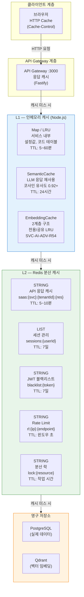
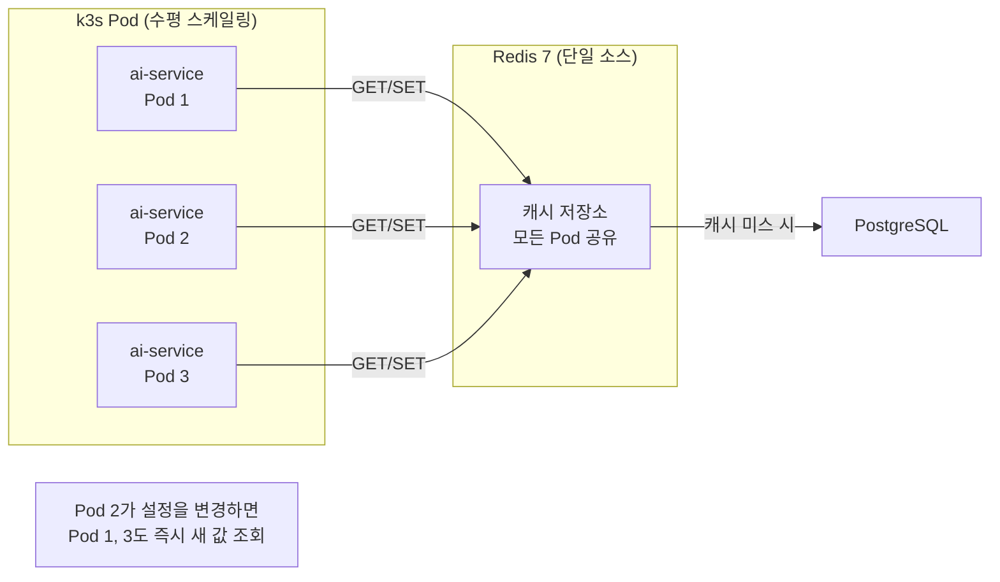
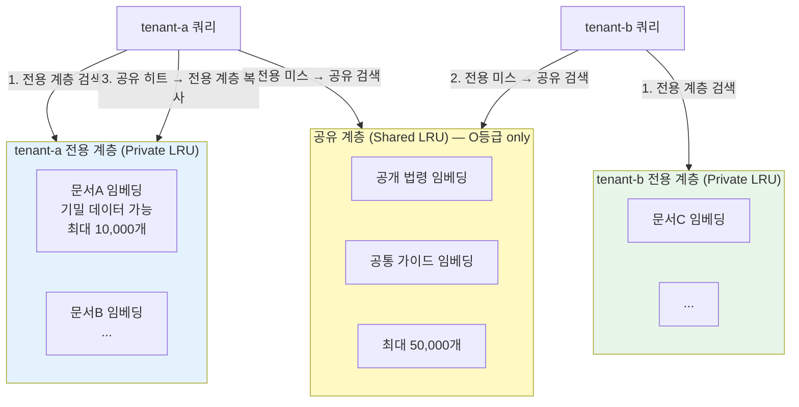
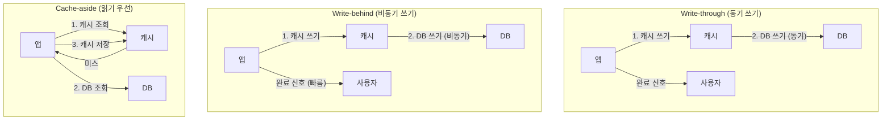

# 캐싱 전략 심화 — L1/L2/CDN, 무효화 패턴, 멀티테넌시 캐시 격리

> **문서 ID**: ONBOARD-03-24
> **버전**: 1.0.0 | **작성일**: 2026-04-12 | **작성자**: Implementer (Sonnet)
> **선행 학습**: `03-development/15-redis-patterns.md` (Redis 기본 패턴)
> **소요 시간**: 약 5~6시간 (실습 포함)
> **CSAP**: D-08-02 (세션 캐시 보안), D-09 (암호화 저장), D-12 (시스템 개발 보안)
> **N2SF**: N-05 (외부 전송 통제 — C/S 등급 캐시 저장 금지)

---

## 목차

1. [캐싱이란 무엇인가 — 초급자 관점](#1-캐싱이란-무엇인가--초급자-관점)
2. [L1 인메모리 캐시](#2-l1-인메모리-캐시)
3. [L2 Redis 분산 캐시 심화](#3-l2-redis-분산-캐시-심화)
4. [캐시 무효화 전략](#4-캐시-무효화-전략)
5. [캐시 스탬피드 방지](#5-캐시-스탬피드-방지)
6. [CSAP/N2SF 관련 캐싱 보안](#6-csapn2sf-관련-캐싱-보안)
7. [캐시 모니터링 및 최적화](#7-캐시-모니터링-및-최적화)
8. [멀티테넌시 캐시 격리 심화](#8-멀티테넌시-캐시-격리-심화)
9. [실습: 테넌트별 구독 플랜 캐시 구현](#9-실습-테넌트별-구독-플랜-캐시-구현)
10. [변경 이력](#10-변경-이력)

---

## 1. 캐싱이란 무엇인가 — 초급자 관점

### 1.1 왜 캐싱이 필요한가

공공기관 SaaS는 수십~수백 개의 테넌트(기관)가 동시에 서비스를 사용합니다. 각 요청마다 DB를 조회한다면 어떤 일이 발생할까요?

```
[시나리오] 100개 기관이 동시에 공지사항 조회

DB 없는 캐시 상황:
  - 100개 기관 × 50명 = 5,000건 동시 조회
  - PostgreSQL: 커넥션 풀 소진 → 대기 → 타임아웃
  - 응답 시간: 평균 2,400ms (2.4초) — 사용자 이탈 발생

캐시 적용 후:
  - DB 조회: 100개 기관 최초 1회씩만 (5,000 → 100)
  - 나머지 4,900건: Redis에서 즉시 반환
  - 응답 시간: 평균 12ms — 200배 개선
```

캐싱은 단순히 "빠르게 만드는 기술"이 아닙니다. DB 서버를 보호하고, 비용을 줄이며, 사용자 경험을 보장하는 핵심 인프라입니다.

### 1.2 캐시 히트와 캐시 미스

```
캐시 히트 (Cache Hit):
  요청 → 캐시 확인 → 데이터 있음 → 즉시 반환
  비용: 낮음 (Redis 조회: ~1ms)
  DB 부하: 없음

캐시 미스 (Cache Miss):
  요청 → 캐시 확인 → 데이터 없음 → DB 조회 → 캐시 저장 → 반환
  비용: 높음 (DB 조회: 10~100ms)
  DB 부하: 1회 발생

히트율(Hit Rate) = 캐시 히트 수 / 전체 요청 수 × 100

목표:
  - 일반 API 캐시: 70% 이상
  - AI 시맨틱 캐시: 50% 이상 (Plan SC: SC-5, SVC-AI-ADV-R8)
  - 정적 데이터 캐시: 95% 이상
```

### 1.3 우리 프로젝트 캐시 레이어 전체 지도

이 프로젝트는 세 계층의 캐시를 사용합니다. 각 계층은 서로 다른 목적과 특성을 가집니다.



### 1.4 계층별 비교

| 구분 | L1 인메모리 | L2 Redis | DB |
|------|------------|---------|-----|
| 조회 속도 | ~0.1ms | ~1ms | 10~100ms |
| 용량 | 수백 MB (프로세스 메모리) | 수 GB | 무제한 |
| 공유 범위 | 단일 프로세스 | 모든 인스턴스 | 모든 인스턴스 |
| 재시작 시 | 소멸 | 유지 (영속성 설정 시) | 유지 |
| 비용 | 없음 | 중간 | 높음 (CPU, I/O) |
| 멀티 인스턴스 동기화 | 불가 | 가능 | 가능 |

---

## 2. L1 인메모리 캐시

### 2.1 언제 L1 캐시를 사용하는가

L1 캐시는 단일 서비스 인스턴스 내에서만 유효한 데이터에 적합합니다.

```
L1 캐시 사용 기준:

적합한 경우:
  - 변경 빈도가 낮은 설정값 (1일 이하 변경)
  - 서비스 내에서만 참조하는 코드 테이블
  - 모든 인스턴스가 동일한 데이터를 가져도 무방한 경우
  - LLM 응답 재사용 (SemanticCache)

부적합한 경우 (Redis 사용):
  - 테넌트별 세션 정보 (인스턴스 간 공유 필요)
  - 실시간 변경이 반영되어야 하는 데이터
  - Rate Limit 카운터 (전체 인스턴스 합산 필요)
  - 분산 락 (여러 인스턴스가 경쟁하는 리소스)
```

### 2.2 Map 기반 단순 캐시

가장 기본적인 패턴입니다. JavaScript의 `Map`은 O(1) 조회를 보장합니다.

```typescript
// Design Ref: ONBOARD-03-24 §2.2
// Plan SC: NFR-3 (응답 시간 500ms 이내)

class SimpleMapCache<K, V> {
  private readonly store = new Map<K, { value: V; expiresAt: number }>();
  private readonly ttlMs: number;

  constructor(ttlMs: number = 5 * 60 * 1000) { // 기본 5분
    this.ttlMs = ttlMs;
  }

  get(key: K): V | undefined {
    const entry = this.store.get(key);
    if (!entry) return undefined;

    // TTL 만료 확인
    if (Date.now() > entry.expiresAt) {
      this.store.delete(key);
      return undefined;
    }

    return entry.value;
  }

  set(key: K, value: V): void {
    this.store.set(key, {
      value,
      expiresAt: Date.now() + this.ttlMs,
    });
  }

  delete(key: K): void {
    this.store.delete(key);
  }

  clear(): void {
    this.store.clear();
  }

  size(): number {
    return this.store.size;
  }
}

// 사용 예시: 서비스 코드 테이블 캐싱
const serviceCodeCache = new SimpleMapCache<string, ServiceCode[]>(60 * 60 * 1000); // 1시간 TTL

async function getServiceCodes(category: string): Promise<ServiceCode[]> {
  const cached = serviceCodeCache.get(category);
  if (cached) {
    return cached; // L1 히트
  }

  // DB 조회 (캐시 미스)
  const codes = await prisma.serviceCode.findMany({
    where: { category },
    orderBy: { sortOrder: 'asc' },
  });

  serviceCodeCache.set(category, codes);
  return codes;
}
```

### 2.3 LRU(Least Recently Used) 캐시

용량 제한이 필요할 때 LRU 알고리즘을 사용합니다. 가장 오래전에 사용된 항목을 먼저 제거합니다.

```typescript
// LRU 캐시 구현 — Map은 삽입 순서를 유지하므로 LRU 구현이 가능
// Design Ref: SVC-AI-ADV-R54 DESIGN §2 (MultiTenantEmbeddingCache 참고)

class LRUCache<K, V> {
  private readonly maxSize: number;
  private readonly store = new Map<K, V>();

  constructor(maxSize: number = 1000) {
    this.maxSize = maxSize;
  }

  get(key: K): V | undefined {
    const value = this.store.get(key);
    if (value === undefined) return undefined;

    // LRU 갱신: 삭제 후 재삽입으로 "가장 최근 사용"으로 이동
    this.store.delete(key);
    this.store.set(key, value);
    return value;
  }

  set(key: K, value: V): void {
    if (this.store.has(key)) {
      this.store.delete(key);
    } else if (this.store.size >= this.maxSize) {
      // 가장 오래된 항목 제거 (Map의 첫 번째 항목)
      const oldestKey = this.store.keys().next().value;
      if (oldestKey !== undefined) {
        this.store.delete(oldestKey);
      }
    }
    this.store.set(key, value);
  }

  delete(key: K): boolean {
    return this.store.delete(key);
  }

  get size(): number {
    return this.store.size;
  }
}

// 실제 사용: LLM 임베딩 캐시 (SVC-AI-ADV-R54 실제 구현 패턴)
const embeddingCache = new LRUCache<string, number[]>(10_000);

async function getOrCreateEmbedding(text: string): Promise<number[]> {
  const cached = embeddingCache.get(text);
  if (cached) return cached;

  const embedding = await createEmbedding(text);
  embeddingCache.set(text, embedding);
  return embedding;
}
```

### 2.4 멀티 인스턴스 환경에서의 주의사항

L1 캐시는 각 서비스 인스턴스(Pod)마다 독립적으로 존재합니다. 이것이 핵심 제약입니다.

```
[위험 시나리오]

k3s에 ai-service 3개 Pod 실행 중:
  Pod 1: 설정값 A = "ON" 캐시
  Pod 2: 설정값 A = "ON" 캐시
  Pod 3: 설정값 A = "ON" 캐시

관리자가 DB에서 설정값 A를 "OFF"로 변경:
  DB: 설정값 A = "OFF" (즉시 반영)
  Pod 1: 설정값 A = "ON" (TTL 만료까지 유지 — 잘못된 캐시!)
  Pod 2: 설정값 A = "ON" (잘못된 캐시!)
  Pod 3: 설정값 A = "OFF" (재시작한 경우만 반영)

→ 일부 사용자는 새 설정을 받고, 일부는 기존 설정을 받음
→ 테넌트별로 다른 동작 → 지원 문의 폭증

해결책:
  방법 1: TTL을 짧게 설정 (30초~5분) — 일시적 불일치 허용
  방법 2: Redis Pub/Sub으로 무효화 신호 전파 (§4.2 참고)
  방법 3: 중요 설정은 L2 Redis만 사용 (L1 사용 안 함)
```

---

## 3. L2 Redis 분산 캐시 심화

### 3.1 분산 캐시가 필요한 이유

L2 Redis는 모든 서비스 인스턴스가 공유하는 중앙 캐시입니다.



### 3.2 멀티테넌시 캐시 키 설계

이 프로젝트에서 가장 중요한 캐시 설계 원칙은 **테넌트 간 격리**입니다. 서로 다른 기관의 데이터가 절대 혼용되어서는 안 됩니다.

```
[캐시 키 설계 원칙]

형식: {namespace}:{tenantId}:{resource}:{identifier}

예시:
  saas:auth:tenant-a:user:usr-001          ← tenant-a의 사용자 usr-001
  saas:auth:tenant-b:user:usr-001          ← tenant-b의 사용자 usr-001 (별개!)
  saas:ai:tenant-a:rag:query-hash-abc123   ← tenant-a의 RAG 쿼리 캐시
  saas:billing:tenant-a:plan:pro           ← tenant-a의 구독 플랜

잘못된 예:
  user:usr-001                   ← 어느 테넌트인지 모름 (격리 위반!)
  cache:subscription:tenant-a    ← namespace 미설정 (충돌 위험)
```

```typescript
// Design Ref: ONBOARD-03-24 §3.2
// Plan SC: FR-1.1 (멀티테넌시 데이터 격리)
// CSAP: D-08 (접근 통제 — 테넌트 격리)

// 캐시 키 생성 유틸리티
export const CacheKey = {
  // 사용자 정보 캐시
  user: (tenantId: string, userId: string) =>
    `saas:auth:${tenantId}:user:${userId}`,

  // 구독 플랜 캐시
  subscriptionPlan: (tenantId: string) =>
    `saas:billing:${tenantId}:subscription:plan`,

  // AI RAG 쿼리 캐시 (쿼리 해시 포함)
  aiRagQuery: (tenantId: string, queryHash: string) =>
    `saas:ai:${tenantId}:rag:${queryHash}`,

  // 테넌트 설정 캐시
  tenantConfig: (tenantId: string, configKey: string) =>
    `saas:tenant:${tenantId}:config:${configKey}`,

  // 테넌트 전체 무효화용 패턴
  tenantPattern: (tenantId: string) =>
    `saas:*:${tenantId}:*`,
} as const;

// ioredis 사용 예시
import Redis from 'ioredis';

const redis = new Redis(process.env.REDIS_URL ?? 'redis://localhost:6379');

async function getCachedUser(
  tenantId: string,
  userId: string,
): Promise<User | null> {
  const key = CacheKey.user(tenantId, userId);
  const cached = await redis.get(key);

  if (cached) {
    return JSON.parse(cached) as User; // 캐시 히트
  }

  // 캐시 미스: DB 조회
  const user = await prisma.user.findFirst({
    where: { id: userId, tenantId }, // tenantId 반드시 포함!
  });

  if (user) {
    // 10분 TTL로 저장
    await redis.set(key, JSON.stringify(user), 'EX', 600);
  }

  return user;
}
```

### 3.3 Redis 자료구조별 캐싱 용도

Redis는 단순한 Key-Value 저장소가 아닙니다. 자료구조마다 최적화된 용도가 있습니다.

```typescript
// ── STRING: 단순 값/JSON 직렬화 ──────────────────────────────────────

// API 응답 캐시 (JSON 직렬화)
await redis.set(
  `saas:catalog:${tenantId}:products`,
  JSON.stringify(products),
  'EX', 300, // 5분 TTL
);

// ── HASH: 객체 필드별 부분 업데이트 ─────────────────────────────────

// 테넌트 설정 (개별 필드 업데이트 가능)
await redis.hset(`saas:tenant:${tenantId}:settings`, {
  theme: 'dark',
  language: 'ko',
  timezone: 'Asia/Seoul',
  maxUsers: '100',
});

// 특정 필드만 가져오기
const theme = await redis.hget(`saas:tenant:${tenantId}:settings`, 'theme');

// ── LIST: 최근 항목 유지 ──────────────────────────────────────────────

// 최근 조회한 문서 (최대 20개)
await redis.lpush(`saas:ai:${tenantId}:recent-docs`, documentId);
await redis.ltrim(`saas:ai:${tenantId}:recent-docs`, 0, 19); // 20개만 유지

// ── SORTED SET: 점수 기반 순위 ────────────────────────────────────────

// 테넌트별 AI 사용량 순위 (일별)
const todayKey = `saas:ai:usage:${new Date().toISOString().slice(0, 10)}`;
await redis.zincrby(todayKey, tokensUsed, tenantId);

// 사용량 상위 10개 테넌트 조회 (내림차순)
const topTenants = await redis.zrevrange(todayKey, 0, 9, 'WITHSCORES');

// ── SET: 고유 값 집합 ────────────────────────────────────────────────

// 오늘 활성 사용자 목록 (중복 없음)
const todayUsers = `saas:analytics:${tenantId}:active-users:${today}`;
await redis.sadd(todayUsers, userId);
await redis.expire(todayUsers, 86400); // 1일 후 자동 삭제

const activeUserCount = await redis.scard(todayUsers);
```

### 3.4 멀티테넌시 캐시 격리 구조 (시맨틱 캐시 실제 구현)

`SVC-AI-ADV-R54`의 `MultiTenantEmbeddingCache`는 2계층 격리를 구현합니다.



이 구조는 `platform/services/ai-service/src/lib/multi-tenant-embedding-cache.ts`에 구현되어 있습니다.

```typescript
// Design Ref: SVC-AI-ADV-R54 DESIGN §2, §4, §5
// N2SF: 공유 계층은 O등급 only

import { MultiTenantEmbeddingCache, DataGrade } from './multi-tenant-embedding-cache.js';
import { createHash } from 'node:crypto';

const embeddingCache = new MultiTenantEmbeddingCache({
  maxPrivate: 10_000,  // 테넌트별 최대 10,000개
  maxShared: 50_000,   // 공유 계층 최대 50,000개
});

async function getOrCreateEmbedding(
  text: string,
  tenantId: string,
  grade: DataGrade,
): Promise<number[]> {
  const key = embeddingCache.hashKey(text); // SHA-256 해시

  // 1단계: 전용 계층 조회
  const privateHit = embeddingCache.getPrivate(tenantId, key);
  if (privateHit) return privateHit.vector;

  // 2단계: 공유 계층 조회 (O등급만 진입 가능)
  const sharedHit = embeddingCache.getShared(key);
  if (sharedHit) {
    // 공유 히트 → 전용 계층으로 승격
    embeddingCache.setPrivate(tenantId, key, sharedHit.vector);
    return sharedHit.vector;
  }

  // 3단계: 임베딩 API 호출
  const vector = await callEmbeddingAPI(text);

  // 전용 계층에 저장 (등급 무관)
  embeddingCache.setPrivate(tenantId, key, vector);

  // O등급만 공유 계층에도 저장
  if (grade === DataGrade.O) {
    embeddingCache.setShared(key, vector);
  }

  return vector;
}
```

---

## 4. 캐시 무효화 전략

캐시 무효화는 컴퓨터 과학에서 가장 어려운 문제 중 하나입니다. 무효화 전략을 잘못 선택하면 오래된 데이터가 노출되거나, 캐시 효율이 떨어집니다.

### 4.1 Time-based (TTL) 무효화

가장 단순한 방법입니다. 데이터에 유효 기간을 설정합니다.

```typescript
// TTL 전략 — 데이터 유형별 권장 TTL

const TTL = {
  // 자주 변경되는 데이터
  userSession: 15 * 60,          // 15분 (JWT와 동일)
  rateLimitWindow: 60,            // 60초 (1분 윈도우)
  realtimeData: 10,               // 10초

  // 중간 빈도 변경 데이터
  tenantConfig: 5 * 60,           // 5분
  subscriptionPlan: 10 * 60,      // 10분
  apiResponse: 5 * 60,            // 5분

  // 거의 변경되지 않는 데이터
  serviceCodes: 60 * 60,          // 1시간
  staticContent: 24 * 60 * 60,    // 24시간
  aiEmbedding: 24 * 60 * 60,      // 24시간 (SemanticCache 기본값)
} as const;

// TTL 설정 예시
await redis.set(
  CacheKey.subscriptionPlan(tenantId),
  JSON.stringify(plan),
  'EX', TTL.subscriptionPlan,
);
```

TTL의 장단점:

| 장점 | 단점 |
|------|------|
| 구현 단순 | 변경 즉시 반영 불가 (TTL 만료까지 대기) |
| 별도 무효화 로직 불필요 | TTL 기간 동안 오래된 데이터 노출 가능 |
| DB 장애 시에도 캐시에서 서비스 가능 | TTL 너무 길면 불일치, 너무 짧으면 DB 부하 |

### 4.2 Event-based 명시적 무효화 (Redis Pub/Sub)

데이터 변경 즉시 캐시를 무효화하는 방법입니다. 이 프로젝트는 `15-redis-patterns.md`의 Pub/Sub 채널을 활용합니다.

```typescript
// Design Ref: ONBOARD-03-24 §4.2
// Design Ref: platform/services/ai-service/src/lib/semantic-cache.ts (캐시 무효화 패턴)

// ── 발행자 (데이터 변경 서비스) ──────────────────────────────────────

async function updateTenantConfig(
  tenantId: string,
  configKey: string,
  newValue: unknown,
): Promise<void> {
  // 1. DB 업데이트
  await prisma.tenantConfig.upsert({
    where: { tenantId_key: { tenantId, key: configKey } },
    update: { value: JSON.stringify(newValue) },
    create: { tenantId, key: configKey, value: JSON.stringify(newValue) },
  });

  // 2. 직접 캐시 무효화
  await redis.del(CacheKey.tenantConfig(tenantId, configKey));

  // 3. 다른 인스턴스에 무효화 신호 발행
  const message = JSON.stringify({
    type: 'CACHE_INVALIDATE',
    tenantId,
    key: CacheKey.tenantConfig(tenantId, configKey),
    timestamp: Date.now(),
  });
  await redis.publish('cache:invalidation', message);
}

// ── 구독자 (모든 서비스 인스턴스) ────────────────────────────────────

const subscriber = new Redis(process.env.REDIS_URL ?? 'redis://localhost:6379');

subscriber.subscribe('cache:invalidation');

subscriber.on('message', (_channel, rawMessage) => {
  const message = JSON.parse(rawMessage) as {
    type: string;
    tenantId: string;
    key: string;
  };

  if (message.type === 'CACHE_INVALIDATE') {
    // L1 인메모리 캐시 무효화
    serviceCodeCache.delete(message.key);

    // 필요 시 추가 처리 (예: 연관 캐시 삭제)
    console.info(`캐시 무효화: ${message.key} (tenant: ${message.tenantId})`);
  }
});
```

### 4.3 Write-through vs Write-behind vs Cache-aside 패턴

세 가지 캐시 쓰기 전략을 비교합니다.



```typescript
// ── Cache-aside 패턴 (이 프로젝트의 기본 패턴) ───────────────────────
// 읽기가 많고, 쓰기 직후 캐시 일관성이 중요하지 않을 때

async function getSubscriptionPlan(tenantId: string): Promise<Plan | null> {
  // 1. 캐시 조회
  const key = CacheKey.subscriptionPlan(tenantId);
  const cached = await redis.get(key);
  if (cached) return JSON.parse(cached);

  // 2. DB 조회
  const plan = await prisma.subscription.findFirst({
    where: { tenantId, status: 'active' },
  });

  // 3. 캐시 저장
  if (plan) {
    await redis.set(key, JSON.stringify(plan), 'EX', TTL.subscriptionPlan);
  }

  return plan;
}

// ── Write-through 패턴 ────────────────────────────────────────────────
// 쓰기 직후 캐시 일관성이 중요할 때 (세션, 토큰)

async function updateUserProfile(
  tenantId: string,
  userId: string,
  updates: Partial<User>,
): Promise<User> {
  // 1. DB 업데이트
  const updated = await prisma.user.update({
    where: { id: userId, tenantId },
    data: updates,
  });

  // 2. 캐시도 즉시 업데이트 (Write-through)
  const key = CacheKey.user(tenantId, userId);
  await redis.set(key, JSON.stringify(updated), 'EX', TTL.userSession);

  return updated;
}

// ── Write-behind 패턴 ────────────────────────────────────────────────
// 빠른 응답이 중요하고, 약간의 데이터 손실을 허용할 수 있을 때
// 주의: 이 프로젝트에서는 CSAP 감사 데이터에는 사용 금지!

async function recordAIUsage(tenantId: string, tokens: number): Promise<void> {
  const key = `saas:ai:usage:${tenantId}:${today}`;

  // 1. 캐시만 즉시 업데이트 (사용자에게 빠른 응답)
  await redis.incrby(key, tokens);
  await redis.expire(key, 86400);

  // 2. DB는 배치로 비동기 처리 (별도 배치 작업에서 수행)
  // NOTE: 감사 로그(CSAP D-06)는 반드시 Write-through 사용!
}
```

---

## 5. 캐시 스탬피드 방지

### 5.1 캐시 스탬피드란

캐시 스탬피드(Cache Stampede)는 동시에 많은 요청이 같은 캐시 키에 대해 캐시 미스를 경험할 때 발생합니다.

```
[시나리오] 인기 공지사항 TTL 만료

09:00:00.000 — 공지사항 캐시 TTL 만료
09:00:00.001 — 요청 1,000개 동시 도착
  → 1,000개 모두 캐시 미스 판정
  → 1,000개 모두 DB 조회 시작
  → DB 커넥션 풀 소진
  → 일부 요청 타임아웃
  → 에러 페이지 표시

이것이 "캐시 스탬피드" (= "Thundering Herd" = "Cache Avalanche")
```

### 5.2 Mutex 락 기반 방지

Redis 분산 락을 사용하여 하나의 요청만 DB를 조회하게 합니다.

```typescript
// Design Ref: ONBOARD-03-24 §5.2
// Design Ref: 15-redis-patterns.md §4 (분산 락 패턴)

const LOCK_TTL_SECONDS = 10; // 락 최대 유지 시간

async function getWithMutex<T>(
  cacheKey: string,
  ttlSeconds: number,
  fetchFn: () => Promise<T>,
): Promise<T> {
  // 1단계: 캐시 조회
  const cached = await redis.get(cacheKey);
  if (cached) return JSON.parse(cached) as T;

  // 2단계: 분산 락 획득 시도
  const lockKey = `lock:${cacheKey}`;
  const lockToken = `${Date.now()}-${Math.random()}`;

  // SET NX EX: 락이 없을 때만 설정 (원자적 연산)
  const acquired = await redis.set(
    lockKey,
    lockToken,
    'NX',
    'EX', LOCK_TTL_SECONDS,
  );

  if (acquired === 'OK') {
    // 락 획득 성공: DB 조회 후 캐시 저장
    try {
      const data = await fetchFn();
      await redis.set(cacheKey, JSON.stringify(data), 'EX', ttlSeconds);
      return data;
    } finally {
      // 락 해제 (내가 설정한 락인지 확인)
      const currentToken = await redis.get(lockKey);
      if (currentToken === lockToken) {
        await redis.del(lockKey);
      }
    }
  } else {
    // 락 획득 실패: 다른 요청이 DB 조회 중
    // 잠시 대기 후 캐시 재조회
    await new Promise((resolve) => setTimeout(resolve, 50));
    const retried = await redis.get(cacheKey);
    if (retried) return JSON.parse(retried) as T;

    // 여전히 없으면 직접 조회 (최후 수단)
    return fetchFn();
  }
}

// 사용 예시
async function getPopularAnnouncement(
  tenantId: string,
  announcementId: string,
): Promise<Announcement> {
  const key = `saas:notice:${tenantId}:announcement:${announcementId}`;

  return getWithMutex(key, TTL.staticContent, async () => {
    return prisma.announcement.findFirstOrThrow({
      where: { id: announcementId, tenantId },
    });
  });
}
```

### 5.3 Probabilistic Early Expiration (확률적 조기 만료)

TTL 만료 직전에 확률적으로 미리 갱신하는 방법입니다. 동시 만료를 분산시킵니다.

```typescript
// Probabilistic Early Expiration (PER) 알고리즘
// 만료 예정 항목을 미리 확률적으로 갱신하여 스탬피드 방지

interface CacheEntryWithTTL<T> {
  data: T;
  createdAt: number;  // 생성 시각 (ms)
  ttlMs: number;      // 원래 TTL (ms)
  computeTimeMs: number; // DB 조회에 걸린 시간 (ms)
}

async function getWithPER<T>(
  cacheKey: string,
  ttlSeconds: number,
  fetchFn: () => Promise<T>,
  beta: number = 1.0, // 조기 만료 공격성 (1.0 = 표준)
): Promise<T> {
  const rawCached = await redis.get(cacheKey);

  if (rawCached) {
    const entry = JSON.parse(rawCached) as CacheEntryWithTTL<T>;
    const now = Date.now();
    const ttlMs = entry.ttlMs;
    const expiresAt = entry.createdAt + ttlMs;
    const remainingMs = expiresAt - now;

    // PER 공식: 남은 시간 < 계산 시간 × β × log(random())
    // random()이 작을수록 (= 낮은 확률) 더 일찍 갱신
    const earlyExpireMs = entry.computeTimeMs * beta * -Math.log(Math.random());

    if (remainingMs > earlyExpireMs) {
      // 아직 유효: 캐시 반환
      return entry.data;
    }
    // 확률적 조기 만료 → 갱신 진행
  }

  // DB 조회 + 시간 측정
  const startTime = Date.now();
  const data = await fetchFn();
  const computeTimeMs = Date.now() - startTime;

  const entryToStore: CacheEntryWithTTL<T> = {
    data,
    createdAt: Date.now(),
    ttlMs: ttlSeconds * 1000,
    computeTimeMs,
  };

  await redis.set(cacheKey, JSON.stringify(entryToStore), 'EX', ttlSeconds);
  return data;
}
```

---

## 6. CSAP/N2SF 관련 캐싱 보안

### 6.1 캐시 저장 금지 데이터

CSAP와 N2SF 규정에 따라 특정 데이터는 캐시에 저장할 수 없습니다.

```
[CSAP D-09 기준 — 캐시 보안]

캐시 저장 절대 금지:
  ❌ 평문 비밀번호 (해시도 캐시 금지 — DB에만 저장)
  ❌ API 키, 시크릿 토큰 (환경 변수로만 사용)
  ❌ 암호화 키 자체 (키 관리 시스템에서 직접 조회)

[N2SF N-05 기준 — 데이터 등급별 캐시 정책]

C등급 (기밀):
  ❌ Redis 캐시 저장 금지
  ❌ L1 인메모리 캐시 저장 금지
  이유: 캐시 누출 시 기밀 데이터 노출

S등급 (민감):
  ❌ 공유 캐시 계층 저장 금지
  ✅ 전용 캐시 계층에만 저장 가능 (암호화 권장)
  이유: 테넌트 간 격리 필수

O등급 (공개):
  ✅ 모든 캐시 계층 저장 가능
  ✅ PII 포함 시 마스킹 후 저장
```

```typescript
// Design Ref: ONBOARD-03-24 §6.1
// Plan SC: AI-REQ-1 (N2SF AI 연동 데이터 등급 검증)
// CSAP: D-09 (암호화), D-12 (시스템 개발 보안)

import { DataGrade, validateDataGrade } from './grade-check.js';
import { maskPII } from './pii-masking.js';

async function setCacheWithGradeCheck(
  key: string,
  value: unknown,
  grade: DataGrade,
  ttlSeconds: number,
): Promise<void> {
  // C/S 등급: 캐시 저장 금지 (N2SF N-05)
  if (grade === 'C' || grade === 'S') {
    throw new Error(
      `BLOCKED: ${grade}등급 데이터는 캐시 저장이 금지됩니다 (N2SF N-05). ` +
      `키: ${key}`,
    );
  }

  // O등급: PII 마스킹 후 저장
  const stringValue = JSON.stringify(value);
  const safeValue = maskPII(stringValue);

  await redis.set(key, safeValue, 'EX', ttlSeconds);
}

// ── 감사 로그 캐시 금지 예시 ─────────────────────────────────────────

// WRONG: 감사 로그를 캐시에 저장 (절대 금지!)
// await redis.set('audit:log:latest', JSON.stringify(auditLog)); ← 금지!

// CORRECT: 감사 로그는 append-only 저장소에만 기록
// CSAP D-06: 수정/삭제 불가 구조 필수
import { auditLog } from '../services/compliance-service/src/lib/audit.js';

async function logAndCache(action: string, data: unknown): Promise<void> {
  // 감사 로그는 반드시 먼저 기록 (캐시와 무관)
  await auditLog({
    actor: 'system',
    action,
    target: JSON.stringify(data),
    timestamp: new Date().toISOString(),
  });

  // 일반 데이터는 캐시 허용
  // 단, 감사 로그 자체는 캐시 금지!
}
```

### 6.2 세션 토큰 캐시 보안

JWT 토큰 관련 캐시는 특별한 보안 처리가 필요합니다.

```typescript
// CSAP D-08-03: JWT 블랙리스트 캐시
// 실제 구현: platform/services/auth-service/src/lib/session.ts

// JWT TTL과 동일한 TTL로 블랙리스트 관리
const JWT_REFRESH_TTL_SECONDS = 7 * 24 * 60 * 60; // 7일

// 로그아웃 시 토큰 블랙리스트 등록
async function blacklistToken(refreshToken: string): Promise<void> {
  const key = `blacklist:${refreshToken}`;
  // 값은 '1' (1바이트) — 존재 여부만 필요
  await redis.set(key, '1', 'EX', JWT_REFRESH_TTL_SECONDS);
}

// API 요청마다 블랙리스트 확인
async function isTokenBlacklisted(token: string): Promise<boolean> {
  const result = await redis.get(`blacklist:${token}`);
  return result !== null;
}

// CSAP D-08-04: 동시 세션 제한 (최대 3개)
const MAX_SESSIONS_PER_USER = 3;

async function addSession(
  userId: string,
  sessionId: string,
): Promise<void> {
  const key = `sessions:${userId}`;

  // 새 세션 추가 (최신이 앞으로)
  await redis.lpush(key, sessionId);

  // 최대 세션 수 초과 시 오래된 세션 제거
  const sessions = await redis.lrange(key, 0, -1);
  if (sessions.length > MAX_SESSIONS_PER_USER) {
    const toRemove = sessions.slice(MAX_SESSIONS_PER_USER);
    for (const oldSession of toRemove) {
      await redis.lrem(key, 0, oldSession);
      await blacklistToken(oldSession); // 강제 로그아웃
    }
  }

  await redis.expire(key, JWT_REFRESH_TTL_SECONDS);
}
```

---

## 7. 캐시 모니터링 및 최적화

### 7.1 Redis 히트율 측정 (PromQL)

Prometheus와 Grafana로 캐시 성능을 모니터링합니다.

```yaml
# prometheus 규칙: 캐시 히트율 알림
# Design Ref: ONBOARD-03-24 §7.1

groups:
  - name: cache-alerts
    rules:
      # 캐시 히트율 70% 미만 경고
      - alert: LowCacheHitRate
        expr: |
          (
            sum(rate(redis_keyspace_hits_total[5m]))
            /
            (
              sum(rate(redis_keyspace_hits_total[5m])) +
              sum(rate(redis_keyspace_misses_total[5m]))
            )
          ) < 0.70
        for: 10m
        labels:
          severity: warning
        annotations:
          summary: "Redis 캐시 히트율 낮음"
          description: "현재 히트율: {{ $value | humanizePercentage }} (목표: 70%+)"

      # Redis 메모리 사용량 80% 초과
      - alert: RedisHighMemoryUsage
        expr: |
          redis_memory_used_bytes / redis_memory_max_bytes > 0.80
        for: 5m
        labels:
          severity: critical
        annotations:
          summary: "Redis 메모리 사용량 위험"
          description: "사용량: {{ $value | humanizePercentage }}"
```

```
# Grafana 대시보드용 PromQL 쿼리

# 1. 실시간 히트율 (5분 이동 평균)
rate(redis_keyspace_hits_total[5m]) /
(rate(redis_keyspace_hits_total[5m]) + rate(redis_keyspace_misses_total[5m]))

# 2. 테넌트별 AI 캐시 히트율 (커스텀 메트릭 — ai-service 구현 필요)
ai_semantic_cache_hits_total{tenantId="tenant-a"} /
ai_semantic_cache_lookups_total{tenantId="tenant-a"}

# 3. Redis 메모리 사용량 추이
redis_memory_used_bytes

# 4. 명령어 처리량 (초당)
rate(redis_commands_processed_total[1m])

# 5. 키 만료 속도 (TTL 설정이 적절한지 확인)
rate(redis_expired_keys_total[5m])
```

### 7.2 SCAN vs KEYS — 안전한 키 탐색

프로덕션 환경에서 `KEYS` 명령 사용은 절대 금지입니다.

```
[위험] KEYS 명령의 문제:

redis.keys('saas:*:tenant-a:*')  ← 절대 금지!

이유:
  - KEYS는 O(N) — 전체 키를 스캔
  - Redis는 싱글스레드 → 스캔 중 모든 요청 블로킹
  - 키 10만개: 약 100ms 블로킹 → 서비스 지연
  - CSAP 감사에서 "프로덕션 Redis에 KEYS 사용" 발견 시 지적 사항
```

```typescript
// SCAN을 사용한 안전한 키 탐색
// Design Ref: ONBOARD-03-24 §7.2

async function scanKeys(pattern: string): Promise<string[]> {
  const keys: string[] = [];
  let cursor = '0';

  do {
    // SCAN: 커서 기반 반복 — 다른 요청을 블로킹하지 않음
    const [nextCursor, batch] = await redis.scan(
      cursor,
      'MATCH', pattern,
      'COUNT', 100, // 한 번에 최대 100개씩 처리
    );
    cursor = nextCursor;
    keys.push(...batch);
  } while (cursor !== '0');

  return keys;
}

// 테넌트 전체 캐시 무효화 (SCAN 기반)
async function invalidateTenantCache(tenantId: string): Promise<number> {
  const pattern = `saas:*:${tenantId}:*`;
  const keys = await scanKeys(pattern);

  if (keys.length === 0) return 0;

  // Pipeline으로 일괄 삭제 (네트워크 왕복 최소화)
  const pipeline = redis.pipeline();
  for (const key of keys) {
    pipeline.del(key);
  }
  await pipeline.exec();

  return keys.length;
}
```

### 7.3 Redis Pipeline으로 성능 최적화

여러 Redis 명령을 하나의 네트워크 요청으로 묶어 처리합니다.

```typescript
// 비효율적: 각 명령마다 네트워크 왕복
for (const userId of userIds) {
  await redis.get(`saas:auth:${tenantId}:user:${userId}`);
  // 10명이면 10번의 네트워크 왕복
}

// 효율적: Pipeline으로 일괄 처리
const pipeline = redis.pipeline();
for (const userId of userIds) {
  pipeline.get(`saas:auth:${tenantId}:user:${userId}`);
}
const results = await pipeline.exec();
// 10명이어도 1번의 네트워크 왕복

// 더 간단한 방법: MGET
const keys = userIds.map((id) => `saas:auth:${tenantId}:user:${id}`);
const cachedUsers = await redis.mget(...keys);
// null인 항목 = 캐시 미스
const missingIndices = cachedUsers
  .map((v, i) => (v === null ? i : -1))
  .filter((i) => i !== -1);
```

---

## 8. 멀티테넌시 캐시 격리 심화

### 8.1 완전한 격리 검증

캐시 격리가 실제로 동작하는지 확인하는 방법입니다.

```typescript
// Design Ref: ONBOARD-03-24 §8.1
// CSAP: D-08 (접근 통제 — 테넌트 격리)

// 테스트: 테넌트 A의 캐시가 테넌트 B에 노출되지 않는지 확인
async function verifyCacheIsolation(): Promise<void> {
  const tenantA = 'tenant-a';
  const tenantB = 'tenant-b';

  // tenant-a 데이터 저장
  await redis.set(
    CacheKey.tenantConfig(tenantA, 'maxUsers'),
    JSON.stringify({ value: 100 }),
    'EX', 60,
  );

  // tenant-b로 tenant-a 키 접근 시도
  const keyWithTenantA = CacheKey.tenantConfig(tenantA, 'maxUsers');
  const keyWithTenantB = CacheKey.tenantConfig(tenantB, 'maxUsers');

  const fromA = await redis.get(keyWithTenantA); // 'tenant-a' 포함
  const fromB = await redis.get(keyWithTenantB); // 'tenant-b' 포함

  console.assert(fromA !== null, 'tenant-a 캐시 조회 성공해야 함');
  console.assert(fromB === null, 'tenant-b에서 tenant-a 데이터 접근 불가해야 함');
}
```

### 8.2 시맨틱 캐시 테넌트 격리 (SemanticCache)

`platform/services/ai-service/src/lib/semantic-cache.ts`에서 테넌트 격리를 구현한 방법입니다.

```typescript
// 실제 구현 발췌 — SemanticCache.lookup()
// Design Ref: SVC-AI-ADV-R8 DESIGN §1
// CSAP: D-08 (접근 통제)

async lookup(query: string, tenantId: string): Promise<CacheLookupResult> {
  const normalizedQuery = normalizeQuery(query); // PII 제거 포함
  const queryEmbedding = await this.embedFn(normalizedQuery);

  for (const entry of this.entries.values()) {
    // 테넌트 격리: 다른 테넌트 엔트리는 건너뜀
    if (entry.tenantId !== tenantId) continue;  // ← 핵심!

    // TTL 확인
    if (Date.now() - entry.createdAt > this.config.ttlMs) continue;

    const similarity = cosineSimilarity(queryEmbedding, entry.embedding);
    // ...
  }
}
```

---

## 9. 실습: 테넌트별 구독 플랜 캐시 구현

### 9.1 목표

`subscription-service`에 테넌트별 구독 플랜 캐시를 구현합니다.

요구사항:
- 캐시 미스 시 DB 조회 후 10분 TTL로 저장
- 플랜 변경 시 즉시 캐시 무효화
- 스탬피드 방지 (Mutex 락)
- N2SF O등급 데이터만 캐시

### 9.2 구현

```typescript
// platform/services/subscription-service/src/lib/subscription-cache.ts
// Design Ref: ONBOARD-03-24 §9 실습

import Redis from 'ioredis';
import { prisma } from './prisma.js';
import { maskPII } from '@/lib/pii-masking.js';

const redis = new Redis(process.env.REDIS_URL ?? 'redis://localhost:6379');

const PLAN_CACHE_TTL = 10 * 60; // 10분
const LOCK_TTL = 10; // 락 최대 10초

// ── 캐시 키 ─────────────────────────────────────────────────────────────────

const keys = {
  plan: (tenantId: string) =>
    `saas:billing:${tenantId}:subscription:active-plan`,
  lock: (tenantId: string) =>
    `lock:billing:${tenantId}:subscription`,
};

// ── 조회 (캐시 우선) ─────────────────────────────────────────────────────────

export async function getActivePlan(tenantId: string): Promise<SubscriptionPlan | null> {
  const cacheKey = keys.plan(tenantId);

  // 1. 캐시 조회
  const cached = await redis.get(cacheKey);
  if (cached) {
    return JSON.parse(cached) as SubscriptionPlan;
  }

  // 2. 스탬피드 방지: Mutex 락
  const lockKey = keys.lock(tenantId);
  const lockToken = `${Date.now()}-${Math.random()}`;
  const acquired = await redis.set(lockKey, lockToken, 'NX', 'EX', LOCK_TTL);

  if (acquired === 'OK') {
    try {
      // 3. DB 조회
      const plan = await prisma.subscription.findFirst({
        where: { tenantId, status: 'active' },
        include: { plan: true },
      });

      if (plan) {
        // 4. 캐시 저장 (PII 없는 플랜 데이터이므로 O등급)
        await redis.set(cacheKey, JSON.stringify(plan), 'EX', PLAN_CACHE_TTL);
      }

      return plan;
    } finally {
      // 락 해제
      const token = await redis.get(lockKey);
      if (token === lockToken) await redis.del(lockKey);
    }
  }

  // 락 획득 실패: 50ms 대기 후 재조회
  await new Promise((r) => setTimeout(r, 50));
  const retried = await redis.get(cacheKey);
  return retried ? JSON.parse(retried) : null;
}

// ── 무효화 ───────────────────────────────────────────────────────────────────

export async function invalidatePlanCache(tenantId: string): Promise<void> {
  await redis.del(keys.plan(tenantId));
}

// ── 업데이트 (Write-through) ─────────────────────────────────────────────────

export async function updateSubscriptionPlan(
  tenantId: string,
  planId: string,
): Promise<void> {
  // DB 업데이트
  await prisma.subscription.update({
    where: { tenantId },
    data: { planId, updatedAt: new Date() },
  });

  // 캐시 즉시 무효화 (다음 조회 시 DB에서 최신 데이터 읽음)
  await invalidatePlanCache(tenantId);
}
```

### 9.3 테스트

```typescript
// 캐시 동작 검증 테스트
import { describe, it, expect, beforeEach } from 'vitest';
import { getActivePlan, invalidatePlanCache } from './subscription-cache.js';

describe('SubscriptionCache', () => {
  beforeEach(async () => {
    await redis.flushdb(); // 테스트 격리
  });

  it('캐시 히트 시 DB 조회 없이 반환', async () => {
    // 캐시에 직접 저장
    await redis.set(
      'saas:billing:tenant-a:subscription:active-plan',
      JSON.stringify({ id: 'plan-1', name: 'pro' }),
      'EX', 600,
    );

    const plan = await getActivePlan('tenant-a');
    expect(plan?.name).toBe('pro');
  });

  it('테넌트 격리: tenant-a 캐시가 tenant-b에 노출되지 않음', async () => {
    await redis.set(
      'saas:billing:tenant-a:subscription:active-plan',
      JSON.stringify({ id: 'plan-1', name: 'enterprise' }),
      'EX', 600,
    );

    const planB = await getActivePlan('tenant-b');
    expect(planB).toBeNull(); // tenant-b는 빈 캐시
  });

  it('캐시 무효화 후 다음 조회는 DB에서 읽음', async () => {
    await redis.set(
      'saas:billing:tenant-a:subscription:active-plan',
      JSON.stringify({ id: 'plan-old', name: 'basic' }),
      'EX', 600,
    );

    await invalidatePlanCache('tenant-a');

    // 무효화 후 캐시 없음 확인
    const key = 'saas:billing:tenant-a:subscription:active-plan';
    const cached = await redis.get(key);
    expect(cached).toBeNull();
  });
});
```

---

## 10. 변경 이력

| 버전 | 일자 | 내용 | 작성자 |
|------|------|------|--------|
| 1.0.0 | 2026-04-12 | 최초 작성 — L1/L2/멀티테넌시 캐시 격리, 무효화, 스탬피드 방지, CSAP/N2SF 보안 | Implementer (Sonnet) |

---

> **관련 문서**:
> - `03-development/15-redis-patterns.md` — Redis 기본 패턴 (JWT 블랙리스트, Rate Limit, Pub/Sub)
> - `09-troubleshooting/03-performance-guide.md` — 캐시 미스 분석 및 성능 최적화
> - `07-security/n2sf/01-data-classification.md` — N2SF 데이터 등급 분류
> - `platform/services/ai-service/src/lib/semantic-cache.ts` — 시맨틱 캐시 실제 구현
> - `platform/services/ai-service/src/lib/multi-tenant-embedding-cache.ts` — 멀티테넌트 임베딩 캐시
