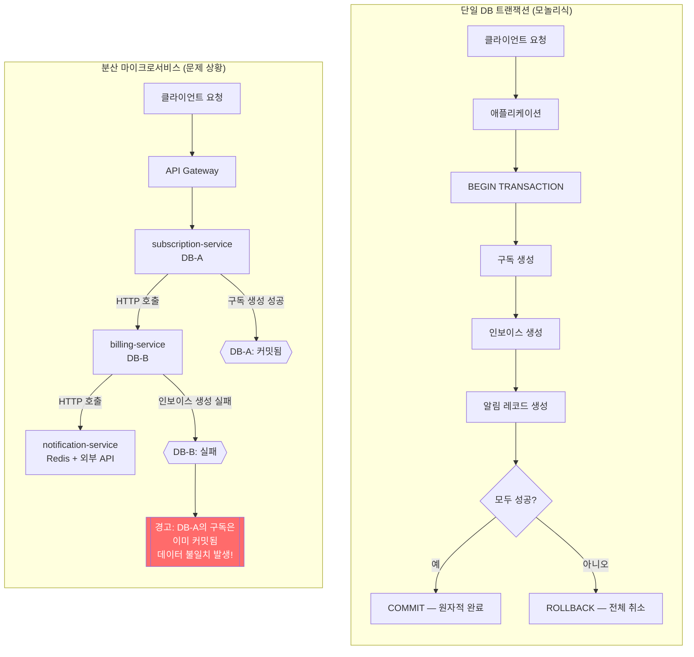
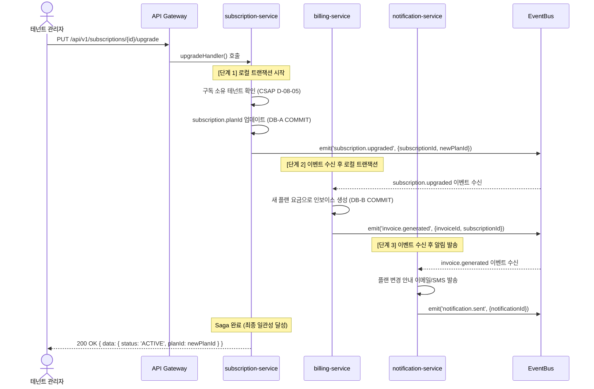
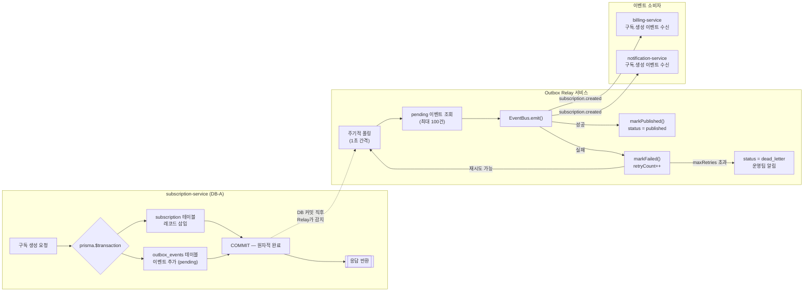
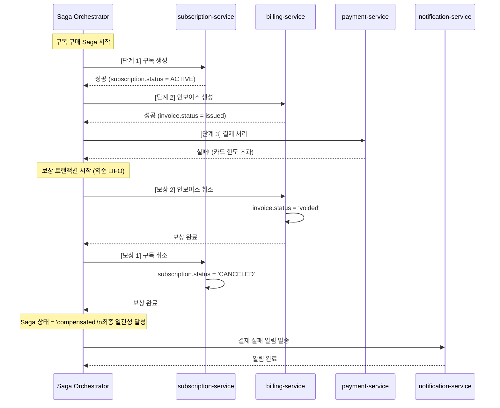

# 분산 트랜잭션 패턴 — Saga, 2PC 없이 일관성 달성하기

> **문서 ID**: DEV-DIST-26
> **버전**: 1.0.0 | **작성일**: 2026-04-13 | **작성자**: Implementer (Sonnet)
> **목적**: 마이크로서비스 환경에서 Saga 패턴과 Outbox 패턴을 통해 분산 트랜잭션 일관성을 달성하는 방법을 초급자가 완전히 이해할 수 있도록 설명합니다.
> **선행 학습**: [25-event-driven-architecture.md](./25-event-driven-architecture.md)

---

## 목차

1. [분산 트랜잭션 문제](#1-분산-트랜잭션-문제)
2. [Saga 패턴 완전 이해](#2-saga-패턴-완전-이해)
3. [Outbox 패턴 구현](#3-outbox-패턴-구현)
4. [Task Queue 기반 분산 작업](#4-task-queue-기반-분산-작업)
5. [사가 실패 시나리오 처리](#5-사가-실패-시나리오-처리)
6. [실전 구현 예제](#6-실전-구현-예제)
7. [테스트 전략](#7-테스트-전략)
8. [변경 이력](#변경-이력)

---

## 1. 분산 트랜잭션 문제

### 1.1 왜 단일 DB 트랜잭션이 마이크로서비스에서 불가능한가

단일 모놀리식 애플리케이션에서는 다음 코드가 정상적으로 동작합니다.

```typescript
// 모놀리식 애플리케이션: 단일 DB 트랜잭션
await prisma.$transaction(async (tx) => {
  const subscription = await tx.subscription.create({ ... });
  const invoice = await tx.invoice.create({ subscriptionId: subscription.id, ... });
  await tx.notification.create({ userId: subscription.tenantId, message: '구독 활성화' });
  // 모두 성공하거나 모두 실패 (원자성 보장)
});
```

이 코드는 세 가지 작업(구독 생성, 인보이스 생성, 알림 생성)을 하나의 DB 트랜잭션으로 묶어 **원자성(Atomicity)**을 보장합니다. 하나가 실패하면 모두 롤백됩니다.

그런데 공공기관 SaaS 플랫폼이 마이크로서비스로 분리되면 다음 문제가 발생합니다.

- `subscription-service`는 PostgreSQL 데이터베이스 A를 사용합니다.
- `billing-service`는 PostgreSQL 데이터베이스 B를 사용합니다.
- `notification-service`는 Redis와 외부 발송 API를 사용합니다.

**서로 다른 데이터베이스 간에는 단일 ACID 트랜잭션을 사용할 수 없습니다.** 각 서비스는 자신만의 데이터 저장소를 가지며, 이 저장소들은 네트워크로 분리되어 있습니다.

### 1.2 2PC(2단계 커밋)가 현실적이지 않은 이유

2단계 커밋(Two-Phase Commit, 2PC)은 분산 환경에서 원자성을 보장하는 고전적 방법입니다.

- **1단계(Prepare)**: 코디네이터가 모든 참여자에게 커밋 준비를 묻습니다.
- **2단계(Commit/Abort)**: 모두 준비 완료이면 커밋, 하나라도 실패이면 전체 중단합니다.

그러나 2PC는 공공기관 SaaS 환경에서 다음 이유로 사용하지 않습니다.

| 문제 | 설명 |
|------|------|
| 성능 저하 | 모든 참여자가 잠금(Lock)을 유지하며 코디네이터 응답을 기다려야 합니다. |
| 단일 장애점 | 코디네이터가 다운되면 모든 참여자가 잠금 상태로 멈춥니다. |
| 가용성 감소 | CAP 정리상 분산 환경에서 일관성(C)을 선택하면 가용성(A)을 포기해야 합니다. |
| NoSQL 미지원 | Redis, Elasticsearch 등 많은 저장소가 XA 프로토콜을 지원하지 않습니다. |

### 1.3 단일 DB 트랜잭션 vs 분산 환경 비교



위 다이어그램에서 분산 환경의 핵심 문제를 확인할 수 있습니다. `billing-service`가 실패해도 `subscription-service`의 데이터는 이미 커밋되어 **부분 성공 상태**가 됩니다. 이것이 분산 트랜잭션 문제입니다.

### 1.4 해결책: 최종 일관성(Eventual Consistency)

이 프로젝트는 **강한 일관성 대신 최종 일관성**을 채택합니다.

> "모든 서비스가 동시에 일관된 상태를 가질 필요는 없다. 결국에는 일관된 상태가 된다."

최종 일관성을 달성하기 위해 다음 패턴을 조합합니다.

- **Saga 패턴**: 분산 트랜잭션을 여러 로컬 트랜잭션의 순서로 분해합니다.
- **보상 트랜잭션**: 실패 시 이미 완료된 단계를 역순으로 취소합니다.
- **Outbox 패턴**: 이벤트 발행의 원자성을 보장합니다.
- **멱등성**: 동일 메시지를 여러 번 받아도 결과가 동일하도록 합니다.

---

## 2. Saga 패턴 완전 이해

### 2.1 Saga란 무엇인가

Saga는 **여러 로컬 트랜잭션의 순서**로 구성된 분산 트랜잭션 패턴입니다. 1987년 Hector Garcia-Molina와 Kenneth Salem이 논문에서 처음 소개했습니다.

핵심 아이디어는 다음과 같습니다.

- 큰 분산 트랜잭션을 `T1 → T2 → T3` 순서의 로컬 트랜잭션으로 분해합니다.
- 각 로컬 트랜잭션은 자신의 데이터베이스에서 ACID를 보장합니다.
- `T2`가 실패하면 `T1`을 취소하는 **보상 트랜잭션 C1**을 실행합니다.
- Saga의 최종 상태는 `T1, T2, T3 모두 성공` 또는 `T1이 취소됨` 입니다.

### 2.2 Choreography Saga vs Orchestration Saga 비교

두 가지 Saga 구현 방식이 있습니다.

#### Choreography Saga (안무 기반)

각 서비스가 이벤트를 발행하고, 다음 서비스가 그 이벤트를 구독해서 다음 단계를 실행합니다. 중앙 조정자가 없습니다.

```
subscription-service → [구독 생성 이벤트] → billing-service
billing-service → [인보이스 생성 이벤트] → notification-service
notification-service → [알림 발송 완료 이벤트] → (끝)
```

#### Orchestration Saga (오케스트레이션 기반)

중앙 오케스트레이터가 각 서비스를 직접 호출하고 순서를 제어합니다.

```
Saga Orchestrator → HTTP 호출 → subscription-service
Saga Orchestrator → HTTP 호출 → billing-service
Saga Orchestrator → HTTP 호출 → notification-service
```

#### 비교표

| 특성 | Choreography | Orchestration |
|------|-------------|---------------|
| 결합도 | 느슨한 결합 | 오케스트레이터에 종속 |
| 디버깅 | 복잡 (이벤트 추적 필요) | 단순 (중앙 상태 확인) |
| 단일 장애점 | 없음 | 오케스트레이터 |
| 적합 규모 | 서비스가 많을수록 유리 | 단계가 복잡할수록 유리 |
| 이 프로젝트 선택 | **기본 선택** | 복잡한 비즈니스 플로우 |

### 2.3 이 프로젝트에서 Choreography를 선택한 이유

이 공공기관 SaaS 플랫폼은 **Choreography Saga를 기본으로 선택**했습니다. 이유는 다음과 같습니다.

1. **서비스 자율성**: 각 서비스(`billing-service`, `subscription-service` 등)는 독립적으로 배포되고 확장되어야 합니다. 중앙 오케스트레이터가 있으면 그 서비스의 배포 주기에 종속됩니다.

2. **장애 격리**: notification-service의 장애가 subscription-service에 전파되지 않아야 합니다.

3. **이벤트 감사**: CSAP D-06 요건에 따라 모든 이벤트를 감사 로그에 기록해야 합니다. 이벤트 기반 Choreography는 자연스럽게 감사 추적을 만들어 냅니다.

그러나 **복잡한 비즈니스 플로우**(예: 여러 서비스에 걸친 결제 정산)에서는 `platform/packages/saga` 패키지의 Orchestration Saga를 사용합니다.

### 2.4 보상 트랜잭션(Compensating Transaction) 패턴

보상 트랜잭션은 이미 완료된 로컬 트랜잭션을 **비즈니스 수준에서 취소**하는 것입니다.

중요한 점은, 보상 트랜잭션은 DB 롤백이 아닙니다. 이미 커밋된 데이터를 비즈니스 로직으로 되돌리는 새로운 트랜잭션입니다.

| 정방향 트랜잭션 | 보상 트랜잭션 |
|---------------|-------------|
| 구독 상태를 ACTIVE로 변경 | 구독 상태를 CANCELED로 변경 |
| 인보이스 생성 (status: issued) | 인보이스 상태를 VOIDED로 변경 |
| 결제 처리 (status: completed) | 환불 처리 (status: refunded) |

### 2.5 Saga 상태 머신

이 프로젝트의 `platform/packages/saga/src/saga.ts`는 다음 상태 머신을 구현합니다.

```typescript
// Design Ref: docs/02-design/mtus/SVC-SAGA-R44.design.md §상태머신
export type SagaStatus =
  | 'pending'            // 시작 전
  | 'running'            // 실행 중
  | 'completed'          // 모든 단계 성공
  | 'compensating'       // 보상 중
  | 'compensated'        // 보상 완료 (최종 일관성 달성)
  | 'failed_compensation'; // 보상도 실패 (수동 개입 필요)
```

상태 전환 흐름을 정리하면 다음과 같습니다.

```
pending → running → completed         (정상 흐름)
running → compensating → compensated  (실패 후 보상 성공)
compensating → failed_compensation    (보상도 실패, 수동 개입 필요)
```

### 2.6 구독 플랜 변경 Saga Sequence Diagram

구독 플랜 변경 시 billing-service → subscription-service → notification-service 순서로 진행됩니다.



### 2.7 멱등성(Idempotency) 보장 방법

마이크로서비스 환경에서 네트워크 장애로 같은 이벤트가 여러 번 수신될 수 있습니다. **멱등성**은 동일한 요청을 여러 번 처리해도 결과가 동일함을 보장하는 성질입니다.

이 프로젝트는 `platform/packages/idempotency`를 사용합니다.

```typescript
// platform/packages/idempotency/src/idempotency.ts 활용 예시
// Plan SC: FR-ID.1~FR-ID.6
import { IdempotencyManager, withIdempotency } from '@public-saas/idempotency';

const idempotencyManager = new IdempotencyManager({ ttlMs: 24 * 60 * 60 * 1000 }); // 24시간

// 구독 업그레이드 이벤트 핸들러 (멱등성 적용)
async function handleSubscriptionUpgraded(event: SubscriptionUpgradedEvent): Promise<void> {
  const idempotencyKey = `invoice:create:${event.subscriptionId}:${event.newPlanId}`;
  const requestHash = hashObject(event); // 이벤트 내용으로 해시 생성

  const { result, cached } = await withIdempotency(
    idempotencyManager,
    idempotencyKey,
    requestHash,
    async () => {
      // 이 블록은 동일 키로 최초 1회만 실행됨
      return await prisma.invoice.create({ data: { subscriptionId: event.subscriptionId, ... } });
    }
  );

  if (cached) {
    // 이미 처리된 이벤트 — 중복 수신이었으므로 무시
    return;
  }

  // result를 사용한 후속 처리
}
```

멱등성 키 설계 원칙은 다음과 같습니다.

- **이벤트 ID 사용**: `invoice:create:{eventId}`
- **복합 키 사용**: `invoice:create:{subscriptionId}:{planId}:{periodStart}`
- **TTL 설정**: 24시간~7일 (비즈니스 요건에 따라)

---

## 3. Outbox 패턴 구현

### 3.1 왜 Outbox 패턴이 필요한가

다음 코드에는 심각한 문제가 있습니다.

```typescript
// 위험한 코드 — 절대 사용 금지
async function createSubscription(data: CreateSubscriptionDto): Promise<void> {
  // 1. DB에 저장
  const subscription = await prisma.subscription.create({ data });
  
  // 2. 이벤트 발행 ← 이 사이에 서버가 다운되면?
  await eventBus.emit('subscription.created', { subscriptionId: subscription.id });
}
```

DB 저장 후 이벤트 발행 사이에 서버가 재시작되면 이벤트가 유실됩니다. `billing-service`는 구독 생성을 알지 못하고 인보이스를 생성하지 않습니다.

**Outbox 패턴**은 이 문제를 해결합니다. DB 저장과 이벤트 추가를 **같은 트랜잭션**으로 처리하고, 별도의 Relay 프로세스가 이벤트를 발행합니다.

### 3.2 트랜잭션 아웃박스 테이블 스키마

```sql
-- Outbox 테이블 (각 서비스의 DB에 존재)
CREATE TABLE outbox_events (
  id           VARCHAR(24)  PRIMARY KEY,   -- 이벤트 고유 ID (hex)
  event_type   VARCHAR(100) NOT NULL,      -- 예: 'subscription.created'
  aggregate_id VARCHAR(36),               -- 집계 루트 ID (순서 보장용)
  payload      JSONB        NOT NULL,      -- 이벤트 데이터
  status       VARCHAR(20)  NOT NULL DEFAULT 'pending',  -- pending|published|dead_letter
  retry_count  INTEGER      NOT NULL DEFAULT 0,
  last_error   TEXT,
  created_at   BIGINT       NOT NULL,      -- Unix timestamp (ms)
  updated_at   BIGINT       NOT NULL
);

-- 인덱스: Relay 서비스가 pending 이벤트를 빠르게 조회
CREATE INDEX idx_outbox_status_created ON outbox_events (status, created_at)
  WHERE status = 'pending';

-- 인덱스: 집계별 순서 조회
CREATE INDEX idx_outbox_aggregate ON outbox_events (aggregate_id, created_at);
```

### 3.3 실제 구현 — Outbox 클래스

이 프로젝트의 `platform/packages/outbox/src/outbox.ts`는 다음과 같이 구현되어 있습니다.

```typescript
// platform/packages/outbox/src/outbox.ts 발췌
// Design Ref: SVC-OUTBOX-R43 DESIGN
// Plan SC: FR-OB.1~FR-OB.6

// 구독 생성과 Outbox 이벤트를 원자적으로 처리
async function createSubscriptionWithOutbox(
  data: CreateSubscriptionDto,
  outbox: Outbox,
): Promise<Subscription> {
  // Prisma 트랜잭션 내에서 구독 생성 + Outbox 이벤트 추가
  const subscription = await prisma.$transaction(async (tx) => {
    // 1. 구독 생성 (로컬 트랜잭션)
    const sub = await tx.subscription.create({ data });
    
    // 2. Outbox 이벤트 추가 (같은 트랜잭션)
    // NOTE: 실제 운영에서는 tx를 사용하는 OutboxStore가 필요
    await outbox.append({
      eventType: 'subscription.created',
      payload: { subscriptionId: sub.id, planId: sub.planId, tenantId: sub.tenantId },
      aggregateId: sub.tenantId, // 테넌트별 순서 보장
    });
    
    return sub;
  });
  
  return subscription;
}
```

### 3.4 Relay 서비스 구현

Relay 서비스는 주기적으로 Outbox 테이블을 폴링하여 이벤트를 발행합니다.

```typescript
// Relay 서비스 (platform/packages/outbox를 활용)
// Plan SC: FR-OB.2, FR-OB.3

class OutboxRelay {
  constructor(
    private readonly outbox: Outbox,
    private readonly eventBus: EventBus,
    private readonly pollIntervalMs: number = 1000,
  ) {}

  async start(): Promise<void> {
    while (true) {
      await this.processNextBatch();
      await sleep(this.pollIntervalMs);
    }
  }

  private async processNextBatch(): Promise<void> {
    // 미발행 이벤트 최대 100건 조회
    const pendingEvents = await this.outbox.fetchPending(100);
    
    for (const event of pendingEvents) {
      try {
        // EventBus로 이벤트 발행
        await this.eventBus.emit(event.eventType, event.payload);
        
        // 발행 완료 마킹
        await this.outbox.markPublished(event.id);
      } catch (error) {
        // 실패 처리 (재시도 or dead-letter)
        const disposition = await this.outbox.markFailed(event.id, error as Error);
        
        if (disposition === 'dead') {
          // Dead Letter Queue로 이동 — 운영팀 알림 필요
          await alertOps(`Outbox 이벤트 발행 실패 (dead letter): ${event.id}`);
        }
      }
    }
  }
}
```

### 3.5 Outbox 패턴 흐름



### 3.6 중복 메시지 처리 (Deduplication Key)

Relay 서비스는 at-least-once 방식으로 이벤트를 발행합니다. 네트워크 오류로 인해 같은 이벤트가 두 번 발행될 수 있습니다. 수신 측에서는 `event.id`를 중복 제거 키로 사용합니다.

```typescript
// billing-service: 중복 이벤트 제거
const processedEventIds = new Set<string>();

async function onSubscriptionCreated(event: OutboxEvent): Promise<void> {
  // 이미 처리한 이벤트인지 확인 (deduplication)
  if (processedEventIds.has(event.id)) {
    return; // 중복 이벤트 무시
  }
  
  // 또는 IdempotencyManager 사용 (영속적 중복 제거)
  const { cached } = await withIdempotency(
    idempotencyManager,
    `billing:invoice:${event.id}`, // event.id가 deduplication key
    event.id,
    async () => {
      return await prisma.invoice.create({ ... });
    }
  );
  
  if (!cached) {
    processedEventIds.add(event.id);
  }
}
```

---

## 4. Task Queue 기반 분산 작업

### 4.1 Task Queue란

이 프로젝트는 `platform/packages/task-queue`를 통해 **동시성 제한 태스크 큐**를 제공합니다. BullMQ와 같은 외부 의존성 없이 우선순위 기반 작업 스케줄링을 구현합니다.

```typescript
// platform/packages/task-queue/src/task-queue.ts 발췌
// Design Ref: SVC-QUEUE-R36 DESIGN
// Plan SC: FR-TQ.1~FR-TQ.6

const taskQueue = new TaskQueue({ concurrency: 5 }); // 최대 5개 동시 실행

// 우선순위가 다른 작업 추가
await taskQueue.add(async () => {
  await sendNotification(userId, '구독 만료 알림');
}, { priority: 1 }); // 일반 우선순위

await taskQueue.add(async () => {
  await sendCriticalAlert(tenantId, '결제 실패');
}, { priority: 10 }); // 높은 우선순위 (먼저 실행)
```

### 4.2 우선순위 기반 작업 처리

```typescript
// TaskQueue.add() 호출 흐름
//
// 큐 상태 (priority 내림차순 정렬):
// [결제 실패 알림: priority=10, 구독 만료 알림: priority=1]
//
// 실행 순서:
// 1. 결제 실패 알림 (priority=10) → 먼저 실행
// 2. 구독 만료 알림 (priority=1) → 다음 실행

// 동시성 제어
console.log(taskQueue.size);    // 대기 중인 작업 수
console.log(taskQueue.pending); // 실행 중인 작업 수

// 모든 작업 완료 대기
await taskQueue.idle();
```

### 4.3 재시도 정책 — 지수 백오프

외부 API 호출 실패 시 지수 백오프(Exponential Backoff) 전략을 사용합니다.

```typescript
// platform/packages/backoff 패키지를 활용한 재시도
import { ExponentialBackoff } from '@public-saas/backoff';

async function sendNotificationWithRetry(
  userId: string,
  message: string,
): Promise<void> {
  const backoff = new ExponentialBackoff({
    initialDelayMs: 1000,   // 첫 재시도: 1초 후
    maxDelayMs: 30000,      // 최대 대기: 30초
    multiplier: 2,           // 배수: 1초 → 2초 → 4초 → 8초 → 16초 → 30초
    maxAttempts: 5,
  });

  let lastError: Error | null = null;

  for (let attempt = 1; attempt <= backoff.maxAttempts; attempt++) {
    try {
      await notificationApiClient.send({ userId, message });
      return; // 성공
    } catch (error) {
      lastError = error as Error;
      const delay = backoff.getDelay(attempt);
      await sleep(delay);
    }
  }

  throw new Error(`알림 발송 ${backoff.maxAttempts}회 실패: ${lastError?.message}`);
}
```

### 4.4 Dead Letter Queue 처리

`platform/packages/event-bus`는 기본 3회 재시도 후 Dead Letter Queue에 항목을 추가합니다.

```typescript
// EventBus Dead Letter Queue 모니터링
// Design Ref: SVC-EVENT-R17 Plan
// Plan SC: FR-EVT.2

const eventBus = new EventBus({
  maxRetries: 3,           // 3회 재시도
  retryBaseDelay: 100,     // 기본 대기: 100ms (지수 백오프)
  maxDeadLetters: 1000,    // DLQ 최대 1000건
});

// DLQ 모니터링 (정기 실행)
setInterval(async () => {
  const deadLetters = eventBus.getDeadLetters();
  
  if (deadLetters.length > 0) {
    // CSAP D-06: 운영 감사 로그
    await auditLog({
      action: 'DLQ_ITEMS_DETECTED',
      count: deadLetters.length,
      items: deadLetters.map(item => ({
        event: item.event,
        error: item.error,
        attempts: item.attempts,
        timestamp: item.timestamp,
      })),
    });
    
    // 알림 발송 (Prometheus Alert 또는 Slack)
    await alertOps(`Dead Letter Queue 항목 발견: ${deadLetters.length}건`);
  }
}, 60 * 1000); // 1분마다 확인
```

### 4.5 billing → notification 작업 체인

결제 완료 후 알림 발송까지의 작업 체인 예시입니다.

```typescript
// billing-service: 결제 완료 후 알림 큐에 작업 추가
// Design Ref: DESIGN-MTU-P08 §4
// Plan SC: FR-P08.2, FR-P08.5

async function payInvoiceWithNotification(
  invoiceId: string,
  paymentData: PaymentData,
  taskQueue: TaskQueue,
): Promise<void> {
  // 1단계: 결제 처리 (billing-service 로컬 트랜잭션)
  const payment = await prisma.$transaction(async (tx) => {
    const invoice = await tx.invoice.findUnique({ where: { id: invoiceId } });
    if (invoice?.status === 'paid') return null;

    const created = await tx.payment.create({ data: { invoiceId, ...paymentData } });
    await tx.invoice.update({ where: { id: invoiceId }, data: { status: 'paid' } });
    return created;
  });

  if (!payment) return; // 이미 결제됨

  // 2단계: 알림 작업을 큐에 추가 (비동기, 실패해도 결제는 유지)
  await taskQueue.add(
    async () => {
      await eventBus.emit('payment.completed', {
        paymentId: payment.id,
        invoiceId: payment.invoiceId,
        amount: payment.amount,
      });
    },
    { priority: 5 }, // 결제 알림은 높은 우선순위
  );

  // CSAP D-06: 감사 로그
  await logBillingEvent('PAYMENT_COMPLETED', actor, payment.id, tenantId, ip, ua);
}
```

---

## 5. 사가 실패 시나리오 처리

### 5.1 부분 실패 감지

Orchestration Saga에서 `platform/packages/saga`는 각 단계의 실패를 감지하여 보상 트랜잭션을 자동으로 실행합니다.

```typescript
// Saga 실행 중 실패 감지 흐름
// Design Ref: docs/02-design/mtus/SVC-SAGA-R44.design.md §핵심 알고리즘
// Plan SC: FR-SAGA.1~FR-SAGA.10

const saga = new Saga<SubscriptionPurchaseContext>({
  onTransition: (event) => {
    // 모든 상태 전환을 감사 로그에 기록 (CSAP D-06)
    auditLog({
      action: `SAGA_${event.type.toUpperCase()}`,
      sagaId: event.sagaId,
      step: event.step,
      status: event.status,
      error: event.error,
    });
  }
});

try {
  await saga.execute(subscriptionPurchaseSaga, initialContext);
  // 모든 단계 성공
} catch (error) {
  if (error instanceof SagaExecutionError) {
    // 어느 단계에서 실패했는지 확인
    console.error('실패한 단계:', error.cause.message);
    console.log('Saga 상태:', error.status); // 'compensated' or 'failed_compensation'
    
    if (error.compensationFailures.length > 0) {
      // 보상 트랜잭션도 실패한 경우 — 수동 개입 필요
      await alertOps({
        severity: 'CRITICAL',
        message: '보상 트랜잭션 실패 — 수동 데이터 정합성 확인 필요',
        sagaId: definition.id,
        failures: error.compensationFailures,
      });
    }
  }
}
```

### 5.2 보상 트랜잭션 순서 보장

Saga 오케스트레이터는 완료된 단계를 역순(LIFO)으로 보상합니다.

```typescript
// saga.ts 내부 compensate() 메서드 발췌
// Plan SC: FR-SAGA.3, FR-SAGA.4
private async compensate(
  definition: SagaDefinition<TContext>,
  state: SagaState<TContext>,
): Promise<SagaCompensationFailure[]> {
  // completedSteps를 역순으로 순회 (LIFO)
  const reversed = [...state.completedSteps].reverse();
  
  // 예시: [결제, 인보이스, 구독] 순서로 완료되었다면
  // [구독, 인보이스, 결제] 순서로 보상
  for (const stepName of reversed) {
    const step = definition.steps.find(s => s.name === stepName);
    if (!step?.compensate) continue;
    
    await step.compensate(state.context); // 각 보상 트랜잭션 실행
  }
}
```

### 5.3 최종 일관성 검증 방법

보상 트랜잭션 완료 후 데이터 정합성을 검증합니다.

```typescript
// 최종 일관성 검증 서비스
async function verifyConsistency(tenantId: string): Promise<ConsistencyReport> {
  const [subscriptions, invoices, payments] = await Promise.all([
    prisma.subscription.findMany({ where: { tenantId, status: 'ACTIVE' } }),
    prisma.invoice.findMany({
      where: { subscription: { is: { tenantId } }, status: { not: 'voided' } }
    }),
    prisma.payment.findMany({
      where: { invoice: { is: { subscription: { is: { tenantId } } } } }
    }),
  ]);

  const issues: string[] = [];

  // 규칙 1: ACTIVE 구독은 최소 1개의 인보이스를 가져야 함
  for (const sub of subscriptions) {
    const subInvoices = invoices.filter(inv => inv.subscriptionId === sub.id);
    if (subInvoices.length === 0) {
      issues.push(`구독 ${sub.id}: 인보이스 없음 (데이터 불일치)`);
    }
  }

  // 규칙 2: paid 상태 인보이스는 payment 레코드를 가져야 함
  const paidInvoices = invoices.filter(inv => inv.status === 'paid');
  for (const inv of paidInvoices) {
    const invPayments = payments.filter(p => p.invoiceId === inv.id);
    if (invPayments.length === 0) {
      issues.push(`인보이스 ${inv.id}: paid 상태이나 결제 레코드 없음`);
    }
  }

  return { tenantId, isConsistent: issues.length === 0, issues };
}
```

### 5.4 실패 시 보상 트랜잭션 롤백 흐름



### 5.5 failed_compensation 상태 처리

보상 트랜잭션까지 실패한 경우는 가장 심각한 상황입니다.

```typescript
// failed_compensation 상태 알림 처리
// Plan SC: FR-SAGA.10

async function handleFailedCompensation(
  error: SagaExecutionError,
  sagaId: string,
): Promise<void> {
  // CSAP D-06: 심각도 CRITICAL로 감사 로그 기록
  await auditLog({
    action: 'SAGA_COMPENSATION_FAILED',
    sagaId,
    originalError: error.cause.message,
    compensationFailures: error.compensationFailures,
    severity: 'CRITICAL',
  });

  // 운영팀 즉시 알림 (이메일, SMS, PagerDuty 등)
  await alertOps({
    severity: 'CRITICAL',
    title: '분산 트랜잭션 보상 실패 — 즉시 확인 필요',
    sagaId,
    failures: error.compensationFailures,
    action: '수동 데이터 정합성 확인 및 복구 필요',
  });

  // Dead Letter Queue에 수동 재처리 요청 추가
  await deadLetterQueue.add({
    type: 'FAILED_SAGA',
    sagaId,
    failures: error.compensationFailures,
    createdAt: new Date().toISOString(),
  });
}
```

---

## 6. 실전 구현 예제

### 6.1 구독 구매 플로우: 결제 → 구독 활성화 → 알림 발송

실제 `subscription-service`와 `billing-service` 코드를 기반으로 한 통합 예제입니다.

```typescript
// 구독 구매 Saga 정의
// Design Ref: DESIGN-MTU-P07 §4, DESIGN-MTU-P08 §3
// Plan SC: FR-P07.2, FR-P08.2, FR-SAGA.1

interface SubscriptionPurchaseContext {
  tenantId: string;
  planId: string;
  paymentMethod: 'card' | 'bank_transfer' | 'virtual_account';
  idempotencyKey: string;
  // 각 단계에서 채워지는 결과
  subscriptionId?: string;
  invoiceId?: string;
  paymentId?: string;
}

const subscriptionPurchaseSaga: SagaDefinition<SubscriptionPurchaseContext> = {
  id: `subscription-purchase:${crypto.randomUUID()}`,
  steps: [
    {
      name: 'create-subscription',
      timeoutMs: 10000, // 10초 타임아웃 (Design Ref: FR-SAGA.7)
      execute: async (ctx) => {
        // CSAP D-08-05: 테넌트 격리 검증 (subscription-service 실제 코드 기반)
        const subscription = await prisma.subscription.create({
          data: {
            tenantId: ctx.tenantId,
            planId: ctx.planId,
            status: 'PENDING', // 결제 완료 전까지 PENDING
            currentPeriodStart: new Date(),
            currentPeriodEnd: addMonths(new Date(), 1),
          },
        });
        ctx.subscriptionId = subscription.id;
      },
      compensate: async (ctx) => {
        // 보상: 구독 취소
        if (!ctx.subscriptionId) return;
        await prisma.subscription.update({
          where: { id: ctx.subscriptionId },
          data: { status: 'CANCELED', canceledAt: new Date() },
        });
        // 감사 로그 (CSAP D-06)
        await logSubscriptionEvent('SUBSCRIPTION_CANCELED_BY_SAGA', 'system',
          ctx.subscriptionId, ctx.tenantId, undefined, undefined);
      },
    },
    {
      name: 'create-invoice',
      timeoutMs: 10000,
      execute: async (ctx) => {
        // billing-service 실제 코드 기반
        const plan = await prisma.plan.findUnique({ where: { id: ctx.planId } });
        const invoice = await prisma.invoice.create({
          data: {
            subscriptionId: ctx.subscriptionId!,
            amount: plan!.price,
            currency: plan!.currency,
            status: 'issued',
            issuedAt: new Date(),
            dueDate: addDays(new Date(), 30),
          },
        });
        ctx.invoiceId = invoice.id;
      },
      compensate: async (ctx) => {
        // 보상: 인보이스 취소
        if (!ctx.invoiceId) return;
        await prisma.invoice.update({
          where: { id: ctx.invoiceId },
          data: { status: 'voided' },
        });
        await logBillingEvent('INVOICE_VOIDED_BY_SAGA', 'system',
          ctx.invoiceId!, ctx.tenantId, undefined, undefined);
      },
    },
    {
      name: 'process-payment',
      timeoutMs: 30000, // 결제는 30초 타임아웃
      execute: async (ctx) => {
        // H-02 수정: 트랜잭션으로 원자적 처리 (billing.handler.ts 패턴)
        const payment = await prisma.$transaction(async (tx) => {
          const latestInvoice = await tx.invoice.findUnique({
            where: { id: ctx.invoiceId! },
            select: { status: true },
          });
          if (latestInvoice?.status === 'paid') {
            throw new Error('이미 결제된 인보이스입니다');
          }
          const created = await tx.payment.create({
            data: {
              invoiceId: ctx.invoiceId!,
              amount: 0, // 실제 결제 금액
              method: ctx.paymentMethod,
              status: 'completed',
              paidAt: new Date(),
            },
          });
          await tx.invoice.update({
            where: { id: ctx.invoiceId! },
            data: { status: 'paid', paidAt: new Date() },
          });
          return created;
        });
        ctx.paymentId = payment.id;
      },
      compensate: async (ctx) => {
        // 보상: 환불 처리
        if (!ctx.paymentId) return;
        await prisma.payment.update({
          where: { id: ctx.paymentId },
          data: { status: 'refunded' },
        });
        await logBillingEvent('PAYMENT_REFUNDED_BY_SAGA', 'system',
          ctx.paymentId!, ctx.tenantId, undefined, undefined);
      },
    },
    {
      name: 'activate-subscription',
      timeoutMs: 5000,
      execute: async (ctx) => {
        // 결제 완료 후 구독 활성화
        await prisma.subscription.update({
          where: { id: ctx.subscriptionId! },
          data: { status: 'ACTIVE' },
        });
        // Outbox에 이벤트 추가
        await outbox.append({
          eventType: 'subscription.activated',
          payload: { subscriptionId: ctx.subscriptionId!, tenantId: ctx.tenantId },
          aggregateId: ctx.tenantId,
        });
      },
      // 활성화 단계는 보상 없음 — 구독 취소 단계에서 처리됨
    },
    {
      name: 'send-notification',
      timeoutMs: 5000,
      execute: async (ctx) => {
        // notification-service에 이벤트 발행 (Choreography)
        await eventBus.emit('payment.completed.notify', {
          tenantId: ctx.tenantId,
          subscriptionId: ctx.subscriptionId!,
          paymentId: ctx.paymentId!,
          message: '구독이 활성화되었습니다',
        });
      },
      // 알림 실패는 보상 트랜잭션 없음 — 알림은 비즈니스 크리티컬 아님
    },
  ],
};
```

### 6.2 테넌트 비활성화 플로우

테넌트 비활성화는 여러 서비스에 걸친 복잡한 Saga입니다.

```typescript
// 테넌트 비활성화 Saga
// Plan SC: FR-P07.2, FR-P08.2

interface TenantDeactivationContext {
  tenantId: string;
  adminUserId: string;
  reason: string;
  subscriptionIds: string[];
}

const tenantDeactivationSaga: SagaDefinition<TenantDeactivationContext> = {
  id: `tenant-deactivate:${tenantId}:${Date.now()}`,
  steps: [
    {
      name: 'cancel-active-subscriptions',
      execute: async (ctx) => {
        // 모든 ACTIVE 구독 취소
        const subs = await prisma.subscription.findMany({
          where: { tenantId: ctx.tenantId, status: 'ACTIVE' },
        });
        ctx.subscriptionIds = subs.map(s => s.id);
        
        await prisma.subscription.updateMany({
          where: { tenantId: ctx.tenantId, status: 'ACTIVE' },
          data: { status: 'CANCELED', canceledAt: new Date() },
        });
        
        // 감사 로그 (CSAP D-06)
        await logSubscriptionEvent('TENANT_DEACTIVATION_SUBSCRIPTIONS_CANCELED',
          ctx.adminUserId, ctx.tenantId, ctx.tenantId, undefined, undefined,
          { count: subs.length, reason: ctx.reason });
      },
      compensate: async (ctx) => {
        // 보상: 구독 재활성화 (비활성화 실패 시)
        await prisma.subscription.updateMany({
          where: { id: { in: ctx.subscriptionIds } },
          data: { status: 'ACTIVE', canceledAt: null },
        });
      },
    },
    {
      name: 'void-pending-invoices',
      execute: async (ctx) => {
        // 미결제 인보이스 취소
        await prisma.invoice.updateMany({
          where: {
            subscription: { is: { tenantId: ctx.tenantId } },
            status: 'issued',
          },
          data: { status: 'voided' },
        });
      },
      compensate: async (ctx) => {
        // 보상: 인보이스 복구 (issued 상태로 복원)
        await prisma.invoice.updateMany({
          where: {
            subscription: { is: { tenantId: ctx.tenantId } },
            status: 'voided',
          },
          data: { status: 'issued' },
        });
      },
    },
    {
      name: 'preserve-data',
      execute: async (ctx) => {
        // 데이터 보존: 테넌트 상태만 변경, 데이터는 삭제 안 함 (CSAP 요건)
        await prisma.tenant.update({
          where: { id: ctx.tenantId },
          data: {
            status: 'INACTIVE',
            deactivatedAt: new Date(),
            deactivationReason: ctx.reason,
          },
        });
      },
      compensate: async (ctx) => {
        // 보상: 테넌트 재활성화
        await prisma.tenant.update({
          where: { id: ctx.tenantId },
          data: { status: 'ACTIVE', deactivatedAt: null, deactivationReason: null },
        });
      },
    },
    {
      name: 'audit-log',
      execute: async (ctx) => {
        // CSAP D-06: 테넌트 비활성화 감사 로그 (삭제 불가, append-only)
        await auditLog({
          action: 'TENANT_DEACTIVATED',
          actor: ctx.adminUserId,
          target: ctx.tenantId,
          timestamp: new Date().toISOString(),
          metadata: {
            reason: ctx.reason,
            canceledSubscriptions: ctx.subscriptionIds.length,
          },
        });
      },
      // 감사 로그는 보상 불가 (CSAP 요건: append-only)
    },
    {
      name: 'send-notification',
      execute: async (ctx) => {
        await eventBus.emit('tenant.deactivated', {
          tenantId: ctx.tenantId,
          reason: ctx.reason,
          message: '서비스가 비활성화되었습니다. 데이터는 90일간 보존됩니다.',
        });
      },
    },
  ],
};
```

---

## 7. 테스트 전략

### 7.1 Saga 단위 테스트

```typescript
// platform/packages/saga/tests/saga.test.ts 기반
// Plan SC: FR-SAGA.1~FR-SAGA.10

describe('Saga 오케스트레이터', () => {
  let saga: Saga<{ results: string[] }>;

  beforeEach(() => {
    saga = new Saga({
      onTransition: (event) => {
        // 상태 전환 이벤트 기록 (테스트에서 검증)
      }
    });
  });

  it('모든 단계 성공 시 completed 상태', async () => {
    const definition: SagaDefinition<{ results: string[] }> = {
      id: 'test-saga-success',
      steps: [
        {
          name: '단계1',
          execute: async (ctx) => { ctx.results.push('단계1 완료'); },
        },
        {
          name: '단계2',
          execute: async (ctx) => { ctx.results.push('단계2 완료'); },
        },
      ],
    };

    const state = await saga.execute(definition, { results: [] });

    expect(state.status).toBe('completed');
    expect(state.completedSteps).toEqual(['단계1', '단계2']);
    expect(state.context.results).toEqual(['단계1 완료', '단계2 완료']);
  });

  it('중간 단계 실패 시 역순 보상 실행', async () => {
    const compensationOrder: string[] = [];

    const definition: SagaDefinition<{ results: string[] }> = {
      id: 'test-saga-compensate',
      steps: [
        {
          name: '구독생성',
          execute: async (ctx) => { ctx.results.push('구독 생성'); },
          compensate: async () => { compensationOrder.push('구독 취소'); },
        },
        {
          name: '인보이스생성',
          execute: async (ctx) => { ctx.results.push('인보이스 생성'); },
          compensate: async () => { compensationOrder.push('인보이스 취소'); },
        },
        {
          name: '결제처리',
          execute: async () => { throw new Error('카드 한도 초과'); },
        },
      ],
    };

    await expect(saga.execute(definition, { results: [] }))
      .rejects.toThrow('카드 한도 초과');

    // 역순(LIFO) 보상 확인
    expect(compensationOrder).toEqual(['인보이스 취소', '구독 취소']);
  });

  it('보상 트랜잭션 실패 시 failed_compensation 상태', async () => {
    const definition: SagaDefinition<{ results: string[] }> = {
      id: 'test-saga-comp-fail',
      steps: [
        {
          name: '구독생성',
          execute: async (ctx) => { ctx.results.push('구독 생성'); },
          compensate: async () => { throw new Error('DB 연결 실패'); },
        },
        {
          name: '결제처리',
          execute: async () => { throw new Error('결제 실패'); },
        },
      ],
    };

    try {
      await saga.execute(definition, { results: [] });
    } catch (error) {
      expect(error).toBeInstanceOf(SagaExecutionError);
      const sagaError = error as SagaExecutionError;
      expect(sagaError.status).toBe('failed_compensation');
      expect(sagaError.compensationFailures).toHaveLength(1);
      expect(sagaError.compensationFailures[0]?.step).toBe('구독생성');
    }
  });

  it('단계별 타임아웃 동작 확인', async () => {
    const definition: SagaDefinition<{ results: string[] }> = {
      id: 'test-saga-timeout',
      steps: [
        {
          name: '느린단계',
          timeoutMs: 100, // 100ms 타임아웃
          execute: async () => {
            await sleep(500); // 500ms 소요 → 타임아웃 발생
          },
        },
      ],
    };

    await expect(saga.execute(definition, { results: [] }))
      .rejects.toThrow("timed out after 100ms");
  });
});
```

### 7.2 Outbox 패턴 테스트

```typescript
// platform/packages/outbox/tests/outbox.test.ts 기반

describe('Outbox 패턴', () => {
  let outbox: Outbox;

  beforeEach(() => {
    outbox = new Outbox({ maxRetries: 3 });
  });

  it('이벤트 추가 후 pending 상태', async () => {
    const id = await outbox.append({
      eventType: 'subscription.created',
      payload: { subscriptionId: 'sub-001' },
      aggregateId: 'tenant-001',
    });

    const pending = await outbox.fetchPending(10);
    expect(pending).toHaveLength(1);
    expect(pending[0]?.id).toBe(id);
    expect(pending[0]?.status).toBe('pending');
  });

  it('maxRetries 초과 시 dead_letter로 이동', async () => {
    const id = await outbox.append({
      eventType: 'payment.completed',
      payload: { paymentId: 'pay-001' },
    });

    // 4번 실패 (maxRetries=3 이므로 4번째에 dead_letter)
    for (let i = 0; i <= 3; i++) {
      await outbox.markFailed(id, new Error(`발행 실패 ${i}`));
    }

    const deadLetters = await outbox.getDeadLetter();
    expect(deadLetters).toHaveLength(1);
    expect(deadLetters[0]?.id).toBe(id);
  });

  it('멱등성: 동일 이벤트 중복 처리 방지', async () => {
    const idempotencyManager = new IdempotencyManager({ ttlMs: 60000 });
    const processedCount = { count: 0 };

    const handleEvent = async (eventId: string) => {
      const { cached } = await withIdempotency(
        idempotencyManager,
        `test:event:${eventId}`,
        eventId,
        async () => {
          processedCount.count++;
          return processedCount.count;
        }
      );
      return cached;
    };

    // 동일 이벤트 3번 수신
    await handleEvent('evt-001');
    const cached1 = await handleEvent('evt-001');
    const cached2 = await handleEvent('evt-001');

    expect(processedCount.count).toBe(1); // 1번만 처리됨
    expect(cached1).toBe(true);
    expect(cached2).toBe(true);
  });
});
```

### 7.3 보상 트랜잭션 검증

```typescript
// 통합 테스트: 실제 DB를 사용한 보상 트랜잭션 검증
describe('구독 구매 Saga 통합 테스트', () => {
  it('결제 실패 시 구독과 인보이스가 취소됨', async () => {
    const context: SubscriptionPurchaseContext = {
      tenantId: 'tenant-test-001',
      planId: 'plan-basic-001',
      paymentMethod: 'card',
      idempotencyKey: `test-${Date.now()}`,
    };

    // 결제 처리 단계에서 강제 실패
    const failingSaga = {
      ...subscriptionPurchaseSaga,
      steps: subscriptionPurchaseSaga.steps.map(step =>
        step.name === 'process-payment'
          ? { ...step, execute: async () => { throw new Error('카드 거부'); } }
          : step
      ),
    };

    await expect(saga.execute(failingSaga, context)).rejects.toThrow();

    // DB 상태 검증
    if (context.subscriptionId) {
      const sub = await prisma.subscription.findUnique({
        where: { id: context.subscriptionId }
      });
      expect(sub?.status).toBe('CANCELED'); // 보상으로 취소됨
    }

    if (context.invoiceId) {
      const inv = await prisma.invoice.findUnique({
        where: { id: context.invoiceId }
      });
      expect(inv?.status).toBe('voided'); // 보상으로 취소됨
    }
  });
});
```

### 7.4 테스트 전략 요약

| 테스트 유형 | 대상 | 검증 항목 |
|------------|------|---------|
| 단위 테스트 | Saga 오케스트레이터 | 상태 전환, 역순 보상, 타임아웃 |
| 단위 테스트 | Outbox Manager | pending/published/dead_letter 전환 |
| 단위 테스트 | IdempotencyManager | 중복 요청 방지, TTL 만료 |
| 통합 테스트 | 구독 구매 Saga | 실제 DB 보상 트랜잭션 |
| 통합 테스트 | Outbox Relay | 이벤트 발행 → 소비자 수신 |
| E2E 테스트 | 전체 구독 플로우 | 성공/실패 시나리오 |

---

## 변경 이력

| 버전 | 일자 | 내용 | 작성자 |
|------|------|------|--------|
| 1.0.0 | 2026-04-13 | 최초 작성 — Saga, Outbox, Task Queue 패턴 완전 가이드 | Implementer (Sonnet) |
