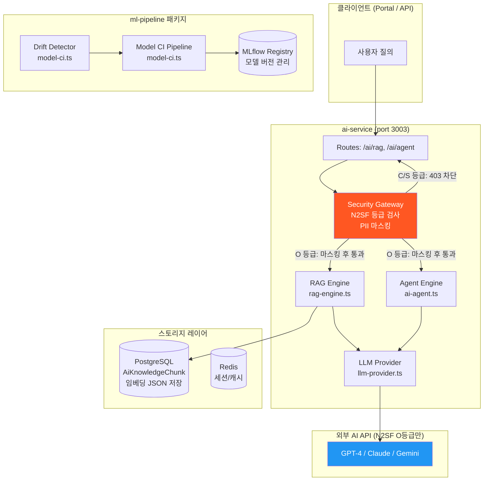
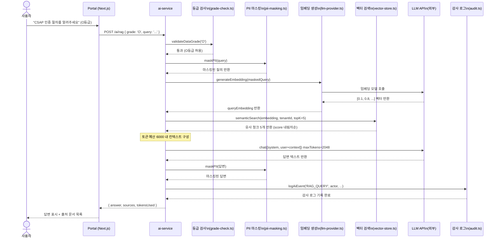
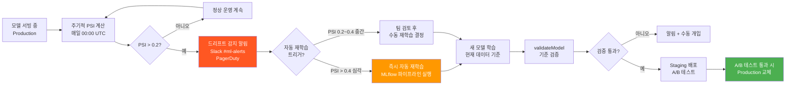
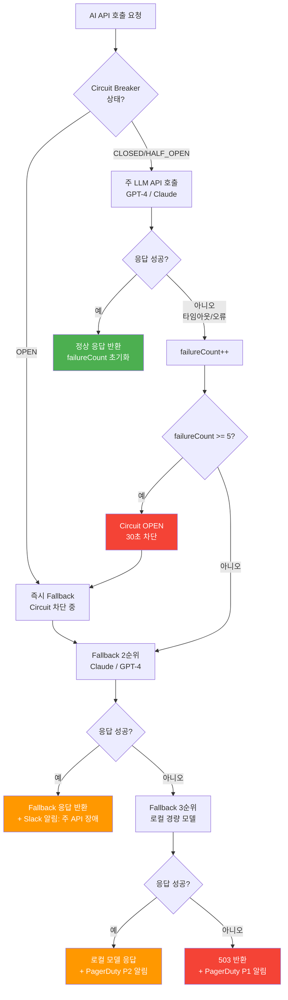

# AI/MLOps 실전 가이드 — RAG 파이프라인 운영, 모델 관리, 드리프트 대응

> **문서 ID**: ONBOARD-DEV-27
> **버전**: 1.0.0 | **작성일**: 2026-04-13 | **작성자**: Implementer (Sonnet)
> **목적**: ai-service RAG 파이프라인과 ml-pipeline 패키지를 운영·개발하는 실전 가이드
> **선행 학습**: `08-ai-development-guide.md` → 본 문서 → `27장 실습`

---

## 목차

1. [AI/MLOps 개요](#1-aimlops-개요)
2. [RAG 파이프라인 완전 해설](#2-rag-파이프라인-완전-해설)
3. [AI 에이전트 구현 패턴](#3-ai-에이전트-구현-패턴)
4. [모델 CI/CD](#4-모델-cicd)
5. [드리프트 탐지 및 대응](#5-드리프트-탐지-및-대응)
6. [AI 비용 관리](#6-ai-비용-관리)
7. [AI API 장애 대응](#7-ai-api-장애-대응)
8. [N2SF AI 보안 운영](#8-n2sf-ai-보안-운영)
9. [변경 이력](#변경-이력)

---

## 1. AI/MLOps 개요

### 1.1 이 프로젝트의 AI 아키텍처 전체 구성

공공기관 SaaS에서 AI는 단순한 기능이 아닙니다. N2SF 데이터 분류 체계와 CSAP 보안 요건이 AI 파이프라인 모든 단계에 적용됩니다. 데이터가 AI API로 전송되기 전에 등급 검사와 PII 마스킹이 자동으로 실행됩니다.


**핵심 구성요소 설명**

| 구성요소 | 위치 | 역할 | 주요 파일 |
|---------|------|------|---------|
| RAG Engine | ai-service | 문서 검색 + LLM 응답 생성 | `src/lib/rag-engine.ts` |
| Vector Store | ai-service | 임베딩 저장 + 유사도 검색 | `src/lib/vector-store.ts` |
| AI Agent | ai-service | 도구 호출 에이전트 실행 | `src/handlers/ai-agent.handler.ts` |
| Chunker | ai-service | 문서 청킹 전략 | `src/lib/chunker.ts` |
| Security Gateway | ai-service | N2SF 등급 검사 + PII 마스킹 | `src/lib/grade-check.ts`, `src/lib/pii-masking.ts` |
| Model CI | ml-pipeline | 모델 검증 + 레지스트리 등록 | `packages/ml-pipeline/src/model-ci.ts` |
| LLM Provider | ai-service | 다중 LLM 어댑터 | `src/lib/llm-provider.ts` |

### 1.2 AI 서비스 전체 구성도



---

## 2. RAG 파이프라인 완전 해설

### 2.1 RAG란 무엇인가

RAG(Retrieval-Augmented Generation)는 LLM이 자신이 학습하지 않은 내부 문서를 기반으로 답변을 생성하게 하는 기술입니다. 공공기관에서는 LLM을 그대로 사용하면 환각(hallucination) 문제가 발생합니다. 실제 행정 규정이나 내부 정책을 LLM이 모를 수 있기 때문입니다. RAG는 관련 문서를 먼저 검색한 뒤 그 내용을 컨텍스트로 LLM에 전달하여 정확한 답변을 생성합니다.

### 2.2 RAG 파이프라인 6단계

실제 `platform/services/ai-service/src/lib/rag-engine.ts` 코드를 기반으로 각 단계를 설명합니다.

**단계 1: 문서 수집 및 전처리**

문서는 행정 규정, 내부 정책, FAQs 등이 될 수 있습니다. 문서가 시스템에 등록되면 청킹, 임베딩 순서로 처리됩니다.

**단계 2: 청킹 (Chunking)**

긴 문서를 LLM이 처리할 수 있는 작은 조각으로 나누는 과정입니다.

```typescript
// src/lib/chunker.ts — 실제 청킹 전략
// 문서를 512~1024 토큰 단위로 분할
// 청크 간 overlap으로 문맥 연속성 유지
```

청킹 전략 선택 기준:

| 전략 | 청크 크기 | 적합한 문서 | 특징 |
|------|---------|---------|------|
| Fixed Size | 512 tokens | 균질한 텍스트 | 빠르고 간단 |
| Semantic | 가변 | 구조화된 문서 | 문단 경계 존중 |
| Sliding Window | 512 + 128 overlap | 연속 맥락 중요 | 경계 누락 방지 |

**단계 3: 임베딩 (Embedding)**

텍스트 청크를 고차원 벡터로 변환합니다. 의미적으로 유사한 텍스트는 벡터 공간에서 가까이 위치합니다.

```typescript
// rag-engine.ts의 generateEmbedding 함수 (실제 코드)
export async function generateEmbedding(
  text: string,
  embedModelId?: string,
): Promise<number[]> {
  // 임베딩 모델 조회: DB에서 embed 타입 모델 우선
  let embedConfig = getLLMConfig();

  if (embedModelId) {
    const model = await prisma.aiModel.findUnique({ where: { id: embedModelId } });
    if (model?.isActive) {
      embedConfig = buildLLMConfig({
        provider: model.provider,
        endpoint: model.endpoint,
        name: model.name,
        config: model.config
      });
    }
  } else {
    // DB에서 임베딩 모델 자동 선택 (name에 embed 포함)
    const embedModel = await prisma.aiModel.findFirst({
      where: { isActive: true, name: { contains: 'embed' } },
    });
    if (embedModel) {
      embedConfig = buildLLMConfig({ ... });
    }
  }

  const provider = await createLLMProvider(embedConfig);
  // PII 마스킹 후 임베딩 생성 (N2SF 준수)
  const result = await provider.embed([maskPII(text)]);
  return result.embeddings[0] ?? [];
}
```

**단계 4: 벡터 저장**

생성된 임베딩을 PostgreSQL에 JSON 형태로 저장합니다. 현재 구현은 pgvector 없이 순수 TypeScript로 코사인 유사도를 계산합니다.

```typescript
// vector-store.ts의 storeChunks 함수 (실제 코드)
export async function storeChunks(
  tenantId: string,
  documentId: string,
  chunks: Array<{
    content: string;
    chunkIndex: number;
    tokenCount: number;
    embedding: number[]
  }>,
): Promise<void> {
  const data = chunks.map((c) => ({
    tenantId,
    documentId,
    chunkIndex: c.chunkIndex,
    content: c.content,
    embeddingJson: JSON.stringify(c.embedding),  // JSON 직렬화 저장
    tokenCount: c.tokenCount,
  }));

  // 기존 청크 삭제 후 재저장 (upsert 효과)
  await db['aiKnowledgeChunk'].deleteMany({ where: { documentId } });
  await db['aiKnowledgeChunk'].createMany({ data });
}
```

> 참고: 현재는 소규모(최대 10,000 청크) 최적화 구현입니다. 대규모 지식베이스를 운영할 경우 pgvector 확장으로 마이그레이션이 권장됩니다.

**단계 5: 시맨틱 검색**

사용자 질의를 임베딩으로 변환한 후, 저장된 청크와 코사인 유사도를 계산합니다.

```typescript
// vector-store.ts의 cosineSimilarity + semanticSearch (실제 코드)
function cosineSimilarity(a: number[], b: number[]): number {
  if (a.length !== b.length || a.length === 0) return 0;
  let dotProduct = 0;
  let normA = 0;
  let normB = 0;
  for (let i = 0; i < a.length; i++) {
    const ai = a[i] ?? 0;
    const bi = b[i] ?? 0;
    dotProduct += ai * bi;
    normA += ai * ai;
    normB += bi * bi;
  }
  if (normA === 0 || normB === 0) return 0;
  return dotProduct / (Math.sqrt(normA) * Math.sqrt(normB));
}

// 시맨틱 검색: 상위 K개 유사 청크 반환
export async function semanticSearch(
  queryEmbedding: number[],
  tenantId: string,
  topK = 5,
  minScore = 0.3,  // 최소 유사도 임계값
): Promise<SearchResult[]> {
  // 테넌트 격리: tenantId 조건 필수 (CSAP)
  const chunks = await db['aiKnowledgeChunk'].findMany({
    where: { tenantId, document: { isActive: true } },
    take: 10000,  // 메모리 보호 상한
  });

  return chunks
    .map((chunk) => {
      const embedding = JSON.parse(chunk.embeddingJson);
      const score = cosineSimilarity(queryEmbedding, embedding);
      if (score < minScore) return null;
      return { chunk: { ...chunk, embedding }, score };
    })
    .filter(Boolean)
    .sort((a, b) => b.score - a.score)
    .slice(0, topK);
}
```

**단계 6: 컨텍스트 구성 + LLM 응답 생성**

검색된 청크를 컨텍스트로 조합하여 LLM에 전달합니다. 토큰 예산(기본 6,000 tokens)을 초과하지 않도록 제어합니다.

```typescript
// rag-engine.ts의 runRAG 함수 — 컨텍스트 구성 로직 (실제 코드)
for (const result of searchResults) {
  const chunkTokens = result.chunk.tokenCount;
  // 토큰 예산 초과 시 중단 (컨텍스트 오버플로우 방지)
  if (totalContextTokens + chunkTokens > maxContextTokens) break;

  const docTitle = String(result.chunk.metadata['documentTitle'] ?? '문서');
  contextText += `\n[문서: ${docTitle}, 청크 ${result.chunk.chunkIndex + 1}]\n${result.chunk.content}\n`;
  totalContextTokens += chunkTokens;

  sources.push({
    documentTitle: docTitle,
    chunkIndex: result.chunk.chunkIndex,
    score: result.score,
    excerpt: result.chunk.content.slice(0, 150) + '...',
  });
}

// PII 마스킹 후 LLM 전송 (N2SF 준수)
const maskedQuestion = maskPII(question);
const messages = [
  { role: 'system', content: systemPrompt ?? DEFAULT_SYSTEM_PROMPT },
  { role: 'user', content: `=== 참고 문서 ===\n${contextText}\n\n=== 질문 ===\n${maskedQuestion}` },
];
```

### 2.3 Advanced RAG — 하이브리드 검색 + Reranking

기본 RAG의 한계를 극복하기 위해 `runAdvancedRAG` 함수가 구현되어 있습니다.

**기본 RAG vs Advanced RAG 비교**

| 기능 | 기본 RAG | Advanced RAG |
|------|---------|-------------|
| 검색 방식 | 시맨틱 (코사인 유사도) | 하이브리드 (BM25 + 시맨틱 RRF) |
| Reranking | 없음 | LLM 기반 정밀 재평가 |
| 쿼리 확장 | 없음 | LLM이 다양한 관점으로 재작성 |
| 컨텍스트 압축 | 없음 | 관련 구절만 추출 |
| 토큰 효율 | 보통 | 높음 |

```typescript
// rag-engine.ts — Advanced RAG 옵션 (실제 코드)
export interface AdvancedRAGOptions extends RAGOptions {
  searchMode?: 'semantic' | 'keyword' | 'hybrid';  // 기본: 'hybrid'
  enableReranking?: boolean;     // 기본: true — LLM 정밀 재평가
  enableQueryExpansion?: boolean; // 기본: false — 성능 트레이드오프
  enableCompression?: boolean;   // 기본: false — 관련 구절만 추출
  bm25Weight?: number;           // BM25 가중치 (기본: 0.4)
}
```

BM25 가중치 가이드라인:
- 키워드 검색 중요: `bm25Weight = 0.7`
- 시맨틱 검색 중요: `bm25Weight = 0.2`
- 균형: `bm25Weight = 0.4` (기본값)

### 2.4 사용자 질의 → RAG 처리 → 응답 생성 전체 흐름



### 2.5 RAG 운영 시 자주 발생하는 문제와 해결책

**문제 1: 검색 결과가 없거나 부정확함**

```typescript
// 증상: answer = "해당 질문에 관련된 문서를 찾을 수 없습니다."

// 확인 순서:
// 1. 지식베이스 통계 확인
const stats = await getKnowledgeStats(tenantId);
console.log(stats); // { documentCount, chunkCount, totalTokens }

// 2. minScore 임계값 조정 (기본 0.25 → 0.15로 낮추기)
const result = await runRAG(tenantId, question, embedding, {
  topK: 5,
  minScore: 0.15,  // 임계값 하향 시도
});

// 3. Advanced RAG로 전환 (하이브리드 검색 활성화)
const result = await runAdvancedRAG(tenantId, question, embedding, {
  searchMode: 'hybrid',
  enableReranking: true,
});
```

**문제 2: 토큰 초과 오류**

```typescript
// maxContextTokens를 줄이거나 topK를 줄임
const result = await runRAG(tenantId, question, embedding, {
  topK: 3,              // 5 → 3
  maxContextTokens: 3000, // 6000 → 3000
});
```

**문제 3: 느린 검색 속도 (청크 수 증가)**

```
현재 구현: 최대 10,000 청크 메모리 로드 후 코사인 유사도 계산
한계: 청크 수 증가 시 선형적 성능 저하

해결책 (Phase 2 예정):
  - pgvector 확장 설치: CREATE EXTENSION vector;
  - AiKnowledgeChunk 테이블에 embedding vector(1536) 컬럼 추가
  - ivfflat 인덱스로 ANN(근사 최근접 이웃) 검색 활성화
```

---

## 3. AI 에이전트 구현 패턴

### 3.1 에이전트란 무엇인가

에이전트는 LLM이 도구(Tools)를 직접 호출하면서 복잡한 작업을 단계적으로 해결하는 패턴입니다. 단순 RAG가 "문서를 검색해서 답변"이라면, 에이전트는 "문서를 검색하고, 요약하고, 분류하고, 외부 API를 호출하는 복합 작업"을 수행합니다.

### 3.2 실제 ai-agent.handler.ts 분석

`src/handlers/ai-agent.handler.ts`는 3가지 실행 모드를 지원합니다.

**3가지 에이전트 모드 비교**

| 모드 | 적합한 상황 | 특징 | 토큰 소비 |
|------|---------|------|---------|
| react | 간단한 단일 작업 | Thought → Action → Observation 루프 | 낮음 |
| plan-execute | 복잡한 다단계 작업 | 계획 수립 후 단계 실행, 재계획 가능 | 중간 |
| orchestrate | 병렬 서브에이전트 | researcher/analyst/writer/reviewer 역할 분담 | 높음 |

```typescript
// ai-agent.handler.ts — 실제 모드 분기 (실제 코드 발췌)
const advancedAgentSchema = z.object({
  tenantId: z.string().uuid(),
  grade: z.enum(['O']),            // N2SF: O등급만 허용
  query: z.string().min(1).max(4000),
  maxIterations: z.number().int().min(1).max(10).optional().default(10),
  tools: z.array(z.string()).optional(),
  modelId: z.string().optional(),
  mode: z.enum(['react', 'plan-execute', 'orchestrate']).optional().default('react'),
  sessionId: z.string().min(1).max(100).optional(),
  enableMemory: z.boolean().optional().default(false),
  subAgents: z.array(
    z.enum(['researcher', 'analyst', 'writer', 'reviewer'])
  ).optional(),
});
```

### 3.3 Tool Calling 패턴 (Function Calling)

에이전트가 사용할 수 있는 도구(Tool)는 `src/lib/ai-tools.ts`에 정의됩니다.

```typescript
// ai-tools.ts — 도구 정의 구조
export const TOOL_DEFINITIONS = [
  {
    name: 'rag_search',
    description: '지식베이스에서 관련 문서를 검색합니다.',
    parameters: {
      type: 'object',
      properties: {
        query: { type: 'string', description: '검색할 질문' },
        tenantId: { type: 'string', description: '테넌트 ID' },
      },
      required: ['query', 'tenantId'],
    },
  },
  {
    name: 'summarize',
    description: '긴 텍스트를 3줄로 요약합니다.',
    parameters: {
      type: 'object',
      properties: {
        text: { type: 'string', description: '요약할 텍스트' },
      },
      required: ['text'],
    },
  },
  {
    name: 'classify_complaint',
    description: '민원을 카테고리, 우선순위, 담당자 필요 여부로 분류합니다.',
    parameters: {
      type: 'object',
      properties: {
        text: { type: 'string', description: '분류할 민원 텍스트' },
      },
      required: ['text'],
    },
  },
];
```

**도구 실행기 의존성 주입 패턴**

```typescript
// ai-agent.handler.ts — 도구 실행기 생성 (실제 코드 발췌)
const executors = createToolExecutors({
  ragSearch: async (query: string, tenantId: string) => {
    const embedding = await generateEmbedding(query);
    const rag = await runRAG(tenantId, query, embedding, {
      topK: 3,
      minScore: 0.25
    });
    return rag.answer;
  },
  llmSummarize: async (text: string) => {
    const resp = await provider.chat(
      [{ role: 'user', content: `다음 텍스트를 3줄로 요약해주세요:\n\n${text.slice(0, 10000)}` }],
      { maxTokens: 512, temperature: 0.3 },
    );
    return resp.text;
  },
  llmClassify: async (text: string) => {
    const resp = await provider.chat(
      [
        { role: 'system', content: '민원 분류 전문가입니다. JSON 형식으로만 응답하세요.' },
        { role: 'user', content: `다음 민원을 분류하세요 (JSON: {category, priority, requiresHuman}): ${text.slice(0, 2000)}` },
      ],
      { maxTokens: 256, temperature: 0.1 },
    );
    return resp.text;
  },
});
```

### 3.4 에이전트 루프 구현 (ReAct 패턴)

ReAct 패턴은 Thought(생각) → Action(행동) → Observation(관찰)을 반복합니다.

```
최대 10회 반복 (maxIterations 기본값):

반복 1:
  Thought: "민원 분류가 필요하다. classify_complaint 도구를 사용해야겠다."
  Action: classify_complaint({ text: "..." })
  Observation: { category: "환경", priority: "high", requiresHuman: false }

반복 2:
  Thought: "환경 관련 규정을 찾아야 한다. rag_search를 사용해야겠다."
  Action: rag_search({ query: "환경 민원 처리 규정", tenantId: "..." })
  Observation: "관련 규정: 환경부 고시 제2024-15호..."

반복 3:
  Thought: "충분한 정보를 수집했다. 최종 답변을 생성한다."
  Final Answer: "해당 민원은 환경 카테고리 긴급 등급으로 분류됩니다..."
```

### 3.5 에이전트에 N2SF 보안 체크 통합

```typescript
// ai-agent.handler.ts — N2SF 보안 검사 (실제 코드)

// N2SF N-05: C/S등급 차단 (에이전트 진입점에서 첫 번째로 실행)
try {
  validateDataGrade(body.grade as DataGrade);
} catch (error) {
  if (error instanceof DataGradeViolationError) {
    await logAiEvent(
      'AI_GRADE_VIOLATION',
      actor,
      'agent',
      body.tenantId,
      request.ip,
      request.headers['user-agent'] ?? 'unknown',
      { grade: body.grade, blocked: true, endpoint: 'agent' }
    );
    await reply.status(403).send({
      success: false,
      error: { code: error.code, message: error.message }
    });
    return;  // 즉시 종료, LLM 호출 없음
  }
  throw error;
}
```

---

## 4. 모델 CI/CD

### 4.1 ML 모델 CI 파이프라인 개요

`packages/ml-pipeline/src/model-ci.ts`에 구현된 `ModelCIPipeline` 클래스가 모델 학습부터 프로덕션 배포까지 전체 CI 흐름을 관리합니다.

```typescript
// model-ci.ts — 검증 기준 (실제 코드)
const DEFAULT_VALIDATION_CRITERIA: ModelValidationCriteria = {
  minAccuracy: 0.85,          // 최소 정확도 85%
  maxInferenceTimeMs: 100,    // 최대 추론 시간 100ms
  maxModelSizeMb: 500,        // 최대 모델 크기 500MB
  requiredMetrics: ['accuracy', 'f1_score', 'precision', 'recall'],
};
```

### 4.2 모델 CI 4단계 구현

```typescript
// 1단계: 학습 결과 기록 (MLflow 연동)
const pipeline = new ModelCIPipeline({
  trackingUri: process.env.MLFLOW_TRACKING_URI!,
  registryUri: process.env.MLFLOW_REGISTRY_URI!,
});

const { runId } = await pipeline.logTrainingRun({
  experimentName: 'csap-classifier-v2',
  modelName: 'csap-text-classifier',
  params: { epochs: 10, learningRate: 0.001, batchSize: 32 },
  metrics: { accuracy: 0.92, f1_score: 0.89, precision: 0.91, recall: 0.87 },
  artifactPath: 's3://ml-artifacts/runs/run-001',
});

// 2단계: 검증
const validation = await pipeline.validateModel(
  runId,
  { accuracy: 0.92, f1_score: 0.89, precision: 0.91, recall: 0.87 },
  modelSizeMb: 120,
  inferenceTimeMs: 45,
);
// validation.passed: true / false
// validation.reasons: 실패 사유 목록

// 3단계: 레지스트리 등록 (검증 통과 시만)
if (validation.passed) {
  const { version, stage } = await pipeline.registerModel(
    runId,
    'csap-text-classifier',
    ModelStage.Staging,  // 먼저 Staging에 등록
  );
}

// 4단계: 프로덕션 승격 (A/B 테스트 후 수동 승인)
await pipeline.promoteModel('csap-text-classifier', version, ModelStage.Production);
```

### 4.3 자동 배포 vs 수동 승인 기준

| 시나리오 | 배포 방식 | 승인 필요 | 근거 |
|---------|---------|---------|------|
| 정확도 0.85~0.90 | 자동 (Staging만) | 수동 Production 승격 | 안전성 우선 |
| 정확도 0.90 초과 + 성능 기준 통과 | 자동 (Staging) + A/B 후 자동 | 없음 | 충분한 신뢰도 |
| 정확도 0.85 미만 | 배포 차단 | N/A | 기준 미달 |
| 추론 시간 100ms 초과 | 배포 차단 | N/A | 성능 기준 미달 |
| 공공기관 민감 도메인 모델 | Staging 자동 | Production 반드시 수동 | CSAP 규정 |

### 4.4 모델 CI 파이프라인 흐름

```mermaid
flowchart TD
    A[모델 학습 완료] --> B[logTrainingRun\nMLflow 실험 기록]
    B --> C[validateModel\n기준 검증]

    C --> D{검증 통과?}

    D -- "정확도 < 0.85\n추론 > 100ms\n크기 > 500MB" --> E[배포 차단\n학습팀 알림]

    D -- "기준 모두 통과" --> F[registerModel\nMLflow Staging 등록]
    F --> G[Staging 환경 배포\n자동 실행]
    G --> H[A/B 테스트 실행\n14일]

    H --> I{A/B 결과\n우수?}
    I -- "아니오" --> J[Staging 롤백\n재학습 요청]
    I -- "예" --> K{도메인 민감도?}

    K -- "공공기관 민감 도메인" --> L[수동 승인 요청\n(아키텍트 + 보안 담당)]
    K -- "일반 도메인" --> M[자동 Production 승격]

    L --> N{승인됨?}
    N -- "아니오" --> O[Staging 유지\n보완 후 재신청]
    N -- "예" --> M

    M --> P[promoteModel\nProduction 배포]
    P --> Q[모니터링 활성화\nDrift 탐지 시작]

    style E fill:#F44336,color:#fff
    style J fill:#F44336,color:#fff
    style O fill:#FF9800,color:#fff
    style P fill:#4CAF50,color:#fff
```

---

## 5. 드리프트 탐지 및 대응

### 5.1 Concept Drift vs Data Drift

모델은 배포 후 시간이 지나면 성능이 저하됩니다. 두 가지 주요 원인이 있습니다.

**Data Drift (입력 분포 변화)**

학습 데이터와 실제 운영 데이터의 통계적 분포가 달라지는 현상입니다. 예: 공공기관 행정 용어가 바뀌면 텍스트 분류 모델이 새 용어를 인식 못함.

**Concept Drift (레이블-입력 관계 변화)**

입력과 출력(레이블)의 관계 자체가 변화하는 현상입니다. 예: 민원 분류 기준이 행정 개편으로 바뀌면 과거 학습 데이터의 레이블이 무효화됨.

### 5.2 ModelDriftDetector 동작 원리

```typescript
// model-ci.ts — DriftDetector (실제 코드 발췌)
export class ModelDriftDetector {
  private psiThreshold: number;   // Population Stability Index 임계값
  private ksThreshold: number;    // Kolmogorov-Smirnov 임계값

  constructor(psiThreshold = 0.2, ksThreshold = 0.05) {
    this.psiThreshold = psiThreshold;
    this.ksThreshold = ksThreshold;
  }

  // PSI: 입력 분포 변화 감지 (Data Drift)
  calculatePSI(
    expected: number[],  // 학습 데이터 분포
    actual: number[],    // 현재 운영 데이터 분포
    bins = 10,
  ): { psi: number; drifted: boolean } {
    // PSI < 0.1: 분포 변화 없음 (정상)
    // PSI 0.1~0.2: 경미한 변화 (주의)
    // PSI > 0.2: 심각한 변화 (드리프트, 재학습 필요)
  }
}
```

**PSI 임계값 해석**

| PSI 값 | 상태 | 조치 |
|--------|------|------|
| < 0.1 | 정상 | 모니터링 계속 |
| 0.1 ~ 0.2 | 경미한 드리프트 | 주의 알림, 관찰 강화 |
| > 0.2 (기본 임계값) | 심각한 드리프트 | 즉시 재학습 트리거 |

### 5.3 드리프트 감지 → 자동 알림 → 재학습 → 재배포 흐름



### 5.4 드리프트 탐지 모니터링 설정

```typescript
// 운영 환경 드리프트 탐지 스케줄러 (예시)
import { ModelDriftDetector } from '@public-saas/ml-pipeline';

const detector = new ModelDriftDetector(
  0.2,   // PSI 임계값
  0.05   // KS 임계값
);

// 주기적 드리프트 체크 (Cron: 매일 자정)
async function checkDrift() {
  const trainingDistribution = await getTrainingDistribution();
  const currentDistribution = await getCurrentInputDistribution();

  const { psi, drifted } = detector.calculatePSI(
    trainingDistribution,
    currentDistribution,
  );

  if (drifted) {
    await sendSlackAlert(`모델 드리프트 감지: PSI=${psi.toFixed(3)}`);
    if (psi > 0.4) {
      await triggerAutoRetraining();
    }
  }
}
```

### 5.5 드리프트 모니터링 Grafana 대시보드

```bash
# Grafana에서 ml-drift 대시보드 접속
# URL: http://grafana.내부주소/d/ml-drift

# 주요 패널:
# 1. PSI 시계열 (목표: < 0.2)
# 2. 모델 정확도 추이 (목표: >= 0.85)
# 3. 드리프트 감지 이벤트 목록
# 4. 재학습 이력
```

---

## 6. AI 비용 관리

### 6.1 토큰 사용량 추적 구조

AI API 비용은 토큰 사용량에 비례합니다. 공공기관 예산 관리를 위해 테넌트별, 모델별 토큰 사용량을 추적합니다.

**토큰 사용량 데이터 흐름**

```
ai-service → logAiEvent() → compliance-service → Grafana
               tokensUsed 포함               집계 및 시각화
```

감사 로그에 `tokensUsed` 필드가 포함됩니다.

```typescript
// ai-agent.handler.ts — 토큰 사용량 기록 (실제 코드)
await logAiEvent('AGENT_RUN', actor, 'agent', body.tenantId, request.ip,
  request.headers['user-agent'] ?? 'unknown', {
    query: maskPII(body.query).slice(0, 100),
    iterations: result.iterations,
    tokensUsed: result.tokensUsed,   // 총 토큰 사용량
    timedOut: result.timedOut,
    durationMs,
  });
```

### 6.2 비용 폭증 방지 설정

**MAX_TOKENS 제한**

```typescript
// 각 LLM 호출에 maxTokens 명시적 설정 필수
const llmResponse = await provider.chat(messages, {
  maxTokens: 2048,  // 응답 최대 2K 토큰 (약 1500 한국어 단어)
});

// 에이전트 최대 반복 횟수 제한
const agentSchema = z.object({
  maxIterations: z.number().int().min(1).max(10).optional().default(10),
  // → 반복당 약 2K 토큰, 최대 10회 = 최대 20K 토큰
});
```

**Budget Guard 설정 (환경 변수)**

```bash
# .env 설정 (Vault에서 주입)
AI_MONTHLY_BUDGET_USD=500          # 월 예산 한도
AI_DAILY_BUDGET_USD=50             # 일 예산 한도
AI_TENANT_DAILY_BUDGET_TOKENS=100000  # 테넌트별 일일 토큰 한도
AI_ALERT_THRESHOLD=0.8             # 80% 도달 시 알림
```

**Budget Guard 작동 방식**

| 사용량 | 조치 |
|--------|------|
| < 80% | 정상 운영 |
| 80~95% | Slack 알림 + 일일 보고 |
| > 95% | 관리자 긴급 알림 |
| > 100% | API 호출 차단 (503 반환) |

### 6.3 Grafana AI 비용 대시보드 활용

```bash
# Grafana URL: http://grafana.내부주소/d/ai-cost

# 주요 패널:
# 1. 일별/월별 토큰 사용량 (테넌트별 분리)
# 2. 모델별 토큰 비용 비교 (GPT-4 vs Claude vs Gemini)
# 3. 엔드포인트별 평균 토큰 사용량 (/ai/rag vs /ai/agent)
# 4. Budget 소진율 게이지 (목표: < 80%)
# 5. 예산 소진 예측 (이번 달 잔여 예산 예측)
```

**비용 최적화 팁**

| 방법 | 효과 | 적용 대상 |
|------|------|---------|
| topK 줄이기 (5→3) | 컨텍스트 토큰 40% 감소 | 간단한 질의 |
| maxContextTokens 조정 (6000→3000) | 토큰 50% 절약 | 일반 RAG |
| 응답 캐싱 (Redis) | 중복 질의 비용 0 | 자주 묻는 질문 |
| 저비용 모델 우선 사용 | 비용 60~80% 절감 | 단순 분류 작업 |
| enableQueryExpansion=false | 추가 LLM 호출 0 | 기본 RAG |

---

## 7. AI API 장애 대응

### 7.1 Fallback 전략

AI API는 외부 서비스이므로 장애가 발생할 수 있습니다. 다음 우선순위로 Fallback합니다.

```typescript
// llm-provider.ts — 다중 프로바이더 Fallback 패턴 (운영 권장)
async function createLLMProviderWithFallback(
  primaryConfig: LLMConfig
): Promise<LLMProvider> {
  try {
    const primary = await createLLMProvider(primaryConfig);
    await primary.health();  // 헬스 체크
    return primary;
  } catch {
    // Fallback 1: 보조 프로바이더
    const fallback1Config = getLLMConfig('claude');
    try {
      return await createLLMProvider(fallback1Config);
    } catch {
      // Fallback 2: 로컬 모델 (응급)
      const localConfig = getLLMConfig('local');
      return await createLLMProvider(localConfig);
    }
  }
}
```

**Fallback 우선순위**

```
1순위: 주 LLM API (GPT-4 / Claude 설정)
  ↓ 장애 시
2순위: 보조 LLM API (Claude / GPT-4 대체)
  ↓ 장애 시
3순위: 로컬 경량 모델 (내부 배포, 성능 제한)
  ↓ 모두 장애 시
4순위: 정적 응답 + 관리자 알림 (서비스 지속 불가 상태 안내)
```

### 7.2 Circuit Breaker 패턴 (ai-service)

연속 실패 시 외부 API 호출을 일시 차단하여 장애 전파를 막습니다.

```typescript
// Circuit Breaker 상태 전이
// CLOSED (정상) → OPEN (차단) → HALF_OPEN (복구 시도) → CLOSED

const circuitBreaker = {
  failureCount: 0,
  failureThreshold: 5,   // 5회 연속 실패 시 OPEN
  timeout: 30000,        // 30초 후 HALF_OPEN 진입
  state: 'CLOSED' as 'CLOSED' | 'OPEN' | 'HALF_OPEN',
};

async function callLLMWithCircuitBreaker(messages: LLMMessage[]) {
  if (circuitBreaker.state === 'OPEN') {
    throw new Error('AI API Circuit Breaker OPEN — Fallback 사용');
  }

  try {
    const result = await provider.chat(messages);
    circuitBreaker.failureCount = 0;
    circuitBreaker.state = 'CLOSED';
    return result;
  } catch (error) {
    circuitBreaker.failureCount++;
    if (circuitBreaker.failureCount >= circuitBreaker.failureThreshold) {
      circuitBreaker.state = 'OPEN';
      // 30초 후 HALF_OPEN으로 전환
      setTimeout(() => { circuitBreaker.state = 'HALF_OPEN'; }, 30000);
    }
    throw error;
  }
}
```

### 7.3 AI 장애 시 Fallback 흐름



### 7.4 AI API 장애 알림 설정

```bash
# Grafana Alert 규칙 예시
# AI API 에러율 > 10% 시 PagerDuty P2
# AI API 에러율 > 50% 시 PagerDuty P1

# 로컬에서 알림 테스트
curl -X POST http://localhost:3003/ai/rag \
  -H "Content-Type: application/json" \
  -d '{"tenantId":"00000000-0000-0000-0000-000000000000","grade":"O","question":"테스트"}' \
  -H "x-user-id: test-user"

# 응답이 502면 LLM API 장애, 503이면 Circuit Breaker OPEN 상태
```

---

## 8. N2SF AI 보안 운영

### 8.1 데이터 등급 검사 자동화 현황

N2SF 등급 검사는 모든 AI API 엔드포인트 진입점에서 자동으로 실행됩니다.

**검사가 적용된 엔드포인트**

| 엔드포인트 | 허용 등급 | 차단 시 응답 | 감사 로그 이벤트 |
|-----------|---------|------------|--------------|
| POST /ai/rag | O만 허용 | 403 | AI_GRADE_VIOLATION |
| POST /ai/agent | O만 허용 | 403 | AI_GRADE_VIOLATION |
| POST /ai/agent/advanced | O만 허용 | 403 | AI_GRADE_VIOLATION |

**자동 검사 코드 경로**

```typescript
// 모든 AI 핸들러의 공통 패턴 (실제 코드)
// 1. Zod 스키마: grade: z.enum(['O']) — C/S는 스키마 단에서 1차 차단
// 2. validateDataGrade(): 런타임 등급 검증 + 감사 로그
```

Zod 스키마 레벨에서 `grade: z.enum(['O'])`로 먼저 차단하므로, C 또는 S를 전송하면 400 Bad Request가 즉시 반환됩니다. 이는 런타임 검사 이전의 1차 방어선입니다.

### 8.2 PII 마스킹 적용 로그 확인 방법

```bash
# PII 마스킹 적용 감사 로그 확인
# .claude/audit.jsonl에서 AI_GRADE_VIOLATION 또는 RAG_QUERY 이벤트 검색
cat .claude/audit.jsonl | grep '"action":"RAG_QUERY"' | tail -5 | jq .

# 응답 예시:
# {
#   "action": "RAG_QUERY",
#   "actor": "user-uuid",
#   "target": "ai",
#   "tenantId": "tenant-uuid",
#   "timestamp": "2026-04-13T10:00:00.000Z",
#   "metadata": {
#     "query": "CSAP 인증 절차는 [MASKED]...",  ← PII 마스킹 확인
#     "tokensUsed": 1842,
#     "contextChunks": 3
#   }
# }
```

```bash
# PII 마스킹 효과 테스트
# ai-service에서 maskPII 함수 직접 테스트
node -e "
const { maskPII } = require('./platform/services/ai-service/src/lib/pii-masking.js');
console.log(maskPII('홍길동(주민번호: 800101-1234567)의 민원입니다.'));
// 출력: [MASKED](주민번호: [MASKED])의 민원입니다.
"
```

### 8.3 N2SF 위반 발생 시 대응

```
위반 탐지 경로:
  validateDataGrade() 실패
  → logAiEvent('AI_GRADE_VIOLATION', ...) 기록
  → .claude/audit.jsonl 기록
  → Grafana 알림 패널 표시
  → (설정 시) Slack #csap-alerts 알림

대응 절차:
  1. 어느 클라이언트가 C/S 등급 데이터를 전송했는지 확인
  2. 해당 클라이언트 코드에서 데이터 등급 분류 오류 수정
  3. 재발 방지를 위해 데이터 등급 분류 로직에 단위 테스트 추가
  4. CSAP D-06 감사 보고서에 위반 사항 및 조치 내용 기록
```

---

## 변경 이력

| 버전 | 일자 | 내용 | 작성자 |
|------|------|------|------|
| 1.0.0 | 2026-04-13 | 최초 작성 — RAG 파이프라인, 에이전트, 모델 CI, 드리프트, 비용 관리, 장애 대응 | Implementer (Sonnet) |
