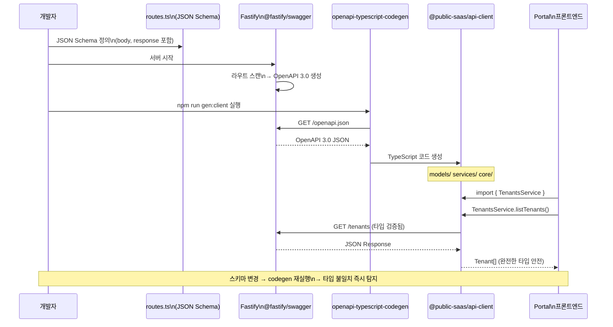

# 코드 생성 도구 완전 가이드 — Prisma, OpenAPI, Turbo로 생산성 10배

> **문서 ID**: DEV-CODEGEN-29
> **버전**: 1.0.0 | **작성일**: 2026-04-13 | **작성자**: Implementer (Sonnet)
> **목적**: 반복 코드를 자동 생성하여 개발 속도를 높이고 타입 안전성을 보장하는 방법을 완전히 익힌다
> **선행 학습**: [05-prisma-guide.md](./05-prisma-guide.md), [12-api-design-guide.md](./12-api-design-guide.md)

---

## 목차

1. [코드 생성 도구 개요](#1-코드-생성-도구-개요)
2. [Prisma 코드 생성](#2-prisma-코드-생성)
3. [OpenAPI 코드 생성](#3-openapi-코드-생성)
4. [Turbo 태스크 코드 생성](#4-turbo-태스크-코드-생성)
5. [AI 보조 코드 생성](#5-ai-보조-코드-생성)
6. [생성 코드 품질 관리](#6-생성-코드-품질-관리)
7. [실전 워크플로우](#7-실전-워크플로우)
8. [변경 이력](#변경-이력)

---

## 1. 코드 생성 도구 개요

### 1.1 왜 코드 생성인가

공공기관 SaaS 플랫폼은 17개 마이크로서비스와 10개 패키지로 구성됩니다. 각 서비스가 유사한 패턴을 반복하기 때문에 코드 생성 없이는 다음 문제가 발생합니다:

| 문제 | 수동 작성 시 | 코드 생성 후 |
|------|-------------|-------------|
| DB 스키마 변경 | 5개 파일 수동 수정 | `prisma generate` 한 번 |
| API 타입 불일치 | 런타임 에러 | 컴파일 타임 탐지 |
| 신규 서비스 보일러플레이트 | 2~3시간 | `turbo gen` 5분 |
| 클라이언트 SDK 갱신 | API 문서 확인 후 수동 | OpenAPI 자동 생성 |

**핵심 원칙**: 한 번 정의(Schema/Spec)하면, 코드는 자동으로 따라온다.

### 1.2 코드 생성 흐름 전체 다이어그램

```mermaid
graph TB
    subgraph 정의 계층
        A[schema.prisma\nDB 스키마 정의]
        B[JSON Schema\nFastify 라우트 스키마]
        C[turbo/generators\n커스텀 생성기]
    end

    subgraph 생성 도구
        D[prisma generate\nPrisma Client 생성]
        E[@fastify/swagger\nOpenAPI 3.0 생성]
        F[openapi-typescript-codegen\n클라이언트 SDK 생성]
        G[turbo gen\n보일러플레이트 생성]
        H[ai-code-generator\nAI 보조 생성]
    end

    subgraph 산출물
        I[PrismaClient 타입\n@prisma/client]
        J[OpenAPI 3.0 JSON\n/openapi.json]
        K[TypeScript SDK\n@public-saas/api-client]
        L[새 서비스/패키지\n스캐폴딩]
        M[CRUD 핸들러\nZod 스키마 포함]
    end

    subgraph 사용 계층
        N[서비스 백엔드\nTypeScript]
        O[포털 프론트엔드\nNext.js]
        P[외부 연동\n3rd Party]
    end

    A --> D --> I --> N
    B --> E --> J --> F --> K
    K --> O
    K --> P
    C --> G --> L --> N
    H --> M --> N

    style A fill:#4a9eff,color:#fff
    style B fill:#4a9eff,color:#fff
    style C fill:#4a9eff,color:#fff
    style I fill:#afa,stroke:#0a0
    style K fill:#afa,stroke:#0a0
    style L fill:#afa,stroke:#0a0
    style M fill:#afa,stroke:#0a0
```

### 1.3 이 프레임워크에서 사용하는 코드 생성 도구 목록

| 도구 | 역할 | 실행 명령 |
|------|------|----------|
| Prisma | DB 스키마 → TypeScript 타입 | `prisma generate` |
| @fastify/swagger | 라우트 스키마 → OpenAPI 3.0 | 서버 시작 시 자동 |
| openapi-typescript-codegen | OpenAPI → 클라이언트 SDK | `npm run gen:client` |
| turbo gen | 커스텀 보일러플레이트 | `turbo gen service` |
| ai-code-generator | AI 보조 서비스 코드 생성 | `npm run gen:ai` |

---

## 2. Prisma 코드 생성

### 2.1 `prisma generate` 동작 원리

`prisma generate`는 `schema.prisma` 파일을 읽어 다음을 자동 생성합니다:

1. **PrismaClient 타입**: 모든 모델에 대한 완전한 TypeScript 타입
2. **CRUD 메서드**: `findMany`, `create`, `update`, `delete` 등
3. **관계 타입**: 외래 키 관계를 포함한 중첩 타입
4. **입력 타입**: `CreateInput`, `UpdateInput`, `WhereInput` 등

```bash
# 스키마 변경 후 실행
cd platform/services/tenant-service
npx prisma generate

# 실행 결과 (예시)
# ✔ Generated Prisma Client (v5.x.x) to ./node_modules/@prisma/client in 234ms
```

생성된 타입은 `node_modules/@prisma/client`에 위치합니다. **커밋하지 않습니다** (`.gitignore` 등록됨).

### 2.2 Prisma Client 타입 자동 생성 예시

`schema.prisma`에서 테넌트 모델 정의:

```prisma
// prisma/schema.prisma (단순화된 예시)
model Tenant {
  id          String   @id @default(uuid())
  name        String   @db.VarChar(200)
  slug        String   @unique @db.VarChar(50)
  status      TenantStatus @default(TRIAL)
  maxUsers    Int      @default(10)
  maxStorage  BigInt   @default(1073741824)
  config      Json?
  theme       Json?
  createdAt   DateTime @default(now())
  updatedAt   DateTime @updatedAt

  // 관계
  users         User[]
  subscriptions Subscription[]

  @@map("Tenant")
}

enum TenantStatus {
  TRIAL
  ACTIVE
  SUSPENDED
  ARCHIVED
}
```

`prisma generate` 실행 후 자동 생성되는 타입:

```typescript
// 자동 생성됨 (직접 수정 금지)
// @prisma/client/index.d.ts

export type Tenant = {
  id: string
  name: string
  slug: string
  status: TenantStatus
  maxUsers: number
  maxStorage: bigint    // BigInt — JSON 직렬화 시 주의
  config: Prisma.JsonValue | null
  theme: Prisma.JsonValue | null
  createdAt: Date
  updatedAt: Date
}

// CRUD 입력 타입 자동 생성
export type TenantCreateInput = {
  id?: string
  name: string
  slug: string
  status?: TenantStatus
  maxUsers?: number
  maxStorage?: bigint | number
  config?: NullableJsonNullValueInput | InputJsonValue
  theme?: NullableJsonNullValueInput | InputJsonValue
  users?: UserCreateNestedManyWithoutTenantInput
  subscriptions?: SubscriptionCreateNestedManyWithoutTenantInput
}
```

실제 서비스 코드에서 활용:

```typescript
// platform/services/tenant-service/src/handlers/tenant.handler.ts
// BigInt → string 변환 (JSON 직렬화 — Prisma 생성 타입 활용)
function serializeTenant<T extends { maxStorage: bigint }>(t: T) {
  return { ...t, maxStorage: t.maxStorage.toString() };
}

// Prisma 생성 타입으로 완전한 타입 안전성 보장
const tenant = await prisma.tenant.create({
  data: {
    ...parseResult.data,
    maxStorage: BigInt(parseResult.data.maxStorage),
    // 타입 오류 시 컴파일 타임에 즉시 탐지
  },
});
```

### 2.3 커스텀 Generator — prisma-json-schema-generator

OpenAPI 문서화를 위해 Prisma 스키마에서 JSON Schema를 자동 생성합니다:

```prisma
// schema.prisma — 커스텀 Generator 추가
generator jsonSchema {
  provider                 = "prisma-json-schema-generator"
  output                   = "../schemas/generated"
  keepRelationScalarFields = "true"
  schemaId                 = "public-saas-schema"
  includeRequiredFields    = "true"
  persistOriginalType      = "true"
}
```

```bash
# JSON Schema 생성
npx prisma generate

# 생성 결과
# schemas/generated/json-schema.json
# → Fastify와 OpenAPI에서 직접 사용 가능
```

생성된 JSON Schema 활용:

```typescript
// 생성된 스키마를 Fastify 라우트에서 직접 사용
import tenantSchema from '../../schemas/generated/Tenant.json'

app.post('/tenants', {
  schema: {
    body: tenantSchema,
    response: { 201: tenantSchema }
  }
}, createTenantHandler)
```

### 2.4 `$extends`로 멀티테넌시 미들웨어 코드 생성

Prisma의 `$extends` API로 모든 쿼리에 tenantId를 자동 주입하는 미들웨어를 생성합니다. 이 패턴은 N2SF N-03 테넌트 격리 요건을 자동으로 충족합니다:

```typescript
// lib/tenant-prisma.ts — Prisma 확장으로 멀티테넌시 자동화
import { prisma } from './prisma.js'

/**
 * 테넌트 격리 Prisma 클라이언트 생성
 * N2SF N-03: 모든 쿼리에 tenantId 자동 필터 적용
 */
export function createTenantPrisma(tenantId: string) {
  return prisma.$extends({
    query: {
      // tenantId 컬럼이 있는 모든 모델에 자동 필터 적용
      user: {
        async findMany({ args, query }) {
          args.where = { ...args.where, tenantId }
          return query(args)
        },
        async create({ args, query }) {
          args.data = { ...args.data, tenantId }
          return query(args)
        },
      },
      // subscription, file 등 모든 테넌트 소속 모델에 동일 적용
    },
  })
}

// 사용 예시 — 자동으로 tenantId 필터 적용됨
const tenantPrisma = createTenantPrisma(user.tenantId)
const users = await tenantPrisma.user.findMany()
// 실제 실행: SELECT * FROM "User" WHERE "tenantId" = $1
```

### 2.5 Prisma 코드 생성 흐름 다이어그램

```mermaid
graph LR
    A[schema.prisma\n수동 작성] -->|prisma generate| B{생성 엔진}

    B --> C[PrismaClient\n@prisma/client]
    B --> D[JSON Schema\nschemas/generated/]
    B --> E[Zod 타입 힌트\nprisma-zod-generator]

    C --> F[서비스 핸들러\ntenant.handler.ts]
    D --> G[Fastify 라우트\n스키마 검증]
    E --> H[Zod 입력 검증\ncreateSchema 보완]

    F --> I[컴파일 타임\n타입 검사]
    G --> I
    H --> I

    I -->|타입 오류| J[즉시 탐지\n런타임 전]
    I -->|타입 정상| K[빌드 성공]

    style A fill:#4a9eff,color:#fff
    style K fill:#afa,stroke:#0a0
    style J fill:#faa,stroke:#f33
```

### 2.6 Prisma 마이그레이션과 코드 생성 분리

```bash
# 스키마 변경 → 마이그레이션 생성 → 코드 생성 순서 엄수
# (순서를 지키지 않으면 타입과 DB가 불일치함)

# Step 1: 스키마 변경 후 마이그레이션 파일 생성
npx prisma migrate dev --name add_tenant_theme_field

# Step 2: 코드 생성 (마이그레이션 후 자동 실행됨)
npx prisma generate

# Step 3: CI에서 코드 생성 일관성 검증
npx prisma generate --check  # 불일치 시 Exit Code 1
```

---

## 3. OpenAPI 코드 생성

### 3.1 Fastify JSON Schema → OpenAPI 3.0 자동 생성

Fastify는 라우트 정의 시 JSON Schema를 입력받아 런타임 검증과 OpenAPI 문서를 동시에 생성합니다.

실제 `routes.ts`에서의 스키마 정의 방법:

```typescript
// platform/services/tenant-service/src/routes.ts
// Design Ref: DESIGN-MTU-P03 API 설계 | CSAP: D-12 API 문서화

const idParam = {
  type: 'object' as const,
  properties: { id: { type: 'string' as const, format: 'uuid' } }
}

const tenantResponse = {
  type: 'object' as const,
  properties: {
    success: { type: 'boolean' as const },
    data: { type: 'object' as const }
  },
}

app.post('/tenants', {
  schema: {
    description: '테넌트 생성 (CSAP D-08)',
    tags: ['tenants'],
    body: {
      type: 'object' as const,
      required: ['name', 'slug', 'plan'] as const,
      properties: {
        name: { type: 'string' as const },
        slug: { type: 'string' as const },
        plan: { type: 'string' as const, enum: ['basic', 'standard', 'enterprise'] },
      },
    },
    response: { 201: tenantResponse },
  },
  preHandler: writeLimiter,
}, createTenantHandler as never)
```

이 정의 하나에서 두 가지가 자동으로 처리됩니다:
1. **런타임 검증**: 잘못된 요청 형식 → 즉시 400 반환
2. **OpenAPI 문서**: `/openapi.json` 자동 생성

### 3.2 `@fastify/swagger` 설정

```typescript
// platform/services/tenant-service/src/index.ts (설정 예시)
import fastifySwagger from '@fastify/swagger'
import fastifySwaggerUi from '@fastify/swagger-ui'

await app.register(fastifySwagger, {
  openapi: {
    info: {
      title: '공공기관 SaaS — Tenant Service API',
      description: 'CSAP 중/상 등급 멀티테넌트 관리 API',
      version: '1.0.0',
      contact: {
        name: 'API 지원',
        email: 'api-support@example.go.kr',
      },
    },
    servers: [
      { url: 'https://api.example.go.kr', description: '운영 환경' },
      { url: 'https://api.stg.example.go.kr', description: '스테이징 환경' },
    ],
    components: {
      securitySchemes: {
        bearerAuth: {
          type: 'http',
          scheme: 'bearer',
          bearerFormat: 'JWT',
          description: 'RS256 JWT 토큰 (CSAP D-08, 15분 만료)',
        },
      },
    },
    security: [{ bearerAuth: [] }],
    tags: [
      { name: 'tenants', description: '테넌트 관리 API' },
      { name: 'usage', description: '리소스 사용량 API' },
    ],
  },
})

// Swagger UI — 개발/스테이징 환경만 활성화
if (process.env['NODE_ENV'] !== 'production') {
  await app.register(fastifySwaggerUi, {
    routePrefix: '/docs',
    uiConfig: { docExpansion: 'list', deepLinking: false },
  })
}

// 서버 시작 후 OpenAPI JSON 접근
// GET http://localhost:3003/openapi.json
```

### 3.3 클라이언트 SDK 자동 생성 (`openapi-typescript-codegen`)

OpenAPI 3.0 JSON에서 TypeScript 클라이언트 SDK를 자동 생성합니다:

```bash
# SDK 생성 스크립트 (package.json scripts)
{
  "scripts": {
    "gen:client": "openapi-typescript-codegen \
      --input http://localhost:3003/openapi.json \
      --output packages/api-client/src/generated \
      --name PublicSaasClient \
      --useOptions \
      --exportCore true \
      --exportServices true \
      --exportModels true"
  }
}
```

```bash
# 실행
npm run gen:client

# 생성 결과:
# packages/api-client/src/generated/
#   models/          ← 모든 요청/응답 타입
#     Tenant.ts
#     CreateTenantRequest.ts
#   services/        ← API 호출 함수
#     TenantsService.ts
#   core/            ← HTTP 클라이언트 기반
#     ApiClient.ts
```

생성된 SDK 사용 예시:

```typescript
// 포털 프론트엔드에서 타입 안전한 API 호출
// platform/apps/portal/src/app/admin/tenants/page.tsx

import { TenantsService } from '@public-saas/api-client'

// 컴파일 타임에 타입 오류 탐지 — API 계약 보장
const tenants = await TenantsService.listTenants({
  page: 1,
  pageSize: 20,
  status: 'ACTIVE',  // 잘못된 값 입력 시 컴파일 에러
})

// response 타입도 자동으로 Tenant[] 추론됨
tenants.data.map(tenant => {
  console.log(tenant.name)    // 타입 안전
  console.log(tenant.maxStorage) // string (BigInt 직렬화)
})
```

### 3.4 스키마 → OpenAPI 생성 → 클라이언트 타입 사용 시퀀스



### 3.5 rate-limit 및 CSAP 보안 헤더 자동 문서화

```typescript
// 보안 관련 라우트 속성도 OpenAPI에 자동 포함
app.post('/tenants', {
  schema: {
    description: '테넌트 생성\n\n' +
      '**보안**: CSAP D-08 접근 통제 적용\n' +
      '**Rate Limit**: 분당 30회\n' +
      '**필요 권한**: super_admin',
    tags: ['tenants'],
    security: [{ bearerAuth: [] }],
    // OpenAPI x-ratelimit 확장 필드
    'x-ratelimit-limit': 30,
    'x-ratelimit-window': '1m',
  },
  preHandler: writeLimiter, // 실제 rate limit 적용
}, createTenantHandler)
```

---

## 4. Turbo 태스크 코드 생성

### 4.1 `turbo gen`으로 새 패키지 스캐폴딩

Turborepo의 `turbo gen` 명령으로 새 마이크로서비스나 패키지를 템플릿에서 즉시 생성합니다:

```bash
# 새 마이크로서비스 생성 (인터랙티브)
turbo gen service

# 프롬프트:
# ? 서비스 이름: document-service
# ? 설명: 공공문서 관리 서비스
# ? 포트 번호: 3018
# ? 데이터베이스 사용: Yes
# ? AI 기능 사용: No
# → 생성 완료!
```

### 4.2 커스텀 제너레이터 작성법

```typescript
// turbo/generators/config.ts
import type { PlopTypes } from '@turbo/gen'

export default function generator(plop: PlopTypes.NodePlopAPI): void {
  // 신규 마이크로서비스 생성기
  plop.setGenerator('service', {
    description: '새 마이크로서비스 스캐폴딩',
    prompts: [
      {
        type: 'input',
        name: 'name',
        message: '서비스 이름 (예: document-service):',
        validate: (value: string) =>
          /^[a-z-]+$/.test(value) || '소문자와 하이픈만 사용 가능합니다',
      },
      {
        type: 'input',
        name: 'port',
        message: '포트 번호:',
        default: '3020',
      },
      {
        type: 'confirm',
        name: 'useDatabase',
        message: '데이터베이스를 사용합니까?',
        default: true,
      },
    ],
    actions: [
      // package.json 생성
      {
        type: 'add',
        path: 'platform/services/{{name}}/package.json',
        templateFile: 'templates/service/package.json.hbs',
      },
      // Dockerfile 생성
      {
        type: 'add',
        path: 'platform/services/{{name}}/Dockerfile',
        templateFile: 'templates/service/Dockerfile.hbs',
      },
      // 기본 라우트 생성
      {
        type: 'add',
        path: 'platform/services/{{name}}/src/routes.ts',
        templateFile: 'templates/service/routes.ts.hbs',
      },
      // Prisma 스키마 (DB 사용 시)
      {
        type: 'addMany',
        destination: 'platform/services/{{name}}/prisma',
        templateFiles: 'templates/service/prisma/**',
        base: 'templates/service/prisma',
        skip: (data: Record<string, unknown>) => !data['useDatabase'],
      },
      // pnpm workspace 등록 (turbo.json 자동 업데이트)
      {
        type: 'modify',
        path: 'pnpm-workspace.yaml',
        pattern: /packages:/,
        template: 'packages:\n  - platform/services/{{name}}',
      },
    ],
  })

  // 신규 패키지 생성기
  plop.setGenerator('package', {
    description: '새 공유 패키지 스캐폴딩',
    prompts: [
      {
        type: 'input',
        name: 'name',
        message: '패키지 이름 (예: audit-sdk):',
      },
    ],
    actions: [
      {
        type: 'add',
        path: 'packages/{{name}}/package.json',
        templateFile: 'templates/package/package.json.hbs',
      },
      {
        type: 'add',
        path: 'packages/{{name}}/src/index.ts',
        templateFile: 'templates/package/index.ts.hbs',
      },
    ],
  })
}
```

### 4.3 새 서비스 보일러플레이트 자동 생성 예시

`turbo gen service` 실행 시 자동 생성되는 파일 목록:

```
platform/services/document-service/
  package.json          ← 의존성 + 스크립트 정의
  tsconfig.json         ← TypeScript 설정 (상속)
  Dockerfile            ← 멀티스테이지 빌드
  .env.example          ← 환경 변수 예시 (실제값 없음)
  src/
    index.ts            ← Fastify 서버 엔트리
    routes.ts           ← 라우트 등록
    handlers/
      .gitkeep
    lib/
      prisma.ts         ← PrismaClient 싱글턴 (CSAP D-08)
      audit.ts          ← 감사 로그 설정 (CSAP D-06)
  prisma/
    schema.prisma       ← 빈 스키마 (모델 추가 필요)
    migrations/
      .gitkeep
```

템플릿에 CSAP 보안 패턴이 내장되어 있어, 모든 신규 서비스가 자동으로 준수합니다:

```typescript
// templates/service/src/index.ts.hbs (CSAP 보안 패턴 내장)
import Fastify from 'fastify'
import { registerRoutes } from './routes.js'

const app = Fastify({
  logger: true,
  trustProxy: true, // 리버스 프록시 뒤 실제 IP 신뢰
})

// CSAP D-12: 입력 검증 플러그인
await app.register(import('@fastify/cors'), {
  origin: process.env['ALLOWED_ORIGINS']?.split(',') ?? [],
  credentials: true,
})

// 내부 서비스 인증 (CSAP D-08)
const internalKey = process.env['INTERNAL_SERVICE_KEY']
if (!internalKey && process.env['NODE_ENV'] === 'production') {
  throw new Error('[SECURITY] INTERNAL_SERVICE_KEY 환경변수가 설정되지 않았습니다')
}

await registerRoutes(app)
await app.listen({ port: {{port}}, host: '0.0.0.0' })
```

### 4.4 Turbo 파이프라인과 코드 생성 연동

```json
// turbo.json — 코드 생성을 빌드 의존성으로 설정
{
  "pipeline": {
    "generate": {
      "cache": false,
      "outputs": ["src/generated/**"]
    },
    "build": {
      "dependsOn": ["^build", "generate"],
      "outputs": ["dist/**"]
    },
    "test": {
      "dependsOn": ["generate"],
      "env": ["DATABASE_URL", "JWT_PRIVATE_KEY"]
    }
  }
}
```

```bash
# 전체 코드 생성 실행 (모든 서비스)
turbo run generate

# 특정 서비스만 생성
turbo run generate --filter=tenant-service
```

---

## 5. AI 보조 코드 생성

### 5.1 실제 `ai-tools.ts` 코드 분석

`platform/services/ai-service/src/lib/ai-tools.ts`는 AI 에이전트가 사용할 수 있는 도구 목록을 정의합니다. 이 패턴을 이해하면 AI가 코드를 생성하는 방식을 알 수 있습니다.

```typescript
// platform/services/ai-service/src/lib/ai-tools.ts
// Design Ref: SVC-AI-2026 DESIGN §2
// ReAct 패턴 에이전트가 사용할 내장 도구 정의

export interface ToolDefinition {
  name: string
  description: string
  parameters: Record<string, {
    type: string
    description: string
    required?: boolean
  }>
}

// 도구 레지스트리 — 에이전트가 호출 가능한 도구 목록
export const TOOL_DEFINITIONS: ToolDefinition[] = [
  {
    name: 'search_knowledge',
    description: '테넌트의 지식베이스(공공문서 등)에서 관련 정보를 시맨틱 검색합니다',
    parameters: {
      query: { type: 'string', description: '검색 질문', required: true },
      tenantId: { type: 'string', description: '테넌트 ID', required: true },
    },
  },
  // ... 6개 도구 정의
]
```

이 `TOOL_DEFINITIONS`는 Claude API의 `tools` 파라미터로 전달되어 AI가 구조화된 방식으로 도구를 호출할 수 있게 합니다.

### 5.2 AI 도구 함수 정의 패턴

새로운 AI 도구를 추가하는 표준 패턴:

```typescript
// 1. TOOL_DEFINITIONS에 도구 메타데이터 추가
TOOL_DEFINITIONS.push({
  name: 'generate_service_code',
  description: 'Prisma 스키마에서 CRUD 서비스 코드를 자동 생성합니다',
  parameters: {
    modelName: { type: 'string', description: 'Prisma 모델명', required: true },
    operations: {
      type: 'array',
      description: '생성할 CRUD 작업: create|read|update|delete',
      required: true
    },
    includeAuditLog: {
      type: 'boolean',
      description: 'CSAP D-06 감사 로그 포함 여부',
      required: false
    },
  },
})

// 2. createToolExecutors에 실행 로직 추가
export function createToolExecutors(options: ToolOptions): Record<string, ToolExecutor> {
  return {
    // ... 기존 도구들

    generate_service_code: async (params): Promise<ToolCallResult> => {
      const modelName = String(params['modelName'] ?? '')
      const operations = params['operations'] as string[]
      const includeAuditLog = Boolean(params['includeAuditLog'] ?? true)

      if (!modelName || !operations?.length) {
        return { success: false, output: '', error: '모델명과 작업 목록이 필요합니다' }
      }

      // AI를 통한 코드 생성 (N2SF O등급 데이터만)
      const prompt = buildCodeGenPrompt(modelName, operations, includeAuditLog)
      const generatedCode = await options.llmGenerate?.(prompt)

      return {
        success: true,
        output: generatedCode ?? generateFallbackCode(modelName, operations),
      }
    },
  }
}
```

### 5.3 Claude Code 활용: 스키마에서 서비스 코드 자동 생성

Claude Code를 활용하여 Prisma 스키마에서 완전한 CRUD 서비스 코드를 생성하는 방법:

```bash
# Claude Code 명령으로 코드 생성
# (Claude Code가 스키마를 읽고 표준 패턴에 맞는 코드를 생성함)

# 예시: document-service를 위한 CRUD 핸들러 생성
# 1. schema.prisma에서 Document 모델 정의
# 2. Claude Code에게 "Document 모델의 CRUD 핸들러를 tenant.handler.ts 패턴으로 생성해줘" 요청
# 3. CSAP D-06 감사 로그, D-12 입력 검증, N2SF N-03 격리가 자동 포함됨
```

실제 AI 코드 생성기 활용 (`platform/services/ai-service/src/lib/ai-code-generator.ts`):

```typescript
// AI 코드 생성기 활용 예시
import { AICodeGenerator } from './ai-code-generator.js'

const generator = new AICodeGenerator({
  // N2SF: 코드 생성은 O등급 데이터만 사용 (스키마 정보)
  dataGrade: 'O',
  template: 'fastify-handler',
})

const handlerCode = await generator.generate({
  modelName: 'Document',
  operations: ['list', 'get', 'create', 'update', 'delete'],
  csapRequirements: {
    auditLog: true,    // D-06
    inputValidation: true,  // D-12
    rbac: true,        // D-08
    tenantIsolation: true, // N2SF N-03
  },
})

// 생성된 코드를 파일로 저장
await fs.writeFile(
  'platform/services/document-service/src/handlers/document.handler.ts',
  handlerCode
)
```

### 5.4 N2SF 준수 AI 생성 코드 검증 방법

AI가 생성한 코드는 반드시 다음 기준으로 검증해야 합니다:

```typescript
// AI 생성 코드 검증 체크리스트 (자동화)
// platform/services/ai-service/src/lib/ai-code-generator.ts

export async function validateAIGeneratedCode(code: string): Promise<ValidationResult> {
  const issues: string[] = []

  // 1. 하드코딩된 시크릿 검사 (CSAP D-09)
  const secretPatterns = [
    /apiKey\s*=\s*['"][^'"]{10,}['"]/,
    /password\s*=\s*['"][^'"]+['"]/,
    /secret\s*=\s*['"][^'"]+['"]/,
  ]
  for (const pattern of secretPatterns) {
    if (pattern.test(code)) {
      issues.push('CRITICAL: 하드코딩된 시크릿 탐지 (CSAP D-09 위반)')
    }
  }

  // 2. SQL 직접 결합 검사 (CSAP D-12)
  if (/`SELECT.*\${/.test(code) || /`INSERT.*\${/.test(code)) {
    issues.push('HIGH: SQL 직접 문자열 결합 탐지 (D-12 위반, SQL 주입 위험)')
  }

  // 3. 감사 로그 존재 확인 (CSAP D-06)
  if (code.includes('async function') && !code.includes('logTenantEvent') && !code.includes('auditLog')) {
    issues.push('MEDIUM: 감사 로그 누락 (CSAP D-06 미준수)')
  }

  // 4. 입력 검증 확인 (CSAP D-12)
  if (code.includes('request.body') && !code.includes('safeParse') && !code.includes('parse(')) {
    issues.push('HIGH: Zod 입력 검증 누락 (CSAP D-12 위반)')
  }

  // 5. eval() 사용 금지 (OWASP A03)
  if (/\beval\(/.test(code) || /new Function\(/.test(code)) {
    issues.push('CRITICAL: eval() 또는 new Function() 사용 탐지 (코드 인젝션 위험)')
  }

  return {
    valid: issues.length === 0,
    issues,
    requiresManualReview: issues.some(i => i.startsWith('CRITICAL')),
  }
}
```

AI 생성 코드 사용 규칙:

| 검증 항목 | 자동 검사 | 수동 검토 필요 |
|-----------|-----------|--------------|
| 하드코딩 시크릿 | 정규식 검사 | 항상 |
| SQL 주입 | 패턴 탐지 | HIGH 이상 |
| 감사 로그 | 함수명 검사 | MEDIUM 이상 |
| RBAC 검사 | 미들웨어 확인 | 모든 케이스 |
| 테넌트 격리 | tenantId 필터 | 모든 케이스 |

### 5.5 AI 게이트웨이를 통한 안전한 코드 생성

코드 생성 요청은 반드시 AI Gateway를 경유해야 합니다 (N2SF 준수):

```typescript
// N2SF 준수 AI 코드 생성 호출
// platform/services/ai-service/src/lib/ai-gateway.ts

async function generateCodeViaGateway(prompt: string): Promise<string> {
  // N2SF: 코드 생성 프롬프트는 O등급 (스키마 정보만 포함)
  // C/S 등급 데이터(실제 비즈니스 데이터)는 절대 포함 금지
  const dataGrade = classifyPromptGrade(prompt)

  if (dataGrade === 'C' || dataGrade === 'S') {
    throw new Error(
      `BLOCKED: ${dataGrade}등급 데이터는 AI API 전송 금지 (N2SF N-05)\n` +
      '코드 생성 프롬프트에 실제 데이터를 포함하지 마세요.'
    )
  }

  // O등급 확인 → PII 마스킹 → AI Gateway 경유
  const maskedPrompt = await maskPII(prompt)

  return await aiGateway.complete({
    model: 'claude-sonnet-4-6',
    messages: [{ role: 'user', content: maskedPrompt }],
    maxTokens: 4096,
  })
}
```

---

## 6. 생성 코드 품질 관리

### 6.1 생성 코드 vs 직접 작성 코드 구분

생성 코드와 수동 작성 코드를 명확히 구분하여 유지보수성을 높입니다:

```
platform/services/tenant-service/
  src/
    handlers/
      tenant.handler.ts        ← 수동 작성 (비즈니스 로직)
      tenant-usage.handler.ts  ← 수동 작성
    lib/
      prisma.ts               ← 수동 작성 (싱글턴 설정)
      audit.ts                ← 수동 작성 (감사 로그)
    generated/                ← 자동 생성 (수정 금지)
      prisma-types.d.ts       ← prisma generate 결과
      openapi-client.ts       ← openapi-typescript 결과
  schemas/
    generated/                ← 자동 생성 (수정 금지)
      Tenant.json             ← prisma-json-schema-generator 결과
```

```typescript
// 생성 파일 상단에 반드시 표시
/**
 * @generated
 * 이 파일은 자동 생성됩니다. 직접 수정하지 마세요.
 * 변경이 필요하면 소스(schema.prisma 또는 openapi.json)를 수정 후
 * 생성 명령을 다시 실행하세요.
 *
 * 생성 명령: npx prisma generate
 * 생성 일시: 2026-04-13T09:00:00Z
 */
```

### 6.2 Dead code 방지: 생성 파일 `.gitignore` vs 커밋

| 파일 유형 | Git 정책 | 이유 |
|-----------|---------|------|
| `node_modules/@prisma/client` | `.gitignore` | 빌드 시 재생성 |
| `src/generated/openapi-client` | `.gitignore` | OpenAPI 서버에서 동적 생성 |
| `schemas/generated/*.json` | **커밋** | CI 검증에 필요 |
| `prisma/client` (단독 폴더) | `.gitignore` | 빌드 산출물 |

```gitignore
# .gitignore — 생성 코드 제외 규칙
node_modules/
**/dist/
**/.prisma/
**/node_modules/@prisma/client/
src/generated/openapi-client/
```

Dead Code 방지 규칙:

```typescript
// 생성된 타입 중 실제로 사용하지 않는 타입은 re-export 금지
// BAD: 모든 타입을 re-export (dead code 발생)
export * from '@prisma/client'

// GOOD: 실제 사용하는 타입만 명시적으로 export
export type { Tenant, User, TenantStatus } from '@prisma/client'
```

### 6.3 CI에서 생성 코드 일관성 검증

```yaml
# .gitea/workflows/code-generation-check.yml
name: 코드 생성 일관성 검증

on:
  pull_request:
    paths:
      - '**/prisma/schema.prisma'
      - '**/openapi.json'

jobs:
  check-generated:
    runs-on: self-hosted
    steps:
      - uses: actions/checkout@v4

      - name: Prisma 생성 코드 일관성 검증
        run: |
          # 스키마와 생성 코드가 동기화됐는지 확인
          # Exit Code 1: 불일치 (스키마 변경 후 generate 미실행)
          npx prisma generate --check
          echo "Prisma 코드 생성 일관성 OK"

      - name: OpenAPI 스키마 검증
        run: |
          # OpenAPI 3.0 유효성 검사
          npx @redocly/cli lint openapi.json
          echo "OpenAPI 스키마 유효성 OK"

      - name: 생성 코드 Dead Code 검사
        run: |
          # 생성된 타입 중 미사용 export 탐지
          npx ts-prune --error
```

### 6.4 생성 코드 버전 고정

```json
// package.json — 코드 생성 도구 버전 고정 (재현성 보장)
{
  "devDependencies": {
    "prisma": "5.22.0",                    // 정확한 버전 고정
    "openapi-typescript-codegen": "0.29.0",
    "@fastify/swagger": "8.14.0",
    "@turbo/gen": "2.3.0",
    "prisma-json-schema-generator": "5.1.1"
  }
}
```

---

## 7. 실전 워크플로우

### 7.1 신규 피처 개발 시 코드 생성 활용 전체 예시

새로운 `Document` 기능을 추가하는 전체 워크플로우:

```bash
# Step 1: Prisma 스키마에 Document 모델 추가
# prisma/schema.prisma 수정

# Step 2: 마이그레이션 생성 + Prisma 코드 생성
npx prisma migrate dev --name add_document_model
# 자동으로 npx prisma generate 실행됨

# Step 3: JSON Schema 생성 (OpenAPI용)
npx prisma generate  # prisma-json-schema-generator 포함 실행

# Step 4: 핸들러 작성 (생성된 타입 활용)
# src/handlers/document.handler.ts 작성
# Prisma 생성 타입: DocumentCreateInput, DocumentWhereInput 사용

# Step 5: Fastify 라우트에 JSON Schema 등록
# src/routes.ts에 라우트 추가 (JSON Schema 정의 포함)

# Step 6: 서버 시작 → OpenAPI 자동 생성 확인
npm run dev
curl http://localhost:3020/openapi.json | jq '.paths["/documents"]'

# Step 7: 프론트엔드 클라이언트 SDK 재생성
npm run gen:client

# Step 8: 포털에서 타입 안전한 API 호출 확인
# DocumentsService.createDocument() 타입 검사 통과 여부 확인

# Step 9: 테스트 실행
npm test
```

### 7.2 코드 생성 오류 대응

자주 발생하는 코드 생성 오류와 해결 방법:

```bash
# 오류 1: "PrismaClient is not up to date"
# 원인: schema.prisma 변경 후 generate 미실행
npx prisma generate

# 오류 2: "openapi-typescript-codegen: Cannot read property 'paths'"
# 원인: OpenAPI 서버가 실행 중이지 않음
npm run dev &  # 서버 먼저 시작
npm run gen:client

# 오류 3: "turbo gen: Template file not found"
# 원인: 템플릿 파일 경로 오류
ls turbo/generators/templates/service/

# 오류 4: "prisma generate --check: schema drift detected"
# 원인: 생성 코드와 스키마 불일치 (PR에서 자주 발생)
git diff prisma/schema.prisma  # 스키마 변경사항 확인
npx prisma generate            # 재생성
git add packages/*/src/generated/
```

---

## 변경 이력

| 버전 | 일자 | 내용 | 작성자 |
|------|------|------|--------|
| 1.0.0 | 2026-04-13 | 최초 작성 — 코드 생성 도구 완전 가이드 | Implementer (Sonnet) |
