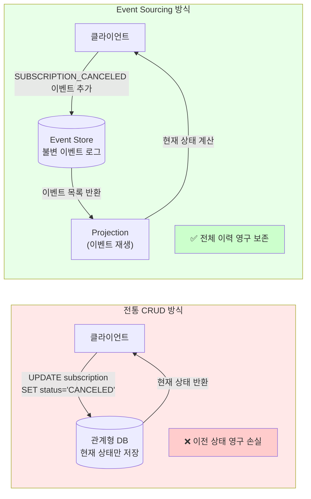
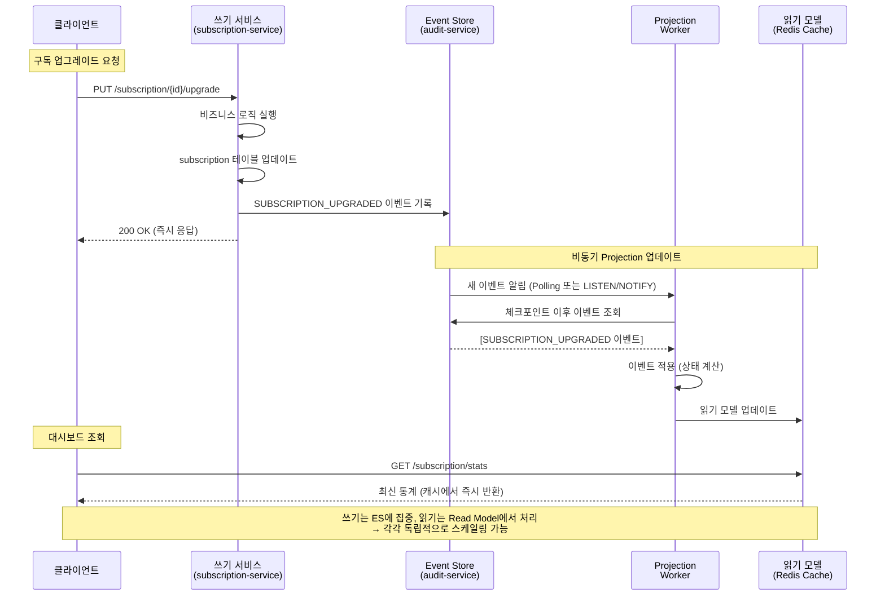

# Event Sourcing + CQRS 패턴 — 불변 이벤트 로그와 읽기/쓰기 분리

**문서 ID**: ONBOARD-DEV-30
**버전**: 1.0.0
**작성일**: 2026-04-13
**목적**: Event Sourcing과 CQRS 패턴의 원리를 이해하고 이 프로젝트에서 어떻게 적용되어 있는지 코드 수준에서 파악한다.
**선행 학습**: `14-database-design.md`, `26-distributed-transactions.md`, `06-audit-service.md (서비스 목록)`

---

## 목차

1. [Event Sourcing 개요](#1-event-sourcing-개요)
2. [이 프로젝트에서 Event Sourcing 적용 영역](#2-이-프로젝트에서-event-sourcing-적용-영역)
3. [Event Store 설계](#3-event-store-설계)
4. [Projection 구현](#4-projection-구현)
5. [CQRS 패턴](#5-cqrs-패턴)
6. [Eventual Consistency 관리](#6-eventual-consistency-관리)
7. [테스트 전략](#7-테스트-전략)
8. [변경 이력](#변경-이력)

---

## 1. Event Sourcing 개요

### 1.1 전통적인 CRUD와의 차이

대부분의 시스템은 "현재 상태"만 저장합니다. 예를 들어 사용자 정보를 수정하면 이전 값은 사라지고 새 값으로 덮어씁니다. 이것이 전통적인 CRUD 방식입니다.

**전통적인 CRUD 방식의 문제점**:
- 이력 추적 불가: "언제, 누가, 왜 변경했는지" 알 수 없습니다.
- 감사(Audit) 구현이 복잡: 별도 감사 테이블을 수동으로 관리해야 합니다.
- 버그 재현 불가: 특정 시점의 상태로 되돌아갈 수 없습니다.
- 규제 대응 어려움: CSAP D-06처럼 "모든 변경 이력을 보존하라"는 요건을 충족하기 어렵습니다.

**Event Sourcing 방식**:

현재 상태를 저장하는 대신 "무슨 일이 있었는가"를 이벤트로 기록합니다. 현재 상태는 이벤트들을 순서대로 재생(Replay)하여 계산합니다.

예시:

```
[전통 CRUD 방식]
구독 테이블: { id: "sub-001", status: "CANCELED", planId: "plan-basic" }
→ 왜 취소됐는지, 언제 취소됐는지, 원래 어떤 플랜이었는지 알 수 없음

[Event Sourcing 방식]
이벤트 로그:
  1. SUBSCRIPTION_CREATED  { planId: "plan-standard", at: "2026-01-01" }
  2. SUBSCRIPTION_UPGRADED { fromPlanId: "plan-standard", toPlanId: "plan-pro", at: "2026-02-15" }
  3. PAYMENT_FAILED        { invoiceId: "inv-x", reason: "카드 만료", at: "2026-03-01" }
  4. SUBSCRIPTION_SUSPENDED { reason: "3회 결제 실패", at: "2026-03-05" }
  5. SUBSCRIPTION_CANCELED { reason: "담당자 요청", at: "2026-04-01" }
→ 완전한 이력 보존: 언제, 무슨 일이, 왜 발생했는지 모두 추적 가능
```

### 1.2 전통 DB vs Event Store 비교 다이어그램



### 1.3 Event Sourcing의 핵심 원칙

**불변성 (Immutability)**: 한번 기록된 이벤트는 절대 수정하거나 삭제할 수 없습니다. 이것이 CSAP D-06의 "감사 로그 수정/삭제 불가" 요건과 완벽히 일치합니다.

**시간 순서 (Temporal Ordering)**: 이벤트는 발생 순서대로 기록되며 이 순서가 진실입니다.

**재생 가능성 (Replayability)**: 모든 이벤트를 처음부터 재생하면 어떤 시점의 상태도 복원할 수 있습니다.

**단일 진실 원천 (Single Source of Truth)**: 이벤트 로그가 유일한 진실 원천입니다. 읽기용 뷰(View)는 파생 데이터일 뿐입니다.

---

## 2. 이 프로젝트에서 Event Sourcing 적용 영역

### 2.1 감사 로그: 완전한 Event Sourcing 구현

`audit-service`는 이 프로젝트에서 Event Sourcing을 가장 순수하게 구현한 영역입니다. 모든 시스템 이벤트는 `audit-service`의 Event Store에 append-only 방식으로 기록됩니다.

```typescript
// audit-service/src/lib/append-only.ts
// Design Ref: DESIGN-MTU-P13
// CSAP: D-06 — 감사 로그 수정/삭제 불가

export async function appendAuditLog(entry: {
  tenantId?: string;
  actorId?: string;
  action: string;        // 이벤트 타입 (예: SUBSCRIPTION_CREATED)
  target?: string;       // 대상 리소스 ID
  targetType?: string;   // 대상 리소스 유형
  ip?: string;
  userAgent?: string;
  metadata?: Record<string, unknown>;
}): Promise<void> {
  // 이전 로그의 해시 조회 → 체인 연결
  const lastLog = await prisma.auditLog.findFirst({
    orderBy: { createdAt: 'desc' },
    select: { hash: true },
  });
  const previousHash = lastLog?.hash ?? '0'.repeat(64);

  // SHA-256 해시: 이벤트 내용 + 이전 해시 → 위변조 탐지
  const hashData = [
    entry.actorId ?? 'system',
    entry.action,
    entry.target ?? '',
    entry.targetType ?? '',
    entry.tenantId ?? 'system',
    new Date().toISOString(),
    previousHash,
  ].join('|');

  const hash = createHash('sha256').update(hashData).digest('hex');

  // CREATE만 허용 — UPDATE/DELETE 없음 (append-only 보장)
  await prisma.auditLog.create({
    data: { ...entry, hash, previousHash },
  });
}
```

이 구조가 Event Sourcing인 이유:
- 새 이벤트는 항상 새 행으로 추가 (기존 행 수정 없음)
- SHA-256 체인으로 순서 보장 및 위변조 탐지
- 이벤트 목록을 재생하면 전체 상태 변화 추적 가능

### 2.2 구독 상태 변경 이력

`subscription-service`는 구독의 모든 상태 변화를 감사 로그에 기록합니다. 이를 통해 구독의 전체 생명 주기를 이벤트로 추적할 수 있습니다.

```typescript
// subscription-service/src/handlers/subscription.handler.ts

// 구독 생성 이벤트
await logSubscriptionEvent('SUBSCRIPTION_CREATED', actorId, subscription.id, tenantId, ...);

// 업그레이드 이벤트
await logSubscriptionEvent('SUBSCRIPTION_UPGRADED', actorId, subscription.id, tenantId, ..., { newPlanId });

// 다운그레이드 이벤트
await logSubscriptionEvent('SUBSCRIPTION_DOWNGRADED', actorId, subscription.id, tenantId, ..., { newPlanId });

// 취소 이벤트
await logSubscriptionEvent('SUBSCRIPTION_CANCELED', actorId, subscription.id, tenantId, ...);
```

감사 로그에서 특정 구독의 전체 이력 재구성:

```typescript
// 특정 구독 ID의 모든 이벤트 조회 (이벤트 재생)
const subscriptionEvents = await prisma.auditLog.findMany({
  where: {
    target: subscriptionId,
    targetType: 'subscription',
  },
  orderBy: { createdAt: 'asc' },  // 시간 순서로 재생
});

// 이벤트 재생으로 현재 상태 재구성
function replaySubscriptionEvents(events: AuditLog[]): SubscriptionState {
  let state: SubscriptionState = { status: 'UNKNOWN', planId: null, history: [] };

  for (const event of events) {
    state.history.push({
      at: event.createdAt,
      action: event.action,
      by: event.actorId,
    });

    switch (event.action) {
      case 'SUBSCRIPTION_CREATED':
        state.status = 'ACTIVE';
        state.planId = (event.metadata as { planId: string }).planId;
        break;
      case 'SUBSCRIPTION_UPGRADED':
      case 'SUBSCRIPTION_DOWNGRADED':
        state.planId = (event.metadata as { newPlanId: string }).newPlanId;
        break;
      case 'SUBSCRIPTION_CANCELED':
        state.status = 'CANCELED';
        break;
      case 'SUBSCRIPTION_SUSPENDED':
        state.status = 'SUSPENDED';
        break;
    }
  }
  return state;
}
```

### 2.3 AI 요청/응답 이력

`ai-service`에서 발생하는 AI 추론 요청과 응답도 이벤트로 기록됩니다. 이는 N2SF 데이터 등급 준수 감사와 AI 사용 비용 추적에 활용됩니다.

```typescript
// ai-service에서 AI 이벤트 기록 (개념)
await auditLog({
  actor: userId,
  action: 'AI_INFERENCE_REQUEST',
  target: requestId,
  targetType: 'ai-request',
  tenantId,
  metadata: {
    model: 'claude-sonnet-4-6',
    dataGrade: 'O',          // N2SF 등급 (C/S 전송 금지)
    tokenCount: 1847,
    piiMasked: true,         // PII 마스킹 여부
    gatewayRouted: true,     // AI Gateway 경유 여부
  },
});
```

---

## 3. Event Store 설계

### 3.1 이벤트 스키마 설계

Event Store의 핵심은 이벤트 스키마입니다. 이 프로젝트의 감사 로그 스키마를 기반으로 일반적인 Event Store 스키마를 설명합니다.

```typescript
// Event Store 이벤트 스키마
interface DomainEvent {
  // 식별자
  eventId: string;         // UUID v4 — 이벤트 고유 ID
  aggregateId: string;     // 집합체(Aggregate) ID (예: subscription-001)
  aggregateType: string;   // 집합체 유형 (예: "subscription", "invoice")

  // 이벤트 정보
  eventType: string;       // 이벤트 타입 (예: "SUBSCRIPTION_CREATED")
  eventVersion: number;    // 이벤트 스키마 버전 (upcasting에 사용)

  // 페이로드
  payload: Record<string, unknown>;  // 이벤트 데이터

  // 메타데이터
  metadata: {
    actorId: string;       // 이벤트를 발생시킨 주체
    tenantId: string;      // 멀티테넌시: 소속 기관
    correlationId: string; // 분산 트레이싱 ID
    causationId?: string;  // 원인이 된 이벤트 ID (이벤트 체인 추적)
    ip: string;
    userAgent: string;
  };

  // 무결성
  sequenceNumber: number;  // 집합체 내 순서 번호 (낙관적 잠금)
  globalSequence: number;  // 전체 이벤트 스토어 내 순서
  timestamp: string;       // ISO 8601
  hash: string;            // SHA-256 (이전 이벤트 해시 포함)
  previousHash: string;    // 체인 연결
}
```

실제 구현된 Prisma 스키마 (audit-service 기반):

```prisma
// audit-service/prisma/schema.prisma
model AuditLog {
  id           String    @id @default(cuid())
  tenantId     String?   // 테넌트 격리 (CSAP D-08)
  actorId      String?   // 행위자 ID
  action       String    // 이벤트 타입
  target       String?   // 집합체 ID
  targetType   String?   // 집합체 유형
  ip           String?   // 요청 IP
  userAgent    String?   // 요청 User-Agent
  metadata     Json?     // 이벤트 페이로드

  // 무결성 보장 (CSAP D-06)
  hash         String    // SHA-256 해시
  previousHash String    // 이전 이벤트의 해시

  createdAt    DateTime  @default(now())

  @@index([tenantId, createdAt])    // 테넌트별 시간 조회 최적화
  @@index([target, targetType])     // 집합체별 이벤트 조회 최적화
  @@index([action, createdAt])      // 이벤트 타입별 조회 최적화
}
```

### 3.2 Append-only 구현 패턴

Event Store의 가장 중요한 특성은 append-only입니다. 삽입(INSERT)만 허용하고 수정(UPDATE)과 삭제(DELETE)를 차단합니다.

```typescript
// append-only 보장 방법들

// 방법 1: ORM 레벨에서 update/delete 메서드를 래핑하지 않음
// → prisma.auditLog.create()만 사용하고 update/delete 호출 금지

// 방법 2: PostgreSQL Row-Level Security (RLS)
// CSAP 고등급에서는 DB 레벨 보호 추가
/*
CREATE POLICY audit_log_insert_only ON audit_logs
  FOR INSERT
  TO app_user
  WITH CHECK (true);

CREATE POLICY audit_log_no_update ON audit_logs
  FOR UPDATE
  TO app_user
  USING (false);  -- 항상 거부

CREATE POLICY audit_log_no_delete ON audit_logs
  FOR DELETE
  TO app_user
  USING (false);  -- 항상 거부
*/

// 방법 3: 애플리케이션 아키텍처로 강제
// EventStore 클래스는 append() 메서드만 노출
class EventStore {
  private constructor() {} // 직접 생성 불가

  static async append(event: Omit<DomainEvent, 'eventId' | 'hash' | 'previousHash' | 'globalSequence'>): Promise<void> {
    const lastEvent = await prisma.auditLog.findFirst({
      orderBy: { createdAt: 'desc' },
      select: { hash: true },
    });
    const previousHash = lastEvent?.hash ?? '0'.repeat(64);

    const eventId = crypto.randomUUID();
    const hashInput = [event.aggregateId, event.eventType, JSON.stringify(event.payload), previousHash].join('|');
    const hash = createHash('sha256').update(hashInput).digest('hex');

    await prisma.auditLog.create({
      data: {
        id: eventId,
        target: event.aggregateId,
        targetType: event.aggregateType,
        action: event.eventType,
        metadata: event.payload,
        actorId: event.metadata.actorId,
        tenantId: event.metadata.tenantId,
        ip: event.metadata.ip,
        userAgent: event.metadata.userAgent,
        hash,
        previousHash,
      },
    });
  }

  // update(), delete() 메서드는 의도적으로 없음
}
```

### 3.3 이벤트 버전 관리 (Upcasting)

시스템이 발전하면 이벤트 스키마가 바뀝니다. 과거에 기록된 이벤트를 새 스키마로 읽을 수 있어야 합니다. 이를 "Upcasting"이라고 합니다.

```typescript
// 이벤트 버전 관리 예시
interface EventUpcaster {
  eventType: string;
  fromVersion: number;
  toVersion: number;
  upcast(oldPayload: Record<string, unknown>): Record<string, unknown>;
}

// 예시: SUBSCRIPTION_CREATED v1 → v2 업캐스팅
// v1: { planId, tenantId }
// v2: { planId, tenantId, interval, currency }  ← 새 필드 추가
const subscriptionCreatedUpcaster: EventUpcaster = {
  eventType: 'SUBSCRIPTION_CREATED',
  fromVersion: 1,
  toVersion: 2,
  upcast(oldPayload) {
    return {
      ...oldPayload,
      interval: 'monthly',  // 기본값으로 채움
      currency: 'KRW',      // 기본값으로 채움
    };
  },
};

// 이벤트 로드 시 자동 업캐스팅
function loadAndUpcastEvent(
  rawEvent: RawEvent,
  upcasters: EventUpcaster[],
): DomainEvent {
  let payload = rawEvent.payload;
  let currentVersion = rawEvent.eventVersion;

  // 현재 버전부터 최신 버전까지 순차 업캐스팅
  for (const upcaster of upcasters) {
    if (upcaster.eventType === rawEvent.eventType &&
        upcaster.fromVersion === currentVersion) {
      payload = upcaster.upcast(payload);
      currentVersion = upcaster.toVersion;
    }
  }

  return { ...rawEvent, payload, eventVersion: currentVersion };
}
```

### 3.4 PostgreSQL 기반 Event Store 구현 예제

PostgreSQL은 Event Store로 적합한 이유가 있습니다. JSONB 타입으로 유연한 페이로드 저장이 가능하고, 트랜잭션을 지원하여 이벤트 게시와 다른 데이터 변경을 원자적으로 처리할 수 있습니다.

```sql
-- Event Store 테이블 (PostgreSQL)
CREATE TABLE domain_events (
  event_id        UUID        PRIMARY KEY DEFAULT gen_random_uuid(),
  aggregate_id    VARCHAR(64) NOT NULL,
  aggregate_type  VARCHAR(64) NOT NULL,
  event_type      VARCHAR(128) NOT NULL,
  event_version   INTEGER     NOT NULL DEFAULT 1,
  sequence_number BIGINT      NOT NULL,  -- 집합체 내 순서
  global_sequence BIGINT      GENERATED ALWAYS AS IDENTITY,  -- 전역 순서
  payload         JSONB       NOT NULL,
  metadata        JSONB       NOT NULL,
  hash            CHAR(64)    NOT NULL,  -- SHA-256
  previous_hash   CHAR(64)    NOT NULL,
  created_at      TIMESTAMPTZ NOT NULL DEFAULT NOW()
);

-- 낙관적 잠금: 같은 집합체에 같은 순서 번호 중복 방지
CREATE UNIQUE INDEX ON domain_events (aggregate_id, sequence_number);

-- 시간 순서 조회 최적화
CREATE INDEX ON domain_events (aggregate_id, created_at);
CREATE INDEX ON domain_events (event_type, created_at);
CREATE INDEX ON domain_events (global_sequence);  -- Projection 업데이트용

-- append-only 제약 (트리거로 UPDATE/DELETE 차단)
CREATE OR REPLACE FUNCTION prevent_event_modification()
RETURNS TRIGGER AS $$
BEGIN
  RAISE EXCEPTION 'Event Store는 append-only입니다. 이벤트를 수정하거나 삭제할 수 없습니다.';
END;
$$ LANGUAGE plpgsql;

CREATE TRIGGER no_event_update
  BEFORE UPDATE ON domain_events
  FOR EACH ROW EXECUTE FUNCTION prevent_event_modification();

CREATE TRIGGER no_event_delete
  BEFORE DELETE ON domain_events
  FOR EACH ROW EXECUTE FUNCTION prevent_event_modification();
```

---

## 4. Projection 구현

### 4.1 Projection이란

Projection은 이벤트 스트림에서 특정 목적의 읽기 모델(Read Model)을 만드는 과정입니다. 전통적인 DB 뷰(View)와 비슷하지만, 쿼리 실행 시 계산하는 것이 아니라 이벤트 발생 시점에 미리 계산하여 저장합니다.

비유: 은행 거래 내역(이벤트)에서 잔액(현재 상태)을 계산하는 것과 같습니다.

```
이벤트 스트림:
  ACCOUNT_OPENED   { balance: 0 }
  DEPOSIT          { amount: 100000 }
  WITHDRAWAL       { amount: 30000 }
  DEPOSIT          { amount: 50000 }

Projection (잔액 계산):
  0 + 100000 - 30000 + 50000 = 120000원 (현재 잔액)
```

### 4.2 읽기 모델 생성

이 프로젝트에서 Projection의 예시: 구독 통계 대시보드

```typescript
// subscription-service/src/handlers/subscription-stats.handler.ts
// 이벤트(구독 DB)에서 통계 읽기 모델 생성

export async function subscriptionStatsHandler(
  _request: FastifyRequest,
  reply: FastifyReply,
): Promise<void> {
  // 각 상태별 구독 수 집계 (이벤트에서 현재 상태 Projection)
  const [totalCount, activeCount, suspendedCount, canceledCount, totalRevenue] =
    await Promise.all([
      prisma.subscription.count(),
      prisma.subscription.count({ where: { status: 'ACTIVE' } }),
      prisma.subscription.count({ where: { status: 'SUSPENDED' } }),
      prisma.subscription.count({ where: { status: 'CANCELED' } }),
      prisma.payment.aggregate({ _sum: { amount: true } }),
    ]);

  // 읽기 모델 반환 (쓰기 모델과 분리)
  await reply.send({
    success: true,
    data: {
      totalSubscriptions: totalCount,
      activeSubscriptions: activeCount,
      suspendedSubscriptions: suspendedCount,
      canceledSubscriptions: canceledCount,
      totalRevenue: totalRevenue._sum.amount?.toString() ?? '0',
    },
  });
}
```

### 4.3 증분 vs 전체 재구성

Projection은 두 가지 방식으로 업데이트됩니다.

**전체 재구성 (Full Rebuild)**: 이벤트 스토어의 처음부터 모든 이벤트를 다시 재생합니다. 시간이 오래 걸리지만 항상 정확합니다.

```typescript
// 전체 재구성 예시
async function rebuildSubscriptionStatProjection(): Promise<void> {
  // 1단계: 읽기 모델 초기화
  await prisma.subscriptionStatProjection.deleteMany({});

  // 2단계: 처음부터 모든 이벤트 재생
  const allEvents = await prisma.auditLog.findMany({
    where: { targetType: 'subscription' },
    orderBy: { createdAt: 'asc' },
  });

  const stats = {
    totalCount: 0,
    activeCount: 0,
    suspendedCount: 0,
    canceledCount: 0,
  };

  for (const event of allEvents) {
    switch (event.action) {
      case 'SUBSCRIPTION_CREATED':
        stats.totalCount++;
        stats.activeCount++;
        break;
      case 'SUBSCRIPTION_SUSPENDED':
        stats.activeCount--;
        stats.suspendedCount++;
        break;
      case 'SUBSCRIPTION_CANCELED':
        // 이전 상태에 따라 감소 위치 결정
        stats.activeCount = Math.max(0, stats.activeCount - 1);
        stats.canceledCount++;
        break;
    }
  }

  // 3단계: 읽기 모델 저장
  await prisma.subscriptionStatProjection.create({ data: stats });
}
```

**증분 업데이트 (Incremental Update)**: 마지막으로 처리한 이벤트 이후의 새 이벤트만 반영합니다. 빠르지만 체크포인트 관리가 필요합니다.

```typescript
// 증분 업데이트 예시
async function incrementalProjectionUpdate(checkpoint: string): Promise<string> {
  // 마지막 체크포인트 이후 새 이벤트만 조회
  const newEvents = await prisma.auditLog.findMany({
    where: {
      targetType: 'subscription',
      createdAt: { gt: new Date(checkpoint) },
    },
    orderBy: { createdAt: 'asc' },
  });

  for (const event of newEvents) {
    await applyEventToProjection(event);
  }

  // 새 체크포인트 반환
  return newEvents[newEvents.length - 1]?.createdAt.toISOString() ?? checkpoint;
}
```

### 4.4 이벤트 → Projection → Read Model 시퀀스



---

## 5. CQRS 패턴

### 5.1 CQRS란

CQRS(Command Query Responsibility Segregation)는 "명령(Command, 쓰기)과 조회(Query, 읽기)의 책임을 분리"하는 패턴입니다. 2010년 Greg Young이 Event Sourcing과 함께 발표했습니다.

**Command (명령, 쓰기)**:
- 상태를 변경합니다
- 이벤트를 생성합니다
- 반환값이 없거나 최소한입니다 (성공/실패만)
- 예: 구독 생성, 결제 처리, 플랜 변경

**Query (조회, 읽기)**:
- 상태를 변경하지 않습니다
- 데이터만 반환합니다
- 반환값이 풍부합니다 (페이지네이션, 정렬, 필터 등)
- 예: 인보이스 목록, 구독 통계, 결제 이력

CQRS 없이: 같은 모델로 쓰기와 읽기를 모두 처리 → 복잡한 JOIN 쿼리, 복잡한 캐시 무효화

CQRS 적용 시: 쓰기 모델은 정규화된 DB, 읽기 모델은 비정규화된 캐시 → 각각 최적화 가능

### 5.2 이 프로젝트에서 CQRS 적용

`subscription-service`와 `billing-service`는 라우트 수준에서 Command와 Query를 분리합니다.

```typescript
// subscription-service/src/routes.ts에서 CQRS 적용

// === Query (조회) — 읽기 제한기 적용 ===
const readLimiter = createRateLimiter(100, 60, 'rl:sub:read');  // 분당 100회

app.get('/subscription/plans', {
  preHandler: readLimiter,  // 읽기는 여유롭게
}, listPlansHandler);

app.get('/subscription/stats', {
  preHandler: readLimiter,
}, subscriptionStatsHandler);

app.get('/subscription/expiring', {
  preHandler: readLimiter,
}, expiringSubscriptionsHandler);

// === Command (명령) — 쓰기 제한기 적용 ===
const writeLimiter = createRateLimiter(20, 60, 'rl:sub:write');  // 분당 20회 (더 엄격)
const cancelLimiter = createRateLimiter(5, 300, 'rl:sub:cancel'); // 5분당 5회 (매우 엄격)

app.post('/subscription/subscribe', {
  preHandler: writeLimiter,  // 쓰기는 엄격하게
}, subscribeHandler);

app.put('/subscription/:id/upgrade', {
  preHandler: writeLimiter,
}, upgradeHandler);

app.post('/subscription/:id/cancel', {
  preHandler: cancelLimiter,  // 취소는 가장 엄격
}, cancelHandler);
```

### 5.3 Command Handler vs Query Handler

```typescript
// Command Handler 특징: 검증 → 실행 → 이벤트 기록 → 최소한의 응답
export async function subscribeHandler(request: FastifyRequest, reply: FastifyReply): Promise<void> {
  // 1. 입력 검증 (CSAP D-12)
  const parseResult = subscribeSchema.safeParse(request.body);
  if (!parseResult.success) {
    await reply.status(400).send({ success: false, error: { code: 'VALIDATION_ERROR' } });
    return;
  }

  // 2. RBAC 확인 (CSAP D-08)
  // (API Gateway에서 처리됨)

  // 3. 비즈니스 로직 실행
  const subscription = await prisma.subscription.create({ data: { ... } });

  // 4. 이벤트 기록 (CSAP D-06)
  await logSubscriptionEvent('SUBSCRIPTION_CREATED', actor, subscription.id, tenantId, ...);

  // 5. 최소한의 응답 (생성된 ID만)
  await reply.status(201).send({ success: true, data: subscription });
}

// Query Handler 특징: 검증 → 조회 → 풍부한 응답 반환 (이벤트 기록 없음)
export async function getTenantSubscriptionHandler(
  request: FastifyRequest<{ Params: { tenantId: string } }>,
  reply: FastifyReply,
): Promise<void> {
  // 1. 입력 검증
  const tenantIdParse = tenantIdParamSchema.safeParse(request.params);
  if (!tenantIdParse.success) { /* 400 반환 */ return; }

  // 2. 테넌트 격리 확인 (CSAP D-08-05)
  const jwtTenantId = request.headers['x-user-tenant-id'] as string | undefined;
  if (jwtRole !== 'SUPER_ADMIN' && jwtTenantId && validatedTenantId !== jwtTenantId) {
    await reply.status(403).send({ ... });
    return;
  }

  // 3. 읽기 전용 조회 (DoS 방어: take: 100)
  const subscriptions = await prisma.subscription.findMany({
    where: { tenantId: validatedTenantId },
    include: { plan: true },
    orderBy: { createdAt: 'desc' },
    take: 100,
  });

  // 4. 풍부한 응답 (관련 데이터 포함)
  await reply.send({ success: true, data: subscriptions });
  // 이벤트 기록 없음 — 조회는 상태를 변경하지 않음
}
```

### 5.4 이벤트 기반 최종 일관성

CQRS에서 쓰기 모델과 읽기 모델은 즉시 동기화되지 않습니다. 이를 "최종 일관성(Eventual Consistency)"이라고 합니다.

```
시간 →
T=0  구독 생성 (쓰기 모델 업데이트)
T=50ms 이벤트 발행
T=100ms 읽기 모델 업데이트 시작
T=150ms 읽기 모델 업데이트 완료

T=0~150ms 사이에 읽기 요청이 오면 이전 데이터를 반환할 수 있음 = 최종 일관성
```

이를 클라이언트에서 처리하는 방법:

```typescript
// 클라이언트: 낙관적 업데이트 (Optimistic Update)
async function createSubscription(planId: string): Promise<void> {
  // 1. API 호출
  const response = await fetch('/api/subscription/subscribe', {
    method: 'POST',
    body: JSON.stringify({ tenantId, planId }),
  });
  const result = await response.json();

  if (result.success) {
    // 2. 서버 응답을 기다리지 않고 UI 즉시 업데이트 (낙관적 업데이트)
    updateLocalState({ status: 'ACTIVE', planId });

    // 3. 100ms 후 서버에서 최신 상태 확인 (읽기 모델 동기화 대기)
    setTimeout(() => refreshSubscriptionStatus(), 100);
  }
}
```

---

## 6. Eventual Consistency 관리

### 6.1 최종 일관성이 허용되는 시나리오

다음 시나리오에서는 약간의 지연이 허용됩니다.

**허용 시나리오**:

```
시나리오 1: 대시보드 통계
- 구독이 1개 늘어났는데 통계 화면에 즉시 반영 안 됨
- 사용자 영향: 미미 (새로고침하면 보임)
- 데이터 불일치 허용 범위: 수 초~수십 초

시나리오 2: 피처 플래그 전파
- 결제 완료 후 새 기능이 즉시 활성화 안 됨
- 사용자 영향: 소 (1-2초 후 활성화됨)
- 데이터 불일치 허용 범위: 1-2초

시나리오 3: 알림 발송
- 구독 취소 후 이메일이 1-2분 지연 발송됨
- 사용자 영향: 없음 (비동기 처리가 맞음)
- 데이터 불일치 허용 범위: 분 단위
```

### 6.2 강한 일관성이 필요한 시나리오 (최종 일관성 불허)

```
시나리오 1: 결제 처리 (가장 중요)
- 문제: 동시 결제 요청으로 중복 결제 발생
- 해결: $transaction + TOCTOU 방지 (현재 구현됨)
- 요건: 강한 일관성 필수

시나리오 2: 인보이스 상태 확인 후 결제
- 문제: "미납" 확인 후 결제하는 사이 다른 결제가 완료될 수 있음
- 해결: $transaction 내에서 상태 재확인
- 요건: 강한 일관성 필수

시나리오 3: 테넌트 격리 확인
- 문제: TOCTOU — 권한 확인 후 실행 사이 권한이 변경될 수 있음
- 해결: 트랜잭션 내 재확인
- 요건: 강한 일관성 필수
```

### 6.3 Saga + Event Sourcing 조합

Saga 패턴은 분산 트랜잭션을 이벤트로 처리하는 방법입니다. 구독 구매처럼 여러 서비스에 걸친 작업을 조율합니다.

```typescript
// 구독 구매 Saga (개념 코드)
// 단계별 이벤트를 통해 분산 트랜잭션 관리

class SubscriptionPurchaseSaga {
  // Saga 상태
  private state: 'STARTED' | 'SUBSCRIPTION_CREATED' | 'INVOICE_GENERATED' |
                 'PAYMENT_COMPLETED' | 'FEATURES_ACTIVATED' | 'COMPLETED' |
                 'COMPENSATING' | 'FAILED' = 'STARTED';

  async start(tenantId: string, planId: string): Promise<void> {
    try {
      // 단계 1: 구독 생성
      const subscription = await this.createSubscription(tenantId, planId);
      this.state = 'SUBSCRIPTION_CREATED';
      await this.recordSagaEvent('STEP_SUBSCRIPTION_CREATED', { subscriptionId: subscription.id });

      // 단계 2: 인보이스 생성
      const invoice = await this.generateInvoice(subscription.id);
      this.state = 'INVOICE_GENERATED';
      await this.recordSagaEvent('STEP_INVOICE_GENERATED', { invoiceId: invoice.id });

      // 단계 3: 결제 처리
      await this.processPayment(invoice.id);
      this.state = 'PAYMENT_COMPLETED';
      await this.recordSagaEvent('STEP_PAYMENT_COMPLETED', {});

      // 단계 4: 피처 플래그 활성화
      await this.activateFeatures(tenantId, planId);
      this.state = 'FEATURES_ACTIVATED';

      this.state = 'COMPLETED';

    } catch (error) {
      // 실패 시 보상 트랜잭션 실행 (역순으로)
      this.state = 'COMPENSATING';
      await this.compensate();
      this.state = 'FAILED';
    }
  }

  private async compensate(): Promise<void> {
    // 실패 지점에 따라 역순으로 롤백
    switch (this.state) {
      case 'FEATURES_ACTIVATED':
        await this.deactivateFeatures();
        // fall through
      case 'PAYMENT_COMPLETED':
        await this.refundPayment();
        // fall through
      case 'INVOICE_GENERATED':
        await this.voidInvoice();
        // fall through
      case 'SUBSCRIPTION_CREATED':
        await this.cancelSubscription();
        break;
    }

    // 보상 트랜잭션 감사 로그
    await this.recordSagaEvent('SAGA_COMPENSATED', { reason: '구매 프로세스 실패' });
  }
}
```

---

## 7. 테스트 전략

### 7.1 이벤트 기반 테스트 (Given-When-Then)

Event Sourcing에서는 이벤트로 초기 상태를 설정하고 명령을 실행한 후 결과 이벤트를 검증합니다. 이를 "Given-When-Then" 패턴이라고 합니다.

```typescript
// subscription-service 이벤트 기반 테스트

describe('SubscriptionHandler', () => {
  describe('cancelHandler', () => {
    it('GIVEN 활성 구독이 있을 때 WHEN 취소 요청 시 THEN SUBSCRIPTION_CANCELED 이벤트가 기록되어야 함', async () => {
      // GIVEN: 테스트 데이터 설정
      const tenantId = 'tenant-test-001';
      const subscription = await prisma.subscription.create({
        data: {
          tenantId,
          planId: 'plan-basic',
          status: 'ACTIVE',
          currentPeriodStart: new Date(),
          currentPeriodEnd: new Date(Date.now() + 30 * 24 * 60 * 60 * 1000),
        },
      });

      // WHEN: 취소 요청
      const response = await app.inject({
        method: 'POST',
        url: `/subscription/${subscription.id}/cancel`,
        headers: {
          'x-user-id': 'user-admin-001',
          'x-user-tenant-id': tenantId,
          'x-user-role': 'ADMIN',
          'x-internal-service-key': process.env.INTERNAL_SERVICE_KEY,
        },
      });

      // THEN: 상태 변경 확인
      expect(response.statusCode).toBe(200);

      const updatedSub = await prisma.subscription.findUnique({
        where: { id: subscription.id },
      });
      expect(updatedSub?.status).toBe('CANCELED');
      expect(updatedSub?.canceledAt).toBeTruthy();

      // THEN: 이벤트 기록 확인 (Event Sourcing 검증)
      const auditEvents = await prisma.auditLog.findMany({
        where: {
          target: subscription.id,
          action: 'SUBSCRIPTION_CANCELED',
        },
      });
      expect(auditEvents).toHaveLength(1);
      expect(auditEvents[0].actorId).toBe('user-admin-001');
      expect(auditEvents[0].tenantId).toBe(tenantId);
    });
  });
});
```

### 7.2 이벤트 리플레이 테스트

과거 이벤트를 리플레이하여 Projection이 올바르게 동작하는지 검증합니다.

```typescript
// Projection 리플레이 테스트
describe('SubscriptionProjection', () => {
  it('이벤트 리플레이로 올바른 통계가 계산되어야 함', async () => {
    // 1. 테스트 이벤트 시퀀스 생성
    const events = [
      { action: 'SUBSCRIPTION_CREATED', target: 'sub-001', tenantId: 'tenant-A' },
      { action: 'SUBSCRIPTION_CREATED', target: 'sub-002', tenantId: 'tenant-B' },
      { action: 'SUBSCRIPTION_UPGRADED', target: 'sub-001', tenantId: 'tenant-A' },
      { action: 'SUBSCRIPTION_CANCELED', target: 'sub-002', tenantId: 'tenant-B' },
      { action: 'SUBSCRIPTION_CREATED', target: 'sub-003', tenantId: 'tenant-C' },
    ];

    for (const event of events) {
      await appendAuditLog({ ...event, targetType: 'subscription' });
    }

    // 2. Projection 리플레이 실행
    const stats = await replaySubscriptionProjection();

    // 3. 결과 검증
    // 생성: 3개, 취소: 1개, 활성: 2개 (sub-001, sub-003)
    expect(stats.totalCreated).toBe(3);
    expect(stats.totalCanceled).toBe(1);
    expect(stats.activeCount).toBe(2);
  });
});
```

### 7.3 프로덕션 이벤트로 버그 재현

Event Sourcing의 강력한 장점 중 하나는 프로덕션에서 발생한 버그를 정확히 재현할 수 있다는 것입니다.

```typescript
// 버그 재현 테스트 패턴
describe('버그 재현: ISSUE-247 결제 중복 처리', () => {
  it('프로덕션 이벤트 시퀀스 재현 시 중복 결제가 방지되어야 함', async () => {
    // 1. 프로덕션 이벤트 로그에서 버그 발생 시점 이벤트 추출
    // (실제로는 audit 로그에서 내보낸 JSONL 파일 사용)
    const productionEvents = [
      {
        timestamp: '2026-04-10T14:23:45.123Z',
        action: 'INVOICE_GENERATED',
        target: 'inv-bug-247',
        metadata: { amount: '299000', subscriptionId: 'sub-test' },
      },
    ];

    // 2. 프로덕션 상태 재현
    const invoice = await prisma.invoice.create({
      data: {
        id: 'inv-bug-247',
        subscriptionId: 'sub-test',
        amount: 299000,
        currency: 'KRW',
        status: 'issued',
        issuedAt: new Date('2026-04-10T14:23:45.123Z'),
        dueDate: new Date('2026-05-10'),
      },
    });

    // 3. 버그 재현: 동시 결제 요청 시뮬레이션
    const [result1, result2] = await Promise.all([
      app.inject({ method: 'POST', url: `/billing/invoices/${invoice.id}/pay`, payload: { amount: 299000, method: 'card' }, headers: { 'x-internal-service-key': process.env.INTERNAL_SERVICE_KEY } }),
      app.inject({ method: 'POST', url: `/billing/invoices/${invoice.id}/pay`, payload: { amount: 299000, method: 'card' }, headers: { 'x-internal-service-key': process.env.INTERNAL_SERVICE_KEY } }),
    ]);

    // 4. 중복 결제 방지 검증
    const statuses = [result1.statusCode, result2.statusCode].sort();
    expect(statuses).toEqual([200, 409]); // 하나는 성공, 하나는 중복 거부

    const payments = await prisma.payment.findMany({
      where: { invoiceId: invoice.id },
    });
    expect(payments).toHaveLength(1); // 결제는 정확히 1건
  });
});
```

---

## 변경 이력

| 버전 | 일자 | 내용 | 작성자 |
|---|---|---|---|
| 1.0.0 | 2026-04-13 | 최초 작성 — Event Sourcing + CQRS 패턴 가이드 | Implementer Agent |
