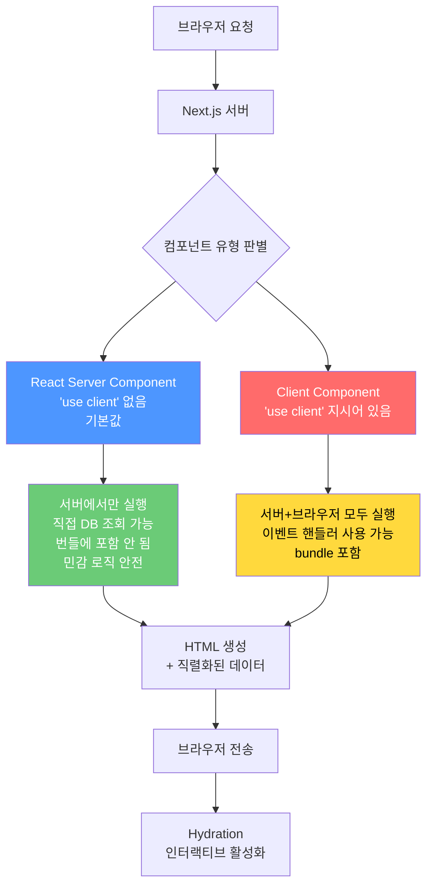
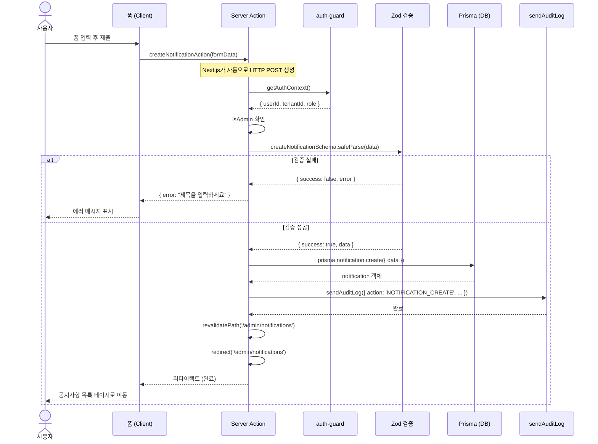
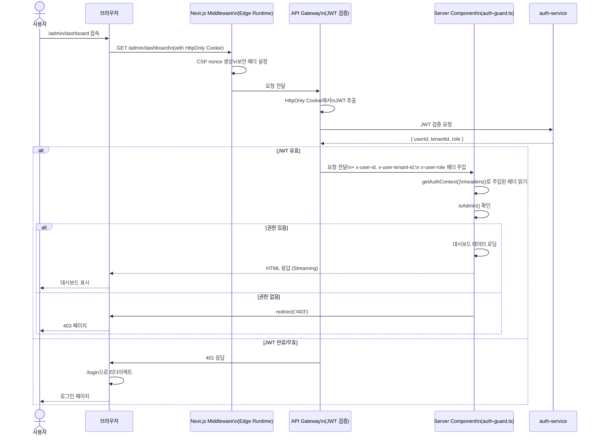

# Next.js 15 App Router 고급 패턴 — Server Actions, 병렬 라우트, 스트리밍

---

| 항목 | 내용 |
|------|------|
| 문서 ID | GUIDE-DEV-31 |
| 버전 | 1.0.0 |
| 작성일 | 2026-04-13 |
| 목적 | Next.js 15 App Router의 고급 기능을 공공기관 SaaS 포털 실제 코드를 통해 완전히 이해하고 적용 |
| 선행 학습 | GUIDE-DEV-10 (React 기초), GUIDE-DEV-20 (Next.js 기초), GUIDE-SEC-AUDIT-01 (감사 로그 기초) |

---

## 목차

1. [Next.js 15 App Router 핵심 변경사항](#1-nextjs-15-app-router-핵심-변경사항)
2. [React Server Components 완전 이해](#2-react-server-components-완전-이해)
3. [Server Actions](#3-server-actions)
4. [Streaming과 Suspense](#4-streaming과-suspense)
5. [병렬 라우트와 인터셉트 라우트](#5-병렬-라우트와-인터셉트-라우트)
6. [Next.js와 인증 통합](#6-nextjs와-인증-통합)
7. [성능 최적화](#7-성능-최적화)
8. [변경 이력](#변경-이력)

---

## 1. Next.js 15 App Router 핵심 변경사항

### 1.1 Pages Router vs App Router — 무엇이 달라졌는가

Next.js 13부터 도입된 App Router는 단순한 새 기능이 아니라 렌더링 철학 자체를 바꾸었습니다.

| 항목 | Pages Router (구) | App Router (현) |
|------|------------------|-----------------|
| 디렉토리 | `pages/` | `app/` |
| 기본 컴포넌트 | Client Component | **Server Component** |
| 데이터 패칭 | `getServerSideProps` | `async` 컴포넌트 + `fetch()` |
| 레이아웃 | `_app.tsx` + `_document.tsx` | `layout.tsx` (중첩 가능) |
| 로딩 상태 | 직접 관리 | `loading.tsx` 자동 처리 |
| 에러 처리 | `_error.tsx` | `error.tsx` (경계 단위) |
| 폼 제출 | API 라우트 필요 | Server Actions (`use server`) |
| 스트리밍 | 미지원 | `Suspense` + Streaming SSR |

**가장 중요한 변화:** App Router에서 모든 컴포넌트는 기본적으로 **서버에서만 실행**됩니다. 브라우저에서도 실행되어야 하는 컴포넌트에만 `'use client'` 지시어를 명시적으로 추가합니다.

### 1.2 App Router 렌더링 모델



**핵심 규칙:**

- RSC는 `useState`, `useEffect`, `onClick` 사용 불가
- Client Component는 서버 전용 모듈(`fs`, `crypto`, DB) 직접 import 불가
- RSC 안에 Client Component를 넣을 수 있음 (반대는 불가)

### 1.3 실제 포털 코드에서 확인하는 렌더링 모델

```typescript
// platform/apps/portal/src/app/admin/dashboard/page.tsx
// Design Ref: DESIGN-MTU-P16a — 관리자 대시보드

// 'use client' 없음 → 이 파일은 Server Component
import { AppShell } from '@/components/layout/AppShell';       // Client Component
import { DashboardContent } from '@/components/admin/DashboardContent'; // Server Component

export default function AdminDashboardPage() {
  // 서버에서만 실행 — 브라우저 JS 번들에 포함 안 됨
  return (
    <AppShell>           {/* Client Component: 상태 관리 포함 */}
      <DashboardContent /> {/* Server Component: 직접 fetch */}
    </AppShell>
  );
}
```

```typescript
// platform/apps/portal/src/components/layout/AppShell.tsx
'use client'; // 브라우저에서도 실행 필요

import { useState, useCallback } from 'react'; // 상태 관리

export function AppShell({ children }: AppShellProps) {
  const [railExpanded, setRailExpanded] = useState(false);
  const [aiPanelOpen, setAiPanelOpen] = useState(false);
  // ...상태 기반 UI 조작
}
```

---

## 2. React Server Components 완전 이해

### 2.1 RSC vs Client Component 선택 기준

아래 질문에 하나라도 "예"이면 Client Component(`'use client'`)가 필요합니다.

| 질문 | 예 → Client | 아니오 → Server |
|------|------------|----------------|
| `useState` / `useReducer` 사용? | 필요 | 불필요 |
| `useEffect` / `useCallback` 사용? | 필요 | 불필요 |
| `onClick` / `onChange` 등 이벤트 핸들러? | 필요 | 불필요 |
| `window`, `document`, `localStorage` 접근? | 필요 | 불필요 |
| 실시간 데이터 (WebSocket, SSE)? | 필요 | 불필요 |
| DB 직접 조회? | 불가 | 가능 |
| 서버 환경 변수 접근? | 불가 | 가능 |
| 민감 비즈니스 로직? | 위험 | 안전 |

**경험 법칙:** 처음에는 Server Component로 시작하고, 인터랙션이 필요할 때만 `'use client'`를 추가합니다.

### 2.2 데이터 패칭 패턴

**패턴 1: 컴포넌트에서 직접 fetch**

```typescript
// platform/apps/portal/src/components/admin/DashboardContent.tsx
// Design Ref: DESIGN-MTU-U1-P §D
// Plan SC: FR-UP.4, FR-UP.5, FR-UP.6

// 이 함수는 서버에서만 실행됨 — 환경변수 직접 접근 가능
async function fetchDashboardStats(): Promise<DashboardStats | null> {
  try {
    const apiBase = process.env.NEXT_PUBLIC_API_GATEWAY_URL ?? 'http://localhost:4000';
    const response = await fetch(`${apiBase}/api/dashboard/stats`, {
      // 30초마다 자동 재검증 (ISR 패턴)
      next: { revalidate: 30 },
    });
    if (!response.ok) return null;
    return response.json();
  } catch {
    return null; // 폴백: 빈 상태 표시
  }
}

async function fetchCsapCompliance(): Promise<CsapComplianceResponse | null> {
  try {
    const apiBase = process.env.NEXT_PUBLIC_API_GATEWAY_URL ?? 'http://localhost:4000';
    const response = await fetch(`${apiBase}/api/compliance/csap`, {
      next: { revalidate: 300 }, // 5분 캐시 (더 변동이 적음)
    });
    if (!response.ok) return null;
    return response.json();
  } catch {
    return null;
  }
}
```

**캐시 전략 선택 기준:**

| revalidate 값 | 용도 | 예시 |
|--------------|------|------|
| `0` | 항상 최신 (캐시 없음) | 감사 로그, 실시간 알림 |
| `30` | 30초 캐시 | 대시보드 통계 |
| `300` | 5분 캐시 | CSAP 준수 현황 |
| `3600` | 1시간 캐시 | 서비스 카탈로그 |
| `{ tags: ['menu'] }` | 태그 기반 무효화 | 메뉴 구성 (변경 시 즉시 갱신) |

**패턴 2: 서버 컴포넌트에서 Prisma 직접 쿼리**

API 라우트를 거치지 않고 서버 컴포넌트에서 직접 DB를 조회할 수 있습니다. 내부 데이터를 외부 HTTP 왕복 없이 조회하는 가장 효율적인 방법입니다.

```typescript
// app/admin/tenants/page.tsx (Server Component)

import { prisma } from '@/lib/prisma';
import { getAuthContext, isAdmin } from '@/lib/auth-guard';
import { redirect } from 'next/navigation';

export default async function TenantsPage() {
  // Plan SC: FR-UP.21
  // CSAP D-08: 서버 컴포넌트에서 인증 확인
  const auth = await getAuthContext();
  if (!auth || !isAdmin(auth)) {
    redirect('/login'); // 미인증 시 리다이렉트
  }

  // 직접 Prisma 쿼리 — HTTP 왕복 없음, 서버에서만 실행
  const tenants = await prisma.tenant.findMany({
    select: {
      id: true,
      name: true,
      slug: true,
      createdAt: true,
      _count: {
        select: { users: true, subscriptions: true },
      },
    },
    orderBy: { createdAt: 'desc' },
    take: 50,
  });

  return (
    <div>
      {tenants.map((tenant) => (
        <TenantRow key={tenant.id} tenant={tenant} />
      ))}
    </div>
  );
}
```

### 2.3 RBAC 검증을 서버 컴포넌트에서 처리

포털의 `auth-guard.ts`가 서버 컴포넌트에서 RBAC를 처리하는 방법입니다.

```typescript
// platform/apps/portal/src/lib/auth-guard.ts
// Design Ref: §Portal API 인증 가드
// Plan SC: FR-UP.21
// CSAP: D-08-01 인증, D-08-05 접근 통제

import { headers } from 'next/headers'; // 서버 전용 API

export interface PortalAuthContext {
  userId: string;
  tenantId: string;
  role: string;
}

// API 게이트웨이가 JWT 검증 후 주입하는 헤더를 읽음
export async function getAuthContext(): Promise<PortalAuthContext | null> {
  const headerStore = await headers();
  const userId = headerStore.get('x-user-id');
  const tenantId = headerStore.get('x-user-tenant-id');
  const role = headerStore.get('x-user-role');

  if (!userId || userId === 'anonymous') return null;

  const resolvedRole = role ?? 'VIEWER';

  // M-06 수정 (CSAP D-08-05): SUPER_ADMIN 외 tenantId 필수
  // API 게이트웨이 없이 직접 접근 시 격리 우회 차단
  if (!tenantId && resolvedRole !== 'SUPER_ADMIN') return null;

  return { userId, tenantId: tenantId ?? '', role: resolvedRole };
}

export function isAdmin(auth: PortalAuthContext): boolean {
  return auth.role === 'SUPER_ADMIN' || auth.role === 'TENANT_ADMIN';
}

export function isSuperAdmin(auth: PortalAuthContext): boolean {
  return auth.role === 'SUPER_ADMIN';
}
```

**서버 컴포넌트에서의 RBAC 패턴:**

```typescript
// 패턴 A: 페이지 수준 접근 제어 (리다이렉트)
export default async function AdminPage() {
  const auth = await getAuthContext();
  if (!auth) redirect('/login');           // 미인증
  if (!isAdmin(auth)) redirect('/403');    // 권한 없음
  // 이후 코드는 관리자만 실행
}

// 패턴 B: 컴포넌트 수준 조건부 렌더링
export default async function UserProfile({ userId }: { userId: string }) {
  const auth = await getAuthContext();
  const canEdit = auth && (isAdmin(auth) || auth.userId === userId);

  return (
    <div>
      <UserInfo userId={userId} />
      {canEdit && <EditButton userId={userId} />}  {/* 권한 있을 때만 표시 */}
    </div>
  );
}
```

---

## 3. Server Actions

### 3.1 'use server' 지시어 완전 이해

Server Actions는 클라이언트에서 호출하지만 서버에서 실행되는 함수입니다. API 라우트 없이 폼 제출이나 데이터 변경을 처리할 수 있습니다.

```
Client Component에서 버튼 클릭
       ↓
Server Action 호출 (HTTP POST 자동 생성)
       ↓
서버에서 함수 실행 (DB 접근 가능)
       ↓
결과를 클라이언트에 반환
       ↓
UI 갱신 (revalidatePath / optimistic update)
```

**`'use server'` 지시어 두 가지 사용 방식:**

```typescript
// 방식 1: 파일 최상단에 선언 (파일의 모든 함수가 Server Action)
'use server';

export async function createTenant(formData: FormData) { ... }
export async function deleteTenant(id: string) { ... }

// 방식 2: 함수 내부에 선언 (개별 함수만 Server Action)
export async function Page() {
  async function handleSubmit(formData: FormData) {
    'use server';
    // 이 함수만 서버에서 실행
    await createTenantAction(formData);
  }
  return <form action={handleSubmit}>...</form>;
}
```

### 3.2 폼 제출 → Server Action → Prisma 업데이트

실제 공지사항 생성을 예시로 Server Action 완전 구현입니다.

```typescript
// app/admin/notifications/actions.ts
'use server';

import { z } from 'zod';
import { revalidatePath } from 'next/cache';
import { redirect } from 'next/navigation';
import { prisma } from '@/lib/prisma';
import { getAuthContext, isAdmin } from '@/lib/auth-guard';
import { sendAuditLog } from '@/lib/audit';

// Zod 스키마 — 입력 검증 (CSAP D-12)
const createNotificationSchema = z.object({
  title: z.string().min(1, '제목을 입력하세요').max(200),
  content: z.string().min(1, '내용을 입력하세요').max(10_000),
  priority: z.enum(['LOW', 'NORMAL', 'HIGH', 'URGENT']),
  targetTenantId: z.string().optional(),
});

// Server Action — 공지사항 생성
export async function createNotificationAction(
  _prevState: { error: string } | null,
  formData: FormData,
): Promise<{ error: string } | null> {
  // CSAP D-08: Server Action에서도 인증 필수
  const auth = await getAuthContext();
  if (!auth || !isAdmin(auth)) {
    return { error: '권한이 없습니다.' };
  }

  // CSAP D-12: Zod 입력 검증
  const validationResult = createNotificationSchema.safeParse({
    title: formData.get('title'),
    content: formData.get('content'),
    priority: formData.get('priority'),
    targetTenantId: formData.get('targetTenantId') || undefined,
  });

  if (!validationResult.success) {
    const firstError = validationResult.error.issues[0];
    return { error: firstError?.message ?? '입력값이 유효하지 않습니다.' };
  }

  const data = validationResult.data;

  // CSAP D-08-05: 테넌트 격리 — TENANT_ADMIN은 자신의 테넌트만
  if (auth.role === 'TENANT_ADMIN' && data.targetTenantId !== auth.tenantId) {
    return { error: '자신의 테넌트에만 공지사항을 생성할 수 있습니다.' };
  }

  // Prisma 매개변수화 쿼리 (CSAP D-12: SQL 주입 방지)
  const notification = await prisma.notification.create({
    data: {
      title: data.title,
      content: data.content,
      priority: data.priority,
      tenantId: data.targetTenantId ?? auth.tenantId,
      createdById: auth.userId,
    },
  });

  // CSAP D-06: 감사 로그 기록
  await sendAuditLog({
    action: 'NOTIFICATION_CREATE',
    target: notification.id,
    targetType: 'notification',
    metadata: {
      title: data.title,
      priority: data.priority,
      tenantId: notification.tenantId,
    },
  });

  // 캐시 무효화 → 목록 페이지 자동 갱신
  revalidatePath('/admin/notifications');
  redirect('/admin/notifications');
}
```

**폼 컴포넌트 (Client Component):**

```typescript
// app/admin/notifications/create/page.tsx (Server Component)
import { createNotificationAction } from '../actions';

export default function CreateNotificationPage() {
  return (
    <form action={createNotificationAction}>
      <input name="title" placeholder="공지사항 제목" required />
      <textarea name="content" placeholder="내용" required />
      <select name="priority">
        <option value="NORMAL">보통</option>
        <option value="HIGH">높음</option>
        <option value="URGENT">긴급</option>
      </select>
      <button type="submit">등록</button>
    </form>
  );
}
```

### 3.3 Optimistic Update 패턴

사용자 경험을 개선하기 위해 서버 응답을 기다리지 않고 UI를 먼저 갱신하는 패턴입니다.

```typescript
'use client';

import { useOptimistic, useTransition } from 'react';
import { toggleNotificationRead } from './actions';

interface NotificationItem {
  id: string;
  title: string;
  isRead: boolean;
}

export function NotificationList({ initialItems }: { initialItems: NotificationItem[] }) {
  const [isPending, startTransition] = useTransition();

  // optimistic 상태: 서버 응답 전에 UI에 낙관적으로 반영
  const [optimisticItems, addOptimistic] = useOptimistic(
    initialItems,
    (state, updatedId: string) =>
      state.map((item) =>
        item.id === updatedId ? { ...item, isRead: !item.isRead } : item
      ),
  );

  function handleToggleRead(id: string) {
    startTransition(async () => {
      // UI 즉시 갱신 (낙관적)
      addOptimistic(id);

      // 서버에 실제 변경 요청
      await toggleNotificationRead(id);
      // 서버 오류 시 React가 자동으로 optimistic 상태를 롤백
    });
  }

  return (
    <ul>
      {optimisticItems.map((item) => (
        <li key={item.id} style={{ opacity: isPending ? 0.7 : 1 }}>
          <span>{item.isRead ? '읽음' : '미읽음'}</span>
          <span>{item.title}</span>
          <button onClick={() => handleToggleRead(item.id)}>
            읽음 표시
          </button>
        </li>
      ))}
    </ul>
  );
}
```

### 3.4 N2SF 데이터 등급 검증 Server Action

AI API 전송 전 데이터 등급을 검증하는 Server Action입니다.

```typescript
// app/admin/ai/actions.ts
'use server';

import { getAuthContext } from '@/lib/auth-guard';

enum DataGrade { C = 'C', S = 'S', O = 'O' }

// N2SF: AI API 전송 전 데이터 등급 확인
export async function sendToAiAnalysis(
  data: string,
  grade: DataGrade,
): Promise<{ result: string } | { error: string }> {
  const auth = await getAuthContext();
  if (!auth) return { error: '인증이 필요합니다.' };

  // N2SF N-05: C/S 등급 데이터 AI API 전송 절대 금지
  if (grade === DataGrade.C || grade === DataGrade.S) {
    await sendAuditLog({
      action: 'AI_SEND_BLOCKED',
      target: 'ai-service',
      targetType: 'system',
      metadata: { reason: `${grade}등급 데이터 전송 차단 (N2SF N-05)` },
    });
    return { error: `${grade}등급 데이터는 AI API로 전송할 수 없습니다. (N2SF N-05)` };
  }

  // O 등급: PII 마스킹 후 AI Gateway 경유 전송
  const maskedData = maskPII(data);

  const response = await fetch(`${process.env.AI_GATEWAY_URL}/analyze`, {
    method: 'POST',
    headers: { 'Content-Type': 'application/json' },
    body: JSON.stringify({ data: maskedData }),
  });

  if (!response.ok) return { error: 'AI 분석 실패' };

  const result = await response.json();
  return { result: result.analysis };
}

function maskPII(text: string): string {
  // 이름 마스킹 (홍길동 → 홍**)
  return text
    .replace(/\d{6}-\d{7}/g, '******-*******')  // 주민번호
    .replace(/\d{3}-\d{3,4}-\d{4}/g, '***-****-****')  // 전화번호
    .replace(/[a-zA-Z0-9._%+-]+@[a-zA-Z0-9.-]+\.[a-zA-Z]{2,}/g, '***@***.***'); // 이메일
}
```

### 3.5 Server Action 시퀀스 다이어그램



---

## 4. Streaming과 Suspense

### 4.1 loading.tsx와 Streaming SSR

App Router의 `loading.tsx`는 페이지 로딩 중 자동으로 표시되는 스켈레톤 UI입니다. Streaming SSR과 결합하면 데이터가 준비된 부분부터 즉시 브라우저에 전송됩니다.

```typescript
// app/admin/dashboard/loading.tsx
// 대시보드 페이지 전체 로딩 스켈레톤
export default function DashboardLoading() {
  return (
    <div className="space-y-6">
      {/* 통계 카드 스켈레톤 */}
      <div className="grid grid-cols-4 gap-4">
        {[1, 2, 3, 4].map((i) => (
          <div key={i} className="h-20 rounded-lg animate-pulse bg-gray-200" />
        ))}
      </div>

      {/* CSAP 준수 현황 스켈레톤 */}
      <div className="h-64 rounded-lg animate-pulse bg-gray-200" />
    </div>
  );
}
```

**포털 실제 코드의 Suspense 활용:**

```typescript
// platform/apps/portal/src/components/admin/DashboardContent.tsx
// Design Ref: DESIGN-MTU-U1-P §D
// Plan SC: FR-UP.4, FR-UP.5, FR-UP.6

export function DashboardContent() {
  return (
    <div className="space-y-6">
      {/* FR-UP.4: 통계 카드 — 데이터 로딩 중에는 스켈레톤 표시 */}
      <Suspense fallback={<StatsSkeleton />}>
        <StatsCards />
        {/* StatsCards는 async 컴포넌트 — 데이터 로딩 완료 후 렌더링 */}
      </Suspense>

      {/* FR-UP.6: CSAP 준수 현황 — 독립적으로 로딩 */}
      <Suspense fallback={<ComplianceSkeleton />}>
        <CsapSection />
        {/* 5분 캐시 — StatsCards와 독립적으로 로딩 완료 */}
      </Suspense>
    </div>
  );
}

// 각 Suspense 경계 안의 async 컴포넌트
async function StatsCards() {
  const stats = await fetchDashboardStats(); // API 호출
  const cards = stats ? buildStatCards(stats) : buildFallbackStatCards();
  return (
    <div className="grid grid-cols-4 gap-4">
      {cards.map((card) => <StatCard key={card.label} {...card} />)}
    </div>
  );
}
```

**Suspense 경계 전략:**

```
❌ 나쁜 예: Suspense 없이 전체 페이지 로딩
   → 모든 데이터가 준비될 때까지 사용자에게 빈 화면

✅ 좋은 예: 섹션별 Suspense
   → 통계 카드가 준비되는 즉시 표시
   → CSAP 준수 현황은 따로 로딩
   → 사용자는 부분적으로 완성된 UI를 즉시 봄
```

### 4.2 AI 응답 스트리밍

LLM의 텍스트 생성을 실시간으로 표시하는 패턴입니다.

```typescript
// app/admin/ai/stream/route.ts (API Route)
// AI 응답 스트리밍 엔드포인트

import { getAuthContext } from '@/lib/auth-guard';

export async function POST(request: Request) {
  const auth = await getAuthContext();
  if (!auth) {
    return new Response('Unauthorized', { status: 401 });
  }

  const { query } = await request.json();

  // N2SF: O등급 데이터만 허용 (검증 생략, 실제 구현에서는 필수)

  // AI Gateway에서 스트리밍 응답 받기
  const aiResponse = await fetch(`${process.env.AI_GATEWAY_URL}/stream`, {
    method: 'POST',
    headers: { 'Content-Type': 'application/json' },
    body: JSON.stringify({ query, masked: true }),
  });

  // ReadableStream을 클라이언트로 직접 전달
  return new Response(aiResponse.body, {
    headers: {
      'Content-Type': 'text/event-stream',
      'Cache-Control': 'no-cache',
      'Connection': 'keep-alive',
    },
  });
}
```

```typescript
// components/ai/AiStreamResponse.tsx (Client Component)
'use client';

import { useState, useEffect } from 'react';

export function AiStreamResponse({ query }: { query: string }) {
  const [response, setResponse] = useState('');
  const [isLoading, setIsLoading] = useState(true);

  useEffect(() => {
    const fetchStream = async () => {
      const res = await fetch('/admin/ai/stream', {
        method: 'POST',
        headers: { 'Content-Type': 'application/json' },
        body: JSON.stringify({ query }),
        credentials: 'include', // HttpOnly 쿠키 전송
      });

      const reader = res.body?.getReader();
      const decoder = new TextDecoder();

      if (!reader) return;

      while (true) {
        const { done, value } = await reader.read();
        if (done) {
          setIsLoading(false);
          break;
        }
        // 청크 단위로 텍스트 추가
        setResponse((prev) => prev + decoder.decode(value));
      }
    };

    fetchStream();
  }, [query]);

  return (
    <div>
      {response}
      {isLoading && <span className="animate-pulse">|</span>}
    </div>
  );
}
```

### 4.3 Suspense boundary 전략 가이드

| 상황 | 권장 Suspense 위치 | 이유 |
|------|-------------------|------|
| 독립적인 데이터 소스 | 각 소스마다 별도 Suspense | 병렬 로딩 가능 |
| 연관된 데이터 | 하나의 Suspense로 묶기 | 불일치 UI 방지 |
| 중요 콘텐츠 | 페이지 수준 loading.tsx | 전체 콘텐츠 준비 후 표시 |
| 보조 위젯 | 위젯 수준 Suspense | 핵심 콘텐츠 먼저 표시 |

---

## 5. 병렬 라우트와 인터셉트 라우트

### 5.1 병렬 라우트 (@슬롯)

병렬 라우트는 같은 URL에서 여러 독립적인 페이지를 동시에 렌더링합니다.

```
app/
  layout.tsx         ← @sidebar와 @main을 동시에 렌더링
  @sidebar/
    page.tsx         ← 사이드바 콘텐츠
    loading.tsx      ← 사이드바 로딩 상태
  @main/
    page.tsx         ← 메인 콘텐츠
    loading.tsx      ← 메인 로딩 상태
  page.tsx           ← 선택사항
```

```typescript
// app/admin/layout.tsx — 병렬 라우트 레이아웃
export default function AdminLayout({
  children,
  sidebar,  // @sidebar 슬롯
  modal,    // @modal 슬롯
}: {
  children: React.ReactNode;
  sidebar: React.ReactNode;
  modal: React.ReactNode;
}) {
  return (
    <div className="flex">
      <aside className="w-64">{sidebar}</aside>
      <main className="flex-1">{children}</main>
      {/* 모달은 포털로 렌더링 */}
      {modal}
    </div>
  );
}
```

### 5.2 인터셉트 라우트 (다이얼로그 URL-aware)

인터셉트 라우트는 동일 URL을 상황에 따라 다르게 렌더링합니다. 목록 페이지에서 항목 클릭 시 모달로, 직접 URL 접근 시 전체 페이지로 표시합니다.

```
app/
  admin/
    users/
      page.tsx                   ← 사용자 목록
      [userId]/
        page.tsx                 ← 사용자 상세 (직접 접근 시 전체 페이지)
    @modal/
      (.)admin/users/[userId]/
        page.tsx                 ← 사용자 상세 (목록에서 클릭 시 모달)
```

```typescript
// app/@modal/(.)admin/users/[userId]/page.tsx
// 목록 페이지에서 클릭할 때는 이 파일이 모달로 표시됨

import { Modal } from '@/components/common/Modal';
import { UserDetail } from '@/components/admin/UserDetail';

export default async function UserDetailModal({
  params,
}: {
  params: { userId: string };
}) {
  // URL은 /admin/users/uuid-123이지만 모달로 렌더링
  return (
    <Modal>
      <UserDetail userId={params.userId} />
    </Modal>
  );
}
```

### 5.3 멀티테넌트 대시보드 레이아웃

공공기관 SaaS의 멀티테넌트 환경에서 SUPER_ADMIN과 TENANT_ADMIN의 레이아웃을 분리합니다.

```typescript
// app/(super-admin)/layout.tsx — SUPER_ADMIN 전용
export default async function SuperAdminLayout({ children }: { children: React.ReactNode }) {
  const auth = await getAuthContext();
  if (!auth || auth.role !== 'SUPER_ADMIN') {
    redirect('/login');
  }

  return (
    <div>
      <SuperAdminNavbar />
      <div className="flex">
        <SuperAdminSidebar /> {/* 전체 테넌트 목록 포함 */}
        <main>{children}</main>
      </div>
    </div>
  );
}

// app/(tenant-admin)/layout.tsx — TENANT_ADMIN 전용
export default async function TenantAdminLayout({ children }: { children: React.ReactNode }) {
  const auth = await getAuthContext();
  if (!auth || auth.role !== 'TENANT_ADMIN') {
    redirect('/login');
  }

  // 자신의 테넌트 정보만 조회
  const tenant = await prisma.tenant.findUnique({
    where: { id: auth.tenantId },
    select: { name: true, slug: true },
  });

  return (
    <div>
      <TenantAdminNavbar tenantName={tenant?.name ?? ''} />
      <div className="flex">
        <TenantAdminSidebar tenantId={auth.tenantId} />
        <main>{children}</main>
      </div>
    </div>
  );
}
```

---

## 6. Next.js와 인증 통합

### 6.1 Middleware로 JWT 검증 (Edge Runtime)

포털의 `middleware.ts`는 Edge Runtime에서 실행되어 모든 요청에 CSP 헤더를 주입합니다.

```typescript
// platform/apps/portal/src/middleware.ts
// Design Ref: L-04-CSP-NONCE.design.md §1
// Plan SC: FR-L04.1, FR-L04.2
// CSAP: D-12 시스템 개발 보안 — XSS 방지 CSP 강화

import { NextResponse } from 'next/server';
import type { NextRequest } from 'next/server';

export function middleware(request: NextRequest) {
  // FR-L04.1: 요청마다 고유한 nonce 생성 (XSS 방지)
  const nonce = Buffer.from(crypto.randomUUID()).toString('base64');

  // FR-L04.2: CSP 정책 (unsafe-inline 제거, nonce 기반)
  const cspDirectives = [
    "default-src 'self'",
    `script-src 'self' 'nonce-${nonce}' 'strict-dynamic'`,
    "style-src 'self' 'unsafe-inline'",
    "img-src 'self' data: blob:",
    "font-src 'self'",
    "connect-src 'self' http://localhost:* ws://localhost:*",
    "frame-ancestors 'none'",
    "base-uri 'self'",
    "form-action 'self'",
  ];

  const requestHeaders = new Headers(request.headers);
  requestHeaders.set('x-nonce', nonce); // layout.tsx에서 읽어서 script 태그에 적용

  const response = NextResponse.next({ request: { headers: requestHeaders } });

  response.headers.set('Content-Security-Policy', cspDirectives.join('; '));
  response.headers.set('X-Frame-Options', 'DENY');
  response.headers.set('X-Content-Type-Options', 'nosniff');
  response.headers.set('Referrer-Policy', 'strict-origin-when-cross-origin');
  response.headers.set('X-DNS-Prefetch-Control', 'off');
  response.headers.set(
    'Permissions-Policy',
    'camera=(), microphone=(), geolocation=(), interest-cohort=()'
  );
  response.headers.set('X-XSS-Protection', '0');

  if (process.env.NODE_ENV === 'production') {
    response.headers.set(
      'Strict-Transport-Security',
      'max-age=63072000; includeSubDomains; preload'
    );
  }

  return response;
}

// 정적 파일 제외
export const config = {
  matcher: [
    {
      source: '/((?!_next/static|_next/image|favicon.ico).*)',
      missing: [
        { type: 'header' as const, key: 'next-router-prefetch' },
        { type: 'header' as const, key: 'purpose', value: 'prefetch' },
      ],
    },
  ],
};
```

### 6.2 next/headers로 서버 컴포넌트에서 토큰 접근

```typescript
// platform/apps/portal/src/lib/auth-guard.ts
// API 게이트웨이가 JWT 검증 후 헤더를 주입함
// 서버 컴포넌트에서 next/headers로 읽음

import { headers } from 'next/headers'; // 서버 전용

export async function getAuthContext(): Promise<PortalAuthContext | null> {
  const headerStore = await headers();

  // API 게이트웨이가 주입하는 헤더들
  const userId = headerStore.get('x-user-id');
  const tenantId = headerStore.get('x-user-tenant-id');
  const role = headerStore.get('x-user-role');

  if (!userId || userId === 'anonymous') return null;
  // ... 나머지 검증
}
```

**보안 주의사항:** `x-user-id` 헤더는 API 게이트웨이만 설정할 수 있어야 합니다. 외부에서 이 헤더를 직접 조작하면 권한 우회가 가능합니다. Nginx/Envoy에서 업스트림 외의 이 헤더를 제거하는 설정이 필수입니다.

### 6.3 RBAC 기반 메뉴 필터링

```typescript
// components/layout/ServiceRail.tsx (Client Component)
// platform/apps/portal/src/components/layout/ServiceRail.tsx
// Plan SC: FR-UP.1, FR-UP.12, FR-UP.22

// 메뉴 항목 — 역할별 표시 제어
const ALL_MENU_ITEMS = [
  {
    id: 'dashboard',
    label: '대시보드',
    icon: 'grid',
    href: '/admin/dashboard',
    allowedRoles: ['SUPER_ADMIN', 'TENANT_ADMIN', 'USER'],
  },
  {
    id: 'users',
    label: '사용자 관리',
    icon: 'users',
    href: '/admin/users',
    allowedRoles: ['SUPER_ADMIN', 'TENANT_ADMIN'],
  },
  {
    id: 'tenants',
    label: '테넌트 관리',
    icon: 'building',
    href: '/admin/tenants',
    allowedRoles: ['SUPER_ADMIN'], // 최고 관리자만
  },
  {
    id: 'billing',
    label: '청구 관리',
    icon: 'credit-card',
    href: '/admin/billing',
    allowedRoles: ['SUPER_ADMIN'],
  },
  {
    id: 'audit',
    label: '감사 로그',
    icon: 'shield',
    href: '/admin/audit',
    allowedRoles: ['SUPER_ADMIN', 'TENANT_ADMIN'],
  },
];

// 역할에 따라 메뉴 필터링
function filterMenuByRole(role: string) {
  return ALL_MENU_ITEMS.filter((item) => item.allowedRoles.includes(role));
}
```

### 6.4 인증 흐름 다이어그램



---

## 7. 성능 최적화

### 7.1 next/image 이미지 최적화

```typescript
// 공공기관 포털의 이미지 사용 패턴

import Image from 'next/image';

// 로고 이미지 (고정 크기)
export function GovLogo() {
  return (
    <Image
      src="/images/gov-logo.png"
      alt="정부 기관 로고"
      width={120}
      height={40}
      priority        // LCP 이미지: 즉시 로딩 (preload)
      quality={90}    // 90% 품질 (WebP 자동 변환)
    />
  );
}

// 테넌트 썸네일 (동적 크기)
export function TenantThumbnail({ src, name }: { src: string; name: string }) {
  return (
    <Image
      src={src}
      alt={`${name} 로고`}
      fill              // 부모 요소 크기에 맞춤
      sizes="(max-width: 768px) 48px, 64px"  // 반응형 크기 힌트
      className="object-contain"
      loading="lazy"   // 기본값: 뷰포트 밖은 지연 로딩
    />
  );
}
```

**next/image 최적화 효과:**

- WebP/AVIF 자동 변환 (파일 크기 30~50% 감소)
- 레이지 로딩 자동 적용
- `sizes` 속성으로 화면 크기별 최적 이미지 제공
- CLS(Cumulative Layout Shift) 방지 (사이즈 예약)

### 7.2 dynamic import 코드 분할

무거운 컴포넌트를 필요할 때만 로딩합니다.

```typescript
import dynamic from 'next/dynamic';

// 차트 라이브러리 — 대시보드 탭 진입 시에만 로딩
const RevenueChart = dynamic(
  () => import('@/components/admin/RevenueChart'),
  {
    loading: () => <div className="h-48 animate-pulse bg-gray-200 rounded" />,
    ssr: false, // 서버 사이드 렌더링 제외 (브라우저 전용 라이브러리)
  }
);

// 감사 로그 뷰어 — 감사 탭 진입 시에만 로딩
const AuditLogViewer = dynamic(
  () => import('@/components/admin/AuditLogViewer'),
  { ssr: true } // 서버에서도 렌더링 (SEO, 초기 HTML)
);

// AI 패널 — 버튼 클릭 시에만 로딩
// platform/apps/portal/src/components/layout/AppShell.tsx 참조
const AiSidePanel = dynamic(
  () => import('../ai/AiSidePanel').then((mod) => mod.AiSidePanel),
  { ssr: false }
);
```

### 7.3 prefetch와 preload 전략

```typescript
// Link 컴포넌트의 prefetch 활용
import Link from 'next/link';

export function AdminMenu() {
  return (
    <nav>
      {/* prefetch: true (기본값) — 뷰포트에 들어오면 미리 로딩 */}
      <Link href="/admin/dashboard">대시보드</Link>

      {/* prefetch: false — 클릭 시에만 로딩 (자주 방문하지 않는 페이지) */}
      <Link href="/admin/billing" prefetch={false}>청구 관리</Link>

      {/* 주요 페이지 강제 prefetch (사용자가 많이 방문하는 경로) */}
      <Link href="/admin/users">사용자 관리</Link>
    </nav>
  );
}
```

**캐시 태그 기반 선택적 무효화:**

```typescript
// Server Action에서 특정 페이지만 무효화
import { revalidatePath, revalidateTag } from 'next/cache';

export async function updateMenuAction(formData: FormData) {
  'use server';
  // 메뉴 DB 업데이트...

  // 메뉴 태그가 붙은 캐시만 무효화
  revalidateTag('menu');

  // 특정 경로의 캐시만 무효화
  revalidatePath('/admin/menus');
}

// fetch에 태그 붙이기
const menu = await fetch(`${apiBase}/api/menus`, {
  next: {
    revalidate: 3600,
    tags: ['menu'], // 이 태그로 선택적 무효화 가능
  },
});
```

### 7.4 React 18 성능 최적화 훅

```typescript
'use client';

import { useCallback, useMemo, memo, useTransition } from 'react';

// useMemo: 계산 비용이 큰 값 메모이제이션
function CsapSummary({ domains }: { domains: CsapDomain[] }) {
  const overallRate = useMemo(
    () => {
      const total = domains.reduce((sum, d) => sum + d.total, 0);
      const compliant = domains.reduce((sum, d) => sum + d.compliant, 0);
      return total > 0 ? Math.round((compliant / total) * 100) : 0;
    },
    [domains] // domains가 바뀔 때만 재계산
  );

  return <div>전체 준수율: {overallRate}%</div>;
}

// useCallback: 함수 메모이제이션 (AppShell.tsx 실제 사용)
export function AppShell({ children }: AppShellProps) {
  const [activeService, setActiveService] = useState<string | null>(null);

  // 이 함수를 ServiceRail에 전달할 때 매 렌더마다 새 참조 생성 방지
  const handleServiceSelect = useCallback((serviceId: string) => {
    setActiveService((prev) => (prev === serviceId ? null : serviceId));
  }, []); // 빈 의존성 — 절대 바뀌지 않음

  return <ServiceRail onServiceSelect={handleServiceSelect} />;
}

// useTransition: 무거운 상태 업데이트를 낮은 우선순위로 처리
function SearchableUserList() {
  const [query, setQuery] = useState('');
  const [filteredUsers, setFilteredUsers] = useState(allUsers);
  const [isPending, startTransition] = useTransition();

  function handleSearch(e: React.ChangeEvent<HTMLInputElement>) {
    const value = e.target.value;
    setQuery(value); // 즉시 업데이트 (입력 필드)

    startTransition(() => {
      // 무거운 필터링은 낮은 우선순위로 처리
      setFilteredUsers(allUsers.filter((u) =>
        u.name.includes(value) || u.email.includes(value)
      ));
    });
  }

  return (
    <div>
      <input value={query} onChange={handleSearch} />
      {isPending && <span>검색 중...</span>}
      <UserList users={filteredUsers} />
    </div>
  );
}

// memo: 부모 재렌더 시 자식 불필요한 재렌더 방지
const UserRow = memo(function UserRow({ user }: { user: User }) {
  return <tr><td>{user.name}</td><td>{user.email}</td></tr>;
});
```

---

## 변경 이력

| 버전 | 일자 | 변경 내용 | 작성자 |
|------|------|-----------|--------|
| 1.0.0 | 2026-04-13 | 초안 작성 — App Router 렌더링 모델, RSC, Server Actions, Streaming/Suspense, 병렬 라우트, 인증 통합, 성능 최적화 (포털 실제 코드 참조) | Implementer Agent |
