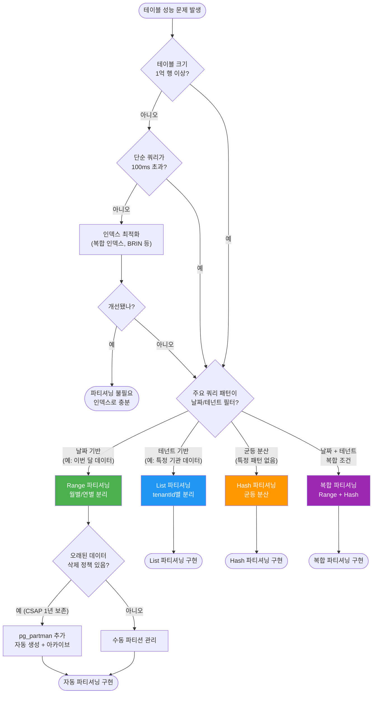
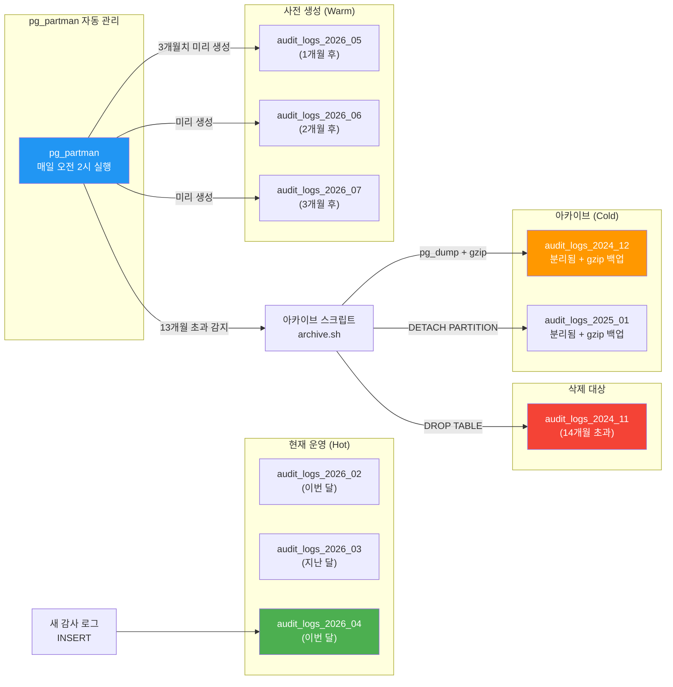
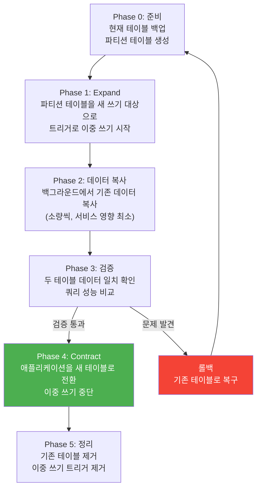

# 32. 데이터베이스 파티셔닝 전략

> **문서 ID**: DEV-GUIDE-032
> **버전**: 1.0.0
> **작성일**: 2026-04-13
> **목적**: PostgreSQL 파티셔닝으로 대용량 데이터를 효율적으로 처리하는 방법을 초급자가 이해하고 적용할 수 있도록 안내
> **선행 학습**: 14-database-design.md, 13-prisma-advanced.md, 05-prisma-guide.md, 21-prisma-migration-strategy.md

---

## 목차

1. [파티셔닝 필요 시점](#1-파티셔닝-필요-시점)
2. [PostgreSQL 파티셔닝 방식](#2-postgresql-파티셔닝-방식)
3. [감사 로그 테이블 파티셔닝](#3-감사-로그-테이블-파티셔닝)
4. [멀티테넌트 파티셔닝](#4-멀티테넌트-파티셔닝)
5. [Prisma에서 파티셔닝 사용](#5-prisma에서-파티셔닝-사용)
6. [파티셔닝 마이그레이션](#6-파티셔닝-마이그레이션)
7. [운영 모니터링](#7-운영-모니터링)
8. [변경 이력](#변경-이력)

---

## 1. 파티셔닝 필요 시점

### 1.1 파티셔닝이란 무엇인가

파티셔닝(Partitioning)은 하나의 큰 테이블을 여러 개의 작은 "파티션"으로 나누는 기술입니다. 사용자(애플리케이션)는 여전히 하나의 테이블처럼 보이지만, 내부적으로 데이터는 조건에 따라 여러 파티션에 나뉘어 저장됩니다.

**일상적인 비유**: 회사 문서를 한 서랍에 모두 보관하면 찾기 어렵습니다. 연도별, 부서별로 서랍을 나누면 필요한 문서를 빠르게 찾을 수 있습니다. 파티셔닝이 바로 이와 같은 원리입니다.

### 1.2 파티셔닝 도입 기준

다음 중 하나라도 해당되면 파티셔닝을 고려해야 합니다:

| 신호 | 임계값 | 설명 |
|------|--------|------|
| 테이블 행 수 | 1억 행 이상 | 인덱스만으로는 한계 |
| 단순 쿼리 응답 시간 | 100ms 초과 | 인덱스 최적화 후에도 느림 |
| VACUUM 시간 | 수 시간 소요 | 전체 테이블 처리 부하 |
| 테이블 크기 | 100GB 이상 | 백업/복구 시간 과도 |
| 특정 범위 쿼리 빈번 | 날짜/테넌트 기반 필터 | 파티션 pruning으로 효과 |

이 프로젝트에서 파티셔닝이 필요한 테이블:
- `audit_logs`: 모든 민감 작업 전수 기록 (CSAP D-06). 서비스가 성장할수록 급증.
- `ai_usage_records`: AI 토큰 사용 기록. 요청마다 1건씩 쌓임.
- `session_events`: 사용자 세션 이벤트. 실시간 스트림으로 대량 발생.

### 1.3 파티셔닝 도입 결정 트리



---

## 2. PostgreSQL 파티셔닝 방식

### 2.1 파티셔닝 기본 개념

PostgreSQL에서 파티셔닝은 "파티션 키"를 기준으로 데이터를 나눕니다. 파티션 키는 하나 또는 여러 컬럼의 조합입니다.

**파티션 테이블 구조**:
```
audit_logs (부모 테이블 - 비어 있음)
├── audit_logs_2026_01 (파티션 - 2026년 1월 데이터)
├── audit_logs_2026_02 (파티션 - 2026년 2월 데이터)
├── audit_logs_2026_03 (파티션 - 2026년 3월 데이터)
└── ...
```

쿼리할 때는 `SELECT * FROM audit_logs WHERE created_at >= '2026-01-01'`처럼 부모 테이블에 쿼리하면 됩니다. PostgreSQL이 자동으로 해당 파티션만 조회합니다.

### 2.2 Range 파티셔닝 (날짜 기반)

날짜 기반 데이터에 가장 많이 사용됩니다. `audit_logs`, `ai_usage_records` 같이 시간 순서로 쌓이는 데이터에 적합합니다:

```sql
-- 1. 부모 테이블 생성 (PARTITION BY RANGE)
CREATE TABLE audit_logs (
    id          UUID        NOT NULL DEFAULT gen_random_uuid(),
    tenant_id   UUID        NOT NULL,
    actor_id    UUID,
    action      VARCHAR(100) NOT NULL,
    target_type VARCHAR(100),
    target_id   UUID,
    detail      JSONB,
    ip_address  INET,
    created_at  TIMESTAMPTZ NOT NULL DEFAULT NOW()
    -- 주의: 파티션 키(created_at)는 PRIMARY KEY에 포함되어야 함
) PARTITION BY RANGE (created_at);

-- 파티션 키를 포함한 복합 PRIMARY KEY 설정
ALTER TABLE audit_logs ADD CONSTRAINT audit_logs_pkey
    PRIMARY KEY (id, created_at);

-- 2. 월별 파티션 생성
CREATE TABLE audit_logs_2026_01
    PARTITION OF audit_logs
    FOR VALUES FROM ('2026-01-01') TO ('2026-02-01');

CREATE TABLE audit_logs_2026_02
    PARTITION OF audit_logs
    FOR VALUES FROM ('2026-02-01') TO ('2026-03-01');

CREATE TABLE audit_logs_2026_03
    PARTITION OF audit_logs
    FOR VALUES FROM ('2026-03-01') TO ('2026-04-01');

CREATE TABLE audit_logs_2026_04
    PARTITION OF audit_logs
    FOR VALUES FROM ('2026-04-01') TO ('2026-05-01');

-- 3. 각 파티션에 인덱스 생성 (파티션별 독립 인덱스)
CREATE INDEX audit_logs_2026_04_tenant_idx
    ON audit_logs_2026_04 (tenant_id, created_at DESC);

CREATE INDEX audit_logs_2026_04_actor_idx
    ON audit_logs_2026_04 (actor_id, created_at DESC);

-- 4. 기본 파티션 (범위 밖 데이터 처리)
CREATE TABLE audit_logs_default
    PARTITION OF audit_logs DEFAULT;
```

**파티션 확인**:
```sql
-- 파티션 목록 확인
SELECT
    child.relname AS partition_name,
    pg_size_pretty(pg_relation_size(child.oid)) AS partition_size,
    pg_get_expr(child.relpartbound, child.oid) AS partition_range
FROM pg_inherits
JOIN pg_class parent ON pg_inherits.inhparent = parent.oid
JOIN pg_class child ON pg_inherits.inhrelid = child.oid
WHERE parent.relname = 'audit_logs'
ORDER BY child.relname;

-- 출력 예시:
-- partition_name      | partition_size | partition_range
-- --------------------|----------------|------------------------------------------
-- audit_logs_2026_01  | 2048 MB        | FOR VALUES FROM ('2026-01-01') TO ('2026-02-01')
-- audit_logs_2026_02  | 1856 MB        | FOR VALUES FROM ('2026-02-01') TO ('2026-03-01')
```

### 2.3 List 파티셔닝 (tenantId 기반)

특정 값 목록을 기준으로 나눕니다. 멀티테넌트 환경에서 대형 테넌트를 전용 파티션에 격리할 때 사용합니다:

```sql
-- 테넌트 기반 List 파티셔닝
CREATE TABLE tenant_documents (
    id          UUID        NOT NULL DEFAULT gen_random_uuid(),
    tenant_id   UUID        NOT NULL,
    title       VARCHAR(500) NOT NULL,
    content     TEXT,
    created_at  TIMESTAMPTZ NOT NULL DEFAULT NOW()
) PARTITION BY LIST (tenant_id);

-- 대형 테넌트: 전용 파티션
CREATE TABLE tenant_documents_tenant_a
    PARTITION OF tenant_documents
    FOR VALUES IN ('550e8400-e29b-41d4-a716-446655440001');

CREATE TABLE tenant_documents_tenant_b
    PARTITION OF tenant_documents
    FOR VALUES IN ('550e8400-e29b-41d4-a716-446655440002');

-- 나머지 테넌트: 기본 파티션
CREATE TABLE tenant_documents_others
    PARTITION OF tenant_documents DEFAULT;
```

### 2.4 Hash 파티셔닝 (균등 분산)

특정 패턴이 없는 데이터를 균등하게 분산합니다. 어떤 값을 기준으로 나눌지 명확하지 않을 때 사용합니다:

```sql
-- Hash 파티셔닝 (4개 파티션으로 균등 분산)
CREATE TABLE session_events (
    id          UUID        NOT NULL DEFAULT gen_random_uuid(),
    session_id  UUID        NOT NULL,
    event_type  VARCHAR(50) NOT NULL,
    payload     JSONB,
    created_at  TIMESTAMPTZ NOT NULL DEFAULT NOW()
) PARTITION BY HASH (session_id);

-- 4개 파티션으로 분산
CREATE TABLE session_events_0 PARTITION OF session_events
    FOR VALUES WITH (MODULUS 4, REMAINDER 0);
CREATE TABLE session_events_1 PARTITION OF session_events
    FOR VALUES WITH (MODULUS 4, REMAINDER 1);
CREATE TABLE session_events_2 PARTITION OF session_events
    FOR VALUES WITH (MODULUS 4, REMAINDER 2);
CREATE TABLE session_events_3 PARTITION OF session_events
    FOR VALUES WITH (MODULUS 4, REMAINDER 3);
```

**주의**: Hash 파티셔닝은 파티션 수를 나중에 변경하기가 매우 어렵습니다. 처음부터 충분한 파티션 수를 설정해야 합니다.

### 2.5 복합 파티셔닝 (Range + Hash)

`audit_logs`처럼 날짜와 테넌트 ID가 모두 쿼리 조건에 자주 등장하는 경우, Range + Hash 복합 파티셔닝이 효과적입니다:

```sql
-- 1단계: Range 파티션 (월별)
CREATE TABLE ai_usage_records (
    id          UUID        NOT NULL DEFAULT gen_random_uuid(),
    tenant_id   UUID        NOT NULL,
    model_id    UUID        NOT NULL,
    tokens_used INTEGER     NOT NULL,
    cost_usd    NUMERIC(10,6),
    created_at  TIMESTAMPTZ NOT NULL DEFAULT NOW()
) PARTITION BY RANGE (created_at);

-- 2단계: 각 월별 파티션을 Hash로 다시 분할
-- 2026년 4월 파티션을 4개의 Hash 서브파티션으로 분할
CREATE TABLE ai_usage_records_2026_04
    PARTITION OF ai_usage_records
    FOR VALUES FROM ('2026-04-01') TO ('2026-05-01')
    PARTITION BY HASH (tenant_id);

-- 서브파티션 생성
CREATE TABLE ai_usage_records_2026_04_0
    PARTITION OF ai_usage_records_2026_04
    FOR VALUES WITH (MODULUS 4, REMAINDER 0);
CREATE TABLE ai_usage_records_2026_04_1
    PARTITION OF ai_usage_records_2026_04
    FOR VALUES WITH (MODULUS 4, REMAINDER 1);
CREATE TABLE ai_usage_records_2026_04_2
    PARTITION OF ai_usage_records_2026_04
    FOR VALUES WITH (MODULUS 4, REMAINDER 2);
CREATE TABLE ai_usage_records_2026_04_3
    PARTITION OF ai_usage_records_2026_04
    FOR VALUES WITH (MODULUS 4, REMAINDER 3);
```

**효과**: "2026년 4월의 특정 테넌트 데이터"를 조회할 때 전체 데이터의 1/4 × 1/4 = 1/16만 스캔합니다.

---

## 3. 감사 로그 테이블 파티셔닝

### 3.1 audit_logs 파티셔닝이 중요한 이유

CSAP D-06 요건에 따라 모든 민감 작업은 감사 로그에 기록되어야 합니다. 이 프로젝트에서는 `platform/services/compliance-service/src/lib/audit.ts`가 이 역할을 합니다.

문제는 데이터가 급격히 늘어난다는 것입니다:
- 사용자 수: 1만 명
- 평균 민감 작업: 사용자당 하루 10건
- 일일 로그 생성: 10만 건
- 연간 로그: 3,650만 건 (CSAP D-06: 최소 1년 보존)

1년 후에는 3천만 행 이상이 됩니다. 인덱스만으로는 한계가 오며, 파티셔닝이 필수입니다.

### 3.2 audit_logs 완전 파티셔닝 구현

```sql
-- CSAP D-06 준수 audit_logs 파티셔닝
-- Design Ref: platform/services/compliance-service/src/lib/audit.ts

-- 1. 부모 테이블 생성
CREATE TABLE audit_logs (
    id              UUID        NOT NULL DEFAULT gen_random_uuid(),
    tenant_id       UUID        NOT NULL,
    actor_id        UUID,                -- 행위자 (사용자 ID)
    actor_email     VARCHAR(255),        -- 행위자 이메일 (감사 목적)
    action          VARCHAR(100) NOT NULL, -- 예: USER_DELETE, CONFIG_CHANGE
    target_type     VARCHAR(100),        -- 예: USER, DOCUMENT
    target_id       UUID,
    detail          JSONB,              -- 추가 상세 정보
    ip_address      INET,
    user_agent      TEXT,
    created_at      TIMESTAMPTZ NOT NULL DEFAULT NOW(),

    -- CSAP D-06: 로그 무결성 보장 (append-only, 삭제/수정 불가)
    -- PostgreSQL Row-Level Security + 권한 설정으로 구현

    CONSTRAINT audit_logs_pkey PRIMARY KEY (id, created_at)  -- 파티션 키 포함
) PARTITION BY RANGE (created_at);

-- 감사 로그는 수정/삭제 금지 (CSAP D-06 append-only)
-- 별도 DB 역할(audit_writer)에 INSERT만 허용
REVOKE UPDATE, DELETE ON audit_logs FROM PUBLIC;
GRANT INSERT, SELECT ON audit_logs TO audit_writer;

-- 2. 파티션 생성 (2026년 월별)
DO $$
DECLARE
    month_start DATE;
    month_end   DATE;
    partition_name TEXT;
BEGIN
    FOR i IN 1..12 LOOP
        month_start := DATE_TRUNC('month', DATE '2026-01-01' + (i-1 || ' months')::INTERVAL);
        month_end   := month_start + '1 month'::INTERVAL;
        partition_name := 'audit_logs_' || TO_CHAR(month_start, 'YYYY_MM');

        EXECUTE FORMAT(
            'CREATE TABLE IF NOT EXISTS %I PARTITION OF audit_logs
             FOR VALUES FROM (%L) TO (%L)',
            partition_name, month_start, month_end
        );

        -- 파티션별 인덱스 생성
        EXECUTE FORMAT(
            'CREATE INDEX IF NOT EXISTS %I ON %I (tenant_id, created_at DESC)',
            partition_name || '_tenant_idx', partition_name
        );

        EXECUTE FORMAT(
            'CREATE INDEX IF NOT EXISTS %I ON %I (actor_id, created_at DESC)',
            partition_name || '_actor_idx', partition_name
        );

        EXECUTE FORMAT(
            'CREATE INDEX IF NOT EXISTS %I ON %I (action, created_at DESC)',
            partition_name || '_action_idx', partition_name
        );

        RAISE NOTICE '파티션 생성 완료: %', partition_name;
    END LOOP;
END $$;
```

### 3.3 pg_partman으로 자동 파티션 관리

매달 새 파티션을 수동으로 만들면 실수할 위험이 있습니다. pg_partman이 이를 자동화합니다:

```bash
# pg_partman 설치 (PostgreSQL 확장)
# kubernetes/jobs/pg-partman-setup-job.yaml

# 데이터베이스에서 pg_partman 설치
psql -U postgres -d saas_db -c "CREATE EXTENSION IF NOT EXISTS pg_partman;"
```

```sql
-- pg_partman으로 audit_logs 자동 관리 설정
SELECT partman.create_parent(
    p_parent_table   => 'public.audit_logs',    -- 부모 테이블
    p_control        => 'created_at',            -- 파티션 키
    p_type           => 'native',                -- 네이티브 파티셔닝
    p_interval       => 'monthly',               -- 월별 파티셔닝
    p_premake        => 3,                       -- 3개월치 미리 생성
    p_start_partition => '2026-01-01'
);

-- pg_partman 유지보수 설정
UPDATE partman.part_config
SET
    retention       = '13 months',  -- 13개월 보존 (CSAP D-06: 1년 + 1개월 여유)
    retention_keep_table = TRUE,    -- 파티션 테이블 유지 (아카이브용)
    retention_keep_index = FALSE,   -- 아카이브 파티션의 인덱스는 삭제 (공간 절약)
    infinite_time_partitions = TRUE -- 자동으로 계속 파티션 생성
WHERE parent_table = 'public.audit_logs';
```

```bash
# pg_partman 유지보수 작업 (Kubernetes CronJob으로 매일 실행)
# kubernetes/cronjobs/pg-partman-maintenance.yaml
```

```yaml
apiVersion: batch/v1
kind: CronJob
metadata:
  name: pg-partman-maintenance
  namespace: saas-prod
  annotations:
    # CSAP D-06: 감사 로그 파티션 자동 관리
    purpose: "월별 새 파티션 생성 + 13개월 초과 파티션 아카이브"
spec:
  schedule: "0 2 * * *"  # 매일 오전 2시 (트래픽 최저 시간)
  jobTemplate:
    spec:
      template:
        spec:
          containers:
            - name: pg-partman-maintenance
              image: postgres:16
              env:
                - name: PGPASSWORD
                  valueFrom:
                    secretKeyRef:
                      name: postgres-secret
                      key: password
              command:
                - /bin/sh
                - -c
                - |
                  psql -h postgres-master -U saas_user -d saas_db -c \
                    "SELECT partman.run_maintenance(p_parent_table => 'public.audit_logs');"
          restartPolicy: OnFailure
```

### 3.4 오래된 파티션 아카이브/삭제 전략

CSAP D-06에 따르면 감사 로그는 최소 1년 보존해야 합니다. 그러나 영원히 보존하면 공간이 부족해집니다:

```sql
-- 아카이브 절차 (13개월 초과 파티션)

-- 1단계: 아카이브 테이블스페이스로 이동 (콜드 스토리지)
ALTER TABLE audit_logs_2024_12 SET TABLESPACE pg_cold_storage;

-- 2단계: 인덱스 삭제 (공간 절약, 아카이브 데이터는 검색 빈도 낮음)
DROP INDEX IF EXISTS audit_logs_2024_12_tenant_idx;
DROP INDEX IF EXISTS audit_logs_2024_12_actor_idx;
DROP INDEX IF EXISTS audit_logs_2024_12_action_idx;

-- 3단계: 파티션을 부모 테이블에서 분리 (더 이상 일반 쿼리에 포함 안 됨)
ALTER TABLE audit_logs DETACH PARTITION audit_logs_2024_12;

-- 4단계: 별도 아카이브 DB로 pg_dump
-- pg_dump -t audit_logs_2024_12 saas_db | gzip > audit_2024_12_archive.sql.gz

-- 5단계: 원본 파티션 삭제 (아카이브 완료 확인 후)
-- DROP TABLE audit_logs_2024_12;
```

**자동화 스크립트**:
```bash
#!/bin/bash
# scripts/audit-log-archive.sh
# Design Ref: platform/services/compliance-service/src/lib/audit.ts
# CSAP D-06: 1년 보존 후 아카이브

set -e

RETENTION_MONTHS=13
ARCHIVE_PATH="/mnt/cold-storage/audit-archives"
DB_HOST="postgres-master"
DB_NAME="saas_db"
DB_USER="saas_admin"

# 13개월 초과 파티션 목록 조회
CUTOFF_DATE=$(date -d "-${RETENTION_MONTHS} months" +%Y_%m)
echo "아카이브 기준: ${CUTOFF_DATE} 이전 파티션"

PARTITIONS=$(psql -h "$DB_HOST" -U "$DB_USER" -d "$DB_NAME" -t -c "
    SELECT child.relname
    FROM pg_inherits
    JOIN pg_class parent ON pg_inherits.inhparent = parent.oid
    JOIN pg_class child ON pg_inherits.inhrelid = child.oid
    WHERE parent.relname = 'audit_logs'
    AND child.relname < 'audit_logs_${CUTOFF_DATE}'
    ORDER BY child.relname;
")

for PARTITION in $PARTITIONS; do
    echo "아카이브 처리: ${PARTITION}"

    # pg_dump으로 파티션 백업
    mkdir -p "${ARCHIVE_PATH}"
    pg_dump -h "$DB_HOST" -U "$DB_USER" -d "$DB_NAME" \
        -t "$PARTITION" \
        | gzip > "${ARCHIVE_PATH}/${PARTITION}_$(date +%Y%m%d).sql.gz"

    echo "백업 완료: ${ARCHIVE_PATH}/${PARTITION}_$(date +%Y%m%d).sql.gz"

    # 파티션 분리 및 삭제
    psql -h "$DB_HOST" -U "$DB_USER" -d "$DB_NAME" -c \
        "ALTER TABLE audit_logs DETACH PARTITION $PARTITION;"
    psql -h "$DB_HOST" -U "$DB_USER" -d "$DB_NAME" -c \
        "DROP TABLE $PARTITION;"

    echo "파티션 삭제 완료: ${PARTITION}"
done

echo "아카이브 완료"
```

### 3.5 감사 로그 파티션 라이프사이클 흐름



---

## 4. 멀티테넌트 파티셔닝

### 4.1 멀티테넌트 데이터 격리 전략 비교

이 프로젝트는 공공기관 멀티테넌트 SaaS입니다. 테넌트 데이터 격리 방법은 크게 3가지입니다:

| 방식 | 격리 방법 | 장점 | 단점 |
|------|----------|------|------|
| RLS (Row Level Security) | 행 단위 접근 제어 | 구현 간단, Prisma 친화적 | 쿼리 플래너가 최적화 어려움 |
| 파티셔닝 | 물리적 데이터 분리 | 대형 테넌트 성능 우수 | 설정 복잡, Prisma 제한 |
| 스키마 분리 | 테넌트별 별도 스키마 | 완벽한 격리 | 관리 복잡, 마이그레이션 어려움 |

**이 프로젝트의 선택**: RLS + 파티셔닝 조합
- 기본: RLS로 모든 쿼리에 테넌트 필터 적용
- 대형 테넌트: 전용 파티션으로 성능 추가 보장

### 4.2 RLS vs 파티셔닝 성능 비교

```sql
-- 테스트 환경: 1억 건 데이터, 100개 테넌트, 테넌트 A는 전체 30%

-- RLS 방식 (테넌트 A 데이터 조회)
SET app.current_tenant = 'tenant-a-uuid';
SELECT * FROM documents WHERE created_at >= '2026-04-01';
-- EXPLAIN: 전체 1억 건에서 RLS 필터 적용 → 약 820ms

-- 파티셔닝 방식 (테넌트 A 전용 파티션)
SELECT * FROM documents WHERE tenant_id = 'tenant-a-uuid' AND created_at >= '2026-04-01';
-- EXPLAIN: 해당 파티션만 스캔 → 약 45ms
```

**결론**: 대형 테넌트(전체 데이터 10% 이상)는 전용 파티션이 18배 빠릅니다.

### 4.3 tenantId 기반 파티셔닝 구현

```sql
-- 멀티테넌트 documents 테이블 파티셔닝

-- 1. 부모 테이블 (Range + List 복합)
-- 먼저 날짜로 Range 파티셔닝
CREATE TABLE documents (
    id          UUID        NOT NULL DEFAULT gen_random_uuid(),
    tenant_id   UUID        NOT NULL,
    title       VARCHAR(500) NOT NULL,
    content     TEXT,
    doc_type    VARCHAR(50),
    status      VARCHAR(20) DEFAULT 'draft',
    created_at  TIMESTAMPTZ NOT NULL DEFAULT NOW(),
    updated_at  TIMESTAMPTZ NOT NULL DEFAULT NOW(),

    CONSTRAINT documents_pkey PRIMARY KEY (id, tenant_id)  -- 파티션 키 포함
) PARTITION BY LIST (tenant_id);

-- 2. 대형 테넌트: 전용 파티션
-- 테넌트 A (전체의 30%): 전용 파티션
CREATE TABLE documents_tenant_ministry_a
    PARTITION OF documents
    FOR VALUES IN ('11111111-1111-1111-1111-111111111111');

CREATE INDEX documents_tenant_a_created_idx
    ON documents_tenant_ministry_a (created_at DESC);

-- 테넌트 B (전체의 20%): 전용 파티션
CREATE TABLE documents_tenant_ministry_b
    PARTITION OF documents
    FOR VALUES IN ('22222222-2222-2222-2222-222222222222');

-- 3. 나머지 소형 테넌트들: 공유 파티션 (기본 파티션)
CREATE TABLE documents_others
    PARTITION OF documents DEFAULT;

CREATE INDEX documents_others_tenant_created_idx
    ON documents_others (tenant_id, created_at DESC);
```

### 4.4 동적 파티션 추가 (테넌트 성장 시)

소형 테넌트가 성장하여 대형 테넌트가 될 때 전용 파티션으로 분리합니다:

```sql
-- 기존 소형 테넌트 C가 대형화됨 → 전용 파티션으로 분리

-- 1. 새 전용 파티션 생성
CREATE TABLE documents_tenant_ministry_c
    PARTITION OF documents
    FOR VALUES IN ('33333333-3333-3333-3333-333333333333');

-- 주의: List 파티셔닝에서는 기본 파티션(documents_others)에서
-- 새 파티션으로 데이터를 이동시킬 수 없습니다.
-- documents_others에 있는 테넌트 C 데이터를 새 파티션으로 복사해야 합니다.

-- 2. 기존 데이터 이동 (무중단 방식은 §6 마이그레이션 참고)
INSERT INTO documents_tenant_ministry_c
    SELECT * FROM documents_others
    WHERE tenant_id = '33333333-3333-3333-3333-333333333333';

-- 3. 기존 데이터 삭제
DELETE FROM documents_others
    WHERE tenant_id = '33333333-3333-3333-3333-333333333333';
```

### 4.5 파티셔닝과 RLS 함께 사용

파티셔닝이 있어도 RLS를 제거하면 안 됩니다. 파티셔닝은 성능 최적화이고, RLS는 보안 보장입니다:

```sql
-- RLS 정책 (파티셔닝과 함께 사용)
ALTER TABLE documents ENABLE ROW LEVEL SECURITY;

-- 테넌트 자신의 데이터만 조회 가능
CREATE POLICY tenant_isolation_policy ON documents
    USING (tenant_id = current_setting('app.current_tenant')::UUID);

-- 파티셔닝된 테이블에서 RLS 활성화
-- 각 파티션에도 자동 적용됩니다
```

```typescript
// Prisma에서 RLS 설정
// platform/services/compliance-service 등에서
// Design Ref: 13-prisma-advanced.md §5

import { PrismaClient } from '@prisma/client'

const prisma = new PrismaClient()

// 미들웨어: 모든 쿼리에 tenantId 자동 설정
prisma.$use(async (params, next) => {
  // 트랜잭션 시작 전에 RLS 컨텍스트 설정
  await prisma.$executeRaw`
    SET LOCAL app.current_tenant = ${currentTenantId}
  `
  return next(params)
})
```

---

## 5. Prisma에서 파티셔닝 사용

### 5.1 Prisma와 파티셔닝의 관계

Prisma는 파티션 테이블을 하나의 테이블처럼 다룹니다. 개발자는 파티션을 신경 쓸 필요 없이 일반 Prisma 쿼리를 사용하면 됩니다. 단, 몇 가지 주의사항이 있습니다.

**Prisma schema.prisma에서 파티셔닝 테이블 정의**:
```prisma
// schema.prisma
// 파티션 테이블은 일반 모델처럼 정의
model AuditLog {
  id         String   @id @default(uuid()) @db.Uuid
  tenantId   String   @db.Uuid
  actorId    String?  @db.Uuid
  actorEmail String?  @db.VarChar(255)
  action     String   @db.VarChar(100)
  targetType String?  @db.VarChar(100)
  targetId   String?  @db.Uuid
  detail     Json?
  ipAddress  String?  @db.Inet
  createdAt  DateTime @default(now()) @db.Timestamptz

  tenant Tenant @relation(fields: [tenantId], references: [id])

  // 파티션 키를 인덱스에 포함 (쿼리 최적화)
  @@index([tenantId, createdAt(sort: Desc)])
  @@index([actorId, createdAt(sort: Desc)])

  @@map("audit_logs")
}
```

**주의**: Prisma migrate는 파티셔닝 DDL을 생성하지 않습니다. 파티션 생성은 별도 마이그레이션 SQL로 처리해야 합니다.

### 5.2 파티션 키 포함 쿼리 최적화

파티셔닝의 핵심 이점인 "파티션 Pruning"이 작동하려면 쿼리에 파티션 키가 포함되어야 합니다:

```typescript
// 좋은 예: 파티션 키(createdAt) 포함 → 해당 파티션만 스캔
const logs = await prisma.auditLog.findMany({
  where: {
    tenantId: currentTenantId,
    createdAt: {
      gte: new Date('2026-04-01'),  // ← 파티션 키 포함
      lt: new Date('2026-05-01'),
    },
  },
  orderBy: { createdAt: 'desc' },
  take: 100,
})

// 나쁜 예: 파티션 키 없음 → 모든 파티션 스캔 (파티셔닝 효과 없음)
const logs = await prisma.auditLog.findMany({
  where: {
    actorId: userId,  // ← 파티션 키 없음
    action: 'USER_DELETE',
  },
})
```

**항상 파티션 키를 포함하는 쿼리 헬퍼 함수**:
```typescript
// platform/services/compliance-service/src/lib/audit-query.ts
// Design Ref: CSAP D-06 감사 로그 조회

import { prisma } from './prisma'
import { z } from 'zod'

const AuditQuerySchema = z.object({
  tenantId: z.string().uuid(),
  // 파티션 키 필수 (없으면 에러)
  startDate: z.date(),
  endDate: z.date(),
  actorId: z.string().uuid().optional(),
  action: z.string().optional(),
  limit: z.number().min(1).max(1000).default(100),
})

export async function queryAuditLogs(params: z.infer<typeof AuditQuerySchema>) {
  const validated = AuditQuerySchema.parse(params)

  // 날짜 범위 검증: 최대 3개월
  const diffMonths =
    (validated.endDate.getFullYear() - validated.startDate.getFullYear()) * 12 +
    (validated.endDate.getMonth() - validated.startDate.getMonth())

  if (diffMonths > 3) {
    throw new Error('감사 로그 조회 범위는 최대 3개월입니다. (파티션 과도 스캔 방지)')
  }

  return prisma.auditLog.findMany({
    where: {
      tenantId: validated.tenantId,
      createdAt: {
        gte: validated.startDate,  // 파티션 키 포함
        lte: validated.endDate,
      },
      ...(validated.actorId && { actorId: validated.actorId }),
      ...(validated.action && { action: validated.action }),
    },
    orderBy: { createdAt: 'desc' },
    take: validated.limit,
  })
}
```

### 5.3 파티션 Pruning 확인 (EXPLAIN ANALYZE)

쿼리가 올바른 파티션만 스캔하는지 확인합니다:

```sql
-- 파티션 Pruning 확인
EXPLAIN (ANALYZE, BUFFERS, FORMAT TEXT)
SELECT * FROM audit_logs
WHERE tenant_id = '11111111-1111-1111-1111-111111111111'
  AND created_at >= '2026-04-01'
  AND created_at < '2026-05-01';

-- 좋은 결과 (파티션 Pruning 작동):
-- Append  (cost=0.00..1234.56 rows=1000)
--   ->  Seq Scan on audit_logs_2026_04  ← 4월 파티션만 스캔
--         Filter: (tenant_id = '...' AND created_at >= '2026-04-01')
--         Rows Removed by Filter: 500

-- 나쁜 결과 (모든 파티션 스캔):
-- Append  (cost=0.00..99999.99 rows=100000)
--   ->  Seq Scan on audit_logs_2026_01  ← 모든 파티션 스캔!
--   ->  Seq Scan on audit_logs_2026_02
--   ->  Seq Scan on audit_logs_2026_03
--   ->  Seq Scan on audit_logs_2026_04
```

```bash
# Prisma에서 EXPLAIN 실행
npx prisma db execute --stdin <<'EOF'
EXPLAIN (ANALYZE, FORMAT TEXT)
SELECT * FROM audit_logs
WHERE tenant_id = '11111111-1111-1111-1111-111111111111'
  AND created_at >= '2026-04-01'
  AND created_at < '2026-05-01'
LIMIT 100;
EOF
```

### 5.4 Prisma 마이그레이션에서 파티셔닝 처리

Prisma migrate는 파티셔닝을 지원하지 않으므로, 커스텀 SQL 마이그레이션을 사용합니다:

```typescript
// prisma/migrations/20260413000000_add_audit_logs_partitioning/migration.sql
-- 파티셔닝 마이그레이션은 Prisma migrate와 별도로 처리

-- 이 파일은 수동으로 실행하거나
-- kubernetes/jobs/partition-migration-job.yaml 로 실행
```

```bash
# 파티션 마이그레이션 전용 스크립트
# scripts/run-partition-migration.sh

#!/bin/bash
set -e

echo "파티셔닝 마이그레이션 시작..."

# 파티션 마이그레이션 SQL 실행
psql -h "$DATABASE_HOST" -U "$DATABASE_USER" -d "$DATABASE_NAME" \
  -f "prisma/migrations/partition-setup.sql"

echo "파티셔닝 마이그레이션 완료"

# 파티션 상태 확인
psql -h "$DATABASE_HOST" -U "$DATABASE_USER" -d "$DATABASE_NAME" -c "
SELECT child.relname, pg_size_pretty(pg_relation_size(child.oid))
FROM pg_inherits
JOIN pg_class parent ON pg_inherits.inhparent = parent.oid
JOIN pg_class child ON pg_inherits.inhrelid = child.oid
WHERE parent.relname = 'audit_logs'
ORDER BY child.relname;
"
```

---

## 6. 파티셔닝 마이그레이션

### 6.1 무중단 마이그레이션의 도전

기존에 이미 1억 건이 쌓인 `audit_logs` 테이블을 파티셔닝으로 전환하는 것은 어렵습니다:
- 직접 변환(ALTER TABLE ... PARTITION BY)은 PostgreSQL이 지원하지 않음
- 테이블을 잠그면 서비스 중단 발생
- 1억 건 복사는 수 시간 소요

해결책: **Expand-Contract 패턴** (무중단 마이그레이션)

### 6.2 Expand-Contract 패턴 단계별 실행



**상세 실행 SQL**:

```sql
-- Phase 0: 새 파티션 테이블 생성
CREATE TABLE audit_logs_v2 (
    id          UUID        NOT NULL DEFAULT gen_random_uuid(),
    tenant_id   UUID        NOT NULL,
    actor_id    UUID,
    action      VARCHAR(100) NOT NULL,
    detail      JSONB,
    ip_address  INET,
    created_at  TIMESTAMPTZ NOT NULL DEFAULT NOW(),
    CONSTRAINT audit_logs_v2_pkey PRIMARY KEY (id, created_at)
) PARTITION BY RANGE (created_at);

-- 월별 파티션 미리 생성 (기존 데이터 범위 포함)
CREATE TABLE audit_logs_v2_2025_01 PARTITION OF audit_logs_v2
    FOR VALUES FROM ('2025-01-01') TO ('2025-02-01');
-- ... (전체 기간 파티션 생성)
CREATE TABLE audit_logs_v2_2026_04 PARTITION OF audit_logs_v2
    FOR VALUES FROM ('2026-04-01') TO ('2026-05-01');
```

```sql
-- Phase 1: 이중 쓰기 트리거
-- 기존 audit_logs에 INSERT할 때 audit_logs_v2에도 동시 INSERT
CREATE OR REPLACE FUNCTION audit_logs_dual_write()
RETURNS TRIGGER AS $$
BEGIN
    INSERT INTO audit_logs_v2 VALUES (NEW.*);
    RETURN NEW;
END;
$$ LANGUAGE plpgsql;

CREATE TRIGGER audit_logs_dual_write_trigger
    AFTER INSERT ON audit_logs
    FOR EACH ROW EXECUTE FUNCTION audit_logs_dual_write();

-- 트리거 활성화 확인
SELECT trigger_name FROM information_schema.triggers
WHERE event_object_table = 'audit_logs';
```

```sql
-- Phase 2: 백그라운드 데이터 복사 (소량씩)
-- 한 번에 너무 많이 복사하면 Lock이 걸려 서비스에 영향
DO $$
DECLARE
    batch_size INT := 10000;  -- 1만 건씩
    last_id UUID := NULL;
    rows_copied INT;
BEGIN
    LOOP
        INSERT INTO audit_logs_v2
        SELECT * FROM audit_logs
        WHERE id > COALESCE(last_id, '00000000-0000-0000-0000-000000000000'::UUID)
        ORDER BY id
        LIMIT batch_size
        ON CONFLICT DO NOTHING;  -- 이중 쓰기로 이미 복사된 건 스킵

        GET DIAGNOSTICS rows_copied = ROW_COUNT;
        EXIT WHEN rows_copied < batch_size;  -- 더 이상 복사할 데이터 없음

        -- 마지막 복사한 ID 기억
        SELECT id INTO last_id FROM audit_logs_v2 ORDER BY id DESC LIMIT 1;

        -- 5초 대기 (서비스 부하 최소화)
        PERFORM pg_sleep(5);

        RAISE NOTICE '복사 완료: %, 마지막 ID: %', rows_copied, last_id;
    END LOOP;

    RAISE NOTICE '전체 데이터 복사 완료';
END $$;
```

```sql
-- Phase 3: 데이터 검증
SELECT
    (SELECT COUNT(*) FROM audit_logs) AS original_count,
    (SELECT COUNT(*) FROM audit_logs_v2) AS partitioned_count,
    (SELECT COUNT(*) FROM audit_logs) - (SELECT COUNT(*) FROM audit_logs_v2) AS diff;

-- diff = 0이어야 함
```

```sql
-- Phase 4: 애플리케이션 전환
-- 1. 기존 테이블 이름 변경
ALTER TABLE audit_logs RENAME TO audit_logs_old;
-- 2. 새 파티션 테이블을 기존 이름으로 변경
ALTER TABLE audit_logs_v2 RENAME TO audit_logs;
-- 3. 이중 쓰기 트리거 제거
DROP TRIGGER audit_logs_dual_write_trigger ON audit_logs_old;
```

```sql
-- Phase 5: 정리 (검증 후)
-- 이중 쓰기 함수 제거
DROP FUNCTION audit_logs_dual_write();
-- 기존 테이블 제거 (충분한 검증 후)
DROP TABLE audit_logs_old;
```

### 6.3 롤백 계획

문제 발생 시 즉시 롤백할 수 있는 계획을 사전에 준비합니다:

```sql
-- 롤백 절차 (Phase 4 이후 문제 발생 시)

-- 1. 신속 롤백: 테이블 이름 다시 변경
ALTER TABLE audit_logs RENAME TO audit_logs_v2_broken;
ALTER TABLE audit_logs_old RENAME TO audit_logs;

-- 2. 이중 쓰기 트리거 재활성화
CREATE TRIGGER audit_logs_dual_write_trigger
    AFTER INSERT ON audit_logs
    FOR EACH ROW EXECUTE FUNCTION audit_logs_dual_write();

-- 3. Phase 4 이후 audit_logs에 들어간 데이터를 audit_logs_old로 복사
-- (Phase 4 시작 시간을 기준으로)
INSERT INTO audit_logs
SELECT * FROM audit_logs_v2_broken
WHERE created_at >= '2026-04-13 10:00:00'  -- Phase 4 시작 시간
ON CONFLICT DO NOTHING;
```

---

## 7. 운영 모니터링

### 7.1 파티션별 크기 쿼리

```sql
-- 파티션별 크기 확인 (가장 많이 사용하는 모니터링 쿼리)
SELECT
    child.relname AS partition_name,
    pg_size_pretty(pg_relation_size(child.oid)) AS table_size,
    pg_size_pretty(pg_indexes_size(child.oid)) AS indexes_size,
    pg_size_pretty(pg_total_relation_size(child.oid)) AS total_size,
    (SELECT COUNT(*) FROM pg_inherits i WHERE i.inhrelid = child.oid) AS sub_partitions
FROM pg_inherits
JOIN pg_class parent ON pg_inherits.inhparent = parent.oid
JOIN pg_class child ON pg_inherits.inhrelid = child.oid
WHERE parent.relname = 'audit_logs'
ORDER BY child.relname DESC;

-- 출력 예시:
-- partition_name     | table_size | indexes_size | total_size | sub_partitions
-- -------------------|------------|--------------|------------|---------------
-- audit_logs_2026_04 | 2,048 MB   | 512 MB       | 2,560 MB   | 0
-- audit_logs_2026_03 | 1,856 MB   | 464 MB       | 2,320 MB   | 0
-- audit_logs_2026_02 | 1,792 MB   | 448 MB       | 2,240 MB   | 0
```

```sql
-- 전체 파티션 테이블 크기
SELECT
    parent.relname AS table_name,
    pg_size_pretty(SUM(pg_total_relation_size(child.oid))) AS total_size,
    COUNT(*) AS partition_count
FROM pg_inherits
JOIN pg_class parent ON pg_inherits.inhparent = parent.oid
JOIN pg_class child ON pg_inherits.inhrelid = child.oid
WHERE parent.relname IN ('audit_logs', 'ai_usage_records', 'session_events')
GROUP BY parent.relname
ORDER BY SUM(pg_total_relation_size(child.oid)) DESC;
```

### 7.2 파티션 스큐 탐지 및 재균형

파티션 스큐(Skew)란 파티션별 데이터 크기가 불균형한 상태입니다:

```sql
-- 파티션 스큐 탐지 (평균 대비 2배 이상이면 스큐)
WITH partition_stats AS (
    SELECT
        child.relname AS partition_name,
        pg_total_relation_size(child.oid) AS size_bytes
    FROM pg_inherits
    JOIN pg_class parent ON pg_inherits.inhparent = parent.oid
    JOIN pg_class child ON pg_inherits.inhrelid = child.oid
    WHERE parent.relname = 'documents'
),
stats AS (
    SELECT AVG(size_bytes) AS avg_size, STDDEV(size_bytes) AS stddev_size
    FROM partition_stats
)
SELECT
    partition_name,
    pg_size_pretty(size_bytes) AS size,
    pg_size_pretty(avg_size::BIGINT) AS avg_size,
    ROUND(size_bytes / NULLIF(avg_size, 0) * 100) AS pct_of_avg,
    CASE
        WHEN size_bytes > avg_size * 2 THEN '스큐 심각 — 분할 필요'
        WHEN size_bytes > avg_size * 1.5 THEN '스큐 주의'
        ELSE '정상'
    END AS status
FROM partition_stats, stats
ORDER BY size_bytes DESC;
```

**스큐 해결 방법**:
```sql
-- 대형 파티션 분할 (List 파티셔닝에서)
-- documents_others가 너무 크면 새 테넌트를 전용 파티션으로 분리

-- 1. 대형 테넌트 식별
SELECT tenant_id, COUNT(*) AS row_count
FROM documents_others
GROUP BY tenant_id
ORDER BY row_count DESC
LIMIT 10;

-- 2. 상위 테넌트를 전용 파티션으로 분리 (§4.4 참고)
-- CREATE TABLE documents_tenant_new PARTITION OF documents ...
-- INSERT INTO documents_tenant_new SELECT * FROM documents_others WHERE ...
-- DELETE FROM documents_others WHERE ...
```

### 7.3 파티션 Pruning 효과 자동 확인

```bash
#!/bin/bash
# scripts/check-partition-pruning.sh
# 주요 쿼리들이 파티션 Pruning을 올바르게 사용하는지 자동 확인

echo "=== 파티션 Pruning 효과 확인 ==="

psql -h "$DATABASE_HOST" -U "$DATABASE_USER" -d "$DATABASE_NAME" << 'EOF'
-- 최근 1주일 감사 로그 조회 (Pruning 적용 확인)
EXPLAIN (FORMAT JSON)
SELECT COUNT(*) FROM audit_logs
WHERE tenant_id = '11111111-1111-1111-1111-111111111111'
  AND created_at >= NOW() - INTERVAL '7 days';
EOF

# 결과에서 "Partitions Pruned" 확인
# "Partitions Scanned"가 전체 파티션 수보다 훨씬 작아야 함
```

### 7.4 정기 파티션 상태 점검 CronJob

파티션 상태를 매일 자동으로 점검하고 이상 여부를 Slack으로 알립니다:

```yaml
# kubernetes/cronjobs/partition-health-check.yaml
apiVersion: batch/v1
kind: CronJob
metadata:
  name: partition-health-check
  namespace: saas-prod
  annotations:
    purpose: "파티션 크기 이상 탐지 + 누락 파티션 경고"
spec:
  schedule: "0 3 * * *"  # 매일 오전 3시
  jobTemplate:
    spec:
      template:
        spec:
          containers:
            - name: partition-checker
              image: postgres:16
              env:
                - name: PGPASSWORD
                  valueFrom:
                    secretKeyRef:
                      name: postgres-secret
                      key: password
                - name: SLACK_WEBHOOK
                  valueFrom:
                    secretKeyRef:
                      name: slack-secret
                      key: webhook-url
              command:
                - /bin/bash
                - -c
                - |
                  # 파티션 상태 확인
                  RESULT=$(psql -h postgres-master -U saas_user -d saas_db -t -c "
                    WITH partition_stats AS (
                      SELECT
                        child.relname AS partition_name,
                        pg_total_relation_size(child.oid) AS size_bytes
                      FROM pg_inherits
                      JOIN pg_class parent ON pg_inherits.inhparent = parent.oid
                      JOIN pg_class child ON pg_inherits.inhrelid = child.oid
                      WHERE parent.relname = 'audit_logs'
                    ),
                    stats AS (SELECT AVG(size_bytes) AS avg FROM partition_stats)
                    SELECT partition_name, pg_size_pretty(size_bytes),
                      CASE WHEN size_bytes > avg * 2 THEN 'SKEW_ALERT' ELSE 'OK' END
                    FROM partition_stats, stats
                    WHERE size_bytes > avg * 2;
                  ")

                  # 다음 달 파티션이 미리 생성되어 있는지 확인
                  NEXT_MONTH=$(date -d '+1 month' +%Y_%m)
                  NEXT_PARTITION="audit_logs_${NEXT_MONTH}"
                  PARTITION_EXISTS=$(psql -h postgres-master -U saas_user -d saas_db -t -c "
                    SELECT COUNT(*) FROM pg_class WHERE relname = '${NEXT_PARTITION}';
                  " | tr -d ' ')

                  if [ "$PARTITION_EXISTS" = "0" ]; then
                    # Slack 알림 전송
                    curl -s -X POST "$SLACK_WEBHOOK" \
                      -H 'Content-type: application/json' \
                      --data "{\"text\":\"[파티션 경고] ${NEXT_PARTITION} 파티션이 없습니다. pg_partman 점검 필요\"}"
                  fi

                  if [ -n "$RESULT" ]; then
                    curl -s -X POST "$SLACK_WEBHOOK" \
                      -H 'Content-type: application/json' \
                      --data "{\"text\":\"[파티션 스큐] 불균형 파티션 발견:\\n${RESULT}\"}"
                  fi

                  echo "파티션 점검 완료"
          restartPolicy: OnFailure
```

### 7.5 파티션 성능 베이스라인 측정 및 비교

파티셔닝 도입 전후의 성능을 정확히 비교하기 위한 베이스라인 측정 방법입니다:

```sql
-- 파티셔닝 전후 성능 비교 쿼리 세트
-- 이 쿼리들을 파티셔닝 전과 후에 각각 실행하여 결과를 비교합니다

-- 테스트 1: 이번 달 특정 테넌트 감사 로그 조회
EXPLAIN (ANALYZE, BUFFERS, TIMING)
SELECT *
FROM audit_logs
WHERE tenant_id = '11111111-1111-1111-1111-111111111111'
  AND created_at >= DATE_TRUNC('month', NOW())
  AND created_at < DATE_TRUNC('month', NOW()) + INTERVAL '1 month'
ORDER BY created_at DESC
LIMIT 100;

-- 테스트 2: 특정 액션 타입 집계
EXPLAIN (ANALYZE, BUFFERS, TIMING)
SELECT action, COUNT(*) AS cnt
FROM audit_logs
WHERE created_at >= NOW() - INTERVAL '30 days'
GROUP BY action
ORDER BY cnt DESC;

-- 테스트 3: 특정 행위자의 최근 활동 조회
EXPLAIN (ANALYZE, BUFFERS, TIMING)
SELECT *
FROM audit_logs
WHERE actor_id = '22222222-2222-2222-2222-222222222222'
  AND created_at >= NOW() - INTERVAL '7 days'
ORDER BY created_at DESC
LIMIT 50;
```

```bash
# 자동화된 성능 비교 스크립트
#!/bin/bash
# scripts/benchmark-partitioning.sh

echo "=== 파티셔닝 성능 벤치마크 ==="
echo "시작 시간: $(date)"

for i in 1 2 3; do
    echo ""
    echo "--- 테스트 $i 실행 ---"
    START=$(date +%s%N)

    case $i in
      1) QUERY="SELECT COUNT(*) FROM audit_logs WHERE tenant_id = '11111111-1111-1111-1111-111111111111' AND created_at >= NOW() - INTERVAL '30 days';" ;;
      2) QUERY="SELECT action, COUNT(*) FROM audit_logs WHERE created_at >= NOW() - INTERVAL '7 days' GROUP BY action;" ;;
      3) QUERY="SELECT * FROM audit_logs WHERE created_at >= NOW() - INTERVAL '1 day' ORDER BY created_at DESC LIMIT 1000;" ;;
    esac

    psql -h "$DATABASE_HOST" -U "$DATABASE_USER" -d "$DATABASE_NAME" -c "$QUERY" > /dev/null

    END=$(date +%s%N)
    ELAPSED=$(( (END - START) / 1000000 ))
    echo "테스트 $i 소요 시간: ${ELAPSED}ms"
done

echo ""
echo "베이스라인 완료. 결과를 docs/benchmarks/partition-$(date +%Y%m%d).md에 기록하십시오."
```

### 7.6 트러블슈팅 가이드

**문제 1: 파티션 범위 밖 INSERT 오류**
```
ERROR: no partition of relation "audit_logs" found for row
DETAIL: Partition key of the failing row contains (created_at) = (2026-05-01)
```

원인: 2026년 5월 파티션이 아직 생성되지 않음
해결:
```sql
-- 즉시 파티션 생성
CREATE TABLE audit_logs_2026_05 PARTITION OF audit_logs
    FOR VALUES FROM ('2026-05-01') TO ('2026-06-01');

-- pg_partman 강제 실행으로 사전 생성
SELECT partman.run_maintenance('public.audit_logs');
```

**문제 2: 파티션 테이블에서 PRIMARY KEY 오류**
```
ERROR: unique constraint "audit_logs_pkey" on table "audit_logs_2026_04"
      has no column matching partition key column "created_at"
```

원인: PRIMARY KEY에 파티션 키가 포함되지 않음
해결: 파티션 키를 반드시 PRIMARY KEY에 포함해야 함
```sql
-- 잘못된 설정
CONSTRAINT audit_logs_pkey PRIMARY KEY (id)

-- 올바른 설정 (파티션 키 created_at 포함)
CONSTRAINT audit_logs_pkey PRIMARY KEY (id, created_at)
```

**문제 3: Prisma migrate가 파티션 인식 못함**

Prisma는 파티션 자식 테이블을 독립 테이블로 인식합니다. 이로 인해 `prisma db pull`이 파티션 테이블을 별도 모델로 추가할 수 있습니다.

해결: `schema.prisma`에서 자식 파티션 테이블 무시 설정
```prisma
// schema.prisma
generator client {
  provider = "prisma-client-js"
  // 파티션 자식 테이블은 모델로 포함하지 않음
  // (자동 생성된 audit_logs_2026_04 등의 모델 수동 삭제)
}
```

---

## 변경 이력

| 버전 | 일자 | 내용 | 작성자 |
|------|------|------|--------|
| 1.0.0 | 2026-04-13 | 초안 작성 — PostgreSQL 파티셔닝 전략 완전 가이드 | Implementer Agent |
