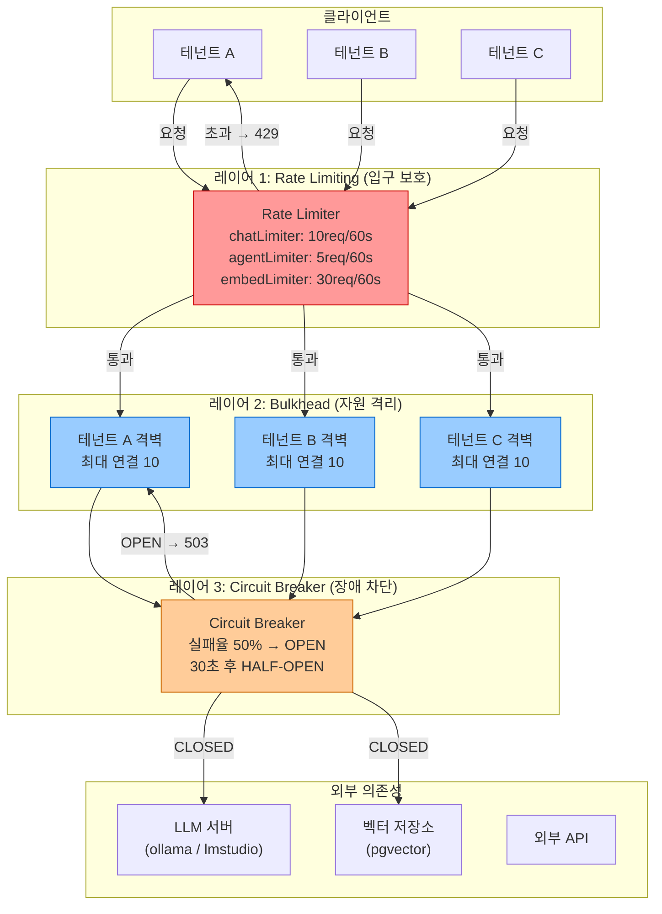
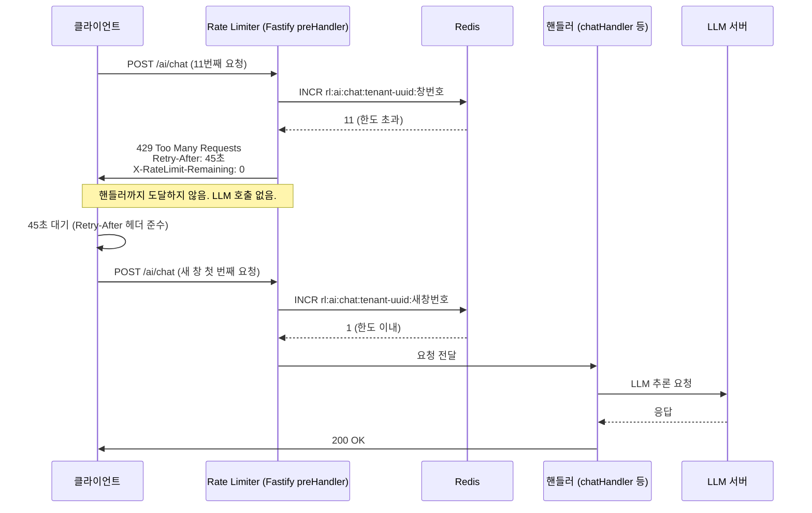
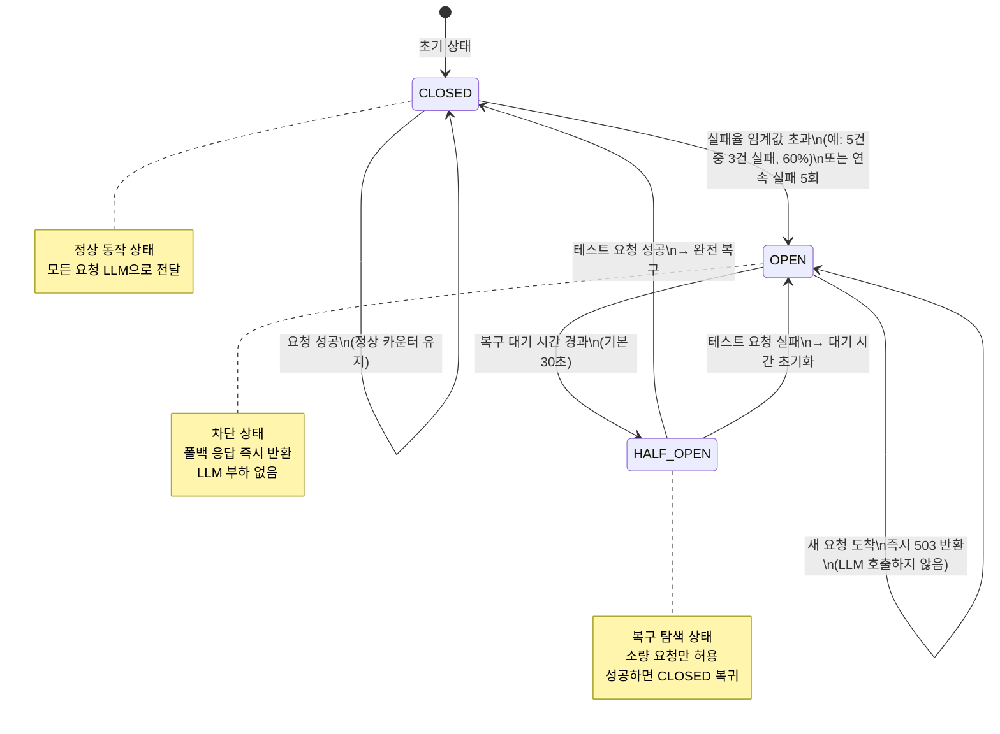

# Rate Limiting + Circuit Breaker — 서비스 보호와 안정성 패턴 완전 가이드

> **문서 ID**: ONBOARD-03-33
> **버전**: 1.0.0 | **작성일**: 2026-04-13 | **작성자**: Implementer (Sonnet)
> **목적**: Rate Limiting, Circuit Breaker, Bulkhead, Retry 패턴을 실제 코드 기반으로 완전히 이해하고 적용한다.
> **선행 학습**: `03-development/15-redis-patterns.md`, `03-development/20-error-handling.md`
> **소요 시간**: 약 6~8시간 (실습 포함)
> **CSAP**: D-08-06 (Rate Limiting), D-10 (네트워크 보안), D-12 (시스템 개발 보안)
> **N2SF**: N-03 (격리 영역), N-05 (외부 전송 통제)
> **관련 코드**: `platform/services/ai-service/src/routes.ts`, `platform/services/security-service/src/routes.ts`

---

## 목차

1. [서비스 보호 패턴 개요](#1-서비스-보호-패턴-개요)
2. [Rate Limiting 완전 분석](#2-rate-limiting-완전-분석)
3. [Circuit Breaker 패턴](#3-circuit-breaker-패턴)
4. [Bulkhead 패턴](#4-bulkhead-패턴)
5. [Retry 정책](#5-retry-정책)
6. [관측가능성 통합](#6-관측가능성-통합)
7. [실전 적용 가이드](#7-실전-적용-가이드)
8. [변경 이력](#8-변경-이력)

---

## 1. 서비스 보호 패턴 개요

### 1.1 왜 서비스 보호가 필요한가

공공기관 SaaS 플랫폼은 수십 개의 테넌트가 동시에 AI API, RAG 파이프라인, 에이전트 워크플로우를 호출합니다. 한 테넌트의 폭발적 트래픽이 다른 테넌트 서비스를 방해하거나, 외부 LLM API 장애가 전체 플랫폼을 마비시키는 사태를 방지하려면 다층 보호 패턴이 필요합니다.

핵심 위협 시나리오 세 가지를 먼저 이해합니다.

**시나리오 1 — 트래픽 폭발**: 어느 테넌트가 스크립트 오류로 초당 1,000건의 AI 채팅 요청을 보냅니다. Rate Limiting이 없으면 LLM 서버가 다운되고 전체 플랫폼이 영향을 받습니다.

**시나리오 2 — 외부 서비스 장애**: 외부 AI 모델 서버가 응답하지 않습니다. Circuit Breaker가 없으면 모든 요청이 30초씩 타임아웃을 기다려 스레드 풀이 고갈됩니다.

**시나리오 3 — 한 테넌트의 자원 독점**: 특정 테넌트가 장시간 에이전트 워크플로우를 실행하여 연결 풀을 모두 차지합니다. Bulkhead가 없으면 다른 테넌트는 응답을 받지 못합니다.

### 1.2 Rate Limiting vs Circuit Breaker vs Bulkhead 비교

| 관점 | Rate Limiting | Circuit Breaker | Bulkhead |
|------|---------------|-----------------|----------|
| **목적** | 요청 수 제한 | 장애 전파 차단 | 자원 격리 |
| **보호 방향** | 내 서비스를 클라이언트로부터 | 내 서비스를 의존 서비스로부터 | 한 파티션이 다른 파티션 침범 방지 |
| **상태** | 카운터 (시간 창) | CLOSED/OPEN/HALF-OPEN | 풀 크기 제한 |
| **응답** | 429 Too Many Requests | 503 Service Unavailable | 큐 대기 또는 즉시 거부 |
| **복구** | 시간 창 리셋 | Half-Open 자동 전환 | 자원 반환 시 즉시 |
| **CSAP 관련** | D-08-06 | D-10 | N-03 격리 영역 |

세 패턴은 상호 보완적입니다. 실제로는 동시에 모두 적용해야 완전한 보호가 됩니다.

### 1.3 3가지 패턴 레이어 아키텍처



이 다이어그램에서 트래픽은 항상 3개 레이어를 순서대로 통과합니다. Rate Limiter가 먼저 과도한 트래픽을 차단하고, Bulkhead가 테넌트별로 자원을 격리하며, Circuit Breaker가 외부 장애로부터 시스템을 보호합니다.

---

## 2. Rate Limiting 완전 분석

### 2.1 실제 코드 분석 — ai-service routes.ts

`platform/services/ai-service/src/routes.ts`에서 Rate Limiter를 어떻게 정의하고 사용하는지 전체 코드를 분석합니다.

```typescript
// Design Ref: DESIGN-MTU-P10 §3 — CSAP D-08-06 Rate Limiting
// Plan SC: FR-P10.1~FR-P10.6

import { createRateLimiter } from '@public-saas/rate-limit';

export async function registerRoutes(app: FastifyInstance): Promise<void> {
  // CSAP D-08-06: Rate Limiting — 엔드포인트 특성별 차등 제한
  const readLimiter    = createRateLimiter(100, 60, 'rl:ai:read');    // 읽기: 분당 100건
  const writeLimiter   = createRateLimiter(20,  60, 'rl:ai:write');   // 쓰기: 분당 20건
  const chatLimiter    = createRateLimiter(10,  60, 'rl:ai:chat');    // 채팅: 분당 10건
  const embedLimiter   = createRateLimiter(30,  60, 'rl:ai:embed');   // 임베딩: 분당 30건
  const ragLimiter     = createRateLimiter(20,  60, 'rl:ai:rag');     // RAG: 분당 20건
  const agentLimiter   = createRateLimiter(5,   60, 'rl:ai:agent');   // 에이전트: 분당 5건
  const workflowLimiter = createRateLimiter(10, 60, 'rl:ai:workflow'); // 워크플로우: 분당 10건
  // ...
}
```

`createRateLimiter(maxRequests, windowSeconds, redisKey)` 함수는 세 가지 매개변수를 받습니다.

- `maxRequests`: 시간 창 안에서 허용되는 최대 요청 수
- `windowSeconds`: 시간 창 길이 (초 단위). 현재 모두 60초(1분)
- `redisKey`: Redis에 카운터를 저장할 키 접두사. 테넌트 ID나 IP가 뒤에 붙어 격리됨

#### 2.1.1 각 Limiter의 설계 의도

**readLimiter (100req/분)**: 모델 목록 조회, 사용량 조회 등 가벼운 GET 요청에 적용됩니다. DB 읽기만 발생하며 LLM 호출이 없으므로 가장 관대한 제한값을 사용합니다.

**writeLimiter (20req/분)**: AI 모델 등록, IP 차단 등록 등 데이터 변경 작업에 적용됩니다. 읽기보다 5배 낮은 이유는 부작용(side effect)이 있는 작업이기 때문입니다.

**chatLimiter (10req/분)**: AI 채팅과 RAG 쿼리에 공통 적용됩니다. 각 요청이 LLM 서버에 수백 토큰 이상의 추론을 요구하므로 서버 과부하 방지를 위해 엄격하게 제한합니다. 10req/분은 초당 0.17건으로, LLM 평균 응답시간 3~10초를 고려한 값입니다.

**embedLimiter (30req/분)**: 텍스트 임베딩은 채팅보다 연산 비용이 낮고(단순 벡터 변환) 배치 처리가 가능합니다. 그러나 100개 텍스트를 한번에 처리할 수 있으므로 30req/분도 실제로는 최대 3,000개 텍스트/분 처리를 의미합니다.

**ragLimiter (20req/분)**: RAG 문서 수집(ingest)과 장문서 분석에 적용됩니다. 수집 작업은 청킹 + 임베딩 생성 + 벡터 저장 3단계가 연속으로 실행되어 채팅보다 더 오래 걸립니다.

**agentLimiter (5req/분)**: 가장 엄격한 제한입니다. 에이전트는 단일 요청에서 Thought-Action-Observation 루프를 최대 10회 반복하여 내부적으로 LLM 호출을 10번 발생시킵니다. 즉, 에이전트 1요청 = LLM 호출 최대 10건의 비용이 발생합니다.

**workflowLimiter (10req/분)**: 멀티스텝 워크플로우는 여러 에이전트 단계를 순차 실행합니다. 에이전트보다는 관대하지만 채팅보다는 엄격합니다.

#### 2.1.2 보안 서비스의 Rate Limiting

`platform/services/security-service/src/routes.ts`에서도 동일한 패턴을 사용하되, 보안 API 특성상 더 보수적입니다.

```typescript
// CSAP D-08-06: 보안 API는 더 엄격한 제한 적용
const readLimiter  = createRateLimiter(60, 60, 'rl:sec:read');   // 분당 60건
const writeLimiter = createRateLimiter(20, 60, 'rl:sec:write');  // 분당 20건
```

보안 API 읽기가 60req/분인 이유는 IP 차단 목록이나 보안 알림 같은 정보가 자동화 공격의 정찰(reconnaissance)에 사용될 수 있기 때문입니다.

### 2.2 Rate Limiting 알고리즘 비교

세 가지 주요 알고리즘을 이해하고 언제 어떤 것을 써야 하는지 알아봅니다.

#### 2.2.1 Fixed Window (고정 창)

```
시간축: 0s ────────────── 60s | 0s ────────────── 60s
요청:   ✓ ✓ ✓ ✓ ✓ ✓ ✓ ✓ ✓ ✓  (10개 통과)
                         창 리셋!
```

**동작**: 매 60초마다 카운터를 0으로 리셋합니다. 구현이 단순하고 Redis 연산이 최소화됩니다.

**문제점 — 경계 돌파 공격**: 59초에 10건, 61초에 10건을 보내면 2초 안에 20건이 통과됩니다. 창 경계에서 2배 돌파가 가능합니다.

```typescript
// Fixed Window 구현 예시
async function fixedWindowRateLimit(key: string, max: number, windowSec: number): Promise<boolean> {
  const windowKey = `${key}:${Math.floor(Date.now() / (windowSec * 1000))}`;
  const count = await redis.incr(windowKey);
  if (count === 1) {
    await redis.expire(windowKey, windowSec);
  }
  return count <= max;
}
```

#### 2.2.2 Sliding Window (슬라이딩 창)

```
현재 시각: t=75s
슬라이딩 창: [15s, 75s] (60초 이내)

타임스탬프 목록: [16, 23, 34, 51, 62, 70, 73, 74, 75]
           창 밖 ↗   창 안 요청 = 7건 → 허용(≤10)
```

**동작**: 현재 시각에서 window 크기만큼 과거를 바라봅니다. Redis Sorted Set에 타임스탬프를 저장하여 정확한 슬라이딩을 구현합니다.

**장점**: 경계 돌파 문제가 없습니다. Fixed Window보다 정확합니다.

**단점**: Redis Sorted Set 연산이 O(log N)으로 Fixed Window보다 비싸고, 저장 공간도 더 필요합니다.

```typescript
// Sliding Window 구현 예시 (Redis Sorted Set 활용)
async function slidingWindowRateLimit(key: string, max: number, windowSec: number): Promise<boolean> {
  const now = Date.now();
  const windowStart = now - windowSec * 1000;

  const pipeline = redis.pipeline();
  pipeline.zremrangebyscore(key, 0, windowStart);        // 창 밖 제거
  pipeline.zadd(key, now, `${now}-${Math.random()}`);    // 현재 요청 추가
  pipeline.zcard(key);                                   // 현재 창 내 요청 수
  pipeline.expire(key, windowSec);

  const results = await pipeline.exec();
  const count = results?.[2]?.[1] as number ?? 0;
  return count <= max;
}
```

#### 2.2.3 Token Bucket (토큰 버킷)

```
버킷 용량: 10토큰
충전 속도: 1토큰/6초 (= 10토큰/분)

시각  버킷상태    요청     결과
0s    ████████ 8토큰  →  1건 요청  →  7토큰 (통과)
10s   █████████ 9토큰 →  5건 요청  →  4토큰 (통과)
20s   █████ 5토큰    →  8건 요청  →  거부(초과 3건)
30s   ██████ 6토큰   →  2건 요청  →  4토큰 (통과)
```

**동작**: 버킷에 토큰이 일정 속도로 채워지고, 요청마다 토큰을 소비합니다. 버킷이 비면 거부합니다.

**장점**: 버스트 트래픽을 버킷 용량만큼 허용하면서도 평균 속도를 제한합니다. 실시간 서비스에 자연스러운 동작을 제공합니다.

**단점**: 현재 버킷 상태를 Redis에 원자적으로 읽고 쓰는 것이 복잡합니다.

```typescript
// Token Bucket 구현 예시 (Redis + Lua 스크립트로 원자성 보장)
const tokenBucketScript = `
  local key = KEYS[1]
  local capacity = tonumber(ARGV[1])
  local refillRate = tonumber(ARGV[2])  -- 초당 토큰 충전량
  local now = tonumber(ARGV[3])
  local requested = tonumber(ARGV[4])

  local bucket = redis.call('HMGET', key, 'tokens', 'lastRefill')
  local tokens = tonumber(bucket[1]) or capacity
  local lastRefill = tonumber(bucket[2]) or now

  -- 토큰 충전
  local elapsed = now - lastRefill
  tokens = math.min(capacity, tokens + elapsed * refillRate)

  if tokens >= requested then
    tokens = tokens - requested
    redis.call('HMSET', key, 'tokens', tokens, 'lastRefill', now)
    redis.call('EXPIRE', key, 120)
    return 1  -- 허용
  else
    return 0  -- 거부
  end
`;
```

**현재 프로젝트의 선택**: `createRateLimiter`는 Redis 기반 Fixed Window를 기본으로 사용합니다. 구현 단순성과 Redis 부하를 고려한 결정입니다. 멀티테넌트 환경에서 테넌트별로 수백 개의 Rate Limiter 인스턴스가 동시에 작동하므로 Redis 연산 효율이 중요합니다.

### 2.3 멀티테넌트 Rate Limiting — 플랜별 차등 제한

공공기관 SaaS에서는 테넌트마다 구독 플랜이 다르므로 Rate Limit 값도 달라야 합니다.

```typescript
// 플랜별 Rate Limit 설정 (Design Ref: §4.2 — 멀티테넌트 자원 격리)
const PLAN_RATE_LIMITS = {
  basic: {
    chat: { max: 5, window: 60 },    // 기본 플랜: 분당 5건
    agent: { max: 2, window: 60 },   // 분당 2건
    embed: { max: 15, window: 60 },  // 분당 15건
  },
  standard: {
    chat: { max: 10, window: 60 },   // 표준 플랜: 분당 10건
    agent: { max: 5, window: 60 },
    embed: { max: 30, window: 60 },
  },
  enterprise: {
    chat: { max: 50, window: 60 },   // 엔터프라이즈: 분당 50건
    agent: { max: 20, window: 60 },
    embed: { max: 200, window: 60 },
  },
} as const;

type Plan = keyof typeof PLAN_RATE_LIMITS;

// 테넌트별 플랜 조회 후 동적 Rate Limit 적용
async function tenantAwareRateLimit(
  request: FastifyRequest,
  endpoint: keyof typeof PLAN_RATE_LIMITS.basic,
): Promise<boolean> {
  const tenantId = request.headers['x-tenant-id'] as string;

  // 테넌트 플랜 조회 (캐시 우선, TTL 5분)
  const plan = await getTenantPlan(tenantId) as Plan;
  const limits = PLAN_RATE_LIMITS[plan][endpoint];

  // 테넌트별 분리된 Redis 키 사용
  const key = `rl:${endpoint}:tenant:${tenantId}`;
  return fixedWindowRateLimit(key, limits.max, limits.window);
}
```

이 방식은 한 테넌트의 Rate Limit 소진이 다른 테넌트에 영향을 주지 않습니다. `rl:chat:tenant:uuid-a`와 `rl:chat:tenant:uuid-b`는 독립된 Redis 키입니다.

### 2.4 분산 Rate Limiting — Redis 기반

단일 서버 Rate Limiting은 수평 확장(Horizontal Scaling) 환경에서 작동하지 않습니다. ai-service 파드가 3개 실행 중이면 각 파드가 독립적으로 카운터를 유지하여 실제로는 3배의 요청이 통과됩니다.

```
파드 1: 카운터 10/10 → 블록
파드 2: 카운터 10/10 → 블록
파드 3: 카운터 10/10 → 블록
총합: 30건 통과 (의도한 10건의 3배!)
```

Redis를 중앙 카운터 저장소로 사용하면 모든 파드가 동일한 카운터를 공유합니다.

```typescript
// 분산 Rate Limiting — 모든 파드가 공유하는 Redis 카운터
// packages/rate-limit 패키지 내부 동작 원리
import { Redis } from 'ioredis';

const redis = new Redis({
  host: process.env.REDIS_HOST ?? 'redis-master',
  port: 6379,
  enableReadyCheck: true,
  maxRetriesPerRequest: 3,
});

export function createRateLimiter(
  maxRequests: number,
  windowSeconds: number,
  keyPrefix: string,
): (request: FastifyRequest, reply: FastifyReply) => Promise<void> {
  return async (request, reply) => {
    // 클라이언트 식별: IP + 테넌트 ID 조합으로 격리
    const identifier = [
      request.headers['x-tenant-id'] ?? request.ip,
      request.headers['x-user-id'] ?? 'anon',
    ].join(':');

    const redisKey = `${keyPrefix}:${identifier}`;
    const windowKey = `${redisKey}:${Math.floor(Date.now() / (windowSeconds * 1000))}`;

    // 원자적 증가 (경쟁 조건 없음)
    const current = await redis.incr(windowKey);
    if (current === 1) {
      await redis.expire(windowKey, windowSeconds + 1);
    }

    if (current > maxRequests) {
      const retryAfter = windowSeconds - (Math.floor(Date.now() / 1000) % windowSeconds);
      reply.header('X-RateLimit-Limit', maxRequests);
      reply.header('X-RateLimit-Remaining', 0);
      reply.header('Retry-After', retryAfter);
      await reply.status(429).send({
        success: false,
        error: {
          code: 'RATE_LIMIT_EXCEEDED',
          message: `요청 한도를 초과하였습니다. ${retryAfter}초 후 다시 시도하세요.`,
          limit: maxRequests,
          window: `${windowSeconds}초`,
          retryAfter,
        },
      });
    } else {
      reply.header('X-RateLimit-Limit', maxRequests);
      reply.header('X-RateLimit-Remaining', maxRequests - current);
    }
  };
}
```

### 2.5 Rate Limit 초과 처리 흐름



클라이언트가 올바르게 구현되어야 하는 `Retry-After` 헤더 처리 코드는 다음과 같습니다.

```typescript
// 클라이언트 측 Rate Limit 처리 (재시도 로직 포함)
async function callAiChatWithRetry(
  payload: ChatPayload,
  maxRetries = 3,
): Promise<ChatResponse> {
  for (let attempt = 0; attempt <= maxRetries; attempt++) {
    try {
      const response = await fetch('/api/ai/chat', {
        method: 'POST',
        headers: { 'Content-Type': 'application/json' },
        body: JSON.stringify(payload),
      });

      if (response.status === 429) {
        const retryAfter = parseInt(response.headers.get('Retry-After') ?? '60');
        if (attempt < maxRetries) {
          console.warn(`Rate Limit 초과. ${retryAfter}초 후 재시도 (${attempt + 1}/${maxRetries})`);
          await new Promise(resolve => setTimeout(resolve, retryAfter * 1000));
          continue;
        }
        throw new Error('Rate Limit 초과. 나중에 다시 시도하세요.');
      }

      if (!response.ok) {
        throw new Error(`API 오류: ${response.status}`);
      }

      return response.json() as Promise<ChatResponse>;
    } catch (error) {
      if (attempt === maxRetries) throw error;
    }
  }
  throw new Error('최대 재시도 횟수 초과');
}
```

---

## 3. Circuit Breaker 패턴

### 3.1 Circuit Breaker란 무엇인가

전기 회로의 누전 차단기(Circuit Breaker)처럼, 외부 서비스가 장애 상태일 때 자동으로 연결을 차단하여 시스템을 보호합니다.

LLM 서버가 다운되었을 때 Circuit Breaker가 없는 경우 어떤 일이 발생하는지 봅니다.

```
요청 1: LLM 호출 → 30초 타임아웃 → 실패
요청 2: LLM 호출 → 30초 타임아웃 → 실패
요청 3: LLM 호출 → 30초 타임아웃 → 실패
...
요청 N: 스레드 풀 고갈 → 서비스 전체 다운
```

Circuit Breaker가 있는 경우는 다릅니다.

```
요청 1~5: LLM 호출 실패 → 실패율 100% → OPEN 상태 전환
요청 6: Circuit OPEN → 즉시 503 반환 (0ms, 타임아웃 없음)
요청 7~N: 모두 즉시 503 반환 → 스레드 풀 보호
30초 후: HALF-OPEN → 탐색 요청 1건 전송 → 성공 → CLOSED 복귀
```

### 3.2 상태 전이 다이어그램



### 3.3 ai-service Circuit Breaker 구현

실제 프로젝트에서 LLM 외부 API 호출을 Circuit Breaker로 보호하는 패턴입니다.

```typescript
// Design Ref: SVC-AI-2026 DESIGN §5 — 외부 LLM 서비스 안정성
// Plan SC: FR-AI26.2 — 에이전트 장애 허용 설계

// Circuit Breaker 상태 타입
type CircuitState = 'CLOSED' | 'OPEN' | 'HALF_OPEN';

interface CircuitBreakerConfig {
  /** 실패율 임계값 (0.0 ~ 1.0). 이를 초과하면 OPEN 전환 */
  failureThreshold: number;
  /** 성공율 임계값. HALF_OPEN에서 이를 달성하면 CLOSED 복귀 */
  successThreshold: number;
  /** OPEN 상태 유지 시간 (ms) */
  timeout: number;
  /** 통계 창 내 최소 요청 수 (샘플이 적으면 OPEN 전환 않음) */
  minimumRequests: number;
  /** 통계 창 크기 (ms) */
  statisticsWindow: number;
}

class LlmCircuitBreaker {
  private state: CircuitState = 'CLOSED';
  private failures = 0;
  private successes = 0;
  private totalRequests = 0;
  private lastStateChange = Date.now();
  private halfOpenRequests = 0;

  constructor(
    private readonly name: string,
    private readonly config: CircuitBreakerConfig,
  ) {}

  async execute<T>(fn: () => Promise<T>, fallback?: () => T): Promise<T> {
    if (this.state === 'OPEN') {
      if (Date.now() - this.lastStateChange >= this.config.timeout) {
        // 복구 대기 시간 경과 → HALF_OPEN 전환
        this.transitionTo('HALF_OPEN');
      } else {
        // 아직 OPEN 상태 → 즉시 폴백 반환
        if (fallback) return fallback();
        throw new CircuitOpenError(this.name, this.config.timeout);
      }
    }

    if (this.state === 'HALF_OPEN' && this.halfOpenRequests > 0) {
      // HALF_OPEN에서는 탐색 요청 1건만 허용
      if (fallback) return fallback();
      throw new CircuitOpenError(this.name, 0);
    }

    if (this.state === 'HALF_OPEN') {
      this.halfOpenRequests++;
    }

    try {
      const result = await fn();
      this.recordSuccess();
      return result;
    } catch (error) {
      this.recordFailure();
      throw error;
    }
  }

  private recordSuccess(): void {
    this.successes++;
    this.totalRequests++;

    if (this.state === 'HALF_OPEN') {
      this.halfOpenRequests = 0;
      this.transitionTo('CLOSED');
    }
  }

  private recordFailure(): void {
    this.failures++;
    this.totalRequests++;

    if (this.state === 'HALF_OPEN') {
      this.halfOpenRequests = 0;
      this.transitionTo('OPEN');
      return;
    }

    if (
      this.state === 'CLOSED' &&
      this.totalRequests >= this.config.minimumRequests
    ) {
      const failureRate = this.failures / this.totalRequests;
      if (failureRate >= this.config.failureThreshold) {
        this.transitionTo('OPEN');
      }
    }
  }

  private transitionTo(newState: CircuitState): void {
    const previous = this.state;
    this.state = newState;
    this.lastStateChange = Date.now();

    if (newState === 'CLOSED') {
      this.failures = 0;
      this.successes = 0;
      this.totalRequests = 0;
    }

    // 상태 전이 감사 로그 (CSAP D-06)
    process.stdout.write(JSON.stringify({
      level: 'warn',
      component: 'circuit-breaker',
      name: this.name,
      from: previous,
      to: newState,
      failureRate: this.totalRequests > 0
        ? (this.failures / this.totalRequests).toFixed(2)
        : '0.00',
      ts: new Date().toISOString(),
    }) + '\n');
  }

  getState(): CircuitState { return this.state; }
  getStats() {
    return {
      state: this.state,
      failures: this.failures,
      successes: this.successes,
      totalRequests: this.totalRequests,
      failureRate: this.totalRequests > 0 ? this.failures / this.totalRequests : 0,
    };
  }
}

class CircuitOpenError extends Error {
  constructor(name: string, retryAfterMs: number) {
    super(`Circuit breaker '${name}'이 OPEN 상태입니다. ${Math.ceil(retryAfterMs / 1000)}초 후 재시도하세요.`);
    this.name = 'CircuitOpenError';
  }
}
```

### 3.4 LLM 호출에 Circuit Breaker 적용

```typescript
// 실제 LLM 서비스 호출에 Circuit Breaker 적용
// Design Ref: SVC-AI-2026 DESIGN §5.3

const llmCircuitBreaker = new LlmCircuitBreaker('llm-primary', {
  failureThreshold: 0.5,   // 50% 실패율에서 OPEN
  successThreshold: 0.7,   // 70% 성공율로 CLOSED 복귀
  timeout: 30_000,         // 30초 OPEN 유지
  minimumRequests: 10,     // 10건 이상 요청 후 통계 적용
  statisticsWindow: 60_000, // 1분 창
});

export async function callLlmWithCircuitBreaker(
  prompt: string,
  modelConfig: ModelConfig,
): Promise<LlmResponse> {
  return llmCircuitBreaker.execute(
    // 실제 LLM 호출
    async () => {
      const response = await fetch(`${modelConfig.endpoint}/v1/chat/completions`, {
        method: 'POST',
        headers: { 'Content-Type': 'application/json' },
        body: JSON.stringify({
          model: modelConfig.name,
          messages: [{ role: 'user', content: prompt }],
        }),
        signal: AbortSignal.timeout(15_000), // 15초 타임아웃
      });

      if (!response.ok) {
        throw new Error(`LLM 서버 오류: ${response.status} ${response.statusText}`);
      }

      return response.json() as Promise<LlmResponse>;
    },
    // 폴백: Circuit OPEN 시 캐시된 응답 또는 오류 반환
    () => ({
      id: 'fallback',
      choices: [{
        message: {
          role: 'assistant',
          content: 'AI 서비스가 일시적으로 사용 불가합니다. 잠시 후 다시 시도해주세요.',
        },
        finishReason: 'circuit_open',
      }],
      usage: { promptTokens: 0, completionTokens: 0 },
      fromFallback: true,
    }),
  );
}
```

### 3.5 폴백 전략 분류

Circuit Breaker가 OPEN될 때 어떤 폴백을 사용할지는 엔드포인트 특성에 따라 다릅니다.

| 엔드포인트 | 폴백 전략 | 이유 |
|-----------|----------|------|
| `/ai/chat` | 안내 메시지 반환 | 사용자 경험 유지 |
| `/ai/embed` | 빈 벡터 배열 | 수집 파이프라인 계속 |
| `/ai/rag/ingest` | 큐에 적재 후 재시도 | 데이터 손실 방지 |
| `/ai/agent` | 즉시 503 + 재시도 안내 | 부분 실행 위험 |
| `/ai/workflow` | 체크포인트 저장 후 중지 | 멱등성 보장 |

---

## 4. Bulkhead 패턴

### 4.1 Bulkhead란 무엇인가

선박의 격벽(bulkhead)에서 이름을 딴 패턴입니다. 선박 내부를 여러 구획으로 나누어 한 구획에 침수가 발생해도 전체가 침몰하지 않도록 합니다. 마찬가지로, 소프트웨어에서는 자원(스레드, 연결 풀, 메모리)을 논리적 단위로 격리하여 한 단위의 문제가 전체에 전파되지 않도록 합니다.

### 4.2 연결 풀 분리 기반 Bulkhead

```typescript
// 테넌트별 연결 풀 격리 (Bulkhead 패턴)
// Design Ref: §6.2 — N2SF N-03 격리 영역

interface TenantConnectionPool {
  maxConnections: number;
  activeConnections: number;
  queuedRequests: number;
}

class TenantBulkhead {
  private pools: Map<string, TenantConnectionPool> = new Map();

  constructor(private readonly maxConnectionsPerTenant: number) {}

  async execute<T>(tenantId: string, fn: () => Promise<T>): Promise<T> {
    const pool = this.getOrCreatePool(tenantId);

    if (pool.activeConnections >= this.maxConnectionsPerTenant) {
      // 연결 포화 → 즉시 거부 (Fail Fast)
      throw new BulkheadFullError(tenantId, this.maxConnectionsPerTenant);
    }

    pool.activeConnections++;
    try {
      return await fn();
    } finally {
      pool.activeConnections--;
    }
  }

  private getOrCreatePool(tenantId: string): TenantConnectionPool {
    if (!this.pools.has(tenantId)) {
      this.pools.set(tenantId, {
        maxConnections: this.maxConnectionsPerTenant,
        activeConnections: 0,
        queuedRequests: 0,
      });
    }
    return this.pools.get(tenantId)!;
  }
}

// 에이전트 Bulkhead: 테넌트당 최대 3개 동시 에이전트
const agentBulkhead = new TenantBulkhead(3);

export async function agentHandlerWithBulkhead(
  request: FastifyRequest<{ Body: AgentBody }>,
  reply: FastifyReply,
): Promise<void> {
  try {
    const result = await agentBulkhead.execute(
      request.body.tenantId,
      () => runAgent(request.body),
    );
    await reply.send({ success: true, data: result });
  } catch (error) {
    if (error instanceof BulkheadFullError) {
      await reply.status(503).send({
        success: false,
        error: {
          code: 'BULKHEAD_FULL',
          message: '현재 처리 가능한 동시 요청 수를 초과했습니다. 잠시 후 다시 시도해주세요.',
        },
      });
    } else {
      throw error;
    }
  }
}
```

### 4.3 Kubernetes ResourceQuota 기반 Bulkhead

Bulkhead는 애플리케이션 레벨뿐 아니라 인프라 레벨에서도 적용됩니다. Kubernetes에서는 `ResourceQuota`와 `LimitRange`로 네임스페이스별 자원을 격리합니다.

```yaml
# 테넌트 네임스페이스별 ResourceQuota (N2SF N-03: 격리 영역)
apiVersion: v1
kind: ResourceQuota
metadata:
  name: tenant-quota
  namespace: tenant-abc123
spec:
  hard:
    # CPU 제한
    requests.cpu: "2"        # 최소 보장 2코어
    limits.cpu: "4"          # 최대 4코어 (Bulkhead)
    # 메모리 제한
    requests.memory: 4Gi
    limits.memory: 8Gi       # 최대 8GB (Bulkhead)
    # 파드 수 제한
    pods: "20"               # 최대 20개 파드
    # 서비스 계정
    services: "10"
    # 영구 볼륨
    persistentvolumeclaims: "5"
    requests.storage: 50Gi
---
# LimitRange: 파드 기본 제한 (지정 안 하면 자동 적용)
apiVersion: v1
kind: LimitRange
metadata:
  name: tenant-limit-range
  namespace: tenant-abc123
spec:
  limits:
    - type: Container
      default:
        cpu: "500m"
        memory: 512Mi
      defaultRequest:
        cpu: "100m"
        memory: 128Mi
      max:
        cpu: "2"
        memory: 2Gi
```

엔터프라이즈 테넌트는 더 많은 할당량을, 기본 테넌트는 적은 할당량을 받습니다. 이를 통해 한 테넌트의 자원 폭발이 다른 테넌트에 전혀 영향을 주지 않습니다.

### 4.4 세마포어 기반 동시성 제한

애플리케이션 내부에서 특정 작업의 동시 실행 수를 제한하는 간단한 방법입니다.

```typescript
// Semaphore: 동시 실행 수 제한
class Semaphore {
  private count: number;
  private waiters: Array<() => void> = [];

  constructor(private readonly maxConcurrency: number) {
    this.count = maxConcurrency;
  }

  async acquire(): Promise<void> {
    if (this.count > 0) {
      this.count--;
      return;
    }
    return new Promise<void>(resolve => {
      this.waiters.push(resolve);
    });
  }

  release(): void {
    if (this.waiters.length > 0) {
      const next = this.waiters.shift()!;
      next();
    } else {
      this.count++;
    }
  }

  async withLock<T>(fn: () => Promise<T>): Promise<T> {
    await this.acquire();
    try {
      return await fn();
    } finally {
      this.release();
    }
  }
}

// 임베딩 생성: 동시 LLM 호출 최대 10개 (임베딩 서버 부하 제한)
const embeddingSemaphore = new Semaphore(10);

async function generateEmbeddingWithBulkhead(text: string): Promise<number[]> {
  return embeddingSemaphore.withLock(() => callEmbeddingModel(text));
}
```

---

## 5. Retry 정책

### 5.1 왜 무조건 재시도하면 안 되는가

잘못된 재시도 정책은 오히려 시스템을 망가뜨립니다. 서버가 과부하 상태일 때 모든 클라이언트가 동시에 재시도하면 "재시도 폭풍(Retry Storm)"이 발생하여 서버가 완전히 다운됩니다.

```
서버 70% 부하 → 일부 요청 실패
→ 모든 클라이언트 즉시 재시도
→ 서버 140% 부하 → 더 많은 실패
→ 더 많은 재시도
→ 서버 200% 부하 → 완전 다운
```

이 문제를 해결하려면 지수 백오프 + 지터(Jitter)를 함께 사용해야 합니다.

### 5.2 지수 백오프 + Jitter 구현

```typescript
// 지수 백오프 + Full Jitter 재시도 정책
// Design Ref: §7.1 — 외부 API 재시도 표준

interface RetryConfig {
  /** 최대 재시도 횟수 */
  maxRetries: number;
  /** 초기 대기 시간 (ms) */
  baseDelayMs: number;
  /** 최대 대기 시간 (ms) */
  maxDelayMs: number;
  /** 재시도 가능한 HTTP 상태 코드 */
  retryableStatusCodes: number[];
}

const DEFAULT_RETRY_CONFIG: RetryConfig = {
  maxRetries: 3,
  baseDelayMs: 1_000,
  maxDelayMs: 30_000,
  retryableStatusCodes: [429, 502, 503, 504],
};

async function withRetry<T>(
  fn: () => Promise<T>,
  config: RetryConfig = DEFAULT_RETRY_CONFIG,
): Promise<T> {
  let lastError: Error | undefined;

  for (let attempt = 0; attempt <= config.maxRetries; attempt++) {
    try {
      return await fn();
    } catch (error) {
      lastError = error as Error;

      // 재시도 불가 오류는 즉시 던짐
      if (!isRetryableError(error, config.retryableStatusCodes)) {
        throw error;
      }

      // 마지막 시도면 오류 던짐
      if (attempt === config.maxRetries) {
        break;
      }

      // 지수 백오프: 2^attempt * baseDelay
      const exponentialDelay = config.baseDelayMs * Math.pow(2, attempt);
      // Full Jitter: 0 ~ exponentialDelay 사이 랜덤값
      // 여러 클라이언트가 동시에 재시도할 때 분산시킴
      const jitter = Math.random() * exponentialDelay;
      const delay = Math.min(jitter, config.maxDelayMs);

      console.warn(`재시도 ${attempt + 1}/${config.maxRetries}, ${Math.round(delay)}ms 대기`, {
        error: lastError.message,
      });

      await new Promise(resolve => setTimeout(resolve, delay));
    }
  }

  throw new Error(`${config.maxRetries}회 재시도 후 실패: ${lastError?.message}`);
}

function isRetryableError(error: unknown, retryableStatusCodes: number[]): boolean {
  if (error instanceof Response) {
    return retryableStatusCodes.includes(error.status);
  }

  if (error instanceof Error) {
    // 네트워크 오류 (연결 끊김, DNS 실패 등)
    const networkErrorMessages = ['ECONNRESET', 'ECONNREFUSED', 'ENOTFOUND', 'ETIMEDOUT'];
    return networkErrorMessages.some(msg => error.message.includes(msg));
  }

  return false;
}
```

### 5.3 재시도 가능/불가 오류 분류

모든 오류를 재시도해서는 안 됩니다. 클라이언트 오류(4xx)는 재시도해도 동일한 결과가 나옵니다.

```typescript
// 재시도 정책 매트릭스
const RETRY_POLICY = {
  // 재시도 필수 — 일시적 오류
  retryable: {
    429: '속도 제한 초과 — Retry-After 헤더 준수',
    502: '게이트웨이 오류 — 백엔드 일시 불가',
    503: '서비스 불가 — 과부하 또는 점검',
    504: '게이트웨이 타임아웃 — 백엔드 응답 지연',
    ECONNRESET: '연결 초기화 — 네트워크 불안정',
    ETIMEDOUT: '연결 타임아웃 — 일시적 지연',
  },

  // 재시도 금지 — 결정적 오류
  nonRetryable: {
    400: '잘못된 요청 — 요청 본문 수정 필요',
    401: '인증 실패 — 토큰 갱신 필요',
    403: '권한 없음 — 재시도해도 동일 결과',
    404: '리소스 없음 — 존재하지 않는 리소스',
    422: '검증 실패 — 입력값 수정 필요',
    DataGradeViolation: 'N2SF 등급 위반 — 재시도 불가',
    CircuitOpenError: 'Circuit OPEN — Circuit이 닫힐 때까지 대기',
  },
};
```

### 5.4 Rate Limit 429 응답에 대한 특수 처리

429 응답은 `Retry-After` 헤더에 정확한 대기 시간이 명시됩니다. 이 경우 지수 백오프 대신 헤더 값을 우선합니다.

```typescript
async function handleRateLimitRetry<T>(
  fn: () => Promise<Response>,
  maxRetries = 3,
): Promise<T> {
  for (let attempt = 0; attempt <= maxRetries; attempt++) {
    const response = await fn();

    if (response.status === 429) {
      const retryAfterHeader = response.headers.get('Retry-After');
      const retryAfterSec = retryAfterHeader ? parseInt(retryAfterHeader) : 60;

      if (attempt < maxRetries) {
        // Retry-After 헤더를 정확히 준수 (지수 백오프 무시)
        await new Promise(resolve => setTimeout(resolve, retryAfterSec * 1000));
        continue;
      }
    }

    if (!response.ok) {
      throw new Error(`API 오류: ${response.status}`);
    }

    return response.json() as Promise<T>;
  }

  throw new Error('Rate Limit 재시도 한도 초과');
}
```

---

## 6. 관측가능성 통합

### 6.1 Rate Limit 관련 메트릭

Prometheus 메트릭으로 Rate Limit 상황을 실시간으로 추적합니다.

```typescript
// Rate Limit 메트릭 정의 (Prometheus)
import { Counter, Histogram, Gauge } from 'prom-client';

// 총 Rate Limit 차단 횟수 (endpoint, tenant_plan별)
const rateLimitHitsTotal = new Counter({
  name: 'rate_limit_hits_total',
  help: 'Rate Limit으로 차단된 총 요청 수',
  labelNames: ['endpoint', 'tenant_plan', 'limiter_type'],
});

// 현재 Rate Limit 사용률 (0.0 ~ 1.0)
const rateLimitUtilization = new Gauge({
  name: 'rate_limit_utilization',
  help: '현재 Rate Limit 사용률 (current/max)',
  labelNames: ['endpoint', 'tenant_id'],
});

// Rate Limit 대기 시간 분포
const rateLimitWaitDuration = new Histogram({
  name: 'rate_limit_wait_duration_seconds',
  help: 'Rate Limit으로 인한 클라이언트 대기 시간',
  buckets: [1, 5, 10, 30, 60, 120],
  labelNames: ['endpoint'],
});

// Circuit Breaker 상태 (0=CLOSED, 1=HALF_OPEN, 2=OPEN)
const circuitBreakerState = new Gauge({
  name: 'circuit_breaker_state',
  help: 'Circuit Breaker 현재 상태 (0=CLOSED, 1=HALF_OPEN, 2=OPEN)',
  labelNames: ['service', 'endpoint'],
});

// Circuit Breaker 상태 전이 횟수
const circuitBreakerTransitions = new Counter({
  name: 'circuit_breaker_transitions_total',
  help: 'Circuit Breaker 상태 전이 횟수',
  labelNames: ['service', 'from_state', 'to_state'],
});
```

### 6.2 Grafana 대시보드 구성

Grafana에서 Rate Limiting + Circuit Breaker 상황을 모니터링하는 주요 패널을 구성합니다.

**패널 1 — Rate Limit 차단율 추이 (시계열)**

```promql
# 분당 Rate Limit 차단 요청 수 (엔드포인트별)
sum by (endpoint) (
  rate(rate_limit_hits_total[5m])
) * 60
```

**패널 2 — Circuit Breaker 상태 현황 (Stat)**

```promql
# 현재 Circuit Breaker 상태 (서비스별)
circuit_breaker_state{service=~"llm.*"}
```

**패널 3 — Rate Limit 사용률 Heatmap (테넌트별)**

```promql
# 테넌트별 Rate Limit 사용률 (%)
rate_limit_utilization * 100
```

**패널 4 — 재시도 성공률**

```promql
# 재시도 성공률 (재시도 시도 대비 성공)
sum(rate(retry_success_total[5m])) /
sum(rate(retry_attempts_total[5m])) * 100
```

### 6.3 알림 설정

Rate Limit 급증과 Circuit Breaker OPEN 상태를 즉시 감지하는 알림 규칙입니다.

```yaml
# Alertmanager 규칙 (docs/guides/monitoring/ 참조)
groups:
  - name: rate-limiting-alerts
    rules:
      # Rate Limit 차단율 급증: 5분간 분당 100건 초과
      - alert: HighRateLimitHitRate
        expr: sum(rate(rate_limit_hits_total[5m])) * 60 > 100
        for: 5m
        labels:
          severity: warning
          csap: D-08-06
        annotations:
          summary: "Rate Limit 차단 급증"
          description: "분당 {{ $value | humanize }}건이 Rate Limit으로 차단되고 있습니다."
          runbook: "docs/guides/onboarding/03-development/33-rate-limiting-circuit-breaker.md"

      # Circuit Breaker OPEN 상태 지속
      - alert: CircuitBreakerOpen
        expr: circuit_breaker_state == 2
        for: 1m
        labels:
          severity: critical
          csap: D-10
        annotations:
          summary: "Circuit Breaker OPEN 상태"
          description: "{{ $labels.service }} 서비스의 Circuit Breaker가 OPEN 상태입니다."

      # LLM 서비스 에러율 임계값 초과
      - alert: LlmHighErrorRate
        expr: |
          sum(rate(http_requests_total{endpoint=~"/ai/.*",status_code=~"5.."}[5m]))
          /
          sum(rate(http_requests_total{endpoint=~"/ai/.*"}[5m])) > 0.1
        for: 3m
        labels:
          severity: critical
        annotations:
          summary: "AI 서비스 에러율 10% 초과"
          description: "에러율: {{ $value | humanizePercentage }}"
```

---

## 7. 실전 적용 가이드

### 7.1 새 서비스에 Rate Limiting 추가하는 단계별 가이드

새로운 Fastify 서비스를 만들 때 Rate Limiting을 추가하는 전체 과정을 단계별로 안내합니다.

**1단계: 의존성 확인**

```bash
# packages/rate-limit 패키지가 이미 워크스페이스에 있습니다
# package.json에 의존성 추가
pnpm add @public-saas/rate-limit --filter ./platform/services/my-new-service
```

**2단계: Rate Limiter 인스턴스 생성**

```typescript
// my-service/src/routes.ts
import { createRateLimiter } from '@public-saas/rate-limit';

export async function registerRoutes(app: FastifyInstance): Promise<void> {
  // 서비스 특성에 맞게 제한값 결정 (7.2절 참조)
  const readLimiter  = createRateLimiter(60,  60, 'rl:my-service:read');
  const writeLimiter = createRateLimiter(20,  60, 'rl:my-service:write');

  // 각 라우트에 적용
  app.get('/my-resource', { preHandler: readLimiter }, myHandler);
  app.post('/my-resource', { preHandler: writeLimiter }, createHandler);
}
```

**3단계: 내부 서비스 인증 추가 (CSAP D-08 필수)**

```typescript
// C-03 패턴 (ai-service, security-service 동일 패턴)
const internalKey = process.env['INTERNAL_SERVICE_KEY'];
if (!internalKey && process.env['NODE_ENV'] === 'production') {
  throw new Error('[SECURITY] INTERNAL_SERVICE_KEY 환경변수가 설정되지 않았습니다.');
}
if (internalKey) {
  app.addHook('onRequest', async (request, reply) => {
    if (request.url === '/health' || request.url === '/ready') return;
    const provided = request.headers['x-internal-service-key'];
    if (provided !== internalKey) {
      await reply.status(401).send({
        success: false,
        error: { code: 'UNAUTHORIZED', message: '내부 서비스 인증 실패' },
      });
    }
  });
}
```

**4단계: 환경 변수 설정**

```bash
# .env.example (시크릿 값은 절대 커밋 금지 - CSAP D-09)
INTERNAL_SERVICE_KEY=  # Vault에서 주입
REDIS_HOST=redis-master
REDIS_PORT=6379
NODE_ENV=production
```

**5단계: 테스트 작성**

```typescript
// my-service/src/__tests__/rate-limit.test.ts
describe('Rate Limiting', () => {
  it('분당 60건 이하는 통과해야 한다', async () => {
    const requests = Array.from({ length: 60 }, () =>
      app.inject({ method: 'GET', url: '/my-resource' })
    );
    const responses = await Promise.all(requests);
    const successCount = responses.filter(r => r.statusCode === 200).length;
    expect(successCount).toBe(60);
  });

  it('61번째 요청은 429를 반환해야 한다', async () => {
    // 60건 먼저 소진
    for (let i = 0; i < 60; i++) {
      await app.inject({ method: 'GET', url: '/my-resource' });
    }
    // 61번째 요청
    const response = await app.inject({ method: 'GET', url: '/my-resource' });
    expect(response.statusCode).toBe(429);
    expect(JSON.parse(response.body).error.code).toBe('RATE_LIMIT_EXCEEDED');
  });
});
```

### 7.2 적절한 Rate Limit 값 결정 방법

Rate Limit 값을 어떻게 결정해야 하는지 구체적인 방법을 안내합니다.

**방법 1: 부하 테스트 기반**

```bash
# k6를 사용한 부하 테스트 (최대 처리량 측정)
cat > load-test.js << 'EOF'
import http from 'k6/http';
import { check } from 'k6';

export const options = {
  stages: [
    { duration: '30s', target: 10 },   // 워밍업
    { duration: '1m',  target: 50 },   // 부하 증가
    { duration: '30s', target: 100 },  // 최대 부하
    { duration: '30s', target: 0 },    // 냉각
  ],
};

export default function () {
  const response = http.post('/ai/chat', JSON.stringify({
    modelId: 'qwen3-8b',
    tenantId: 'test-tenant-uuid',
    message: '테스트 메시지',
    grade: 'O',
  }), { headers: { 'Content-Type': 'application/json' } });

  check(response, {
    '성공 응답': r => r.status === 200,
    '응답 시간 3초 이내': r => r.timings.duration < 3000,
  });
}
EOF

k6 run load-test.js
```

테스트 결과에서 서버가 안정적으로 처리 가능한 최대 RPS를 확인하고, 안전 마진 20~30%를 적용하여 Rate Limit 값을 설정합니다.

예: 서버 최대 처리량 15 RPS → Rate Limit 10-12 RPS (33% 여유)

**방법 2: 코스트 기반 계산**

```
ai-service agentLimiter = 5req/분 설계 근거:

에이전트 1요청 비용:
  - LLM 호출: 최대 10회
  - 평균 입력 토큰: 1,000 tokens × 10 = 10,000 tokens
  - 평균 출력 토큰: 500 tokens × 10 = 5,000 tokens
  - 평균 응답 시간: 5초 × 10 회 = 50초

ollama 서버 용량:
  - 동시 처리: 2요청 (8GB VRAM 기준)
  - 테넌트 수: 10개

10개 테넌트 × 5req/분 = 50 에이전트/분
= 초당 0.83 에이전트
× 50초(처리시간) = 동시 42개 에이전트 처리 필요
→ LLM 서버 용량(2 동시) 초과! → Rate Limit 조정 필요

실제 설정: 5req/분 (싱글 테넌트 기준)
+ Bulkhead 동시 제한: 테넌트당 1~2개
+ LLM 서버 큐: 최대 10개 대기
```

**방법 3: 사용 패턴 분석**

운영 중인 서비스라면 실제 사용 패턴을 분석합니다.

```promql
# 테넌트별 최대 분당 요청 수 (90th percentile)
histogram_quantile(0.90,
  sum by (tenant_id, le) (
    rate(http_requests_total{endpoint="/ai/chat"}[1h])
  )
) * 60
```

P90값의 2~3배를 Rate Limit으로 설정하면 정상 사용자는 거의 차단되지 않으면서 비정상 트래픽을 방어할 수 있습니다.

### 7.3 CSAP D-08 관련 Rate Limiting 요건

CSAP 중/상 등급 인증을 위해 Rate Limiting이 충족해야 하는 요건입니다.

| 항목 | 요건 | 구현 방법 |
|------|------|----------|
| D-08-06 | 서비스 거부 공격 방지를 위한 요청 수 제한 | `createRateLimiter` 적용 |
| D-08-06 | Rate Limit 초과 시 적절한 오류 메시지 | 429 + `error.code: RATE_LIMIT_EXCEEDED` |
| D-08-06 | Rate Limit 로그 기록 | Prometheus 메트릭 + 감사 로그 |
| D-08-02 | 세션당 동시 요청 제한 | Bulkhead 패턴 |
| D-10-03 | 비정상 트래픽 탐지 및 차단 | Circuit Breaker + IP 차단 |

감리 증거로 제출할 Rate Limiting 설정 스크린샷과 로그를 Grafana에서 추출하는 방법입니다.

```bash
# Grafana API로 Rate Limit 메트릭 추출 (감리 증거용)
curl -u admin:${GRAFANA_PASS} \
  "http://grafana:3000/api/datasources/proxy/1/api/v1/query" \
  --data-urlencode "query=sum(rate(rate_limit_hits_total[24h]))" \
  --data-urlencode "time=$(date +%s)" \
  | jq '.data.result'

# 출력 결과를 CSAP 증거 파일로 저장
# docs/csap-evidence/D-08-06-rate-limit-log-$(date +%Y%m%d).json
```

---

## 8. 변경 이력

| 버전 | 일자 | 내용 | 작성자 |
|------|------|------|--------|
| 1.0.0 | 2026-04-13 | 최초 작성 — Rate Limiting, Circuit Breaker, Bulkhead, Retry 패턴 완전 가이드 | Implementer (Sonnet) |
