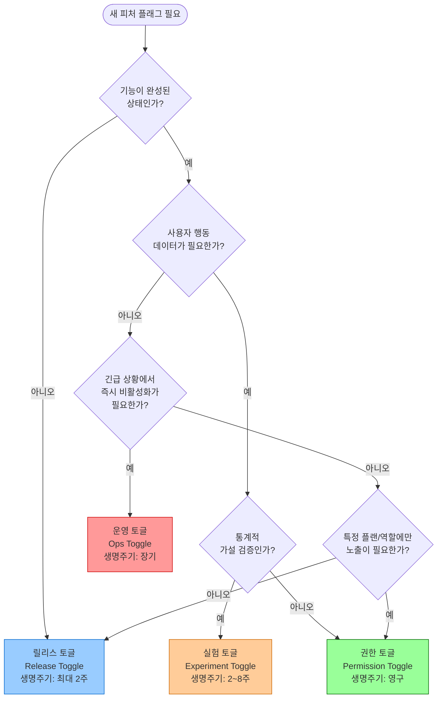
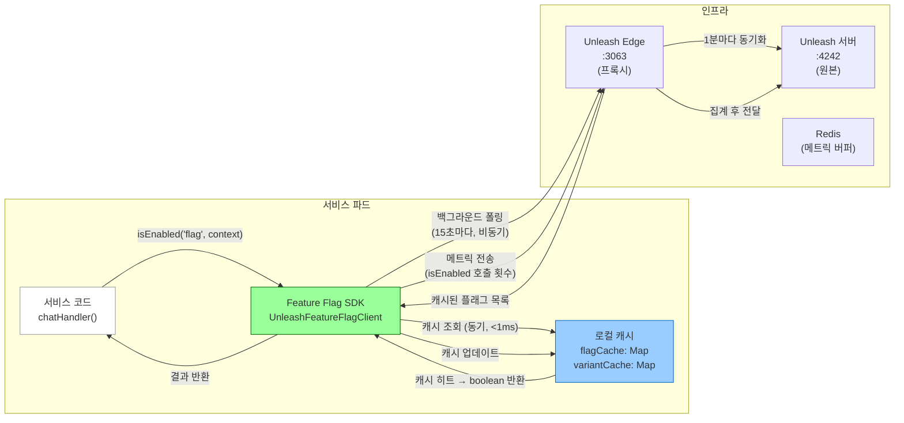

# Feature Flag 심화 운영 — 피처 플래그 라이프사이클과 실험 설계

> **문서 ID**: ONBOARD-03-34
> **버전**: 1.0.0 | **작성일**: 2026-04-13 | **작성자**: Implementer (Sonnet)
> **목적**: Feature Flag SDK의 내부 동작을 완전히 이해하고, 점진적 롤아웃 · A/B 테스트 · 기술 부채 관리를 실전에 적용한다.
> **선행 학습**: `03-development/09-feature-flags.md` (기초), `03-development/03-testing-guide.md`
> **소요 시간**: 약 5~7시간 (실습 포함)
> **CSAP**: D-08 (접근 통제), D-06 (침해사고 관리 — 감사 로그)
> **N2SF**: N-05 (외부 전송 통제 — AI 기능 플래그 등급 관리)
> **관련 코드**: `packages/feature-flag-sdk/src/index.ts`

---

## 목차

1. [Feature Flag 전략 분류](#1-feature-flag-전략-분류)
2. [실제 Feature Flag SDK 완전 분석](#2-실제-feature-flag-sdk-완전-분석)
3. [점진적 롤아웃 전략](#3-점진적-롤아웃-전략)
4. [A/B 테스트 설계](#4-ab-테스트-설계)
5. [피처 플래그 기술 부채 관리](#5-피처-플래그-기술-부채-관리)
6. [N2SF 준수 피처 플래그](#6-n2sf-준수-피처-플래그)
7. [운영 모니터링](#7-운영-모니터링)
8. [변경 이력](#8-변경-이력)

---

## 1. Feature Flag 전략 분류

### 1.1 피처 플래그가 필요한 이유

공공기관 SaaS에서는 무결점 서비스 연속성이 요구됩니다. 새 기능을 한번에 전체 테넌트에 배포하면 예상치 못한 오류 발생 시 전체 서비스에 영향을 줍니다. Feature Flag는 코드 재배포 없이 특정 테넌트나 사용자에게만 기능을 활성화하는 메커니즘으로, 이 위험을 제거합니다.

피처 플래그는 목적에 따라 네 가지 유형으로 분류됩니다. 각 유형은 생명주기(언제 플래그를 삭제해야 하는가)가 전혀 다릅니다. 잘못된 유형 선택은 기술 부채의 주요 원인이 됩니다.

### 1.2 네 가지 토글 유형과 특성

**릴리스 토글 (Release Toggle)**
- **목적**: 완성되지 않은 기능을 메인 브랜치에 안전하게 머지 (Trunk-Based Development 지원)
- **생명주기**: 기능 완성 후 전체 활성화 확인 즉시 제거 (최대 2주)
- **예시**: `ai-advanced-rag-enabled`, `new-dashboard-ui`

**실험 토글 (Experiment Toggle)**
- **목적**: A/B 테스트로 사용자 행동 데이터 수집 및 가설 검증
- **생명주기**: 통계적 유의성 달성 후 제거 (2~8주)
- **예시**: `chat-ui-v2-ab-test`, `response-length-experiment`

**운영 토글 (Ops Toggle)**
- **목적**: 운영 중 성능 문제나 긴급 상황에서 기능을 빠르게 비활성화 (킬 스위치)
- **생명주기**: 장기간 유지 가능 (몇 년도 가능)
- **예시**: `ai-agent-enabled`, `rag-ingest-enabled` (서버 과부하 시 OFF)

**권한 토글 (Permission Toggle)**
- **목적**: 특정 테넌트 플랜이나 역할에만 기능 노출
- **생명주기**: 영구 (구독 플랜 유지 기간)
- **예시**: `enterprise-ai-features`, `admin-analytics-dashboard`

### 1.3 토글 유형 결정 트리



### 1.4 잘못된 유형 선택의 결과

```
잘못된 사례 (기술 부채 발생):

  "ai-advanced-rag-enabled" 플래그를 실험 토글로 분류했지만
  실제로는 운영 토글로 사용 중.
  
  A/B 테스트가 끝났는데 플래그를 삭제하지 않음.
  6개월 후: 코드베이스에 플래그 참조 37개.
  "이 플래그를 지우면 어떻게 되지?" → 아무도 모름.
  → Dead code 그대로 유지됨.

올바른 방법:
  1. 플래그 생성 시 유형과 만료일을 메타데이터로 기록
  2. Unleash에서 만료일 알림 설정
  3. 만료 시 PR을 통해 코드에서 플래그 제거
```

---

## 2. 실제 Feature Flag SDK 완전 분석

### 2.1 SDK 파일 개요

`packages/feature-flag-sdk/src/index.ts`는 Unleash Feature Flag 클라이언트를 공공기관 SaaS 표준에 맞게 래핑한 패키지입니다. 총 163줄의 코드가 네 가지 핵심 구성 요소로 이루어져 있습니다.

```
index.ts 구조:
  ├── 인터페이스 정의 (3개)
  │   ├── FeatureFlagConfig     — 클라이언트 설정 스키마
  │   ├── FeatureFlagContext    — 플래그 평가 컨텍스트
  │   └── FeatureFlagEvaluation — 평가 결과 타입
  ├── IFeatureFlagClient       — 추상 인터페이스 (교체 가능성 확보)
  ├── UnleashFeatureFlagClient — 실제 구현 클래스
  └── createFeatureFlagClient  — 팩토리 함수 (환경 변수 자동 로드)
```

### 2.2 IFeatureFlagClient 인터페이스 설계 의도

```typescript
// Design Ref: MTU-N234 SS4 — 피처 플래그 추상화
// Plan SC: FR-FF.3

export interface IFeatureFlagClient {
  initialize(): Promise<void>;
  isEnabled(flagName: string, context?: FeatureFlagContext): boolean;
  getVariant(flagName: string, context?: FeatureFlagContext): string | undefined;
  getActiveFlags(): string[];
  destroy(): void;
}
```

인터페이스를 별도로 정의한 이유는 **백엔드 교체 가능성** 때문입니다. 현재는 Unleash를 사용하지만, 향후 LaunchDarkly, Flagsmith, 또는 자체 구현으로 교체할 때 인터페이스를 구현하는 클래스만 교체하면 되고 사용하는 코드는 변경이 없습니다.

`isEnabled`가 `Promise<boolean>`이 아닌 동기 `boolean`을 반환하는 이유도 중요합니다. 플래그 평가는 로컬 캐시에서 즉시 이루어져야 합니다. 매 요청마다 네트워크 호출을 하면 수십 ms의 지연이 추가되어 API 응답 시간에 영향을 줍니다. SDK 내부적으로 15초마다 백그라운드에서 플래그 상태를 갱신하고 로컬 캐시를 업데이트합니다.

### 2.3 UnleashFeatureFlagClient 구현 분석

```typescript
export class UnleashFeatureFlagClient implements IFeatureFlagClient {
  private config: Required<FeatureFlagConfig>;
  private initialized = false;
  private flagCache: Map<string, boolean> = new Map();
  private variantCache: Map<string, string> = new Map();

  constructor(config: FeatureFlagConfig) {
    // NFR-3: API 키 하드코딩 검증 (CSAP D-09)
    // 'sk-' 접두사나 10자 미만은 테스트/하드코딩 키로 판단하여 거부
    if (!config.apiKey || config.apiKey.startsWith('sk-') || config.apiKey.length < 10) {
      throw new Error('유효한 API 키를 환경 변수에서 제공해야 합니다 (하드코딩 금지 - CSAP D-09)');
    }
    // refreshInterval 기본값: 15,000ms (15초)
    // metricsInterval 기본값: 60,000ms (60초)
    this.config = {
      ...config,
      refreshInterval: config.refreshInterval ?? 15000,
      metricsInterval: config.metricsInterval ?? 60000,
    };
  }
```

**`flagCache` 분리 설계**: `flagCache`(boolean)와 `variantCache`(string)를 별도 Map으로 관리합니다. 이는 플래그 활성화 여부와 A/B 테스트 변형이 독립적으로 업데이트될 수 있기 때문입니다. 예를 들어, 플래그가 비활성화되어도 마지막으로 사용된 변형 정보를 보존할 수 있습니다.

```typescript
  isEnabled(flagName: string, _context?: FeatureFlagContext): boolean {
    if (!this.initialized) {
      // 미초기화 상태 → 안전한 기본값 false 반환 (장애 안전)
      process.stderr.write(JSON.stringify({
        level: 'warn',
        component: 'feature-flag',
        msg: '미초기화 상태. fallback: false',
        ts: new Date().toISOString(),
      }) + '\n');
      return false;
    }

    // NFR-1: 로컬 캐시에서 평가 (< 10ms 보장)
    const cached = this.flagCache.get(flagName);
    if (cached !== undefined) {
      return cached;
    }

    // 캐시 미스 시 기본값 false (안전 기본값 패턴)
    return false;
  }
```

**안전 기본값 패턴(Safe Default)**이 여기서 구현됩니다. 세 가지 상황 모두에서 `false`를 반환합니다.

- 클라이언트가 초기화되지 않은 경우
- 캐시에 플래그가 없는 경우
- Unleash 서버 연결이 끊긴 경우 (캐시 유지)

이 패턴은 새 기능이 실수로 전체에 노출되는 사고를 방지합니다. 릴리스 토글 기반 개발에서 특히 중요합니다.

### 2.4 컨텍스트(Context) 기반 전략적 평가

`FeatureFlagContext`는 Unleash 서버가 플래그를 켜거나 끌 때 사용하는 판단 기준 정보입니다.

```typescript
export interface FeatureFlagContext {
  userId?: string;    // 특정 사용자에게만 활성화
  tenantId?: string;  // 특정 테넌트에게만 활성화
  environment?: string; // 환경별 활성화 (staging/production)
  properties?: Record<string, string>; // 커스텀 속성
}
```

실제 사용 예시에서 컨텍스트가 어떻게 활용되는지 봅니다.

```typescript
// 서비스 코드에서 컨텍스트를 활용한 플래그 평가
// platform/services/ai-service/src/handlers/ai.handler.ts

export async function chatHandler(
  request: FastifyRequest<{ Body: ChatBody }>,
  reply: FastifyReply,
): Promise<void> {
  const featureFlags = getFeatureFlagClient(); // 싱글톤

  // 컨텍스트: 테넌트 ID + 사용자 ID + 커스텀 속성
  const flagContext: FeatureFlagContext = {
    userId: request.headers['x-user-id'] as string,
    tenantId: request.body.tenantId,
    environment: process.env.NODE_ENV,
    properties: {
      tenantId: request.body.tenantId,  // Unleash UserWithId 전략에서 사용
      plan: await getTenantPlan(request.body.tenantId), // 구독 플랜
    },
  };

  // 멀티모달 이미지 기능: 엔터프라이즈 플랜 테넌트에게만 활성화
  const isMultimodalEnabled = featureFlags.isEnabled(
    'ai-multimodal-image-input',
    flagContext
  );

  if (isMultimodalEnabled && request.body.images?.length) {
    return handleMultimodalChat(request, reply);
  }

  // 기본 채팅 처리
  return handleStandardChat(request, reply);
}
```

`properties.tenantId`가 context에 이중으로 들어가는 이유는 Unleash의 `UserWithId` 전략이 `context.userId`를 사용하고, 커스텀 제약(Custom Constraint)은 `context.properties`를 사용하기 때문입니다. 두 전략을 동시에 지원하려면 이 구조가 필요합니다.

### 2.5 createFeatureFlagClient 팩토리 함수

```typescript
// 환경 변수 자동 로드 팩토리
export function createFeatureFlagClient(overrides?: Partial<FeatureFlagConfig>): IFeatureFlagClient {
  const config: FeatureFlagConfig = {
    apiUrl: overrides?.apiUrl ?? process.env.UNLEASH_API_URL ?? 'http://unleash-edge:3063/api',
    apiKey: overrides?.apiKey ?? process.env.UNLEASH_API_KEY ?? '',
    appName: overrides?.appName ?? process.env.APP_NAME ?? 'saas-platform',
    refreshInterval: overrides?.refreshInterval ?? 15000,
    metricsInterval: overrides?.metricsInterval ?? 60000,
  };

  if (!config.apiKey) {
    throw new Error('UNLEASH_API_KEY 환경 변수가 설정되지 않았습니다');
  }

  return new UnleashFeatureFlagClient(config);
}
```

기본 `apiUrl`이 `http://unleash-edge:3063/api`로 설정된 이유는 Unleash Edge(프록시)를 통해 연결하기 때문입니다. 모든 서비스 파드가 직접 Unleash 서버에 연결하면 폴링 연결이 폭발적으로 늘어납니다. Edge가 단일 연결을 유지하고 파드들은 Edge에서 플래그를 받습니다.

### 2.6 플래그 평가 흐름 다이어그램



요청 처리 시 플래그 평가는 항상 로컬 캐시에서 동기적으로 이루어집니다. 네트워크 통신은 백그라운드 폴링으로만 발생합니다. 이 설계 덕분에 `isEnabled` 호출이 API 응답 시간에 영향을 주지 않습니다.

---

## 3. 점진적 롤아웃 전략

### 3.1 왜 점진적 롤아웃이 필요한가

공공기관 SaaS에서 새 AI 기능을 전체 테넌트에 동시 활성화하면 예상치 못한 오류 발생 시 피해 범위가 최대가 됩니다. 점진적 롤아웃은 피해 반경(blast radius)을 최소화합니다.

```
동시 전체 배포:
  신규 AI 기능 활성화 → 버그 발견 → 전체 100개 테넌트 영향
  롤백 시간: 재배포 필요 → 10~30분

점진적 롤아웃 + 피처 플래그:
  0% → 5% → 20% → 50% → 100%
  버그 발견 → Unleash에서 즉시 0% 설정
  롤백 시간: 즉시 (< 15초, 플래그 갱신 주기)
  피해 범위: 최대 5% 테넌트
```

### 3.2 Unleash 점진적 활성화 전략

Unleash는 사용자 ID 기반 해시를 사용하여 일관된 사용자 분류를 보장합니다. 동일한 사용자는 항상 동일한 활성화 여부를 받습니다.

```
사용자 uuid → SHA-256 해시 → 0~100 범위 값
            → 롤아웃 비율과 비교
            → 활성화 여부 결정

예: 롤아웃 20%
  uuid-abc → 해시 17 → 17 < 20 → 활성화
  uuid-def → 해시 45 → 45 >= 20 → 비활성화
  uuid-abc → 다음 요청에서도 해시 17 → 여전히 활성화
```

### 3.3 단계별 롤아웃 계획 템플릿

새 AI 기능 `advanced-rag-v2`를 롤아웃하는 예시 계획입니다.

```markdown
# AI Advanced RAG v2 롤아웃 계획

## 사전 요건
- [ ] 스테이징 환경 전체 테스트 완료
- [ ] 성능 벤치마크: P95 응답시간 < 3초
- [ ] 폴백 계획 문서화

## 롤아웃 단계

### 1단계: 내부 테스트 (D-Day)
- 활성화 대상: 내부 직원 테넌트 (2개)
- 활성화 방법: Unleash UserWithId 전략 (userId 직접 지정)
- 모니터링 기간: 24시간
- 성공 기준:
  - 에러율 < 0.1%
  - P95 응답시간 < 3초
  - 롤백 없이 24시간 안정

### 2단계: 파일럿 테넌트 5% (D+1)
- 활성화 대상: 전체 테넌트의 5%
- 활성화 방법: Unleash GradualRolloutUserId 5%
- 모니터링 기간: 48시간
- 성공 기준:
  - 에러율 < 0.5%
  - 사용자 불만 접수 없음

### 3단계: 20% (D+3)
- 성공 기준 달성 확인 후 진행
- 모니터링 기간: 72시간

### 4단계: 50% (D+6)
### 5단계: 100% (D+10)

## 롤백 기준
다음 중 하나라도 발생하면 즉시 0%로 롤백:
- 에러율 > 2% (5분 연속)
- P95 응답시간 > 10초
- 데이터 정합성 오류 발생
- 주요 테넌트 불만 접수

## 롤백 방법
1. Unleash UI → advanced-rag-v2 → 비활성화
2. 모든 서비스 파드 자동 반영 (15초 이내)
3. 사후 분석 (5 Whys)
```

### 3.4 각 단계별 모니터링 지표

각 단계에서 다음 지표를 확인하기 전까지 다음 단계로 진행하지 않습니다.

```promql
# 플래그별 에러율 (Grafana 패널)
sum(rate(http_requests_total{
  endpoint="/ai/rag/query/advanced",
  status_code=~"5.."
}[5m])) /
sum(rate(http_requests_total{
  endpoint="/ai/rag/query/advanced"
}[5m])) * 100

# 응답 시간 P95
histogram_quantile(0.95,
  rate(http_request_duration_seconds_bucket{
    endpoint="/ai/rag/query/advanced"
  }[5m])
)

# 플래그 활성화된 사용자의 에러율 vs 비활성화 사용자
# (feature flag 메타데이터가 Prometheus 레이블로 전달되는 경우)
sum(rate(http_requests_total{
  endpoint="/ai/rag/query/advanced",
  feature_flag_advanced_rag_v2="true",
  status_code=~"5.."
}[5m]))
/
sum(rate(http_requests_total{
  endpoint="/ai/rag/query/advanced",
  feature_flag_advanced_rag_v2="true"
}[5m]))
```

---

## 4. A/B 테스트 설계

### 4.1 A/B 테스트의 올바른 적용 범위

A/B 테스트는 사용자 경험 개선 가설을 데이터로 검증하는 방법입니다. 공공기관 SaaS에서는 UI/UX보다 성능과 품질 관련 가설 검증에 주로 사용됩니다.

```
적합한 A/B 테스트 예시 (공공기관 SaaS):
  가설: "RAG 답변에 출처 인용을 추가하면 사용자 만족도가 높아진다"
  측정 지표: 후속 질문 수 감소율, 피드백 점수

  가설: "응답 길이를 줄이면 사용자가 더 빨리 원하는 정보를 찾는다"
  측정 지표: 세션당 질의 수, 세션 지속 시간

부적합한 A/B 테스트:
  - 보안 기능 (CSAP D-08: 일부 사용자에게만 보안 적용 불가)
  - 개인정보 처리 방식 (정보주체 동의 없이 차별 적용 불가)
  - 감사 로그 수준 (CSAP D-06: 전체 일관 적용 필수)
```

### 4.2 Unleash Variant(변형) 기반 A/B 테스트

Unleash의 Variant 기능을 사용하면 플래그 하나로 여러 그룹을 동시에 관리합니다.

```typescript
// A/B 테스트: RAG 응답 형식 실험
// 변형 A: 기존 형식 (요약 + 출처)
// 변형 B: 신규 형식 (답변 + 인라인 출처 + 신뢰도 점수)

export async function ragQueryHandler(
  request: FastifyRequest<{ Body: QueryBody }>,
  reply: FastifyReply,
): Promise<void> {
  const flagClient = getFeatureFlagClient();
  const context: FeatureFlagContext = {
    userId: request.headers['x-user-id'] as string,
    tenantId: request.body.tenantId,
    properties: { tenantId: request.body.tenantId },
  };

  // Variant 조회: 'control', 'variant-a', 'variant-b' 중 하나
  const variant = flagClient.getVariant('rag-response-format-ab-test', context);

  const ragResponse = await runRAG(
    request.body.tenantId,
    request.body.question,
    queryEmbedding,
    { topK: request.body.topK, minScore: request.body.minScore },
  );

  // 변형에 따른 응답 형식 변환
  let formattedResponse;
  if (variant === 'variant-b') {
    // B 변형: 인라인 출처 + 신뢰도 점수
    formattedResponse = formatResponseWithInlineCitations(ragResponse);
    // 메트릭 태그 (어느 변형인지 기록)
    request.log.info({ abVariant: 'b', experiment: 'rag-response-format' });
  } else {
    // 기본 (control): 기존 형식
    formattedResponse = ragResponse;
    request.log.info({ abVariant: 'control', experiment: 'rag-response-format' });
  }

  await reply.send({ success: true, data: formattedResponse });
}
```

### 4.3 통계적 유의성 계산

A/B 테스트 결과를 신뢰하려면 충분한 샘플 크기와 통계적 유의성이 필요합니다.

```
최소 샘플 크기 계산 공식 (이항 비율 검정):

n = (Z_α/2 + Z_β)² × p̄(1-p̄) / (p1-p2)²

여기서:
  Z_α/2 = 유의수준 α=0.05 → 1.96
  Z_β   = 검정력 β=0.80 → 0.84
  p̄     = (p1+p2)/2 (기준 성공률)
  p1    = 기준 그룹 성공률
  p2    = 실험 그룹 예상 성공률
  p1-p2 = 탐지하고자 하는 최소 효과 크기

예시:
  기준 성공률(p1) = 0.70 (70% 사용자가 첫 답변으로 만족)
  목표 개선(p2)   = 0.75 (75%로 개선 목표)
  p̄              = 0.725
  
  n = (1.96 + 0.84)² × 0.725 × 0.275 / (0.05)²
  n ≈ 1,100 사용자/그룹
  총 = 2,200 사용자 필요
```

```typescript
// 최소 샘플 크기 계산 유틸리티
function calculateMinSampleSize(
  baselineRate: number,   // 기준 전환율 (0~1)
  targetRate: number,     // 목표 전환율 (0~1)
  alpha = 0.05,           // 유의수준 (기본 5%)
  power = 0.80,           // 검정력 (기본 80%)
): number {
  const zAlpha = 1.96; // α=0.05 양측 검정
  const zBeta = power === 0.80 ? 0.84 : power === 0.90 ? 1.28 : 1.04;
  const pBar = (baselineRate + targetRate) / 2;
  const effectSize = targetRate - baselineRate;

  const n = Math.ceil(
    Math.pow(zAlpha + zBeta, 2) * pBar * (1 - pBar) / Math.pow(effectSize, 2)
  );

  return n; // 그룹당 필요 샘플 수
}

// 사용 예시
const samplesPerGroup = calculateMinSampleSize(0.70, 0.75);
console.log(`그룹당 최소 ${samplesPerGroup}명 필요, 총 ${samplesPerGroup * 2}명`);
// 출력: 그룹당 최소 1,100명 필요, 총 2,200명
```

### 4.4 멀티테넌트 A/B: 테넌트 단위 vs 사용자 단위

공공기관 SaaS에서는 동일 테넌트 내 사용자들이 서로 다른 경험을 하면 혼란이 발생합니다. 특히 관리자와 일반 사용자가 같은 기능을 다르게 보면 지원 문의가 폭증합니다.

```typescript
// 권장: 테넌트 단위 A/B 테스트
const context: FeatureFlagContext = {
  // userId 대신 tenantId를 userId로 전달하여 테넌트 단위 일관성 보장
  userId: request.body.tenantId, // Unleash가 tenantId로 그룹 분류
  tenantId: request.body.tenantId,
  properties: { tenantId: request.body.tenantId },
};

// 결과: 같은 테넌트의 모든 사용자는 동일한 변형을 받음
// 테넌트 A의 모든 사용자 → variant-b
// 테넌트 B의 모든 사용자 → control
```

```typescript
// 비권장: 사용자 단위 A/B (같은 테넌트 내 다른 경험)
const context: FeatureFlagContext = {
  userId: request.headers['x-user-id'] as string, // 사용자별로 다른 경험
  tenantId: request.body.tenantId,
};

// 문제: 테넌트 내 사용자 A는 variant-b, 사용자 B는 control
// → 같은 화면을 두고 다른 동작 → 혼란 및 지원 문의 증가
```

---

## 5. 피처 플래그 기술 부채 관리

### 5.1 피처 플래그 기술 부채란 무엇인가

피처 플래그는 편리한 도구이지만, 관리하지 않으면 빠르게 기술 부채가 됩니다. 플래그가 많아질수록 코드 가독성이 떨어지고, "이 플래그를 제거하면 어떻게 되는가?"를 아는 사람이 없어집니다.

```typescript
// 기술 부채 예시: 중첩된 플래그 지옥
if (flags.isEnabled('feature-a')) {
  if (flags.isEnabled('feature-b')) {
    if (flags.isEnabled('feature-c')) {
      // 도달 가능한지 파악 불가
      doSomething();
    }
  } else if (flags.isEnabled('feature-d')) {
    // 언제 활성화되었는지 모름
    doOtherThing();
  }
}
```

이런 코드가 6개월 후 남아있으면 아무도 건드리지 못하는 코드가 됩니다.

### 5.2 플래그 생성 시 메타데이터 필수 기록

```typescript
// Unleash UI에서 플래그 생성 시 Description 필드에 기록할 메타데이터
const FLAG_METADATA = {
  'ai-advanced-rag-v2': {
    type: 'release',          // 유형: release | experiment | ops | permission
    createdAt: '2026-04-13',
    expiresAt: '2026-05-15',  // 만료일 (release 플래그는 반드시 설정)
    owner: 'team-ai',
    jiraTicket: 'AI-2026-123',
    description: 'Advanced RAG v2 점진적 롤아웃. FR-ADV1.7 구현.',
    rollbackPlan: '/ai/rag/query/advanced 엔드포인트를 /ai/rag/query로 폴백',
  },
  'rag-response-format-ab-test': {
    type: 'experiment',
    createdAt: '2026-04-13',
    expiresAt: '2026-05-27',  // 6주 실험 기간
    owner: 'team-ux',
    minSampleSize: 2200,
    hypothesis: 'RAG 응답에 인라인 출처를 추가하면 사용자 만족도가 5%p 향상된다',
  },
  'ai-agent-kill-switch': {
    type: 'ops',
    createdAt: '2026-04-05',
    expiresAt: null,          // 운영 토글은 만료일 없음
    owner: 'team-sre',
    description: 'AI 에이전트 긴급 비활성화 킬 스위치 (LLM 서버 과부하 시)',
  },
} as const;
```

### 5.3 오래된 플래그 자동 탐지

플래그 만료일을 기준으로 정기적으로 알림을 발생시키는 스크립트입니다.

```typescript
// scripts/check-feature-flag-expiry.ts
// 매주 월요일 CI에서 실행 (Gitea Actions)
import { FLAG_METADATA } from './flag-metadata';

interface FlagExpiryReport {
  expired: string[];
  expiringSoon: string[]; // 2주 이내 만료
}

function checkFlagExpiry(): FlagExpiryReport {
  const now = new Date();
  const twoWeeksLater = new Date(now.getTime() + 14 * 24 * 60 * 60 * 1000);

  const expired: string[] = [];
  const expiringSoon: string[] = [];

  for (const [flagName, meta] of Object.entries(FLAG_METADATA)) {
    if (!meta.expiresAt) continue; // ops 토글은 스킵

    const expiryDate = new Date(meta.expiresAt);

    if (expiryDate < now) {
      expired.push(`${flagName} (만료: ${meta.expiresAt}, 담당: ${meta.owner})`);
    } else if (expiryDate < twoWeeksLater) {
      expiringSoon.push(`${flagName} (만료: ${meta.expiresAt})`);
    }
  }

  return { expired, expiringSoon };
}

const report = checkFlagExpiry();

if (report.expired.length > 0) {
  console.error('만료된 피처 플래그 발견 (즉시 코드에서 제거 필요):');
  report.expired.forEach(f => console.error(`  - ${f}`));
  process.exit(1); // CI 실패
}

if (report.expiringSoon.length > 0) {
  console.warn('2주 이내 만료 예정 피처 플래그:');
  report.expiringSoon.forEach(f => console.warn(`  - ${f}`));
}
```

### 5.4 플래그 정리 PR 프로세스

만료된 플래그를 코드에서 제거하는 표준 절차입니다.

```bash
# 1. 플래그 참조 위치 전수 조회
grep -r "ai-advanced-rag-v2" platform/ packages/ --include="*.ts" -l

# 2. 각 파일에서 플래그 로직 정리
#    플래그가 true였던 코드만 남기고, false 분기와 플래그 체크 코드 제거

# Before: 플래그 있는 코드
if (flags.isEnabled('ai-advanced-rag-v2', context)) {
  return runAdvancedRAG(options);
} else {
  return runBasicRAG(options);
}

# After: 플래그 제거 (advanced RAG가 기본값이 됨)
return runAdvancedRAG(options);

# 3. 플래그 메타데이터에서 제거
# 4. Unleash UI에서 플래그 삭제
# 5. PR 제목 형식
# refactor(feature-flags): ai-advanced-rag-v2 플래그 제거 (FR-ADV1.7 완전 적용)
```

### 5.5 Dead Code 방지 원칙

```typescript
// Dead Code 방지 원칙 적용

// 나쁜 예 (Dead Code 발생 가능):
function handleRequest(req: Request) {
  const isNewFeature = flags.isEnabled('new-feature');

  if (isNewFeature) {
    // 이 코드는 언제 제거해야 하는가?
    return newFeatureHandler(req);
  }
  return oldFeatureHandler(req);  // 언제 이 함수가 dead code가 되는가?
}

// 좋은 예 (명확한 삭제 계획):
// NOTE: 피처 플래그 'new-feature' — 릴리스 토글, 만료: 2026-05-15
//       만료 후: isNewFeature 체크 제거, oldFeatureHandler 삭제 (dead code)
function handleRequest(req: Request) {
  const isNewFeature = flags.isEnabled('new-feature');
  if (isNewFeature) {
    return newFeatureHandler(req);
  }
  return oldFeatureHandler(req);
}
```

---

## 6. N2SF 준수 피처 플래그

### 6.1 AI 기능 플래그에 N2SF 등급 메타데이터 추가

N2SF 규정에 따르면 AI API에 전송되는 데이터는 O등급이어야 합니다. 피처 플래그로 AI 기능을 켜거나 끌 때 이 규정이 자동으로 적용되도록 메타데이터를 활용합니다.

```typescript
// N2SF 등급 제약이 있는 피처 플래그 메타데이터
const AI_FLAG_N2SF_METADATA: Record<string, {
  maxDataGrade: 'O' | 'S' | 'C';
  requiresPiiMasking: boolean;
  blockedGrades: Array<'C' | 'S'>;
}> = {
  'ai-advanced-rag-v2': {
    maxDataGrade: 'O',
    requiresPiiMasking: true,
    blockedGrades: ['C', 'S'],
  },
  'ai-agent-enabled': {
    maxDataGrade: 'O',
    requiresPiiMasking: true,
    blockedGrades: ['C', 'S'],
  },
  // 비AI 기능은 N2SF 제약 없음
  'new-dashboard-ui': {
    maxDataGrade: 'C', // UI만 변경, 데이터 전송 없음
    requiresPiiMasking: false,
    blockedGrades: [],
  },
};

// N2SF 검증 래퍼
function isAiFeatureEnabled(
  flagName: string,
  context: FeatureFlagContext,
  dataGrade: 'O' | 'S' | 'C',
): boolean {
  const n2sfMeta = AI_FLAG_N2SF_METADATA[flagName];

  if (n2sfMeta && n2sfMeta.blockedGrades.includes(dataGrade as 'C' | 'S')) {
    // N2SF N-05: C/S 등급 데이터로 AI 기능 사용 시도 → 차단
    throw new DataGradeViolationError(
      `N2SF N-05: ${dataGrade}등급 데이터로 AI 기능 '${flagName}'을 사용할 수 없습니다.`
    );
  }

  return getFeatureFlagClient().isEnabled(flagName, context);
}
```

### 6.2 C/S 등급 데이터 관련 기능 플래그 특수 처리

내부 데이터 분석 기능처럼 C등급 데이터를 다루는 기능의 플래그는 N2SF 원칙에 따라 AI API와 연동되지 않아야 합니다.

```typescript
// C등급 데이터 관련 피처 플래그 처리 예시
// 기능: 기밀 예산 데이터 분석 (AI API 전송 금지)

export async function budgetAnalysisHandler(
  request: FastifyRequest<{ Body: BudgetBody }>,
  reply: FastifyReply,
): Promise<void> {
  const context: FeatureFlagContext = {
    tenantId: request.body.tenantId,
    properties: { tenantId: request.body.tenantId },
  };

  // 기능 활성화 확인
  const isEnabled = getFeatureFlagClient().isEnabled('advanced-budget-analysis', context);
  if (!isEnabled) {
    return reply.status(403).send({
      success: false,
      error: { code: 'FEATURE_DISABLED', message: '현재 이 기능이 활성화되지 않았습니다.' },
    });
  }

  // N2SF N-05: 예산 데이터는 C등급 → AI API 전송 금지
  // 로컬 통계 분석만 수행 (외부 API 호출 없음)
  const analysis = await localBudgetAnalysis(request.body.budgetData);

  // 감사 로그 (CSAP D-06)
  await logAuditEvent({
    action: 'BUDGET_ANALYSIS',
    actor: request.headers['x-user-id'] as string,
    tenantId: request.body.tenantId,
    dataGrade: 'C',
    aiApiUsed: false, // N2SF 준수 증거
  });

  await reply.send({ success: true, data: analysis });
}
```

### 6.3 N2SF 감사 로그와 피처 플래그 연계

플래그 상태 변경이 보안 관련 기능에 영향을 줄 때는 감사 로그를 남겨야 합니다.

```typescript
// 플래그 변경 이벤트 감사 로그 (CSAP D-06)
async function onFlagChanged(event: FlagChangeEvent): Promise<void> {
  const aiFlags = new Set(['ai-advanced-rag-v2', 'ai-agent-enabled', 'ai-multimodal-image-input']);

  if (aiFlags.has(event.flagName)) {
    await auditLog({
      action: 'FEATURE_FLAG_CHANGED',
      actor: event.actor,
      target: event.flagName,
      details: {
        action: event.action,
        newState: event.newState,
        n2sfImpact: 'AI API 노출 범위 변경',
        csapControl: 'D-06, D-08',
      },
      timestamp: event.timestamp,
    });
  }
}
```

---

## 7. 운영 모니터링

### 7.1 플래그별 활성화율 추적

Unleash는 플래그 평가 메트릭을 자동으로 수집합니다. `metricsInterval`(기본 60초)마다 Unleash 서버로 전송됩니다.

```typescript
// Prometheus에서 피처 플래그 메트릭 추적
// (Unleash 메트릭을 Prometheus Exporter로 변환하는 경우)

const featureFlagEvaluations = new Counter({
  name: 'feature_flag_evaluations_total',
  help: '피처 플래그 평가 총 횟수',
  labelNames: ['flag_name', 'result'], // result: 'enabled' | 'disabled'
});

const featureFlagActivationRate = new Gauge({
  name: 'feature_flag_activation_rate',
  help: '피처 플래그 활성화율 (0.0 ~ 1.0)',
  labelNames: ['flag_name'],
});

// 플래그 평가 시 메트릭 기록 (SDK 래퍼에 추가)
function isEnabledWithMetrics(
  flagName: string,
  context: FeatureFlagContext,
): boolean {
  const result = getFeatureFlagClient().isEnabled(flagName, context);
  featureFlagEvaluations.inc({ flag_name: flagName, result: result ? 'enabled' : 'disabled' });
  return result;
}
```

주요 Grafana 패널 구성입니다.

```promql
# 패널 1: 플래그별 활성화율 (Bar gauge)
sum by (flag_name) (
  rate(feature_flag_evaluations_total{result="enabled"}[5m])
) /
sum by (flag_name) (
  rate(feature_flag_evaluations_total[5m])
) * 100

# 패널 2: 플래그 활성화 여부 변경 탐지 (Alert)
changes(feature_flag_activation_rate[1h]) > 0

# 패널 3: A/B 테스트 변형별 에러율 비교
sum by (ab_variant) (
  rate(http_requests_total{status_code=~"5.."}[5m])
)
```

### 7.2 에러율과 플래그 상관관계 분석

새 플래그를 활성화한 직후 에러율이 상승하면 플래그와의 인과관계를 빠르게 파악해야 합니다.

```bash
# 플래그 활성화 시점 전후 에러율 비교 (PromQL + Grafana annotation)
# 1. Grafana에 플래그 변경 이벤트 annotation 추가
curl -X POST http://grafana:3000/api/annotations \
  -H "Content-Type: application/json" \
  -d '{
    "dashboardId": 1,
    "time": '$(date +%s000)',
    "tags": ["feature-flag", "ai-advanced-rag-v2"],
    "text": "ai-advanced-rag-v2 플래그 20% 활성화"
  }'

# 2. Grafana에서 annotation 전후 에러율 시각적 비교
# annotation 선이 에러율 상승과 겹치면 플래그 원인 가능성 높음
```

```typescript
// 자동화된 플래그-에러율 상관관계 감지
// Grafana Alerting 규칙 (이를 통해 CSAP D-06 준수 증거 확보)

// 조건: 플래그 변경 후 5분 이내 에러율 2배 이상 상승
// trigger: 즉시 담당 팀에 Slack/이메일 알림 + 자동 롤백 옵션
```

### 7.3 플래그 수명주기 대시보드

Unleash UI에서 제공하는 플래그 수명주기 정보와 Grafana를 연동하면 다음 정보를 한 화면에서 확인할 수 있습니다.

```
플래그 수명주기 대시보드 패널 구성:

1. 전체 활성 플래그 수 (Stat 패널)
   - 릴리스 토글: N개
   - 실험 토글: N개
   - 운영 토글: N개
   - 권한 토글: N개

2. 만료 임박 플래그 목록 (Table 패널)
   - 플래그명 / 유형 / 만료일 / 담당팀 / 상태

3. 플래그별 일일 평가 횟수 (Time series 패널)
   - 평가 횟수가 0인 플래그 = Dead flag 후보

4. 플래그 생성/삭제 추이 (Bar chart 패널)
   - 분기별 플래그 증감 추이 (기술 부채 지표)
```

---

## 부록 A: 피처 플래그 운영 체크리스트

새 플래그를 생성할 때와 삭제할 때 반드시 확인해야 하는 체크리스트입니다.

### A.1 플래그 생성 체크리스트

```markdown
## 피처 플래그 생성 체크리스트

### 기본 정보
- [ ] 플래그 이름이 기능을 명확히 설명하는가? (예: `ai-advanced-rag-v2`, NOT `feature123`)
- [ ] 플래그 유형이 올바르게 분류되었는가? (release/experiment/ops/permission)
- [ ] Unleash Description 필드에 메타데이터가 작성되었는가?
  - 유형, 만료일, 담당팀, Jira 티켓, 설명, 롤백 계획

### 코드 품질
- [ ] 플래그 참조 코드에 만료일 주석이 있는가?
  `// NOTE: 피처 플래그 'xxx' — release 토글, 만료: 2026-05-15`
- [ ] false 브랜치(플래그 비활성화 시)가 안전한 기본 동작인가?
- [ ] 플래그 평가 결과를 캐시하지 않는가? (stale 데이터 방지)

### N2SF/CSAP 준수
- [ ] AI 기능 플래그에 N2SF 등급 메타데이터가 추가되었는가?
- [ ] C/S 등급 데이터와 연관된 기능은 AI API 전송이 차단되었는가?
- [ ] 보안 관련 플래그 변경 시 감사 로그가 기록되는가? (CSAP D-06)

### 테스트
- [ ] 플래그 활성화/비활성화 시 두 경로 모두 테스트가 있는가?
- [ ] 플래그 미초기화 상태(fallback false)에서 코드가 안전하게 동작하는가?
```

### A.2 플래그 삭제 체크리스트

```markdown
## 피처 플래그 삭제 체크리스트

### 사전 확인
- [ ] 플래그가 100% 활성화되었거나 100% 비활성화된 상태인가?
- [ ] 실험 토글의 경우 통계적으로 유의미한 결과가 나왔는가?
- [ ] 모든 이해관계자가 삭제에 동의하였는가?

### 코드 정리
- [ ] 플래그 참조 위치를 모두 확인하였는가?
  `grep -r "플래그명" platform/ packages/ --include="*.ts"`
- [ ] 활성화 경로만 남기고 비활성화 경로(dead code)를 제거하였는가?
- [ ] 플래그 메타데이터 파일에서 해당 항목을 삭제하였는가?
- [ ] 플래그 관련 테스트 픽스처를 정리하였는가?

### 배포 및 검증
- [ ] Unleash UI에서 플래그를 아카이브/삭제하였는가?
- [ ] 플래그 제거 후 서비스가 정상 동작하는가? (스테이징 검증)
- [ ] CHANGELOG.md에 플래그 제거가 기록되었는가?
  `### Removed (Dead Code): 'ai-advanced-rag-v2' 플래그 제거 (FR-ADV1.7 완전 적용)`
```

---

## 부록 B: 실습 — 새 AI 기능 피처 플래그 전체 구현

이 실습에서는 "AI 요약 기능 (ai-summarize)"을 처음부터 끝까지 피처 플래그로 관리합니다.

### B.1 실습 목표

```
구현할 기능: 회의록 자동 요약 기능
피처 플래그 이름: ai-meeting-summary-v1
유형: 릴리스 토글 (Release Toggle)
만료일: 생성일 + 2주
N2SF 등급: O등급 (외부 AI API 호출 포함, PII 마스킹 필수)
```

### B.2 단계 1 — Unleash에 플래그 생성

```bash
# Unleash API를 통해 플래그 생성 (UI 대신 자동화)
curl -X POST http://unleash-edge:3063/api/admin/features \
  -H "Authorization: Bearer ${UNLEASH_API_KEY}" \
  -H "Content-Type: application/json" \
  -d '{
    "name": "ai-meeting-summary-v1",
    "type": "release",
    "description": "회의록 자동 요약 기능 - Release Toggle\n만료: 2026-04-27\n담당: team-ai\nJira: AI-2026-456\nN2SF: O등급, PII 마스킹 필수",
    "enabled": false,
    "strategies": [
      {
        "name": "default",
        "parameters": {}
      }
    ]
  }'
```

### B.3 단계 2 — 서비스 코드에 플래그 적용

```typescript
// platform/services/ai-service/src/handlers/ai-meeting.handler.ts
// Design Ref: 실습 B.3
// NOTE: 피처 플래그 'ai-meeting-summary-v1' — release 토글, 만료: 2026-04-27
//       만료 후: 플래그 체크 제거, handleLegacyMeetingMinutes() 삭제 (dead code)

import type { FastifyRequest, FastifyReply } from 'fastify';
import { z } from 'zod';
import { getFeatureFlagClient } from '../lib/feature-flags.js';
import type { FeatureFlagContext } from '@public-saas/feature-flag-sdk';
import { maskPII } from '../lib/pii-masking.js';
import { logAiEvent } from '../lib/audit.js';
import { validateDataGrade, DataGradeViolationError } from '../lib/grade-check.js';
import type { DataGrade } from '@public-saas/types';

const meetingSummarySchema = z.object({
  tenantId: z.string().uuid(),
  grade: z.enum(['O']),   // N2SF: O등급 전용
  content: z.string().min(100).max(50_000),
  language: z.enum(['ko', 'en']).default('ko'),
  modelId: z.string().optional(),
});

type MeetingSummaryBody = z.infer<typeof meetingSummarySchema>;

export async function meetingSummaryHandler(
  request: FastifyRequest<{ Body: MeetingSummaryBody }>,
  reply: FastifyReply,
): Promise<void> {
  const body = meetingSummarySchema.parse(request.body);
  const actor = (request.headers['x-user-id'] as string) || 'system';

  // N2SF N-05: C/S 등급 차단
  try {
    validateDataGrade(body.grade as DataGrade);
  } catch (error) {
    if (error instanceof DataGradeViolationError) {
      await logAiEvent('AI_GRADE_VIOLATION', actor, 'meeting-summary', body.tenantId,
        request.ip, request.headers['user-agent'] ?? 'unknown',
        { grade: body.grade, blocked: true });
      await reply.status(403).send({
        success: false,
        error: { code: error.code, message: error.message },
      });
      return;
    }
    throw error;
  }

  // 피처 플래그 평가
  const flagClient = getFeatureFlagClient();
  const context: FeatureFlagContext = {
    userId: actor,
    tenantId: body.tenantId,
    properties: { tenantId: body.tenantId },
  };

  const isSummaryEnabled = flagClient.isEnabled('ai-meeting-summary-v1', context);

  if (!isSummaryEnabled) {
    // 플래그 비활성화 시: 기능 미제공 안내
    await reply.status(404).send({
      success: false,
      error: {
        code: 'FEATURE_NOT_AVAILABLE',
        message: '회의록 자동 요약 기능은 현재 준비 중입니다.',
      },
    });
    return;
  }

  // 플래그 활성화 시: 실제 기능 실행
  const maskedContent = maskPII(body.content); // PII 마스킹 필수

  try {
    const summary = await generateMeetingSummary(maskedContent, body.language, body.modelId);

    await logAiEvent('MEETING_SUMMARY', actor, 'meeting-summary', body.tenantId,
      request.ip, request.headers['user-agent'] ?? 'unknown',
      { contentLength: body.content.length, language: body.language });

    await reply.send({ success: true, data: { summary } });
  } catch (err) {
    request.log.error(err, '회의록 요약 실패');
    await reply.status(502).send({
      success: false,
      error: { code: 'SUMMARY_FAILED', message: '회의록 요약 중 오류가 발생했습니다.' },
    });
  }
}

async function generateMeetingSummary(
  content: string,
  language: 'ko' | 'en',
  modelId?: string,
): Promise<string> {
  // LLM 호출 구현 (실제 코드는 ai.handler.ts 패턴 참조)
  return `[요약] ${content.slice(0, 100)}...`;
}
```

### B.4 단계 3 — 테스트 작성

```typescript
// platform/services/ai-service/src/__tests__/meeting-summary.test.ts

describe('meetingSummaryHandler', () => {
  let mockFlagClient: jest.Mocked<IFeatureFlagClient>;

  beforeEach(() => {
    mockFlagClient = {
      isEnabled: jest.fn().mockReturnValue(false), // 기본: 비활성화
      getVariant: jest.fn().mockReturnValue(undefined),
      getActiveFlags: jest.fn().mockReturnValue([]),
      initialize: jest.fn().mockResolvedValue(undefined),
      destroy: jest.fn(),
    };
    jest.spyOn(featureFlagModule, 'getFeatureFlagClient').mockReturnValue(mockFlagClient);
  });

  it('플래그 비활성화 시 404를 반환해야 한다', async () => {
    mockFlagClient.isEnabled.mockReturnValue(false);

    const response = await app.inject({
      method: 'POST',
      url: '/ai/meeting/summary',
      payload: {
        tenantId: 'test-uuid',
        grade: 'O',
        content: '회의 내용...' .repeat(20),
      },
    });

    expect(response.statusCode).toBe(404);
    expect(JSON.parse(response.body).error.code).toBe('FEATURE_NOT_AVAILABLE');
  });

  it('플래그 활성화 시 요약 결과를 반환해야 한다', async () => {
    mockFlagClient.isEnabled.mockReturnValue(true); // 활성화

    const response = await app.inject({
      method: 'POST',
      url: '/ai/meeting/summary',
      payload: {
        tenantId: 'test-uuid',
        grade: 'O',
        content: '회의 내용...' .repeat(20),
      },
    });

    expect(response.statusCode).toBe(200);
    expect(JSON.parse(response.body).success).toBe(true);
  });

  it('C등급 데이터는 403으로 차단되어야 한다 (N2SF)', async () => {
    const response = await app.inject({
      method: 'POST',
      url: '/ai/meeting/summary',
      payload: {
        tenantId: 'test-uuid',
        grade: 'C', // N2SF 위반
        content: '기밀 회의 내용...' .repeat(20),
      },
    });

    expect(response.statusCode).toBe(400); // Zod validation: enum(['O'])
  });
});
```

### B.5 단계 4 — 점진적 롤아웃 실행

```bash
# Unleash API로 점진적 롤아웃 설정 (0% → 5% → 20% → 100%)

# 5% 활성화
curl -X PUT http://unleash-edge:3063/api/admin/features/ai-meeting-summary-v1/environments/production/strategies/<strategyId> \
  -H "Authorization: Bearer ${UNLEASH_API_KEY}" \
  -H "Content-Type: application/json" \
  -d '{
    "name": "gradualRolloutUserId",
    "parameters": {
      "percentage": "5",
      "groupId": "ai-meeting-summary-v1"
    }
  }'

# 48시간 모니터링 후 이상 없으면 20%로 증가
# (동일 API, percentage를 "20"으로 변경)
```

---

## 8. 변경 이력

| 버전 | 일자 | 내용 | 작성자 |
|------|------|------|--------|
| 1.0.0 | 2026-04-13 | 최초 작성 — Feature Flag 심화 운영 가이드 (SDK 분석, 점진적 롤아웃, A/B 테스트, N2SF 준수) | Implementer (Sonnet) |
