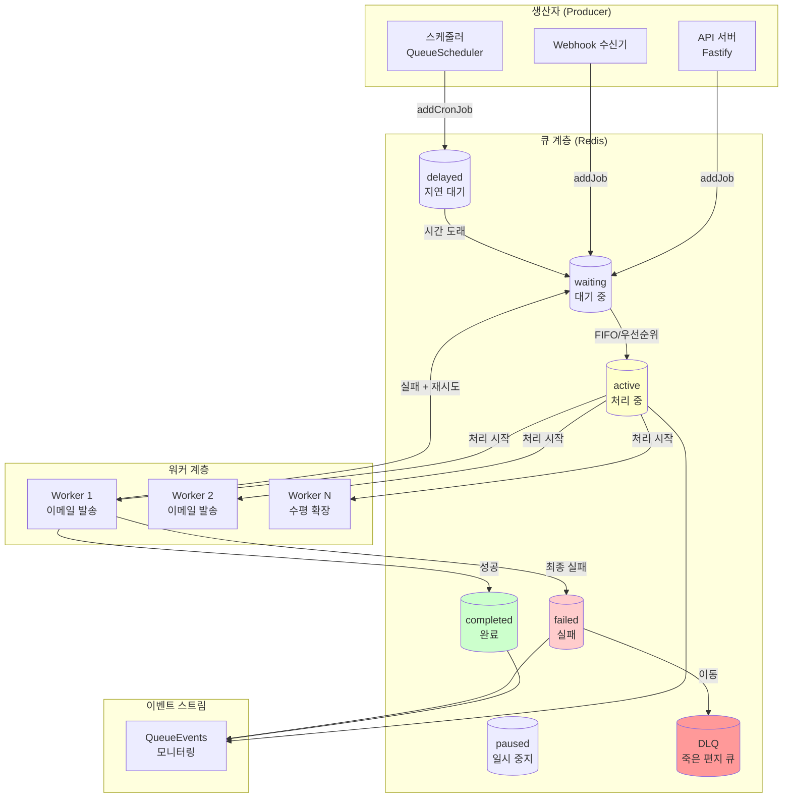
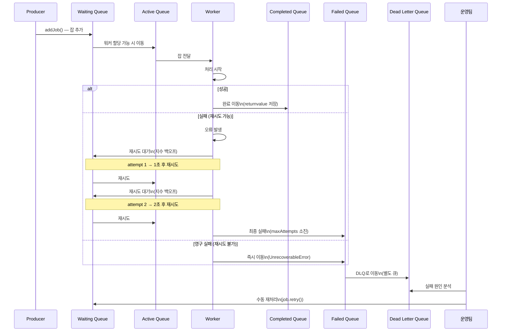

# 메시지 큐 패턴 심화 — BullMQ 고급, Dead Letter Queue, 우선순위 큐, 배치 처리

> 대상 독자: 백엔드 개발자 (초급~중급)
> 관련 요구사항: FR-DORA.1~FR-DORA.5, NFR-2 (가용성 99.9%)
> 관련 패키지: packages/dora-exporter, packages/feature-flag-sdk

---

## 목차

1. [메시지 큐 기초 — 왜 필요한가?](#1-메시지-큐-기초--왜-필요한가)
2. [BullMQ 아키텍처 완전 이해](#2-bullmq-아키텍처-완전-이해)
3. [잡 타입별 패턴](#3-잡-타입별-패턴)
4. [Dead Letter Queue 완전 가이드](#4-dead-letter-queue-완전-가이드)
5. [배치 처리 패턴](#5-배치-처리-패턴)
6. [멀티테넌트 큐 격리](#6-멀티테넌트-큐-격리)
7. [BullMQ + KEDA 오토스케일링](#7-bullmq--keda-오토스케일링)
8. [공공기관 SaaS 큐 패턴 — CSAP D-06 감사](#8-공공기관-saas-큐-패턴--csap-d-06-감사)
9. [실습: 이메일 알림 큐 구현](#9-실습-이메일-알림-큐-구현)

---

## 1. 메시지 큐 기초 — 왜 필요한가?

### 1.1 동기 처리의 한계

민원인이 "민원 접수 확인 이메일 발송"을 요청했다고 생각해 봅시다.

**동기 처리 방식:**

```
민원인 요청 → API 처리 → 이메일 서버 호출 → 민원인에게 응답
                              ↓
                         이메일 서버가 느리면?
                              ↓
                         민원인이 5~10초 대기
                         (서비스 품질 저하)
```

**비동기 처리 방식 (메시지 큐 사용):**

```
민원인 요청 → API 처리 → 큐에 메시지 추가 → 즉시 "접수 완료" 응답
                                ↓
                         백그라운드 워커가 큐에서 꺼내
                         이메일 발송 (비동기)
```

### 1.2 메시지 큐가 해결하는 문제

| 문제 | 메시지 큐 해결 방법 |
|------|------------------|
| 높은 응답 지연 | 작업을 큐에 위임, 즉시 응답 |
| 트래픽 급증 | 큐가 버퍼 역할, 워커는 일정 속도 처리 |
| 외부 서비스 장애 | 큐에 메시지 보관, 서비스 복구 후 재처리 |
| 작업 손실 위험 | Redis 영속성으로 프로세스 재시작 후에도 유지 |
| 작업 실패 대응 | 자동 재시도 + DLQ로 실패 관리 |

### 1.3 공공기관 SaaS에서의 메시지 큐

공공기관 시스템에서 메시지 큐는 다음 용도로 특히 중요합니다.

```
1. 민원 접수 → 담당자 배정 알림 (비동기)
2. DORA 지표 계산 (Gitea webhook → 큐 → 워커 → Prometheus)
3. CSAP 감사 로그 배치 저장 (실시간 기록 → 큐 → 배치 저장)
4. 이메일/SMS 알림 발송 (공공 전자우편 시스템 연동)
5. 보고서 생성 (큰 데이터셋 처리, 비동기 완료 알림)
```

실제 코드에서 DORA Exporter(`packages/dora-exporter/src/index.ts`)는 내부 `EventQueue`를 사용해 Gitea 웹훅 이벤트를 비동기 처리합니다. 이 구조를 BullMQ로 확장하는 방법을 학습합니다.

---

## 2. BullMQ 아키텍처 완전 이해

### 2.1 BullMQ 전체 아키텍처



### 2.2 핵심 구성 요소

**Queue (큐)**

잡을 추가하는 인터페이스입니다. 생산자(Producer)가 사용합니다.

```typescript
// Design Ref: §2 — BullMQ Queue 기본 설정
import { Queue } from 'bullmq';

const emailQueue = new Queue('email-notifications', {
  connection: {
    host: process.env.REDIS_HOST ?? 'localhost',
    port: parseInt(process.env.REDIS_PORT ?? '6379', 10),
    password: process.env.REDIS_PASSWORD, // 하드코딩 금지 (CSAP D-09)
    tls: process.env.NODE_ENV === 'production' ? {} : undefined, // TLS 1.3+ (CSAP D-09)
  },
  defaultJobOptions: {
    attempts: 3,            // 기본 재시도 횟수
    backoff: {
      type: 'exponential',
      delay: 1000,          // 초기 재시도 딜레이 1초
    },
    removeOnComplete: {
      count: 1000,          // 완료된 잡 최대 1000개 보관
      age: 86400,           // 24시간 후 자동 삭제
    },
    removeOnFail: false,    // 실패 잡은 보관 (DLQ 이동 전)
  },
});
```

**Worker (워커)**

큐에서 잡을 꺼내 처리하는 컨슈머(Consumer)입니다.

```typescript
// Design Ref: §2 — BullMQ Worker 기본 설정
import { Worker, Job } from 'bullmq';

const emailWorker = new Worker<EmailJobData>(
  'email-notifications',
  async (job: Job<EmailJobData>) => {
    // 잡 처리 로직
    const { to, subject, body } = job.data;

    // 진행 상황 보고 (0~100%)
    await job.updateProgress(10);

    await sendEmail({ to, subject, body });

    await job.updateProgress(100);
    return { sent: true, timestamp: new Date().toISOString() };
  },
  {
    connection: redisConnection,
    concurrency: 5,         // 동시 처리 잡 수
    limiter: {
      max: 100,             // 이메일 서버 Rate Limit 준수
      duration: 60000,      // 분당 100개
    },
  }
);

// 이벤트 핸들러
emailWorker.on('completed', (job) => {
  process.stdout.write(JSON.stringify({
    level: 'info',
    component: 'email-worker',
    jobId: job.id,
    action: 'completed',
    ts: new Date().toISOString(),
  }) + '\n');
});

emailWorker.on('failed', (job, error) => {
  process.stderr.write(JSON.stringify({
    level: 'error',
    component: 'email-worker',
    jobId: job?.id,
    action: 'failed',
    attempt: job?.attemptsMade,
    error: error.message, // 민감 정보 제외 (CSAP D-12)
    ts: new Date().toISOString(),
  }) + '\n');
});
```

**QueueEvents (이벤트 스트림)**

큐 전체의 이벤트를 모니터링합니다.

```typescript
// Design Ref: §2 — QueueEvents 모니터링
import { QueueEvents } from 'bullmq';

const queueEvents = new QueueEvents('email-notifications', { connection: redisConnection });

queueEvents.on('waiting', ({ jobId }) => {
  // 잡이 대기열에 추가됨
});

queueEvents.on('active', ({ jobId, prev }) => {
  // 잡 처리 시작
});

queueEvents.on('completed', ({ jobId, returnvalue }) => {
  // 잡 완료
});

queueEvents.on('failed', ({ jobId, failedReason }) => {
  // 잡 최종 실패 (모든 재시도 소진)
});

queueEvents.on('stalled', ({ jobId }) => {
  // 잡이 멈춤 (워커 프로세스 종료 등)
});
```

### 2.3 Redis 기반 잡 영속성

BullMQ는 Redis를 저장소로 사용합니다. 프로세스가 재시작되어도 잡은 Redis에 안전하게 보존됩니다.

```
Redis 키 구조:
bull:{queueName}:waiting  - 대기 중인 잡 목록 (Sorted Set)
bull:{queueName}:active   - 처리 중인 잡 목록 (Sorted Set)
bull:{queueName}:completed - 완료된 잡 목록 (Sorted Set)
bull:{queueName}:failed   - 실패한 잡 목록 (Sorted Set)
bull:{queueName}:{jobId}  - 잡 데이터 (Hash)
bull:{queueName}:delay    - 지연 잡 목록 (Sorted Set, score = 실행 시각)
```

---

## 3. 잡 타입별 패턴

### 3.1 일반 잡 — 즉시 처리

```typescript
// Design Ref: §3 — 즉시 처리 잡

interface EmailJobData {
  to: string;
  subject: string;
  body: string;
  tenantId: string;
  priority?: number;
}

// 잡 추가 (생산자)
async function sendEmailAsync(emailData: EmailJobData): Promise<string> {
  const job = await emailQueue.add('send-email', emailData, {
    priority: emailData.priority ?? 0,
  });

  return job.id ?? 'unknown';
}

// 사용 예시
const jobId = await sendEmailAsync({
  to: 'citizen@example.go.kr',
  subject: '[공공기관] 민원 접수 확인',
  body: '귀하의 민원이 정상적으로 접수되었습니다.',
  tenantId: 'agency-001',
});
```

### 3.2 지연 잡 — 특정 시간 후 실행

```typescript
// Design Ref: §3 — 지연 처리 잡 (딜레이)

// 30분 후 리마인더 발송
async function scheduleReminder(
  userId: string,
  message: string,
  delayMinutes: number
): Promise<void> {
  await emailQueue.add(
    'send-reminder',
    { userId, message, tenantId: 'system' },
    {
      delay: delayMinutes * 60 * 1000, // ms 단위
    }
  );
}

// 내일 오전 9시 발송 (절대 시간)
async function scheduleAtTime(
  userId: string,
  scheduledAt: Date
): Promise<void> {
  const delay = scheduledAt.getTime() - Date.now();
  if (delay < 0) throw new Error('과거 시간으로 잡 예약 불가');

  await emailQueue.add(
    'scheduled-notification',
    { userId, tenantId: 'system' },
    { delay }
  );
}
```

### 3.3 반복 잡 — Cron 패턴

```typescript
// Design Ref: §3 — Cron 반복 잡
// DORA 주간 보고서 생성 (매주 월요일 오전 9시)
// 실제 코드 기반: packages/dora-exporter/src/index.ts

import { Queue } from 'bullmq';

const reportQueue = new Queue('weekly-reports', { connection: redisConnection });

await reportQueue.add(
  'generate-dora-weekly-report',
  {
    reportType: 'dora-weekly',
    csapRefs: ['D-06', 'D-12'],
  },
  {
    repeat: {
      cron: '0 9 * * 1',  // 매주 월요일 09:00 (KST)
      tz: 'Asia/Seoul',
    },
    removeOnComplete: true,
    removeOnFail: false,
  }
);

// Cron 표현식 참고:
// '0 9 * * 1'    → 매주 월요일 09:00
// '0 0 1 * *'    → 매월 1일 00:00
// '0 */6 * * *'  → 6시간마다
// '*/5 * * * *'  → 5분마다
```

### 3.4 우선순위 잡 — 중요한 작업 먼저

```typescript
// Design Ref: §3 — 우선순위 잡
// 우선순위 값: 낮을수록 먼저 처리 (1 = 최우선)

enum JobPriority {
  CRITICAL = 1,   // 장애 알림, 보안 이벤트
  HIGH = 10,      // 민원 접수 확인
  NORMAL = 50,    // 일반 알림
  LOW = 100,      // 뉴스레터, 주간 리포트
}

async function enqueueWithPriority(
  data: EmailJobData,
  priority: JobPriority
): Promise<void> {
  await emailQueue.add('send-email', data, { priority });
}

// 보안 이벤트: 즉시 처리
await enqueueWithPriority(
  { to: 'admin@agency.go.kr', subject: '[긴급] 보안 이벤트 감지', body: '...', tenantId: 'system' },
  JobPriority.CRITICAL
);

// 일반 뉴스레터: 낮은 우선순위
await enqueueWithPriority(
  { to: 'user@example.go.kr', subject: '[공공기관] 월간 뉴스레터', body: '...', tenantId: 'agency-001' },
  JobPriority.LOW
);
```

---

## 4. Dead Letter Queue 완전 가이드

### 4.1 DLQ란 무엇인가?

Dead Letter Queue(DLQ, 죽은 편지 큐)는 모든 재시도를 소진한 후에도 처리에 실패한 잡을 보관하는 특별한 큐입니다. 잡을 그냥 삭제하면 데이터 손실이 발생하므로, DLQ에 보관해 두었다가 원인을 파악하고 수동으로 재처리할 수 있습니다.

### 4.2 잡 생명주기 전체



### 4.3 실패 시나리오 5가지

```typescript
// Design Ref: §4 — 실패 시나리오 분류

// 시나리오 1: 일시적 네트워크 오류 (재시도 가능)
class NetworkError extends Error {
  constructor(message: string) {
    super(message);
    this.name = 'NetworkError';
  }
}

// 시나리오 2: 잘못된 잡 데이터 (재시도 불가)
class ValidationError extends Error {
  constructor(message: string) {
    super(message);
    this.name = 'ValidationError';
  }
}

// 시나리오 3: 외부 서비스 영구 오류 (재시도 불가)
class PermanentServiceError extends Error {
  constructor(message: string) {
    super(message);
    this.name = 'PermanentServiceError';
  }
}

// 시나리오 4: 인증 오류 (재시도 불가 — 토큰 갱신 필요)
class AuthenticationError extends Error {
  constructor(message: string) {
    super(message);
    this.name = 'AuthenticationError';
  }
}

// 시나리오 5: 데이터베이스 연결 오류 (재시도 가능)
class DatabaseConnectionError extends Error {
  constructor(message: string) {
    super(message);
    this.name = 'DatabaseConnectionError';
  }
}

// 워커에서 오류 유형별 처리
import { UnrecoverableError } from 'bullmq';

const emailWorker = new Worker<EmailJobData>(
  'email-notifications',
  async (job: Job<EmailJobData>) => {
    try {
      await sendEmail(job.data);
    } catch (error) {
      if (
        error instanceof ValidationError ||
        error instanceof PermanentServiceError ||
        error instanceof AuthenticationError
      ) {
        // 재시도해도 소용없음: 즉시 DLQ로 이동
        throw new UnrecoverableError(
          `재시도 불가 오류: ${(error as Error).message}`
        );
      }

      // NetworkError, DatabaseConnectionError: BullMQ가 자동 재시도
      throw error;
    }
  },
  { connection: redisConnection }
);
```

### 4.4 DLQ 구현

BullMQ에는 내장 DLQ가 없으므로, failed 이벤트를 감지하여 별도 DLQ로 이동시킵니다.

```typescript
// Design Ref: §4 — DLQ 구현 패턴

import { Queue, QueueEvents } from 'bullmq';

interface DLQJobData {
  originalQueue: string;
  originalJobId: string;
  originalJobData: unknown;
  failedReason: string;
  failedAt: string;
  attemptsMade: number;
  tenantId: string;
}

class DeadLetterQueueManager {
  private readonly dlqQueue: Queue<DLQJobData>;
  private readonly sourceQueueEvents: QueueEvents;

  constructor(
    private readonly sourceName: string,
    redisConnection: object
  ) {
    this.dlqQueue = new Queue<DLQJobData>(
      `${sourceName}-dlq`,
      { connection: redisConnection as Parameters<typeof Queue>[1]['connection'] }
    );

    this.sourceQueueEvents = new QueueEvents(sourceName, {
      connection: redisConnection as Parameters<typeof QueueEvents>[1]['connection'],
    });
  }

  /**
   * 소스 큐의 최종 실패 이벤트를 DLQ로 이동
   */
  start(sourceQueue: Queue): void {
    this.sourceQueueEvents.on('failed', async ({ jobId, failedReason }) => {
      const job = await sourceQueue.getJob(jobId);
      if (!job) return;

      // 모든 재시도를 소진한 경우에만 DLQ로 이동
      if (job.attemptsMade < (job.opts.attempts ?? 1)) return;

      await this.moveToDLQ(job, failedReason);
    });
  }

  private async moveToDLQ(job: { id?: string; data: unknown; attemptsMade: number }, failedReason: string): Promise<void> {
    const jobData = job as { id?: string; data: EmailJobData; attemptsMade: number };

    await this.dlqQueue.add(
      'dlq-item',
      {
        originalQueue: this.sourceName,
        originalJobId: job.id ?? 'unknown',
        originalJobData: job.data,
        failedReason,
        failedAt: new Date().toISOString(),
        attemptsMade: job.attemptsMade,
        tenantId: (jobData.data as { tenantId?: string }).tenantId ?? 'unknown',
      },
      {
        removeOnComplete: false, // DLQ는 영구 보관
        removeOnFail: false,
      }
    );

    // CSAP D-06: 감사 로그 기록
    process.stdout.write(JSON.stringify({
      level: 'error',
      component: 'dlq-manager',
      originalQueue: this.sourceName,
      originalJobId: job.id,
      failedReason,
      attemptsMade: job.attemptsMade,
      action: 'moved_to_dlq',
      ts: new Date().toISOString(),
    }) + '\n');
  }

  /**
   * DLQ 항목 조회
   */
  async getDLQItems(limit = 100): Promise<Array<DLQJobData & { jobId: string }>> {
    const jobs = await this.dlqQueue.getJobs(['waiting', 'failed'], 0, limit);
    return jobs.map((job) => ({
      ...job.data,
      jobId: job.id ?? 'unknown',
    }));
  }

  /**
   * DLQ 항목 수동 재처리
   */
  async retryFromDLQ(dlqJobId: string, sourceQueue: Queue): Promise<void> {
    const dlqJob = await this.dlqQueue.getJob(dlqJobId);
    if (!dlqJob) throw new Error(`DLQ 잡을 찾을 수 없음: ${dlqJobId}`);

    const { originalJobData, tenantId } = dlqJob.data;

    // 원래 큐에 다시 추가
    await sourceQueue.add('retry-from-dlq', originalJobData as object, {
      attempts: 5, // 재처리 시 더 많은 재시도 허용
    });

    // DLQ에서 제거
    await dlqJob.remove();

    // CSAP D-06: 감사 로그
    process.stdout.write(JSON.stringify({
      level: 'info',
      component: 'dlq-manager',
      dlqJobId,
      tenantId,
      action: 'manual_retry',
      actor: 'operations-team',
      ts: new Date().toISOString(),
    }) + '\n');
  }
}
```

### 4.5 DLQ 모니터링

```typescript
// Design Ref: §4 — DLQ 모니터링 API

// Fastify 라우트 (내부 관리 API)
app.get('/admin/queues/dlq', {
  schema: {
    description: 'DLQ 항목 조회',
    tags: ['admin', 'queue'],
    querystring: {
      type: 'object',
      properties: {
        limit: { type: 'integer', default: 50, maximum: 500 },
        queueName: { type: 'string' },
      },
    },
  },
  // CSAP D-08: 관리자 권한 필수
  preHandler: [verifyAdmin],
}, async (request, reply) => {
  const { limit, queueName } = request.query as { limit: number; queueName?: string };

  const dlqManager = new DeadLetterQueueManager(
    queueName ?? 'email-notifications',
    redisConnection
  );

  const items = await dlqManager.getDLQItems(limit);

  // 민감 정보 마스킹 후 반환 (CSAP D-12)
  const sanitized = items.map((item) => ({
    ...item,
    // 이메일 주소 마스킹 (PII)
    originalJobData: maskEmailInData(item.originalJobData),
  }));

  return reply.send({ success: true, data: sanitized, count: sanitized.length });
});

// DLQ 수동 재처리 API
app.post('/admin/queues/dlq/:jobId/retry', {
  preHandler: [verifyAdmin],
}, async (request, reply) => {
  const { jobId } = request.params as { jobId: string };

  await dlqManager.retryFromDLQ(jobId, emailQueue);

  return reply.send({ success: true, message: '재처리 큐에 추가됨' });
});

function maskEmailInData(data: unknown): unknown {
  if (!data || typeof data !== 'object') return data;
  const masked = { ...data as Record<string, unknown> };
  if (typeof masked['to'] === 'string') {
    const [local, domain] = (masked['to'] as string).split('@');
    masked['to'] = `${local.slice(0, 2)}***@${domain}`;
  }
  return masked;
}
```

### 4.6 수동 재처리 절차

DLQ 항목을 재처리하기 전에 반드시 다음 절차를 따릅니다.

```bash
# 1. DLQ 항목 확인
curl -H "Authorization: Bearer $ADMIN_TOKEN" \
  https://internal.agency.go.kr/admin/queues/dlq?limit=10

# 2. 특정 잡 상세 조회
curl -H "Authorization: Bearer $ADMIN_TOKEN" \
  https://internal.agency.go.kr/admin/queues/dlq/job123

# 3. 실패 원인 분석 (로그 확인)
kubectl logs -n saas -l app=email-worker --since=1h | \
  grep '"jobId":"job123"'

# 4. 원인 수정 후 재처리
curl -X POST \
  -H "Authorization: Bearer $ADMIN_TOKEN" \
  https://internal.agency.go.kr/admin/queues/dlq/job123/retry

# 5. 재처리 결과 확인
curl -H "Authorization: Bearer $ADMIN_TOKEN" \
  https://internal.agency.go.kr/admin/queues/email-notifications/status
```

---

## 5. 배치 처리 패턴

### 5.1 대량 데이터를 효율적으로 처리하는 방법

대량의 민원 데이터를 처리하거나 CSAP 감사 로그를 배치로 저장할 때 배치 처리 패턴이 필요합니다.

### 5.2 Bulk 처리 전략

```typescript
// Design Ref: §5 — Bulk 잡 추가 (addBulk)
// 실제 코드 기반: packages/dora-exporter/src/index.ts EventQueue 패턴

import { Queue } from 'bullmq';

interface AuditLogJobData {
  actor: string;
  action: string;
  target: string;
  tenantId: string;
  timestamp: string;
  metadata?: Record<string, unknown>;
}

async function enqueueAuditLogBatch(logs: AuditLogJobData[]): Promise<void> {
  const auditQueue = new Queue<AuditLogJobData>('audit-logs', {
    connection: redisConnection,
    defaultJobOptions: {
      removeOnComplete: { age: 86400 * 30 }, // 30일 보관 (CSAP D-06)
      removeOnFail: false,
    },
  });

  // addBulk: 단일 Redis 트랜잭션으로 여러 잡 추가 (성능 최적화)
  const jobs = logs.map((log) => ({
    name: 'audit-log',
    data: log,
    opts: {
      priority: log.action.includes('DELETE') ? 1 : 50, // 삭제 작업 우선 기록
    },
  }));

  await auditQueue.addBulk(jobs);

  process.stdout.write(JSON.stringify({
    level: 'info',
    component: 'audit-queue',
    action: 'batch_enqueued',
    count: logs.length,
    ts: new Date().toISOString(),
  }) + '\n');
}
```

### 5.3 청크 처리 (Chunk Processing)

```typescript
// Design Ref: §5 — 청크 처리 패턴
// 대용량 데이터를 청크로 나눠 처리

class ChunkProcessor<T> {
  constructor(
    private readonly queue: Queue<T[]>,
    private readonly chunkSize: number = 100
  ) {}

  async process(items: T[], jobName: string): Promise<void> {
    const chunks = this.splitIntoChunks(items, this.chunkSize);

    const jobs = chunks.map((chunk, index) => ({
      name: jobName,
      data: chunk,
      opts: {
        // 청크 순서 보장을 위해 우선순위 역수 사용
        priority: chunks.length - index,
      },
    }));

    await this.queue.addBulk(jobs);

    process.stdout.write(JSON.stringify({
      level: 'info',
      component: 'chunk-processor',
      totalItems: items.length,
      chunkCount: chunks.length,
      chunkSize: this.chunkSize,
      ts: new Date().toISOString(),
    }) + '\n');
  }

  private splitIntoChunks<I>(items: I[], size: number): I[][] {
    const chunks: I[][] = [];
    for (let i = 0; i < items.length; i += size) {
      chunks.push(items.slice(i, i + size));
    }
    return chunks;
  }
}

// 사용 예시: 10,000건 민원 이메일 배치 발송
const chunkProcessor = new ChunkProcessor<EmailJobData>(emailBatchQueue, 100);

await chunkProcessor.process(
  citizenEmails, // 10,000건
  'batch-email'
);
// 결과: 100개 잡이 큐에 추가됨 (각 잡이 100건씩 처리)
```

### 5.4 배치 워커

```typescript
// Design Ref: §5 — 배치 워커 구현

const auditBatchWorker = new Worker<AuditLogJobData[]>(
  'audit-logs',
  async (job: Job<AuditLogJobData[]>) => {
    const auditLogs = job.data;

    // 진행 상황 보고
    await job.updateProgress(0);

    const results = {
      saved: 0,
      failed: 0,
    };

    // 배치 DB 저장 (단일 트랜잭션)
    await prisma.$transaction(async (tx) => {
      for (let i = 0; i < auditLogs.length; i++) {
        const log = auditLogs[i];

        await tx.auditLog.create({
          data: {
            actor: log.actor,
            action: log.action,
            target: log.target,
            tenantId: log.tenantId,
            timestamp: new Date(log.timestamp),
            metadata: log.metadata as object,
          },
        });

        results.saved++;

        // 10개마다 진행 상황 업데이트
        if (i % 10 === 0) {
          await job.updateProgress(Math.floor((i / auditLogs.length) * 100));
        }
      }
    });

    await job.updateProgress(100);
    return results;
  },
  {
    connection: redisConnection,
    concurrency: 2, // 배치 작업은 동시성 낮게 (DB 부하 고려)
  }
);
```

---

## 6. 멀티테넌트 큐 격리

### 6.1 테넌트별 큐 분리 전략

공공기관 SaaS는 멀티테넌트 구조입니다. 한 기관의 대량 작업이 다른 기관의 처리를 방해해서는 안 됩니다.

**전략 1: 테넌트별 개별 큐 (강한 격리)**

```typescript
// Design Ref: §6 — 테넌트별 큐 격리
// 테넌트별로 완전히 분리된 큐 사용

class TenantQueueManager {
  private readonly queues = new Map<string, Queue>();
  private readonly workers = new Map<string, Worker>();

  getOrCreateQueue(tenantId: string): Queue {
    if (!this.queues.has(tenantId)) {
      const queue = new Queue(`email-${tenantId}`, {
        connection: redisConnection,
        defaultJobOptions: {
          attempts: 3,
          backoff: { type: 'exponential', delay: 1000 },
        },
      });
      this.queues.set(tenantId, queue);

      // 테넌트별 워커 생성
      this.createWorkerForTenant(tenantId);
    }

    return this.queues.get(tenantId)!;
  }

  private createWorkerForTenant(tenantId: string): void {
    const worker = new Worker<EmailJobData>(
      `email-${tenantId}`,
      async (job) => {
        // 테넌트 격리 확인
        if (job.data.tenantId !== tenantId) {
          throw new UnrecoverableError('테넌트 ID 불일치: 보안 위반');
        }
        return sendEmail(job.data);
      },
      {
        connection: redisConnection,
        concurrency: 3,
        limiter: {
          max: 30, // 테넌트별 분당 30개 이메일
          duration: 60000,
        },
      }
    );

    this.workers.set(tenantId, worker);
  }

  // 테넌트 큐 통계 (SLA 모니터링용)
  async getTenantQueueStats(tenantId: string): Promise<{
    waiting: number;
    active: number;
    completed: number;
    failed: number;
  }> {
    const queue = this.queues.get(tenantId);
    if (!queue) return { waiting: 0, active: 0, completed: 0, failed: 0 };

    const [waiting, active, completed, failed] = await Promise.all([
      queue.getWaitingCount(),
      queue.getActiveCount(),
      queue.getCompletedCount(),
      queue.getFailedCount(),
    ]);

    return { waiting, active, completed, failed };
  }
}
```

**전략 2: 공유 큐 + 테넌트 레이블 (가벼운 격리)**

```typescript
// Design Ref: §6 — 공유 큐 + 테넌트 필터링

// 잡 데이터에 tenantId 포함 (모든 큐 패턴의 필수 필드)
interface BaseJobData {
  tenantId: string;  // 모든 잡에 테넌트 ID 필수
}

// 워커에서 테넌트 기반 Rate Limiting
class TenantRateLimiter {
  private readonly counts = new Map<string, { count: number; resetAt: number }>();
  private readonly maxPerMinute: number;

  constructor(maxPerMinute: number) {
    this.maxPerMinute = maxPerMinute;
  }

  isAllowed(tenantId: string): boolean {
    const now = Date.now();
    const window = this.counts.get(tenantId);

    if (!window || now > window.resetAt) {
      this.counts.set(tenantId, { count: 1, resetAt: now + 60000 });
      return true;
    }

    if (window.count >= this.maxPerMinute) {
      return false; // Rate Limit 초과
    }

    window.count++;
    return true;
  }
}

const tenantLimiter = new TenantRateLimiter(30);

const sharedWorker = new Worker<EmailJobData & BaseJobData>(
  'shared-email',
  async (job) => {
    const { tenantId } = job.data;

    // 테넌트별 처리량 제한
    if (!tenantLimiter.isAllowed(tenantId)) {
      // 재시도 큐에 다시 추가 (딜레이)
      await job.moveToDelayed(Date.now() + 5000); // 5초 후 재시도
      return;
    }

    return sendEmail(job.data);
  },
  { connection: redisConnection, concurrency: 10 }
);
```

### 6.2 테넌트별 처리량 제한 설정

```typescript
// Design Ref: §6 — 테넌트 티어별 처리량 설정

enum TenantTier {
  FREE = 'free',
  STANDARD = 'standard',
  PREMIUM = 'premium',
  ENTERPRISE = 'enterprise',
}

const TENANT_RATE_LIMITS: Record<TenantTier, { emailPerMinute: number; concurrency: number }> = {
  [TenantTier.FREE]: { emailPerMinute: 10, concurrency: 1 },
  [TenantTier.STANDARD]: { emailPerMinute: 100, concurrency: 3 },
  [TenantTier.PREMIUM]: { emailPerMinute: 500, concurrency: 10 },
  [TenantTier.ENTERPRISE]: { emailPerMinute: 2000, concurrency: 30 },
};

// Feature Flag를 통한 동적 Rate Limit 조정
// 실제 코드 기반: packages/feature-flag-sdk/src/index.ts

async function getTenantRateLimit(tenantId: string): Promise<{ emailPerMinute: number }> {
  const featureFlagClient = createFeatureFlagClient();
  await featureFlagClient.initialize();

  // 긴급 처리량 증가 플래그 (재난 발생 시 민원 급증 대응)
  const emergencyMode = featureFlagClient.isEnabled('emergency-rate-boost', {
    tenantId,
  });

  const tier = await getTenantTier(tenantId); // DB 조회
  const baseLimit = TENANT_RATE_LIMITS[tier];

  return {
    emailPerMinute: emergencyMode ? baseLimit.emailPerMinute * 3 : baseLimit.emailPerMinute,
  };
}
```

---

## 7. BullMQ + KEDA 오토스케일링

### 7.1 왜 오토스케일링이 필요한가?

평소에는 워커 2개로 충분하지만, 월말 민원 급증 시에는 워커 20개가 필요할 수 있습니다. KEDA(Kubernetes Event-driven Autoscaling)를 사용하면 큐 길이에 따라 워커 파드를 자동으로 확장/축소합니다.

```yaml
# Design Ref: §7 — KEDA ScaledObject 설정
# k3s 클러스터에서 BullMQ 큐 기반 오토스케일링

apiVersion: keda.sh/v1alpha1
kind: ScaledObject
metadata:
  name: email-worker-scaler
  namespace: saas
spec:
  scaleTargetRef:
    name: email-worker-deployment
  pollingInterval: 15         # 15초마다 큐 길이 확인
  cooldownPeriod: 300         # 축소 전 5분 대기
  minReplicaCount: 1          # 최소 1개 워커 유지
  maxReplicaCount: 20         # 최대 20개 워커
  triggers:
    - type: redis
      metadata:
        address: redis-master.saas.svc.cluster.local:6379
        listName: "bull:email-notifications:waiting"
        listLength: "10"      # 대기 잡 10개당 워커 1개 추가
        activationListLength: "5"  # 활성화 임계값
      authenticationRef:
        name: redis-keda-auth  # Redis 인증 (SecretTargetRef)

---
apiVersion: keda.sh/v1alpha1
kind: TriggerAuthentication
metadata:
  name: redis-keda-auth
  namespace: saas
spec:
  secretTargetRef:
    - parameter: password
      name: redis-secret     # Kubernetes Secret (하드코딩 금지 - CSAP D-09)
      key: redis-password
```

### 7.2 워커 Graceful Shutdown

KEDA가 파드를 축소할 때 처리 중인 잡이 손실되지 않도록 Graceful Shutdown이 필수입니다.

```typescript
// Design Ref: §7 — Graceful Shutdown
// platform/packages/mesh-ready/src/graceful-shutdown.ts 패턴 참조

async function gracefulShutdown(): Promise<void> {
  process.stdout.write(JSON.stringify({
    level: 'info',
    component: 'email-worker',
    action: 'shutdown_initiated',
    ts: new Date().toISOString(),
  }) + '\n');

  // 1. 워커가 새로운 잡 받지 않도록 중지
  await emailWorker.close();

  // 2. 현재 처리 중인 잡 완료 대기 (최대 30초)
  const shutdownTimeout = setTimeout(() => {
    process.stderr.write(JSON.stringify({
      level: 'warn',
      component: 'email-worker',
      action: 'shutdown_timeout',
      ts: new Date().toISOString(),
    }) + '\n');
    process.exit(1);
  }, 30000);

  try {
    // 모든 active 잡이 완료되길 기다림
    await emailWorker.close(true); // force = true: stalled 잡 즉시 재큐잉
    clearTimeout(shutdownTimeout);
  } catch (error) {
    clearTimeout(shutdownTimeout);
  }

  // 3. Redis 연결 정리
  await emailQueue.close();

  process.stdout.write(JSON.stringify({
    level: 'info',
    component: 'email-worker',
    action: 'shutdown_complete',
    ts: new Date().toISOString(),
  }) + '\n');

  process.exit(0);
}

process.on('SIGTERM', gracefulShutdown);
process.on('SIGINT', gracefulShutdown);
```

---

## 8. 공공기관 SaaS 큐 패턴 — CSAP D-06 감사

### 8.1 CSAP D-06 요건과 큐 패턴

CSAP D-06(침해사고 관리)은 모든 민감 작업에 대한 감사 로그 기록을 요구합니다. 큐를 통한 비동기 처리에서도 감사 추적이 유지되어야 합니다.

```typescript
// Design Ref: §8 — CSAP D-06 감사 추적이 통합된 큐 패턴
// 실제 코드 기반:
// - platform/services/compliance-service/src/lib/audit.ts
// - platform/services/security-service/src/lib/audit.ts

interface AuditableJobData extends BaseJobData {
  auditId: string;       // 잡과 감사 로그를 연결하는 고유 ID
  actorId: string;       // 작업을 요청한 사용자/시스템 ID
  requestIp: string;     // 요청 IP (마스킹 처리)
}

// 감사 추적이 포함된 이메일 잡 추가
async function addEmailJobWithAudit(
  emailData: EmailJobData,
  actor: { id: string; ip: string }
): Promise<string> {
  const auditId = crypto.randomUUID();

  // 1. 감사 로그 먼저 기록 (잡 추가 전)
  await logJobEvent('EMAIL_JOB_QUEUED', {
    auditId,
    actorId: actor.id,
    requestIp: maskIP(actor.ip), // IP 마스킹 (CSAP D-12)
    recipient: maskEmail(emailData.to), // 이메일 마스킹
    tenantId: emailData.tenantId,
    subject: emailData.subject,
  });

  // 2. 잡 추가
  const job = await emailQueue.add(
    'send-email',
    {
      ...emailData,
      auditId,
      actorId: actor.id,
      requestIp: maskIP(actor.ip),
    } as EmailJobData & AuditableJobData
  );

  return job.id ?? 'unknown';
}

// 워커에서도 감사 로그 기록
const auditableEmailWorker = new Worker<EmailJobData & AuditableJobData>(
  'email-notifications',
  async (job) => {
    const { auditId, actorId, tenantId } = job.data;

    // 처리 시작 감사 로그
    await logJobEvent('EMAIL_JOB_STARTED', { auditId, actorId, tenantId, jobId: job.id });

    try {
      const result = await sendEmail(job.data);

      // 완료 감사 로그
      await logJobEvent('EMAIL_JOB_COMPLETED', {
        auditId,
        actorId,
        tenantId,
        jobId: job.id,
        result: { sent: result.sent },
      });

      return result;
    } catch (error) {
      // 실패 감사 로그
      await logJobEvent('EMAIL_JOB_FAILED', {
        auditId,
        actorId,
        tenantId,
        jobId: job.id,
        error: (error as Error).name, // 에러 유형만 기록 (메시지에 민감정보 배제)
      });

      throw error;
    }
  },
  { connection: redisConnection }
);

async function logJobEvent(
  action: string,
  metadata: Record<string, unknown>
): Promise<void> {
  // audit-sdk 패턴 사용 (compliance/security-service와 동일)
  process.stdout.write(JSON.stringify({
    level: 'info',
    component: 'job-audit',
    action,
    ...metadata,
    ts: new Date().toISOString(),
  }) + '\n');
}

function maskEmail(email: string): string {
  const [local, domain] = email.split('@');
  return `${local.slice(0, 2)}***@${domain}`;
}

function maskIP(ip: string): string {
  const parts = ip.split('.');
  if (parts.length === 4) {
    return `${parts[0]}.${parts[1]}.***.***.`;
  }
  return '***';
}
```

### 8.2 큐 데이터 보존 정책 (CSAP D-06)

```typescript
// Design Ref: §8 — CSAP D-06 데이터 보존 정책

const CSAP_RETENTION_POLICY = {
  // 완료된 일반 잡: 7일 보관
  completedNormal: {
    removeOnComplete: { age: 7 * 86400, count: 10000 },
  },

  // 완료된 감사 잡: 1년 보관 (CSAP D-06)
  completedAudit: {
    removeOnComplete: { age: 365 * 86400, count: 100000 },
  },

  // 실패 잡: 30일 보관 (원인 분석 기간)
  failed: {
    removeOnFail: false, // 자동 삭제 안 함 (DLQ로 이동)
  },

  // DLQ 항목: 영구 보관 (삭제 시 감사 기록)
  dlq: {
    removeOnComplete: false,
    removeOnFail: false,
  },
};
```

---

## 9. 실습: 이메일 알림 큐 구현

### 9.1 실습 목표

공공기관 SaaS에서 민원 접수 시 담당자에게 이메일 알림을 보내는 전체 큐 시스템을 구현합니다.

### 9.2 프로젝트 구조

```
platform/services/notification-service/
├── src/
│   ├── queues/
│   │   ├── email.queue.ts          # 큐 정의
│   │   ├── email.worker.ts         # 워커
│   │   ├── email.dlq.ts           # DLQ 관리
│   │   └── email.scheduler.ts     # 스케줄러
│   ├── handlers/
│   │   └── notification.handler.ts # Fastify 라우트 핸들러
│   └── routes.ts
```

### 9.3 완전한 구현 코드

**큐 정의 (email.queue.ts)**

```typescript
// Design Ref: §9 — 이메일 알림 큐 완전 구현
// Plan SC: FR-NOTIF.1~FR-NOTIF.5

import { Queue, QueueScheduler } from 'bullmq';
import { z } from 'zod'; // CSAP D-12 입력 검증

// Zod 스키마로 잡 데이터 검증 (CSAP D-12)
export const emailJobSchema = z.object({
  tenantId: z.string().uuid(),
  to: z.string().email(),
  subject: z.string().min(1).max(200),
  body: z.string().min(1).max(50000),
  priority: z.enum(['critical', 'high', 'normal', 'low']).default('normal'),
  auditId: z.string().uuid(),
  actorId: z.string(),
  requestIp: z.string(),
  tags: z.array(z.string()).optional(),
});

export type EmailJobData = z.infer<typeof emailJobSchema>;

const PRIORITY_MAP = {
  critical: 1,
  high: 10,
  normal: 50,
  low: 100,
} as const;

const redisConnection = {
  host: process.env.REDIS_HOST ?? 'localhost',
  port: parseInt(process.env.REDIS_PORT ?? '6379', 10),
  password: process.env.REDIS_PASSWORD,
  tls: process.env.NODE_ENV === 'production' ? {} : undefined,
};

export const emailQueue = new Queue<EmailJobData>('email-notifications', {
  connection: redisConnection,
  defaultJobOptions: {
    attempts: 3,
    backoff: { type: 'exponential', delay: 1000 },
    removeOnComplete: { age: 7 * 86400, count: 10000 },
    removeOnFail: false,
  },
});

// QueueScheduler: 지연 잡 처리 (v3에서 deprecated, v4에서 내장)
export const emailScheduler = new QueueScheduler('email-notifications', {
  connection: redisConnection,
});

export async function addEmailJob(data: EmailJobData): Promise<string> {
  // 입력 검증 (CSAP D-12)
  const validated = emailJobSchema.parse(data);

  const job = await emailQueue.add(
    'send-email',
    validated,
    {
      priority: PRIORITY_MAP[validated.priority],
    }
  );

  return job.id ?? 'unknown';
}
```

**워커 (email.worker.ts)**

```typescript
// Design Ref: §9 — 이메일 워커

import { Worker, Job, UnrecoverableError } from 'bullmq';
import nodemailer from 'nodemailer'; // 공공 메일 서버 연동
import { EmailJobData } from './email.queue';

const transporter = nodemailer.createTransport({
  host: process.env.SMTP_HOST,
  port: parseInt(process.env.SMTP_PORT ?? '587', 10),
  secure: true,
  auth: {
    user: process.env.SMTP_USER,
    pass: process.env.SMTP_PASSWORD, // 환경 변수 (하드코딩 금지 - CSAP D-09)
  },
  tls: { minVersion: 'TLSv1.3' }, // CSAP D-09: TLS 1.3+
});

export const emailWorker = new Worker<EmailJobData>(
  'email-notifications',
  async (job: Job<EmailJobData>) => {
    const { to, subject, body, auditId, tenantId } = job.data;

    await job.updateProgress(10);

    // 이메일 발송
    try {
      const info = await transporter.sendMail({
        from: `"공공기관 SaaS" <noreply@agency.go.kr>`,
        to,
        subject,
        text: body,
        html: `<p>${body.replace(/\n/g, '<br>')}</p>`,
      });

      await job.updateProgress(100);

      return {
        messageId: info.messageId,
        auditId,
        tenantId,
        sentAt: new Date().toISOString(),
      };
    } catch (error) {
      const err = error as Error;

      // 주소 형식 오류: 재시도 불가
      if (err.message.includes('Invalid address')) {
        throw new UnrecoverableError(`유효하지 않은 이메일 주소: ${err.message}`);
      }

      // SMTP 인증 오류: 재시도 불가
      if (err.message.includes('535') || err.message.includes('Authentication')) {
        throw new UnrecoverableError(`SMTP 인증 실패: 환경 변수 확인 필요`);
      }

      // 기타 오류: 재시도 허용
      throw error;
    }
  },
  {
    connection: {
      host: process.env.REDIS_HOST ?? 'localhost',
      port: parseInt(process.env.REDIS_PORT ?? '6379', 10),
      password: process.env.REDIS_PASSWORD,
    },
    concurrency: 5,
    limiter: {
      max: 100,
      duration: 60000,
    },
  }
);
```

### 9.4 API 라우트 통합

```typescript
// Design Ref: §9 — Fastify 라우트 통합
// 실제 코드 패턴: platform/services/ai-service/src/routes.ts 기반

import type { FastifyInstance } from 'fastify';
import { z } from 'zod';
import { addEmailJob, emailQueue } from './queues/email.queue';
import { DeadLetterQueueManager } from './queues/email.dlq';

export async function registerNotificationRoutes(app: FastifyInstance): Promise<void> {
  // CSAP D-08: 내부 서비스 인증
  const internalKey = process.env.INTERNAL_SERVICE_KEY;
  if (!internalKey && process.env.NODE_ENV === 'production') {
    throw new Error('[SECURITY] INTERNAL_SERVICE_KEY 환경변수 누락');
  }

  // 이메일 알림 발송 요청
  app.post('/notifications/email', {
    schema: {
      body: {
        type: 'object',
        required: ['tenantId', 'to', 'subject', 'body'],
        properties: {
          tenantId: { type: 'string', format: 'uuid' },
          to: { type: 'string', format: 'email' },
          subject: { type: 'string', maxLength: 200 },
          body: { type: 'string', maxLength: 50000 },
          priority: { type: 'string', enum: ['critical', 'high', 'normal', 'low'] },
        },
      },
    },
  }, async (request, reply) => {
    const { tenantId, to, subject, body, priority } = request.body as {
      tenantId: string;
      to: string;
      subject: string;
      body: string;
      priority?: 'critical' | 'high' | 'normal' | 'low';
    };

    const jobId = await addEmailJob({
      tenantId,
      to,
      subject,
      body,
      priority: priority ?? 'normal',
      auditId: crypto.randomUUID(),
      actorId: (request as { user?: { id: string } }).user?.id ?? 'system',
      requestIp: request.ip ?? '127.0.0.1',
    });

    return reply.status(202).send({
      success: true,
      data: { jobId, status: 'queued' },
    });
  });

  // 큐 상태 조회
  app.get('/notifications/queue/status', async (_request, reply) => {
    const [waiting, active, completed, failed] = await Promise.all([
      emailQueue.getWaitingCount(),
      emailQueue.getActiveCount(),
      emailQueue.getCompletedCount(),
      emailQueue.getFailedCount(),
    ]);

    return reply.send({
      success: true,
      data: { waiting, active, completed, failed },
    });
  });
}
```

### 9.5 테스트 코드

```typescript
// Design Ref: §9 — 큐 통합 테스트

import { Queue, Worker } from 'bullmq';
import { describe, it, expect, beforeAll, afterAll } from 'vitest';

describe('Email Queue Integration', () => {
  let testQueue: Queue;
  let results: Array<{ jobId: string; success: boolean }>;

  beforeAll(async () => {
    testQueue = new Queue('test-email', {
      connection: { host: 'localhost', port: 6379 },
    });
    results = [];
  });

  afterAll(async () => {
    await testQueue.obliterate({ force: true }); // 테스트 큐 완전 삭제
    await testQueue.close();
  });

  it('이메일 잡이 성공적으로 처리됨', async () => {
    const worker = new Worker('test-email', async (job) => {
      results.push({ jobId: job.id ?? '', success: true });
      return { sent: true };
    }, { connection: { host: 'localhost', port: 6379 } });

    const job = await testQueue.add('test', {
      to: 'test@example.go.kr',
      subject: '테스트',
      body: '내용',
    });

    // 완료 대기
    await new Promise<void>((resolve) => {
      worker.on('completed', () => resolve());
    });

    expect(results).toHaveLength(1);
    expect(results[0].success).toBe(true);

    await worker.close();
  });

  it('DLQ로 실패 잡이 이동됨', async () => {
    const failedJobs: string[] = [];
    const worker = new Worker('test-email', async (_job) => {
      throw new Error('테스트 실패');
    }, {
      connection: { host: 'localhost', port: 6379 },
    });

    const job = await testQueue.add('test-fail', { to: 'fail@test.go.kr' }, {
      attempts: 1, // 재시도 없이 즉시 실패
    });

    await new Promise<void>((resolve) => {
      worker.on('failed', (failedJob) => {
        if (failedJob) failedJobs.push(failedJob.id ?? '');
        resolve();
      });
    });

    expect(failedJobs).toContain(job.id);
    await worker.close();
  });

  it('우선순위 잡이 먼저 처리됨', async () => {
    const processOrder: number[] = [];

    const worker = new Worker('test-email', async (job) => {
      processOrder.push(job.data.order as number);
    }, {
      connection: { host: 'localhost', port: 6379 },
      concurrency: 1, // 순서 보장을 위해 1개씩 처리
    });

    // 낮은 우선순위 먼저 추가
    await testQueue.add('low', { order: 3 }, { priority: 100 });
    await testQueue.add('normal', { order: 2 }, { priority: 50 });
    await testQueue.add('high', { order: 1 }, { priority: 10 });

    // 처리 완료 대기
    await new Promise<void>((resolve) => setTimeout(resolve, 1000));

    // 높은 우선순위가 먼저 처리되어야 함
    expect(processOrder[0]).toBe(1); // high priority

    await worker.close();
  });
});
```

### 9.6 Helm 차트 설정

```yaml
# Design Ref: §9 — Helm 배포 설정
# k3s 클러스터 배포

# platform/helm/notification-worker/values.yaml
replicaCount: 2

image:
  repository: registry.agency.go.kr/notification-worker
  tag: "1.0.0"
  pullPolicy: IfNotPresent

env:
  - name: REDIS_HOST
    valueFrom:
      secretKeyRef:
        name: redis-secret
        key: host
  - name: REDIS_PASSWORD
    valueFrom:
      secretKeyRef:
        name: redis-secret    # Kubernetes Secret (하드코딩 금지 - CSAP D-09)
        key: password
  - name: SMTP_PASSWORD
    valueFrom:
      secretKeyRef:
        name: smtp-secret
        key: password

resources:
  requests:
    memory: "128Mi"
    cpu: "100m"
  limits:
    memory: "512Mi"
    cpu: "500m"

livenessProbe:
  httpGet:
    path: /healthz
    port: 9090
  initialDelaySeconds: 30
  periodSeconds: 10

# KEDA 오토스케일링은 별도 ScaledObject로 관리
autoscaling:
  enabled: false  # KEDA가 담당
```

---

## 참고 자료

- `packages/dora-exporter/src/index.ts` — EventQueue 실제 구현 (내부 큐 패턴)
- `packages/feature-flag-sdk/src/index.ts` — Fallback 전략 패턴
- `docs/guides/onboarding/03-development/17-async-patterns.md` — 비동기 패턴 기초
- `docs/guides/onboarding/03-development/15-redis-patterns.md` — Redis 활용 패턴
- BullMQ 공식 문서: https://docs.bullmq.io
- KEDA 공식 문서: https://keda.sh/docs/

> 변경 이력: v1.0 — 2026-04-13 최초 작성 (온보딩 가이드 D35)
