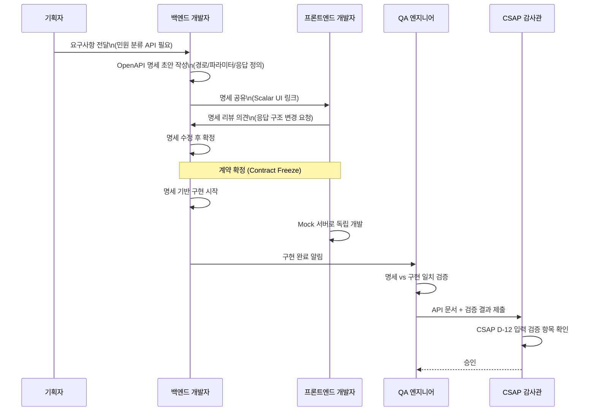

# 36. OpenAPI 3.1 문서화 완전 가이드

> **대상 독자**: 공공기관 SaaS 프레임워크에 처음 참여하는 백엔드 개발자
> **선수 지식**: Fastify 기초, TypeScript 기초
> **학습 시간**: 약 2시간
> **관련 요구사항**: FR-P10.1~FR-P10.6, CSAP D-12

---

## 목차

1. [OpenAPI란 무엇인가?](#1-openapi란-무엇인가)
2. [API 계약(Contract) 개념](#2-api-계약contract-개념)
3. [Fastify + @fastify/swagger 설정](#3-fastify--fastifyswagger-설정)
4. [실제 AI 서비스 API 문서화 패턴](#4-실제-ai-서비스-api-문서화-패턴)
5. [RBAC 보안 스키마 (bearerAuth)](#5-rbac-보안-스키마-bearerauth)
6. [에러 응답 표준화](#6-에러-응답-표준화)
7. [Scalar UI 설정](#7-scalar-ui-설정)
8. [타입 안전 클라이언트 SDK 생성](#8-타입-안전-클라이언트-sdk-생성)
9. [API 문서 버전 관리](#9-api-문서-버전-관리)
10. [CSAP D-12 문서 요건](#10-csap-d-12-문서-요건)
11. [실습: ai-service API 문서화 추가](#11-실습-ai-service-api-문서화-추가)

---

## 1. OpenAPI란 무엇인가?

### 1.1 초급자를 위한 설명

OpenAPI는 REST API를 기계가 읽을 수 있는 형식(JSON 또는 YAML)으로 정의하는 표준 명세입니다. 여러분이 새로운 카페에 가면 메뉴판을 보고 무엇을 주문할 수 있는지 알 수 있는 것처럼, OpenAPI 문서는 API의 "메뉴판" 역할을 합니다.

**왜 필요한가?**

공공기관 SaaS 프레임워크에서는 수십 개의 마이크로서비스가 서로 통신합니다. 각 서비스가 어떤 API를 제공하는지, 어떤 데이터를 주고받는지 명확히 정의하지 않으면 다음 문제가 발생합니다.

- 프론트엔드 개발자가 백엔드 API를 어떻게 호출해야 하는지 모릅니다.
- 서비스 간 통신에서 데이터 형식 불일치로 오류가 발생합니다.
- 감사(Audit) 시 API가 명세대로 구현되었는지 검증할 수 없습니다.
- CSAP D-12(시스템 개발 보안)에서 요구하는 입력 검증 증빙이 부족합니다.

### 1.2 OpenAPI 3.1 vs Swagger 2.0

많은 개발자가 "Swagger"라는 이름을 더 자주 들어봤을 것입니다. 역사적으로 보면 다음과 같습니다.

| 항목 | Swagger 2.0 | OpenAPI 3.0 | OpenAPI 3.1 |
|------|------------|-------------|-------------|
| 출시 연도 | 2014 | 2017 | 2021 |
| JSON Schema 호환 | 부분 호환 | 자체 방언 사용 | 완전 호환 |
| 컴포넌트 재사용 | 제한적 | 개선됨 | 완전 지원 |
| Webhook 지원 | 없음 | 없음 | 있음 |
| Nullable 표현 | `x-nullable` | `nullable: true` | `type: ["string", "null"]` |
| 권장 사용 여부 | 레거시 | 현재 주류 | 최신 표준 |

본 프레임워크는 **OpenAPI 3.1**을 사용합니다. 이는 JSON Schema Draft 2020-12와 완전히 호환되기 때문에 Zod, Ajv 등 TypeScript 생태계의 검증 라이브러리와 자연스럽게 통합됩니다.

### 1.3 문서화 파이프라인 개요

```mermaid
flowchart LR
    subgraph 개발자
        A[TypeScript 코드\nFastify 라우트]
        B[JSON Schema\n정의]
    end

    subgraph Fastify 런타임
        C[@fastify/swagger\n스키마 추출]
        D[OpenAPI 3.1\nJSON/YAML]
    end

    subgraph 소비자
        E[Scalar UI\n인터랙티브 테스트]
        F[openapi-typescript\n타입 생성]
        G[SDK 패키지\n배포]
        H[클라이언트 앱\n타입 안전 호출]
    end

    subgraph CI/CD
        I[스키마 변경\n감지]
        J[Breaking Change\n알림]
        K[CSAP D-12\n검증]
    end

    A --> B
    B --> C
    C --> D
    D --> E
    D --> F
    F --> G
    G --> H
    D --> I
    I --> J
    I --> K

    style A fill:#dbeafe
    style D fill:#dcfce7
    style G fill:#fef9c3
    style K fill:#fce7f3
```

---

## 2. API 계약(Contract) 개념

### 2.1 Contract-First vs Code-First

API 설계 방법론은 크게 두 가지입니다.

**Code-First (코드 우선)**
코드를 먼저 작성하고 나중에 문서를 자동으로 생성합니다. 빠르게 시작할 수 있지만 설계가 구현에 끌려다니는 위험이 있습니다.

**Contract-First (계약 우선)**
OpenAPI 명세를 먼저 작성하고 명세를 기반으로 코드를 생성합니다. 팀 간 협업에 유리하며 공공기관의 감리 요건을 충족하기 좋습니다.

본 프레임워크는 **Hybrid 접근법**을 채택합니다. Fastify의 JSON Schema를 소스 오브 트루스(Source of Truth)로 사용하여 코드와 문서가 항상 동기화되도록 합니다.

### 2.2 Contract-First 워크플로우



---

## 3. Fastify + @fastify/swagger 설정

### 3.1 패키지 설치

```bash
# 프로젝트 루트에서 실행
pnpm add @fastify/swagger @fastify/swagger-ui --filter @public-saas/ai-service

# Scalar UI (더 현대적인 UI)
pnpm add @scalar/fastify-api-reference --filter @public-saas/ai-service

# 타입 생성 도구 (devDependency)
pnpm add -D openapi-typescript --filter @public-saas/ai-service
```

### 3.2 Fastify 플러그인 등록

ai-service의 `src/app.ts`에서 Swagger 플러그인을 등록하는 방법입니다.

```typescript
// src/app.ts
// Design Ref: DESIGN-MTU-P10 §3 — API 문서화 설정
// Plan SC: FR-P10.1

import Fastify from 'fastify';
import swagger from '@fastify/swagger';
import scalarReference from '@scalar/fastify-api-reference';

export async function buildApp() {
  const app = Fastify({
    logger: true,
    // OpenAPI 스키마 검증 활성화 (CSAP D-12 입력 검증)
    ajv: {
      customOptions: {
        strict: 'log',
        keywords: ['kind', 'modifier'],
      },
    },
  });

  // OpenAPI 3.1 메타데이터 등록
  await app.register(swagger, {
    openapi: {
      openapi: '3.1.0',
      info: {
        title: '공공기관 SaaS AI 서비스 API',
        description: `
## 개요
공공기관 SaaS 프레임워크의 AI 기능을 제공하는 서비스입니다.

## 보안 요건 (CSAP D-08, D-12)
- 모든 요청은 내부 서비스 키 인증이 필요합니다.
- N2SF O등급 데이터만 AI API로 전송 가능합니다.
- PII(개인식별정보)는 자동으로 마스킹됩니다.

## Rate Limiting
| 엔드포인트 유형 | 분당 요청 수 |
|---------------|------------|
| 읽기 (GET) | 100 |
| 쓰기 (POST/PUT) | 20 |
| 채팅 | 10 |
| 에이전트 | 5 |
        `,
        version: '1.0.0',
        contact: {
          name: '공공 SaaS 개발팀',
          email: 'dev@public-saas.kr',
        },
        license: {
          name: '공공누리 제4유형',
          url: 'https://www.kogl.or.kr/info/licenseType4.do',
        },
      },
      // 서버 목록 (환경별)
      servers: [
        {
          url: 'http://ai-service.public-saas.svc.cluster.local:3000',
          description: '클러스터 내부 (k3s)',
        },
        {
          url: 'https://api.stg.public-saas.kr/ai',
          description: '스테이징 환경',
        },
      ],
      // 보안 스키마 정의
      components: {
        securitySchemes: {
          internalServiceKey: {
            type: 'apiKey',
            in: 'header',
            name: 'x-internal-service-key',
            description: '내부 서비스 인증 키 (CSAP D-08)',
          },
          bearerAuth: {
            type: 'http',
            scheme: 'bearer',
            bearerFormat: 'JWT',
            description: '사용자 JWT 토큰 (접근 15분, 갱신 7일)',
          },
        },
        // 공통 에러 응답 스키마
        schemas: {
          ErrorResponse: {
            type: 'object',
            required: ['success', 'error'],
            properties: {
              success: { type: 'boolean', example: false },
              error: {
                type: 'object',
                required: ['code', 'message'],
                properties: {
                  code: {
                    type: 'string',
                    description: '에러 코드',
                    example: 'UNAUTHORIZED',
                  },
                  message: {
                    type: 'string',
                    description: '사용자 친화적 에러 메시지',
                    example: '내부 서비스 인증 실패',
                  },
                  errorId: {
                    type: 'string',
                    format: 'uuid',
                    description: '디버깅용 에러 추적 ID',
                  },
                },
              },
            },
          },
        },
      },
      // 전역 보안 요건 적용
      security: [{ internalServiceKey: [] }],
      // 태그 정의 및 설명
      tags: [
        { name: 'ai', description: 'AI 모델 관리 및 채팅' },
        { name: 'rag', description: 'RAG 지식베이스 검색' },
        { name: 'agent', description: 'ReAct AI 에이전트' },
        { name: 'function-calling', description: 'Function Calling' },
        { name: 'document', description: '공공문서 분석' },
        { name: 'workflow', description: 'AI 멀티스텝 워크플로우' },
        { name: 'agent-ecosystem', description: '에이전트 마켓플레이스' },
        { name: 'public', description: '공공 AI 서비스' },
        { name: 'esg', description: 'ESG 탄소 추적' },
        { name: 'governance', description: 'AI 거버넌스' },
        { name: 'security', description: 'AI 보안 (이상 탐지, DLP)' },
        { name: 'data', description: '데이터 플랫폼 AI' },
      ],
    },
    // 명세 파일 경로 노출 (CI/CD에서 스키마 변경 감지용)
    exposeRoute: true,
  });

  // Scalar UI 등록 (Swagger UI 대체)
  await app.register(scalarReference, {
    routePrefix: '/docs',
    configuration: {
      title: '공공기관 SaaS AI 서비스',
      theme: 'default',
      // 테넌트 ID 헤더 기본값 설정
      defaultHttpClient: {
        targetKey: 'node',
        clientKey: 'axios',
      },
    },
  });

  return app;
}
```

### 3.3 JSON Schema에서 OpenAPI로 자동 변환되는 원리

Fastify는 라우트에 등록된 JSON Schema를 런타임에 OpenAPI 3.1 형식으로 자동 변환합니다. 이 변환 과정을 이해하면 더 정확한 문서를 작성할 수 있습니다.

```typescript
// Fastify 라우트 등록 시 JSON Schema 정의
app.post('/ai/chat', {
  schema: {
    // 이 JSON Schema가 OpenAPI 3.1 requestBody로 변환됨
    body: {
      type: 'object',
      required: ['modelId', 'tenantId', 'message', 'grade'],
      properties: {
        modelId: {
          type: 'string',
          description: '사용할 AI 모델 ID',
          example: 'llama-3.1-70b',
        },
        tenantId: {
          type: 'string',
          description: '테넌트 식별자 (멀티테넌시)',
          example: '550e8400-e29b-41d4-a716-446655440000',
        },
        message: {
          type: 'string',
          description: '사용자 입력 메시지',
          maxLength: 8192,
          example: '전자정부법 제36조의 내용을 요약해주세요.',
        },
        grade: {
          type: 'string',
          enum: ['O'],
          description: 'N2SF 데이터 등급 (O등급만 허용)',
        },
      },
    },
    // 이 JSON Schema가 OpenAPI 3.1 responses로 변환됨
    response: {
      200: {
        type: 'object',
        properties: {
          success: { type: 'boolean', example: true },
          data: {
            type: 'object',
            properties: {
              content: { type: 'string', description: 'AI 응답 내용' },
              model: { type: 'string', description: '사용된 모델 이름' },
              tokensUsed: { type: 'integer', description: '사용된 토큰 수' },
            },
          },
        },
      },
      403: { $ref: '#/components/schemas/ErrorResponse' },
      502: { $ref: '#/components/schemas/ErrorResponse' },
    },
  },
}, chatHandler);
```

**변환 규칙 요약**

| Fastify Schema 키 | OpenAPI 위치 |
|-------------------|-------------|
| `body` | `requestBody.content['application/json'].schema` |
| `querystring` | `parameters` (in: query) |
| `params` | `parameters` (in: path) |
| `headers` | `parameters` (in: header) |
| `response.200` | `responses.200.content['application/json'].schema` |
| `tags` | `tags` |
| `description` | `description` |
| `summary` | `summary` |

---

## 4. 실제 AI 서비스 API 문서화 패턴

### 4.1 현재 ai-service routes.ts 분석

`/data/ai-saas/platform/services/ai-service/src/routes.ts`를 보면 이미 기본적인 OpenAPI 스키마가 적용되어 있습니다. 각 라우트의 `schema` 객체가 OpenAPI 문서로 변환됩니다.

예를 들어 RAG 문서 수집 엔드포인트를 살펴보겠습니다.

```typescript
// 현재 routes.ts의 RAG Ingest 엔드포인트
app.post(
  '/ai/rag/ingest',
  {
    schema: {
      description: 'RAG 지식베이스 문서 수집 (청킹 + 임베딩 + 벡터 저장)',
      tags: ['ai', 'rag'],
      body: {
        type: 'object' as const,
        required: ['tenantId', 'grade', 'title', 'content'] as const,
        properties: {
          tenantId: { type: 'string' as const, format: 'uuid' },
          grade: { type: 'string' as const, enum: ['O'] },
          title: { type: 'string' as const, maxLength: 200 },
          content: { type: 'string' as const, maxLength: 500000 },
          sourceUrl: { type: 'string' as const, format: 'uri' },
          embedModelId: { type: 'string' as const },
        },
      },
      response: {
        200: modelResponse,
        403: errorResponse,
        500: errorResponse,
      },
    },
    preHandler: ragLimiter,
  },
  ragIngestHandler as never,
);
```

이 스키마를 **완전한 OpenAPI 품질**로 개선하려면 다음 요소를 추가해야 합니다.

```typescript
// 개선된 RAG Ingest 엔드포인트 스키마
app.post(
  '/ai/rag/ingest',
  {
    schema: {
      // 제목과 설명 분리
      summary: 'RAG 문서 수집',
      description: `
RAG(Retrieval-Augmented Generation) 지식베이스에 문서를 수집합니다.

**처리 과정**:
1. 문서를 512 토큰 단위로 청킹
2. 각 청크에 임베딩 벡터 생성
3. PostgreSQL JSON 컬럼에 벡터 저장

**N2SF 보안**: O등급 데이터만 처리. C/S등급 데이터 입력 시 즉시 거부.

**성능**: 500KB 문서 기준 약 30초 소요 (임베딩 모델 성능에 따라 변동)
      `,
      tags: ['rag'],
      // 운영 ID (API 클라이언트 SDK에서 함수명으로 사용됨)
      operationId: 'ragIngestDocument',
      body: {
        type: 'object',
        required: ['tenantId', 'grade', 'title', 'content'],
        properties: {
          tenantId: {
            type: 'string',
            format: 'uuid',
            description: '테넌트 식별자. 멀티테넌시 격리에 사용됩니다.',
            example: '550e8400-e29b-41d4-a716-446655440000',
          },
          grade: {
            type: 'string',
            enum: ['O'],
            description: 'N2SF 데이터 등급. O(공개)등급만 허용됩니다.',
            example: 'O',
          },
          title: {
            type: 'string',
            maxLength: 200,
            minLength: 1,
            description: '문서 제목',
            example: '전자정부법 시행령 2025년 개정본',
          },
          content: {
            type: 'string',
            maxLength: 500000,
            minLength: 10,
            description: '문서 본문 텍스트 (최대 500KB)',
          },
          sourceUrl: {
            type: 'string',
            format: 'uri',
            description: '원본 문서 URL (선택사항)',
            example: 'https://www.law.go.kr/법령/전자정부법',
          },
          embedModelId: {
            type: 'string',
            description: '사용할 임베딩 모델 ID (미지정 시 기본 모델 사용)',
            example: 'nomic-embed-text-v1.5',
          },
        },
        // 추가 필드 금지 (엄격한 입력 검증 — CSAP D-12)
        additionalProperties: false,
      },
      response: {
        200: {
          description: '문서 수집 성공',
          type: 'object',
          properties: {
            success: { type: 'boolean', example: true },
            data: {
              type: 'object',
              properties: {
                documentId: {
                  type: 'string',
                  format: 'uuid',
                  description: '생성된 문서 ID',
                },
                chunkCount: {
                  type: 'integer',
                  description: '생성된 청크 수',
                  example: 42,
                },
                totalTokens: {
                  type: 'integer',
                  description: '전체 토큰 수',
                  example: 18432,
                },
                embedModel: {
                  type: 'string',
                  description: '사용된 임베딩 모델',
                  example: 'nomic-embed-text-v1.5',
                },
              },
            },
          },
        },
        403: {
          description: 'N2SF 등급 위반 (C/S등급 데이터 거부)',
          $ref: '#/components/schemas/ErrorResponse',
        },
        429: {
          description: 'Rate Limit 초과 (분당 20회)',
          $ref: '#/components/schemas/ErrorResponse',
        },
        500: {
          description: '서버 내부 오류',
          $ref: '#/components/schemas/ErrorResponse',
        },
      },
    },
    preHandler: ragLimiter,
  },
  ragIngestHandler as never,
);
```

### 4.2 쿼리 파라미터 문서화

GET 엔드포인트에서 쿼리 파라미터를 문서화하는 방법입니다.

```typescript
// 사용량 추이 조회 엔드포인트 개선 예시
app.get('/ai/analytics/trend', {
  schema: {
    summary: '일별 AI 사용량 추이 조회',
    description: '지정된 기간의 일별 AI 사용량 통계를 반환합니다.',
    tags: ['ai'],
    operationId: 'getAiUsageTrend',
    querystring: {
      type: 'object',
      properties: {
        days: {
          type: 'integer',
          minimum: 1,
          maximum: 365,
          default: 30,
          description: '조회 기간 (일수)',
          example: 30,
        },
        tenantId: {
          type: 'string',
          format: 'uuid',
          description: '특정 테넌트 필터링 (미지정 시 전체)',
        },
        modelId: {
          type: 'string',
          description: '특정 모델 필터링 (미지정 시 전체)',
        },
        granularity: {
          type: 'string',
          enum: ['hour', 'day', 'week'],
          default: 'day',
          description: '집계 단위',
        },
      },
      // 쿼리 파라미터는 additionalProperties 허용 (호환성)
      additionalProperties: false,
    },
    response: {
      200: {
        description: '사용량 추이 데이터',
        type: 'object',
        properties: {
          success: { type: 'boolean' },
          data: {
            type: 'object',
            properties: {
              period: {
                type: 'object',
                properties: {
                  from: { type: 'string', format: 'date' },
                  to: { type: 'string', format: 'date' },
                },
              },
              trend: {
                type: 'array',
                items: {
                  type: 'object',
                  properties: {
                    date: { type: 'string', format: 'date' },
                    requests: { type: 'integer' },
                    tokensUsed: { type: 'integer' },
                    cost: { type: 'number', description: '비용 (원)' },
                  },
                },
              },
              summary: {
                type: 'object',
                properties: {
                  totalRequests: { type: 'integer' },
                  totalTokens: { type: 'integer' },
                  totalCost: { type: 'number' },
                  avgResponseTime: { type: 'number', description: '평균 응답시간 (ms)' },
                },
              },
            },
          },
        },
      },
    },
  },
  preHandler: readLimiter,
}, aiUsageTrendHandler);
```

### 4.3 경로 파라미터 문서화

에이전트 감사 추적 조회처럼 경로에 ID가 포함된 경우를 문서화합니다.

```typescript
// 에이전트 감사 추적 조회 — 경로 파라미터 문서화
app.get('/ai/agents/:id/audit-trail', {
  schema: {
    summary: '에이전트 감사 추적 조회',
    description: `
AI 에이전트의 모든 실행 기록을 반환합니다.

**CSAP D-06 준수**: 감사 로그는 append-only로 저장되며 수정/삭제 불가합니다.
최소 1년 보존 정책이 적용됩니다.
    `,
    tags: ['agent-ecosystem'],
    operationId: 'getAgentAuditTrail',
    params: {
      type: 'object',
      required: ['id'],
      properties: {
        id: {
          type: 'string',
          format: 'uuid',
          description: '에이전트 ID',
          example: '123e4567-e89b-12d3-a456-426614174000',
        },
      },
    },
    querystring: {
      type: 'object',
      properties: {
        from: {
          type: 'string',
          format: 'date-time',
          description: '조회 시작 시각 (ISO 8601)',
        },
        to: {
          type: 'string',
          format: 'date-time',
          description: '조회 종료 시각 (ISO 8601)',
        },
        limit: {
          type: 'integer',
          minimum: 1,
          maximum: 1000,
          default: 100,
          description: '반환할 최대 레코드 수',
        },
      },
    },
  },
}, agentAuditTrailHandler);
```

---

## 5. RBAC 보안 스키마 (bearerAuth)

### 5.1 보안 스키마 개념

공공기관 SaaS에서는 두 가지 인증 레이어가 있습니다.

1. **내부 서비스 키 인증**: 서비스 간 통신 (API 게이트웨이 우회 차단)
2. **사용자 JWT 인증**: 최종 사용자 요청

이를 OpenAPI에서 표현하는 방법입니다.

```typescript
// OpenAPI 보안 스키마 정의 (app.ts의 swagger 플러그인 등록 시)
components: {
  securitySchemes: {
    // 내부 서비스 키 (서비스 간 통신)
    internalServiceKey: {
      type: 'apiKey',
      in: 'header',
      name: 'x-internal-service-key',
      description: `
내부 서비스 인증 키입니다. API 게이트웨이를 거치지 않는
서비스 간 직접 통신에 사용됩니다.

환경 변수 INTERNAL_SERVICE_KEY에서 값을 읽습니다.
프로덕션 환경에서는 반드시 설정되어야 합니다.
      `,
    },
    // 사용자 JWT 토큰
    bearerAuth: {
      type: 'http',
      scheme: 'bearer',
      bearerFormat: 'JWT',
      description: `
사용자 JWT 토큰입니다.

**토큰 구조**:
- 접근 토큰: 유효 기간 15분
- 갱신 토큰: 유효 기간 7일

**페이로드 예시**:
\`\`\`json
{
  "sub": "user-id",
  "tenantId": "tenant-id",
  "roles": ["admin", "ai-user"],
  "exp": 1672531200,
  "iat": 1672530300
}
\`\`\`
      `,
    },
    // 테넌트 헤더 (멀티테넌시)
    tenantHeader: {
      type: 'apiKey',
      in: 'header',
      name: 'x-tenant-id',
      description: '멀티테넌시 격리용 테넌트 ID',
    },
  },
}
```

### 5.2 엔드포인트별 보안 요건 지정

특정 엔드포인트에만 추가 보안 요건을 지정할 수 있습니다.

```typescript
// 관리자 전용 엔드포인트 — 추가 RBAC 명시
app.post('/ai/models', {
  schema: {
    summary: 'AI 모델 등록',
    tags: ['ai'],
    // 이 엔드포인트는 전역 internalServiceKey 외에 bearerAuth도 필요
    security: [
      { internalServiceKey: [], bearerAuth: [] },
    ],
    // x-rbac: OpenAPI 확장 필드로 RBAC 요건 명시 (감리용)
    'x-rbac': {
      requiredRoles: ['admin', 'ai-manager'],
      csapRef: 'D-08-06',
    },
    body: {
      type: 'object',
      required: ['name', 'provider', 'endpoint'],
      properties: {
        name: { type: 'string', description: '모델 이름' },
        provider: {
          type: 'string',
          enum: ['lmstudio', 'openai', 'ollama', 'vllm'],
          description: 'LLM 제공자',
        },
        endpoint: {
          type: 'string',
          format: 'uri',
          description: 'LLM 서버 엔드포인트',
        },
        maxGrade: {
          type: 'string',
          enum: ['O'],
          description: '처리 가능한 최대 N2SF 등급',
        },
      },
    },
  },
}, createModelHandler);
```

---

## 6. 에러 응답 표준화

### 6.1 공통 에러 응답 스키마

프레임워크 전체에서 일관된 에러 형식을 사용합니다. CSAP D-12는 에러 메시지에 민감 정보를 포함하지 않도록 요구합니다.

```typescript
// 공통 에러 응답 타입 (TypeScript)
interface ApiError {
  success: false;
  error: {
    code: string;       // 에러 코드 (예: 'UNAUTHORIZED', 'RATE_LIMIT_EXCEEDED')
    message: string;    // 사용자 친화적 메시지 (민감 정보 미포함)
    errorId?: string;   // 디버깅용 UUID (로그 추적에 사용)
    // 절대 포함 금지: stack trace, DB 에러, 환경 변수
  };
}

// HTTP 상태코드별 에러 코드 매핑
const ERROR_CODES = {
  400: 'BAD_REQUEST',          // 입력 검증 실패
  401: 'UNAUTHORIZED',         // 인증 실패
  403: 'FORBIDDEN',            // 권한 없음 (RBAC) 또는 N2SF 등급 위반
  404: 'NOT_FOUND',            // 리소스 없음
  409: 'CONFLICT',             // 중복 리소스
  422: 'UNPROCESSABLE',        // 비즈니스 규칙 위반
  429: 'RATE_LIMIT_EXCEEDED',  // Rate Limit 초과
  500: 'INTERNAL_ERROR',       // 서버 내부 오류 (상세 내용 숨김)
  502: 'UPSTREAM_ERROR',       // 외부 서비스 오류 (LLM 서버 등)
  503: 'SERVICE_UNAVAILABLE',  // 서비스 불가용
} as const;
```

### 6.2 공통 응답 스키마 재사용 ($ref)

`routes.ts`에서 이미 사용 중인 `errorResponse` 패턴을 개선합니다.

```typescript
// 개선된 공통 스키마 정의
const COMMON_SCHEMAS = {
  // 성공 응답 (단일 객체)
  successObject: {
    type: 'object' as const,
    required: ['success', 'data'],
    properties: {
      success: { type: 'boolean' as const, example: true },
      data: { type: 'object' as const },
    },
  },
  // 성공 응답 (배열)
  successList: {
    type: 'object' as const,
    required: ['success', 'data', 'total'],
    properties: {
      success: { type: 'boolean' as const, example: true },
      data: { type: 'array' as const, items: { type: 'object' as const } },
      total: { type: 'integer' as const, description: '전체 항목 수' },
      page: { type: 'integer' as const, description: '현재 페이지' },
      limit: { type: 'integer' as const, description: '페이지 크기' },
    },
  },
  // 에러 응답
  errorResponse: {
    type: 'object' as const,
    required: ['success', 'error'],
    properties: {
      success: { type: 'boolean' as const, example: false },
      error: {
        type: 'object' as const,
        required: ['code', 'message'],
        properties: {
          code: { type: 'string' as const },
          message: { type: 'string' as const },
          errorId: { type: 'string' as const, format: 'uuid' },
        },
      },
    },
  },
} as const;
```

---

## 7. Scalar UI 설정

### 7.1 Scalar UI란?

Scalar UI는 Swagger UI의 현대적인 대안으로, 더 나은 사용자 경험을 제공합니다.

| 기능 | Swagger UI | Scalar UI |
|------|-----------|-----------|
| 디자인 | 레거시 | 현대적 |
| 다크 모드 | 없음 | 있음 |
| 코드 예시 생성 | 제한적 | 다양한 언어 지원 |
| API 테스트 | 기본 | 고급 (환경 변수, 사전 요청) |
| 모바일 지원 | 없음 | 있음 |
| 로딩 속도 | 느림 | 빠름 |

### 7.2 테넌트 헤더 기본값 설정

공공기관 SaaS는 멀티테넌트 환경이므로 Scalar UI에서 테넌트 ID를 쉽게 설정할 수 있어야 합니다.

```typescript
// app.ts — Scalar UI 고급 설정
await app.register(scalarReference, {
  routePrefix: '/docs',
  configuration: {
    title: '공공기관 SaaS AI 서비스 API',
    theme: 'default',
    // 환경 설정 (개발자가 Scalar UI에서 전환 가능)
    servers: [
      {
        url: 'http://localhost:3000',
        description: '로컬 개발',
      },
      {
        url: 'https://api.stg.public-saas.kr/ai',
        description: '스테이징',
      },
    ],
    // 기본 헤더 (공통 인증 정보)
    defaultHttpClient: {
      targetKey: 'node',
      clientKey: 'axios',
    },
    // API 클라이언트 커스터마이징 (헤더 기본값)
    // 개발자가 처음 접속했을 때 이 값으로 초기화됨
    hiddenClients: false,
    // 인증 설정 예시를 미리 채워둠
    authentication: {
      preferredSecurityScheme: 'internalServiceKey',
      apiKey: {
        token: 'dev-internal-key-for-local-only',
      },
    },
  },
});

// 문서 접근에 IP 제한 적용 (프로덕션 환경)
if (process.env['NODE_ENV'] === 'production') {
  app.addHook('onRequest', async (request, reply) => {
    if (request.url.startsWith('/docs')) {
      const clientIp = request.ip;
      const allowedCidrs = (process.env['DOCS_ALLOWED_CIDRS'] || '').split(',');
      if (!isIpAllowed(clientIp, allowedCidrs)) {
        await reply.status(403).send({ error: 'API 문서 접근 제한' });
      }
    }
  });
}
```

### 7.3 Scalar UI에서 RAG API 테스트하기

Scalar UI 접속 후 다음 순서로 테스트합니다.

**1단계: 인증 설정**
우측 상단 "Authenticate" 버튼 클릭 → `x-internal-service-key` 헤더에 개발용 키 입력

**2단계: 문서 수집 테스트 (`POST /ai/rag/ingest`)**
```json
{
  "tenantId": "550e8400-e29b-41d4-a716-446655440000",
  "grade": "O",
  "title": "전자정부법 시행령",
  "content": "제1조(목적) 이 영은 「전자정부법」에서 위임된 사항과...",
  "sourceUrl": "https://www.law.go.kr"
}
```

**3단계: 질의 테스트 (`POST /ai/rag/query`)**
```json
{
  "tenantId": "550e8400-e29b-41d4-a716-446655440000",
  "grade": "O",
  "question": "전자정부법 시행령 제1조의 목적은 무엇인가요?",
  "topK": 5,
  "minScore": 0.25
}
```

---

## 8. 타입 안전 클라이언트 SDK 생성

### 8.1 openapi-typescript로 타입 생성

OpenAPI 명세에서 TypeScript 타입을 자동으로 생성합니다.

```bash
# OpenAPI JSON 파일 가져오기
curl http://localhost:3000/documentation/json -o openapi.json

# TypeScript 타입 생성
npx openapi-typescript openapi.json -o src/types/ai-service.ts

# 또는 URL에서 직접 생성
npx openapi-typescript http://localhost:3000/documentation/json \
  -o packages/ai-sdk/src/types.ts
```

생성된 타입 파일 예시:

```typescript
// packages/ai-sdk/src/types.ts (자동 생성됨)
export interface paths {
  '/ai/rag/ingest': {
    post: {
      requestBody: {
        content: {
          'application/json': {
            tenantId: string;    // format: uuid
            grade: 'O';
            title: string;      // maxLength: 200
            content: string;    // maxLength: 500000
            sourceUrl?: string; // format: uri
            embedModelId?: string;
          };
        };
      };
      responses: {
        200: {
          content: {
            'application/json': {
              success: boolean;
              data: {
                documentId: string;
                chunkCount: number;
                totalTokens: number;
                embedModel: string;
              };
            };
          };
        };
        403: components['schemas']['ErrorResponse'];
      };
    };
  };
  // ... 다른 엔드포인트
}
```

### 8.2 타입 안전 API 클라이언트 작성

```typescript
// packages/ai-sdk/src/client.ts
import createClient from 'openapi-fetch';
import type { paths } from './types.js';

// 타입 안전 클라이언트 생성
export function createAiServiceClient(baseUrl: string, apiKey: string) {
  const client = createClient<paths>({
    baseUrl,
    headers: {
      'x-internal-service-key': apiKey,
      'Content-Type': 'application/json',
    },
  });

  return {
    // RAG 문서 수집 — 완전한 타입 안전성
    async ingestDocument(params: {
      tenantId: string;
      title: string;
      content: string;
      grade: 'O';
      sourceUrl?: string;
    }) {
      const { data, error } = await client.POST('/ai/rag/ingest', {
        body: params,
      });

      if (error) {
        throw new Error(`RAG 수집 실패: ${error.error?.message}`);
      }

      return data.data;
    },

    // RAG 질의 — 타입이 보장된 응답
    async queryKnowledge(params: {
      tenantId: string;
      question: string;
      grade: 'O';
      topK?: number;
      minScore?: number;
    }) {
      const { data, error } = await client.POST('/ai/rag/query', {
        body: params,
      });

      if (error) {
        throw new Error(`RAG 질의 실패: ${error.error?.message}`);
      }

      return data.data;
    },

    // 채팅 — 스트리밍 지원
    async chat(params: {
      modelId: string;
      tenantId: string;
      message: string;
      grade: 'O';
    }) {
      const { data, error } = await client.POST('/ai/chat', {
        body: params,
      });

      if (error) {
        if (error.error?.code === 'FORBIDDEN') {
          throw new Error('N2SF 등급 위반: C/S등급 데이터는 AI API로 전송 불가');
        }
        throw new Error(`채팅 실패: ${error.error?.message}`);
      }

      return data.data;
    },
  };
}

// 사용 예시
const aiClient = createAiServiceClient(
  'http://ai-service:3000',
  process.env['INTERNAL_SERVICE_KEY']!,
);

// 타입 에러가 컴파일 타임에 감지됨
const result = await aiClient.ingestDocument({
  tenantId: '550e8400-e29b-41d4-a716-446655440000',
  title: '전자정부법',
  content: '...',
  grade: 'O',
  // grade: 'C'  // 컴파일 에러: 'C'는 'O'에 할당 불가
});
```

### 8.3 SDK 패키지 배포 절차

```bash
# packages/ai-sdk/package.json
{
  "name": "@public-saas/ai-sdk",
  "version": "1.0.0",
  "description": "공공기관 SaaS AI 서비스 클라이언트 SDK",
  "main": "dist/index.js",
  "types": "dist/index.d.ts",
  "scripts": {
    "generate-types": "openapi-typescript http://ai-service:3000/documentation/json -o src/types.ts",
    "build": "tsc",
    "prepublish": "pnpm generate-types && pnpm build"
  }
}
```

CI/CD 파이프라인에서 스키마 변경 시 자동 타입 갱신:

```yaml
# .gitea/workflows/sdk-update.yml
name: SDK 타입 자동 갱신
on:
  push:
    paths:
      - 'platform/services/ai-service/src/routes.ts'

jobs:
  update-sdk:
    runs-on: ubuntu-latest
    steps:
      - uses: actions/checkout@v4
      - name: AI 서비스 타입 생성
        run: |
          curl http://ai-service.stg:3000/documentation/json > /tmp/openapi.json
          npx openapi-typescript /tmp/openapi.json -o packages/ai-sdk/src/types.ts
      - name: 변경사항 커밋
        run: |
          git add packages/ai-sdk/src/types.ts
          git commit -m "chore(sdk): AI 서비스 OpenAPI 타입 자동 갱신" || echo "변경 없음"
          git push
```

---

## 9. API 문서 버전 관리

### 9.1 Breaking vs Non-breaking 변경 분류

API를 변경할 때 클라이언트를 깨뜨리는지 여부를 판단해야 합니다.

**Non-breaking (하위 호환) 변경**
- 새 선택적(optional) 필드 추가
- 응답에 새 필드 추가
- 새 엔드포인트 추가
- 에러 메시지 텍스트 변경
- 문서/설명 개선

**Breaking 변경 (주의 필요)**
- 필수 파라미터 추가
- 기존 필드 이름 변경
- 필드 타입 변경 (예: `string` → `integer`)
- 기존 엔드포인트 경로 변경
- `enum` 값 제거
- 기존 응답 구조 변경

### 9.2 Deprecation 마킹

기존 API를 제거하기 전에 반드시 Deprecation 기간을 줍니다.

```typescript
// 더 이상 사용하지 않는 엔드포인트 마킹
app.post('/ai/chat/legacy', {
  schema: {
    summary: '[Deprecated] 구형 채팅 API',
    description: `
**이 엔드포인트는 2026-07-01에 제거됩니다.**

대신 \`POST /ai/chat\`을 사용하세요.

**마이그레이션 가이드**:
- \`model\` 필드 → \`modelId\` 필드로 변경
- \`text\` 필드 → \`message\` 필드로 변경
- \`dataClass\` 필드 → \`grade\` 필드로 변경
    `,
    tags: ['ai'],
    // Deprecated 표시
    deprecated: true,
    // 커스텀 확장으로 제거 예정일 명시
    'x-deprecated-on': '2026-04-01',
    'x-removed-on': '2026-07-01',
    'x-replacement': 'POST /ai/chat',
  },
}, legacyChatHandler);
```

### 9.3 API 버전 전략

본 프레임워크는 URL 버전 관리를 사용합니다.

```
# v1 (현재)
POST /ai/v1/chat
GET  /ai/v1/models

# v2 (출시 시 병행 운영)
POST /ai/v2/chat     ← Breaking 변경 시 새 버전으로
GET  /ai/v2/models

# v1 서비스 종료 일정: v2 출시 후 6개월
```

```typescript
// 버전별 라우트 등록
export async function registerV1Routes(app: FastifyInstance): Promise<void> {
  // 기존 라우트 (하위 호환 유지)
  app.post('/ai/v1/chat', { schema: { deprecated: false } }, chatV1Handler);
}

export async function registerV2Routes(app: FastifyInstance): Promise<void> {
  // 새 버전 라우트
  app.post('/ai/v2/chat', {
    schema: {
      summary: 'AI 채팅 v2',
      description: 'v1 대비 변경사항: 멀티턴 대화 이력 지원',
    },
  }, chatV2Handler);
}
```

---

## 10. CSAP D-12 문서 요건

### 10.1 D-12 항목 중 API 문서 관련 요건

CSAP D-12(시스템 개발 보안)에는 API 문서화와 직접 관련된 항목들이 있습니다.

| CSAP 항목 | 요건 | OpenAPI 적용 방법 |
|----------|------|----------------|
| D-12-01 | 입력 데이터 유효성 검증 | `required`, `minLength`, `maxLength`, `pattern`, `enum` 필드 명시 |
| D-12-02 | 출력 데이터 검증 | 응답 스키마 완전 정의 |
| D-12-03 | 인증/권한 통제 | `security` 스키마 정의, `x-rbac` 확장 필드 |
| D-12-04 | 에러 처리 (민감 정보 미포함) | 에러 응답 표준화, stack trace 미포함 |
| D-12-05 | 암호화 통신 | `servers` 배열에 HTTPS URL만 포함 |
| D-12-06 | API 로깅 | `x-audit-level` 확장 필드로 감사 수준 명시 |

### 10.2 감리를 위한 OpenAPI 추가 메타데이터

```typescript
// 감사 필요 엔드포인트에 메타데이터 추가
app.post('/ai/agent/advanced', {
  schema: {
    summary: 'Advanced AI 에이전트 실행',
    tags: ['agent'],
    // 감리 메타데이터 (OpenAPI 확장 필드)
    'x-csap-controls': ['D-08-06', 'D-12-01'],  // 적용된 CSAP 통제
    'x-audit-level': 'high',                     // 감사 수준 (low/medium/high)
    'x-n2sf-grade-limit': 'O',                   // 허용 최대 데이터 등급
    'x-rate-limit': {
      requests: 5,
      window: '1m',
      rationale: '에이전트는 LLM 다중 호출로 비용이 높아 제한',
    },
    body: {
      type: 'object',
      required: ['tenantId', 'grade', 'query'],
      // additionalProperties: false 로 알 수 없는 필드 차단
      additionalProperties: false,
      properties: {
        tenantId: {
          type: 'string',
          format: 'uuid',
          description: '테넌트 ID — 멀티테넌시 격리 키',
        },
        grade: {
          type: 'string',
          enum: ['O'],
          description: 'N2SF 데이터 등급 — 반드시 O등급 명시',
        },
        query: {
          type: 'string',
          maxLength: 4000,
          minLength: 1,
          description: '에이전트 작업 지시',
        },
        // 선택 파라미터
        mode: {
          type: 'string',
          enum: ['react', 'plan-execute', 'orchestrate'],
          default: 'react',
        },
        maxIterations: {
          type: 'integer',
          minimum: 1,
          maximum: 10,
          default: 10,
          description: '최대 반복 횟수 (무한 루프 방지)',
        },
      },
    },
  },
}, advancedAgentHandler);
```

### 10.3 API 문서 자동 검증 스크립트

```typescript
// scripts/validate-openapi.ts
// CI/CD에서 실행하여 CSAP D-12 요건 자동 검증

import SwaggerParser from '@apidevtools/swagger-parser';
import type { OpenAPI } from 'openapi-types';

interface ValidationIssue {
  path: string;
  severity: 'error' | 'warning';
  message: string;
  csapRef?: string;
}

async function validateOpenApiForCsap(specPath: string): Promise<void> {
  const spec = await SwaggerParser.validate(specPath) as OpenAPI.Document;
  const issues: ValidationIssue[] = [];

  // OpenAPI 3.x 구조 확인
  if (!('paths' in spec) || !spec.paths) {
    console.error('유효한 OpenAPI 3.x 명세가 아닙니다.');
    process.exit(1);
  }

  const paths = spec.paths;

  for (const [path, pathItem] of Object.entries(paths)) {
    if (!pathItem) continue;
    for (const method of ['get', 'post', 'put', 'delete', 'patch'] as const) {
      const operation = pathItem[method];
      if (!operation) continue;

      // D-12-01: 요청 본문 스키마 완전성 검사
      if (['post', 'put', 'patch'].includes(method)) {
        if (!operation.requestBody) {
          issues.push({
            path: `${method.toUpperCase()} ${path}`,
            severity: 'error',
            message: '요청 본문 스키마가 없습니다. CSAP D-12-01 위반.',
            csapRef: 'D-12-01',
          });
        }
      }

      // D-08: 보안 스키마 검사
      if (!operation.security && !spec.security) {
        issues.push({
          path: `${method.toUpperCase()} ${path}`,
          severity: 'error',
          message: '보안 스키마가 없습니다. CSAP D-08 위반.',
          csapRef: 'D-08',
        });
      }

      // D-12-02: 응답 스키마 검사
      if (!operation.responses?.['200']) {
        issues.push({
          path: `${method.toUpperCase()} ${path}`,
          severity: 'warning',
          message: '200 응답 스키마가 없습니다.',
        });
      }

      // 에러 응답 스키마 검사
      if (!operation.responses?.['403'] && !operation.responses?.['401']) {
        issues.push({
          path: `${method.toUpperCase()} ${path}`,
          severity: 'warning',
          message: '인증/권한 에러 응답 스키마가 없습니다.',
        });
      }
    }
  }

  // 결과 출력
  const errors = issues.filter(i => i.severity === 'error');
  const warnings = issues.filter(i => i.severity === 'warning');

  console.log(`OpenAPI CSAP D-12 검증 완료: 에러 ${errors.length}개, 경고 ${warnings.length}개`);

  for (const issue of issues) {
    const icon = issue.severity === 'error' ? '[오류]' : '[경고]';
    const csap = issue.csapRef ? ` [${issue.csapRef}]` : '';
    console.log(`${icon}${csap} ${issue.path}: ${issue.message}`);
  }

  if (errors.length > 0) {
    process.exit(1);
  }
}

validateOpenApiForCsap('./openapi.json').catch(console.error);
```

---

## 11. 실습: ai-service API 문서화 추가

### 11.1 실습 목표

현재 `routes.ts`의 `/ai/public/citizen/classify` 엔드포인트에 완전한 OpenAPI 문서를 추가합니다. 이 엔드포인트는 민원을 자동으로 분류하는 공공 AI API입니다.

### 11.2 현재 상태 확인

```typescript
// 현재 routes.ts의 상태
app.post(
  '/ai/public/citizen/classify',
  {
    schema: {
      description: '민원 자동 분류 (PII 마스킹)',
      tags: ['ai', 'public'],
      response: { 200: modelResponse, 403: errorResponse },
    },
    preHandler: chatLimiter,
  },
  citizenClassifyHandler as never,
);
```

### 11.3 개선된 버전 작성

```typescript
// 개선된 민원 분류 엔드포인트
app.post(
  '/ai/public/citizen/classify',
  {
    schema: {
      summary: '민원 자동 분류',
      description: `
시민이 제출한 민원 텍스트를 AI로 자동 분류합니다.

**처리 과정**:
1. PII(주민등록번호, 전화번호, 이메일 등) 자동 마스킹
2. AI 모델로 민원 유형 분류
3. 담당 부서 및 처리 기한 추천

**분류 카테고리**:
- \`WELFARE\`: 복지/사회보장
- \`INFRASTRUCTURE\`: 도로/교통/시설
- \`ENVIRONMENT\`: 환경/위생
- \`EDUCATION\`: 교육/문화
- \`TAXATION\`: 세금/재정
- \`CIVIL_AFFAIRS\`: 행정민원
- \`OTHER\`: 기타

**N2SF 보안**: 민원 텍스트는 O등급 처리. PII는 전송 전 마스킹.
      `,
      tags: ['public'],
      operationId: 'classifyCitizenRequest',
      // 감리용 메타데이터
      'x-csap-controls': ['D-08-06', 'D-12-01', 'D-12-04'],
      'x-audit-level': 'high',
      'x-n2sf-grade-limit': 'O',
      body: {
        type: 'object',
        required: ['tenantId', 'grade', 'content'],
        additionalProperties: false,
        properties: {
          tenantId: {
            type: 'string',
            format: 'uuid',
            description: '처리 기관 테넌트 ID',
            example: '550e8400-e29b-41d4-a716-446655440000',
          },
          grade: {
            type: 'string',
            enum: ['O'],
            description: 'N2SF 등급 (O등급 필수)',
          },
          content: {
            type: 'string',
            minLength: 10,
            maxLength: 5000,
            description: '민원 내용 텍스트 (PII 자동 마스킹됨)',
            example: '저희 동네 인도에 파손된 곳이 있어 위험합니다.',
          },
          metadata: {
            type: 'object',
            description: '추가 컨텍스트 (민원 채널, 접수 경로 등)',
            properties: {
              channel: {
                type: 'string',
                enum: ['web', 'mobile', 'kiosk', 'phone'],
                description: '민원 접수 채널',
              },
              region: {
                type: 'string',
                maxLength: 50,
                description: '지역 정보 (시/군/구)',
              },
            },
          },
          modelId: {
            type: 'string',
            description: '사용할 AI 모델 ID (미지정 시 기본 모델)',
          },
        },
      },
      response: {
        200: {
          description: '민원 분류 성공',
          type: 'object',
          properties: {
            success: { type: 'boolean', example: true },
            data: {
              type: 'object',
              properties: {
                category: {
                  type: 'string',
                  enum: ['WELFARE', 'INFRASTRUCTURE', 'ENVIRONMENT',
                          'EDUCATION', 'TAXATION', 'CIVIL_AFFAIRS', 'OTHER'],
                  description: '분류된 민원 유형',
                  example: 'INFRASTRUCTURE',
                },
                confidence: {
                  type: 'number',
                  minimum: 0,
                  maximum: 1,
                  description: '분류 신뢰도 (0~1)',
                  example: 0.94,
                },
                department: {
                  type: 'string',
                  description: '담당 부서 추천',
                  example: '도로교통과',
                },
                estimatedProcessingDays: {
                  type: 'integer',
                  description: '예상 처리 기간 (영업일)',
                  example: 7,
                },
                maskedContent: {
                  type: 'string',
                  description: 'PII 마스킹된 민원 내용',
                },
                model: {
                  type: 'string',
                  description: '사용된 AI 모델',
                },
              },
            },
          },
        },
        400: {
          description: '입력 검증 실패',
          type: 'object',
          properties: {
            success: { type: 'boolean', example: false },
            error: {
              type: 'object',
              properties: {
                code: { type: 'string', example: 'BAD_REQUEST' },
                message: { type: 'string' },
                errorId: { type: 'string', format: 'uuid' },
              },
            },
          },
        },
        403: {
          description: 'N2SF 등급 위반',
          type: 'object',
          properties: {
            success: { type: 'boolean', example: false },
            error: {
              type: 'object',
              properties: {
                code: { type: 'string', example: 'FORBIDDEN' },
                message: { type: 'string' },
              },
            },
          },
        },
        429: {
          description: 'Rate Limit 초과 (분당 10회)',
          type: 'object',
          properties: {
            success: { type: 'boolean', example: false },
            error: {
              type: 'object',
              properties: {
                code: { type: 'string', example: 'RATE_LIMIT_EXCEEDED' },
                message: { type: 'string' },
                retryAfter: {
                  type: 'integer',
                  description: '재시도 가능한 시간 (초)',
                },
              },
            },
          },
        },
      },
    },
    preHandler: chatLimiter,
  },
  citizenClassifyHandler as never,
);
```

### 11.4 실습 확인 방법

```bash
# 1. ai-service 실행
cd /data/ai-saas
pnpm --filter @public-saas/ai-service dev

# 2. OpenAPI JSON 확인
curl http://localhost:3000/documentation/json | jq '.paths["/ai/public/citizen/classify"]'

# 3. Scalar UI 접속
open http://localhost:3000/docs

# 4. OpenAPI 검증
curl http://localhost:3000/documentation/json > /tmp/openapi.json
npx @redocly/cli lint /tmp/openapi.json

# 5. CSAP D-12 검증 스크립트 실행
npx ts-node scripts/validate-openapi.ts
```

---

## 참고 자료

- [OpenAPI 3.1 공식 명세](https://spec.openapis.org/oas/v3.1.0)
- [Fastify Swagger 플러그인 문서](https://github.com/fastify/fastify-swagger)
- [Scalar API Reference](https://github.com/scalar/scalar)
- [openapi-typescript](https://github.com/openapi-ts/openapi-typescript)
- CSAP 보안인증 기준서 D-12 (시스템 개발 보안)
- N2SF 데이터 분류 가이드

---

> **다음 가이드**: [37. Prisma 실전 패턴 — 대용량 데이터 처리, 복잡한 쿼리, 마이그레이션 무중단 배포](./37-prisma-realworld-patterns.md)
