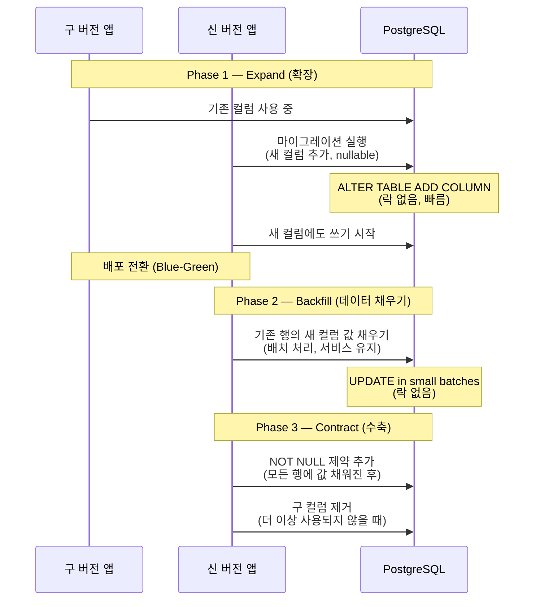
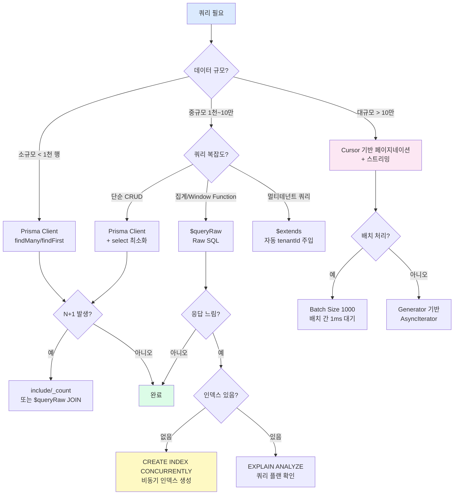

# 37. Prisma 실전 패턴 — 대용량 데이터 처리, 복잡한 쿼리, 마이그레이션 무중단 배포

> **대상 독자**: Prisma 기초를 아는 백엔드 개발자
> **선수 지식**: Prisma Client 기초, PostgreSQL SQL 기초
> **학습 시간**: 약 3시간
> **관련 요구사항**: FR-AI26.1, CSAP D-06, D-09

---

## 목차

1. [Prisma 실전 문제 — ORM만으로 충분하지 않은 이유](#1-prisma-실전-문제--orm만으로-충분하지-않은-이유)
2. [대용량 데이터 처리 패턴](#2-대용량-데이터-처리-패턴)
3. [복잡한 집계 쿼리 — Raw SQL과 Prisma 통합](#3-복잡한-집계-쿼리--raw-sql과-prisma-통합)
4. [멀티테넌트 RLS (Row-Level Security)](#4-멀티테넌트-rls-row-level-security)
5. [마이그레이션 무중단 배포](#5-마이그레이션-무중단-배포)
6. [Prisma 성능 최적화](#6-prisma-성능-최적화)
7. [실습: 감사 로그 대용량 처리](#7-실습-감사-로그-대용량-처리)

---

## 1. Prisma 실전 문제 — ORM만으로 충분하지 않은 이유

### 1.1 ORM의 한계를 이해하기

Prisma는 훌륭한 ORM이지만, 공공기관 SaaS처럼 대규모 데이터를 다루는 환경에서는 한계를 만납니다.

**비유로 이해하기**: ORM은 맥가이버칼과 같습니다. 일상적인 작업에는 편리하지만, 전문적인 작업에는 전문 도구가 필요합니다. 실제 목수는 맥가이버칼만으로 가구를 만들지 않습니다.

**공공기관 SaaS에서 흔히 마주치는 실전 문제들**

| 상황 | ORM 한계 | 해결 방법 |
|------|---------|----------|
| 10만 건 감사 로그 내보내기 | `findMany`로 한번에 로드 시 메모리 부족 | Cursor 기반 페이지네이션 |
| 월별 AI 비용 집계 | Prisma 집계 함수로는 Window Function 불가 | `$queryRaw` |
| 테넌트 격리 | 모든 쿼리에 `tenantId` 수동 추가 실수 위험 | `$extends` 미들웨어 |
| 1억 행 테이블에 인덱스 추가 | 일반 마이그레이션이면 테이블 락 발생 | `CREATE INDEX CONCURRENTLY` |
| 벡터 유사도 검색 | Prisma Client에 `<=>` 연산자 없음 | `$queryRaw` + pgvector |

### 1.2 $queryRaw vs $executeRaw 차이

```typescript
// $queryRaw: SELECT 쿼리 — 결과 반환
const results = await prisma.$queryRaw<Array<{
  date: Date;
  totalCost: number;
  requestCount: number;
}>>`
  SELECT
    DATE_TRUNC('day', created_at) AS date,
    SUM(cost_usd) AS "totalCost",
    COUNT(*) AS "requestCount"
  FROM ai_usage_logs
  WHERE tenant_id = ${tenantId}
    AND created_at >= ${startDate}
  GROUP BY DATE_TRUNC('day', created_at)
  ORDER BY date DESC
`;
// results 타입은 Array<{ date: Date; totalCost: number; requestCount: number }>

// $executeRaw: INSERT/UPDATE/DELETE 쿼리 — 영향받은 행 수 반환
const count = await prisma.$executeRaw`
  UPDATE ai_knowledge_chunks
  SET is_active = FALSE
  WHERE document_id = ${documentId}
    AND tenant_id = ${tenantId}
`;
// count 타입은 number (영향받은 행 수)
```

**중요**: `$queryRaw`와 `$executeRaw`는 태그드 템플릿 리터럴을 사용합니다. 변수가 자동으로 바인딩되어 SQL 인젝션이 방지됩니다. 직접 문자열 결합은 절대 사용하지 마세요.

```typescript
// 잘못된 방법 — SQL 인젝션 위험 (CSAP D-12 위반)
// prisma.$queryRawUnsafe(`SELECT * FROM users WHERE id = '${userId}'`)  // 절대 금지

// 올바른 방법 — 자동 파라미터 바인딩
const user = await prisma.$queryRaw`
  SELECT * FROM users WHERE id = ${userId}
`;
```

### 1.3 벡터 스토어 패턴 분석

`/data/ai-saas/platform/services/ai-service/src/lib/vector-store.ts`의 현재 구현을 살펴보면 중요한 설계 결정이 있습니다.

```typescript
// vector-store.ts 현재 구현의 핵심 부분
export async function semanticSearch(
  queryEmbedding: number[],
  tenantId: string,
  topK = 5,
  minScore = 0.3,
): Promise<SearchResult[]> {
  // 현재: 모든 청크를 메모리에 로드 후 TypeScript에서 유사도 계산
  const chunks = await db['aiKnowledgeChunk'].findMany({
    where: { tenantId, document: { isActive: true } },
    take: 10000,  // 최대 10k 청크 제한 (메모리 보호)
  });

  // TypeScript에서 코사인 유사도 계산
  const mapped = chunks.map((chunk) => {
    const embedding = JSON.parse(chunk['embeddingJson']);
    const score = cosineSimilarity(queryEmbedding, embedding);
    return score >= minScore ? { chunk, score } : null;
  });
```

이 구현의 **트레이드오프**:
- 장점: pgvector 확장 없이 작동, 구현 단순
- 단점: 청크가 10,000개를 넘으면 메모리 부족, 속도 저하

**pgvector 기반 개선 방향** (대용량 데이터셋용):

```typescript
// 미래 pgvector 기반 구현 (SVC-AI-2026 Phase 고도화 시 적용 예정)
// NOTE: 미사용. SVC-AI-2026 스케일 업 단계에서 활성화. 2026-10-01 재검토.

export async function semanticSearchWithPgvector(
  queryEmbedding: number[],
  tenantId: string,
  topK = 5,
  minScore = 0.3,
): Promise<SearchResult[]> {
  // pgvector의 <=> 코사인 거리 연산자 사용
  // 1 - 거리 = 유사도
  const results = await prisma.$queryRaw<Array<{
    id: string;
    content: string;
    embedding: number[];
    score: number;
    document_title: string;
  }>>`
    SELECT
      c.id,
      c.content,
      c.embedding::float4[] AS embedding,
      1 - (c.embedding <=> ${queryEmbedding}::vector) AS score,
      d.title AS document_title
    FROM ai_knowledge_chunks c
    JOIN ai_knowledge_documents d ON c.document_id = d.id
    WHERE c.tenant_id = ${tenantId}
      AND d.is_active = TRUE
      AND 1 - (c.embedding <=> ${queryEmbedding}::vector) >= ${minScore}
    ORDER BY c.embedding <=> ${queryEmbedding}::vector
    LIMIT ${topK}
  `;

  return results.map(r => ({
    chunk: {
      id: r.id,
      tenantId,
      documentId: '',
      chunkIndex: 0,
      content: r.content,
      embedding: r.embedding,
      tokenCount: 0,
      metadata: { documentTitle: r.document_title },
    },
    score: r.score,
  }));
}
```

---

## 2. 대용량 데이터 처리 패턴

### 2.1 왜 대용량 데이터가 문제인가?

```
findMany({ take: 100000 }) 호출 시:
1. 데이터베이스에서 10만 행 전송
2. Prisma가 TypeScript 객체로 변환 (100,000개 객체 생성)
3. Node.js 힙 메모리 급증 → OOM(Out of Memory) 위험
4. 가비지 컬렉션 부하로 다른 요청 지연
```

### 2.2 Cursor 기반 페이지네이션

```typescript
// 올바른 대용량 페이지네이션 패턴
// Design Ref: Prisma 실전 패턴 §2.2

interface CursorPage<T> {
  items: T[];
  nextCursor: string | null;
  hasMore: boolean;
}

async function getAuditLogPage(params: {
  tenantId: string;
  cursor?: string;   // 이전 페이지의 마지막 항목 ID
  limit?: number;
  fromDate?: Date;
  toDate?: Date;
}): Promise<CursorPage<AuditLog>> {
  const { tenantId, cursor, limit = 100, fromDate, toDate } = params;

  // limit + 1개를 가져와서 다음 페이지 존재 여부 확인
  const logs = await prisma.auditLog.findMany({
    where: {
      tenantId,
      createdAt: {
        gte: fromDate,
        lte: toDate,
      },
    },
    orderBy: { createdAt: 'desc' },
    take: limit + 1,
    // cursor가 있으면 해당 항목 이후부터 조회
    ...(cursor && {
      cursor: { id: cursor },
      skip: 1,  // cursor 항목 자체는 제외
    }),
    select: {
      id: true,
      actor: true,
      action: true,
      target: true,
      tenantId: true,
      createdAt: true,
      metadata: true,
    },
  });

  const hasMore = logs.length > limit;
  const items = hasMore ? logs.slice(0, limit) : logs;
  const nextCursor = hasMore ? (items[items.length - 1]?.id ?? null) : null;

  return { items, nextCursor, hasMore };
}

// 사용 예시: 모든 페이지 순회
async function exportAllAuditLogs(tenantId: string): Promise<void> {
  let cursor: string | undefined;
  let pageNumber = 0;

  do {
    const page = await getAuditLogPage({ tenantId, cursor, limit: 500 });
    console.log(`페이지 ${++pageNumber}: ${page.items.length}개 처리`);

    // 배치 처리 (예: CSV 파일 쓰기, Elasticsearch 전송)
    await processBatch(page.items);

    cursor = page.nextCursor ?? undefined;
  } while (cursor);

  console.log(`전체 내보내기 완료: ${pageNumber}개 페이지`);
}
```

**Offset 페이지네이션과 Cursor 페이지네이션 비교**:

| 항목 | Offset (`skip: N`) | Cursor 기반 |
|------|-------------------|------------|
| 깊은 페이지 성능 | 느려짐 (N행 스캔) | 일정 (인덱스 활용) |
| 일관성 | 데이터 추가/삭제 시 건너뜀 발생 | 일관됨 |
| 임의 페이지 이동 | 가능 | 불가 (순차 이동만) |
| 용도 | 관리자 UI, 소량 데이터 | 무한 스크롤, 데이터 파이프라인 |

공공기관 감사 로그처럼 **추가만 되는(append-only)** 데이터는 Cursor 기반이 적합합니다.

### 2.3 Batch 처리 (findMany Chunking)

```typescript
// 대용량 배치 처리 — 메모리 효율적
async function batchUpdateChunkStatus(
  documentId: string,
  tenantId: string,
  isActive: boolean,
): Promise<number> {
  const BATCH_SIZE = 1000;
  let totalUpdated = 0;
  let hasMore = true;
  let cursor: string | undefined;

  while (hasMore) {
    // 배치 크기만큼 조회
    const chunks = await prisma.$queryRaw<Array<{ id: string }>>`
      SELECT id
      FROM ai_knowledge_chunks
      WHERE document_id = ${documentId}
        AND tenant_id = ${tenantId}
        ${cursor ? prisma.$queryRaw`AND id > ${cursor}` : prisma.$queryRaw``}
      ORDER BY id
      LIMIT ${BATCH_SIZE}
    `;

    if (chunks.length === 0) break;

    const ids = chunks.map(c => c.id);

    // 배치 업데이트
    await prisma.$executeRaw`
      UPDATE ai_knowledge_chunks
      SET is_active = ${isActive}, updated_at = NOW()
      WHERE id = ANY(${ids}::uuid[])
        AND tenant_id = ${tenantId}
    `;

    totalUpdated += chunks.length;
    cursor = chunks[chunks.length - 1]?.id;
    hasMore = chunks.length === BATCH_SIZE;

    // 과부하 방지: 배치 사이 1ms 대기
    await new Promise(resolve => setTimeout(resolve, 1));
  }

  return totalUpdated;
}
```

### 2.4 스트리밍 쿼리 (Node.js Stream)

Prisma 5.x부터 스트리밍 쿼리를 지원합니다. 매우 큰 데이터셋을 메모리에 모두 올리지 않고 처리할 수 있습니다.

```typescript
// Node.js Transform Stream과 Prisma 조합
import { Readable, Transform, pipeline } from 'node:stream';
import { promisify } from 'node:util';
import { createWriteStream } from 'node:fs';

const pipelineAsync = promisify(pipeline);

async function streamAuditLogsToFile(
  tenantId: string,
  outputPath: string,
): Promise<void> {
  // Prisma Readable Stream 생성 (v5.x 기능)
  // 내부적으로 cursor 기반 배치 로드 자동 처리
  const auditStream = Readable.from(
    streamAuditLogs(tenantId)
  );

  // JSON Lines 형식으로 변환
  const jsonLineTransform = new Transform({
    objectMode: true,
    transform(log: AuditLog, _encoding, callback) {
      const line = JSON.stringify({
        id: log.id,
        actor: log.actor,
        action: log.action,
        target: log.target,
        timestamp: log.createdAt.toISOString(),
        // 민감 데이터 제외 (CSAP D-06)
      }) + '\n';
      callback(null, line);
    },
  });

  await pipelineAsync(
    auditStream,
    jsonLineTransform,
    createWriteStream(outputPath),
  );
}

// Generator 기반 스트림 소스
async function* streamAuditLogs(tenantId: string) {
  let cursor: string | undefined;

  while (true) {
    const batch = await prisma.auditLog.findMany({
      where: { tenantId },
      orderBy: { createdAt: 'asc' },
      take: 200,
      ...(cursor && { cursor: { id: cursor }, skip: 1 }),
    });

    if (batch.length === 0) break;

    for (const log of batch) {
      yield log;
    }

    cursor = batch[batch.length - 1]?.id;
  }
}
```

---

## 3. 복잡한 집계 쿼리 — Raw SQL과 Prisma 통합

### 3.1 Window Function 활용

Window Function은 그룹 집계와 달리 행을 유지하면서 집계값을 계산합니다. Prisma Client로는 표현이 불가능하므로 `$queryRaw`를 사용합니다.

```typescript
// RAG 엔진의 문서별 청크 순위 분석
// Design Ref: SVC-AI-2026 DESIGN §1 — 지식베이스 통계

interface ChunkRankAnalysis {
  documentId: string;
  documentTitle: string;
  chunkIndex: number;
  tokenCount: number;
  rankInDocument: number;     // 문서 내 청크 순서
  cumulativeTokens: number;   // 누적 토큰 수
  pctOfDocument: number;      // 문서 내 비율
}

async function analyzeChunkDistribution(tenantId: string): Promise<ChunkRankAnalysis[]> {
  return prisma.$queryRaw<ChunkRankAnalysis[]>`
    SELECT
      c.document_id AS "documentId",
      d.title AS "documentTitle",
      c.chunk_index AS "chunkIndex",
      c.token_count AS "tokenCount",
      -- Window Function: 문서 내 청크 순위
      RANK() OVER (
        PARTITION BY c.document_id
        ORDER BY c.chunk_index
      ) AS "rankInDocument",
      -- Window Function: 누적 토큰 수
      SUM(c.token_count) OVER (
        PARTITION BY c.document_id
        ORDER BY c.chunk_index
        ROWS BETWEEN UNBOUNDED PRECEDING AND CURRENT ROW
      ) AS "cumulativeTokens",
      -- Window Function: 문서 내 비율
      ROUND(
        100.0 * c.chunk_index::numeric /
        NULLIF(COUNT(*) OVER (PARTITION BY c.document_id), 0),
        2
      ) AS "pctOfDocument"
    FROM ai_knowledge_chunks c
    JOIN ai_knowledge_documents d ON c.document_id = d.id
    WHERE c.tenant_id = ${tenantId}
      AND d.is_active = TRUE
    ORDER BY d.title, c.chunk_index
  `;
}
```

### 3.2 AI 비용 집계 — 고급 GROUP BY

```typescript
// DORA 익스포터 패턴을 응용한 AI 비용 분석
// RAG 엔진 사용 현황 집계 (rag-engine.ts의 tokensUsed 기반)

interface AiCostSummary {
  tenantId: string;
  period: string;           // 'YYYY-MM'
  totalRequests: bigint;    // BigInt: PostgreSQL COUNT 반환 타입
  totalTokens: bigint;
  totalCostUsd: number;
  avgTokensPerRequest: number;
  p95LatencyMs: number;    // 95 백분위 응답시간
  topModel: string;
}

async function getAiCostSummary(
  fromDate: Date,
  toDate: Date,
  tenantId?: string,
): Promise<AiCostSummary[]> {
  // BigInt를 안전하게 처리하는 헬퍼 함수
  const results = await prisma.$queryRaw<Array<{
    tenantId: string;
    period: string;
    totalRequests: bigint;
    totalTokens: bigint;
    totalCostUsd: number;
    avgTokensPerRequest: number;
    p95LatencyMs: number;
    topModel: string;
  }>>`
    WITH monthly_stats AS (
      SELECT
        tenant_id,
        TO_CHAR(DATE_TRUNC('month', created_at), 'YYYY-MM') AS period,
        COUNT(*) AS total_requests,
        SUM(tokens_used) AS total_tokens,
        SUM(cost_usd) AS total_cost_usd,
        AVG(tokens_used)::numeric AS avg_tokens_per_request,
        PERCENTILE_CONT(0.95) WITHIN GROUP (ORDER BY latency_ms) AS p95_latency_ms,
        MODE() WITHIN GROUP (ORDER BY model_name) AS top_model
      FROM ai_usage_logs
      WHERE created_at BETWEEN ${fromDate} AND ${toDate}
        ${tenantId ? prisma.$queryRaw`AND tenant_id = ${tenantId}` : prisma.$queryRaw``}
      GROUP BY tenant_id, DATE_TRUNC('month', created_at)
    )
    SELECT
      tenant_id AS "tenantId",
      period,
      total_requests AS "totalRequests",
      total_tokens AS "totalTokens",
      total_cost_usd AS "totalCostUsd",
      ROUND(avg_tokens_per_request::numeric, 2)::float AS "avgTokensPerRequest",
      ROUND(p95_latency_ms::numeric, 0)::float AS "p95LatencyMs",
      top_model AS "topModel"
    FROM monthly_stats
    ORDER BY period DESC, total_cost_usd DESC
  `;

  // BigInt를 JSON 직렬화 가능한 형태로 변환
  return results.map(r => ({
    ...r,
    totalRequests: r.totalRequests,   // BigInt 유지 (클라이언트에서 처리)
    totalTokens: r.totalTokens,
  }));
}
```

### 3.3 JSON 컬럼 쿼리

벡터 스토어의 메타데이터나 감사 로그의 메타데이터는 JSON 컬럼에 저장됩니다.

```typescript
// JSON 컬럼 내부 값으로 필터링
async function findAuditLogsByMetadata(
  tenantId: string,
  action: string,
  metadataFilter: Record<string, unknown>,
): Promise<AuditLog[]> {
  // Prisma의 JSON 필터 (간단한 경우)
  const logs = await prisma.auditLog.findMany({
    where: {
      tenantId,
      action,
      // JSON 경로 필터 (PostgreSQL jsonb 연산자 사용)
      metadata: {
        path: ['documentId'],
        equals: metadataFilter['documentId'],
      },
    },
    take: 100,
    orderBy: { createdAt: 'desc' },
  });

  return logs;
}

// 복잡한 JSON 쿼리는 $queryRaw 사용
async function findAuditLogsWithJsonSearch(
  tenantId: string,
  searchTerm: string,
): Promise<AuditLog[]> {
  return prisma.$queryRaw<AuditLog[]>`
    SELECT *
    FROM audit_logs
    WHERE tenant_id = ${tenantId}
      -- JSONB 전체 텍스트 검색
      AND metadata::text ILIKE ${'%' + searchTerm + '%'}
      -- 특정 JSON 키 존재 여부
      AND metadata ? 'documentId'
    ORDER BY created_at DESC
    LIMIT 100
  `;
}
```

---

## 4. 멀티테넌트 RLS (Row-Level Security)

### 4.1 RLS란?

Row-Level Security(RLS)는 PostgreSQL의 기능으로, 데이터베이스 수준에서 행 단위 접근 제어를 구현합니다. 응용 프로그램 코드에서 `WHERE tenant_id = ?` 조건을 빠뜨려도 데이터베이스가 자동으로 격리합니다.

**왜 공공기관 SaaS에서 중요한가?**
- CSAP D-08(접근 통제): 테넌트 간 데이터 격리는 인프라 수준에서 보장해야 합니다.
- 개발자 실수 방지: 조건 누락으로 인한 데이터 유출을 원천 차단합니다.
- 감사 용이성: 격리 정책이 DB 레이어에 명시적으로 기록됩니다.

### 4.2 PostgreSQL RLS 정책 설정

```sql
-- 마이그레이션 파일: 20260413_add_rls_policies.sql

-- 1. 테넌트별 격리 역할 생성
CREATE ROLE tenant_app;

-- 2. ai_knowledge_chunks 테이블 RLS 활성화
ALTER TABLE ai_knowledge_chunks ENABLE ROW LEVEL SECURITY;

-- 3. RLS 정책 생성 (현재 테넌트만 접근)
CREATE POLICY tenant_isolation_policy ON ai_knowledge_chunks
  FOR ALL  -- SELECT, INSERT, UPDATE, DELETE 모두 적용
  TO tenant_app
  USING (tenant_id = current_setting('app.current_tenant_id')::uuid)
  WITH CHECK (tenant_id = current_setting('app.current_tenant_id')::uuid);

-- 4. audit_logs 테이블 RLS
ALTER TABLE audit_logs ENABLE ROW LEVEL SECURITY;
ALTER TABLE audit_logs FORCE ROW LEVEL SECURITY;  -- SUPERUSER도 정책 적용

CREATE POLICY audit_tenant_policy ON audit_logs
  FOR SELECT
  TO tenant_app
  USING (tenant_id = current_setting('app.current_tenant_id')::uuid);

-- Append-only: 삽입만 허용 (수정/삭제 금지 — CSAP D-06)
CREATE POLICY audit_insert_only ON audit_logs
  FOR INSERT
  TO tenant_app
  WITH CHECK (tenant_id = current_setting('app.current_tenant_id')::uuid);

-- 수정/삭제 명시적 차단
CREATE POLICY audit_no_update ON audit_logs
  FOR UPDATE TO tenant_app
  USING (FALSE);

CREATE POLICY audit_no_delete ON audit_logs
  FOR DELETE TO tenant_app
  USING (FALSE);
```

### 4.3 Prisma $extends로 자동 tenantId 주입

```typescript
// lib/prisma-tenant.ts
// Design Ref: §4 멀티테넌트 RLS
// CSAP: D-08 접근 통제

import { PrismaClient } from '@prisma/client';

/**
 * 테넌트 격리가 적용된 Prisma Client 생성
 *
 * 사용법:
 *   const db = createTenantPrisma(tenantId);
 *   // 이후 모든 쿼리에 tenantId가 자동 추가됨
 *   await db.auditLog.findMany(); // WHERE tenant_id = ${tenantId} 자동 적용
 */
export function createTenantPrisma(tenantId: string) {
  const prisma = new PrismaClient();

  return prisma.$extends({
    query: {
      // 모든 모델의 findMany, findFirst, findUnique에 tenantId 자동 추가
      $allModels: {
        async findMany({ model, operation, args, query }) {
          // 'tenantId' 필드가 있는 모델에만 적용
          if (hasTenantIdField(model)) {
            args.where = { ...args.where, tenantId };
          }
          return query(args);
        },

        async findFirst({ model, operation, args, query }) {
          if (hasTenantIdField(model)) {
            args.where = { ...args.where, tenantId };
          }
          return query(args);
        },

        async create({ model, operation, args, query }) {
          if (hasTenantIdField(model)) {
            // 생성 시 tenantId 자동 설정
            args.data = { ...args.data, tenantId };
          }
          return query(args);
        },

        async update({ model, operation, args, query }) {
          if (hasTenantIdField(model)) {
            // 업데이트 조건에 tenantId 강제 추가 (다른 테넌트 데이터 수정 방지)
            args.where = { ...args.where, tenantId };
          }
          return query(args);
        },

        async delete({ model, operation, args, query }) {
          if (hasTenantIdField(model)) {
            args.where = { ...args.where, tenantId };
          }
          return query(args);
        },
      },
    },
  });
}

// PostgreSQL 세션 레벨에서 tenantId 설정 (RLS용)
export async function withTenantContext<T>(
  tenantId: string,
  operation: () => Promise<T>,
): Promise<T> {
  await prisma.$executeRaw`
    SET LOCAL app.current_tenant_id = ${tenantId}
  `;
  return operation();
}

// tenantId 필드가 있는 모델 목록 (Prisma DMMF에서 자동 추출 가능)
const TENANT_MODELS = new Set([
  'AuditLog',
  'AiModel',
  'AiUsageLog',
  'AiKnowledgeDocument',
  'AiKnowledgeChunk',
  'Subscription',
  'Tenant',
]);

function hasTenantIdField(model: string): boolean {
  return TENANT_MODELS.has(model);
}
```

### 4.4 Fastify 요청 생명주기에서 테넌트 컨텍스트 설정

```typescript
// hooks/tenant-context.hook.ts
// 모든 요청에서 테넌트 컨텍스트를 자동으로 설정

import type { FastifyRequest, FastifyReply } from 'fastify';
import { createTenantPrisma } from '../lib/prisma-tenant.js';

declare module 'fastify' {
  interface FastifyRequest {
    tenantDb: ReturnType<typeof createTenantPrisma>;
    tenantId: string;
  }
}

export async function tenantContextHook(
  request: FastifyRequest,
  _reply: FastifyReply,
): Promise<void> {
  // JWT에서 tenantId 추출 (이미 인증 훅에서 검증됨)
  const tenantId = request.user?.tenantId;

  if (!tenantId) {
    throw new Error('테넌트 ID가 없는 인증된 요청');
  }

  // 요청별 테넌트 격리 Prisma 인스턴스 생성
  request.tenantId = tenantId;
  request.tenantDb = createTenantPrisma(tenantId);
}

// 라우트에서 사용
export async function ragQueryHandler(request: FastifyRequest, reply: FastifyReply) {
  const { question, topK, minScore } = request.body as RagQueryBody;

  // request.tenantDb를 사용하면 tenantId가 자동으로 필터됨
  // prisma.aiKnowledgeChunk.findMany()를 직접 호출할 필요 없음
  const stats = await request.tenantDb.aiKnowledgeDocument.aggregate({
    _count: true,
    where: { isActive: true },
    // tenantId: request.tenantId  ← $extends가 자동으로 추가해줌
  });

  // ...
}
```

---

## 5. 마이그레이션 무중단 배포

### 5.1 Expand-Contract 패턴이란?

대용량 테이블에서 컬럼을 추가하거나 변경할 때 서비스를 중단하지 않고 배포하는 기법입니다.

**일반적인 마이그레이션의 문제점**: 컬럼 이름을 변경하거나 NOT NULL 제약을 추가하면 테이블 락이 걸려 서비스가 중단됩니다.



### 5.2 실제 예시: embedding_json → embedding 컬럼 마이그레이션

현재 `vector-store.ts`는 임베딩을 JSON 문자열로 저장합니다. pgvector 도입을 위해 `vector` 타입 컬럼으로 마이그레이션하는 과정을 살펴봅니다.

```sql
-- Phase 1: Expand — 새 컬럼 추가 (테이블 락 없음, 즉시 실행)
-- 마이그레이션 파일: 20260413_phase1_add_vector_column.sql
ALTER TABLE ai_knowledge_chunks
ADD COLUMN embedding vector(768) NULL;  -- NULL 허용으로 즉시 추가

-- 인덱스는 비동기로 생성 (CONCURRENTLY — 테이블 락 없음)
CREATE INDEX CONCURRENTLY idx_chunks_embedding
ON ai_knowledge_chunks
USING ivfflat (embedding vector_cosine_ops)
WITH (lists = 100);
```

```typescript
// Phase 2: 배포 — 신 버전 앱이 두 컬럼 모두 씀
// lib/vector-store-v2.ts (Expand 단계 구현)

export async function storeChunksV2(
  tenantId: string,
  documentId: string,
  chunks: Array<{
    content: string;
    chunkIndex: number;
    tokenCount: number;
    embedding: number[];
  }>,
): Promise<void> {
  for (const chunk of chunks) {
    await prisma.$executeRaw`
      INSERT INTO ai_knowledge_chunks
        (tenant_id, document_id, chunk_index, content,
         embedding_json, embedding, token_count)
      VALUES
        (${tenantId}, ${documentId}, ${chunk.chunkIndex}, ${chunk.content},
         ${JSON.stringify(chunk.embedding)},  -- 구 컬럼 (호환성)
         ${chunk.embedding}::vector,           -- 신 컬럼 (pgvector)
         ${chunk.tokenCount})
      ON CONFLICT (document_id, chunk_index)
      DO UPDATE SET
        embedding_json = EXCLUDED.embedding_json,
        embedding = EXCLUDED.embedding,
        updated_at = NOW()
    `;
  }
}
```

```typescript
// Phase 2: Backfill — 기존 데이터를 새 컬럼으로 마이그레이션
// scripts/backfill-embeddings.ts

async function backfillEmbeddings(): Promise<void> {
  const BATCH_SIZE = 100;
  let processed = 0;
  let cursor: string | undefined;

  console.log('임베딩 마이그레이션 시작...');

  while (true) {
    // 아직 변환되지 않은 청크 조회
    const chunks = await prisma.$queryRaw<Array<{
      id: string;
      embeddingJson: string;
    }>>`
      SELECT id, embedding_json AS "embeddingJson"
      FROM ai_knowledge_chunks
      WHERE embedding IS NULL
        AND embedding_json IS NOT NULL
        ${cursor ? prisma.$queryRaw`AND id > ${cursor}` : prisma.$queryRaw``}
      ORDER BY id
      LIMIT ${BATCH_SIZE}
    `;

    if (chunks.length === 0) break;

    // 배치 업데이트
    for (const chunk of chunks) {
      const embedding = JSON.parse(chunk.embeddingJson) as number[];
      await prisma.$executeRaw`
        UPDATE ai_knowledge_chunks
        SET embedding = ${embedding}::vector
        WHERE id = ${chunk.id}
      `;
    }

    processed += chunks.length;
    cursor = chunks[chunks.length - 1]?.id;
    console.log(`진행: ${processed}개 처리`);

    // Rate limiting: 배치 간 10ms 대기 (DB 부하 방지)
    await new Promise(resolve => setTimeout(resolve, 10));
  }

  console.log(`마이그레이션 완료: 총 ${processed}개 청크 변환`);
}
```

```sql
-- Phase 3: Contract — 정리 (모든 행 변환 완료 후 실행)
-- 마이그레이션 파일: 20260701_phase3_drop_json_column.sql

-- NOT NULL 제약 추가 (값이 모두 채워진 경우에만)
ALTER TABLE ai_knowledge_chunks
ALTER COLUMN embedding SET NOT NULL;

-- 구 컬럼 제거 (더 이상 앱에서 사용하지 않을 때)
ALTER TABLE ai_knowledge_chunks
DROP COLUMN embedding_json;
```

### 5.3 대용량 테이블 인덱스 비동기 추가

```typescript
// 인덱스 추가 상태 모니터링
async function addIndexConcurrently(
  tableName: string,
  indexName: string,
  columnName: string,
): Promise<void> {
  // CONCURRENTLY: 다른 쿼리를 차단하지 않고 인덱스 생성
  // 단, 트랜잭션 내에서는 실행 불가 (트랜잭션 없이 실행)
  await prisma.$executeRaw`
    CREATE INDEX CONCURRENTLY IF NOT EXISTS ${prisma.$queryRaw([indexName])}
    ON ${prisma.$queryRaw([tableName])} (${prisma.$queryRaw([columnName])})
  `;

  // 생성 완료 확인
  const result = await prisma.$queryRaw<Array<{ indexname: string }>>`
    SELECT indexname
    FROM pg_indexes
    WHERE tablename = ${tableName}
      AND indexname = ${indexName}
  `;

  if (result.length === 0) {
    throw new Error(`인덱스 ${indexName} 생성 실패`);
  }

  console.log(`인덱스 ${indexName} 생성 완료`);
}
```

### 5.4 롤백 전략

```typescript
// 롤백 안전한 마이그레이션 패턴
// Prisma migrate dev 이후 롤백 방법

// 방법 1: 역방향 마이그레이션 파일 수동 작성
// migrations/20260413_rollback_add_vector_column.sql
/*
ALTER TABLE ai_knowledge_chunks DROP COLUMN IF EXISTS embedding;
DROP INDEX CONCURRENTLY IF EXISTS idx_chunks_embedding;
*/

// 방법 2: Feature Flag로 새 코드 경로 제어
// packages/feature-flag-sdk를 활용한 안전한 롤아웃

import { FeatureFlagClient } from '@public-saas/feature-flag-sdk';

const flags = new FeatureFlagClient();

export async function semanticSearchAdapter(
  queryEmbedding: number[],
  tenantId: string,
  topK: number,
  minScore: number,
) {
  // Feature Flag로 pgvector 사용 여부 제어
  const usePgvector = await flags.isEnabled('use-pgvector-search', {
    tenantId,
  });

  if (usePgvector) {
    // 신 버전: pgvector 사용
    return semanticSearchWithPgvector(queryEmbedding, tenantId, topK, minScore);
  } else {
    // 구 버전: JSON 임베딩 사용
    return semanticSearch(queryEmbedding, tenantId, topK, minScore);
  }
}
```

---

## 6. Prisma 성능 최적화

### 6.1 연결 풀 튜닝

```typescript
// lib/prisma.ts — 최적화된 연결 풀 설정

import { PrismaClient } from '@prisma/client';

// 환경별 연결 수 조정
const connectionPoolSize = (() => {
  if (process.env['NODE_ENV'] === 'production') {
    // 프로덕션: CPU 코어 수 × 2 (일반적인 권장값)
    return Math.max(10, (process.env['CPU_CORES'] ? parseInt(process.env['CPU_CORES']) : 2) * 2);
  }
  if (process.env['NODE_ENV'] === 'test') {
    return 2;  // 테스트: 최소값
  }
  return 5;   // 개발: 중간값
})();

export const prisma = new PrismaClient({
  datasources: {
    db: {
      url: process.env['DATABASE_URL'],
    },
  },
  // 연결 풀 설정 (DATABASE_URL에 ?connection_limit=N 추가)
  // 또는 별도 설정
  log: process.env['NODE_ENV'] === 'development'
    ? ['query', 'warn', 'error']
    : ['warn', 'error'],
});

// 연결 풀 상태 모니터링
export async function checkConnectionPool(): Promise<{
  activeConnections: number;
  idleConnections: number;
  maxConnections: number;
}> {
  const result = await prisma.$queryRaw<Array<{
    state: string;
    count: bigint;
  }>>`
    SELECT state, COUNT(*) as count
    FROM pg_stat_activity
    WHERE datname = current_database()
    GROUP BY state
  `;

  const active = result.find(r => r.state === 'active')?.count ?? 0n;
  const idle = result.find(r => r.state === 'idle')?.count ?? 0n;
  const maxConn = await prisma.$queryRaw<Array<{ max_conn: number }>>`
    SELECT setting::int AS max_conn FROM pg_settings WHERE name = 'max_connections'
  `;

  return {
    activeConnections: Number(active),
    idleConnections: Number(idle),
    maxConnections: maxConn[0]?.max_conn ?? 100,
  };
}
```

### 6.2 쿼리 로그 분석 및 느린 쿼리 탐지

```typescript
// lib/query-analyzer.ts
// 느린 쿼리 자동 탐지 및 로깅

const SLOW_QUERY_THRESHOLD_MS = 100;  // 100ms 이상은 느린 쿼리로 분류

export const prismaWithQueryLog = new PrismaClient({
  log: [
    {
      emit: 'event',
      level: 'query',
    },
  ],
});

prismaWithQueryLog.$on('query', (event) => {
  const durationMs = event.duration;

  if (durationMs > SLOW_QUERY_THRESHOLD_MS) {
    // 느린 쿼리 감사 로그 (CSAP D-06)
    process.stderr.write(JSON.stringify({
      level: 'warn',
      component: 'prisma',
      event: 'slow_query',
      durationMs,
      query: event.query.substring(0, 200) + '...',  // 쿼리 앞 200자만 기록
      params: '[REDACTED]',  // 파라미터는 민감 정보 가능성으로 제외
      timestamp: new Date().toISOString(),
    }) + '\n');
  }
});

// PostgreSQL EXPLAIN ANALYZE로 쿼리 플랜 분석
async function analyzeQueryPlan(query: string, params: unknown[]): Promise<string> {
  const result = await prisma.$queryRaw<Array<{ 'QUERY PLAN': string }>>`
    EXPLAIN (ANALYZE, BUFFERS, FORMAT TEXT) ${prisma.$queryRaw([query], ...params)}
  `;

  return result.map(r => r['QUERY PLAN']).join('\n');
}
```

### 6.3 N+1 쿼리 자동 탐지 및 해결

**N+1 문제**: 1번의 쿼리로 N개 목록을 가져온 후, 각 항목에 대해 또 N번 쿼리하는 패턴입니다.

```typescript
// 잘못된 패턴 — N+1 쿼리
async function getDocumentsWithChunkCountBad(tenantId: string) {
  const documents = await prisma.aiKnowledgeDocument.findMany({
    where: { tenantId },
  });

  // 문서마다 별도 쿼리 — N+1 문제!
  const withCounts = await Promise.all(
    documents.map(async (doc) => ({
      ...doc,
      chunkCount: await prisma.aiKnowledgeChunk.count({
        where: { documentId: doc.id },
      }),
    })),
  );

  return withCounts;
}

// 올바른 패턴 1: include로 관련 데이터 한번에 로드
async function getDocumentsWithChunksGood(tenantId: string) {
  return prisma.aiKnowledgeDocument.findMany({
    where: { tenantId },
    include: {
      _count: {
        select: { chunks: true },  // 청크 수만 집계
      },
    },
  });
}

// 올바른 패턴 2: 집계 쿼리로 한번에
async function getDocumentStatsEfficient(tenantId: string) {
  return prisma.$queryRaw<Array<{
    documentId: string;
    title: string;
    chunkCount: bigint;
    totalTokens: bigint;
  }>>`
    SELECT
      d.id AS "documentId",
      d.title,
      COUNT(c.id) AS "chunkCount",
      COALESCE(SUM(c.token_count), 0) AS "totalTokens"
    FROM ai_knowledge_documents d
    LEFT JOIN ai_knowledge_chunks c ON c.document_id = d.id
    WHERE d.tenant_id = ${tenantId}
    GROUP BY d.id, d.title
    ORDER BY d.created_at DESC
  `;
}
```

### 6.4 쿼리 최적화 의사결정 트리



---

## 7. 실습: 감사 로그 대용량 처리

### 7.1 실습 목표

`compliance-service`의 감사 로그를 대용량으로 처리하는 패턴을 구현합니다. 실제 `audit.ts`를 기반으로 합니다.

현재 `compliance-service/src/lib/audit.ts`의 구현:

```typescript
// 현재 구현 — 단순 로깅
export async function logComplianceEvent(
  action: string,
  metadata?: Record<string, unknown>,
): Promise<void> {
  await auditLogger.log({
    actor: 'system:compliance-service',
    action,
    target: 'compliance',
    targetType: 'compliance',
    tenantId: 'system',
    ip: process.env.SERVICE_IP || '127.0.0.1',
    userAgent: 'compliance-service/1.0',
    metadata,
  });
}
```

### 7.2 감사 로그 대용량 내보내기 구현

```typescript
// compliance-service/src/lib/audit-export.ts
// Design Ref: DESIGN-MTU-P14 §3 — 감사 로그 내보내기
// Plan SC: CSAP D-06 보존 정책

import { prisma } from './prisma.js';
import { createWriteStream } from 'node:fs';
import { pipeline } from 'node:stream/promises';
import { Readable, Transform } from 'node:stream';

interface AuditExportParams {
  tenantId: string;
  fromDate: Date;
  toDate: Date;
  actions?: string[];        // 필터링할 액션 목록
  outputFormat: 'jsonl' | 'csv';
}

interface AuditExportResult {
  exportedCount: number;
  filePath: string;
  fromDate: string;
  toDate: string;
}

/**
 * 감사 로그 대용량 내보내기
 * CSAP D-06: 최소 1년 보존, 수정/삭제 불가 (append-only) 확인 포함
 */
export async function exportAuditLogs(
  params: AuditExportParams,
): Promise<AuditExportResult> {
  const { tenantId, fromDate, toDate, actions, outputFormat } = params;

  const timestamp = new Date().toISOString().replace(/[:.]/g, '-');
  const filePath = `/tmp/audit-export-${tenantId}-${timestamp}.${outputFormat === 'csv' ? 'csv' : 'jsonl'}`;

  let exportedCount = 0;

  // Generator로 대용량 스트림 처리
  async function* generateAuditLogs() {
    let cursor: string | undefined;
    const BATCH_SIZE = 500;

    while (true) {
      const logs = await prisma.$queryRaw<Array<{
        id: string;
        actor: string;
        action: string;
        target: string;
        targetType: string;
        tenantId: string;
        ip: string;
        userAgent: string;
        createdAt: Date;
        metadata: Record<string, unknown>;
      }>>`
        SELECT
          id,
          actor,
          action,
          target,
          target_type AS "targetType",
          tenant_id AS "tenantId",
          ip,
          user_agent AS "userAgent",
          created_at AS "createdAt",
          metadata
        FROM audit_logs
        WHERE tenant_id = ${tenantId}
          AND created_at BETWEEN ${fromDate} AND ${toDate}
          ${actions && actions.length > 0
            ? prisma.$queryRaw`AND action = ANY(${actions}::text[])`
            : prisma.$queryRaw``}
          ${cursor ? prisma.$queryRaw`AND id > ${cursor}` : prisma.$queryRaw``}
        ORDER BY created_at ASC, id ASC
        LIMIT ${BATCH_SIZE}
      `;

      if (logs.length === 0) break;

      for (const log of logs) {
        yield log;
        exportedCount++;
      }

      cursor = logs[logs.length - 1]?.id;
    }
  }

  // 형식 변환 Transform
  const formatTransform = new Transform({
    objectMode: true,
    transform(log, _encoding, callback) {
      let line: string;

      if (outputFormat === 'csv') {
        // CSV 형식 (첫 줄에 헤더는 별도 처리)
        line = [
          log.id,
          log.actor,
          log.action,
          log.target,
          log.tenantId,
          log.ip,
          log.createdAt.toISOString(),
          JSON.stringify(log.metadata),
        ].map(v => `"${String(v).replace(/"/g, '""')}"`).join(',') + '\n';
      } else {
        // JSON Lines 형식
        line = JSON.stringify({
          id: log.id,
          actor: log.actor,
          action: log.action,
          target: log.target,
          tenantId: log.tenantId,
          ip: log.ip,
          timestamp: log.createdAt.toISOString(),
          metadata: log.metadata,
        }) + '\n';
      }

      callback(null, line);
    },
  });

  // 파이프라인 실행
  const outputStream = createWriteStream(filePath);

  // CSV 헤더 삽입
  if (outputFormat === 'csv') {
    outputStream.write('id,actor,action,target,tenantId,ip,timestamp,metadata\n');
  }

  await pipeline(
    Readable.from(generateAuditLogs()),
    formatTransform,
    outputStream,
  );

  return {
    exportedCount,
    filePath,
    fromDate: fromDate.toISOString(),
    toDate: toDate.toISOString(),
  };
}
```

### 7.3 감사 로그 통계 집계

```typescript
// compliance-service/src/lib/audit-stats.ts
// 월별 감사 활동 통계 (CSAP D-06 보고서용)

interface AuditStats {
  period: string;
  actionBreakdown: Array<{
    action: string;
    count: bigint;
    uniqueActors: bigint;
  }>;
  riskEvents: Array<{
    actor: string;
    failedActions: bigint;
    lastFailedAt: Date;
  }>;
  totalEvents: bigint;
}

export async function getAuditStats(
  tenantId: string,
  year: number,
  month: number,
): Promise<AuditStats> {
  const fromDate = new Date(year, month - 1, 1);
  const toDate = new Date(year, month, 0, 23, 59, 59);
  const period = `${year}-${String(month).padStart(2, '0')}`;

  const [actionBreakdown, riskEvents, totalResult] = await Promise.all([
    // 액션별 집계
    prisma.$queryRaw<Array<{
      action: string;
      count: bigint;
      uniqueActors: bigint;
    }>>`
      SELECT
        action,
        COUNT(*) AS count,
        COUNT(DISTINCT actor) AS "uniqueActors"
      FROM audit_logs
      WHERE tenant_id = ${tenantId}
        AND created_at BETWEEN ${fromDate} AND ${toDate}
      GROUP BY action
      ORDER BY count DESC
    `,

    // 위험 이벤트: 특정 액터가 실패 액션을 반복하는 경우
    prisma.$queryRaw<Array<{
      actor: string;
      failedActions: bigint;
      lastFailedAt: Date;
    }>>`
      SELECT
        actor,
        COUNT(*) AS "failedActions",
        MAX(created_at) AS "lastFailedAt"
      FROM audit_logs
      WHERE tenant_id = ${tenantId}
        AND created_at BETWEEN ${fromDate} AND ${toDate}
        AND action LIKE '%_FAILED'
      GROUP BY actor
      HAVING COUNT(*) >= 5  -- 5회 이상 실패
      ORDER BY "failedActions" DESC
    `,

    // 전체 이벤트 수
    prisma.$queryRaw<Array<{ total: bigint }>>`
      SELECT COUNT(*) AS total
      FROM audit_logs
      WHERE tenant_id = ${tenantId}
        AND created_at BETWEEN ${fromDate} AND ${toDate}
    `,
  ]);

  return {
    period,
    actionBreakdown,
    riskEvents,
    totalEvents: totalResult[0]?.total ?? 0n,
  };
}
```

### 7.4 실습 확인

```bash
# 1. 마이그레이션 상태 확인
cd /data/ai-saas
pnpm --filter @public-saas/compliance-service prisma migrate status

# 2. 감사 로그 내보내기 테스트
npx ts-node -e "
import { exportAuditLogs } from './platform/services/compliance-service/src/lib/audit-export.ts';

exportAuditLogs({
  tenantId: '550e8400-e29b-41d4-a716-446655440000',
  fromDate: new Date('2026-01-01'),
  toDate: new Date('2026-04-13'),
  outputFormat: 'jsonl',
}).then(result => {
  console.log('내보내기 완료:', result);
});
"

# 3. 쿼리 성능 확인
pnpm --filter @public-saas/compliance-service prisma studio
```

---

## 참고 자료

- [Prisma 공식 문서 — 성능 최적화](https://www.prisma.io/docs/guides/performance-and-optimization)
- [PostgreSQL RLS 공식 문서](https://www.postgresql.org/docs/current/ddl-rowsecurity.html)
- [pgvector 확장](https://github.com/pgvector/pgvector)
- [Expand-Contract 패턴](https://martinfowler.com/bliki/ParallelChange.html)
- CSAP 보안인증 기준서 D-06 (침해사고 관리), D-09 (암호화)

---

> **이전 가이드**: [36. OpenAPI 3.1 문서화 완전 가이드](./36-openapi-documentation.md)
> **다음 가이드**: [38. 서비스 메시 고급 패턴](./38-service-mesh-advanced.md)
