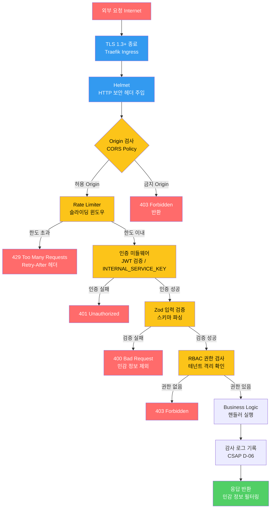
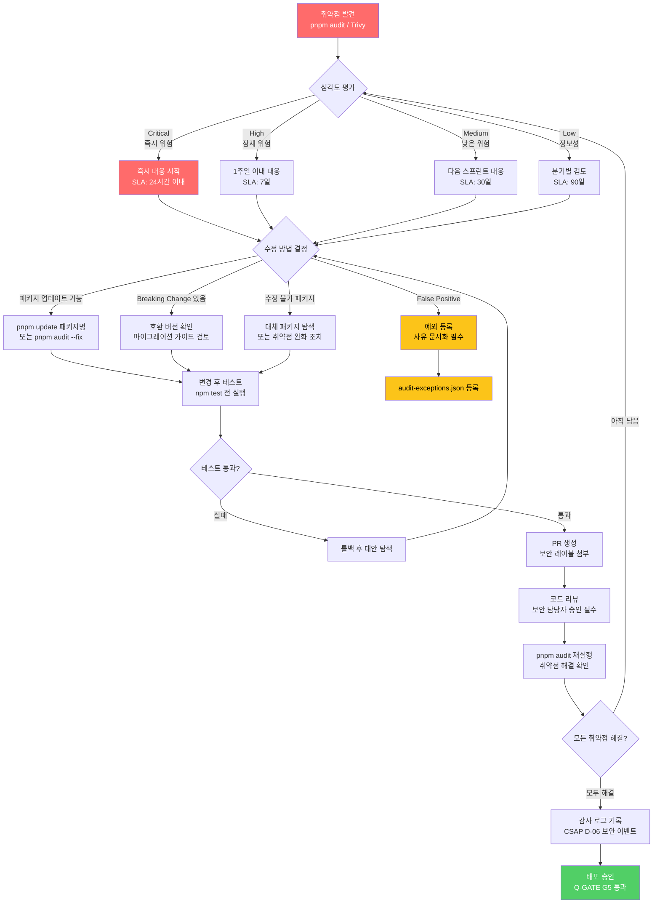

# Node.js 보안 강화 — Helmet, CORS, Rate Limiting, 의존성 취약점 관리, 런타임 보안

> **문서 ID**: ONBOARD-03-38
> **버전**: 1.0.0 | **작성일**: 2026-04-13 | **작성자**: Implementer (Sonnet)
> **선행 학습**: `03-development/02-service-development.md`, `07-security/csap/01-what-is-csap.md`
> **소요 시간**: 약 6~8시간 (실습 포함)
> **CSAP**: D-08 (접근 통제), D-09 (암호화), D-10 (네트워크 보안), D-12 (시스템 개발 보안)
> **관련 코드**: `platform/services/ai-service/src/routes.ts`

---

## 목차

1. [Node.js 보안이란?](#1-nodejs-보안이란)
2. [HTTP 보안 헤더 — Helmet](#2-http-보안-헤더--helmet)
3. [CORS 정책 완전 가이드](#3-cors-정책-완전-가이드)
4. [Rate Limiting 심화](#4-rate-limiting-심화)
5. [의존성 취약점 관리](#5-의존성-취약점-관리)
6. [런타임 보안 강화](#6-런타임-보안-강화)
7. [Fastify 플러그인 보안 감사](#7-fastify-플러그인-보안-감사)
8. [CSAP D-12 Node.js 보안 체크리스트](#8-csap-d-12-nodejs-보안-체크리스트)
9. [실습: ai-service 보안 강화 설정 추가](#9-실습-ai-service-보안-강화-설정-추가)
10. [변경 이력](#10-변경-이력)

---

## 1. Node.js 보안이란?

### 1.1 초급자를 위한 설명: "왜 런타임 보안이 따로 필요한가?"

소스 코드를 아무리 안전하게 작성해도, **Node.js 프로세스가 실행되는 환경 자체가 안전하지 않으면** 공격자가 서버를 점령할 수 있습니다. 이를 비유로 설명하면 이렇습니다.

```
[비유] 은행 금고 보안

잘못된 사례:
  - 금고 자물쇠(코드 보안)는 완벽하지만
  - 건물 정문(HTTP 헤더)에 잠금장치가 없음
  - 창문(CORS)이 열려있어 누구나 접근 가능
  - 동시에 수백 명이 들어올 수 있음(Rate Limit 없음)
  - 오래된 열쇠 복사본(취약한 의존성)이 돌아다님

올바른 사례:
  - 금고 자물쇠 + 건물 보안 + 창문 잠금 + 입장 제한 + 열쇠 최신화
```

Node.js 보안은 크게 3가지 계층으로 나뉩니다.

| 계층 | 도구 | 방어 대상 |
|------|------|---------|
| HTTP 계층 | Helmet, CORS | 브라우저 기반 공격 (XSS, Clickjacking) |
| 네트워크 계층 | Rate Limiting, TLS | DDoS, 브루트포스 공격 |
| 런타임 계층 | 최소 권한, 환경 변수 | 코드 주입, 시크릿 노출 |

### 1.2 OWASP Top 10 — API 관점

OWASP(개방형 웹 애플리케이션 보안 프로젝트)는 매년 가장 위험한 보안 취약점 10가지를 발표합니다. 공공기관 SaaS는 반드시 이 10가지를 방어해야 합니다.

| 순위 | 취약점 | 설명 | 우리 프로젝트 대응 |
|------|--------|------|-----------------|
| A01 | Broken Access Control | 권한 없이 다른 테넌트 데이터 접근 | RBAC + 테넌트 격리 |
| A02 | Cryptographic Failures | 평문 저장, 약한 암호화 | AES-256, TLS 1.3+ |
| A03 | Injection | SQL 주입, NoSQL 주입 | Zod 검증 + 매개변수화 쿼리 |
| A04 | Insecure Design | 설계 단계 보안 누락 | CSAP D-12 체크리스트 |
| A05 | Security Misconfiguration | 기본 설정 그대로 운영 | Helmet + 보안 헤더 |
| A06 | Vulnerable Components | 취약한 npm 패키지 사용 | pnpm audit + Trivy |
| A07 | Auth Failures | 토큰 만료 없음, 브루트포스 | Rate Limiting + JWT 만료 |
| A08 | Data Integrity Failures | 서명 없는 업데이트 | 서명된 컨테이너 이미지 |
| A09 | Logging Failures | 보안 이벤트 미기록 | 감사 로그 (CSAP D-06) |
| A10 | SSRF | 내부 서비스 주소 노출 | 화이트리스트 URL 검증 |

### 1.3 HTTP 요청의 보안 처리 계층 (전체 구조)



이 계층 구조는 `platform/services/ai-service/src/routes.ts`에서 실제로 구현된 방식입니다. 요청이 하나라도 관문을 통과하지 못하면 즉시 에러 응답이 반환되고, 이후 계층은 실행되지 않습니다.

---

## 2. HTTP 보안 헤더 — Helmet

### 2.1 HTTP 보안 헤더란 무엇인가

HTTP 응답 헤더에는 데이터를 전달하는 것 외에도 **브라우저에게 보안 정책을 지시**하는 특수 헤더들이 있습니다. 이 헤더들이 없으면 브라우저는 무방비 상태로 동작합니다.

```
[비유] 교통 법규 표지판

보안 헤더 없음:
  → 브라우저가 신호등, 속도 제한, 일방통행을 모두 무시
  → 공격자가 원하는 대로 스크립트 실행, 화면 위장 가능

보안 헤더 있음:
  → 브라우저가 지정된 규칙을 강제로 따름
  → XSS, Clickjacking, MIME 스니핑 등 자동 방어
```

### 2.2 핵심 보안 헤더 목록

| 헤더 | 역할 | 예시 값 |
|------|------|--------|
| `Content-Security-Policy` | 허용된 리소스 출처만 로드 | `default-src 'self'` |
| `X-Frame-Options` | iframe 삽입 방지 (Clickjacking) | `DENY` |
| `X-Content-Type-Options` | MIME 타입 스니핑 방지 | `nosniff` |
| `Strict-Transport-Security` | HTTPS 강제 (HSTS) | `max-age=31536000; includeSubDomains` |
| `Referrer-Policy` | 참조 URL 노출 제한 | `strict-origin-when-cross-origin` |
| `Permissions-Policy` | 브라우저 기능 제한 | `camera=(), microphone=()` |
| `X-XSS-Protection` | 레거시 XSS 필터 활성화 | `1; mode=block` |

### 2.3 Content-Security-Policy (CSP) 상세 설정

CSP는 가장 강력한 XSS 방어 수단입니다. 브라우저가 어떤 출처의 스크립트/스타일/이미지를 로드할 수 있는지 엄격히 제한합니다.

```typescript
// platform/packages/http-security/src/csp-policy.ts
// Design Ref: CSAP D-12 §4.2 — 스크립트 출처 제한

export function buildCspPolicy(options: {
  environment: 'production' | 'staging' | 'development';
  additionalScriptSources?: string[];
}): string {
  const { environment, additionalScriptSources = [] } = options;

  // 개발 환경에서는 인라인 스크립트 허용 (HMR 지원)
  // 운영 환경에서는 절대 unsafe-inline 사용 금지
  const scriptSrc = environment === 'development'
    ? ["'self'", "'unsafe-inline'", "'unsafe-eval'", ...additionalScriptSources]
    : ["'self'", "'nonce-{NONCE}'", ...additionalScriptSources];

  const directives = [
    // 기본: 자신의 도메인만 허용
    `default-src 'self'`,

    // 스크립트: nonce 기반 (운영) 또는 'self' (개발)
    `script-src ${scriptSrc.join(' ')}`,

    // 스타일: 인라인 허용 (CSS-in-JS 지원 필요)
    `style-src 'self' 'unsafe-inline'`,

    // 이미지: 데이터 URL 허용 (아이콘, 썸네일)
    `img-src 'self' data: blob:`,

    // 폰트: 자체 호스팅 (외부 Google Fonts 금지)
    `font-src 'self'`,

    // API 연결: 동일 출처 + 공공기관 API만 허용
    `connect-src 'self' https://api.gov.kr wss://api.saas.internal`,

    // iframe 삽입 금지 (Clickjacking 방지)
    `frame-ancestors 'none'`,

    // 폼 제출: 자신의 도메인만
    `form-action 'self'`,

    // 혼합 콘텐츠(HTTP) 업그레이드
    `upgrade-insecure-requests`,

    // CSP 위반 보고 (모니터링 서버로 전송)
    `report-uri /api/csp-report`,
  ];

  return directives.join('; ');
}
```

**CSP 위반 모니터링 엔드포인트** (ai-service에서 실제로 필요한 패턴):

```typescript
// CSP 위반 보고 수신 (CSAP D-12: 보안 이벤트 로깅)
app.post('/api/csp-report', {
  schema: {
    body: {
      type: 'object',
      properties: {
        'csp-report': { type: 'object' }
      }
    }
  }
}, async (request, reply) => {
  const report = request.body['csp-report'];

  // 감사 로그 기록 (CSAP D-06)
  await auditLog({
    actor: 'browser',
    action: 'CSP_VIOLATION',
    target: report['document-uri'],
    metadata: {
      blockedUri: report['blocked-uri'],
      violatedDirective: report['violated-directive'],
    },
    timestamp: new Date().toISOString(),
  });

  return reply.status(204).send();
});
```

### 2.4 Fastify + Helmet 통합

Fastify는 `@fastify/helmet` 플러그인을 통해 Helmet을 통합합니다.

```typescript
// platform/packages/http-security/src/security-plugin.ts
// Design Ref: CSAP D-10 §2.1 — HTTP 보안 헤더 강제 적용

import Fastify from 'fastify';
import helmet from '@fastify/helmet';
import { buildCspPolicy } from './csp-policy.js';

const app = Fastify({ logger: true });

const environment = (process.env.NODE_ENV as 'production' | 'staging' | 'development') ?? 'production';

await app.register(helmet, {
  // Content-Security-Policy
  contentSecurityPolicy: {
    directives: {
      defaultSrc: ["'self'"],
      scriptSrc: environment === 'production'
        ? ["'self'"]          // 운영: 인라인 스크립트 완전 차단
        : ["'self'", "'unsafe-inline'"],  // 개발: HMR 허용
      styleSrc: ["'self'", "'unsafe-inline'"],
      imgSrc: ["'self'", 'data:', 'blob:'],
      connectSrc: ["'self'"],
      fontSrc: ["'self'"],
      frameAncestors: ["'none'"],  // iframe 삽입 완전 차단
      formAction: ["'self'"],
      upgradeInsecureRequests: [],
    },
  },

  // HSTS: 1년간 HTTPS 강제 (includeSubDomains 포함)
  // CSAP D-09: 전송 암호화 강제
  hsts: {
    maxAge: 31536000,         // 1년 (초 단위)
    includeSubDomains: true,  // 모든 서브도메인 포함
    preload: true,            // HSTS Preload 목록 등록 가능
  },

  // X-Frame-Options: DENY (frame-ancestors와 이중 방어)
  frameguard: { action: 'deny' },

  // X-Content-Type-Options: nosniff
  noSniff: true,

  // X-XSS-Protection (레거시 브라우저 지원)
  xssFilter: true,

  // Referrer-Policy
  referrerPolicy: { policy: 'strict-origin-when-cross-origin' },

  // Permissions-Policy: 불필요한 브라우저 기능 비활성화
  permittedCrossDomainPolicies: { permittedPolicies: 'none' },
});
```

### 2.5 X-Frame-Options vs CSP frame-ancestors 차이

초급자가 자주 혼동하는 부분입니다.

```
X-Frame-Options: DENY
→ 레거시 브라우저 지원 (IE 8+)
→ 3가지 값만 가능: DENY, SAMEORIGIN, ALLOW-FROM

CSP frame-ancestors: 'none'
→ 현대 브라우저 지원 (Chrome 40+, Firefox 36+)
→ 유연한 도메인 목록 지정 가능
→ X-Frame-Options보다 우선 적용

결론: 둘 다 설정하여 이중 방어 (Helmet이 자동으로 처리)
```

### 2.6 HSTS (HTTP Strict Transport Security) 이해

HSTS는 브라우저에게 "이 사이트는 앞으로 1년 동안 반드시 HTTPS로만 접속하라"고 지시하는 헤더입니다.

```
최초 접속 (HTTPS):
  응답 헤더: Strict-Transport-Security: max-age=31536000; includeSubDomains

이후 접속 (HTTP로 시도):
  브라우저: "HSTS 기록 있음 → 자동으로 HTTPS로 전환"
  → 307 Internal Redirect (서버 응답 없이 브라우저 자체 처리)
  → 중간자 공격 (MITM) 원천 차단
```

주의사항: HSTS를 설정한 후 HTTPS 인증서가 만료되면 사용자가 접속 불가 상태가 됩니다. 반드시 인증서 자동 갱신(cert-manager)을 먼저 구성하십시오.

---

## 3. CORS 정책 완전 가이드

### 3.1 CORS란 무엇인가

CORS(Cross-Origin Resource Sharing)는 브라우저가 다른 출처(도메인/포트/프로토콜)의 API를 호출할 때 적용되는 보안 정책입니다.

```
[시나리오] 브라우저에서 API 호출

허용 예시:
  브라우저 주소: https://portal.saas.go.kr
  API 호출:     https://api.saas.go.kr/v1/users
  → 도메인이 다름 → CORS 정책 적용

서버가 CORS를 허용하면:
  응답 헤더: Access-Control-Allow-Origin: https://portal.saas.go.kr
  → 브라우저가 응답 데이터를 JavaScript에 전달

서버가 CORS를 허용하지 않으면:
  브라우저: "CORS 정책 위반 — 응답 차단"
  → JavaScript에서 데이터 접근 불가
  → 공격자의 악성 사이트에서 사용자 대신 API 호출 불가
```

중요: CORS는 **브라우저 보안 정책**입니다. curl이나 서버 간 통신에는 적용되지 않습니다.

### 3.2 프리플라이트(Preflight) 요청 이해

브라우저는 일부 API 요청 전에 `OPTIONS` 메서드로 사전 확인 요청을 보냅니다. 이를 프리플라이트라고 합니다.

```
[프리플라이트가 발생하는 조건]

단순 요청 (프리플라이트 없음):
  - GET, HEAD, POST 메서드
  - 표준 헤더만 사용 (Content-Type: application/x-www-form-urlencoded)

복잡한 요청 (프리플라이트 발생):
  - PUT, DELETE, PATCH 메서드
  - Content-Type: application/json
  - 사용자 정의 헤더 (Authorization, X-Tenant-ID 등)

[우리 프로젝트] POST /ai/chat 요청 시 프리플라이트 흐름:
  1. OPTIONS /ai/chat 요청 → "이 요청을 허용하겠습니까?"
  2. 서버: Access-Control-Allow-Methods: GET, POST, PUT, DELETE
           Access-Control-Allow-Headers: Content-Type, Authorization, X-Tenant-ID
           Access-Control-Max-Age: 86400 (24시간 캐시)
  3. 브라우저: "허용됨" → POST /ai/chat 본 요청 전송
```

### 3.3 Origin 검증 전략

```typescript
// platform/packages/http-security/src/cors-policy.ts
// Design Ref: CSAP D-10 §3.1 — 출처 기반 접근 통제

interface CorsOptions {
  allowedOrigins: string[];
  allowedMethods: string[];
  allowedHeaders: string[];
  maxAge: number;
  credentials: boolean;
}

// 환경별 허용 Origin 목록
function buildAllowedOrigins(environment: string): string[] {
  const baseOrigins = [
    'https://portal.saas.go.kr',
    'https://admin.saas.go.kr',
  ];

  if (environment === 'staging') {
    return [
      ...baseOrigins,
      'https://portal.stg.saas.go.kr',
      'https://admin.stg.saas.go.kr',
    ];
  }

  if (environment === 'development') {
    return [
      ...baseOrigins,
      'http://localhost:3000',
      'http://localhost:3001',
      'http://127.0.0.1:3000',
    ];
  }

  return baseOrigins;  // 운영: 최소 허용
}

// 동적 Origin 검증 함수
export function createCorsOriginValidator(allowedOrigins: string[]) {
  return (origin: string | undefined, callback: (err: Error | null, allow: boolean) => void) => {
    // Origin 헤더가 없는 경우 (curl, 서버 간 통신) — 허용
    if (!origin) {
      callback(null, true);
      return;
    }

    // 허용 목록 검사
    if (allowedOrigins.includes(origin)) {
      callback(null, true);
      return;
    }

    // 테넌트 서브도메인 동적 허용 (예: tenant123.saas.go.kr)
    const tenantSubdomainPattern = /^https:\/\/[a-z0-9-]+\.saas\.go\.kr$/;
    if (tenantSubdomainPattern.test(origin)) {
      callback(null, true);
      return;
    }

    // 허용되지 않는 Origin
    callback(null, false);
  };
}
```

### 3.4 Fastify CORS 플러그인 설정

```typescript
// ai-service에서 CORS 설정 (routes.ts 보완)
import cors from '@fastify/cors';

await app.register(cors, {
  // 동적 Origin 검증
  origin: createCorsOriginValidator(
    buildAllowedOrigins(process.env.NODE_ENV ?? 'production')
  ),

  // 허용 HTTP 메서드
  methods: ['GET', 'POST', 'PUT', 'PATCH', 'DELETE', 'OPTIONS'],

  // 허용 요청 헤더
  allowedHeaders: [
    'Content-Type',
    'Authorization',
    'X-Tenant-ID',           // 멀티테넌트 헤더
    'X-Request-ID',          // 추적 ID
    'X-Internal-Service-Key', // 내부 서비스 인증
  ],

  // 노출 응답 헤더 (JavaScript에서 접근 가능)
  exposedHeaders: [
    'X-Request-ID',
    'X-Rate-Limit-Remaining',
    'X-Rate-Limit-Reset',
  ],

  // 자격 증명 전송 허용 (쿠키, Authorization 헤더)
  credentials: true,

  // 프리플라이트 캐시 시간 (24시간)
  maxAge: 86400,

  // OPTIONS 요청 처리 자동화
  preflight: true,
  strictPreflight: false,
});
```

### 3.5 멀티테넌트 CORS 정책

공공기관 SaaS는 여러 기관(테넌트)이 각자의 포털을 사용합니다. 테넌트별 CORS 설정이 필요합니다.

```typescript
// 테넌트별 허용 도메인 동적 조회
// Design Ref: CSAP D-08 §2.3 — 테넌트 격리

async function getTenantAllowedOrigins(tenantId: string): Promise<string[]> {
  // 테넌트 설정에서 허용 도메인 조회
  const tenant = await prisma.tenant.findUnique({
    where: { id: tenantId },
    select: { allowedOrigins: true, customDomain: true },
  });

  if (!tenant) return [];

  const origins: string[] = [];

  // 테넌트 기본 서브도메인
  origins.push(`https://${tenantId}.saas.go.kr`);

  // 테넌트 커스텀 도메인 (관할 기관 자체 도메인)
  if (tenant.customDomain) {
    origins.push(`https://${tenant.customDomain}`);
  }

  // 추가 허용 도메인 (기관 내부 시스템 연동)
  if (tenant.allowedOrigins) {
    origins.push(...tenant.allowedOrigins);
  }

  return origins;
}

// 요청별 동적 CORS 검증
app.addHook('onRequest', async (request, reply) => {
  const tenantId = request.headers['x-tenant-id'] as string;
  if (!tenantId) return;

  const origin = request.headers.origin;
  if (!origin) return;

  const allowedOrigins = await getTenantAllowedOrigins(tenantId);
  if (!allowedOrigins.includes(origin)) {
    await reply.status(403).send({
      success: false,
      error: {
        code: 'CORS_TENANT_VIOLATION',
        message: '허용되지 않은 출처에서 요청이 왔습니다',
      },
    });
  }
});
```

---

## 4. Rate Limiting 심화

### 4.1 Rate Limiting이 왜 필요한가

Rate Limiting은 단위 시간 내 요청 수를 제한하여 서비스 남용을 방지합니다.

```
[Rate Limiting 없는 경우 발생하는 위협]

1. DDoS 공격:
   공격자 → 초당 10,000 요청 → 서버 과부하 → 서비스 중단

2. 브루트포스 공격:
   공격자 → 초당 1,000번 로그인 시도 → 비밀번호 크래킹

3. API 스크래핑:
   경쟁사 → 초당 100번 공공 데이터 API 호출 → 서버 비용 폭발

4. 비용 공격 (AI 서비스 특수 위협):
   공격자 → AI 채팅 API 무한 호출 → LLM 비용 폭발
```

ai-service의 `routes.ts`에서 실제 Rate Limiting 설정을 확인할 수 있습니다.

```typescript
// platform/services/ai-service/src/routes.ts (실제 코드 인용)
// CSAP D-08-06: Rate Limiting

import { createRateLimiter } from '@public-saas/rate-limit';

// 기능별 차등 Rate Limit 설정
const readLimiter   = createRateLimiter(100, 60, 'rl:ai:read');   // 분당 100회 (읽기)
const writeLimiter  = createRateLimiter(20,  60, 'rl:ai:write');  // 분당 20회 (쓰기)
const chatLimiter   = createRateLimiter(10,  60, 'rl:ai:chat');   // 분당 10회 (채팅)
const embedLimiter  = createRateLimiter(30,  60, 'rl:ai:embed');  // 분당 30회 (임베딩)
const ragLimiter    = createRateLimiter(20,  60, 'rl:ai:rag');    // 분당 20회 (RAG)
const agentLimiter  = createRateLimiter(5,   60, 'rl:ai:agent');  // 분당 5회 (에이전트 — 가장 비쌈)
const workflowLimiter = createRateLimiter(10, 60, 'rl:ai:workflow');
```

에이전트 API에 가장 엄격한 제한(분당 5회)을 적용한 이유는 LLM 멀티턴 호출의 비용이 매우 높기 때문입니다.

### 4.2 IP 기반 vs 사용자 기반 Rate Limiting

| 방식 | 설명 | 장점 | 단점 |
|------|------|------|------|
| IP 기반 | IP 주소 단위로 제한 | 인증 없이 동작 | NAT 뒤 다수 사용자가 같은 IP 공유 시 억울한 차단 |
| 사용자 기반 | 인증된 사용자 ID 단위 | 정확한 사용자별 제한 | 인증 미들웨어 이후에만 동작 |
| 테넌트 기반 | 기관(테넌트) 단위 | 공공기관 계약 기반 쿼터 | 기관 내 공평하지 않을 수 있음 |

이 프로젝트는 3가지를 혼합 사용합니다.

```typescript
// platform/packages/rate-limit/src/index.ts
// Design Ref: CSAP D-08-06

import type { FastifyRequest, FastifyReply } from 'fastify';

interface RateLimitConfig {
  maxRequests: number;    // 시간 창 내 최대 요청 수
  windowSeconds: number;  // 시간 창 (초)
  keyPrefix: string;      // Redis 키 접두사
  keyExtractor?: (req: FastifyRequest) => string;  // 사용자 정의 키
}

export function createRateLimiter(
  maxRequests: number,
  windowSeconds: number,
  keyPrefix: string,
  options?: Partial<RateLimitConfig>,
) {
  return async (request: FastifyRequest, reply: FastifyReply): Promise<void> => {
    // Rate Limit 키 결정 우선순위:
    // 1. 인증된 사용자 ID (가장 정확)
    // 2. 테넌트 ID (기관별 쿼터)
    // 3. IP 주소 (미인증 요청 방어)
    const userId = (request as any).user?.id;
    const tenantId = request.headers['x-tenant-id'] as string;
    const ip = request.ip;

    const key = userId
      ? `${keyPrefix}:user:${userId}`
      : tenantId
        ? `${keyPrefix}:tenant:${tenantId}`
        : `${keyPrefix}:ip:${ip}`;

    // Redis 슬라이딩 윈도우 카운터
    const redis = (request.server as any).redis;
    const current = await redis.incr(key);

    if (current === 1) {
      // 첫 요청: 만료 시간 설정
      await redis.expire(key, windowSeconds);
    }

    if (current > maxRequests) {
      const ttl = await redis.ttl(key);

      await reply
        .status(429)
        .header('Retry-After', String(ttl))
        .header('X-Rate-Limit-Limit', String(maxRequests))
        .header('X-Rate-Limit-Remaining', '0')
        .header('X-Rate-Limit-Reset', String(Date.now() + ttl * 1000))
        .send({
          success: false,
          error: {
            code: 'RATE_LIMIT_EXCEEDED',
            message: `요청 한도 초과. ${ttl}초 후 다시 시도하십시오.`,
            retryAfter: ttl,
          },
        });
    }

    // 남은 요청 수를 응답 헤더에 추가
    reply.header('X-Rate-Limit-Remaining', String(maxRequests - current));
  };
}
```

### 4.3 테넌트별 쿼터 설정

공공기관마다 계약 조건이 다릅니다. DB에서 테넌트별 쿼터를 조회하여 동적으로 적용합니다.

```typescript
// 테넌트별 AI API 쿼터 조회
// Design Ref: FR-AI26.1 — 테넌트 격리

interface TenantQuota {
  chatRequestsPerMinute: number;
  agentRequestsPerMinute: number;
  ragRequestsPerMinute: number;
  dailyChatTokenLimit: number;
}

async function getTenantQuota(tenantId: string): Promise<TenantQuota> {
  const subscription = await prisma.subscription.findFirst({
    where: { tenantId, status: 'ACTIVE' },
    include: { plan: true },
  });

  // 구독 등급별 기본 쿼터
  const quotaByPlan: Record<string, TenantQuota> = {
    BASIC: { chatRequestsPerMinute: 5, agentRequestsPerMinute: 1, ragRequestsPerMinute: 5, dailyChatTokenLimit: 100000 },
    STANDARD: { chatRequestsPerMinute: 20, agentRequestsPerMinute: 5, ragRequestsPerMinute: 20, dailyChatTokenLimit: 500000 },
    ENTERPRISE: { chatRequestsPerMinute: 100, agentRequestsPerMinute: 20, ragRequestsPerMinute: 100, dailyChatTokenLimit: 5000000 },
  };

  const planName = subscription?.plan.name ?? 'BASIC';
  return quotaByPlan[planName] ?? quotaByPlan['BASIC'];
}
```

### 4.4 Redis 슬라이딩 윈도우 알고리즘

고정 창(Fixed Window)보다 슬라이딩 윈도우(Sliding Window)가 더 정확합니다.

```
[고정 창의 문제]
  창: 0~60초, 한도: 10회

  00:59 에 10회 요청 → 허용됨
  01:01 에 10회 요청 → 허용됨
  결과: 2초 내에 20회 요청이 통과됨 (2배 과부하!)

[슬라이딩 윈도우]
  항상 "현재 시각 기준 과거 60초"를 검사

  00:59 에 10회 요청 → 허용됨
  01:01 에 요청 시: 00:01~01:01 구간 검사 → 아직 10회 남아있음 → 차단!
```

Redis Lua 스크립트로 원자적(atomic) 슬라이딩 윈도우 구현:

```lua
-- rate_limit_sliding.lua
local key = KEYS[1]
local now = tonumber(ARGV[1])         -- 현재 시각 (밀리초)
local window = tonumber(ARGV[2])      -- 시간 창 (밀리초)
local limit = tonumber(ARGV[3])       -- 최대 요청 수

-- 만료된 요청 제거 (현재 창 이전 기록)
redis.call('ZREMRANGEBYSCORE', key, 0, now - window)

-- 현재 창의 요청 수 조회
local count = redis.call('ZCARD', key)

if count >= limit then
  return 0  -- 한도 초과
end

-- 현재 요청 추가 (점수=현재시각, 값=UUID)
redis.call('ZADD', key, now, now .. math.random())
redis.call('EXPIRE', key, math.ceil(window / 1000))

return limit - count - 1  -- 남은 요청 수
```

---

## 5. 의존성 취약점 관리

### 5.1 왜 npm 패키지가 보안 위협이 되는가

Node.js 프로젝트는 수백 개의 외부 패키지에 의존합니다. 이 중 하나라도 취약점이 있으면 전체 서비스가 위험합니다.

```
[실제 사례] log4shell (CVE-2021-44228)

2021년 12월: Apache Log4j 패키지에 원격 코드 실행 취약점 발견
영향 범위: 전 세계 수십억 개 서버
공격 방법: 로그 메시지에 특수 문자열 삽입 → 원격 명령 실행
피해: 수많은 기업/기관 침해

교훈: 의존성 패키지 취약점 = 코드 자체 취약점과 동일한 위험
```

### 5.2 pnpm audit 자동화

```bash
# 기본 취약점 스캔
pnpm audit

# 특정 심각도 이상만 출력
pnpm audit --audit-level=high

# CI/CD 파이프라인용 (실패 시 빌드 중단)
pnpm audit --audit-level=critical && echo "취약점 없음" || exit 1

# JSON 형식 출력 (파싱용)
pnpm audit --json > audit-report.json

# 수정 사항 자동 적용 (마이너/패치 업데이트만)
pnpm audit --fix
```

CI/CD 파이프라인(`.gitea/workflows/`)에 자동화 통합:

```yaml
# .gitea/workflows/security-audit.yml
name: 의존성 취약점 스캔

on:
  push:
    branches: [main, stg]
  schedule:
    - cron: '0 9 * * 1'  # 매주 월요일 오전 9시

jobs:
  dependency-audit:
    runs-on: ubuntu-latest
    steps:
      - uses: actions/checkout@v4

      - name: pnpm 설치
        uses: pnpm/action-setup@v3
        with:
          version: 9

      - name: 의존성 설치
        run: pnpm install --frozen-lockfile

      - name: 취약점 스캔 (Critical/High)
        run: |
          pnpm audit --audit-level=high --json > audit-result.json
          # Critical 취약점 있으면 빌드 실패
          CRITICAL=$(cat audit-result.json | jq '.metadata.vulnerabilities.critical // 0')
          if [ "$CRITICAL" -gt 0 ]; then
            echo "Critical 취약점 ${CRITICAL}개 발견 — 빌드 중단"
            cat audit-result.json | jq '.vulnerabilities'
            exit 1
          fi

      - name: 감사 보고서 업로드
        uses: actions/upload-artifact@v4
        with:
          name: audit-report-${{ github.run_number }}
          path: audit-result.json
          retention-days: 90  # CSAP D-06: 90일 보존
```

### 5.3 Trivy 컨테이너 이미지 스캔

소스 코드 취약점 외에도, **Docker 이미지** 자체의 취약점(OS 패키지, 기반 이미지)을 검사해야 합니다.

```bash
# 이미지 스캔 (로컬)
trivy image --severity HIGH,CRITICAL ai-service:latest

# SARIF 형식으로 출력 (GitHub Security 연동)
trivy image --format sarif --output trivy-results.sarif ai-service:latest

# 파일시스템 스캔 (소스 코드 직접)
trivy fs --severity HIGH,CRITICAL .

# 설정 파일 스캔 (Dockerfile, k8s YAML 보안 설정 검사)
trivy config ./k8s/
```

```yaml
# .gitea/workflows/container-security.yml
  container-scan:
    steps:
      - name: 컨테이너 이미지 빌드
        run: docker build -t ai-service:${{ github.sha }} ./platform/services/ai-service

      - name: Trivy 취약점 스캔
        run: |
          trivy image \
            --severity HIGH,CRITICAL \
            --exit-code 1 \
            --format table \
            ai-service:${{ github.sha }}

      - name: Trivy 설정 파일 스캔
        run: |
          trivy config \
            --severity HIGH,CRITICAL \
            --exit-code 0 \  # 설정 이슈는 경고만
            ./k8s/
```

### 5.4 의존성 취약점 발견 → 평가 → 수정 → 검증 프로세스



### 5.5 취약점 예외(False Positive) 관리

모든 취약점이 실제 위험은 아닙니다. 예외 등록 시 반드시 사유를 문서화해야 합니다.

```json
// audit-exceptions.json (CSAP D-12: 예외 관리 대장)
{
  "exceptions": [
    {
      "id": "GHSA-2022-abcd-1234",
      "package": "some-package@1.2.3",
      "severity": "high",
      "reason": "취약점 경로가 이 프로젝트에서 사용하지 않는 기능(XML 파서)에만 적용됨",
      "mitigations": "해당 기능 미사용, 입력 데이터는 Zod로 검증 후에만 처리",
      "reviewedBy": "보안담당자 홍길동",
      "reviewedAt": "2026-04-13",
      "expiresAt": "2026-07-13",  // 3개월 후 재검토 필수
      "csapRef": "D-12 §4.3"
    }
  ]
}
```

### 5.6 Dependabot 대안 — Renovate 설정

Gitea 환경에서는 GitHub Dependabot 대신 Renovate를 사용합니다.

```json
// renovate.json
{
  "$schema": "https://docs.renovatebot.com/renovate-schema.json",
  "extends": ["config:recommended"],

  // 보안 패치: 즉시 자동 PR 생성
  "vulnerabilityAlerts": {
    "labels": ["security", "auto-merge"],
    "automerge": true,
    "automergeType": "pr",
    "prPriority": 10
  },

  // 일반 업데이트: 주 1회 묶어서 PR
  "schedule": ["before 9am on monday"],

  // 프로젝트 범위
  "includePaths": [
    "packages/**/package.json",
    "platform/**/package.json"
  ],

  // 테스트 통과 후 자동 병합 (패치 업데이트만)
  "packageRules": [
    {
      "matchUpdateTypes": ["patch"],
      "automerge": true,
      "requiredStatusChecks": ["test", "lint", "audit"]
    },
    {
      "matchUpdateTypes": ["major"],
      "automerge": false,  // 주요 업데이트는 수동 검토
      "labels": ["major-update", "needs-review"]
    }
  ]
}
```

---

## 6. 런타임 보안 강화

### 6.1 최소 권한 원칙 (Principle of Least Privilege)

Node.js 프로세스가 필요한 최소한의 권한만 가져야 합니다.

```dockerfile
# Dockerfile — 보안 강화 (ai-service)
# Design Ref: CSAP D-08 §3.1 — 최소 권한

FROM node:22-alpine AS base

# ❌ 잘못된 예: root로 실행
# CMD ["node", "dist/index.js"]  ← root 권한으로 실행

# ✅ 올바른 예: 전용 비루트 사용자 생성
RUN addgroup --system --gid 1001 nodejs && \
    adduser --system --uid 1001 --ingroup nodejs nodeuser

FROM base AS production
WORKDIR /app

# 의존성 설치 (root 권한 필요)
COPY package.json pnpm-lock.yaml ./
RUN pnpm install --frozen-lockfile --prod

# 소스 복사
COPY dist/ ./dist/

# 파일 소유권 변경
RUN chown -R nodeuser:nodejs /app

# 비루트 사용자로 전환
USER nodeuser

# 읽기 전용 파일시스템 (필요한 디렉토리만 쓰기 가능)
# k8s securityContext에서 readOnlyRootFilesystem: true 설정

EXPOSE 3000
CMD ["node", "--experimental-permission", "dist/index.js"]
```

k8s Pod 보안 컨텍스트:

```yaml
# k8s/services/ai-service/deployment.yaml
# Design Ref: CSAP D-08 §3.2 — 컨테이너 보안

spec:
  securityContext:
    runAsNonRoot: true          # 루트 실행 금지
    runAsUser: 1001
    runAsGroup: 1001
    fsGroup: 1001
    seccompProfile:
      type: RuntimeDefault       # 시스템 콜 필터링

  containers:
    - name: ai-service
      securityContext:
        allowPrivilegeEscalation: false   # 권한 상승 금지
        readOnlyRootFilesystem: true      # 루트 파일시스템 읽기 전용
        capabilities:
          drop:
            - ALL              # 모든 Linux 기능 제거
          add:
            - NET_BIND_SERVICE  # 포트 바인딩만 허용 (1024 이하 포트)

      volumeMounts:
        - name: tmp-dir
          mountPath: /tmp          # 임시 파일 전용 쓰기 가능 디렉토리
        - name: log-dir
          mountPath: /app/logs     # 로그 쓰기 가능 디렉토리

  volumes:
    - name: tmp-dir
      emptyDir: {}
    - name: log-dir
      emptyDir: {}
```

### 6.2 환경 변수 검증

`routes.ts`에서 확인할 수 있듯, 프로덕션에서 `INTERNAL_SERVICE_KEY`가 없으면 서버 시작 자체를 막습니다.

```typescript
// platform/packages/env-validator/src/index.ts
// Design Ref: CSAP D-09 §2.1 — 시크릿 관리

import { z } from 'zod';

// 필수 환경 변수 스키마 (Zod로 타입 안전하게 검증)
const envSchema = z.object({
  // 서버 기본 설정
  NODE_ENV: z.enum(['development', 'staging', 'production']),
  PORT: z.string().regex(/^\d+$/).transform(Number).default('3000'),

  // 데이터베이스 (필수 — 없으면 시작 불가)
  DATABASE_URL: z.string().url(),

  // Redis (필수)
  REDIS_URL: z.string().url(),

  // 내부 서비스 인증 (운영 환경 필수)
  INTERNAL_SERVICE_KEY: z.string().min(32).optional(),

  // AI 모델 서버 (필수)
  LLM_API_URL: z.string().url(),

  // 암호화 키 (필수 — AES-256: 32바이트)
  ENCRYPTION_KEY: z.string().length(64),  // 32바이트를 hex 인코딩 = 64자

  // JWT 서명 키
  JWT_SECRET: z.string().min(32),
});

export type Env = z.infer<typeof envSchema>;

export function validateEnv(): Env {
  try {
    const validated = envSchema.parse(process.env);

    // 운영 환경 추가 검증
    if (validated.NODE_ENV === 'production') {
      if (!validated.INTERNAL_SERVICE_KEY) {
        throw new Error('[SECURITY] INTERNAL_SERVICE_KEY 필수 (운영 환경)');
      }
    }

    return validated;
  } catch (error) {
    if (error instanceof z.ZodError) {
      const missing = error.issues.map(i => `${i.path.join('.')}: ${i.message}`);
      // 에러 메시지에 실제 환경변수 값을 절대 포함하지 않음 (CSAP D-12)
      throw new Error(
        `환경 변수 검증 실패:\n${missing.join('\n')}\n` +
        '민감 정보는 환경 변수로 설정하십시오. 하드코딩 금지.'
      );
    }
    throw error;
  }
}

// 서버 시작 시 즉시 검증
const env = validateEnv();
export default env;
```

### 6.3 Node.js --experimental-permission 플래그

Node.js 22부터 실험적 권한 모델이 추가되었습니다. 파일시스템, 네트워크 접근을 코드 레벨에서 제한합니다.

```bash
# ai-service 시작 시 권한 제한
node \
  --experimental-permission \
  --allow-fs-read=/app \           # /app 디렉토리만 읽기 허용
  --allow-fs-write=/app/logs,/tmp \ # 로그와 임시 파일만 쓰기 허용
  --allow-net=api.llm.internal:11434,redis:6379,postgres:5432 \  # 허용 네트워크만
  dist/index.js
```

### 6.4 프로세스 격리 (Worker Threads)

AI 처리처럼 CPU를 많이 사용하는 작업은 Worker Thread로 격리합니다.

```typescript
// 위험한 코드를 격리된 Worker Thread에서 실행
// Design Ref: CSAP D-08 §3.3 — 프로세스 격리

import { Worker, isMainThread, parentPort, workerData } from 'worker_threads';
import { fileURLToPath } from 'url';
import path from 'path';

// 문서 파싱 — 신뢰할 수 없는 콘텐츠를 격리 처리
export function parseDocumentInWorker(documentContent: string): Promise<ParsedDocument> {
  return new Promise((resolve, reject) => {
    const worker = new Worker(
      path.join(fileURLToPath(import.meta.url), '../workers/document-parser.worker.js'),
      {
        workerData: { content: documentContent },
        // Worker에서 사용할 수 있는 환경 변수 제한
        env: {
          NODE_ENV: process.env.NODE_ENV,
          // 시크릿은 Worker에 전달하지 않음
        },
        // 리소스 제한 (Node.js 22+)
        resourceLimits: {
          maxOldGenerationSizeMb: 256,   // 최대 메모리 256MB
          maxYoungGenerationSizeMb: 64,
          codeRangeSizeMb: 16,
          stackSizeMb: 4,
        },
      }
    );

    const timeout = setTimeout(() => {
      worker.terminate();
      reject(new Error('문서 파싱 타임아웃 (30초)'));
    }, 30000);

    worker.on('message', (result) => {
      clearTimeout(timeout);
      resolve(result);
    });

    worker.on('error', (error) => {
      clearTimeout(timeout);
      // 민감 정보를 에러 메시지에 포함하지 않음
      reject(new Error(`문서 파싱 실패: ${error.message}`));
    });
  });
}
```

---

## 7. Fastify 플러그인 보안 감사

### 7.1 플러그인 신뢰성 평가 기준

```typescript
// 플러그인 사용 전 반드시 확인해야 할 항목

// ✅ 신뢰할 수 있는 플러그인 기준:
// 1. @fastify 공식 네임스페이스 (fastify 팀 유지)
// 2. 주간 다운로드 10만 이상 (활발한 사용)
// 3. 최근 3개월 내 업데이트 (유지보수 중)
// 4. GitHub Stars 500 이상
// 5. 0개의 알려진 취약점 (npm audit 확인)
// 6. TypeScript 타입 지원

// ✅ 사용하는 공식 Fastify 플러그인 목록
const approvedPlugins = {
  '@fastify/cors': '9.x',       // CORS 정책
  '@fastify/helmet': '11.x',    // HTTP 보안 헤더
  '@fastify/rate-limit': '9.x', // 기본 Rate Limiting
  '@fastify/jwt': '9.x',        // JWT 인증
  '@fastify/redis': '6.x',      // Redis 연결
  '@fastify/multipart': '8.x',  // 파일 업로드
  '@fastify/swagger': '8.x',    // API 문서화
} as const;

// ❌ 사용 금지 패턴:
// - 비공식 패키지 (개인 개발자, 유지보수 중단)
// - 1.0.0 미만 버전 (불안정)
// - 마지막 업데이트 1년 이상 경과
// - 취약점이 알려진 패키지
```

### 7.2 플러그인 등록 순서 보안 고려

Fastify 플러그인은 등록 순서가 중요합니다. 보안 플러그인은 반드시 비즈니스 로직보다 먼저 등록해야 합니다.

```typescript
// 올바른 플러그인 등록 순서
// Design Ref: CSAP D-10 §2.2

async function buildApp(): Promise<FastifyInstance> {
  const app = Fastify({ logger: pino() });

  // 1단계: 보안 기반 설정 (가장 먼저)
  await app.register(helmet, helmetConfig);     // HTTP 보안 헤더
  await app.register(cors, corsConfig);          // CORS 정책

  // 2단계: 인프라 연결 (보안 이후)
  await app.register(redisPlugin, redisConfig);  // Redis (Rate Limit에 필요)
  await app.register(prismaPlugin);              // DB 연결

  // 3단계: 인증/인가 (DB 연결 이후)
  await app.register(jwtPlugin, jwtConfig);      // JWT 검증
  await app.register(rbacPlugin);               // RBAC 권한 검사

  // 4단계: 기능 플러그인
  await app.register(rateLimitPlugin);           // Rate Limiting
  await app.register(auditPlugin);               // 감사 로그

  // 5단계: 비즈니스 라우트 (가장 마지막)
  await app.register(routes);

  return app;
}
```

---

## 8. CSAP D-12 Node.js 보안 체크리스트

CSAP 중/상 등급 취득을 위해 D-12(시스템 개발 보안) 항목을 모두 충족해야 합니다.

### 8.1 필수 체크 항목

```
[D-12-01] 보안 코딩 교육 이수
  □ 모든 개발자 OWASP Top 10 교육 수료
  □ 연간 1회 이상 보안 교육 갱신
  □ 교육 이수증 보관 (감리 제출용)

[D-12-02] 입력 데이터 검증
  □ 모든 API 입력: Zod 스키마 검증 적용
  □ 파일 업로드: MIME 타입 + 크기 제한 + 악성코드 스캔
  □ SQL: 매개변수화 쿼리만 사용 (직접 문자열 결합 금지)
  □ HTML: DOMPurify 새니타이제이션 적용

[D-12-03] 출력 데이터 인코딩
  □ JSON 응답: Content-Type: application/json 명시
  □ HTML 출력: HTML 엔티티 인코딩
  □ 에러 메시지: 내부 정보(스택 트레이스, DB 오류) 미노출

[D-12-04] 인증 및 세션 관리
  □ JWT 토큰 만료 설정 (접근: 15분, 갱신: 7일)
  □ 로그아웃 시 토큰 블랙리스트 등록
  □ 비밀번호: bcrypt(cost 12) 해시

[D-12-05] 접근 제어
  □ 모든 API 엔드포인트 RBAC 검사
  □ 테넌트 격리: X-Tenant-ID 검증
  □ 수평 권한 상승 방지 (다른 사용자 리소스 접근)

[D-12-06] 암호화
  □ 민감 데이터: AES-256-GCM 암호화 저장
  □ 비밀번호: bcrypt 해시 (평문 저장 금지)
  □ 전송: TLS 1.3+ (HTTP 금지)

[D-12-07] 에러 처리 및 로깅
  □ 모든 예외: try-catch + 구조화 로그
  □ 민감 정보를 에러 메시지에 포함하지 않음
  □ 보안 이벤트: 감사 로그 기록 (CSAP D-06)

[D-12-08] HTTP 보안 설정
  □ Helmet: 모든 보안 헤더 활성화
  □ CORS: 허용 Origin 목록 관리
  □ Rate Limiting: 엔드포인트별 차등 적용

[D-12-09] 의존성 관리
  □ pnpm audit: CI/CD에서 자동 실행
  □ Trivy: 컨테이너 이미지 스캔
  □ 취약점 발견 시 24~72시간 내 대응

[D-12-10] 보안 설정 검토
  □ 개발/운영 환경 설정 분리
  □ 하드코딩된 시크릿 없음 (git-secrets 검사)
  □ 운영 환경: 디버그 모드 비활성화
```

### 8.2 자동화 점검 스크립트

```bash
#!/bin/bash
# scripts/csap-d12-check.sh — CSAP D-12 자동 점검

echo "=== CSAP D-12 Node.js 보안 점검 ==="
FAILED=0

# 1. 하드코딩된 시크릿 검사
echo "[D-12-06] 하드코딩 시크릿 검사..."
if grep -r "password\s*=\s*['\"][^'\"]\+" src/ --include="*.ts" | grep -v ".test.ts"; then
  echo "❌ 하드코딩된 비밀번호 발견"
  FAILED=1
else
  echo "✅ 하드코딩 시크릿 없음"
fi

# 2. SQL 직접 결합 검사
echo "[D-12-02] SQL 주입 취약 패턴 검사..."
if grep -rn "query\(\`" src/ --include="*.ts" | grep -v "// safe"; then
  echo "⚠️  SQL 직접 결합 패턴 발견 — 매개변수화 쿼리로 교체 필요"
  FAILED=1
else
  echo "✅ SQL 주입 위험 패턴 없음"
fi

# 3. console.log 민감 정보 검사
echo "[D-12-07] 민감 정보 로그 검사..."
if grep -rn "console.log.*password\|console.log.*token\|console.log.*secret" src/; then
  echo "❌ 민감 정보 console.log 발견"
  FAILED=1
else
  echo "✅ console.log 민감 정보 없음"
fi

# 4. 의존성 취약점 검사
echo "[D-12-09] 의존성 취약점 검사..."
pnpm audit --audit-level=high --json > /tmp/audit.json
CRITICAL=$(cat /tmp/audit.json | jq '.metadata.vulnerabilities.critical // 0')
HIGH=$(cat /tmp/audit.json | jq '.metadata.vulnerabilities.high // 0')
if [ "$CRITICAL" -gt 0 ] || [ "$HIGH" -gt 0 ]; then
  echo "❌ 취약점 발견: Critical=${CRITICAL}, High=${HIGH}"
  FAILED=1
else
  echo "✅ 심각한 취약점 없음"
fi

# 5. .env 파일 커밋 여부 검사
echo "[D-12-06] .env 파일 커밋 여부 검사..."
if git ls-files | grep -E "^\.env(\.|$)"; then
  echo "❌ .env 파일이 git에 추가됨 — 즉시 제거 필요"
  FAILED=1
else
  echo "✅ .env 파일 미추적"
fi

if [ $FAILED -eq 1 ]; then
  echo ""
  echo "❌ CSAP D-12 점검 실패 — 위 항목 수정 후 재실행"
  exit 1
else
  echo ""
  echo "✅ CSAP D-12 점검 통과"
fi
```

---

## 9. 실습: ai-service 보안 강화 설정 추가

### 9.1 실습 목표

`platform/services/ai-service/src/routes.ts`의 실제 코드를 바탕으로 보안 강화 설정을 추가합니다.

### 9.2 현재 코드 분석

```typescript
// 현재 routes.ts에서 보안 관련 핵심 코드 (실제 구현)

// ✅ 이미 구현된 보안:
// 1. INTERNAL_SERVICE_KEY 검증 — 서비스 간 인증
if (!internalKey && process.env['NODE_ENV'] === 'production') {
  throw new Error('[SECURITY] INTERNAL_SERVICE_KEY 환경변수가 설정되지 않았습니다.');
}

// 2. Rate Limiting — 엔드포인트별 차등 적용
const agentLimiter = createRateLimiter(5, 60, 'rl:ai:agent'); // 가장 엄격

// 3. Zod 스키마 — 입력 검증 (OpenAPI 스키마 기반)
body: {
  required: ['modelId', 'tenantId', 'message', 'grade'],
  properties: {
    message: { type: 'string', maxLength: 8192 },  // 최대 길이 제한
    grade: { type: 'string', enum: ['O'] },         // N2SF 등급 강제
  }
}

// 4. N2SF 등급 검증 — grade: 'O' 만 허용 (C/S 등급 전송 차단)
grade: { type: 'string', enum: ['O'] }
```

### 9.3 추가로 구현해볼 보안 강화 코드

실습 1: 요청 본문 크기 제한 플러그인 추가

```typescript
// 실습 파일: platform/services/ai-service/src/plugins/body-limit.plugin.ts

import type { FastifyInstance } from 'fastify';
import fp from 'fastify-plugin';

/**
 * 엔드포인트별 요청 본문 크기 제한
 * Design Ref: CSAP D-12 §4.1 — 입력 크기 제한
 */
async function bodyLimitPlugin(app: FastifyInstance): Promise<void> {
  // 기본 제한: 1MB
  // 문서 분석 엔드포인트는 최대 2MB (300,000자 × UTF-8 최대 4바이트)
  app.addContentTypeParser(
    'application/json',
    { parseAs: 'string', bodyLimit: 2 * 1024 * 1024 },  // 2MB
    (request, body, done) => {
      try {
        const parsed = JSON.parse(body as string);
        done(null, parsed);
      } catch (error) {
        done(new Error('JSON 파싱 실패: 올바른 JSON 형식이어야 합니다'), undefined);
      }
    }
  );
}

export default fp(bodyLimitPlugin, { name: 'body-limit' });
```

실습 2: 보안 이벤트 감사 로그 훅 추가

```typescript
// 실습 파일: platform/services/ai-service/src/hooks/security-audit.hook.ts
// Design Ref: CSAP D-06 §2.1 — 보안 이벤트 감사 로그

import type { FastifyInstance } from 'fastify';
import { auditLog } from '../lib/audit.js';

export function registerSecurityAuditHooks(app: FastifyInstance): void {
  // 인증 실패 로그
  app.addHook('onSend', async (request, reply, payload) => {
    const statusCode = reply.statusCode;

    // 401, 403, 429 응답은 감사 로그 기록
    if ([401, 403, 429].includes(statusCode)) {
      await auditLog({
        actor: (request as any).user?.id ?? 'anonymous',
        action: statusCode === 401 ? 'AUTH_FAILED'
               : statusCode === 403 ? 'ACCESS_DENIED'
               : 'RATE_LIMIT_HIT',
        target: request.url,
        metadata: {
          ip: request.ip,
          userAgent: request.headers['user-agent'],
          statusCode,
          tenantId: request.headers['x-tenant-id'],
        },
        timestamp: new Date().toISOString(),
        ip: request.ip,
      });
    }

    return payload;
  });

  // 비정상 요청 패턴 감지
  app.addHook('onRequest', async (request) => {
    // 비정상적으로 큰 헤더 감지 (헤더 인젝션 시도)
    const totalHeaderSize = Object.values(request.headers)
      .join('')
      .length;

    if (totalHeaderSize > 8192) {  // 8KB 이상
      await auditLog({
        actor: 'anonymous',
        action: 'SUSPICIOUS_HEADERS',
        target: request.url,
        metadata: { headerSize: totalHeaderSize, ip: request.ip },
        timestamp: new Date().toISOString(),
        ip: request.ip,
      });
    }
  });
}
```

### 9.4 실습 검증

```bash
# 1. 보안 헤더 확인
curl -I http://localhost:3000/health | grep -E "x-content-type|x-frame|strict-transport"

# 2. Rate Limit 테스트 (에이전트 API: 분당 5회 제한)
for i in {1..7}; do
  curl -s -o /dev/null -w "%{http_code}\n" \
    -X POST http://localhost:3000/ai/agent \
    -H "Content-Type: application/json" \
    -H "X-Internal-Service-Key: test-key" \
    -d '{"tenantId":"test","grade":"O","query":"테스트"}'
done
# 예상 결과: 200 200 200 200 200 429 429

# 3. CORS 위반 테스트
curl -H "Origin: https://malicious-site.example.com" \
     -I http://localhost:3000/ai/models
# 예상: Access-Control-Allow-Origin 헤더 없음

# 4. 과도한 입력 크기 테스트
python3 -c "print('A' * 10000)" | \
  curl -X POST http://localhost:3000/ai/chat \
       -H "Content-Type: application/json" \
       -d "{\"message\": \"$(python3 -c 'print(\"A\"*9000)')\"}"
# 예상: 400 Bad Request (maxLength: 8192 초과)
```

---

## 10. 변경 이력

| 버전 | 날짜 | 내용 | 작성자 |
|------|------|------|--------|
| 1.0.0 | 2026-04-13 | 최초 작성 — CSAP D-12 Node.js 보안 강화 가이드 | Implementer (Sonnet) |

---

> **관련 문서**:
> - `07-security/csap/02-dev-checklist.md` — CSAP D-12 전체 체크리스트
> - `07-security/coding/01-secure-patterns.md` — 보안 코딩 패턴
> - `03-development/02-service-development.md` — Fastify 서비스 개발 기본
> - `platform/services/ai-service/src/routes.ts` — 실제 구현 참조
