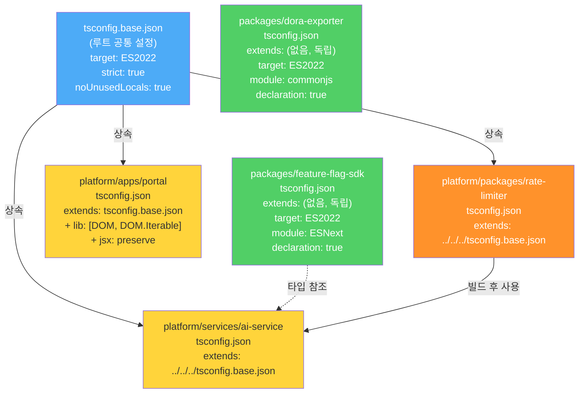
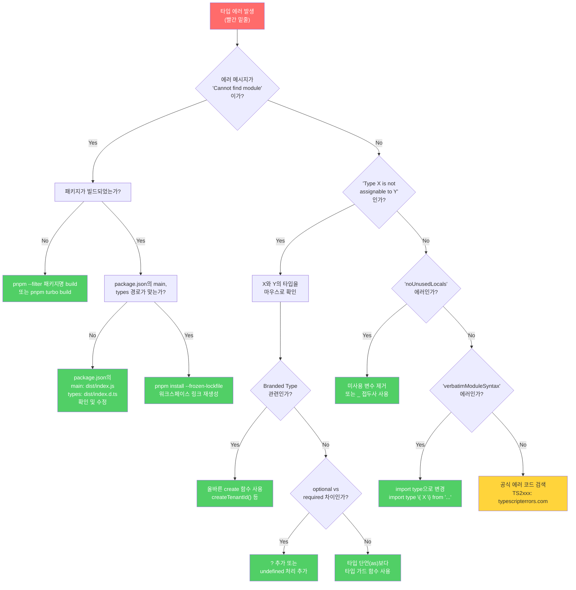

# TypeScript 모노레포 패턴 — tsconfig 계층, 타입 공유, 패키지 간 타입 의존성 관리

> **문서 ID**: ONBOARD-03-39
> **버전**: 1.0.0 | **작성일**: 2026-04-13 | **작성자**: Implementer (Sonnet)
> **선행 학습**: `03-development/22-typescript-advanced.md`, `03-development/07-monorepo-navigation.md`
> **소요 시간**: 약 6~8시간 (실습 포함)
> **CSAP**: D-12 (시스템 개발 보안 — 타입 안전성), D-13 (소프트웨어 보안 — 의존성 관리)
> **관련 코드**: `packages/feature-flag-sdk/src/index.ts`, `packages/dora-exporter/src/index.ts`

---

## 목차

1. [TypeScript 모노레포란?](#1-typescript-모노레포란)
2. [tsconfig 계층 구조](#2-tsconfig-계층-구조)
3. [패키지 참조 (Project References)](#3-패키지-참조-project-references)
4. [타입 공유 전략](#4-타입-공유-전략)
5. [모노레포 타입 체크 최적화](#5-모노레포-타입-체크-최적화)
6. [실제 패키지 분석](#6-실제-패키지-분석)
7. [타입 에러 디버깅 패턴 10가지](#7-타입-에러-디버깅-패턴-10가지)
8. [실습: 새 공유 타입 패키지 추가](#8-실습-새-공유-타입-패키지-추가)
9. [변경 이력](#9-변경-이력)

---

## 1. TypeScript 모노레포란?

### 1.1 초급자를 위한 설명: "하나의 저장소, 여러 패키지"

**모노레포(Monorepo)**는 여러 개의 독립적인 패키지·서비스·앱을 하나의 Git 저장소 안에서 관리하는 방식입니다.

```
[비유] 아파트 단지 vs 단독주택

단독주택 방식 (멀티레포):
  - 집마다 별도 관리자, 별도 열쇠, 별도 규칙
  - A집 규칙 바꿔도 B집은 모름
  - 집 간 공용 시설 공유 어려움

아파트 단지 방식 (모노레포):
  - 단지 전체 공동 관리 (공통 tsconfig, eslint, 패키지 버전)
  - 경비실(CI/CD)이 전체를 한 번에 점검
  - 수영장, 헬스장(공유 라이브러리)을 모든 동이 함께 사용
```

우리 프로젝트 `/data/ai-saas`의 실제 구조는 다음과 같습니다.

```
/data/ai-saas/
├── tsconfig.base.json          ← 모든 패키지의 공통 TypeScript 설정
├── pnpm-workspace.yaml         ← pnpm이 인식하는 워크스페이스 경로
├── turbo.json                  ← 태스크 의존 그래프 (빌드 순서 자동화)
├── packages/                   ← 공유 라이브러리 패키지들
│   ├── feature-flag-sdk/       ← Feature Flag 클라이언트 SDK
│   ├── dora-exporter/          ← DORA 4 메트릭 익스포터
│   ├── ml-pipeline/            ← ML 파이프라인 유틸
│   └── slo-escalation/         ← SLO 알림 에스컬레이션
├── platform/
│   ├── apps/portal/            ← Next.js 15 프론트엔드
│   ├── services/               ← Fastify 5 백엔드 서비스들
│   │   ├── ai-service/
│   │   ├── compliance-service/
│   │   └── security-service/
│   └── packages/               ← 플랫폼 내부 공유 패키지
│       ├── rate-limiter/
│       ├── audit-chain/
│       └── mesh-ready/
└── business-template/          ← 업무 템플릿 서비스들
```

### 1.2 모노레포에서 타입 공유의 어려움

TypeScript 모노레포를 처음 접하는 개발자가 자주 겪는 문제:

**문제 1: "다른 패키지의 타입을 어떻게 가져오나?"**
```typescript
// ❌ 잘못된 방법: 상대 경로로 다른 패키지 접근
import type { FeatureFlagContext } from '../../../packages/feature-flag-sdk/src/index'

// ✅ 올바른 방법: 패키지 이름으로 가져오기
import type { FeatureFlagContext } from '@saas/feature-flag-sdk'
```

**문제 2: "빌드하지 않으면 타입이 없다"**

`dist/index.d.ts`가 없으면 TypeScript는 타입을 찾을 수 없습니다. 이 문제를 해결하는 방법이 Project References입니다.

**문제 3: "tsconfig가 너무 많다"**

패키지마다 `tsconfig.json`이 있어서 어떤 설정이 적용되는지 파악하기 어렵습니다.

### 1.3 우리 프로젝트의 pnpm workspace 설정

```yaml
# /data/ai-saas/pnpm-workspace.yaml (실제 파일)
# 공공기관 SaaS 플랫폼 — pnpm 워크스페이스 정의
# Design Ref: D-P00.1 모노레포 구조
packages:
  - "platform/apps/*"       # Next.js 앱들
  - "platform/services/*"   # Fastify 서비스들
  - "platform/packages/*"   # 플랫폼 공유 패키지
  - "platform/plugins/*"    # Fastify 플러그인
  - "platform/tests/e2e"    # E2E 테스트
  - "business-template/*"   # 업무 템플릿
  - "packages/*"            # 공통 SDK/라이브러리
```

pnpm은 이 경로들을 스캔하여 `package.json`이 있는 디렉터리를 모두 워크스페이스 패키지로 인식합니다.

---

## 2. tsconfig 계층 구조

### 2.1 루트 tsconfig.base.json 분석

```json
// /data/ai-saas/tsconfig.base.json (실제 파일)
{
  "compilerOptions": {
    "target": "ES2022",           // Node.js 22 지원 (최신 문법 허용)
    "lib": ["ES2022"],            // 런타임 라이브러리 타입 (DOM 제외 — 서버 전용)
    "module": "ESNext",           // ES 모듈 사용
    "moduleResolution": "bundler", // Vite/esbuild 스타일 모듈 해석
    "declaration": true,          // .d.ts 파일 생성 (다른 패키지가 사용하기 위해)
    "declarationMap": true,       // 소스맵 포함 (.d.ts → 원본 .ts 연결)
    "sourceMap": true,            // 디버깅용 소스맵
    "outDir": "dist",             // 컴파일 출력 디렉터리
    "rootDir": "src",             // 소스 루트 디렉터리
    "strict": true,               // 엄격 모드 (null 체크, 타입 체크 강화)
    "noUnusedLocals": true,       // 미사용 로컬 변수 에러 (Dead code 방지)
    "noUnusedParameters": true,   // 미사용 매개변수 에러
    "noFallthroughCasesInSwitch": true,  // switch fall-through 금지
    "noUncheckedIndexedAccess": true,    // 배열/객체 접근 시 undefined 가능성 표시
    "esModuleInterop": true,      // CommonJS 모듈 호환성
    "forceConsistentCasingInFileNames": true,  // 파일명 대소문자 일관성 (Linux/Mac 차이 방지)
    "skipLibCheck": true,         // node_modules의 .d.ts 검사 건너뜀 (빌드 속도 향상)
    "resolveJsonModule": true,    // JSON 파일 import 허용
    "isolatedModules": true,      // 파일별 독립 컴파일 (esbuild 호환)
    "verbatimModuleSyntax": true  // import type 강제 (런타임 영향 없는 import 명시)
  },
  "exclude": ["node_modules", "dist"]
}
```

각 옵션이 왜 중요한지 초급자 관점에서 설명합니다.

| 옵션 | 없으면 발생하는 문제 | 공공기관 SaaS 맥락 |
|------|-------------------|--------------------|
| `strict: true` | `null` 참조로 런타임 오류 발생 | 민원 처리 중 오류 = 서비스 장애 |
| `noUnusedLocals` | Dead code 축적 → 유지보수 어려움 | 감리 시 미사용 코드 발견 = 결함 |
| `noUncheckedIndexedAccess` | 배열 접근 시 `undefined` 가능성 무시 | CSAP D-12 입력 검증 우회 가능 |
| `declaration: true` | 다른 패키지가 타입 정보 없음 | SDK 패키지가 타입 제공 불가 |
| `verbatimModuleSyntax` | 타입-only import가 런타임에 포함 | 번들 크기 증가, Tree-shaking 방해 |

### 2.2 패키지별 tsconfig 구조



### 2.3 패키지별 tsconfig 차이점 이해

**케이스 1: feature-flag-sdk (독립 tsconfig)**

```json
// packages/feature-flag-sdk/package.json의 tsconfig 설정
// 실제로 이 패키지는 별도 tsconfig.json 파일이 없어 루트 기반으로 관리됨
// package.json에서 build 스크립트로 tsc 직접 실행
{
  "scripts": {
    "build": "tsc",
    "test": "jest"
  }
}
```

**케이스 2: dora-exporter (commonjs 모듈 사용)**

```json
// packages/dora-exporter/tsconfig.json (실제 파일)
{
  "compilerOptions": {
    "target": "ES2022",
    "module": "commonjs",    // ← CommonJS! ESNext가 아님
    "lib": ["ES2022"],
    "outDir": "./dist",
    "rootDir": "./src",
    "strict": true,
    "esModuleInterop": true,
    "skipLibCheck": true,
    "forceConsistentCasingInFileNames": true,
    "resolveJsonModule": true,
    "declaration": true,
    "declarationMap": true,
    "sourceMap": true
  },
  "include": ["src/**/*"],
  "exclude": ["node_modules", "dist", "tests"]
}
```

> **왜 commonjs인가?** dora-exporter는 Express.js와 prom-client를 사용하는데, 이 라이브러리들이 CommonJS 환경에서 더 안정적으로 동작합니다. 새로 작성하는 패키지는 `module: "ESNext"`를 권장하지만, 기존 생태계 호환성 때문에 commonjs를 유지하는 경우가 있습니다.

### 2.4 Next.js 앱의 tsconfig 특수 설정

```json
// platform/apps/portal/tsconfig.json (패턴)
{
  "extends": "../../../tsconfig.base.json",  // 루트 공통 설정 상속
  "compilerOptions": {
    // 루트 설정을 덮어쓰는 Next.js 전용 설정
    "lib": ["DOM", "DOM.Iterable", "ES2022"], // DOM 타입 추가 (브라우저 환경)
    "module": "ESNext",
    "moduleResolution": "bundler",  // Next.js의 Webpack/Turbopack과 호환
    "jsx": "preserve",              // Next.js가 JSX 변환 담당
    "paths": {
      "@/*": ["./src/*"]            // 경로 별칭 (@/components/... 등)
    },
    "plugins": [
      { "name": "next" }            // Next.js TypeScript 플러그인
    ]
  },
  "include": ["next-env.d.ts", "**/*.ts", "**/*.tsx", ".next/types/**/*.ts"],
  "exclude": ["node_modules"]
}
```

---

## 3. 패키지 참조 (Project References)

### 3.1 Project References가 필요한 이유

초급자에게 가장 혼란스러운 부분입니다. 예시로 설명합니다.

```
[시나리오] ai-service가 rate-limiter 패키지를 사용하려면?

방법 A (Project References 없이):
  1. rate-limiter 패키지를 먼저 빌드 (tsc)
  2. dist/index.js, dist/index.d.ts 생성
  3. 그 다음 ai-service 빌드
  → 개발 중에는 매번 수동으로 순서를 맞춰야 함
  → 타입 에러가 뒤늦게 발견됨

방법 B (Project References 사용):
  1. tsconfig.json에 references 설정
  2. tsc --build 명령 하나로 순서 자동 계산
  3. 변경된 패키지만 재컴파일 (증분 빌드)
  → 개발 중 실시간 타입 에러 표시
  → CI 시간 50~70% 단축
```

### 3.2 Project References 설정 방법

```json
// platform/services/ai-service/tsconfig.json (권장 패턴)
{
  "extends": "../../../tsconfig.base.json",
  "compilerOptions": {
    "outDir": "dist",
    "rootDir": "src",
    "composite": true,           // Project References 필수 옵션
    "incremental": true,         // 증분 빌드 활성화 (빌드 캐시 사용)
    "tsBuildInfoFile": ".tsbuildinfo"  // 빌드 캐시 파일 위치
  },
  "references": [
    // 의존하는 패키지들을 명시
    { "path": "../../../platform/packages/rate-limiter" },
    { "path": "../../../platform/packages/audit-chain" },
    { "path": "../../../platform/packages/mesh-ready" }
  ],
  "include": ["src/**/*.ts"]
}
```

참조되는 패키지도 `composite: true`를 설정해야 합니다.

```json
// platform/packages/rate-limiter/tsconfig.json
{
  "extends": "../../../tsconfig.base.json",
  "compilerOptions": {
    "outDir": "dist",
    "rootDir": "src",
    "composite": true,           // 참조되는 쪽도 composite 필수
    "declaration": true,         // .d.ts 파일 반드시 생성
    "declarationMap": true       // 소스 맵 포함
  }
}
```

### 3.3 빌드 명령어 비교

```bash
# 일반 빌드 (순서 수동 관리)
cd packages/feature-flag-sdk && tsc
cd platform/packages/rate-limiter && tsc
cd platform/services/ai-service && tsc

# Project References 빌드 (순서 자동 계산)
tsc --build platform/services/ai-service/tsconfig.json
# → 의존 패키지를 자동으로 먼저 빌드

# 변경된 파일만 재빌드 (증분)
tsc --build --incremental

# Turbo를 통한 병렬 빌드 (실제 프로젝트 사용 방식)
pnpm turbo build
# turbo.json의 "dependsOn": ["^build"] 에 따라 순서 자동 계산
```

### 3.4 turbo.json에서의 빌드 의존성

```json
// /data/ai-saas/turbo.json (실제 파일)
{
  "$schema": "https://turborepo.dev/schema.json",
  "tasks": {
    "build": {
      "dependsOn": ["^build"],   // ^ = 의존 패키지를 먼저 빌드
      "outputs": ["dist/**", ".next/**"],
      "env": ["NODE_ENV"]
    },
    "typecheck": {
      "dependsOn": ["^build"]    // 타입 체크도 의존 패키지 빌드 후 실행
    },
    "test": {
      "dependsOn": ["^build"],
      "env": ["DATABASE_URL", "REDIS_URL", "NODE_ENV"]
    }
  }
}
```

`"dependsOn": ["^build"]`의 의미: `^` 접두사는 "이 패키지가 의존하는 모든 패키지의 `build` 태스크가 먼저 완료되어야 한다"는 의미입니다.

---

## 4. 타입 공유 전략

### 4.1 공유 타입 패키지 설계 원칙

```
[설계 원칙] 타입 공유의 3가지 방법

방법 1: 직접 타입 패키지 (@saas/types)
  - 순수한 TypeScript 타입만 포함 (런타임 코드 없음)
  - 모든 패키지가 동일한 타입 버전 사용
  - 장점: 순환 의존성 없음
  - 단점: 타입 업데이트 시 모든 패키지 재빌드

방법 2: SDK와 타입을 함께 제공 (@saas/feature-flag-sdk)
  - 기능 코드 + 타입을 한 패키지에
  - feature-flag-sdk의 실제 방식
  - 장점: 사용하기 편리, 타입-구현 불일치 불가
  - 단점: SDK를 쓰지 않으면 타입도 못 씀

방법 3: Zod 스키마에서 타입 추출
  - z.infer<typeof schema>로 런타임 검증 + 타입 동시 해결
  - dora-exporter의 Webhook 스키마 방식
  - 장점: 검증 로직과 타입이 항상 동기화됨
  - 단점: Zod에 의존성 추가
```

### 4.2 Branded Type으로 도메인 타입 격리

공공기관 SaaS에서는 비슷해 보이지만 혼용하면 안 되는 ID들이 많습니다.

```typescript
// ❌ 위험: string 타입은 어디에나 쓸 수 있음
function getTenantData(tenantId: string, userId: string) {
  // tenantId와 userId를 바꿔 넣어도 컴파일 에러 없음!
}

getTenantData(userId, tenantId)  // 런타임 오류, 보안 취약점

// ✅ 안전: Branded Type으로 명확히 구분
type TenantId = string & { readonly __brand: 'TenantId' }
type UserId = string & { readonly __brand: 'UserId' }
type AgentId = string & { readonly __brand: 'AgentId' }

// 생성 함수 (검증 포함)
function createTenantId(id: string): TenantId {
  if (!id.startsWith('tenant-') && !isUUID(id)) {
    throw new Error(`유효하지 않은 TenantId: ${id}`)
  }
  return id as TenantId
}

function getTenantData(tenantId: TenantId, userId: UserId) {
  // 올바른 사용
}

// 이제 바꿔 넣으면 컴파일 에러!
getTenantData(userId, tenantId)
//            ^^^^^^ 타입 에러: UserId는 TenantId에 할당 불가
```

### 4.3 제네릭 유틸리티 타입 — 공공기관 SaaS 표준 응답

```typescript
// 표준 API 응답 래퍼 타입 (공유 타입 패키지에 정의)
export interface ApiResponse<T> {
  success: boolean
  data: T
  meta?: {
    page?: number
    limit?: number
    total?: number
    cursor?: string
  }
}

export interface ApiError {
  success: false
  error: {
    code: string        // ERR-AUTH-001 형식
    message: string     // 한국어 사용자 친화적 메시지
    errorId: string     // 추적용 UUID (CSAP D-06)
    timestamp: string
  }
}

// 사용 예시
type UsersResponse = ApiResponse<User[]>
type UserDetailResponse = ApiResponse<User>
type ModelListResponse = ApiResponse<AiModel[]>

// routes.ts의 OpenAPI 스키마와 연동
// Design Ref: routes.ts §listResponse, §modelResponse
const modelResponse = {
  type: 'object' as const,
  properties: {
    success: { type: 'boolean' as const },
    data: { type: 'object' as const }
  },
}
```

### 4.4 조건부 타입으로 N2SF 데이터 등급 표현

```typescript
// N2SF 데이터 등급 (공공기관 SaaS 핵심 타입)
export type DataGrade = 'C' | 'S' | 'O'

// 등급별 허용 작업을 타입으로 표현
export type AllowedForGrade<G extends DataGrade> =
  G extends 'O' ? 'read' | 'write' | 'ai-process' | 'export' :
  G extends 'S' ? 'read' | 'write' :
  G extends 'C' ? 'read' :
  never

// 컴파일 타임에 잘못된 사용 방지
function processWithAI<G extends DataGrade>(
  data: unknown,
  grade: G,
  _operation: AllowedForGrade<G>
): void {
  // grade가 'C' 또는 'S'이면 'ai-process'는 타입 에러
}

processWithAI(data, 'O', 'ai-process')   // ✅ 정상
processWithAI(data, 'C', 'ai-process')   // ❌ 타입 에러! (CSAP N2SF 위반 사전 차단)
processWithAI(data, 'S', 'export')       // ❌ 타입 에러!
```

### 4.5 Zod 스키마에서 타입 추출 패턴

dora-exporter가 실제로 사용하는 방식입니다.

```typescript
// packages/dora-exporter/src/index.ts에서 실제 사용 (Design Ref: §67-93)
import { z } from 'zod'

// Zod 스키마 정의 (런타임 검증 + 타입 추출)
const giteaWebhookSchema = z.object({
  ref: z.string(),
  after: z.string(),
  repository: z.object({
    full_name: z.string(),
  }),
  commits: z.array(z.object({
    id: z.string(),
    timestamp: z.string(),
    message: z.string(),
  })),
  pusher: z.object({
    login: z.string(),
  }),
})

// 스키마에서 TypeScript 타입 자동 추출
type GiteaWebhookPayload = z.infer<typeof giteaWebhookSchema>
// 위 타입은 다음과 동일:
// {
//   ref: string
//   after: string
//   repository: { full_name: string }
//   commits: Array<{ id: string; timestamp: string; message: string }>
//   pusher: { login: string }
// }

// 런타임 검증 (타입 안전성 보장)
const payload = giteaWebhookSchema.parse(req.body)
// parse 실패 시 ZodError 던짐 → catch에서 400 에러 반환
// parse 성공 시 payload는 GiteaWebhookPayload 타입 보장
```

---

## 5. 모노레포 타입 체크 최적화

### 5.1 전체 타입 체크 명령어

```bash
# 전체 타입 체크 (모든 패키지)
pnpm turbo typecheck

# 특정 패키지만 타입 체크
pnpm --filter @saas/feature-flag-sdk typecheck
pnpm --filter @ai-saas/dora-exporter typecheck
pnpm --filter ai-service typecheck

# 변경된 파일이 있는 패키지만 체크 (Turbo 캐시 활용)
pnpm turbo typecheck --filter ...[HEAD^1]
```

### 5.2 Turbo 타입 체크 태스크 설정

```json
// turbo.json에 typecheck 태스크 추가 (현재 실제 파일 기반)
{
  "tasks": {
    "typecheck": {
      "dependsOn": ["^build"],   // 의존 패키지를 먼저 빌드해야 타입 참조 가능
      "cache": true,             // 소스 변경 없으면 캐시 재사용
      "inputs": [
        "src/**/*.ts",
        "src/**/*.tsx",
        "tsconfig.json",
        "package.json"
      ]
    }
  }
}
```

### 5.3 VSCode에서 모노레포 타입 체크 최적화

```json
// .vscode/settings.json (팀 공유 설정)
{
  // TypeScript 서버가 참조하는 tsconfig 지정
  "typescript.tsdk": "node_modules/typescript/lib",

  // 프로젝트 전체 타입 체크 활성화 (Project References 지원)
  "typescript.enableProjectDiagnostics": true,

  // 대용량 모노레포에서 TypeScript 서버 메모리 증가
  "typescript.tsserver.maxTsServerMemory": 4096,

  // 파일 감시자 제외 (node_modules, dist는 감시 불필요)
  "files.watcherExclude": {
    "**/node_modules/**": true,
    "**/dist/**": true,
    "**/.tsbuildinfo": true
  }
}
```

### 5.4 증분 빌드 캐시 전략

```bash
# tsbuildinfo 파일로 증분 빌드
# .tsbuildinfo에 이전 빌드 정보가 저장됨

# 첫 빌드 (느림 — 전체 컴파일)
pnpm turbo build
# → packages/dora-exporter/.tsbuildinfo 생성

# 이후 빌드 (빠름 — 변경된 파일만 재컴파일)
# 소스 파일 수정 후
pnpm turbo build
# → 수정된 파일과 그 파일을 참조하는 파일만 재컴파일

# 캐시 완전 초기화 (타입 에러가 이상할 때)
find . -name "*.tsbuildinfo" -not -path "*/node_modules/*" -delete
find . -name "dist" -not -path "*/node_modules/*" -type d -exec rm -rf {} +
pnpm turbo build
```

---

## 6. 실제 패키지 분석

### 6.1 feature-flag-sdk 타입 구조 분석

`packages/feature-flag-sdk/src/index.ts`의 실제 타입 구조를 분석합니다.

```typescript
// Design Ref: MTU-N234 SS4 / Plan SC: FR-FF.3
// 실제 파일: packages/feature-flag-sdk/src/index.ts

// ── 설정 타입 ─────────────────────────────────
export interface FeatureFlagConfig {
  apiUrl: string           // Unleash API URL (Edge 또는 Server)
  apiKey: string           // 환경 변수에서 주입 (CSAP D-09 하드코딩 금지)
  appName: string          // 애플리케이션 이름
  refreshInterval?: number // 선택적 — 기본 15000ms
  metricsInterval?: number // 선택적 — 기본 60000ms
}

// ── 컨텍스트 타입 (멀티테넌트 핵심) ──────────────
export interface FeatureFlagContext {
  userId?: string           // 사용자 ID (선택적)
  tenantId?: string         // 테넌트 ID — 테넌트별 플래그 활성화에 필수
  environment?: string      // 환경 (prod/stg/dev)
  properties?: Record<string, string>  // 커스텀 속성
}

// ── 평가 결과 타입 ────────────────────────────
export interface FeatureFlagEvaluation {
  flagName: string
  enabled: boolean
  variant?: string          // A/B 테스트 변형
  evaluatedAt: string       // ISO 8601 타임스탬프
  context?: FeatureFlagContext
}

// ── 감사 로그용 이벤트 타입 ───────────────────
export interface FlagChangeEvent {
  flagName: string
  action: 'created' | 'updated' | 'deleted' | 'toggled'  // 유니온 타입으로 열거값 제한
  newState: boolean
  actor: string
  timestamp: string
}

// ── 인터페이스 기반 추상화 ────────────────────
export interface IFeatureFlagClient {
  initialize(): Promise<void>
  isEnabled(flagName: string, context?: FeatureFlagContext): boolean
  getVariant(flagName: string, context?: FeatureFlagContext): string | undefined
  getActiveFlags(): string[]
  destroy(): void
}
```

**설계 포인트 1: 인터페이스로 추상화**

`IFeatureFlagClient` 인터페이스를 통해 Unleash SDK를 직접 노출하지 않습니다. 향후 LaunchDarkly, AWS AppConfig 등 다른 Feature Flag 백엔드로 교체해도 호출 코드는 변경 불필요합니다.

**설계 포인트 2: 팩토리 함수 패턴**

```typescript
// 팩토리 함수로 환경 변수 자동 주입
export function createFeatureFlagClient(
  overrides?: Partial<FeatureFlagConfig>
): IFeatureFlagClient {
  // 환경 변수에서 설정 로드 (하드코딩 금지 — CSAP D-09)
  const config: FeatureFlagConfig = {
    apiUrl: overrides?.apiUrl ?? process.env.UNLEASH_API_URL ?? 'http://unleash-edge:3063/api',
    apiKey: overrides?.apiKey ?? process.env.UNLEASH_API_KEY ?? '',
    appName: overrides?.appName ?? process.env.APP_NAME ?? 'saas-platform',
    refreshInterval: overrides?.refreshInterval ?? 15000,
    metricsInterval: overrides?.metricsInterval ?? 60000,
  }

  if (!config.apiKey) {
    throw new Error('UNLEASH_API_KEY 환경 변수가 설정되지 않았습니다')
  }

  return new UnleashFeatureFlagClient(config)
}

// 사용하는 쪽 코드 (ai-service 등)
import { createFeatureFlagClient } from '@saas/feature-flag-sdk'
const client = createFeatureFlagClient()  // 환경 변수 자동 로드
await client.initialize()
const isEnabled = client.isEnabled('advanced-rag', { tenantId: 'tenant-001' })
```

**설계 포인트 3: 생성자 검증**

```typescript
constructor(config: FeatureFlagConfig) {
  // CSAP D-09: API 키 하드코딩 검증
  // 'sk-'로 시작하는 OpenAI 스타일 키나 너무 짧은 키 거부
  if (!config.apiKey || config.apiKey.startsWith('sk-') || config.apiKey.length < 10) {
    throw new Error('유효한 API 키를 환경 변수에서 제공해야 합니다 (하드코딩 금지 - CSAP D-09)')
  }
  // ...
}
```

### 6.2 dora-exporter 타입 구조 분석

`packages/dora-exporter/src/index.ts`의 핵심 패턴을 분석합니다.

```typescript
// Design Ref: docs/02-design/mtus/MTU-N169-dora-metrics.design.md §3
// Plan SC: FR-DORA.1 ~ FR-DORA.5

// ── Prometheus 메트릭 타입 ─────────────────────
// prom-client 라이브러리 타입 사용
import { Registry, Counter, Histogram, Gauge, collectDefaultMetrics } from 'prom-client'

// Counter: 단조 증가 (배포 횟수)
const deploymentTotal = new Counter({
  name: 'dora_deployment_total',
  help: '배포 횟수 (DORA Deployment Frequency)',
  labelNames: ['team', 'service', 'environment'] as const,  // as const로 리터럴 타입 유지
  registers: [register],
})

// Histogram: 분포 측정 (리드타임, 복구 시간)
const leadTimeSeconds = new Histogram({
  name: 'dora_lead_time_seconds',
  help: '변경 리드타임 (초)',
  labelNames: ['team', 'service'] as const,
  buckets: [60, 300, 900, 1800, 3600, 7200, 14400, 28800, 86400, 604800],
  registers: [register],
})

// Gauge: 임의 값 (변경 실패율, DORA 등급)
const changeFailureRate = new Gauge({
  name: 'dora_change_failure_rate',
  help: '변경 실패율 (0.0 ~ 1.0)',
  labelNames: ['team', 'service'] as const,
  registers: [register],
})
```

**`as const`의 중요성**: `labelNames`에 `as const`를 붙이면 타입이 `string[]`이 아닌 `readonly ['team', 'service', 'environment']`가 됩니다. 이렇게 하면 `.inc({ team: 'a', service: 'b', invalid: 'c' })`처럼 잘못된 레이블을 사용하면 타입 에러가 발생합니다.

**내보내기 전략 분석**:

```typescript
// index.ts 마지막 줄
export { app, register }
// app: Express 앱 인스턴스 (테스트에서 supertest로 사용)
// register: Prometheus 레지스트리 (메트릭 수집기에서 사용)
```

이처럼 최소한의 것만 내보내고, 내부 구현(Counter, Gauge 등)은 내보내지 않습니다. 이를 **캡슐화된 모듈 인터페이스**라고 합니다.

### 6.3 내보내기(Export) 전략 비교

| 전략 | 예시 | 장점 | 단점 | 우리 프로젝트 사용 |
|------|------|------|------|-----------------|
| Named Export | `export interface X {}` | 트리쉐이킹 가능 | 이름 변경 시 호출 코드도 변경 | 타입, 함수 모두 사용 |
| Default Export | `export default class X {}` | 가져올 때 이름 자유 | 자동완성 약함, 혼란 야기 | 사용 자제 |
| Barrel Export | `export * from './types'` | 한 곳에서 모두 가져오기 | 순환 의존성, 번들 크기 | 신중하게 사용 |
| Type-only Export | `export type { X }` | 런타임 코드 없음 | — | 타입만 공유할 때 |

```typescript
// ✅ 권장: 명시적 named export
// packages/feature-flag-sdk/src/index.ts
export interface FeatureFlagConfig { ... }
export interface IFeatureFlagClient { ... }
export class UnleashFeatureFlagClient implements IFeatureFlagClient { ... }
export function createFeatureFlagClient(...) { ... }

// 사용하는 쪽
import {
  type FeatureFlagConfig,    // type-only import (verbatimModuleSyntax 준수)
  type IFeatureFlagClient,
  createFeatureFlagClient,
} from '@saas/feature-flag-sdk'
```

---

## 7. 타입 에러 디버깅 패턴 10가지

### 7.1 의사결정 트리



### 7.2 패턴별 에러와 해결법

**패턴 1: Cannot find module**

```
오류: Cannot find module '@saas/feature-flag-sdk' or its corresponding type declarations.
```

```bash
# 원인 1: 패키지 미빌드
cd packages/feature-flag-sdk && pnpm build

# 원인 2: 패키지 미설치
pnpm install

# 원인 3: package.json의 types 경로 오류
# package.json 확인:
# "main": "dist/index.js"      ← 존재해야 함
# "types": "dist/index.d.ts"   ← 존재해야 함
```

**패턴 2: noUnusedParameters 에러**

```typescript
// 오류: 'context' is declared but its value is never read. ts(6133)
isEnabled(flagName: string, context?: FeatureFlagContext): boolean {
  return this.flagCache.get(flagName) ?? false
}

// 해결: 미사용 매개변수에 _ 접두사 (TypeScript 관례)
// feature-flag-sdk의 실제 코드와 동일한 패턴
isEnabled(flagName: string, _context?: FeatureFlagContext): boolean {
  return this.flagCache.get(flagName) ?? false
}
```

**패턴 3: noUncheckedIndexedAccess 에러**

```typescript
// 오류: 'string | undefined'에서 string 메서드 호출 불가
const commits = payload.commits
const firstCommit = commits[0]
console.log(firstCommit.id)  // 에러: 'firstCommit' is possibly 'undefined'

// 해결 1: Optional chaining
console.log(firstCommit?.id)

// 해결 2: 조건 검사
if (firstCommit) {
  console.log(firstCommit.id)  // 이제 안전
}

// 해결 3: Non-null assertion (확실히 존재할 때만)
console.log(commits[0]!.id)  // 주의: 런타임 오류 가능
```

**패턴 4: verbatimModuleSyntax 에러**

```typescript
// 오류: This import is never used as a value and must use 'import type'
import { FeatureFlagConfig } from '@saas/feature-flag-sdk'

// 해결: import type 사용 (런타임에 코드 없음)
import type { FeatureFlagConfig } from '@saas/feature-flag-sdk'
```

**패턴 5: 순환 타입 참조**

```
오류: Type alias 'A' circularly references itself.
오류: 'X' implicitly has type 'any' because it does not have a type annotation
      and is referenced directly or indirectly in its own initializer.
```

```typescript
// 문제: 순환 참조
interface TreeNode {
  children: TreeNode[]  // 재귀 타입은 OK
  parent: TreeNode      // 부모도 같은 타입 (무한 순환)
}

// 해결: 순환 부분을 optional 또는 lazy로
interface TreeNode {
  children: TreeNode[]
  parent?: TreeNode  // optional로 순환 차단
}
```

**패턴 6: Zod.parse 이후 타입 추론 실패**

```typescript
// 문제: parse 후에도 타입이 unknown으로 표시되는 경우
const result = schema.safeParse(data)
if (result.success) {
  // result.data는 자동으로 올바른 타입
  console.log(result.data.ref)  // ✅ 정상

  // 하지만 이렇게 하면 안됨
  const payload = result as any  // ❌ any 사용 금지
}

// 올바른 패턴
if (error instanceof z.ZodError) {
  res.status(400).json({ error: 'Invalid payload', details: error.issues })
  return
}
// 이후 코드에서 payload는 타입 보장됨
const payload = giteaWebhookSchema.parse(req.body)
```

**패턴 7: 제네릭 타입 추론 실패**

```typescript
// 문제: 타입 인수를 명시해야 하는 경우
const response = createResponse(data)  // data 타입이 any

// 해결: 명시적 타입 인수
const response = createResponse<User[]>(data)

// 또는 타입이 명확한 변수 사용
const users: User[] = await fetchUsers()
const response = createResponse(users)  // 자동 추론
```

**패턴 8: as const 빠뜨리기**

```typescript
// 문제: labelNames 타입이 string[]로 추론됨
const counter = new Counter({
  labelNames: ['team', 'service'],  // 타입: string[]
})
counter.inc({ team: 'a', invalid_label: 'b' })  // 에러 없음! (위험)

// 해결: as const로 리터럴 타입 유지
const counter = new Counter({
  labelNames: ['team', 'service'] as const,  // 타입: readonly ['team', 'service']
})
counter.inc({ team: 'a', invalid_label: 'b' })  // ✅ 타입 에러 발생
```

**패턴 9: 교차 타입(Intersection)과 유니온 타입(Union) 혼동**

```typescript
// 교차 타입 (&): 두 타입을 모두 만족
type AdminUser = User & Admin  // User와 Admin 속성 모두 가짐

// 유니온 타입 (|): 둘 중 하나
type DataGrade = 'C' | 'S' | 'O'  // 세 가지 중 하나

// 실수: 유니온 타입에서 공통 속성만 접근 가능
function processGrade(grade: DataGrade) {
  // grade.toUpperCase()  // string 메서드 ✅
  // grade === 'O'        // 비교 ✅
}
```

**패턴 10: tsconfig 상속 설정 충돌**

```bash
# 문제: 상속받은 설정이 덮어써지지 않음을 모름
# 예: 루트에 "module": "ESNext"지만 패키지에서 "module": "commonjs"로 덮어쓰기 가능

# 진단: 실제 적용된 설정 확인
tsc --showConfig --project packages/dora-exporter/tsconfig.json

# 충돌 확인 후 명시적으로 덮어쓰기
{
  "extends": "../../tsconfig.base.json",
  "compilerOptions": {
    "module": "commonjs"  // 루트의 ESNext를 의도적으로 commonjs로 덮어씀
  }
}
```

---

## 8. 실습: 새 공유 타입 패키지 추가

### 8.1 시나리오

**목표**: `@saas/common-types`라는 새 공유 타입 패키지를 추가하여 모든 서비스에서 표준 API 응답 타입과 N2SF 데이터 등급 타입을 공유합니다.

**예상 소요 시간**: 45분~1시간

### 8.2 단계별 가이드

**Step 1: 패키지 디렉터리 생성**

```bash
# 공유 타입 패키지 디렉터리 생성
mkdir -p /data/ai-saas/packages/common-types/src
```

**Step 2: package.json 작성**

```json
// /data/ai-saas/packages/common-types/package.json
{
  "name": "@saas/common-types",
  "version": "1.0.0",
  "description": "공공기관 SaaS 플랫폼 공통 타입 정의",
  "main": "dist/index.js",
  "types": "dist/index.d.ts",
  "exports": {
    ".": {
      "types": "./dist/index.d.ts",
      "default": "./dist/index.js"
    }
  },
  "scripts": {
    "build": "tsc",
    "typecheck": "tsc --noEmit"
  },
  "devDependencies": {
    "typescript": "^5.7.0"
  }
}
```

**Step 3: tsconfig.json 작성**

```json
// /data/ai-saas/packages/common-types/tsconfig.json
{
  "extends": "../../tsconfig.base.json",
  "compilerOptions": {
    "outDir": "dist",
    "rootDir": "src",
    "composite": true,
    "declaration": true,
    "declarationMap": true
  },
  "include": ["src/**/*.ts"]
}
```

**Step 4: 타입 정의 파일 작성**

```typescript
// /data/ai-saas/packages/common-types/src/index.ts

// ── N2SF 데이터 등급 ─────────────────────────────────────
// Design Ref: CSAP N2SF 분류 체계
export type DataGrade = 'C' | 'S' | 'O'

// ── Branded Types ────────────────────────────────────────
// 도메인 식별자 혼용 방지 (CSAP D-08 테넌트 격리)
export type TenantId = string & { readonly __brand: 'TenantId' }
export type UserId = string & { readonly __brand: 'UserId' }
export type AgentId = string & { readonly __brand: 'AgentId' }

export function asTenantId(id: string): TenantId {
  return id as TenantId
}

export function asUserId(id: string): UserId {
  return id as UserId
}

// ── 표준 API 응답 타입 ────────────────────────────────────
// Design Ref: routes.ts §86-100 — OpenAPI 스키마와 일치
export interface ApiSuccess<T> {
  success: true
  data: T
  meta?: PaginationMeta
}

export interface ApiError {
  success: false
  error: {
    code: string        // ERR-AUTH-001 형식
    message: string     // 한국어 사용자 메시지
    errorId: string     // 감사 추적용 UUID (CSAP D-06)
    timestamp: string   // ISO 8601
  }
}

export type ApiResponse<T> = ApiSuccess<T> | ApiError

// ── 페이지네이션 타입 ──────────────────────────────────────
export interface PaginationMeta {
  page?: number
  limit?: number
  total?: number
  cursor?: string   // 커서 기반 페이지네이션
}

export interface PaginationQuery {
  page?: number
  limit?: number
  cursor?: string
  sortBy?: string
  sortOrder?: 'asc' | 'desc'
}

// ── 감사 로그 타입 ────────────────────────────────────────
// Design Ref: CSAP D-06 침해사고 관리
export interface AuditLogEntry {
  actor: string         // 행위자 ID (사용자 또는 서비스)
  action: string        // 수행한 작업
  target?: string       // 대상 리소스 ID
  tenantId: string      // 테넌트 ID
  timestamp: string     // ISO 8601
  ip?: string           // 클라이언트 IP
  result: 'success' | 'failure'
  metadata?: Record<string, unknown>
}
```

**Step 5: 다른 패키지에서 사용**

```typescript
// platform/services/ai-service/src/types.ts
import type {
  DataGrade,
  TenantId,
  ApiResponse,
  AuditLogEntry,
} from '@saas/common-types'

// 사용 예시
async function handleChat(
  tenantId: TenantId,
  grade: DataGrade,
): Promise<ApiResponse<{ answer: string }>> {
  if (grade !== 'O') {
    return {
      success: false,
      error: {
        code: 'ERR-N2SF-001',
        message: 'O등급 데이터만 AI 처리 가능합니다',
        errorId: crypto.randomUUID(),
        timestamp: new Date().toISOString(),
      },
    }
  }
  // ...
}
```

**Step 6: package.json 의존성 추가**

```json
// platform/services/ai-service/package.json
{
  "dependencies": {
    "@saas/common-types": "workspace:*"  // workspace 프로토콜 사용
  }
}
```

**Step 7: 빌드 및 타입 체크**

```bash
# 새 패키지 빌드
pnpm --filter @saas/common-types build

# 의존성 설치
pnpm install

# 전체 타입 체크
pnpm turbo typecheck

# 특정 서비스만
pnpm --filter ai-service typecheck
```

### 8.3 검증 체크리스트

실습 완료 후 다음을 확인합니다.

```bash
# 1. 빌드 파일 생성 확인
ls packages/common-types/dist/
# index.js, index.d.ts, index.d.ts.map, index.js.map 이 있어야 함

# 2. 타입 체크 통과
pnpm --filter @saas/common-types typecheck
# 오류 없이 완료되어야 함

# 3. 다른 패키지에서 import 가능한지 확인
# VSCode에서 @saas/common-types를 import할 때 자동완성 동작하는지 확인

# 4. Dead code 없음 확인
npx ts-prune packages/common-types/src/index.ts
# 모든 export가 사용되어야 함 (미사용 export는 제거)
```

---

## 9. 변경 이력

| 버전 | 일자 | 내용 | 작성자 |
|------|------|------|--------|
| 1.0.0 | 2026-04-13 | 최초 작성 — tsconfig 계층, Project References, 타입 공유 전략, 실제 패키지 분석 | Implementer (Sonnet) |

---

*이 문서는 `/data/ai-saas/packages/feature-flag-sdk/src/index.ts` 및 `/data/ai-saas/packages/dora-exporter/src/index.ts` 실제 소스 파일을 기반으로 작성되었습니다.*
*다음 학습: `03-development/40-advanced-testing-patterns.md` (예정)*
