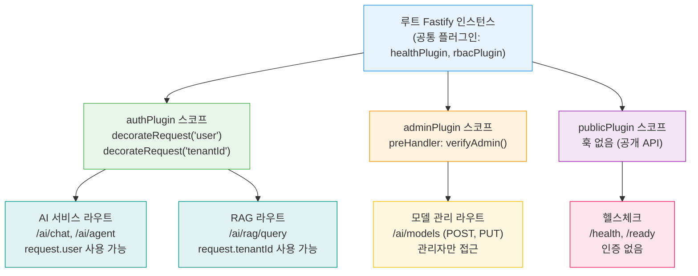
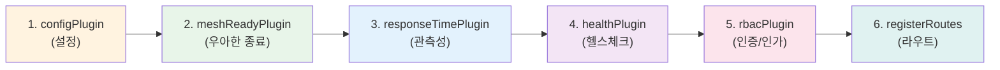
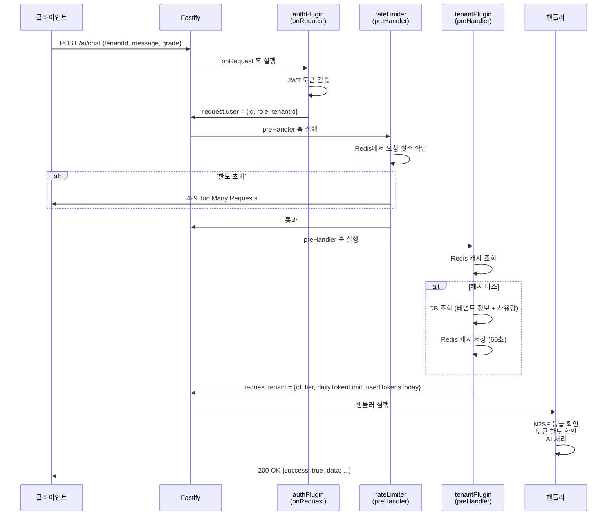

# Fastify 플러그인 시스템 완전 가이드

> 공공기관 SaaS 프레임워크 온보딩 시리즈 — 개발편 40
> 대상 독자: Fastify를 처음 접하는 초급 개발자
> CSAP D-08(접근통제) / D-06(감사로그) 요건 구현 기준 포함

---

## 목차

1. [Fastify 플러그인이란?](#1-fastify-플러그인이란)
2. [Encapsulation (캡슐화) 이해](#2-encapsulation-캡슐화-이해)
3. [플러그인 설계 패턴](#3-플러그인-설계-패턴)
4. [공통 플러그인 구현](#4-공통-플러그인-구현)
5. [플러그인 의존성 관리](#5-플러그인-의존성-관리)
6. [플러그인 테스트 전략](#6-플러그인-테스트-전략)
7. [CSAP 요건 플러그인화](#7-csap-요건-플러그인화)
8. [실습: 테넌트 컨텍스트 플러그인 작성](#8-실습-테넌트-컨텍스트-플러그인-작성)

---

## 1. Fastify 플러그인이란?

### 1.1 초급자를 위한 설명

Fastify 플러그인은 **기능 단위로 서버를 조립하는 블록**입니다. 레고 블록을 조립하듯, 인증 블록·로깅 블록·데이터베이스 블록을 각각 만들어두고 조합해서 완성된 서버를 구성합니다.

플러그인이 없다면 어떻게 될까요? 모든 기능이 하나의 파일에 뒤섞이고, 코드가 수천 줄로 불어나며, 테스트하기 어려워집니다. 플러그인 아키텍처는 이 문제를 해결합니다.

```
서버 = 기반(Fastify) + 플러그인A(인증) + 플러그인B(DB) + 플러그인C(감사로그) + 라우트
```

### 1.2 왜 플러그인 아키텍처가 중요한가

공공기관 SaaS 환경에서 플러그인이 특히 중요한 이유는 다음과 같습니다.

**보안 일관성 (CSAP D-08)**
- 모든 서비스에 동일한 인증 로직을 적용해야 합니다
- 인증 플러그인을 한 번 만들면 어느 서비스에도 재사용 가능합니다
- 보안 패치가 필요할 때 플러그인 하나만 수정하면 전체에 반영됩니다

**감사 로그 자동화 (CSAP D-06)**
- 모든 API 호출에 감사 로그를 남겨야 합니다
- 라우트마다 감사 로그 코드를 반복 작성하면 누락이 발생합니다
- 감사 로그 플러그인이 자동으로 처리합니다

**멀티테넌트 격리**
- 각 테넌트(공공기관)의 데이터는 절대 혼재되면 안 됩니다
- 테넌트 컨텍스트 플러그인이 요청마다 올바른 테넌트 ID를 주입합니다

### 1.3 Fastify vs Express 플러그인 비교

| 항목 | Express 미들웨어 | Fastify 플러그인 |
|------|----------------|----------------|
| 등록 방식 | `app.use()` | `app.register()` |
| 스코프 격리 | 없음 (전역) | 있음 (캡슐화) |
| 비동기 지원 | 콜백 필요 | async/await 네이티브 |
| 타입 안전성 | 약함 | TypeScript 완전 지원 |
| 의존성 선언 | 없음 | `fastify-plugin` 데코레이터로 명시 |
| 성능 | 보통 | 훅 기반으로 최적화됨 |

Express는 미들웨어가 단순히 `(req, res, next)` 함수입니다. Fastify 플러그인은 서버 인스턴스에 기능을 **주입**하고 자체적인 **스코프**를 가집니다.

```typescript
// Express 방식 — 전역에 영향
app.use((req, res, next) => {
  req.tenantId = extractTenantId(req);
  next();
});

// Fastify 방식 — 명시적 스코프와 타입 지원
app.register(async (fastify) => {
  fastify.decorateRequest('tenantId', '');
  fastify.addHook('onRequest', async (request) => {
    request.tenantId = extractTenantId(request);
  });
});
```

---

## 2. Encapsulation (캡슐화) 이해

### 2.1 스코프 격리란?

Fastify의 핵심 철학은 **플러그인 캡슐화**입니다. 자식 플러그인에서 추가한 데코레이터나 훅은 부모나 형제 플러그인에 영향을 주지 않습니다.

```
app (루트)
├── plugin-A: decorateReply('sendCsv') 추가
│   └── route-A1: reply.sendCsv() 사용 가능
│   └── route-A2: reply.sendCsv() 사용 가능
├── plugin-B (별도 스코프)
│   └── route-B1: reply.sendCsv() 사용 불가! (다른 스코프)
└── route-root: reply.sendCsv() 사용 불가! (추가 전 루트)
```

이 격리 덕분에 서로 다른 팀이 작성한 플러그인이 충돌하지 않습니다.

### 2.2 스코프 계층 다이어그램



### 2.3 캡슐화 동작 확인

```typescript
import Fastify from 'fastify';

const app = Fastify();

// 루트 수준: 모든 플러그인에서 접근 가능
app.decorate('config', { maxTokens: 8192 });

// 스코프가 있는 플러그인 (캡슐화)
app.register(async (child) => {
  child.decorate('secretKey', 'ONLY_HERE');  // 이 스코프 안에서만 유효

  child.get('/internal', async (request, reply) => {
    // app.config.maxTokens 접근 가능 (부모 상속)
    // child.secretKey 접근 가능 (현재 스코프)
    return { maxTokens: (child as any).config.maxTokens };
  });
});

// 루트 라우트
app.get('/public', async (request, reply) => {
  // app.config.maxTokens 접근 가능
  // secretKey 접근 불가! (다른 스코프)
  return { ok: true };
});
```

### 2.4 fastify-plugin으로 캡슐화 해제

때로는 플러그인이 추가한 기능을 **전체 서버에서 공유**해야 합니다. 예를 들어 데이터베이스 연결은 모든 라우트에서 사용해야 합니다. `fastify-plugin` 래퍼를 사용하면 캡슐화를 해제할 수 있습니다.

```typescript
import fp from 'fastify-plugin';

// fp로 감싸면 부모 스코프에서도 접근 가능
const databasePlugin = fp(async (fastify) => {
  const db = await createDatabase();
  fastify.decorate('db', db);
  // 이제 app.db는 전체 서버에서 접근 가능
});

app.register(databasePlugin);
// 다른 플러그인에서 app.db 사용 가능
```

**언제 fp를 사용하는가?**
- 데이터베이스 연결 (전역 공유)
- 인증 플러그인 (모든 라우트 적용)
- 설정 플러그인 (전역 설정 주입)

**언제 fp를 사용하지 않는가?**
- 특정 라우트 그룹에만 적용하는 미들웨어
- 관리자 전용 기능 (격리가 바람직)
- 테스트 픽스처

---

## 3. 플러그인 설계 패턴

### 3.1 기본 플러그인 구조

```typescript
// Design Ref: §3.1 — 플러그인 기본 구조
import fp from 'fastify-plugin';
import type { FastifyInstance, FastifyPluginOptions } from 'fastify';

interface MyPluginOptions extends FastifyPluginOptions {
  prefix?: string;
  timeout?: number;
}

async function myPlugin(
  fastify: FastifyInstance,
  options: MyPluginOptions
): Promise<void> {
  // 1. 옵션 기본값 설정
  const { prefix = '/api', timeout = 30000 } = options;

  // 2. 플러그인 로직
  fastify.decorate('myUtil', {
    prefix,
    timeout,
    doSomething: () => { /* ... */ }
  });

  // 3. 훅 등록
  fastify.addHook('onRequest', async (request, reply) => {
    // 요청마다 실행되는 로직
  });

  // 4. 정리 핸들러
  fastify.addHook('onClose', async (instance) => {
    // 서버 종료 시 정리 (DB 연결 종료 등)
  });
}

// fp로 감싸서 내보내기
export const myPluginExport = fp(myPlugin, {
  name: 'my-plugin',           // 플러그인 이름 (디버깅용)
  fastify: '5.x',              // 지원 Fastify 버전
  dependencies: ['db-plugin'], // 의존 플러그인 (로드 순서 보장)
});
```

### 3.2 async 플러그인과 초기화

데이터베이스 연결처럼 비동기 초기화가 필요한 경우:

```typescript
// Design Ref: §3.2 — 비동기 초기화 패턴
import fp from 'fastify-plugin';

const databasePlugin = fp(async (fastify) => {
  // await로 비동기 초기화 가능
  const prisma = new PrismaClient();

  // 연결 테스트
  await prisma.$connect();
  fastify.log.info('데이터베이스 연결 완료');

  // 서버에 주입
  fastify.decorate('db', prisma);

  // 서버 종료 시 연결 해제
  fastify.addHook('onClose', async () => {
    await prisma.$disconnect();
    fastify.log.info('데이터베이스 연결 해제');
  });
}, { name: 'database-plugin' });
```

### 3.3 옵션 전달과 검증

```typescript
import { z } from 'zod';
import fp from 'fastify-plugin';

// 옵션 스키마 정의
const pluginOptionsSchema = z.object({
  redisUrl: z.string().url(),
  maxConnections: z.number().min(1).max(100).default(10),
  keyPrefix: z.string().default('saas:'),
});

type PluginOptions = z.infer<typeof pluginOptionsSchema>;

const redisPlugin = fp(async (fastify, rawOptions: Partial<PluginOptions>) => {
  // CSAP D-12: 입력 검증 — 플러그인 옵션도 예외 없음
  const options = pluginOptionsSchema.parse(rawOptions);

  // 환경변수 우선 사용 (하드코딩 금지)
  const redisUrl = process.env['REDIS_URL'] ?? options.redisUrl;
  if (!redisUrl) {
    throw new Error('REDIS_URL 환경변수가 설정되지 않았습니다');
  }

  const redis = new Redis(redisUrl, {
    maxRetriesPerRequest: options.maxConnections,
    keyPrefix: options.keyPrefix,
  });

  fastify.decorate('redis', redis);
});
```

### 3.4 실제 프로젝트의 플러그인 등록 패턴

실제 AI 서비스(`/data/ai-saas/platform/services/ai-service/src/index.ts`)에서 사용하는 플러그인 등록 방식을 살펴봅니다.

```typescript
// 실제 코드: platform/services/ai-service/src/index.ts
async function main(): Promise<void> {
  const app = Fastify({
    logger: { level: process.env['LOG_LEVEL'] ?? 'info' },
  });

  // 1단계: 설정 플러그인 (다른 플러그인보다 먼저 로드)
  await app.register(configPlugin, {
    defaults: { port: 3009, host: '0.0.0.0' },
    envMapping: { 'AI-SERVICE_PORT': 'port' },
  });

  // 2단계: 서비스 메시 플러그인 (우아한 종료 내장)
  await app.register(meshReadyPlugin, {
    service: { name: 'ai-service', version: '0.2.0' },
    shutdown: {
      cleanupHandlers: [async () => { await shutdownTelemetry(); }],
    },
  });

  // 3단계: 관측성 플러그인
  await app.register(responseTimePlugin);

  // 4단계: 헬스체크 플러그인
  await app.register(healthPlugin, {
    serviceName: 'ai-service',
    checkers: [CommonCheckers.database(prisma)],
  });

  // 5단계: RBAC 플러그인 (인증/인가)
  await app.register(rbacPlugin, {});

  // 6단계: 라우트 등록
  const { registerRoutes } = await import('./routes.js');
  await registerRoutes(app);
}
```

이처럼 플러그인을 순서대로 `await app.register()`로 등록합니다. `await`를 사용하기 때문에 이전 플러그인이 완전히 초기화된 후 다음 플러그인이 로드됩니다.

---

## 4. 공통 플러그인 구현

### 4.1 인증 플러그인 (CSAP D-08)

모든 API 엔드포인트에 접근 통제를 적용하는 플러그인입니다.

```typescript
// Design Ref: §4.1 — 인증 플러그인
// Plan SC: CSAP D-08-01 (접근통제)
import fp from 'fastify-plugin';
import { verifyJWT } from '../lib/jwt.js';
import type { JWTPayload } from '../types/auth.js';

// TypeScript 타입 확장
declare module 'fastify' {
  interface FastifyRequest {
    user: JWTPayload | null;
    tenantId: string;
  }
}

export const authPlugin = fp(async (fastify) => {
  // request 객체에 user와 tenantId 필드 추가
  fastify.decorateRequest('user', null);
  fastify.decorateRequest('tenantId', '');

  // 모든 요청에서 토큰 검증
  fastify.addHook('onRequest', async (request, reply) => {
    // 헬스체크는 인증 제외
    if (request.url === '/health' || request.url === '/ready') {
      return;
    }

    const authHeader = request.headers.authorization;
    if (!authHeader?.startsWith('Bearer ')) {
      // CSAP D-08: 인증 없는 접근 차단
      await reply.status(401).send({
        success: false,
        error: { code: 'UNAUTHORIZED', message: '인증이 필요합니다' },
      });
      return;
    }

    const token = authHeader.slice(7);
    try {
      const payload = await verifyJWT(token);
      request.user = payload;
      request.tenantId = payload.tenantId;
    } catch {
      await reply.status(401).send({
        success: false,
        error: { code: 'TOKEN_INVALID', message: '유효하지 않은 토큰입니다' },
      });
    }
  });
}, {
  name: 'auth-plugin',
  fastify: '5.x',
});
```

### 4.2 내부 서비스 인증 훅 (실제 코드 기반)

AI 서비스의 실제 구현을 살펴봅니다. 서비스 간 통신에서는 JWT 대신 내부 서비스 키를 사용합니다.

```typescript
// 실제 코드: platform/services/ai-service/src/routes.ts
// C-03 수정 (CSAP D-08): 서비스 간 내부 인증 — API 게이트웨이 우회 차단
const internalKey = process.env['INTERNAL_SERVICE_KEY'];
if (!internalKey && process.env['NODE_ENV'] === 'production') {
  throw new Error(
    '[SECURITY] INTERNAL_SERVICE_KEY 환경변수가 설정되지 않았습니다. 서비스를 시작할 수 없습니다.'
  );
}

if (internalKey) {
  app.addHook('onRequest', async (request, reply) => {
    // 헬스체크는 제외
    if (request.url === '/health' || request.url === '/ready') return;

    const provided = request.headers['x-internal-service-key'];
    if (provided !== internalKey) {
      await reply.status(401).send({
        success: false,
        error: { code: 'UNAUTHORIZED', message: '내부 서비스 인증 실패' },
      });
    }
  });
}
```

**핵심 포인트 3가지:**
1. `INTERNAL_SERVICE_KEY`는 반드시 환경변수에서 읽습니다 (하드코딩 절대 금지)
2. 프로덕션 환경에서 키가 없으면 **서버 시작 자체를 막습니다**
3. 헬스체크 엔드포인트는 인증 제외 (Kubernetes liveness probe 지원)

### 4.3 감사 로그 플러그인 (CSAP D-06)

모든 민감 작업을 자동으로 기록하는 플러그인입니다.

```typescript
// Design Ref: §4.3 — 감사 로그 플러그인
// Plan SC: CSAP D-06-01 (침해사고 관리)
import fp from 'fastify-plugin';
import { auditLog } from '../lib/audit.js';

declare module 'fastify' {
  interface FastifyRequest {
    auditContext: {
      startTime: number;
      requestId: string;
    };
  }
}

export const auditPlugin = fp(async (fastify) => {
  fastify.decorateRequest('auditContext', null);

  // 요청 시작 시 감사 컨텍스트 초기화
  fastify.addHook('onRequest', async (request) => {
    request.auditContext = {
      startTime: Date.now(),
      requestId: crypto.randomUUID(),
    };
  });

  // 응답 전송 후 감사 로그 기록
  fastify.addHook('onSend', async (request, reply, payload) => {
    const { startTime, requestId } = request.auditContext;
    const duration = Date.now() - startTime;

    // 민감 엔드포인트만 감사 로그 기록
    const sensitivePaths = ['/ai/', '/admin/', '/users/'];
    const isSensitive = sensitivePaths.some((p) => request.url.startsWith(p));

    if (isSensitive) {
      await auditLog({
        requestId,
        actor: request.user?.id ?? 'anonymous',
        action: `${request.method} ${request.url}`,
        tenantId: request.tenantId,
        statusCode: reply.statusCode,
        duration,
        ip: request.ip,
        userAgent: request.headers['user-agent'] ?? 'unknown',
        timestamp: new Date().toISOString(),
      });
    }

    return payload; // payload를 반드시 반환해야 함
  });
}, {
  name: 'audit-plugin',
  fastify: '5.x',
  dependencies: ['auth-plugin'], // 인증 플러그인 먼저 로드
});
```

### 4.4 멀티테넌트 컨텍스트 플러그인

각 요청에 올바른 테넌트 컨텍스트를 주입하는 플러그인입니다.

```typescript
// Design Ref: §4.4 — 멀티테넌트 컨텍스트 플러그인
import fp from 'fastify-plugin';
import { z } from 'zod';

interface TenantContext {
  id: string;
  name: string;
  tier: 'basic' | 'standard' | 'enterprise';
  allowedModels: string[];
  dailyTokenLimit: number;
}

declare module 'fastify' {
  interface FastifyRequest {
    tenant: TenantContext | null;
  }
}

export const tenantPlugin = fp(async (fastify) => {
  fastify.decorateRequest('tenant', null);

  // 테넌트 ID로 컨텍스트 조회
  fastify.addHook('preHandler', async (request, reply) => {
    const tenantId = request.tenantId;
    if (!tenantId) return;

    // 캐시에서 먼저 조회 (DB 부하 감소)
    const cacheKey = `tenant:${tenantId}`;
    const cached = await (fastify as any).redis.get(cacheKey);
    if (cached) {
      request.tenant = JSON.parse(cached) as TenantContext;
      return;
    }

    // DB에서 조회
    const tenant = await (fastify as any).db.tenant.findUnique({
      where: { id: tenantId },
      select: {
        id: true,
        name: true,
        tier: true,
        allowedModels: true,
        dailyTokenLimit: true,
      },
    });

    if (!tenant) {
      await reply.status(403).send({
        success: false,
        error: { code: 'TENANT_NOT_FOUND', message: '유효하지 않은 테넌트입니다' },
      });
      return;
    }

    // 5분 캐시
    await (fastify as any).redis.setex(cacheKey, 300, JSON.stringify(tenant));
    request.tenant = tenant;
  });
}, {
  name: 'tenant-plugin',
  fastify: '5.x',
  dependencies: ['auth-plugin', 'database-plugin', 'redis-plugin'],
});
```

### 4.5 Rate Limiter 플러그인 (실제 코드 기반)

실제 AI 서비스의 Rate Limiting 구현입니다.

```typescript
// 실제 코드: platform/services/ai-service/src/routes.ts
// CSAP D-08-06: Rate Limiting

import { createRateLimiter } from '@public-saas/rate-limit';

// 엔드포인트별 제한값이 다름 — 에이전트는 비용이 높아 가장 엄격
const readLimiter   = createRateLimiter(100, 60, 'rl:ai:read');   // 100회/분
const writeLimiter  = createRateLimiter(20,  60, 'rl:ai:write');  // 20회/분
const chatLimiter   = createRateLimiter(10,  60, 'rl:ai:chat');   // 10회/분
const agentLimiter  = createRateLimiter(5,   60, 'rl:ai:agent');  // 5회/분 (가장 엄격)

// 라우트에 preHandler로 적용
app.post('/ai/agent', { preHandler: agentLimiter }, agentHandler);
app.get('/ai/models', { preHandler: readLimiter  }, listModelsHandler);
```

---

## 5. 플러그인 의존성 관리

### 5.1 decorate / decorateRequest / decorateReply

Fastify는 세 가지 데코레이터를 제공합니다.

| 데코레이터 | 대상 | 사용 시점 |
|-----------|------|---------|
| `fastify.decorate()` | 서버 인스턴스 | DB 연결, 설정, 유틸리티 함수 |
| `fastify.decorateRequest()` | 요청 객체 | 사용자 정보, 테넌트 ID, 추적 ID |
| `fastify.decorateReply()` | 응답 객체 | 커스텀 응답 메서드 |

```typescript
// 서버 인스턴스 데코레이터
fastify.decorate('config', {
  maxTokens: 8192,
  defaultModel: 'llama3',
});
// 사용: fastify.config.maxTokens

// 요청 객체 데코레이터
fastify.decorateRequest('tenantId', '');
fastify.decorateRequest('user', null);  // 객체는 null로 초기화
// 사용: request.tenantId

// 응답 객체 데코레이터
fastify.decorateReply('sendSuccess', function (this: FastifyReply, data: unknown) {
  return this.status(200).send({ success: true, data });
});
// 사용: reply.sendSuccess({ result: 'ok' })
```

**중요한 규칙:** `decorateRequest`와 `decorateReply`에서 객체나 배열은 반드시 `null`이나 `[]`로 초기화해야 합니다. 직접 객체를 넣으면 모든 요청이 같은 객체를 공유하는 버그가 발생합니다.

```typescript
// ❌ 잘못된 초기화 — 모든 요청이 같은 객체를 공유!
fastify.decorateRequest('filters', { page: 1, limit: 20 });

// ✅ 올바른 초기화
fastify.decorateRequest('filters', null);
// 그리고 훅에서 새 객체 할당:
fastify.addHook('onRequest', (request) => {
  request.filters = { page: 1, limit: 20 };
});
```

### 5.2 플러그인 로드 순서

플러그인은 등록 순서대로 로드됩니다. 의존성이 있는 경우 반드시 먼저 등록해야 합니다.



`fastify-plugin`의 `dependencies` 옵션으로 순서를 강제할 수 있습니다.

```typescript
const myPlugin = fp(async (fastify) => {
  // fastify.db는 이미 로드되어 있음 (dependencies 보장)
  const result = await fastify.db.query('SELECT 1');
}, {
  name: 'my-plugin',
  dependencies: ['database-plugin'],  // database-plugin이 먼저 로드되어야 함
});
```

### 5.3 훅 실행 순서

Fastify 요청 처리 훅의 실행 순서를 이해하면 플러그인 설계가 명확해집니다.

```
요청 도착
    ↓
onRequest     → 인증 확인, 내부 키 검증
    ↓
preParsing    → 요청 본문 파싱 전
    ↓
preValidation → JSON 스키마 검증 전
    ↓
preHandler    → Rate Limiting, 테넌트 조회
    ↓
handler       → 실제 비즈니스 로직
    ↓
preSerialization → 응답 직렬화 전
    ↓
onSend        → 응답 전송 전 (감사 로그)
    ↓
응답 전송
    ↓
onResponse    → 응답 완료 후 (메트릭 기록)
```

---

## 6. 플러그인 테스트 전략

### 6.1 독립 테스트 원칙

플러그인은 독립적으로 테스트할 수 있어야 합니다. `fastify.inject()`를 사용하면 실제 HTTP 서버 없이 테스트할 수 있습니다.

```typescript
// 플러그인 단위 테스트
import { describe, it, expect, beforeEach, afterEach } from 'vitest';
import Fastify from 'fastify';
import { authPlugin } from '../src/plugins/auth.plugin.js';

describe('authPlugin', () => {
  let app: ReturnType<typeof Fastify>;

  beforeEach(async () => {
    app = Fastify();
    await app.register(authPlugin);

    // 테스트용 라우트 추가
    app.get('/protected', async (request) => {
      return { userId: request.user?.id };
    });

    await app.ready();
  });

  afterEach(async () => {
    await app.close();
  });

  it('유효한 토큰으로 접근 허용', async () => {
    const token = generateTestToken({ id: 'user-123', tenantId: 'tenant-abc' });
    const response = await app.inject({
      method: 'GET',
      url: '/protected',
      headers: { authorization: `Bearer ${token}` },
    });

    expect(response.statusCode).toBe(200);
    expect(JSON.parse(response.body)).toEqual({ userId: 'user-123' });
  });

  it('토큰 없이 접근 시 401 반환', async () => {
    const response = await app.inject({
      method: 'GET',
      url: '/protected',
    });

    expect(response.statusCode).toBe(401);
    expect(JSON.parse(response.body).error.code).toBe('UNAUTHORIZED');
  });

  it('만료된 토큰으로 접근 시 401 반환', async () => {
    const expiredToken = generateExpiredToken();
    const response = await app.inject({
      method: 'GET',
      url: '/protected',
      headers: { authorization: `Bearer ${expiredToken}` },
    });

    expect(response.statusCode).toBe(401);
    expect(JSON.parse(response.body).error.code).toBe('TOKEN_INVALID');
  });
});
```

### 6.2 플러그인 통합 테스트

여러 플러그인이 함께 동작하는 테스트:

```typescript
describe('플러그인 통합 테스트', () => {
  it('인증 + 테넌트 컨텍스트 + 감사 로그 체인 동작', async () => {
    const auditLogs: unknown[] = [];

    const app = Fastify();
    await app.register(authPlugin);
    await app.register(tenantPlugin);
    await app.register(auditPlugin);

    // 감사 로그를 배열로 캡처 (실제 DB 대신)
    (app as any).auditLogger = (log: unknown) => auditLogs.push(log);

    app.get('/ai/test', async (request) => ({
      tenantId: request.tenantId,
      tenantName: request.tenant?.name,
    }));

    await app.ready();

    const response = await app.inject({
      method: 'GET',
      url: '/ai/test',
      headers: {
        authorization: `Bearer ${validToken}`,
        'x-tenant-id': 'tenant-123',
      },
    });

    expect(response.statusCode).toBe(200);
    expect(auditLogs).toHaveLength(1);
    expect((auditLogs[0] as any).action).toBe('GET /ai/test');
  });
});
```

---

## 7. CSAP 요건 플러그인화

### 7.1 D-08 접근 통제 플러그인

CSAP D-08은 모든 API 엔드포인트에 접근 통제를 요구합니다. 플러그인으로 구현하면 누락을 원천 차단할 수 있습니다.

```typescript
// Design Ref: §7.1 — CSAP D-08 접근 통제 플러그인
// Plan SC: CSAP D-08-01, D-08-02, D-08-03
import fp from 'fastify-plugin';

interface Permission {
  resource: string;
  action: 'read' | 'write' | 'admin';
}

export const rbacPlugin = fp(async (fastify) => {
  // 권한 확인 유틸리티 주입
  fastify.decorate('checkPermission', async (
    request: FastifyRequest,
    permission: Permission
  ): Promise<boolean> => {
    const user = request.user;
    if (!user) return false;

    // 관리자는 모든 권한 허용
    if (user.role === 'admin') return true;

    // 역할별 권한 매핑 (실제 구현은 DB 조회)
    const rolePermissions: Record<string, Permission[]> = {
      operator: [{ resource: 'ai', action: 'read' }, { resource: 'ai', action: 'write' }],
      viewer:   [{ resource: 'ai', action: 'read' }],
    };

    const allowed = rolePermissions[user.role] ?? [];
    return allowed.some(
      (p) => p.resource === permission.resource && p.action === permission.action
    );
  });
}, {
  name: 'rbac-plugin',
  dependencies: ['auth-plugin'],
});

// 라우트에서 사용
app.post('/ai/models', async (request, reply) => {
  // CSAP D-08: 모델 등록은 admin/operator만 가능
  const allowed = await fastify.checkPermission(request, {
    resource: 'ai-models',
    action: 'write',
  });
  if (!allowed) {
    return reply.status(403).send({
      success: false,
      error: { code: 'FORBIDDEN', message: '권한이 없습니다' },
    });
  }
  // 비즈니스 로직
});
```

### 7.2 D-06 감사 로그 자동화

```typescript
// Design Ref: §7.2 — CSAP D-06 감사 로그 플러그인
// Plan SC: CSAP D-06-01, D-06-02 (로그 1년 보존)

// 실제 프로젝트의 감사 로그 구현
// platform/services/ai-service/src/lib/audit.ts
import { createServiceAuditLogger } from '@public-saas/audit-sdk';

// 서비스별 로거 생성
export const logAiEvent = createServiceAuditLogger('ai-service', 'ai');

// 사용 예 (ai-agent.handler.ts에서 실제 사용)
await logAiEvent('AGENT_RUN', actor, 'agent', body.tenantId, request.ip,
  request.headers['user-agent'] ?? 'unknown', {
    query: maskPII(body.query).slice(0, 100),  // PII 마스킹 후 100자 제한
    iterations: result.iterations,
    tokensUsed: result.tokensUsed,
    timedOut: result.timedOut,
    durationMs,
  });
```

`createServiceAuditLogger`는 `@public-saas/audit-sdk`에서 제공하는 팩토리 함수입니다. 이 함수로 생성된 로거는:
- 모든 로그를 append-only 구조로 저장 (수정/삭제 불가)
- 타임스탬프, 서비스명, IP, 사용자 에이전트 자동 포함
- CSAP D-06 요건의 1년 보존 정책 적용

---

## 8. 실습: 테넌트 컨텍스트 자동 주입 플러그인 작성

이 실습에서는 요청마다 테넌트 정보를 자동으로 주입하는 플러그인을 처음부터 작성합니다.

### 8.1 요구사항

- JWT 토큰에서 `tenantId` 추출
- Redis 캐시 → 데이터베이스 순서로 테넌트 정보 조회
- 테넌트별 일일 AI 토큰 한도 확인
- N2SF 데이터 등급 제한 확인

### 8.2 구현

```typescript
// Design Ref: §8 — 테넌트 컨텍스트 플러그인 실습
// Plan SC: FR-MT-1.1 (멀티테넌트 격리)
// 파일 위치: src/plugins/tenant-context.plugin.ts

import fp from 'fastify-plugin';
import { z } from 'zod';
import type { FastifyInstance, FastifyRequest, FastifyReply } from 'fastify';

// 테넌트 컨텍스트 타입 정의
interface TenantContext {
  id: string;
  name: string;
  tier: 'basic' | 'standard' | 'enterprise';
  allowedDataGrades: ('O' | 'S' | 'C')[];
  dailyTokenLimit: number;
  usedTokensToday: number;
}

// TypeScript 모듈 확장
declare module 'fastify' {
  interface FastifyRequest {
    tenant: TenantContext | null;
    isTokenLimitExceeded: boolean;
  }
}

// 테넌트 ID 검증 스키마
const tenantIdSchema = z.string().uuid('테넌트 ID는 UUID 형식이어야 합니다');

async function tenantContextPlugin(fastify: FastifyInstance): Promise<void> {
  // 1. Request 필드 선언 (null 초기화 필수)
  fastify.decorateRequest('tenant', null);
  fastify.decorateRequest('isTokenLimitExceeded', false);

  // 2. 각 요청에서 테넌트 컨텍스트 로드
  fastify.addHook('preHandler', async (
    request: FastifyRequest,
    reply: FastifyReply
  ) => {
    // 헬스체크 제외
    if (request.url === '/health' || request.url === '/ready') return;

    // 인증 플러그인이 주입한 tenantId 사용
    const rawTenantId = request.tenantId;
    if (!rawTenantId) {
      // tenantId 없으면 인증 실패 (authPlugin이 처리)
      return;
    }

    // CSAP D-12: 입력 검증
    const tenantIdResult = tenantIdSchema.safeParse(rawTenantId);
    if (!tenantIdResult.success) {
      await reply.status(400).send({
        success: false,
        error: {
          code: 'INVALID_TENANT_ID',
          message: '잘못된 테넌트 ID 형식입니다',
        },
      });
      return;
    }

    const tenantId = tenantIdResult.data;

    // 3. 캐시 조회 (Redis)
    const cacheKey = `tenant:ctx:${tenantId}`;
    try {
      const cached = await (fastify as any).redis.get(cacheKey);
      if (cached) {
        const tenantCtx = JSON.parse(cached) as TenantContext;
        request.tenant = tenantCtx;
        request.isTokenLimitExceeded =
          tenantCtx.usedTokensToday >= tenantCtx.dailyTokenLimit;
        return;
      }
    } catch (cacheError) {
      // 캐시 실패는 무시하고 DB 조회로 폴백
      fastify.log.warn({ cacheError }, '테넌트 캐시 조회 실패 — DB 폴백');
    }

    // 4. 데이터베이스 조회
    const tenant = await (fastify as any).db.tenant.findUnique({
      where: { id: tenantId, isActive: true },
      select: {
        id: true,
        name: true,
        tier: true,
        allowedDataGrades: true,
        dailyTokenLimit: true,
        // 오늘 사용량 집계
        aiUsages: {
          where: {
            createdAt: { gte: new Date(new Date().setHours(0, 0, 0, 0)) },
          },
          select: { tokens: true },
        },
      },
    });

    if (!tenant) {
      await reply.status(403).send({
        success: false,
        error: {
          code: 'TENANT_NOT_FOUND',
          message: '등록되지 않은 테넌트입니다',
        },
      });
      return;
    }

    // 오늘 사용량 합산
    const usedTokensToday = (tenant.aiUsages as Array<{ tokens: number }>)
      .reduce((sum, u) => sum + u.tokens, 0);

    const tenantContext: TenantContext = {
      id: tenant.id,
      name: tenant.name,
      tier: tenant.tier,
      allowedDataGrades: tenant.allowedDataGrades,
      dailyTokenLimit: tenant.dailyTokenLimit,
      usedTokensToday,
    };

    // 5. 캐시 저장 (1분 TTL — 사용량은 자주 변경)
    try {
      await (fastify as any).redis.setex(
        cacheKey, 60, JSON.stringify(tenantContext)
      );
    } catch {
      // 캐시 저장 실패는 무시
    }

    request.tenant = tenantContext;
    request.isTokenLimitExceeded = usedTokensToday >= tenant.dailyTokenLimit;
  });
}

export const tenantContextPluginExport = fp(tenantContextPlugin, {
  name: 'tenant-context-plugin',
  fastify: '5.x',
  dependencies: ['auth-plugin', 'database-plugin', 'redis-plugin'],
});
```

### 8.3 플러그인 사용

```typescript
// 플러그인 등록
await app.register(tenantContextPluginExport);

// 라우트에서 자동 주입된 컨텍스트 사용
app.post('/ai/chat', async (request, reply) => {
  const { tenant, isTokenLimitExceeded } = request;

  // 토큰 한도 확인
  if (isTokenLimitExceeded) {
    return reply.status(429).send({
      success: false,
      error: {
        code: 'TOKEN_LIMIT_EXCEEDED',
        message: `일일 토큰 한도를 초과했습니다 (${tenant?.dailyTokenLimit?.toLocaleString()}토큰/일)`,
      },
    });
  }

  // N2SF 데이터 등급 확인
  const requestGrade = request.body.grade;
  if (!tenant?.allowedDataGrades.includes(requestGrade)) {
    return reply.status(403).send({
      success: false,
      error: {
        code: 'GRADE_NOT_ALLOWED',
        message: `${tenant?.tier} 등급 테넌트는 ${requestGrade}등급 데이터를 처리할 수 없습니다`,
      },
    });
  }

  // 비즈니스 로직
  const result = await runAIChat({ tenantId: tenant.id, ... });
  return reply.send({ success: true, data: result });
});
```

### 8.4 요청 처리 플러그인 체인 실행 흐름



---

## 요약 및 다음 단계

이 가이드에서 학습한 내용을 정리합니다.

| 개념 | 핵심 내용 |
|------|---------|
| 플러그인 기본 | `app.register()` + `async function` + `fp` 래퍼 |
| Encapsulation | 자식 스코프의 데코레이터는 부모/형제에 비공개 |
| fp 래퍼 | 캡슐화 해제 → 전역 공유 (DB, 설정 등) |
| 훅 순서 | onRequest → preParsing → preHandler → handler → onSend |
| 의존성 선언 | `fp({ dependencies: ['plugin-name'] })` |
| CSAP D-08 | 인증 훅을 onRequest에서 처리, 헬스체크 제외 |
| CSAP D-06 | onSend 훅에서 민감 경로 감사 로그 자동 기록 |

**다음 단계:**
- `41-streaming-sse-advanced.md`: SSE 스트리밍으로 AI 실시간 응답 구현
- `20-microservices-communication.md`: 서비스 간 통신 패턴과 서킷 브레이커

---

*Design Ref: SVC-AI-R3 DESIGN §1, SVC-AI-2026 DESIGN §2 | Plan SC: FR-P10.1~FR-P10.6*
*CSAP: D-08 접근통제, D-06 침해사고 관리, D-12 시스템 개발 보안*
