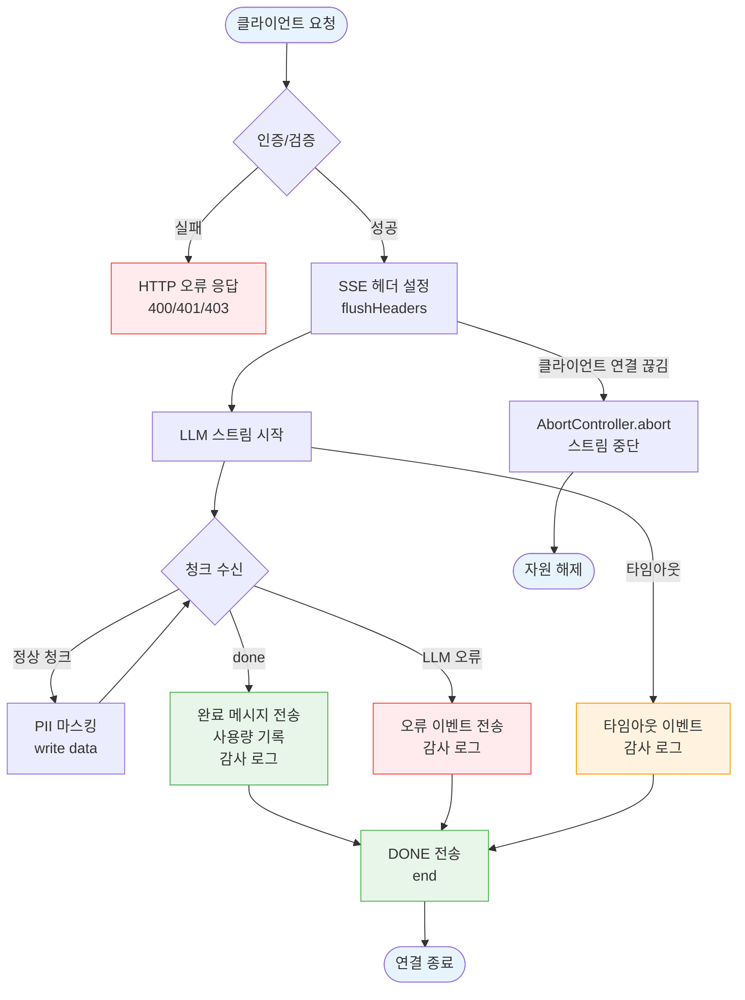
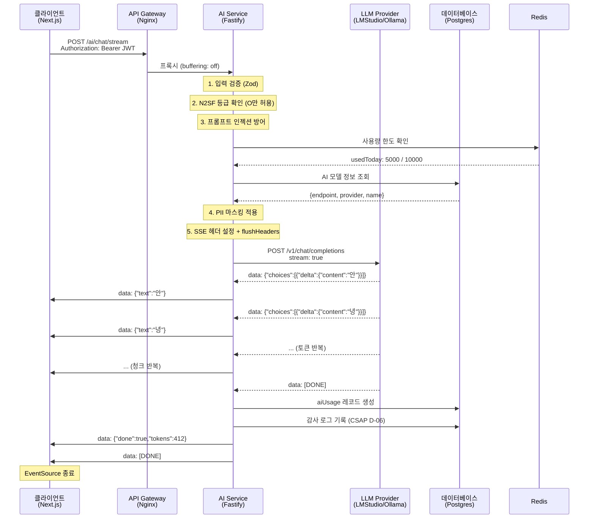

# 스트리밍 및 SSE 심화 가이드

> 공공기관 SaaS 프레임워크 온보딩 시리즈 — 개발편 41
> 대상 독자: 실시간 AI 응답 기능을 구현해야 하는 개발자
> N2SF N-05 PII 마스킹 + CSAP D-06 감사 로그 적용 기준 포함

---

## 목차

1. [실시간 통신이란?](#1-실시간-통신이란)
2. [SSE 프로토콜 이해](#2-sse-프로토콜-이해)
3. [Fastify SSE 구현](#3-fastify-sse-구현)
4. [AI 스트리밍 응답](#4-ai-스트리밍-응답)
5. [진행률 표시와 취소 처리](#5-진행률-표시와-취소-처리)
6. [클라이언트 구현 (Next.js)](#6-클라이언트-구현-nextjs)
7. [N2SF 스트리밍 보안](#7-n2sf-스트리밍-보안)
8. [장애 처리 및 타임아웃](#8-장애-처리-및-타임아웃)
9. [실습: AI 챗봇 스트리밍 구현](#9-실습-ai-챗봇-스트리밍-구현)

---

## 1. 실시간 통신이란?

### 1.1 초급자를 위한 설명

일반 HTTP 요청은 "질문하고 → 기다리고 → 응답 받기"입니다. 하지만 AI 모델이 응답을 생성하는 데 10초가 걸린다면? 사용자는 10초 동안 아무것도 보지 못하고 기다려야 합니다.

실시간 통신은 이 문제를 해결합니다. AI가 단어를 하나씩 생성할 때마다 즉시 화면에 표시할 수 있습니다.

```
일반 요청:  [질문] ----10초 대기---- [전체 응답 표시]
SSE 스트림: [질문] [단어1] [단어2] [단어3] ... [마지막 단어]
                    ↑ 즉시 표시    ↑ 계속 추가
```

### 1.2 네 가지 실시간 통신 방식 비교

| 방식 | 방향 | 연결 유지 | 적합한 사용 사례 |
|------|------|---------|----------------|
| Polling | 클→서버 | 없음 | 1분마다 알림 확인 |
| Long Polling | 클→서버 | 일시적 | 채팅 (SSE 전 시대) |
| **SSE** | **서버→클** | **유지** | **AI 응답 스트리밍, 알림** |
| WebSocket | 양방향 | 유지 | 멀티플레이어 게임, 협업 도구 |

### 1.3 SSE를 선택하는 기준

SSE는 다음 상황에서 최적입니다.

**선택 기준 (SSE가 유리한 경우):**
- 서버에서 클라이언트 방향의 단방향 데이터 흐름
- LLM 응답처럼 연속적인 텍스트 청크 전송
- 클라이언트가 웹 브라우저 (EventSource API 기본 지원)
- HTTP/2 또는 HTTP/1.1 환경 모두 지원 필요

**WebSocket이 유리한 경우:**
- 클라이언트도 서버에 지속적으로 데이터를 보내야 함
- 멀티플레이어 실시간 협업
- 지연시간이 매우 낮아야 하는 게임

공공기관 SaaS에서 AI 챗봇, 문서 분석 진행률 표시, 알림 전송은 모두 SSE로 구현합니다.

### 1.4 Polling과 SSE의 서버 부하 비교

```
Polling (10초마다 요청):
클라이언트 → [GET /status?] → 서버 → [응답 없음] → 연결 종료
            → [GET /status?] → 서버 → [응답 없음] → 연결 종료
            → [GET /status?] → 서버 → [데이터 있음!] → 연결 종료
            (10번의 요청 중 9번은 낭비)

SSE (연결 1번):
클라이언트 → [GET /stream] → 서버 → [연결 유지]
                                       ↓ 데이터 생성 시 즉시 전송
                              서버 → data: {"text":"안녕"}
                              서버 → data: {"text":"하세요"}
                              서버 → data: [DONE]
            (연결 1번으로 모든 청크 수신)
```

---

## 2. SSE 프로토콜 이해

### 2.1 SSE 메시지 형식

SSE는 단순한 텍스트 형식입니다. 각 메시지는 빈 줄로 구분됩니다.

```
data: {"text":"안녕하세요"}\n\n

data: {"text":"저는 AI 어시스턴트입니다."}\n\n

event: progress\n
data: {"percent":50}\n\n

id: 42\n
retry: 3000\n
data: {"done":true,"tokens":412}\n\n

data: [DONE]\n\n
```

**필드 설명:**

| 필드 | 설명 | 예시 |
|------|------|------|
| `data` | 실제 데이터 (필수) | `data: {"text":"hello"}` |
| `event` | 이벤트 유형 (기본: message) | `event: progress` |
| `id` | 메시지 ID (재연결 시 복구용) | `id: 42` |
| `retry` | 재연결 대기 시간(ms) | `retry: 3000` |

### 2.2 연결 유지 메커니즘

브라우저는 SSE 연결이 끊어지면 자동으로 재연결합니다. 서버는 빈 주석(`:\n\n`)을 주기적으로 전송하여 연결이 살아있음을 알립니다.

```
# 15초마다 하트비트 전송 (연결 유지)
: heartbeat\n\n

# 클라이언트는 자동으로 무시
```

### 2.3 재연결 시 ID 활용

클라이언트가 재연결하면 `Last-Event-ID` 헤더로 마지막 수신한 ID를 서버에 보냅니다. 서버는 이를 활용해 누락된 메시지를 재전송할 수 있습니다.

```http
GET /ai/chat/stream HTTP/1.1
Accept: text/event-stream
Last-Event-ID: 42
```

AI 스트리밍에서는 보통 재전송이 불가능하므로, 연결이 끊어지면 새 요청을 시작합니다.

---

## 3. Fastify SSE 구현

### 3.1 SSE 헤더 설정

SSE는 특별한 HTTP 헤더가 필요합니다. Fastify의 `reply.raw`를 통해 Node.js HTTP 응답 객체에 직접 접근합니다.

```typescript
// SSE 헤더 설정 (text/event-stream이 핵심)
reply.raw.setHeader('Content-Type', 'text/event-stream; charset=utf-8');
reply.raw.setHeader('Cache-Control', 'no-cache, no-transform');
reply.raw.setHeader('Connection', 'keep-alive');
reply.raw.setHeader('X-Accel-Buffering', 'no'); // Nginx 프록시 버퍼링 비활성화
reply.raw.flushHeaders(); // 헤더를 즉시 전송 (중요!)
```

`flushHeaders()`를 호출하지 않으면 Node.js가 헤더를 버퍼링하여 클라이언트가 스트림 시작을 인지하지 못합니다.

`X-Accel-Buffering: no`는 Nginx 리버스 프록시가 SSE 응답을 버퍼링하지 않도록 합니다. 이 헤더가 없으면 Nginx가 전체 응답을 모은 후 전송하여 스트리밍 효과가 사라집니다.

### 3.2 실제 ai-stream.handler.ts 코드 분석

실제 프로젝트의 SSE 구현(`platform/services/ai-service/src/handlers/ai-stream.handler.ts`)을 단계별로 분석합니다.

**1단계: 입력 검증**

```typescript
// 실제 코드 발췌
const chatStreamSchema = z.object({
  modelId: z.string().min(1),
  tenantId: z.string().min(1),
  message: z.string().min(1).max(8192),
  grade: z.enum(['O', 'S', 'C']),
  systemPrompt: z.string().max(2048).optional(),
});

const parseResult = chatStreamSchema.safeParse(request.body);
if (!parseResult.success) {
  // SSE가 아닌 일반 JSON 오류 응답 (스트림 시작 전)
  await reply.status(400).send({ ... });
  return;
}
```

검증은 스트림 시작 **전에** 수행해야 합니다. SSE 헤더를 설정한 후에는 상태 코드를 변경할 수 없습니다.

**2단계: N2SF 등급 확인**

```typescript
// N2SF N-05: 데이터 등급 검증
try {
  validateDataGrade(grade as DataGrade);
} catch (error) {
  if (error instanceof DataGradeViolationError) {
    // C/S 등급은 감사 로그 남기고 차단
    await logAiEvent('AI_GRADE_VIOLATION', chatActor, modelId, tenantId,
      request.ip, request.headers['user-agent'] ?? 'unknown',
      { grade, blocked: true });
    await reply.status(403).send({ ... });
    return;
  }
  throw error;
}
```

**3단계: PII 마스킹**

```typescript
// AI API로 전송 전 PII 마스킹 (N2SF O등급 필수)
const maskedMessage = maskPII(message);
const maskedSystemPrompt = systemPrompt ? maskPII(systemPrompt) : undefined;
```

**4단계: SSE 스트림 시작**

```typescript
// SSE 헤더 설정
reply.raw.setHeader('Content-Type', 'text/event-stream; charset=utf-8');
reply.raw.setHeader('Cache-Control', 'no-cache, no-transform');
reply.raw.setHeader('Connection', 'keep-alive');
reply.raw.setHeader('X-Accel-Buffering', 'no');
reply.raw.flushHeaders();

let totalTokens = 0;
let streamErrored = false;

// for-await로 LLM 청크 스트림 처리
for await (const chunk of provider.chatStream(messages)) {
  if (chunk.done) {
    totalTokens = chunk.tokensUsed ?? totalTokens;
    break;
  }
  // PII 마스킹 후 전송 (스트림 응답에서도 적용)
  const safeText = maskPII(chunk.text);
  reply.raw.write(`data: ${JSON.stringify({ text: safeText })}\n\n`);
}
```

**5단계: 스트림 종료 처리**

```typescript
if (!streamErrored) {
  // 완료 메시지 전송
  reply.raw.write(`data: ${JSON.stringify({ done: true, tokens: totalTokens })}\n\n`);

  // 사용량 DB 기록
  if (totalTokens > 0) {
    await prisma.aiUsage.create({
      data: { modelId, tenantId, tokens: totalTokens, cost: totalTokens * 0.0001, grade },
    });
  }

  // 감사 로그
  await logAiEvent('AI_STREAM_COMPLETED', ...);
}

// OpenAI 호환 종료 신호
reply.raw.write('data: [DONE]\n\n');
reply.raw.end();
```

### 3.3 오류 처리 전략

스트림 중간에 오류가 발생했을 때 어떻게 클라이언트에 알려야 할까요?

```typescript
try {
  for await (const chunk of provider.chatStream(messages)) {
    // 스트림 처리
  }
} catch (err) {
  streamErrored = true;
  const errorMessage = err instanceof Error ? err.message : String(err);

  // 오류 이벤트를 SSE 형식으로 전송
  // 에러 메시지에 내부 정보 절대 포함 금지 (CSAP D-12)
  reply.raw.write(
    `data: ${JSON.stringify({
      error: 'AI 스트림 오류',
      code: 'LLM_STREAM_ERROR',
    })}\n\n`
  );

  // 감사 로그에는 내부 정보 기록 (클라이언트에는 노출 금지)
  await logAiEvent('AI_LLM_ERROR', chatActor, modelId, tenantId,
    request.ip, request.headers['user-agent'] ?? 'unknown',
    { provider: llmConfig.providerType, error: errorMessage.slice(0, 200), stream: true });
}
```

---

## 4. AI 스트리밍 응답

### 4.1 LLM 토큰 단위 스트리밍 원리

LLM(Large Language Model)은 한 번에 전체 응답을 생성하지 않습니다. 단어(정확히는 토큰) 단위로 순차 생성합니다. 이 특성을 활용해 생성 즉시 클라이언트로 전달합니다.

```
LLM 생성 과정:
"안" → "녕" → "하" → "세" → "요" → " " → "저" → "는" → ...
  ↓     ↓     ↓     ↓     ↓    ↓     ↓     ↓
SSE 전송: 각 토큰을 생성하자마자 write()
```

### 4.2 LLM Provider 스트리밍 인터페이스

실제 프로젝트에서 LLM Provider가 스트리밍을 어떻게 추상화하는지 살펴봅니다.

```typescript
// Design Ref: SVC-AI-R3 DESIGN §1 — LLM Provider 인터페이스
interface LLMStreamChunk {
  text: string;       // 토큰 텍스트
  done: boolean;      // 스트림 완료 여부
  tokensUsed?: number; // 완료 시 총 토큰 수
}

interface LLMProvider {
  // 일반 응답
  chat(messages: LLMMessage[], options?: ChatOptions): Promise<LLMResponse>;

  // 스트리밍 응답 (AsyncGenerator)
  chatStream(messages: LLMMessage[], options?: ChatOptions): AsyncGenerator<LLMStreamChunk>;
}

// OpenAI 호환 구현 예
async *chatStream(messages: LLMMessage[]): AsyncGenerator<LLMStreamChunk> {
  const response = await fetch(`${this.endpoint}/v1/chat/completions`, {
    method: 'POST',
    headers: { 'Content-Type': 'application/json' },
    body: JSON.stringify({
      model: this.modelName,
      messages,
      stream: true,  // 스트리밍 활성화
    }),
  });

  const reader = response.body?.getReader();
  if (!reader) throw new Error('스트림을 읽을 수 없습니다');

  const decoder = new TextDecoder();

  while (true) {
    const { done, value } = await reader.read();
    if (done) break;

    const lines = decoder.decode(value).split('\n');
    for (const line of lines) {
      if (!line.startsWith('data: ')) continue;
      const data = line.slice(6);
      if (data === '[DONE]') {
        yield { text: '', done: true };
        return;
      }

      try {
        const parsed = JSON.parse(data);
        const text = parsed.choices?.[0]?.delta?.content ?? '';
        if (text) yield { text, done: false };
      } catch {
        // 파싱 오류 무시 (불완전한 청크)
      }
    }
  }
}
```

### 4.3 청크 버퍼링 전략

매우 작은 청크가 많이 들어올 경우, 너무 자주 `write()`를 호출하면 성능 문제가 발생합니다. 버퍼링 전략으로 해결합니다.

```typescript
// Design Ref: §4.3 — 청크 버퍼링
const BUFFER_SIZE = 50;    // 50자 이상 모이면 전송
const FLUSH_INTERVAL = 100; // 100ms마다 강제 전송

let buffer = '';
let lastFlush = Date.now();

for await (const chunk of provider.chatStream(messages)) {
  if (chunk.done) break;

  buffer += chunk.text;

  const shouldFlush =
    buffer.length >= BUFFER_SIZE ||
    Date.now() - lastFlush >= FLUSH_INTERVAL;

  if (shouldFlush) {
    const safeText = maskPII(buffer);
    reply.raw.write(`data: ${JSON.stringify({ text: safeText })}\n\n`);
    buffer = '';
    lastFlush = Date.now();
  }
}

// 남은 버퍼 전송
if (buffer) {
  const safeText = maskPII(buffer);
  reply.raw.write(`data: ${JSON.stringify({ text: safeText })}\n\n`);
}
```

---

## 5. 진행률 표시와 취소 처리

### 5.1 작업 단계별 progress 이벤트

긴 작업(문서 분석, RAG 수집 등)의 진행률을 실시간으로 전달합니다.

```typescript
// Design Ref: §5.1 — 진행률 이벤트 패턴
async function documentAnalyzeStreamHandler(
  request: FastifyRequest,
  reply: FastifyReply
): Promise<void> {
  // SSE 헤더 설정
  reply.raw.setHeader('Content-Type', 'text/event-stream; charset=utf-8');
  reply.raw.setHeader('Cache-Control', 'no-cache, no-transform');
  reply.raw.setHeader('Connection', 'keep-alive');
  reply.raw.setHeader('X-Accel-Buffering', 'no');
  reply.raw.flushHeaders();

  const sendProgress = (step: string, percent: number, message: string) => {
    reply.raw.write(
      `event: progress\ndata: ${JSON.stringify({ step, percent, message })}\n\n`
    );
  };

  const sendResult = (data: unknown) => {
    reply.raw.write(
      `event: result\ndata: ${JSON.stringify(data)}\n\n`
    );
  };

  try {
    // 1단계: 문서 파싱 (0~20%)
    sendProgress('parsing', 0, '문서를 파싱하는 중...');
    const parsed = await parseDocument(request.body.content);
    sendProgress('parsing', 20, '문서 파싱 완료');

    // 2단계: 청크 분할 (20~40%)
    sendProgress('chunking', 20, '텍스트를 분할하는 중...');
    const chunks = await splitIntoChunks(parsed);
    sendProgress('chunking', 40, `${chunks.length}개 청크로 분할 완료`);

    // 3단계: 임베딩 생성 (40~70%)
    sendProgress('embedding', 40, '임베딩을 생성하는 중...');
    const embeddings = await generateEmbeddings(chunks);
    sendProgress('embedding', 70, '임베딩 생성 완료');

    // 4단계: AI 분석 (70~100%)
    sendProgress('analyzing', 70, 'AI가 문서를 분석하는 중...');
    const analysis = await analyzeWithLLM(parsed, embeddings);
    sendProgress('analyzing', 100, '분석 완료');

    // 최종 결과 전송
    sendResult({ success: true, analysis });

  } catch (err) {
    reply.raw.write(
      `event: error\ndata: ${JSON.stringify({
        code: 'ANALYSIS_FAILED',
        message: '문서 분석 중 오류가 발생했습니다',
      })}\n\n`
    );
  } finally {
    reply.raw.write('data: [DONE]\n\n');
    reply.raw.end();
  }
}
```

### 5.2 AbortController를 이용한 취소 처리

클라이언트가 취소 버튼을 클릭하면 서버 측 처리도 중단해야 합니다.

```typescript
// Design Ref: §5.2 — 서버 측 취소 처리
async function streamWithCancellation(
  request: FastifyRequest,
  reply: FastifyReply
): Promise<void> {
  // AbortController로 LLM 요청 취소 가능하게 설정
  const abortController = new AbortController();

  // 클라이언트 연결 종료 감지
  request.raw.on('close', () => {
    abortController.abort();
    // 감사 로그: 사용자가 스트림을 취소함
    void logAiEvent('AI_STREAM_CANCELLED', ...);
  });

  reply.raw.setHeader('Content-Type', 'text/event-stream; charset=utf-8');
  reply.raw.setHeader('Cache-Control', 'no-cache, no-transform');
  reply.raw.setHeader('Connection', 'keep-alive');
  reply.raw.setHeader('X-Accel-Buffering', 'no');
  reply.raw.flushHeaders();

  try {
    for await (const chunk of provider.chatStream(messages, {
      signal: abortController.signal,  // 취소 신호 전달
    })) {
      // 취소 신호 확인
      if (abortController.signal.aborted) break;

      if (chunk.done) break;
      reply.raw.write(`data: ${JSON.stringify({ text: chunk.text })}\n\n`);
    }
  } catch (err) {
    if ((err as Error).name === 'AbortError') {
      // 취소는 오류가 아님 — 조용히 처리
      return;
    }
    reply.raw.write(`data: ${JSON.stringify({ error: 'AI 스트림 오류' })}\n\n`);
  } finally {
    reply.raw.write('data: [DONE]\n\n');
    reply.raw.end();
  }
}
```

---

## 6. 클라이언트 구현 (Next.js)

### 6.1 EventSource API 기본 사용

```typescript
// Design Ref: §6.1 — EventSource 기본 사용
// 파일: apps/portal/src/hooks/useAIStream.ts

'use client';

import { useState, useRef, useCallback } from 'react';

interface UseAIStreamOptions {
  onToken?: (token: string) => void;
  onDone?: (totalTokens: number) => void;
  onError?: (error: string) => void;
  onProgress?: (step: string, percent: number, message: string) => void;
}

export function useAIStream(options: UseAIStreamOptions = {}) {
  const [isStreaming, setIsStreaming] = useState(false);
  const [fullText, setFullText] = useState('');
  const abortControllerRef = useRef<AbortController | null>(null);

  const startStream = useCallback(async (
    endpoint: string,
    body: Record<string, unknown>
  ) => {
    setIsStreaming(true);
    setFullText('');

    abortControllerRef.current = new AbortController();

    try {
      const response = await fetch(endpoint, {
        method: 'POST',
        headers: {
          'Content-Type': 'application/json',
          'Authorization': `Bearer ${getAccessToken()}`,
        },
        body: JSON.stringify(body),
        signal: abortControllerRef.current.signal,
      });

      if (!response.ok) {
        const error = await response.json();
        options.onError?.(error.error?.message ?? '요청 실패');
        return;
      }

      // ReadableStream으로 SSE 파싱
      const reader = response.body?.getReader();
      if (!reader) throw new Error('스트림을 읽을 수 없습니다');

      const decoder = new TextDecoder();
      let accumulated = '';

      while (true) {
        const { done, value } = await reader.read();
        if (done) break;

        accumulated += decoder.decode(value, { stream: true });
        const lines = accumulated.split('\n');
        accumulated = lines.pop() ?? ''; // 마지막 불완전한 줄 보존

        for (const line of lines) {
          if (!line.startsWith('data: ')) continue;
          const data = line.slice(6).trim();
          if (data === '[DONE]') return;

          try {
            const parsed = JSON.parse(data);

            if (parsed.text) {
              setFullText((prev) => prev + parsed.text);
              options.onToken?.(parsed.text);
            } else if (parsed.done) {
              options.onDone?.(parsed.tokens ?? 0);
            } else if (parsed.error) {
              options.onError?.(parsed.error);
              return;
            } else if (parsed.step !== undefined) {
              // progress 이벤트
              options.onProgress?.(parsed.step, parsed.percent, parsed.message);
            }
          } catch {
            // 불완전한 JSON 무시
          }
        }
      }
    } catch (err) {
      if ((err as Error).name !== 'AbortError') {
        options.onError?.('네트워크 오류가 발생했습니다');
      }
    } finally {
      setIsStreaming(false);
    }
  }, [options]);

  const stopStream = useCallback(() => {
    abortControllerRef.current?.abort();
    setIsStreaming(false);
  }, []);

  return { isStreaming, fullText, startStream, stopStream };
}
```

### 6.2 React 컴포넌트에서 사용

```tsx
// Design Ref: §6.2 — AI 챗봇 컴포넌트
// 파일: apps/portal/src/components/ai/ChatWidget.tsx

'use client';

import { useState } from 'react';
import { useAIStream } from '@/hooks/useAIStream';

interface ChatMessage {
  role: 'user' | 'assistant';
  content: string;
  isStreaming?: boolean;
}

export function ChatWidget({ tenantId }: { tenantId: string }) {
  const [messages, setMessages] = useState<ChatMessage[]>([]);
  const [input, setInput] = useState('');
  const [currentStreamText, setCurrentStreamText] = useState('');

  const { isStreaming, startStream, stopStream } = useAIStream({
    onToken: (token) => {
      setCurrentStreamText((prev) => prev + token);
    },
    onDone: (totalTokens) => {
      // 스트리밍 완료 — 메시지 목록에 추가
      setMessages((prev) => [
        ...prev,
        { role: 'assistant', content: currentStreamText },
      ]);
      setCurrentStreamText('');
      console.log(`총 ${totalTokens} 토큰 사용`);
    },
    onError: (error) => {
      setMessages((prev) => [
        ...prev,
        {
          role: 'assistant',
          content: `오류가 발생했습니다: ${error}`,
        },
      ]);
      setCurrentStreamText('');
    },
  });

  const handleSubmit = async () => {
    if (!input.trim() || isStreaming) return;

    const userMessage = input;
    setInput('');

    // 사용자 메시지 추가
    setMessages((prev) => [...prev, { role: 'user', content: userMessage }]);

    // 스트리밍 시작
    await startStream('/api/ai/chat/stream', {
      modelId: 'default-model',
      tenantId,
      message: userMessage,
      grade: 'O',  // N2SF O등급만 허용
    });
  };

  return (
    <div className="flex flex-col h-full">
      {/* 메시지 목록 */}
      <div className="flex-1 overflow-y-auto p-4 space-y-4">
        {messages.map((msg, i) => (
          <div
            key={i}
            className={`p-3 rounded-lg ${
              msg.role === 'user'
                ? 'bg-blue-100 ml-auto max-w-xs'
                : 'bg-gray-100 mr-auto max-w-xs'
            }`}
          >
            {msg.content}
          </div>
        ))}

        {/* 스트리밍 중인 응답 */}
        {isStreaming && currentStreamText && (
          <div className="bg-gray-100 mr-auto max-w-xs p-3 rounded-lg">
            {currentStreamText}
            <span className="animate-pulse">|</span>
          </div>
        )}
      </div>

      {/* 입력창 */}
      <div className="p-4 border-t flex gap-2">
        <input
          value={input}
          onChange={(e) => setInput(e.target.value)}
          onKeyDown={(e) => e.key === 'Enter' && !e.shiftKey && handleSubmit()}
          placeholder="메시지를 입력하세요..."
          disabled={isStreaming}
          className="flex-1 border rounded-lg px-3 py-2"
        />
        {isStreaming ? (
          <button
            onClick={stopStream}
            className="px-4 py-2 bg-red-500 text-white rounded-lg"
          >
            중지
          </button>
        ) : (
          <button
            onClick={handleSubmit}
            disabled={!input.trim()}
            className="px-4 py-2 bg-blue-500 text-white rounded-lg disabled:opacity-50"
          >
            전송
          </button>
        )}
      </div>
    </div>
  );
}
```

### 6.3 진행률 표시 컴포넌트

```tsx
// Design Ref: §6.3 — 진행률 표시
'use client';

import { useState } from 'react';
import { useAIStream } from '@/hooks/useAIStream';

interface ProgressState {
  step: string;
  percent: number;
  message: string;
}

export function DocumentAnalyzer({ tenantId }: { tenantId: string }) {
  const [progress, setProgress] = useState<ProgressState | null>(null);
  const [result, setResult] = useState<unknown>(null);

  const { isStreaming, startStream, stopStream } = useAIStream({
    onProgress: (step, percent, message) => {
      setProgress({ step, percent, message });
    },
    onDone: () => {
      setProgress(null);
    },
  });

  const analyzeDocument = async (content: string) => {
    await startStream('/api/ai/document/analyze/stream', {
      tenantId,
      grade: 'O',
      content,
      analysisType: 'full',
    });
  };

  return (
    <div>
      {isStreaming && progress && (
        <div className="p-4">
          <div className="flex justify-between mb-2">
            <span>{progress.message}</span>
            <span>{progress.percent}%</span>
          </div>
          <div className="w-full bg-gray-200 rounded-full h-2">
            <div
              className="bg-blue-500 h-2 rounded-full transition-all duration-300"
              style={{ width: `${progress.percent}%` }}
            />
          </div>
          <button onClick={stopStream} className="mt-2 text-red-500">
            취소
          </button>
        </div>
      )}
    </div>
  );
}
```

---

## 7. N2SF 스트리밍 보안

### 7.1 스트리밍 중 실시간 PII 마스킹

SSE 스트리밍에서 가장 중요한 보안 요소는 **응답 청크에서도 PII를 마스킹**하는 것입니다.

```typescript
// Design Ref: §7.1 — 실시간 PII 마스킹
// N2SF N-05: O등급도 PII는 마스킹 필수

// 실제 코드에서 발췌 (ai-stream.handler.ts)
for await (const chunk of provider.chatStream(messages)) {
  if (chunk.done) break;

  // PII 마스킹 후 전송 (각 청크마다 적용)
  const safeText = maskPII(chunk.text);
  reply.raw.write(`data: ${JSON.stringify({ text: safeText })}\n\n`);
}
```

실제 `maskPII` 함수가 처리하는 패턴(`platform/services/ai-service/src/lib/pii-masking.ts`):

| 항목 | 원본 | 마스킹 결과 |
|------|------|----------|
| 이메일 | `hong@gmail.com` | `[EMAIL_MASKED]` |
| 주민번호 | `901231-1234567` | `[RRN_MASKED]` |
| 전화번호 | `010-1234-5678` | `[PHONE_MASKED]` |
| 카드번호 | `1234-5678-9012-3456` | `[CARD_MASKED]` |
| IP 주소 | `192.168.1.100` | `[IP_MASKED]` |

**주의**: 단어가 청크 경계에 걸칠 수 있습니다. 예를 들어 이메일이 두 청크에 나뉘어 올 경우:
- 청크1: `hong@gma`
- 청크2: `il.com`

이 경우 각 청크 마스킹으로는 이메일을 감지하지 못합니다. 보완 방법은 버퍼링 전략과 결합하는 것입니다.

```typescript
// Design Ref: §7.1 — 청크 경계 PII 처리
let buffer = '';
const LOOK_AHEAD = 100; // 100자 버퍼로 경계 문제 완화

for await (const chunk of provider.chatStream(messages)) {
  if (chunk.done) break;

  buffer += chunk.text;

  // 버퍼가 충분히 쌓이면 안전하게 처리
  if (buffer.length > LOOK_AHEAD * 2) {
    // 앞부분 처리 (뒤쪽 LOOK_AHEAD 유지)
    const toProcess = buffer.slice(0, -LOOK_AHEAD);
    const safe = maskPII(toProcess);
    reply.raw.write(`data: ${JSON.stringify({ text: safe })}\n\n`);
    buffer = buffer.slice(-LOOK_AHEAD);
  }
}

// 나머지 버퍼 처리
if (buffer) {
  const safe = maskPII(buffer);
  reply.raw.write(`data: ${JSON.stringify({ text: safe })}\n\n`);
}
```

### 7.2 N2SF 데이터 등급 스트리밍 제한

```typescript
// Design Ref: §7.2 — N2SF 데이터 등급 제한
// 실제 코드 (grade-check.ts)

export function validateDataGrade(grade: DataGrade): void {
  if (grade === 'C' || grade === 'S') {
    throw new DataGradeViolationError(
      `BLOCKED: ${grade}등급 데이터는 AI API 전송이 금지됩니다 (N2SF N-05)`,
      grade
    );
  }
}

// 스트리밍 핸들러에서의 처리
// 스트림 시작 전에 등급 확인 (SSE 헤더 설정 전)
try {
  validateDataGrade(grade as DataGrade);
} catch (error) {
  if (error instanceof DataGradeViolationError) {
    await logAiEvent('AI_GRADE_VIOLATION', ...);
    // 일반 HTTP 오류 응답 (SSE 아님)
    await reply.status(403).send({ ... });
    return;
  }
  throw error;
}

// 검증 통과 후 SSE 시작
reply.raw.setHeader('Content-Type', 'text/event-stream; charset=utf-8');
```

### 7.3 스트리밍 감사 로그

```typescript
// Design Ref: §7.3 — 스트리밍 감사 로그 (CSAP D-06)
// 실제 코드에서 발췌

// 스트리밍 완료 후 감사 로그
await logAiEvent(
  'AI_STREAM_COMPLETED',
  chatActor,
  modelId,
  tenantId,
  request.ip,
  request.headers['user-agent'] ?? 'unknown',
  {
    grade,
    tokens: totalTokens,
    provider: llmConfig.providerType,
    // 주의: 실제 메시지 내용은 로그에 기록 금지 (개인정보)
  }
);
```

---

## 8. 장애 처리 및 타임아웃

### 8.1 스트리밍 타임아웃 설정

SSE 연결은 일반 HTTP보다 오래 유지됩니다. 적절한 타임아웃이 없으면 서버 자원이 낭비됩니다.

```typescript
// Design Ref: §8.1 — 스트리밍 타임아웃
const STREAM_TIMEOUT_MS = 5 * 60 * 1000; // 5분

async function streamWithTimeout(
  reply: FastifyReply,
  streamFn: () => Promise<void>
): Promise<void> {
  const timeoutId = setTimeout(() => {
    // 타임아웃 발생 시 클라이언트에 알림
    if (!reply.raw.closed) {
      reply.raw.write(
        `data: ${JSON.stringify({
          error: '응답 시간이 초과되었습니다',
          code: 'STREAM_TIMEOUT',
        })}\n\n`
      );
      reply.raw.write('data: [DONE]\n\n');
      reply.raw.end();
    }
  }, STREAM_TIMEOUT_MS);

  try {
    await streamFn();
  } finally {
    clearTimeout(timeoutId);
  }
}
```

### 8.2 Nginx 타임아웃 설정 (인프라)

Nginx 리버스 프록시는 기본적으로 60초 응답 타임아웃이 있습니다. SSE는 이를 늘려야 합니다.

```nginx
# /data/ai-saas/platform/infra/nginx/ai-service.conf
location /ai/chat/stream {
    proxy_pass http://ai-service;

    # SSE를 위한 타임아웃 설정
    proxy_read_timeout 600s;    # 10분
    proxy_send_timeout 600s;
    proxy_connect_timeout 10s;

    # 버퍼링 비활성화 (SSE 필수)
    proxy_buffering off;
    proxy_cache off;

    # SSE 헤더 유지
    proxy_set_header Connection '';
    proxy_http_version 1.1;
    chunked_transfer_encoding on;
}
```

### 8.3 SSE 연결 생명주기



### 8.4 AI 스트리밍 요청 흐름 전체 다이어그램



---

## 9. 실습: AI 챗봇 스트리밍 응답 구현

이 실습에서는 간단한 AI 챗봇 스트리밍 엔드포인트를 처음부터 구현합니다.

### 9.1 서버 측 구현

```typescript
// Design Ref: §9 — 스트리밍 실습
// 파일: src/handlers/chat-stream-simple.handler.ts
// Plan SC: FR-AI-R3.1

import type { FastifyRequest, FastifyReply } from 'fastify';
import { z } from 'zod';
import { validateDataGrade, DataGradeViolationError } from '../lib/grade-check.js';
import { maskPII } from '../lib/pii-masking.js';
import { logAiEvent } from '../lib/audit.js';
import type { DataGrade } from '@public-saas/types';

// 입력 검증 스키마
const simpleChatSchema = z.object({
  message: z.string().min(1).max(8192),
  grade: z.enum(['O']),  // 실습: O등급만 허용
  tenantId: z.string().uuid(),
  modelId: z.string().min(1),
});

export async function simpleChatStreamHandler(
  request: FastifyRequest,
  reply: FastifyReply
): Promise<void> {
  const actor = (request.headers['x-user-id'] as string) || 'system';

  // Step 1: 입력 검증 (스트림 시작 전)
  const parseResult = simpleChatSchema.safeParse(request.body);
  if (!parseResult.success) {
    await reply.status(400).send({
      success: false,
      error: {
        code: 'VALIDATION_ERROR',
        message: parseResult.error.issues.map((i) => i.message).join(', '),
      },
    });
    return;
  }

  const { message, grade, tenantId, modelId } = parseResult.data;

  // Step 2: N2SF 등급 확인 (스트림 시작 전)
  try {
    validateDataGrade(grade as DataGrade);
  } catch (error) {
    if (error instanceof DataGradeViolationError) {
      await logAiEvent(
        'AI_GRADE_VIOLATION', actor, modelId, tenantId,
        request.ip, request.headers['user-agent'] ?? 'unknown',
        { grade, blocked: true }
      );
      await reply.status(403).send({
        success: false,
        error: { code: error.code, message: error.message },
      });
      return;
    }
    throw error;
  }

  // Step 3: PII 마스킹
  const maskedMessage = maskPII(message);

  // Step 4: SSE 헤더 설정
  reply.raw.setHeader('Content-Type', 'text/event-stream; charset=utf-8');
  reply.raw.setHeader('Cache-Control', 'no-cache, no-transform');
  reply.raw.setHeader('Connection', 'keep-alive');
  reply.raw.setHeader('X-Accel-Buffering', 'no');
  reply.raw.flushHeaders();

  // Step 5: LLM 스트리밍
  let totalTokens = 0;
  let hasError = false;
  const startTime = Date.now();

  try {
    // LLM Provider 가져오기
    const model = await getAIModel(modelId);
    const provider = createProvider(model);

    const messages = [{ role: 'user' as const, content: maskedMessage }];

    for await (const chunk of provider.chatStream(messages)) {
      if (chunk.done) {
        totalTokens = chunk.tokensUsed ?? 0;
        break;
      }

      // Step 6: 청크별 PII 마스킹 (중요!)
      const safeText = maskPII(chunk.text);
      reply.raw.write(`data: ${JSON.stringify({ text: safeText })}\n\n`);
    }
  } catch (err) {
    hasError = true;
    // 클라이언트에는 일반 오류 메시지만 (내부 정보 노출 금지)
    reply.raw.write(
      `data: ${JSON.stringify({ error: 'AI 응답 생성 중 오류가 발생했습니다', code: 'LLM_ERROR' })}\n\n`
    );

    // 내부 로그에는 상세 기록
    request.log.error(err, 'LLM 스트리밍 오류');
  }

  // Step 7: 스트림 종료
  if (!hasError) {
    reply.raw.write(
      `data: ${JSON.stringify({ done: true, tokens: totalTokens, durationMs: Date.now() - startTime })}\n\n`
    );

    // 사용량 기록
    await recordUsage(modelId, tenantId, totalTokens, grade);

    // 감사 로그 (CSAP D-06)
    await logAiEvent(
      'AI_STREAM_COMPLETED', actor, modelId, tenantId,
      request.ip, request.headers['user-agent'] ?? 'unknown',
      { grade, tokens: totalTokens, durationMs: Date.now() - startTime }
    );
  }

  reply.raw.write('data: [DONE]\n\n');
  reply.raw.end();
}
```

### 9.2 라우트 등록

```typescript
// 라우트 등록 (routes.ts에 추가)
app.post(
  '/ai/chat/stream/simple',
  {
    schema: {
      description: '간단한 AI 챗봇 스트리밍 (실습용)',
      tags: ['ai'],
      body: {
        type: 'object' as const,
        required: ['message', 'grade', 'tenantId', 'modelId'] as const,
        properties: {
          message: { type: 'string' as const, maxLength: 8192 },
          grade: { type: 'string' as const, enum: ['O'] },
          tenantId: { type: 'string' as const, format: 'uuid' },
          modelId: { type: 'string' as const },
        },
      },
    },
    preHandler: chatLimiter,
  },
  simpleChatStreamHandler as never,
);
```

### 9.3 실습 체크리스트

구현 후 다음 항목을 확인합니다.

- [ ] `Content-Type: text/event-stream` 헤더가 설정되는가?
- [ ] C/S 등급 요청이 403으로 차단되는가?
- [ ] 응답 청크에서 PII(이메일, 전화번호 등)가 마스킹되는가?
- [ ] 클라이언트 연결 종료 시 서버 측 스트림도 중단되는가?
- [ ] 감사 로그에 실제 메시지 내용이 없는가? (토큰 수만 기록)
- [ ] `[DONE]` 신호로 스트림이 정상 종료되는가?
- [ ] 오류 발생 시 클라이언트에 내부 정보가 노출되지 않는가?

---

## 요약 및 다음 단계

| 항목 | 핵심 내용 |
|------|---------|
| SSE 헤더 | `text/event-stream`, `X-Accel-Buffering: no`, `flushHeaders()` 필수 |
| 검증 순서 | 입력검증 → N2SF 등급 → PII 마스킹 → SSE 시작 |
| PII 마스킹 | 요청 전 + 청크별로 `maskPII()` 적용 |
| 오류 처리 | 스트림 중 오류 = SSE 이벤트로 전달, 내부 정보 노출 금지 |
| 취소 | `AbortController` + `request.raw.on('close')` |
| 타임아웃 | 서버 5분 + Nginx `proxy_read_timeout 600s` |
| 감사 로그 | 완료/오류/취소 모든 경우 기록 (CSAP D-06) |

**다음 단계:**
- `20-microservices-communication.md`: AI Service가 다른 서비스와 통신하는 패턴
- `08-ai-development-guide.md`: AI 기능 전체 개발 가이드

---

*Design Ref: SVC-AI-R3 DESIGN §1 FR-AI-R3.1 | Plan SC: FR-P10.1~FR-P10.6*
*CSAP: D-06 침해사고 관리, D-12 시스템 개발 보안 | N2SF: N-05 데이터 등급*
