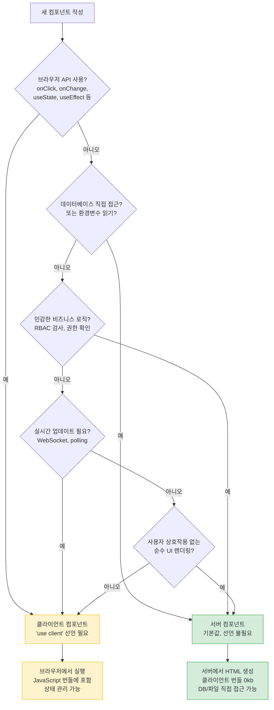
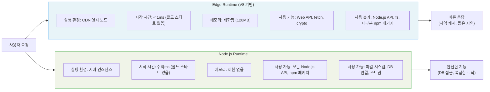
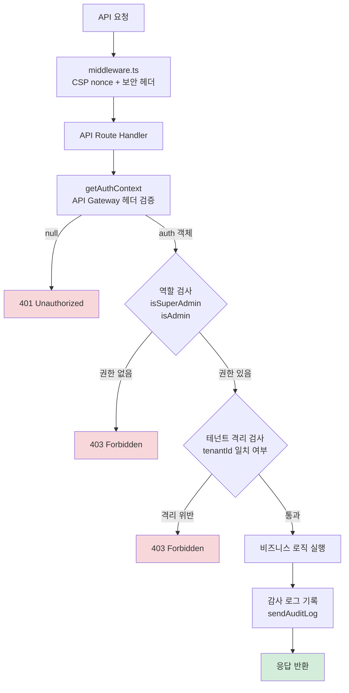

# Next.js 15 고급 패턴 — RSC, Server Actions, Edge Runtime, Portal UI 심화

---

| 항목 | 내용 |
|------|------|
| 문서 ID | GUIDE-DEV-42 |
| 버전 | 1.0.0 |
| 작성일 | 2026-04-13 |
| 목적 | Next.js 15 고급 기능 전체를 공공기관 SaaS 포털 실제 코드 분석과 함께 완전히 이해하고, 멀티테넌트·CSAP 요건에 맞는 패턴을 습득 |
| 선행 학습 | GUIDE-DEV-31 (Next.js 기초 패턴), GUIDE-DEV-16 (Portal 기초), GUIDE-DEV-18 (환경 변수 관리) |
| 관련 FR ID | FR-UP.1~FR-UP.27, FR-L04.1~FR-L04.4 |
| CSAP 연계 | D-08 접근 통제, D-09 암호화, D-12 시스템 개발 보안 |

---

## 목차

1. [왜 Next.js 15인가 — 공공기관 SaaS에서의 선택 근거](#1-왜-nextjs-15인가)
2. [RSC vs 클라이언트 컴포넌트 선택 결정 트리](#2-rsc-vs-클라이언트-컴포넌트-선택-결정-트리)
3. [실제 Portal 코드 분석 — App 디렉토리 구조](#3-실제-portal-코드-분석)
4. [Server Actions 심화 — form submission, Optimistic UI](#4-server-actions-심화)
5. [Edge Runtime vs Node.js Runtime 선택 가이드](#5-edge-runtime-vs-nodejs-runtime)
6. [Next.js 15 캐싱 전략 전체 지도](#6-nextjs-15-캐싱-전략)
7. [멀티테넌트 Next.js 패턴 — Middleware 테넌트 라우팅](#7-멀티테넌트-패턴)
8. [공공기관 SaaS 특화 패턴 — RBAC 및 감사 로그 연동](#8-공공기관-saas-특화-패턴)
9. [성능 최적화 — Image, Font, Bundle Analysis](#9-성능-최적화)
10. [실습 미션 3개](#10-실습-미션)
11. [변경 이력](#변경-이력)

---

## 1. 왜 Next.js 15인가

### 1.1 공공기관 SaaS에서 Next.js 15를 선택한 이유

공공기관 SaaS 포털은 단순한 정보 표시 화면이 아닙니다. 수십 개 기관이 동시에 사용하는 멀티테넌트 환경에서, 민감한 행정 데이터를 다루며, CSAP(클라우드 보안인증제) 요건을 충족해야 합니다. Next.js 15는 이 요구사항들을 하나의 프레임워크에서 해결합니다.

**Next.js 15가 선택된 핵심 이유 4가지:**

| 요구사항 | Next.js 15 해결책 | 관련 CSAP 항목 |
|---------|-----------------|--------------|
| 서버 사이드 RBAC 검사 | React Server Components (RSC) | D-08 접근 통제 |
| XSS 방지 CSP | Middleware nonce 주입 | D-12 개발 보안 |
| 빠른 초기 로딩 | 스트리밍 + Suspense | 비기능 요건 |
| 테넌트별 라우팅 | Middleware 서브도메인 분기 | D-08 테넌트 격리 |

### 1.2 Next.js 15에서 달라진 핵심 사항

Next.js 13에서 App Router가 도입된 뒤 15버전에서 안정화가 완성되었습니다. 이 프레임워크를 이해하는 가장 중요한 개념은 "기본값이 바뀌었다"는 것입니다.

**버전별 기본값 변화:**

```
Next.js 12 이하:
  - 모든 컴포넌트 = 클라이언트 컴포넌트 (브라우저에서 실행)
  - 데이터 페치 = getServerSideProps / getStaticProps (별도 함수)
  - 라우팅 = pages/ 폴더 기반

Next.js 13~15 App Router:
  - 모든 컴포넌트 기본값 = 서버 컴포넌트 (서버에서 실행)
  - 데이터 페치 = 컴포넌트 안에서 직접 async/await
  - 라우팅 = app/ 폴더, layout.tsx 계층 구조
  - Next.js 15 추가: React 19, 비동기 params/headers API
```

**Next.js 15 특이사항 — `headers()` 비동기화:**

이 프로젝트의 `layout.tsx`를 보면 다음 코드가 있습니다.

```typescript
// /data/ai-saas/platform/apps/portal/src/app/layout.tsx (실제 코드)
export default async function RootLayout({ children }: { children: React.ReactNode }) {
  // Next.js 15: headers()가 Promise를 반환하도록 변경됨
  // Next.js 14까지는 동기 함수였지만, 15부터는 반드시 await 필요
  const headerStore = await headers();
  const nonce = headerStore.get('x-nonce') ?? '';
  // ...
}
```

이것이 Next.js 14와 15의 가장 중요한 차이점 중 하나입니다. `headers()`, `cookies()`, `params`, `searchParams` 모두 Next.js 15에서 비동기가 되었습니다. 기존 코드를 마이그레이션할 때 이 점을 반드시 확인해야 합니다.

---

## 2. RSC vs 클라이언트 컴포넌트 선택 결정 트리

### 2.1 결정 트리 다이어그램

아래 결정 트리를 통해 어떤 컴포넌트 유형을 선택해야 하는지 판단할 수 있습니다.



### 2.2 서버 컴포넌트가 적합한 경우

**서버 컴포넌트(RSC)는 다음 작업에 최적입니다:**

1. **데이터 페칭이 필요한 경우** — DB 조회, API 호출을 컴포넌트 안에서 직접 수행
2. **보안 로직이 포함된 경우** — RBAC 검사, 인증 토큰 검증 (클라이언트에 노출 불가)
3. **대용량 라이브러리 사용 시** — 번들 크기에 영향을 주지 않음
4. **정적 콘텐츠 렌더링** — 변경되지 않는 레이아웃, 문서

실제 프로젝트에서 `DashboardContent`가 서버 컴포넌트인 이유를 확인합니다.

```typescript
// /data/ai-saas/platform/apps/portal/src/components/admin/DashboardContent.tsx (실제 코드 발췌)
// 'use client' 선언이 없음 = 서버 컴포넌트
// 이유: DB 접근, CSAP D-08 (클라이언트가 DB에 직접 접근하지 않도록 강제)

async function StatsCards() {
  // 서버에서만 실행됨. 이 코드는 절대 브라우저에 전달되지 않음.
  const stats = await fetchDashboardStats();
  // fetch 함수는 API Gateway로 요청을 보내며, 결과만 클라이언트에 HTML로 전달
  const cards = stats ? buildStatCards(stats) : buildFallbackStatCards();
  return (
    <div className="grid grid-cols-1 sm:grid-cols-2 lg:grid-cols-4 gap-4">
      {cards.map((card) => (
        <div key={card.label} className="border rounded-lg p-4">
          <p>{card.label}</p>
          <p className="text-2xl font-bold">{card.value}</p>
        </div>
      ))}
    </div>
  );
}
```

`StatsCards`는 서버 컴포넌트이므로 API 호출 코드, 에러 처리 로직이 모두 서버에서만 실행됩니다. 브라우저에는 최종 HTML만 전달됩니다.

### 2.3 클라이언트 컴포넌트가 필요한 경우

`AppShell`은 반드시 클라이언트 컴포넌트여야 합니다.

```typescript
// /data/ai-saas/platform/apps/portal/src/components/layout/AppShell.tsx (실제 코드 발췌)
'use client'; // 반드시 필요한 이유: 아래 상태들이 브라우저 상호작용에 반응해야 함

import { useState, useCallback, type ReactNode } from 'react';

export function AppShell({ children }: AppShellProps) {
  // 이 상태들은 브라우저에서 사용자 클릭에 반응해야 하므로 클라이언트 필수
  const [railExpanded, setRailExpanded] = useState(false);     // 사이드바 열기/닫기
  const [activeService, setActiveService] = useState<string | null>(null); // 활성 서비스
  const [sidebarPinned, setSidebarPinned] = useState(false);   // 사이드바 고정
  const [aiPanelOpen, setAiPanelOpen] = useState(false);       // AI 패널
  // ...
}
```

### 2.4 컴포넌트 조합 패턴 — 서버 안에 클라이언트 포함

중요한 규칙: 클라이언트 컴포넌트 안에 서버 컴포넌트를 직접 import할 수 없습니다. 하지만 클라이언트 컴포넌트가 서버 컴포넌트를 `children`으로 받는 것은 가능합니다.

```typescript
// 올바른 패턴: 서버 컴포넌트가 클라이언트 컴포넌트를 감싸고
// 서버 데이터를 children으로 전달
// page.tsx (서버 컴포넌트)
export default function AdminDashboardPage() {
  return (
    <AppShell>           {/* 클라이언트 컴포넌트 */}
      <DashboardContent /> {/* 서버 컴포넌트 — children으로 전달되므로 서버에서 실행됨 */}
    </AppShell>
  );
}
```

```
잘못된 패턴 (오류 발생):
AppShell.tsx ('use client') 안에서:
  import { DashboardContent } from '../admin/DashboardContent'; // 오류!
  // 클라이언트 컴포넌트가 서버 컴포넌트를 직접 import하면 서버 컴포넌트도 클라이언트로 변환됨
```

---

## 3. 실제 Portal 코드 분석

### 3.1 App 디렉토리 전체 구조

```
platform/apps/portal/src/
├── app/                           # Next.js 15 App Router 루트
│   ├── layout.tsx                 # 루트 레이아웃 (서버 컴포넌트)
│   │   └── ThemeProvider + CSP nonce 주입
│   ├── page.tsx                   # 홈 페이지 (서버 컴포넌트)
│   ├── admin/                     # 관리자 영역
│   │   ├── dashboard/page.tsx     # 플랫폼 대시보드
│   │   ├── users/page.tsx         # 사용자 관리 (SUPER_ADMIN)
│   │   ├── tenants/               # 테넌트 관리
│   │   ├── billing/               # 청구 관리
│   │   ├── catalog/               # 서비스 카탈로그
│   │   ├── compliance/            # CSAP 준수 현황
│   │   ├── security/              # 보안 모니터링
│   │   ├── notifications/         # 알림 관리
│   │   └── ai/                    # AI 서비스 관리
│   ├── tenant/                    # 테넌트 사용자 영역
│   │   ├── dashboard/page.tsx     # 구독 현황 대시보드
│   │   ├── services/              # 이용 중인 서비스
│   │   ├── users/                 # 기관 사용자 관리
│   │   └── marketplace/           # 서비스 마켓플레이스
│   └── api/                       # API Route Handlers
│       ├── dashboard/stats/route.ts  # 통계 API
│       ├── tenants/route.ts          # 테넌트 CRUD API
│       ├── audit-logs/route.ts       # 감사 로그 조회 API
│       ├── health/route.ts           # 헬스체크
│       └── compliance/csap/route.ts  # CSAP 현황 API
├── components/
│   ├── layout/                    # 레이아웃 컴포넌트 (클라이언트)
│   │   ├── AppShell.tsx           # 메인 레이아웃 쉘 ('use client')
│   │   ├── AppNavbar.tsx          # 상단 네비게이션
│   │   ├── ServiceRail.tsx        # 좌측 서비스 레일
│   │   ├── FloatingSidebar.tsx    # 플로팅 사이드바
│   │   └── RecentTabsBar.tsx      # 최근 탭바
│   ├── admin/                     # 관리자 전용 컴포넌트
│   │   ├── DashboardContent.tsx   # 대시보드 (서버 컴포넌트)
│   │   ├── AdminPageTemplate.tsx  # 관리자 페이지 템플릿
│   │   ├── TenantDataGrid.tsx     # 테넌트 데이터 그리드
│   │   └── ServiceCatalogGrid.tsx # 서비스 카탈로그
│   ├── common/                    # 공통 UI 컴포넌트
│   │   ├── ComplianceMatrix.tsx   # CSAP 준수 매트릭스
│   │   └── DataGrid.tsx           # 범용 데이터 그리드
│   ├── ai/                        # AI 기능 컴포넌트
│   │   ├── AiSidePanel.tsx        # AI 사이드 패널
│   │   └── AIChatWidget.tsx       # AI 채팅 위젯
│   └── mobile/                    # 모바일 전용
│       └── BottomTabBar.tsx       # 하단 탭바
├── lib/
│   ├── auth-guard.ts              # CSAP D-08 인증 가드
│   ├── audit.ts                   # CSAP D-06 감사 로그 유틸
│   └── prisma.ts                  # Prisma 클라이언트 싱글톤
├── middleware.ts                  # CSP nonce + 보안 헤더
└── styles/globals.css             # 전역 스타일 (CSS 변수 기반)
```

### 3.2 루트 레이아웃 분석 — CSP nonce 주입 메커니즘

CSP(Content Security Policy)는 XSS 공격을 방어하는 핵심 보안 메커니즘입니다. 이 프로젝트는 CSAP D-12 요건을 충족하기 위해 nonce 기반 CSP를 구현하고 있습니다.

**데이터 흐름:**

```
[브라우저 요청] 
    → middleware.ts (nonce 생성 + CSP 헤더 설정 + x-nonce 헤더 주입)
    → layout.tsx (x-nonce 헤더에서 nonce 읽기 → <script nonce="..."> 태그에 적용)
    → [브라우저] CSP 검사: nonce가 일치하는 스크립트만 실행 허용
```

```typescript
// middleware.ts 핵심 로직 (실제 코드)
export function middleware(request: NextRequest) {
  // 요청마다 새로운 고유 nonce 생성 (예측 불가능해야 XSS 방어 효과)
  const nonce = Buffer.from(crypto.randomUUID()).toString('base64');

  const cspDirectives = [
    "default-src 'self'",
    // nonce가 일치하는 스크립트만 실행 허용 — unsafe-inline 제거
    `script-src 'self' 'nonce-${nonce}' 'strict-dynamic'`,
    "frame-ancestors 'none'",  // 클릭재킹 방지 (X-Frame-Options 대체)
    "form-action 'self'",      // 폼 제출 대상 제한
  ];

  // 생성된 nonce를 요청 헤더에 담아 layout.tsx로 전달
  const requestHeaders = new Headers(request.headers);
  requestHeaders.set('x-nonce', nonce);

  const response = NextResponse.next({ request: { headers: requestHeaders } });
  response.headers.set('Content-Security-Policy', cspDirectives.join('; '));
  return response;
}
```

```typescript
// layout.tsx — middleware에서 전달받은 nonce 활용 (실제 코드)
export default async function RootLayout({ children }) {
  const headerStore = await headers(); // Next.js 15: 비동기 API
  const nonce = headerStore.get('x-nonce') ?? '';

  return (
    <html lang="ko">
      <head>
        {/* FOUC 방지 스크립트에 nonce 적용 — CSP nonce 없으면 차단됨 */}
        <script nonce={nonce} dangerouslySetInnerHTML={{ __html: INITIAL_THEME_SCRIPT }} />
      </head>
      <body nonce={nonce}>
        <ThemeProvider>{children}</ThemeProvider>
      </body>
    </html>
  );
}
```

### 3.3 API Route Handler 분석 — CSAP D-08 패턴

모든 API Route는 동일한 보안 패턴을 따릅니다.

```typescript
// /api/dashboard/stats/route.ts 분석 (실제 코드 구조)

// 1. export const dynamic = 'force-dynamic'
//    이 선언이 없으면 Next.js가 빌드 시 정적 생성을 시도함
//    DB에 의존하는 API는 반드시 동적 렌더링 선택
export const dynamic = 'force-dynamic';

export async function GET(): Promise<NextResponse<DashboardStats | { error: string }>> {
  // 2. CSAP D-08: 인증 검사 (모든 API 엔드포인트 필수)
  //    API Gateway가 JWT 검증 후 x-user-id 헤더를 주입
  const auth = await getAuthContext();
  if (!auth) {
    return NextResponse.json({ error: '인증이 필요합니다' }, { status: 401 });
  }

  try {
    // 3. Promise.all로 병렬 쿼리 (성능 최적화)
    const [tenantCount, userCount, ...] = await Promise.all([
      prisma.tenant.count({ where: { slug: { not: 'platform-internal' } } }),
      prisma.user.count({ ... }),
    ]);

    return NextResponse.json({ tenants: tenantCount, ... });
  } catch (error) {
    // 4. CSAP D-12: 에러 메시지에 DB 정보, 스택 트레이스 등 내부 정보 미노출
    process.stderr.write(`[API] 오류: ${String(error)}\n`); // 서버 로그에만 기록
    return NextResponse.json({ error: '조회 중 오류가 발생했습니다.' }, { status: 500 });
  }
}
```

### 3.4 감사 로그 연동 패턴

```typescript
// /data/ai-saas/platform/apps/portal/src/lib/audit.ts (실제 코드)
export async function sendAuditLog(entry: {
  action: string;
  target?: string;
  targetType?: string;
  metadata?: Record<string, unknown>;
}): Promise<void> {
  // 감사 로그는 별도 audit-service로 전송 (Portal DB와 분리)
  const auditUrl = process.env['NEXT_PUBLIC_AUDIT_SERVICE_URL'] ?? 'http://localhost:3012';
  try {
    await fetch(`${auditUrl}/audit/logs`, {
      method: 'POST',
      headers: { 'Content-Type': 'application/json' },
      // HttpOnly 쿠키 자동 전송 (localStorage 토큰 XSS 취약점 방지)
      credentials: 'include',
      body: JSON.stringify(entry),
    });
  } catch {
    // 감사 로그 전송 실패 시 서비스 중단 없이 계속 동작 (Fail-Safe)
    if (typeof window === 'undefined') {
      process.stderr.write('감사 로그 전송 실패\n');
    }
  }
}
```

**사용 패턴 예시:**

```typescript
// 관리자가 테넌트를 비활성화할 때
async function handleDeactivateTenant(tenantId: string) {
  // 작업 전 감사 로그 기록 (CSAP D-06)
  await sendAuditLog({
    action: 'TENANT_DEACTIVATE',
    target: tenantId,
    targetType: 'TENANT',
    metadata: { reason: '관리자 수동 비활성화' },
  });
  // 이후 실제 작업 수행
  await fetch(`/api/tenants/${tenantId}/deactivate`, { method: 'POST' });
}
```

---

## 4. Server Actions 심화

### 4.1 Server Actions란 무엇인가

Server Actions는 클라이언트에서 호출하지만 서버에서 실행되는 함수입니다. 기존에는 클라이언트 컴포넌트 → API Route → 서버 로직의 3단계가 필요했다면, Server Actions를 사용하면 클라이언트에서 서버 함수를 직접 호출하는 것처럼 코드를 작성할 수 있습니다.

**Server Actions의 장점:**
- API Route 별도 파일 생성 불필요
- TypeScript 타입이 클라이언트-서버 간에 공유됨
- 폼 제출, 데이터 변경에 최적화

### 4.2 기본 Server Action 패턴

```typescript
// actions/tenant-actions.ts
'use server'; // 이 파일의 모든 함수는 서버에서만 실행됨

import { z } from 'zod';
import { prisma } from '@/lib/prisma';
import { getAuthContext, isSuperAdmin } from '@/lib/auth-guard';
import { sendAuditLog } from '@/lib/audit';
import { revalidatePath } from 'next/cache';

// 입력 검증 스키마 (CSAP D-12: 모든 입력 검증)
const createTenantSchema = z.object({
  name: z.string().min(2).max(100),
  slug: z.string().min(2).max(50).regex(/^[a-z0-9-]+$/),
  contactEmail: z.string().email(),
});

// Server Action — 클라이언트에서 직접 호출 가능
export async function createTenantAction(formData: FormData) {
  // CSAP D-08: 인증 검사
  const auth = await getAuthContext();
  if (!auth || !isSuperAdmin(auth)) {
    return { success: false, error: '권한이 없습니다' };
  }

  // CSAP D-12: 입력 검증
  const rawData = {
    name: formData.get('name'),
    slug: formData.get('slug'),
    contactEmail: formData.get('contactEmail'),
  };

  const parseResult = createTenantSchema.safeParse(rawData);
  if (!parseResult.success) {
    return { success: false, error: '입력값이 올바르지 않습니다', details: parseResult.error.issues };
  }

  const { name, slug, contactEmail } = parseResult.data;

  try {
    const tenant = await prisma.tenant.create({
      data: { name, slug, contactEmail, status: 'ACTIVE' },
    });

    // CSAP D-06: 감사 로그
    await sendAuditLog({
      action: 'TENANT_CREATE',
      target: tenant.id,
      targetType: 'TENANT',
      metadata: { name, slug },
    });

    // 테넌트 목록 페이지 캐시 무효화
    revalidatePath('/admin/tenants');
    return { success: true, tenantId: tenant.id };
  } catch (error) {
    // CSAP D-12: 내부 오류 미노출
    process.stderr.write(`테넌트 생성 오류: ${String(error)}\n`);
    return { success: false, error: '테넌트 생성 중 오류가 발생했습니다' };
  }
}
```

### 4.3 폼에서 Server Action 사용

```typescript
// components/admin/CreateTenantForm.tsx
'use client';

import { useActionState, useTransition } from 'react';
import { createTenantAction } from '@/actions/tenant-actions';

export function CreateTenantForm() {
  // useActionState: 이전 useFormState (React 19에서 이름 변경)
  const [state, formAction] = useActionState(createTenantAction, null);
  const [isPending, startTransition] = useTransition();

  return (
    <form action={formAction}>
      <div>
        <label htmlFor="name">기관명</label>
        <input
          id="name"
          name="name"
          type="text"
          required
          placeholder="예: 서울특별시청"
        />
      </div>

      <div>
        <label htmlFor="slug">식별자 (영문 소문자, 숫자, 하이픈)</label>
        <input
          id="slug"
          name="slug"
          type="text"
          required
          placeholder="예: seoul-metro"
        />
      </div>

      <div>
        <label htmlFor="contactEmail">담당자 이메일</label>
        <input
          id="contactEmail"
          name="contactEmail"
          type="email"
          required
        />
      </div>

      {/* 오류 메시지 표시 */}
      {state && !state.success && (
        <div className="error-message" role="alert">
          {state.error}
        </div>
      )}

      {/* 성공 메시지 */}
      {state?.success && (
        <div className="success-message" role="status">
          테넌트가 성공적으로 생성되었습니다.
        </div>
      )}

      <button type="submit" disabled={isPending}>
        {isPending ? '처리 중...' : '테넌트 생성'}
      </button>
    </form>
  );
}
```

### 4.4 Optimistic Updates (낙관적 업데이트)

낙관적 업데이트는 서버 응답을 기다리지 않고 즉시 UI를 업데이트하는 기법입니다. 사용자에게 더 빠른 응답감을 제공합니다.

```typescript
// components/admin/TenantStatusToggle.tsx
'use client';

import { useOptimistic, useTransition } from 'react';
import { toggleTenantStatusAction } from '@/actions/tenant-actions';

interface Props {
  tenant: { id: string; name: string; status: 'ACTIVE' | 'SUSPENDED' };
}

export function TenantStatusToggle({ tenant }: Props) {
  const [isPending, startTransition] = useTransition();

  // useOptimistic: 서버 응답 전에 UI를 즉시 업데이트
  const [optimisticStatus, setOptimisticStatus] = useOptimistic(
    tenant.status,
    // 업데이트 함수: 현재 상태를 받아 새 상태 반환
    (currentStatus) => currentStatus === 'ACTIVE' ? 'SUSPENDED' : 'ACTIVE'
  );

  function handleToggle() {
    startTransition(async () => {
      // 1. 즉시 UI 업데이트 (낙관적)
      setOptimisticStatus(undefined);

      // 2. 실제 서버 요청 (비동기)
      const result = await toggleTenantStatusAction(tenant.id);

      // 서버 오류 시 React가 자동으로 이전 상태로 롤백
      if (!result.success) {
        console.error(result.error);
      }
    });
  }

  const isActive = optimisticStatus === 'ACTIVE';

  return (
    <div className="flex items-center gap-2">
      <span className={isActive ? 'text-green-600' : 'text-red-600'}>
        {optimisticStatus === 'ACTIVE' ? '활성' : '정지'}
      </span>
      <button
        onClick={handleToggle}
        disabled={isPending}
        className="toggle-button"
      >
        {isPending ? '처리 중...' : isActive ? '정지' : '활성화'}
      </button>
    </div>
  );
}
```

### 4.5 Server Actions와 API Route의 선택 기준

```
Server Actions 사용:
  - 폼 제출 처리
  - 단순 CRUD 작업
  - 캐시 무효화가 필요한 변경 작업
  - 서버 컴포넌트 트리 내 데이터 변경

API Route Handler 사용:
  - 외부 서비스가 호출해야 하는 경우 (webhook)
  - GET 요청으로 데이터 조회
  - 스트리밍 응답이 필요한 경우
  - URL이 필요한 경우 (공개 API)
  - WebSocket 연결
```

---

## 5. Edge Runtime vs Node.js Runtime

### 5.1 두 런타임의 차이



### 5.2 공공기관 SaaS에서의 선택 기준

```typescript
// Edge Runtime 적합 사례: CSP nonce 주입 (middleware.ts)
// - 모든 요청에 실행됨 → 빠른 처리 필수
// - Node.js API 불필요 (crypto, Buffer만 사용)
// - DB 접근 없음
export function middleware(request: NextRequest) {
  // 이 파일은 기본적으로 Edge Runtime에서 실행됨
  const nonce = Buffer.from(crypto.randomUUID()).toString('base64');
  // ...
}

// Node.js Runtime 필수 사례: DB 접근 API
// - Prisma는 Node.js 전용 ORM
// - 파일 시스템 접근 필요
export const runtime = 'nodejs'; // 명시적 선언 (기본값이지만 명확성을 위해)
export const dynamic = 'force-dynamic';

export async function GET() {
  // Prisma, 파일 시스템 등 Node.js 전용 API 사용 가능
  const data = await prisma.tenant.findMany();
  return NextResponse.json(data);
}
```

### 5.3 Edge Runtime에서 Prisma 사용 불가 문제 해결

```typescript
// 잘못된 패턴: Edge Runtime에서 Prisma 직접 사용 시도 (오류 발생)
// middleware.ts에서 DB 조회는 불가능
export function middleware(request: NextRequest) {
  // ❌ 오류: Prisma는 Node.js API 의존
  const tenant = await prisma.tenant.findFirst({ where: { slug: request.hostname } });
}

// 올바른 패턴: Edge에서는 JWT만 검증, DB는 API Route로 위임
export function middleware(request: NextRequest) {
  // ✅ Edge에서는 JWT 검증만 수행 (crypto API 사용)
  const token = request.cookies.get('session')?.value;
  if (token) {
    // JWT 검증은 Web Crypto API로 Edge에서 가능
    // const payload = await verifyJWT(token); // Web Crypto 기반 구현
  }
  // DB 조회가 필요하면 API Route로 redirect
}
```

---

## 6. Next.js 15 캐싱 전략

### 6.1 Next.js 15 캐싱 4계층

```mermaid
flowchart TD
    subgraph 요청처리흐름
        A[사용자 요청] --> B{Router Cache\n브라우저 메모리\n클라이언트 사이드}
        B -->|Cache Hit| Z[즉시 반환\n네트워크 요청 없음]
        B -->|Cache Miss| C{Full Route Cache\n서버 파일 시스템\n빌드 시 생성}
        C -->|Cache Hit| Y[서버에서 반환\n재렌더링 없음]
        C -->|Cache Miss| D{Data Cache\nfetch 결과\n영구 캐시]
        D -->|Cache Hit| X[캐시된 데이터로 렌더링]
        D -->|Cache Miss| E[Request Memoization\n단일 요청 내 중복 제거]
        E --> F[실제 API/DB 요청]
        F --> G[응답 생성 및\n각 계층 캐시 저장]
    end

    style B fill:#fff3cd
    style C fill:#d4edda
    style D fill:#d1ecf1
    style E fill:#f8d7da
```

### 6.2 fetch 캐시 전략 실제 적용

실제 `DashboardContent.tsx`에서 두 가지 캐시 전략을 사용하고 있습니다.

```typescript
// /data/ai-saas/platform/apps/portal/src/components/admin/DashboardContent.tsx (실제 코드)

async function fetchDashboardStats() {
  const response = await fetch(`${apiBase}/api/dashboard/stats`, {
    next: { revalidate: 30 }, // 30초 캐시 — 통계는 30초마다 갱신으로 충분
    // revalidate: 0  → 캐시 안 함 (force-dynamic과 동일)
    // revalidate: 30 → 30초 후 백그라운드 재검증 (Stale-While-Revalidate)
    // revalidate: false 또는 미설정 → 영구 캐시 (정적 콘텐츠)
  });
  // ...
}

async function fetchCsapCompliance() {
  const response = await fetch(`${apiBase}/api/compliance/csap`, {
    next: { revalidate: 300 }, // 5분 캐시 — CSAP 준수율은 자주 변하지 않음
  });
  // ...
}
```

### 6.3 캐시 무효화 전략

```typescript
// 방법 1: revalidatePath — 특정 경로의 캐시 즉시 무효화
import { revalidatePath } from 'next/cache';

export async function updateTenantAction(tenantId: string, data: TenantUpdateData) {
  await prisma.tenant.update({ where: { id: tenantId }, data });

  // 테넌트 목록 + 상세 페이지 캐시 무효화
  revalidatePath('/admin/tenants');
  revalidatePath(`/admin/tenants/${tenantId}`);
}

// 방법 2: revalidateTag — 태그 기반 캐시 무효화 (여러 경로 동시 무효화)
async function fetchTenantData(tenantId: string) {
  const response = await fetch(`/api/tenants/${tenantId}`, {
    next: {
      revalidate: 60,
      tags: [`tenant-${tenantId}`, 'tenants'], // 태그 지정
    },
  });
  return response.json();
}

// 테넌트 업데이트 시 태그로 한번에 무효화
import { revalidateTag } from 'next/cache';
revalidateTag(`tenant-${tenantId}`); // 해당 테넌트 관련 모든 캐시 무효화

// 방법 3: 캐시 완전 비활성화 — DB 의존 API Route
export const dynamic = 'force-dynamic'; // 매 요청마다 새로 실행
```

### 6.4 캐시 전략 선택 가이드

```
데이터 특성                    →  추천 전략
─────────────────────────────────────────────────────
공지사항, 메뉴 구조           →  revalidate: false (영구 캐시)
서비스 카탈로그               →  revalidate: 3600 (1시간)
CSAP 준수 현황                →  revalidate: 300 (5분)
대시보드 통계                 →  revalidate: 30 (30초)
실시간 알림, 주문 상태         →  dynamic = 'force-dynamic' (캐시 없음)
사용자별 개인화 데이터         →  dynamic = 'force-dynamic' + 인증 검사
```

---

## 7. 멀티테넌트 패턴

### 7.1 Middleware를 활용한 테넌트 라우팅

공공기관 SaaS에서는 기관별로 서브도메인을 제공하는 경우가 많습니다. 예를 들어 `seoul.saas.go.kr`은 서울시, `busan.saas.go.kr`은 부산시로 접근합니다.

```typescript
// middleware.ts — 멀티테넌트 라우팅 확장 패턴
import { NextResponse } from 'next/server';
import type { NextRequest } from 'next/server';

export function middleware(request: NextRequest) {
  const hostname = request.headers.get('host') ?? '';
  const nonce = Buffer.from(crypto.randomUUID()).toString('base64');

  // 서브도메인에서 테넌트 슬러그 추출
  // 예: seoul.saas.go.kr → tenantSlug = 'seoul'
  // 예: saas.go.kr (루트 도메인) → tenantSlug = null (플랫폼 관리자 영역)
  const baseDomain = process.env.BASE_DOMAIN ?? 'saas.go.kr';
  const tenantSlug = hostname.endsWith(`.${baseDomain}`)
    ? hostname.replace(`.${baseDomain}`, '')
    : null;

  const requestHeaders = new Headers(request.headers);
  requestHeaders.set('x-nonce', nonce);

  // 테넌트 슬러그를 헤더로 전달 (API Route에서 테넌트 격리에 활용)
  if (tenantSlug) {
    requestHeaders.set('x-tenant-slug', tenantSlug);
  }

  const pathname = request.nextUrl.pathname;

  // 테넌트 서브도메인으로 접근하면 /tenant 경로로 내부 라우팅
  if (tenantSlug && !pathname.startsWith('/tenant') && !pathname.startsWith('/api')) {
    const url = request.nextUrl.clone();
    url.pathname = `/tenant${pathname}`;
    return NextResponse.rewrite(url, {
      request: { headers: requestHeaders },
    });
  }

  // CSP 헤더 설정 (생략 — 앞서 설명)
  const response = NextResponse.next({ request: { headers: requestHeaders } });
  // ...보안 헤더 설정...
  return response;
}
```

### 7.2 테넌트 격리 패턴 — API에서 테넌트 검증

```typescript
// lib/tenant-guard.ts — 테넌트 격리 유틸리티
import { headers } from 'next/headers';
import { getAuthContext } from './auth-guard';

/**
 * 현재 요청의 테넌트 컨텍스트 반환
 * CSAP D-08: 테넌트 간 데이터 격리 필수
 */
export async function getTenantContext() {
  const auth = await getAuthContext();
  if (!auth) return null;

  const headerStore = await headers();
  const tenantSlugFromHost = headerStore.get('x-tenant-slug');

  // SUPER_ADMIN은 모든 테넌트 접근 가능 (단, 명시적 tenantId 제공 시만)
  // 일반 사용자는 자신의 테넌트만 접근 가능
  if (auth.role !== 'SUPER_ADMIN' && auth.tenantId !== tenantSlugFromHost) {
    return null; // 격리 위반 — 접근 거부
  }

  return {
    auth,
    tenantId: auth.tenantId,
  };
}

// API Route에서 테넌트 격리 적용 예시
export async function GET(request: NextRequest) {
  const tenantCtx = await getTenantContext();
  if (!tenantCtx) {
    return NextResponse.json({ error: '접근 권한이 없습니다' }, { status: 403 });
  }

  // 이 쿼리는 반드시 tenantId로 필터링 (타 테넌트 데이터 접근 방지)
  const users = await prisma.user.findMany({
    where: { tenantId: tenantCtx.tenantId }, // CSAP D-08: 테넌트 격리
  });

  return NextResponse.json(users);
}
```

---

## 8. 공공기관 SaaS 특화 패턴

### 8.1 RBAC 패턴 전체 구조



### 8.2 역할 계층 구조

이 프로젝트의 역할 체계는 다음과 같습니다.

```
SUPER_ADMIN (플랫폼 운영자)
  - 모든 테넌트 관리
  - 서비스 카탈로그 관리
  - 감사 로그 전체 조회
  - CSAP 준수 현황 관리

TENANT_ADMIN (기관 담당자)
  - 자기 기관 사용자 관리
  - 자기 기관 구독 관리
  - 자기 기관 감사 로그 조회

USER (일반 사용자)
  - 구독 서비스 이용
  - 개인 설정 변경

VIEWER (읽기 전용)
  - 조회만 가능
  - 변경 작업 불가
```

```typescript
// lib/auth-guard.ts (실제 코드 기반 확장)
export function hasPermission(
  auth: PortalAuthContext,
  resource: string,
  action: 'read' | 'write' | 'delete'
): boolean {
  const permissions: Record<string, Record<string, string[]>> = {
    'SUPER_ADMIN': {
      'tenants': ['read', 'write', 'delete'],
      'users': ['read', 'write', 'delete'],
      'audit-logs': ['read'],
      'billing': ['read', 'write'],
    },
    'TENANT_ADMIN': {
      'tenants': ['read'],
      'users': ['read', 'write'],    // 자기 테넌트만
      'audit-logs': ['read'],         // 자기 테넌트만
      'billing': ['read'],
    },
    'USER': {
      'services': ['read'],
      'profile': ['read', 'write'],
    },
    'VIEWER': {
      'services': ['read'],
      'dashboard': ['read'],
    },
  };

  return permissions[auth.role]?.[resource]?.includes(action) ?? false;
}
```

### 8.3 Suspense를 활용한 점진적 로딩 — 사용자 경험 최적화

대시보드처럼 여러 데이터 소스를 동시에 로드하는 페이지에서는 Suspense를 활용하여 빠른 초기 응답을 제공합니다.

```typescript
// DashboardContent.tsx (실제 패턴 분석)
// Suspense 없이: 모든 데이터가 로드될 때까지 빈 화면
// Suspense 있음: 빠른 컴포넌트는 먼저 표시, 느린 컴포넌트는 스켈레톤 표시

export function DashboardContent() {
  return (
    <div className="space-y-6">
      <h1>플랫폼 대시보드</h1>

      {/* 통계 카드: 30초 캐시 → 빠른 응답 */}
      <Suspense fallback={<StatsSkeleton />}>
        <StatsCards />    {/* async 서버 컴포넌트 — DB 조회 포함 */}
      </Suspense>

      {/* CSAP 현황: 5분 캐시 → 조금 느릴 수 있음 */}
      <Suspense fallback={<ComplianceSkeleton />}>
        <CsapSection />   {/* async 서버 컴포넌트 — 79개 항목 계산 */}
      </Suspense>
    </div>
  );
}

// 스켈레톤 컴포넌트 — 로딩 중 자리 표시자
function StatsSkeleton() {
  return (
    <div className="grid grid-cols-4 gap-4">
      {[1, 2, 3, 4].map((i) => (
        <div
          key={i}
          className="border rounded-lg p-4 h-20 animate-pulse"
          style={{ backgroundColor: 'var(--color-bg-secondary)' }}
        />
      ))}
    </div>
  );
}
```

---

## 9. 성능 최적화

### 9.1 Bundle 분석 — 번들 크기 파악

```bash
# Next.js 번들 분석기 설치 및 실행
cd /data/ai-saas/platform/apps/portal
pnpm add -D @next/bundle-analyzer

# next.config.ts에 분석기 추가
```

```typescript
// next.config.ts에 번들 분석 추가
import type { NextConfig } from 'next';
import withBundleAnalyzer from '@next/bundle-analyzer';

const withAnalyzer = withBundleAnalyzer({
  enabled: process.env.ANALYZE === 'true',
});

const nextConfig: NextConfig = {
  output: 'standalone',
  poweredByHeader: false,
  experimental: { typedRoutes: true },
};

export default withAnalyzer(nextConfig);
```

```bash
# 번들 분석 실행
ANALYZE=true pnpm build
# 브라우저에서 .next/analyze/client.html 열기
```

### 9.2 next/image 최적화

```typescript
// 올바른 이미지 최적화 패턴
import Image from 'next/image';

// 정적 이미지 — 자동 크기 감지
import logoImage from '@/assets/logo.png';

function Logo() {
  return (
    <Image
      src={logoImage}
      alt="공공 SaaS 플랫폼 로고"
      priority // LCP(Largest Contentful Paint) 이미지는 priority 설정
      // width, height 자동 감지됨
    />
  );
}

// 동적 이미지 — 외부 URL
function TenantLogo({ logoUrl, tenantName }: { logoUrl: string; tenantName: string }) {
  return (
    <Image
      src={logoUrl}
      alt={`${tenantName} 로고`}
      width={48}
      height={48}
      // sizes 속성으로 반응형 최적화
      sizes="(max-width: 768px) 32px, 48px"
      // 외부 도메인 허용 설정은 next.config.ts의 images.remotePatterns에 추가
    />
  );
}
```

```typescript
// next.config.ts — 외부 이미지 도메인 허용
const nextConfig: NextConfig = {
  // ...
  images: {
    remotePatterns: [
      {
        protocol: 'https',
        hostname: '*.go.kr', // 공공기관 도메인만 허용 (CSAP 보안 강화)
      },
    ],
    formats: ['image/avif', 'image/webp'], // 최신 포맷 우선 제공
  },
};
```

### 9.3 next/font 최적화

```typescript
// app/layout.tsx — 폰트 최적화
import { Noto_Sans_KR } from 'next/font/google';

const notoSansKr = Noto_Sans_KR({
  subsets: ['latin'],
  weight: ['400', '500', '700'],
  display: 'swap',          // 폰트 로딩 중 시스템 폰트 표시 (FOIT 방지)
  preload: true,
  variable: '--font-noto',   // CSS 변수로 사용 가능
});

export default async function RootLayout({ children }) {
  // ...
  return (
    <html lang="ko" className={notoSansKr.variable}>
      {/* 폰트가 CSS 변수로 등록되어 tailwind에서 사용 가능 */}
      <body>{children}</body>
    </html>
  );
}
```

### 9.4 Standalone 출력 모드 — Docker 이미지 최소화

```typescript
// next.config.ts (실제 프로젝트 설정)
const nextConfig: NextConfig = {
  output: 'standalone',
  // standalone 모드: 필요한 파일만 .next/standalone에 복사
  // 결과: 수백 MB → 수십 MB Docker 이미지 크기 감소

  outputFileTracingRoot: '/app',
  // 모노레포 환경에서 파일 추적 루트 설정
  // pnpm workspace에서 필수 설정
};
```

```dockerfile
# Dockerfile (최적화된 멀티 스테이지 빌드)
FROM node:22-alpine AS builder
WORKDIR /app
COPY . .
RUN pnpm install --frozen-lockfile
RUN pnpm build

FROM node:22-alpine AS runner
WORKDIR /app
ENV NODE_ENV production

# standalone 모드 출력만 복사 (node_modules 전체 불필요)
COPY --from=builder /app/.next/standalone ./
COPY --from=builder /app/.next/static ./.next/static
COPY --from=builder /app/public ./public

EXPOSE 4000
CMD ["node", "server.js"]
```

---

## 10. 실습 미션

### 미션 1: RBAC 미들웨어 확장 (난이도: 중급)

**목표**: 현재 미들웨어에 테넌트 라우팅 로직을 추가합니다.

**현재 상태**: `middleware.ts`는 CSP nonce와 보안 헤더만 처리합니다.

**추가할 기능**:
1. 서브도메인에서 테넌트 슬러그 추출 (`seoul.saas.go.kr` → `seoul`)
2. 테넌트 슬러그를 `x-tenant-slug` 헤더에 추가
3. 테넌트 서브도메인 접근 시 `/tenant/*` 경로로 내부 리라이팅

**검증 방법**:
```bash
# 로컬 테스트: /etc/hosts에 추가
# 127.0.0.1 seoul.localhost
# 이후 http://seoul.localhost:4000 접속 시 테넌트 포털로 라우팅되어야 함
```

**완료 조건**:
- [ ] `x-tenant-slug` 헤더가 API Route에서 읽힘
- [ ] 루트 도메인(관리자)과 서브도메인(테넌트)이 다른 레이아웃으로 표시됨
- [ ] 테넌트 A가 테넌트 B의 데이터에 접근 시 403 반환

---

### 미션 2: Server Action으로 테넌트 생성 구현 (난이도: 중급)

**목표**: `createTenantAction` Server Action을 실제로 구현하고 관리자 페이지에 통합합니다.

**작업 파일**:
- 생성: `/platform/apps/portal/src/actions/tenant-actions.ts`
- 수정: `/platform/apps/portal/src/app/admin/tenants/page.tsx`

**요구사항**:
1. Zod 스키마로 입력 검증 (`name`, `slug`, `contactEmail`)
2. CSAP D-08: `isSuperAdmin` 검사
3. CSAP D-06: 생성 완료 후 `sendAuditLog` 호출
4. 성공 시 `revalidatePath('/admin/tenants')` 실행
5. `useActionState`로 오류 메시지 표시

**테스트**:
```bash
cd /data/ai-saas
pnpm --filter @public-saas/portal build
# 빌드 오류 없어야 함
```

---

### 미션 3: Streaming 대시보드 구현 (난이도: 고급)

**목표**: 현재 대시보드의 데이터 로딩을 스트리밍으로 개선하여 사용자가 데이터를 순차적으로 확인하도록 합니다.

**현재 문제**: 모든 통계 카드가 동시에 로딩됨 (가장 느린 쿼리가 전체 블록킹)

**개선 목표**: 
- 가장 빠른 통계 (활성 테넌트 수)가 먼저 표시
- 복잡한 계산 (CSAP 준수율)은 나중에 표시
- 전체 초기 응답 시간 50% 단축

**힌트**:
```typescript
// 각 통계 카드를 별도 async 서버 컴포넌트로 분리
async function TenantCountCard() {
  // 빠른 쿼리: COUNT만
  const count = await prisma.tenant.count();
  return <StatCard label="활성 테넌트" value={String(count)} />;
}

async function RevenueCard() {
  // 느린 쿼리: 집계 계산
  const result = await prisma.invoice.aggregate({ _sum: { amount: true } });
  return <StatCard label="월간 수익" value={`₩${result._sum.amount}`} />;
}

// 각 카드를 별도 Suspense로 감싸면 준비된 것부터 순서대로 렌더링
```

**검증 방법**: Chrome DevTools Network 탭에서 첫 번째 청크와 마지막 청크 도착 시간 비교

---

## 변경 이력

| 버전 | 일자 | 내용 | 작성자 |
|------|------|------|--------|
| 1.0.0 | 2026-04-13 | 최초 작성 — Next.js 15 고급 패턴 완전 가이드 | Implementer |

---

*본 문서는 `/data/ai-saas/platform/apps/portal/src/` 실제 코드를 직접 분석하여 작성되었습니다. 코드 변경 시 이 문서도 함께 업데이트해야 합니다.*
