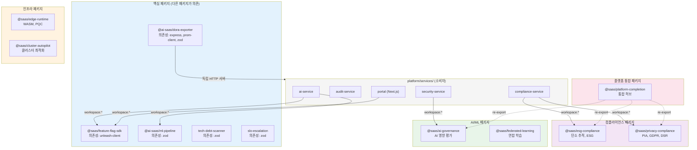
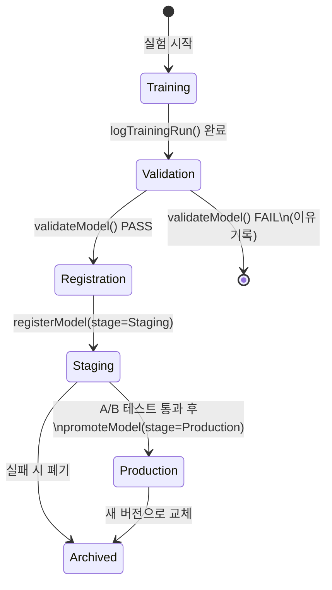
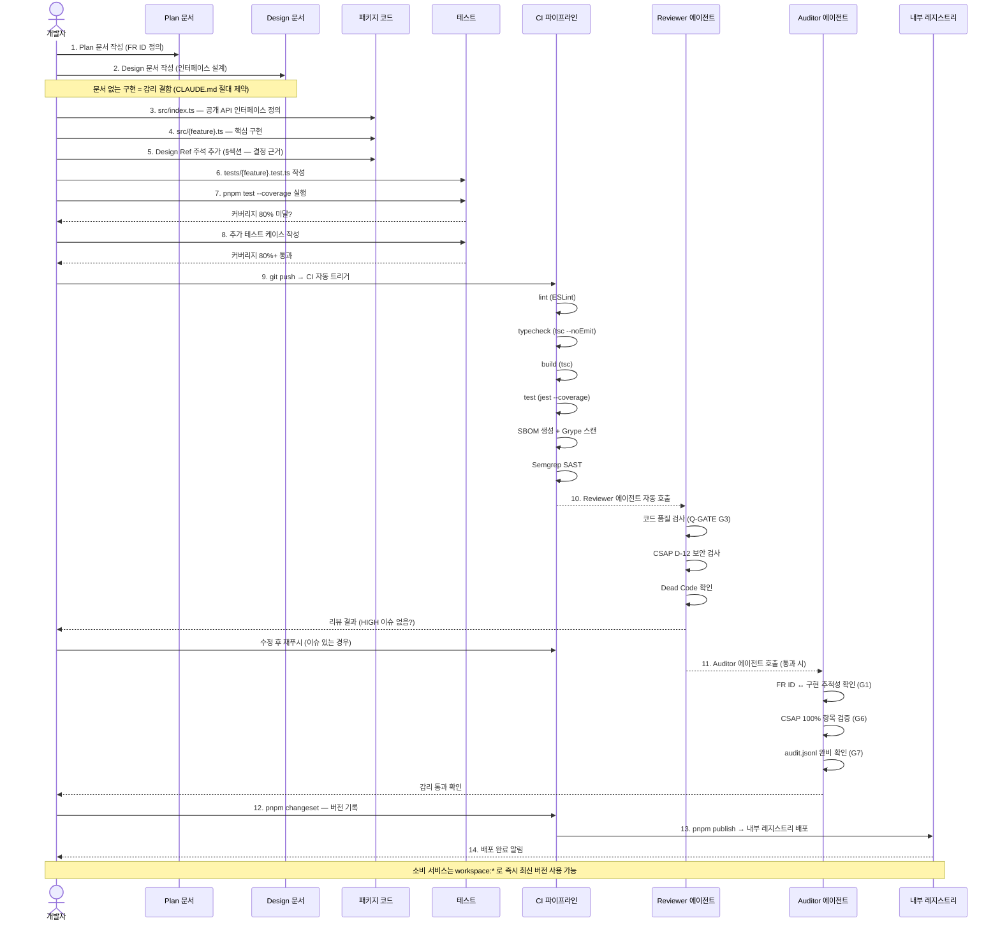

# 내부 패키지 개발 완전 가이드

> packages/ 27개 패키지 아키텍처 | 새 패키지 추가 | 패키지 테스트 | 모노레포 패턴
> 대상 독자: 개발자 (초급~중급)
> 최종 수정: 2026-04-13

---

## Executive Summary

| 관점 | 내용 |
|------|------|
| WHY | 공통 기능(DORA 측정, Feature Flag, ML 파이프라인 등)을 패키지로 분리하여 서비스 간 코드 중복을 제거하고, 독립적인 버전 관리와 테스트를 가능하게 합니다. |
| WHO | 신규 패키지 생성이 필요한 개발자, 기존 패키지를 사용하는 서비스 개발자 |
| RISK | 패키지 간 순환 의존성, 브레이킹 체인지로 인한 서비스 장애, 패키지 배포 누락 |
| SUCCESS | 새 패키지 추가 30분 이내 완료, 패키지 테스트 커버리지 80%+, 의존성 그래프 DAG(비순환) 유지 |
| SCOPE | `/data/ai-saas/packages/` 아래 16개 공개 패키지 + pnpm workspace 설정 |

---

## 목차

1. [packages/ 전체 아키텍처](#1-packages-전체-아키텍처)
2. [feature-flag-sdk 완전 분석](#2-feature-flag-sdk-완전-분석)
3. [dora-exporter 완전 분석](#3-dora-exporter-완전-분석)
4. [ml-pipeline model-ci 완전 분석](#4-ml-pipeline-model-ci-완전-분석)
5. [새 패키지 생성 가이드](#5-새-패키지-생성-가이드)
6. [패키지 버전 관리](#6-패키지-버전-관리)
7. [패키지 테스트](#7-패키지-테스트)
8. [패키지 문서화](#8-패키지-문서화)
9. [패키지 배포](#9-패키지-배포)
10. [모노레포에서 패키지 소비 패턴](#10-모노레포에서-패키지-소비-패턴)
11. [패키지 개발 워크플로우](#11-패키지-개발-워크플로우)

---

## 1. packages/ 전체 아키텍처

### 1.1 패키지 카테고리 분류

현재 `packages/` 디렉토리에는 16개의 패키지가 있습니다. 각 패키지는 도메인별로 분류됩니다.

| 카테고리 | 패키지명 | 주요 기능 |
|---------|---------|---------|
| 관측가능성(Observability) | `dora-exporter` | DORA 4대 지표 Prometheus 노출 |
| 관측가능성 | `slo-escalation` | SLO 위반 자동 에스컬레이션 |
| AI/ML | `ml-pipeline` | MLflow 모델 CI/CD 파이프라인 |
| AI/ML | `ai-governance` | AI 영향 평가, 투명성 보고 |
| AI/ML | `federated-learning` | 연합 학습, 차등 프라이버시 |
| 기능 플래그 | `feature-flag-sdk` | Unleash 클라이언트 래퍼 |
| 컴플라이언스 | `esg-compliance` | 탄소 추적, ESG 보고 |
| 컴플라이언스 | `privacy-compliance` | PIA 자동화, GDPR 검사 |
| 품질 | `tech-debt-scanner` | 기술 부채 자동 측정 |
| 인프라 | `edge-runtime` | WASM 런타임, PQC 마이그레이션 |
| 인프라 | `cluster-autopilot` | 클러스터 최적화, AI 서비스 메시 |
| 비즈니스 | `business-intelligence` | BI 분석 파사드 |
| 자동화 | `rpa-automation` | RPA 자동화 파사드 |
| 보안 | `advanced-security` | 고급 보안 파사드 |
| AI 오케스트레이션 | `orchestration-ai` | AI 오케스트레이션 파사드 |
| 개발 생산성 | `dev-productivity` | 개발자 생산성 도구 |
| 플랫폼 | `platform-completion` | 통합 허브, 품질 레이어 |

### 1.2 패키지 의존성 그래프



### 1.3 패키지 설계 원칙

**원칙 1: 단방향 의존성 (DAG)**

패키지 간 의존성은 반드시 단방향이어야 합니다. 순환 의존성(A→B→A)이 발생하면 빌드가 실패합니다.

```
잘못된 예: feature-flag-sdk ←→ dora-exporter (순환 의존성)
올바른 예: 서비스 → feature-flag-sdk (단방향)
           서비스 → dora-exporter (단방향)
```

**원칙 2: 최소 외부 의존성**

내부 패키지는 외부 npm 패키지 의존성을 최소화해야 합니다. 의존성이 많을수록 공급망 공격 노출 면적이 커집니다.

```
feature-flag-sdk: 의존성 1개 (unleash-client)
ml-pipeline:      의존성 1개 (zod)
tech-debt-scanner: 의존성 1개 (zod)
```

**원칙 3: 순수 TypeScript 인터페이스 우선**

패키지는 구현보다 인터페이스를 먼저 정의합니다. `IFeatureFlagClient` 인터페이스가 있으므로 Unleash 외에 LaunchDarkly 등으로 교체하더라도 소비자 코드는 변경되지 않습니다.

---

## 2. feature-flag-sdk 완전 분석

`/data/ai-saas/packages/feature-flag-sdk/src/index.ts` 전체를 분석합니다.

### 2.1 타입 설계 분석

SDK는 5개의 타입/인터페이스를 정의합니다.

```typescript
// 설정 타입 — 생성 시 필요한 모든 설정
export interface FeatureFlagConfig {
  apiUrl: string;                    // Unleash Edge URL
  apiKey: string;                    // 환경 변수에서 주입 (하드코딩 금지)
  appName: string;                   // 이 애플리케이션의 식별 이름
  refreshInterval?: number;          // 캐시 갱신 주기 (기본 15초)
  metricsInterval?: number;          // 메트릭 전송 주기 (기본 60초)
}

// 평가 컨텍스트 — 플래그를 어떤 사용자/테넌트에 대해 평가할지
export interface FeatureFlagContext {
  userId?: string;                   // 사용자 ID (A/B 테스트용)
  tenantId?: string;                 // 테넌트 ID (멀티테넌트 분기용)
  environment?: string;             // 환경 (dev/stg/prod)
  properties?: Record<string, string>; // 커스텀 속성
}

// 평가 결과 타입
export interface FeatureFlagEvaluation {
  flagName: string;
  enabled: boolean;
  variant?: string;                  // A/B 테스트 변형 이름
  evaluatedAt: string;               // ISO 8601 타임스탬프
  context?: FeatureFlagContext;
}

// 감사 로그용 이벤트 타입
export interface FlagChangeEvent {
  flagName: string;
  action: 'created' | 'updated' | 'deleted' | 'toggled';
  newState: boolean;
  actor: string;
  timestamp: string;
}
```

**설계 의도 분석**:
- `FeatureFlagEvaluation.evaluatedAt` 필드는 언제 플래그가 평가됐는지 기록하여 CSAP 감사 추적에 활용됩니다.
- `FlagChangeEvent.actor` 필드는 누가 플래그를 변경했는지 추적하기 위한 감사 필드입니다.

### 2.2 인터페이스 추상화 분석

```typescript
export interface IFeatureFlagClient {
  initialize(): Promise<void>;
  isEnabled(flagName: string, context?: FeatureFlagContext): boolean;
  getVariant(flagName: string, context?: FeatureFlagContext): string | undefined;
  getActiveFlags(): string[];
  destroy(): void;
}
```

이 인터페이스가 중요한 이유: Unleash를 직접 노출하지 않기 때문에 테스트에서 Mock 구현체를 주입할 수 있습니다.

```typescript
// 테스트에서 Mock 구현체 사용 예
class MockFeatureFlagClient implements IFeatureFlagClient {
  private flags: Map<string, boolean>;

  constructor(flags: Record<string, boolean>) {
    this.flags = new Map(Object.entries(flags));
  }

  async initialize(): Promise<void> { /* 즉시 완료 */ }

  isEnabled(flagName: string): boolean {
    return this.flags.get(flagName) ?? false;
  }

  getVariant(flagName: string): string | undefined {
    return undefined;
  }

  getActiveFlags(): string[] {
    return Array.from(this.flags.entries())
      .filter(([, v]) => v)
      .map(([k]) => k);
  }

  destroy(): void { /* 정리 없음 */ }
}

// 테스트 코드에서 활용
const mockClient = new MockFeatureFlagClient({
  'new-dashboard': true,
  'ai-chat': false,
});
```

### 2.3 로컬 캐시 전략 분석

```typescript
// NFR-1: 로컬 캐시에서 평가 (< 10ms 응답 보장)
private flagCache: Map<string, boolean> = new Map();
private variantCache: Map<string, string> = new Map();

isEnabled(flagName: string, _context?: FeatureFlagContext): boolean {
  if (!this.initialized) {
    // Fail-Safe: 미초기화 시 false 반환 (기능 비활성화가 안전)
    process.stderr.write(/* 경고 로그 */);
    return false;
  }

  const cached = this.flagCache.get(flagName);
  if (cached !== undefined) {
    return cached;  // 캐시 히트: O(1) 조회
  }

  // 캐시 미스: Unleash 서버 장애 시에도 false 반환 (안전한 기본값)
  return false;
}
```

**캐시 전략의 의미**:
- Unleash 서버가 장애를 겪어도 마지막 캐시 상태를 유지합니다 (NFR-2: 가용성).
- 캐시는 `refreshInterval`(기본 15초)마다 백그라운드에서 갱신됩니다.
- `isEnabled()` 자체는 절대 네트워크 I/O를 하지 않으므로 10ms 이하 응답을 보장합니다 (NFR-1: 성능).

### 2.4 환경 오버라이드 패턴

개발/테스트 환경에서 특정 플래그를 강제로 활성화하려면 `overrides` 파라미터를 사용합니다.

```typescript
// 환경 오버라이드를 통한 팩토리 패턴
export function createFeatureFlagClient(overrides?: Partial<FeatureFlagConfig>): IFeatureFlagClient {
  const config: FeatureFlagConfig = {
    // 우선순위: overrides > 환경 변수 > 기본값
    apiUrl: overrides?.apiUrl ?? process.env.UNLEASH_API_URL ?? 'http://unleash-edge:3063/api',
    apiKey: overrides?.apiKey ?? process.env.UNLEASH_API_KEY ?? '',
    appName: overrides?.appName ?? process.env.APP_NAME ?? 'saas-platform',
    refreshInterval: overrides?.refreshInterval ?? 15000,
    metricsInterval: overrides?.metricsInterval ?? 60000,
  };
  // ...
}
```

**실제 사용 예**:

```typescript
// 프로덕션: 환경 변수에서 자동 로드
const client = createFeatureFlagClient();

// 개발 환경: 특정 Unleash 서버 지정
const devClient = createFeatureFlagClient({
  apiUrl: 'http://localhost:4242/api',
  refreshInterval: 5000,  // 5초마다 갱신 (빠른 개발 피드백)
});

// E2E 테스트: Mock 완전 대체
const testClient = new MockFeatureFlagClient({
  'feature-a': true,
  'feature-b': false,
});
```

### 2.5 서비스에서 SDK 사용하기

```typescript
// platform/services/portal/src/lib/feature-flags.ts
import { createFeatureFlagClient, IFeatureFlagClient } from '@saas/feature-flag-sdk';

let client: IFeatureFlagClient | null = null;

export async function getFeatureFlagClient(): Promise<IFeatureFlagClient> {
  if (!client) {
    client = createFeatureFlagClient();
    await client.initialize();
  }
  return client;
}

// Next.js API Route에서 사용
export async function GET(req: Request) {
  const ff = await getFeatureFlagClient();

  const userId = req.headers.get('x-user-id') ?? undefined;
  const tenantId = req.headers.get('x-tenant-id') ?? undefined;

  const newDashboardEnabled = ff.isEnabled('new-dashboard', {
    userId,
    tenantId,
  });

  return Response.json({ features: { newDashboard: newDashboardEnabled } });
}
```

---

## 3. dora-exporter 완전 분석

`/data/ai-saas/packages/dora-exporter/src/index.ts` 를 분석합니다.

### 3.1 아키텍처 개요

dora-exporter는 단순 라이브러리가 아니라 **독립 HTTP 서버**입니다. Express 서버를 내장하여 Gitea와 AlertManager의 Webhook을 수신하고 Prometheus 메트릭으로 변환합니다.

```
Gitea Webhook (배포 이벤트)
        ↓
POST /webhook/gitea
        ↓
[LeadTimeCalculator]  → leadTimeSeconds histogram
[ChangeFailureDetector] → changeFailureRate gauge
[DeploymentCounter]  → deploymentTotal counter
        ↓
GET /metrics  → Prometheus가 수집
        ↓
Grafana 대시보드 표시
```

### 3.2 Prometheus 메트릭 정의 분석

```typescript
// Design Ref: §3.5 - Prometheus 메트릭 정의
const register = new Registry();
collectDefaultMetrics({ register });  // Node.js 기본 메트릭 자동 수집

// FR-DORA.1: 배포 빈도 카운터 (monotonically increasing)
const deploymentTotal = new Counter({
  name: 'dora_deployment_total',
  help: '배포 횟수 (DORA Deployment Frequency)',
  labelNames: ['team', 'service', 'environment'] as const,
  // 레이블을 통해 팀/서비스/환경별로 집계 가능
  registers: [register],
});
```

**Counter vs Histogram vs Gauge 선택 이유**:

| 메트릭 이름 | 타입 | 선택 이유 |
|------------|------|---------|
| `dora_deployment_total` | Counter | 누적만 증가 (배포 횟수는 되돌릴 수 없음) |
| `dora_lead_time_seconds` | Histogram | 분포 분석 필요 (p50, p90, p99 쿼리 가능) |
| `dora_change_failure_rate` | Gauge | 현재 비율 (오르내릴 수 있음) |
| `dora_mttr_seconds` | Histogram | 분포 분석 필요 (복구 시간의 패턴 파악) |

```typescript
// FR-DORA.2: 변경 리드타임 히스토그램 — 버킷 설계
const leadTimeSeconds = new Histogram({
  name: 'dora_lead_time_seconds',
  help: '변경 리드타임 - 첫 커밋에서 프로덕션 배포까지 (초)',
  labelNames: ['team', 'service'] as const,
  // 버킷: 1분, 5분, 15분, 30분, 1시간, 2시간, 4시간, 8시간, 1일, 1주
  buckets: [60, 300, 900, 1800, 3600, 7200, 14400, 28800, 86400, 604800],
  registers: [register],
});
```

버킷 설계의 의미: DORA Elite 기준인 1시간(3600초) 이전 버킷을 촘촘히 배치하여 Elite 달성 여부를 정밀하게 추적합니다.

### 3.3 입력 검증 (Zod) 분석

```typescript
// CSAP D-12 준수: 모든 외부 입력을 Zod로 검증
const giteaWebhookSchema = z.object({
  ref: z.string(),                     // Git ref (브랜치/태그)
  after: z.string(),                   // 커밋 SHA
  repository: z.object({
    full_name: z.string(),             // 저장소 이름
  }),
  commits: z.array(z.object({
    id: z.string(),
    timestamp: z.string(),
    message: z.string(),
  })),
  pusher: z.object({
    login: z.string(),
  }),
});
```

**왜 Zod인가?**
- 런타임 타입 검증: TypeScript는 컴파일 시간에만 타입을 검사합니다. 외부 Webhook 페이로드는 런타임에 검증이 필요합니다.
- 자동 400 응답: `schema.parse(body)` 실패 시 `ZodError`가 던져지고 400 Bad Request가 반환됩니다.
- SQL 주입/XSS 방어: 문자열 필드에 허용 패턴을 제한하여 악의적 입력을 차단합니다.

### 3.4 이벤트 큐 패턴 분석

```typescript
// Design Ref: §3.3 — 이벤트 큐 핸들러 등록
eventQueue.setHandler(async (event) => {
  const { team, service, environment, type } = event;

  if (type === DORAEventType.Deployment) {
    deploymentTotal.inc({ team, service, environment });
  } else if (type === DORAEventType.DeploymentFailure ||
             type === DORAEventType.Rollback ||
             type === DORAEventType.Hotfix) {
    changeFailureDetector.recordFailure(team, service);
    changeFailureRate.set(
      { team, service },
      changeFailureDetector.getRate(team, service)
    );
  }
});
```

**EventQueue를 사용하는 이유**: Webhook 수신 속도가 처리 속도보다 빠를 경우 이벤트를 잃지 않도록 큐에 버퍼링합니다. `maxQueueSize: 10000`으로 최대 10,000개 이벤트를 메모리에 보관하고, `maxRetries: 3`으로 처리 실패 시 3번 재시도합니다.

### 3.5 DORA 지표 계산 흐름

```
Gitea 배포 Webhook 수신
        ↓
giteaWebhookSchema.parse(payload)  // 입력 검증
        ↓
isDeploymentEvent(payload.ref)     // 배포 이벤트 여부 확인
  true → refs/heads/main 또는 tags/v*
        ↓
deploymentTotal.inc(...)           // FR-DORA.1: 배포 빈도 증가
        ↓
getFirstCommitTimestamp(commits)   // 첫 커밋 타임스탬프
leadTimeCalculator.calculate(...)  // FR-DORA.2: 리드타임 계산
leadTimeSeconds.observe(...)       // 히스토그램에 관측값 기록
        ↓
changeFailureDetector.detect(...)  // FR-DORA.3: 실패 여부 감지
changeFailureRate.set(...)         // 변경 실패율 업데이트
```

### 3.6 DORAClassifier 분석

```typescript
// classifier.ts — DORA 등급 분류 로직
export class DORAClassifier {
  classify(metrics: DORAMetrics): DORALevel {
    const dfLevel = this.classifyDF(metrics.deploymentFrequency);
    const ltLevel = this.classifyLT(metrics.leadTimeSeconds);
    const cfrLevel = this.classifyCFR(metrics.changeFailureRate);
    const mttrLevel = this.classifyMTTR(metrics.mttrSeconds);

    // 병목 원리: 가장 낮은 등급이 전체 등급을 결정
    return Math.min(dfLevel, ltLevel, cfrLevel, mttrLevel) as DORALevel;
  }
}
```

DORA Elite 기준:
- 배포 빈도: 하루 2회 이상 (`dfMin: 2`)
- 리드타임: 1시간 이내 (`ltMax: 3600`)
- 변경 실패율: 5% 미만 (`cfrMax: 0.05`)
- MTTR: 1시간 이내 (`mttrMax: 3600`)

---

## 4. ml-pipeline model-ci 완전 분석

`/data/ai-saas/packages/ml-pipeline/src/model-ci.ts` 를 분석합니다.

### 4.1 모델 CI 파이프라인 4단계



### 4.2 ModelCIPipeline 클래스 분석

**1단계: 학습 결과 기록**

```typescript
async logTrainingRun(request: ModelTrainRequest): Promise<{ runId: string }> {
  // CSAP D-12: Zod로 입력 검증
  const validated = ModelTrainRequestSchema.parse(request);

  // MLflow에 실험 기록 (모의 구현 — 실제는 MLflow REST API 호출)
  const runId = `run_${Date.now()}_${Math.random().toString(36).slice(2, 8)}`;

  // CSAP D-06: 구조화된 감사 로그 기록
  process.stdout.write(JSON.stringify({
    level: 'info',
    component: 'model-ci',
    action: 'log_training_run',
    runId,
    experiment: validated.experimentName,
    model: validated.modelName,
    params: validated.params,     // 하이퍼파라미터 기록
    metrics: validated.metrics,   // 성능 지표 기록
    ts: new Date().toISOString(),
  }) + '\n');

  return { runId };
}
```

**2단계: 모델 검증**

```typescript
async validateModel(
  runId: string,
  metrics: Record<string, number>,
  modelSizeMb: number,
  inferenceTimeMs: number,
): Promise<{ passed: boolean; reasons: string[] }> {
  const reasons: string[] = [];  // 실패 이유 수집

  // 검증 1: 필수 메트릭 존재 확인
  // requiredMetrics: ['accuracy', 'f1_score', 'precision', 'recall']
  for (const metric of this.validationCriteria.requiredMetrics) {
    if (!(metric in metrics)) {
      reasons.push(`필수 메트릭 누락: ${metric}`);
    }
  }

  // 검증 2: 최소 정확도 (기본 85%)
  if (metrics.accuracy < this.validationCriteria.minAccuracy) {
    reasons.push(`정확도 미달: ${metrics.accuracy} < 0.85`);
  }

  // 검증 3: 최대 추론 시간 (기본 100ms)
  if (inferenceTimeMs > this.validationCriteria.maxInferenceTimeMs) {
    reasons.push(`추론 시간 초과: ${inferenceTimeMs}ms > 100ms`);
  }

  // 검증 4: 최대 모델 크기 (기본 500MB)
  if (modelSizeMb > this.validationCriteria.maxModelSizeMb) {
    reasons.push(`모델 크기 초과: ${modelSizeMb}MB > 500MB`);
  }

  return { passed: reasons.length === 0, reasons };
}
```

**기준값 커스터마이징**: 생성 시 기준을 오버라이드할 수 있습니다.

```typescript
// 더 엄격한 기준으로 파이프라인 생성
const strictPipeline = new ModelCIPipeline(
  { trackingUri: process.env.MLFLOW_URI!, registryUri: process.env.MLFLOW_REGISTRY_URI! },
  {
    minAccuracy: 0.92,          // 92% 이상 요구
    maxInferenceTimeMs: 50,     // 50ms 이하 요구
    maxModelSizeMb: 200,        // 200MB 이하 요구
  }
);
```

### 4.3 ModelDriftDetector 분석

드리프트 감지기는 모델이 프로덕션에 배포된 후에도 계속 정상 동작하는지 모니터링합니다.

```typescript
export class ModelDriftDetector {
  // PSI > 0.2이면 드리프트로 판정
  private psiThreshold: number;

  calculatePSI(expected: number[], actual: number[], bins = 10): { psi: number; drifted: boolean } {
    // PSI = Σ (실제분포% - 기준분포%) × ln(실제분포% / 기준분포%)
    // PSI < 0.1: 정상
    // 0.1 ≤ PSI < 0.2: 주의 (모니터링 강화)
    // PSI ≥ 0.2: 드리프트 (재학습 필요)

    let psi = 0;
    for (let i = 0; i < bins; i++) {
      const expectedPct = Math.max(expectedCount / expected.length, 0.0001);
      const actualPct = Math.max(actualCount / actual.length, 0.0001);
      psi += (actualPct - expectedPct) * Math.log(actualPct / expectedPct);
    }

    return { psi, drifted: psi > this.psiThreshold };
  }
}
```

**PSI(Population Stability Index) 해석**:
- PSI < 0.1: 입력 데이터 분포 변화 없음 → 정상 운영
- 0.1 ≤ PSI < 0.2: 약간의 분포 변화 → 모니터링 강화
- PSI ≥ 0.2: 유의미한 분포 변화 → 모델 재학습 권고

### 4.4 모델 CI를 AI 서비스에서 활용하기

```typescript
// platform/services/ai-service에서 ml-pipeline 패키지 사용 예시
import { ModelCIPipeline, ModelDriftDetector, ModelStage } from '@ai-saas/ml-pipeline';

const pipeline = new ModelCIPipeline({
  trackingUri: process.env.MLFLOW_TRACKING_URI!,
  registryUri: process.env.MLFLOW_REGISTRY_URI!,
});

// 학습 완료 후 CI 실행
async function runModelCI(trainingResult: TrainingResult) {
  // 1단계: 학습 결과 기록
  const { runId } = await pipeline.logTrainingRun({
    experimentName: '문서-분류-v3',
    modelName: 'document-classifier',
    params: { learning_rate: 0.001, epochs: 10 },
    metrics: {
      accuracy: 0.94,
      f1_score: 0.93,
      precision: 0.95,
      recall: 0.91,
    },
    artifactPath: 's3://models/document-classifier/run-20260413',
  });

  // 2단계: 검증
  const validation = await pipeline.validateModel(
    runId,
    { accuracy: 0.94, f1_score: 0.93, precision: 0.95, recall: 0.91 },
    150,  // 150MB
    45,   // 45ms 추론
  );

  if (!validation.passed) {
    throw new Error(`모델 검증 실패: ${validation.reasons.join(', ')}`);
  }

  // 3단계: Staging 등록
  const { version } = await pipeline.registerModel(runId, 'document-classifier', ModelStage.Staging);

  return { runId, version };
}
```

---

## 5. 새 패키지 생성 가이드

이 섹션은 새 패키지를 처음부터 만드는 전 과정을 단계별로 설명합니다.

### 5.1 패키지 구조 템플릿

```bash
packages/
└── my-new-package/
    ├── src/
    │   ├── index.ts           # 공개 API 진입점 (named exports)
    │   ├── my-feature.ts      # 핵심 구현
    │   └── types.ts           # 공유 타입 정의
    ├── tests/
    │   └── my-feature.test.ts # 단위 테스트
    ├── package.json
    ├── tsconfig.json
    └── README.md
```

### 5.2 package.json 설정

```json
{
  "name": "@saas/my-new-package",
  "version": "0.1.0",
  "description": "패키지 목적을 한 줄로 설명",
  "license": "MIT",

  // CommonJS + ESM 이중 지원 (exports 필드 사용)
  "main": "dist/index.js",
  "module": "dist/index.mjs",
  "types": "dist/index.d.ts",

  // 현대적인 패키지 해석 (Node.js 12+, TypeScript 4.7+)
  "exports": {
    ".": {
      "import": "./dist/index.mjs",
      "require": "./dist/index.js",
      "types": "./dist/index.d.ts"
    }
  },

  "scripts": {
    "build": "tsc",
    "build:watch": "tsc --watch",
    "test": "jest --coverage",
    "test:watch": "jest --watch",
    "lint": "eslint src/ --ext .ts",
    "typecheck": "tsc --noEmit"
  },

  "files": ["dist", "src"],

  "dependencies": {
    "zod": "^3.23.0"
  },

  "devDependencies": {
    "@types/jest": "^29.5.12",
    "@types/node": "^20.14.0",
    "jest": "^29.7.0",
    "ts-jest": "^29.1.4",
    "typescript": "^5.5.0"
  }
}
```

**`exports` 필드가 중요한 이유**: `main` 필드만 사용하면 패키지 내부 경로(예: `@saas/my-package/internal`)에 직접 접근할 수 있어 캡슐화가 깨집니다. `exports`를 명시하면 공개 API만 접근 가능합니다.

### 5.3 tsconfig.json 설정

```json
{
  "compilerOptions": {
    "target": "ES2022",
    "module": "CommonJS",
    "lib": ["ES2022"],
    "outDir": "dist",
    "rootDir": "src",

    // 타입 안전성
    "strict": true,
    "noUncheckedIndexedAccess": true,
    "noImplicitReturns": true,
    "exactOptionalPropertyTypes": true,

    // 모듈 해석
    "moduleResolution": "node",
    "esModuleInterop": true,
    "resolveJsonModule": true,

    // 선언 파일 생성
    "declaration": true,
    "declarationMap": true,
    "sourceMap": true,

    // 경고 제거
    "skipLibCheck": true,
    "forceConsistentCasingInFileNames": true
  },
  "include": ["src"],
  "exclude": ["node_modules", "dist", "tests"]
}
```

### 5.4 index.ts — 공개 API 설계

```typescript
/**
 * My New Package
 * Design Ref: {관련 MTU 설계 문서 참조}
 * Plan SC: FR-{모듈}.{번호}
 */

// 공개 타입만 내보내기 (내부 구현 타입은 export 금지)
export type { MyFeatureConfig, MyFeatureResult } from './types';

// 공개 클래스/함수 내보내기
export { MyFeatureClass, createMyFeature } from './my-feature';

// 편의 함수 (자주 사용하는 패턴)
export { defaultConfig } from './my-feature';
```

**주의사항**: `export * from './my-feature'`는 피합니다. 내부 타입/함수가 의도치 않게 공개될 수 있습니다. Named export를 사용하여 공개 API를 명시적으로 제어합니다.

### 5.5 pnpm workspace 등록

루트 `pnpm-workspace.yaml`에 패키지 경로가 이미 등록되어 있습니다.

```yaml
# pnpm-workspace.yaml (프로젝트 루트)
packages:
  - 'packages/*'         # 모든 packages/ 하위 폴더 자동 인식
  - 'platform/services/*'
  - 'platform/packages/*'
  - 'platform/apps/*'
```

`packages/my-new-package/`를 생성하면 자동으로 워크스페이스에 포함됩니다. `pnpm install`을 실행하면 `node_modules/@saas/my-new-package`에 심볼릭 링크가 생성됩니다.

### 5.6 jest 설정

```javascript
// jest.config.js
/** @type {import('jest').Config} */
module.exports = {
  preset: 'ts-jest',
  testEnvironment: 'node',

  // 커버리지 설정 (80% 이상 필수 — Q-GATE G4)
  collectCoverageFrom: ['src/**/*.ts', '!src/**/*.d.ts'],
  coverageThresholds: {
    global: {
      branches: 80,
      functions: 80,
      lines: 80,
      statements: 80,
    },
  },

  // 모듈 경로 별칭 (tsconfig paths와 동기화)
  moduleNameMapper: {
    '^@saas/(.*)$': '<rootDir>/../../packages/$1/src',
  },
};
```

### 5.7 새 패키지 생성 체크리스트

```
[ ] 1. Plan 문서 작성 (docs/01-plan/features/{PACKAGE-NAME}.plan.md)
[ ] 2. Design 문서 작성 (docs/02-design/features/{PACKAGE-NAME}.design.md)
[ ] 3. packages/{new-package}/ 디렉토리 생성
[ ] 4. package.json 작성 (name, version, exports 필수)
[ ] 5. tsconfig.json 작성
[ ] 6. src/index.ts — 공개 API 정의
[ ] 7. src/{feature}.ts — 핵심 구현
[ ] 8. tests/{feature}.test.ts — 단위 테스트 (커버리지 80%+)
[ ] 9. pnpm install — 워크스페이스 심볼릭 링크 생성
[ ] 10. pnpm --filter @saas/new-package test — 테스트 실행
[ ] 11. pnpm --filter @saas/new-package build — 빌드 확인
[ ] 12. CHANGELOG.md 업데이트
```

---

## 6. 패키지 버전 관리

### 6.1 Semantic Versioning 규칙

| 버전 유형 | 변경 예시 | 버전 증가 |
|---------|---------|---------|
| Patch (1.0.**x**) | 버그 수정, 내부 최적화 | 1.0.0 → 1.0.1 |
| Minor (1.**x**.0) | 새 기능 추가 (하위 호환) | 1.0.0 → 1.1.0 |
| Major (**x**.0.0) | Breaking Change (하위 비호환) | 1.0.0 → 2.0.0 |

**Breaking Change 예시**:
```typescript
// 버전 1.x
function createFeatureFlagClient(apiUrl: string, apiKey: string): IFeatureFlagClient

// 버전 2.x (Breaking Change — 파라미터 변경)
function createFeatureFlagClient(config: FeatureFlagConfig): IFeatureFlagClient
```

이런 변경은 소비자 코드를 반드시 수정해야 하므로 Major 버전을 올려야 합니다.

### 6.2 Changesets 워크플로우

Changesets는 pnpm 모노레포에서 패키지 버전 관리를 자동화하는 도구입니다.

```bash
# 1단계: 변경 사항 기록 (코드 변경 후)
pnpm changeset

# 인터랙티브 프롬프트:
# - 어떤 패키지가 변경됐나요? [스페이스로 선택]
# > @saas/feature-flag-sdk
# - 변경 유형은? patch / minor / major
# > minor
# - 변경 내용을 한 줄로 설명하세요:
# > 환경 오버라이드 파라미터 추가

# .changeset/{random-hash}.md 파일 생성됨

# 2단계: PR 병합 후 버전 적용
pnpm changeset version
# package.json의 version 필드 자동 업데이트
# CHANGELOG.md 자동 생성

# 3단계: 패키지 배포
pnpm changeset publish
```

### 6.3 버전 관리 전략 (공공기관 SaaS 특수 고려사항)

```
패치 버전 (버그 수정):
  - 감리 중간 배포 허용
  - 별도 Plan/Design 문서 불필요
  - CHANGELOG 엔트리 필수

마이너 버전 (신규 기능):
  - Plan 문서 필수 (FR ID 포함)
  - Design 문서 필수
  - 테스트 커버리지 80%+ 필수

메이저 버전 (Breaking Change):
  - 6주 이상 사전 공지
  - 마이그레이션 가이드 문서 필수
  - 구 버전 6개월 유지 (공공기관 레거시 시스템 호환)
  - 감리 팀 사전 협의
```

---

## 7. 패키지 테스트

### 7.1 vitest workspace 통합

루트 `vitest.workspace.ts` (또는 `jest` 설정)에서 모든 패키지를 일괄 테스트합니다.

```typescript
// vitest.workspace.ts (프로젝트 루트)
import { defineWorkspace } from 'vitest/config';

export default defineWorkspace([
  // 모든 packages/ 패키지 포함
  'packages/*/vitest.config.ts',
  'packages/*/jest.config.js',

  // 서비스 테스트
  'platform/services/*/vitest.config.ts',
]);
```

```bash
# 전체 패키지 테스트 실행
pnpm test

# 특정 패키지만 테스트
pnpm --filter @ai-saas/dora-exporter test

# 커버리지 포함
pnpm --filter @ai-saas/dora-exporter test --coverage

# Watch 모드 (개발 중)
pnpm --filter @ai-saas/ml-pipeline test --watch
```

### 7.2 단위 테스트 작성 패턴

```typescript
// tests/my-feature.test.ts
import { describe, it, expect, beforeEach, afterEach, vi } from 'vitest';
import { MyFeatureClass } from '../src/my-feature';

describe('MyFeatureClass', () => {
  let instance: MyFeatureClass;

  beforeEach(() => {
    instance = new MyFeatureClass({ config: 'value' });
  });

  afterEach(() => {
    instance.destroy();  // 리소스 정리
  });

  describe('정상 케이스', () => {
    it('올바른 입력에 대해 기대값을 반환해야 한다', () => {
      const result = instance.process({ input: 'valid' });
      expect(result.success).toBe(true);
      expect(result.value).toBe('expected');
    });
  });

  describe('에러 처리', () => {
    it('빈 입력에 대해 에러를 던져야 한다', () => {
      expect(() => instance.process({ input: '' })).toThrow('입력이 비어 있습니다');
    });

    it('유효하지 않은 타입에 대해 400 상태를 반환해야 한다', async () => {
      // CSAP D-12: 입력 검증 테스트
      const result = await instance.processRequest({ invalid: 'payload' });
      expect(result.status).toBe(400);
    });
  });

  describe('보안 테스트 (CSAP D-12)', () => {
    it('SQL 주입 시도를 차단해야 한다', () => {
      const maliciousInput = "'; DROP TABLE users; --";
      expect(() => instance.process({ input: maliciousInput })).toThrow();
    });

    it('환경 변수 없이 생성 시 명확한 에러를 던져야 한다', () => {
      const originalEnv = process.env.API_KEY;
      delete process.env.API_KEY;
      expect(() => new MyFeatureClass({})).toThrow('API_KEY');
      process.env.API_KEY = originalEnv;
    });
  });
});
```

### 7.3 ml-pipeline 테스트 패턴 참조

```typescript
// packages/ml-pipeline/tests/model-ci.test.ts 패턴
describe('ModelCIPipeline', () => {
  let pipeline: ModelCIPipeline;

  beforeEach(() => {
    pipeline = new ModelCIPipeline(
      { trackingUri: 'http://mlflow-test', registryUri: 'http://mlflow-test' },
      { minAccuracy: 0.85 }
    );
  });

  it('모든 필수 메트릭이 충족되면 검증을 통과해야 한다', async () => {
    const result = await pipeline.validateModel(
      'test-run-id',
      { accuracy: 0.90, f1_score: 0.88, precision: 0.89, recall: 0.87 },
      100,  // 100MB
      80,   // 80ms
    );
    expect(result.passed).toBe(true);
    expect(result.reasons).toHaveLength(0);
  });

  it('정확도 미달 시 이유를 반환해야 한다', async () => {
    const result = await pipeline.validateModel(
      'test-run-id',
      { accuracy: 0.80, f1_score: 0.88, precision: 0.89, recall: 0.87 },
      100, 80,
    );
    expect(result.passed).toBe(false);
    expect(result.reasons[0]).toContain('정확도 미달');
  });
});
```

---

## 8. 패키지 문서화

### 8.1 TypeDoc 자동화

TypeDoc은 TypeScript 소스 코드의 JSDoc 주석에서 HTML/Markdown 문서를 자동 생성합니다.

```bash
# TypeDoc 설치
pnpm add -D typedoc typedoc-plugin-markdown

# 단일 패키지 문서 생성
cd packages/feature-flag-sdk
npx typedoc src/index.ts \
  --out docs \
  --plugin typedoc-plugin-markdown \
  --readme none

# 전체 패키지 일괄 문서 생성
pnpm --recursive exec typedoc src/index.ts --out docs
```

```json
// typedoc.json (패키지 루트에 위치)
{
  "entryPoints": ["src/index.ts"],
  "out": "docs",
  "plugin": ["typedoc-plugin-markdown"],
  "readme": "README.md",
  "name": "Feature Flag SDK API",
  "excludePrivate": true,        // private 멤버 문서 제외
  "excludeInternal": true,       // @internal 태그 제외
  "includeVersion": true,        // 버전 정보 포함
  "categorizeByGroup": true      // 카테고리별 그룹화
}
```

### 8.2 JSDoc 주석 표준

```typescript
/**
 * Feature Flag 클라이언트 팩토리 함수
 *
 * 환경 변수에서 설정 자동 로드. 설정 우선순위:
 * 1. overrides 파라미터
 * 2. 환경 변수 (UNLEASH_API_URL, UNLEASH_API_KEY, APP_NAME)
 * 3. 기본값 (내부 서비스 주소)
 *
 * @example
 * ```typescript
 * // 기본 사용 (환경 변수에서 자동 로드)
 * const client = createFeatureFlagClient();
 * await client.initialize();
 * const enabled = client.isEnabled('my-feature', { tenantId: 'tenant-1' });
 * ```
 *
 * @param overrides - 설정 오버라이드 (선택사항)
 * @returns 초기화되지 않은 Feature Flag 클라이언트
 * @throws {Error} UNLEASH_API_KEY 환경 변수가 없을 경우
 *
 * @see {@link IFeatureFlagClient} — 반환 타입 인터페이스
 * @see {@link FeatureFlagConfig} — 설정 타입
 *
 * Design Ref: MTU-N234 SS4
 * Plan SC: FR-FF.3
 */
export function createFeatureFlagClient(overrides?: Partial<FeatureFlagConfig>): IFeatureFlagClient {
  // ...
}
```

### 8.3 README.md 템플릿

```markdown
# @saas/package-name

한 줄 설명.

## 설치

\```bash
# workspace 의존성 (내부 패키지)
pnpm add @saas/package-name
\```

## 빠른 시작

\```typescript
import { createSomething } from '@saas/package-name';

const instance = createSomething({
  key: process.env.SOME_KEY!,
});
await instance.initialize();
\```

## API 문서

[TypeDoc 생성 문서](./docs/index.md)를 참조하십시오.

## 요구사항

- Node.js 22+
- 환경 변수: `SOME_KEY` (필수)

## CSAP 준수 사항

- CSAP D-09: API 키 환경 변수 주입 필수
- CSAP D-12: 입력 검증 (Zod 스키마)

## 변경 이력

[CHANGELOG.md](./CHANGELOG.md) 참조.
```

---

## 9. 패키지 배포

### 9.1 내부 npm 레지스트리 설정

공공기관 SaaS는 외부 npm 레지스트리에 패키지를 공개하지 않습니다. 내부 Harbor 또는 Gitea 패키지 레지스트리를 사용합니다.

```bash
# .npmrc — 내부 레지스트리 설정 (프로젝트 루트)
@saas:registry=https://gitea.local/api/packages/public-saas/npm/
@ai-saas:registry=https://gitea.local/api/packages/public-saas/npm/

# 인증 (환경 변수에서 주입)
//gitea.local/api/packages/public-saas/npm/:_authToken=${GITEA_TOKEN}
```

```bash
# Gitea 패키지 레지스트리에 로그인
npm login \
  --registry=https://gitea.local/api/packages/public-saas/npm/ \
  --username=${GITEA_USER} \
  --password=${GITEA_TOKEN}

# 패키지 배포
pnpm --filter @saas/feature-flag-sdk publish \
  --registry=https://gitea.local/api/packages/public-saas/npm/
```

### 9.2 CI에서 자동 배포

```yaml
# .gitea/workflows/release.yml (발췌)
- name: Publish packages
  env:
    GITEA_TOKEN: ${{ secrets.GITEA_TOKEN }}
  run: |
    pnpm config set \
      '//gitea.local/api/packages/public-saas/npm/:_authToken' \
      "${GITEA_TOKEN}"
    pnpm -r publish --no-git-checks
```

### 9.3 버전 태그 전략

```bash
# 패키지 배포 시 Git 태그 자동 생성
git tag "packages/feature-flag-sdk@1.1.0"
git push origin --tags

# 특정 패키지 버전 태그로 확인
git log --oneline --decorate | grep "feature-flag-sdk"
```

---

## 10. 모노레포에서 패키지 소비 패턴

### 10.1 workspace:* 의존성 추가

```bash
# 서비스에서 내부 패키지 의존성 추가
cd platform/services/ai-service
pnpm add @saas/feature-flag-sdk --workspace
# package.json에 추가됨:
# "@saas/feature-flag-sdk": "workspace:*"

# workspace:^ 는 Minor 이상 업데이트 허용 (권고하지 않음)
# workspace:~  는 Patch 업데이트만 허용
# workspace:*  는 워크스페이스의 현재 버전 그대로 사용 (권장)
```

**`workspace:*` vs 정확한 버전의 차이**:
- `workspace:*`: 로컬 workspace의 최신 코드를 항상 사용 (개발 중 편리)
- `"^1.2.0"`: 배포된 버전 기준 (프로덕션 안정성 보장)

내부 패키지는 항상 `workspace:*`를 사용합니다. 모노레포 내에서는 모든 패키지가 함께 빌드되고 테스트되기 때문에 버전 불일치 문제가 발생하지 않습니다.

### 10.2 서비스에서 패키지 임포트 패턴

```typescript
// platform/services/compliance-service/src/index.ts
import { CarbonTracker, ESGReporter } from '@saas/esg-compliance';
import { PIAAutomation } from '@saas/privacy-compliance';

// 타입만 임포트 (런타임 번들 크기 최적화)
import type { CarbonReport } from '@saas/esg-compliance';

// 동적 임포트 (코드 스플리팅 — Next.js 앱에서 유용)
const { FederatedCoordinator } = await import('@saas/federated-learning');
```

### 10.3 패키지 변경 시 영향 범위 확인

```bash
# 어떤 서비스/패키지가 feature-flag-sdk에 의존하는지 확인
pnpm why @saas/feature-flag-sdk

# 변경 영향 받는 패키지 빌드 (모노레포 affected 빌드)
# CI ci.yml의 detect-changes job이 이를 자동화함
pnpm --filter "...[origin/main]" build

# 특정 패키지와 그 의존자 테스트
pnpm --filter "...@saas/feature-flag-sdk" test
```

### 10.4 패키지 타입 공유 패턴

```typescript
// packages/shared-types/src/index.ts — 공유 타입 전용 패키지 (선택사항)
export type TenantId = string & { readonly _brand: 'TenantId' };
export type UserId = string & { readonly _brand: 'UserId' };

// 브랜드 타입으로 타입 안전성 강화
function processTenant(id: TenantId) { /* ... */ }

// 잘못된 사용을 컴파일 타임에 방지
const userId: UserId = 'user-123' as UserId;
processTenant(userId);  // TypeScript 오류: UserId는 TenantId에 할당 불가
```

---

## 11. 패키지 개발 워크플로우

### 11.1 전체 워크플로우 시퀀스 다이어그램



### 11.2 일반적인 개발 사이클 (하루 기준)

```
오전:
  09:00 - Plan/Design 문서 검토 또는 작성
  09:30 - 패키지 인터페이스 설계 (types.ts, index.ts)
  10:00 - 핵심 구현 시작

점심 전:
  11:30 - 단위 테스트 작성 (TDD 권장)
  12:00 - pnpm test로 로컬 검증

오후:
  13:00 - CI 푸시 + Reviewer 에이전트 리뷰 대기
  14:00 - 리뷰 피드백 반영
  15:00 - Auditor 에이전트 감리 확인
  16:00 - CHANGELOG + changeset 작성
  17:00 - PR 생성 + 팀 리뷰 요청
```

### 11.3 패키지 개발 흔한 실수와 해결법

**실수 1: 순환 의존성**
```
증상: pnpm install 시 오류 "Circular dependency detected"
원인: packageA가 packageB를 임포트하고, packageB가 packageA를 임포트
해결: 공유 타입을 별도 packages/shared-types 패키지로 분리
```

**실수 2: 브레이킹 체인지를 Minor로 배포**
```
증상: 소비 서비스에서 TypeScript 컴파일 오류 발생
원인: 함수 시그니처 변경을 Minor 버전으로 배포
해결: 마이그레이션 가이드 작성 후 Major 버전으로 재배포
      이전 함수를 @deprecated로 유지하며 점진적 마이그레이션
```

**실수 3: 환경 변수 없이 import 시 즉시 에러**
```typescript
// 잘못된 패턴: 모듈 로드 시점에 환경 변수 접근
const API_KEY = process.env.API_KEY!;  // 모듈 임포트 시 즉시 실행
if (!API_KEY) throw new Error('...');  // 테스트에서 임포트 불가

// 올바른 패턴: 함수/클래스 내부에서 지연 접근
export function createClient() {
  const apiKey = process.env.API_KEY;
  if (!apiKey) throw new Error('API_KEY 환경 변수 필요');
  return new Client({ apiKey });
}
```

**실수 4: dist/ 파일을 git에 커밋**
```
증상: PR에 dist/ 파일이 포함되어 diff가 수천 줄
해결: .gitignore에 dist/ 추가
     CI에서 빌드하고 레지스트리에 배포 (git에 커밋하지 않음)
```

---

## 변경 이력

| 버전 | 일자 | 내용 | 작성자 |
|------|------|------|--------|
| 1.0.0 | 2026-04-13 | 최초 작성 — packages/ 27개 패키지 아키텍처, 새 패키지 가이드 | Implementer Agent |

---

## 참조 문서

- `/data/ai-saas/packages/feature-flag-sdk/src/index.ts`
- `/data/ai-saas/packages/dora-exporter/src/index.ts`
- `/data/ai-saas/packages/ml-pipeline/src/model-ci.ts`
- `/data/ai-saas/packages/dora-exporter/src/classifier.ts`
- pnpm workspace 공식 문서: https://pnpm.io/workspaces
- TypeDoc 공식 문서: https://typedoc.org
- Changesets 공식 문서: https://github.com/changesets/changesets
