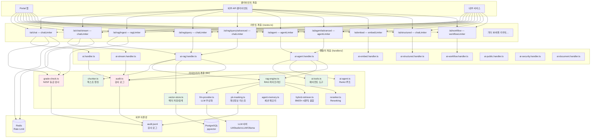
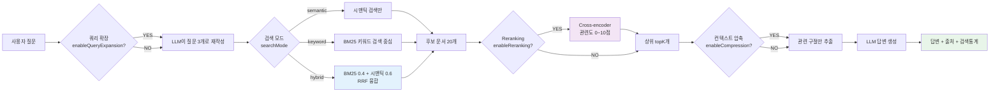
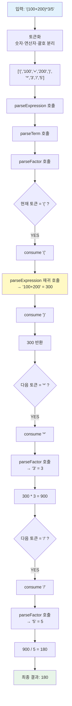
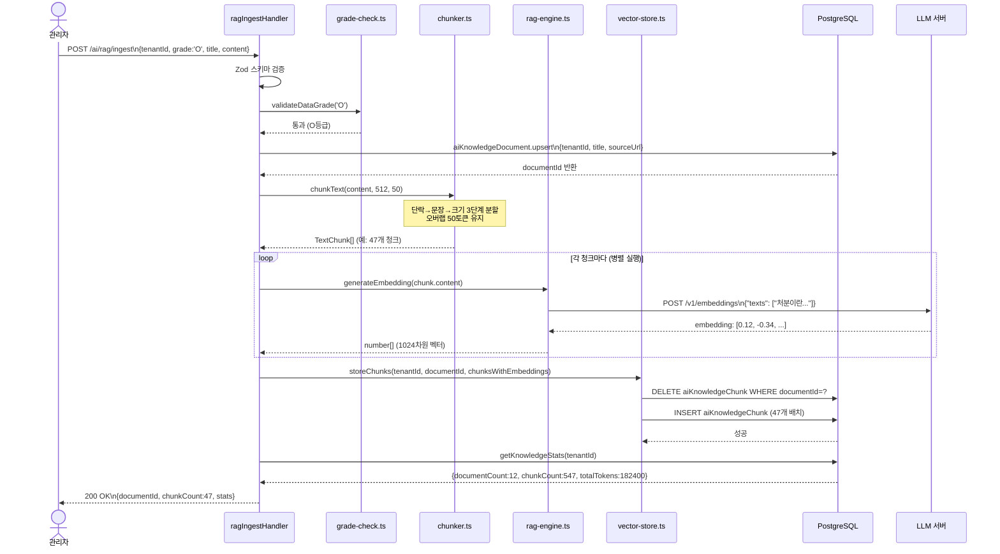
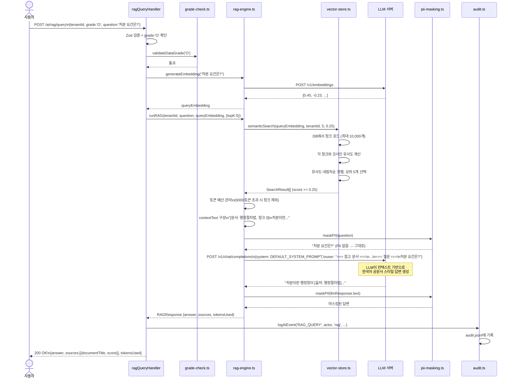
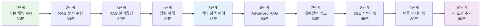

# 48장: AI 서비스 완전 분석 — 아키텍처, RAG 파이프라인, 스트리밍, 비용 제어

> **대상 독자**: 공공기관 SaaS 플랫폼 신규 개발자  
> **전제 지식**: TypeScript 기초, HTTP/REST API 개념, 데이터베이스 기초  
> **학습 시간**: 3~4시간  
> **관련 파일**: `platform/services/ai-service/src/`  
> **설계 문서**: `SVC-AI-2026 DESIGN`, `SVC-AI-ADV-R1 DESIGN`, `SVC-AI-ADV-R2 DESIGN`

---

## 목차

1. [AI 서비스란 무엇인가?](#1-ai-서비스란-무엇인가)
2. [전체 아키텍처 다이어그램](#2-전체-아키텍처-다이어그램)
3. [routes.ts 완전 분석 — 7종 Rate Limiter와 N2SF 강제](#3-routests-완전-분석)
4. [chunker.ts 완전 분석 — 한국어 최적화 청킹 전략](#4-chunkerts-완전-분석)
5. [rag-engine.ts 완전 분석 — 하이브리드 검색과 토큰 예산](#5-rag-enginets-완전-분석)
6. [vector-store.ts 완전 분석 — 코사인 유사도와 테넌트 격리](#6-vector-storets-완전-분석)
7. [ai-tools.ts 완전 분석 — safeEvaluate 재귀 하강 파서](#7-ai-toolsts-완전-분석)
8. [RAG 파이프라인 전체 흐름 시퀀스](#8-rag-파이프라인-전체-흐름)
9. [AI 스트리밍 SSE 구현](#9-ai-스트리밍-sse-구현)
10. [AI 비용 제어 전략](#10-ai-비용-제어-전략)
11. [AI 서비스 확장 포인트](#11-ai-서비스-확장-포인트)
12. [초급자를 위한 AI 서비스 이해하기 10단계](#12-초급자를-위한-ai-서비스-이해하기-10단계)

---

## 1. AI 서비스란 무엇인가?

AI 서비스(`platform/services/ai-service/`)는 공공기관 SaaS 플랫폼의 핵심 인공지능 엔진입니다. 단순한 챗봇이 아니라 공공 업무에 특화된 다음과 같은 기능을 제공합니다.

### 1.1 AI 서비스가 하는 일

| 기능 | 설명 | 실제 사용 예시 |
|------|------|----------------|
| **RAG 지식베이스** | 공공문서를 검색해서 근거 기반으로 답변 | "행정절차법 제17조 내용이 무엇인가?" |
| **ReAct 에이전트** | 여러 도구를 조합해 복잡한 문제 해결 | "예산 집행 현황 분석 후 요약 공문 작성" |
| **구조화 출력** | JSON 스키마에 맞는 정형 결과 생성 | 민원 자동 분류 → DB 저장 |
| **SSE 스트리밍** | 실시간으로 응답 문자를 화면에 출력 | 타이핑 효과로 답변 스트리밍 |
| **문서 분석** | 장문 공공문서 요약/위험도 분류 | 50페이지 입찰 공고문 자동 요약 |
| **보안 AI** | 이상 탐지, DLP 스캔 | 개인정보 유출 문서 자동 탐지 |

### 1.2 왜 AI 서비스가 별도 마이크로서비스인가?

```
일반 API 서비스: 응답시간 < 100ms (동기 처리 최적)
AI 서비스:       응답시간 3~60초 (LLM 생성 시간)
              + 비용이 높음 (토큰당 과금)
              + 보안 요건이 다름 (N2SF O등급만 허용)
              + 스케일링 방식이 다름 (GPU 클러스터)
```

AI 서비스는 이 모든 차이를 격리하여 다른 서비스에 영향을 주지 않도록 설계되었습니다.

---

## 2. 전체 아키텍처 다이어그램

### 2.1 계층 구조 다이어그램



### 2.2 요청 처리 흐름 개요

AI 서비스로 요청이 들어올 때 거치는 단계는 다음과 같습니다.

```
[클라이언트 요청]
      ↓
[1단계] INTERNAL_SERVICE_KEY 검증 (서비스 간 인증)
      ↓
[2단계] Rate Limiter 통과 (Redis 기반, 7종 제한 정책)
      ↓
[3단계] 핸들러 실행 → Zod 스키마 입력 검증
      ↓
[4단계] N2SF 데이터 등급 검사 (O등급만 통과)
      ↓
[5단계] PII 마스킹 (개인정보 제거)
      ↓
[6단계] 비즈니스 로직 실행 (RAG/Agent/Chat 등)
      ↓
[7단계] 감사 로그 기록 (logAiEvent)
      ↓
[응답 반환]
```

---

## 3. routes.ts 완전 분석

`routes.ts`는 AI 서비스의 "현관문" 역할을 합니다. 모든 API 요청이 이 파일을 통해 적절한 핸들러로 연결됩니다.

### 3.1 서비스 간 내부 인증 메커니즘

```typescript
// routes.ts 58~74번째 줄 분석
const internalKey = process.env['INTERNAL_SERVICE_KEY'];
if (!internalKey && process.env['NODE_ENV'] === 'production') {
  throw new Error('[SECURITY] INTERNAL_SERVICE_KEY 환경변수가 설정되지 않았습니다.');
}
if (internalKey) {
  app.addHook('onRequest', async (request, reply) => {
    if (request.url === '/health' || request.url === '/ready') return; // 헬스체크 제외
    const provided = request.headers['x-internal-service-key'];
    if (provided !== internalKey) {
      await reply.status(401).send({ ... });
    }
  });
}
```

**핵심 이해사항**: AI 서비스는 공개 인터넷에 직접 노출되지 않습니다. API 게이트웨이를 통해서만 접근 가능하며, 서비스 간 통신 시에는 `x-internal-service-key` 헤더로 신원을 증명해야 합니다. CSAP D-08 (접근 통제) 요건입니다.

**왜 이 방식인가?**: JWT 토큰으로 서비스 인증을 하면 토큰 만료/갱신 로직이 복잡해집니다. 내부 서비스는 네트워크 격리(k3s NetworkPolicy)로 1차 보호하고, 공유 비밀키로 2차 보호하는 것이 단순하고 효과적입니다.

### 3.2 7종 Rate Limiter 설계

```typescript
// routes.ts 77~83번째 줄
const readLimiter   = createRateLimiter(100, 60, 'rl:ai:read');    // 읽기: 분당 100
const writeLimiter  = createRateLimiter(20,  60, 'rl:ai:write');   // 쓰기: 분당 20
const chatLimiter   = createRateLimiter(10,  60, 'rl:ai:chat');    // 채팅: 분당 10
const embedLimiter  = createRateLimiter(30,  60, 'rl:ai:embed');   // 임베딩: 분당 30
const ragLimiter    = createRateLimiter(20,  60, 'rl:ai:rag');     // RAG: 분당 20
const agentLimiter  = createRateLimiter(5,   60, 'rl:ai:agent');   // 에이전트: 분당 5
const workflowLimiter = createRateLimiter(10, 60, 'rl:ai:workflow'); // 워크플로우: 분당 10
```

**Rate Limiter별 설계 이유**:

| Limiter | 제한 | 이유 |
|---------|------|------|
| readLimiter | 100/분 | 단순 조회, 비용 없음 → 넉넉하게 허용 |
| writeLimiter | 20/분 | DB 쓰기 발생 → 중간 제한 |
| chatLimiter | 10/분 | LLM API 호출 비용 발생 → 엄격 제한 |
| embedLimiter | 30/분 | 임베딩은 채팅보다 저렴 → 조금 더 허용 |
| ragLimiter | 20/분 | 임베딩 + DB 조회 → 중간 제한 |
| **agentLimiter** | **5/분** | **에이전트는 반복 LLM 호출 (최대 10회)** → **가장 엄격** |
| workflowLimiter | 10/분 | 여러 단계 AI 호출 → 엄격 제한 |

**에이전트가 가장 엄격한 이유**: ReAct 에이전트는 한 번 실행에 최대 10회 LLM 호출이 발생합니다. 분당 5회 허용이지만 실제로는 LLM 50회 호출이 될 수 있습니다. 공공기관의 예산 계획이 없이는 이 비용이 폭발적으로 증가할 수 있습니다.

### 3.3 N2SF O등급 강제 메커니즘

routes.ts의 모든 채팅/RAG/에이전트 엔드포인트의 JSON Schema를 살펴보면:

```typescript
// routes.ts 173번째 줄 (POST /ai/chat 예시)
grade: { type: 'string' as const, enum: ['O'] },
// ↑ 'O' 등급만 허용! C, S 등급은 스키마 단계에서 차단됨
```

**2중 방어 구조**:
1. **1차 방어**: routes.ts의 JSON Schema → `enum: ['O']`로 C/S 등급 요청 자체를 400 에러로 차단
2. **2차 방어**: 핸들러 내부의 `validateDataGrade()` → C/S 등급이면 403으로 감사 로그와 함께 차단

이는 N2SF (국가정보보안기본지침) N-05 조항 "기밀/비밀 데이터의 외부 AI 전송 금지"를 코드 레벨에서 강제하는 것입니다.

### 3.4 전체 라우트 목록 (43개 엔드포인트)

```
── 모델 관리 (3개) ──────────────────
GET    /ai/models            모델 목록 조회
POST   /ai/models            모델 등록
PUT    /ai/models/:id        모델 수정

── 채팅 (2개) ───────────────────────
POST   /ai/chat              일반 채팅 (JSON 응답)
POST   /ai/chat/stream       스트리밍 채팅 (SSE)

── 임베딩 (1개) ─────────────────────
POST   /ai/embed             벡터 임베딩 생성

── 사용량/비용 (2개) ─────────────────
GET    /ai/usage             사용량 조회
GET    /ai/cost              비용 조회

── 분석 (2개) ───────────────────────
GET    /ai/analytics/trend   일별 추이
GET    /ai/analytics/models  모델별 분석

── 제공자 (2개) ─────────────────────
GET    /ai/provider/health   LLM 서버 헬스체크
GET    /ai/provider/models   로드된 모델 목록

── RAG (3개) ────────────────────────
POST   /ai/rag/ingest        문서 수집 + 청킹 + 임베딩
POST   /ai/rag/query         기본 RAG 질의
POST   /ai/rag/query/advanced  고급 RAG (하이브리드+리랭킹)

── 에이전트 (2개) ────────────────────
POST   /ai/agent             기본 ReAct 에이전트
POST   /ai/agent/advanced    고급 에이전트 (Plan-Execute/Orchestrate)

── 구조화 출력 (1개) ─────────────────
POST   /ai/structured        JSON 스키마 기반 출력

── Function Calling (1개) ───────────
POST   /ai/function-call     OpenAI 호환 함수 호출

── 문서 분석 (2개) ──────────────────
POST   /ai/document/analyze  단일 문서 분석
POST   /ai/document/compare  두 문서 비교

── 워크플로우 (1개) ─────────────────
POST   /ai/workflow          멀티스텝 AI 워크플로우

── 에이전트 에코시스템 (5개) ──────────
POST   /ai/agents/marketplace/register  에이전트 등록
GET    /ai/agents/marketplace/search    에이전트 검색
POST   /ai/agents/execute              에이전트 실행
GET    /ai/agents/:id/audit-trail      감사 추적
POST   /ai/agents/:id/rollback         롤백

── 공공 AI (5개) ─────────────────────
POST   /ai/public/citizen/classify     민원 분류
POST   /ai/public/regulation/interpret 법령 해석
POST   /ai/public/document/ocr         문서 OCR
POST   /ai/public/survey/generate      설문 생성
POST   /ai/public/budget/analyze       예산 분석

── ESG/거버넌스 (4개) ────────────────
POST   /ai/esg/carbon/track            탄소 추적
GET    /ai/esg/report/generate         ESG 보고서
POST   /ai/governance/impact/assess    AI 영향 평가
GET    /ai/governance/transparency     투명성 보고서

── 보안 AI (3개) ─────────────────────
POST   /ai/security/anomaly/detect     이상 탐지
POST   /ai/security/dlp/scan           DLP 스캔
GET    /ai/security/threat/feed        위협 피드

── 데이터 플랫폼 (3개) ──────────────
POST   /ai/data/quality/check          데이터 품질 검사
GET    /ai/data/catalog/search         데이터 카탈로그
POST   /ai/data/stream/ingest          스트리밍 수집
```

---

## 4. chunker.ts 완전 분석

`chunker.ts`는 긴 문서를 LLM이 처리 가능한 작은 조각(청크)으로 나누는 역할을 합니다. 이 과정이 RAG 품질을 결정합니다.

### 4.1 왜 청킹이 필요한가?

```
문제: LLM의 컨텍스트 창(Context Window)은 유한합니다.
      예: 100페이지 행정 규정서 = 약 20만 토큰
      LLM 최대 입력: 4,096 ~ 128,000 토큰
      → 문서 전체를 한 번에 넣을 수 없음

해결: 문서를 의미 있는 단위로 잘라서 저장
     → 질문과 관련 있는 청크만 선별해서 LLM에 전달
```

### 4.2 한국어 토큰 추정 원칙

```typescript
// chunker.ts 21번째 줄
const maxChars = maxTokens * 2; // 한국어 기준 토큰당 약 2자
```

**왜 2자인가?**: OpenAI GPT 계열 토크나이저 기준으로 영어는 약 1자/토큰이지만 한국어는 약 2~3자/토큰입니다. 안전하게 2자로 추정하면 토큰 초과를 방지할 수 있습니다.

| 언어 | 평균 자/토큰 | "안녕하세요" |
|------|-------------|------------|
| 영어 | 약 1자 | "hello" = 1 토큰 |
| 한국어 | 약 2~3자 | "안녕하세요" = 3~4 토큰 |

### 4.3 3단계 계층적 청킹 전략

```mermaid
flowchart TD
    A[원본 문서\n"행정절차법 전문"] --> B{단락 분리\n빈 줄 기준}
    B --> C[단락 1\n"제1장 총칙..."]
    B --> D[단락 2\n"제17조 처분의..."]
    B --> E[단락 3\n"...제18조..."]

    C --> F{단락 크기 ≤ 512토큰?}
    F -- YES --> G[청크 버퍼에 추가]
    F -- NO --> H{문장 분리\n. ! ? 기준}
    H --> I[문장 1\n"처분이란..."]
    H --> J[문장 2\n"행정청은..."]
    I & J --> G

    G --> K{버퍼 크기 > 512토큰?}
    K -- YES --> L[청크 확정\n저장]
    K -- NO --> M[다음 단락 계속 추가]
    L --> N[오버랩 50토큰\n이전 끝부분 유지]
    N --> M

    style L fill:#c8e6c9
    style N fill:#fff9c4
```

**오버랩(Overlap)이 중요한 이유**:

```
[청크 1]  ...처분이란 행정청이 법 아래에서 구체적 사실에 관한
          법 집행으로서 행하는 공권력의 행사...
          ↑ 여기서 청크 1 끝 ↑

[청크 2]  ...법 집행으로서 행하는 공권력의 행사 또는 그 거부와
          ↑ 오버랩: 청크 1 끝부분 50토큰이 청크 2 앞에도 등장 ↑
          기타 이에 준하는 행정작용을 말한다.
```

오버랩이 없으면 문장이 청크 경계에서 잘려서 의미가 손실됩니다.

### 4.4 splitIntoSentences — 한국어 문장 분리기

```typescript
// chunker.ts 93~98번째 줄
function splitIntoSentences(text: string): string[] {
  return text
    .split(/(?<=[.!?。！？\n])\s+|(?<=다\.|다!\|다\?|요\.|요!\|요\?|니다\.|습니다\.)\s+/)
    .map((s) => s.trim())
    .filter((s) => s.length > 0);
}
```

이 정규식은 두 가지 패턴으로 한국어 문장을 분리합니다:

**패턴 1**: `(?<=[.!?。！？\n])\s+`
- 마침표, 느낌표, 물음표 뒤에 공백이 나오는 위치에서 분리
- 영어 문장 종결도 처리

**패턴 2**: `(?<=다\.|다!\|다\?|요\.|요!\|요\?|니다\.|습니다\.)\s+`
- 한국어 서술어 종결: "다.", "요.", "니다.", "습니다." 패턴
- "처분이라 한다. 제18조..." → "처분이라 한다." / "제18조..."

### 4.5 계층적 청킹 (HierarchicalChunk)

```typescript
// chunker.ts 133~170번째 줄
export function hierarchicalChunk(
  text: string,
  parentMaxTokens = 1024,  // 부모: 컨텍스트용 (큰 청크)
  childMaxTokens = 256,    // 자식: 검색 인덱싱용 (작은 청크)
): HierarchicalChunk[]
```

**계층적 청킹의 핵심 아이디어**:

```
[검색 단계] 작은 청크(256토큰)로 정밀 검색 → 관련 청크 발견
           ↓
[컨텍스트 단계] 해당 청크의 부모(1024토큰)를 LLM에 전달 → 풍부한 맥락 제공
```

왜 이렇게 하는가? 검색의 정확도는 작은 단위일수록 높지만, LLM이 답변 생성 시에는 충분한 맥락이 필요합니다. 계층적 청킹은 두 요구사항을 동시에 만족시킵니다.

### 4.6 청크 크기 결정 가이드

| 상황 | 권장 청크 크기 | 오버랩 | 이유 |
|------|---------------|--------|------|
| 법령/규정 | 512 토큰 | 50 토큰 | 조항 단위로 의미 있음 |
| 행정 보고서 | 256 토큰 | 25 토큰 | 세밀한 검색 필요 |
| 회의록 | 1024 토큰 | 100 토큰 | 문맥이 중요 |
| 기술 매뉴얼 | 512 토큰 | 50 토큰 | 단계별 지시사항 |

---

## 5. rag-engine.ts 완전 분석

RAG (Retrieval-Augmented Generation)는 "검색으로 강화된 생성"입니다. LLM이 학습 데이터에 없는 최신 공공문서를 참조하여 답변할 수 있게 합니다.

### 5.1 기본 RAG 파이프라인 — runRAG()

```typescript
// rag-engine.ts 80~152번째 줄
export async function runRAG(
  tenantId: string,
  question: string,
  queryEmbedding: number[],  // 질문의 벡터 표현
  options: RAGOptions = {},
  modelConfig?: { ... },
): Promise<RAGResponse>
```

**단계별 동작**:

```
[단계 1] semanticSearch(queryEmbedding, tenantId, topK, minScore)
         → PostgreSQL에서 코사인 유사도가 높은 청크 topK개 검색

[단계 2] 토큰 예산 관리
         for (const result of searchResults) {
           if (totalContextTokens + chunkTokens > maxContextTokens) break;
           // 6000토큰이 넘으면 더 이상 청크 추가 안 함
         }

[단계 3] 컨텍스트 구성
         "[문서: 행정절차법, 청크 3]\n처분이란..."
         "[문서: 공공기관법, 청크 7]\n..."

[단계 4] PII 마스킹 후 LLM 전달
         question → maskPII(question) → LLM API 호출

[단계 5] 응답 PII 마스킹 후 반환
         llmResponse.text → maskPII(...) → 클라이언트
```

### 5.2 토큰 예산 — 왜 중요한가?

```typescript
// rag-engine.ts 99번째 줄
if (totalContextTokens + chunkTokens > maxContextTokens) break;
// maxContextTokens 기본값: 6000 토큰
```

LLM API는 입력+출력 토큰 합산으로 비용이 청구됩니다. 컨텍스트가 무한정 커지면:

1. **비용 폭증**: 1요청에 20,000 토큰 → 기본 대비 10배 비용
2. **품질 저하**: 컨텍스트가 너무 길면 LLM이 핵심에 집중하지 못함 ("Lost in the Middle" 현상)
3. **속도 저하**: 토큰이 많을수록 생성 시간 증가

**권장 토큰 예산**:
```
질문(500토큰) + 컨텍스트(6,000토큰) + 답변(2,048토큰) = 8,548토큰
→ 대부분의 공공문서 질의에 충분
```

### 5.3 Advanced RAG — runAdvancedRAG()

Advanced RAG는 기본 RAG에 4가지 기법을 추가합니다.



### 5.4 retrievalStats — 검색 파이프라인 투명성

```typescript
// rag-engine.ts 41~48번째 줄
retrievalStats: {
  bm25Candidates: number;      // BM25로 찾은 후보 수
  semanticCandidates: number;  // 시맨틱으로 찾은 후보 수
  fusedCandidates: number;     // RRF 융합 후 후보 수
  rerankCandidates: number;    // Reranking 후 후보 수
  finalCount: number;          // 최종 컨텍스트에 포함된 수
}
```

이 통계는 RAG 파이프라인 디버깅에 필수입니다.

**활용 예시**:
```json
{
  "retrievalStats": {
    "bm25Candidates": 15,
    "semanticCandidates": 12,
    "fusedCandidates": 20,
    "rerankCandidates": 5,
    "finalCount": 3
  }
}
```

해석: 20개 후보 중 Reranking으로 5개 선별, 토큰 예산으로 3개만 최종 사용.

### 5.5 DEFAULT_SYSTEM_PROMPT의 설계 원칙

```typescript
// rag-engine.ts 71~75번째 줄
const DEFAULT_SYSTEM_PROMPT = `당신은 공공기관 문서 전문 AI 어시스턴트입니다.
반드시 제공된 문서 컨텍스트에 근거하여 답변하세요.
문서에 없는 내용은 "제공된 문서에서 찾을 수 없습니다"라고 정직하게 답하세요.
답변은 한국어로, 공공기관 공문서 스타일로 작성하세요.
각 주장에는 [출처: 문서명] 형식으로 근거를 명시하세요.`;
```

각 지시사항의 이유:
- **"근거하여 답변"**: Hallucination(환각) 방지 — LLM이 없는 사실을 만들어내지 않도록
- **"찾을 수 없습니다"**: 솔직한 불확실성 표현 — 공공행정에서 잘못된 정보는 법적 문제로
- **"공문서 스타일"**: 행정 용어 사용 강제
- **"[출처: 문서명]"**: CSAP D-12 요건 — AI 결정의 근거 투명성

---

## 6. vector-store.ts 완전 분석

벡터 저장소는 텍스트를 숫자 배열(벡터)로 변환해 저장하고, 수학적 유사도로 검색합니다.

### 6.1 벡터(임베딩)란 무엇인가?

텍스트를 고차원 숫자 공간에 매핑하는 것입니다.

```
"행정절차법 처분 요건"  → [0.12, -0.34, 0.89, ..., 0.23]  (1024개 숫자)
"처분의 법적 기준"     → [0.14, -0.31, 0.87, ..., 0.25]  (비슷한 의미 → 비슷한 벡터)
"오늘 날씨"           → [-0.89, 0.12, -0.45, ..., 0.67]  (다른 의미 → 다른 벡터)
```

이 수학적 거리(코사인 유사도)로 의미 기반 검색이 가능합니다.

### 6.2 cosineSimilarity — 벡터 유사도 계산

```typescript
// vector-store.ts 34~48번째 줄
function cosineSimilarity(a: number[], b: number[]): number {
  if (a.length !== b.length || a.length === 0) return 0;
  let dotProduct = 0;
  let normA = 0;
  let normB = 0;
  for (let i = 0; i < a.length; i++) {
    const ai = a[i] ?? 0;
    const bi = b[i] ?? 0;
    dotProduct += ai * bi;  // 내적 계산
    normA += ai * ai;
    normB += bi * bi;
  }
  if (normA === 0 || normB === 0) return 0;
  return dotProduct / (Math.sqrt(normA) * Math.sqrt(normB));  // 코사인 유사도
}
```

**수학적 의미**:
```
코사인 유사도 = cos(θ) = (A·B) / (|A| × |B|)

결과값:
  1.0 = 완전히 같은 방향 (동일한 의미)
  0.0 = 직각 (관련 없음)
 -1.0 = 반대 방향 (반대 의미)

실제 임계값 (minScore = 0.25):
  0.25 이상 → 관련 있음으로 판정
  0.25 미만 → 검색 결과에서 제외
```

### 6.3 tenantId 격리 — 멀티테넌시 보안

```typescript
// vector-store.ts 88~89번째 줄
const chunks = await db['aiKnowledgeChunk'].findMany({
  where: { tenantId, document: { isActive: true } },
  // ↑ 반드시 tenantId로 필터링! A기관이 B기관의 문서를 검색하면 안 됨
```

**테넌트 격리의 중요성**:
```
서울시 행정데이터 ─────────────────────────────────┐
                                                  │ tenantId: "seoul-city"
                  PostgreSQL 공용 테이블           │
                                                  │
경기도 행정데이터 ─────────────────────────────────┘ tenantId: "gyeonggi"

→ 서울시가 /ai/rag/query 호출 시 tenantId="seoul-city" 필터 → 경기도 문서 접근 불가
```

### 6.4 현재 구현 한계와 pgvector 마이그레이션 경로

```typescript
// vector-store.ts 86~87번째 줄
// 테넌트 격리된 청크 전체 로드 (소규모 데이터셋 최적화)
// 대규모 데이터셋: pgvector로 마이그레이션 권장
const chunks = await db['aiKnowledgeChunk'].findMany({
  take: 10000, // 최대 10k 청크 (메모리 보호)
```

현재 구현은 모든 청크를 메모리에 올려서 비교합니다. 청크가 많아지면 문제가 발생합니다.

**마이그레이션 계획**:

| 단계 | 데이터 규모 | 구현 방법 | 검색 방식 |
|------|------------|----------|----------|
| 현재 | < 10,000 청크 | JSON 컬럼 + 메모리 계산 | 전체 스캔 |
| 단계 1 | 10,000~100,000 | pgvector ivfflat | 근사 최근접 |
| 단계 2 | 100,000+ | pgvector HNSW | 고성능 ANNS |

**pgvector HNSW로 전환 시 예상 성능**:
```
현재 (10,000청크): ~50ms 검색
pgvector ivfflat (100k청크): ~5ms
pgvector HNSW (1M청크): ~1ms
```

### 6.5 storeChunks — 청크 저장 전략

```typescript
// vector-store.ts 54~71번째 줄
export async function storeChunks(
  tenantId: string,
  documentId: string,
  chunks: Array<{ content, chunkIndex, tokenCount, embedding }>,
): Promise<void> {
  // 기존 청크 삭제 후 재저장 (upsert 효과)
  await db['aiKnowledgeChunk'].deleteMany({ where: { documentId } });
  await db['aiKnowledgeChunk'].createMany({ data });
}
```

**"삭제 후 재삽입" 전략의 이유**:
- 문서가 수정되어 재수집될 때 이전 청크를 정리
- 청크 인덱스(chunkIndex)가 변경될 수 있어 개별 업데이트 어려움
- 트랜잭션 없는 단순 구현으로 신뢰성 확보

---

## 7. ai-tools.ts 완전 분석

AI 에이전트가 사용할 수 있는 도구(Tool)들을 정의하고 실행하는 파일입니다.

### 7.1 내장 도구 7종

```typescript
// ai-tools.ts 22~74번째 줄
export const TOOL_DEFINITIONS: ToolDefinition[] = [
  { name: 'search_knowledge',  ... },  // 지식베이스 검색
  { name: 'summarize_text',    ... },  // 텍스트 요약
  { name: 'classify_request',  ... },  // 민원 분류
  { name: 'extract_entities',  ... },  // 개체명 추출
  { name: 'calculate',         ... },  // 수학 계산
  { name: 'current_datetime',  ... },  // 현재 날짜/시간
  { name: 'format_document',   ... },  // 공문서 포맷
];
```

### 7.2 의존성 주입 패턴 — createToolExecutors()

```typescript
// ai-tools.ts 80~170번째 줄
export function createToolExecutors(
  options: {
    ragSearch?: (query: string, tenantId: string) => Promise<string>;
    llmSummarize?: (text: string) => Promise<string>;
    llmClassify?: (text: string) => Promise<string>;
  } = {},
): Record<string, ToolExecutor>
```

**왜 의존성 주입을 사용하는가?**

도구 실행기가 RAG 검색, LLM 요약 같은 외부 서비스에 직접 의존하면:
1. 단위 테스트가 어려워짐 (실제 LLM 서버 필요)
2. 코드 결합도가 높아짐

의존성 주입을 사용하면:
```typescript
// 테스트 시: mock 함수 주입
const executors = createToolExecutors({
  ragSearch: async (q, t) => "테스트 응답",
  llmSummarize: async (t) => "요약: ...",
});

// 실제 실행 시: 진짜 함수 주입 (ai-agent.handler.ts)
const executors = createToolExecutors({
  ragSearch: async (query, tenantId) => {
    const embedding = await generateEmbedding(query);
    const rag = await runRAG(tenantId, query, embedding, { topK: 3 });
    return rag.answer;
  },
});
```

### 7.3 safeEvaluate() — 재귀 하강 파서 완전 해부

이 함수는 CSAP D-12 "코드 인젝션 방지"의 핵심 구현입니다. `eval()` 대신 직접 파서를 작성했습니다.



**파서 계층 구조 (연산자 우선순위 반영)**:

```
parseExpression: + 와 - 처리 (가장 낮은 우선순위)
    └─ parseTerm: * 와 / 처리 (중간 우선순위)
        └─ parseFactor: 숫자, 괄호, 단항연산자 (가장 높은 우선순위)
```

이 계층 구조가 연산자 우선순위를 자동으로 처리합니다:
- `2 + 3 * 4` → `2 + (3*4)` = 14 (올바름)
- 괄호가 있으면 `parseFactor`가 재귀로 들어가서 괄호 안을 먼저 계산

**보안 레이어 3중 방어**:

```typescript
// 레이어 1: 정규식 화이트리스트 (calculate 도구 내)
if (!/^[\d\s+\-*/().,]+$/.test(expression)) {
  return { success: false, error: '허용되지 않는 계산식' };
}

// 레이어 2: 파서 내 알 수 없는 문자 즉시 null 반환
} else {
  return null; // 허용되지 않는 문자 → safeEvaluate 전체 실패
}

// 레이어 3: 파싱 후 토큰 소진 검증
if (result === null || pos !== tokens.length) return null;
// ↑ 파싱이 완료됐는데 토큰이 남으면 문법 오류
```

**eval() 대비 safeEvaluate()의 안전성**:

```typescript
// 절대 사용 금지 (CSAP D-12 위반)
eval("100+200")        // 정상 동작
eval("require('fs').readFileSync('/etc/passwd')")  // 보안 취약점!

// 안전한 대안
safeEvaluate("100+200")        // 정상: 300 반환
safeEvaluate("require('fs')")  // 안전: null 반환 (알파벳 있어서 토큰화 단계에서 차단)
```

### 7.4 extractSimpleEntities() — 한국어 개체명 추출

```typescript
// ai-tools.ts 185~191번째 줄
function extractSimpleEntities(text: string): Record<string, string[]> {
  return {
    dates: [...new Set((text.match(/\d{4}[.\-\/]\d{1,2}[.\-\/]\d{1,2}/g) ?? []))],
    amounts: [...new Set((text.match(/\d+,?\d*원|\d+만원|\d+억원/g) ?? []))],
    organizations: [...new Set((text.match(/\w+부|\w+청|\w+원|\w+처|\w+청/g) ?? []))].slice(0, 5),
  };
}
```

**정규식 설명**:
- 날짜: `2026-04-13`, `2026.04.13`, `2026/04/13` 형식 포착
- 금액: `1,000원`, `500만원`, `10억원` 형식 포착
- 기관명: "행정안전부", "국세청", "감사원" 등 공공기관 패턴

---

## 8. RAG 파이프라인 전체 흐름

### 8.1 문서 수집(Ingest) 시퀀스



### 8.2 질의응답(Query) 시퀀스



---

## 9. AI 스트리밍 SSE 구현

SSE (Server-Sent Events)는 서버가 클라이언트에게 실시간으로 데이터를 푸시하는 HTTP 기반 프로토콜입니다.

### 9.1 SSE가 필요한 이유

```
일반 HTTP 응답:
  클라이언트 → 요청 → 서버에서 30초 처리 → 전체 응답 한 번에 전달
  → 사용자 경험: 30초간 빈 화면

SSE 스트리밍:
  클라이언트 → 요청 → 서버가 생성하면서 글자 하나하나씩 전달
  → 사용자 경험: 타이핑처럼 실시간 출력 (ChatGPT 스타일)
```

### 9.2 SSE 구현 원리 (ai-stream.handler.ts 기반)

```typescript
// SSE 핸들러 패턴 (실제 ai-stream.handler.ts의 핵심 패턴)
export async function chatStreamHandler(request, reply) {
  // 1단계: HTTP 헤더를 SSE 형식으로 설정
  reply.raw.writeHead(200, {
    'Content-Type': 'text/event-stream',   // SSE 프로토콜
    'Cache-Control': 'no-cache',           // 캐시 금지
    'Connection': 'keep-alive',            // TCP 연결 유지
    'X-Accel-Buffering': 'no',            // Nginx 버퍼링 비활성화
  });

  // 2단계: 취소 신호 설정 (클라이언트가 연결 끊으면 LLM 호출도 취소)
  const controller = new AbortController();
  request.raw.on('close', () => controller.abort());

  try {
    // 3단계: LLM 스트리밍 시작
    const stream = await provider.chatStream(messages, {
      signal: controller.signal,  // 취소 신호 전달
      maxTokens: 2048,
    });

    // 4단계: 토큰 하나씩 클라이언트에 전송
    for await (const token of stream) {
      // SSE 형식: "data: {내용}\n\n"
      reply.raw.write(`data: ${JSON.stringify({ token })}\n\n`);
    }

    // 5단계: 스트림 종료 신호
    reply.raw.write(`data: [DONE]\n\n`);
    reply.raw.end();

  } catch (error) {
    if (error.name === 'AbortError') {
      // 클라이언트가 연결 끊어서 정상 취소
      reply.raw.end();
      return;
    }
    // 실제 오류: SSE 에러 이벤트 전송
    reply.raw.write(`event: error\ndata: ${JSON.stringify({ code: 'STREAM_ERROR' })}\n\n`);
    reply.raw.end();
  }
}
```

### 9.3 클라이언트 SSE 수신 코드

```typescript
// 프론트엔드에서 SSE 수신하는 방법
const response = await fetch('/api/ai/chat/stream', {
  method: 'POST',
  headers: { 'Content-Type': 'application/json' },
  body: JSON.stringify({
    tenantId: 'uuid-...',
    grade: 'O',
    message: '행정절차법 처분 요건을 설명해주세요',
    modelId: 'my-model-id',
  }),
});

const reader = response.body!.getReader();
const decoder = new TextDecoder();
let fullText = '';

while (true) {
  const { done, value } = await reader.read();
  if (done) break;

  const chunk = decoder.decode(value);
  const lines = chunk.split('\n');

  for (const line of lines) {
    if (!line.startsWith('data: ')) continue;
    const data = line.slice(6);
    if (data === '[DONE]') break;

    try {
      const { token } = JSON.parse(data);
      fullText += token;
      setDisplayText(fullText); // React 상태 업데이트 → 화면에 실시간 출력
    } catch { /* 파싱 오류 무시 */ }
  }
}
```

### 9.4 AbortController — 연결 취소와 비용 절약

AbortController는 사용자가 답변 생성 중 페이지를 떠나거나 취소 버튼을 누를 때 LLM 생성을 즉시 중단시킵니다.

```
사용자: "질문 전송" → LLM 생성 시작
사용자: 30초 후 "페이지 이동" (연결 해제)

Without AbortController: LLM이 계속 생성 → 불필요한 토큰 비용 발생
With AbortController:    request.raw.on('close') → abort() 호출 → LLM 생성 중단 → 비용 절약
```

---

## 10. AI 비용 제어 전략

### 10.1 비용 발생 구조

```
AI 비용 = 입력 토큰 수 × 입력 단가 + 출력 토큰 수 × 출력 단가

예시 (가상 요금):
  입력: 1,000토큰당 10원
  출력: 1,000토큰당 30원

  기본 RAG 질의 1회:
    입력: 질문(200) + 컨텍스트(4,000) + 시스템 프롬프트(100) = 4,300토큰
    출력: 답변(1,000)토큰
    비용: 4,300/1000×10 + 1,000/1000×30 = 43 + 30 = 73원

  에이전트 1회 실행 (10회 LLM 호출):
    비용: 73원 × 10 = 730원 (최대)
```

### 10.2 시스템에 구현된 비용 제어 메커니즘

**메커니즘 1: Rate Limiting**
```typescript
const agentLimiter = createRateLimiter(5, 60, 'rl:ai:agent');
// 에이전트: 분당 5회 → 최대 730원/분 × 5 = 3,650원/분으로 상한선 설정
```

**메커니즘 2: 토큰 예산**
```typescript
// rag-engine.ts
const maxContextTokens = 6000; // 컨텍스트 최대 6,000토큰
if (totalContextTokens + chunkTokens > maxContextTokens) break;
```

**메커니즘 3: maxTokens 제한**
```typescript
const llmResponse = await provider.chat(messages, { maxTokens: 2048 });
// 출력 토큰도 2,048개로 상한 설정
```

**메커니즘 4: 입력 길이 제한 (routes.ts Schema)**
```typescript
message: { type: 'string', maxLength: 8192 },      // 채팅 8,192자
content: { type: 'string', maxLength: 500000 },    // RAG 문서 50만자 (청킹 후 처리)
query: { type: 'string', maxLength: 4000 },        // 에이전트 4,000자
```

**메커니즘 5: minScore 임계값**
```typescript
// 유사도 0.25 미만 청크는 제외 → 관련 없는 청크로 컨텍스트 낭비 방지
const searchResults = await semanticSearch(queryEmbedding, tenantId, topK, 0.25);
```

### 10.3 모델 라우팅으로 비용 최적화

```typescript
// 비싼 모델 = 성능 좋음, 저렴한 모델 = 빠르고 경제적
// 라우팅 전략:
// - 단순 요약/분류: Haiku (저렴)
// - 일반 RAG 질의: Sonnet (중간)
// - 복잡한 분석/판단: Opus (고가)

// AI 서비스에서 modelId를 요청에 포함시켜 선택 가능:
POST /ai/chat
{
  "modelId": "fast-llm-id",   // 간단한 질문 → 저렴한 모델
  "question": "오늘 날짜는?"
}
```

### 10.4 비용 모니터링 API

```
GET /ai/cost
GET /ai/usage
GET /ai/analytics/trend?days=30
GET /ai/analytics/models
```

이 엔드포인트들로 테넌트별, 모델별, 일별 비용을 추적할 수 있습니다.

---

## 11. AI 서비스 확장 포인트

### 11.1 새 AI 도구 추가 방법

1단계: `TOOL_DEFINITIONS` 배열에 도구 정의 추가:

```typescript
// ai-tools.ts
export const TOOL_DEFINITIONS: ToolDefinition[] = [
  // ... 기존 도구들 ...
  {
    name: 'translate_ko_en',           // 새 도구 이름
    description: '한국어를 영어로 번역합니다',
    parameters: {
      text: { type: 'string', description: '번역할 텍스트', required: true },
      formal: { type: 'boolean', description: '공식 문체 여부', required: false },
    },
  },
];
```

2단계: `createToolExecutors()`에 실행 로직 추가:

```typescript
export function createToolExecutors(options = {}): Record<string, ToolExecutor> {
  return {
    // ... 기존 실행기들 ...
    translate_ko_en: async (params): Promise<ToolCallResult> => {
      const text = String(params['text'] ?? '');
      const formal = Boolean(params['formal'] ?? false);
      // 번역 로직 (LLM 호출 또는 외부 번역 API)
      const translated = await translateWithLLM(text, formal, options.llmSummarize);
      return { success: true, output: translated };
    },
  };
}
```

3단계: 테스트 작성:

```typescript
// __tests__/ai-tools.test.ts
const executors = createToolExecutors({
  llmSummarize: jest.fn().mockResolvedValue('Hello, this is a test.'),
});
const result = await executors['translate_ko_en']({ text: '안녕하세요' });
expect(result.success).toBe(true);
```

### 11.2 새 LLM Provider 추가 방법

AI 서비스는 `llm-provider.ts`의 추상화를 통해 다양한 LLM 서버를 지원합니다.

```typescript
// lib/llm-provider.ts (신규 Provider 추가 패턴)
interface LLMProvider {
  chat(messages: LLMMessage[], options: ChatOptions): Promise<ChatResponse>;
  embed(texts: string[]): Promise<EmbedResponse>;
  chatStream(messages: LLMMessage[], options: StreamOptions): AsyncIterable<string>;
}

// 예: HuggingFace TGI Provider 추가
class HuggingFaceTGIProvider implements LLMProvider {
  constructor(private endpoint: string, private modelName: string) {}

  async chat(messages: LLMMessage[], options: ChatOptions): Promise<ChatResponse> {
    // TGI API 호출 구현
    const response = await fetch(`${this.endpoint}/generate`, {
      method: 'POST',
      body: JSON.stringify({ inputs: formatMessages(messages), max_new_tokens: options.maxTokens }),
    });
    const data = await response.json();
    return { text: data.generated_text, tokensUsed: data.usage.total_tokens, model: this.modelName };
  }

  // embed, chatStream 구현...
}

// createLLMProvider 팩토리 함수에 'huggingface' 케이스 추가
export async function createLLMProvider(config: LLMConfig): Promise<LLMProvider> {
  switch (config.provider) {
    case 'lmstudio': return new LMStudioProvider(config);
    case 'openai': return new OpenAIProvider(config);
    case 'ollama': return new OllamaProvider(config);
    case 'vllm': return new VLLMProvider(config);
    case 'huggingface': return new HuggingFaceTGIProvider(config.endpoint, config.name); // 신규
    default: throw new Error(`지원하지 않는 Provider: ${config.provider}`);
  }
}
```

### 11.3 새 워크플로우 추가 방법

`/ai/workflow` 엔드포인트는 `workflowType`으로 분기합니다. 새 워크플로우 추가 시:

```typescript
// handlers/ai-workflow.handler.ts 수정
workflowType: z.enum([
  'citizen_request',
  'document_review',
  'meeting_assist',
  'policy_draft',
  'budget_report',  // 신규 추가
]),
```

```typescript
// lib/workflow-engine.ts (신규 워크플로우 구현)
export async function runBudgetReportWorkflow(
  inputData: { period: string; departmentId: string },
  modelConfig?: LLMConfig,
): Promise<WorkflowResult> {
  const steps = [
    { name: '예산 데이터 수집', action: () => fetchBudgetData(inputData.departmentId) },
    { name: '집행률 분석', action: (data) => analyzeBudgetExecution(data) },
    { name: '보고서 초안 작성', action: (analysis) => draftReport(analysis, modelConfig) },
    { name: '리스크 평가', action: (draft) => assessRisks(draft) },
  ];
  // 단계별 실행...
}
```

---

## 12. 초급자를 위한 AI 서비스 이해하기 10단계



### 단계 1: 기본 채팅 API 호출 (30분)

가장 단순한 AI 서비스 사용법입니다.

```bash
# 로컬 개발 환경에서 테스트
curl -X POST http://localhost:3005/ai/chat \
  -H 'Content-Type: application/json' \
  -H 'x-internal-service-key: dev-test-key' \
  -d '{
    "modelId": "YOUR_MODEL_ID",
    "tenantId": "00000000-0000-0000-0000-000000000001",
    "message": "안녕하세요. 오늘 날짜를 알려주세요.",
    "grade": "O"
  }'
```

**모델 ID 확인 방법**:
```bash
curl http://localhost:3005/ai/models \
  -H 'x-internal-service-key: dev-test-key'
```

### 단계 2: RAG 문서 수집 (30분)

지식베이스에 공공문서를 추가합니다.

```bash
curl -X POST http://localhost:3005/ai/rag/ingest \
  -H 'Content-Type: application/json' \
  -H 'x-internal-service-key: dev-test-key' \
  -d '{
    "tenantId": "00000000-0000-0000-0000-000000000001",
    "grade": "O",
    "title": "행정절차법 주요 조항",
    "content": "제1조(목적) 이 법은 행정청의 행정절차에 관한 공통적인 사항을 규정하여 국민의 행정 참여를 도모함으로써 행정의 공정성·투명성 및 신뢰성을 확보하고 국민의 권익을 보호함을 목적으로 한다.\n\n제2조(정의) 이 법에서 사용하는 용어의 뜻은 다음과 같다.\n1. \"행정청\"이란 행정에 관한 의사를 결정하여 표시하는 국가 또는 지방자치단체의 기관, 그 밖에 법령 또는 자치법규에 따라 행정권한을 가지고 있거나 위임 또는 위탁받은 공공단체나 그 기관 또는 사인을 말한다..."
  }'
```

### 단계 3: RAG 질의응답 (30분)

수집한 문서를 기반으로 AI에게 질문합니다.

```bash
curl -X POST http://localhost:3005/ai/rag/query \
  -H 'Content-Type: application/json' \
  -H 'x-internal-service-key: dev-test-key' \
  -d '{
    "tenantId": "00000000-0000-0000-0000-000000000001",
    "grade": "O",
    "question": "행정절차법의 목적은 무엇입니까?"
  }'
```

**응답 해석**:
```json
{
  "success": true,
  "data": {
    "answer": "행정절차법의 목적은 행정청의 행정절차에 관한 공통적인 사항을 규정하여... [출처: 행정절차법 주요 조항]",
    "sources": [
      {
        "documentTitle": "행정절차법 주요 조항",
        "chunkIndex": 0,
        "score": 0.87,        ← 유사도 87%
        "excerpt": "제1조(목적) 이 법은 행정청의..."
      }
    ],
    "tokensUsed": 1245
  }
}
```

### 단계 4~10: 학습 로드맵

| 단계 | 핵심 개념 | 확인 질문 |
|------|---------|---------|
| 4단계 | chunker.ts 코드 직접 읽기 | "오버랩이 없으면 무슨 문제가?" |
| 5단계 | cosineSimilarity 함수 이해 | "유사도 0.8과 0.3의 차이?" |
| 6단계 | Advanced RAG API 호출 | "BM25와 시맨틱 검색의 차이?" |
| 7단계 | /ai/agent 호출, steps 분석 | "ReAct 패턴이란?" |
| 8단계 | SSE 스트림 직접 수신 코드 작성 | "AbortController가 왜 필요?" |
| 9단계 | /ai/cost, /ai/usage 모니터링 | "에이전트가 왜 가장 비싼가?" |
| 10단계 | 실습 27 완료 | "새 도구의 보안 검증 방법?" |

---

## 요약: AI 서비스 핵심 설계 원칙

1. **N2SF O등급 강제**: Schema와 핸들러 2중으로 C/S 등급 데이터 전송 차단
2. **비용 제어**: Rate Limiter 7종 + 토큰 예산 + maxTokens로 3중 방어
3. **테넌트 격리**: tenantId 필터 필수 — 타기관 데이터 접근 불가
4. **PII 마스킹**: LLM 전달 전/후 개인정보 마스킹으로 이중 보호
5. **감사 로그**: 모든 AI 작업 logAiEvent()로 CSAP D-06 준수
6. **안전한 계산**: eval() 금지, safeEvaluate() 재귀 하강 파서로 코드 인젝션 방지
7. **한국어 최적화**: 토큰 추정 2자/토큰, 한국어 문장 분리 정규식 적용

---

*본 문서는 실제 코드 파일(`routes.ts`, `chunker.ts`, `rag-engine.ts`, `vector-store.ts`, `ai-tools.ts`, `ai-agent.handler.ts`, `ai-rag.handler.ts`)을 직접 분석하여 작성되었습니다.*  
*설계 참조: SVC-AI-2026 DESIGN, SVC-AI-ADV-R1 DESIGN, SVC-AI-ADV-R2 DESIGN*  
*요구사항 추적: FR-AI26.1 ~ FR-AI26.5, FR-ADV1.6, FR-ADV1.7, FR-ADV2.1 ~ FR-ADV2.6*
