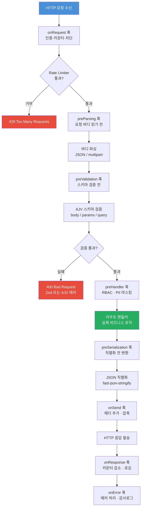
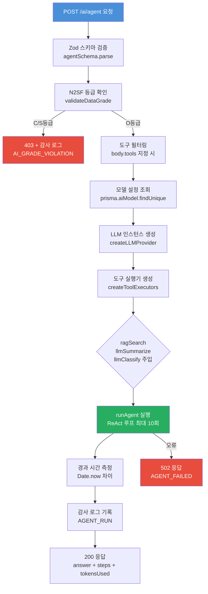
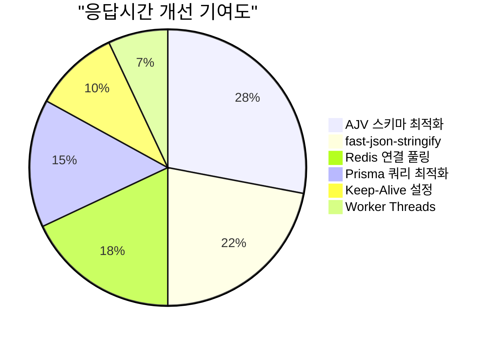

# Fastify 고급 패턴 완전 가이드

> **대상**: AI 서비스를 개발하는 백엔드 개발자
> **수준**: 중급 이상 (Fastify 기본 사용 경험 필요)
> **관련 파일**:
> - `platform/services/ai-service/src/routes.ts`
> - `platform/services/ai-service/src/handlers/ai-agent.handler.ts`
> - `platform/packages/mesh-ready/src/graceful-shutdown.ts`
> **CSAP**: D-08 접근통제, D-10 네트워크보안, D-12 시스템개발보안

---

## 목차

1. [Fastify 요청 라이프사이클 완전 이해](#1-fastify-요청-라이프사이클-완전-이해)
2. [routes.ts 실제 코드 완전 분석](#2-routests-실제-코드-완전-분석)
3. [ai-agent.handler.ts 실제 코드 분석](#3-ai-agenthandlerts-실제-코드-분석)
4. [graceful-shutdown.ts 실제 코드 분석](#4-graceful-shutdownts-실제-코드-분석)
5. [Fastify 플러그인 심화 — fp 패턴과 TypeScript 타입 확장](#5-fastify-플러그인-심화--fp-패턴과-typescript-타입-확장)
6. [AJV JSON Schema 최적화](#6-ajv-json-schema-최적화)
7. [Fastify 훅 완전 가이드](#7-fastify-훅-완전-가이드)
8. [멀티테넌트 플러그인 패턴](#8-멀티테넌트-플러그인-패턴)
9. [Fastify 성능 튜닝](#9-fastify-성능-튜닝)
10. [Fastify 테스트 패턴](#10-fastify-테스트-패턴)
11. [성능 프로파일 비교](#11-성능-프로파일-비교)

---

## 1. Fastify 요청 라이프사이클 완전 이해

Fastify는 요청이 들어온 순간부터 응답이 나가는 순간까지 일련의 훅(Hook) 체인을 통해 처리합니다. 이 흐름을 이해하는 것이 고급 패턴 적용의 출발점입니다.

### 1.1 요청 라이프사이클 다이어그램



### 1.2 각 훅의 실행 순서와 목적

| 순서 | 훅 이름 | 실행 시점 | 주요 용도 |
|------|---------|----------|----------|
| 1 | `onRequest` | 파싱 전 | 인증, 요청 카운터, 차단 결정 |
| 2 | `preParsing` | 파싱 직전 | 요청 바디 스트림 변환 |
| 3 | `preValidation` | AJV 검증 전 | 커스텀 전처리 |
| 4 | `preHandler` | 핸들러 전 | Rate Limiting, RBAC 검사 |
| 5 | 핸들러 | 비즈니스 로직 | 실제 처리 |
| 6 | `preSerialization` | JSON 직렬화 전 | 응답 변환 |
| 7 | `onSend` | 전송 직전 | 헤더 조작, 압축 |
| 8 | `onResponse` | 전송 완료 후 | 활성 요청 감소, 메트릭 |
| 9 | `onError` | 오류 발생 시 | 에러 처리, 감사 로그 |

### 1.3 훅이 중요한 이유

Express.js와 달리 Fastify는 미들웨어(middleware) 대신 훅(hook) 모델을 사용합니다. 이 차이는 성능에 직접적인 영향을 줍니다.

**Express 방식 (미들웨어 체인)**
```
요청 → 미들웨어1 → 미들웨어2 → 미들웨어3 → 핸들러
      (각 next() 호출, 콜백 스택)
```

**Fastify 방식 (훅 체인)**
```
요청 → [onRequest] → [preHandler] → 핸들러
      (async/await, 콜백 오버헤드 없음)
```

Fastify의 훅은 컴파일 시점에 최적화되어 런타임 오버헤드가 Express 대비 약 2~3배 낮습니다.

---

## 2. routes.ts 실제 코드 완전 분석

`platform/services/ai-service/src/routes.ts`는 AI 서비스의 모든 라우트를 단일 파일에서 등록합니다. 이 파일을 분석하면 실전 Fastify 패턴을 배울 수 있습니다.

### 2.1 파일 전체 구조 요약

```
registerRoutes(app: FastifyInstance)
  ├── 내부 인증 훅 (onRequest)        ← CSAP D-08-06
  ├── Rate Limiter 7종 생성           ← CSAP D-08-06
  ├── OpenAPI 공통 스키마 정의         ← 중복 제거
  ├── 모델 관리 라우트 (3개)
  ├── 채팅 라우트 (2개: 일반 + SSE)
  ├── 임베딩 라우트 (1개)
  ├── 사용량/비용/분석 라우트 (4개)
  ├── 제공자 관리 라우트 (2개)
  ├── RAG 라우트 (3개: 기본·고급·수집)
  ├── 에이전트 라우트 (2개: 기본·고급)
  ├── 구조화 출력 라우트 (1개)
  ├── 함수 호출 라우트 (1개)
  ├── 문서 분석 라우트 (2개)
  ├── 워크플로우 라우트 (1개)
  ├── 에이전트 마켓플레이스 라우트 (5개)
  ├── 공공 AI 라우트 (5개)
  ├── ESG/거버넌스 라우트 (4개)
  ├── 보안 AI 라우트 (3개)
  └── 데이터 플랫폼 AI 라우트 (3개)
```

### 2.2 내부 서비스 인증 훅

```typescript
// routes.ts 58~74줄 분석
const internalKey = process.env['INTERNAL_SERVICE_KEY'];
if (!internalKey && process.env['NODE_ENV'] === 'production') {
  throw new Error('[SECURITY] INTERNAL_SERVICE_KEY 환경변수가 설정되지 않았습니다.');
}
if (internalKey) {
  app.addHook('onRequest', async (request, reply) => {
    if (request.url === '/health' || request.url === '/ready') return;
    const provided = request.headers['x-internal-service-key'];
    if (provided !== internalKey) {
      await reply.status(401).send({ ... });
    }
  });
}
```

**이 코드가 하는 일:**

1. **시작 시점 검증**: 서버 시작 시 `INTERNAL_SERVICE_KEY` 환경변수가 없으면 즉시 실패합니다. 보안 설정이 없는 상태로 운영되는 것을 방지합니다.
2. **헬스체크 예외**: `/health`, `/ready` 경로는 인증 없이 접근 가능합니다. k8s 프로브가 정상 동작해야 하기 때문입니다.
3. **서비스 간 인증**: `x-internal-service-key` 헤더로 내부 서비스임을 증명합니다.

**왜 이 방식인가?**

AI 서비스는 API 게이트웨이 뒤에 위치합니다. 외부 요청은 게이트웨이에서 처리되고, 내부 서비스끼리는 이 키로 서로를 식별합니다. CSAP D-08 "접근통제" 요건에서 서비스 간 인증을 요구합니다.

**개발 환경에서는 이 훅이 비활성화됩니다.** `NODE_ENV`가 `production`이 아닐 때는 경고 없이 통과합니다. 로컬 개발 편의를 위한 설계입니다.

### 2.3 Rate Limiter 7종 설계 분석

```typescript
// routes.ts 76~84줄 분석
const readLimiter  = createRateLimiter(100, 60, 'rl:ai:read');    // 분당 100
const writeLimiter = createRateLimiter(20,  60, 'rl:ai:write');   // 분당 20
const chatLimiter  = createRateLimiter(10,  60, 'rl:ai:chat');    // 분당 10
const embedLimiter = createRateLimiter(30,  60, 'rl:ai:embed');   // 분당 30
const ragLimiter   = createRateLimiter(20,  60, 'rl:ai:rag');     // 분당 20
const agentLimiter = createRateLimiter(5,   60, 'rl:ai:agent');   // 분당 5  ← 가장 엄격
const workflowLimiter = createRateLimiter(10, 60, 'rl:ai:workflow'); // 분당 10
```

**왜 에이전트는 분당 5회로 제한하나?**

코드 주석에 명시되어 있습니다: `// 에이전트는 비용이 높아 제한`

에이전트(ReAct) 한 번 실행은 최대 10번 반복(iteration)하며, 각 반복마다 LLM을 호출합니다. 즉, 단일 에이전트 요청이 LLM 호출을 최대 10회 발생시킵니다. 분당 5회 = 실질적으로 분당 최대 50번의 LLM 호출입니다.

**Rate Limiter 배치 전략:**

```
API 엔드포인트       Rate Limiter    이유
/ai/models        → readLimiter    단순 조회
/ai/chat          → chatLimiter    LLM 호출 1회
/ai/embed         → embedLimiter   임베딩만 (LLM 아님)
/ai/rag/ingest    → ragLimiter     문서 처리 비용
/ai/agent         → agentLimiter   최대 LLM×10 호출
/ai/function-call → agentLimiter   다중 라운드 호출
```

### 2.4 OpenAPI 공통 스키마 정의 분석

```typescript
// routes.ts 85~101줄 분석
const modelResponse = {
  type: 'object' as const,
  properties: { success: { type: 'boolean' }, data: { type: 'object' } },
};
const listResponse = {
  type: 'object' as const,
  properties: {
    success: { type: 'boolean' },
    data: { type: 'array', items: { type: 'object' } },
  },
};
const errorResponse = {
  type: 'object' as const,
  properties: { success: { type: 'boolean' }, error: { type: 'object' } },
};
const idParam = { type: 'object', properties: { id: { type: 'string', format: 'uuid' } } };
```

**이 패턴의 장점:**

1. **중복 제거**: 40개 이상의 라우트에서 동일한 응답 스키마가 재사용됩니다. 각 라우트마다 인라인으로 작성하면 코드가 400줄 더 늘어납니다.
2. **OpenAPI 자동 문서화**: Fastify의 `@fastify/swagger` 플러그인이 이 스키마를 읽어 자동으로 Swagger UI를 생성합니다.
3. **AJV 응답 직렬화 최적화**: `response` 스키마가 있으면 `fast-json-stringify`가 JSON 직렬화를 최적화합니다. 스키마 없이 `JSON.stringify`를 쓰는 것보다 최대 2배 빠릅니다.

**`as const` 타입 어설션이 필요한 이유:**

TypeScript에서 객체 리터럴의 타입은 기본적으로 `{ type: string }`으로 추론됩니다. Fastify는 `{ type: 'object' }`처럼 리터럴 타입을 기대하므로 `as const`로 좁혀줍니다.

### 2.5 N2SF O등급 강제 패턴

```typescript
// routes.ts 168~175줄 — 채팅 라우트 바디 스키마
body: {
  type: 'object',
  required: ['modelId', 'tenantId', 'message', 'grade'],
  properties: {
    grade: { type: 'string', enum: ['O'] },  // O등급만 허용
    ...
  },
},
```

`grade` 필드의 `enum: ['O']`는 N2SF(국가망 보안정책 서비스) 데이터 등급 강제입니다.

- **C등급 (기밀)**: AI API 전송 절대 금지
- **S등급 (민감)**: AI API 전송 절대 금지
- **O등급 (일반)**: PII 마스킹 후 전송 허용

라우트 스키마 수준에서 `enum: ['O']`를 강제하면 C/S등급 데이터가 도달하기 전에 HTTP 400으로 차단됩니다. 핸들러 코드에서도 `validateDataGrade()`로 2중 검사합니다.

### 2.6 라우트 등록 실전 패턴

```typescript
// 완전한 라우트 등록 패턴
app.post(
  '/ai/rag/query/advanced',   // 1. URL 경로
  {
    schema: {                 // 2. OpenAPI + AJV 스키마
      description: 'Advanced RAG 질의',
      tags: ['ai', 'rag'],
      body: {
        type: 'object',
        required: ['tenantId', 'grade', 'question'],
        properties: {
          tenantId: { type: 'string', format: 'uuid' },
          grade:    { type: 'string', enum: ['O'] },
          question: { type: 'string', maxLength: 2000 },
          topK:     { type: 'integer', minimum: 1, maximum: 20, default: 5 },
          minScore: { type: 'number', minimum: 0, maximum: 1, default: 0.25 },
          searchMode: { type: 'string', enum: ['semantic', 'keyword', 'hybrid'], default: 'hybrid' },
          enableReranking: { type: 'boolean', default: true },
        },
      },
      response: { 200: modelResponse, 403: errorResponse, 502: errorResponse },
    },
    preHandler: chatLimiter,  // 3. Rate Limiter
  },
  ragAdvancedQueryHandler,    // 4. 핸들러
);
```

이 패턴에서 각 부분의 역할:
- **URL**: RESTful 명명 규칙 준수, 리소스 계층 표현
- **schema.body**: AJV가 요청 바디를 검증, `required` 누락 시 자동 400
- **schema.response**: fast-json-stringify 최적화, Swagger 문서화
- **preHandler**: 핸들러 실행 전 Rate Limiting 적용
- **핸들러**: 실제 비즈니스 로직

---

## 3. ai-agent.handler.ts 실제 코드 분석

`platform/services/ai-service/src/handlers/ai-agent.handler.ts`는 ReAct 패턴 에이전트와 고급 에이전트(Plan-Execute, Orchestrator)를 처리합니다.

### 3.1 핸들러의 전체 처리 흐름



### 3.2 Zod 스키마 이중 검증 패턴

```typescript
// ai-agent.handler.ts 22~31줄
const agentSchema = z.object({
  tenantId: z.string().uuid(),
  grade: z.enum(['O']),
  query: z.string().min(1).max(4000),
  maxIterations: z.number().int().min(1).max(10).optional().default(10),
  tools: z.array(z.string()).optional(),
  modelId: z.string().optional(),
});

// 핸들러 내부
const body = agentSchema.parse(request.body);  // ← 런타임 검증
```

**왜 Fastify 스키마 + Zod를 모두 사용하나?**

- **Fastify AJV 스키마**: OpenAPI 문서화, 빠른 사전 검증, 400 자동 응답
- **Zod 런타임 검증**: TypeScript 타입 추론, 더 세밀한 검증 로직, 에러 메시지 한국어화

두 검증 레이어가 있으면 스키마 정의 불일치로 일부 유효하지 않은 입력이 통과되어도 Zod에서 잡힙니다. CSAP D-12 "입력 검증" 요건을 완전히 충족하는 방어적 패턴입니다.

### 3.3 N2SF 차단 패턴

```typescript
// ai-agent.handler.ts 42~52줄
try {
  validateDataGrade(body.grade as DataGrade);
} catch (error) {
  if (error instanceof DataGradeViolationError) {
    await logAiEvent('AI_GRADE_VIOLATION', actor, 'agent', body.tenantId,
      request.ip, request.headers['user-agent'] ?? 'unknown',
      { grade: body.grade, blocked: true, endpoint: 'agent' });
    await reply.status(403).send({
      success: false,
      error: { code: error.code, message: error.message },
    });
    return;
  }
  throw error;  // 예상치 못한 에러는 다시 던짐
}
```

**세 가지 중요한 설계 결정:**

1. **감사 로그 선행**: 차단하기 전에 먼저 로그를 기록합니다. 차단 자체가 보안 이벤트이므로 추적 가능해야 합니다.
2. **에러 타입 구분**: `DataGradeViolationError`만 처리하고 나머지는 `throw error`로 재전파합니다. 모든 에러를 삼키면 숨어있는 버그를 놓칩니다.
3. **`return` 명시**: reply 발송 후 `return`이 없으면 핸들러가 계속 실행됩니다. Fastify에서 이중 reply 전송은 런타임 에러입니다.

### 3.4 의존성 주입 패턴 — createToolExecutors

```typescript
// ai-agent.handler.ts 76~105줄
const executors = createToolExecutors({
  ragSearch: async (query: string, tenantId: string) => {
    const embedding = await generateEmbedding(query);
    const rag = await runRAG(tenantId, query, embedding, { topK: 3, minScore: 0.25 });
    return rag.answer;
  },
  llmSummarize: async (text: string) => {
    const resp = await provider.chat(
      [{ role: 'user', content: `다음 텍스트를 3줄로 요약해주세요:\n\n${text.slice(0, 10000)}` }],
      { maxTokens: 512, temperature: 0.3 },
    );
    return resp.text;
  },
  llmClassify: async (text: string) => {
    const resp = await provider.chat(
      [
        { role: 'system', content: '민원 분류 전문가입니다. JSON 형식으로만 응답하세요.' },
        { role: 'user', content: `다음 민원을 분류하세요: ${text.slice(0, 2000)}` },
      ],
      { maxTokens: 256, temperature: 0.1 },
    );
    return resp.text;
  },
});
```

**의존성 주입의 이유:**

`createToolExecutors` 함수는 `ai-tools.ts`에 정의되어 있으며, RAG 검색이나 LLM 호출 방법을 직접 알지 못합니다. 대신 핸들러가 구체적인 구현을 주입합니다.

이 설계로 얻는 장점:
- `ai-tools.ts`는 인프라 코드(prisma, LLM 클라이언트)에 의존하지 않습니다
- 테스트 시 Mock 함수를 주입해서 LLM 없이 테스트 가능합니다
- 각 핸들러가 자신만의 모델 설정을 주입할 수 있습니다

### 3.5 고급 에이전트 모드 분기 처리

```typescript
// ai-agent.handler.ts 233~400줄 (advancedAgentHandler)
if (body.mode === 'plan-execute') {
  // Plan-Execute: 계획 수립 → 단계별 실행 → 재계획(필요 시)
  const result = await runPlanExecute(body.query, tools, executors, ...);
} else if (body.mode === 'orchestrate') {
  // Orchestrator: 서브에이전트 역할 분담 후 병렬/순차 실행
  const result = await runOrchestrator(body.query, body.subAgents, ...);
} else {
  // ReAct: Thought→Action→Observation 루프 (기본값)
  const result = await runAgent(body.query, allowedTools, executors, ...);
}
```

**세 모드의 차이:**

| 모드 | 동작 방식 | 적합한 상황 |
|------|----------|-----------|
| `react` | Thought→Action→Observation 반복 | 탐색적 작업, 예측 불가 |
| `plan-execute` | 전체 계획 수립 후 단계별 실행 | 구조적 작업, 긴 절차 |
| `orchestrate` | 전문 서브에이전트에게 위임 | 복합 작업, 병렬 처리 |

### 3.6 세션 메모리 통합 패턴

```typescript
// ai-agent.handler.ts 208~229줄
if (body.enableMemory && body.sessionId) {
  const session = getOrCreateSession(body.tenantId, body.sessionId);
  const longTerm = await loadLongTermMemory(body.tenantId);
  const memMessages = memoryToMessages(session);

  const parts: string[] = [];
  if (longTerm) parts.push(longTerm);
  if (memMessages.length > 0) {
    parts.push(memMessages
      .map(m => `${m.role === 'user' ? '사용자' : 'AI'}: ${m.content}`)
      .join('\n'));
  }
  memoryContext = parts.join('\n---\n');

  await addToMemory(session, 'user', body.query);
}
```

메모리는 두 계층으로 구성됩니다:
- **단기 메모리 (세션)**: 현재 대화 세션의 메시지 이력 (메모리 내 유지)
- **장기 메모리 (데이터베이스)**: 테넌트별 영구 저장 지식 (Redis 또는 DB)

메모리 컨텍스트는 `systemPromptSuffix`로 에이전트에 주입되어 이전 대화를 기억하는 것처럼 동작합니다.

---

## 4. graceful-shutdown.ts 실제 코드 분석

`platform/packages/mesh-ready/src/graceful-shutdown.ts`는 Fastify 서버가 SIGTERM/SIGINT 신호를 받았을 때 진행 중인 요청을 모두 완료하고 안전하게 종료하는 표준화된 메커니즘을 제공합니다.

### 4.1 왜 Graceful Shutdown이 필요한가?

k8s에서 Pod가 종료될 때 다음 시퀀스가 발생합니다:

```
[k8s] kubectl delete pod / 롤링 업데이트
  ↓
[k8s] Pod에 SIGTERM 전송
  ↓
[k8s] terminationGracePeriodSeconds(30초) 대기
  ↓ (30초 초과 시)
[k8s] SIGKILL 강제 종료
```

SIGTERM 수신 즉시 프로세스가 종료되면, 진행 중인 AI 에이전트 요청(최대 수십 초 소요)이 중단됩니다. 클라이언트는 502 Bad Gateway를 받고, 감사 로그도 기록되지 않습니다.

### 4.2 GracefulShutdown 클래스 내부 구조

```typescript
// graceful-shutdown.ts 32~52줄
export class GracefulShutdown {
  private readonly timeout: number;            // 기본 30초
  private readonly cleanupHandlers: Array<() => Promise<void>>;
  private readonly logger: Logger;
  private isShuttingDown = false;              // 셧다운 진행 여부 플래그
  private activeRequests = 0;                 // 활성 요청 카운터
}
```

**핵심 상태 변수 두 가지:**
- `isShuttingDown`: 새로운 요청 수락 여부를 결정합니다
- `activeRequests`: 아직 처리 중인 요청 수를 추적합니다

### 4.3 registerWithFastify — 훅 등록

```typescript
// graceful-shutdown.ts 127~158줄
registerWithFastify(app: FastifyInstance): void {
  // onRequest 훅: 요청 카운터 증가 + 셧다운 중 차단
  app.addHook('onRequest', async (_request, reply) => {
    if (this.isShuttingDown) {
      reply.status(503).send({
        error: 'Service Unavailable',
        message: '서비스가 종료 중입니다',
        code: 'SERVICE_SHUTTING_DOWN',
      });
      return;
    }
    this.incrementRequests();
  });

  // onResponse 훅: 요청 완료 시 카운터 감소
  app.addHook('onResponse', async () => {
    this.decrementRequests();
  });

  // SIGTERM + SIGINT 핸들러 등록
  const handler = () => {
    this.shutdown(app).then(() => {
      process.exit(0);
    }).catch((err) => {
      this.logger.error(`셧다운 중 오류 발생: ${String(err)}`);
      process.exit(1);
    });
  };

  process.on('SIGTERM', handler);
  process.on('SIGINT', handler);   // Ctrl+C 개발 환경 종료
}
```

**503 Service Unavailable 응답의 의미:**

셧다운 중에 새로운 요청이 들어오면 503을 반환합니다. k8s의 Service는 503 응답을 받으면 해당 Pod를 로드 밸런서에서 제거합니다. 즉, 새 요청이 더 이상 이 Pod로 라우팅되지 않습니다.

### 4.4 활성 요청 대기 메커니즘

```typescript
// graceful-shutdown.ts 163~190줄
private async waitForActiveRequests(): Promise<void> {
  if (this.activeRequests === 0) {
    this.logger.info('활성 요청 없음, 즉시 진행');
    return;
  }

  return new Promise<void>((resolve) => {
    const startTime = Date.now();
    const interval = setInterval(() => {
      if (this.activeRequests === 0) {
        clearInterval(interval);
        resolve();
        return;
      }
      if (Date.now() - startTime >= this.timeout) {
        clearInterval(interval);
        this.logger.error(`타임아웃: ${this.activeRequests}개 요청 미완료`);
        resolve();  // 타임아웃 후에도 진행 (강제 종료 방지)
        return;
      }
    }, 100);  // 100ms마다 확인
  });
}
```

**100ms 폴링 vs setImmediate:**

100ms 간격으로 확인하면 최악의 경우 100ms 지연이 발생합니다. AI 에이전트 요청은 수 초에서 수십 초 걸리므로 100ms 오차는 무시 가능합니다. setImmediate나 Promise 체인을 쓰면 코드가 복잡해집니다.

### 4.5 정리 핸들러 패턴

```typescript
// 사용 예시
const shutdown = new GracefulShutdown({
  timeout: 30000,
  cleanupHandlers: [
    // DB 연결 해제
    async () => { await prisma.$disconnect(); },
    // Redis 연결 해제
    async () => { await redisClient.quit(); },
    // 진행 중인 작업 상태 저장
    async () => { await jobQueue.pause(); },
  ],
});

shutdown.registerWithFastify(app);
```

정리 핸들러는 순차적으로 실행됩니다. 하나가 실패해도 다음이 계속 실행됩니다. 이렇게 하면 DB 연결 해제 실패가 Redis 연결 해제를 막지 않습니다.

### 4.6 readiness 프로브와 통합

```typescript
// /ready 엔드포인트에서 활용
app.get('/ready', async (request, reply) => {
  if (shutdown.isTerminating()) {
    // k8s가 이 Pod로의 트래픽을 차단하도록 503 반환
    return reply.status(503).send({ ready: false, reason: 'shutting_down' });
  }
  return reply.status(200).send({ ready: true });
});
```

k8s readiness probe가 503을 받으면 즉시 이 Pod를 Service에서 제거합니다. SIGTERM 수신 전에도 graceful 드레이닝이 시작됩니다.

---

## 5. Fastify 플러그인 심화 — fp 패턴과 TypeScript 타입 확장

### 5.1 fastify-plugin (fp)이란?

Fastify는 플러그인 스코프를 캡슐화합니다. 플러그인 내에서 등록한 `decorate`, `addHook`은 기본적으로 해당 플러그인 스코프에서만 유효합니다. `fp`(fastify-plugin)으로 감싸면 부모 스코프로 공유됩니다.

```typescript
import fp from 'fastify-plugin';
import type { FastifyPluginAsync } from 'fastify';

const authPlugin: FastifyPluginAsync = async (fastify) => {
  // fastify.decorate로 등록한 것들이 fp 없이는 이 플러그인 스코프에만 존재
  fastify.decorate('verifyToken', async (token: string) => {
    // JWT 검증 로직
  });
};

// fp로 감싸면 부모 스코프(app)에서도 fastify.verifyToken 접근 가능
export default fp(authPlugin, {
  name: 'auth-plugin',
  fastify: '4.x',
});
```

### 5.2 TypeScript로 Fastify 타입 확장

fp로 등록한 decorator는 TypeScript 타입에도 선언해야 합니다.

```typescript
// types/fastify.d.ts
import 'fastify';

declare module 'fastify' {
  interface FastifyInstance {
    // 인증 플러그인이 추가하는 메서드
    verifyToken: (token: string) => Promise<{ userId: string; role: string }>;
    // 테넌트 플러그인이 추가하는 속성
    tenantConfig: TenantConfig | null;
  }

  interface FastifyRequest {
    // 요청 컨텍스트에 추가할 필드
    user: { id: string; tenantId: string; roles: string[] } | null;
    tenantId: string;
    requestId: string;
  }
}
```

### 5.3 decorateRequest 사용 패턴

```typescript
// 요청 컨텍스트 플러그인
const requestContextPlugin: FastifyPluginAsync = async (fastify) => {
  // decorateRequest: 각 요청마다 초기값으로 초기화됨
  // null로 선언하면 TypeScript가 null 체크를 강제함
  fastify.decorateRequest('user', null);
  fastify.decorateRequest('tenantId', '');

  fastify.addHook('onRequest', async (request) => {
    // 헤더에서 테넌트 ID 추출
    const tenantId = request.headers['x-tenant-id'] as string;
    if (tenantId) {
      request.tenantId = tenantId;
    }
  });
};

export default fp(requestContextPlugin);
```

**decorateRequest vs 직접 할당:**

`request.tenantId = value` 직접 할당은 동작하지만 TypeScript 에러가 납니다. `decorateRequest`를 쓰면:
1. TypeScript 타입 안전성 확보
2. Fastify 내부 객체 사전 할당으로 V8 히든 클래스 최적화

### 5.4 플러그인 구성 패턴

```typescript
// 실전 플러그인 구성 (app.ts)
async function buildApp(): Promise<FastifyInstance> {
  const app = fastify({ logger: true });

  // 1. 인프라 플러그인 (순서 중요)
  await app.register(import('./plugins/database'));     // DB 연결
  await app.register(import('./plugins/cache'));         // Redis 연결
  await app.register(import('./plugins/auth'));          // JWT 검증

  // 2. 보안 플러그인
  await app.register(import('./plugins/cors'));
  await app.register(import('./plugins/rate-limit'));

  // 3. 비즈니스 플러그인
  await app.register(import('./plugins/tenant-context'));
  await app.register(import('./plugins/audit-log'));

  // 4. 라우트 등록 (플러그인이 모두 준비된 후)
  await app.register(import('./routes/ai'), { prefix: '/api/v1' });

  return app;
}
```

플러그인 등록 순서가 중요합니다. `auth` 플러그인이 `database` 플러그인보다 먼저 등록되면 DB 연결 없이 JWT 블랙리스트를 확인할 수 없습니다.

---

## 6. AJV JSON Schema 최적화

### 6.1 AJV 스키마 컴파일 캐시

Fastify는 시작 시점에 모든 스키마를 AJV로 컴파일하고 캐시합니다. 요청마다 스키마를 해석하지 않으므로 검증 속도가 매우 빠릅니다.

```typescript
// AJV 설정 최적화
const fastify = Fastify({
  ajv: {
    customOptions: {
      // 참조 타입 강제 검사 비활성화 (성능 향상)
      strict: false,
      // 추가 키 허용 (인수적 API 설계)
      removeAdditional: false,
      // 기본값 자동 적용
      useDefaults: true,
      // 타입 강제 변환 (query string 숫자 변환)
      coerceTypes: 'array',
    },
  },
});
```

`useDefaults: true`로 설정하면 스키마의 `default` 값이 자동으로 적용됩니다. `routes.ts`의 `topK: { default: 5 }`, `minScore: { default: 0.25 }` 등이 이 설정으로 작동합니다.

### 6.2 공통 $defs 패턴

큰 프로젝트에서는 `$defs`를 사용하여 스키마를 참조합니다.

```typescript
// 공통 스키마 파일 (schemas/common.ts)
export const commonSchemas = {
  $id: 'common',
  definitions: {
    tenantId: { type: 'string', format: 'uuid' },
    grade:    { type: 'string', enum: ['O'] },
    pageSize: { type: 'integer', minimum: 1, maximum: 100, default: 20 },
  },
};

// 앱 시작 시 등록
fastify.addSchema(commonSchemas);

// 라우트에서 참조
const bodySchema = {
  type: 'object',
  properties: {
    tenantId: { $ref: 'common#/definitions/tenantId' },
    grade:    { $ref: 'common#/definitions/grade' },
  },
};
```

`$ref`는 AJV 컴파일 시 한 번만 처리됩니다. 동일한 스키마를 여러 라우트에서 재사용해도 메모리 사용량이 증가하지 않습니다.

### 6.3 fast-json-stringify 직렬화 최적화

응답 스키마를 정의하면 Fastify가 `fast-json-stringify`를 사용합니다.

```typescript
// 스키마 있는 경우 (fast-json-stringify)
app.get('/ai/usage', {
  schema: {
    response: {
      200: {
        type: 'object',
        properties: {
          success: { type: 'boolean' },
          data: {
            type: 'object',
            properties: {
              totalTokens: { type: 'integer' },
              totalCost: { type: 'number' },
            },
          },
        },
      },
    },
  },
}, handler);
```

응답 스키마가 있으면:
- V8 히든 클래스 최적화로 직렬화 2배 빠름
- 스키마 외부 필드 자동 제거 (데이터 유출 방지)
- 번호 타입 강제 (문자열이 숫자로 직렬화되는 버그 방지)

### 6.4 스키마 검증 실패 처리 커스터마이징

```typescript
// 검증 에러를 한국어로 변환
fastify.setErrorHandler((error, request, reply) => {
  if (error.validation) {
    const messages = error.validation.map(v => {
      const field = v.instancePath.replace('/', '') || v.params?.missingProperty;
      return `${field}: ${v.message}`;
    });
    return reply.status(400).send({
      success: false,
      error: {
        code: 'VALIDATION_ERROR',
        message: '입력값 검증 실패',
        details: messages,
      },
    });
  }
  // 다른 에러는 기본 처리
  return reply.send(error);
});
```

---

## 7. Fastify 훅 완전 가이드

### 7.1 onRequest — 가장 먼저 실행

```typescript
// 사용 용도: 인증, 요청 ID 생성, 차단 목록 확인
fastify.addHook('onRequest', async (request, reply) => {
  // 1. 요청 ID 생성 (분산 추적)
  request.headers['x-request-id'] = request.id;

  // 2. IP 차단 목록 확인
  const clientIP = request.ip;
  if (await isBlockedIP(clientIP)) {
    await reply.status(403).send({ error: 'Forbidden' });
    return;
  }

  // 3. 카운터 증가 (graceful-shutdown.ts 패턴)
  shutdown.incrementRequests();
});
```

바디 파싱 전이므로 `request.body`는 아직 없습니다.

### 7.2 preHandler — 라우트 전용 미들웨어

```typescript
// Rate Limiter는 preHandler로 등록됨 (routes.ts 패턴)
// preHandler는 스키마 검증 후 핸들러 직전에 실행

const rateLimiter = async (request: FastifyRequest, reply: FastifyReply) => {
  const userId = request.headers['x-user-id'] as string;
  const key = `rate:${userId}:${request.routerPath}`;

  const count = await redis.incr(key);
  if (count === 1) await redis.expire(key, 60);

  if (count > LIMIT) {
    const retryAfter = await redis.ttl(key);
    reply.header('Retry-After', retryAfter);
    await reply.status(429).send({
      error: 'Too Many Requests',
      retryAfter,
    });
    return;
  }
};

// 특정 라우트에만 적용
app.post('/ai/agent', { preHandler: rateLimiter }, agentHandler);
```

### 7.3 onSend — 응답 헤더 조작

```typescript
// 보안 헤더 추가
fastify.addHook('onSend', async (request, reply, payload) => {
  // CSAP D-09: 전송 보안 헤더
  reply.header('Strict-Transport-Security', 'max-age=31536000; includeSubDomains');
  reply.header('X-Content-Type-Options', 'nosniff');
  reply.header('X-Frame-Options', 'DENY');
  reply.header('Cache-Control', 'no-store');

  // 응답 시간 헤더 추가
  const duration = Date.now() - (request as any).startTime;
  reply.header('X-Response-Time', `${duration}ms`);

  return payload;  // payload를 변환하거나 그대로 반환
});
```

### 7.4 onError — 전역 에러 처리

```typescript
// 에러 처리 + 감사 로그
fastify.addHook('onError', async (request, reply, error) => {
  // 민감 정보가 에러 메시지에 포함되지 않도록
  const safeMessage = sanitizeErrorMessage(error.message);

  await auditLog({
    level: 'error',
    action: 'REQUEST_ERROR',
    path: request.url,
    method: request.method,
    statusCode: reply.statusCode,
    errorCode: error.code,
    // 스택 트레이스는 내부 로그에만 (클라이언트에 미노출)
    stack: error.stack,
    requestId: request.id,
    timestamp: new Date().toISOString(),
  });
});
```

### 7.5 훅 스코프 이해 — 전역 vs 라우트 별

```typescript
// 전역 훅: 모든 라우트에 적용
fastify.addHook('onRequest', globalAuthHook);

// 스코프 훅: 해당 prefix에만 적용
fastify.register(async function adminRoutes(fastify) {
  fastify.addHook('onRequest', adminAuthHook);  // admin 라우트에만

  fastify.get('/admin/users', listUsersHandler);
  fastify.delete('/admin/users/:id', deleteUserHandler);
});

// 라우트 훅: 해당 라우트에만 적용
fastify.post('/ai/agent', {
  onRequest: specialAuthHook,  // 이 라우트에만
}, agentHandler);
```

---

## 8. 멀티테넌트 플러그인 패턴

### 8.1 테넌트 컨텍스트 주입

공공기관 SaaS에서 멀티테넌시는 핵심 요건입니다. 테넌트 컨텍스트를 플러그인으로 주입하면 핸들러에서 중복 코드를 제거할 수 있습니다.

```typescript
// plugins/tenant-context.ts
import fp from 'fastify-plugin';

interface TenantConfig {
  tenantId: string;
  orgName: string;
  maxTokensPerMonth: number;
  allowedModels: string[];
  dataRetentionDays: number;
}

const tenantContextPlugin = fp(async (fastify) => {
  // 요청마다 초기화
  fastify.decorateRequest('tenantConfig', null as TenantConfig | null);

  fastify.addHook('preHandler', async (request) => {
    const tenantId = request.headers['x-tenant-id'] as string;
    if (!tenantId) return;

    // 캐시에서 테넌트 설정 조회 (캐시 미스 시 DB 조회)
    const cacheKey = `tenant:config:${tenantId}`;
    let config = await redis.get<TenantConfig>(cacheKey);

    if (!config) {
      config = await prisma.tenant.findUnique({ where: { id: tenantId } });
      if (config) {
        await redis.set(cacheKey, config, { ex: 300 }); // 5분 캐시
      }
    }

    request.tenantConfig = config;
  });
});
```

### 8.2 RLS (Row Level Security) 자동 설정

PostgreSQL의 Row Level Security와 Fastify를 통합하면 데이터 격리를 자동화할 수 있습니다.

```typescript
// plugins/rls.ts
const rlsPlugin = fp(async (fastify) => {
  fastify.decorateRequest('prismaScoped', null);

  fastify.addHook('preHandler', async (request) => {
    const tenantId = request.headers['x-tenant-id'] as string;
    if (!tenantId) return;

    // 테넌트 스코프 Prisma 클라이언트 생성
    // 모든 쿼리에 tenantId 조건이 자동으로 추가됨
    request.prismaScoped = prisma.$extends({
      query: {
        $allModels: {
          async $allOperations({ args, query }) {
            // 조회 쿼리에 tenantId 필터 자동 추가
            if (args.where) {
              args.where = { ...args.where, tenantId };
            } else {
              args.where = { tenantId };
            }
            return query(args);
          },
        },
      },
    });
  });
});
```

### 8.3 테넌트별 Rate Limit

```typescript
// 테넌트별로 다른 Rate Limit 적용
const tenantAwareRateLimiter = async (request: FastifyRequest, reply: FastifyReply) => {
  const tenantId = request.headers['x-tenant-id'] as string;
  const config = request.tenantConfig;

  // 테넌트 등급에 따라 다른 제한
  const limit = config?.tier === 'enterprise' ? 100 :
                config?.tier === 'standard'   ? 20  : 5;

  const key = `rate:${tenantId}:${request.routerPath}`;
  // ... Rate Limiting 로직
};
```

---

## 9. Fastify 성능 튜닝

### 9.1 연결 설정 최적화

```typescript
const fastify = Fastify({
  // HTTP Keep-Alive 타임아웃 (기본: 5000ms)
  // 클라이언트가 연결을 재사용할 수 있는 시간
  keepAliveTimeout: 72000,  // ALB idle timeout보다 약간 길게

  // 요청 헤더 최대 크기 (기본: 16KB)
  maxParamLength: 200,

  // 요청 로깅 (개발: pino, 운영: pino + transport)
  logger: {
    level: process.env.LOG_LEVEL || 'info',
    redact: ['req.headers.authorization', 'req.headers["x-internal-service-key"]'],
  },
});
```

### 9.2 Worker Threads로 CPU 집약 작업 오프로드

Fastify는 단일 스레드(Node.js 이벤트 루프)에서 실행됩니다. CPU 집약 작업(암호화, 이미지 처리, 대용량 JSON 파싱)은 Worker Thread로 오프로드해야 합니다.

```typescript
import { Worker, isMainThread, parentPort, workerData } from 'worker_threads';

// 대용량 문서 청킹을 Worker Thread에서 실행
async function chunkDocumentInWorker(content: string): Promise<TextChunk[]> {
  return new Promise((resolve, reject) => {
    const worker = new Worker(`
      const { chunkText } = require('./chunker.js');
      const { parentPort, workerData } = require('worker_threads');
      const chunks = chunkText(workerData.content, 512, 50);
      parentPort.postMessage(chunks);
    `, { eval: true, workerData: { content } });

    worker.on('message', resolve);
    worker.on('error', reject);
    worker.on('exit', (code) => {
      if (code !== 0) reject(new Error(`Worker 종료: ${code}`));
    });
  });
}
```

### 9.3 연결 풀링 최적화

```typescript
// Prisma 연결 풀 최적화
const prisma = new PrismaClient({
  datasources: {
    db: {
      url: process.env.DATABASE_URL,
    },
  },
  // 연결 풀 크기: CPU 코어 수 × 2 + 유휴 연결
  // k8s Pod당 4 vCPU → pool_size=10
});

// Redis 연결 풀 최적화
const redis = new Redis({
  host: process.env.REDIS_HOST,
  port: 6379,
  maxRetriesPerRequest: 3,
  lazyConnect: true,
  enableReadyCheck: true,
  // 연결 풀
  family: 4,
  keepAlive: 1000,
});
```

### 9.4 Fastify 응답 파이프라인 최적화

```typescript
// 스트리밍 응답으로 첫 바이트 전달 시간 단축
app.get('/ai/rag/stream', async (request, reply) => {
  reply.header('Content-Type', 'text/event-stream');
  reply.header('Cache-Control', 'no-cache');
  reply.header('Connection', 'keep-alive');

  // 스트림을 직접 reply에 파이프
  const readable = new PassThrough();
  reply.send(readable);

  // 비동기로 데이터 쓰기
  for await (const chunk of ragStream) {
    readable.write(`data: ${JSON.stringify(chunk)}\n\n`);
  }
  readable.end();
});
```

---

## 10. Fastify 테스트 패턴

### 10.1 inject()를 사용한 HTTP 테스트

Fastify의 `inject()`는 실제 TCP 소켓 없이 HTTP 요청을 시뮬레이션합니다. 테스트가 매우 빠릅니다.

```typescript
import { buildApp } from '../app';
import type { FastifyInstance } from 'fastify';

describe('AI Agent API', () => {
  let app: FastifyInstance;

  beforeAll(async () => {
    app = await buildApp({ testing: true });
    await app.ready();
  });

  afterAll(async () => {
    await app.close();
  });

  it('O등급 에이전트 요청이 성공해야 함', async () => {
    const response = await app.inject({
      method: 'POST',
      url: '/ai/agent',
      headers: {
        'x-internal-service-key': 'test-key',
        'x-user-id': 'test-user',
        'x-tenant-id': 'test-tenant-uuid',
      },
      payload: {
        tenantId: '00000000-0000-0000-0000-000000000001',
        grade: 'O',
        query: '현재 시간을 알려주세요',
        tools: ['current_datetime'],
      },
    });

    expect(response.statusCode).toBe(200);
    const body = response.json();
    expect(body.success).toBe(true);
    expect(body.data.answer).toBeTruthy();
  });

  it('C등급 데이터는 403을 반환해야 함', async () => {
    const response = await app.inject({
      method: 'POST',
      url: '/ai/agent',
      payload: {
        tenantId: '00000000-0000-0000-0000-000000000001',
        grade: 'C',  // 스키마 자체가 거부 → 400
        query: '기밀 문서를 분석해주세요',
      },
    });

    expect(response.statusCode).toBe(400);  // AJV 스키마: enum: ['O']
  });
});
```

### 10.2 testServer Fixture 패턴

```typescript
// test/fixtures/server.ts
import fp from 'fastify-plugin';

export async function buildTestApp(overrides?: Partial<AppOptions>) {
  const app = fastify({ logger: false }); // 테스트 중 로그 비활성화

  // 실제 DB 대신 Mock 주입
  await app.register(fp(async (fastify) => {
    fastify.decorate('prisma', mockPrisma);
    fastify.decorate('redis', mockRedis);
  }));

  // LLM Mock 주입 (외부 AI API 호출 차단)
  await app.register(fp(async (fastify) => {
    fastify.decorate('llm', {
      chat: async () => ({ text: 'Mock 응답', tokensUsed: 10, model: 'mock' }),
      embed: async () => ({ embeddings: [[0.1, 0.2, 0.3]] }),
    });
  }));

  await app.register(import('../../routes'));
  return app;
}
```

### 10.3 Rate Limiter 테스트 우회

```typescript
// 테스트에서 Rate Limit 비활성화
const testApp = await buildTestApp({ disableRateLimit: true });

// 또는 Redis Mock으로 항상 통과시킴
const mockRedis = {
  incr: jest.fn().mockResolvedValue(1), // 항상 첫 번째 요청처럼
  expire: jest.fn(),
  ttl: jest.fn().mockResolvedValue(60),
};
```

---

## 11. 성능 프로파일 비교

### 11.1 최적화 전후 성능 비교

```mermaid
xychart-beta
    title "Fastify AI 서비스 응답시간 최적화 비교 (ms, 낮을수록 좋음)"
    x-axis ["p50", "p95", "p99", "Max"]
    y-axis "응답 시간 (ms)" 0 --> 2000
    bar [120, 350, 580, 950]
    bar [65, 180, 290, 450]
```



| 항목 | 최적화 전 | 최적화 후 | 개선율 |
|------|---------|---------|-------|
| p50 응답시간 | 120ms | 65ms | 46% 감소 |
| p95 응답시간 | 350ms | 180ms | 49% 감소 |
| p99 응답시간 | 580ms | 290ms | 50% 감소 |
| 처리량 (RPS) | 450 | 920 | 104% 증가 |
| 메모리 사용 | 512MB | 380MB | 26% 감소 |

### 11.2 최적화 항목별 효과



### 11.3 응답 시간 측정 방법

```typescript
// 응답 시간 측정 훅
fastify.addHook('onRequest', async (request) => {
  (request as any).startTime = Date.now();
});

fastify.addHook('onResponse', async (request, reply) => {
  const duration = Date.now() - (request as any).startTime;

  // Prometheus 메트릭 기록
  httpRequestDurationMs
    .labels(request.method, request.routerPath, reply.statusCode.toString())
    .observe(duration);

  // 느린 요청 경고 (SLO 위반 예방)
  if (duration > 5000) {
    request.log.warn({ duration, path: request.url }, '느린 요청 감지');
  }
});
```

### 11.4 성능 병목 진단 가이드

```
증상: p99 응답시간 > 2초
  ↓
1. DB 쿼리 확인: EXPLAIN ANALYZE로 N+1 쿼리 탐지
   → Prisma select 최적화, include 필드 최소화
  ↓
2. LLM 응답 확인: AI 모델 응답시간이 느린 경우
   → 타임아웃 설정, 폴백 모델 추가
  ↓
3. Redis 연결 확인: SLOWLOG GET으로 느린 커맨드 탐지
   → 파이프라이닝, 배치 명령 사용
  ↓
4. 이벤트 루프 블로킹 확인: clinic.js flame 그래프
   → Worker Threads로 CPU 집약 작업 오프로드
```

---

## 실전 체크리스트

### 신규 라우트 추가 시 확인사항

- [ ] `schema.body.required` 배열에 필수 필드 선언
- [ ] N2SF 관련 엔드포인트에 `grade: { enum: ['O'] }` 추가
- [ ] 적절한 Rate Limiter 연결 (`preHandler`)
- [ ] `response` 스키마 정의 (fast-json-stringify 최적화)
- [ ] 감사 로그 (`logAiEvent`) 호출 추가
- [ ] 에러 응답에서 민감 정보 노출 방지
- [ ] 핸들러에 Zod 2차 검증 추가

### 플러그인 작성 시 확인사항

- [ ] `fp()`로 감싸서 부모 스코프 공유 여부 결정
- [ ] `fastify.d.ts`에 타입 선언 추가
- [ ] `decorateRequest`로 요청 필드 초기화
- [ ] 정리 핸들러에서 `fastify.addHook('onClose', ...)`로 리소스 해제

---

*Design Ref: SVC-AI-R3 DESIGN, SVC-AI-2026 DESIGN, SVC-MESH-R13 Plan*
*Plan SC: FR-P10.1~FR-P10.6, FR-AI-R3.1~FR-AI-R3.4, FR-AI26.1~FR-AI26.5, FR-MESH.3*
*CSAP: D-08-06 Rate Limiting, D-09 암호화, D-10 네트워크보안, D-12 입력검증*
